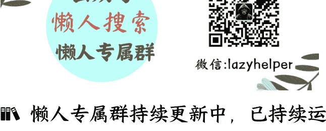

# 舌战背后，新能源车企进入淘汰赛冲刺

250606 蔡钰·商业参考4节选

整理：公众号懒人搜索，懒人专属群独享

懒人微信：lazyhelper


## 不点名的唇枪舌剑

2025年初夏，新能源汽车行业发生了一组诡异的舌战。

先是5月23日，长城汽车董事长魏建军在接受新浪财经采访时，公开批评行业乱象，说了不少狠话。

他说：“现在汽车产业里边的恒大已经出现，只不过没爆而已。”

他还说：“不要让国家这几十年支持起来的汽车工业，这么多年的心血打了水漂。”

他还说：“什么样的工业产品能降十万还能得到质量保证？这是绝对不可能的事。”

他还说：“懂车帝、瓜子、闲鱼你可以看去，有三四千家在卖‘零公里二手车’，是非常乱的。”

他还说：“2025年一开年，还出现一种怪象，过度宣传、过度夸张。（这让）我们的用户得不到权益的保障。”

这些话说得夹枪带棍，让舆论一片哗然。

“车圈恒大”是什么意思？你可能知道，恒大曾经是中国最大的房地产开发商之一，后来因高杠杆扩张、财务造假等问题导致资金链断裂，留下了 2.4 万亿的债务黑洞。魏建军说的“车圈恒大”，是指当下的汽车行业中也出现高杠杆、资金链紧绷的高风险企业了。

这是在说谁？没有点名。不过魏建军表态说，长城愿意掏钱，给各家车企做审计。

这个采访发出来后没几天，商务部就紧急发函召集东风、比亚迪、抖音、瓜子二手车等企业开会，研究“零公里二手车”相关问题。

到了 5 月 30 日，比亚迪的品牌及公关处总经理李云飞在微博隔空回应了“车圈恒大”这个指责。

李云飞说，比亚迪的资产负债率低于福特、通用汽车、苹果、波音和赛力斯。总负债低于丰田、大众、福特等国际车企，应付账款的付款周期低于同行，营收、净利润、研发投入和现金储备都在创新高，比亚迪跟“车圈恒大”根本挨不上，中国主流车企的资产负债情况也普遍优于国外车企，也不存在“车圈恒大”。

比亚迪出来回话，还有另外一个渊源。几个月前，香港做空机构 GMT 就发文质疑过比亚迪资产负债表的高负债率，而 GMT 的上一个战绩，正是在 2023 年质疑和做空恒大。

这个争议还没消停。

5 月 31 日，华为常务董事余承东在未来汽车先行者大会做演讲时，又引发了新的战火。余承东说：“从其他行业来的公司，只做一款车就卖爆了，虽然它的产品可能不是那么好，但卖得很爆。”

他还说：“按照华为的质量标准，有的车厂的车，一台都不能发货。”

谈到智驾水平的时候，余承东又对监管喊话说：“不能以最差生的能力，来限制整个行业的能力标准。”

这是在说谁？余承东也没有点名。

余承东演讲的同一天，中汽协也加班发布了一份倡议书，批评“某车企率先发起大幅降价活动，多家企业跟进效仿”，说无序“价格战”会加剧恶性竞争，将进一步挤压企业的利润空间。这话算是措辞严厉了，但也没有点名任何公司。

紧接着，工信部也出来表态，说车企无序“价格战”是“内卷式”竞争的典型表现，将加大整治力度，配合相关部门开展反不正当竞争执法。同样的，也没有点名。

再过了一天，“六一”儿童节，小米董事长雷军在微博上晒出了小米 SU7 五月的交付量成绩单，超过 2.8 万台，同时还配了张图，写着“诋毁，本身就是一种仰望”。

你看，连温文尔雅人设的雷军都下场了。雷军也没明确这句话的指向，但市场普遍认为，他是在隔空回应余承东。

因为 4 月份以来，汽车行业迎来了智能驾驶的强监管，被要求不能再滥用“智驾”“高阶智驾”这些模糊表述，只能用“辅助驾驶”或“智驾等级+辅助驾驶”来给产品的驾驶功能命名，而这个强监管的导火索，恰恰是小米汽车的车祸事故。

还是在“六一”这一天，汽车产业链里一家很有实力的供应商孔辉科技，也发声了。

孔辉科技的董事长郭川发了一篇文章，标题叫《我有一个梦想》。他在文中说，希望中国汽车产业的头部企业有社会良知，不损人利己；产业里不要唯价格论，甲方缩短回款周期，甲方不要无限吃掉乙方降本增效得来的利润，等等等等。

郭川是在说谁？他也没有点名。他的公司孔辉科技是给车企做空气悬架的，在国内市场占有率高达 42.7%，国内至少有十几家主流汽车厂商是它的客户。

## 新能源车企进入淘汰赛冲刺

汽车行业为什么会吵起来呢？提到的种种争论，其实都可以归因到这么三个破圈的事实：

- 比亚迪的新能源汽车销量，从2020年的42.7万辆，一路飙升到了2024年的427万辆，2025年还立志超过500万辆。就在各家车企唇枪舌剑的5月份，比亚迪新能源汽车销量又超过了38万辆，同比增长15.3%。
- 华为以强势供应商的身份，捧红了问界、智界、享界、尊界、尚界五个品牌，把它们身后的几家国有车企拉上了安全水位。2024年，华为的鸿蒙智行累计交付了44.5万辆新能源汽车。
- 小米以一个外行的身份，从手机行业跨界过来造车，只发了一款车，在2024年就卖出了13.7万辆，在国产新势力轿车榜单上冲到了第一。

前面提到的企业家舌战跟这三件事的关系，你可以自己试着连连看。

比亚迪、华为和小米的胜绩，意味着新能源汽车行业正在从百舸争流，过渡到巨头现身。强势玩家正在加速吞噬市场份额，成为行业格局的决定性力量。

所以，我们旁观这场唇枪舌剑时，不能只把它当热闹看。它是一个非常重的提示信号，告诉我们：**中国汽车行业的淘汰赛，从2025年起，进入冲刺阶段了**。

有数据显示，2025年，中国新能源汽车的规划产能达到3661万辆，但设备利用率可能要跌破40%。注册新能源车企超400家，但年销过10万辆的车企仅10余家。在新的格局里，各家为了争夺生存权，再次陷入了白热化的价格战、渠道战和口水战，默契和共识正在加速动摇。

## 零公里二手车

魏建军提到的“零公里二手车”，也是这个趋势的信号之一。

什么是“零公里二手车”？

简单来说，就是已经上了车牌，但却没有上过路的汽车。这种汽车实质上就是新车，却被当成二手车来卖，在二手车平台上，价格普遍比4S店报价低上万甚至几万块。

当前市场上“零公里二手车”有多少呢？

有机构推算的结果是，它在传统燃油车二手市场里占比在1%至3%；在新能源二手车市场里占比要到3%至5%。有媒体估算说，2024年中国“零公里二手车”的数量可能在46万至85万辆之间，赶上2024年销量第一的新势力厂商理想了。

“零公里二手车”怎么来的？

有些确实是个人消费者转卖自己的订单，但更多是经销商从车企拿来的。

“零公里二手车”为什么会出现？

- 一方面，这种车可以绕过监管授权，做平行出口。这个玩法，《商业参考》在上一季跟你聊过，中国新能源汽车2023年异军突起，在中亚、东欧不少国家都有了粉丝，于是有些经销商，就把新车当二手车卖到这些市场里去，狠狠赚了一笔。《经济观察报》2024年打听到说，中国对外出口的新能源二手车中，超过90%是“零公里二手车”。
- 另一方面，这两年，新能源汽车行业技术迭代太快，新款车型一上市，旧款车型往往就卖不动了，这导致整车厂商们也有了越来越强的动力，要清库存。
- 第三方面，新能源汽车降价速度太快，这让国内的传统二手车生意也变难做了。于是，不少二手车商也开始主动转型，替车企们卖“零公里二手车”，既不用自己收车、验车，又能用二手车低价吸引新车消费者。一举两得。

所以结合来看，“零公里二手车”，相当于汽车厂商们的又一场变相价格战。

那么，“零公里二手车”的出现有什么坏处？

它显然会破坏消费者的价格预期、动摇整车厂商们的经销体系。但即便如此，车企们仍然默许甚至鼓励了“零公里二手车”的大量出现，这当然也意味着，不少车企可能已经摸到了“不能不出货”的生死线，必须用一种熵增，来减缓另一种更大的熵增。

## 狂飙到出清

这件事未来的走向会怎么样呢？参考历史，答案很可能是，狂飙之后，走向整合与出清。

我们有三个视角可以参考：

- 投资了理想汽车的王兴2019年曾经预言说：“中国车企格局基本是‘3+3+3+3’角逐下两轮，除了3家央企、3家地方国企和3家民企，3家新势力是理想、蔚来和小鹏。”前几个月，小鹏汽车董事长何小鹏的判断更悲观，他认为，最终能够存活下来的新能源车企可能在7家以内。
- 世界汽车重镇欧洲，在100多年前也有过类似的经历。

1880年代，德国奔驰与戴姆勒几乎同时发明了汽车，法国、德国、英国、意大利相继兴起大量制造工坊与小厂，到1920年代初达到了300家之多。

不过，随着一战、二战的开启，汽车被大规模投入到军事用途当中。比如，雷诺为法国制造了大量军车、战车；奔驰与戴姆勒也为德军生产军用卡车和引擎；菲亚特则是跟意大利国家工业深度绑定，二战后还主导了意大利的国家复兴计划。

这个过程中，欧洲各国政府出于军事与工业战略需要，开始干预汽车行业的整合。于是，雷诺、奔驰们因为获取了军方的订单、技术和资金支持，逐渐拉开与中小厂的差距，成为了后来的汽车巨头。欧洲最早的那几百家汽车企业，绝大多数淹没在历史当中了。

美国汽车工业的狂飙到出清，又跟欧洲稍微不同：

美国 1890 年代也出现了大量汽车创业公司，到 1909 年飙升至 270 多家，每家公司都有不同的技术路线和产品风格。但 1908 年，福特发起了汽车工业革命，依靠流水线生产大幅降低了汽车生产成本，这让资本和市场都快速向有规模化生产能力的车企集中，也加速了车企们的兼并和出清。

到了 1930 年代，早起的大多数车企退出市场，福特、通用、克莱斯勒三家汽车公司占据了超过 80%的市场份额，寡头格局基本确立。

# 总结

这是站在 2025 年 6 月的时点上，我想请你留意的变化，希望它对你的消费、投资等种种决策有所参考。

企业家们舌战时不点名，固然是为了降低引火烧身的风险；而监管发批评时不点名，我的理解是，仍然是为了保护整个行业，以免干扰了淘汰赛的走向。毕竟，这是中国第一次在一个高技术密度、高品牌竞争、高国运期待的产业里，面对“强强过剩”的局面。

中国新能源汽车行业如何在保持竞争力的前提下，完成出清与整合？哪些车企会留到最后？哪些企业可能发生合并？这也是我们接下来需要观察的。

好，这就是这一讲的内容。我是蔡钰，下一讲再见。

# 延伸学习

《魏建军：中国汽车迈向全球的底气与路径》访谈视频 也可以复制链接到浏览器打开：

```
https://weibo.com/2070182667/Pt7AweVgT
```



懒人专属群持续更新中，已持续运营 6 年，整理超 3000 份各类精选付费文章 & 年费社群干货，全部开放下载。

本资料为付费群内部分享，仅供真实有需要的朋友查阅

懒人专属群更新记录：

https://lazybook.fun/#/blog/record2