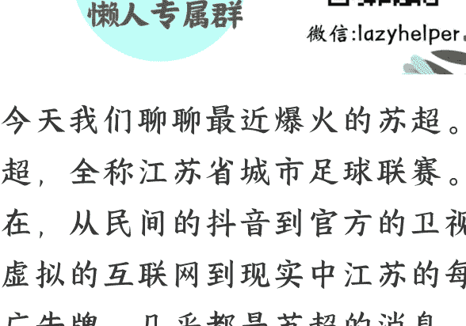

# 苏超，苏超，8000万人的“团魂”在燃烧

250606

整理：公众号懒人搜索，懒人专属群独享

懒人微信：lazyhelper

今天我们聊聊最近爆火的苏超。苏超，全称江苏省城市足球联赛。现在，从民间的抖音到官方的卫视，从虚拟的互联网到现实中江苏的每一块广告牌，几乎都是苏超的消息。

整件事的起因，可以追溯到2024年11月。当时，江苏举办了省内第一届足球发展重点城市对抗赛。目的是促进足球运动的发展。当时参赛队伍不多，就两个城市，南京和苏州。赛制也很简单，主客场回合赛，也就是你来我这踢一场，我再去你那踢一场，最终计算个总比分。比赛的结果是，苏州以1比0的总比分，战胜南京队夺冠。

按照通常的设想，一共就两支队伍，又不是顶级赛事，能有多大的关注度？但是，出人意料的地方就在这。整场比赛的热度超过了很多人的想象。最后一场比赛在南京奥体中心，现场来了整整三万人。苏州和南京的市民，包括平时从来不看足球的，全都在谈论这件事。

这个热度直追 1997 年的北京国安对上海申花。但国安和申花一向有“宿怨”，南京队和苏州队之间也没听说有什么过节啊，怎么就能踢得那么燃呢？

之后，经此一役，人们终于意识到，这个热度并不来自足球层面的胜负欲，而是城市层面的比较。南京作为省会，苏州作为经济强市，两城的市民都觉得自己的城市最好。而为自己的球队呐喊，只是人们表达城市认同的一种方式，而且是很友好、很积极的方式。这就好比班上两个学生，比的是谁学习更好，而不是比别的。

你看，一场足球比赛，居然能调动江苏人这么大的热情。于是，2025 年江苏省地方两会，决定把省内足球联赛列为重点工作。到了 5 月份，这个思路正式落地实施，就有了我们现在看到的，苏超。

## 整个江苏，全部参赛、全民参赛、全领域参赛。

- 首先，全部参赛，省内 13 个地级市一个不落通通参加。大家都别在网上不服，有能耐现实中碰一碰。
- 其次，全民参赛。从职业球员到外卖员，从上班族到大学生，不限制身份，年龄最小的 16 岁，最大的 40 岁。总之，足球大舞台，有梦你就来。
- **最后，全领域参赛，也就是，体育比赛带动其他领域。**比如，江苏13个地级市的餐饮、娱乐、文旅，几乎全都在苏超的带动下明显增长。本来是一场足球比赛，但它的影响力已经远远超出了足球本身。

苏超现在的热度有多高呢？我们可以拿中甲联赛和中超联赛做个对比。这是国内级别最高的两项足球赛事，中超级别第一高，中甲第二高，而且都是全国范围内的职业联赛。

在场均观众方面，苏超目前场均观众是10000+，而2024中甲联赛的场均观众是6400多人，2024中超联赛的场均观众是19000多人。苏超介于中甲和中超之间。

再看媒体报道，苏超在央媒上的报道目前超过300篇，而2024年中甲在央媒上的报道总数大概150篇，中超是800篇。苏超依然介于中甲和中超之间。

再看社交媒体热度，截止到这周，苏超的抖音话题播放量是8.2亿，而2024年中甲的播放量是1.2亿，中超的播放量是5.8亿。没错，**苏超在一些社交媒体上的热度已经超过了中超。**

而且要知道，苏超的赛季可不是只有这几天，它从5月10日开始，要一直持续到 11 月 2 日。按照时间计算，现在才仅仅过去了五分之一。假如热度持续，它的很多数据大概率上会超过中超，成为国内有史以来最受关注的足球比赛。而且再强调一遍，这是业余比赛，不是任何意义上的职业联赛。

那么，这个热度是怎么来的呢？接下来，咱们就盘一盘。

### 首先，是江苏独特的城市经济格局。

也就是网上调侃的，13 个城市的居民在经济上“谁也不服谁”。为什么不服？因为大家各有各的强项，谁都不弱。

比如，有个指标叫，省会城市首位度。也就是省会城市 GDP 在全省的占比，算法很简单，用省会城市的 GDP，除以全省的 GDP。首位度越高，说明省会在经济上越是独挑大梁。首位度越低，说明省会之外的经济强市越多，大家旗鼓相当。而南京的城市首位度，大概是 13%左右。什么概念？全国倒数第一，是全国城市首位度最低的省会。

这说明什么？江苏省内的 13 个地级市，经济上并驾齐驱的程度是全国最高的，省内城市之间的差距是最小的。我们可以做个对比，比如广东省内，深圳的 GDP 是云浮市的 28 倍，再比如四川省内，成都的 GDP 是甘孜的 35 倍。而江苏呢，作为 GDP 首位的苏州，只是末位宿迁的 5.6 倍。而其他城市之间的差距就更小。

这个经济上强者林立的格局，再加上十里不同音的地域习俗差异，就导致苏超有了很大的“玩梗”空间。

而且注意，苏超在玩梗方面还有一个关键的特点，借用互联网大 V 三表的观察，苏超里没有任何一丝元素是“苦”的。

你不用担心你的调侃会伤到谁，因为大家都不弱，经济都很强。你爱怎么调侃就怎么调侃。

你不用担心某场比赛的输赢，因为这不是职业比赛，不用赌上一个城市的足球尊严。大家关注的东西已经远远超过了足球。不管哪个球队赢，观众都是开心的。

你也不用担心苏超像其他网红城市那样，一阵风过后，GDP 又降了下来。因为人家的 GDP 本来就领先，苏超只是锦上添花，是纯粹的享受，是完完全全的快乐。

因为有了这个不带有一丝苦味的、绝对甜的基础，人们就可以放心地调侃，放心地抖包袱。

比如，比赛口号可以是，比赛第一，友谊第十四。因为江苏只有 13 个地级市，说友谊第十四，意思就是我们的友谊在排名面前不值一提。

再比如，徐州是刘邦的老家，宿迁是项羽的老家，因此这两个城市的对抗就被称为楚汉争霸。

再比如，镇江对淮安，0比4输了，镇江网友就调侃说，以后卖到淮安的镇江陈醋加钱，要施行100%“关税”。

再比如，前三场都输了的常州队，目前排名垫底。网友调侃说，常州现在强得可怕，谁都不敢输给他。前两天常州体育局还回应，后面比赛还很多，现在下结论太早。

2024年底，整个江苏的常住人口数是8526万。有人说，这场苏超，是江苏8000多万人的团魂在燃烧。团魂，指的就是人对于一个团体的热情、信仰，以及荣誉感的统称。人们在用调侃的方式，来表达自己内心的城市认同。

除了前面说的心态基础，苏超还有另外一个关键支撑，这就是江苏的基础设施。从空间上看，江苏省内高铁四通八达，13座城市的直线距离全在300公里以内，高铁两小时达。市民想去另外一个城市看球，完全有条件当天往返。再加上江苏人口密度高，平均每平方公里有790人，人口密度全国第一。这也为球赛提供了稳定的观众池。

再看球场，截止到2021年底，江苏全省有足球场8572个，这是把11人制球场、7人制球场、5人制球场全都算上的数据。而过去 4 年半，江苏又新建了不少球场。今天，据说江苏是全国人均球场面积最大的省份。同时，苏超还有文旅领域的加持，很多城市都在比赛期间推出了各式各样的文旅措施。

这是供给端的资源禀赋。我们再看需求端，也就是市民这边的情况。

借用互联网大 V 三表的观点，苏超之所以这么火，原因之一是，江苏居民平时的娱乐生活相对少，日常积蓄的需求这回通过苏超突然被释放了。

为什么说江苏的娱乐生活相对少？我们可以看一个指标，夜经济。2024 年全国夜间消费指数的前十名里，整个江苏只有南京上榜，排在第九。你可能会说，这不是也还可以吗？别着急，你知道在江苏的夜经济消费里，占比最大的是什么？是夜食。没错，就是吃夜宵。夜食占了江苏夜间消费的 68.7%。相当于，大家最主要的夜间活动，也就是出来吃吃东西。而相比之下，旁边的浙江省，夜间消费的大头是娱乐，占比高到 62.3%。

当然，这个统计只反映夜间消费的普遍数据，并不代表每个城市的具体情况。但至少我们可以看出，苏超确实给江苏的文体娱乐，提供了一个强大的新选项。

听到这，有人可能会说，苏超现在是不是过热了？热度还能持续多久？毕竟，人们已经见过了不少网红城市的起起落落。

未来的事咱们不好说，但至少眼下看，苏超和其他网红城市相比，有一个明显的特点。这就是，它的热度并不是靠外地游客、外地大学生撑起来的。苏超首先是被本地人盘活的，它具备一个强大的内部生态，然后这个内部生态又吸引了大量的外部关注。这个模式也许会为苏超的发展提供长期的动能。

最后，关于苏超，我个人最喜欢的视角，就是前面说的，这是一场纯粹的快乐，一场可以零压力、零负担、零顾虑的快乐。眼下全国入夏，你看，夏天可不就应该这样吗？痛快地流汗，痛快地大笑，尽兴之后再来个大大的拥抱。在这里，也祝你的生活中，永远不缺纯粹的快乐。

懒人专属群持续更新中，已持续运营6年，整理超3000份各类精选付费文章＆年费社群干货，全部开放下载。

本资料为付费群内部分享，仅供真实有需要的朋友查阅

懒人微信：lazyhelper

#### 懒人专属群更新记录：

https://lazybook.fun/#/blog/record2