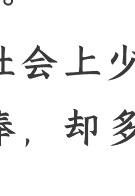

# 学历贬值的当下，高考还重要吗？

250610 文/卢克文工作室嘉宾壹壹壹
整理:公众号懒人搜索,懒人专属群独享
懒人微信:lazyhelper

公众号
懒人搜索
懒人专属群
微信:lazyhelper

2025高考已经落幕。

与往年不同，今年社会上少了对“金榜题名”的狂热追捧，却多了对高考制度的批判性反思。

个中缘由，其实不难理解。从门槛上讲，本科文凭早已失去稀缺性。80年代本科率不足5%，如今00后大学生占比高达63.2%，而清北复交的本硕比例已达到1:3，每年招5000名本科生，却要招收15000名硕士。本科学历固然大幅贬值，但在名校里，研究生比本科生更不值钱。

从近两年的“985研究生送外卖”到海归毕业月薪5000，再到大学毕业回家当“全职儿女”，眼下，高学历=好工作的观念正在崩塌，这让我们不得不思考：在学历严重稀释的今天，拼命高考上名校的意义何在？

## 01

对于大学教育的幻灭感往往从大一的第一堂课就开始了。

那些在高考独木桥上拼杀过来的学子们突然发现：与高中老师事无巨细的督促形成鲜明对比，大学里，教授们安静地坐在讲台上念PPT，课堂俨然变成了“自学成才”的试验场。

南京大学的一项研究数据令人深思：即便在国内顶尖高校，本科生对学术体验的满意度也不足20%，这一数字还不到美国同类院校（55%）的一半。

问题出在大学教师的教学态度上。在当前的评价体系下，教书育人这个大学最本质的职能，反而成了最不受重视的环节。

大学教学任务多由青年讲师承担，他们每周课时量约10节，但高级职称的教授课时量普遍较少（多为每周4—5节）。教授需投入更多精力到科研与研究生培养，这一安排还有合理性，但对青年讲师而言，现行考核体系与教学任务脱节已成为普遍困境。

当前高校教师更像“销售”，首要任务是申报课题项目、发论文，教学反成次要。

梳理多所高校“非升即走”考评指标发现，以评副教授为例，年轻教师要在6年考核期内主持“国字号”基金项目、在权威期刊发表论文并出版专著，此类硬性指标占比过高，存在“唯项目”“唯论文”倾向。而教学、管理、社会服务等工作的考评权重较低，部分高校仅要求完成基础工作量即可达标。

老师念着十年不变的PPT，同学们在下面刷手机，期末考试前突击三天就能及格——这就是很多人真实的大学生活。

当大学课堂沦为走过场时，为了拿到绩点，大学生们开始另辟蹊径，去B站上课“自救”。

B站学习区数据显示：2023年教育类视频播放量同比增长120%，《高等数学》系列课程累计播放量突破2亿，编程、设计等实用技能课程最受欢迎。

谁说从应试教育里出来的孩子素质不强呢？咱们的孩子早已在严苛的竞争中练就了超强的自学能力。

但光学得会就够了吗？关键是学的这些东西，到底能不能用上？

大学里教的知识点，好多都老掉牙了，理工科还好点，至少在维持更新换代。文史哲这类专业可谓“经典永流传”，教材内容八百年不带变。

我大学读的是汉语言文学，那会儿，正赶上公众号刚火起来。学校反应很快，马上搞了个学院公众号。结果派来指导我们的，是位写了二十多年党报的老教授。

老教授不懂什么叫自媒体，但是知道新闻要有五个W（新闻五要素）。她拿着新闻简章的标尺衡量每一篇稿件，这些稿子无一例外，都没有阅读量。

这让我想到，近代西方科技炸开了中国国门，但科举选拔出的官员只会背四书五经，根本不懂怎么造火枪洋炮。

大学总说要培养“与时俱进”的人才，但讽刺的是，待在校园象牙塔里的老教授们，往往是最跟不上时代的那群人。

## 02

既然大学都是靠自学，是不是考进哪所大学都无所谓？

要是这么想，就片面了。好大学和普通大学的差距，本质上是一场关于“资源红利”的较量。

《中华人民共和国教育法》规定，我国高等教育经费实行“财政拨款为主、多渠道筹措为辅”的体制。

具体而言：

- 中央财政重点支持教育部直属及中央部委直属高校；
- 地方政府负责地方高校经费投入，央地共建高校则由双方共同承担；
- 民办高校主要依赖学费收入，政府仅提供适度财政支持。

这种经费结构差异，直接导致公立大学（尤其是教育部直属高校）在基础建设、科研投入等方面具有显著优势。

对考生来说，选择优质大学的意义远不止于硬件条件。除了优美的校园环境和丰厚的奖学金外，真正的价值在于提供了难得的成长平台和试错空间：

在理工科领域，这种优势尤为明显。名校实验室配备价值千万的先进设备，而普通院校可能还在使用早已淘汰的仪器。本科阶段，学生就有机会参与到科研项目里——帮导师打打下手、整理数据，这些看似简单的工作，却能让你亲身体验这个专业的真实面貌。

它很可能和你在课本上学到的完全不一致。这种“零成本接触”能帮你快速判断：这个专业方向到底适不适合自己？要是铁了心不想学，本科技余科研转组要比研究生方便多了，不喜欢就可以换，甚至还可以去周围其他学校的课题组。

这种低成本的“试错”机会，正是好大学最独特的优势。它让你在正式确定人生方向前，就能亲身体验各种可能性。

有资源就会有竞争。目前，高考的招生名额按省分配，国家按照一定的原则给各省市分配招生名额，专业术语叫做“分省定额”。

但这个“分”不是平均分配，因为学校经费一大部分来自地方政府拨款，大学高校更倾向于在本地多分配录取名额。复旦大学2024年招收上海本地生源761人，占了招生比例的20.4%。

中国的优质大学大多集中在东部地区，北京、上海尤其居多。在地方财政的影响下，北京、上海每万人录取比例在400以上，明显高于山东、河南、四川每万人录取比例仅一百多的。

在现有制度下，类似于山东、河南这种高校资源匮乏地区的考生不得不通过拼命卷成绩来弥补先天的地域劣势。河南一本线常比北京高100分+，小镇做题家正是当前教育资源配置不均衡所带来的必然结果。

## 03

面对激烈的竞争，有些人退而求其次，选不上好大学，就选个好专业。

但现实是，所谓的好专业都在好学校里。我国192所高校承载了全部国家重点学科，其中，中央属普通本科院校达103所。这103所高校仅占全国普通高校总数的5.2%，却垄断了国内绝大多数的重点学科。

究其根本，当前我国大学教育体系仍带有明显的计划经济特征，这一本质属性往往被忽视，而这恰恰是导致许多大学毕业生就业难的关键原因。

我国的经济体制分两种，关键民生靠计划经济兜底，创新发展靠市场经济驱动。医保、基础科研、核能水利这类战略工程，都是国家来养人。

理工科专业（如电气、机械、化工、航空航天）与央国企形成深度人才对接，中国石油大学毕业进入“三桶油”的比例常年保持在65%以上。

这些专业本质上承担着国家战略人才储备功能，它的首要目的不是解决你的就业，而是要让在国家需要的时候，有储备人才可用。

所以你会看到，2018年中美贸易战后，全国高校微电子专业招生规模突然扩大38%；2021年“双碳”目标提出后，新能源专业如雨后春笋般涌现。这种“国家指哪，高校打哪”的现象，正是高校专业计划经济的特点。

与理工科不同，文科类专业天然生长在市场经济土壤中。像电商、传媒、内容策划、金融等行业都是市场来选人，国家不需要储备这类人才，但这类人才又是公认市场上最需要的职业。

很多人误解说，文科生的活理科生都能干，那是因为纯市场化的岗位只拿结果说话。像电商运营、新媒体编辑、广告策划等典型岗位，企业招聘时往往只看重三点：

- 作品集质量（如策划案例、爆款文章）
- 实操能力（如PS技巧、剪辑软件）
- 行业资源（如KOL联系方式、供应商渠道）

至于你什么专业，什么学历真的不重要。

但如果你想成为老师这种带事业编的，专业不对口，即使有教师资格证，很多公立学校依旧不收。

站在人生十字路口的年轻人，面前有两条清晰的路：

体制内的路标写着——名校—高绩点—导师资源—编制考试；
市场经济的路牌指示——实习—项目经验—人脉积累—商业嗅觉。

但现实里绝大多数人都是没头苍蝇，压根不知道自己该干嘛，对专业也是一知半解。那么，高考还重不重要？

我的答案是：仍然重要。

作为学生，你得想明白自己以后想干啥，能干啥。可偏偏这门课，学校压根不教，事实上也教不了。

这时候，好大学所能提供的平台和资源，就显得尤为重要。

它会让你亲身体会各种可能性后，对自身形成更准确的认知，而不是像没头苍蝇一样乱撞。

🔖 懒人专属群持续更新中，已持续运营6年，整理超3000份各类精选付费文章 & 年费社群干货，全部开放下载。

本资料为付费群内部分享，仅供真实有需要的朋友查阅 🤫

# 懒人专属群更新记录：
https://lazybook.fun/#/blog/record2