# RPA 自动采集小红书低粉爆款商品（手把手教程-附源码）
## 250610 生财精华

公众号懒人搜索，懒人专属群


各位星球的小伙伴大家好，我是黄大路。目前在专注于用 RPA 来做一些业务解决方案。结合影刀 RPA，已经搭建了 150 + 自动化流程。也合作了一些小红书 MCN、电商团队/个人。帮助他们运营提效。

今天带来的实战项目，是一个小红书商家比较常见的业务场景：采集小红书低粉爆品（基于关键词搜索结果页 + 商品推荐页）。

最近机缘巧合，有朋友让我做一个采集小红书低粉爆品 RPA 工具，然后发了一篇文档给我。我看是生财 2023 年的文章。于是以文章作为参考，按照新版的小红书流程，以及自己的理解，写了 3 个基于小红书低粉爆品的 RPA 应用。索性也干脆把流程和源码分享出来。

下面是正文。

先说下这个需求的缘起。

起源是伟豪在文章里，分享了如何去做选品的方法。其中提到一个选品方法就是：低粉爆款法。原文描述大概是：

> 低粉爆款，去选品其实就是跟品。
> 
> 跟品，按照低粉爆款的思路去跟品，原则是：
> 
> 对标模仿的小红书账号低于 200 粉丝，同时最近 7 天发的单篇带货笔记点赞过 100，同时该带货笔记商品销量大于 100。
> 
> 这种爆款方法，本质就是找没多少粉丝但已经有品在爆的对手，去跟品！
> 
> 低粉爆款四个字等价于六个字，那就是粉丝少成交多！
> 
> 利用低粉爆款法去选品，你可以不依赖于灰豚数据、考古加等第三方工具软件去寻找当前刚起的号当中，有哪些人最近 7 天带的品在爆。仅仅通过小红书发现页去刷就可以，不要怕麻烦！耐心一点，每天寻找三个品去测试。
> 
> 另外，即使是低粉爆款的品，如果你抄的时候没有抄到低粉爆款的笔记的封面，这个品也会出不了单。选品正确代表走完了 70% 的路，还有 30% 的路是封面 + 视频要抄的精准。

-- 伟豪

这个选品方法里，一些关键的点：

- 1、为什么可以直接去小红书商品推荐页，而不用灰豚、考古加这些数据。还有个原因在于，这些第三方数据，对于「商品销量」这个字段，一般都不会去拿实时数据（平台也不会给），而是离线数据。也就是你在第三方数据软件里看见的商品销量，往往是滞后的。对于跟品来说，快一点，就多赚一波钱。只有小红书手机端商品列表、商品详情的销量数据是实时的。所以直接去小红书页面上拿数据，是实时数据。这里也引出来，为什么我们通过 RPA 去采集这些商品数据，会更有价值。
- 2、这个选品方法，就是去找“粉丝少，成交多”的商品。业务逻辑其实很好理解，所有的平台都可以这样来找。除了可以这样来找商品，也可以来找笔记、短视频。一样的思路。粉丝少，数据又好，就是异常值。
- 3、这个选品方法，本身具有重复性、同时需要持续执行。如果可以做到自动地、实时地，采集低粉爆款商品。至少在这个环节，就比同行更有效率。

接下来我会把一共 3 个 RPA 业务流程：
- 采集小红书搜索关键词 - 低粉爆款商品
- 采集小红书推荐页商品 - 低粉爆款商品
- 监控小红书商品销量

详细分享出来。有 RPA 技术能力的朋友可以参考下思路。没有接触过 RPA 的朋友，也可以帮忙给你部署下。这套流程是用的影刀 RPA。

## 一、实现效果

- （1）进入小红书 - 友好市集，搜索商品关键词，然后在搜索结果页，采集低粉爆品。自己可以设置：
  - 商品搜索关键词：也就是每次运行，需要搜索的商品关键词；
  - 检测次数：小红书移动端，一屏大概是 4 个商品。这里可以理解为手机屏幕滑动次数；
  - 商品销量大于多少才采集商品；
  - 博主粉丝数小于多少才采集商品。
  销量和粉丝数，可以根据自己的行业情况来设置数量。设置好了后，程序就会自动筛选满足要求的商品数据，写入表格，最后支持导出到本地 Excel。

- （2）进入商品推荐页，采集低粉爆品。自己可以设置：
  - 检测次数；
  - 商品销量大于多少才采集商品；
  - 博主粉丝数小于多少才采集商品。

销量和粉丝数，可以根据自己的行业情况来设置数量。

- （3）监控小红书商品销量。自动获取商品销量，也可以设置为定时自动运行，这样每天就可以把采集到的低粉爆品，每天监控商品销量趋势。

| 店铺名称 | 博主粉丝数 | 商品链接 | 商品销量 | 商品原价 | 到手价 | 2025年06月01日销量 |
| --- | --- | --- | --- | --- | --- | --- |
| 浪漫逃亡 Romantic escape旗舰店 | 9225 | https://www.xiaohongshu... | 424 | 399 |  | 460 |
| ludys hare 商家定制的店 | 1200 | https://www.xiaohongshu... | 435 | 199.9 |  | 465 |
| Do Know Zero服饰旗舰店 | 6822 | https://www.xiaohongshu... | 1334 | 880 |  | 1334 |
| ZUM旗舰店 | 7034 | https://www.xiaohongshu... | 13000 | 178 |  | 13000 |
| OPEN ROLES旗舰店 | 2443 | https://www.xiaohongshu... | 1000 | 209 |  | 1028 |
| KOHSBOUTIQUE旗舰店 | 2234 | https://www.xiaohongshu... | 598 | 1890 |  | 598 |
| 宋正恩旗舰店 | 3421 | https://www.xiaohongshu... | 592 | 649 |  | 687 |
| 入微旗舰店 | 2421 | https://www.xiaohongshu... | 3231 | 299 |  | 3606 |
| 雅束女装旗舰店 | 341 | https://www.xiaohongshu... | 5028 | 99 |  | 5074 |
| 浪漫逃亡 Romantic escape旗舰店 | 8633 | https://www.xiaohongshu... | 18000 | 188 |  | 18000 |
| FIRSTFLOOR旗舰店 | 2434 | https://www.xiaohongshu... | 1021 | 329 |  | 1068 |
| ANNATA旗舰店 | 3669 | https://www.xiaohongshu... | 2913 | 399 |  | 3033 |
| 查查欧尼的店 | 9024 | https://www.xiaohongshu... | 7557 | 458 |  | 7557 |
| 小甜莓的店 | 8252 | https://www.xiaohongshu... | 1386 | 30 |  | 1422 |
| C小橙子的小店 | 2832 | https://www.xiaohongshu... | 1043 | 78 |  | 1043 |
| 笨蛋兔兔的店 | 6532 | https://www.xiaohongshu... | 191 | 169 |  | 191 |
| 巷南studio的店 | 9381 | https://www.xiaohongshu... | 858 | 119 |  | 858 |
| 入微旗舰店 | 9162 | https://www.xiaohongshu... | 25000 | 199 |  | 25000 |
| Valley的店 | 1399 | https://www.xiaohongshu... | 2306 | 214.9 |  | 2306 |
| 黄麦麦Hmaimai的店 | 1158 | https://www.xiaohongshu... | 207 | 699 |  | 207 |
| 浪漫逃亡 Romantic escape旗舰店 | 9163 | https://www.xiaohongshu... | 3932 | 399 | 339.15 | 3932 |
| ludys hare 商家定制的店 | 9087 | https://www.xiaohongshu... | 551 | 379 |  | 551 |
| Do Know Zero服饰旗舰店 | 3855 | https://www.xiaohongshu... | 847 | 949 | 726.65 | 847 |
| ZUM旗舰店 | 2000 | https://www.xiaohongshu... | 2962 | 1880 |  | 2962 |
| OPEN ROLES旗舰店 | 2891 | https://www.xiaohongshu... | 159 | 1099 | 628 | 159 |
| KOHSBOUTIQUE旗舰店 | 46 | https://www.xiaohongshu... | 450 | 305 |  | 450 |
| 宋正恩旗舰店 | 2891 | https://www.xiaohongshu... | 389 | 1800 | 1053 | 389 |
| 入微旗舰店 | 4164 | https://www.xiaohongshu... | 994 | 469 | 429 | 994 |
| 雅束女装旗舰店 | 143 | https://www.xiaohongshu... | 3427 | 6.9 |  | 3427 |

## 二、业务逻辑

先说下这套业务流程的产品逻辑。

### （1）采集小红书 App - 友好市集，搜索关键词，商品搜索结果页，同时满足商品销量、博主粉丝数的商品。搜索关键词，商品销量、博主粉丝数，支持自定义设置。

### （2）采集小红书 App - 友好市集，商品推荐页，同时满足商品销量、博主粉丝数的商品。商品销量、博主粉丝数，支持自定义设置。

这两个业务场景，实现的逻辑其实差不多，在商详页的产品逻辑一致。主要是商品列表、搜索关键词有一些区别。其中在商品列表，搜索结果页的数据，如果直接循环获取，会出现一些重复的商品。但是商品卡片又不在手机窗口展示，所以加入了商品信息的坐标判断。这个细节后面的指令再详细说明。

## 三、RPA 指令详解

### 3.1 环境配置

在讲解详细指令之前，这里说下环境配置。整个手机自动化流程，会受到影刀 RPA 版本、Android 机型以及系统、小红书 App 版本影响。

稍有差池，就会各种报错，比如商品元素获取不到、流程错误等等。所以需要仔细核对。

影刀 RPA 客户端、手机端配置流程和注意事项。这部分建议按照影刀 RPA 官方文档进行配置；

本文 RPA 流程的运行环境。

影刀 RPA 版本：影刀 5.27.30 创业版 (32位)

Android 手机版本：Redmi Note 10, MIUI 14.0.10

小红书版本：8.85.0.f239cld


如果是一部手机，需要长期用来做自动化操作，建议用稍微好点的，200 元左右的机器，如果频繁打开关闭窗口导致卡顿，会影响自动化流程，并且这种错误也不太好排查。

好了，如果这部分配置遇到问题，实在搞不定，可以找找影刀官方客服或者找我帮忙看看。

### 3.2 指令流程解释

#### 3.2.1 搜索商品关键词，采集低粉爆品

指令详解，先讲搜索关键词，采集低粉爆品的内容。

如果不太熟悉 RPA 指令，可以先看看上面的业务流程图，以及最后的完整指令截图。根据流程图，来看指令逻辑。

- 1、初始化字段，连接手机、打开小红书App。

开始先用自定义对话框，设置好每次运行、

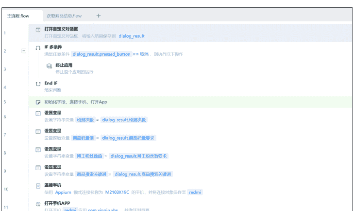

自定义对话框中，需要填入的字段信息。

包括：

**商品搜索关键词：**也就是每次运行，需要搜索的商品关键词；
**检测次数：**小红书移动端，一屏大概是 4 个商品；
商品销量大于多少才采集商品。
博主粉丝数小于多少才采集商品。

自定义对话框设计器
界面预览
工具箱
对话框属性
输入框
密码框
下拉框
列表
文本
日期控件
复选框
数字输入框
文本域
多选下拉框
多选列表
数据表格
选择文件
按钮
预览
暂无预览信息
商品搜索关键词
检测次数（每次检测4个商品）
请输入数字
商品销量大于多少才采集商品
请输入数字
博主粉丝数小于多少才采集商品
请输入数字
确定
取消
复制配置代码
确定
取消

全局变量
变量名称
类型
博主粉丝数值
字符串
检测次数
字符串
商品搜索关键词
字符串
商品销量值
字符串
redmi
手机连接对...

RPA 流程的全局变量，因为整个 RPA 应用封装成了 2 个流程。设置全局全量，方便流程调用。

懒人微信：lazyhelper

- 2、进入小红书「友好市集」页面，搜索关键词，进入搜索结果页。然后因为流程我是先把数据存在数据表格，最后从数据表格导出，所以在采集数据前，先写入创建了表头数据。

表格表头：店铺名称、博主粉丝数、商品链接、商品销量、商品原价、到手价。

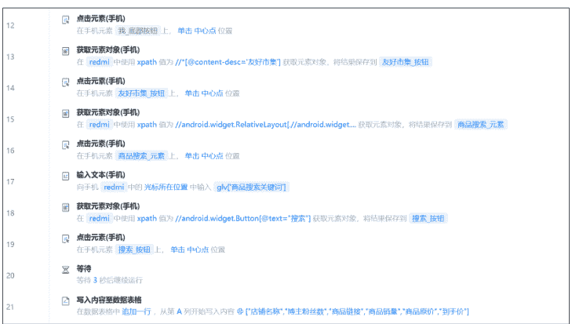

这一步流程里，需要注意的是 3 个 XPath 路径。移动端的元素，原则上尽量使用 XPath 路径来写，这样元素比较稳定，不容易失效。

这些路径，和小红书 App 版本有关系。所以，如果你的小红书版本和我的不一样，有可能失效，找不到元素。

```
/*[@content-desc='友好市集']
//android.widget.RelativeLayout[./android.widget.TextView[@text="搜索"]]
//android.widget.Button[@text="搜索"]
```

# 小红薯68021BEE
小红书号: 26248361498
IP属地: 浙江
0关注 0粉丝 0获赞与收藏
点击这里，填写简介
友好市集
我的订单
浏览记录
笔记 收藏 赞过
公开0 私密0 合集0


人生应有无限选择
去发布
- 首页
- 热门
- +
- 消息
- 我

# 友好市集
搜索
我的订单
购物车
卡券包 9折券
客服消息
关注店铺
# Kappa · 【沙丘】复古德训鞋百搭潮流板鞋低帮时尚情
有赠品 90天最低价
¥289 已售102
# SG高尔夫裤子春夏高腰微喇叭长裤运动开叉修身长裤
180天最低价 1件8.5折
¥338.3 已售1247
# 山尺 · 蜜蜡珠串手串双圈双层天然琥珀小米珠多宝手链
限时立减46.2 退货包运费
¥261.8 已售505
天然蜜蜡
# 山东露天美早大樱桃现摘现发应季水果
限时立减10.72 坏损包赔
¥58.48 已售1.4万+
防滑缓震 畅走崎岖

- 3、获取商品列表的整体逻辑。需要获取到商品列表的 XPath 路径，然后循环获取商品列表信息。

获取商品列表信息，这部分在指令第 33 行 折叠，下一步说明。

先设置 2 个变量，用于控制商品列表获取数量限制（因为不可能一直无限滑动）。

屏幕滑动次数，就是滑动次数，其实对应的就是检测次数；
是否继续检测的布尔值，用于循环什么时候停止。

循环获取商品，停止的条件（满足任意条件就停止）：
- 滑动次数 = 检测次数（也就是用户一开始输入的检测次数）。每次循环后就 +1，一直到满足用户设置的检测次数为止；
- 是否继续检测 = False（比如：搜索到底了，没有更多商品，就把这个值从 True 设置为 False）。


这部分流程还有 2 个关键细节。

- 第 1 个是搜索结果页 - 商品列表的元素定位。我们可以在搜索结果页可以看见，搜索出来的商品，虽然都是商品卡片，但是分 2 种情况。
- 第 1 种是普通商品卡片，点击后，跳转到商详页。如果退出商详页，会回到商品列表;
- 第 2 种是直播间商品卡片，点击后，会跳店铺直播间，然后弹出半屏商详页，退出商详页，会回到直播间，退出直播间，最后会回到商品列表。

这里考虑到直播间的各种动态元素变化（变化越多，RPA 流程越容易异常），以及和普通卡片的流程区别。所以我把这类直播间商品卡片，给过滤掉了，没有去判断是否采集。根据我的观察，影响不大。因为通过搜索一些大词发现，目前小红书的电商直播间，其实并不多。

然后，因为在商品列表的商品卡片里，已经存在商品价格、商品销量字段。所以刚好可以获取价格的相似元素列表。这样既可以作为点击元素，去商详页。也可以获取到销量信息，来做商品销量是否满足的判断。如果商品销量不满足要求，就可以不用点击去商详页了，提高流程运行效率。

所以，这个商品价格列表的 XPath 路径，我是这样写的：

```
//androidx.recyclerview.widget.RecyclerView//android.widget.FrameLayout[
  .//android.widget.TextView[starts-with(@text, "¥")]
  and

not(.//android.widget.TextView[@text="直播中"])
]//android.widget.TextView[starts-with(@text, "¥")]
```

关于这个 XPath 路径的解释（如果看不懂，可以直接用我上面写的就好）。通过获取手机元素的 UI 树(因为不是专门讲 XPath，这里就不截图了)。我们知道商品卡片是个容器，里面有主图、标题、价格、销量等等元素。

先定位商品卡片的最外层（如 android.widget.FrameLayout），排除“直播中”；

```
//androidx.recyclerview.widget.RecyclerView//android.widget.FrameLayout[
  .//android.widget.TextView[starts-with(@text, "¥")]
  and

not(.//android.widget.TextView[@text="直播中"])
]
```

## 再去这些 FrameLayout 下找价格 TextView。就得到最终的 XPath 路径。

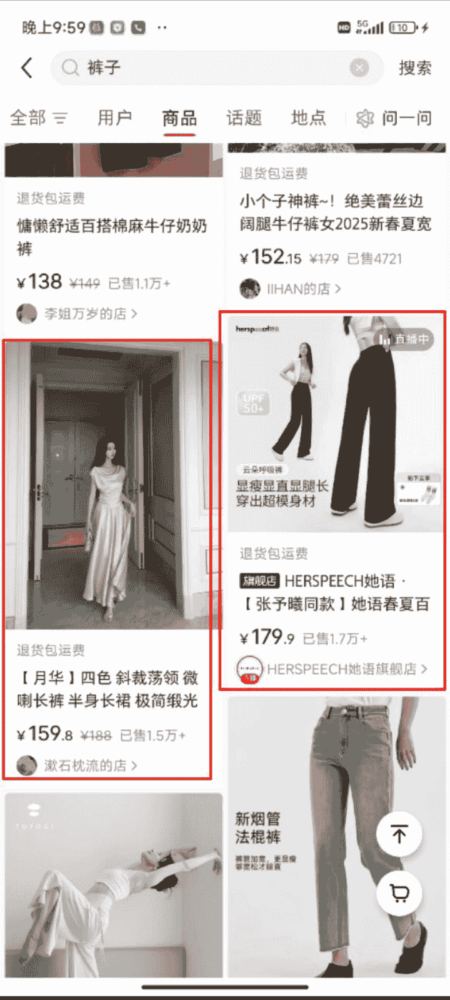

说完第 1 个关键细节，再说第 2 个。也就是循环获取商品列表之后，滑动屏幕指令（上图第 56 行指令）。这里建议是通过坐标定位的方式，这种方式可以尽量保证不遗漏、重复获取商品。

这里的起始点和结束点，大概可以定义为商品出现在屏幕中的坐标位置。

这里坐标，是结合我的手机（Redmi Note 10，MIUI 14.0.10）来定的，这里你可以根据自己的手机来定坐标位置。

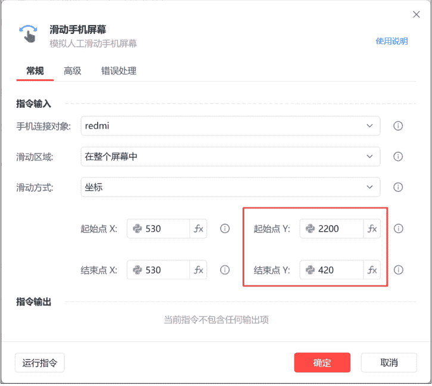
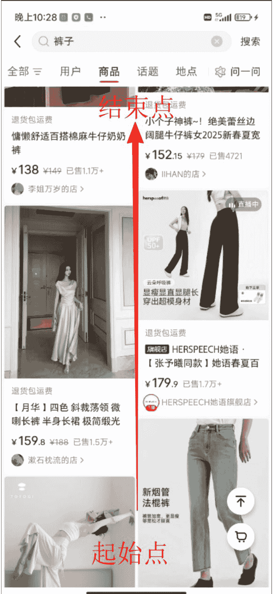

- 4、获取单个商品信息，判断商品销量是否满足要求，如果销量满足要求。再判断商品价格元素，是否在手机窗口内展示。如果在手机窗口展示，就点击商品价格元素，去商详页（账号粉丝数、商品链接都在商详页）。

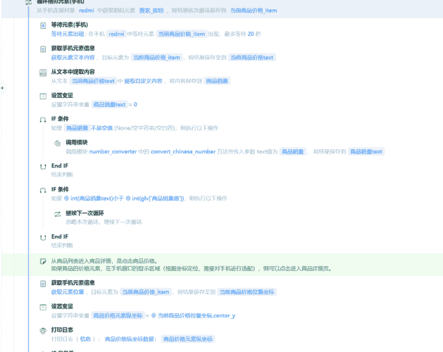

接下来对循环体内的重点逻辑，展开讲一下。

第 1 部分，是获取到商品价格元素，然后去获取商品价格元素里包含的商品销量。对商品销量做大小判断。

以下是获取到的商品卡片里，商品价格元素的文本信息：

```python
# 3 个商品价格元素的文本信息
['¥1698269.9 已售 7403', '¥120 已售 6352', '¥168 已售 1518']
```

需要写个正则表达式，提取销量值（上图第 34 行指令）。

```python
# 提取商品销量的正则表达式
已售([^\s]+)
```

然后，小红书的页面展示逻辑里，如果商品销量 = 0，就不在商品列表展示销量字段。所以也需要处理这个细节（上图第 36 行）。

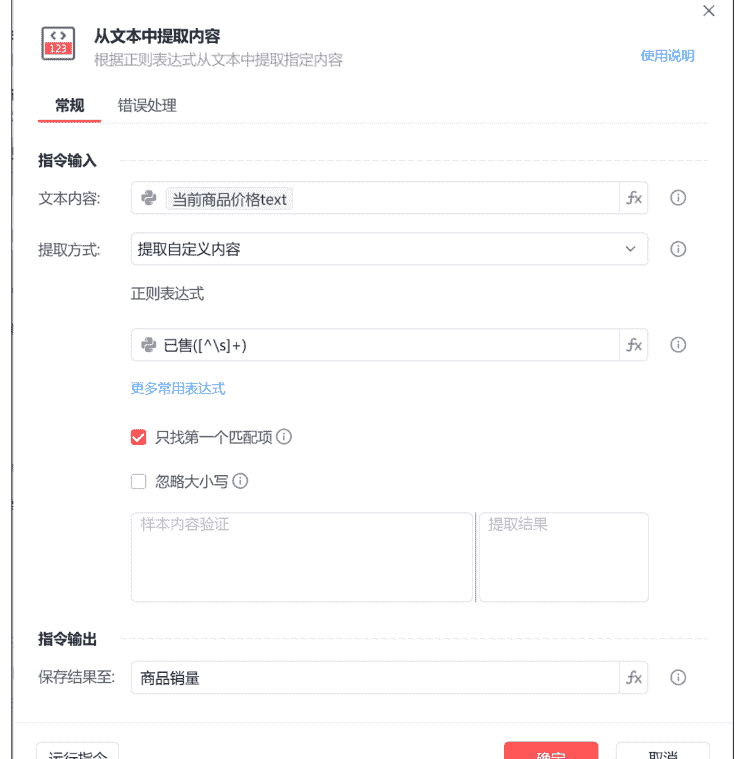


还有关于商品销量的格式处理，销量的格式有纯数字、1.3万+ 这种格式。这类情况，我是写的一个数字处理方法，也可以直接用指令处理，都没有问题。这里就不详细说明。

数字处理方法参考：懒人微信：lazyhelper

```python
import re

def convert_chinese_number(text):
    # 定义中文数字单位映射
    units = {
        '十': 10,
        '百': 100,
        '千': 1000,
        '万': 10000,
        '亿': 100000000
    }

    # 正则表达式匹配数字和中文单位
    pattern = r'(\d*\.?\d+)([十百千万亿]?)'
    match = re.search(pattern, text)

    if not match:
        return 0

    number = float(match.group(1))
    unit = match.group(2)

    if unit:
        return int(number * units[unit])
    return int(number)
```

```python
# 示例用法
# print(convert_chinese_number("1 万"))
# 输出: 10000
# print(convert_chinese_number("2.5 亿"))
# 输出: 250000000
```

```python
# print(convert_chinese_number("点赞"))  # 输出: 0
# print(convert_chinese_number("3 千 5 百")) # 输出: 3500
```

第 2 部分，是关于价格元素 Y 坐标的判断。如果销量满足设定的要求，就判断价格元素 Y 坐标，是否在手机窗口。

做这个判断，是为了避免在获取商品价格元素后，价格没有显示在手机窗口，导致点击无效，然后没有跳转到商详页，最后导致报错。

这里的 Y 坐标区间，也是根据手机窗口大小来设置的，可以根据自己的手机来定。

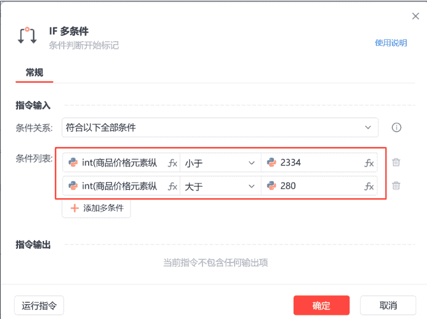

如果价格元素坐标在手机窗口的区间内，那么就点击去到商品详情页。获取商品信息，我是写的一个子流程。

最后，是判断搜索结果是否到底了。比如你设置的搜索“裙子”，滑动 100 次，但是第 21 次，就到底了，裙子商品没有了。出现这种情况就退出循环。

#### 5、进入商品信息子流程，获取商品价格。
需要先获取商品价格。然后向下滑动，获取账号粉丝数。 如果账号粉丝数满足要求，就获取商品链接； 如果账号粉丝数不满足要求，就退出商详页。

下午2:02

HD 5G 25

# 连衣裙穿搭
商品 评价 详情 推荐

# ¥248
# 到手价 ¥198
已售9120
限时立减50 先用后付

# 2025夏季新款韩系西装腰九分裤 腰横线
+   退货包运费 300+人好评 24小时内1000+人加购 3个月内
预售 14天内发货，晚发必赔
浙江嘉兴 包邮
退货包运费 升级版极速退款 7天无理由退货

# 商品评价 2000+ 评分 4.9
尺码合适
momo_520
尺码很合身，对小个子女生来说长度很合适，就是腰略有点高，要是稍微再低一点就更好了
徐七七
材质，款式都不错，好搭配。准备再买一条深色的。
店铺内其他商品评价 350+

# 穿搭精选
大屿studio
长期主义！窄版显瘦神裤！这条裤子的版型我先爱了，穿过才...
+   店铺 客服 购物车 加入购物车 立即购买
懒人微信：lazyhelper
25/40

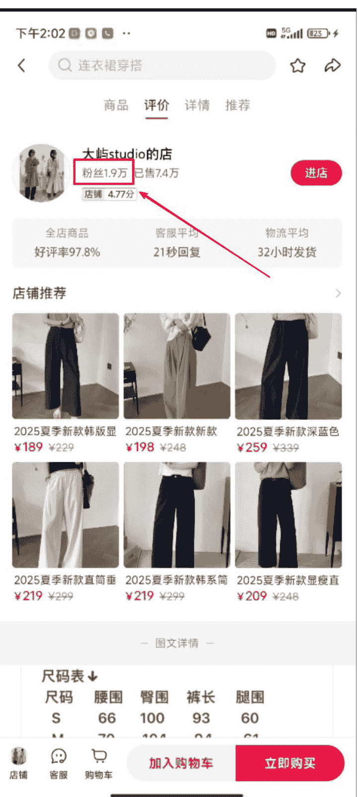

## 店铺推荐
| 尺码 | 腰围 | 臀围 | 裤长 | 腿围 |
|---|---|---|---|---|
| S | 66 | 100 | 93 | 60 |

获取商品价格的指令代码：

> 懒人微信：lazyhelper

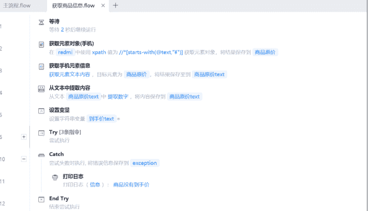

## 商品价格元素的 XPath 路径：

```python
# 商品价格
/*[starts-with(@text,"¥")]
```

如果商品有参考一些活动，就会有“到手价”，反之则不会显示“到手价”，这部分细节也需要考虑到。指令里使用 try - catch 来做判断。

#### 6、进入商品信息子流程，获取账号粉丝数。

这个环节里，账号粉丝数在商详页中间，位置不太确定（和商品评价等等有关系）。所以用“进店”两个字来作为标识。也就是当滑动到出现“进店”两个字时，就停止滑动。

然后就是同样的操作，获取粉丝数，处理粉丝数格式。粉丝数的格式处理方法，和上面商品销量处理方法一致。

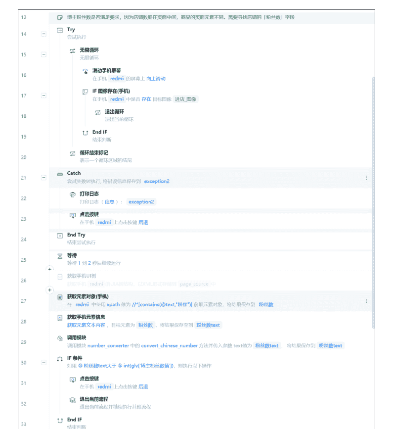

## 粉丝数的 XPath 路径

```python
/*[contains(@text,"粉丝")]
```

如果粉丝数也满足要求，那这个商品就是符合“低粉爆款”的要求，于是可以开始获取商品链接、店铺名称等。

#### 7、进入商品信息子流程，获取商品链接以及店铺名称。

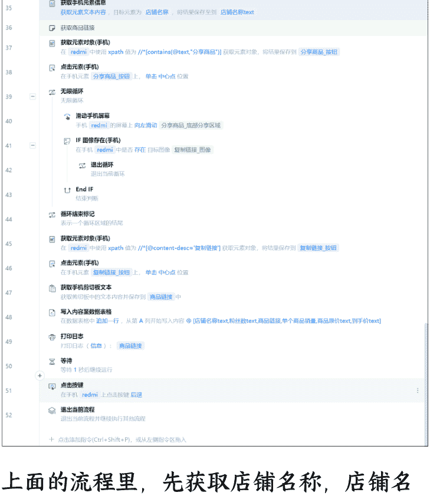

上面的流程里，先获取店铺名称，店铺名称的 XPath 路径：

```python
//android.widget.LinearLayout[android.widget.LinearLayout/android.widget.TextView[contains(@text, "粉丝")]]/../android.widget.TextView[1]
```

然后再获取商品链接。商品链接在“分享商品”里。需要进行复制链接。

公众号懒人搜索、懒人专属群分享
下午2:29
连衣裙穿搭
商品 评价 详情 推荐
大屿studio的店
粉丝1.9万 已售7.4万
店铺 4.77分
进店
全店商品
客服平均
物流平均
好评率97.8%
21秒回复
32小时发货
店铺推荐
2025夏季新款韩版显
¥189 ¥229
2025夏季新款新款
¥198 ¥248
2025夏季新款深蓝色
¥259 ¥339
分享至
私信好友
微信好友
朋友圈
识图搜同款
商城首页
购物车
订单
卡券
懒人微信：lazyhelper
30/40

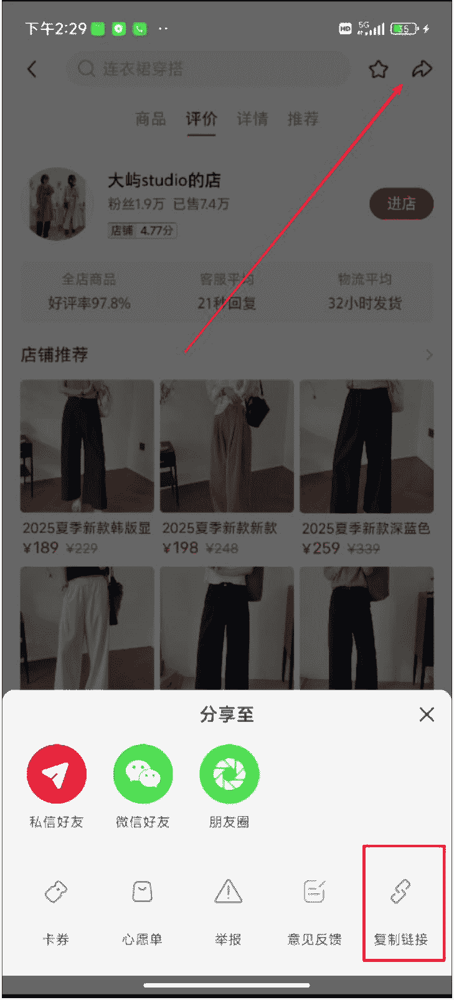

这里有个细节，就是点击“分享商品”按钮后，出现的底部菜单，“复制链接”按钮是在最后位置。需要滑动才能看见。所以需要把底部菜单进行滑动（向左滑动），一直滑到“复制链接”按钮可见。

然后点击“复制链接”按钮，获取剪贴板的商品链接。

分享商品、复制链接的 XPath 路径：

```python
# 分享商品
/*[contains(@text,"分享商品")]
```

```python
# 复制链接
//[@content-desc='复制链接']
```

获取链接后，再把商品数据，写入到数据表格，然后退出流程。这样 1 个商品的流程就算采集完成。然后去商品列表里，一直重复判断就可以。

到这里，搜索商品关键词，采集低粉爆品的整体流程，全部完成。

#### 3.2.2 小红书推荐商品，采集低粉爆品

如果小红书账号养好了，系统推荐的商品。也值得关注，推荐的很可能是同行爆品。所以也可以采集推荐页面的商品。满足 xx 个销量且 xx 个账号粉丝的账号，就采集商品数据。

这个场景和搜索商品的大体逻辑一致。区别只是一个搜索结果页获取商品列表，一个推荐页的商品列表。

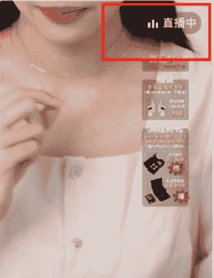
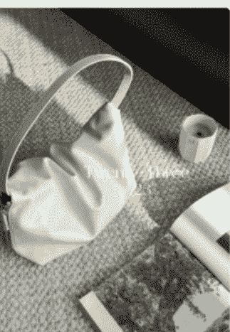

懒人微信: lazyhelper

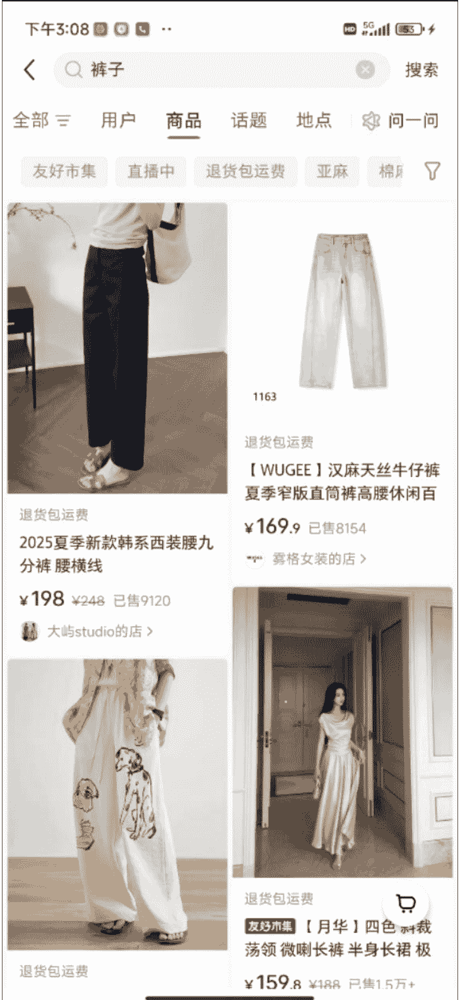

需要注意的是，推荐商品页的 feed，会存在商品卡片、直播间、笔记 3 种类型。我们只需要判断、点击商品卡片。所以整理的 XPath 路径也需要注意。

仔细观察可以发现，笔记、直播的卡片，底部没有“商品价格”的展示。所以这里用“商家价格元素”列表，就可以比较快的过滤掉直播间、笔记卡片。

## 商品价格元素-列表

```python
/*[starts-with(@text,"¥")]
```

另外，可以看到一开始的产品流程图里，推荐商品没有判断商品列表的元素坐标，而搜索商品结果页有。原因是我实际跑下来，发现推荐页的刷新和获取元素，不会出问题，所以不需要严格判断坐标。而搜索结果页的商品元素，容易获取到不在手机窗口的元素，所以最终还是用坐标来做约束判断。

其他流程，基本上和 “搜索商品关键词采集商品” 的流程一致。这里就不再做演示了。

#### 监控小红书商品销量

采集到的商品，如果需要每日监控商品销量，汇总商品列表。通过商品链接，获取到商品销量。

如图：A-F 列，是采集到的低粉爆品数据。G 列是每日监控拿到的商品销量。

| B 店铺名称 | C 博主粉丝数 | D 商品链接 | E 商品销量 | F 商品原价 | G 到手价 | H 2025年06月01日销量 |
|---|---|---|---|---|---|---|
| 浪漫逃亡 Romantic escape旗舰店 | 9225 | https://www.xiaohongshu... | 424 | 399 | | 460 |
| ludyshare惠家定制的店 | 1200 | https://www.xiaohongshu... | 435 | 199.9 | | 465 |
| Do Know Zero服饰旗舰店 | 6822 | https://www.xiaohongshu... | 1334 | 880 | | 1334 |
| ZUM旗舰店 | 7034 | https://www.xiaohongshu... | 13000 | 178 | | 13000 |
| OPEN ROLES旗舰店 | 3443 | https://www.xiaohongshu... | 1000 | 209 | | 1025 |
| KOHSBOUTIQUE旗舰店 | 2234 | https://www.xiaohongshu... | 598 | 1890 | | 598 |
| 宋正器旗舰店 | 3421 | https://www.xiaohongshu... | 592 | 649 | | 687 |
| 入微旗舰店 | 2421 | https://www.xiaohongshu... | 3231 | 299 | | 3606 |
| 独重女装旗舰店 | 341 | https://www.xiaohongshu... | 5028 | 99 | | 5074 |
| 浪漫逃亡 Romantic escape旗舰店 | 8633 | https://www.xiaohongshu... | 18000 | 188 | | 18000 |
| FIRSTFLOOR旗舰店 | 2434 | https://www.xiaohongshu... | 1021 | 329 | | 1068 |
| ANNATA旗舰店 | 3669 | https://www.xiaohongshu... | 2913 | 399 | | 3033 |
| 草草欣尼的店 | 9024 | https://www.xiaohongshu... | 7555 | 458 | | 7557 |
| 小番茄的店 | 8292 | https://www.xiaohongshu... | 1386 | 30 | | 1422 |
| C小椅子的店 | 2832 | https://www.xiaohongshu... | 1043 | 78 | | 1043 |
| 笨蛋兔妮的店 | 6532 | https://www.xiaohongshu... | 191 | 169 | | 191 |
| 春尚studio的店 | 9381 | https://www.xiaohongshu... | 858 | 119 | | 858 |
| 入微旗舰店 | 9162 | https://www.xiaohongshu... | 25000 | 199 | | 25000 |
| Volley的店 | 1399 | https://www.xiaohongshu... | 2306 | 214.9 | | 2306 |
| 黄麦麦Huaimei的店 | 1158 | https://www.xiaohongshu... | 207 | 699 | | 207 |
| 浪漫逃亡 Romantic escape旗舰店 | 9163 | https://www.xiaohongshu... | 3932 | 399 | 339.15 | 3932 |
| ludyshare惠家定制的店 | 9087 | https://www.xiaohongshu... | 551 | 379 | | 551 |
| Do Know Zero服饰旗舰店 | 3855 | https://www.xiaohongshu... | 847 | 949 | 726.65 | 847 |
| ZUM旗舰店 | 2000 | https://www.xiaohongshu... | 2962 | 1880 | | 2962 |
| OPEN ROLES旗舰店 | 2891 | https://www.xiaohongshu... | 159 | 1099 | 628 | 159 |
| KOHSBOUTIQUE旗舰店 | 46 | https://www.xiaohongshu... | 450 | 305 | | 450 |
| 宋正器旗舰店 | 2891 | https://www.xiaohongshu... | 389 | 1800 | 1053 | 389 |
| 入微旗舰店 | 4164 | https://www.xiaohongshu... | 994 | 469 | 429 | 994 |
| 独重女装旗舰店 | 143 | https://www.xiaohongshu... | 3427 | 6.9 | | 3427 |

## 下面是具体指令（完整版）：

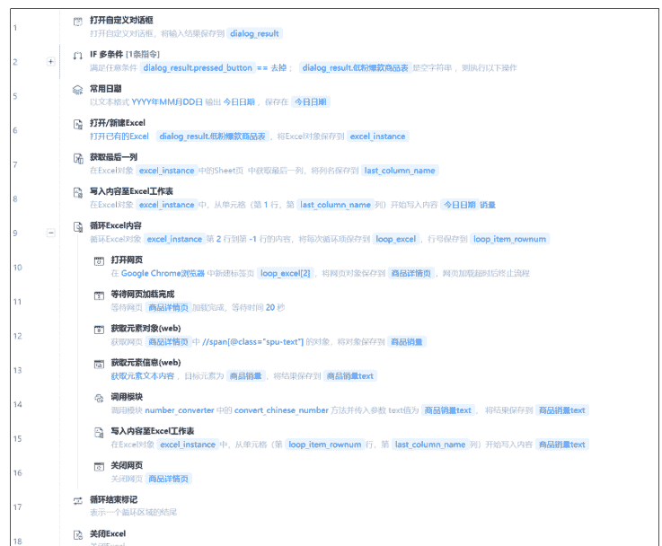

先打开 Excel，循环读取商品链接，然后打开商品链接，在商详页去获取商品销量。其中，商品销量格式的处理方法，和上面写的一致。最后再写入 Excel 表格最后一列。

## 商品销量 XPath 路径

```python
//span[@class="spu-text"]
```

到这里，一个批量采集低粉爆款商品，再到监控商品销量的应用，就算完成了。

## 四、完整源码

### 4.1 采集小红书搜索关键词商品-源码

全部的源码内容，我刚刚在上面每个流程都已经附上了，这里再发下完整源码。可以先看产品流程图，再看完整源码，最后再分流程查看。

（1）主流程。其中，主流程有个输出参数「单个商品销量」，子流程对应输入参数

懒人微信：lazyhelper

公众号懒人搜索，懒人专属群分享

### 获取商品信息-子流程

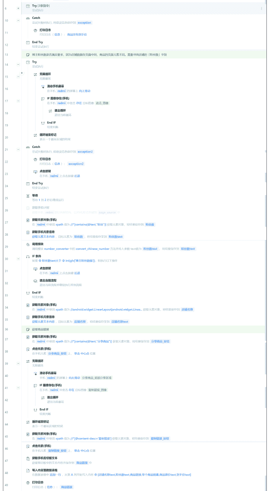

### 4.2 采集小红书推荐页商品-源码

#### （1）主流程源码

懒人微信：lazyhelper

```flow
主流程.flow
1. 打开自定义对话框
2. IF 条件 [条件指令]
   - 设置变量 | 设置字符串变量 | dialog_result | pressed_button
   - 设置变量 | 设置整数变量 | 商品数量 | dialog_result | 商品数量
   - 设置变量 | 设置字符串变量 | 博主粉丝数 | dialog_result | 博主粉丝数
3. 连接手机
   - 使用 Appium 连接指定名称为 M2103K19C 的手机，并连接对象保存在 redmi
4. 打开手机APP
   - 打开手机 redmi | 应用 com.xingin.xhs，并激活到屏幕
5. 点击元素(手机)
   - 在手机元素 找 | 商品按钮 | 上，单击 | 中心点 | 位置
6. 获取元素对象(手机)
   - 在手机 redmi 中的 xpath 为 //*[content-desc="发现市集"] 获取元素对象，将结果保存在 发现市集_按钮
7. 点击元素(手机)
   - 在手机元素 发现市集_按钮 | 上，单击 | 中心点 | 位置
8. 写入内容至数据表格
   - 数据表格 | 增加一行 | 从第 1 列开始写入内容 | "店铺名称","博主粉丝数","商品链接","商品销量","商品原价","到手价"
9. 设置变量
   - 设置整数变量 | 屏幕滑动次数 | = 0
10. 无限循环
    - 无限循环
    - 判断|屏幕滑动次数，需要退出循环
    - 打印日志
    - 打印日志 | 信息 | 屏幕滑动次数 | 屏幕滑动次数
    - IF 条件 | 条件指令
    - 循环列表元素(手机)
      - 在手机元素 redmi 中获取元素对象 发现市集_按钮，将结果遍历循环保存到 当前商品价格_item
      - 等待元素(手机)
        - 等待元素出现，在手机 redmi 中等待元素 当前商品价格_item 出现，最多等 20 秒
      - 获取元素文本信息
        - 获取元素文本内容，目标元素为 当前商品价格_item，将结果保存到 当前商品价格text
      - 从文本中提取内容
        - 从文本 当前商品价格text | 中提取自定义内容，将内容保存到 商品数量
      - 小红书商品列表，如果销量为0，商品字段就没有展示，需要处理
      - 设置变量
        - 设置字符串变量 | 商品销量text | = 0
      - IF 条件
        - 如果 | 商品数量 | 不是空白 | None/空字符串/空白符，则执行以下操作
        - 调用模块
          - 调用模块 number_converter 中的 convert_chinese_number 方法并传入参数 text | 商品数量，将结果保存到 商品销量text
      - End IF | 结束判断
      - IF 条件
        - 如果 | int(商品销量text)小于 | int(商品销量text)，则执行以下操作
        - 继续下一次循环
          - 跳过本次循环，继续下一次循环
      - End IF | 结束判断
      - 点击元素(手机)
        - 在手机元素 当前商品价格_item | 上，单击 | 中心点 | 位置
      - 调用流程
        - 执行流程 | 获取商品链接 | 并传入参数 单个商品数量为 | 商品销量text | 无返回结果
    - 循环结束标记
      - 表示一个循环区域的结尾
    - 滑动手机屏幕
      - 在手机 redmi 的屏幕上模拟手势滑动
    - 设置变量
      - 设置整数变量 | 屏幕滑动次数 | = 屏幕滑动次数+1
    - 循环结束标记
      - 表示一个循环区域的结尾
11. 日期时间转换为文本
    - 将 %Y年%m月%d日 格式转换成文本，将结果保存到 timetext
12. 数据表格导出
    - 导出数据表格到 | timetext | 商品.xlsx，将文件路径保存到 file_path
```

## 五、总结

3 个 RPA 业务流程都分享完成。如果你是做小红书电商业务，有类似选品方式的需求，可以按照流程来实现。

然后，因为手机自动化需要考虑的因素有很多（手机系统、硬件、App 版本等）。所以在一些细节上，可以结合自己的情况，灵活考虑。

懒人微信：lazyhelper


微信:lazyhelper

懒人专属群持续更新中，已持续运营 6 年，整理超 3000 份各类精选付费文章 & 年费社群干货，全部开放下载。

本资料为付费群内部分享，仅供真实有需要的朋友查阅

### 懒人专属群更新记录：

https://lazybook.fun/#/blog/record2