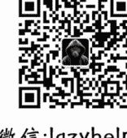
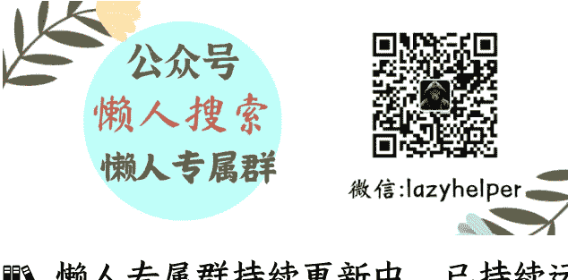

# 一个从“财富清零”开始的思维演习

250610 生财精华

整理：公众号懒人搜索，懒人专属群独享

懒人微信：lazyhelper

曾经美国 Discovery 频道推出过一档真人秀节目《Undercover Billionaire》，设定是一位亿万富翁只凭 100 美元，在 90 天内赚到 100 万美元。

我觉得这个节目不太理想，一是剧本设计痕迹明显，二是节目最后通过创办一家餐厅实现了 100 万美元的估值，而估值与实际赚到的钱显然不能画等号。现在不少一两人的小团队，花几个月就能做出一个估值几千万人民币的 AI 产品，但其中多数实际并不赚钱。

后来在 B 站也有人复刻了这个节目：一位餐饮行业的 up 主宣称要用 10 万元在 9 个月内赚到 100 万。节目制作精良，很快就积累了 20 万粉丝，但最终却没能兑现承诺，口碑随之下滑，频道后来也停更了。

于是，我也设想了一下这个挑战：如果今天我失去了所有资金、人脉和粉丝，从零开始，不弄虚作假，如何在一年内真正赚到 100 万？我认真思考之后发现，这件事对我来说似乎并不难，甚至能快速想到几个可行的方案。

我举几个例子：

## 「路径一：内容起盘 + 行业活动变现」

我可以重新建立自己的影响力。比如，我去年开了一个专讲 AI 产品的播客小号，半年多积累了上万垂直粉丝，进入了中国 AI 播客前十。

如果让我重来一次，我只需要：

- 先积累几千个垂类粉丝；
- 再凭借专业内容，去知名播客和社群“串台”；
- 打通关键行业节点。

接下来，最容易落地的变现方式可能是举办行业论坛或峰会，为有宣传需求的 AI 项目方收费。熟悉这个领域的人都清楚，办一场行业会议赚 50 万人民币并不难，只需要两场会议就能实现 100 万的目标，更何况我还能同时做卖课、游学、咨询、FA 等业务。

## 「路径二：外国游客入境热潮 + 中文地接服务」

随着中国对外国人免签政策逐步放开，加上前段时间甲亢哥在海外社交媒体上对中国旅行的宣传效应，来中国旅游的外国人将越来越多。

我可以：

- 在 TikTok、YouTube 介绍中国景点；
- 混剪素材+真人出镜；
- 用 Twitter、Reddit 扩散相关内容打造个人 IP，配合英文站点，SEO + 投流；
- 接入商旅地接服务，赚佣金和服务费。

旅游行业“前端获客、后端分佣”本来就是成熟模式，只要几千名客户，一年实现 100 万利润并不困难。

## 「路径三：义乌货源+海外门店对接」

也可以考虑一些实体出海方向，比如义乌有许多产品经过适当组合，非常适合海外开店。

我可以：

- 与工厂建立合作关系；
- 通过短视频/小红书吸引海外华人开店需求，一条优质内容经常可以带来几十个询单；
- 海外开一家门店的进货规模大约在 300 万人民币左右，利润为 10%；
- 只需撮合 3-4 家门店开张，就可以实现百万收益。

这种方式，内容驱动 + 成交落地，是极其高效的商业闭环。

## 「路径四：做小众精品的出海合伙人」

中国有很多产品在小众传统赛道做得非常优秀，用户体验极佳，但从未尝试出海。我可以成为这些产品的出海合伙人，帮助他们寻找海外代理商，赚取佣金和服务费。这也是一条完全可行的路径。

上面的例子只是想说明，即便我失去了当前的财富、人脉和粉丝，我仍然拥有强大的内容创作、AI技术、产品管理和出海营销等综合能力，以及对多个行业的深度理解，要实现百万级收入并不会太困难。

一个真正的“王者”，即便被打回“青铜”段位，虽然可能难以立即重返巅峰，但绝不会长期停留在低段位。现在很多创业者强调信息差，但信息差往往只是短期机会，很快就会消失。创业者的能力和视野，才是别人抢不走、市场也无法轻易淘汰的真正壁垒，无论时代怎么变化，都能穿越周期。

懒人专属群持续更新中，已持续运营 6 年，整理超 3000 份各类精选付费文章 & 年费社群干货，全部开放下载。

本资料为付费群内部分享，仅供真实有需要的朋友查阅 🙇‍♂️

## 懒人专属群更新记录：

懒人微信：lazyhelper

https://lazybook.fun/#/blog/record2