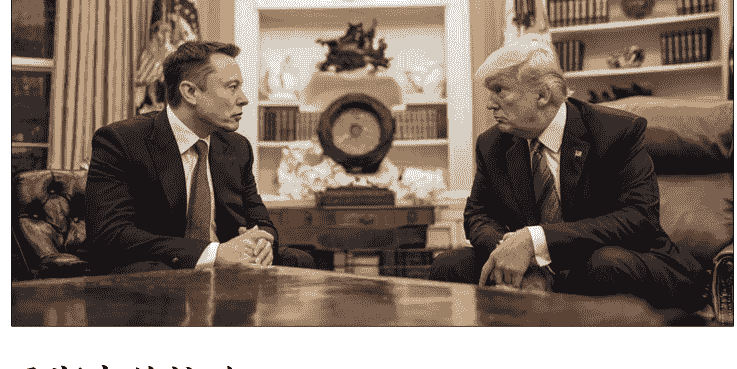

# 马斯克式豪赌 vs 芒格式复利:再看价值投资

250610 商业参考 4 节选

整理：公众号懒人搜索，懒人专属群独享

懒人微信：lazyhelper

## 马斯克的挫败

如果时间倒流三五年，无论是你还是我，只怕都很难想象，伊隆·马斯克这样的强势天才会在什么事情上遭遇挫败。直到2025年，他红着眼眶从美国总统特朗普的班底退出，这个问题才有了答案。

马斯克和特朗普在互相告别时颇为体面，但此后没几天，马斯克就在X上愤怒地反对起了本届美国政府。6月初，他在X上连发了几十条帖子，来批评和反对特朗普刚刚通过的“大漂亮”法案——这个法案的重点是继续给美国富人减税，并提高政府债务上限，也减掉了电动车行业的补贴。

马斯克抱怨说，“大漂亮”法案完全抵消了政府效率部团队，以巨大个人代价和风险节约下来的财政成本，号召自己的2亿多粉丝给美国的参议员、众议员打电话，否掉这个法案。

他还指责特朗普忘恩负义，转帖支持弹劾特朗普，让万斯接班。

这些言论，可以看作是马斯克跟特朗普政府翻脸，甚至宣战了。马斯克寄望于加入特朗普班底，来贯彻他个人对美国市场和社会影响力的规划，也算是失败。而随着他与美国联邦政府的交恶，这笔“风险投资”给他带来的损失究竟会有多大，只怕他本人当下也没法预估。

不过，这一讲我不是要跟你聊马斯克，也不是要聊美国政治。我想跟你聊的是价值投资。马斯克的遭遇，让我想起了芒格在几年前评价他的一段话。

## 芒格的预言

那是 2019 年，在 Daily Journal 的年会上，有股东问起芒格长期的用人偏好，问他为什么说，宁可选一个实际智商 130，但以为自己智商 120 的人，也不要一个实际智商 150，却自以为智商是 170 的人，这是怎么考虑的。

芒格听完马上点破，说你这么问，肯定是在指马斯克。他随后解释说，他倾向聘请那些通常不会高估自己能力的人，因为高估自己虽然可能产生伟大的成果，但带来的风险往往超过回报。他想雇佣了解自己局限性的、谨慎的人。

在这之后的几年，特斯拉风头十足，芒格和巴菲特其实在股东会和访谈场合夸过马斯克好几次，芒格甚至表扬过特斯拉为美国文明做了真正的贡献，但每次仍然坚决地表态说，自己不会碰特斯拉的股票。

这次马斯克在白宫遭受挫败，让我对巴菲特、芒格的决定有了新的理解。

在芒格看来，马斯克确实比一般人聪明，但他的风险偏好让他喜欢挑战超出自己信息量和能量的事情，他拥有的资源，跟完成挑战所需要的资源之间的错配，会降低他的胜率。

有一年巴菲特说，马斯克很聪明，可能智商超过170。他致力于解决不可能实现的事，时不时就会去做这种事。这对巴菲特自己和芒格来说，是一种折磨。芒格还附和道，我们不想经历那么多失败。

什么意思？

马斯克有一套著名的“失败成功学”，他的星舰火箭发射失败了好几次，而他都会在失败后发帖祝贺，认为这些失败暴露的问题有助于下一次尝试，最终导向成功。

这个逻辑错了吗？没错。它放在马斯克的事业版图里，能帮他快速试错、持续迭代；但它放进巴菲特、芒格的价值投资体系里，却可能拖垮整个体系。

## 能力圈与复利效应

我们去看巴菲特一个著名的思维方式——能力圈。能力圈思维是一种谦卑思维，是要求投资者把自己看成客体，去理性评估自己拥有的能量、信息量，跟一个投资决策是否匹配。

巴菲特早年说过，在投资游戏里，智商 160 的人不一定能击败智商 130 的人。为什么这么说？逻辑是，智商不是越高越好，而是跟所选择的挑战越匹配越好。他还打过一个比方，说伯克希尔之所以能取得目前的成就，是因为“我们关心的是找到那些我们可以跨越的 1 英尺栏，而不是去拥有什么飞跃 7 英尺的能力”。

这是能力圈所对应的“不懂不做”。懂到什么程度？段永平从巴菲特那里听到的量化指标是，他一般会认为有 95% 的把握时才出手投资。

这种极致的把握有什么好处？好处在于，可以不犯错、少犯错。重点来了——只有这样，投资者才有机会进入复利通道，真正感受到复利效应的迷人与伟大。

这就像那个“第七个馒头”的故事。巴菲特退休前承认说，苹果是他最赚钱的投资。但伯克希尔能在苹果股票上获得千亿美元的回报，前提是当初拿得出 10 亿美元量级的本金，而这笔本金，正是它此前多年靠少犯错而积累下来的“前六个馒头”。

感受到了复利的正反馈激励，我们作为凡人，也才会更容易摆脱其他诱惑，甘心进入价值投资的正循环。

这些年，互联网热潮里，有些头部博主的内容很垂直，十年如一日，比如做博物科普的无穷小亮，比如写历史小说的马伯庸，他们不追热点，也不为一时流量折腰，坚持长期打磨内容质量，把自己做成了中文网络生态里有稳定价值的创作者。相比之下，大量账号在热点之间跳来跳去，从财经到情感，内容无所不包，虽然一开始起号快，但没有复利积累，最终消失得也快。

而绝大多数投资者和普通人，很难去真正奉行这种简单高效的投资策略。就是因为日常决策里，会因为犯错而折损利润，乃至本金，导致始终在从0到1的阶段打转，不停地跳进重生短剧，也就始终没法领会巴菲特所推崇的“一生只需要富一次”。

什么是“一生只需要富一次”？不是不停重生、期望某次终于能跃过一个高赔率的龙门；而是在跨跃若干个矮矮的复利跨栏时，每次都有所积累，不必每隔几年就从头再来。

## 价值投资的最小版本

从这个角度出发，我个人认为，巴菲特、芒格的价值投资体系的最简化版本，就是两个原则：
- 能力圈
- 复利效应
巴爷爷其他的概念，都是这两件事的子集：

坚守能力圈，在资本市场上，决定了你能看懂公司的护城河，能计算投资的安全边际，也敢于集中持仓。

坚信复利效应，让你能拒绝诱惑、甘心持有，在最小错误率和时间的加持下，见证雪球越滚越大。

这套逻辑放在生活里，也可以用来选阵营、选搭档、选生活方式。

养生有必要今天地中海饮食、明天泡脚、后天跑步、大后天举铁吗？其实选择一条你最熟悉的路径持续下去，让自己深谙此道就可以了。

类似的，一定要按照清华北大的方向来鸡娃吗？清华北大的赔率确实高，但胜率太低。如果借鉴价值投资的思路来养娃，也许可以在娃感兴趣的某个方向上，比如生物、文学，坚持每周、每个假期去开眼界、做积累，争取帮他成为下一个无穷小亮或马伯庸。

这样一个投资体系，其实要求我们超越时间来看待一家公司或一段生活，去评估什么是系统的长期正确和全局正确，然后下注。

这也是为什么巴菲特经常说，价值投资不需要会预测宏观经济。这样一个投资体系把收益变成了时间的正函数，摆脱了情绪和行情的干扰。这也是为什么巴菲特反对做空和加杠杆，因为做空和加杠杆会重新让时间变回负向变量。

# 总结

这一讲，我们借助马斯克的阶段性挫败，重新温习了一遍巴菲特、芒格的价值投资体系。我们认为，价值投资的内核就是两件事：第一，能力圈；第二，复利效应。

基于能力圈去做投资和生活，我觉得还有一个好处，是有助于我们获得平常心。请注意，我们不是先有了平常心，才能进行价值投资的；而是先基于能力圈思维，去投了自己理解透彻的公司、选了自己深思熟虑的生活，才能够在市场动荡里，保持平常心。这种平常心，也就是在今天的环境里，大家都想追求的“稳定内核”。

马斯克要的是赢得未来，巴菲特要的是不被时代淘汰。后者不打算造风口、预测风口，而是去挑选一架又一架即便风停也能飞行的滑翔机。

从这个角度看，巴菲特、芒格跟王兴倒是同路人，都是“无限游戏”的玩家。他们不预测明天的行情，而是构建适合长期生存的结构；不追求每一局游戏都得高分，而是追求每局都有小小的赚头。他们做的一切，都是为了确保自己能在游戏里玩得更久，依仗无数个确定的小胜率，而不是不确定的高赔率，来实现收益。

在价值投资者和无限游戏玩家的世界观里，运气和偶然性都是可以被平均的，真正拉开差距的，是对游戏结构的理解、对游戏节奏的耐心、对玩家错误率的控制。他们尊重系统、警惕错误，也因此换来了一直玩下去的机会，得以驾驭自己的命运。

谢谢马斯克分享他的挫败，让我们得到了今天的启发。

📚 懒人专属群持续更新中，已持续运营 6 年，整理超 3000 份各类精选付费文章 & 年费社群干货，全部开放下载。

本资料为付费群内部分享，仅供真实有需要的朋友查阅 🤫

# 懒人专属群更新记录：

https://lazybook.fun/#/blog/record2