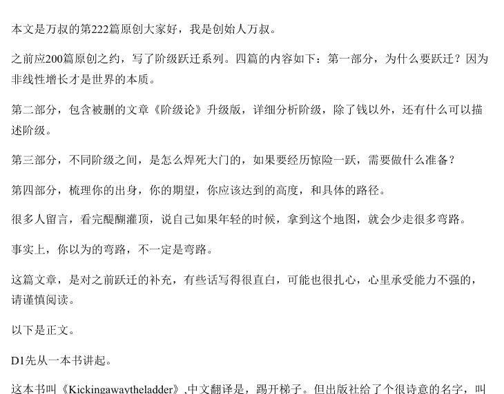

# 阶层跃迁五部曲付费合集

250611 万叔
整理：公众号懒人搜索，懒人专属群独享
懒人微信：lazyhelper

## 阶级跃迁，我们被什么力量困住，缠在原地？

最近几天的文章，明显感觉一些事情在加速。最典型的就是，文章审核时间变长了。所以你们平时9点多收到推送，这周经常要到10点以后。

我从开始做这个公众号到现在，只被撸掉过两篇文章。一篇是讲中国经济、土地财政的，因为里面写的有些事件，虽然我没指名道姓，但很多人都知道讲的是什么。另外一篇，就是我讲中产结构的问题。很明显，这在现有的公开知识体系内，属于不好界定边界的区域。

我为什么要加速这个进程？因为真实的需求，就摆在这里，在这个经济寒冬里，显得无比热切。另外，根据经济周期的法则，大家热切盼望的复苏，有迹象了。

这是第200篇文章，从半个月前就开始准备。几易其稿，最终成文。从过去的反馈来看，对于目标的人群，这个认知的提升，大概是物超所值的。对于一些怀疑我割韭菜的人来说，我这个阅读量几千的公众号，每次的付费阅读持续保持增长，有持续性，大致也能说明一些问题。

右下角为付费人数，不含赠与。在第100篇文章《掌握利益视角，看清世界真相》，我创造了同类账号里，打赏人数的奇迹。

所以，这次的文章，我们再聊深刻一点。直接聊跃迁的本质话题。关于这个内容，每个人的理解不同，如果你只是好奇看一眼，我建议你不要买。当然，我光讲，没用，我会匹配策略。

我们这一个系列文章，要提价到一花西币的价格——79块。如果你只是钉子型社会，最下面的底座，并且觉得生活挺好挺开心的。拿这个钱，去吃一顿肯德基，看一场电影。同样一篇战略规划报告，打印出来，封装好，交给需要的客户，换的是百万咨询费。

给流浪汉，他嫌擦脚太硬。

整个系列文章，全文共1.5万字，相当于一篇中篇论文。不确定能不能活到你复习。

买到的，先截图保存。前言：因为很长，我会改变原来线性化叙述的方式，用4篇合集的方式，采用结构化叙述。系列文章分为四个部分：

- 第一部分，为什么要跃迁？因为非线性增长才是世界的本质。
- 第二部分，包含被删的文章《阶级论》升级版，详细分析阶级，除了钱以外，还有什么可以描述阶级。
- 第三部分，不同阶级之间，是怎么焊死大门的，如果要经历惊险一跃，需要做什么准备？
- 第四部分，梳理你的出身，你的期望，你应该达到的高度，和具体的路径。

含到目前为止，全网最详尽的方法论，可能会颠覆你过去所有的认知。以下是正文。

财富是跃迁，而不是积累来的。

但你觉得好像哪里不对？

之前万叔不一直强调说，人生要努力么？

但我从来没说过，是为了现阶段的回报而努力。

强化你思维里，努力和回报之间的线性关系，是阻止你跃迁最大的恶。今天，我们就要拆掉你脑子里，影响跃迁的思维毒瘤。

要明白为什么，首先要知道是什么。

我们先来聊明白，什么是线性思维。线性思维，是怎么影响我们思考真问题的。举个例子。

之前有个叫李河君的，是汉能集团董事长，做了一个产品是太阳能光伏薄膜。然后，突然在某一天，登上各大新闻的头条。

标题类似：中国新首富诞生，不是马云、不是皮带哥，而是他。

点进去看，按照文章的算法，他的汉能股份，通过炒作，股价拉高了1800%，按照他们夫妇的持股比例计算，身价超过1600亿，成为中国首富。

你是不是感觉哪里不对？

如果中国出现一个新首富的话，你为什么从来没有听说过这个人？

如果你也有这样的感觉，又说不清楚为什么，这说明，你脑子里还没有掌握非线性思考的逻辑。

身价怎么来的？股份X股价=总身价。但事实是这样的吗？

你的股份值多少钱，和你卖出去的时候能换多少钱，他完全不是一码事。我认识的一个快消的董事长，曾经就跟我说过：当你作为最大股东，开始卖自己公司股票的时候，股价会因为你的抛售产生抛压。抛压会导致股价下跌。股价下跌会让你的财富直接缩水，最终支撑不了纸面上的财富水平。所有的拿股份X价格来计算身价的，都是故意误导而已。而误导，一定是有自己某种目的在里面。

真正的企业董事长，大股东们，很少大量抛售自己的股票，对这个级别的人而言，股票都不是这种买进卖出，高抛低吸的玩法。主要靠两个办法，第一，是质押，通过股权质押的方式，获取现金。而质押的价格，基本就是股票的实际价值附近。第二，是增发，利用二级市场的流动性，增发股票，稀释股权，筹集资金。

你说有没有实在想套现的？有。宁波敢死队总舵主，穿阿玛尼的徐翔，本质上就是帮人干这种事儿的。回到我们当初的问题。

为什么大家普遍喜欢、甚至认可线性思维？因为好忽悠。

这个世界，大多数人都只会线性思考。哪怕因为线性思维，产生很反常识、反直觉的结论，也有很多人会信。

除开刚才首富那个故事，经常听到的，如果回到20年前，2003年，你怎么发财？你会脱口而出，一定是买阿里、腾讯的股票啊！

但你知道不知道？阿里从2014年登上美股来看，如果高点你不卖，现在又跌回了10年前的价格。那我高点卖掉不就好了？

也不是。

我再给你举个例子，15年的时候，我项目组，有个小伙伴，开始炒比特币。当时比特币900多美金，快速涨到1500美金。他忍不住买了。结果一下跌回900多美金，他跟我说，那段时间，着急得晚上都睡不着，精神恍惚，一下跌掉了半年的收入。告诉女朋友后，也天天在埋怨他。所以抓心挠肺，后来回本到1200美金的时候，赶紧全部清仓，把钱弄出来结婚去了。

结果后来大家都知道了，比特币几年时间，最高涨到6万多美金，差不多翻了50倍。哪怕就是当时留2万块在里面，几年时间，也成百万富翁了。但，你做得到吗？

绝大多数人，落在那个情境里，都做不到。

因为你对未来是未知的，你不知道以后会怎么样，不知道比特币到底是不是一个骗局，也不知道腾讯拥有5亿用户的时候该怎么变现。除非你看到了那个系统的终局——你知道他必涨，就像你知道中华民族伟大复兴必然成功。你才敢忽略波动，坚持长期主义。

很多阿里人，巅峰的时候号称P7年薪百万，P8前途无量，就是基于当时阿里股价的猛涨。很多阿里人，成为相亲市场上的香饽饽。但实际上，阿里的股票解禁是分年的，等到你的股票解禁的时候，股价可能也跌下来了。此一时，彼一时。

那么，线性思考的习惯是怎么形成的呢？

第一，我们生活中最常见的变量——时间，是均匀、线性流逝的。这个绝对均匀，给了很多人假象，衍生出很多基于时间的认知。比如年终奖，比如工龄，比如那些数着日子过去的信息。但其实时间的密度，是不均匀的。

小时候看快乐大本营，何灵每周主持，我想当然的就觉得，何灵应该是住在湖南，在湖南生活。但很长一段时间内，何灵都是每周飞来长沙录节目，而已。为什么我会有那种理所当然的认知，因为我爹妈就是这样，一年难出几趟远门，我脑子里不会有异地工作这个概念。后来，我服务的企业越来越多，开始需要越来越频繁的出差的时候，慢慢的理解了时间的密度。

我会因为要讲课，好好休息一下买头等舱，也会因为第二天立马要去另一个城市凌晨就不回家开个房间。这都不是我想的，我故意要做的，不是。更不是别人说的喜欢装逼。每一次的选择，其实都是权衡利弊以后，最有性价比的决策。这是先有认知再有的结果吗？不是。而是当你收入、消费不一样以后，决策的基准线变了。收入决定脑袋，决定决策。

第二，线性计算，最多用到小学二年级数学，好算。别小看这一点。好用不好用，决定了大部分人的基准线。你去楼下买水果，问老板多少钱一斤，老板说5块5，你可能会说我买3斤，能不能便宜点？如果用边际效应递减函数来看，便宜是理所当然的，你应该理直气壮的索要。但你和老板，都只是有个模模糊糊的印象，觉得应该薄利多销。具体为什么？不知道。所以买的没有卖的精，因为无论从交易结构上，决策上，博弈频率上，大家都不是站在一个水平线上的。

为什么我要先跟你聊非线性思维？今天我跟你讲透了，你看社会、看世界的样子，又更加趋近真实。线性思考是自然而然的，只有极少数人悟到了，利用线性思维和非线性思维之间的认知差，去赚名声、赚钱、收割。我们要讲的几种认知工具，指数增长、正态分布、幂律分布、贝叶斯决策，都是非线性的。

讲到这里，你对非线性的概念，大概有个印象。均匀的时间，可以通过时间密度的压缩，变成不均匀的质量。算数可以通过正态分布曲线、指数曲线，变成非线性的结果。认知的升级，带来维度的碾压，从而在博弈中，拥有更高的胜率。

好，我们继续，为什么，我要叫跃迁，而不是暴富、暴发、这一类的词？举个例子，一块0度的冰，你加热加热，等到全部化成了水，你测一下，还是0度。为什么？因为从0度的冰，到0度的水，是一种相变的过程，这个过程中，温度的变化是不变的，但冰已经变成水了。这就是广义上的跃迁。

如果你或者送你的孩子去游过泳，就知道。游泳的过程，不是今天游5米，明天游10米，后天游20米，这么累加上去的。是先学动作，在水里扑腾、呛水，突然有那么几下，你发现能浮起来了。从此以后你就从不会游，到了会游。并且再下水，那种不会游的状态一去不复返。这是相变，也是跃迁。

你去读西游记，孙悟空的能力阶段，武力值不是慢慢增长的，而是在向菩提老祖学完归来，武力就满级了。去东海龙宫借一趟宝贝，凤尾紫金冠、七彩黄金甲、如意金箍棒到手，装备也就满级。之后不管是上天庭，还是打妖怪，能力基本维持在这个基准线附近，没有太大变化。直到后来变成了斗战胜佛，又上了一个新台阶。

所以人生看起来很长，其实关键的点，就那么几次决策。关键点上的决策，对历史、对公司、对人生产生了关键的影响。关于跃迁这事儿，我们需要明白的是：
1、人生阶段、财富增长、是不连续的，要更精确的描述世界，需要掌握一些非线性的认知。
2、如果能提前看到，哪些决策是关键，对我们的后续有什么影响，我们的人生就会像开了挂一样。

拿上这两条，再去翻看我原来的文章，可能就会有新的收获理解。好，第一部分就到这里。

第二部分，我们会详细的拆解，为什么说阶层是一个闭环。以及除了钱以外，哪些属性构成了阶级的区隔。

## 阶级跃迁，十张二等舱的票，也坐不了一等舱的船

系列的上一篇文章，在没有任何内容试读、大纲的前提下，有700多位读者，在我这里付费了这篇文章。

711人付费。这里面有两个底层逻辑。

第一，是信用银行。经常有人在下面说，这篇值得打赏，但很少开。我经常跟你讲势能。单篇文章的势能，主要靠情绪价值、热点、或者精彩的洞见，但受制于粉丝量、阅读人数。作为众多公众号中，一个粉丝量注定有限的存在，我在设计商业模式的时候，就思考过，用信任持续积累+单次爆发的模式，突破粉丝低、反馈少的循环。付费文章，就是一次高质量的，集中爆发式成交。这是信用银行零存整取的逻辑。吃第六个馒头吃饱，是因为前面吃了五个。

第二，是持续的高质量努力。我们设计的商业逻辑里面，对文章的质量，是有区分的。B级的文章，讲我当天的见闻、思考、认知回答，当天写当天发。A级的文章，每月1—2篇，要当周提前规划，8—10个小时的选题、框架、必须要讲透一个模型、一个逻辑、或者是一类事情。S级的文章，100篇发一次，必须至少提前二周敲定选题，一周前写好初稿，2—3头脑风暴，2—3次的修改锤炼，才能出来。

我对自己的要求是，像一只高产的母猪一样，把B级的文章，每天2000字，当成别人A级文章去努力，去持续努力。就能让别人对A级文章，就充满了期待。我的A级文章，又能经常超出预期、而不是割韭菜的时候，付费量就会越来越高，公众号的势能会增加。才会有S级文章的爆发。

最让我感到惊喜的是，我的第一篇S级文章，第100篇《掌握利益视角，看清世界真相》自愿打赏。后面有做公众号的运营问我，你粉丝有没有50万？我说只有几万的时候，他也震惊了，说很多百万大V，出现这样的打赏数量，都算是高光了。持续，高质量的努力，一定是有机会的。

最后，再介绍一下这个选题的内容——阶级跃迁：这次的系列文章，分为四个部分。

第二部分，包含被删的文章《阶级论》升级版，详细分析阶级，除了钱以外，还有什么可以描述阶级。

第三部分，不同阶级之间，是怎么焊死大门的，如果要经历惊险一跃，需要做什么准备？

第四部分，梳理你的出身，你的期望，你应该达到的高度，和具体的路径。含到目前为止，全网最详尽的方法论，可能会颠覆你过去所有的认知。现在购买，还可以看到之前发布的系列全部内容。以下是正文。

线性积累的问题在哪里？先问一个问题，在财富的天梯里，阶级为什么要跃迁？

其实我问的是，我能不能靠工资，每年涨20%，4年翻一倍，然后省吃俭用，白手起家，慢慢攒到千万净资产？读者里，除了创始人、高管以外，也有很多人投资房子、炒股票。我们再翻译一下，我能不能靠买一套房、涨了，卖了以后买同价位没涨的，一波一波慢慢吃，然后实现10倍涨幅？我能不能每天做T，高抛低吸，日积月累，赚10倍？但凡有过经历的，大概都知道，答案是否定的。因为在财富积累的过程上，因果关系是，质变推动量变，量变产生不了质变。

线性积累的问题在于，你财富已经到下一个阶级了，但思维、消费、标签、圈子、别人的认可，都还在上一阶级。他们会像泥沼一样，拖着你在原来的环境里起不来。我再说明一点，不同阶层，是有明显画像的。收入—阶层—融资模式—还款模式—商品消费，不同企业、不同行业在看不见的手的作用下，形成了一个稳固的闭环。这有个专业的术语，叫用户画像。

等于200万，甚至无本盘下3000万资产，只要负担得起银行利息，就可以极高的杠杆、撬动巨量资产。如果房子2年涨了10%，去掉利息，等于200万翻倍。这是上一层次的玩法。普通人买300万的房子，想赚200万需要100万首付，房子价格涨1倍，5年。

而高维的玩法，1、200万本金，涨一倍就能赚2000万。但是，这些认知，你知道了，有用么？你一个月一万三，家里凑了首付买房子，你认知足够广，听说除了住房贷款以外，还有一个叫经营贷的东西。你向中介打听，说你听说，做这个模式利率会低一点？中介说，嗯。但，你有公司吗？公司流水如何？注册多久了？

你没想到，回去算了算，发现养公司、做账、注册、场地的成本，如果只是为了这一次的房子，算下来和公积金差不多。而且你公司没流水，银行给你贷款的成数也很低，你杠杆还是上不去。你选择不那么麻烦，回去跟中介说算了，还是走一般的银行贷款。久而久之，对工薪族，中介就不会说有几种方式，看你怎么选，对他而言效率太低。你也会觉得，这个路径没有用，进而回到打工攒首付的认知里。信息壁垒就这么形成了。

再举个例子，说明一下不同层级系统性的差别。我因为常年在外面跑，有一些会员权益，从希尔顿的会员，到航司金卡白金卡，到刚性年费信用卡。这些会员，都会给你一些优惠，比如行政酒廊、升房型、候机厅VIP这些。说白了，就是让你用500块钱的价格，购买成本300标价2000的服务。

如果你平时常住希尔顿体系，会员权益可以留住你，不让你转去万豪。但如果你平时住如家，这个权益体系对你就没有吸引力。他是要住20次或者40晚才能升级成金卡会员。我刚好，就是他画像里的目标客户。所以，我买是性价比考量，是省钱，你咬咬牙，为了装逼，为了这些醋去包饺子，就是消费的错配。你去看那些小中产们，咬咬牙买几万块钱的包，然后挤地铁，吃烧鸭饭，这就是错配。

奢侈品，过去就拿捏得准这类人的心思，吃他们的血汗钱。现在经济下行，LV干脆直接不装了，反复提价，把年入300万以下的人定位成零收入阶级，不做你的生意。而只是皱皱眉头，就买的人，变成了他们主要维护的客户群体。所以，哪怕你买了LV包，你靠贴钱入了希尔顿会员，你也会觉得不舒服，不自在。因为这不是属于你的阶层——不同阶层的消费选择和方式，存在着系统性的差异。你赚钱的难度，决定了你消费的认知。

像京东会员卡，山姆会员店的年费，是把劳动人民和中产区隔开。航司里程、酒店会员、刚性年费白金信用卡，就是把普通客户和商务客户区分开。千万不要只看表面，要用利益视角去看。决策看性价比，跟本人大方还是小气，关系并不大。讲完了，如果有点吃力，我们再捋捋整个逻辑。

这些体系、优惠，比如一年优惠1万，对你有吸引力，是因为你平时的生活、工作状态就是这个消费等级，比如一年20万。而要达到这个消费等级，你一定是有更高的收入水平，你自己、或者公司才会为你支付。有更高的收入水平，你会为企业、为社会创造更大的价值。比如一年创造500万的产值。同时，围绕在你身边的，税务筹划、咨询、理财、消费推送，也都完全不一样。明白了么？

背后的逻辑，就是这么层层嵌套起来的，缺一不可。如果你身边的人，号称已经A8/A9，还保持着A7/A8的习惯，你大可以打个问号。如果不是用估值、线性测算，实际没达到这个阶层的话，大概率就是勉强挤进来的。

你去看《了不起的盖茨比》，一个被写进美国教科书里的小说，里面的NewMoney和OldMoney 区分特别明显。

OldMoney，老钱，讲究的是什么？是持续性，是不工作了，靠着资产和现金流被动收入维持稳定的生活。真传一句话，保持阶级不下滑的秘密，是掌握生产资料。

所以A7和部分看着像A7的A8，问题在于，你的钱，都是出卖自身劳动力赚来的。所以你很着急，你知道财富积累靠自己，你希望下一代能继承你的能力、智慧、天赋，然后继续靠这个去赚钱。这是最担心阶级下滑的一部分人。

## 跃迁是一次次的进化与涅槃

所以，我前面花大力气，跟你讲不同层级有系统性的差别。目的是什么？是想跟你说，凭上一个阶层的打法积累，是很难在下一个阶层继续成功的。刘强东刚开始卖DVD，是靠口碑、回头客挣钱。后来疫情，被逼着误打误撞走进互联网，靠互联网杠杆赚钱。再后来成立京东，融了资，开始深刻思考企业价值，决心投资仓储，提升物流效率，进入了本质。卖DVD，哪怕做成中关村最大，一年也就是7、8位数。互联网上卖产品，可能做成一个淘宝店，到顶一年几个亿，几十个亿。只有后来自己扎根，成为了生态，打开了增长空间，才有喊出万亿市值的雄心壮志。

刘强东靠做淘宝店，攒了100亿，会有投资人愿意给他投资，让他继续做到万亿企业么？不可能，因为赛道不对，天花板封死了。泰坦尼克号上三等舱的船票，杰克和肉丝的邂逅终究只是童话。为什么钱和钱有差别？比如珠江新城买房子，1万的时候买的，现在涨到了10万，运气好，赚到1000万，这种算不算跃迁？如果是职业炒房客，大概算。如果是买房自住的，非炒家，大概率还不行——你的消费水平，认知、圈子、意识，还是偏向你的工作环境、收入水平。

这一套逻辑，我想清楚的时候，发现这是能解释，那些中彩票的人，为什么很少改命的原因。你是意外的财富，等于游戏里卡BUG，得来的财富。对财富的认知，还停留在你主流圈子、主流收入、主流消费的那个层级。社会有1000种办法收割你，把你打回原形。只有你暴富以后，快速把认知跟上，马上能用上一层的玩法，加上手里的资源，钱滚钱，赚到这么多资源该有的回报。你才算跻身进了下一个阶层。

但这就是难点。你只会百万级别投资，千万级别的业务，对你而言就是陌生的战场。庙算少者，必然不胜。

万叔之前工资5000那会，靠拉炒股群，请老师，收学费，一天赚3万。然后就飘了，觉得赚钱这么牛逼，炒股肯定也牛逼。100万投进股市，碰上股灾30多万出来。那段时间，感觉每天行尸走肉。后来炒币，币值总额一度达到接近3000W，因为都是小概率杠杆上来的。竟然一度冒出：再加一波杠杆，资产翻3倍彻底退休的想法。不知道见好就收，也不知道物极必反，一天晚上，当我被平台连续的预警短信和电话吵醒的时候，发现为时已晚。除了钱包里的10个比特币，平台交易的全部爆仓，从资产破亿的美梦到破灭，就差一个雨夜。到今天还没涨回当时的身价，但那种浑身发麻、大脑缺氧的感受，到现在还记得清清楚楚。

再后来，就老老实实赚钱、提升认知，不再和金融大佬们做对手盘。

相信我，普通人拿到一个亿，除了存银行，根本没有更好的，哪怕一年10个点回报的投资手段。

你掌控不了你认知之外的财富。

这就是为什么要跃迁，不仅是财富的跃迁，也有认知的跃迁。

只有当你在脑子里的模拟大富翁，能驾驭A8/A9的财富，你又赚到钱，模拟变成实战，你才有把握，继续增值，不掉回原来的阶层。

这是我的血泪教训，也是我花一整篇的篇幅，跟你聊的原因。好了，小结一下前面的内容。

第一部分，讲的是宇宙充满着不均匀与不连续，要在简单的线性思考之外，建立非线性思考的意识。

第二部分，讲的是阶层的划分，真正的阶层是体系性的，和钱相关，但不一定完全成正比。

在一个圈子里，有这个圈子的气味，融入这个阶层，你就是这个阶层的人，至少包括收入模式、消费模式、认知，等等。

你要进入下一个阶层，一定要采用下一个阶层的商业模式，赚钱方法，才能进主流圈子。

通马桶一个月赚一万多，月入5000的小白领照样不愿意去，阶级圈层不同。

读到这里，可能有人会急了，你为什么不直接告诉我怎么跃迁！两篇文章了，都还在前奏！

因为之前是一篇接近2万字的文章，拆成了4篇做合集。

所以结构上会有影响，毕竟单篇的话，每一篇都需要有起承转合高潮迭起。

但这样也有好处，就是每一篇发表的时候，都会对结构、内容、例子进行进一步的优化，最后的呈现效果，比我单篇的质量要高不少。

如果你买了合集，也不要着急，既然这么多年都过来了，就不差这一两周。而且，没有什么灵丹妙药，大道至简，关键在于知行合一。

你知道人生靠跃迁，知道不要去模仿更高层次的结果，而是要去学习他们搭建商业框架的逻辑。

你开始关注职场、行业天花板，并且有不断突破天花板，不断增长增值的意识。

在未来某一次选择的时候，突然想起我跟你说的，做了正确的决策，你就值回票价了。

普通人踏踏实实，不走弯路，不在低层次循环，积累个千万资产，没有问题。上一篇留言区，有人问，绝大多数时候都是平静的，我该怎么保持对机会的敏锐，同时度过平静期？

下一篇讲具体的方法，怎么树立人生目标，怎么度过绝大部分时间的平静期，践行普通人最靠谱的办法——“投资保值增值+关键节点跃迁”的理念。

敬请期待。

# 阶级跃迁之三，不同层级的跃迁指南

先介绍一下阶级跃迁，这个选题的内容：这次的系列文章，分为四个部分。

第一部分，为什么要跃迁？因为非线性增长才是世界的本质。

第二部分，包含被删的文章《阶级论》升级版，详细分析阶级，除了钱以外，还有什么可以描述阶级。

第三部分，不同阶级之间，是怎么焊死大门的，如果要经历惊险一跃，需要做什么准备？

第四部分，梳理你的出身，你的期望，你应该达到的高度，和具体的路径。

第二部分发完以后，有个跟我年龄差不多，10亿级别资产的朋友，跟我微信语音了半个多小时。

十亿说，万叔，你前面的东西，理论很好，但是太虚了。我跟他解释说，一个人，知行合一的步骤，是这样的。

先被天雷劈中，觉察到世界上居然有这种活法，然后系统的提升认知，再然后去践行，提升胜率。

十亿说，这是你的逻辑，也可能是你们咨询的逻辑。但大部分人不是你这种学习模式。

多数人，是先看别人的结果。

结果好，就去模仿去学，在模仿和实践中不断总结，形成自己的打法、方法论。你面对的人群，职场人士、企业家、高管、创业者。

除非你说了，这个就是课程，教你认知，搭建知识体系的课程。

否则，大部分人，还是喜欢听案例，听故事，讲那些刀刀见血的，具体的，活生生的人和事。

这哥们，也是白手起家，在深圳做外贸，找到了风口，一波做大做强，成就了今天。

万叔仔细想了想，也有道理。

所以，就废掉已经写好的4000多字文章，推倒重来，重新梳理一下后面的思路，不讲那些概念、方法、理论。

以案例拆解的思路，讲讲跃迁的准备和典型层级。

原来的文章，就作为完结以后的附件，大家可以接着看。我拆解两个人。

一个是新东方的老板俞敏洪，一个是我服务的客户。

不讲太多的理论，直接拆解，看懂这篇文章，让你知道两件事。第一，你现在，具体处于哪个层级。

第二，你这个层级，哪些是你的核心跃迁的准备，哪些不是。

对了，买本篇文章的，前两篇文章也是可以看的。建议按顺序阅读，效果更佳。以下是正文。

普通人努力的天花板，有这么几个。

一个是顺势而为的雷军，一个是单点突破的傅盛，一个是一生波折终有好报的俞敏洪。

什么叫普通人的天花板呢？

就是这几个家伙，换个时代，换个背景，换个行业，只要还是这几个人，基本都可以达到，那个时代的这个等级的成就。

不像马云、马化腾、张一鸣，这些互联网大咖，他们的成功几乎是不可复制的。今天第一个拆解的就是俞敏洪。

他的职业生涯，从创立新东方开始，经历了三个层级的变化。

第一层级：产品人。1993年，俞敏洪创立了新东方学校，这是中国第一家提供TOEFL和GRE培训的民办教育机构。

在这个层级，俞敏洪怎么打造自己核心能力？

就是死磕托福考试，通过各种手段，把应试能力做到最强，做到有口皆碑。做到火出圈。

第二层级：企业家。新东方的成功，使俞敏洪从一个创业者成长为一名成功的企业家。

最典型的，就是他拉了王强和徐小平两个，读书的时候比他更加优秀的人。2006年，新东方在美国纽交所上市，成为中国首家在海外上市的教育机构。

俞敏洪在这个层级，展现出他作为企业家的领导力，多重借力，才有了新东方的强大。

第三层级：投资人。不再全部靠自己去拼搏，而是从新东方，孵化出了东方甄选，打造董宇辉他们一拨人，成为新东方在下一个时代的入场券。

使得教培行业被锤以后，新东方依然可以体面的，换一种思路延续下去。

这种体面马化腾在从全面抄袭，到引入刘炽平开始孵化半个互联网以后，成功转变。

在腾讯凭借微信，拿到本时代的移动互联网船票以后，就坐实了。

一件事爆发，从浅到深，我们可以分析至少三个层次。最上面是看得见的部分，是故事、结果、公告。

下一层是资源、策略、决策，也是我们可以学的地方。再深一层是逻辑，就是抽象出来的方法、原则。

很多人对一个企业，一个企业家的理解，聊到故事这一层，就结束了。

但我们要听的，不是故事和冰山上的结果。

我们要研究，俞敏洪阶级跃迁的背后，有什么样的策略、哪些关键资源，在支撑着他。

这些才是我们可以学习、可以准备的点。

第一个层级，俞敏洪的破局策略是抓住趋势，打造核心产品。

毕竟北大的工资不高，限制还挺多。愿意走出这个围城，自己开创一番事业，是他的惊险一跃。

这个时候，俞敏洪踏上的风口是，随着WTO和奥运会的敲定，中国人走出过国，对外语培训的需求与日俱增。

而他并不是泛泛的谈提升英语水平，而是抓住了当时的刚需——TOEFL和GRE，也就是想出国深造留学的那一批人。

这也和他在北大教书的经历有关，如果不是这个经历，可能都看不见这个需求。

所以，抓住一个趋势，找到核心问题，全力以赴的去钻研，单点突破，制造影响力。

俞敏洪之前是不是一个北大好老师？不得而知。但他看到了托福GRE的风口，就死死的抓住。

这是付费文章，我讲点真实的。

—当时中国从来没有过托福培训班，怎么能针对性的提分，涨分？

要针对性的了解托福。

—怎么能更好更准的了解托福考试？直接对照原题进行分析。

—托福真题不外泄，怎么对照原题进行分析？

到这里，你就懂了。

在你还在讨论俞敏洪当时的做法，道德不道德，合理不合法的时候，人家已经做出成绩，单点突破了。

普通人，最缺的是什么？是机会。

比如我反复说的，短视频大潮来了，你还在纠结要用什么灯光、什么手机，怎么选题，怎么解决技术问题。

这大概率不是你的机会。

草莽的起盘，从来都是混着泥浆和血水，大喊王侯将相宁有种乎，然后脑袋别在裤腰带上，冲出来的。

发现一个趋势，就要像狗咬骨头、饿虎扑食、飞蛾扑火一样，奋不顾身的扑上去。

做到极致，吓住所有想上来试一试的，让竞争者成为你看台上的观众。

所以，你明白了，中国14亿人，为什么净资产到千万的，只有小几百万而已。千分之几的概率。

如果连这点风险都不敢承担，就继续做个普通人，也挺好。

第二个层级，从新东方找回王强、徐小平，到2006年上市，俞敏洪的策略是依靠系统杠杆。

这个层级，就是从一个产品经理，蜕变成一个企业家的过程。第一层级需要的是个人极致的努力。

第二层级需要的是系统的力量。

你去看新东方的第二层级，拉着这面大旗，汇集了各类英语培训的高人，一起经营新东方。

这里面会不会有问题？会不会有矛盾？会不会出现品牌影响？当然会。

但是你要问问你赚的是什么钱。

你的格局的天花板在哪里？

跟大多数人一样，刚开始俞敏洪的格局也在，中央收税、各地分封的模式下，从各地新东方学校抽成。

但这就是新东方，名气大于交付能力后的最优解。

你如果自己培养人才，然后慢慢扩散，可能趋势的风口就过了，新东方面临的会是群雄并起，诸侯割据的局面。

但这也埋下了矛盾的种子。

到了后来，3个人之间的矛盾越来越大，俞敏洪请来和君咨询公司的总经理，我师父王明夫来解决问题。

王明夫拍板，发展的问题，发展中解决，俞敏洪一边坚守北京新东方这个样板间，一边听了王明夫的，靠资本的力量寻求更大的发展来破局。

确立了从纠结利润、分红，中央和地方的博弈，到一切向资本市场看齐，各地方谋求资本估值最大化的战略。

从此一套目标平天下，新东方上市后一年多百亿估值，妥妥的教育第一股。

这次的破局点，不再是俞敏洪自身的能力、产品，而是借用品牌的杠杆、团队的杠杆、人才的杠杆、资本的杠杆。

在这几重杠杆的加持之下，从产品游戏变成了资本游戏。

俞敏洪也完成了，从一个一年几千万小老板，到百亿市值行业第一的老板的蜕变。

第三个层级，是俞敏洪对时代、趋势的理解。

2019年的时候，新东方在线在香港上市，当时的新东方在线还是服务于新东方教育集团的一个在线教育板块。

但2021年，新东方经历了史无前例的打击。

遇到疫情叠加双减，无数的老板破产清算，以及欠发员工工资、在网上卖惨求支持的。

冬天来了，劣质的企业破产，人才、资源的释放，本身就是天理循环。

但俞敏洪可能早有察觉，体面的关停了新东方所有学校，补完老师的赔偿、课时费、支出200多亿，捐赠了所有课桌椅。

怎么办？也涌进了直播带货行业。

之前有文章写过，如果你是从低势能行业，转向高势能行业，那么过去的失败，就都还有希望。

直播带货，明显是一个比教培大得多的赛道。

在这样大的打击之下，可以坚定选择一个新的赛道，利用旧的能力在新场景中找方向、找趋势。

俞敏洪的商业能量，已经大成，祝福俞敏洪。

看到上面，你好像懂了，俞敏洪各阶段的破局策略。

很多深度的分析、采访，包括我免费文章里，对事件的分析，到这一层也就结束了。但对我们S级文章的交付而言，还不够。

我还要把每个层级跨越的核心目标，以及重点、难点，都掰开揉碎的告诉你。你收藏好，常看常新。

当成一个自我对照衡量的指标，实现我开头跟你说的两个目标。

第一个层级，是从一无所有，到实现工具价值。

我在文章《人的价值有五个层次，张艺谋只给你讲了第一层》里面写了关于价值的几个层次。

只要你不是资源所有者，你的开局，往往都是从工具价值开始的。通过实现工具价值，获取谋生手段，积累自身的能量，必经阶段。

这个层级最难跨过的，一是实力有限，不钻研不进取，无法出圈。

二是过早寻求结果，宁愿去差一点，但是安稳、平顺的环境，而不去拥抱洪荒的、未知的趋势。

这时候你会经历被人占便宜，被公司、领导公开或不公开的压榨。你会有很多的抱怨和委屈，觉得社会、组织对你不公平。

怎么办？

你所有的委屈、精力、时间，都用在什么趋势下，向着公司的核心业务、核心部门、解决核心问题的方向去的。

那任何的委屈、吃亏，都算不得什么。

这个结果包括很多，包括你自己收益、稳定的生活、舒适区的工作内容，在这个阶段，都不重要。

所谓的结果不重要，重要的是经历、体验、历练，就是这个层级。

第二个层级，是从个人贡献，到组织贡献。

当你实现了工具价值，遇到贵人，让你操盘，开始从个人贡献，成长到组织贡献以后，你要做的，是扩充你的系统力量。

你认识多少人，有多少人能帮你，加入你，和你形成链接，成为利益共同体，就变得极为重要。

你的目标，就从你有多好的产品，多优秀的名头，变成你能驱动多大的杠杆，有多大的组织能力。

这个层级最难跨过的，一是从我来做，变成我驱动别人做。

尤其是专业壁垒高的工作，我自己就经历过，才明白自己做和带人的差别，需要的能力大相径庭。

差不多1年的磨合期，从一个自己干活的高手，变成一个培养人的高手。

二是从交付到链接，驱动组织杠杆、品牌杠杆、渠道杠杆、资本杠杆。

刘强东当年拿融资的时候，也不清楚什么是公司估值，还拿公司的净资产盘点去和徐新谈。

这就是你专注于做事，缺少相关的品牌、渠道、资本、组织能力的表现。这些都需要人才搭建，没有人能成为全才。

想跨越一个层级，不再钻研到具体的事物中，把时间用于链接资源、打造品牌影响、获得资本认可。

这一关非过不可。

第三个层级，从组织视角，到资源视角。

到了这个层级，就是以认知和价值观驱动，做符合历史趋势、符合商业趋势的大事。好像转了一圈，又回到趋势上，但完全不一样。

第一个层级看到的趋势，是觉得房价要涨了，就赶紧去买一套房。

第三个层级的趋势，是觉得国运来了，经济周期到了，我要赶紧去买地建房，迎合市场的需求规律。

巴菲特这个老狐狸，看懂了，但是不明说，而是说，天上掉钱的时候，要用大一点的盆来接。就是这个意思。

这是因为有前面的产品、认知势能能做支撑，才产生的链接，才会有人愿意和你组成利益共同体，共同开展业务。

这还不是结束。

拿下招牌以后，一直名头很响，但不赚钱。因为公益属性，不允许商业化。怎么办呢？我给设计了一个区分开的，商业化的手段。

总结下来就是，三区分、三强化。区分客户、区分产品、区分服务。

强化遗嘱库的公益属性，强化遗嘱库的品牌认知，强化商业合伙人的利益回报。

同时，也建立合伙人机制，把品牌架构拉大，争取封杀品类，避免未来全国各地的诸侯割据。

最终的方案老板非常满意，几年以后就从公益亏本项目，变成了一个几千万/年的商业项目。

至于第三个层面，目前还没有到。

但是未来如果行业有变动，这家头部企业，一定是能在里面有话语权的。诸葛亮给刘备的出师表，不也是这么说的。

待天下有变，则⋯⋯这种趋势性的增长，需要天时地利人和，但我相信，不会太差。

这次的文章，不单单是看完、知道、理解，这么简单。

给你一个课后作业。

看完以后，对照一下自己，尝试回答下列问题。

你的学历、工作经历、家庭状况等基本条件，你的起跑线在哪里？你现在是什么状态？你在哪个层级？（3层级+A6/A7层级思考）你对你的收入、状态，满意吗？为什么？

你如果想突破现在的层级，以你现在的基础、资源、认知，你最需要做的，3件具体的事情是什么？

下一篇文章之前，我会挑精彩的留言，进行回答、分析、拆解。1000个付费读者，100条精选机会。

希望在评论区看到你的精彩分享。

如果不希望公开的，也可以在留言末提示。

越在上层，抓住历史机遇越重要。

北大的屠夫陆步轩，从一个正儿八经砍刀切肉的，变成了肉类食品公司的总经理，这是北大可以给他保的底。

因为你考上北大，凭着同学关系，那些平步青云的让你过得体面，不难，成本也不高。

之前讲阶级分层的时候，我是从A6讲起。

但其实A6下面还有A5，就是，全身家当10万块钱都拿不出的。他们存在吗？真实存在着。

那些农村里，没有赶上现代化进程的，失去劳动能力的，残疾人等等。但你只要有手有脚，认真做事，混到13亿人所处的阶层，其实不难。

但你从千千万万个建筑承包商、小老板里，变成碧桂园的杨国强，就不是你努力，天天下工地带头抓质量，可以解决的。

碧桂园从平靓正到五星级，到开始研究出的“高周转”，带着他们的底层金融逻辑，一度成为宇宙第一房企。

13—18年，我所有对房企的战略咨询里，无一不谈高周转战略。但有些地产商成功了，赚了不少钱。

有的地产商也很努力的在做，但因为规模小，拿地能力差，实施高周转的价值，并没有预期中的高。

人生的跃迁也是一个道理。

我在这里先给你一张地图，你是什么能力，你在什么位置，你的目标是什么，大致给你个判断。

- 1、今天的读者里，一定有不少A6的。

当你盘一盘你的身家，发现净资产只有几十万的时候，你可能会觉得难过不舒服。但其实这才是常态。

中国两亿大学生，一亿A7+，而已。

当你是专科以下，或者普通本科，40岁以下，是有机会跃迁上一个层级的。比如你是老师、护士、私营店老板、普通工人。

你通过学历的提升，认知的升级，对工作的钻研，用稳稳的努力，超过80%的人，实现百万身家，一点问题都没有。

当你把餐厅开出特色，把工作做好升到企业中层，甚至是从小地方来到大城市开始认认真真的打拼的时候。

成为A7中产一亿人中的一份子，不难。

- 2、如果你已经是在A7的阶层，在一线城市有一套房子，开着BBA中档车，还着贷款，拿着互联网公司级别的工资，是别人羡慕的中产。

但加班已经累成狗了，怎么跃迁？寻找结构效率的提升。

在这个级别，结构效率，一定高于运营效率。

A6那一套，肯定不适合你。

从主管到高级主管，涨一点点工资？辛苦点拿点加班费和项目奖金？

在这个阶层，学历对你而言是敲门砖，技术、能力对你而言是压舱石。

所以一些这个层级的朋友，问我说自己像人肉干电池，每天被榨干，怎么摆脱这样的困境的时候。

几乎后面都会问到一句：我要不要去学学XXX？

不重要，真的不重要。虽然互联网制造焦虑，最大的收割者就是这群人。

因为良好的教育、公司制的环境、技能漏斗的筛选，造成了这群人的信息茧房。觉得如果发展到了瓶颈，是能力上限了，还需要提升一下能力。

但在我看来，多数是结构问题。

拿我自己，如果我只是做一个优秀的咨询顾问，我的时间是有限的，脑容量也是有限的，服务的客户也是有限的。

我通过熬夜、加班，也很难突破这个瓶颈。

尤其是，社会给中产们，规划了一整套逻辑和枷锁。让你的资源积累，沉淀在房子、消费、中产伪需求上，卡在这个层级上不去。

等35岁来临，就发现人生居然不止是一条上升线，居然是一条抛物线，后面就是人生真相的起起落落落落落落…

所以我花了几年的时间，把咨询能力，沉淀在知识能力上，用团队的方式去交付。

而我自己的时间，可以放在最关键的节点，以及可以尝试各种新媒体，通过杠杆手段获取更大的增长空间。

这里有两个杠杆，一个是团队杠杆，一个是流量杠杆。

所以，收入结构的变化，是站在未来看现在，去思考未来的流量在哪里，增长在哪里？

站在高处看现在，我能不能用杠杆，怎么加杠杆？

我的精力怎么分配？如何能用有限的时间和精力，创造最大的价值，站在结构上获得收益？

我作为咨询顾问，平时写的报告，和现在的文章，完全不是一个风格。所以在我刚刚写公众号的时候，有同行的朋友，好心提醒我。

说你讲白话，用短句，语言风格，会让人质疑你的身份，觉得你不专业。我说你懂个屁。

讲干货、讲商业、讲管理的，因为天然受众面小，根本传播不出去，没人看你。没有基数，哪来的精准用户。

后来事实证明我是对的。对于还在A7苦苦挣扎的打工狗，在线性努力已经发挥到极致的前提下，一定要有杠杆思维。

产品杠杆、流量杠杆、资本杠杆、团队杠杆。

突破线性思维、突破路径依赖、突破知识诅咒、链接更高能量的人和企业和决策者，你离下个阶层就不远了。

## 3、到了A8（净资产千万）层级的，都是精英中的精英。

不要听有些人说，他没读过书什么的。

在这个级别的精英，只是没有文凭而已。我没见过任何一个老板，不学习的。而且，这个级别，你多数已经是企业主，或者至少是企业核心层。

还能不能再往上走一层？

我目前看到的机会，我们普通人通过努力，是可以财富过亿的。但你一定要开始掌控资源，链接项目。

什么意思？

不是做操盘手，而是操盘。以前做土地开发，做房地产开发的，设计、施工、监理、销售、运营，都是靠乙方辅助。

甲方做什么？

一是整合统筹，二是资金土地资源获取。

不掌控生产资料的，行业天花板太低的，没有足够杠杆的，一定是到不了更高层次。

我给自己的公众号、视频号这些新媒体的目标，也就是做个百万、千万级的小而美。

像现在混乱的短视频市场，多数优胜劣汰活下来的，大概也就会保持在千万营收级别的规模。

有没有可能再往上走呢？

靠流量+产业，通过流量赋能某一块产业，某一种商业模式，进行快速的传播，盘活百亿、千亿级的资产，这个目标就可能实现。

这些都不是个人决策，一定是企业家和资本、政策、趋势、商业结合起来。所以，一定要和新技术，风口，土地，资源，决策者链接起来。

靠未来的资本市场改革，国际形势变化，一带一路出海带来互联网红利和中国模式的复制，我认为是有希望的。

以及，把企业资产证券化，通过几十倍的市盈率，实现估值的跃迁。

## 4、再往上，几十亿、上百亿级别呢？

再往上我就不太清楚了，有几层，按什么划分。我只知道，越往上，钱的影响力，占比就越低。努力的占比也越低。

那些不能说的，以及运气、人脉，占的权重会急速提升。

第二个维度，是目标和努力的一致性。

我有个朋友，选调生，在一个村里当村官，待了几年。确实把产业、经济搞得很好，很有成绩。

但是后来领导问他，要不要继续留在这边，做村长的时候，婉言谢绝了。很明显，他能力强，但他的目标不在这里。

一个人的目标，主观决定了他成就的上限，很多人没想清楚这一点。

一个根据周遭环境变化来决策的企业，和一个向着目标去奋斗的企业，产生出来的动力、精气神，都不一样。

放在人身上，也是一回事。

如果你有高的目标，现有的委屈、牺牲、隐忍，这些动作，你都做得出来，并且不需要别人用鞭子抽着你。

那，你可能会问了，眼前的苟且，诗和远方，怎么取舍？

几乎所有看过的信息，都只是告诉你，一些模棱两可的结论。比如不止眼前的苟且，还有诗和远方。

或者人无远虑必有近忧。

这些太极拳一样的道理，当你真正到生活中来的时候，你还是不知道怎么用。因为决策是错的吗？

不是，他们展示出来的，都是他们的生活状态，他们在那个条件、那个场景、那个环境下的决策。

而背后的考量，真实的基准线，都是水面下的冰山，是你看不到的。如果盲目地去学名人、成功人士，就容易水土不服。

之前我也讲过，一个人应该把完成日常工作的时间，压缩到60%，有40%的时间去为上级创造价值，同时额外多出20%的时间，考虑下一个层级的积累。

这也是基于我自己的经验，大致描述出来的。

为什么一定要提一个比例？因为很多人都没有自己的思考，你教他方法，他自己不会用，必须告诉他你就按这么做。

但我默认，今天付费的读者不一样，都是以一二线城市、高知、A7/A8这个层级的人为主。

所以我把背后的方法论，给你讲清楚。之前我讲过α收益和β收益的理论。

怎么不让自己膨胀，觉得自己的成就都是靠努力？你把自己的收益，分为α和β两部分。

β收益是指，你所处的行业、区域、企业的平均收益水平。这考验的，其实是你的选择能力。

你在一个上升期的行业，在一个经济发达的城市，在一个好的公司，就应该有这样的收益。

α收益是指，除去选择以外，你比行业、企业、区域多出来的那一部分收益。

举个例子，假设我是一个公司普通的项目经理。

按理讲一年正常收入就在β万元。

然后我通过多接项目，白天干晚上干，获得了多出来的收入，通过把咨询案例、个人思考变成文字，分享给大家看，获取打赏，一鱼两吃。

这部分的就是α收益。

这样就可以判断，我的努力是有效的，还是无效的。这是个很强的认知自我的工具。

我们把这个工具平移一下，重新做个定义。

你的时间、精力，也分为X/Y收益。X收益是你为跃迁做的努力准备，Y收益是你看得见摸得着的收益和准备。

我之前的文章讲过，做一个项目，做完以后，有奖金，有荣誉，你是项目负责人，你应该怎么去思考？

如果荣誉是你迁升的勋章，你要毫不犹豫地占住位置。

奖金，就大大方方地多分给团队的小伙伴，不要觉得你自己贡献多，就“按劳分配”。

如果荣誉只是内部的一些表彰，那么连荣誉，你都让出去，鼓励小伙伴们更加努力。

你自己收获的，是领导上级看见的，你的操盘能力，给你更重要的项目机会。跟很多人觉得，我先要保证自己的收益，再去考虑跃迁的事情不同。

我主张的是，越是等级低，越要优先考虑跃迁升级。

我当年作为一个咨询小白，进入一家规模国内前列的咨询公司，每天面对各种精细的要求：字号、字体、格式、颜色、对齐、表达。

我怎么做的？

我很清楚地知道，这些事情只要等我升到项目经理，就全部解决了。因为这种努力，几乎都是Y收益，X收益极小。

当项目经理，要的是结构化能力，是视野，是建模能力，不是做排版、格式的速度。

我把文件脱敏以后，花钱在网上找人帮我查，帮我改，自己的时间花在学习逻辑、学习项目管理、学习理解客户跟客户沟通方面。

艰难吗？艰难。

因为自己对细节确实不细心，遭到过很多次批评。

巧的是，因为公司发展快项目多，我成了同期进公司的人里，最先升成项目经理的那一个。

而那些做事认真仔细的，还在继续作为优秀项目成员，每个月拿A的绩效。只要你肯吃苦，就可以一辈子吃苦。

当你把努力拆开，变成X努力和Y努力以后，你对那些在原地踏步的人，就看得清清楚楚。

你也会知道自己跃迁要怎么准备，你的生活会更加透彻。

# 第三个维度：顺应时代，顺应周期律

如果你不认识周金涛这个人，你应该多少听说过“人生发财靠康波”这句话。

虽然认真研读以后，发现周金涛对未来的预测，比如15、16年是资产顶，19年有发财机会这些，几乎全是错的。

但他的这个思路方向，绝对正确。

疫情那会，研究完周期后，我总结了四条周期曲线，和四句话：
- 第一句话：经济周期决定财富波动
- 第二句话：产业周期决定风口趋势
- 第三句话：企业周期影响战略与管理
- 第四句话：个人周期影响人生策略

之前，这一套都是在企业级的战略培训里分享出来。今天是第一次，放在公开平台。

内容很多，围绕四条曲线，可以讲两天一夜的战略课程。这里，单取一点，讲一个顺势。

为什么很多人觉得，现在经济这么艰难？

因为你在一个本该上升的人生周期里，遇到了经济下行的周期。

经济下行导致行业萎缩，行业萎缩带来企业保守，企业保守带来个人成长受限。而个人成长受限，得不到正反馈，就会觉得努力没有结果，从而躺平放弃。

但我想在这里说的是，努力有时候没有结果，但不会是没有意义的。

记得系列第一篇，我整篇强调的是，充能是持续的，但跃迁只在一瞬间。

你在经济下行周期，别人躺平的时候，正是弯道超车的机会。

我为什么一直强调努力的作用？

因为正确的认知+正确的努力，对于我们普通人来说，顺着国家兴旺、产业发展、城市聚集的大势，目标做到千万—亿（A8/A9）级别的资产，是完全可以期望的。

这东西，你得每天去想，去琢磨，琢磨得越多，认知也就越清晰。

同样的，因为国家的财富值不可能突然飞升，越往上走，瓶颈就越来越明显，难度也越来越高。

就像你从员工升主管，好像自然而然；从主管升经理就感觉到吃力了；从经理到总监，可能就是很多人跨不过去的鸿沟。

不仅跨不过去，还要面临35岁失业、人生一直下坠的未来。

资产逆周期的时候，肯定是更有能量的人更能保住自己的资本。所以中产阶级的快速下滑、覆灭，并不是新鲜事。

只是你第一次遇到，产生恐慌罢了。

但凡事有舍就有得，97年下岗潮，制造了一批下海创业成功的企业家。

谁知道，这次社会经济的结构性变动，对部分有能量、有意愿的人来说，未尝不是一件好事呢？

只要经济在发展，有降就有升。

脱离旧的增长引擎，拥抱新的世界新的增长，塞翁失马，焉知非福。

对于个人来说，要做的就是，走正确的道路，坚持日拱一卒，不断充能积累。在国家、行业、企业的快速发展期，看见机遇，抓住机遇，躬身入局。

剩下的，交给时间。

公众号
懒人搜索
懒人专属群
微信:lazyhelper

# 大学毕业当保安，少走40年弯路

本文是万叔的第222篇原创。大家好，我是创始人万叔。

之前应200篇原创之约，写了阶级跃迁系列。四篇的内容如下：
第一部分，为什么要跃迁？因为非线性增长才是世界的本质。
- 第二部分，包含被删的文章《阶级论》升级版，详细分析阶级，除了钱以外，还有什么可以描述阶级。
- 第三部分，不同阶级之间，是怎么焊死大门的，如果要经历惊险一跃，需要做什么准备？
- 第四部分，梳理你的出身，你的期望，你应该达到的高度，和具体的路径。

很多人留言，看完醍醐灌顶，说自己如果年轻的时候，拿到这个地图，就会少走很多弯路。

事实上，你以为的弯路，不一定是弯路。

这篇文章，是对之前跃迁的补充，有些话写得很直白，可能也很扎心，心里承受能力不强的，请谨慎阅读。

以下是正文。

## 01 先从一本书讲起。

这本书叫《Kicking away the ladder》，中文翻译是《踢开梯子》。但出版社给了个很诗意的名字，叫《富国陷阱》。

初版是2002年，是英国籍韩裔的经济学家、剑桥大学的经济学教授张夏准写的。里面讲了英国、美国、日本、普鲁士四个国家的工业发展史。

从标准的历史课本上，我们学到是这样的：英国先搞了自由贸易，激发了市场活力，从而产生了工业革命，在欧洲列强中脱颖而出。

实际上，张教授说，如果研究一下具体的年份，会发现有人故意弄反因果关系。英国在1760年左右，就开启了工业革命。

而在1860年之前，英国一直采取的是高关税。取消关税那会，英国已经是世界工业霸主了。

所以，取消关税，开启自由贸易，是英国工业能力达到世界巅峰之后的结果，而不是开启工业能力高速发展的原因。

没听太明白，没关系，先记住这个结论——发达以后喊自由，而不是自由以后变发达。

根据这个逻辑，我们再看看美国。

当年英国是先发展起来的，为了忽悠原材料供应国，跟他们搞自由贸易，掠夺原材料，倾销工业制成品。

有个叫大卫·李嘉图的家伙，搞了个在经济学上很著名的理论，叫比较优势。

什么意思呢？

就是你是养鸡的，他是种苹果的，你们各自最厉害，那就一直干最厉害的事情，不要养鸡的去想种苹果，种苹果的去想养鸡。

各自把事情干到极致，然后通过自由贸易实现双赢。听起来好像很对。

但那时候刚建国，一穷二白的美国，比较优势就显示出来了。对于这个理论，有部分人信了，有部分人没信。

南方农场主们大力支持自由贸易，因为这样可以让美国的烟草、棉花顺利进入英国的贸易网络。

而北方的新兴工业主们，则强烈要求对英国的工业品征收高关税。

国父之一的汉密尔顿，还写了一份报告，叫《关于制造业问题的报告》。

说我们不仅不应该搞自由贸易，还要从英国这些国家偷技术、抢人才、搞补贴，以扶植我们还不够强大的本国制造业。

事实上，张教授说，整个19世纪，直到二战结束，美国是全世界贸易壁垒搞得最狠的，也是全世界贸易保护主义学者的大本营。

你现在很少听到美国说这些，是因为美国在一战、二战时期，拥有全世界最强大的工业体系。

这时候，才从严格的贸易保护，转向积极推动有利于自己的自由贸易。

但美国很鸡贼，他细化了工业品问题，没有一水儿搞零关税，而是通过一系列的手段，对潜在的威胁进行定点清除。

比如上世纪80年代对日本，这几年对华为。

## 02 跟你聊这本书，是想说明一个什么问题呢？

因为阶段的不同，你看到他们提倡的成功的做法，不是你照做就能成功的法宝。老一辈的企业家里，很多人喜欢吹自己以前多么多么能吃苦。

比如许家印以前是锅炉工，马云以前是当老师的，湖南高桥大市场的老板，公司楼下一张他94年拖板车的照片。

这些是什么？

都是给你暗示，让你觉得，好像只要你吃得苦中苦，那么就一定会有光明的未来。狗屁。

事实是，只要肯吃苦，就有吃不完的苦。

万叔很喜欢讲的一个故事，有个朋友，因为常年自发学习，在自己的岗位上，不仅完成本职工作，还积极思考，工作结果和深度超过了公司的要求，每次年终绩效都是A或者A+。

因为他对工作岗位上如此刻苦的钻研、深刻的认知，在后来一次竞选部门中层的时候，领导终于因为他离岗以后没有人能接他的工作，而选了另外一位董事长的侄子做部长。

这才是现实。

我为什么会跟你讲这个？

因为知识星球也开了一周多了，里面有很多人，发自内心的、毫无保留地分享和反馈，不断在强化这种正确，但不一定人人能接受的观念。

我记得有个问题是这样的。

有个人说，我自己过去荒废了很多时间，导致到了该往上走的年纪，不仅没升，还面临中年失业的风险云云。

前面一半都是对自己的反思，对万叔说的表示醍醐灌顶一类。最可笑的是后半部分。

后半部分写的什么？说，我现在要做的，就是加强学习和努力，补回过去浪费的时间，实践好工具价值……我听了就很气。

这好比你跑步，110米栏。

你前面有个栏没跨好，拖累了你的速度，结果这个哥们说，我很悔恨，我要把栏扶起来，再去跨一次。

你应该赶紧去寻找，离你最近的机会，达到你这个年龄该有的高度，这才是把之前损失的补回来，而不是再跑一次。

你30多40岁再去加班画图，去实践工具价值，比得过20来岁一夜七次第二天还能正常上班的年轻人么？

这就是我一直说的，你的努力，应该瞄准下一次跃迁的需要。

千万不要学什么寿司之神吹牛逼，10年擦桌子，10年捏饭团，10年再上手。结果30年以后，小野二郎把位置传给了他儿子，捏饭团的人继续捏饭团……

所以，作为跃迁而言，你一定要清晰，你自己的目标是什么。不要被那些先发者，道德给绑架住了。

佛经里早就说了，放下屠刀，立地成佛。

如果你是个好人，一辈子吃斋念佛，或者经历九九八十一难，最后过独木桥死的时候还不一定能成佛。

但你是个坏人，只要作恶多端杀人如麻，让最牛逼的大佬面对你了。

他给你说，阿弥陀佛，放下屠刀立地成佛。

你看，爽了一辈子，最后悔改，成佛了。

不仅是佛教，基督教也有这个教义。

新约里，跟耶稣一起被钉在十字架上的，还有俩强盗。

一个强盗说，你不是说你是神嘛？你施个咒把自己放下来试试呗？另外一个说，你闭嘴，傻逼。

然后转头对耶稣说，我主啊，我信你，我悔改还来得及吗？耶稣说，明天，你就能跟我一起在乐园里了。

你看，人类传承下来的最高智慧，跨教派、跨种族、跨时空，居然都是这样的逻辑。

再举个例子。

万叔认识一个兄弟，差不多也是毕业10年左右，在外企当上大区总监，年薪百万，再往上走，几乎不可能了。

然后就摸鱼，开始做自媒体。

一开始，有人举报，说他自己搞自己自媒体，影响公司。

确实，有领导找他谈话，说搞这些影响不好，要求他不要写了。总监明确拒绝了。

再然后呢？

然后自己的自媒体，影响力越来越大，到他们公司最顶上，那个老外需要链接相关政府人的时候，也问他，是不是可以帮忙介绍。

打不死的敌人，成了朋友。

## 04 万叔为什么，要在这里讲这个。

因为太多看到的信息、逻辑、道理，被扭曲了。

之前万叔提过一件事，就是这些社会KOL里，万叔最佩服的两个人，一个是罗翔教授，一个是网红医生。

罗翔老师的小课堂，他们有个体质，就是有清晰的价值观，明确的历史观。对历史负责，而不是对情绪、潮流负责。

允许我讲真话，我就出来讲。不允许我讲真话了，我就闭嘴。但你不可能，让我讲违心的话。

万叔在写公众号的时候，就定下了这个底线：不吃人血馒头，不写违心的东西——哪怕能收获流量。

这篇文章链接放最后了，你有兴趣可以去看看。

所以你看，俄乌战争，巴以冲突，万叔一句话没讲。

如果人不能用一套逻辑自洽地生活，就容易精神分裂。

但还是有很多人，接受不了现实，生活在每天正确，连起来看又不正确的生活里。但索性，万叔从一开始，就设计好了商业策略，通过打赏、付费，把认可这套逻辑、理解底层价值观的人，筛选了出来。

就是你们。

所以现在有个特别有意思的现象。

那些评论、私信里，阴阳怪气、冷嘲热讽的，打开面板一看，0次付费、0次打赏，留言长期如此风格的。

杀伤力立马就降为了0。

之前说过的，万叔在荒野上立了一面旗，把真实的世界地图画出来，本来就不是为了去说服谁。

鲁迅早就说过，你永远叫不醒装睡的人。

你根本说服不了，一个屁股坐在别处的人。所以这个公众号做的，就是筛选！

用概率和大数的逻辑，进行筛选。

筛选出理解跃迁价值的人，醍醐灌顶以后，有意愿有行动力的人，价值观和话语体系一致的人。

之前也经常说，和付费不同，你打赏过，咱们就是自己人。为什么？

因为打赏是主动的。付费是没看之前被动的。

关于整个公众号、自媒体的商业设计逻辑，我之后会在知识星球慢慢拆解，看看专业选手，是怎么设计的。

但今天，这个不是重点。

重点是，随着明年经济预期的回暖，叠加新的科技机会来临，预计阴霾，迟早会要过去。

下一个经济上行周期来临，新一轮造富开始的时候，我们的公众号伙伴里，一定会有一批人，因为看到、学过、意识到了，而成为新的富人。

那个时候，我的价值，我们这个公众号的价值，我们链接和跃迁产生的价值，就有了十倍、百倍的估值基础。

本来首席内容官，希望万叔把这篇文章设置为188豆付费，讲完逻辑以后，她也同意了。

搭建一个千万级别的业务模型，靠打赏、付费这些，肯定是不行的。我们指向的，是星辰大海。