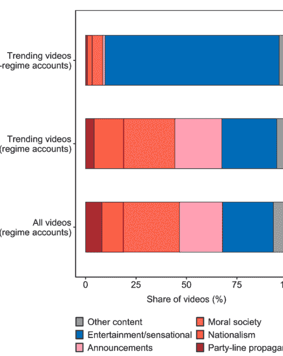

# 懒人专属群周报（第133期）

北京时间 2025 年 6 月 13 日 出品

懒人专属群群友大家好，我是小懒~

第133期《懒人专属群周报》，与君共读。

希望咱们专属群独有的《懒人专属群周报》可以作为群友们喜欢阅读的一份类似周刊的读物。之前的离线版合集地址见咱们专属群总链接，小懒都有备份。

懒人微信：lazyhelper

# 目录
- 关系攻略（节选）
  - 如何摆脱“老好人”标签
  - 知识点
  - 假性老好人和真性老好人
  - 假性老好人的来源
  - 合理情绪疗法
  - 老好人为什么越陷越深
  - 写在最后
  - 如何拯救一个害羞的灵魂
    - 害羞者到底在怕什么
    - 严重害羞者的感受
    - 许多名人也有害羞的困扰
- 新闻评论
  - 抖音宣传机器
  - 庞大而多元的宣传内容生产者
  - “正能量”叙事与自下而上的传播
  - “去中心化”的宣传模式？
- 懒人收藏夹
  - 叠桌子：你可以这样理解人世间
  - 为什么失业的，总是老实人？
  - 他这辈子除了站错队伍，其余每一样都值得我们学习
- 总结

# 关系攻略（节选）
作者：熊太行

## 如何摆脱“老好人”标签
### 知识点：
阿尔伯特·艾利斯（Albert Ellis）发明的合理情绪疗法（Rational Emotive Therapy，简称 RET），能够帮助很多备受折磨、渴望自己的完美的老好人。

有关系户“：”（他的昵称真的是这个）问我，已经在工作中被人们当做“老好人”了，应该怎么摆脱这个标签。

我想了想，我是鼓励大家别当老实人或者老好人，但是我好像真的没说过老好人应该怎么进阶，这里详细说说看吧。

## 假性老好人和真性老好人
老好人不拒绝别人，不愿意也不提反对意见，大概有这么几种表现：

- 对任何人回避冲突；
- 对任何人乐意忍让；
- 温和，不嘲讽不抱怨；
- 有主动助人的行为。

老好人和青少年近视差不多，也分真性和假性。我见过真性的老好人，真的是一点火性都没有，对人温和谦逊，从来不撕人，不过业务能力不弱（这是关键），如果他被欺负，大家都会不答应。

真性的老好人不会为他的模式而感到折磨，那就不需要改变了，这是他的存活之道。我认真问了他，发现他爸爸他爷爷都是这样，既然老好人能娶妻生子，那就说明他们上万年来还是非常成功的。

假性的老好人其实还是大多数，大多数人是因为阴差阳错，变成了“老好人”。

## 假性老好人的来源
假性老好人其实有不同的来源，应对和改变上也有不同。

- 蛰伏：对手太强，被所有人都虐，虐怕了，选择了这样的生存之道。在造成他压力的强人离开之后，他可能会从老好人角色里重新走出来。
- 渴望完美：有些人对这事有一种妄念，希望所有人喜欢自己，希望自己完美，希望自己达成所有的人的期待。这种人对自己特别苛刻。之前我们分享过工作上不喝酒的攻略，说到了那些委屈自己喝酒的人，其中一个原因之一就是认为自己喝酒了，会被领导、客户和同事更喜欢。有一种人对别人的认可有偏执的需求，你怼他一句或者开一句玩笑，他要解释半天，这种人活得特别累。
- 害羞：大多数羞涩的人都会被认为是“老好人”，确实很多老好人羞涩，但这是不同的概念。有的羞涩的人，胸中有万里河山或者一方锦绣，但是当被许多人看做“老好人”之后，他会逐渐地去揣摩这个角色，最后就是越演越像。羞涩的人不是非要回避冲突和乐意忍让，而是他想冲突，但是“臣妾做不到啊！”
- 个别还有一些因为宗教原因造成的“老好人”，这些人往往在其它方面面临着压力。很多对宗教有狂热感情的中年妇女，家庭内部都非常不幸。这是蛰伏的另一种形式。

## 合理情绪疗法
渴望所有人喜欢自己的人，一般都是对自我要求比较高的人。这种人有一种很好的应对方式，叫做“合理情绪疗法”。心理咨询师经常用，自己做心理建设也可以用。

合理情绪疗法的核心是一个 A-B-C 模式：

- A 是指诱发性事件；
- B 是指个体在遇到诱发事件之后相应而生的信念，即他对这一事件的看法、解释和评价；
- C 是指特定情景下，个体的情绪及行为结果。

我们仍然以领导要求喝酒为例：

- A 是领导要我喝酒；
- B 是我认为不喝酒我会丢工作，或者被领导厌恶；
- C 是我喝酒了，身体难受，回去还被老婆罚跪。

再比如说，你和同事看见领导在楼道里走过，打招呼对方没有理，直接走过去了。

- A 是领导没有理你；
- B 你认为上次我业绩不好，领导不爱理你了；
- C 是你害怕了一个周末，直到下周一领导跟你打招呼才好多了。

但是你的同事是这样的 ABC：

- A 是领导没有理他；
- B 是领导没看见；
- C 是他开开心心玩了一个周末，周一上班精神百倍，遇见领导问候，领导也热情回答了。

你的同事的 B，也就是他的解释模式就比你健康得多，他在自我保护，而你总是倾向于自我折磨。

## 老好人为什么越陷越深
这种自我折磨会让你越来越缺乏自信，倾向于进行全方位的退缩和讨好，很容易变成“老好人”。同时你对变成老好人这事的 ABC 会继续折磨你：

- A 你被人评价为老好人；
- B 你觉得你从此失去了提升的机会，还会被人人欺人人骑；
- C 别人说你好，你立刻就会开始自责。

一个认知上没有大问题的人如果被人评价为老好人，他的解释模式可能是这样的：

- A 我被人评价为老好人；
- B 哎呀我是不是没有显示出自己的主见；
- C 我于是积极表达。

熊老师如果被人评价为老好人，他的解释模式可能是这样的：

- A 我被人评价为老好人；
- B 太好了，正好大家都不担心我，我可以安心观察这个组织里大家的角色了；
- C 这帮人的利益接合部被我找到了，我知道该如何入手了。

## 写在最后
注意，健康的认知模式会给自己尽量减小压力。

> 大力不能出奇迹。
> 大的压力只会毁灭任何奇迹。

你不对自己苛求，反而容易采用更积极的策略。你倾向于更悲观、更不理性的解决方案，事情不会有任何好转。

如果你经常内心深处天人交战折磨自己，那就试试这个 ABC 的疗法，自己在纸面上记录自己的ABC，把不合理的 B 驳倒，选择更合理的认知方式。

羞涩今天先不讲，是个大话题，我们专门回头来写一篇。

ABC 这种斗争是你内心深处的交战。当你的同事发现老实人有改变的时候，可能会问你发生了什么。我是不建议你把这个疗法解释给他们听的，因为大多数人对心理咨询、心理治疗和精神科学都茫然无知，你的解释只可能产生误会。

再一个，自己的内心成长也没有必要暴露给一些不够熟悉的人。如果对方出言嘲讽，你可能会把刚刚建设好的内心受到摧毁。

我一般给这样同学的建议是：你在咣哧咣哧写 ABC 让自己变得更理性的同时，加一些外在的习惯改变，比如减掉 5 公斤的体重，显得更健康，增加 10% 的肌肉含量，让自己体型更好，参加一个培训班，改善英语口语，学了厨艺或者养了一只可爱的宠物。

把你真实进步的原因藏在一个肉眼可见的行为之后。

恭喜你，你已经不是老好人了，永远都不是了。

因为你已经被关系攻略“教坏”了。

# 如何拯救一个害羞的灵魂
### 知识点：
害羞者最大的问题是过高的自我关注。

解决方案就是告诉自己：

没有多少人看着你，你要照顾好自己。

我曾经说过，在所谓的“老好人”当中，有一批“假性老好人”其实是害羞者，害羞让他们无法争名夺利。

害羞是挺大的问题，遗憾的是，青少年时代，父母往往对这种情况认识不足。

有些父母，甚至对孩子的害羞还有些沾沾自喜：

- 这孩子非常老实；
- 这孩子不乱花钱；
- 这孩子非常听话；
- 这孩子不和外面的孩子一起瞎混；
- 这孩子非常厚道，不跟人起冲突；
- 不早恋。

其实真相非常残酷，现实中这个孩子面临的情况是：

- 他很难交到新朋友，难以跟别人沟通；
- 他很难享受各种各样物质的快乐；
- 他在乎别人对自己的看法，尤其是家长或者老师，如果他觉得自己做得不好，就会感觉备受折磨；
- 他没法维护自己的权利，受了欺负就要忍气吞声；
- 结婚难。

## 害羞者到底在怕什么
害羞者一般都会被挫败感、担忧和孤独所困扰，他没法冷静地思考，也难以和别人进行交流。这种最侵蚀和折磨我们内心的情感，说起来又特别简单，害羞不需要什么复杂科学定义，害羞就是特别怕人，有人在场就会特别不自在。

害羞者最担心的其实是三种人：

- 陌生人（想象中的观众）；
- 手握权力的人（评委）；
- 异性（对手戏）。

很像一个奥斯卡颁奖现场对不对，我们经常说人生在世全凭演技，这是有道理的。

著名心理学家津巴多 1977 年开始开设了一个“害羞诊所”，他曾经对 5000 人以上进行过害羞的研究，发现 40% 的美国人认为自己是害羞的，而 2% 的美国人认为自己“非常害羞”，在日本人当中，这个数据达到了 10%，我们说日本人很宅，不是没有道理的。

不过津巴多教授坚持认为中国内地的年轻人害羞程度比较低，我觉得这可能跟他的身份有关系，在我成长的小学，如果来外国客人或者政府官员，学校一定会把最活泼最没羞没臊的同学推到前面，害羞的同学恐怕根本就没有出现在这种交流上的机会。

不过有一点是可以肯定的，就是实行集体主义原则的社会里，青少年的害羞会稍微好一点，比如中国有的中小学会管制学生的发型，要求他们穿麻袋一样的运动服，这对健美和自信的孩子有点不公平，但是害羞的同学一般都是因为外貌而对自己不自信，他们在这种环境当中会好一些，换句话说“我没那么丑”的认识，其实是因为“大家穿得都很丑”。

## 严重害羞者的感受
严重害羞者和一些情境性的害羞是不同的，一个男性如果推开一间没上锁的洗手间，听见里面有女性一声尖叫，那他出来十有八九是个大红脸。

即使是最不害羞的人，可能也会在某些情境下体会到害羞者的感受，但是他们不是害羞者。非害羞者很快能恢复过来，不会有严重的负疚感，甚至还能笑一笑做排解。

严重的害羞者是在许多非常正常的场景下，也会突然有这样的体验——脸红、心跳和焦躁不安。

像你在公司里，单位里，天天跟同事横眉冷对，你这叫人际磨损，争吵或者离职都能解决掉这个问题，但是害羞者面临的是人内磨损，他自己跟自己较劲。

要解决掉害羞问题，那除非根本不见任何人，这类严重的社交障碍会让人家庭关系破裂，同时还会容易丢掉工作。

## 许多名人也有害羞的困扰
许多名人都害羞，比如写有《瓦尔登湖》的梭罗，人们认为他是一个自然主义者，是一个隐士，但是我们读过他的书就会发现他是一个受困于害羞的人。

害羞的人可能是很聪明、很幽默的人，我很少谈及影响我的作家，除了金庸先生之外，王小波先生对我的影响也很大，我过去是“王小波门下走狗”的一员。

王小波是个特别聪明和优秀的作家，《黄金时代》《万寿寺》和《2010》充满了了不起的想象力。王小波在很多场合也很害羞，他笔下写到“王二”的时候总是说这个人遇到不喜欢的人，会“黑着脸一声不吭”，其实他生前对有些会场这样的局面会觉得不自在。他曾经是一位大学老师，最后成为作家。

作家是害羞者藏身的一个好工作，不过很多演员也害羞，开始演出的时候戏就上了身，不工作的时候一句话都不想多说，葛丽泰·嘉宝就是这样的人，不喜欢跟人社交。

如果你身份地位高，有人会美化你的害羞，比如查尔斯王储，大家会觉得很优雅。英国王室害羞的人还不少，看过《国王的演讲》就会知道。

这一点同样提醒你，不是变得聪明、有声望、有钱或者有权就能克服害羞的。

一些药物对害羞有帮助，但效果也仅仅比单纯使用认知疗法好一点。

克服害羞最好的办法是请一位心理咨询师，改变自己对自己的认识，才是改善害羞的关键。

# 新闻评论
新闻实验室是小懒付费订阅的通讯录，年费300多。小懒整理分享，仅供专属群群友查阅。如有余力，可以自己到Newsletter上自费订阅。

## 抖音宣传机器
250613 新闻实验室

整理：公众号懒人搜索，懒人专属群独享

懒人微信：lazyhelper

拥有最多抖音号的官方机构并非官媒或宣传部。

中国政府是怎样在抖音上做宣传的？使用过抖音的朋友可能会有有一些感性的印象，比如经常刷到由政府机构的抖音号发布的“超燃!”“点赞!”之类短视频。不过，对于背后的一张庞大宣传之网，之前还少有系统性研究。

最近，政治学期刊《American Journal of Political Science》发表了一篇论文，通过分析超过1.8万个官方抖音号发布的500多万条短视频，为我们理解抖音上的宣传机器如何运作提供了系统性的证据。论文作者是西北大学、斯坦福大学和普林斯顿大学的四位学者。

### 庞大而多元的宣传内容生产者
中国有两千多份报纸、两千多家广播电视台，而抖音上有多少个政务号或体制内账号呢？

这篇论文的研究者们给出的答案是：21208个（识别账号的过程完成于2021年，如今这个数字可能又有变化）。

这两万多个账号都是官媒和宣传部开设的吗？并非如此。实际上，不仅传统的官方媒体和宣传部门在抖音上活跃，像公安、消防、团委、文化和旅游局，乃至县级政府、街道办等基层部门也纷纷开设官方抖音号，成为宣传体系中的新力量。

在一定程度上，宣传成了一件事内近乎“全员参与”的事情。

下图展示了这些体制内抖音号的分布情况。横轴代表的是行政级别，从左到右依次是中央、省级、地市级、县区级；纵轴代表的是机构类别，从上到下依次是官媒、宣传部、政府办、公安、消防、团委、文旅、其它政府部门和其它账号。

| Account type | Central | Province | City | County |
| :--- | :--- | :--- | :--- | :--- |
| State media | 400 | 1394 | 2018 | 698 |
| Propaganda department | 4 | 37 | 287 | 1816 |
| Government office | 0 | 12 | 58 | 365 |
| Security apparatus | 39 | 372 | 1899 | 3789 |
| Firefighters | 6 | 89 | 437 | 266 |
| Youth league | 5 | 40 | 227 | 493 |
| Culture/travel | 4 | 66 | 285 | 669 |
| Other department | 55 | 329 | 733 | 1183 |
| Other accounts | 31 | 134 | 214 | 230 |

可以看到，拥有最多抖音号的官方机构并非官媒或宣传部，而是公安部门。其中，尤以区县级的基层公安部门开设的账号为最庞大的抖音宣传队伍。

研究者抓取了这些账号在2020年6月1日至2021年6月1日期间发布的视频。在这一年间，这两万多个账号当中有少部分没有发布任何内容，发布了短视频的则有19042个账号。它们的发布频率呈现出鲜明的周期性——工作日发布多，周末发布少，这也和政府部门的工作时间吻合。

研究者提出：数字媒体平台的普及是这些多元的政府机构全面参与宣传的重要前提。首先，社交媒体极大降低了内容创作的门槛。相比传统电视、报纸需要大量人力和设备，如今只需一部智能手机和基础剪辑软件，任何体制内员工都可以快速、低成本地生产并发布内容。

其次，抖音等平台的高度互联互通，使得内容的采集、再利用变得高效便捷。各级账号之间可以迅速互相借鉴、模仿和传播彼此的内容，热点事件能够自发“炒热”，形成全网联动。平台上的数据反馈（如点赞、评论、转发数）成为了最直接的考核工具，也为上级部门监督与激励下级创作提供了便利。而有的地方账号因发布失实或不符合宣导向的视频而被约谈、通报甚至处罚，这种公开化的“流量可见性”极大提升了管理效率。

此外，社交媒体的提供的“社会认同机制”（social validation）也成为推动宣传体系变化的重要动力。许多参与内容创作的公务员或体制内人员，不仅仅是为了完成任务或考核，更希望通过高点赞、高转发获得认可感与成就感。这种“社会赞誉”激励，进一步丰富了内容的多样性和创新性。

### “正能量”叙事与自下而上的传播
各类体制内机构和人员大规模参与宣传，他们制作的内容是否高度类似呢？在传统媒体时代，基层党媒往往大量转载中央党媒的稿件；在抖音上，基层政府部门的账号会不会也是简单复制上级的内容呢？

答案是否定的。平均而言，地方账号发布的短视频当中只有10%左右是中央级别账号短视频的复制品。当然，这个比例每一天都不一样。在研究者抓取了数据的那一年里，复制程度最高的一天发生在2021年5月22日——那是袁隆平逝世的日子。但即便是那一天，也只有不到一半的地方账号短视频是中央账号短视频的翻版。

那么，这个庞大的抖音宣传网络，究竟发布了些什么样的内容呢？

其实，这些体制内抖音号发布的短视频里面，只有很少一部分属于“硬宣传”，也就是对意识形态和领导人的正面宣导。其它内容包括：

- 民族主义内容（例如纪念抗日战争，或是曝光西方国家的问题，像是“心碎！美10岁女孩听到#弗洛伊德事件后崩溃大哭：‘我可能会因为我的肤色而死’”）；
- “道德社会”（moral society），包括日常生活中的“正能量”行为，以及对不道德行为的曝光和谴责；
- 政府通告和服务指引（例如“退休人员基本养老金涨4.5%！”“注意！宣威这些地方即将停电！请互相转告”）；
- 娱乐和吸引眼球的内容（例如“河北大爷公园蹦迪舞姿”）；
- 其它类别的内容。

上图展示了体制内和体制外抖音号内容的对比。最上面是体制外的抖音号上了热榜的短视频，可以看到绝大多数都是娱乐和吸引眼球的内容，宣传性质的内容很少。中间是体制内的抖音号上了热榜的短视频，最下面则是体制内抖音号的全部短视频。可以看到，“道德社会”和政府通告服务类占据了非常显著的比例。

也就是说，与以往以意识形态、领导人形象、大方针政策为主的宣传不同，抖音上的政务账号大量生产“正能量”内容——比如弘扬社会正义、歌颂道德模范、展现温情时刻、宣传公共服务、记录一线工作人员的感人瞬间。

例如，有一则广为流传的视频，记录了一名公交司机突发心脏病却坚持将车停稳、保障乘客安全，随后倒地昏迷。视频配以感人的音乐和字幕，展现了普通人的高尚品德。另一则视频拍摄的是江西一名9岁女孩将走失的3岁男童带到警察局，警方与女孩的互动被温情再现。还有一段视频，记录了一名一线医护人员因坚守岗位而错过与母亲的最后告别，只能向着家乡方向深深鞠躬。

那么，这些温情故事都是从哪里来的？研究者发现：许多都是由地方账号发布之后，再由中央账号传播推广的。比如，一则题为“为逆行英雄点赞！消防员奋不顾身营救群众”的短视频，就是由地方消防部门发布后，再被中央级别的账号采纳的。这些视频的画面不高，甚至抖动、模糊，但是却具备强大的感染力。

所以，与传统宣传“自下而上”的单向灌输不同，宣传内容在抖音上的流动呈现出多向性。中央级别的账号不仅输出内容，还大量转发或借用来自省市县级基层账号的原创内容。

尤其值得注意的是，这些自下而上的信息被中央账号再加工、扩大传播，反而获得了更高的用户互动和关注度。数据显示，由地方原创、中央账号再分发的视频，其点赞、评论和转发量普遍高于中央自制内容。

这种内容流转机制，既激发了地方宣传创作者的积极性，也让宣传内容能够更好地贴近受众日常，满足分众化、碎片化的传播需求。这些源自地方的宣传短视频，不仅提升了宣传的效果，也在一定程度上打破了过去那种高高在上的宣传形象，让宣传变得更具亲和力和日常感。

## “去中心化”的宣传模式？

研究者将抖音上的这种宣传模式称为“去中心化的宣传”（decentralized propaganda）。它的特征包括：

- 宣传工作的参与者众多，有的来自官方媒体，接受过专业训练，但也有很多来自媒体和宣传部之外的政府机构，没有接受过专业训练。
- 这些多样化的参与者，创作的内容类型亦非常多样，可以抵达社交媒体平台上更为碎片化的受众。
- 内容的流向不只是从上至下，更有许多宣传内容是自下而上的流动，并产生了更好的效果。

这篇论文的确具有信服力地揭示了抖音上的庞大宣传网络。不过，我个人认为，“去中心化”这个名字并非完全贴切。通常人们会认为，“去中心化”意味着没有任何权威式的中心节点，网络上的各个节点都具有平等的位置和自发的参与。但是，抖音上的宣传依然是有着等级之分的，中央级别的重点账号会得到算法与编辑的更多青睐。而且，体制内的这么多参与者也并非真正自发参与，他们显然是受到上级的指示才开设和运营了这些抖音号。

此外，传统媒体时代的宣传，其实也带有广泛参与、自下而上的特性。比如，体制内的各类机构拥有庞大的“通讯员”系统，负责与传统媒体合作，提供宣传内容。再比如，中央党媒其实一直会发现来自地方的典型人物和典型案例，然后将他们推广开来。

所以我认为，抖音上的宣传与传统宣传模式当然有不同之处，但它们的区别并非是“中心化”和“去中心化”的这种本质之别，而更多只是参与的程度之别。具体来说：

- 数字媒体平台使得体制内机构无须通过通讯员向传统媒体供稿，而是可以自己直接开设账号发布内容。
- 中央可以更为迅速和高效地在平台上发现来自地方的宣传内容，并及时采纳。
- 平台成了新的重要参与者，它一方面通过产品功能和算法设计制定规则，另一方面也需要接收政府的指令，负责推广宣传内容。

尽管我不太认同“去中心化”这个名字，但我认为这篇论文为我们理解中国政府在抖音以及其他社交媒体平台上的宣传，提供了扎实的证据和清晰的论述。能够用计算方法处理和分析几百万则短视频，这本身就是只有顶尖的研究者才有能力和资源完成的事情。

# 懒人收藏夹

## 叠桌子：你可以这样理解人世间

> 和菜头

叠桌子，它是一种杂技表演形式，也可以用来作为人世的模型。

我好像从来没有和你说过我对人世的理解，不知道你心目中的人世是一副什么样子，但是在我这里会比较简单，它就是叠桌子。不知道你看过杂技没有，他们在大桌上叠放小桌子，这样一层层叠上去，最后他们爬到最上层，站在最小的那个桌子甚至是板凳上做倒立。我经常在看这种杂技的时候走神，感觉它就是人世的一个隐喻。

在我眼中，世界就是一层层叠起来的桌子，人们围着不同层级的桌子吃饭。

最下一层的桌子很大，可以容纳数亿人吃饭。最上一层的桌子很小，围坐着百十个人在喝酒。每一层桌子要比下一层小一圈，能容纳更少的人。于是，人们有几种选择：

一种选择是安心坐在这一层，但是要提防有上几层的人掉落下来，把自己挤下去，同时，也要防备下一层桌子有人爬上来，把自己拽下去，抢占自己的座位，拿过碗继续吃；

另一种选择是往上爬，爬上去之后把人挤开，给自己找个座位。在这个过程中，可能被这一桌的人群起而攻之，掉落到更下层的桌子上去，也可能成功挤出一个空座，端起碗来吃饭；

还有一种选择是下降一层，那里会宽敞很多，看到你来了，也许大家会让开一个位置给你，不过吃的食物没有过去好。而且，一旦下去之后，再想爬回去可能就很困难了。

我知道，这个比喻可能会比较粗糙，而且比较粗鄙。人生不止于吃饭，那你就把饭理解为资源就好。关键是这个叠桌子的模型能够比较方便地解释许多事情，不妨作为一种理解人世的参考。

为什么人们会有认同感？因为大家坐在同一张桌子边，而且大多是一层层爬上来的，拥有共同的经历，所以彼此多了一层理解。又因为同一张桌子意味着大家能力差不多，彼此争斗不是一件划算的事情，并没有必胜的把握，所以彼此还有一层尊重。

不过，这种理解和尊重是一种脆弱的平衡。一旦有人表示想要爬向上一层桌子，而且要踩着这一层的桌子或者是人头爬上去，就会立即引发冲突。

这在职场里很常见，同级之间意识到对方还有野心，大家的关系就不会很融洽。有一种叫作360度测评的职场测评系统，用于公司内部中低层管理人员工作业绩评估。所谓360度的意思是评估人包括了测评人的上级、同级和下级。从统计上来看，无论个人业绩好坏，同级之间的评分往往是三项中最低的。

为什么向上突破很困难？因为每一层桌子的座位其实都是有限的，多一个人，意味着大家就会少分一点。所以，往上爬一层桌子的人是最困难的。下一层的人在拉他的腿，上一层的人在踹他的脸。他想要爬上去坐下来，就得证明自己有实力同时应对两股力量，最后才能一脸是血，浑身是土，气喘吁吁地坐下来。在这个过程中会损失很多，需要自己判定是不是值得。

相对而言，越往上桌子越小，风越大，想要坐稳就越是困难。正因为这样，人们对自己的限度会有一个大概判断，到了一定程度就不想继续攀爬了。因为届时收益和损失不成正比，为了一层而下跌十层，乃至跌落至最下一层，就有点得不偿失。

为什么那么困难，还是有那么多人前仆后继往上爬？当然，可以理解为上一层的饭菜更好，供应更足。但其实还是个选择问题，在最下一张桌子上，怎么坐，吃什么，大概没有什么选择，人和人之间的区别并不大。但是越往上，自由度越大，选择越多。如果用座位数来衡量的话，叠桌子模式的确越往上每张桌子越小。但是，如果从每个人拥有的空间和选择来看，这个模型恰好倒过来，每个人拥有的桌面越往上越大，甚至可以起身散步、起舞、放风筝。

当一个人拥有的空间和选择越多，他就会觉得自己对现实越有控制力，也就感觉拥有更大的自由，更少为现实条件所束缚。

与此同时，和自己选择一样食物的人也就越少，反而减少了同桌之间的许多争斗，所以体现出一种彬彬有礼的温情。

“绝怜高处多风雨，莫到琼楼最上层。”这是袁克文写给父亲袁世凯的诗作，劝父亲不要迈出帝制的最后一步。袁世凯当然没有听，其实无论往上走风雨会有多大，都不能阻挡人们的脚步。

人们对名望、财富很难说有了够的时候，只要参加了叠桌子的游戏，就会着了魔一样继续下去。

全球的财富榜单年年都在变化，一旦上榜，就会被无数人给盯上，税务、慈善、法律上的麻烦接踵而至，但是，你见过几个人真的愿意花钱让自己不出现在这个榜单上？几个人真的收手不干，努力让自己达不到上榜的标准？

当然，从古至今都有着人想着另开一桌，直接往上越过好几桌，插入这座桌子山。问题是，这么做的风险很高。首先你得离开自己的座位，一旦离开想要回去就会大费周折。然后你未必能找到足够的人，凑齐一整桌。

在创业领域内经常会看到这一幕，选择红海领域固然让人觉得痛苦，但痛苦不过无人问津的领域。全领域只有一名，而且就是第一名，往往证明这个领域没有什么价值，桌子根本搭不起来。

最后，也是最严酷的，你得证明你的这张新桌子比旧桌子更强，更好，更有效率。而且无论是对上一层还是下一层都得如此，才能占据这个位置。在许多案例中，现实残酷地回答：对不起，并不需要你额外造这张桌子。于是，无数时间、精力、金钱就会转瞬间化为泡影。

自然也有人想要从桌子边起身离开，宣称拒绝玩这种无聊的游戏。的确有人做到了，在桌子边盘膝打坐，让抢饭吃的人看了心生羡慕，觉得那就是游戏人间的。要解释这种现象其实也很简单，神仙人物并不是悬浮在空中，他还是在这一层。

为什么他没有掉落下去？一个理由是他的行动等于是放弃了和同桌人的竞争，因此变得无害。另一个理由是因为这一层有足够多的资源，这些资源溢出了，可以不在乎多他一个人，反正他要的也不多。有时候，甚至是上几层的资源溢出了，流到这一层，可以让他分到一点。然而，只要时节不好，资源变得奇缺，没有了溢出的资源，就不会再有这种好事了。在战乱或者动荡时期，这一幕最为清晰，神仙纷纷下坠。

如果能够接受这个模型，那么就能理解念书和终身学习的意义所在。念书其实是成本最低的爬桌子方式，可以一开始就把一个人送到中间偏下的桌子上，让他的起点变得很高；而终身学习则是最温和的爬桌子方式，不需要面对太多面对面的争斗，有时候甚至可以实现跳桌，因为他自行发展到一定程度，这一层自然束缚不了他。连想法和做法都不一样，同桌的人又如何阻拦他呢？

每天我听到的各种抱怨，大部分都可以归为桌子的层数、座位位置以及谁是同桌的问题。所以，这个模型并非是我的发明创造，而是听完这些问题眼前自然浮现出来的场景。

我的建议是，无论身在哪一层，都不要忘记转身背离桌面，去看看周围的风景。

如果爬了那么多层上来，都不曾转身看看风景，那就把吃饭当作了人生的全部意义了。而且，我猜测为了看风景的人，也许登高会更有气力。

## 为什么失业的，总是老实人？

> 记忆承载

> 那天在聊未来行业变化的时候，我说十年之后，只怕所有的诺贝尔奖得主，都是AI。

> 有读者感慨道，都不需要十年，都不需要AI。

> 即便在当下，他已经感受到这个世界对踏实做事，尤其是在单一领域里踏实做事的人，不友好。

> 整个社会都在提倡工匠精神，但更多的是什么？

> 是那些玩梗的工匠，比如号称自己梗着脖子交个朋友拍几个MV说自己在打造产品的那种作秀的工匠，可以混得风生水起。

> 你要是个真工匠，尤其是埋头盯着一个很窄的领域，完全有可能做着做着，中年之后，你那个领域改变了，或者嫌你老了，被一脚踢出门。

你这个感慨很对，这个感慨的本质是什么？

是因为人类的生产模式在改变。

古代的时候，所谓的工匠，他是一个人造一把枪的，他不是某个环节的工匠，他是枪这个产品的工匠。

于是只要枪的生态位在，他工匠的生态位就在。

后来发明了流水线，造枪这件事，被拆分成二十个环节，你只是其中一个环节的工匠。

我们说，替代连续的二十个环节不容易，因为排列组合太多了，但是替代其中一个，要容易得多。

现代社会的特点就是这样，把一切领域，乃至每个领域下的所有产品都细拆。

当拆分到最小单元的时候，程序+机器本身就更容易做得比人专精，所谓AI，只是一个可以自学习的程序+机器而已。

这个问题的本质就这点事儿。

你把自己工具化了，难免被淘汰。

而那些你看不上的，在你眼里或许人品不正派的，亦或者投机取巧的，他们往往有一件事做对了。

什么事情？

把自己深度的嵌入到人与人之间的那个利益网络里面去了。

这件事，人家做对了，于是，你特瞧不上他，他还比你混得好，混得久。以至于让你觉得老天瞎了眼。

我们看一本电视剧，《人生若如初见》。

剧中的良乡，被描述成多尔衮的后人，清末宗室里唯一的支柱，他去日本士官学校学成回来之后，一心想要整顿军事。

作为满人，他想要重振武力，想要罢黜袁世凯，想要让满人来指挥北洋六镇。

他是怎么做的呢？

就是在日本留学期间努力学习军事，回来之后，严格的照搬日本的那套士兵操典。

他觉得自己越努力，越认真，越是不收钱，不徇私，越是严格要求，就能够挽救清廷。

起码他自己这么想的。

那你觉得能做成么？

或者我们换个视角，站在他的对手袁世凯的角度，袁世凯是这么做事的么？

你觉得袁世凯是靠认真，踏实，不徇私，练就的清末最强战力，北洋六镇么？

好像不是吧？

清末的社会，有很多股力量，剧中都有反映出来。

有宗室旗人，有汉人大臣，有盛宣怀的合作伙伴，国内的商人，有革命党人，有西洋人的力量，有东洋人的力量。

这里面有很多股力量明里暗里在角逐。

你高屋建瓴的看问题，是不是只有内外之分？是不是说除了洋人，所有的自己人，都是一条心？

你再浓缩一点，是不是清廷里的大臣们，都是一条心？

甚至你再浓缩一点，是不是所有的宗室旗人，都是一条心？

看懂你就会发现，这里面至少也有七八股力量，成千上万条心。

剧中的良乡如果真的想要，或者说能够做出一番事业，最重要的是什么？

是团结，是你到底能够让多少人围绕在你身边。

你越是能够用利益把更多的人才捆绑成一个团队，你就越是能够发挥出更大的力量。

李鸿章是这么做的，袁世凯也是这么做的。

剧中最开始的时候，良乡和两个留日学习的室友，各自都是被资助的。

资助良乡的，是宗室王爷们。

给他钱，让他在日本留学期间，延揽人才。

另外两个同学，一个袁世凯的人，一个革命党，背后也各自都有资方。

一个是袁世凯在资助，一个是上海的商人们在资助，都是给你钱，让你去延揽人才。

这才是一个真实的舞台。

你说你很努力，谁不优秀？

袁世凯派来留学的人，也是几万士兵里选出来的兵王，革命党派去留学的人，更是刑场里劫后余生的人杰。

优秀仅仅是个工具，它不是目的。

目的是你要深入的嵌入到利益网络中，这就叫花花轿子众人抬。

人家为什么要抬你？

只有一种可能，抬你，对他自己也有好处。

你的存在是别人的好处，别人才会支持你。

各种力量都肯支持你，你才有可能做大事，否则只是学生气而已。

我那天说，用不了十年，只怕医生受到AI的冲击，远比护士受到的大。

各行各业都是这样，不是只有医疗。

有读者那天留言，说，他想通了，可是他不乐意做护士，如之奈何？

那就说明你还是没想明白。

我只是打个比方，让你明白为啥医生看起来比护士优秀，可是取代起来，居然比护士还要快，并无意让你自降收入从医生变成护士。

重点从来不是你叫个什么，而是你到底在卖什么？或者说，你和谁在竞争？

剧中的良乡为什么会得到宗室的信任？

你真以为是他在日本士官学校里的表现优异，无人能敌？

不，因为他姓爱新觉罗。

宗室想要挑的不是一个军事生第一名，而是姓爱新觉罗的军事生第一名。

甚至日本人之所以在军校里处处照顾他，栽培他，授予他第一，就是因为他姓爱新觉罗，日本人希望培养一个亲日的清廷宗室。

同理，你要是姓爱新觉罗，你觉得你在革命党的这个任用名单里，还能得到重用么？

你想通了你就长大了，否则就是学生气。

学生气的特征就是他以为有个正确答案，他以为自己是第一名，他以为第一名了不起，第一名就是对的。

良乡犯的就是这个错误，他总觉得他是军校的第一名，所以所有人都会听他的。

别说汉臣不会听他的，商人不会听他的，革命党人不会听他的，只怕是宗室们，都未必全听他的。

> 你想通了就会明白，为啥有人风生水起，有人处处掣肘。

任何时代，只要人类还在，这就始终都是人的游戏，不会是什么1+1到底该等于几的游戏。

## 他这辈子除了站错队伍，其余每一样都值得我们学习

记忆承载

> 那天写未来各行业分析时，看到了很多读者的留言，里面不乏分享自己隐私的。

我是这么看的，我觉得很多人还是没走出来。

过去的那些年，整个社会实际上处于居民资产负债表扩张期，尤其是08年到18年。

这个特征就是每个人都觉得自己可以阶层跃迁，每个人都觉得自己明天会拥有更多。

表现在消费上就是提前消费，月收入只有3万块的家庭买50万的车，1000万的房，不是他当下的收入可以负担，而是他觉得未来可以。

他的想法是杠杆先加了再说，等他月入30万的时候，债务？那都不叫事儿。

但我们想想看，大部分人为什么会这么想？

因为所有人都在加杠杆，社会需求就会增大，企业就容易赚钱，岗位需求就会扩大，进而个人也更容易赚钱，暂时失业也不怕，反正机会多得是。

这个过程就像一个人左脚踩着右脚，右脚再抽出来踩左脚，你以为这么自己踩着自己就可以上天。

但这一切都只是你以为，实际上是你过度乐观了。

杠杆这东西是有极限的，居民部门的资产负债表不可能涨到天上去，俗称出来混，总是要还的。

那么等到这个过程反过来的时候呢，人们会发现自己的收入停滞增长，而那个曾经以为哪天自己月入30万很容易还清的债务，变得遥遥无期。

预期的改变，使得人们开始反思自己曾经的加杠杆消费是否有意义。

开始反思如果人人都阶层跃迁，那到底越了个什么？

冷静下来，居民部门资产负债表就回到了一个修复的周期，人们开始不再梦想着明天就变成人上人，而是踏实还债，积极储蓄。

那么这个过程中，你就会发现需求减少了，生意不好做了，于是企业对人工的需求，也就下降了。

具体表现在从业者身上就是你发现手头的活儿，没那么多罢了。

以前加班是真有那么多业务在逼你，现在加班，大部分是出于恐惧。

你发现自己手头没事儿，那这个岗位，我还能坐么？我会不会被输送到社会上当人才呢？

这就是那天很多读者跟我讲的，他们各自在各自行业里的处境。

没事找事，假装很忙，把手头的事情重复做了一遍又一遍，这不是在解决问题，这实际上只是鸵鸟把脑袋埋在了沙子里。

你以为这样装下去，老板就不会发现，就可以一直耗到退休？

那你太天真了。

老板看问题的角度和员工完全不一样，他根本不关心你忙不忙。

他关心的只有一件事，那就是公司的业务量为什么少了这么多？

如果公司的业务少了这么多，那我是不是还需要保留这么多的员工？

这是他思考的。

当公司的进项发生改变时，当公司的财务发生改变时，他就已经会开始动脑筋要裁人了。

跟你装的好不好，没关系的。

你装得再好，财务报表又不会配合你。

即便你真忙，当财务报表发生改变时，老板也必然会动你，他也会思考，我要不要用AI来取代这个真忙的员工。

那么这个过程中，跟昔日资产负债表扩张相比，是完全调转过来的。

你感受到自己会被砍掉的预期，社会需求就会下降，进而生意更不好做，于是老板就真的会砍掉你。

人们就会从过度乐观，进入过度悲观。

实际上世界始终是那么个世界，变化的，是人们的预期。

预期变了，你看到的世界就戴上了滤镜，要么过度阳光灿烂，要么过度阴郁冷清。

所以我说，躲，是躲不过去的。

你真正应该思考的，是自己的行为，到底是有用功？还是无用功。

那天很多读者跟我讲的装加班，你之所以会这么做，就是一种固有思维的影响。

在企业扩张期，加班得奖励，你就产生了条件反射，你就误以为加班不会被裁。

实际上这里面的逻辑不是这样的。

企业扩张期，加班本身不会被奖励，被奖励的是业务扩大了，而加班这个行为满足了业务扩大，带来了利润，所以才被奖励。

就像面前有敌人，你输出的火力越多，射出去的子弹越多，你越被奖励。

但是现在面前没有敌人，你对着空气射击，不断的浪费子弹，你觉得老板看在眼里，会表扬你么？

所以我们一定要弄明白这里面的问题。

在资产负债表的扩张期，重要的是事情，做事情被奖励，是因为有业务给你，因为有事情给你。

而在资产负债表的修复期，重要的是做人，好好思考下，到底该怎么做这个人？

那天聊未来行业的时候，有人问我，几年后AI普及了，未来的人才长啥样？

我举个非常经典的例子你就知道未来的人才长啥样。

你比如电视剧《人生若如初见》里的良乡。

其实清末的禁卫军是他一手打造的，包括摄政王以及王爷的兄弟们，都是他的学生。

但他的身份不够高贵，他不能担任一把手，一把手都是草包，都是他的学生。

怎么办呢？

## 公众号懒人搜索，懒人专属群分享

向上管理呀。

我们很多人的工作方式是一定会被AI干掉的，因为你是怎么做事的？

领导让干嘛，你就干嘛。

那再好使，你能比AI还好使么？不能够吧？

那他为啥要用你呢？

良乡做事是有套路的，任何事情过来，上中下三策，不同方式的后果不同。

几次之后，你的上司就被你驯化了，他就被你带节奏了。

慢慢地，他的思维习惯都是跟着你的预案走了。

你看那种有经验的装修工，都是带着业主节奏走的，他总是能让你事先知道你的想法会是个啥结果，然后不断的影响你，最后让你落入他早就准备好的方案里面去。

弄到最后业主对你的依赖比阿斗对诸葛亮还深，见你就像宝宝见了妈。

没经验的装修工就是不带脑子上岗，业主说啥你听啥，回头按照业主要求做出来，业主还不认账，还和你大吵一架。

这就是人跟AI的区别。

人最大的优势就在于，他可以成功地做好一个人，人本身就是竞争优势。

因为你是在人类社会里面混。

农业社会时期，大家比的是力气大小，力气大的就是有优势。

到了工业时期，力气没用了，那比的不就是力气之外的东西么？

同样的道理，到了AI时期，又叠加资产负债表修复，当你很多属性都被取代了之后，你能比什么？

不就是比那些那天说的，你还没有被取代的地方么？

就像剧中的良乡，唯一的问题是出生错了，他姓爱新觉罗，导致不得不站错队伍。

再加上这人比较轴，他非要去完成一个根本无法完成的事情，去螳臂挡车阻挡历史车轮，故而失败。

可是我们把这些不切实际的地方去掉，你想想看，一个人，如果不限制你非得怎么样，也不让你承担什么宏大叙事。

你如果只是想让自己混得好，那么这点正确的方式方法，是不是已经足够了？

当然足够了。

那套方式方法，哪朝哪代都会混的很好。

懒人公众号导读：

小懒做了个网页，汇总一些公众号的原创文章列表，并用脚本自动更新，“文章荒”的话可以到这里看看有没有兴趣的内容：

- 地址：https://lazybook.fun/#/gzh/gzh_list

小懒在博客懒人收藏夹上面也更新了不少文章。

大家可以看看有没有兴趣的哈，小懒觉得体验还是不错的~

一些文章有访问密码，见咱们专属群群消息即可。

No.15/16

## 公众号懒人搜索，懒人专属群分享

- 地址：https://www.lazyblog.top/

## 总结

本周周报到这里就结束了，合计1.5w字。

小懒会准备好PDF和epub版本，方便大家多平台查阅。

在茫茫互联网不断搜索查找优质内容，希望带给大家愈加有收获的内容。

大家的分享也很多，希望每个群友都有收获。

咱们专属群的更新记录可以查看这里：

- https://lazybook.fun/#/blog/record2

平时大家如果需要找软件工具，可以到懒人手册上找看看先：

- 手册地址：https://lazybook.fun/#/

## 公众号懒人搜索懒人专属群

- 微信：lazyhelper