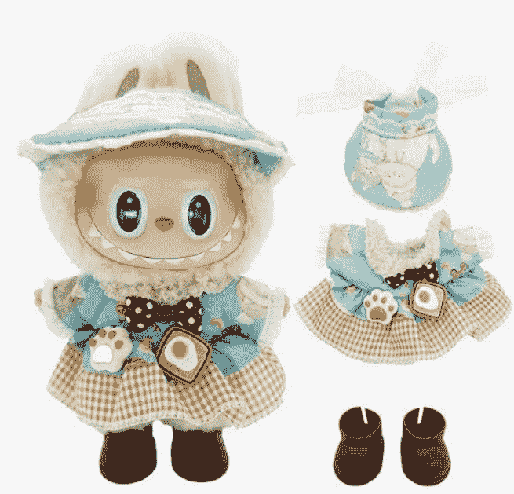

# LABUBU，当代人的精神替身

250613 《蔡钰 · 商业参考 4》节选

整理：公众号懒人搜索，懒人专属群独享

懒人微信：lazyhelper

泡泡玛特的潮玩公仔 LABUBU，在 2025 年火爆程度一路走高。到了 6 月份，它在永乐拍卖行里拍出 108 万元的天价，还成了平安银行揽储的赠品。

赶在这个当口，LABUBU 背后的香港设计师龙家升最近也露面接受了一个采访，用“LABUBU 之父”这个身份，讲了自己创造 LABUBU 的历程，并且提醒市场说，2025 年是 LABUBU 诞生十周年，请大家为他的 LABUBU 故事集和其他作品捧场。这个专访在 B 站有视频，我把链接给你放在文末。

借着这个专访，我们也来简单了解一下 LABUBU 的诞生故事。

## LABUBU 的诞生

龙家升 1972 年出生在香港，6 岁跟随家人移民荷兰。他刚到荷兰的时候，语言不通，无法融入当地的孩子社群，于是陷入了孤独。这时候，他在老师的指引下，走进了卡通绘本的世界，开始在家、在学校大量阅读荷兰的绘本故事。

这个过程让他慢慢掌握了荷兰语，也让他爱上了卡通创作。北欧神话里有大量的精灵鬼怪和民间传说故事，创作者们又热衷于以二战为蓝本、在故事中同时投射残酷现实与温暖，这也深深影响了龙家升。他在学生生涯里选择了艺术设计专业。

等大学毕业后，他在香港和欧洲之间往返，在两边探索过事业发展，广告行业、科技行业都尝试过，同时也在持续独立地创作绘本，攒下了一个原创的精灵鬼怪系列形象，起名叫 Monsters 家族，怪兽。

到了 2015 年，他依托香港的玩具品牌“HOW2WORK”，第一次让 LABUBU 这个森林精灵，出现在了他的绘本故事《神秘的木屋》里。不过，LABUBU 在龙家升的故事里只是一个配角，没有鲜明的故事线。

随后，HOW2WORK 也开始把龙家升设计的 Monsters 家族，制造成潮玩推上市场，其中也包括 LABUBU。

但这之后，市场对 LABUBU 的反应比较平淡。直到 2019 年，泡泡玛特跟龙家升签约，LABUBU 的命运齿轮才开始扭转。

LABUBU 最早在香港就是一个潮玩摆件，而泡泡玛特接手后，一方面把 LABUBU 的形象做了调整、装进了盲盒，还把材质从单色注塑升级成了磁吸配件、夜光材质，还推出了毛绒挂件系列，鼓励年轻人，尤其是年轻女性把它挂在背包上。更重要的是，泡泡玛特还把 LABUBU 推到了内地年轻人密度最高的 B 站，让它去参加“表情包大赛”。

这些动作，逐渐把 LABUBU 从宅男藏家的玩具柜里拉出来，拓宽到了更广阔的“营业”场景中。

不过你肯定记得，在当时，盲盒刚刚兴起，泡泡玛特的一姐还是 Molly。LABUBU 即便开始走红，在接下来的好几年里，也仍然在给 Molly 陪跑。

直到 2023 年之后，全球市场都在百年变局中发生情绪转折，泡泡玛特发力出海，中国也可以支持文化产业，LABUBU 才迎来了它自己的时代，站到了世界潮玩的顶流位置上。这些故事，你在专栏前面都已经知悉了。

龙家升这次出来露面，也坦言自己从未预料到过这股 LABUBU 热潮。甚至，他最喜欢的一只 LABUBU 公仔也不是当前市场接受度最高的 LABUBU 形象，而是早年脸更长、色调更灰暗的一个版本。

龙家升的这次露面，意图很好理解：借 LABUBU 的火热势头，为自己的整体艺术创作和事业版图造势。

但我看完专访之后的个人看法是，LABUBU，可能没法像成就泡泡玛特那样，成就它的创造者龙家升。

为什么这么说？《商业参考》第四季在第 2 讲（《超级信号：不安全感如何转化成消费需求》）和第 11 讲（《什么是超级信号》），已经跟你讨论过 LABUBU 走红的时代情绪因素和国家战略因素，在第三季的 251 讲也已经跟你聊过泡泡玛特赢在东南亚的缘由（《泡泡玛特为何赢在东南亚》）。但这些因素背后都有时代意志，不是其他玩家，甚至泡泡玛特自己能够简单复制的。

同样的逻辑，LABUBU 的走红，也不在龙家升的能力和预期之内。这一点从 LABUBU 诞生之初只是配角、诞生前 4 年在香港并没有太大动静就可以证明。

在 2025 这个 LABUBU 全球破圈的节点上，龙家升想要出版关于 LABUBU 的新故事。但是市场真的在意吗？在中国、东南亚、欧美争相抢购 LABUBU 的粉丝们，有多少人可以说清楚 LABUBU 不同名字的区别、身世和家族关系？它为什么是 9 颗牙？你可以在身边做一圈调查，我相信能准确回答的人数很少。但不了解 LABUBU，丝毫不影响人们对它的疯狂。

这是一个非常值得琢磨的冲突：为之疯狂的同时不求甚解，人们真正在意的是什么？

两件事。

第一个当然是 LABUBU 的金融属性，能保值增值。399 元的版本去年买，今年就涨到了 1599 元，妥妥的“潮玩茅台”和“塑料黄金”。它能拥有稳定的炒家、稳定的二级市场，甚至进入拍卖行，靠的是金融属性。

第二个点更有趣，我认为，LABUBU 在今天这个时代，已经成为了实体化的微信头像和表情包。人们在它身上投射的是小小的、理想化的精神自我：獠牙代表有防御和攻击能力，坏笑代表能自得其乐。这一点，我们在第二讲也展开解释过了。

这句话很重要啊，我再重复一遍：在今天这个时代，LABUBU 是人们实体化的微信头像和表情包，承载了那个有防御能力、能自得其乐的理想自我。

从这个角度，我们同样可以理解《黑神话：悟空》《哪吒 2》，甚至珠海航展的走红。黑眼圈的小混混有什么可爱的？替巴基斯坦出征的 T-10C 有什么可爱的？你是军迷吗就爱战斗机？它们的可爱之处在于，它的内核是“武德充沛的自己人”，黑悟空也是一样。这样的角色如果还能带点儿常见的人性瑕疵和生活松弛感，那就更能让年轻人觉得，“你在演我心目中的自己，是我想要的精神状态”。

你回头想想，LABUBU、哪吒和孙悟空们，是不是也切中了中国民众的这个精神原点。

武德充沛的自己人。这个人设，也对应了专栏前面提过的消费情绪：卸防+赢。武德充沛对应着赢，自己人对应着卸防。T-10C 战斗机在巴基斯坦立功之后，中文互联网出现了一堆二创漫画，把它画成一个下雨天只能披着破塑料布停在室外的小孩，意思是“在外面这么厉害的孩子，在我们家里只是个弟弟”，背后那种骄矜的心态一览无余。

## 精神替身运营公司

回到泡泡玛特。

基于前面的讨论，我们再来问一次：今天的泡泡玛特到底是一家什么公司？

我的理解，它是盲盒公司，也是潮玩公司，更是一家"精神替身"运营公司，它的商业模式内核，是替消费者们创造和运营卡通版的精神替身。Molly 是天下大同、消费升级时代的民众替身，LABUBU 是价值分歧、单打独斗时代的民众替身。

这是为什么我们前面说，LABUBU 是实体化的微信头像和表情包。我喜欢你，是用你来代表我，所以你的故事对我不重要，我的故事和心情才重要。

从这个角度我们也能理解，粉丝们对 LABUBU 为什么有那么大的改造热情。人们花大几百买 LABUBU 公仔还不够，还要再花大几百给它买潮服、换穿搭，像打扮自己一样打扮它。

### Labubu 服裝 - 3 件組附鞋子,適用於 6.7 英吋(約 6.7 公分)娃娃,優質 Labubu 服裝,附配件,時尚 Labubu 娃娃服裝 (LBB-21)
- ★★★★★ 3
- 過去一個月有 50 個以上顧客購買
- US$17⁹⁹ 定價: US$19.99
- 提供 20% 折扣促銷
- 送貨 6 月 21 日 週六

### LABUBU 服饰

淘宝上在售的 LABUBU 服帽鞋袜，一整套价格在 50 块钱上下，亚马逊上更贵，一套就能卖 18 美元，还是折扣价。此外，给 LABUBU 的专用安全座椅、墨镜和水壶也在大量被买卖。义乌的工厂现在每天给 LABUBU 生产的娃娃衣数量在 2-3 万套，有的爆款月销售额就能接近千万元。

欧美粉丝们玩得更激进，在 TikTok 上，LABUBU 的粉丝们不光给 LABUBU 换穿搭，还流行给各自的 LABUBU 贴睫毛、镶牙钻、做美黑。最近 Instagram 和 TikTok 上流行一套给 LABUBU 做翘臀手术的攻略，一堆博主都在学着用针线在 LABUBU 毛茸茸的屁股上缝几针，制造出翘臀的弧度来。

玩家们对 LABUBU 的开发，领先了虚拟数字人行业一个时代，但我也不知道泡泡玛特能不能接住这一波情绪需求。

### How to Give a Labubu A BBL

USAGE GUIDE

SURGERY CHECKLIST
- EMBROIDERY FLOSS
- REGULAR SEWING THREAD (MATCH TO YOUR LABUBU'S COLOR)
- SEWING NEEDLE (RECOMMEND ONE WITH LARGER EYE FOR)
- SMALL SCISSORS (EYEBROW SCISSORS WORK IN A PINCH)
- STUFFING (OPTIONAL)

PROCEDURE OVERVIEW
WE ARE DOING A BEGINNER FORM OF THREAD SCULPTING. THREAD SCULPTING USES STITCHES, PULLED TIGHTLY, TO APPLY PRESS TO SHAPE A 3D TEXTILE OBJECT. THE LABUBU BBL (LAB SHORT) WILL HAVE 4 POINTS OF PRESSURE + 1 EXTERNAL THREAD.

INTERNAL FLOSS
EXTERNAL FLOSS
NEEDLE ENTRY POINT (OPTIONAL) ENTRY SEAM FOR ADDING STUFFING

OPTIONALLY, YOU MAY ALSO ADD STUFFING TO ROUND OUT THE BUTT, BUT THIS WILL REQUIRE A SMALL INCISION INTO THE PLUSH. I HIGHLY RECOMMEND ADDING STUFFING AS A LABUBU MAY LEAVE THE BUMS / TUMMY FEELING FLATTER, BUT I UNDERSTAND FOR YOUR LABUBU.

### 翘臀攻略

## 总结

好，如果你认同我们的这个分析，LABUBU 是当代人的精神替身，泡泡玛特被当作了一家精神替身运营公司，那么下一个问题来了：如果 LABUBU 这个 IP 想要长红，你认为有哪些运营策略是值得尝试、哪些是千万不能碰的？

期待在留言区看到你的头脑风暴。

我个人的思路，不是去替 LABUBU 建构全新的童话世界、打造独立的乐园，而是让它像真人那样，去挑选高质量剧本、去参演能映射人类普遍情感的影视剧。一部有 LABUBU 参演的《唐人街探案》和《盗墓笔记》，或者一部由各种潮玩 IP 合作演出的动画版《甄嬛传》，在今天，借助 AI 已经有机会实现了。当它们摆在你面前，你肯定很难拒绝。

为什么是这个思路呢？在下一讲中，我会间接跟你解释。再见。

延伸学习「LUBUBU 之父」龍家昇解構創作故事 也可以复制链接到浏览器打开：

https://www.bilibili.com/video/BVlIMj3zeEky/?share_source=copy_web&vd_source=865208650ab70c3ca4bb2780fbf63675

懒人专属群持续更新中，已持续运营 6 年，整理超 3000 份各类精选付费文章 & 年费社群干货，全部开放下载。

本资料为付费群内部分享，仅供真实有需要的朋友查阅 🤫

懒人专属群更新记录：

https://lazybook.fun/#/blog/record2

懒人微信：lazyhelper