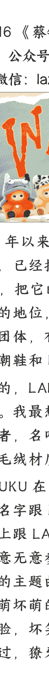

# 模仿者 WAKUKU，能复制 LABUBU 的成功吗

250616 《蔡钰 · 商业参考 4》节选

整理：公众号懒人搜索，懒人专属群独享

懒人微信：lazyhelper

2024 年以来，潮玩小公仔 LABUBU 的火爆，已经把泡泡玛特的市值推高了 11 倍，把它的创始人王宁推上了河南首富的地位，LABUBU 也有了自己的黄牛团体，有了金融产品属性，有了当初潮鞋和 NFT 的影子。

相应的，LABUBU 也有了不少行业模仿者。我最想提醒你留意的其中一个模仿者，名叫 WAKUKU，也是一个搪胶与毛绒材质的公仔。

WAKUKU 在 2024 年 5 月份问世，它不但名字跟 LABUBU 家族一脉相承，造型上跟 LABUBU 异曲同工，人设上也有意无意参考了 LABUBU：也拥有自己的主题曲，也来自古老森林，也是坏萌坏萌的小精灵，也是毛绒身体搪胶脸，坏笑的时候也露出獠牙——只不过，獠牙是一颗而不是九颗。

懒人微信：lazyhelper

运营策略上，WAKUKU 也有意无意参考了 LABUBU 的走红之道：借助明星带货。

2024 年底，有部名叫《永夜星河》的古装偶像剧在年轻人当中流行，主角虞书欣、丁禹兮就趁势给 WAKUKU 带货，一度把它的微博话题热度拉到了 1 亿以上，吸引了不少粉丝入坑。这之外，当前国内不少流量明星，比如林一、程潇、戚薇、吴宣仪等等，都在社交媒体上为 WAKUKU “种过草”，帮助 WAKUKU 在年轻人当中不断破圈。你肯定意识到了，这个打法，像极了 LABUBU 出现在韩国偶像、美国歌手身旁的那段过往。

这还没完，WAKUKU 在对明星的借势策略上还青出于蓝。它 2025 年 4 月份发布了自己的主题曲，邀请来了内地娱乐圈的星二代甜馨来演唱。再借助甜馨的父母贾乃亮、李小璐，把话题热度拉到了最高。这首歌上线迄今，已经有了超过 10 亿次的曝光量，最高的时候在 QQ 音乐有超过 1000 人同时收听。

如此这般运作下来，WAKUKU 刚诞生一年，在小红书上已经被运营成了仅次于 LABUBU 的第二梯队潮玩 IP，甚至高于 LABUBU 的大师姐 Molly。

## 资源咖 WAKUKU

WAKUKU 这个 IP 是什么来头呢？这个问题，有两个答案。

第一个答案是，WAKUKU 是深圳潮玩公司 Letsvan 熠起文化旗下的原创 IP。这家公司的名字你可能陌生，但它的另一个身份你肯定有体感——它是名创优品的重要潮玩战略合作方之一。名创优品的潮玩渠道里，有过一个名叫“又梨”的潮玩 IP，累计销量超 300 万只，就是出自熠起文化。

2025 年 3 月，中概股上市公司量子之歌花了 2.35 亿元现金，收购熠起文化 61%的股权，看中的就是熠起文化的潮玩开发能力，想要用原来的在线教育网络，来卖熠起文化的潮玩 IP。

而第二个答案是，WAKUKU，跟中国最大的娱乐经纪公司乐华娱乐，有着千丝万缕的关联。

乐华娱乐，也就是中国顶流明星王一博所在的公司，在内娱市场是一家非常资深的流量偶像制造工厂，源源不断制造过范丞丞、UNIQ、乐华七子等顶流个人和团体，前两年还跟字节合作推过虚拟偶像。也因为这样，它的创始人杜华，被行业称为“中国娱乐圈教母”，在娱乐圈中资历和资源都很深。

WAKUKU 和乐华娱乐又有什么关系？WAKUKU 所属的熠起文化，跟乐华娱乐没有直接的股权关系，但它却跟乐华娱乐开有一家合资公司，名叫“与华同行”，熠起文化在合资公司里持股 49%，乐华娱乐方面持股 51%。

我们可以简单认为，在这家合资公司里，乐华娱乐当下的主要分工，就是给 WAKUKU 当“经纪人”，把它也当作偶像明星来运营。

从第二个答案出发，我们就能够理解，为什么在 LABUBU 的一众模仿者当中，WAKUKU 是那个更强势也更成功的玩家了：它是一个背靠乐华娱乐的“资源咖”。

前面提到，WAKUKU 在 4 月份发布自己的主题曲，邀请到了星二代甜馨来演唱。当时市场的关注点是，甜馨才 12 岁就要出道了？签约的是乐华？结果后来甜馨澄清说：“我没签约，只是杜华阿姨和我妈妈是好朋友，有个名额我就来啦。”这句话让娱乐圈松了一口气，同时却让潮玩圈和投资圈心头一紧：原来，娱乐教母真正要捧的下一个顶流，不是星二代，而是小公仔 WAKUKU。

## 搪胶版“王一博”

这些动作为什么让投资圈也心头一紧呢？因为乐华娱乐也是上市公司啊！万一它是下一个泡泡玛特呢？基于这样一个预期，你会发现，泡泡玛特从 4 月份到现在股价涨了 1 倍，而乐华娱乐因为基数小，股价干脆涨了 3 倍。

从这个视角出发，人们也开始注意到，在抖音和小红书这类平台上，WAKUKU 不但能轻易跟乐华娱乐正在培育的偶像练习生们互动，还借着杜华在娱乐圈的人脉，已经跟章子怡、佟丽娅、陈好、杨天真这些内娱中坚力量都有过联合出镜。到了 6 月初，杜华甚至亲自给英国球星贝克汉姆送了两个新款大号 WAKUKU，并且把贝克汉姆和 WAKUKU 的合影发到了社交网络上。

从这些动作看，身为内娱教母的杜华，给 WAKUKU 堆的资源、造势的用心用力程度，已经不低于给乐华娱乐当前最顶流的明星王一博的投入了。而根据乐华的财报，王一博个人给乐华贡献的公司营收，占比一度高达 58.8%，是毫无疑问的核心资产。但王一博跟乐华的商务合约将在 2026 年 10 月结束，也就剩一年多了。

接下来，双方的合作会不会继续呢？还不知道。不过，在近年的“交情经济”趋势下，王一博很多粉丝们对乐华的怨气也越来越大，抱怨乐华身为经纪公司，一方面没能给到王一博更好的影视资源，一方面不断用王一博的资源去扶持其他年轻后辈。在“精神股东”们的干预下，杜华当然要提前为“核心资产”多多准备预案。

从这个角度来说，乐华娱乐拿出孵化王一博的资源和经验，去培育 WAKUKU 这样一个潮玩偶像，既不用担心它因为私德风险而塌房，也不用担心它有了二心反水，确实也符合公司的生存逻辑。而资本市场对乐华娱乐的追捧，其实是在押注，WAKUKU 能成为又一个 LABUBU 或“搪胶版王一博”。

## 更大的决定性力量

那么，最现实的问题来了，WAKUKU 有把握成为 LABUBU 和王一博吗？我认为，在当下还不确定。

师父 LABUBU 能够在全球走红，当然有泡泡玛特自身的聪明和努力因素，但也撞到了两个超越泡泡玛特能力的关键机缘。我们在专栏的前面已经提过了，一个是，今天的中国，乃至全球消费者的情绪，都走到了阵营消费、“卸防+赢”的时代节点上，跟 LABUBU 的“用獠牙守护快乐”这种精神内核有了特殊的共振；另一个是，中国国家战略当中的文化出海，也把泡泡玛特带上了风口。两个机缘，缺一不可。

而作为对照，在 LABUBU 之前的 1970 年代，日本潮玩市场就已经诞生过一个跟 LABUBU 长得很像的公仔，叫 Monchhichi（蒙奇奇），也是毛绒身材搪胶脸，说不定在你年轻时也曾经把它挂在过书包上。但在 LABUBU 火遍全球的今天，前辈蒙奇奇的声量已经不如当年。

泡泡玛特旗下还有一个热门 IP 名叫“哭娃”，是泰国设计师创造的，也同样走过被韩国偶像带货的营销路线。哭娃虽然在泰国故乡也深受喜爱，但在全球市场，和泡泡玛特的中国大本营，也没能达到 LABUBU 的影响力高度。

对 WAKUKU 来说，模仿 LABUBU 当然可以少走弯路，但这同时也创造了瓶颈：潮玩承载了年轻人对身份、情绪和美学的投射。在同一个精神原点上，人们需要两个 LABUBU 或两个王一博吗？这个问题，不是光堆资源就能得到肯定答案的。

所以啊，乐华娱乐托举 WAKUKU 的事业想要大成，可能还得再等等天时和地利。而如果它真的能够脱离这两个要素，借助饭圈运营经验把 WAKUKU 捧成顶流，那我们一定要专门留出一讲，来研究乐华娱乐的 IP 运营方法论。

不管怎么说，WAKUKU 这个 IP，从今天起，你不妨对它的运营动作和市场影响力变化保持关注。

## 总结

这一通聊下来，我觉得还多了一个值得记下来的联想：

泡泡玛特其实不是 LABUBU 的开发商，乐华娱乐也不是 WAKUKU 的开发商，两家公司跟潮玩其实是 IP 与运营商的关系。

这样去拆解公司与产品关系的话，潮玩生意不但跟文娱行业的经纪业务很像，也跟游戏行业的发行代理业务很像：当前各路网红背后的 MCN 公司，本质上也是 IP 运营公司；腾讯、网易、B 站，包括《绝地潜兵 2》所在的 Steam，也都是著名的游戏代运营平台。

这很可能意味着，下一代顶流 IP 的决定性力量也许不是设计本身，而是运营模型。

所以，我们也许可以单独找个时间，去看看 MCN 公司、偶像经纪公司和游戏运营平台的业务异同，借这个比较来猜想 MCN 和潮玩行业的发展趋势。先立个 flag 在这里，能不能实现再说。

懒人专属群持续更新中，已持续运营 6 年，整理超 3000 份各类精选付费文章 & 年费社群干货，全部开放下载。

懒人微信：lazyhelper

公众号懒人搜索、懒人专属群分享

本资料为付费群内部分享，仅供真实有需要的朋友查阅

懒人专属群更新记录：
https://lazybook.fun/#/blog/record2
懒人微信：lazyhelper