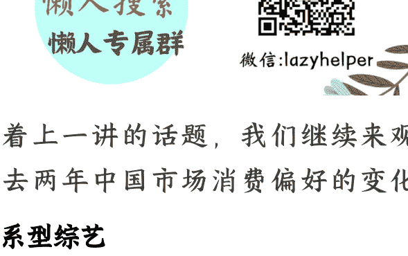

# 超级信号：性别议题扰动供需

## 250616《蔡钰·商业参考4》节选

整理：公众号懒人搜索，懒人专属群独享

懒人微信：lazyhelper

接着上一讲的话题，我们继续来观察过去两年中国市场消费偏好的变化。

## 关系型综艺

第三个变化是，在文化娱乐行业里，“关系型综艺”越来越成为年轻女性的高复购内容产品，在其中体验关系模型和人格模型。

《商业参考》在5年前第一季的时候，跟你讨论过综艺节目的进化。当时我们说，中国的综艺节目，从任务挑战型越来越向关系叙事型演化，它本身就是一种可以借来感知社会气候变化的先锋试验品。

到了今天，这个判断仍然有效。

这两年出现了哪些有国民度的综艺呢？《再见爱人》，几对想离婚的夫妻的长途旅行。这部综艺2024年出到了第四季，每期节目的嘉宾言行被上亿观众掰开了揉碎了解读。其中最素人的嘉宾麦琳，更是成为当时全国最热门的综艺红人，互联网甚至为她开创了“麦学”，把她的一组行动命名为“熏鸡事变”。为此，综艺从业者们哀嚎《再见爱人》“吸干了流量大盘”。

除了《再见爱人》，还有一些综艺也赢得了讨论度：《一路繁花》，熟龄女明星跟年轻男明星的组团旅行；《心动的信号》，年轻人的合居相处；《半熟恋人》，30岁都市男女的合租生活。这些综艺都是把人与人的半真实关系展露在镜头前，供嘉宾们品评、供观众们共情。

至于歌舞类综艺《披荆斩棘的哥哥》《乘风破浪的姐姐》的视频切片，在抖音和小红书上也相当有流量，但很多人不是为了看歌舞，而是热衷于讨论哥哥们怎么笑中带刺，姐姐们怎么绵里藏针。

前几天我跟朋友吃饭，一个朋友提出了疑问：为什么这几年的综艺里，年轻偶像好像退到了次要位置？前两年有话题的是三四十岁的熟龄“姐姐”们，这两年则干脆开始关注“奶奶”了？

这个问题有意思。在我们的手机里，蔡明、倪萍、刘晓庆、叶童这样的前辈明星，确实也开始凭借许多切片成为“内娱新任精神女王”。有媒体甚至说，2025年的内娱综艺主题，是“兴风作浪的奶奶”。

最后我们的讨论结果是：流量明星们顾忌自己在粉丝心中的人设，在真人秀里没法释放真实人格。但姐姐和奶奶们跟观众之间不存在关系契约，更想得开、放得下、做起自己来更没有心理障碍。而奶奶比起姐姐还多了一层前辈光环，她们基于资历，不但不需要谄媚同行与观众，还可以随时教别人做人做事。

所以 2025 年以来，74 岁的刘晓庆突然在年轻人当中走红，一方面是因为她在这个年纪坦然承认自己仍然享受热恋，另一方面是她在《一路繁花》的节目中贡献了一个经典片段：在别人顾虑预算时，她坚持多点了一条鱼，让自己吃饱吃好。

类似的，其他奶奶也在各种综艺节目里充分展现了个性。有情商的被誉为“活明白了”，懒得管理情商的也被称为“活明白了”。奶奶们有些言行放在早几年，很容易被大众指责成为老不尊、不识大体，但在今天的弹幕里，却被年轻人誉为“内娱活人”，羡慕奶奶们可以毫无顾忌地做自己。

请你注意了，我们讲奶奶，是为了观察年轻人的心态变化。这个变化里，我们可以认为，年轻人越来越把综艺节目当虚拟人生游戏来看待，借助各种狗血的关系和剧情，来体验各种高烈度的关系副本，把自己代入到最强悍任性的嘉宾人格里，无风险地体验“大女主人生”。

## 性别引发的市场变化

讲完年轻女性，我们再来看年轻男性引发的市场变化。

也就是我们要说的第四个变化，市场对女性主义的消费权重开始降低，而供给端还停留在上一代认知里，没有来得及修正产品策略。

我们还看文娱市场。《哪吒2》的势如破竹，我们已经不必再介绍，在它跟《唐探1900》《熊出没》等其他贺岁片的合力之下，2025年春节档8天拉出了95亿的总票房，比前一年增加了18.6%。

但你在春节期间看电影的时候，不知有没有注意到一件事：在春节叠加情人节的这个电影档期，国内院线一部新的爱情片都没有，只上了一部重映的老片《花样年华》，一个月拿下了6000多万票房。

过完春节，就进入了三八妇女节所在的3月份。借着三八节档期，国内院线上线了两部女性主义电影，一部是意大利片《还有明天》，一个月下来4000多万票房；另一部是英国片《初步举证》，一个月下来3500万票房，都没能追上重映的爱情片《花样年华》。

再到3月底，一批新电影开始竞争清明节档期，其中又有两部把“全女电影”为营销卖点，但在预售或试映中得到的反馈都不如预期。其中一部预售票房只有20多万，远低于同期其他电影动辄百万、几百万的成绩，随后决定撤档止损；另一部则快速调整宣传口径，撤下原本的“女性力量”主题，改为营销“现实主义”。

这组对比在告诉我们什么？

面向全民的《哪吒 2》可以有 150 多亿票房，《唐探 1900》可以有 36 亿票房，《射雕》和《封神第二部》哪怕不那么令观众满意，也至少能有 6 亿和 12 亿的票房。但是单独把女性市场切出来，单独拔高女性力量的同时，其实也就是在否定或矮化其他人群，也就是在拒绝男性、拒绝情侣、拒绝合家欢，当然也就会被更大的市场拒绝。

文娱行业可以看作情绪消费脉络上最先锋的行业。根据以上种种，我们可以认为，男性对女性主义产品的抵触，正在压低整个市场的消费大盘，而供给端对这个变化的感知是滞后的。

实际上，类似的扰动已经扩散到了其他消费领域。在这几年的女性主义浪潮推动下，今天的男性不仅仅是拒绝消费女性主义产品，甚至会把高调迎合女性主义的超级平台，也视为敌对阵营。2024 年 10 月，京东在双十一活动中邀请脱口秀演员杨笠作为代言人，引发了诸多男性用户的不满意。男性用户们开始用退货、退京东会员、赎回京东金融的理财产品、卸载京东 App 的方式表达抗议，京东事后虽然尽力补救，但它的股价和双十一销售额都受到了不小的伤害。

### 放弃大市场、专心做女性主义市场行不行？

也很容易招来反噬。可口可乐在 2025 年春节期间就惹了个麻烦。它先是发了张海报，让爸爸穿着围裙往餐桌上端菜，结果被骂：“现实都是妈妈做饭，凭什么让爸爸摘桃子！”隔了几天，可口可乐又发了张海报，像是想要补救上次的恶评。这次的海报内容，改成了妈妈在厨房、女儿在帮忙，结果又挨骂了：“凭什么默认女性就该做饭！”

你看，这像不像《伊索寓言》里的故事《父子抬驴》：父子俩牵一头驴赶路，被路人批评有驴不会骑；等父亲骑上驴，又被路人骂不心疼孩子；等孩子骑上驴，又被路人骂不孝敬父亲；等俩人都骑上驴，又被骂虐待动物。最后，父子俩只好把驴五花大绑起来，抬着它走。谁都能想象这对父子的心理阴影：这辈子都不想再带驴出门了。

种种市场变化，让再迟钝的营销公司也回过劲儿来了：男女话题，危险，勿碰。

但做生意总得吆喝啊！于是到了 2025 年 3 月份，市场上又发生了一件有意思的事：电商行业试着按照当下的市场氛围，摸索了一个版本的行动策略。

三八妇女节前夕，三个电商平台淘宝、拼多多、京东都更新了自己的App来做节日营销。但它们的更新，出现了某种奇特的行动一致性，咱们前面也说过：淘宝 logo 上的营销口号叫“38 焕新周”，拼多多 logo 上的营销口号叫“38 狂降价”，京东更惜墨如金，就叫“3·8节”。三家的妇女节营销活动，都不再提一个“女”字。各大消费品牌以往愿意高喊的“女神”概念，在 2025 年也基本上偃旗息鼓。

这是在干什么？你肯定意识到了，平台和品牌们，开始主动进行自我审查，以规避性别对立触发的流量攻击。京东和可口可乐们的教训，给整个零售行业都涨了经验。

往年高喊的“女神”概念，潜台词也是邀请男性为女性买单，但这个邀约2024 年以来正式失灵。大量消费品，电影也好、化妆品也好、礼物鲜花也好，无法再以“表达与增进关系的道具”这样一个身份，售卖出去。

这是第四个变化：性别对立已经开始扰动需求，甚至展现出对社会凝聚力的伤害。我们 2023 年在《情绪价值30 讲》里非常担心的情绪撕裂，还是发生了。在这个趋势面前，电影和文娱公司们还在想办法消化此前的生产库存，但互联网公司已经快速调整了方向。

## 总结

前面四个变化梳理下来，你肯定也能感觉到：在近几年的时代巨变里，不少个人和组织都被迫调低了自身系统的能量级别。这导致人们不约而同产生各种摄入“精神负熵”的需求，也同时对关照世界、善待他人这类熵增行为变得审慎和吝啬。

第五个变化，我们要回到组织管理和个人成长上来，看看“提升心力”这件事，如何变成了刚需。

我们下一讲继续。

- 🎵懒人专属群持续更新中，已持续运营6年，整理超3000份各类精选付费文章&年费社群干货，全部开放下载。

本资料为付费群内分享，仅供真实有需要的朋友查阅

## 懒人专属群更新记录：

https://lazybook.fun/#/blog/record2