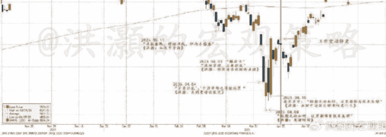
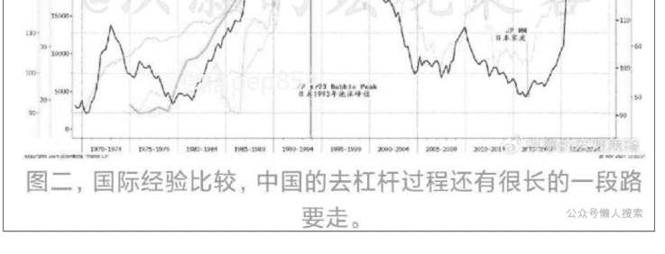
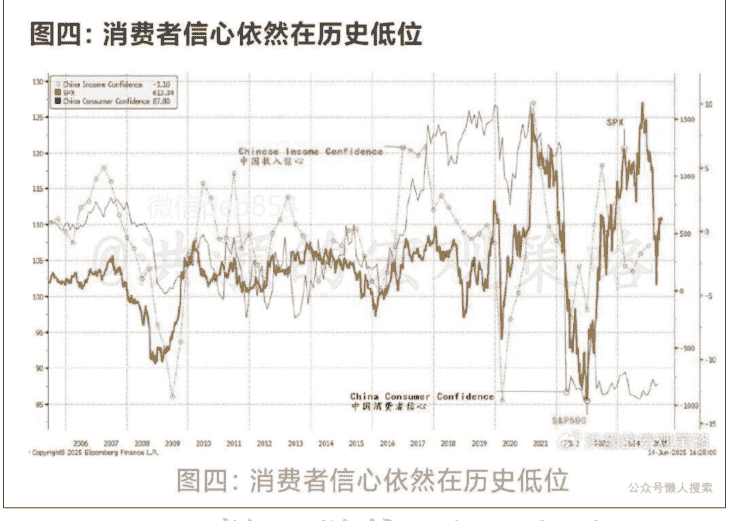
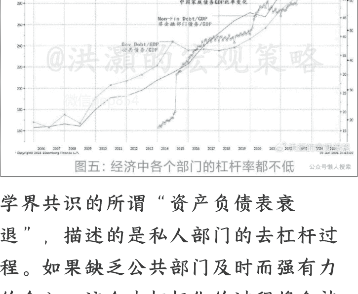

250616 洪灏的宏观策略

整理：公众号懒人搜索，懒人专属群独享

懒人微信：lazyhelper

# 洪灏：2025 下半年展望—周期的博弈

## (上)

2025 年下半年中国的在岸市场和经济展望。

每年的这个时候，都是我们回顾上半年的预测结果，并展望下半年的经济和市场的时刻。回顾，并非是为了炫耀业绩而居功自傲，而是为了总结经验，检验逻辑，对比结果，矫正偏差，并为展望下半年奠定更好的基础。

今年六月的这个时候，也是恰逢十年前 2015 年 6 月 15 日市场 5,000 点泡沫顶峰的时候。十年前泡沫破灭前的几天，我打开了一瓶澳洲的小众超级膜拜酒“Lake's Folly”，写了那篇获得市场公认的、预测了那年股市泡沫顶峰的经典报告《洪灏：伟大的中国泡沫》（报告网上还有，请自行搜索）。酒庄的名字也很应景，中文可以翻译成“荒谬之湖”。

当时，我认为市场的换手率飙升远过于中国台湾 90 年代时期泡沫的顶峰和日本、美国股市泡沫顶峰时期的换手率。这种现象显示当时的市场已经进入了极度投机的阶段，市场泡沫将无以为继，随时都可能破灭，而随后的六个月将是泡沫破灭的关键时间过程。市场当时在 2015 年 6 月 15 日见顶之后，一直到了次年一二月份，也就是 5000 点的泡沫顶峰大约六个月之后，才终于逐步见底。蓦然回首，已是十年。

过去十年，上证指数一直在 2,500—3,500 之间徘徊不前，始终没有决定性的突破。尽管期间许多市场专家大声疾呼、奔走相告，然而指数却稳如泰山而安然不动。市场的一种意见，是认为 A 股市场融资的功能远大于投资的功能，上市公司从市场抽取的资金远大于它们通过分红、回购等形式反哺给市场的资金。换言之，市场就像一个一边注水一边放水的池子，水永远不会漫溢。同时，视乎注水和放水的速度，一如 A 股市场的“注水速度”慢于“放水速度”，那么池子的水位将不涨反跌。

这个通俗的理论有一定的道理，在一定程度上解释了 A 股市场的历史表现。然而，监管早已对于需要再融资的企业有具体的分红要求。同时，如果一个公司正在发展壮大阶段，需要持续追加投资，同时如果这个公司的投资回报大于公司的资金成本的话，那么股东应该为这个公司不分红的决定拍手称赞。毕竟，公司自留资金才是最低成本的资金，而上市融资却有着高昂的融资成本。只有信不过公司的管理层，投资者才会要求掌握公司的留存资金。

在去年十一月的 2025 年展望报告，我对于这个现象做了细致的量化分析。我的数据分析发现，其实过去十几年，A 股的 EPS 每股盈利都基本维持在同一个水平。如果每股盈利十几年如一日的稳定，那么股价涨跌只能来自于估值的变化。而影响估值水平变化的因素，其实就是市场风险偏好和市场流动性条件。这两个因素都是由央行决定的——央行调节市场流动性的增减，市场风险偏好随之而起伏。

如是，这样的市场必然是以交易博弈为核心的市场。人们醉心于解读央行的货币政策、预测流动性条件的变化。这样的交易博弈，归根到底赚的是交易对手的钱，而不是与公司一起成长的钱。人们对于流动性不同的预期和解读，决定了他们对于股票的定价，产生不同的讨价还价，形成了交易机会和市场波动。在这样的市场环境里试图培养价值投资，难免缘木求鱼。

未来的下半年，我们也很难期待上市公司的每股盈利水平出现较大的增长，尤其是在外部环境波云诡谲、内部需求力有不逮的情况下。如是，那么市场流动性条件的变化将再次成为市场预测逻辑的核心。没办法，在一个博弈的市场里讲基本面，我们就会输在起跑线。那么，今年上半年的行情对于下半年的预测又意味着什么？

在去年十一月展望今年的时候，我们旗帜鲜明地提出了几个与当时的市场共识完全相悖的预测：
- 美股在未来三个月左右将出现大级别的暴跌；
- 中国是今年最逆共识的交易；
- 美元将开启贬值的趋势，黄金、贵金属将暴涨。

这些与当时的市场共识完全相悖的预测，在过去的几个月都一一得到了验证：
- 美股在二、三月份见顶，并开始下跌。同时，美股四月的暴跌以及伴生的市场波动率历史性飙升，都是历史上最暴烈的一次；
- 中国香港市场是今年以来表现最好的主要市场之一，同时上市融资总量也回到了世界之巅；
- 美元是今年表现最差的主要货币，没有之一。从我们预测至今，美元已经贬值了逾 10%，而趋势正在逐步加强，黄金则创了人类历史的新高，其它贵金属如银和铂金已经开始暴涨。

在四月二日美股史诗级暴跌前、三月二十九日的那个周末，我在深圳和上海两地的读者见面会上清晰地与读者们分享了我对于接踵而至的市场暴跌的预测，以及如何做好风险管理的策略(图一)。

### 图一：上半年的预测 vs 上半年市场的实际走势（全部都是付费专属报告）

在今年四月八日标普暴跌至 4,800 附近的时刻，我在题为《洪灏：关键时刻》的报告里清楚地写道，“短期，无论如何，在这个位置上都应该有技术反弹”，并在四月九日的专属报告中再次强调重申。回头看，一切都是那么清晰。然而，在当时身处于市场的滚滚洪流之中去做出这些逆共识的预测，决非易事。可惜，接下来由于工作变动，我那时暂时无法跟进更新这些预测。所幸的是，现在我又可以重新专注于自己的独立研究和对冲基金管理。

我们应该如何看待下半年的风险和机遇？

以下内容仅V+会员可见

### 中国的流动性条件

在十一月发表的展望报告里，我提出了三个判断今年行情走势的大致标准：
- 房地产价格能否止跌企稳；
- 地方债务负担是否能够得到有效的缓解；
- 央行是否能够义无反顾地扩表。

今年年初的几个月，房地产销售在政策全面放松的情况下有所回暖。然而，好景不长，近月房地产销售增速和价格又开始有所下滑，房地产继续拖累中国经济的增长。房地产泡沫的消化依然有待时日。

去年底，财政部公布了一系列帮助地方化债的措施，在2028年之前帮助地方化解14万亿元规模的隐性债务中的十万亿元债务。其中，
- 增加未来三年共六万亿元的地方债务上限；
- 同时未来五年从地方专项债中拨出四万亿元的专项债额度用来解决地方隐性债务；
- 而2029年后到期的棚户区改造相关的两万亿元隐性债务按原合同偿还。

这些政策通过减少利息支出、减轻偿债压力，在未来五年里将显著缓解地方的流动性压力，释放更多财政资源用于支持地方经济发展。然而，现在尚不能确定每年 1,200 亿元的节流是否足以完全补上地方的财政缺口。

简言之，我去年十一月提出的三个判断标准，前两个还是不能得到有效的满足。我在之前的报告里与读者分享过一个中美日杠杆周期的比较图。图中的数据显示，根据国际经验的比较，中国的去杠杆过程还有很长的一段路要走（图二）。

### 图二：国际经验比较，中国的去杠杆过程还有很长的一段路要走。

经济学界对于日本房地产泡沫破灭之后失去的三十年基本上达到了一个理论共识。学者们认为日本央行在九十年代初日本房地产泡沫破灭的时候，因为对于通胀的担忧而没有立刻出手放宽货币政策，失去了日本经济再通胀（reflation）的良机。之后，日本房价的持续下跌把日本经济拖入了“资产负债衰退”的泥潭之中。此后，日本对于消费的欲望大幅减少，收入主要用于还债去杠杆，而不是通过资产价格的再膨胀去杠杆。

美国在 08 年次贷危机之后得益于美联储主席伯南克对于三十年代“大萧条”历史教训的深入研究，美国政府紧急出手，通过增加美国政府杠杆的办法，成功地把美国经济内部的杠杆从私人家庭部门转移到了政府部门。迄今，美国政府在过去十几年的两轮救市中早已债台高筑、负债累累。而美国家庭的债务负担则依旧在历史低位。

换言之，美国私人家庭的财务状况依然健康，并体现在美国最近的就业和消费数据中。这部分经济占了美国经济的 70—80%。然而，美国政府的债务已经高达 37 万亿美元。信用评级机构穆迪最近也下调了美国国债评级，使美国国债的评级甚至在澳洲、瑞士这样的小国之下。美国现在的债务负担，更多的是在于政府而非私人部门。

在日本 2011 年阪神地震之后开启的“三支箭”政策，日本的杠杆也逐步从私人部门转移到公共部门。日本家庭部门在 2012 年之后逐步地完成了去杠杆的过程，并在近年以来开始重新加杠杆。日本的房价已经开始恢复，东京的房价回到了 90 年代泡沫顶峰的水平，日本的通胀、长期国债收益率已经高于中国。这时，日本央行持有的日本国债已经超过了存量的 50%。因此，日本和美国治理房地产泡沫、去杠杆化的历史经验揭示的教训，其实与学界共识并非一致。日本经历的“失去的三十年”其实只是二十年，即 1990—2010，之后便开始走出了去杠杆去泡沫化的过程并开始修复。而其决定性因素，是“三支箭”之后，实体经济中负债主体的转移——从私人部门转移到了公共部门。

同时，美国之所以可以快速地走出房地产次贷泡沫的阴影，也是得益于美国政府的迅速介入，很快地把房地产债务负担转移到政府的政策资产负债表上，并且帮助私人家庭去杠杆(图三)。顺便一提，允许房地产企业和私人家庭宣布破产，也是美国债务重组的有效方式。通过债务违约进行债务重组，让信贷周期更快地修复、美国经济在次贷后快速复苏，十几年来只因为新冠疫情而经历了一次短暂的衰退。

飙升到四万亿美元。因此，很多新增的流动性都被繁重的债务所吞没。

也就是说，当时美国新增的流动性都拿来还债了，并没有直接进入实体经济参与经济的运行。这些新增流动性更多的是进入了金融市场，通过资产价格的通胀而不是实体经济的通胀来帮助美国家庭去杠杆。而美国通胀的第二次跳跃则出现在新冠疫情后、美联储开始无限量宽的时候。那时，美国家庭已经完成了去杠杆的过程。

美国财政部当时直接使用伯南克的“直升飞机撒钱”的方式，空气式印钞，把钱直接打入美国家庭的银行账户。疫情期间，这些钱以生活支出的方式流入了美国的实体经济，实实在在地参与了美国实体经济的运行。而美联储的资产负债表一跃而上，到了九万亿的规模。

现在，美国政府的债务已飙升到了 37 万亿美元规模的规模，过去十几年发的债比美国之前 200 年发的债的总和还多，更勿论之前的两百年美国经历了独立战争、南北战争和第一、第二次世界大战，韩战、越战还有两次中东战争。就这样绵绵不断的战事，也没有过去十几年造钱造得多。的确，美国看似一个“例外”，其实只是一个财政的蜃景。难怪伯南克在解决了次贷危机之后就赶紧甩锅给耶伦。而耶伦在扭曲操作之后又赶紧甩锅给鲍威尔。但耶伦主导的美国财政部不断地把美债货币化，也给现在美国的财政状况平添了十分混乱。

因此，快速去杠杆需要公共部门迅速而且有力的介入，把私人债务迅速地货币化、公共化。在私人部门负债累累时，通胀很难上升，这是因为这个部门并不能够印钱还债，而是需要打工挣钱还债。这种通过工资积累的还债方式自然是经年累月的，与宣布破产而获得的瞬间解脱、公共部门大规模印钱还债的做法自然不可同日而语。

与此同时，私人部门资产端由于房地产价格持续下跌而无法修复，更加加重了私人部门信心的不足和消费的收缩。这个负反馈回路不断的自我强化，最终将压抑这个经济的“动物精神”。以上的逻辑推理，从现下的经验观察得以验证。无怪乎，中国的消费者信心依然在历史低位徘徊不前（图四）。

我上述的评判标准，正是对于房地产市场当下面临的挑战的缩写。房地产价格下跌、地方债务繁重导致了私人部门的杠杆暂时无法向公共部门转移。而央行的货币政策依然不温不火。只有超预期的宽松政策，才能唤醒动物精神。在经济的各个部门都面临着债务重担的时候，通过公共部门主动扩表转移私人部门杠杆，通过资产价格的“再通胀”（reflation）来帮助私人部门完成去杠杆的过程，不失为上策（图五）。

### 图五：经济中各个部门的杠杆率都不低。

学界共识的所谓“资产负债表衰退”，描述的是私人部门的去杠杆过程。如果缺乏公共部门及时而强有力的介入，这个去杠杆化的过程将会被拖延。债务的刚性不仅仅是因为债务并不会随着资产价格下跌而减少，更是因为私人家庭缺乏“造币”能力，只能通过劳动积累来一点点地去杠杆，而不能印钱还债去杠杆，也不能通过资产价格再通胀而去杠杆。这样通过储蓄来去杠杆的方式，必然是经年累月、旷日持久的。中国最近的经验观察(empirical evidence)，包括消费降级、储蓄飙升、市场呆滞的情况，似乎也在验证我们上述的逻辑和数据。

综上所述，流动性条件很可能很难根本改善——除非央行义无反顾地扩表，也就是我之前提到的第三个条件。这是因为中国经济的负债部门是私人部门，而非公共部门。经济里的这个部门负债表现出的特征，就是通缩压力、消费降级，动物精神缺失储蓄上升用于降低杠杆。与学界共识不同，私人部门负债的刚性，更体现在通过劳动积累的储蓄来降杠杆的过程是漫长。日本就是前车之鉴。在这样的经济结构中，新增的流动性都会被沉重的债务负担所吞噬，而不参与在实体经济的运行中。在私人部门杠杆转移到公共部门之前，资产价格可以随着流动性的变化出现逆下行大趋势的反弹，但是却不能改变下行的趋势。至于股市，那么还是将继续在交易区间中震荡。

如果债务负担在公共部门，那么情况就会截然不同：通胀压力，消费需求旺盛，动物精神抖擞——因为公共部门可以印钱还债，而不需要通过储蓄积累还债。如果经济增长可以因为科技突破等原因持续而不陷入滞涨，那么资本市场还是可以有所表现，甚至会因为通胀而表现得更好。毕竟，上市公司盈利是名义的，将随着通胀而水涨船高。

### 上半部分总结：

在去年年底展望今年市场的时候，我们曾经对于今年市场的走势列下了三个基本的评判标准：
- 房地产价格能否止跌企稳；
- 地方债务负担是否能够得到有效的缓解；
- 央行是否能够义无反顾地扩表。

实体经济里负债的部门不同，对于资产价格和通胀的趋势影响是截然不同的：公共部门负债通胀，私人部门负债通缩。这是因为公共部门可以印钱还债，导致通胀；私人部门只能储蓄降杠杆，导致通缩。因此，私人部门去杠杆必然导致社会需求下降，经济增速放缓，资产价格下跌，并导致收入和需求进一步下降，形成负反馈循环。这时，公共部门及时而果敢的介入，把私人部门杠杆转移到公共部门，是避免这种负循环反馈的关键。

简言之，我们去年年底的评判标准暂时不能完全满足，条件三虽有端倪、实施的前提也充沛，但是力度还是不尽人意。因此，今年中国在岸市场表现稳定，年初至今约为个位数的回报，在全球主要市场中表现不温不火。在岸市场的机会继续在于把握政策预期变化而产生的交易机会。执笔时，伊朗和以色列的冲突开始扩大。

然而，以色列在一日之间摧毁了伊朗如此多的核设施、刺杀了一系列伊朗军方的高层指挥，以及美国的默许和介入，都显示出双方实力的悬殊。在地缘冲突中，力量相当是持久战，力量悬殊那么就是速决战。这是我们预测的基准情形。

油价涨幅已经从 14% 回落到 7%，金价保持涨幅，再次逼近历史高点 3,500。短期内新闻头条的风险将继续扰动全球市场，但也会为投资者创造买入机会。

在星期一六月十六日即将发表的 2025 年下半年展望的下半部分，我将讨论全球和中国香港市场，以及各个主要资产类别的机会。

懒人专属群持续更新中，已持续运营 6 年，整理超 3000 份各类精选付费文章&年费社群干货，全部开放下载。

本资料为付费群内部分享，仅供真实有需要的朋友查阅

懒人专属群更新记录：
https://lazybook.fun/#/blog/record2