# 产品新人如何从 0-1 在 1 个多月拥有 1000+个用户

250616 生财精华

公众号懒人搜索，懒人专属群


我是书虫，关于我自己的既往经历不重复讲述了，大家可以看一下之前的复盘贴。

## 结缘

在 418 生财直播的时候，有幸和小排老师、Albert 哥、黄亮大哥、条形马老师一起在会议室里面聊了很久。都在交流产品的时候，因为我清楚我原产品安全上可能有点问题，小鹅也借机让他们给我看看，看了以后让我早点关掉吧....

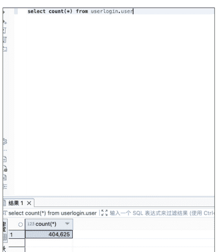

```sql
select count(*) from userlogin.user where expire_time > now();
13,576
```

这个产品用户量确实不小，总人数一共有 40w+，目前还在期的 1W+。虽然还有其他项目的收入，但是这个还是占比比较大的，确实肉疼。还没弃，现在不推广也不宣传就干放着。这个产品也是一共有三个人一起弄的，自己也不是主开发，没有完全的决定权~

和他们聊了一些以后，聊到之前 3 月底有个“40 画图吉卜力”特别火，有需要这个 API 模型，而我正好有，并且价格便宜稳定，我就说可以找我。我说价格 0.02 一次，都说那么低，后续有机会可以合作。也有幸在那会可以认识那么多位大哥成功链接上，过了几天和 Albert 老师约了一顿椰子鸡，吃饭的途中也聊了很多。

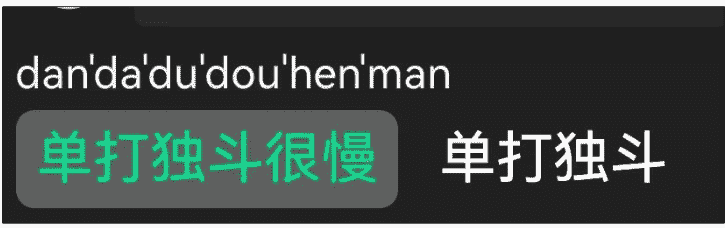

我太习惯一个人单打独斗了，之前基本都是一个人，他就给我讲了一个例子，我印象真的特别深刻。他说如果你是一个年入百万的，就不要去做那些很基础的工作。你可以算一笔账：一年工作 12 个月，每月 22 天，每天 10 小时，那么你的时薪大约是 378 元。那么，做任何低于这个时薪的工作，都是不值得的。

事实上，绝大多数工作在 BOSS 直聘上都能找到人来替你完成，真正重要的是，要做那些无法替代的事情。那时，我突然明白了，过去我总是陷入一个误区，觉得自己必须能做所有事情，什么都想学，什么都想会。这种想法让我没办法从大量重复性机械的工作里解放出来去思考战略、思考发展，甚至没有时间出去交流，导致我错过了许多机遇。

一个时薪 378 元的人做着时薪 40 元的工作，在商业上其实是一种不道德。自己美其名曰说单打独斗，其实就是不愿意付出金钱的成本去尝试，殊不知时间成本更贵！

一个创业者百分之七八十的时间都在做重复琐碎的事情就很没必要；把一些重复劳动的，或者有专门的人可替代我去完成这件事情，那我在这一部分的工作就能够释放出来。

聊完以后，也没有闲着，自己那会想做的就是 AI 自媒体（公众号）一类的，还有就是根据他们的需求，我就想重新做一个好的 API 集合站。能做这个产品也是刚好自己在这个行业待了蛮久，23 年就开始有相关的资源；就像小排老师的 AI 图片站，他有他的 AI00，自己之前思路没有跑通，跟他们聊完以后也算是思路整理完了，并且觉得能做，于是就开始。

上截图，到至今用户 1158。

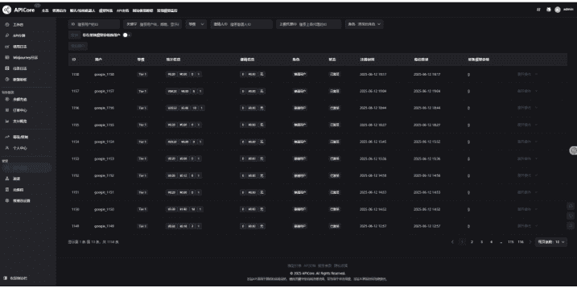

## 1. 产品搭建过程

- **① GitHub 上找开源的项目：**
https://github.com/QuantumNous/new-api，因为目前有还算成熟的，自己就找了相关开源项目去进行改。既然开源，那就肯定没有相关的人去专门给你服务，遇到问题基本也要自己解决，加了 QQ 群也没有人会特别给你服务。

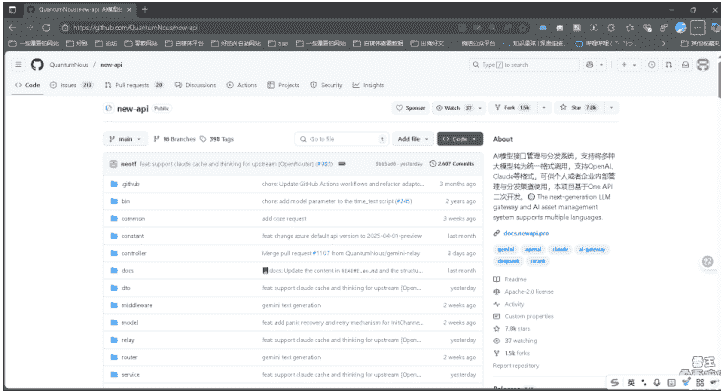

- **② 遇事不决问 AI ChatGPT 和 Claude 辅助：**
自己会一些代码，同时也善用各种 AI 软件，ChatGPT、Claude 基本能够解决我大部分的问题，自己跟 ChatGPT 聊天的时间基本也在 8 小时以上了；实在解决不了的，就按 Albert 说的找专业的人给自己处理，自己一点一点去完善产品。

下面是跟 AI 聊天的冰山一角：
- 代码注释请求
- 网页设计美化建议
- 广告语创作助手
- GPT-Image-1 SDK Usage
- 500 502 错误原因分析
- Kling AI API 调用
- 内嵌网页或接口
- 宝塔面板学习要点
- 首页部署到服务器
- 路径前缀路由实现
- 语言代码对应关系
- Markdown 网站嵌入限制
- SaaS 多语言集成
- 添加多语言支持
- 标品与非标品区别
- lsmaque.org 竞争分析
- IPQuality.org 竞品分析

### ✅ 方法二：使用 HTML 的 `<br>`（适用于支持 HTML 的平台）
```markdown
### 🚀 想进交流群？添加微信：`scfuye001` 欢迎 AI 开发者、模型爱好者一起讨论与分享！
<br>
## 📝 更新记录
```

### ✅ 方法三（最推荐写法整合）：
这是你最终可以直接用的版本：
```markdown
### 🚀 想进交流群？添加微信：`scfuye001` 欢迎 AI 开发者、模型爱好者一起讨论与分享！

## 📝 更新记录

* **2025.05.30** 🌟 已支持 Flux 最新模型 `flux-kontext`，图生图系列模型，支持 dalle 等功能 [点
* **2025.05.22** 🌟 已支持 Claude 4 系列模型 [点击查看](https://example.com/claude4)
* **2025.05.12** 🌟 已支持可灵视频模型 图 H2.0 [点击查看](https://example.com/h2o)
```

📝 注意：中间那一行其实是“空两行”，可以确保绝大多数 Markdown 渲染器都会换行。

技术人员首先从自己身边的朋友去咨询，哪些朋友会哪些，找他们帮忙，他们帮完忙以后，要懂事的发个红包，尽管关系好也要。

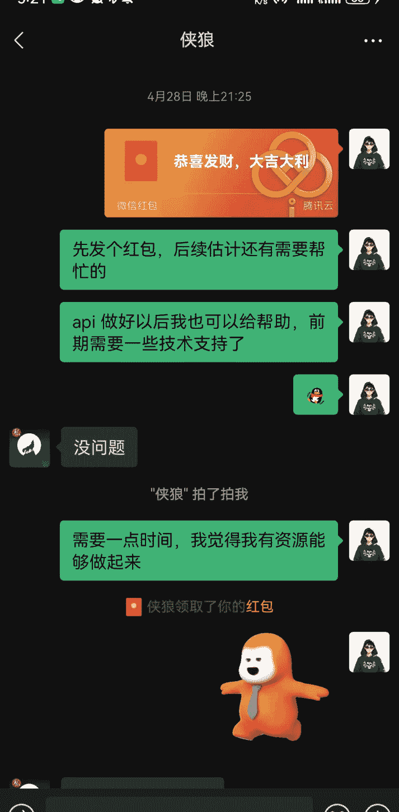

- **③ 不完美主义：**
在产品开发过程中，我渐渐意识到，和我之前做过的项目其实并没有太大不同，最关键的还是要行动，先做出来。即使有很多问题，先让它运行起来，接下来慢慢修复。

在创业的道路上，最常见的陷阱就是完美主义。很多人因为害怕产品不够完美而迟迟不敢推出，结果错失了市场的风口。其实，真正的成功并不是从一开始就完美无缺，而是敢于行动，敢于冒险。

完美的时机永远不会来，市场的需求也永远在变化。你所认为的完美，可能别人根本不需要。与其把时间浪费在无休止的优化中，不如先把产品推出去，哪怕它只是一个“坨屎”。当它一旦进入市场，你可以从用户的反馈中不断迭代，不断完善。每次更新和改进，才是产品走向成功的关键。

很多伟大的公司，都是从一个“不完美”的版本起步的。例如，Facebook 最初也只是一个简单的校园社交平台，后来才发展成全球最大的社交网络。它从来没有追求完美，而是勇敢地跳出舒适区，快速上线，边跑边调整。

其实，不完美的产品同样可以运行、可以推广，可以开启第一波冷启动。“行动胜于完美”，只有开始了，才有机会改善；只有做出来，才会有客户反馈。

客户的声音才是快速成长的捷径，自己去预设的困难和问题大部分都是自己虚构的，真实的客户反馈才能让产品有核心优化的点。

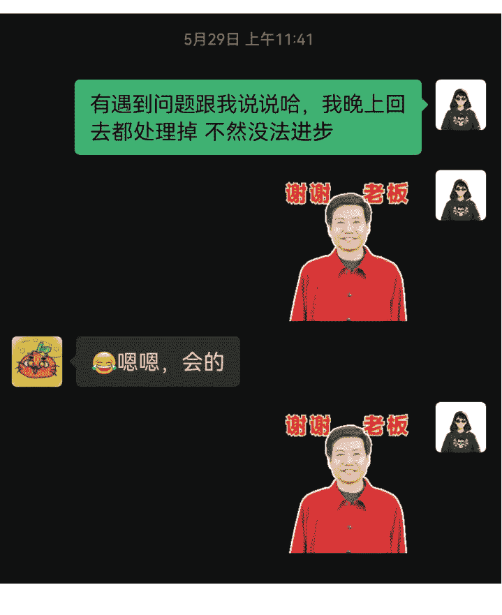

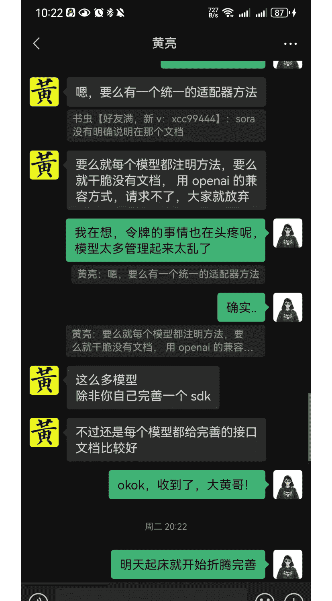

## 2. 产品冷启动（如何获取种子客户）

- **① 拆解对标：**
国外：https://openrouter.ai、https://replicate.com/、https://www.together.ai/、https://fal.ai/

国内：能做的比较大比较全的几乎没有，而硅基流动只有国内大模型，不包含国外的。

在国内外市场的差异中，我们常常看到一些行业的“进化论”。就像谷歌与百度的差距，前者是全球搜索的巨头，后者则在国内牢牢占据市场份额，然而在国际化方面，百度显然还远远不及谷歌的全局视野。亚马逊与淘宝的对比也是这样，亚马逊作为全球电商领头羊，致力于全球布局，发展多元化业务，而淘宝的核心依然集中在国内市场。

这就就像 AI 行业的现状，国外的一些平台如 OpenRouter、Replicate、Fal.ai，已经在这一细分领域占了一席之地。然而，国内有做相关的平台仍然处于相对混沌的阶段，我就觉得我有机会，所以执行力拉满了就干了！

- **② 微信私域：**
看了我文章刚开始做的那个产品，所以我肯定有一些私域用户的，但是都是 AI 相关的，但是这两种需求人群几乎是不一样的。
- 客户端人群画像：内容创作者、学生、教育工作者、老板、客服代表、营销、职场人士等等
- API 人群画像：软件开发公司、独立开发者、SaaS 平台提供商、自动化工具开发者、支持 API 接入等平台、大型公司等等

所以自己的客户只有一小部分是重合的，但是几乎用户人群得重新找，几乎又是从 0 开始出发，不过冷启动也算足够了。

- **③ 公域平台扩张：**
**微信公众号：** 自己微信公众号也开始做了 AI 相关的内容，我相信未来还是 AI 的，但是目前 AI 流量变现渠道还比较窄。我所获得的信息告诉我，一定要有自己的产品，有了 AI 相关的流量以后，自己能够创造产品，有流量，有产品也能够迅速去验证需求，最低成本去试错。

能够成为我订阅者的，信任成本也会降低很多；同时，目前人们对 AI 有一个共识，我感觉也是各种 AI 所带起来的，现在人们对 AI 的理解就是，用好的 AI 我们就应该付费！因为算力很贵！

因此，我开始寻找合适的写手帮助我创作内容，直到现在，我们已经发布了七篇文章。

自己找写手的方式是：在自己的社群先发布相关的信息，对写手能力有什么要求，然后自己想要对标哪些公众号，报价如何，然后试稿一篇。社群如果不满足自己的情况下，朋友圈再发一篇就可以了，筛选下来基本能找到符合自己想要的；没有自己私域的伙伴，小红书发个招募贴是个不错的方式。

> **【书虫】AI 成长社群(253)**
> 书虫:【微信昵称】书虫 【所在地区】深圳 【自...
> 4月26日 下午15:29
> > 来个会微信公众号写作的，然后对各类型AI都有理解的，包括AI文字、AI音乐、AI绘画、AI视频，agent等，不要求全会，后面需要的时候能及时学

然后刚开始阶段，这边是需要兼职类型的，一篇价格： 然后1W阅读、5W阅读、10w阅读额外提成。可以自己报价，看看是否合适，群里找不到我再去朋友圈吧。


> 书虫的聊天记录
> 书虫:[图片]
> 书虫:[图片]
> 书虫:[图片]
> 书虫:[图...


4月26日 下午15:29
> 公众号文章内容具象化一点，可以参考这些公众号

4月26日 下午15:34

然而，流量增长还是较为平稳，没有明显的优秀数据还未迎来爆发式增长。不过，因为我以前大量的做项目的经历，我已经能够去承受这种长期没有正反馈的过程，我知道这会是我想要去拿到结果前的一个必然周期。在下一个风口来临前，我需要有足够的基建和准备才能够去接住。例如像过年期间，DeepSeek 这一波风口，有很多成熟的团队就可以在一个现象级的事件面前原地起飞。

公众号懒人搜索，懒人专属群分享
- 在线人数：2:37
- 分享数：3
- 速度：K/s 6
- 排名：< 35
- 关注我的人：674位
- 全部关注：5位新关注
- 排行榜（更新至 2025/06/06）：
  - 阅读最多：暂无数据
  - 分享最多：暂无数据
  - 留言最多：暂无数据
  - 精选最多：暂无数据
  - 赞赏最多：暂无数据
  - 付费品名：暂无数据

懒人微信：lazyhelper

发表记录：
- 2025/5/31 23:49 （附邀请码）深度试玩Flowith Neo，引爆2025无限智能体新纪元！原创 | 310 2 8 25 2 2
- 2025/5/28 17:26 （赠邀请码）Lovart.ai横空出世，AI包办全链路设计，创意从此“一句话”搞...... | 425 2 10 25 6 0
- 2025/5/23 22:15 Claude 4 重磅发布：AI编程王座回归，成功把gemini2.5pro比下去了原创 | 292 0 5 8 2 0
- 2025/5/21 11:54 QQ浏览器+AI=QBot，国产浏览器，终于放下「门户网站」的残念，彻底拥...... | 171 0 3 7 1 0
- 2025/5/20 12:27 互动 发表 我

即刻、推特：即刻和推特的玩法就挺简单粗暴的，自己有做朋友圈，所以自己只需要同步朋友圈内容就可以了，以及自己的产品都有什么更新，有变化都可以同步到这些上面增加自己的曝光。

- **即刻：** 即刻的核心，我感觉在于发的时候，选好“圈子”发送，以及文案，SEO 上要刻意一点。这个 App 圈子比较小，但是用户人群都很精确，有需要的用户会找到你的。
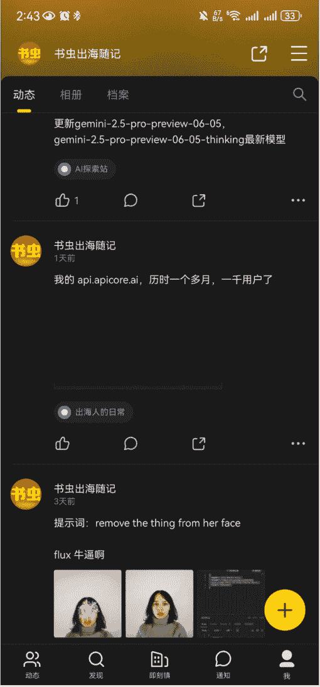
- **推特：** 推特看了之前阿西的帖子，自己也学习了一下，自己做的方式，就是有内容的时候可以多发，这个平台是鼓励多发的，自己除了发自己产品以后，也会发 AI 相关的内容，让人觉得你推特有价值，这是很重要的。

还有一个小技巧就是，现在大模型生图的，蛮多能够生出一些擦边的图，玩推的人都知道，上面的内容尺度还蛮大的。所以发相关内容也能给推特带来较大的流量，这种方式似乎也仅仅只适合推特，内容方式在推特上能带来较大的曝光。

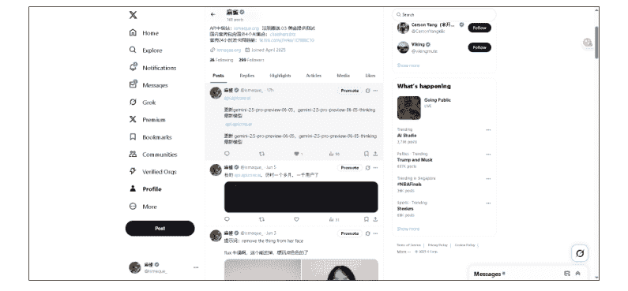
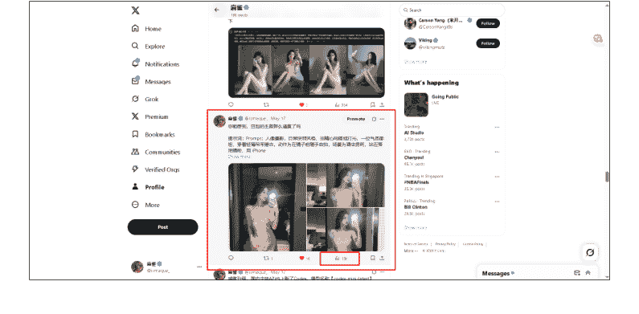

## 3. 流量增长与放大

- **① 口碑+转介绍：**
很多人最初认识我好像都是通过，最开始号贩子，销售 plus 会员，睁眼就是干，每天都好多用户。因为售后做的好，封号能够按天退款，口碑和转介绍也多，高峰期几个月用了 40 多 w 美金。

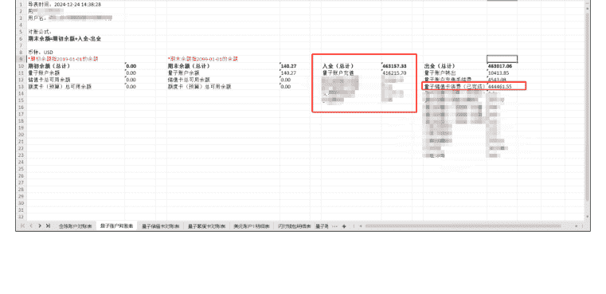

自己做 API 的方式也沿用了之前，自己做这行清楚的知道，稳定是最重要的，其次才是价格；如果不那么稳定，那用户们宁愿选择稍微贵一点的。我很快就意识到了这个问题，所以为这个问题自己也是付出了不少努力。一个模型为了预防突然出问题，自己一个模型最起码都是有三个备用的方式，出现问题会自动轮训，或者自己能够及时处理。

其次就是价格，自己在这行两年，所以有非常多的渠道优势，自己也重新整合了一下资源，找了很多的朋友咨询合作才有了现在很不错的稳定性，还有比较不错的价格优势去争取客户。

有机会链接很多的大佬后，他们使用不错后，也会给自己群里直接拉人，或者直接推 V 给朋友们，也非常感谢他们。

懒人微信：lazyhelper

> 3:25 31
> **群聊(3)**
> @刘苇 Jasper @兔老大 Roxy API(包括逆向 API)，找 @书虫(好友满，新 v：xcc99444)
> 好巧@刘苇 Jasper
> 5月26日 下午16:38
> 嗯嗯
> 3.7还是4.0啊
> 都有呀
> 哈哈
> veo3有吗
> claude-opus-4-20250514

懒人微信：lazyhelper
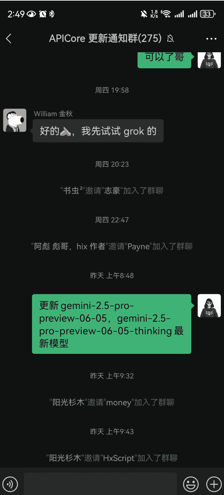

- **② 赞助推广：**
很巧，哥飞老师弄线下活动，招赞助商，我还没看见这条朋友圈的时候，葱哥就把这条朋友圈发我了。

懒人微信：lazyhelper

> **葱葱**
> 5月15日 下午16:50
> 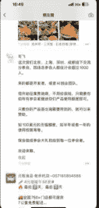
> 卧槽
> 我没注意到
> 我现在就私聊一下
> 谢谢哥!!!
> 
> 跟彪哥对接中，希望能成
> 
> 稳定和价格，能搞上去肯定没问题的
> okok

> 
> 7分钟前 杭州市·三禾屋·日本料理(梦想…
> **哥飞**
> 这次我们北京、上海、深圳、成都线下交流分享会，四场总参会人数估计会超过1000人。
> 来的都是开发者，或者AI创业团队。
> 现开始征集赞助商，不用给我钱，只需要你给所有参会者赠送你们产品使用额度即可。
> 只要你的产品是出海需要用到的，就可以来赞助。
> 如100美元的充值额度，如半年或者一年的使用权限等等。
> 我会做成参会大礼包给到每一位参会者。
> 欢迎来聊。
> 收起

> 11分钟前
> **# 元祖食品老余杭店-057185854588**
> **#元祖端午88折#**
> 🔥最后2天，最后2天
> 🚛全国750+门店都可提货 7公里免费配送...

| 时间 | 主题 | 嘉宾介绍 |
|---|---|---|
| 17:30~17:55 | 小预算团队，如何投放海外kol | 某AI产品海外投放负责人 |
| 18:00~18:40 | 过去两年我们验证过的有用经验 | SEO专家、哥飞的朋友们社群创始人、出海AI工具创业者 |
| 19:00~21:00 | 晚上交流会 | 一起吃吃喝喝，任意组队交流 |

0607上海站，价格99元，限额150名，仅限社群成员报名。现场还有惊喜大礼包赠送给大家。
赞助商：Paypal、AWS、Same.new、ShipAny.ai、PPT.AI、TuningSearch.com、Ismaque.org、LXX.ai

然后我就很积极的去把握机会，也成功争取到了。因为飞哥那边都是出海的玩家，结合主题，目前很多的出海玩家，几乎做的都是
懒人微信：lazyhelper

套壳产品，所以几乎都会需要 API，也给自己产品争取更多用户。经过这一次勇敢去做这件事情告诉我，不要害怕去赞助付出很多高昂的成本。虽然成本是有，但是可以通过计算，你做这件事情 ROI 是多少，你付出 5 万块，你能从这件事情里面收获多少，自己做这件事情的目的是什么，能否达到，如果都满足我们的目的，那就是合理的。记得涛哥和苏铁都跟我说过，不要害怕付出金钱，钱进兜里了，就不再愿意拿出来，只要投产比是合适的，其实都可以尝试。验证市场需求是至关重要的，而最快的方式往往就是投入资金进行精准的市场测试。通过付费获取流量，能够快速收集到真实的反馈，判断出项目的核心需求是否真实存在。如果发现是伪需求，尽早放弃不仅能节省大量时间和精力，还能避免无谓的资源浪费。创业是一场试错的过程，花钱试错的成本是有限的，而时间一旦浪费，就再也无法追回。

公众号懒人搜索、懒人专属群分享
用钱买时间，用时间节省未来的资源损失。这种方式不仅帮助我们更快地接触到真实的用户需求，还能帮助我们在市场中做出更精准的调整与迭代。真正的风险不是试错，而是低效的延迟决策和错误的坚持。

③公众号投放
在我之前做 GPT 账号业务的过程中，我主动去链接了几乎所有的抖音博主，沉淀下来了很多客户，其中还和一个公众号大V成为了很好的朋友。在他来杭州的时候，我主动链接他并且一起吃饭聊天，他同意了接受我的付费推广。
懒人微信：lazyhelper

# AIGCRank
## AI公众号排行榜
## 自媒体


2025年3月 数据支持：新榜

| 排名 | 公众号 | 发布 | 总阅读 | 平均阅读 | 总点赞数 | 新榜指数 |
| :--- | :--- | :--- | :--- | :--- | :--- | :--- |
| 1 | 数字生命卡兹克<br>Rockhazix | 24/25 | 83万+ | 33148 | 26268 | 823.2 |
| 2 | 赛博禅心<br>BinaryBodhi | 24/24 | 37万+ | 15216 | 10420 | 774.7 |
| 3 | 袋鼠帝AI客栈<br>masterIhm | 18/18 | 14万+ | 7907 | 1826 | 714.3 |
| 4 | 探索AGI<br>gh_1417326d90b8 | 27/30 | 15万+ | 4847 | 1270 | 708.2 |
| 5 | 沃垠AI<br>WoYin-AI | 23/24 | 14万+ | 5805 | 1794 | 708.1 |
| 6 | 胡说成理<br>hushuochengli | 5/5 | 26万+ | 52180 | 3235 | 702.1 |
| 7 | AGI Hunt<br>AGIHunt | 86/88 | 15万+ | 1711 | 1683 | 698.1 |
| 8 | 歸藏的AI工具箱<br>op7418ux | 26/26 | 11万+ | 4266 | 3498 | 696.6 |
| 9 | 快刀青衣<br>kuaidaoqingyi520 | 5/5 | 6万+ | 12712 | 753 | 690.4 |
| 10 | 花叔<br>WatsonBM | 16/16 | 9万+ | 5744 | 1543 | 689.1 |
| 11 | AI修猫Prompt<br>aixiumaoprompt | 19/19 | 9万+ | 4729 | 1227 | 688.0 |
| 12 | AI信息Gap<br>alinsightsgap | 64/64 | 12万+ | 1952 | 1391 | 687.8 |
| 13 | 哥飞<br>gefei7 | 23/23 | 10万+ | 4372 | 964 | 685.3 |
| 14 | 段老湿AI实操日记<br>xxcm430 | 21/21 | 9万+ | 4242 | 781 | 683.4 |
| 15 | 云中江树<br>LangGPT | 26/28 | 9万+ | 3318 | 2090 | 681.2 |
| 16 | 十字路口Crossing<br>c-r-o-s-s-i-n-g | 16/16 | 8万+ | 5120 | 978 | 681.1 |
| 17 | 橘子汽水铺<br>orangeAGI | 28/28 | 9万+ | 3224 | 1648 | 679.1 |
| 18 | 开源AI项目落地<br>gh_922ed6d49ee6 | 21/21 | 8万+ | 3723 | 895 | 673.3 |
| 19 | 路人甲TM<br>smcode2016 | 14/14 | 7万+ | 5117 | 331 | 670.8 |
| 20 | 卡尔的AI沃茨<br>LearnPrompt4Free | 20/20 | 7万+ | 3669 | 1552 | 669.9 |


## 4. 产品优化过程

### ① 首页界面美化
自己慢慢做起来以后，小排老师就给我说，如果你不想只做一个草台班子，而是真的希望做成一个事业，或者说是做到国内头部，不应该再用现在非常简陋的首页界面。域名、名字、用户体验、交互、界面设计，这些自己真的都重新处理一遍。

刘小排：我觉得你不太需要半年。。请先选个好名字，然后把你产品的界面、用户体验什么的提升了一个档次。
用户：白天出门了，起床继续处理！名字也改吗？域名改的话？
刘小排：你要按照 OpenRouter 的品质来要求自己。改。可以可以！收到，老师。听话照做！你想想看，现在我把你这个网站写到教程里面，我的教程是掉价的，对不对？没有教程会写你吧。你得按照世界级的品质要求自己，让全世界的人写教程都敢把你写进去。

公众号懒人搜索，懒人专属群分享
刘小排：5月30日 凌晨01:50。我听说你这边口碑还可以，API的稳定性是没有问题的。那你就要对比一下，为什么你这个产品给人的感觉就有点low呢.. 域名、名字、用户体验、交互、界面设计，我觉得这是你现在最缺的。现在有 AI 你好歹外观装修一下是容易的吧？好！明天就开始搞！
域名：这个从 ismaque.org 改成了 api.apicore.ai。api 前缀+core 感觉不错，让人一眼就知道你是干嘛的，并且 ai 后缀，据说做 AI 相关网站有天然权重，所以也是花了大几百重新买了，名字也是跟 o3 沟通了很多很多个来回进行决定的。名字就跟着域名也就决定这个了，英文也挺好的。
交互、页面设计：页面设计自己重新做了一个首页，但是似乎还是不够好，用户体验和交互也是持续在完善，有用户反馈，和某一刻觉得不合适就改，这几项只要做产品，就得持续的去进步，目前还是有点 low，给自己多一点时间应该会慢慢好的！
还是按最初说的，尽管很烂，先做一堆垃圾起来，然后慢慢优化，无论做产品还是项目，这个逻辑错不了！

### ② 用户体验优化
葱哥也给我说，我有很多不好的地方，加大了用户的使用难度，都一点一点在优化。
亦仁老大，在航海家群里面发的一个帖子，然后自己看了，一个关于模型漏斗的词，不要增加客户的使用难度，每增加一步，可能用户量和用户体验都在下降，也感慨，抖音打开就能刷，也算是做到极致了。

公众号懒人搜索，懒人专属群分享
但张一鸣一句话就把这个想法击碎了：
> 你计算一下，一个新用户打开你这个产品后，要点多少次关注，才能得到一个可以看的首页，这样筛下来，有多少用户能完成这些操作？

我如雷贯耳，是，我们都知道产品每多一步，漏斗有多大，假设我今天有10000新增用户，进首页、找专家、选择某个/某些领域关注……这么筛下来，最终有多少用户首页有内容？这产品根本不成立，这是简单的小学算术问题——这还没算你得先有这么多领域的作者每天发东西，自己选择把内容发到某个/某些领域……全算进来，这个产品机制根本不可能运转。
然后张一鸣说：
> 你思考产品能到这一步是好的，产品经理应该思考这些问题，不思考这些是不好的，但不能只到这一步，只到这一步是不够的。关于信息获取，我在饭否（他是饭否的技术负责人）的时候就在想了，这个问题我的结论是：只能靠推荐来解决，你不可能让用户自己操作来解决这个问题，关于信息获取的问题，中国思考最深入的前几个人，就在这里了

droidHZ 等 30 个朋友♡
漏斗：目前我这个产品对用户体验并没有那么好，用户上手也是需要学习的，像国外的其实也要花时间成本去学习，但是会比我这个好非常多，有国外大哥走在前面，其实对我来说也是好事吧，有可以对标的对象。
懒人微信：lazyhelper

尽管一个产品是比较复杂的，但是仍然要尽可能的用户进来使用，要让他们上手就能够使用，而不是需要花时间去学习你产品，后面自己优化用户体验，也会尽可能的去减少使用步骤。
持续努力中~

## 5. 感悟与鸣谢

### ① 贵人相助
小鹅、小排老师、Albert、葱哥、彪哥、黄亮哥这一个多月里面，他们好像频繁出现在自己的视野里面，给予了自己非常多的帮助，几乎遇到卡点，能够向他们请教学习，他们可以给你很好的建议和方向，能够有个路径可以走，能少走非常多的弯路。感谢各位老师非常无私，真诚，开放地帮助我，更感谢生财有术这样好的平台，能够让我这样的小作坊接触到这么多热忱的大佬。能短期做的还不错，那么快有正反馈，真的离不开他们提供的帮助！
在杭州这边和小鹅在一块，这座城市真的也是一个加速器，能遇见很多很好的人，之前只能线上能够见到，在这边能够有很多机会能够线下跟他们交流，自己也获得了非常非常多的机会。

### ② 积极主动，才有故事发生
不管结果如何，至少自己去争取过。产品做出来以后，除了私域、公域、赞助、投放等的推广，自己也还有主动去私聊一些大佬是否有需要 API 的使用，自己的优势在哪也会讲清楚，并且提供测试额度，满意了再开始用。被拒绝了不少，但是成功拉到了不少。
自己还会主动去一些生财产品、出海一些线下聚会去积极参加，自我介绍的时候大大方方的说自己干啥的，有需要的话可以找到我。

### ③ 从草台班子走向正规化，舍得花钱
自己以前做一个东西的时候，是不太愿意去投放金钱的，自己无论做项目、产品，基本都是想办法如何免费的去打广告，成长的速度就极其的缓慢，基本私域的流量推了第一波，就得看公域流量平台什么时候赏饭吃才能够有机会去做起来。后来才懂，钱不是花给别人的，是花给自己的未来。你不敢烧钱测试市场，就只能用时间去试错。花钱试错是成年人最快的成长方式。每一笔花出去的推广费，都是在买数据、买反馈、买认知——你不花钱，连试错的资格都没有。真正从草台班子走向正规军的转折点，就是那一刻你敢于为增长投钱、为产品包装投钱、为品牌认知投钱。
你不投广告，永远只能等平台施舍流量；你不舍得成本，就别指望用户付你溢价。想明白了这一点，我开始做预算、找合作、谈付费推广。流量这件事，从来不是等来的，是抢来的；品牌这件事，也不是说出来的，是花出来的。
有人说：省钱是保命，花钱是扩张。对，但创业者最大的成本不是烧钱，而是“不敢烧钱”。你把自己当乞丐，市场就不会把你当玩家。能跑通 ROI 的投放，哪怕是亏本买认知，都是有战略价值的。
走出草台班子，第一步就是给自己立规矩、设预算、学投放。一分钱也不花的增长，早就被时代抛弃了；愿意花钱并把钱花得精准的人，才有可能玩到后面。

### ④ 复利和积累的力量
我相信很多人认识我，是通过大学毕业存款百万那篇贴开始对我有了解，自己现有的金钱，资源，私域都不太像自己最初的时候，虽然没有很多，但是能够支撑自己换种打法去试错；
自己再也不是像最初那样，因为省几十块钱不去买手机卡，耗不起流量而导致那会公众号项目引流停滞不前了，过去我省钱如命，却忽略了“积累的力量”；现在我懂了：“真正的财富，不在于你赚了多少钱，而在于你让每一份努力都有复利。”
复利不仅发生在金钱上，也发生在资源、经验、社群。不断积累的粉丝、信任、数据反馈，它们都会形成滚雪球效应。

### ⑤ 小步迭代，逐步优化
有幸前两天在广州一个聚会同时见到彪哥、杉木老板，说你这个在国内做空间还是太小了，你这个也可以出海呀，其实 Albert 也跟我说过，但是似乎听不太进去，自己路径依赖太严重了。因为自己英文不好，始终会有一丝的抵触，并且自己有过套壳成功的案例，想着会复制之前的玩法。但是他们给我说了这个后，并且还给我指了几个点如何做，似乎思路通畅了很多，自己后续确实这个也要出海！国内市场虽然也不小，但是比起海外市场还是更为广阔。
尽可能的做到两手抓，国内再给自己一些时间完善目前不足的点，并且继续持续推广，国外再做一个产品其实是可以一样的，换个壳子就行，全英文多语言一类，不出现中文。就是获取流量的方式不同，其他都好解决！

### ⑥ 目标用户和人群
自己很清楚自己的目标用户有哪些，API这个市场，其实不是一个大众赛道，我跟小排老师说用户能够有10w很不错了，两年的话，然后核心的话，我想为20-30家公司提供服务，b端用户才是自己最终想要的。

### ⑦ 注册公司走正规化的开始
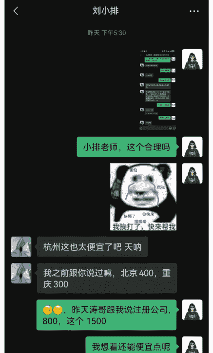
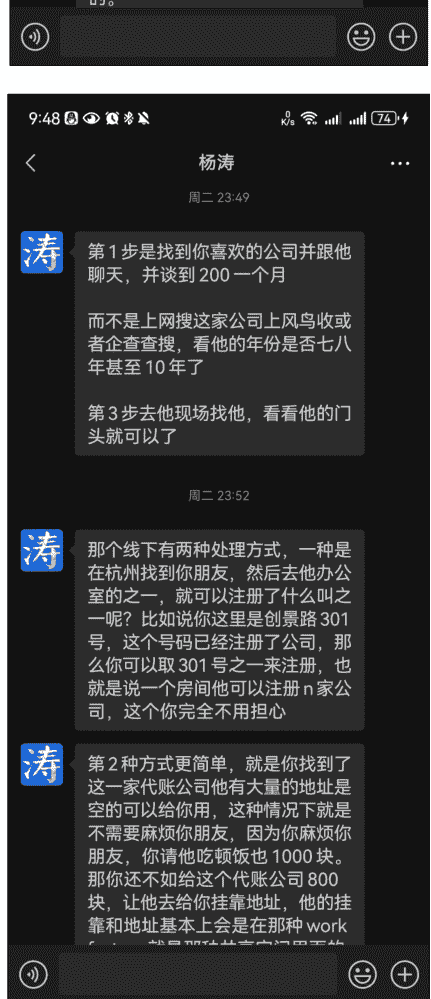
懒人微信：lazyhelper

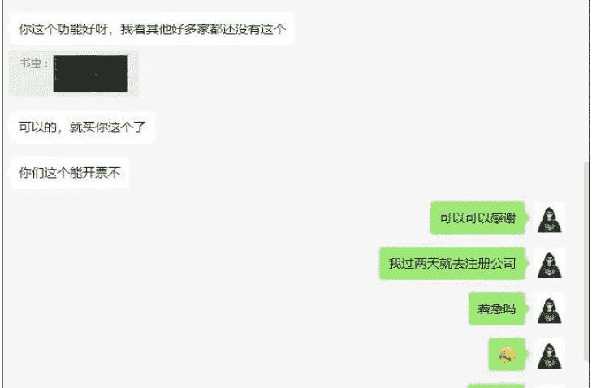
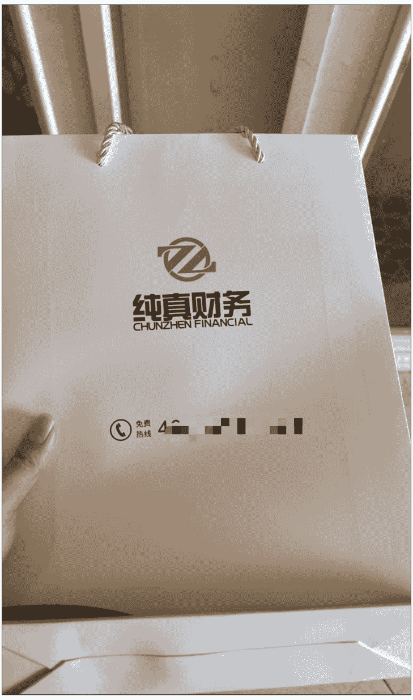
之前只弄过营业执照，只用于去申请xxxx的，并不能开发票，和公司公对公；
懒人微信：lazyhelper

这次算是第一次弄正式的公司了，不懂的也问了两位老师，这两个月真的是遇到了很多很多的幸运和贵人，前进的路上基本都有人会帮助；不懂问老师、流程有人帮、细节有人盯，很多看似复杂的事情，其实只要你敢开口、敢试试，就会有人愿意教你。“创业路上最宝贵的资源不是金钱，而是愿意花时间教你的人。”

懒人专属群持续更新中，已持续运营6年，整理超3000份各类精选付费文章&年费社群干货，全部开放下载。
本资料为付费群内部分享，仅供真实有需要的朋友查阅🙇‍♀️

## 懒人专属群更新记录：
```
https://lazybook.fun/#/blog/record2
```