# B站好物：实战手册（官方指导+案例）

250617 生财精华

公众号懒人搜索，懒人专属群


我是22年就开始玩B站，目前在B站至少有8个账号，单独拎两个账号都有70w粉，超级标没出来前，我5月份刚写出一篇，关于B站的经验贴。

抛开一个素人小号的数据图：部分数据，仅供参考，只作为验证，我是取得过结果的。

做电商的，懂得都懂（这里没有百万GMV，只有耐心的告诉你，具体的操作步骤，注意看项目逻辑）

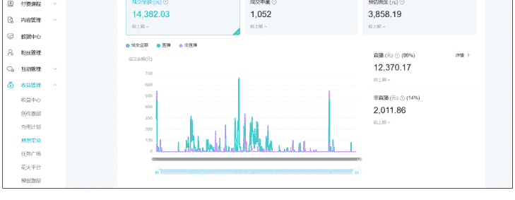

步骤：打开生财有术-生财小组——内容平台，B站，第一条就是我的

（如果觉得有用，可以一键三连，投喂鱼丸求精华）

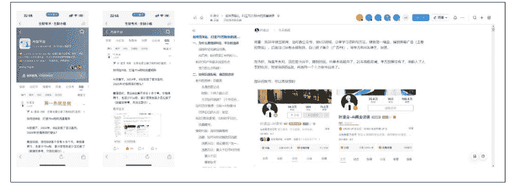

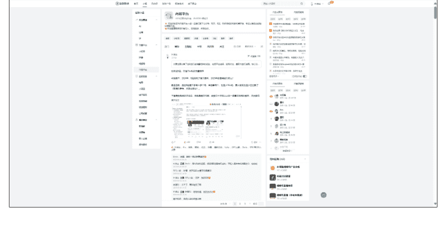

## 拆解：超级标（说清楚，为何这个项目有机会）

- 平台政策好：B 站开放电商跳转口，允许创作者把流量带走卖货，评论区挂蓝链等，为带货提供便利。
- 流量有优势：视频 SEO 友好，能获得长期精准流量，还可通过推荐、搜索等带来更多流量，形成流量复利。
- 制作门槛低：有 AI 提效，平台属性也降低了视频制作门槛，像写朋友圈一样就能做出不错的视频。
- 带货数据透明：平台公开 TOP100 带货博主榜单，数据、结构等可查，方便学习复盘。

认为这是一个类似知乎好物的好机会，目前有很多成功案例，如单条广告报价高、单条视频日赚过万等，鼓励大家行动起来抓住机会。

## B 站好物：悬赏带货（蓝链接）

B 站悬赏计划是 B 站官方电商带货服务，UP 主可以在视频播放器内外、动态、专栏、橱窗等位置通过官方悬赏带货组件配置商品链接，并通过带货获得销售分成，也可以为 UP 主自有店铺的商品进行带货。简单来说就是基于电商平台联盟 CPS 体系支持下的视频带货功能。

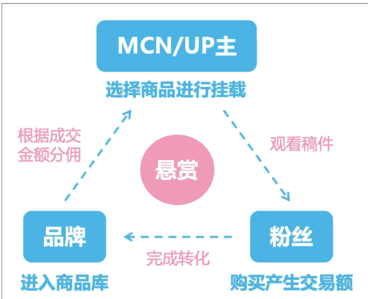

悬赏带货实现了 UP 主、粉丝、品牌的三赢：

- 粉丝获得心仪好物 - 通过 UP 主更高效地匹配需要的东西
- 品牌取得推广曝光 - 通过 UP 主更精准触达潜在用户
- UP 主获取商业价值 - 通过带货获取收益持续内容产出

## B 站好物发展历程与市场数据

这个其实在 UP 眼里，是 23 年就出来的，不是现在出来的（圈友的上榜，也能看出来）

包括 23 年，我还曾经在 B 站做直播带货，那时候，迷瞪刚出来，全站都在铺天盖地的宣传

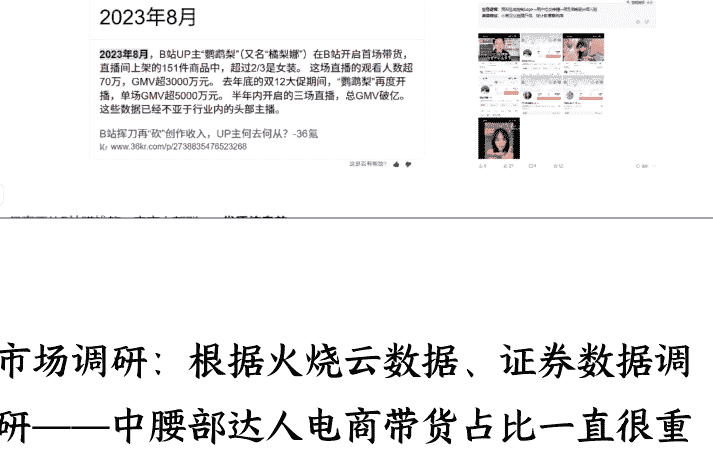

市场调研：根据火烧云数据、证券数据调研——中腰部达人电商带货占比一直很重。家蒙哥的话：头部达人靠商单，中腰部靠带货。

视频/直播带货：哔哩哔哩 2023 年开始首次尝试直播带货业务，公司在投资者汇报中，表示直播带货是公司未来要发力的方向。哔哩哔哩直播电商业务于 2024 年“618”购物节取得了较为明显的进展，其中平台电商类广告收入维持较高增速，在 2023 年同比增长超 400%基础上实现93%的同比增速；带货视频数量同比增长 359%， 直播带货场次同比增长 141%，带动平台带货 GMV 同比增长 146%，总订单量同比增长 154%。

## 此外，哔哩哔哩面向缺乏直播带货经验的 UP 主，提供包括选品指导、品质商品池、流量扶持、1对1客服、售后服务等扶持措施。我们认为B站正持续提升用户画像的精准程度，叠加平台较高的用户粘性，有助于其视频/直播电商业务的开展，其转化率以及复购率均有望达到较高水平，成为哔哩哔哩广告业务的新增长曲线。

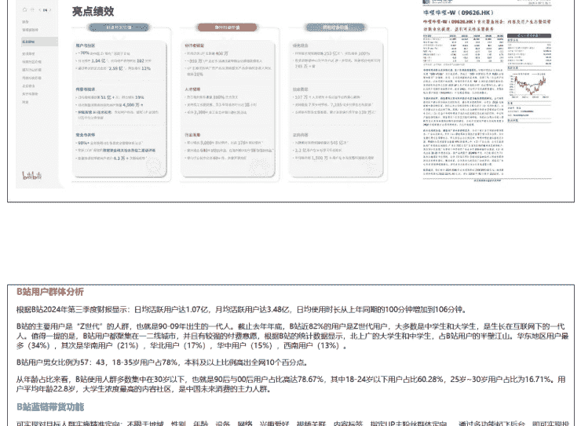

## B站用户群体分析

根据B站2024年第二季度财报显示：日均活跃用户达1.07亿，月均活跃用户达3.48亿，日均使用时长从上年同期的100分钟增加到106分钟。

B站的主要用户是“Z世代”的人群，也就是90-09年出生的一代人。截止去年年底，B站近82%的用户是Z世代用户，大多数是中学生和大学生，是生长在互联网下的一代人。值得一提的是，B站用户都聚集在一二线城市，并且有较强的付费意愿，根据B站的统计数据显示，北上广的大学生和初中生，占B站用户的半壁江山。华东地区用户最多（34%），其次是华南用户（21%），华北用户（17%），华中用户（15%），西南用户（13%）。

B站用户男女比例为57：43，18-35岁用户占78%，本科及以上学历占全网10个百分点。

从年龄占比来看，B站使用人群多数集中在30岁以下，也就是90后与00后用户占比高达78.67%，其中18-24岁以下用户占比60.28%，25岁-30岁用户占比为16.71%。用户平均年龄22.8岁，大学生浓度最高的内容社区，是中国未来消费的主力人群。

## B站直播带货功能

可实现对目标人群实施精准定向：不限于地域、性别、年龄、设备、网络、兴趣爱好、视频关联、内容标签、指定UP主粉丝群体定向......通过多功能起飞后台，即可实现投放数据可视化。

作用：通过高能链接跳转第三方平台，实现更高效更直接转化效果。（淘宝店铺、天猫店铺、京东店铺、表单收集、个人微信、企业微信、公众号、小程序、app等）

## B站直播带货展示位置

B站蓝链带货展现在视频下方评论区。


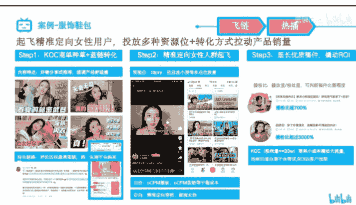

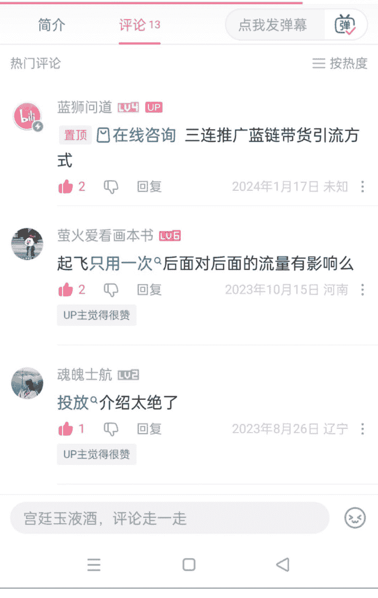

#### 1. B 站蓝链带货指的是什么？

B 站蓝链带货其实就是一个 B 站通往站外的跳转链接。

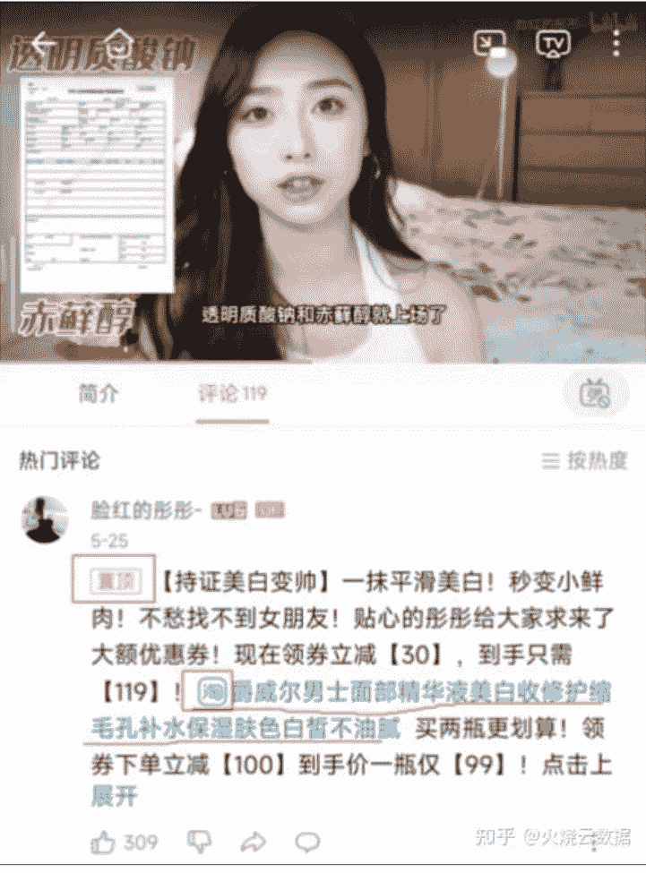

#### 2. 它的展现形式是怎样的？

通常出现在评论区，在置顶评论里的蓝色链接。

在蓝链的前面会有一个小标，一般是“淘”/“JD”的字样，如果是“淘”，代表的是商品来自淘宝，如果是“JD”，那就代表是来自京东。目前B站蓝链带货支持淘宝和京东两个平台。

#### 3. 蓝链带货转化链路是怎样的？

下面是具体的蓝链转化链路演示：

开通橱窗后，在（移动端）【我的】推荐服务栏里点击【橱窗管理】即可进入橱窗页面，通过橱窗可以自由添加、管理商品。

申请橱窗后，证明该 UP 主可以挂蓝链了，具体要挂什么商品，需要商家提供特定的链接。

#### 4. B 站官方审核橱窗申请标准是什么？审核商品标准是什么？

审核橱窗是只要 UP 主满足上面我们说的几个条件，基本都会通过的。

审核商品主要是看类目，某些品类可能会受到限制，比如医疗器械、或是一些特殊品类，得需要 B 站特定开白，针对某个商品开白，不是整个品类开白。

#### 5. 企业有蓝 V 号可以添加蓝链带货吗？自己带会比找 UP 主效果好吗？

企业蓝 V 号也是可以用蓝链带货的。

效果的话，虽然说企业号在 B 站的定位跟 UP 主是不一样的，相当于品牌私域，但最终的带货效果，本质上还是要看视频内容。

#### 6. 如何添加蓝链？具体怎么操作？

完整的蓝链带货流程需要品牌方和 UP 主配合完成，这里有一个流程图，先帮助大家理解一件商品是怎样从店铺来到 UP 主评论区成为蓝链的，包括每个阶段对应的角色。

懒人微信：lazyhelper

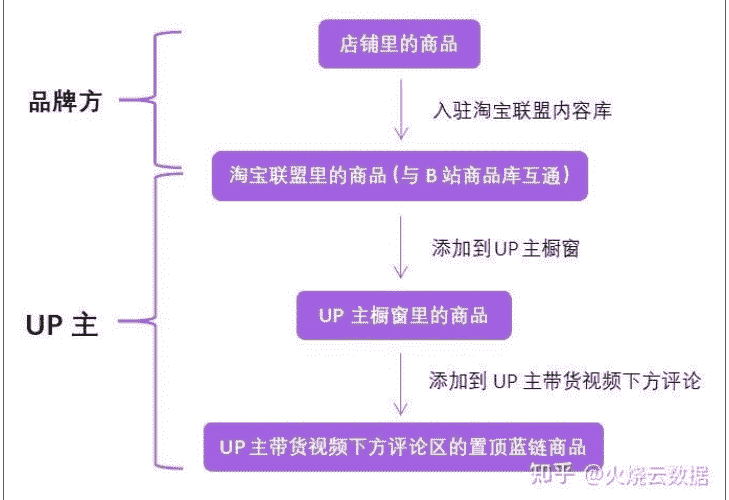

## 投放模式

- CPC (Cost Per Click)：以每点击一次计费，bilibili单次点击成本0.5元起竞价，具体以实际消耗为准，成本可控，适合电商、应用类客户。
- oCPC (Optimized Cost Per)：以目标转化为优化方式的点击出价，智能竞价。转化目标：订单提交、有效线索、表单付费、微信负责、应用内访问、应用激活、落地页调起、店铺停留、应用下载、应用留存、应用内付费等。
- oCPM (Optimized Cost Per Mille)：目标转化：稿件播放。单次视频播放0.05元起竞价，即用户点击推广视频播放所产生的费用，实际根据市场行情投放而产生计费为准，可能低于0.2元也可能高于0.2元。
- oCPM (Optimized Cost per Mille)：目标转化：自然粉丝关注。用户关注2.5元起竞价，即获取单个自然用户成本出价2.5元起，实际根据稿件质量投放而产生计费为准，可能低于2.5元也可能高于2.5元。
- oCPM (Optimized Cost per Mille)：目标转化：评论区链接点击 / 框下链接点击 / 小黄车点击。目标转化5元起竞价，即获取单个自然用户有效转化成本出价1元起，实际根据稿件质量投放而产生计费为准，此计费模式是针对超推账户。
- CPM (Cost Per Mille)：展现成本，或者叫千人展现成本，bilibili千次曝光成本5元起竞价，具体以实际消耗为准，适合更大范围曝光。第一时间内提升视频曝光率冲刺热门与排行榜。

+   适合投放行业
- 美妆护肤
- 电商店铺
- 教育留学
- 食品饮料
- 游戏品牌
- 网服行业
- 3C数码

## B站蓝链功能开通

## 开通流程

提交资料审核——开通后给到官方广告后台账号密码——广告后台选择工具（高能建站）搭建。

## 开户资料

企业营业执照+邮箱&手机号（注：特殊行业需额外提供行业资质&检测报告&增值电信业务经营许可证ICP）

## 搭配 SEO，信息流

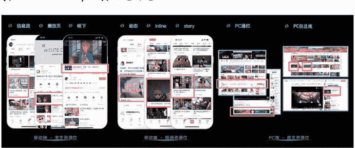

## 二、带货形式是怎样的

## 可用于带货的资源位介绍（一览表）：

| 资源位置 | 视频详情页 | 个人主页橱窗 | 动态 | 专栏 |
|---|---|---|---|---|
| demo | AD2, AD3, AD1, 评论, AD4 | AD1, AD2 | AD1, AD2, AD3 | AD1 |
| 资源形式 | A1-框下<br>A2-弹幕<br>A3-浮层<br>A4-评论<br>(配置以上任一story自动出小黄车) | A1-个人橱窗<br>A2-商品卡TAB | A1-短链<br>A2-标签<br>A3-商品卡图 | A1-卡图 |

+   资源位功效介绍：

懒人微信：lazyhelper

### 直播

### 个人主页小店

### 动态/图文

### 专栏

### 资源形式

+   1-框下
+   2-框内
+   3-评论
+   1-小黄车
+   1-商品卡 TAB
+   2-个人主页小店
+   1-短链
+   2-商品卡
+   3-评论
+   1-商品卡
+   2-评论

### 示意图

### 2.框内

### 1.框下

### 3.评论

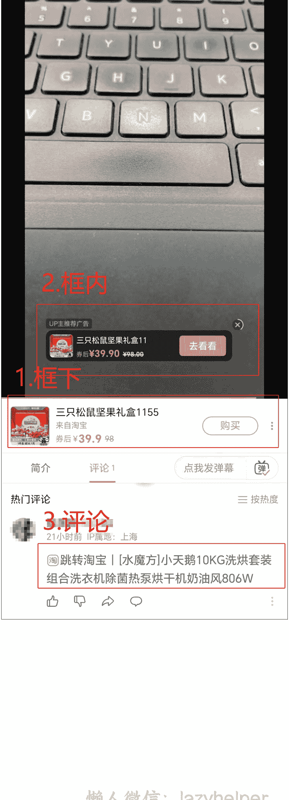

公众号懒人搜索，懒人专属群分享

18:23

微信

鹦鹉梨

8.1万点赞

9999+

人气榜

生活热榜第1名

更多直播 >

小丽XIAOLI

一字肩泡泡袖 碎花吊带连衣裙

梨娜

163cm/52kg 三围:82/62/94 尺码:XS

布林

165cm/45kg 三围:76/62/86 尺码:XS

烈烈

158cm/60kg 三围:85.5/74/99 尺码:M

从不乖巧的幻灭君

投喂 粉丝团灯牌

阿井 Nata: 厉害了我的梨!

大哥家的懒宝宝i: 厉害了我的梨!

侑子哇: 厉害了我的梨!

C**等35人正在去买

商品尺码参考

| 码数 | 身高(cm) | 体重(斤) |
|---|---|---|
| XS | 155-160 | 88以内 |
| S | 160-165 | 105以内 |

小丽 XIAOLI 蝶翼...

券 | 立减46元

讲解中

券后 ¥ 483

热抢

x3282

领券抢购

已开奖

小黄车

简单喵两句~

懒人微信：lazyhelper

公众号懒人搜索,懒人专属群分享

### 杨旭游记

123万粉丝

0关注

1092.9万获赞

充电

+关注

bilibili UP主认证:bilibili知名汽车UP主

详情

> 虽然辛苦,我还是选择那种滚烫的人生。

IP属地:云南 已实名

2.橱窗

Ta的推广橱窗

主页

动态

1.商品卡

商品

雷鸟Air2 智能AR眼镜 高清巨幕观影眼镜 120Hz高刷 便携XR眼镜 非V...

¥2298

雷鸟Air2 智能AR眼镜 高清巨幕观影眼镜 120Hz高刷 vision pro平替 J...

¥3599

懒人微信:lazyhelper

### **1.短链**

### 京东年货节京享红包

### **2.商品卡**

京东年货节京享红包 每日领红包 ¥0 去看看

### **3.评论**

跳转淘宝 | 迪卡侬ST120 入门运动山地自行车单盘9级变速碟刹 OVMC

### 1.商品卡

JunJunFamily菌君家族益生元西梅...

¥49.9

### 热门评论

跳转淘宝 | 迪卡侬ST120入门运动山地自行车单盘9级变速碟刹OVMC

## 非直播带货各端功能配置及展示情况

但真正从B站赚钱的，官方内部群——优质信息差

+   类目：3C数码、家居、服饰、美妆、零食、图书（注意顺序）

其次看招聘信息，一个大公司，要看裁员哪个部门，小公司看招什么人

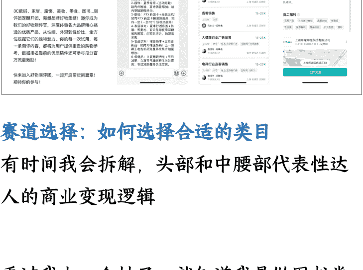

## 赛道选择：如何选择合适的类目

有时间我会拆解，头部和中腰部代表性达人的商业变现逻辑

看过我上一个帖子，就知道我是做图书类目、零食类目的，这俩其实，我个人感觉是最好做，零食不需要出镜，退货相对较低，图书是佣金相对较高，同时做电商的懂得都懂，退货率低，佣金高，内容创作形式容易、拍摄成本低（书单号）

有以下几个类目：

### 一个是 3C 数码（案例最多）

案例样本数据越多，不一定是好赛道，但一定可以去借鉴，尤其参考有没有素人成功案例。同时市场要大，数码3C的市场足够大，花同样的时间，接到的佣金和变现的渠道都不一样。

如果论变现能力，提及B站，尤其杭州的B友们，谁能忘记一个人，网传某富二代，网瘾少年，逆风翻盘的TIM，也就是影视飓风（团队作战），他们公司就在杭州，这个在B站看Tim，就可以了。

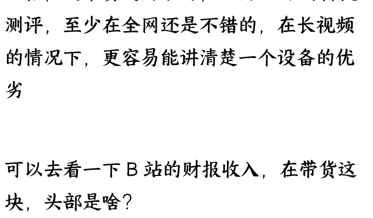

包括，这个赛道为啥好，因为B站的科技测评，至少在全网还是不错的，在长视频的情况下，更容易能讲清楚一个设备的优劣。

可以去看一下B站的财报收入，在带货这块，头部是啥？

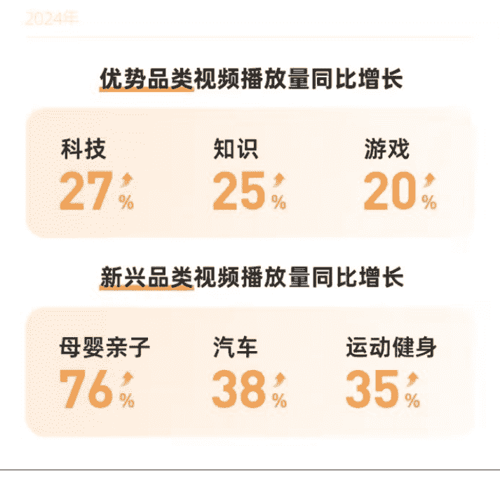

头部：搞机所，小白参考：爱唱歌的信（低粉，爆单，霸榜7个月）

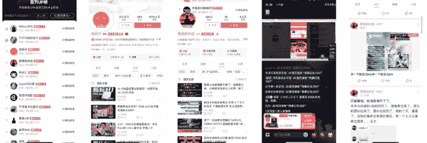

### 第二：服饰

这个是我做直播带货，在淘客联盟选品，发现的一个赛道

直播带货：

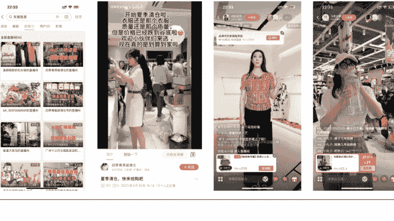

一个在淘客上，卖了上万件衣服，是带货头部，但这个我测过，直接直播带货，不行，在 23 年可以，那段时间我做无人直播，挂着抖音那种大卖场，一个女生一直换装，仍然有下单，但现在不行

悬赏带货：榜单分析

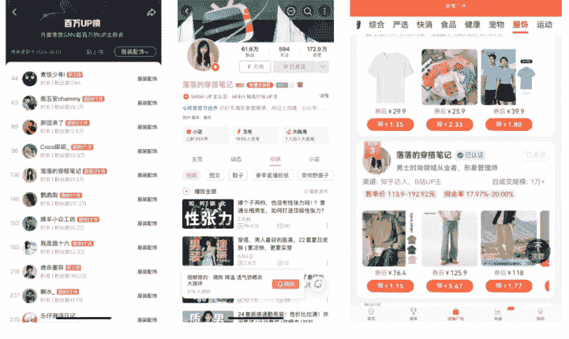

### 第三：家装（高客单价，利润高，头部）

这个 B 站的官方扶持一直很大，从迷瞪，到后面还有别的也出来了，（参考官方的电商活动，比如这次的 618，扶持品类，尤其推广金等，都是限制品类的）

懒人微信：lazyhelper

除了迷瞪（已经验证过，可以矩阵打），

老号：Mr 迷瞪，

新号：迷住建材卫浴定制、迷住家具

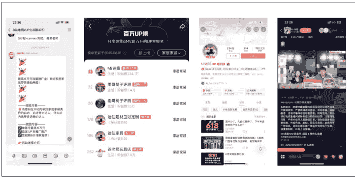

雨哥、彪子椅子评测（低粉 3.4 万，百万 GMV）

新上榜：苍老师玩具店

### 第四：美妆

就拿当前 B 站带货普及度最高的时尚美妆区来讲，粉丝数 2.6 万的 UP 主@-金尾酱，带货视频播放量最高可达 306w+，并且 180w+的也不在少数。


根据火烧云数据「热门带货 UP 主」数据能够看出，该 UP 主的视频平均播放可达 55w+，其带货总销量及总销售额都极其可观。

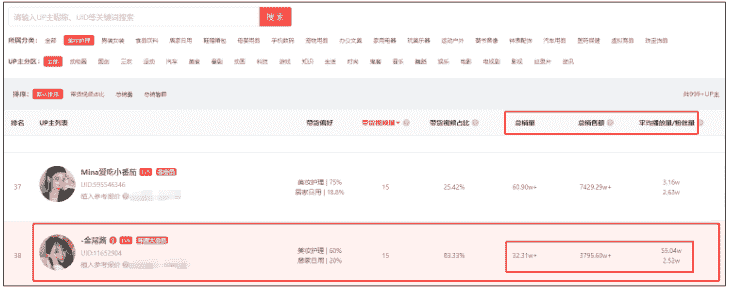

## 火烧云数据-热门带货 UP 主

在一期沐浴露带货视频中，UP 主@-金尾酱用真切的使用前后对比，来直观地展示产品功效。虽然是带货，但UP主真实的体验与真诚的分享让弹幕和评论区都十分友好。

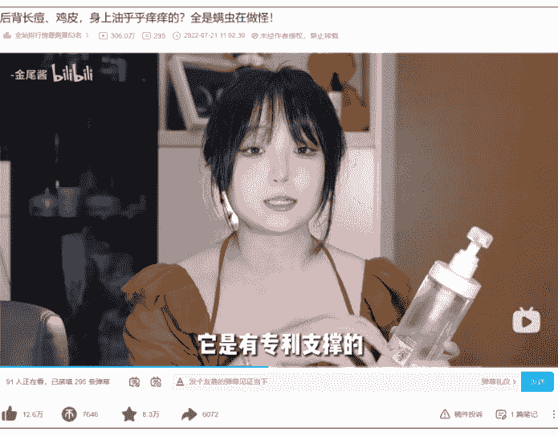

## 蓝海类目：运动户外、二奢、图书音像

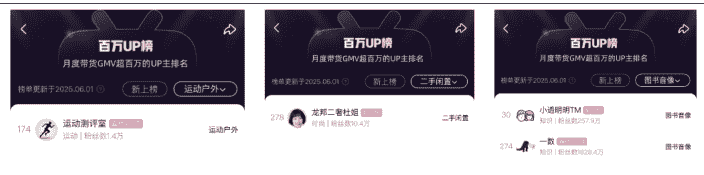

## 一、 什么是悬赏计划（B站好物）

bilibili 悬赏计划是 B 站官方电商带货服务，UP 主可以在视频播放器内外、动态、专栏、橱窗等位置通过官方悬赏带货组件配置商品链接，并通过带货获得销售分成，也可以为 UP 主自有店铺的商品进行带货。简单来说就是基于电商平台联盟 CPS 体系支持下的视频带货功能。

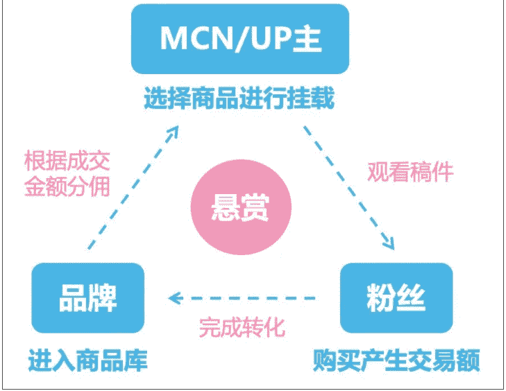

悬赏带货实现了 UP 主、粉丝、品牌的三赢：

- 粉丝获得心仪好物 - 通过 UP 主更高效地匹配需要的东西
- 品牌取得推广曝光 - 通过 UP 主更精准触达潜在用户
- UP 主获取商业价值 - 通过带货获取收益持续内容产出

## 二、 带货形式是怎样的

+   可用于带货的资源位（一览表）：

| 资源位置 | 视频详情页 | 个人主页橱窗 | 动态 | 专栏 |
|---|---|---|---|---|
| demo | AD2, AD3, AD1, 评论, AD4 | AD1, AD2 | AD1, AD2, AD3 | AD1 |
| 资源形式 | A1-框下<br>A2-弹幕<br>A3-浮层<br>A4-评论<br>(配置以上任一story自动出小黄车) | A1-个人橱窗<br>A2-商品卡TAB | A1-短链<br>A2-标签<br>A3-商品卡图 | A1-卡图 |

+   资源位功效介绍：

懒人微信：lazyhelper

TIPS：目前评论区挂接悬赏链接是相对转化效果不错的资源位，合理利用，带货收益UPUP~

- 资源位挂好带货链接后，粉丝购买路径一览：

## 三、为什么要做带货业务

### 1、带货红利与优势
- B站社区的用户特点：年轻、高消费力、强互动属性
- B站做带货业务的优势

### 2、带货已跑通成熟的模式可快速起步
- 悬赏带货UP主两大营收模式:

| 自营店铺 | 导流带货 |
| :--- | :--- |
| 个人品牌商品 | 第三方商品分销（淘宝、京东、拼多多、会员购） |
| [图片: 案例1 GMV:700w+] | [图片: 案例2 GMV:31W+] |
| [图片: 案例3] | [图片: 案例4] |

### 带货 UP 主有多重收益：

### 平台提供了优质的货品和服务：

### 带货激励活动-羊毛薅起来（往期活动）：

公众号懒人搜索，懒人专属群分享
懒人微信：lazyhelper

### 农产品溯源活动：

## 四、带货案例

## 五、 如何开通

### 玩转 B 站带货业务-操作指南

### 整体流程概览：

✨各位 UP 主大大注意哦！✨

想要做带货业务，都需要按照下列步骤先开通悬赏权限，拥有权限后，才可以挂链开启带货之旅～

### 准入门槛：
- a. 粉丝量≥1000，（可以刷，也可以买号，同时还有其他方式，找鱼丸链接我）
- b. 30 日发布过原创视频
- c. 年满 18 周岁

开通橱窗后，在（移动端）【我的】推荐服务栏里点击【橱窗管理】即可进入橱窗页面，通过橱窗可以自由添加、管理商品。

### Step 1：开通悬赏权限

视频演示：
```
https://www.bilibili.com/video/BVIpD4yLi7wf/
```

#### 【APP 端路径】
>>使用哔哩哔哩 APP 扫描下方二维码，开通悬赏计划；开通后，APP 端我的新增【商业服务】入口，PC 端同步功能开启。

#### 【PC端路径】
>>【创作中心-收益管理-悬赏计划】网址：https://member.bilibili.com/v2#/allowance/mutual_up，符合条件点击【申请加入】，按提示完成操作即开通功能，APP端入口同步新增。

### Step 2：绑定PID

视频演示：https://www.bilibili.com/video/BV13Y4yIN7jj/?vd_source=aa8a0bec38ad33b9113d8fec494495c2

#### (1)什么是淘宝联盟PID?
淘宝联盟是淘宝、天猫的商品想要在站外进行淘客推广必用的一个工具。UP主可以看做是B站的淘客，可以通过推广商品，引导粉丝下单而获得相应佣金。而PID是UP主在B站作为淘客的证明，连接着UP主在B站与淘宝端(收佣金)的账号。

#### (2) PID 的绑定和修改方式 (1 天只能修改 1 次)
京东联盟 PID 的绑定和修改方式参看：京东联盟 PID 获取。会员购联盟无需额外绑定 PID，完成淘宝联盟/京东联盟任一 PID 绑定后，即可带货。

### Step 3：商品入库并加入个人橱窗

视频演示（建议看视频）：
```
https://www.bilibili.com/video/BV1TP4yl07K2/?vd_source=aa8a0bec38ad33b9113d8fec494495c2
```

#### 带货商品入库流程

#### 带货商品入库阶段对应操作角色

### Step 4：发布带货稿件并完成商业报备

视频演示：
```
https://www.bilibili.com/video/BV1GD4y1i7hN/?vd_source=aa8a0bec38ad33b9113d8fec494495c2
```

悬赏带货视频需进行商业报备，PC 端和APP 端均已上线。

PC 端操作路径：bilibiliPC 端→我的→创作者中心→投稿→发布视频→点击含商业推广信息→官方合作→选择“视频带货”
※开通悬赏功能后可见，如无“视频带货”选项请刷新或清空浏览器缓存后再次尝试。

APP 端操作路径：bilibiliAPP 端→我的→发布→上传视频（或直接推荐页正下方“+”号）→选择视频→发布→点击“商业声明”→勾选“视频带货”
※开通悬赏功能后可见，如无可升级 APP 至最新版本或重启 APP 后再次尝试。

### Step 5. 将商品添加至推广资源位，开始带货

#### 挂载商品的视频要求
发布 180 天以内、原创视频可挂载商品，动态/专栏需在发布/编辑时添加商品，且稿件和广告创意需要全部通过审核。
稿件和广告创意都通过审核的 5 分钟之后，手机端可以查看资源位。
广告创意标题需避免出现广告法禁止的“最”、“第一”等词语。
如创意长期处于“审核中”的状态，建议修改标题文案。
注意电脑端发布的视频，必须要勾选商业报备。

#### 资源位操作与展示
视频演示：【如何添加浮层及框下广告】
```
https://www.bilibili.com/video/BV1ZV4ylM7XC/?vd_source=aa8a0bec38ad33b9113d8fec494495c2
```
视频演示：【如何添加评论区蓝链】

完成以上任一视频带货资源位配置后，story 模式会自动出现小黄车无需另行操作（目前该功能处于定向测试阶段，非全部用户可见，建议优先使用评论蓝链位置并在视频中进行口播或字幕引导）。

### Step 6: 查看收益&结算

结算规则：
淘宝联盟和京东联盟带货 B 站平台不抽佣，联盟服务费按联盟规则收取，如淘宝联盟收取佣金收益的 10%（GMV*佣金率*10%）作为技术服务费。
会员购联盟结算规则：用户确认收货后的 T+15 天，结算会员购佣金，佣金=（商品原价-商单承担优惠金额）*带货分成比例；会员购带货佣金会在次日更新。

查看收益和提现金：
淘宝联盟和京东联盟的带货收益 B 站暂不显示，详细带货数据和收益明细可至联盟端查看并进行提现操作。以淘宝联盟为例，登录个人账号进入淘宝联盟，点击【效果报表】，选择【订单明细表】，订单明细表页面选择视频发出时间段，点击下载报表，即可查看佣金收益。

会员购联盟带货收益，在佣金到账后会在【悬赏带货-我的收益】里提现。当月整月的佣金会在次月统一打款至贝壳（预计5~10日可提现），UP主可至【我的钱包-贝壳】进行提现操作。

#### 查看收益

#### 淘宝/京东联盟收益
需前往淘宝/京东联盟，使用PID绑定的账号查看并提现。

#### 会员购收益
推广订单明细 >
数据已更新至:2022-08-16

| 非直播收入 | 本月收入(元) | 上月收入(元) |
| :--- | :--- | :--- |
| 非直播收入 | 1.49 | 3.80 |

| 直播收入 | 本月收入(元) | 上月收入(元) |
| :--- | :--- | :--- |
| 直播收入 | - | - |

#### 会员购结算说明
- 用户确认收货，可获得推广佣金；
- 订单确认收货后15天，可查看已获得的佣金，如确认收货时间是2022-04-10 09:00:35，那么结算时间就是2022-04-25 09:00:35；
- 佣金=(商品原价-商家承担优惠金额)*带货分成比例；
- 会员购带货佣金会在次日更新,(数据会有延迟，请耐心等待)；
- 整月收益会在次月打款至贝壳，预计5~10日可提现；
- 可至「我的钱包」-「贝壳」提现 立即前往。

空间 377
动态 327
关注 64
粉丝
我的大会员
热播内容看不停
主播中心
主播活动
嘉年华
我的直播
生活随手拍，瓜分1万元！立即参与

#### 推荐服务
我的课程 | 看视频免流量
个性装扮
我的钱包
游戏中心
会员购中心
商业服务
起飞推广
推荐有奖
社区中心
哔哩哔哩公益
充能领福利
工房
能量加油站

#### 更多服务
联系客服
首页 | 动态 | 会员购 | 我的
选品中心 | 商品管理 | 内容管理 | 收益管理 | 账户设置 | 帮助中心 | 互选广告 | 电商

淘宝/京东联盟收益需前往淘宝/京东联盟，使用PID绑定的账号查看并提现。

会员购收益
数据已更新至：2022-11-16

| 非直播收益 | 本月收入 | 上月收入 |
| :--- | :--- | :--- |
| | ￥0 | ￥0 |

| 直播收益 | 本月收入 | 上月收入 |
| :--- | :--- | :--- |
| | ￥0 | ￥0 |

会员购结算说明：

### 配置方式
*若选择先投稿后挂链，视频投稿时务必勾选【商业推广】-【视频带货】-【投稿后再配置商品】，避免因逃单而限流。

#### 1) 视频评论区商品挂载
PC 视频投稿时配置：
Step1: 方式一：PC 端进入创作中心-【投稿】-【视频投稿】-【上传视频】编辑稿件信息-【增加商业推广信息】-【视频带货】-【添加商品投稿】
方式二：PC 端进入悬赏带货-视频带货-去投稿
Step2：选择带货样式【在评论区添加商品蓝链】-添加商品-【确认】-编辑评论文案和蓝链（每条评论可添加 20 件商品，此页面支持配置 10 条带货评论，更多带货评论可视频发布后，播放页的评论区直接配置）
Step3：点击【立即投稿】完成挂载。

PC端
#### 视频已发布配置
Step1：PC 端进入【创作中心】-【收益管理】-【悬赏带货】-【选品车管理】，选择商品点击【去带货】
Step2：【视频】-选择稿件（支持多选，批量挂链）
Step3：选择带货资源位【评论蓝链】-编辑【蓝链文案】和【评论文案】-发布

PC端
#### 视频已发布，视频播放页配置
Step1:点击评论-【商品】icon
Step2：选择商品-确认（支持选择已加入选品车的商品/商品计划内的商品/平台推荐商品/自定义商品/链接选品），每条评论最多可选择20个商品，视频下可发布无数条带货评论。

公众号懒人搜索，懒人专属群分享
懒人微信：lazyhelper

#### Step3:编辑评论文案-发布

APP端
#### 视频投稿时配置
Step1：方式一：移动端大加号，上传视频 -【发布】，编辑稿件信息-【商业推广】 -【视频带货】，选择商品-【立即带货】
方式二：移动端【我的】-【商业服务】-【悬赏带货】-【视频】-【发稿件】
懒人微信：lazyhelper

#### Step2：选择带货样式【评论区蓝链】，编辑评论和蓝链文案点击【确认】
#### Step3：点击【发布】完成挂载

发布视频
推广数据 (昨日数据)
数据看板 >
带货GMV：0.00
带货稿件播放量：0
商品唤起量：0
> 合适的标题可以吸引更多人观看～

新人带货攻略 已完成 0/4 全部任务 >
了解悬赏计划 | 完成一次带货 | 查看带货数据
0/80

评论区蓝链
播放器框下
简介
评论 9999
点我发弹幕
弹
评论 (763)
三 按时间
哔哩哔哩 LVS UP
+ 关注
2小时前
> [置顶] 三只松鼠坚果礼盒1155g×1盒/7袋年货送礼每日坚果健康零食大礼包
9999

评论文案
评论内容规范 >
请输入评论 三只松鼠坚果礼盒1155g×1盒/7袋年货送礼每日坚果健康零食大礼包
34/200
确认

分区和标签
生活-日常| 原创 旅游 摄影

简介

商业推广
原商业声明，参加商业推广任务，增加稿件收益
花火任务
视频带货

更多设置
开放视频二创授权即可获得素材奖励

动态
我已阅读并接受《哔哩哔哩社区公约》
存草稿
发布
若存在非官方商业合作，需前往电脑网页端投稿并进行商业声明...

APP端
#### 视频已发布配置
Step1：移动端进入【我的】-【商业服务】-【悬赏带货】-【选品车管理】-选择商品-【去带货】
Step2：添加稿件，选择带货样式【评论区蓝链】
Step3：编辑文案-确认发布

悬赏计划
选品中心 查看更多 >
选品车管理
带货管理
我的收益
资源位介绍
带货数据概览
累计带货内容31条，累计带货商品49个
预估佣金收入 1
成交金额 78.5
成交订单数 2
商品唤起量 2
商品曝光量 21
查看图表 ∨

添加商品
带货稿件
尚未添加带货稿件
添加稿件

选择带货样式
评论区蓝链
播放器框下
评论 9999
评论 (763)
哔哩哔哩
2小时前
置顶 三只松鼠坚果礼盒1155g×1盒/7袋年货送礼每日坚果健康零食大礼包
9999

评论文案
评论规范
确认发布

APP端
视频已发布，视频播放页配置
- Step1: 找到稿件点击【评论】，点击“+”加号
- Step2: 点击【插入商品】
- Step3: 从选品车、推荐商品、商品计划等渠道选择需添加的商品，支持多选。（每条最多可选 20 个商品，评论数量无限制）

【佳农】水果玉米棒180
来自拼多多
券后￥26.89 27.89
简介
评论 12
点我发弹幕
开战！BLG三谋半周年主题服来了！
只是一直在等你而已，才不是想被评论呢～
插入内容
笔记
投票
插入商品

#### 2）视频框下商品挂载
PC 视频投稿时配置
Step1:方式一：PC 端进入创作中心-【投稿】-【视频投稿】-【上传视频】编辑稿件信息-【增加商业推广信息】-【视频带货】-【添加商品投稿】
方式二：PC 端进入悬赏带货-视频带货-去投稿
Step2：选择带货样式【在视频框下添加商品蓝链】-添加商品-【确认】-编辑样式（框下最多配置 5 件商品）
Step3：点击【立即投稿】完成挂载

#### 视频已发布配置

Step1：PC 端进入【创作中心】-【收益管理】-【悬赏带货】-【选品车管理】选择商品点击【去带货】

Step2：【视频】-选择稿件（支持多选，批量挂链）

Step3：选择带货资源位【视频框下】-编辑【标题文案】和【商品封面图】-发布

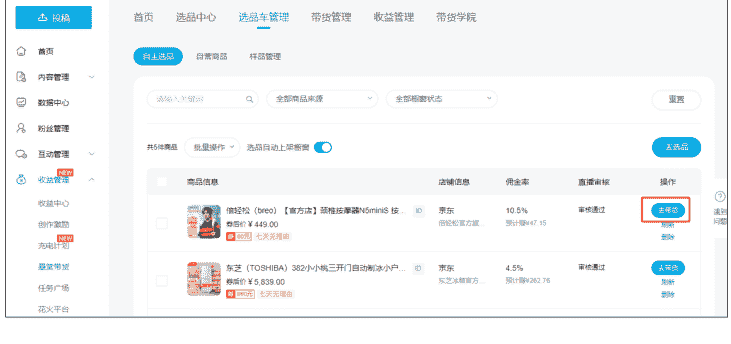

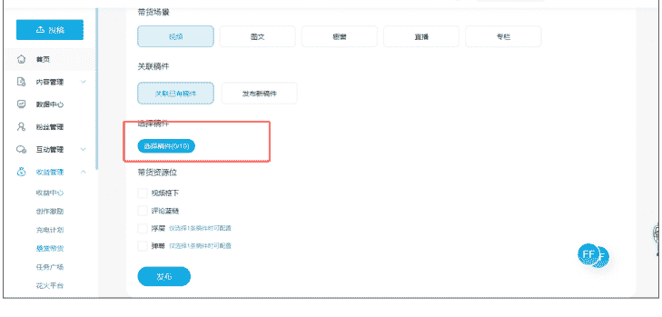

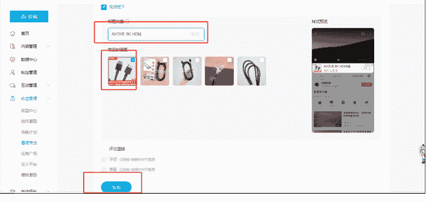

#### APP

#### 视频投稿时配置

Step1：方式一：移动端大加号，上传视频-【发布】，编辑稿件信息-【商业推广】-【视频带货】，选择商品-【立即带货】。方式二：移动端【我的】-【商业服务】-【悬赏带货】-【视频】-【发稿件】

Step2：选择带货样式【播放器框下】，编辑标题文案和图片，点击【确认】

Step3：点击【发布】完成挂载

#### 发布视频

上传中... 4.0M/s预计还需00:02

合适的标题可以吸引更多人观看～

修改封面

0/80

取消

#### 视频带货

- 推荐商品
- 我的选品车
- 投稿后再配置商品

##### 【自营】Swisse斯维诗儿童成...
- 淘宝 加入消费者保障 券后价:¥89.00 佣金比:4.5%
- 赚¥4.00
- 立即带货

##### 【自营】Swisse斯维诗娘娘钙...
- 淘宝 加入消费者保障 现价:¥308.00 佣金比:0.45%
- 赚¥0.56
- 立即带货

##### 【自营】Swisse斯维诗奶蓟草...
- 淘宝 加入消费者保障 现价:¥309.00 佣金比:0.45%
- 赚¥0.67
- 立即带货

- 没有更多了

懒人微信: lazyhelper

#### 添加商品

#### 带货稿件


尚未添加带货稿件

添加稿件

#### 选择带货样式

- 评论区蓝链
- 播放器框下

- 三只松鼠坚果礼盒1155
- 券后￥98
- 来自淘宝
- 购买

#### 标题文案

- 三只松鼠坚果礼盒1155
- 确认发布


#### 发布视频

推广数据（昨日数据）
数据看板 >
带货GMV	带货稿件播放量	商品唤起量
0.00	↑	0

合适的标题可以吸引更多人观看～

新人带货攻略 已完成 0/4	全部任务 >

修改封面
了解悬赏计划 了解激励 完成一次带货 查看带货数据

0/80

分区和标签 >

生活 - 日常 | 原创 旅游 摄影

简介 >

商业推广 原商业声明，参加商业推广任务，增加稿件收益

花火任务 >

视频带货 >

更多设置 开放视频二创授权即可获得素材奖励 >

动态 >

我已阅读并接受《哔哩哔哩社区公约》

存草稿

发布

若存在非官方商业合作，需前往电脑网页端投稿并进行商业声明...

#### APP

#### 视频已发布配置

Step1：移动端进入【我的】-【商业服务】-【悬赏带货】-【选品车管理】-选择商品-【去带货】

Step2：添加稿件，选择带货样式【播放器框下】

懒人微信：lazyhelper

#### Step3：编辑文案-确认发布

4:29

悬赏计划


选品中心

查看更多 >

- 【自营】Swisse... 赚¥0.67
- 【自营】Swisse... 赚¥0.56
- 【自营】Swisse... 赚¥4

选品车管理

带货管理

我的收益

资源位介绍

带货数据概览

近90天

累计带货内容31条，累计带货商品49个

预估佣金收入

成交金额

成交订单数

1

78.5

2

商品唤起床

商品曝光量

2

21

查看图表

懒人微信：lazyhelper

#### 添加商品

#### 带货稿件


尚未添加带货稿件

添加稿件

#### 选择带货样式

- 评论区蓝链
- 播放器框下


03:11/20:24


- 三只松鼠坚果礼盒1155
- 来自淘宝
- 券后 ¥98
- 购买

#### 标题文案

- 三只松鼠坚果礼盒1155
- 确认发布

懒人微信：lazyhelper

#### 标题文案

- 三只松鼠坚果礼盒1155
- 12/12

#### 展示图片


确认发布

#### 3) 视频框内商品挂载

Step1：PC端进入【创作中心】-【收益管理】【悬赏带货】-【选品车管理】，选择商品-去带货

懒人微信: lazyhelper

#### Step2：【视频】-选择稿件（框内配置需具体到某一时间点，因此不支持多选）-选择【浮层】/【弹幕】

#### Step3：调整广告出现时间以及时长&修改文案和商品图-【发布】

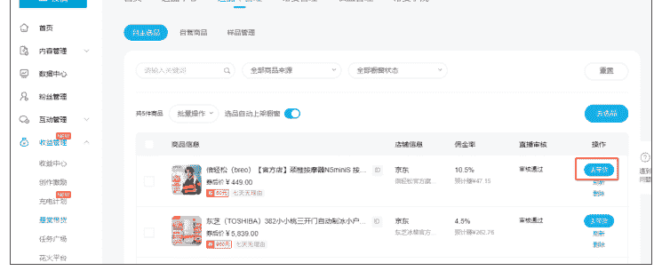

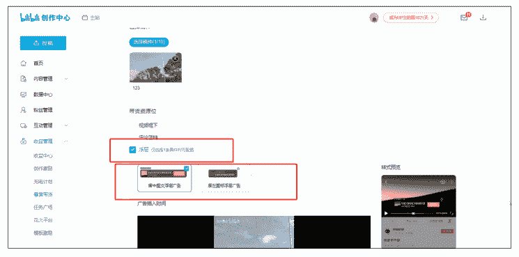

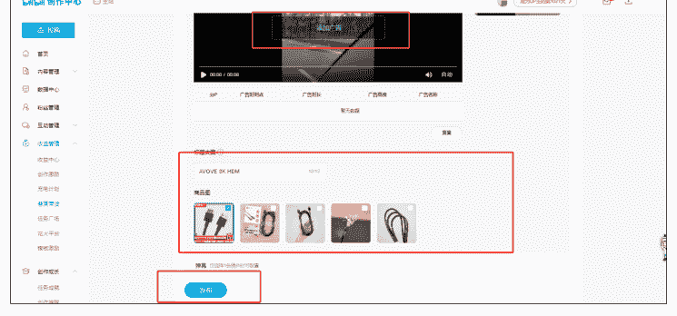

#### 4) 视频带货注意事项

- 悬赏带货的视频在投稿时若未选择立即配置商品，则需勾选【商业推广】-【增加商业推广信息】-【视频带货】-【投稿后再配置商品】，完成带货报备，否则会被判为逃单。

懒人微信：lazyhelper

若选择先投稿后配置商品，需要发布视频后及时操作，以免流量流失。

在视频播放页的评论区将蓝链配置完成后，建议将该条内容置顶，以获取更多曝光。

若配置时搜不到相应的商品，则需要检查商品是否已添加进【选品车】，若未加加入选品车，可以直接在此通过【链接选品】添加。

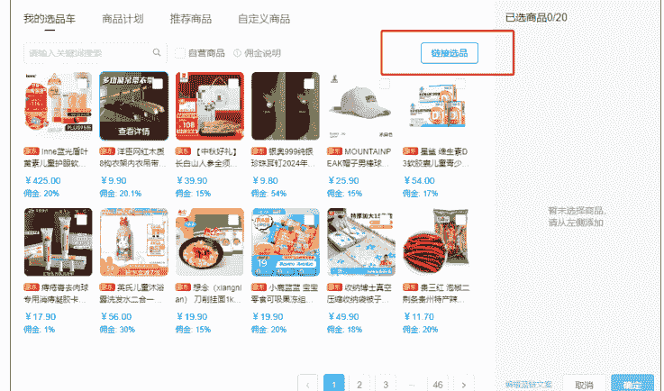

评论区带货蓝链内容同样需符合创作公约和广告法，如发布5分钟后除UP主本人账号外不可见，问题常见于文案不规范，涉及到极端或者不合规描述等，可尝试调整文案内容，如修改后依旧不可见，可联系客服反馈至运营处理。

视频框下、弹幕、浮层资源位展示有延迟，一般半小时左右生效。若超时未生效可通过客服反馈至运营处理。建议文案不要带有空格等特殊符号以及广告法禁止的描述，以免生效时间延长/不过审。

## 玩转 B 站带货业务-常见问题 QA

### 关于权限开通

Q：为什么我不可以加入悬赏计划呢？

A：如果您达到了加入悬赏计划的门槛但无法加入，可能是 UP 主之前有过不诚信行为，类似收到免费的样品拒绝拍视频等，我们会取消 UP 主带货权限，可根据提示发送相应邮件进行进一步沟通。

Q：开通完就可以立即带货了吗？

A：不可以哦。开通完毕后需要 UP 主绑定 PID，这样 UP 主才可以获得带货相应的佣金。建议 UP 主大大开通悬赏计划后立即绑定 PID 哦。

### 关于淘宝 PID

Q：PID 可以自己填写吗？

A：不可以哦~PID 作为 UP 主在 B 站和淘宝联盟唯一识别 ID，需要按照步骤绑定或者生成相应的 PID 哦。

Q：在淘宝端绑定 PID 时，显示我的昵称不可用怎么办？这就是我在 B 站的昵称啊？

A：建议大大替换 B 站昵称的 1-2个字呢，这个不要求完全同步一致的哦，昵称不一致不影响佣金结算哒。

Q：怎么删除 PID？

A：目前不支持删除 PID，建议新建推广位及 PID，重新进行绑定。每日可修改 PID 一次。

Q：多次绑定 PID 显示失败？

A：请 UP 主检查一下：联盟账户、支付宝、淘宝三者绑定的是不是同一个手机号；再次执行操作绑定的时候需要登录对应的淘宝账户。

## 三、优质带货视频&选品 TIPS

### 优质带货短视频需要：

从选品→内容→粉丝互动良好协调的适配内容，转化上更有效率。

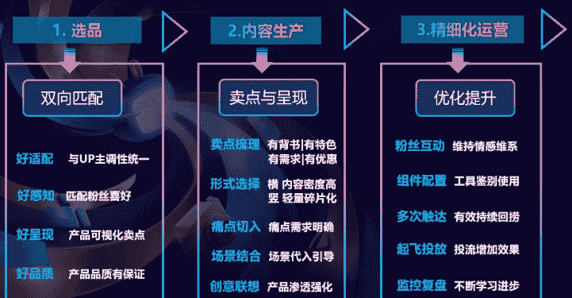

### 选品中心

APP 端选品中心：支持淘宝联盟/京东联盟/会员购联盟商品的关键词搜索、添加商品、分行业查询、条件筛选等功能，并有“分区热卖”和“全站热卖”商品列表，供 UP 主选择带货商品；

APP 端路径：bilibili 移动端-我的-推荐服务-商业服务-悬赏带货-悬赏计划个人主页-去选商品

##### 或 bilibili 移动端-个人空间主页-Ta 的推广橱窗-悬赏计划个人主页-去选商品

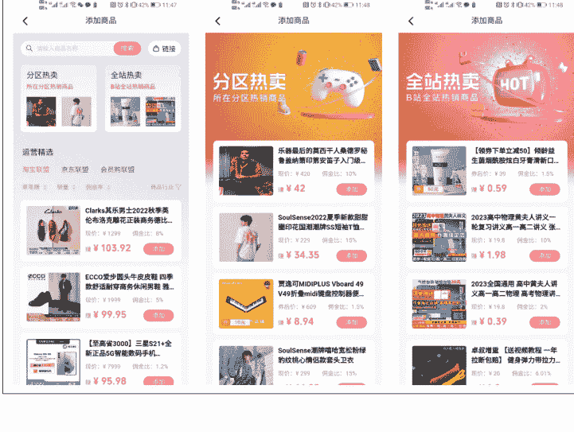

PC 端选品中心：支持淘宝联盟/京东联盟/会员购联盟商品的关键词搜索、添加商品、分品类查询、条件筛选等功能，供 UP 主选择带货商品。

PC 端路径：bilibiliPC 端→我的→创作者中心→收益管理-悬赏带货

```
https://member.bilibili.com/platform/allowance/mutual_up
```

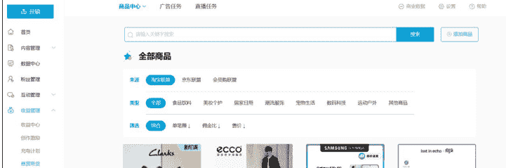

※说明：选品中心对淘宝联盟/京东联盟仅展现部分精选商品，完整联盟商品库可至联盟进行查询。

### （一）如何进行商品添加？

懒人微信：lazyhelper

悬赏平台汇集：淘宝联盟、京东联盟、多多进宝、B站会员购、UP主小店、工房、课堂等渠道的可带货商品，可在选品中心通过以下四种方式进行添加：

- 1.【搜索】
- 2.【榜单】
- 3.【选品广场推荐】
- 4.【链接识别】（有明确想带的商品）

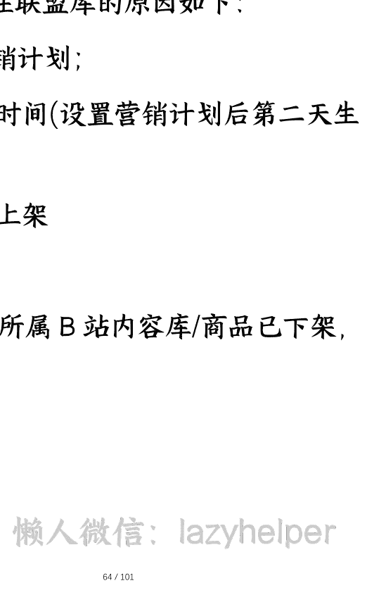

### 关于商品入库

Q：为什么我的商品不在联盟库？

A：商品不在联盟库的原因如下：

- 1.未添加营销计划；
- 2.未到生效时间(设置营销计划后第二天生效)；
- 3.商品尚未上架

提示：不在所属B站内容库/商品已下架，怎么办？

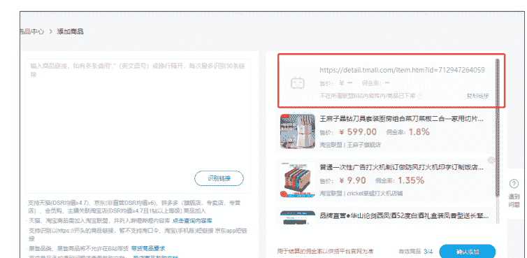

#### 首先，确认商品是否在售状态

#### 其次：查询是否商品加入了联盟内容库

（请复制链接去浏览器打开）

#### 淘宝内容库：

```
https://pub.alimama.com/portal/tool/query/index.htm?spm=a219t.l1816995.c60ldlc8f.1.260b6al5Q6wDgB
```

#### 京东内容库：

```
https://union.jd.com/proManager/index
```

#### 多多进宝内容库：

```
https://jinbao.pinduoduo.com/content-channel
```

如无法查询到商品，说明商品未加入联盟或者商家设置的推广计划还未生效，请联系商家先将商品加入联盟库或确认计划生效时间。

#### 图示（以淘联为例）：

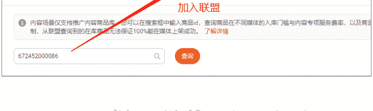

#### Q：为什么我的商品在联盟库但推广时搜索不到？

A：可能有如下原因造成：

- 1.链接错误，应直接使用商品原始长链接搜索；
- 2.链接错误，入库商品和推广时搜索的商品不是同一个链接

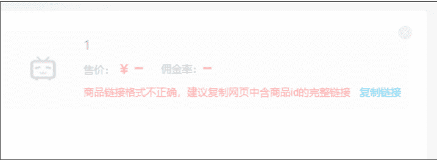

首先确认链接打开后是商品详情页，不是店铺首页、定向计划链接/专属优惠券领取。

目前仅支持识别商品链接，商家给到的定向链接对 UP 主而言是为了申请双方约定好的佣金，UP 主只需要点击该链接用自己的联盟账号申请加入定向计划，申请后通知商家审核通过即可。在选品中心添加商品仍需使用商品链接，并不会因此而影响带货佣金；商家把优惠券设置进商品即可，和淘联规则相同，只要满足最低价格的单品使用门槛，该优惠券便可露出，点击商品链接便可直接跳转至优惠券页面进行领取。（如何设置优惠券请看：选品相关内的第（五）点）

建议都使用浏览器打开商品链接，然后复制浏览器中的链接进行商品添加。浏览器中的链接一般都为以下格式，含有商品id（标红的即为id）。

例如：（可直接将商品id替换到下方链接中）

淘宝：
https://item.taobao.com/item.htm?&id=733172035000

天猫：
https://detail.tmall.com/item.htm?id=733785633400

京东：
https://item.jd.com/100056484000.html

拼多多：
https://mobile.yangkeduo.com/goods.html?goods_id=460439228004

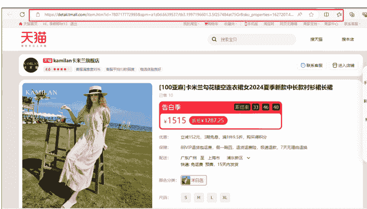

Q：为什么会员购的商品我在悬赏带货库里搜索不到？

A：会员购部分商品没有进入会员购联盟库无法进行带货，会员购联盟带货功能内测中，合作方如需将商品加入联盟库需与会员购运营沟通。

### 关于商品添加

Q：为什么商单上线了，UP主评论区无配置权限？

- 1.请先确认UP主是否已开通悬赏权限，未开通无法使用评论区功能；
- 2.手机版本过旧会导致无法使用该功能，需请UP主更新移动端APP版本后进行配置；
- 3.请确认商单稿件是否已经成功发布，商单稿件发布后才可进行配置，往期非商单稿件无法配置；

Q：为什么添加商品时会显示商品不存在？

A：请勿使用联盟生成的各种商品链接、定向链接、优惠券页面链接、落地页链接，悬赏功能目前仅支持原始商品链接或淘口令，网页端链接一般显示为下图形式，需确认链接中带有id=一串数字：

Q：商品入库异常提示“类目受限”，如何处理呢？

A：目前有部分类目暂不可准入，需联系B站运营单独申请及审核，审核准入后可开白添加：

- 如是品牌方来合作的带货需求，需要客户联系B站对应的销售做类目准入沟通
- 如是UP主自有店铺商品，则需要联系B站悬赏官方运营沟通，沟通结果1-3个工作日反馈

Q：为什么发布了评论区链接后，粉丝无法看到？

A：如无其他人看到该评论，说明评论中的某些话术可能不合适展示，请先进行修改话术后重新发布；若多次发布后仍无法展示，请联系运营进行处理。

## 选品攻略

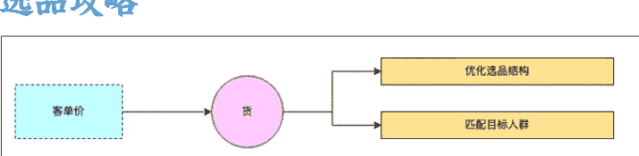

### 一、 选品逻辑

1. 什么样的品适合B站？

通常来说，在短视频平台选品基本上都需要符合以下特点：

- 低中等客单产品：300 以下低客单价的产品决策效率低，ROI 更易达成；
- 适合视频展现的产品：产品价值能视觉化和场景化表达——好看好玩好展现，真实有共鸣
- 有特点的产品：击中痛点/有独家优势（优惠机制、相较竞品经得住横向测评）/新奇特

B站用户以Z时代和都市白领为主，主张悦己和理性消费，更会为产品实际价值、颜值和情怀买单。

- 类目特点：美容个护、家居家电、营养健康、仪器工具等较受用户欢迎
- 价格特点：100-300元客单产品更匹配B站用户消费能力，ROI更易达成要求，高客单适合粉丝量级较高或专业类UP主带货
- 内容特点：有高新技术、适合测评、击中垂类人群痛点的刚需或黑科技产品更受欢迎
- 产品外观：有颜值、成分专业、体现人文情怀科技属性的产品更受欢迎

#### 2、 已探索出的B站成熟/潜力类目

| 品类类型 | 具体方向 | 单价区间 | 产品特点 | 选品方向 | 优惠机制 | 推广建议 |
|---|---|---|---|---|---|---|
| 成熟品类-快消品 | 快消品 | 100~200区间适合冷启 | 快消品是指使用寿命较短，消费速度较快的消费品，比如：美妆个护（洗发水、美妆产品、护肤品、漱口水、身体护理等）；食品饮料（粮油调味、零食坚果等）；家居（洗衣粉、清洁剂等） | 应季品优先（夏季防晒、遮阳伞）；强功效需求的优先（祛痘精华、防脱洗发水）；强场景需求的优先（夏天露腿-美白、与女友约会-衣物香氛、宠物掉毛-家清电器、鼻炎过敏-洗鼻器） | 单价不足可组合售卖（脱毛膏两支一周期，两支一起买领大额优惠）；相似产品打包售卖（脸部卸妆油搭配唇卸妆油一起售卖） | 短决策链路+视觉冲击力强：种草内容+超飞搏爆款放大roi；与站内生态内容契合度高：通过圈层内容覆盖目标人群，追求自然流量的溢出效应完成品效推广 |
| 成熟品类-耐用品 | 耐用品 | 耐用品的价格带较宽，引入期不做限制，建议不超过3000 | 耐用消费品是指那些使用寿命较长，一般可多次使用的消费品，比如：电器（冰箱、电视）；家居（沙发、衣柜）；音像（音箱、投影仪） | 基于站内容商品：同等价格带有差异化卖点的优先（吸尘器->扫地机器人->洗地机->洗烘一体机）；相似产品力有价格优势的优先（如徕芬vs戴森） | 新品上市定金下单、犹豫期可退货；加强售后保障、7天无理由退换货；降低用户决策成本 | 将耐消品与生活场景结合，通过场景化高点击覆盖目标人群，适当起飞精准转化 |
| 潜力品类-健康生活 | 健康生活 | - | 保健食品（蛋白棒、低卡零食、红糖姜茶冲饮）、保健用品（理疗仪、保健枕、冲牙器） | - | - | - |
| 潜力品类-悦己消费 | 悦己消费 | - | 美护小家电（电吹风、美容仪、体脂秤）、厨房小家电（空气炸锅、榨汁机、电热火锅） | - | - | - |
| 潜力品类-智能家居 | 智能家居 | - | 清洁家电（吸尘器、除螨仪、洗地机）、智能设备 | - | - | - |

### 二、 选品策略

1. 匹配“粉丝喜好+自身定位”，粉丝喜好匹配度 优先级更高：

- ✓ 适合账号与内容 | X 无目的看佣金选品

2. 不同产品推广场景下的选品逻辑：

| 场景 | 推广诉求 | 特点 | 选品方法 |
|---|---|---|---|
| 推新品 | 提升产品曝光，推广种草 | 对产品没有基础认知，不敢轻易尝试 | 有场景化的核心卖点：将产品卖点罗列，确定可场景化视觉化呈现的卖点；有平台福利价格：有平台/UP主特定的优惠机制；产品外包装有特色：外包装精致有特点、联名款、便携等 |
| 推爆款 | 扩大产品销量，人群破圈 | 供不应求，销量最高，刚需产品 | 受众群体匹配：比对历史销售人群分析平台用户群体，筛选目标人群；使用频次高：高频/长期使用的产品更容易有囤货欲望，提升转化率；有竞争优势：查看产品x竞品供需情况，分析哪个产品用户群体更大，哪个产品的卖点更容易场景化吸引用户，更具价格优势 |

3. 产品价格机制设置 TIPS：

### 三、 巧用平台资源

1. 会用选品广场

懒人微信: lazyhelper

平台有为UP主的选品广场，面对琳琅满目的商品，我们如何筛选呢，以下总结了一些方法：

- 关注销量指标：卖得越多，说明之前在站内有声量，且有一定的群众基础

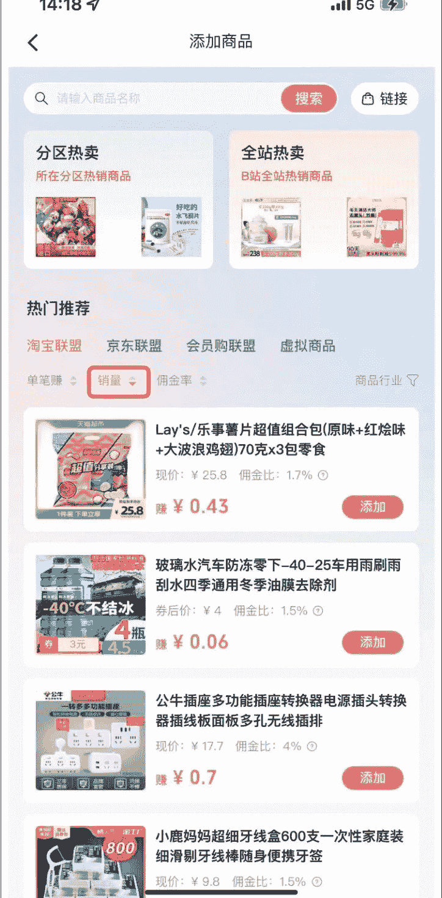

- 关注热卖榜单：里面集结了分区热卖和全站热卖，可以在初选品时给一些参考

懒人微信：lazyhelper

### 2、 参与平台活动

平台持续在引入优质商家，有大量的优质产品，目前推出了团长模式以及产地溯源活动，内容优质的UP主均有机会参与：

- ● 团长模式：
  - ○ 介绍：团长是平台引入的，帮助商家和UP主进行货品撮合的服务商。
  - ○ 业务优势：团长有丰富的内容运营经验，和货品资源，可有效帮助UP主和商家快速冷起带货业务。
  - ○ 参与方式：可以跟自己对接的品类同学进行报名，通过的UP主即可免费领样开始带货

### B站官方对外产品表-热度

https://docs.qq.com/sheet/DQVNkZWRLcnF3cFZn?tab=b4b64r

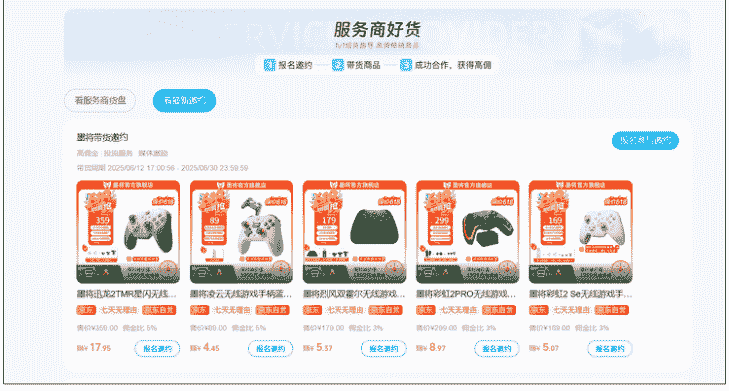

#### 1. 选品中心服务商好货供给增加，有带货权限即可申请

服务商好货是由平台官方授权的服务商为大家精挑细选的一批优质可带货商品，一般具有佣金高、合作机制有保障等优势。近期，有更多的货盘服务商参与了进来，商品类目丰富，涵盖食品、个护、家居、3C数码、虚拟商品等受站内粉丝欢迎的主流类目，同时支持所有的带货UP主申请，若有心仪商品，可直接点击报名参与带货。报名后还可以直接联系服务商进一步沟通合作，助力带货效率与收益的提升。

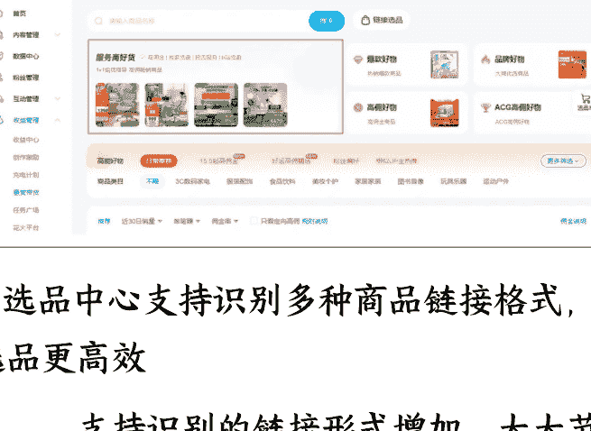

#### 2. 选品中心支持识别多种商品链接格式，选品更高效

支持识别的链接形式增加，大大节省您的时间和精力!目前支持识别的商品链接格式如下:

| 平台 | 出处 | 链接 |
|---|---|---|
| 电脑-商品详情页-网址栏链接 |  | https://detail.tmall.com/item.htm?id=26632323_6752370107181600323%3A17430693357485576782360&bxisign=tbbnLQN8DNeWuV2K9m2y21-h7fOrkv-VMU8gQvWQxqGvxeQs6jdeMsc-S8woR81rqvTZJLL_tqQKfacurikS91umCIRanlSOS2lbpHtNnNikhH#DRD4fx4PETAWPupYYK-7dQpQadNlS48zKxjJFhUdjvMAksLgunINxbOJHXKSO5NUagaos5caV0uCFMdUJScmmexRk1t#59da027f6cgeOexa1Z4e19060a39h8id-809555074345&rotPageid-20150318020018244&com-201407675999033626917546317430693308541%7Ctem%7C8095550743450&spm=a2zel1.27695560d170919594072658unlonLens-tenalsld%3AOPTSL401710136889%400b87bd250d4518a2c10focx934%40024QIARHnSnARfaZouZXWsQ%40eymbGpucklkjdo4NqawM5wiic3jRxmvb3j/ZC16UM4OTU31ne0s%3Bcm%3A10071534810955292842878015ae8136-2914-45fb-a5dd-7d29f594fbas%3Becoversyd%3A2008616050%401743069330018%3Bepsvd%3A2013353201481779549174306933082 |
| 淘宝 | 淘宝联盟-淘口令 | 58￥ HU591 ZmHXefqJ5ox￥ https://m.tb.cn/h.d6b8kgo 网易天成网易严选旗舰店猫罐猫10kg20斤鲜肉营养金谷无谷幼猫猫粮 |
| 淘宝 | 微信打开分享链接后，右上角分享链接 | https://new.m.taobao.com/detail.htm?skel5d%28lQeq6IDAeydto5x52U_21380790_1743076087071Copy1&id=553300424507&sourceType=item&price=58&uid-8BD01C71-4571-4981-8970-CF1ADDEF30C5E&shareUniqueid-309820175188un-95f6ebc6d636fffafafa79d0487af-91&share_crt-rt-1un-site-0&spm-a215913376460d00&xssign-tbbuhS5M7gDa5BWleioBhTwlVBB015jHgpYMv-Opvljc1TrzERVAIlPOptsLgpc8F852X37103wz74D_Ce9939z4TTLb95BVFa42K0GHEUu6oI-cpcbadsA7_aL69a&bSocialPcpKevxshareitem8sp_hc-SthbgOQV5ZbaGSa%3DAbc_f1-src-slaee-1041145145006-2-18c:pt:1&shareurl-truase&short_nsmehs:6WVWbRdVEOPDJVP3P1bxisign-sccdPVONsxFXT7SLleLqM0DaW21st_7vpL37y7Jq2o51UdDslgvqkww019SDqJW9d6ILNag9QO6m1hWAS57E1356yU-ucxCjnfFdoD56mgEQ6sRjbfOMNKwwKH4VQ2tQBrack-HjcRKFJHq8app-zweixin#hasState |
| 京东联盟 | 商品详情页链接 | https://item.jd.com/100016980690.html |
| 京东联盟 | 推广链接-短链 | https://ujd.jd.com/OuREqI |
| 京东联盟 | 推广链接-长链 | https://union-click.jd.com/jdc?c=618%7Cce%7C8q-IBBATAKIK1eKxvEOV/FYDyOlBIBIGloUXEGQXV9xa5onFz8BOOQIBENHF8xW/FVPRtRUBAKBlMB4gqAF8q1HXDaWQN8xqISBxFhVhQZRT9LrVNAUQYDV9d4OMeAmgAqmtgWkBLEjpdC555dR2-c-c4cPnqlFqtB8cBm8nIG1sR1xwcaUlmSeCuKVcVmoBVHqcblVcyv24ZFzopWVVI0LglsbbQVcV9bcUJMSBGV4G10QXwcEUiupVAlUsVC18PG1lllBNwUFdcWEsRBBG0O510T0ZylZf1HO5ef216Wqk8Wb90QfZFsTc3anA/Wl4lHlbdlMwvCaRDPRVMSAdvbQdWPMo0EPV6Dht8gcQQH14tBc8f8h5RwsdXa59o51o1CFZFXoQ2dhtRjEAEkTnu2laXonXhVNcUM4aUIUUVQY |
| 京东联盟 | 推广链接-京口令(长) | 1l U3Vx89Wln2jcW5Nl1 CZ154. ...富勒和抓年货礼盒 面包饼干零食大礼包送礼周年金蛇进125g/罐 |
| 京东联盟 | 推广链接-京口令(短) | U3Vx89Wln2jcW5Nl1 CZ154 |
| APP商品详情页 | 分享链接 | 【京东】 https://3cn/2dWuDlcu-【居家补620%董嘉剑66七枕花成】点击链接直接打开 https://item.jd.com/ware/view.action?wareId-1001077144588&source=llmenng_10_long8utn medium-suiguang&utm_campaign=2034573878&utm_term=3c49378dse47edb31e3d7dd1ad988 https://ujd.com/01R541F |
| 拼多多 | APP商品分享链接 | https://mobile.yangkeduo.com/goods1.html?psu-cCdQxJvJ9 |
| 拼多多 | 多多进宝-推广链接(短) | https://p.pinduoduo.com/Al8eOju |
| 拼多多 | 多多进宝-推广链接(长) | https://mobile.yangkeduo.com/duo_coupon_landing.html?goods_id=71588885199&uid=38802322_275806049&goods_sign-nE9n3BXr5-tJCdIVFhvneqqatTAAXaTos6_JOVsIVspChZs_duo_id=8970909&cpsign-CC 250327 3880322 275806049-cd d723ad4cc8644a5335d9241105dd8f.x_adtlas-ch%8z2st%22%3CA%221%22%7D&udu_type=2 |
| 拼多多 | 电脑-商品详情页-网址栏链接 | https://jinbao.pinduoduo.com/goods-detail?x=69b2ArKamtqliVFFvwfeqU6wVIwAqr4_JkcLOchd |
| 拼多多 | 微信打开【推广链接(短)】，右上角分享链接 | https://mobile.yangkeduo.com/goods.html?goods_id-60083265407&share_token-lcu7/X1Wk7ZGLKAskpBm495a2buuQnp0c5an7_12Xb1klyXy0u4UF4T6FR8FOA416758uvxCkyD_Guto08uin-2XV2XMPVN4X6DADEHDEMMXK8F7DKGU_GEXDA&wlst-t1& wls.tn-26&8 wls_fn=m |

#### 3. 悬赏平台内支持花火订单挂链，带货效率大幅提升

和甲方合作的花火商单，若需要UP主自行配置带货链接，以往只能在内容详情页的评论区配置。现在，悬赏平台内的选品车管理-选择商品-去带货-带货编辑页，和悬赏带货-内容管理内也支持选择花火视频，进行挂链啦。

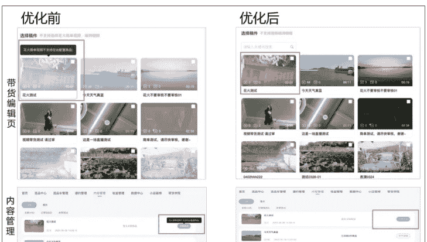

#### 4. 主页小店功能升级，助力高效运营和引流

#### 1) 直播切片促转化

**智能单品切片，一键关联商品**

- 自动匹配：系统将自动为您小店近60天内的直播回放生成商品讲解切片，并精准关联至对应商品
- 提升转化：用户可随时观看商品讲解片段，快速下单，助力GMV增长！

* 整场回放功能，需联系运营申请白名单

#### 灵活手动调整

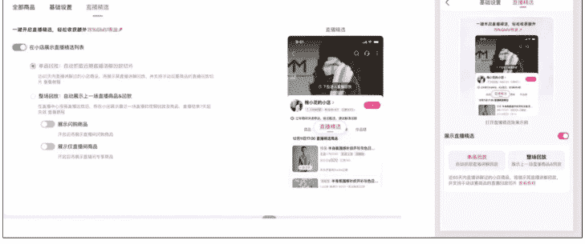

可在【小店装修】-【讲解回放设置】中，自主选择展示给用户的直播回放内容，优化购买体验。

#### 2) 批量上传商品，高效管理选品

- 一键导入：支持通过Excel文件批量上传商品至小店（1次最多上传300个）
- 平台适配：目前支持批量上传淘联或者京联商品
- 智能同步：上传至小店成功的商品将同步添加至您的选品车（含直播选品车）

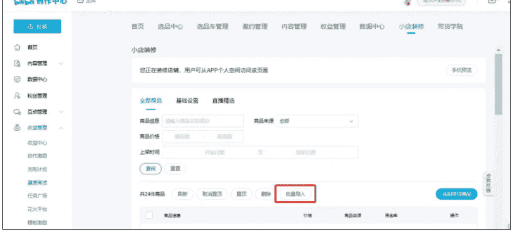

#### 3) 评论区新增“小店”入口，引流更便捷

- 前置条件：小店装修页中，“在个人空间展示小店入口”开关需处于打开状态时，即可解锁评论区入口；
- 灵活选择：UP主方可在自己的稿件或动态评论区插入“小店”首页（一键进入您的店铺），或者小店内“直播精选”页（此页面将展示有讲解回放的商品）。

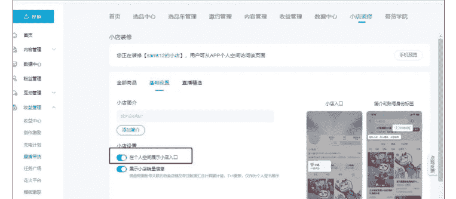

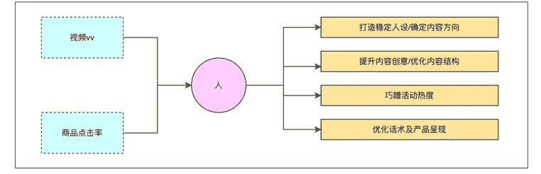

内容是兴趣电商的重要媒介，账号及人设是否稳定，内容是否健康，是否有好的创意能获得稳定流量，产品呈现是否清晰且有表现力是产品大卖的“基石”。如何生产优质的带货内容呢，我们可以从以下几个方面重点优化：

### Step 1：立好人设和创意模型

- ● 确定好内容呈现形式：

这里一定要注意，如果不是新起的账号，沿用以往的呈现方式即可，风格要前后统一。

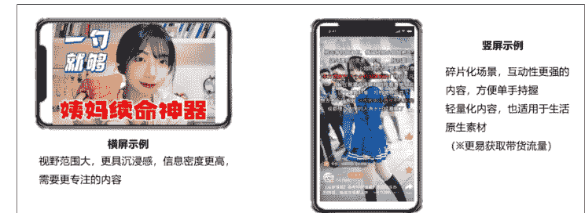

- ● 立好人设和创意模型：

懒人微信：lazyhelper

确立好人设 ≈ 确立创意模型。我们做的是带货内容，因此要兼顾好内容力和带货力，内容质量高可以获得更广泛的关注、播放；带货力强也就是产品呈现的好，则可以带来更有效的转化。以下是总结出来的几种创意模型：

#### 代入型（好物分享/开箱型博主）

自身是品牌目标人群 eg. 自身使用体验感受

| before | after<br>黑眼圈<br>红血丝<br>嘴角暗沉<br>4K原相 03:18<br>三合一气垫 | 水感持妆 新手快速上手! 清透底妆不是梦!<br>10.9万 5-17 | 提高 回头率<br>男士必入宝藏 03:09<br>平价男士香水 | 好闻 显贵 每个男生都该拥有一瓶香水<br>3.8万 5-16 |
|---|---|---|---|---|
| 4类<br>送礼清单<br>如何征服英俊 05:17<br>520送男友礼物 | 送礼送的好<br>哪都想起你! 问遍身边所有男<br>6.3万 5-12 | 告别后背长痘<br>控油 除螨<br>03:19<br>后背长痘竟然是这样? 选对沐浴露告别又痒又痛!<br>5.8万 5-11 |  |  |

#### 专家型（专家型博主）

专业领域的品牌认同者 eg. 生物学博士告诉你肌肤衰老真相

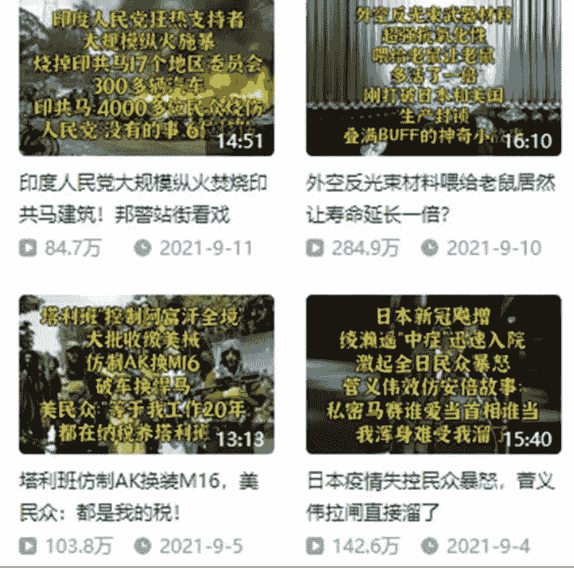

#### 3. 评测型（深度测评型博主）

产品特色的演绎者 eg. 丰富测评产品功效

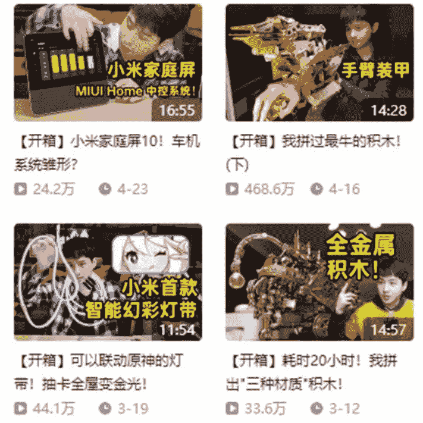

#### ✨Tips✨

人设 - 打造带货人设与日常内容统一

- ● do's:
  - ○ 昵称朗朗上口且和人设统一
  - ○ 人物形象有设计，着装、台词和人设契合且正面
  - ○ 人设保持稳定且统一
  - ○ 形象及语音亲和，能和粉丝产生互动感
- ● don'ts:
  - ○ 人设风格频繁改变
  - ○ 内容及镜头表现生硬，和粉丝有距离感
  - ○ 内容夸大或和人设时常发生不符的情况

### Step 2：选好创意题材

我们立好人设和创意模型后，需要进一步选好创意题材，每一种创意题材都有相应的内容结构，以下是我们总结的可作为参考，如果有咱们对标的內容，也可以按照下面的思路进行拆解：

#### 内容方向1：痛点安利

题材特点：直击痛点，凸显产品价值

内容结构：抛出痛点 → 提供解决方案 → 卖点安利+前后/横向对比 → 引导转化

雷区/要求：客观对比，公正可靠


03:23

#### 天天熬夜都没黑眼圈，远离干纹细纹！告别无效眼霜！解锁正确打开方式！

254.9万观看 125弹幕

#### 内容方向2：知识科普

题材特点：深度科普，打消顾虑

- 知识科普
- 产品讲解
- 引导转化
- 符合人设
- 不尬吹，夸大

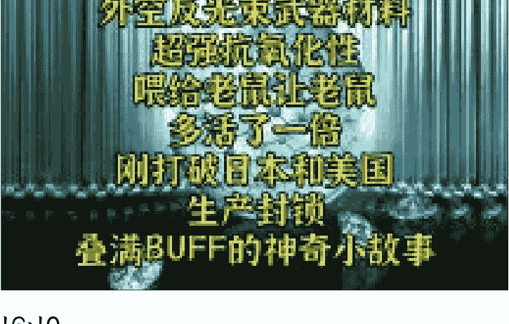

16:10

#### 外空反光束材料喂给老鼠居然让寿命延长一倍？

287.7万观看 1万弹幕

#### 内容方向3：使用教程

题材特点：新奇有价值，实用性高

- 产品介绍
- 操作教学
- 使用/购买技巧
- 真人展示
- 突出小众技巧

03:55

#### 【干货】消灭黑头攻略！你的去黑头手法都是错误的！

358.9万观看 903弹幕

### Step 3: 做好创意构思和产品呈现形式

我们确定了不同的内容结构后，怎样在千篇一律的内容中脱颖而出，是获得更多流量的关键，下面我们列举出了创意构思的方法：

| 步骤 | 内容/方法 | 策略/说明 | 举例 |
|---|---|---|---|
| Step1 | **研究产品属性及卖点：**<br>从行业共性及产品特性出发，选择创意类型。<br>• 行业共性，即行业共性。同类产品的共性特征。<br>• 产品特性，产品独特优势，差异化卖点。 | • 如果产品特性较为明显，与竞品相比有较多差异化卖点或优势，则优先选择“差异化”创意，创意以强调产品特有卖点、优势为主。<br>• 如产品特性较弱，优势、卖点不明显，则应选用“需求型”创意，淡化品牌，创意以激发用户实际需求为主。 | 举例：<br>行业共性：功效类、黑科技类产品-洗晶器、痛仪..<br>产品特性：无钢圈内衣、坚果近距离投影仪 |
| Step2 | **分析受众画像：**<br>分析产品用户画像及粉丝画像，得出满足要求的针对性目标受众。 | • 有需求：用户有使用该产品的实际需求。<br>• 能负担：用户的经济状况、生活背景能够支持其购买/使用该产品<br>• 能触达：该投放渠道能够触达到目标受众群体。 | 举例：<br>海洋至尊：有恋爱需求的男生<br>西屋洗地机：上班族<br>纯珂斯尼：小胸女孩 |
| Step3 | **脑补使用场景：**<br>根据目标受众类型，脑补该类受众的使用场景 | • 将目标受众使用该产品的场景具象化<br>• 将产品的面料成分、使用感受具象化 | 举例：<br>海洋至尊：香味的体验感受<br>纯珂斯尼：忘记脱内衣<br>西屋洗地机：省出时间追剧<br>徐芬&loliarose&花西子：送礼场景 |
| Step4 | **切入产品卖点：**<br>将产品卖点切入目标受众的不同使用场景中 | • 阐述目标受众在具体场景下的痛点，卖点融入场景<br>• 配合前后对比和使用感受<br>• 优惠机制促单 | 举例：<br>徐芬：颜值高——适合送礼；轻便易拿取——适合力气小的女生；吹干快——省事<br>纯珂斯尼：面料好——过敏体质；聚拢效果——小胸女生<br>海洋至尊：运动型男生的汗味；女生给男生送礼；上班、社交场合适用；安静的女生也适合 |

#### ✨Tips✨

内容 - （类型、时长、制作、封面、结构）X 无感情棒读 | √ 优秀的视频化卖点呈现

- ● do's:
  - ○ 封面突出重要信息，风格及字体统一

| 模式拆解 | 案例 |
| :--- | :--- |
| 视频封面 | • 重要信息高亮（痛点、热度、梗）<br>• 画面清晰<br>• 有角色出境<br>• 风格统一 | (Image of video covers) |

  - ○ 内容结构清晰，且融入个人风格及创意
  - ○ 卖点呈现清晰明快，击中用户痛点

- ● don'ts:## Step 4: 优化卖点

- 卖点和内容无设计，念稿口播，没有表现力
- 视频内容冗长，痛点呈现不明了

#### 视频化购买路径：

上文已经介绍了如何提炼卖点，那么怎么样让用户种草后，可以迅速转化呢？我们用一个优秀案例拆解：

| 内容 | 呈现样式 | 成功TPS |
| :--- | :--- | :--- |
| UP：出格字幕组<br>粉丝：115.8w<br>类型：卖贴纸 | 视频末尾作者再次口播并用视频化呈现购买方式 | - 卖点优惠信息清晰展示<br>- 购买路径视频画面演示<br>- 口播点击购买链接（评论区下方） |

#### 选好资源位并优化组合标题：

##### 选好资源位：
具体资源位配置详见：《玩转B站带货业务-操作指南》。这里我们推荐评论区置顶资源位，更符合社区属性，而且可以保证内容观看的同时持续展示，可跟粉丝评论区互动。

##### 标题优化有以下几种方式：
- 基础信息充分：包含品牌词+属性词+类目+卖点+优惠信息+（达人词），比如李佳琦推荐
- 可覆盖更多热词：洞察站内热搜词及梗词，可以进一步增加点击量

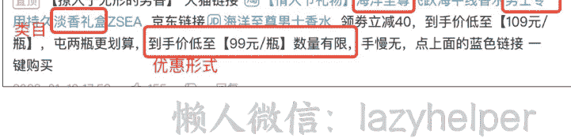

### Step 5: 巧蹭活动热度

- 创作灵感：定位热门选题与活动赛道，创作紧跟平台热点：

## 玩转 B 站带货业务--定位核心运营指标

如何把重点运营指标拆解成切实可执行的运营策略。

```
GPM = GMV / 视频VV * 1000 = 商品点击率 * 下单转化率 * 客单价 / 视频VV * 1000
```

从这个公式中，我们可以拆解出提升销售额的核心运营指标：商品点击率、下单转化率、客单价以及视频的 VV。

那么定位了这些运营核心指标，我们如何变成有效的运营手段，提升视频带货的销售额呢？接下来我们会把这几个率一次拆分成 3 个细分场景：电商的三大要素：人、货、场

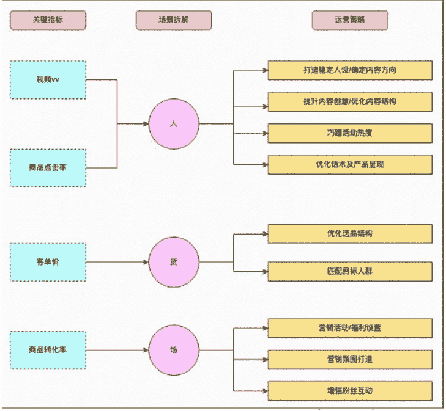

商品点击率及视频 VV 主要是从“人”的场景出发做优化，重点可以从 IP 定位、内容结构及创意、巧蹭话题热度、优化产品呈现及口播话术等几个维度进行优化。

客单价则主要对应的是“货”的场景，主要从选品结构（选什么样的品，价格区间怎么定位，如何打造爆品）、以及匹配目标人群（我的粉丝画像是什么，要什么，他们的痛点是什么）等维度进行考量及优化。

商品转化率则对应的是“场”的运营，分别从如何打造营销氛围、如何通过营销活动及福利吸引粉丝下单、以及运营粉丝增强互动等几个维度进行优化。

## 玩转B站带货业务-打造营销场景

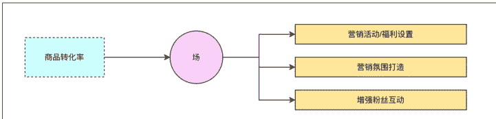

### 一、有节奏的设置营销活动

电商卖货需要有节点 sense，除了跟着大促活动走，也可以设置粉丝专享的营销节点，比如生日会、每月一次的宠粉日。以下给大家列出了每个月份的营销日历参考：
懒人微信：lazyhelper

▲ 营销建议：2023 年伊始，新年氛围浓厚，新的一年寄托新的愿望，品牌方可以在社交平台策划“愿望清单”、“新年计划”、“回顾品牌故事”等主题活动，容易引发用户共鸣，提升用户参与度。

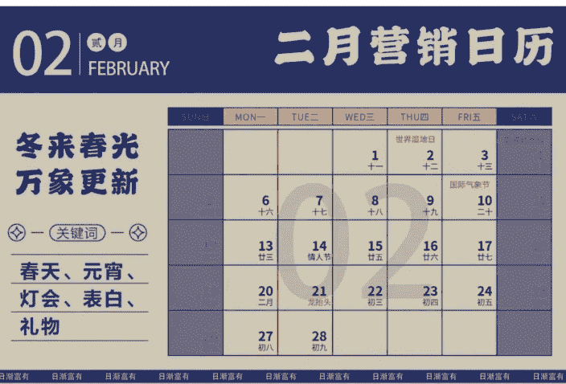

▲ 营销建议：2 月迎来立春节气，一年四季从此开始，体现向阳而生的希望与期盼。品牌方可以借助春天元素，打造春季限定的氛围感营销。另外，策划元宵节活动，延续春节节日氛围。此外，情人节也是需要提前布局的重要节点，策划“情人节礼物”等相关内容话题。

▲ 营销建议：3 月的营销内容可围绕“女性”展开，关爱女性、尊重女性等主题为女性发声，配合多样营销活动，借此传达女性态度。如线上围绕女性做一些创意推文、海报、H5 等，线下可以开展 3.8 特别促销活动。

### 四月营销日历

春芳归去，夏木成荫
关键词：整蛊、清明、读书、环保、踏青

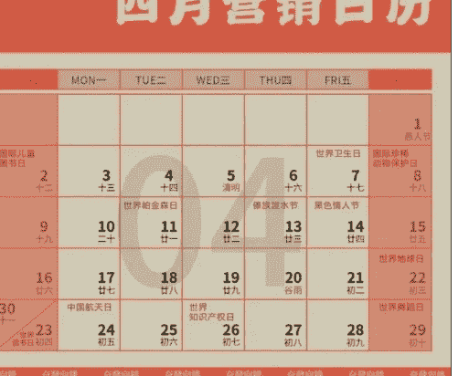

人间 4 月天，初春好时节，是品牌破圈的好时机。春季露营、郊游，传达品牌所倡导的美好生活；此外，新品上新、清明寄托哀思等都是 4 月的营销主题。

### 五月营销日历

孟夏之日，万物并秀
关键词：劳动、出游、母爱、情侣、夏天

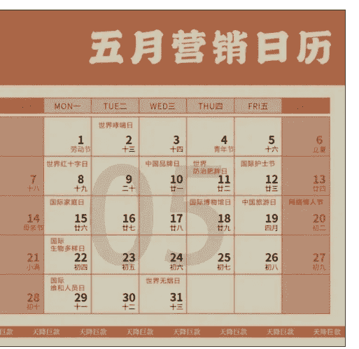

劳动节侧重促销热点，青年节传递青年价值，母亲节侧重亲情类情感营销，都可作为品牌人文关怀的关键切入点。春日时节，借势假期，活动促销和品牌传播的活动都能得到良好的市场反馈。

### 06 六月 JUNE 营销日历

蝉吹昼眠，花开半夏
关键词：童趣、粽子、父爱、年中、高考

| | SUN日 | MON一 | TUE二 | WED三 | THU四 | FRI五 | SAT六 |
|---|---|---|---|---|---|---|---|
| | | | | | 1 儿童节 | 2 | 3 世界自行车日 |
| 4 | 5 世界环境日 | 6 全国爱眼日<br>高考 芒种 | 7 高考 | 8 | 9 | 10 中国文化资产日 |
| 11 | 12 | 13 | 14 世界献血日 | 15 健康素食日 | 16 | 17 |
| 18 | 19 | 20 世界难民日 | 21 夏至 | 22 端午节 | 23 国际奥林匹克日<br>世界青年联欢节 | 24 |
| 25 全国土地日 | 26 国际禁毒日 | 27 | 28 | 29 全国科普日 | 30 | |

▲ 营销建议：6 月围绕儿童节的“童真”基调，加上高考和毕业季的场景烘托，品牌可以主打夏日、青春等相关的元素；此外还有年中大促和父亲节感恩回馈等购物主题的营销活动，可谓是层出不穷，创意无限。

### 07 七月 JULY 营销日历

七月盛夏，静听蝉鸣
关键词：祖国统一、运动、健康、暑假、消暑

| | SUN日 | MON一 | TUE二 | WED三 | THU四 | FRI五 | SAT六 |
|---|---|---|---|---|---|---|---|
| | | | | | | | 1 建党节<br>香港回归纪念日 |
| 2 国际体育记者节 | 3 | 4 | 5 | 6 国际接吻日 | 7 小暑 | 8 |
| 9 | 10 | 11 | 12 | 13 | 14 银色情人节 | 15 |
| 16 | 17 | 18 | 19 | 20 | 21 | 22 |
| 23 | 24 | 25 | 26 | 27 | 28 世界肝炎日 | 29 |
| 30 | | | | | | |

▲ 营销建议：7 月延续夏日主题，同时针对毕业季的来临，营销内容主要可以围绕盛夏、青春、毕业等话题开展；另外除了建党和香港回归纪念日外，几个节日也可以部署相关内容联动；炎炎夏日，品牌方也可以结合消暑话题，进行宣传输出。

懒人微信：lazyhelper

### 08 八月 AUGUST 营销日历

天高风淡，八月未央
关键词：情侣、乞巧、健身、初秋、养生

| 日 | 一 | 二 | 三 | 四 | 五 | 六 |
|---|---|---|---|---|---|---|
| | | 1 建军节 | 2 十六 | 3 十七 | 4 十八 | 5 十九 |
| 6 二十 | 7 廿一 | 8 立秋 | 9 廿三 | 10 廿四 | 11 廿五 | 国际青年日<br>12 廿六 |
| 国际左撇子日<br>13 廿七 | 绿色情人节<br>14 廿八 | 15 廿九 | 16 七月 | 17 初二 | 18 初三 | 19 初四 |
| 20 初五 | 21 初六 | 22 七夕 | 23 处暑 | 24 初九 | 25 初十 | 全国爱牙日<br>26 初十一 |
| 27 十二 | 28 十三 | 29 十四 | 30 中元节 | 31 十六 | | |

▲ 营销建议：8 月的重要营销热点在于立秋和七夕。近两年“秋天的第一杯奶茶”是立秋营销热点，以此衍生的“秋天的第一 XXX”都是立秋营销中可借鉴的话题点。七夕作为传统情人节，氛围感和国风营销是重点！

### 09 九月 SEPTEMBER 营销日历

一叶知秋，天朗气清
关键词：开学、教师节、感恩、中秋、团圆

| 日 | 一 | 二 | 三 | 四 | 五 | 六 |
|---|---|---|---|---|---|---|
| | | | | | 开学日<br>1 十七 | 中国人民<br>抗战胜利<br>纪念日<br>2 十八 |
| | | 中华慈善日<br>3 十九 | 4 二十 | 5 廿一 | 6 廿二 | 7 廿三 |
| | | | | | | 世界急救日<br>9 廿五 |
| 10 教师节 | 11 廿七 | 12 廿八 | 13 廿九 | 相片情人节<br>14 三十 | 国际民主日<br>15 八月 | 16 初二 |
| 世界<br>清洁地球日<br>17 初三 | 国耻日<br>18 初四 | 19 初五 | 国际爱牙日<br>20 初六 | 国际和平日<br>21 初七 | 世界无车日<br>22 初八 | 23 秋分 |
| 24 月半 | 25 十一 | 26 十二 | 世界旅游日<br>27 十三 | 孔子诞辰<br>28 十四 | 29 中秋节 | 30 十六 |

▲ 营销建议：一夜知秋，秋高气爽，初秋是整个九月的主题与氛围。开学季与教师节紧密相连，随后迎来了中秋小长假，也是这个月的重要营销节点。可以围绕“团圆”、“牵挂”、“相聚”等关键词走心营销，与用户建立情感联系。

▲ 营销建议：10 月的国庆长假会带动一波线上线下流量的小高潮，同时据往年双十一的战线划分，10 月底正式进入双十一预售时段。此时的营销重点主要在线上渠道，各大品牌方需要抓住这波流量，可主打 #国庆回馈#、#十一放价#、#家国情怀# 等主题，以限时折扣为引子，吸引新老顾客，刺激消费。

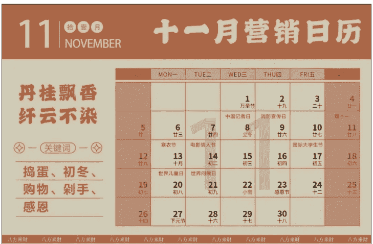

▲ 营销建议：剁手不停的双十一是整个月的营销重点，同时还有万圣节、感恩节等节点，对于品牌方来说，是借势宣传、节日促销的最佳时机。

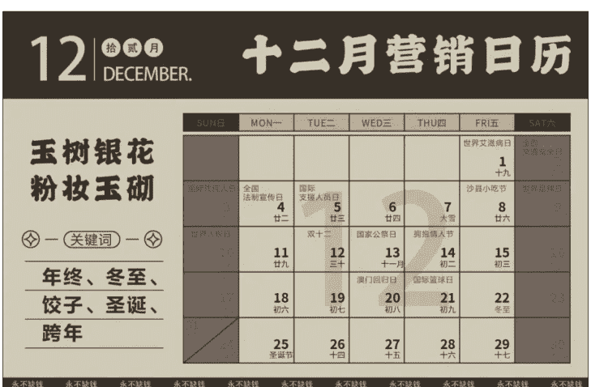

▲ 营销建议：12 月作为全年营销的重头戏，双十二、圣诞节、跨年等节点的营销玩法丰富多样，通过红包、优惠券等组合营销；此外，冬日氛围感成为营销的关键，也是线下门店营销的重点，年底冲刺的机会一定要抓住。

### 二、打造营销氛围

##### 一）封面
1. 方式：
- 结合节日，用色彩和关键字，突出营销主题
- 封面标题开头可以写明是 for 哪个营销节点
2. 案例如图


##### 二）视频播放页面
1. 方式：
- 视频框可以加点节日氛围装饰
- 评论区置顶营销节日话术，并增强互动
2. 案例如图

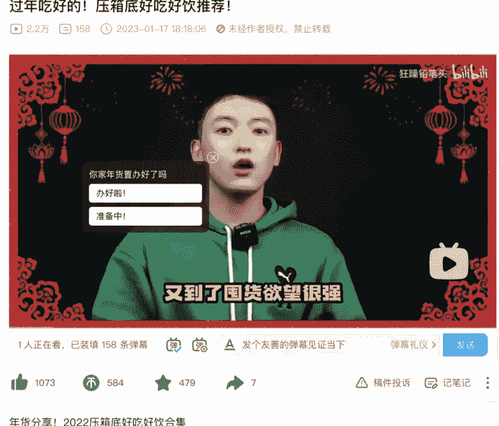

##### 三）动态
方式：
- 发节日福利抽奖
- 发节日专场预热
2. 案例如图：

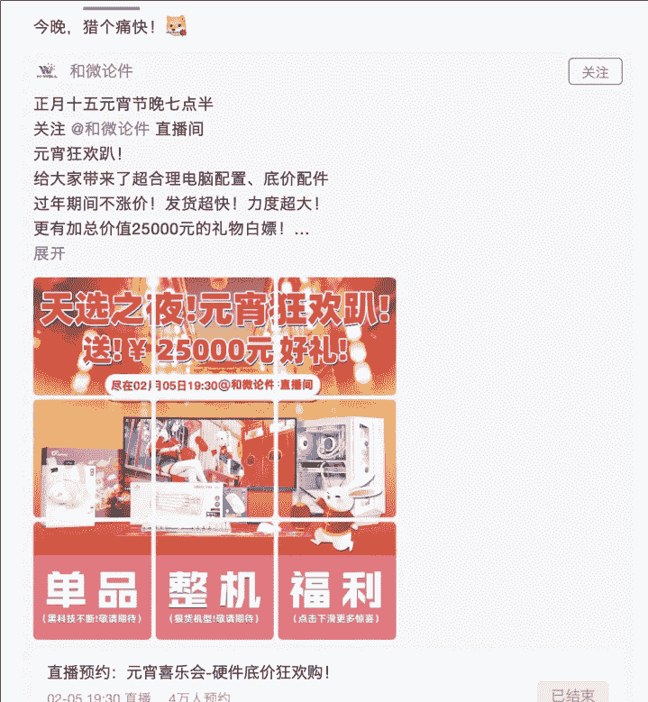

## 其他渠道：动态带货

### 资源位操作与展示概览

| 资源名称 | 操作端-PC端 | 操作端-手机端 | 展示端-PC端 | 展示端-手机端 | 权限开放 |
|---|---|---|---|---|---|
| 动态 | | ☑ | | ☑ | ☑ ● 开通悬赏 UP 主即自动开启动态带货功能 |

### 5 步即可轻松发布带货动态
移动端操作流程：点击屏幕下方【+】——发动态——按提示填写动态——添加商品——发布动态。

TIPS✨：
1、开通悬赏计划，将自动开通动态带货功能：

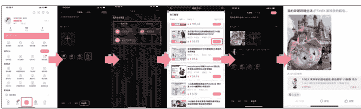

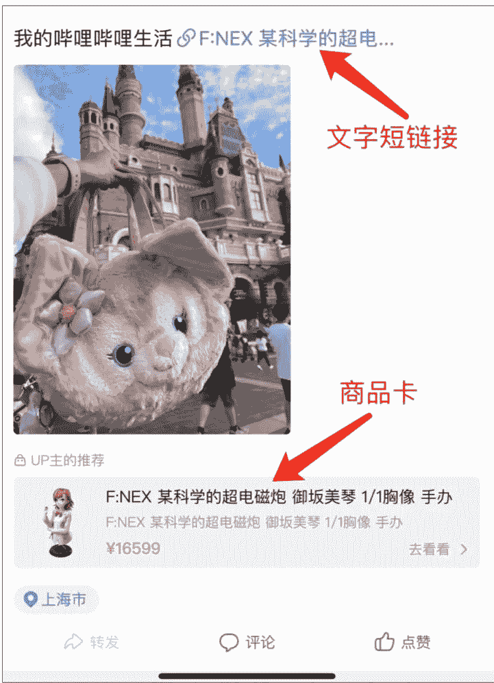

2、添加商品时自动生成商品卡、短链：发布动态，点击商品 icon，选择商品自动生成商品卡和短链

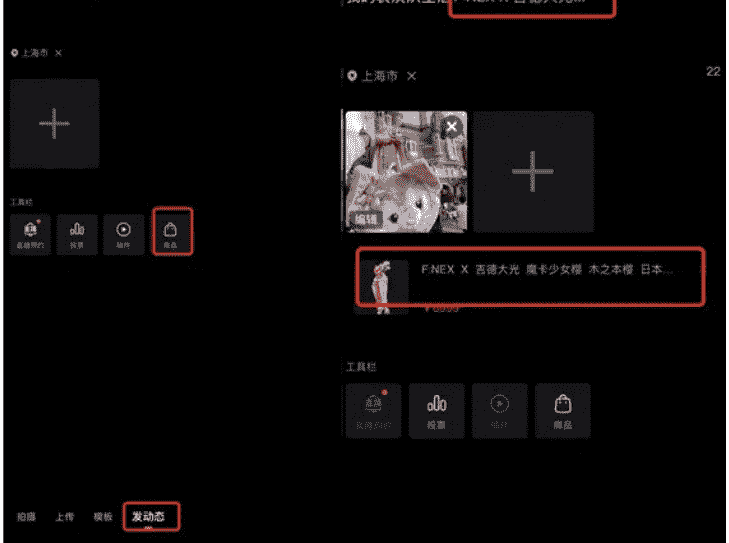

3、动态评论蓝链：动态发布后，评论区中也可点击 icon 添加蓝链（商品需要提前加入商品橱窗哦～）

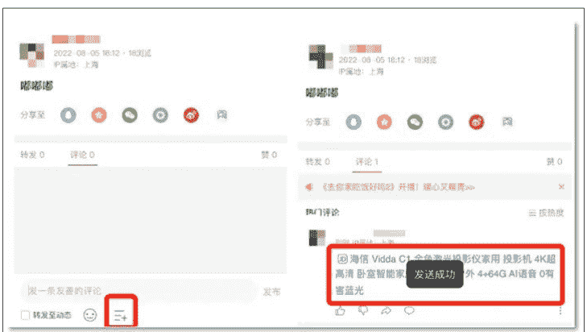

小店升级：
- 个人主页心智统一：全链路透传个人小店
- 基础体验提升：小店页可展示账号所有来源的商品，兼容多重身份特征展示
- 装修功能上线：支持个性化简介、展示开关、整页置顶等能力，更多个性化装修功能施工中

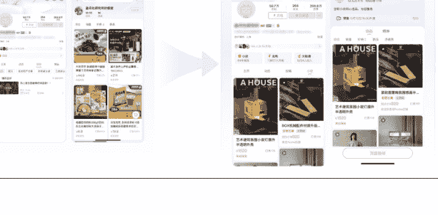

### （四）查看带货数据和收益

#### 1.查看带货效果

##### 1）带货总览
悬赏带货-数据中心可以通过筛选时间段，查看佣金、成交金额、订单量，以及直播/非直播的总收入。（路径指引：悬赏带货-数据中心）

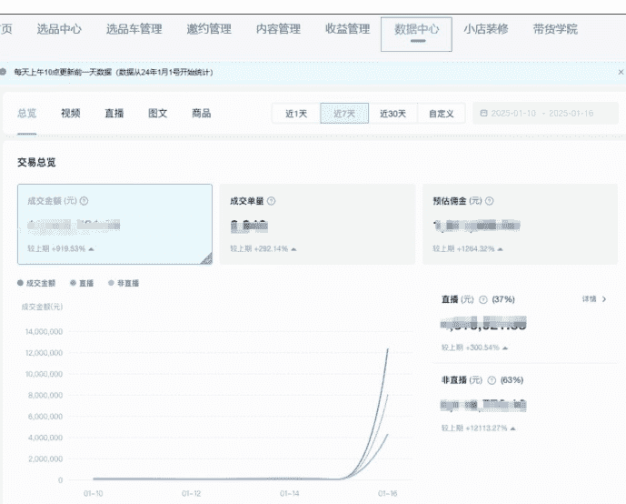

##### 2）WEB 端分场景进行交易数据分析
**视频场景**：为 UP 主提供不同时间周期内从视频内容到商品成交的总数据以及明细数据查询，便于 UP 主摸清与商品相匹配的内容场景（支持京东、拼多多、B 站内部商品的全链路带货数据查询）

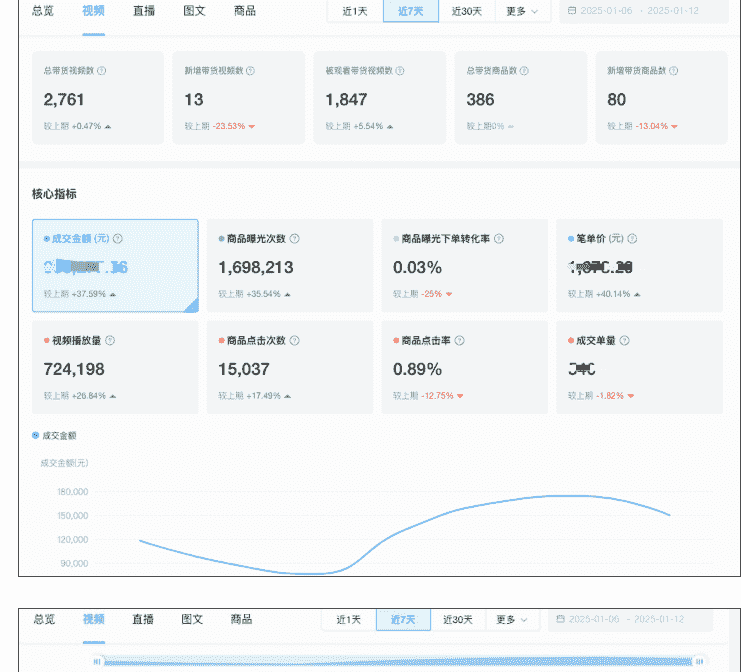
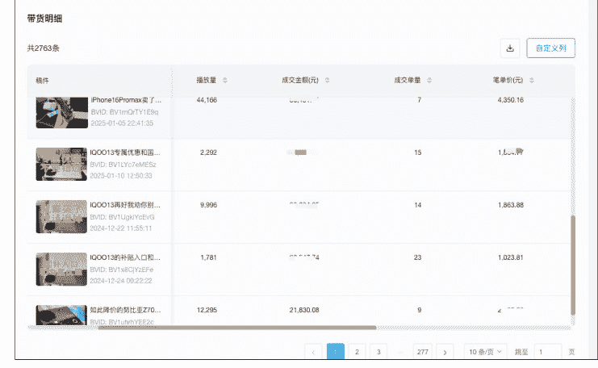

**直播场景**：支持每个场次的带货交易明细查询，以及不同时间段的交易汇总数据查询。

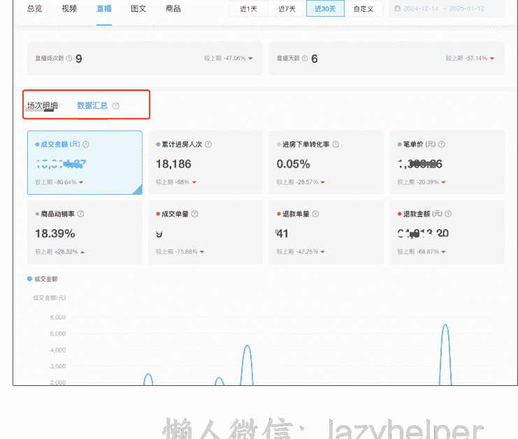

**图文场景**：可以查看不同时间周期内的总图文带货数据，曝光、点击等图文内容维度的流量数据。

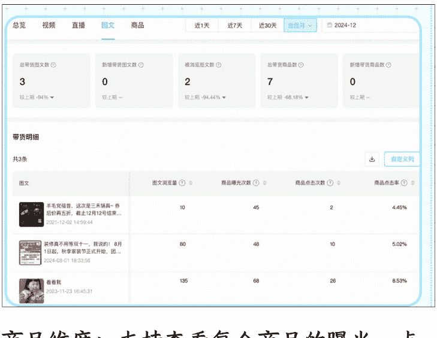

**商品维度**：支持查看每个商品的曝光、点击等与流量相关的数据，以及和购买成交相关的转化数据，方便 UP 主找到后续适合自己售卖的商品类型。

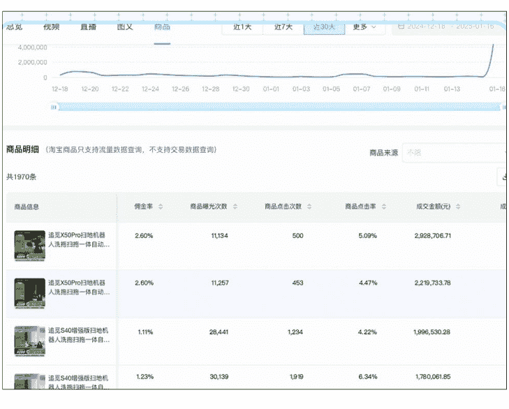

#### 2.查看订单明细和收益结算

##### 1)结算规则
UP 主带淘宝联盟、京东联盟和多多进宝的商品，联盟服务费由对方联盟平台按规则自行收取，B 站平台目前不抽佣，也不参与结算。

B 站内部商品结算规则：买家支付完成后的第二天，可查看带货订单明细；买家确认收货后 15 天，可获得佣金。如确认收货时间是 2022-04-10 09:00:35，那么结算时间就是 2022-04-25 09:00:35；已结算的收益会在次月统一打款至贝壳，预计 5~10 日可提现。

##### 2)查看收益和提现
**淘宝联盟-WEB 端**：登录个人账号进入淘宝联盟，点击【效果报表】，选择【订单明细表】，可进行查看；点击下载报表，即可查看详细佣金收益。

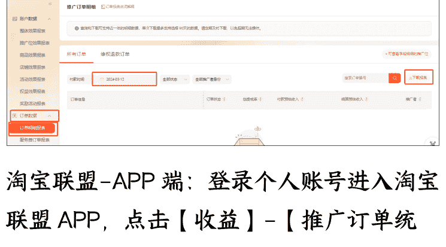

**淘宝联盟-APP 端**：登录个人账号进入淘宝联盟 APP，点击【收益】-【推广订单统计】，可查看实时/昨日/近七日/近 30 日/本月数据情况；点击【订单明细】，即可查看订单维度的详细佣金收益。

##### 收益
付款预估收入(元) 0
有效付款预估收入(元) 0
结算预估收入(元) 0
平均客单价(元) 0
查看更多数据 >

##### 推广订单统计
今日
点击次数 0
付款人数 0
付款金额(元) 0
有效付款金额(元) 0
付款笔数 0
有效付款笔数 0
付款预估收入(元) 0
有效付款预估收入(元) 0
结算预估收入(元) 0
平均客单价(元) 0
查看更多数据 >

##### 推广订单分析
以下为非实时数据分析
付款笔数 付款金额 付款预估收入 昨日
首页 榜单 跟推广场 收益 我的

公众号懒人搜索，懒人专属群分享

##### 推广订单明细
- 所有订单
- 维权退款订单
- 已付款
- 已收货
- 已结算
- 已失效

点击查看详细的商品效果分析

【帝博官方】黑卡VIP会员专享服务保障卡...
店铺名称：帝博车品专营店
产品类型：--
已付款
付款金额(元) 0.00
付款预估收入(元) --
总提成率 0.00%
平台技术服务费(元) --
2024-04-14 16:21:52付款

【买家秀征集】5张晒图+1段视频+赞美内...
店铺名称：帝博车品专营店
产品类型：--
已付款
付款金额(元) 0.00
付款预估收入(元) --
总提成率 0.00%
平台技术服务费(元) --
2024-04-14 16:21:52付款

【新风潮价】适用于焕新版特斯拉model3/...
店铺名称：帝博车品专营店
产品类型：--
已付款

##### 京东联盟、多多进宝、B站内部商品数据查询方式：
```
https://ifklqj4jaz.feishu.cn/docx/PVbjdmYDqo6NPTxSIt2cvBbMnqd
```

懒人微信：lazyhelper