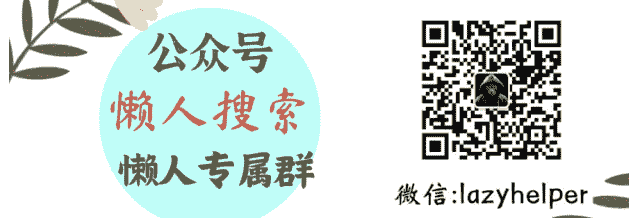
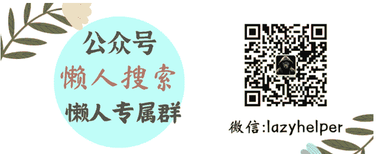

# 超级信号：向国学与中医要生命教育

250618《蔡钰·商业参考4》节选

整理：公众号懒人搜索，懒人专属群独享

懒人微信：lazyhelper

这一讲，继续前面的内容。我们关注的第六个社会变化是，为了提升心理能量，中青代，尤其是年轻人，开始把中国传统哲学和传统医学当作生命课题，来进行自我教育。

## 表层疗愈

上一讲我们说，人们意识到了自身生命力在低能级徘徊，需要借助来自外界的能量注入，才有望对冲熵增、向上提档。如果你身在组织团队中、或者是创业者，那么已经有商学院和投资机构在设法给你提供帮助了。

那么，需求侧的C端人群怎么办呢？过去几年，尝试回应心理能量不足的产品和服务不是没有，跳海酒馆运营的年轻人社群、朋友圈里打广告的冥想课、寺庙法物流通处的香灰手串、超级猩猩里的蹦跳流汗，包括小红书评论里的“姐妹抱抱”，确实也能阶段性地让人忘忧开怀。

2023年以来，全体民众对身体和心灵的疗愈需求大涨。这事你知道，供给端也知道。在过去两年里，《商业参考》已经陪你关注过公园晒背、打八段锦金刚功、烧香祈福抢手串、到中医院刷医保按摩等等消费趋势。这股强烈的需求还给瓶装饮料市场打开了一个新赛道，让人们喝起了人参咖啡、祛湿奶茶，也让饮料公司元气森林在气泡水、电解质水之外，又摸索出了第三个10亿大单品——中式养生水。

2023年底，美团平台上有关疗愈话题的搜索量同比增长256%，2024年继续增长280%。抖音上有关疗愈的话题累计播放量也超过了37亿次。按照《中国城镇居民心理健康白皮书》的统计，73.6%的城镇居民处于心理亚健康状态，16.1%存在不同程度的心理问题。全中国有超过8.3亿人对疗愈有需求。

中国美业，也已经把疗愈SPA当作新的黄金风口。《江苏经济报》说，每个月平均有1000多个新供给上线美团，其中“疗愈+SPA”供给占比达70%以上。

但这些产品和服务，大多只是让人暂时忘记烦恼或缓解忧愁，并没有真的帮人正视痛苦、彻底解忧。

供给端跟进效率不足。怎么办？不少有悟性的年轻人，开始寻求深度自救。

### 追问疗愈背后的哲学原理

前面提到的疗愈风潮，在进入 2024 年后又发生了新变化。有一批年轻人，要么觉得表层的疗愈不够解渴，要么感受到抚慰以后产生好奇，开始往深处走，尝试追问疗愈背后的哲学原理、用自己受过的知识训练来审视它——比如“养生到底是在养什么东西”“放下执着是不是利大于弊”——进而判断它禁不禁得起检验、值不值得基于它来重建自己的信念系统。

我给你介绍几本年轻人当中的畅销书吧。

- 王德峰的《寻觅意义》，2022 年出版的，2 年多来累计销量 16.9 万册。王德峰教授退休前是复旦大学哲学学院教授，是互联网上知名的哲学王子，我们在《情绪价值 30 讲》里也介绍过他。他的这本《寻觅意义》，是他的一些演讲合集，探讨的是中西方哲学、文化、艺术与生命的关系。2024 年，创业领域气场低迷，但培训行业的朋友告诉我，唯独王德峰的哲学研修课，在企业家和创业者当中“卖得上价、还抢不着”。要知道，在传统出版业没落的今天，一本书销量能过 2 万册，就已经是妥妥的畅销书了。而《寻觅意义》这本书，还是在得到、微信读书等等主流平台有电子版的情况下，轻松卖出了近 17 万册，可见它切中了多大一个时代命题。
- 另一本书，李辛的《精神健康讲记》，2019 年出版的，5 年多来累计销量 16 万册。
- 第三本，李辛的《儿童健康讲记》，2015 年出版的，9 年多累计销量 40 万册。李辛是这两年在母婴人群和 95 后、00 后当中非常知名的一位网红中医教育者。我知道他是因为 2023 年以来，时不时听到年轻朋友说在上他的中医课，听到各种播客引用他的书中内容。前面提到的两本书，都是李辛写的中医科普读物。他这个系列还有一本最知名的书叫《经典中医启蒙》，开卷上没有数据，但按照我的观感，它的销量应该比前两本只高不低。
- 下一本，成庆的《人生解忧：佛学入门四十讲》，累计销量 2.1 万册。你别听着数字比前几本小，它 2024 年底才出版的，达到 2 万册只花了 4 个月。成庆是上海大学历史系副教授，研究方向就是中国近代佛教思想史和明清禅宗史。近几年他在大学课堂里开的佛学通识课，越来越有人气；这让内容平台看理想找到了他，请他做了一门同题材线上课，发现在公众市场也卖得很好；于是 2024 年，他把这门佛学通识课程的内容做成了书。

中国出版业有个行业数据平台叫“开卷智能选书平台”。这些数据，是我请图书行业的编辑朋友帮我查到的。编辑朋友一边惊叹这几本书的销量，一边告诉我，开卷对全国图书的统计并不完全，所以王德峰和成庆的书，实际销量可能是开卷数据的1.2倍；而李辛的两本书因为出得早，实际销量可能是开卷数据的1.5倍。

这几本书为什么走红？如果你有兴趣翻翻这几本书会发现，它们做的其实都是“翻译”工作，都是用当代视角、当代话语体系，来把原本传统哲学和中医里神秘又艰涩的信息解释给大众听。它们不是鸡汤式的“你有病我有药”，而是要求读者沉下心来，用它们的视角重新理解世界的运行、理解自己与世界的关系。

这说明什么？我的理解是，在通过上香和养生寻求疗愈的人群当中，有相当比重的民众已经不再满足简单获得心理安慰，而是开始往中度和深度玩家的方向进阶，渴望在知识和理性层面获得解释，来建构一套新的框架，来理解自己跟世界的关系、自己的存在意义，从而缓解痛苦、破除迷茫。

就在我写完这一讲后没两天，得到的《积极心理学》课程的老师赵昱鲲博士，也出版了一本新书叫《中国心法》，是把中国的儒释道和西方引入的积极心理学结合起来，尝试破解当代人的心理困境。

前几年，你可能听过一位叫柳智宇的少年天才，他因为国际奥数金牌被保送北大数学系，在北大读书期间又拿到了麻省理工的全额奖学金，但却放弃学业，选择了出家，在龙泉寺承担佛经校勘的工作。12 年后的 2022 年，柳智宇又决定还俗，开始投身心理咨询行业。

柳智宇的思路，也是中西方文化结合，把佛学里的“放下执念”与现代心理学里的“认知重构”结合起来，建构本土化的心理干预模型，来帮普通受众和高压力行业人群疏解心结。

在这几个案例之外，你这两年肯定也听过或经历过重新思考人生的例子，欢迎你在留言区替我们补充。

## 总结

过去四讲，我们关注了过去几年社会与市场上的六种变化：

人们的消费偏好从人情经济转向了交情经济；人们的消费偏好从“景观”向“事件”扩容；女性人群通过消费文娱产品来体验高质量、高浓度的情感关系；性别议题扰动了供需。在男性的反弹下，市场开始降低女性主义消费权重；在组织管理领域，创业者和团队都开始补充“心理能量”；在 C 端，这些变化，跟前几个模块里我们讨论过的“阵营消费”类似，都是在回答我们的需求端怎么了。我们关注到的变化其实都指向了两件事：人们想要身心回血，人们想要找到意义。这两大需求，我相信你多少也有。它们正好分别对应了系统的基本目标和根本目标。

在供给端跟上之前，我们怎么回应自己的这两类需求呢？我们先短平快地给一些方案。下一讲，我们来看看可以怎么把消费当作工具和配角来短暂救急，帮我们补充情绪资源和心理能量。

懒人专属群持续更新中，已持续运营6年，整理超3000份各类精选付费文章&年费社群干货，全部开放下载。

本资料为付费群内部分享，仅供真实有需要的朋友查阅

## 懒人专属群更新记录：

https://lazybook.fun/#/blog/record2