# 大盘分析 5：新周期，新主力，大逻辑

## 250618 安民

整理：公众号懒人搜索，懒人专属群独享
懒人微信：lazyhelper

盘整时间长并不构成否定牛市的本质性理由。别跟国家队作对。

## 1. 否定熊市的 5 个证据

有博友怀疑目前仍然是熊市，提出的理由：去年 10 月 8 日以来，一波比一波低，跌了这么久，因此像是熊市。我们谈 5 个技术性的证据和总体观点。

核心原因在于现在处于新周期。看大盘周 K 线图盘整的时间：

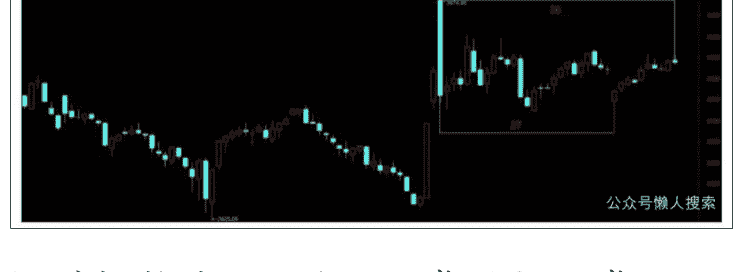

1 时间长达 27 周，正常吗？正常。

请记住它们，27 周和 36 周。

为啥讲这个盘整正常？给几个证据，历史上现成的证据。为什么我们经常讲要大家回看股指的历史走势，不是没有原因的。

（声明：本文只为开拓视野、引导思路，并非择时，亦非荐股。股市有风险，入市需谨慎。本文不构成投资建议或意见，我们无力为大家的投资负责，请大家注意投资风险）

第一，2019 年的大盘整，比现在长得多。

高点 4 月 8 日见到，调整的低点是 2020 年 3 月 19 日，7 月 6 日才突破头年 4 月 8 日的高点。之所以走成这样，是周期的因素。那里调整的时间是 49 周，如果加上后来的盘整时间，超过 63 周。49+14=63 周，第 64 周的周一周二还没有发力。

那时间比现在长。现在只有 36 周。如果按照 2019 年那波调整的节奏，见底还要 13 周。只是我们不持这个观点，权当备选。

那样的话，见底时间就到 9 月 12 日那周。判断这个时间太长了，跟 4 月上来的节奏不相匹配。原因我们后面再讲。

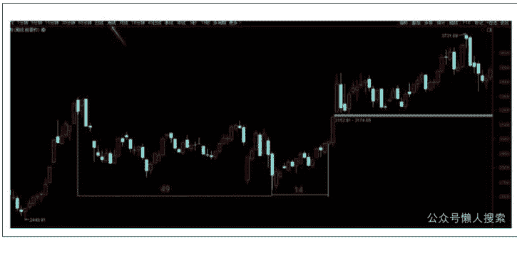

第二，再看远一点，2013 年 9 月，大盘从 6 月的 1849 点反弹到 9 月中旬的 2270 点，随后调整到次年的 3 月中旬，再横盘震荡筑底到 7 月下旬，才展开一波牛市。这期间调整了 27 周，加上底部振荡盘整，有 10 个多月，至少有 45 周。

因为后面即使行情起来，也是周四才由长江证券涨停发动。7 月下旬前 3 天大盘并没有啥动静，还在盘整之中。很多博友当年读过我讲那波行情长江证券的文章，新浪博客上还有。

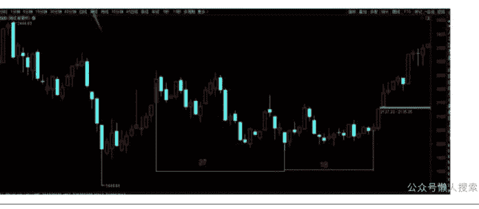

这样的例子，历史上并不少见。所以，多点耐心吧。

如果模仿这段走势呢？因为 27 周的周期在 10 月 8 日以来的调整中已经重复出现，是第二次出现。如果再复制后面的周期，就盘底到 8 月 15 日那周。之后行情就起来，向上突破。

所以这里就是到底模仿 2014 年夏天的周期，还是模仿 2020 年夏天的周期。区别在这里。当然，大周期是 4 月的底。

第三，再举个例子，白银期货中的某一个品种。

2020 年 3 月最低 2863，8 月中旬最高 6946，涨的时间不长，21 周。其后调整到 2022 年 7 月中旬，调整时间是快两年，到 4026；时间总共 100 周。其后一路涨到 2024 年 5 月下旬的 8725，然后再出现一个超过一年的大盘整带。

但其间两年的调整，并不影响白银处在牛市；后面超过一年的盘整，也一样。近期再度突破。

第四，黄金期货历史上曾出现过 109 周的盘整走势。但即使是那两年的多盘整，黄金仍然处在牛市中。所以盘整时间久并不构成在不在牛市的根本理由。当然，量变质量，太久也不成。就是我们看问题，要抓住事物的本质，不能在非本质的问题上过多纠缠，否则我们的思路永远是混乱的，永远看不清行情。

就是抓住本质，不在局部纠结，而从全局上进行把握。

第五，目前的走势，既有去年 10 月 8 日以来这段调整的走势，且调整已经进行了 36 周，但目前有两个要点需要后来的走势证明。

一是 3040 点并没有破，如果要破，走 49 周周期，那也得先破掉 3040 点。

二是比 10 月以来调整的更大的走势，是 2635 点以来的大双底的走势，大双底一波比一波高。如果再走熊市，2689 点甚至 2635 点就不可能保住。那才叫熊市。那样就跟主力不相符合。

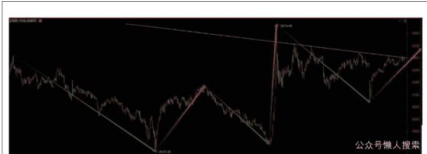

大家只要看看右边的 5 个高点连线就成。看看去年 11 月 8 日、12 月 10 日，今年 3 月 19 日、5 月 14 日和 6 月中旬的走势，它们几乎在一条直线上。这条线向上突破了就是支撑，没突破是压力。

这里即使上去了，3417 点以上，3500 点上面压力也不小。除非启动券商，否则冲上去还会再下来蓄势。

这里的底部是突破后线上回落盘底还是线下回落盘底的差别。

需要说明的是，上图中，我们把 3674 点到 3040 点画成了绿线，是说它们向下的一笔已经走完。后面应该运行向上的周期。但毕竟还有 49+14=63 周的周期需要检验。真的到 49 周过去了，3040 点还没有跌破，那个时候就能 100% 确认 27 周的周期有效。

## 2. 新周期，为什么不可能跌破2689点甚至3040点

### (1) 大盘运行在新周期，这是现象，也是根本性的现象

前面我们把 3674 点到 3040 点划了绿色，表明在我们心中，这里的盘整向下的一笔已经结束，为期 27 周，我们把它等同于 2013 年的 2270 点到 1974 点的调整，也是 27 周。后面即使调整 49 周，跟 2019 年到 2020 年春天的调整时间一样，即使跌破 3040 点，也不能证明指数在熊市。要在熊市，那就必然要跌破 2689 点，也必然跌破 2635 点。而在我们看来，这事 100% 不会发生。

为啥？

因为大盘处在新的上升周期（图上数字标到一半就截下了图，就又得重弄。这图好不容易弄成了，但缺上周周K线1根，不影响判断。望谅）。

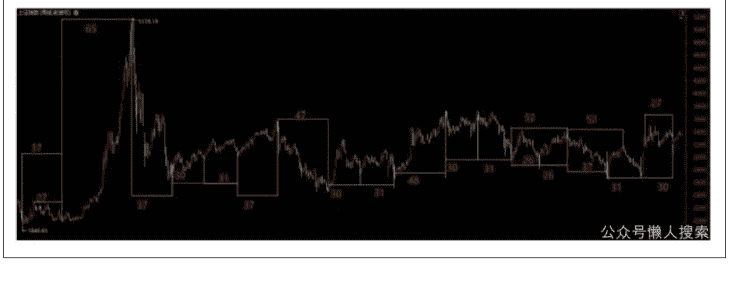

讲下旧周期。2016 年 2 月 29 日的低点以后，上升周期是 30+31，再配一个 37 周。2016 年 2 月 29 日的低点，上证 50、沪深 300 和创业板指都创了新低。这是一个 98 周的周期，如果加上 1 月 27 日 2638 点之后的 4 周，就是 102 周的反弹周期。

其后接一个 47 周下跌周期。

再接一个牛市周期，是 30+31+48=109 周周期，算上起始的一周就是 110 周周期。

其后是调整，周期是 30+31+52 (26+26)+37=150 周。算上 3731 点那一周和去年 2 月 5 日拖后的那周就是 152 周周期。

然后就进入了新周期，出现一个 31+30，加上近已运行的 9 周，是 70 周（也可算到下周）。这个时间长度根本就不够，牛市不只运行这么长（3731 到 2022 年 7 月 3424 点也是 70 周）。

为啥判断 3040 点调整的 27 周期结束，因为它是 30 周周期的一部分（31+30），这在前面出现过 3 次，这次是第 4 次。

也即 30+31 已经稳定地出现了，因此我们不能否定这个周期的有效性。既然它已经出现，而且是低点到低点的周期，那么后面运行的就是上升周期。这个上升周期还没有完，而且后面运行的时间不会太短。当然，它近期也有一些比较有意思的周期。

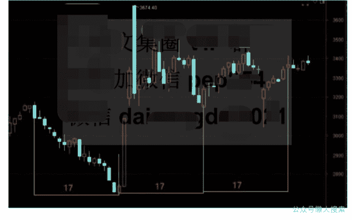

这里出现了一个 17+17+17=51 周的周期，而在前面，有两个 52 周的周期一连出现了。这相当于连续的第三个。好在 5 月 14 日的高点 3417 点它应该不是特别明显的大级别的点。

此外，我们之所以觉得这里不会运行 49 周的调整周期，是因为在 2019 年的 49 周周期，是这样的：

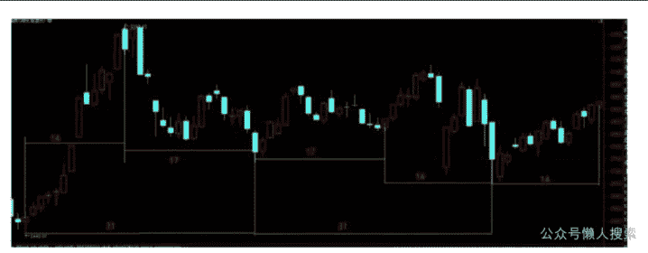

从左边第一根算起，就是 31+31；前面是连续算，左边黄色竖线的那根算进前面的周期，就是 30+31，这是差别。

前 31 由 14+17 构成，后一个 31 由 17+14 构成。最后一个 14，是见底后向上缓升，但还没有急升的状态。急升是在上图最后那根周 K 线的下一周周三才出现。

17+17+14=49 周调整，且属于 31+31 周期的一部分。

而 2024 年 2 月 5 日到 9 月 13 日，已经出现过一个 31 周，从 9 月 18 日那周到 4 月 7 日那周，是 30 周，表明 30+31 或 31+31，或者是 31+30 的周期有效。此时从 10 月 8 日开始的 27 周调整已经结束，如再调整 22 周，就拖到 31+30 周期之外。故而应该不会走 2019 年至 2020 年的 49 周调整；如果走那个周期，则因为本次从去年 9 月 18 日开始的周期，上升时间只有 3 周，再走 49 周调整，则要到 9 月 12 日那周结束，重走 52 周期（3+49）。

这个尽管跟前两个 52 比较合拍，但跟 31+30 不合拍。且第 2 个 52 周周期于去年 5 月 3174 点结束，第三个 52 周若从 2689 点开始，中间隔 17 周。感觉走势怪得很，不和谐。

所以，目前的周期主要是模仿 2013 年的 27 周期之后，来个 18 周期，这个 18 周期最坏的结果是盘底，线上盘还是线下盘。

### (2) 压力线

这是去年 10 月 8 日以来大盘向下的斜线，压力线 1、压力线 2、压力线 3、压力线 4；前三条，每次突破，但做小级别顶，下来后跌破，做小级别的底。第三条暂时还没有跌破太多。然后第四条线，明显的是 5 个高点的连线。如果我们前面周期的判断 27+18 是对的，那么大盘将在今年 8 月 22 日那周完成筑底并向上拉升，当然，也可以提前一周。盘底的最后一周的正日子是 8 月 15 日那周，前后一周都是周 K 线的时间窗。这可以说是第一选择吧。

注意，这里说的是盘底，从指数形态来看，见底后它完全可以略微倾斜向下面给出这条压力线在后面每天的点位，到 9 月 30 日止。

突破前是压力，突破后是支撑。

根据趋势线有效无效的判断，取点越多越是有效。这次的压力线 4，取点是比较多的。故而判断有效。下表是它后面每天的点位，突破之后是支撑，盘也在它上面盘，只许略破。

| 时间 | 压力线 | 时间 | 压力线 | 时间 | 压力线 |
|---|---|---|---|---|---|
| 6月16日 | 3400.63 | 7月22日 | 3380.91 | 8月27日 | 3361.20 |
| 6月17日 | 3399.87 | 7月23日 | 3380.15 | 8月28日 | 3360.44 |
| 6月18日 | 3399.11 | 7月24日 | 3379.40 | 8月29日 | 3359.68 |
| 6月19日 | 3398.35 | 7月25日 | 3378.64 | 9月1日 | 3358.92 |
| 6月20日 | 3397.59 | 7月28日 | 3377.88 | 9月2日 | 3358.16 |
| 6月23日 | 3396.84 | 7月29日 | 3377.12 | 9月3日 | 3357.41 |
| 6月24日 | 3396.08 | 7月30日 | 3376.36 | 9月4日 | 3356.65 |
| 6月25日 | 3395.32 | 7月31日 | 3375.60 | 9月5日 | 3355.89 |
| 6月26日 | 3394.56 | 8月1日 | 3374.85 | 9月8日 | 3355.13 |
| 6月27日 | 3393.80 | 8月4日 | 3374.09 | 9月9日 | 3354.37 |
| 6月30日 | 3393.05 | 8月5日 | 3373.33 | 9月10日 | 3353.61 |
| 7月1日 | 3392.29 | 8月6日 | 3372.57 | 9月11日 | 3352.86 |
| 7月2日 | 3391.53 | 8月7日 | 3371.81 | 9月12日 | 3352.10 |
| 7月3日 | 3390.77 | 8月8日 | 3371.06 | 9月15日 | 3351.34 |
| 7月4日 | 3390.01 | 8月11日 | 3370.30 | 9月16日 | 3350.58 |
| 7月7日 | 3389.25 | 8月12日 | 3369.54 | 9月17日 | 3349.82 |
| 7月8日 | 3388.50 | 8月13日 | 3368.78 | 9月18日 | 3349.06 |
| 7月9日 | 3387.74 | 8月14日 | 3368.02 | 9月19日 | 3348.31 |
| 7月10日 | 3386.98 | 8月15日 | 3367.26 | 9月22日 | 3347.55 |
| 7月11日 | 3386.22 | 8月18日 | 3366.51 | 9月23日 | 3346.79 |
| 7月14日 | 3385.46 | 8月19日 | 3365.75 | 9月24日 | 3346.03 |
| 7月15日 | 3384.70 | 8月20日 | 3364.99 | 9月25日 | 3345.27 |
| 7月16日 | 3383.95 | 8月21日 | 3364.23 | 9月26日 | 3344.52 |
| 7月17日 | 3383.19 | 8月22日 | 3363.47 | 9月29日 | 3343.76 |
| 7月18日 | 3382.43 | 8月25日 | 3362.71 | 9月30日 | 3343.00 |
| 7月21日 | 3381.67 | 8月26日 | 3361.96 |  |  |

当然，大盘还有个 3439 点、3494 点和 3509 点的压力，备选方案是突破这条压力线，构筑头肩底，在线上盘底。从形态的构筑来看，它在下面盘底可能性更大，是第一选择，好调整指标。一旦盘完底，就是对 3674 点的突破。

### (3) 新周期的主力资金

这点，需要复述一下 4 年前我们有关中美博弈的思路和观点。

2024 年，摩根士丹利看 A 股到 2398 点，2025 年到 2000 点以下。为什么要提这个观点呢？如果大家长期读我们的文章，应该知道我们在微博上的一个观点，是 2021 年 3 月 30 日提出来的。即美股和 A 股的剪刀差，当时讲，对美国最有利的情况是，未来美股在高位还向上，A 股在低位还向下，最终形成剪刀差，吸引中国资金流进美股高位接盘，美国金融资本进入 A 股抄大底。这个我们就不截图了，大家都熟悉的。

2023 年 7 月下旬政治局会议首提金融强国后，摩根士丹利建议做空港股，还被称为业界良心。几个月后，我们团队提出了自己的建议，叫做截和，就是不等指数达到摩根士丹利希望的点位，国家队先进场。这个大家也都熟悉。

所以 2024 年就没有见到 2398 点，2025 年更没有见到 2000 点。国际金融资本的希望落空。2024 年 9 月 5 日网传索罗斯的弟子中国某证券首席经济学家说中国资产低了可以再低，低不意味着不能再跌，他讲自己做投资，让儿子留学日本，嘱学好日语，娶个昭和日本贵族女人，解决几辈子财富问题；我们团队 9 月 12 日的文章是《上马击狂胡，下马诵诗书》，讲要跟国际金融资本拼了。然后没隔太久，国际金融资本要求对中国资产进行超配，态度出现 180 度大转向。

所以 2024 年整个大局上我们没有大问题。10 月 8 日以来的小调整节奏上，还是出了点问题，主要是这个调整是一个非常复杂的调整，纸条讲，不少短线行家也错了不少。而短线恰恰是我们的弱项。

现在我们要判断的，是 4 月 7 日的拐点是否成立。这里还有一个证据，000016 上证 50，第一个图是调整的通道。如下：

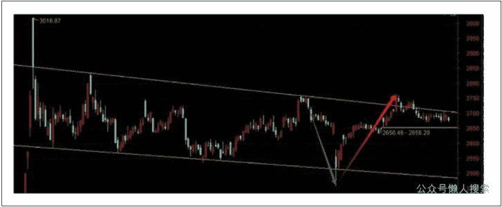

注意图上的两个箭头。我们再看第二个图：

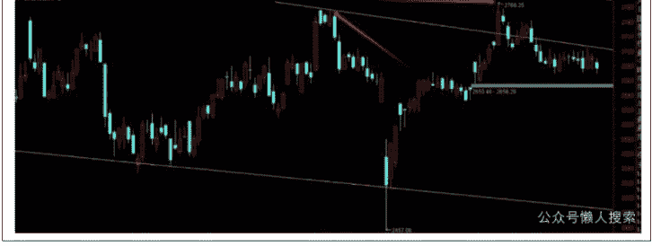

注意两个箭头的差别，创新高。创新高，意味着上证 50 指数从去年 10 月 8 日以来的调整结束。这跟我们前面判断的大的新周期 31+30 是吻合的，小的新周期 27 周也吻合，30 结束，27 也结束。而且这个 31+31，我们去年秋天多篇文章早就讲到了。

再看 880008，也创了新高，表明 4 月低点周期有效。

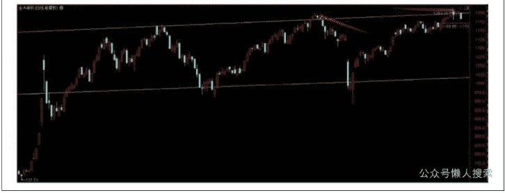

从指标来看，这里若出现短线调整，就很正常。只是不会破 4 月的低点。

而新周期最大的主力资金是中央汇金，是两市第一主力。注意我们这里不提游资，不提北向资金，因为他们不会是绝对主力。后面讲券商还会讲到为什么是新主力。

去年 1 月 18 日以来，汇金一直在明显地做多，而且每次做多，都通过上证 50 指数、沪深 300 指数、中证 500 指数和中证 1000 指数的 ETF 做多，还让全网都知道。网上也有分析。4 月 7 日若不是汇金坚决做多，这行情还不知道到哪里去了。他们去年大致进去了 10500 亿的资金，今年 4 月份进去了 3600 亿到 3700 亿。我们讲 4 月份调整结束，进入新周期，就是这个原因。

汇金不会把自己 14000 多亿的资金套住，他们没有那么傻。

因此，看看近期各种报道是啥？就是各方面的资金进场。

其次是险资。

关于险资举牌上市公司，还有成立私募基金的报道，多了去。我们 6 月 6 日的文章就讲了险资成立私募，但没有讲原因。

两点：一是中国改革开放 47 年创造了天量的财富，相当一部分集中在富人手上，那些富人一两个点的收益看不中，但三四个点的收益对他们来讲很香。

比如如果你有 10 亿，或 50 亿。10 亿，一年 4 个点就是 4000 万，抵一家中型制造业公司一年的利润，50 亿一年 3 个点就是 1.5 亿，全部 A 股上市公司中，有 3408 家上市公司一年都挣不到这么多净利润。所以，他们要求有三到四个点的稳定回报，以前靠这个做理财。

二是，险资有不少资金都是在利率成本高的时候吸收进来的，比如三到四个点，合同早就签了。故而这些资金在利率低的时候，就必然要寻找高回报资产，不然他们无法覆盖以前的资金成本，那公司就只能完蛋。

看看现在的国债收益率才多少？10 年期国债目前是 1.7023%，收益率无法覆盖险资以前的成本。

3 个点的资金成本，每年至少要有 5 个点的收益，基本上相当于银行借贷利率差。4 个点的成本，要 6 个点的收益。所以，险资是不得不搞私募，搞得好要搞，搞不好也要搞。同时，因为他们有大量的浮存金，请得起好的研发团队，收益回报也不是特别高，因此大家也不用担心险资会没有收益。不会的。

再次就是社保，第三大主力。社保资金要加大进场力度。这是我们的保命钱，进来也要回报。

下面的报道，信息的含金量很高。

社保资金修订管理办法，其实就是要趁股指在低位的时候进场更多的钱，拿到更多的便宜筹码，壮大社保的实力。现在社保要养那么多人，资金压力一直都在，而且前些年进股市的社保资金，运作效果都不错。

如今是低利率时代，他们要抢更多的高收益资产。他们这个位置进来都不怕，您怕个啥？

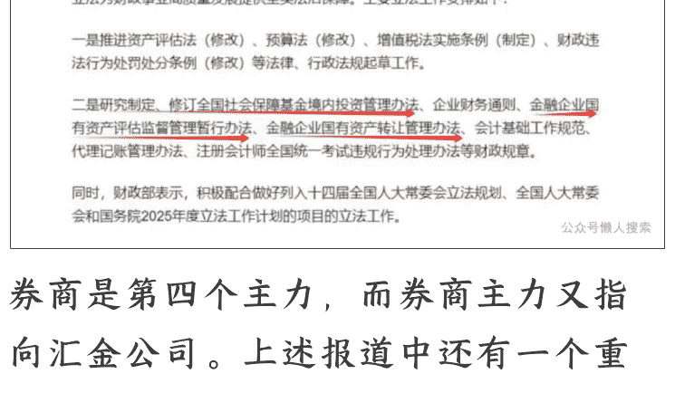

券商是第四个主力，而券商主力又指向汇金公司。上述报道中还有一个重要信息，就是金融行业特别是券商，大的并购合并将展开，当然，是在国资监管和转让这两部法律通过之后。为啥？2023年7月下旬政治局会议定调了，2035年要建成金融强国，后面只有10年时间。这其中的核心平台就是汇金。控股全国大银行，控股券商、公募基金和期货公司，新华保险第一大股东，还有可能再控股几家保险。所以券商的事还远没有结束。

上面的报道是6月6日中午的，下面是晚上的。

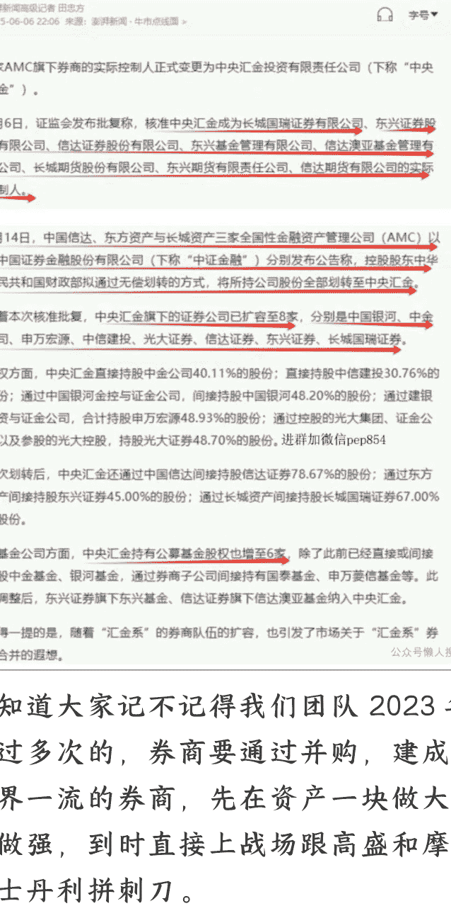

不知道大家记不记得我们团队 2023 年讲过多次的，券商要通过并购，建成世界一流的券商，先在资产一块做大再做强，到时直接上战场跟高盛和摩根士丹利拼刺刀。

然后看上周末的报道，从中可以得出三条有价值的信息：

- 汇金成为 8 家券商实控人。我们团队判断，汇金未来会组建中国国家级航母舰队，中信证券有可能不纳入进来，则会另找合作对象。上海已经走在前面了，北京会随后推进。
- 实控 6 家公募基金。
- 一些央企背景的期货公司基金公司和 4 大资产管理公司也汇入汇金旗下。

因此，汇金是未来中国整合各大金融机构的平台。后两点也很重要，今天不多谈。

需要强调的是，中信建投的大股东原本是北京金控，中央汇金是二股东。北京金控是北京市政府出资设立的国有金控平台，主要负责整合北京市的金融资源，提供包括银行、信托、投行证券、资管、保险及基金等多种金融服务。这次中央汇金一出手就拿下中信建投，说拿就拿。汇金不犹豫，北京也不犹豫，可见不一般。原因在于国家队的战略价值和战略布局。

从这里可以看出，北京市是坚决支持中央整合券商的。中信证券是中信集团旗下的，中信集团属于国务院管理的正部级企业集团，下面还有中信银行等，这次中信证券不在名单中，表明中信证券暂时不在汇金整合的范围，未来进不进来不清楚。有可能是中信证券自己找整合的对象，那他会找谁？

另外光大证券是光大集团的，光大集团是国务院管理的副部级企业，下面还有光大银行。现在光大证券也划归汇金，所以可以看到中央整合金融系统的决心之大。

这 8 家券商也很明显，四大一中三小。其中长城国瑞原属于厦门，后来被长城资产拿下，现在已经纳入汇金帐下。所以基本上是明牌。汇金作为最大的主力，他的核心部分券商还在整合中，因此，从长远看，可以说行情还没有怎么开始，未来的券商也不会再是原来的券商，券商这个新主力，现在还没有完全武装好。

第五大主力是地方国企。关于去年 10 月份和 11 月份，我们都有文章讲得很清楚了，他们是这波牛市行情的主力。

想清楚这五大主力，只要明白他们不是进来亏钱的，明白了这个，就知道他们是真正的耐心资本，行情也会很有耐心，您急也没有用。跌多了，您寻机进就是了。然后外国金融资本正是看清楚了这五大主力进场的现实，他们才一起讲要对中国资产进行超配。能明白吗？

知道这五大主力，就知道目前的大盘走势，只是复杂，并不影响它处在牛市。同时，正因为复杂，导致短线走势不太容易判断，但大的周期相对稳定。

像 4 月的低点周期，我们去年就讲了多次，4 月 18 日那周是低点周期的正日子。当然，低点周期左偏移一周右偏移一周都很正常。像 2024 年 2 月 5 日的低点，正日子是 2 月 2 日那周，周线上是右偏移一周。9月18日的低点，正日子是9月13日那周，周线上是右偏移一周。然后4月份的低点，周线上是左偏移一周。31周的正日子，结果因为关税大战和国家队进场，左偏移一周。

## 3. 大牛市，大逻辑

讲下大牛市的内在逻辑，以便增强信心。

### （1）中国的历史周期逻辑，这是最大也是最长远的逻辑

百年未有之大变局，所包含的东升西降的大趋势，对那些只看到眼前困难的人来讲，他们是看不到这个大趋势的。中国共产党定义的百年未有之大变局，就是中华民族的伟大复兴。当然，这个伟大复兴不是一年两年就能完成，但是对我们这些具有极强战略眼光的投资人来说，中华民族的伟大复兴需要一个定位准确的坐标系。

我们将那个坐标系放到哪里呢？如何评价中华民族的超级大熊市与超级大牛市呢？为什么2025年是这个中华民族超级大牛市的关键之年呢？可以回头再看看《大盘分析4：中华民族将以一场巨型牛市作为进入百年盛世的一个标志性事件》。这篇文章，当这个牛市走完，回头看，您才会看到它的价值，正如现在回头看去年2月1日的文章一样，也如现在看2021年3月30日的文章一样。

我们是在一个历史大周期的坐标系里评价中华民族的诸多关键性事件，并最终抓住问题的本质，然后揭示2025年作为中华民族超级大牛市关键之年的底层逻辑和核心逻辑。这篇文章的着眼点是超长周期，以战争决定国运的超长周期，来谈中国经济和股市超长周期的牛市逻辑。

### （2）《对话安民 Anmin0001（一）：投资大时代，不要放过那种改变您一生命运的大机会》

讲的是什么逻辑？全球利率周期，利率变化对风险市场的巨大影响，现在这些影响正在显现，比如保险成立私募的两个逻辑前面讲了。这个影响还远没有显现出来。因为银行的160万亿百姓存款还没怎么动，4月份数据只略有下降。

注意，我们2024年1月1日判断，未来一年期存款利率会降到1%以下，甚至不排除到0.5%左右。现在1%以下已经成为了现实，这个影响会逐步显现。

还有，一旦对企业和机构的大额存单利率降下来了，就会影响到很多企业和机构的行为，比如当初提到的账上有1200多亿资金的某公司，今年一季度已经快有1400亿了。这些资金要么投资，要么分红。所以，上市公司的行为也会面临较大的变化，市场对场外资金的吸引力会增强。去年2月1日的文章将这个低点具体化了，且指明了低点的大底性质，讲要砸锅卖铁对吧。

### （3）《对话安民 Anmin0001（三）：家庭资产将现革命式变化，现在是中国社会财富承载方式大变局的临界点》

这篇文章是讲中国社会财富承载方式从房子到股权的革命性变化。包括这个市场的主力，我们是怎么看到的，证据在哪里。还可以跟去年11月1日的文章结合起来看，看看这个市场有哪些主力，他们是怎样神龙见首不见尾（6月6日的文章）的。

### （4）《对话安民 Anmin0001（7）：4月时间窗的选择决定今年投资业绩》

讲的就是牛市三段论，怎样的三段。我们前面讲得很清楚了，牛市分成三段，现在还在第一段。

在这些逻辑中，可以抓一个核心逻辑，本轮牛市的主力资金是谁？国家队和国资系列资金。想清楚了这点，就大可以放心，只要股票不错，完全可以不用管市场的波动。但是有短线技术的，也可以借波动的机会操作一到两个月周期的短线。市场主力资金是谁？看清楚了主力，长线和短线该如何操作，心中就有底。

国家队到4月底大致进场了1.4万亿。上述五路主力是一个很大的团队，是集团军。他们会把自己埋在里头吗？不会。谁那么傻呀。如果那么傻，还能掌控这么大个国家的政权吗？

想想解放初上海两白一黑狙击战，那个时候那么穷还赢了呢？现在国家有的是办法。

把这些想清楚了，就该知道两个结论：一是牛市。二是现在还处在牛市第一阶段，第一段不是单边牛市，因为喊了几年慢牛，这年把两年强调耐心资本，故而国家队总体上的态度是不急不慢，他们也要给其他国资低位拿筹码的机会。而要想社会上各方面的资金涌进来，还需要时间。

但是，总有一天，总会有人不顾一切地要杀进来，拦都拦不住，就跟2020年到2021年的房地产一样。而那个时候，我们该考虑退场了。

想想房地产，2021年，万科还在高价拿地，而且一拿1851亿。共计148个项目。这还是行业老大，2018年高喊要活下去。而2020年夏天我们写地产商脖子上套着的四道绳索，第一道就是高价拿的地，还有天量债务，高利率和汇率，以及市场需求突然就没有了。万科现在正被这些压得喘不过气来。

想想看吧，真的到牛市顶部了，很多人都会昏头的。一定有资金背着麻袋往里冲的，劝也劝不住，挡也挡不住。你挡他，他认为你耽误他发财了。而去年2月1日的文章，包括今年 5 月 21 日的文章，大家都是很不感兴趣的。去年 2 月 1 日的砸锅卖铁买股票，那个月阅读的人不到 500，现在也才 900 多。说明有 500 多人都是涨起来后才去看的。为啥？真的底部，他们根本就不信。真的顶部，他们一样不信，全是反着来。

别看我们现在这样讲，真的到了那个时候，他们还会和万科一样去拼命加仓做多，而我们到那时则要选择离场了。

因为这就是人性，而人性亘古不变。

## 4. 不要跟国家队作对

过去讲炒股要听党的话，是有深刻的道理的。

6 月 6 日我们的文章讲神龙见首不见尾，今天这里讲了国家队三次很明显的入场，17 个月，才现身 3 次，对我们这些在市场上摸爬滚打了 30 多年的老投资人来讲，一次就足够了。如果再不明白，回头看看我们当初给国家的建议，截和。回头看去年到今年的整个策略，就是如此。

看看当初有多少家外国机构如何判断中概股和港股的，现在有多少家要超配的？

忘记眼前市场的涨跌，把眼光放长远点。不融资，坚持优质股票，对中线投资来讲，未来有 3 个点才值得下大精力研究的：

- 第一段结束点，离场点；
- 第二段结束的点，进场点；
- 第三段结束的点。那是个逃亡的点，算总账的点。

而会做短线的，以一到两个月为度，做短线的波动，节奏踩对了的话，收益也不错。

从短线来看，去年11月、12月，今年3月和5月高点构成的压力线，迟早会突破。我们估计时间会向后拖一拖，8月中旬是极限。当然，也许先突破也是种选择，但我们偏向往后拖一拖。原因嘛也简单，计算一下3672点以来大盘每次反弹的点位就清楚了。357点，267点，299点，377点。这次是最多的，而且开始阶段还是国家队进场了。

所以，这里如果休整休整，那也很正常。部队打了大仗，也要休整总结，休整好后再接着打，估计正常情况下，应该是这么一回事。

但要清楚的是，调整结束的时候，就是我们进场的时候。那这里会不会一直震荡盘整下去？不会。

为啥？深成指形态决定的。

深成指的大形态，上面的压力位距现在的点位远了，这里如果冲上去，是无法突破大形态的，相当于让普通人跑马拉松，跑完后再上华山，爬不上去。所以，牛市第一段它应该冲上去，但不突破大形态。

牛市第二段就是高位盘整带，那里它会盘，做个高位的盘整平台。那个比较高位的盘整带做扎实了，再突破月K线大形态就有效。而只有突破月K线大形态，深成指上涨的空间才能完全打开。

所以目前即使是牛市，但都没有打开上涨空间呢，所以别指望指数立马会像2007年或2015年那样涨。再急也没有用。路要一步步走，饭要一口口吃。该有涨破天的时候，一定会有。而且即使牛市第一段不会涨过大形态，可是幅度也不小。低点7683点，高点可以到大形态压力位，也可以不到。即使不到，涨的点位也不小。

那指数不动怎么办？等，保证大涨那天，自己一定在场。

去年冬天，武汉是暖冬，12月份珞狮路那么长一条路上的月季花还没落叶。当时觉得这完全反天了，感到世界不可思议。结果有一天再从那里过，一抬眼发现一片叶子都没有，说光就光了。去年冬天没怎么冷，今年春天的感觉就好像要差一些。然后4月中旬路过那里，发现月季花开得像癞痢头一样，稀稀拉拉的。可是过了十来天再路过那里，却发现花开得如潮涌一般，跟野火烧起来似地，太汹涌了。

就是我们总会怀疑大自然的节奏，但它的力量却总在。

牛市也一样。别融资，钱是闲钱，一时半会儿用不着就成。相信大势就成，相信时代的力量就成。因为时代会制造出财富的。

比如某汽车公司，2012 年股东净利润才 8000 多万，2019 年也才 16 个多亿，去年多少？400 多亿。这就是时代会创造财富，时间创造出的财富，这就是。

然后讲讲我们的判断方法，就是重逻辑，轻其他，重核心证据，轻其他证据。

比如国家队进场这样的证据，它就是核心证据。比如地方国资的行动，这也是核心证据。他们会贯穿大牛市的全部进程。这市场没有无缘无故的爱，也不会有无缘无故的恨，保险资金也不会无缘无故地进场整花活儿，他们既然那么热热闹闹地要进场，自然有他们进场的原因。

而这个原因，还在中央汇金。汇金的历史定位已经变了，不一样了。能明白吗？券商不一样，汇金也不一样了。

汇金是那么些银行、券商的股东，也在新华保险、中国平安、中国人寿有持股，甚至不排除有董事席位。这些大的金融机构，在大的方向上，自然比咱们普通人敏感。就是他们的信息是通的，上面有什么风吹草动，他们就知道。

那些信息现在变成了新闻，可是在圈子里，早已经不是了。

2023年夏天的会已经开了，很多人都忘记了那个会议的精神，这不成。

而普通人要做的是什么，在牛市，保证自己在场。特别是在大涨的时候，保证自己千万在场，然后在牛市的顶部退场。

如何在这轮牛市中有收获，要么真价值，要么真成长，要么真硬核。当然，的确有人做垃圾股发财了，但我们不做。因为在事关垃圾股的很多方面，我们没有任何优势。而我们一直关注成长股和科技股的研究，一直在跟着好公司和好行业走。前期我们讲到过，十五字真言足可以保证安全走过整个牛市，那就按照这个来做就是了。这是自己的财富实践，好好实践，看明白行情，提高自己的认知能力和操作能力，那才是根本。

其他都是浮云。

最后重复一遍，这篇文章，还有4月份牛市三段论的文章，当这个牛市走完，回头看，您才会看到它的价值，正如现在回头看去年2月1日的文章一样。5月份讲大牛市的文章，时间越长，回头看，价值越大。

( 声明： 本文只为开拓视野、引导思路，并非择时，亦非荐股。股市有风险，入市需谨慎。本文不构成投资建议或意见，我们无力为大家的投资负责，请大家注意投资风险 )

- 📖 懒人专属群持续更新中，已持续运营 6 年，整理超 3000 份各类精选付费文章 & 年费社群干货，全部开放下载。

本资料为付费群内部分享，仅供真实有需要的朋友查阅 🤐

## 懒人专属群更新记录：

https://lazybook.fun/#/blog/record2