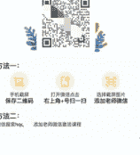

# 从0到1操盘知识付费项目4年两个亿，分享下我是如何做的

## 250618 生财精华

公众号懒人搜索，懒人专属群

大家好，我是阿星，在广州，干了9年的知识付费，干过K12，幼儿教育。目前是一家职业教育头部机构的业务负责人，负责职业技能培训的板块业务。从0到1操盘了一个技能项目，4年做了两个亿的营收，目前业务还在继续。第一次写文章和大家分享，主要讲下我们是怎么从0到1起盘项目的，和怎么将营收放大100倍。真诚的希望能给圈友带来一些启发和收获（其实也源于和新圈友的打赌，不输出就要输钱hh）。总之，越分享越幸运。

## 一、项目背景

先跟大家说下项目背景，我们这个项目原本是to B的，在19年立项，做得是一个数据分析的课程。课程是很多节的录播课，从 Excel 到 python 到开发编程都有，非常的大而全，但 to B 转化并不好。那段时间最火的不是 AI，是 python，人人都应该学 python 的口号如日中天，做这个类目当时最火的机构是风变。于是我们开始转型去研究 to C 和进行测试。

## 二、从 0 到 1 起盘项目的核心分享

- 1、找对标很重要，对标的上下游藏有黄金
  当时为了研究风变，买了小课进群体验，体验完被社群转化的模型征服，记得还挺清晰，当时带班的是酱酱老师（短发动漫女孩头像）160 人左右的群，在第三天转化的时候群里接龙报名的人有三四十个，客单价接近 2000，当时是 20 年初，并不算低。给我的感觉非常震撼，大家伙都这么有钱，这么愿意为知识付费，to C 有很大的机会。

- 2、找对标之后第一件事，研究和拆解，为什么他们做得这么好？
  首先是产品，当时的课程的确新颖，应该是行业里面第一个互动式课程，而且内容收获感很足，每天的早晚分享内容也持续的告诉大家，未来是大数据时代，得学 Python，能更好的升职加薪。关键是转化，用的是低转高社群训练营的方式去批量转化，前端投放获客，9.9 的精准客资，利用社群给学员有较强群体归属感，销售也更容易营造学习氛围，利用社群服务增强用户对销售、品牌的信任度，最终完成转化。这确实是非常好的模式和产品，那我们是否就应该冲进去直接对标去干呢？

### 3、找到对标之后应该思考的第二个问题，我们要马上复刻去做吗？

我们首先去研究当时的市场和交付。学 python 的大部分还是各行各业顶尖的那批人，特别是互联网方向的人，整体市场打击面还是职场人的 10%；再说交付，虽然打得噱头是 0 基础学会 python，但深入了解去看，学 python 并不简单，毕竟是一门编程开发语言，还是需要下苦功夫去学习掌握的，离普罗大众还是有点远；另外我们当下去做这个品跟风变直接 pk 是没有任何竞争优势的，没有交互系统的沉淀，没有课程产品的沉淀。那是不是这个机会就放弃了？也不是的。我们思考 python 的上下游，上游是专业的编程、数据开发，打得点是就业方向，客单价 5k 到万元以上，当时也有比较大的巨头，达内、黑马，但这个市场空间也并不大，这个更垂，更技术；lazyhelper 转向看下游，下游是 Excel、Power BI，业务分析，找了一圈好像没有特别有实力的机构，比较多还是个人、工作室为主。我们发现 Excel 的打击面非常大，职场大部分办公室白领或多或少都需要接触 Excel 表格，而且表格这东西，你一旦不懂就挺花时间去找解法的，我相信这是我们的机会。找对标很重要，对标的上下游藏有黄金。将这些结论转化同步给老板后，我提出我们的数分课是不是也可以做 to C，就用社群低转高的模式，老板很 open，知道当时继续做 B 端效益也不大，试试看，成本不大。

- 4、确定打法和方向之后，接下来就是推进执行，考验的是找流量的能力
  于是自己快速的推动，策划大纲，跟老师对课，出产品详情页，写社群 SOP。最关键还是找流量，七拼八凑去职教考证的公众号拉来了 40 个初始用户。第一期，也没别的销售配合，咱就自己干吧，40 个学员好好维护，三天学习的完课还过半，但最后的结果是出了 2 单，客单价只有 1299，销转效果不好，单用户产值是 65，这产值上投放扩规模基本是亏的。
  所幸问了一些持续做作业的学员，学员还是愿意真诚的跟我聊。其中一个大哥，发了串语音跟我说，他是工地上的，课程很好，但他自己用不着。我人都傻了，想笑又有点气，你在工地上干活的，你都用不着还学这么认真，三天学习看课做作业一节不落，问前问后的，这么积极......当然这些话只敢心里说哈哈。但是从这个调研我知道了，还得找到合适的用户才行。想到了当时我们职教的经济师考试，经济师的用户也爱学习，且较多财务、行政、企事业单位的人员，这些人工作场景基本会涉及到 Excel 表格的制作。过了一周，死乞白赖的求来了 100 个左右经济师考试的学员，过程指标更好，周四当晚就出了 12 个单，单用户产值是 146，这下对了，兴奋的去老板那透露了下。老板和隔壁的同事露出表情我现在还记得：“哇靠，这还不赶紧上投放。”就到我们第二个阶段，如何放大了。现在回头复盘，所幸是找对了流量，才有了后面的故事，从0到1测品考验的是找流量的能力。

## 三、月营收10w到月1000w,我们是如何做增长的

一人模式跑通之后，迅速跟老板要销售要资源上投放，很快有了2个销售，给她们培训，带着她们跑了两期，利用当时橙子自建站投放加职教内部的流量，还是能跑通。第一个月打了 10w 的业绩，给我们的正反馈也很足，证明是可以的。接下来我的工作重点就调整到如何放大这个业务到 10 倍，100 倍。快速放大规模就两个手段，花更多的钱，上更多的人，但怎样效率才高？

### 1、更高成本的流量或许更便宜

最开始我们在抖音投 0 元表单，就是那种橙子建站，0 元写个电话号码留个手机号那种。这种投放一个号码 20 来块，很便宜，但实际加微的效率很低，需要销售打电话、发短信去做添加，且很耗时间，还有打电话拉黑、加微封号的风险；我们推进产研快速落地了跳转加微的路径，主要对标了当时的风变小课投 9.9 的 python 体验课的路径；我们设置了 8 元小课的链接，买课之后自动跳转加微。当时算是新类目，一个转化的成本是 55 元，现在回头看太香了，8 元的小课客资，单个的成本 55 块，呜呜呜。直接看投放成本的话，55 比 20 贵了一倍多，为啥要选择这种 8 元小课的方式？原因是我们要看的是加到私域的成本，一个客户实打实加到微信多少钱。
方式 1：一个号码 20 块，加微率 30%，单私域成本=20/30%=66.7
方式2：一个号码是55，学员主动加微率是70%，加上销售及时的手动添加，最终添加率能到90%，单私域成本=55/90%=61
方式2更便宜一些，但更重要的是销售效率和线索质量不是一个档次：
其一，学员主动加我们的就有70%，按一个销售一期接100量，加一个学员花费1分钟来算，每个销售每期要省至少70分钟。我们后面是要扩100人团队的，这都是节省的时间成本，都是钱；
其二，微信号的风险降低了，一天主动加好友的操作是有上限的，一个老号能主动加20个不违规已经很牛逼了，但当下我们要快速放大，会有很多新号，就很容易违规。
第三，也是最重要的，客户的意向度不是一个级别，当时还有进来直接想购买正式课的，测试的转化ROI也从1.3提升到2.1。跑通这个路径之后，我们就明确在抖音做8元小课的投放作为获客的主要渠道，开始上人。3个销售到20年国庆回来变为6个销售，到20年12月，两组销售，20人，单月GMV跑超过了100w。接下来再讲下这个是如何做到的。

### 2、标准化的Sop，新人入职一周就爆单

量有了，得有人接量做转化。我们当时最快是让人培训一周就开始接量，并且爆单，对比当时职教的销售培养周期是3个月左右，我们的销售培训效率高的可怕，这得益于我们的社群转化模型是一套完整的SOP的。我们当时的模型，销售主要就做好三个环节：
- ①接量添加
- ②服务辅导
- ③转化截杀

#### 2.1 接量添加

当时我们还没有CRM系统，自己用石墨搭建了一个，可以让销售看到自己每天进量多少。进量学员的手机号通过系统订单导出，昵称通过用户加我们之后有个激活问卷去收集，根据填的手机号匹配。另外这套报表体系也可以让销管知道当天每个销售的添加率及主动添加的动作和添加率，作为管理。

| 总添加率 | 用户添加-已填问卷 | 用户添加-未填问卷 | 助教流加-成功率 | 搜索查号动作 | 已添加数量 | 未添加数量 | 主动营销次数 | 添加差异率 |
|---|---|---|---|---|---|---|---|---|
| 79.2% | 54.9% | 18.8% | 5.5% | 34.2% | 2221 | 583 | 959 | 0.0% |

| 手机号 | 用户添加-未填 | 搜索加薇昵称 | 助教流加结果 | 未添加原因 | 成功添加总数 | 用户添加已配对 | 同看匹配昵称 | 用户添加-已填 | 用户添加-未填 | 主动搜索查号 | 助教添加成功 |
|---|---|---|---|---|---|---|---|---|---|---|---|
| 180... | 1 | p9 | 搜索为空 | | | 1 | 未匹配 | | | | |

同时项目梳理SOP，并且进行培训，进行动作规范。前期的SOP都是自己手搓，前期尽量做得足够细，细到将对应的手机号复制粘贴到搜索框，让销售有手就行。

#### 【总】添加优化

##### 一、核心目标

- 1、提升添加率，把线索充分利用，提升转化率；
- 2、支付成功的人必须通知到位，防止投放的投诉；
- 3、添加率目标85%。

##### 二、支付成功页添加引导

目前版本：

方法一：手机截图 -> 保存二维码 -> 打开淘宝点右上角+号扫一扫 -> 选择截图图片 -> 添加老师微
方法二：淘宝搜索kqk -> 添加老师激活课程

#### 2.2 服务辅导

这一步也非常重要，因为我们做的是技能培训，在前三天学员都是看我们的录播课进行学习。学习完之后学员需要提交 Excel 作业，来获取作业福利。过程中学员容易遇到各种卡壳的问题，就会来咨询班主任应该怎么写操作，这个也是班主任和学员之间加强粘性、塑造信任的方式之一。所以这里需要我们的销售必须懂这三天的课程和作业。销售招进来第一件事就是学习课程和做作业，如果第一天做不出来，这个销售我们就会马上淘汰掉，也会有销售一看到表格就发蒙的自己待了一下午直接走的，但大部分销售还是跟得下来的。后续就是积累经验和我们的 FAQ 问答库完善，就可以提升他们的答疑效率。同样的，我们也会设立对应的过程指标去监控销售这个环节做得是好是坏，后续更加细分就是每个渠道、每个销售的过程指标的监控，加上一些排名去做激励。

| 渠道 | CAM 朋友圈 | CAN 抖音 | CAO 抖音 | CAP 抖音 | CAQ 抖音 |
|---|---|---|---|---|---|
| 销售 | [图片] | [图片] | [图片] | [图片] | [图片] |
| 线索数量 | 262 | 210 | 84 | 78 | 1 |
| 添加好友人数 | 250 | 192 | 75 | 69 | 96 |
| 进群人数 | 211 | 170 | 66 | 66 | 83 |
| 第一天看课人数 | 162 | 136 | 49 | 57 | 63 |
| 第一天完课人数 | 68 | 63 | 25 | 29 | 29 |
| 第二天看课人数 | 115 | 104 | 40 | 38 | 43 |
| 第二天完课人数 | 45 | 53 | 16 | 22 | 18 |
| 第三天看课人数 | 87 | 81 | 35 | 25 | 30 |
| 第三天完课人数 | 50 | 51 | 20 | 20 | 15 |
| 第一天作业人数 | 102 | 87 | 33 | 30 | 42 |
| 第二日作业人数 | 85 | 76 | 28 | 23 | 32 |
| 第三日作业人数 | 66 | 62 | 25 | 20 | 23 |
| 第四天出勤人数 | | | | | |
| 出勤率 (出勤/线索) | | | | | |

| 好友添加率 | 95.4% | 91.4% | 89.3% | 88.5% | 87.3% |
| 进群率 | 84.4% | 88.5% | 88.0% | 95.7% | 86.5% |
| 线索进群率 | 80.5% | 81.0% | 78.6% | 84.6% | 75.5% |
| 第一天看课率 | 76.8% | 80.0% | 74.2% | 86.4% | 75.9% |
| 第一天完课率 | 32.2% | 37.1% | 37.9% | 43.9% | 34.9% |
| 第一日作业率 | 48.3% | 51.2% | 50.0% | 45.5% | 50.6% |
| 第二天看课率 | 54.5% | 61.2% | 60.6% | 57.6% | 51.8% |
| 第二天完课率 | 21.3% | 31.2% | 24.2% | 33.3% | 21.7% |
| 第二天作业率 | 40.3% | 44.7% | 42.4% | 34.8% | 38.6% |

#### 2.3 转化截杀

第三步就是常规的转化和截杀培训，这个就不过多赘述了，核心还是做好用户需求的洞察，了解学员提出的异议背后的原因，这个更多放权给销售经理和销售，内部做好培训和机制。

### 截单过程中常见问题：

- 一、觉得贵不划算
- 二、学费压力大
- 三、考虑或不报名
- 四、机构对比
- 五、没时间
- 六、担心学不会

把以上三个点做好，新人接量第一周，因为量不多 50~100 之间，服务做得足够细，很容易第一周就爆单。后续管理就是培训优化，新人存活率很高。

### 3、流量多元化让项目更稳固

当你觉得一切都没问题的时候，问题就会出现。人员量上来之后，项目跑大了半年，一切欣欣向荣的情况下，突然有一天没量了，流量急速下滑，20 个销售一期总量才 1200 左右，人均量 60 不到，非常难受。当时我们是自投，两个投手，以为是电商节双十二的因素影响，但到了 1 月初还是这情况，中间各种分析找了很多原因测试调整都没好转。雷总说的，99%的问题，都有标准答案，找个懂的人问问。找到老板的前老板去问，老大哥刚好要启动代投的业务，所以招了专业的投手团队，直接约着线下去聊，给我们点出了问题所在，可能是我们的混剪素材的生命周期到了，抖音 20 年那段时间还是吃素材的。我们按着建议去修改调整，也开始我们的代理代投之旅，终于在1.17的时候起量了。在这个时候意识到了不仅销售要多，流量渠道也要多才才能保持整体业务的稳定。后续我们就持续追求流量多元化的策略，持续搞了抖音信息流、朋友圈、快手、视频号、小风车、小红书，有代投有自投，但代投为主。这里面搞流量的故事也很多，留着下次分享了。
最后说下结果，我们从20年6月起盘项目，20年10月跑通，单月GMV10w，到21年12月的时候，单月GMV过1000w，个人也跟着项目成长，成为了业务负责人的角色，高峰的时候带着100人的销售团队。

## 总结

好啦，以上就是我的分享，感谢你看到这里，希望大家看完能有所收获。虽然项目比较早，但这里的一些方法论应该是相通的。欢迎大佬们看完提问和链接，下一篇大家感兴趣的话还可以聊聊我们是怎么亏了3000w的，是怎么做营销课的，欢迎多多互动。感恩生财，感恩与新圈友的打赌哈哈。

📖 懒人专属群持续更新中，已持续运营 6 年，整理超 3000 份各类精选付费文章 & 年费社群干货，全部开放下载。

本资料为付费群内部分享，仅供真实有需要的朋友查阅 🤫

懒人专属群更新记录：

https://lazybook.fun/#/blog/record2