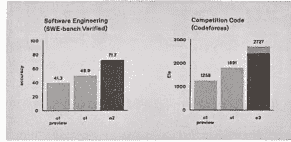

## 生财宝典
## SECRETS TO MAKING MONEY
把100位生财人的判断、路径和经验，借给你用

第一期

生财有术
公众号懒人搜索，懒人专属群分享

你好，我是亦仁，见字如面。

在我的微信、生财有术星球，甚至私信后台，每天都有很多圈友来聊他们的项目和困惑，比如：
- 怎么才能赚到第一笔钱？
- 本金不多，要怎么翻十倍？
- 赚大钱到底需要什么能力？
- 如何判断一个机会的价值？
- 如果一切清零，该如何重新开始？
- 有没有哪一刻快撑不下去了，又是怎么熬过来的？
- 你对未来，还抱有信心吗？

我回答了很多这样的问题，但总觉得，还不够。

直到《纳瓦尔宝典》在星球里持续引发讨论，一代又一代生财圈友从中找到判断力和路径选择的方向，我开始意识到——也许我们，是时候该有一本《生财宝典》了。

一本专门用来回应这些问题的书。

这一次，我邀请了100多位真实干过、赚到过、也愿意讲明白的人。他们来自不同领域：有人靠内容起家，有人擅长搭建模型，有人以投资视角切入，也有人在多次失败后重建自己的商业系统……他们都在这里给出了自己的解法。

这本书，就是他们的经验拆解手册，它是一份来自前人路径的整理——帮助你理解“赚钱”背后的核心能力。

比如：
- 判断力是如何炼成的：不是天赋异禀，而是能否衡量一个机会的可执行性与复利潜力；
- 赚钱不是靠蛮力，而是结构设计：什么才算是可以反复复用的生意模型；
- 副业不是靠时间堆出来，而是模型迁移：内容 × 获客、产品 × 定价，这些组合如何真正跑通；
- 失败并不都值得复盘，但真正的失败，能养出厚度与判断。

我们不告诉你“怎么成为某某”，而是呈现出一个时代普通人是如何看见机会、踩过坑、选择长期主义并走出来的。

这是一本实战书，方法书，也是一本陪伴你构建“赚钱能力系统”的书。

读完它，你不会获得一套万能公式，但你会更清楚：
- 什么样的机会适合你；
- 你该如何开始；
- 遇到阻力时，什么才是值得坚持的东西；
- 以及——你该怎么慢慢成为那个能靠自己赚钱、稳得住、看得远的人。

希望你在任何时候打开这本书，它能帮你建立一种信心——原来赚钱可以学习，原来普通人也能有路径。

- Caoz：每一步都算数：长期主义者的赚钱之道 01
- 刘小排：一个人的 AI 公司：我如何用 AI 跑赢团队 03
- 老华：赚大钱往往都是不累的 05
- 小马宋：当我不再只卖时间，才开始真正赚钱 09
- 易仁永澄：用热爱构建系统，用系统承接价值 11
- 盗坤：从选项目到找教练：10 万变 100 万的四步路径解析 15
- 马想：一困惑就出门 17
- 李自然：如果我从零开始，一年内赚到 100 万的 4 种路径 18
- 杨涛：回到 10 年前，我会给自己的 10 个忠告 19
- V先生：跑通一个项目，月入三千到两万的路径图 21
- 董十一：适合，比什么都重要：一个实体商业博主的五年创业复盘 24
- 少楠：flomo：一条长坡薄雪的生财之路 25
- 吴鲁加：我如何穿越焦虑，靠长期主义走出创业低谷 27
- 邓少闲：未来要从“Copy to China”转向“Copy from China” 28
- 武彬：从投资人那里学来的“判断机会的底层方法” 29
- 闪光少女斯斯：你赚最多的钱，就是你的人生商业模式 30
- 成甲：用喜欢的事打造复利系统：成甲的五个“非典型赚钱观” 31
- 条形马：判断真机会 = 接触真用户 + 获取真反馈 33
- 波波：我这几年最大的体会：赚钱靠眼光，赚大钱靠组合 35
- 润宇：从套利启蒙到商业体系：一个操盘手的成长纪实 37
- 老胡：从淘宝赚到 20 块开始，我的人生被彻底改变了 40
- 龙共火火：如果你只有 10 万：我用这套方法换来 10 倍认知杠杆 42
- 宋超：融资、财务、投放，我的 4000 万创业教训 43
- 钦文：一号位的修炼：做减法、拉正线、活下去 44
- scalers：对十年前的我说：敢想，是人生所有成就的起点 46
- Max Guo：不是风口就要追，这 6 个问题帮我选对机会 48
- 周百见：2025 年 IP 孵化还有什么赚钱机会？ 49
- 崔磊：我看好的下一波本地生活生意机会——云连锁 51
- 高欣：从个体户到团队作战：我怎么把短线生意做成长期模型 53
- 夜息：过去 80 分就能赚钱，如今要 10 个 90 分 54
- 粥左罗：写作十年、直播千场，我用复利思维打下稳定千万年收入 56
- 孙圈圈：扛过 3000 万债务危机后，换来了三条商业真相 58
- 张机：第一次赚到 50 万：从小胜利中建立长信心 60
- 树林：正确的生命，不如流动的生命 61
- lemon：项目符合这 4 个标准，你就可以毫不犹豫的全力以赴 62
- 方波妮：副业不靠顿悟，靠执行：一个普通人拿结果的路径 63
- gary：从打工到 ALL IN：五步构建属于自己的增长路径 64
- Albert：机会判断与重新启程：一个连续创业者的思考笔记 66
- 馋嘴猫：生财最重要的事：靠近优质信息源 68
- 老薛：机会来临之际，不能只用手抓，而是要用盆、桶，甚至用车去装 69
- 令狐峰：做了十年三号位，我才真正开始赚钱：一位产品人的复利式转身 70
- 张昭：判断机会的三把尺子：真伪、参与概率与获利时长 72
- 明白：信息输入越多，赚钱就越多 73
- 钱塘江鲤：我用 Claude3 做了个脚本，却打开了赚钱的思路 75
- 醒醒同学：从热爱出发：我如何靠优势教练体系构建自己的生财模型 76
- 陈雪：我不想再一个人搞钱了，我想带 1000 个女孩一起赢 79
- 可拉：赚钱靠的是“兴趣+顺手”：一个连续创业者的认知复盘 81
- 梁靠谱：不靠产品、不靠人脉：我是如何在 0 成本里找到确定性的 82
- 许老师：从职场负责人到实战自己干，我在市场里打磨判断力 84
- 梨云：从打印 21 本书开始，我靠“换位思考”走通了赚钱这条路 86
- 良辰美：赚钱的本质：是积累和保持在场 87
- 邓怡然：离生财近一点，是我从头再来做过最对的决定 89
- 小鹅：生财是我的大学：我学会三件最重要的事 90
- 老马：第一桶金的觉醒：我如何建立商业判断力与抗压系统 91
- 富贵：适者生存，不靠苦熬：我用适应力打赢了创业这场仗 93
- 钱南：我押对了一个小赛道：播间搭建 & 美颜调试 95
- 吴大白：那一次靠技能赚的钱，让我提前十年理解了商业 96
- Sky老思：找到好赛道后，年入 100 万只差一件事：拉满执行力 97
- 黑小喵：一个真正值得做的行业，都有这 3 个特点 99
- 汪丽娜：第一笔钱靠执行，后面的钱靠认知和结构 100
- HEXIN：判断一个项目值不值得做的六个关键维度 101
- 刘杰：抓住风口、踩对节奏，人生的第一个单月千万 102
- 虎牙：IP 是长出来的，赚钱路上我总结的五条心法 104
- Meng孟哥：红利 x 执行 x 协作：普通人赚钱的三把钥匙 106
- 更结：从知乎引流到商业闭环：一个大学生的副业启示录 108
- 金虎：24 岁赚到人生第一个 300 万，靠的是延迟满足与成长初心 109
- 根源：找回工作的掌控感：我如何从每天 14 小时工作到高效平衡 110
- 超级峰：用 AI 把一天变成十天：打造赚钱的“杠杆力” 111
- 芷蓝：从一个想法，到一个赚钱的产品，你可以这么做 113
- 谢无敌：2024 下沉市场 + 银发直播，未来一年两大机会 114
- 安信：风口过去后，才是 70 分玩家的最好机会 115
- 麦洛：太累了、不想干了怎么办？——我用这 9 个方法自我调整 116
- luke：方法论越清晰，机会越稀缺：我判断机会的三条底线 117
- 超鹏：复制同行，投资认知：小资金也能撬动百万收入 118
- 兰卡：创造财富更需要理直气壮的休息 119
- 柠柠¹：毕业前最后一课：正视欲望，搞点真钱 121
- 家蒙：从知乎带货开始，我靠“不烦”判断机会 122
- 马可乐：我在生财有术的赚钱实践与判断方法 124
- do小鱼：从“什么都想试”到“知道自己该干啥”：我的创业决策进化史 126
- 七小：从匠人到生意人：两次认知颠覆，彻底改变我对赚钱的看法 128
- 叶叶在觉：十年经验总结：写给十年前的自己 130
- 温虾米：从爆仓边缘到现金流自由：一个 Crypto 老兵的反思与突围 132
- miles：从 0 到副业变现：我如何在生财有术构建搞钱能力系统 133
- 知行：看见别人赚钱，是我真正开始赚钱的起点 134
- IDO老徐：做复利型副业，让小钱源源不断地流进来 135
- 小南：十年前的一本书，改变了我对赚钱的全部理解 137
- 枸杞：回到 10 年前，靠这 3 件事站稳脚跟 138
- 胖大魔：从透明人到关键人：我在生财泡出来的赚钱能力 139
- 罗卜：把思维导图这个爱好，做成一个可以赚钱的项目 141
- 冯巧杰：写文章赚到第一桶金后，我开始相信风口的力量 142
- 左烨紫：如何成交高净值客户：靠9年堆起的信任与确定性 143
- 刘容：未来一年，AI与内容仍是主战场 144
- 掩体：“哦，原来挣钱和亏钱都很容易”：一个AI创业者的真实进化录 145
- 曜文：从洞察机会到东山再起，我靠的是什么？ 146
- Ajin：创业之外，也别忘了看看天光和野花 148
- 来来：未来三年我最看好的三大赚钱机会：AI×出海×IP 149
- 包子：我这样选赛道：擅长+喜欢+AI建议+做时间的朋友 150
- Ao外星人：不是技巧，是习惯：我如何打磨赚钱底层力 151
- Sky盖哥：创业不是爆点，是长期掷骰子的能力 152
- 张海宁：真正值钱的能力，其实你早就有了 154
- 唐梦：从等待到突围：一个专业服务者的长期主义赚钱之路 155
- 孙策：如何赚到第一笔千万？我在下沉市场支付宝推广中走出的实战路径 157
- 郭晓文：不是创业，不是打工，是“一个人跑通项目”的觉醒时刻 158
- 花爷梦吃换酒钱：PGC、AI、直播：三大机会带你突围2025 159
- Tom叔：从大厂到创业者：用AI出海开启下一段复利曲线 160
- 花生日记：从热爱出发，顺手赚钱：一个AI创作者的进阶之路 161
- 董坚海：从“好像是机会”到“真的能赚钱”，你还差这四步 162
- 黄小刀：打造年入200万的AI搞钱系统：三个机会+一个长期自驱模型 163
- 紫菜：如何用10万拆解出一条创业路线图 165
- 于冬琪：赚钱是结果，判断力与热爱才是起点 166
- 坤汀：访谈过数位生财航海家后，分享3个创业认知 167
- 王川：不累，自由，才是赚钱的终极意义 169
- 亦仁：赚钱不是靠爆发，是靠长期构建：我的认知、方法与路径 170

公众号懒人搜索，懒人专属群分享

## 每一步都算数：长期主义者的赚钱之道
> @Caoz
「caoz的梦呓」主理人
著有《你凭什么做好互联网》

最近确实看到一些读者咨询我，通常是当下失业，求职不顺，希望尽快找到翻身的机会，很遗憾，我没有办法给出合理的方案和建议。

坦白说，我不擅长做赚钱的事情。有些套路我是知道的，赚快钱通常可能涉及一些信息差套利，或者偏灰色的玩法，比如说商籍积分兑换以及高阶会员匹配的一些骚操作。比如说，追逐热点快速洗稿去抓流量变现广告费，一些故事和技巧我是了解的，但我自己从未涉足，也从不鼓励这样的行为。

有人问我一个比较尖锐的问题：最近几年赚到的最大的钱是什么？是怎么来的？

我坦白说，我最近几年赚到的几乎所有钱，都可以溯源于很早之前的决策和行动，短则七八年，长则二十年，而且彼时，我是没有办法判断这后面的变现途径的。

我年轻的时候也曾追求赚钱快，也曾试图用最短时间实现最大资产增值，然后就决策走形，最后亏了很多钱交了很多学费。痛定思痛，我知道，那不是我能驾驭的。

### 一、每一步，都算数
做有价值、有积累的事情，通过时间获得复利。

我是怎么赚钱的，我复盘一下：
- 其一，我在互联网巨头、创业公司都做过，自己还创业过不止一次，有足够的行业认知，业内实操经验丰富。
- 其二，我乐于分享，由于我实操经验丰富，所以我的分享价值也足够高，获得的信任度也足够高，而分享这个习惯起源于超过25年前，长期分享让我建立了影响力，认识了很多行业精英，同时这种沟通也让我强化了行业认知，提升了分享价值，形成了正向循环。
- 其三，我乐于助人，当然其实并不是那种重投入，非常贴心，非常耐心地助人，这个真没有，但是举手之劳，一些简单而有效的建议，以及搭建人脉链接，这种利他行为我确实一直在做。

那么这些和赚钱有关系么，有，这是我可以在知识付费领域有饭吃的基础，这是我以低成本甚至零成本参股一些优质创业团队的基础，这是上市公司愿意无偿配给我一些亲友股份的背景。

在过往的几年里，我真正靠自己（除了房产之外）赚到的钱，追根溯源不外乎以上这几条。

所以我没办法让年轻人复制我的经验，但我依然会强调，当你坚持成长，坚持分享，坚持利他的时候，很多种子已然悄悄种下，开花结果需要时间，但在前进的过程中，每一步，都算数。哪怕犯了错误，交了学费。

有时候，欲速则不达，越想激进地获利和变现，越容易成为市场收割的目标。要认清自我，耐心成长，不要急于求成。

### 二、输得起，才能真正赢得住
必须承认，要想获得较高的收益，通常来说，适当的投入，适当的风险是要承担的，完全损失厌恶，完全拒绝风险是没有机会的。

但这个尺度在哪里？

我年轻的时候创业，我的机会成本也挺高的，因为那时候我工资真的不低，我的试错成本也挺高的，那时候主机托管费用非常高，而且我是真的押上了全部身家，但那时候也不怕，毕竟年轻，大不了白干两年，回去继续打工，总有饭吃。年轻的时候，在不涉及债务或债务非常可控的情况下，大胆一点确实也没关系。

但你看我现在，我肯定是不敢做出格样的冒险，毕竟上有老下有小，自己岁数也大了，很难再去求职，对后续的持续收入也没有太大的信心，这种情况下，资产安全就胜过了追求回报率。

不过前后遵循的都是一个原则：只下输得起的注。

最近和一些创业者聊天，有利益关联，我有少许股份权益的，对方焦虑如何放大规模，但我却劝他们先好好重视合规，合规之外是提升毛利率，提升毛利率的目标不是为了多赚多少钱，而是提高抗风险的能力，此外账期管理，资金流控制，都是劝他们不要冒进，安全第一，不要盲目扩张，不要为了引入资金签输不起的对赌。

如果站在纯粹的投资人角度，追求回报率，我应该鼓励他们All in，快速扩张，如果他们成功了，我的回报会急速扩大，反正就算他们出事了，对我而言也不过是很局部的一个小损失。但作为他们的朋友，我必须说，安全生存下来才是第一位的。在这个牌局里，我输得起，但他们输不起。

我一直很讨厌那些教人用极致杠杆投资的人，确实在市场机会出现时，这可以让投资者获得最大收益，但谁能保证每一次都可以站在对的方向上？只要错一次，就是万劫不复。

不要做赌狗，一旦陷入那种情绪和心态，不论你多厉害，赢了多少次，最终都是一个悲惨结局。出不来的，总认为再赚最后一笔，贪婪是无止境的。

输得起的时候，你才可以去博赢的机会。

### 三、最重要的能力
我觉得有一样是最重要的，所谓对需求的洞察力。这个话题说起来太大了，同理心，好奇心，对身边事物的敏锐度。

我以前讲过例子，我认识很多成功的创业者，他们是极度敏感的，到机场贵宾厅候机的时候，会看看电脑默认首页是哪个网址导航，上面放的链接有没有自己的网站，或竞品的。在洗脚城捏脚的时候，还会问小妹手机里装什么App和游戏，平时是怎么用的。而且有的创业者随身带小本子，喝茶聊天我但凡提到一个他不知道的产品或者企业，马上记录下来，晚上搜索后还会在线跟我们二次核对。

为什么这些人能成功？真的可以从这些细节感受到。

我之前发过一个案例，群里一个简单截图，你能从中获取哪些有价值信息。我经常从截图中看到别人忽视的细节，所谓超视角阅读，面对同样的内容，不同人获取的信息截然不同：有的人只是看热闹，和作者价值观纠结，有的人看到了更多和市场，商业，以及金融知识有关的信息。

需求的洞察力+能明确真实因果的底层逻辑+快速实践落地能力，三者结合，无往不利。

坦白说，我自己也达不到这个高度。但如果总是找借口，总是不去行动，那就永远也到不了。

总要从第一步开始。

回到最开始那句话：每一步，都算数。

## 一人AI公司：如何用AI跑赢团队
> @刘小排
8年AI行业从业者

我可以不要吗？如果非要给我，我会先花9万环游旅游，剩1万支撑我1个月的生活开支，第2个月开始盈利，明年变成100万问题不大。

我所在的是软件行业（MicroSaaS），以前，一个能够做出大几百万月活用户的软件公司，少说也有一二十号人，我现在只需要一人。

不需要“如果”，我正在做的事情正是如此：借助AI，一个人做以前需要十个人才能做到的生意。

详细方法可以见我在生财有术的分享《从工具到合伙人：重新定义AI关系，实现百倍回报》。

我并不是一个特例，我所在的软件行业也不是唯一能这样干的行业。

在2025年3月30日航海家AI大会上，我们看到：

包子靠一个人加上AI，做出来某领域头部、数千人在线的直播间，而他的同行对手有数百人。钱塘江鲤靠一个人加上AI，做出来整个MCN。Damo出身是教培公司老板，做出的AI产品比肩很多互联网大厂，因为AI，团队没有设计师，因为AI，团队里最普通的程序员可以发挥出世界级程序员的高水平。

### 一、10万元本金，1年内将其变成100万，会如何行动？
如果你想要借鉴的话，我可以给出3个方向：
- **找到生财有术里任意一个航海项目**，想办法借助AI，一个人干到10个人的事。可以从数量、品质、稳定性三个维度去考虑如何用好AI。
- **就做你正在做**、你非常熟悉的行业，用AI逐一替代掉你的合作方、你的同事，然后，你的老板。
- **找到“初级脑力劳动密集型”行业**（运营人员、美工、文案编辑等），你去做它们的行业，想办法用AI替代更多的人、做出更好的品质。

我会对十年前的自己说：
> 相信世界上还有秘密，用尽全力去发现这些秘密。

这个启发来自彼得蒂尔的《从0到1》（Zero to One）。

十年前我就看过这本书，觉得这句话很酷。我越长大，越能领悟它。

一个创业者必须回答的最关键的问题是：有什么重要的事情是你相信的，而很少有人同意？

当我们养成了发现秘密的习惯，做什么事情都会游刃有余。

我不妨举几个例子：
- **大众认为**：到大厂打工风险很小，创业风险很大。
- **真相是**：创业的风险，比大厂打工风险小。

如果你有幸28岁在大厂做到了P7/P8、年薪百万，你很难相信自己的大厂旅途有什么风险，以为能够安然退休。

但是到了十年后呢？38岁的你到了2025年，仍然是P7，你觉得风险不大吗？裁员20%的时候你顶住了，裁员30%呢？50%呢？你有多大把握相信自己能够成为一名65岁的P7+并安稳退休呢？反正我是不信。我身边有不少的高P高T朋友，上个月还拿着年薪百万，这个月在开滴滴和卖保险。

比起在大厂混到35岁以后人人自危，更好的做法是35岁前主动为创业做准备。比如，加入生财有术，认识真实的世界。

### 二、穿越回10年前，见到刚刚起步的自己，会对他说什么？
- **大众认为**：套壳产品没有价值。
- **真相是**：套壳产品有巨大价值，2023-2025年最赚钱的AI产品大半是套壳产品。

### 真相一
### 真相二

幸好，我在2022年开始就发现了这个秘密。在传统互联网大厂、传统投资人在争辩“套壳产品有没有价值”的时候，草根创业者们做出来了Monica.im、Pollo.ai、Manus.im等叫好又叫座的传奇套壳产品。

而2023年叱咤风云的所谓“大模型六小虎”、看不起套壳产品的行业大神们，今天大部分已经泯然众人矣。试问，在2025年3月，有谁还记得2023年一家叫“百川智能”的大模型公司，融资过53亿元人民币、估值超过200亿元人民币？

正是因为我看到并坚信这个秘密，才让我可以一个人干到以前软件公司很多人才能干到的事。尽早发现这个秘密的人，可以尽早享受到它的红利。

### 真相三
- 大众认为：2024年—2025年经济不景气，不适合创业。
- 真相是：这正是创业的好时候。

往大了说：丰田汽车，1930年昭和大萧条期间创立。优衣库，1984年日本经济泡沫破裂时创立。通用汽车，1908年经济衰退中创立。迪士尼，1929年经济大萧条期间创立。Uber、Airbnb、WhatsApp、Slack——都是在2008年全球金融危机期间创立。

往小了说：2024年—2025年，人工特别便宜，你能用比以前便宜得多的价格招到和以前一样优秀的985应届生，因为应届生找工作难的；办公室租金便宜，因为空置率挺高的。

任何时候解决供需失衡的人，都会得到世界祝福。

在十年前互联网大厂突飞猛进的时候，你可以选择去大厂，因为人才是稀缺资源。在十年后的今年，优秀的你应该果断选择创业，因为好工作是最缺资源，你可以为世界提供更多的好工作。

### 真相四
- 大众认为：AI写代码不靠谱，不能代替有经验的程序员。AI写出了bug，需要有经验的程序员才能解决。
- 真相是：AI比你认识的所有程序员都牛。

在编程比赛中，ChatGPT-o1超过89%的程序员，ChatGPT-o3超过了99%的程序员。事实上，o1只有1891分，o3取得了2727的高分，只需要2400分就可以超过99%的程序员了。目前o3在编程技能方面在全人类的排名是150名。

那位告诉你“AI写代码不靠谱，不能代替有经验的程序员”的“有经验的”程序员，敢问他在编程比赛的世界排名是多少？

年轻人，尽力去挖掘世界的秘密吧！秘密等于真理，真理等于宝藏！

## 老华：赚大钱往往都是不累的
“马厂老火锅”创始人
“米课”创始人

@老华

### 一、过去五年赚最多的一笔钱，是怎么赚的？
实际上我还没有仔细算过自己在过去五年赚了多少钱，不过以五年为周期的话，可能投资证券和实业赚取的收益相差不大，这两者之间区别就是投资可能是在某一两年集中体现收益，而生意则是每年持续稳定地在提供收入。我更倾向于两者的结合，即用实业的收入二次复投到证券投资中。

实际上除去房产和一些其他小投资，我几乎所有的现金和持续现金流都投资在证券市场。底层逻辑在于我所做的生意基本属于初创，投资极小，公司可支配现金流就会越滚越多，把这些现金流投资在比我所做生意更稳定、更优秀的企业上，长期复利收入就变得相当可观。

打个比方，两年前，我在原来做了十几年的职业教育赛道之外，又做了一个餐饮品牌马厂老火锅，这个品牌已经发展到了100家直营门店。如果说这个品牌停止增长门店数量了，而投资端以15%的年化复利的话，那么10年后的收益是4倍，20年后为16倍，30年后为66倍，所以这分别相当于我做了3个，15个和65个马厂。

同样，我将自己创业20年来的收入放入了证券市场，以15%的年化收益计算，可以理解为在未来30年我这一生多拥有了3，15，65个自己同时在创造收入，这就好比平行世界里的自己的收入全部归纳到地球的我身上。

从上面的路径可以看出，增加一点业绩的重要性远不如确保长期平均年化可以达到15%，而某一年的高额收益或者较低的收益也不如持续稳定前行。不言而喻，我思考更多的问题是如何保证自己不亏钱，以及如何保证自己在承受最低风险或者无风险（实际存在）情况下，获得安全范围内的最高收益（或者说合理收益）。

而在事业端，我要思考的不是今年业绩涨多少，而是如何延长企业或公司的寿命，把原来可以赚十年钱的生意延长到二十年，甚至更久。这是和大多数人思考问题角度的不同。

经常有人说自己价值投资了，拿了几年，结果亏了，所以中国没有价值投资；也经常有人说价值投资就是死拿呗；很多时候这些言论已经反映出投资这件事并不容易，大部分人依然还没踏进投资的门。

我的投资有看起来很长的，像知道我的人应该都知道我持有很多年的腾讯控股，这是时间维度上看起来“很长”，篇幅原因我就分享个几年前我买过的股票新东方，这个时间就“很短”，不足一个月。

新东方在不到一个月的时间里给我带来四千万左右的利润，我是在董宇辉刚刚冒尖的时候买入，大概是9.1元左右。

由于我本身也算从事互联网行业，也恰好在抖音有账户直播过，对抖音还算有一点基础的了解，至少知道可以在蝉妈妈上看到直播的销售数据，在董开始直播后我一直关注他们的直播销售额和粉丝数量变化。

当董宇辉破圈的时候，也许是在很多股民和机构还没有意识到东方甄选的销售额在以每半天百分之几十的速度增长的同时，我简单按净利5%，10%，15%进行了估算，至少也值250-350亿，对应股价30元左右，是值得买入的机会。

像新东方这种机会其实比较特殊，在东方甄选之前，新东方被教育政策打压成破铜烂铁价，总市值不过几十亿，而当东方甄选出现的时候，其底层逻辑已经产生完全的变化，算得上是单车变摩托。

所以我还记得有一次一个朋友说他五块钱的时候就想买了，我回了一句：五块钱买并没有九块钱买，其底层逻辑就是确定性不成立，我们无法在新东方是单车的时候仅仅因为觉得俞敏洪应该可以凤凰涅槃就买入，这明显是一个情绪化的买入理由。

而且“想买”和“买”中间差了很多，“买了一点”和“买了足够多”又差距很大，这两个加一起那就是差了十万八千里，属于白日做梦了。

同样，由于我对直播的持续性和增长性的把握性和认知不够，我也不会买入较大的仓位。但面对这样一个仅是做做算术题就可以买入的机会，我选择了买入了一个买少了我不难受，涨飞了我也难受的仓位。（如果你经历过一只股票涨了十倍结果自己只买了一点点的痛苦就明白我说什么了）

有的时候面临一些机会的时候，我们也要根据风险等级来决定我们的仓位。

新东方之后最高涨到过六七十，而我的理解只在三十以内，因为我始终不想在新东方停止增长的时候还持有他，我感觉我会睡不好。所以我和新东方不到一个月的热恋就此结束。（都怪他一个月就涨了三倍多）

这个例子是想告诉大家：价值投资和时间长短没有关系，但是复利和时间长短有密切关系。

我最喜欢的还是有强大的护城河，业绩持续增长的，股价最终还是落在业绩的持续增长上。

比如2019年我买入腾讯的时候，腾讯的净利润大概在1200亿左右，2025年估计就在2400-2500亿了，这样的公司无论股价怎么波动，最终的落脚点还是在利润增长的曲线上。

赚这种钱，我每天睡得都很踏实，平时根本不用看账户，也不用操作，真正做到我常说的：赚钱就和呼吸一样简单，躺着也可以赚钱。

在过去的五年里，腾讯的股价波动也比较大，从2019年300多买入到760，又到200左右，以及现在500多，这导致我利润波动也很大。

然而我的原则一直都是涨跌都要开心，所以在腾讯低迷的几年里我不断买入，持仓已经是最初的接近四倍，这意味着当企业增长的时候，我赚的要比之前多几倍，岂能不开心？

这是市场给我的机会，而对很多不懂投资的人却是噩梦。给大家一个数据：

在中美股事里，即便一个企业保持年化20%的复利，这个公司平均每3年都会经历一次超过30%的下跌。

所以很多人只想要结果，却无法忍受波动。这是赚不到大钱的。

最后送给大家一句：赚大钱往往都是不累的。

### 二、最好的机会，永远是低成本起步+当下热潮
这个问题还是把我难倒了，我很少看一年的机会，也给读者一个建议：经常换项目或者换股票都是不太明智的行为。如果硬要说一年内的三个赚钱机会就挺为难我的了，那我就说两类赚钱的机会。

#### 第一类：任何低成本起步的项目
可能因为我自己的创业历史都是低成本起步的，我做过最大成本的可能就是目前的马厂老火锅，投资了一百多万，具体也没计算，之后都是通过一家家店赚钱滚出了100家店。

对于这个量级的项目来说，一百多万恐怕连两家店的成本都不够，更不用说两年时间的百家门店了。至于我的另外一家经营了快15年的教育公司米课，那也只用了三万的成本，这钱也没用掉，还只是因为注册公司的最低资本要求才有的这三万，在这些生意之前的海外创业统统都是没有成本或者几万的成本起步。

创业之所以叫创业，就是从无到有的创造。

如果一个生意要投资几百万，上千万，要么你是做能赚几十亿的生意，要么就别把他当成创业，他更像一个投资。

所以只要你做的项目是接近零的投入，那他就值得一试，就算你的逻辑全错，你也没任何损失，你可以有十次甚至数十次的机会去尝试，都不会对你造成伤害。

#### 第二类：当下热点的项目
这类项目都具有足够的关注度和流量，往往用户需求度也是比较大的，缺点是很多人都会发现这样的机会，随着时间的推移，竞争会非常白热化，利润也会越来越薄，最终成为一个狗都不想做的生意。

不过也许很多读者只关心是否可以立刻马上先赚到钱，我并没有嘲讽的意思，我是觉得要看你所在的阶段，对于初次创业或者急需积累一些本金的创业者来说，这也不失为一个选择。

### 三、给你10万，如何在1年内将其变成100万？
10万的本金一年赚到100万应该是不难，实际上赚到100万也不需要10万，在股市上，投资是没有这么高的收益，投机倒是有可能，但更大的可能是输掉这10万。

那剩下的就只有创业这条路，也非常符合我说的创造从无到有的过程。之所以不要10万，是因为只有买卖差价的实物东西才需要资金去买货品，而虚拟服务则完全不需要本金。

由于我自己也算非常资深的知识付费类公司创始人，我认为只要你足够想赚这100万，足够勤奋，愿意没日没夜的干，而不是不愿意付出代价，轻而易举就可以赚到这100万的话：

挖掘一个自己擅长的知识做成产品，如果没有，就去找一个这样的人，由于目标金额很小，找的人甚至可以是BOSS直聘解决。具体点说，比如我想做个财务类的培训，财务里什么最好卖？肯定是税务类，毕竟大部分老板都怕这个，BOSS直聘上面一百个财务专业的人，找到一个思维灵活，口齿伶俐的人，这肯定是没有难度的。你负责运营和产品包装，他负责讲课直播。

你的时间要100%用起来，直播能做就做直播，短视频拍起来，公众号写起来，电话销售拉起来，线下活动弄起来。

刚开始免费都可以，最后线上线下一起来上课。

我敢说只要你能做到足够勤奋，足够努力，365天只休息5天，你赚到的远远不止100万。

这让我想起我健身的时候总问教练腹肌什么时候才能有啊，我全身体脂率已经挺低，手臂大腿都能看到青筋了，就是没有腹肌。

教练说你坚持水煮菜吃三个月就有了，可是至今我还是没有……为什么呢？因为我一天都没有吃！

所以我随便想一个项目都至少是百万起步，但是真正会去执行的人永远只有1%甚至更少，希望对各位读者有所启发。

### 四、最累的时候，往往是你干得特别好的时候
我有觉得“太累了”的时刻，但这些时刻往往都是我干的特别好的时候。我很少心痛，如果我身体累，说明我知道自己在干什么，我恨不得一天当两天用，所以我很累，我的累是希望自己快点完成。

我创业这么久最赶的一次应该是米课做社区APP的时候，大概在2017年，那会我意识到公司必须从网页端转APP端，而我们公司只有一个PHP程序员和一个前端，完全没有会做APP的人。

正如上面我说的，如果你足够想赚100万，你必须让自己没日没夜地干起来。从没有研发人员，到一个复杂的App（包含社交，直播，在线看课，裂变，私信）诞生，且是IOS和安卓双端开发，我们一共只用了三个月，这还包括我一个不懂技术的人面试了几十个技术人员的过程。我个人觉得还挺酷的，因为大厂的朋友看了我们的产品后说三个月你们能弄出这个非常不容易。

当然技术永远不是壁垒，同期得到APP的课程为首页的设计应该是市场共识，公司内部大家也都建议使用这种设计，被我一票否决。因为我相信人性，没有人（或者极少数）是爱学习的。

不管他看起来多么喜欢得到这种充满知识的产品，我坚信人类只爱八卦，而外贸圈恰好是一个小圈子。所以我们把个人动态信息流作为首席设计，看课甚至都没放在底部导航，需要在底部“我的”里面进入。因为我相信客户支付几千块后就算这个入口在四级导航他也找得到。

事实证明这个设计即便在我这五年没有管公司的情况下，依然拥有不错的活跃度。

至于“不想干”的时刻，我大概是在疫情期间产生的，习惯了在家办公，也觉得钱越来越成为一个数字（我没什么特别大额的开销），慢慢地也就失去了20岁时的激情。

也正是因为疫情无聊，才有了后面的B站《一亿实盘》和12小时吃火锅直播聊天的事件。

现在回头看，很多事情都是缘分注定的，从2019年决定躺平到2022年机缘巧合做了餐饮连锁，似乎都是上天安排好的，我并没有刻意去追寻，也没有焦虑。

在躺平的日子里就好好享受这难得的放松，（2002-2019几乎没有真正意义的休息过，不是在累，就是在焦虑）也许是长时间的工作，所以对躺平的日子并没有什么内疚。

如果需要我给建议，我觉得只要每天能保持一点点进步（这也很难，因为需要坚持），还是改成只要每周保持一点点进步，机会总会来到，你也会拥有足够的能力去把握好机会。

缘分和机遇很奇妙，总是在你最想不到的时候来临，所以焦虑=无用功，享受好每一天=有概率获得意外惊喜。

### 五、所有的成功都贴好了价格，只不过你现在还看不到
这个问题看得出我已经算大龄创业者了，我想应该是我对20年前的自己说些什么。

如果可以穿越，我想我会说：可以早点开始健身，以及选择一项感兴趣的运动。这两样可以给你带来很多其他方面的快乐，且都是需要时间积累才能看到超出普通人的结果。

当然我也可以什么都不说，因为总体我还是挺满意自己过去20年的。这个世界很多东西都会动态平衡，可能正是因为我相对多的精力都在事业上，才能有所收获。

如果真的爱上了我现在爱的运动，现在我也许就在为金钱烦恼了。所有的事情早已贴好了价格，只是不到最后很多人不知道罢了。

总之，过去的都已经过去了，我们无法后悔或活在过去 了。无论截至今天之前的日子有多好，或有多差，他都 无法改变我们下决心去改变未来的日子。

过好每一天，每一天加在一起就是我们的未来。

最后祝愿这短短的问答能给生财有术的朋友一些启发，也祝愿大家变得更好，我们江湖相见！

## 当我 不再 只卖 时间，才 开始 真正 赚钱
> @小马宋
「小马宋咨询」创始人
商业类作者，著有《营销笔记》《卖货真相》

脱离了个人能力去谈赚钱机会，我认为 是没有意义的。比如未来做芯片会赚钱，但不是你的机会啊。未来做服务行业也是国家鼓励的，但这是你擅长的吗？

### 一、我赚到的最多的一笔钱，是对客户的投资
我是做营销咨询的，我们咨询项目最贵的就是一年合同。但这不是我赚到的最大的一笔钱。

我赚到的最多的一笔钱，是对客户的投资。2020年，我们服务一个餐饮客户，因为做咨询要对客户做深入研究，我们功夫下得足，对客户的经营情况也足够了解。

所以，服务一年后，我决定把赚到的咨询费都投给这个客户开店，连续三年。五年后，我不仅赚回了当初投给这个客户的那大几百万，而且现在每年有100万左右的固定回报。

其实我过去也有一些所谓的投资，要么是靠运气赚了一点，要么就是亏损。为什么呢？就是因为我 没有做足够的研究，对这个项目不是足够了解。

如果你自己仅仅是一知半解，那注定是要亏损的，盈利仅仅是运气，亏损才是真实的实力。因为人家专业做这个都未必稳赚，凭什么你业余做就赚到？

为什么在这个项目上能赚到？因为我足够懂，足够了解。这就是巴菲特说的，他不会投资自己看不懂的项目。

### 三、只给你10万，如何在1年内变成100万？
这个问题对我来说可能就会比较简单，因为我们做的是智力服务行业，核心是要增加自己的影响力和行业权威度。

如果是我 的话，我就会把10万支付给对企业家有影响力的知识类媒体，争取一次上他们的媒体推广我自己的机会，然后通过对引流过来的精准用户推送我个人 的见面咨询、企业内训来变现。

当然这个对我来说是因为有基础，所以不难，对普通人来说就很难。但对真正有实力，而不太出名的人来说，想要把知识变现给那些高净值人群，也是需要把自己推广出去的。

### 二、判断机会前，先判断你自己
这个问题我无法回答，为什么呢？因为每个行业都有做得好的，做得差的。核心不是哪个项目会赚钱，核心是你，你做这个项目会不会赚钱。

因为一个项目是需要人去执行的，而人的能力天然有差异，所以才会有曾鸣老师讲的那个战略三角：

### 四、不是靠熬，是靠做出反应
- 可做（时代机会）；
- 能做（你自己有这个实力）；
- 想做（你有这个兴趣）。

我有过三次创业经历，前两次都不是我主导，所以并没有特别有压力的时候。第三次创业，就是今天的小马宋战略营销咨询，我们在2022年上半年遇到的挑战是最大的。

因为大家知道当时上海封城了，全国各地都无法出差，而我们的工作需要大量调研，跟客户见面。我们后来有接近6个月没有任何新的项目进账，一个月还要发50万左右的工资。

但我行动很快，在封城1个月之后，我就知道我 该做一些事。对我们来说，就是不断提高我们的知名度，让需要的客户知道我们。

所以那时候，我重新开始了做短视频，做直播，并且在当年写了一本书。这些动作在3个月之后就见效了。我们在下半年9月份，得到了第一个签约客户。

面对困难，核心不是焦虑。核心，是要分析造成今天困难的原因是什么？你应该怎么做，才能打破这个僵局？然后接下来就是去做。

### 五、战略上的延迟启动，是我最大的遗憾
十年前，我刚刚起步做这家咨询公司，但是我们在前三年走了三年弯路，当时不接全案咨询，只做企业顾问，就是出卖我个人的时间。

我想，那时候我们应该立刻起步去做企业咨询，这样我们就会抓住三年的黄金时间，为自己积累更多的好案例、好客户、好经验以及更多的现金储备，这会让我们有更大的战略自由度。

因为营销咨询的黄金时代，大概就结束在2022年，我们是2019年才开始做咨询，没有享受这个红利很久，后来就越做越难了。

尽管我们今天还是被同行认为做得比较好，但是我们很多大的同行，都是比我们早至少十年起步，他们在更容易做生意的时代获得了更多的原始的积累，企业抗风险能力大大增强了。

## 用热爱构建系统,用系统承接价值
> @易仁永澄
「创业者心力提升」教练
「10X创造模式」辅导教练

### 一、从”第一笔钱”开始,觉察我对金钱的执念
我2002年上大学,在中国传媒大学,北京的东五环外。

有师哥要带着我卖U盘和三星手机,因为总是要往中关村跑,我就很懒得跑,因为当时去一趟中关村非常不方便,我又很不好意思一个个宿舍去串着卖东西。

但是,他帮我开启了原来可以自己搞钱的这个念头。

我第一笔钱,是靠做家教实现的。我同时教数学和吉他,数学150元/小时,吉他要500元/小时。

当时我一个月的生活费,大约800-1000元,我两个周就完成了一个月的收入,感觉非常兴奋。可是因为我不太会教,第二个月被这个平台除名了。

2006年,我留学当老师,我的专业就是数字媒体技术,利用专业和管理设备机房之便,开始带着学生社团做平面设计、网站设计、视频剪辑、影视后期。我们2008年给无锡的一个印刷厂拍了一个广告片,收费2万元。

这笔钱对我来说是“真正意义”上的赚钱,因为,对我而言的意义是:「我竟然一下子可以成为万元户了!

很久之后再回看,我发现这其实是一个坑。

第一,万元户的概念,其实是父母给我种下的,我以为只要我到万元户我就可以超越父母了。

第二,其实我在学校工作的工资有4700元/月,我早就是万元户了,但是我依然执着这个概念不放。

第三,我要钱的目的就是为了突破万元户,这个念头在我心中成了一个心理位,如果我钱多了,我就去都花掉,如果不到一万我就赶紧赚钱,一直到2013年(又过了五年),我的银行卡上的钱,永远都是一万附近。我毫无投资理财的任何理念。

所以,现在来看,这笔钱为我在未来埋了一个「傲慢」的深坑,也给了我一个「回归自己、做自己」的机会。

### 二、两笔大额收入背后,是长期信任与专业的积累
值得提的应该是两笔钱,一笔是80万,一笔是240万。

80万,是我的财务负责人帮我实现的。她抓到了一个股市的机会,三天左右把整个仓位拉了50%多。

这个姐姐是2013年我在学习理财的时候认识的,那年她开始负责我的公司和我个人财务管理,一直到今天,她一分钱也没有跟我要过。

我总是希望给她一些回报,但是她都不要,她说:「我真的看好你这个人,你虽然今天赚不到多少钱,但是你能给我带来远超过钱的价值。」

12年过去了,我并没有达到她的预期,只不过,她更相信这一点了,我也希望未来能给她带来更多的价值回报。关键经验就是:认真做自己认为对的事情,认真研究那件事,把那件事做好。我变得专业了,自然有专业的人愿意帮我做我不专业的事情。

240万是我们个人成长教练课程业务一期的销售额。

成功的经验蛮简单的:我一直都投入在个人成长领域,教练的学习我投入了300多万的学费,我一直把每个概念研究清楚、把每个做法的有效边界探索清楚。我自从2022年开始就可以确保每一次教练都能够达到100%成功的标准,在这个领域中,我是自信的、又可以出效果,积累得久了也有用户,自然就完成了收入。

关键经验就是:把自己的业务做得专业,这是长期赚钱的基本前提。

### 三、判断机会的方式:反过来想
我是一个老师、教练,并不是一个商人,我的判断依据并不见得能够赚太多钱。

我向查理芒格学习到了一个很核心的思维方式:反过来想。

### 第二个思维方式是：能力圈。

我会先思考：如果这件事我做了之后可能会死，我会死在哪里？如果有明确的风险，尤其是道德风险、违背我的价值观的，我是坚决放弃的。

不在能力圈的事情（看不懂的、太难的）我就会放弃。世界上一定存在着符合自己能力圈，并且有长期发展价值的事情，没有必要为了一些短期收益，跳到非能力圈的事情当中。

能力圈是洞见价值的唯一途径，芒格说：「只有在绝对优势的情况下才出手」。

其他的，我的经验并不多，我的策略并不是「先赚钱」，而是考虑如何「先不死」。

所以，我总是搞一下睡饱饱（确保自己活得久）类似的活动，先保证自己不死、再确保自己没有损失，再考虑如何往前走。

### 四、做自己，是我最看好的复利策略

未来一年我最看好的机会，我并不知道答案是什么。

这取决于我的策略选择。

我当前阶段是在「降成本」，把一切我不喜欢、不擅长、不想做的事情全部都删除掉。

先让自己保持无损，因为无损才可以持续，我可以先持续活出一种「我喜欢、我热爱的人生」的状态。

「降成本」之后我考虑的是「自我增强」，就是无论发生什么，我都要让自己「不是得到、就是学到」。

比如学习到一些重要的理念、提升自己的思想、打磨自己的品质、认识更多有价值共识的朋友等。

因为我有一项能力是辅导他人、提升领导力并领导团队取得实际结果，我越是提升我自己，我的这项能力发挥得就更有穿透性。

我做好「自我增强」之后，就尝试着把自己喜欢和擅长的事情「复利化」。

比如说，每一次思考，都向我的社群、我的用户、我的客户进行分发等（可以把它理解为IP的做法）。

### 五、10万变100万的问题，我用“投人”来回答

我自己的策略在这个阶段是不考虑金钱放大的问题，所以，我考虑投资逻辑。

巴菲特问过一个问题：如果你可以购买下一个人未来一生10%的收入的所有权，你会买谁？

我现在要买，就买：在前沿机会里实干、愿意总结反思（归纳提炼到系统层）、谦虚好学、不怕失败的年轻人，最好他还有点模式的干扰（比如说：敏感、不自信）。

对一块璞玉进行投资，是我的方案。

其他的，我不想为了金钱的10倍增长，冲突了我的既定策略。

### 六、资源会失去，人脉不会——因为我从不以利益交换为前提

资源有可能会损失，但是人脉不会。

好人脉（以及它对应的资源）不仅仅只会考虑短期变现的问题。

好资源会考虑投资标的的安全性，也就是投入了我只会考虑，会不会亏本。

目前，我的策略，就是把成本降低为0的策略：去做自己喜欢、热情、优势的事情，这些事情是无损的，也就是别人什么都不给我，我也愿意去做的事情。

我会把这些事情和身边其他人关联在一起，我做这件事的时候，就可以给别人带来成功的条件，而我不需要他人给我回报来购买我的给予。这就建立了长期互信的人脉网络的基础。

总结一下，我最看好的就是：「做自己」，把「做自己」复利化起来，把自己当做方法、当做产品、变成公司。

AI的时代，可以让「做自己」变得更加容易和有效。

AI+做自己可以让这个游戏变成无限游戏，0成本的情况下，一切都是赚的。

这是我未来的赚钱策略，但是，未来一年可能并不能赚到钱，哈哈~

在这个基础上，除非我自己做了有悖道德、侵犯他人利益的事情，否则我不会损失人脉的。

哈，此外，我不需要起东山，我需要的是东山不亏损，东山多给其他人结果子、多给别人提供资源。

所以，我现在做的都是「自我增强」，让自己所依靠的要素都可以自己掌控。更多用：智慧、以身作则、品质等领导力要素的积累为目的，这些要素都不会有损失。

### 七、减去所有让我“感觉不好”的事，是我的40岁分界线

之前确实有，并且非常多。因为我非常敏感，同时我又很在意他人的感受。所以，我总为他人对我的反馈受累。心累无比。

不过2023年疫情放开之后，我大病21天不退烧。生病可以教会我人生重要的课程，那就是：我坚决不再做我不想做的事情了。

从那开始，我停止给不愿意实践的学员讲课，宁可这个课程不开了，我也不再服务巨婴了。

我发现我不会当老板，我干脆就解散了公司。

我从四十岁开始，开始训练「砍断」，把所有让我「感觉不好」、「内心有阻力」、「对我有损耗」的事情全部砍断。

这本质上是：减成本。我做得很极端，就是把成本减到零。

年轻的时候，精力比较旺盛，什么都能去试试看，即便自己不喜欢、不乐意的事情也会强迫自己去做一下。

但现在，精力严重下降，无法支撑自己的好奇心了，那就需要调整策略，采用“无损-溢出-共赢”策略。

无损就是0成本，只做自己感觉好、有热情、最擅长、我愿意做的事情。

耐心认真去做这些事情，其实就是把所有的注意力全部转移到优势的累积上，同时也需要自己更坚定地放弃那些非核心优势的事项。这个时候，优势就会不断溢出，对他人的服务也就会更加精准。

而未来的时代，是「志愿创造者」联合的时代，我可以用我的顶级优势去和这些志趣创造者实现共赢。

我掌握大量的处理「太累了、不想干」的能力，因为这就是我的专业，我日常服务他人的主要方向也在这里。

我对自己采用了更极致的策略，彻底不做「让我累、我不想干」的事情。

教员说了：打得一拳开、防得百拳来。我就把这一拳打好。

### 八、迷茫是提醒，不是故障

这是必然的。就像任何一个幸福的家庭都有200次想要离婚的想法是一样的。

热爱不代表从不怀疑。创业就是不断在平面上开拓、在垂直层面不断升级的过程。

我自己的策略不断变化着，从最开始的内耗到慢慢的情绪处理、再到学习专业的教练技能以及服务他人。

我一直向外提供着「心力补充和发展」的业务和服务。我的服务基本建构在以下逻辑上：

- 1. 区分：我的事情。
一切发生的事情都是现象、手段、过程，这都是为我的目的服务的。所谓的迷茫，是关注在事情上，忘记自己心中的目的了。因此追问：我做这些事情，我心中深处的目的是什么？回到自己的目的上，就是在迷雾之中看到灯塔。

- 2. 全局观：一定要一张全局的地图。
所谓的战略上藐视敌人，战术上重视敌人。战略上，就需要一张全局地图，知道自己要去哪里、知道现在有哪些问题和干扰，这样可以跳到地图里去作战，也可以跳到地图外去观察全局，这样可以把所有资源投入到主要矛盾上了。

- 3. 处理干扰：人人都有干扰。
干扰的本质是被意识到的需要，如果自己找不到方向，就要去问问自己内心深处的需要，自己内心究竟需要怎样的支持和帮助？这样可以帮助自己找到眼前的路，先把眼前的事情做好，未来的路也就自然可以看到得到。

我在济南的圈友见面会上也分享了这个方案，标题为：250412-生财有术分享：心力提升三板斧，破除干扰、持续创造

### 九、我所依赖的，不是单点能力，而是系统信任结构

我赚钱主要靠的是：

- 1. 和财务领域的专业人士，建立长期的信任关系。
依靠对方的专业能力帮助自己实现财务收入。

- 2. 靠组织个人成长类、自主创造类的活动。
我组织社群是在第一段经历中形成的。当时我在中国传媒大学南广学院担任团委书记，每天都要组织各种学生社团一起搞活动，三年的时间，我组织了一千多场活动。同时，我对人极为敏感，我能够敏锐感知他人需要什么，所以我组织的活动中，能够照顾到大部分人的需要，大家也会愿意参加我的活动。

- 3. 靠教练辅导的能力。
我擅长系统思考、教练辅导、战略梳理、心力资源挖掘等能力。通常都是创业者需要相关的支持和服务，我的服务又非常用心，多年来金钱、时间的投入，实践的积累，现在已经有1700多人的1v1辅导经验，自2022年以后没有任何差评，这都是我赚钱的依据。

### 十、我不焦虑“赚多少钱”，但会认真打磨赚钱的方式

从我生病之后，我就和成甲老师一起组织了复利人生的主理人社群。

三年多的时间，我们也就是三五个人的规模，我们并没有着急拓展，或者说我们依然没有考虑「赚钱」，而是先考虑如何「不死建立安全边际」、「无损降低成本」，不断回归到自己的热情和优势上。

这几年，我越来越活到诚实之上，这有利于反思自己的动机，究竟是因为热爱而做、还是因为欲求而做？

不断找寻自己热爱的要素之中的核心价值是什么，用心把那份价值做好。

赚钱是我想要的，但是我更想要的是「持续低成本地赚复利的钱」，我不想依靠我去投入而赚钱，而是希望依靠复利的机制去赚钱，而这个机制的建立，我也希望用我热爱的事情去建立。

这就改变了我对赚钱的看法。我承认，今天我还没有赚钱的认识、缺乏必要的商业模式，但是我在打磨自己的研究能力、对知识的诚实、思想的能力、洞察不变价值的能力。

所以，我做的东西越来越少，过程中的磨损就在变少，就可以不断学习和研究什么是符合我内心的长期价值，比如我选择的「志趣创造者」，服务创造者创造出更有价值的成果，于是我就耐心在这里积累。

很多好东西，是需要累积才能见到结果的，我用心做好自己，等待十五年、二十年后的源源不断的收益。而那个收益，是快乐、富足、睿智，这些都是金钱的原因。

### 十一、10年前我刚掉坑，不是刚起步

十年前，2015年，我还在傲慢之中，觉得自己了不起，谁都比不上我。不是刚起步，而是刚刚掉坑，为期7年的痛苦不堪的深坑。

我会去跟自己说：「超级喜欢你，你怎么样都可以，生活没有重来的机会，而你做的一切都积累成了价值也成就了今天的我。去热情地做你认为对的事情就好了」

### 十二、场景是中性的，价值是定投出来的

我很喜欢芒格说的一句话：「这个收益是我应得的」

所谓的「应得」，不是傲慢，而是智慧和理性运作的自然结果。

如果我已经看到了价值，我每天在定投这个价值，我在消除风险、建立无损的自我增强模式，那么，这个价值必然有变现的那一天。

我坚信一点：对于「我」来说，一切「事情、发生」都是场景。

场景就是场景，并没有什么好、坏，都是「我」实现目的的资源。

如何让场景为我所用，就是智慧发挥作用的领域，那我今天定投智慧，就只会让未来越来越好。

既然一切发生都有利于「我」，无论什么时候我都会充满信心地做下去。

## 从选项目到找教练：10万变100万的四步路径解析

@盗坤
电商MCN「狂朝传媒」创始人

坦白说，不管有没有10万元本金，一年内赚一百万元都不会是我的目标。

我的目标是自己喜欢做的，能力范围内，投产比最高的项目。而基于我现在的能力，即使只有10万本金，把它变成100万也不会是我的目标。

当然，情境假设，如果真的需要把10万作为本金，我会做下面这几个动作：

### 一、找到能赚一百万的项目

是的，这句话听起来像废话，但它极其重要：想赚一百万，就得做能赚一百万的项目。

假设我是去送外卖，又或者去闲鱼卖虚拟资料，想在一年之内赚到一百万几乎不可能。这个和我的方法、努力、坚持没有太大的关系，单单就是赛道或者岗位本身决定的。

所以第一步，我会花大量时间、资金、精力去调研和验证哪些项目真的有可能赚到一百万。

- 抖音、知乎、小红书等平台搜集关键词：“自媒体项目”“互联网项目”……
- 如果已知"生财有术"，会直接跳过以上步骤，从生财小组板块【流量平台】【生财项目】等模块获取信息

在看的过程中，还要做好记录，将其中觉得有机会赚到一百万的项目罗列出来。

### 二、选出自己能赚一百万的项目

在搜集出这么多能赚一百万的项目之后，我不可能所有项目都做，所以肯定要去做一个筛选。

首先，要选出我能做的项目。

什么叫我能做的项目呢？就是不受客观条件约束，我有能力做的项目。

比如，如果是需要投入太大，资金条件不允许；又或者对个人技能有要求，我不具备（拍视频，本人表达困难）；又或者对地域有要求，需要在原产地或者场景要求等等。

其次，要选择链路短的项目。

什么叫链路短的项目呢？就是在流量、销售、产品这三个元素构成的小闭环中，我尽量只需要做一个或者两个环节的项目。

比如，短视频带货，我只需要做流量和销售两个环节，而且两个环节的链路也很短，流量只需要拍视频，销售就是短视频挂车就可以了。

但是如果我通过私域卖水果，流量、销售、产品都需要自己搞定。并且流量需要先做内容，然后导流到微信，微信的销售需要朋友圈运营、一对一聊天，最后产品也需要自己去对接，这种就属于链路比较长的项目了。

链路越长，环节越多，对运营的要求就越高。可当我只有一个人，并且不具备搭建团队能力的时候，这就成了很大的一个问题。

然后，我要选择数据真实的项目

看到的分享，可能会掺杂水分，所以我还需要辨别信息的真伪。这个时候，除了自己的商业判断能力之外。还需要通过多维度方式，交叉验证数据真伪。

比如，通过生财的搜索功能，搜索此项目的所有帖子信息阅读。然后关注此类项目的航海信息和航海数据，参加此类主体的线下聚会和线下大会。

只要通过多看几个帖子，多和几个局内人聊一聊，信息的真伪大概就能辨别出来了。

最后，选择投产比最高的项目。

有了前面三个步骤之后，项目已经筛选了一大半，但最后我们还是只能选择一个项目开始。这个时候，我们就要回到文章开头的那句话了：自己喜欢的，能力范围内，投产比最高的项目。

以上，就是假设我只有10万本金，如何在一年把10万变100万的思维路径。

简单来说就是两个字：算账。投多少钱，赚多少钱，不用追求一个精确结果，但是有个毛估估还是没问题的。

### 三、靠近拿过结果的人

磨刀不误砍柴工，做好情报工作是非常有价值的一件事情。真的按我前面说的步骤，做完项目的筛选以后，本质上也是在做一个调研和学习的工作。

此时，其实我们对项目已经有了一个基础的了解，心里面也有了一个大概的框架。

但这还不够，我们还需要找一个“教练”来保驾护航、排忧解难、查漏补缺，以期提高我们成功概率和运行效率。

这个时候，我会一边开始操作，一边继续搜集信息。

这个时候，搜集信息，主要聚焦在“人”上面了，也就是我前面说的“教练”。

去生财、抖音或者小红书搜索相关关键词，找出这个赛道的知识博主。然后，观摩他们的视频、直播、文章等内容，或者去拼多多、闲鱼购买这个人的盗版课程。

如果是生财的知识付费博主，我还会旁敲侧击，从圈友口中打听此人口碑。

倘若这些博主里面有我觉得很不错，很靠谱的教练，这个时候果断付费，先建立一个链接再说。

### 四、坚持：持续迭代、不断优化

自此，我要做的准备工作，基本上就准备完了。剩下的交给坚持两个字就完了。

当然，坚持也不是傻乎乎地埋头苦干。做的过程中还要学会总结复盘，持续迭代。

用所学理论指导实践，在实践过程中理解理论。遇到问题或者拿不准的，就找“教练”咨询，以及通过网络搜索答案。

这一过程中，一定注意心态调节，保持平常心，尊重时间，尊重经营，坚持做时间的朋友，静待开花结果。

## 困惑就出门

@马想

> 「得到」COO，自从得到App上线，八年来负责运营、增长、营销等工作，2024年起，负责独立孵化“得到新商学”

生财团队给我这个选题时，结合纳瓦尔原书提到的“最好的生财术，应该去做最能加上杠杆的模式——复制边际成本为零的产品”。我的回答简直过于保守、过于没有杠杆了。

但我越来越坚定地认为，未来一年真正赚钱的机会，恰恰在于——线下。在AI加速重构内容、社群日益内卷的背景下，为中小创业者提供线下体验、打造沉浸式的真实“场”，是最具差异化、最能提供价值的事。

这也是我在“得到”孵化的新产品——得到新商学，目前最聚焦的方向。我们每周、每月举办大量线下活动，目的不是“社交”，而是用一个真场景激活一个创业者的深度转变。

### 一、为什么线下学习更容易突破认知？

陈海贤老师说：“场，是我们心中对空间功能的假设。”自习室让人想学习；家让人想放松；电影院让人进入沉浸；而一个创业者走出门，自然就进入一种“求知、碰撞、脑暴”的工作状态。

相比之下，你在家听课再认真，也比不上下现场听着别人讲、同时不断想自己。这个“听别人想自己”的状态，只有真实的场域才能激发。

有人说：世界上没有“自我”，只有不断与世界碰撞才有自我。感受到疼有了反馈，才能确定自我和自我的边界。

作为创业者，要想提高认知，就得走出去和陌生的东西接触，在外边受到的刺激越强，给自己的启发越大。哪怕我们参加一场五百人的线下大会，你坐在台下一边刷手机边听，学习效率也远高于在家里认真听手机，因为在台下你一定不断地“听别人想自己，听别人想自己”。

### 二、我靠“出门”解决了无数卡顿时刻

我自己也受益于此，过去一年有那么多太累了不想干了的时刻，全都是因为“困惑就出门”，在线下见了什么人获得了什么真切的体验，而拿到更贴合用户需求的消费者洞察，你在团队内得不到的灵感、偶尔孤独的困顿，可能一次出门就让自己重燃斗志。

举几个例子：

- 去年视频号与朋友圈成为我主力获客渠道，是在杭州受润宇刺激学到并践行了大半年的；
- 我开始清晰地分辨群和私发的意义、对线上会员续费率有个理性的期待，是和杭州的亦仁聊天才下定心的；
- 直播转化又想屡战屡败，是最近去了一趟杭州的无忧；
- 想来杭州搞个办公室，是因为最近去了杭州火火公司，看到他们应用AI创作内容之深入。

无意中这一段也体现出来，想创新一定要到创新浓度最高的地方，杭州确实是，即使不能搬过来，也应该像黄亦孜一样一年来十次八次。

### 三、生财有海量信息，这是它的优势

但我注意到，现在它也越来越多地组织大会、小局、聚会，为什么？这说明，大家对“场”的理解，越来越一致了：企业主谋求转型；超级个体寻找突破；副业人寻求升级路径。

趋势机会可能都不再是唾手可得的信息，而是在有神灵的市场，在出门的偶遇，在跨行的交流，在火热的聚会，在指不定哪次线下下一个说者无意听者有心的扯淡中。

所以，一困惑就出门，跑起来吧朋友们。

## 如果从零开始，一年赚100万的路径

> @李自然
「Bootloader AI」CEO
客户覆盖中国头部科技企业
知名AI自媒体人

曾经美国Discovery频道推出过一档真人秀节目《Undercover Billionaire》，设定是一位亿万富翁只凭100美元，在90天内赚到100万美元。

我觉得这个节目不太理想，一是剧本设计痕迹明显，二是节目最后通过创办一家餐厅实现了100万美元的估值，而估值与实际赚到的钱显然不能画等号。现在不少一两个人的小团队，花几个月就能做出一个估值几千万人民币的AI产品，但其中多数实际并不赚钱。

后来在B站也有人复制了这个节目：一位餐饮行业的up主宣称要用10万元在9个月内赚到100万。节目制作精良，很快就积累了20万粉丝，但最终却没能兑现承诺，口碑随之下滑，频道后来也停更了。

我也设想了一下这个挑战：如果今天我失去所有资金、人脉和粉丝从零开始，不弄虚作假，如何在一年内真正赚到100万？我认真思考后发现，这件事对我来说似乎并不难，甚至能快速想到几个可行方案。举几个例子：

### 路径一：内容起盘+行业活动变现

我可以重新建立影响力。比如，我去年开了一个专讲AI产品的播客小号，半年多积累了上万垂直粉丝，进入了中国AI播客前十。如果让我重来一次，我只需要：

- 先积累几千个垂类粉丝；
- 再凭借专业内容，去知名播客和社群“串台”；
- 打通关键行业节点。

接下来最容易落地的变现方式可能是办行业论坛或峰会，向有宣传需求的AI项目方收费。熟悉这个领域的都清楚，办一场行业会议赚50万元人民币并不难，只需两场就能实现100万目标，更何况我还能同时做卖课、游学、咨询、FA等业务。

### 路径二：外国游客入境热潮+中文地接服务

随着中国对外国人免签政策逐步放开，加上前段时间甲亢哥在海外社交媒体上对中国旅行的宣传效应，来中国旅游的外国人将越来越多。旅游行业“前端获客、后端分佣”本就是成熟模式，只要几千名客户，一年100万利润并不难。我可以：

- 在TikTok、YouTube介绍中国景点；
- 混剪素材+真人出镜；
- 用Twitter、Reddit扩散相关内容打造个人IP，配合英文站点，SEO+投流；
- 接入商旅地接服务，赚佣金和服务费。

### 路径三：义乌货源+海外门店对接

也可以考虑一些实体出海方向，比如义乌有许多产品经过适当组合，非常适合海外开店。我可以：

- 与工厂建立合作关系；
- 通过短视频/小红书吸引海外华人开店需求，一条优质内容经常可以带来几十个询单；
- 海外开一家门店的进货规模大约在300万元人民币左右，利润为10%；
- 只需撮合3-4家门店开张，就可以实现百万收益。

这种内容驱动+成交落地方式，是极高效的商业闭环。

### 路径四：做小众精品的出海合伙人

中国有很多产品在小众传统赛道做得非常优秀，用户体验极佳，但从未尝试出海。我可以成为这些产品的出海合伙人，帮助他们寻找海外代理商，赚佣金和服务费。

上面的例子只是想说明，即便我失去了当前的财富、人脉和粉丝，我仍然拥有强大的内容创作、AI技术、产品管理和出海营销等综合能力，以及对多个行业的深度理解，要实现百万级收入并不会太困难。

一个真正的“王者”，即便被打回“青铜”段位，虽然可能难以为立即重返巅峰，但绝不会长期停留在低段位。现在很多创业者强调信息差，但信息差往往只是短期机会，很快就会消失。创业者的能力和视野，才是别人抢不走、市场也无法轻易淘汰的真正壁垒，无论时代怎么变化，都能穿越周期。

## 回到10年前，给年轻人的10个忠告

### 一、时间会给你应得的回报
我希望你能明白，在牌桌上待着，是一门顶级的智慧。大部分的胜利来自保持在场，大部分成功源自同行衬托。

公众号、短视频、直播、Web3、AI……以及现在和未来一切现象级的平台，你可以把它们当做工具，而不是项目的全部。不要有路径依赖，保持开放，保持好奇，亲自上，保持在场。时间会给你应得的回报。

### 二、购买任何可以帮你提效的工具
我希望你明白，提效降本是一个创业者的终极需求。请拉满你的生产力工具并升级它们。正如你不应该使用一台五百块的二手红米，去保护你价值百万的私域。

购买任何可以帮你提效的工具，我指的是，你能负担起的最好的那个。

### 三、普通人创业，就是搞流量
我希望你能尽早明白，你是一个普通人。而普通人创业，只有一件事，就是搞流量。

不要去等待一个完美的产品——等不到的。有什么能卖的就先卖。相信“涌现”的力量。等你的v1.0产品卖到一定规模了，v2.0的产品会自然“涌现”：利润更高，更具竞争力。

### 四、不要自我感动
我希望你能明白，努力是最基础的。它是成功的充分且必要条件，就是比所有同行更努力。

不要自我感动，稍微动一下就感觉自己在拼命。其实差太远了。后面有一帮天才在追赶，前面的大哥却越走越快。创业是地狱难度的成就，抱着“游戏”的态度，是拿不到任何东西的。

### 五、不要对产品有过度的苛求
我希望你能明白，不要对产品有过度的苛求。就像你喝了二十年咖啡，可能都不知道咖啡的“四味”是什么；喝了十年茶，也分不出好坏。

客户对产品的感知是极弱的，分不清80分和95分的区别。

但你要把产品从80分提高到95分，需要花费十倍人力物力，可能错过良机，甚至也无法实现。

当前最优解，大于事事完美。在执行中优化，在增长中修正，才是应有之义。

### 六、以人为本
我希望你能明白，以人为本这四个字的含金量还在上升。

你不可能做完所有事。当你想要实现从1到10，你手上必须有一波能打的A级人才。

那怎么找到他们、怎么留住他们？打胜仗，给够钱。

### 七、保持敬畏
我希望你能明白，真相不是别人给你激昂叙事的后台截图，不是朋友的朋友的账户余额。

在互联网的世界里，听到的、看到的，都不一定是真的。你需要结合自己当前的软硬件，锻造判断力。对金钱保持敬畏，对陌生领域保持敬畏。

### 八、创业不是喜欢
我希望你能明白，创业不是喜欢，不是兴趣，而是擅长。

当你因为喜欢去做一件事，大概率要亏钱。

当你因为很喜欢一个店面，而不是因为它足够便宜而去开店，大概率很快就要倒闭。

创业五要素的排序是：现金流 > 利润 > 规模 > 使命愿景 > 情怀。

### 九、相信概率
我希望你相信概率。

就像做自媒体，有爆率。红利期十篇爆一篇，稳定期五十篇爆一篇。

创业也是，团队也是。怎么对抗概率？用数量对抗概率，让自己的日常行为覆盖足够多的可能性。

我们总是输，但偶尔能赢。

### 十、保持健康
最后，保持健康，做好私域。我们有人，他们有钱。

加油。

## 跑通项目，月入三千到两万路径图

> @V先生
> 即刻@ChatV
> 做过外贸、淘宝、网课、社群
> 主业水产投资、副业读书写作

有一位网友问我：如果裸辞了，怎样才能快速赚到钱？以下是对这位网友的回复。

建议在维持目前主业的基础上，抽出时间，先做副业试水，发现自己到底适合干什么项目，到时候再辞职，把副业做成主业。

如果贸然辞职，结果花好几个月还没决定做什么项目，此时，就会有各种压力过来了：房贷的压力、养娃的压力、伴侣的压力、父母的压力、朋友圈子的压力。有了压力，心态和动作就容易变形，要么没时间细思，随便找个项目就开始干，要么干了一段时间，又回去找工作了。

副业要具体落实在一个项目上，整个过程有四步：发现项目，选择项目，跑通项目，放大项目。

先做个多维表格，列出一批项目，然后定个标准筛选。

对于准备辞职的情况，最重要的标准就是是否能快速跑通。

所谓跑通，就是赚到钱，钱=产品×获客。

### 项目

### 产品
选什么产品？

一条是卖别人的产品，也就是分销。先不要做自己的产品。如果你也学人做课、做社群、做文创，需要投入大量的时间或钱，可能产品没做出来，就撑不住了，低估了难度。分销，可以让副业变轻，先跑起来，先见到钱，确定这事可以干。

分销，可以分销实体商品，也可以分销知识服务。实体商品，比如快团上的各种日用品、食品，不用自己生产与发货，只需要考虑怎么卖；知识服务，比如生财有术星球，推荐起来放心，不用自己交付，或者网盘拉新也属于分销知识服务。

另一条是可以复购的产品，如果是一次买卖，就需要不断去获客，很吃力，如果可以复购，那么不一定需要很多客户也能撑得住副业。

不管是卖货，还是卖课，不管是卖自己的，还是卖别人的，能够持续卖，才能持续赚。

可复购，大多有高频和刚需两个特点。比如海鲜、水果、坚果、调料这些大众饮食类的是可复购商品，保健品、儿童零食、文具、猫粮狗粮、美妆、家庭日用也是可复购商品，知识服务类的K12家教、成人语言学习、健康管理、健身私教、心理咨询、家庭保险、旅行定制、账号代运营、企业内训、创业陪跑、财务记账、税务申报、法律咨询也是可复购商品。

### 变现
产品不用自己做，产品可复购，那么接下来只需要做一件事：集中精力找到第一批下单的客户。

先从近处找，从自己的微信里找，不要一想到获客，就跑到遥远的小红书、抖音上去找。如果近处的都不能成交，都接不住，即便从远处获取了流量，又能接得住吗？

如果是一对一交付的产品，标注出来目标客户，一个一个聊；如果是批量交付的产品，可以放到一个微信群里，沟通效率更高。

做到这里，就可以见到“第一块钱”了。此时，钱不一定很多，但有了正反馈，说明这个小生意是可以做的，给你干下去的信心。信心很重要。

不同项目，能够稳定的收入是不同的，不过一个月稳定在三千到五千还是不成问题的。能稳定下来，才算跑通。这时候，心可以定下来了，有了不上班也能活的底气。

### 放大
再接下来，就是要研究如何放大项目。所谓放大，也不是一下子放太大，比如刚赚到一万块钱，就想年入百万，期望太高，容易失望。从稳定月入三千，到稳定月入两万，就是放大了。

- 钱=产品×获客。如何放大收入，简单来说就是四种情况：
  - 产品数不变，客户数增加
  - 产品数不变，客户数不变
  - 产品数增加，客户数不变
  - 产品数增加，客户数增加
- 1是最正常的情况，既然跑通了一个项目，那么想办法去找更多客户。
- 2也可以放大，有两种方式，一种是提高每一单的客单价，一种是增加每个客户的复购次数。
- 3要谨慎，因为会把精力搞散，资源搞散，因为此时最需要集中精力干好一个项目，而不是看到啥项目都想试一试。如果做了一段时间，和一批客户（比如300人）建立了深度信任，是可以再加一两款产品，比如你是卖货的，顾客都信任你，某天推出一个课、一个群，他们许多人也会买。
- 4是后面做大时可以考虑的。本身获客就要做一堆事了，再加产品，事就更多了，需要有助手、有团队、有社群，才能这么去做。

产品跑通后，就盯住获客来做。经过上面分析，你可以知道，放大，一开始最需要的是1，也就是说跑通了一个项目，下面就是想办法找更多客户。

### 获客
怎么找客户？用一句话来说，就是：到各地，用内容，留钩子，加微信，做成交。

到各种地方，不管是线上还是线下，不管是主打视频的抖音、快手、视频号、B站，还是主打图文的公众号、小红书、知乎、头条，只要有人，就可以吸引。

一想到引流，一想到获客，可能就会想到当下正在火热的平台，比如小红书。但是这样容易把自己的思路给局限住。可以打开思路，别人的群、知识星球、豆瓣、闲鱼、百度贴吧，等等，都可以是获客平台。哪怕是清新脱俗如即刻，都有人引流到微信群里、播客里、公众号里、小报童里。

### 平台
关于平台，长期经营靠老平台，短期红利靠新平台。新老结合，长短结合。老平台是基本盘，新平台是试验田。

老平台的特点是巨头支持，长期存在，不会轻易倒掉，比如公众号、微博、淘宝、抖音、YouTube、Twitter。如果一个平台不稳定，说不定哪天就关门了，那么你在上面花的时间、写的内容，都白费了心血。

新平台的特点是增长很快，短时间涌入了大量用户，比如小红书、视频号、闲鱼、TikTok。因为大量用户的注意力被转移到新平台上了，而且上面一片空白，没有大号垄断，所以新人有上升空间。

### 内容
用什么内容，要考虑到你做什么生意，卖的什么货，想吸引什么人。不然，粉丝涨起来了，都不是客户，也是麻烦。做内容，第一件事不是学习写作，不是学习拍视频，不是学习剪辑，而是从心理上破除一个限制：我这点水平，我这点存货，没什么值得说的。

怎么破除限制？三个字：真敢说。

- 真：说你自己的故事、感受、想法，说这些你有底气，更能触动人。哪怕是平凡的，哪怕是失败的，这也是你的一部分，也可以说。
- 敢：先不要管逻辑、语法、修辞，先表达出来，不管别人怎么说你、怎么看你的。只要表达出来，必然有人挑剔，必然有不同声音，但你要做的是吸引对你感兴趣的人，而不是迎合所有人。
- 说：口语化，怎么说就怎么写，可以尝试语音写作，然后转文字。社交媒体，不等于写作，而是借着媒体来社交，或者说借着内容和读者聊天。

### 引流
留什么钩子，比如免费群、资料包、工具指南、热点新闻合订本、飞书知识库、抽奖、优惠券、试用的小样、微信拿测试报告什么的，都是钩子。

上面都是吸引人加你微信，放到私域，更安全。公域的账号是被平台拿捏的，随时可以限流，甚至删号。

当然，如果公域平台做起来，可以接广告（如公众号流量主、小红书清单），或者可以直接卖货（如抖音橱窗、闲鱼），不引到微信也可以。总的来说，不管是公域还是私域，立马赚钱的都是好域。

如果吸引到微信，就要考虑怎么做成交，无非是三种形式：朋友圈成交、一对一私聊、建群做分享来转化。

### 成交
关于成交，无收钱，不赚钱。这听起来好像是一句废话，实际上奥秘都在这里。你学习，你选品，你做内容，你引流，你获客，别人也想买，但是不知道去哪里付钱，最后这临门一脚的工作没做，前面的都白搭。

所以，要把你的收款码，或者别人付钱给你的支付按钮，多多展示。通过支付按钮，你可以收到最快的市场反馈，确认你的价值所在。不必憋个大招，不必成为最厉害的人才能收钱。

上面说的思路，具体怎么做呢？就目前来说，一种对普通人可行的项目组合：小红书引私域+快团团分销+微信群/朋友圈/视频号促成交。当然，这仅仅是举个例子，每个人还是要根据自己的能力、经验和资源积累来选合适的项目。做到月入两三万稳定了，此时就不会考虑找什么工作的问题了，而是别的问题，主要是两个问题：一个是每天那么多事要做，怎么分配时间；一个是怎么找一个合适的小助理，以及进一步怎么组建一个小团队。

上面说的这些，就是适合大多数普通人的操作路径。不管哪个行业，只要不是骗钱的项目，只要肯干，月入稳定在三千元到两万元，就不难。

对于在职场已经有成绩背书的人、有资深经验的人、有技能的人、有作品的人、有粉丝积累的人、有大量人脉的人、有独特资源的人，过程差不多，不过可以加速。

### 选择
最后，回到开头，*先做个多维表格，列出一批项目，然后定个标准筛选*。

- 没有跑通项目，就无法放大项目；
- 没有选择到底做哪个项目，就谈不上跑通项目；
- 而没有发现项目，就没法做选择。

那么，去哪里发现项目呢？适合做的赚钱项目有哪些？

建议你到生财有术来看看，这里可能有全网最全面最及时的项目，以及做项目需要的案例、人才、经验、工具、技术。

## 适合，比什么都重要：一个实体商业博主的五年创业复盘

@董十一
实体商业博主

### 一、从项目做成到培训转型：我的第一桶金来自“复利式积累”
过去5年，我赚到的最多一笔钱是短视频培训。我从樊登读书出来，2021年开始做短视频培训，是整个抖音平台唯一一位连续3年的年度金牌讲师。

要说成功的故事，其实是我从未设想过自己有一天会出来做培训。我的所有知识体系，全部都源于我过往在职场中，一个个实打实做成的项目。

现在很多人看到别人培训很赚钱，就想出来做，从根本上就是不对的，这个世界能量守恒是永恒的定律，你必须有才能给，创业来自生长，而不是创造，因为做什么都能赚到钱，你要赚钱的这个生意，是不是适合你，很重要。

对，就是适合，创业久了之后你会发现，“适合”比什么都重要。小到招聘员工，大到商业模式，每一个环节都关乎适配。每个行业都有人在赚钱，外行看到的是“结果”，看不到“结果背后的系统”。同样的文案，不同的人读出来，效果完全不同。适合你的，就是最好的。

很多人说：“找到适合自己的东西太难了，怎么办？”答案是：做好当下。你现在手上在做的事，哪个是你不擅长、但对你未来有成长价值的？找出来，想办法把它做好，然后再去做下一件事。

切忌：拿到一件事，第一反应就是执行。每一个动作都来自大脑的决策，脑袋想得不对，执行就不可能对。

### 二、三个确定性赛道：大健康、银发经济与AI供应链
- 1. 大健康：因为经济形势下行，消费意愿减弱，必要消费会成为主流，而健康是最基础的“刚需”。没有人会对自己的健康不感兴趣。
- 2. 银发经济：随着人口老龄化与出生率下降，新时代的老人有钱，也愿意为自己花钱。他们的兴趣、情感、旅游等相关行业，都会成为超级风口。
- 3. 科技AI：近10年来，唯一真正算得上“互联网大事件”的，就是OpenAI掀起的AI浪潮。生财也设置了AI的长期专题。对普通人来说，我更好看“AI结合供应链”的机会。

比如你本身就有一个产品（如家庭教育类），或者课程（如线下培训类），那可以像我一样，把它与AI做结合。

### 三、10万变100万的方法论：先选赛道，再看趋势，最后找工具
方法论五步：

- 1. 找赛道：赛道决定体量，在一个年产值1亿的赛道里，赚100万是非常容易的；
- 2. 定人群：找一个明确的核心用户群体；
- 3. 确定需求：这个人群的核心需求是什么？
- 4. 判断趋势：目前这些需求中，哪个是在风口上？
- 5. 工具匹配：有没有工具可以帮你更高效解决这些需求？

套用到我的实体培训赛道就是，实体赛道，人群老板，需求获客，趋势短视频，工具AI。

### 四、“每天都不想干”，但赚钱从不等人——接受人生的不满足
每天都不想干啊。我不会刻意去调整自己。人生苦难重重，接受就好了。你要明白：只要你还有欲望，就不可能幸福。幸福是终点，不是过程。一个人如果已经完全满足了，是不可能有动力去赚钱的。不满足，才会推动我们去行动。满足了，就会选择躺平。

### 五、给年轻人的建议
我今年35岁，10年前25岁，那会刚毕业不久。建议就不说了，没人会听进去的。

如果一定要说一句话，那就是：“活在当下吧，人生最大的安全感，来自直面不确定性。”

## flomo：一条长坡薄雪的生财之路

> @少楠
> 「flomo·浮墨笔记」联合创始人

在2020年做一款面向个人的笔记App创业，很多人都会觉得凶多吉少或者过于冒失，尤其是在不拿融资的情况下，听起来很像是理想主义者不切实际的妄念。

但五年过后，我们依然存在着，为几百万用户保存着数以亿计的笔记，团队也从两个人变得更加完备，而这一切并没有依赖任何外部融资，而是仅靠产品内最基本的会员订阅——也就是依靠产品自身实现了「生财」。

这款产品叫做flomo·浮墨笔记。接下来，我会讲讲这中间的几个「有术」。

### 一、判断：为何选择红海市场？
2020年选择笔记作为赛道，从融资角度看几乎没有机会；从独立开发者角度看，也是一个高度竞争的红海市场。那么我们为何还要进入？这当然有个人爱好，但更关键的是我们冷静分析后的判断：

个人笔记市场从未被垄断：这对投资人是噩梦，但对决心不融资、保持独立性的我们来说，意味着总有生存空间。相比于大赛道跑马圈地，能找到一个我们热爱的且有存活机会的市场缝隙，才是最重要的。

笔记是已被验证的真实需求：观察身边人，几乎人人都在用某种方式做笔记，从备忘录到文件传输助手，五花八门。这验证了需求的广泛性。宏观上看，知识工作者增多、个体工作者崛起，都意味着个人笔记工具的需求在增长，而非萎缩。

基于这些分析，我们做出了第一个重要判断：虽然竞争激烈，但个人笔记市场存在结构性机会，适合小团队切入，值得一试。

### 二、策略：如何找到切入点？
确认了市场，下一个问题是如何切入？模仿竞品、做局部优化容易陷入同质化竞争和价格战。

我们参考了《文化战略》的思路：成熟市场依靠独特的文化突围。

调研中我们发现一个有趣的现象：许多人讨厌写标题、分文件夹、搞排版，他们最常用的是系统备忘录和微信文件传输助手——因为只想快速记录想法，不想被打扰。

2020年的调研，基于10000+样本总结的这个洞察点醒了我们：大多数人做笔记的核心需求是「记录给自己看」，辅助思考，而非「编辑给别人看」。这恰好与德国社会学家卢曼提倡的「卡片笔记法」（Zettelkasten）理念不谋而合，而当时市面上缺乏体现这一理念的工具。

于是，「卡片笔记法」成了flomo的灵魂和文化内核。我们围绕这个方法论设计产品，功能看似「简陋」，其实是为了服务「快速记录，无压思考」的核心场景。

更重要的是，我们可以围绕「卡片笔记法」持续产出内容进行传播，这为我们带来了持续且低成本的早期用户增长，验证了差异化文化战略的有效性，让flomo在众多笔记工具中有了独特辨识度。

### 三、验证：如何确认商业价值？
产品上线后，许多团队会聚焦于打磨体验，但作为经营者，我们认为尽快验证商业模式更为关键。

「产品这么粗糙就收费，会不会被骂」这是常见的顾虑。但我们换个角度看：如果一收费用户就跑光，那说明产品要么没找对人，要么没解决真问题。收费，是对需求强度和商业价值最严肃的验证。

所以，我们很快推出了第一版收费，甚至没对接支付，只用第三方表单。表单里「逆天」地要求用户必选付费原因和期待功能——牺牲转化率，换取最真实的反馈。我们还特意加了个「纯支持，我用不到」的选项，以排除干扰。

结果有些意外：
- 收入超预期：原本预期几百元，结果当月收到上万元。这笔收入不仅验证了需求强度，更重要的是，它让我们极大地缓解了创始团队烧钱的焦虑。这证明flomo不仅有人需要，也有人愿意为之付费，具备了商业化的基础。
- 「纯支持」比例不低：近一半是纯支持，说明产品力依旧需要加强，真实的核心付费用户带来的经常性收入还需要努力。

通过这次粗糙但直接的收费验证，我们确认了flomo这条路可以继续走下去，并且找到了愿意用真金白银投票的天使用户进行深度交流。

### 四、挑战：增长中的反思
许多订阅制产品会在第一年庆祝ARR（年度经常性收入），但我们认为第二年的续费率才是生死线。

用户首次付费可能因为冲动或好奇，但续费只有一个理由：产品创造的价值>会员费。

我们曾一度高歌猛进开发新功能，但第二年的用户调研给我们泼了冷水。一个意外发现是：许多用户并不会因为付费就去仔细体验所有会员功能，甚至到期都不知道有哪些功能。他们没体验，自然感知不到价值，也就不会续费。

这个发现让我们警醒，赶紧从追求「新酷功能」转向「夯实基本功」，优化新用户引导、会员功能介绍、续费提醒流程等基本功。

### 五、战略：选择长坡薄雪
关于战略，我的合伙人light曾经这么说过：巴菲特说最好的生意是「长坡厚雪」，但那里通常挤满了人。

罗伯特·弗罗斯特说，丛林里有两条路，我选择人迹罕至的那一条。

我们审视自身情况和市场，最终选择了「长坡薄雪」这条不算拥挤的道路。

「薄雪」意味着市场可能没那么性感，不会有爆发式增长，大厂和资本兴趣不大，这反而给了我们这些小团队一定的生存空间和时间窗口，形成某种意义上的「护城河」。

「长坡」意味着我们看重长期价值，相信时间复利。只要我们持续为用户创造价值，依靠订阅制就能获得稳定的现金流。

正是这种「长坡薄雪」的策略和耐心，让我们能完全依靠产品自身的造血能力，一步步稳健成长，进而孵化出小报童这个新业务，再到有能力收购幕布，孵化更多产品，形成了一个可持续的业务生态。

相对于暴富，我们更愿意选择去绘制一条依靠自身力量、坚决向上的增长曲线。

回顾flomo的起点，最重要的或许是：在喧嚣的市场中，找到被忽视的真实需求，然后用最快的方式验证它是否具备商业价值，并围绕它构建可持续的、能自我造血的增长模式。

这或许就是小团队在「长坡薄雪」中滚出自己雪球的朴素「宝典」，希望对你有所启发。

# 吴鲁加：我如何穿越焦虑，靠长期主义走出创业低谷

@吴鲁加

「知识星球」创始人

## 一、自我对话：岁月本长，天地本宽

2022年6月，我记录了这条创业笔记。

那时我向Mentor请教新方向，对方提到：“不急，先花半年观察一批科技公司，熟悉生态热热身。”

我当时其实是有些心绪的。然后Mentor说了句：“不着急，天地本宽，岁月本长。”

这句话挺有“稳定情绪”魔力。我后来在微信读书里搜了，出自梁漱溟，原文是：岁月本长，而忙者自促；天地本宽，而鄙者自隘；风花雪月自闲，而劳攘者自冗。

最近一段时间，或许是看多了裁员、欠薪、倒闭的新闻，其实内心是有些忧心忡忡的，想做点啥，又不知道能做点啥。想使劲，却不知道往什么地方下功夫才是对的。

比如有朋友说：这个时代，不再适合长期主义了。有点流量，还是尽快变现。现金在手更稳当一些。但其实我不太做得到——总觉得那样别扭。

但是又害怕因为自己的固执，没看到大环境在变化，没有做好预案，最终所谓的长期主义，其实也不过是刻舟求剑，最后落得镜花水月。

心急其实就来自这样的矛盾。看到了纷扰的环境，想不动，但心其实还是动了。所以确实，天地本宽，岁月本长。不着急，尽可能沿着对的方向，做些能解决问题的事吧。做一点是一点，终归会有回报。

## 二、危机时刻的自我提醒：焦虑有用吗？

2017年6月，公司遇到一个很大的坎，尽了全力东奔西走，当时有些焦虑，表现出来也紧张。

那会儿，合伙人对我说了句：“焦虑有用吗？如果有用，咱们一起焦虑。”

很普通的一句话，但让我灵光一闪，真就做有用的事，而不焦虑了。后来，幸亏贵人相助，指点、计划、执行、核查、修正，投入很大精力成本，走出来了。

我还记录过另外一个故事：《间谍之桥》里给我印象最深的一句话，是那位一开始就被逮捕的苏联上校冷静又似乎带点儿天真的问句：Would it help?

- **第一次**：被捕后，律师去见他。
  - 律师：坦白说，其他人都想送你上电椅。你不担心吗？
  - 上校：Would it help?（那样有帮助吗？）

- **第二次**：法庭上，律师和上校私语。提到上校不是美国公民，但苏联也不会承认他是苏联公民，所以他不会有什么“权利”。
  - 律师：你从不担心吗？
  - 上校：政府永远是对的，但发号施令的总是它。
  - 律师：你从不担心吗？
  - 上校：Would it help?

- **第三次**：美苏交换间谍，上校即将被接回苏联前。
  - 律师：你想回家以后会发生什么事？
  - 上校：我的同胞会枪杀我？
  - 律师：你不担心吗？
  - 上校：Would it help?

## 三、机会判断的底层逻辑：我更看重“长期能走下去”

我不是反应特别敏捷的人，所以不喜欢做太“短线”的事情。在选要做的产品时，我通常会先用精益画布（Lean Canvas）的思考框架做初步分析。

然后，往往还会琢磨两件事：

- 产品能做出什么不一样（其实也是精益画布里“独特的价值主张”）——我不想只是抄，也不想仅仅做了“又一个某某”。
- 我愿不愿意长期做，以及它能不能有长期的迭代进化空间。如果我自己很喜欢，愿意长期探索，而且也观察到它有很长的迭代空间，那至少可能可以用我的“笨拙但是坚持”，用时间换价值。

# 未来要从"Copy to China"转向"Copy from China"

@邓庚白

创业过50亿被并购

操盘过200亿上市公司

投出过5个一百倍项目

## 一、从"Copy to China"到"Copy from China"

赚到最大的一笔钱是公司被上市公司并购后拿到的收购款。

当时愿意被收购的底层考量，其实是坐了时光机，总结分析了国内的不同平台的趋势变化和流量变化，提前预判了海外的平台变化周期。

过去的认知是"Copy to China"，而现在应该更多转向"Copy from China"。

## 二、未来一年，我看好的三个赚钱机会

1. “一带一路”上的商业机会
2. O2O真正交融（电商流量和线下流量的纳什均衡线）
3. 中国品牌的全球化崛起

背后的原因是：当国内的内卷达到极限，必然促使中国人"出海"找机会，也是中国能力输出的时代。

这是中国商业逻辑向外输出重要窗口，也是认知迁移的关键节点。

## 三、如何用10万在1年内变出100万？

在传统商业模式里是比较难的，不能靠商品来变现。

至少得结合互联网×AI的高效裂变机制，通过知识变现才有可能。

## 四、有没有"太累了"、"不想干了"的时刻？

有。2022—2023年我患上了抑郁症。

发消息不回，一天洗十次手，无数次整夜的失眠，形容枯槁，住院吃药近一个月也没改善，最后是去道场佛家的圣地体验，深度学习八字易经，理解世界和人的规则，逐步和自己和解。

## 五、如果回到十年前，我会怎么对自己说？

2015年是最好的时代，也是我天天有新闻的年份，回到十年前，我应该有机会比现在强100倍。

# 投资人的判断机会方法论

@武彬

「极客科技」创始人CEO

清华计算机本硕

带领公司获知名投资机构5轮超3亿投资

## 一、从"投资三问"判断新机会是不是值得做

因为我们之前也拿了很多投资人的投资，他们在决定投我们时的思考逻辑，其实也很适合用于判断一个机会是否值得做。他们通常会问我三个问题，而我现在用这三点来判断每一个新机会——

### 1. 为什么这个赛道值得做？

这个问题最重要的是判断行业的空间与趋势。是不是风口？是不是蓝海？赛道足够大吗？

用这些小项目提升判断力和执行力。

举个例子：我们最近在做AI+电商，我觉得这个赛道足够大。AI是确定性强的发展方向，而电商是存量竞争下的刚需场景，叠加之后机会足够清晰。

### 2. 为什么这个赛道是你来做？

很多人看到机会就冲，但关键是你是否具备关键资源与核心优势。不是每一个好机会都是你的机会。对我们来说，我们本身就有很强的AI能力，同时我们也做过电商，有项目经验和团队基础，所以这个机会适合我们。

### 3. 为什么你能做成？

这个问题强调的是执行路径与落地能力。不是看到机会就能拿下，而是你是否已经能设计好每一步行动计划，知道怎么带领团队往前跑。

## 二、如何用10万元本金在一年内实现百万目标？

这是个非常有意思的问题。如果是现在的我，已经有很多资源——公司、团队、渠道、流量，那这10万可以撬动软件开发、内容项目、孵化MCN等等。

但是对于普通个体来说，我觉得在这个时候，最方便的，最低成本创业的机会其实还是跟电商跟IP和短视频相关的。

### 第一步：拿5000元用于学习与社交

不要把所有钱都投在执行上，认知先行，信息先行。比如可以：
- 加入生财有术，看别人怎么做；
- 参与线下活动、私董会；
- 找对人交流，拓展真实经验的获取方式。

### 第二步：剩余的9万元，拆分成3~4份，多项目试错

年轻人在初期不宜All in，不熟悉的行业更不能重仓。拆做不同尝试，可以是：
- 电商起号；
- 视频带货；
- 服务类项目变现等。

用这些小项目提升判断力和执行力。

### 第三步：选择“轻资产+高杠杆”的赛道

我自己非常看好短视频相关机会。比如：我们团队推出的AI短视频带货项目，可以帮助素人0基础起号，起步成本低，转化效率高，具备非常好的放大潜力。

## 三、创业者的重要心态建设

少自负、多学习，坚持客户视角。这10年我有很多收获，但如果让我重来一次，我会提醒自己这几：

### 第一：坚定选择创业

这个路径虽然辛苦，但我喜欢，也适合我。会让我成长很快，也会让我更理解这个世界的运作方式。

### 第二：一开始要少点自负

别以为自己什么都懂，其实你不懂的还很多。要向更多其他人学习，向不同行业的人学习。

### 第三：永远站在客户视角思考问题

客户要什么、怎么判断价值、如何选型、他们为什么付钱——这才是你要解决的问题。创业不是你想要做什么就做什么，而是你能不能替用户解决问题、创造价值。

# 闪光少女斯斯：你赚最多的钱，就是你的人生商业模式

@闪光少女斯斯

「闪光少女」&「给女孩的商业第一课」创始人

微博年度最具商业价值IP

这个问题非常有意思，因为我们这三年至少连麦了1000多个年轻女孩，答疑她们在创造财富这件事上的困惑。我发现，人最重要的是识别自己的商业模式。

## 一、找到你的人生商业模式

什么意思？我们做IP的时候，会有很多问题，你的生意模式是to B还是to C的?

对于我们IP来说，to B就是接广告，to C就是卖课或者卖货。

我们可以简单划分，对于年轻女孩来说，人生有可能在当下，是全职儿女，to父母，有可能是拿了钱的创业者，to投资人，有可能是在上班的卷王，to大厂。

我经常说，过去3年你赚到最多的钱，就是你的生意模式，不要回避它。

从这点说，我这10年在单笔上拿过最多的钱都是投资人给我的，真格基金给了一次，高榕资本给了一次，差不多都是7位数，我的生意模式，或者我赚钱的方式，就是找到一个人，一次性，给我很多钱。

## 二、IP变现的选择

第二个角度，是很多IP搞不清楚自己到底应该赚广告钱，还是应该去赚卖课或卖货的钱，我觉得这也是很好的解题思路。回到题目本身，过去3年给我钱最多的大客户来自消费品和大厂，她们需要找到能代表“先锋女性”发声的KOL，用访谈方式传递品牌价值观和售卖产品。

举个例子，我到现在都记得，我有一个大客户，是一个医美品牌，叫直白美学。

我当时说合作的要求只有一个，就是老板必须出镜，和我一起做访谈和直播。

因为我的用户比起产品，更关心人。这个品牌的老板是谁？我可以信任她吗？为什么我要跟着你来买？只有老板下场，回答好这些问题，才会有你们期待的效果。

客户犹豫了很久，因为过去她们是以图文的模式获客，没有做过IP，也没有考虑过出镜。

后来老板在劝说下，一开始是用了总运营的title来接受采访，从第二年开始，就已经改叫老板了。我们那期标题就叫《像种地一样做医美》，效果非常好，因为同时用了访谈、直播和私域销售模式，ROI远超我们预期。

现在这个客户，每个季度都复投，我们沉淀了四个满人医美群，老板陪着我试了小红书、小宇宙，我总能第一时间拿到医美行业精准信息。这是一次win-win合作。

所以，想走To B模式的IP，要找到这种win-win的感觉。

让客户赢两次，才能更长久地赚钱。

## 三、访谈号的优劣势

很多人都想做访谈号，但它其实在我眼里，是最好也是最差的商业模式。为什么好?

- 嘉宾即选题，访谈即无限流
- 可以快速突破圈层，你跟谁站在一起，你就是谁
- “偷”走别人的故事，变成自己的流量，而且越滚越大

但也有两个缺点:

1. 想变现，必须有规模效应，要足够大、嘉宾质量高
2. 双边交易模型——你看上嘉宾，但嘉宾也得看上你、愿意付钱。你要有流量、有影响力、有制作能力，品类要切得准，更要有能快速付款的一把手客户资源。

## 四、结语

总之，人要识别到自己的模式，认可自己的模式。我现在除了IP，也很喜欢自己sales的身份，每个老板都是公司里的销冠。祝生财的伙伴们早点发现这个秘密。

# 用喜欢的事打造复利系统：成甲的五个“非典型赚钱观”

@成甲

《好好学习》作者

复利人生思想研究实践者

## 一、不追求单笔赚钱的高峰，而是建立持续稳定的收入系统

我并不太在意单笔交易的最大金额，也没有特别显著的赚大钱的案例能分享；我的生活，并不太把单笔交易的金额数量，作为重要的指标。因为，单次交易的成功，往往与许多外部的随机因素相关，偶尔的最大收益，往往运气的影响更大。

相比之下，我更关注的是如何建立一个重复交易、持久稳定、能够持续创造价值的收入系统。哪怕每次的交易金额不那么显著，但如果可以做到源源不断，细水长流，那也就有了健康的收入体系，足以让我过上安全富足的生活。

因此，我没什么赚大钱的经验分享，我的经验集中在如何打造一个持续稳定的收入体系。

我可以举几个例子，分享我已经建立了的低成本却收益稳定的产品：

### 《穷查理宝典》慢读会

我把每天本来就要读书学习《穷查理宝典》的过程，变成了一个产品——《穷查理宝典》慢读会。目前有50名稳定的会员，每位会员的会费从一个开始的900元/月，到现在2000元/月。很多会员持续学习几年时间了。

这个事情对我就成本很低，本来就是自己要学习的工作，每月还有稳定的收入，还附送和一帮喜欢的朋友，在学习交流中不断加深信任，形成了一个良性的自我增强系统，让我很开心。

### 复利日志录

在学习《穷查理宝典》的过程中，我也不断练习将芒格的思想应用到日常生活中，并把这些思考实践以文章的方式记录下来。

后来，我把这些每日写的思考，分享给感兴趣的朋友，就形成了“复利日志录”社群。

这个产品一期运营4个月，收费499元/人，每期都有几人参加，有很多朋友在这里成了志同道合的好朋友，持续复购的用户比例也很高。

这也是我本来每天就要做的事情低成本事情，转变成了带来稳定的收入的产品。

在万物社群里，我们很多的产品，都是用了类似的理念去做。目的就是创造一个在做自己喜欢的事情同时，还能获得稳定经济回报的模式。

这种把兴趣与有复利的收入模式结合起来的系统，反脆弱能力很强——外界环境的波动，对这个系统提供长期价值的影响很小，从而稳定了现金收益。

总结来说，我赚钱的目标，并不追求单笔交易的最大金额，而是致力于构建一个可持续、稳定增长的系统。

## 二、不预判机会，只专注在自己的长期系统里精进

我会接触和探索一些感兴趣的新事物，但我很少预测接下来赚钱的机会。

一方面，预测未来的赚钱机会对我来说太难了，很多机会和时机不是我能预判的；另一方面，我已经过了早期探索的阶段了，当我已经有了自己正在做且喜欢的事时，我只需要持续投入在自己喜欢的事情上：

- 每天进步一点点：提升自己相关的知识、技能；
- 加深对用户的理解；
- 不断改进自己并想办法更好地帮助用户；
- 完善这个创造价值的系统。

对我而言，这是最好的赚钱机会。

## 三、比起翻10倍，我更看重每天改进1%的长期复利

如果是给现在的我，那我可不会参与这个“游戏”。

毕竟，一年翻10倍赚100万的事情，并不多见，也很难持续。

相较之下, 我更愿意花时间改进自己正在做的事。

真诚和善意、共赢, 是你最安全的依靠~

我前面提到的复利系统,背后的增长机制是: 对这个系统每天改进1%, 一年下来就能提升37.5倍创造价值的能力。这其实比10倍增长还要高。

当然,这37.5倍的价值提升, 是不是能带来10倍现金收益, 那还有其他因素影响, 但长期看, 我的收益会和价值正相关。

因此, 对我来说, 每天改进1%比想着怎么赚100万重要得多。

## 四、不靠激情抗压, 而靠系统预防陷入困境

在我看来, 创业是生活的一部分。

我创业, 就是为了过自己喜欢的生活, 做自己喜欢的事。如果我为了赚100万去干自己不喜欢的事情, 最后没赚到, 那肯定痛苦, 觉得自己亏大了, 当然想要放弃。

但是, 我做的本来就是自己喜欢的事情, 我为什么要放弃?

难道放弃, 去过我不喜欢的生活?

其次, 关于陷入特别困难的地步的问题, 我深受查理・芒格的影响, 第一步是反过来想: "我知道自己会死在哪里, 那就别去那儿。"

因此, 我的生活中, 会花很多时间做准备, 预防自己陷入特别困难的困境。

换句话说, 我应对风险, 主要不是靠调整心态, 而是大量的提前准备来防范风险。

当然, 心态也是很重要的。芒格说: 保持低欲望是幸福的关键。

对我来说, 我已经在享受做自己最喜欢的事, 过程中乐趣多多, 极端的风险自己也早有准备, 那么创业收益起起伏伏, 也算不上什么过不去的坎儿。

## 五、真诚做喜欢的事才是底气所在

如果能回到10年前, 我会告诉自己: 更勇敢, 更诚实地做你内心喜欢和相信的事情。

# 判断真机会 = 接触真用户 + 获取真反馈

@条形马

连续创业者

写作者

人在杭州,在慢慢做出海产品

判断一个机会值不值值得做,是常会冒出来的问题。

对此,我有一套step by step的方法,核心由三个关键问题引导出来:

1. 这个机会是否源自一个规模不算小的真需求?
2. 你的方案相比子一直一来人们面向这个需求时所采用的方案,有什么独到的且人们会在乎到用脚投票的优势吗?
3. 是否能做一个极致(通常是成本的极致)的MVP来验证这个需求的成立、验证你的方案的可行乃至验证账面是否行得通?

不过,当我展开上面这三个关键问题并列出大纲时,发现光是大纲就已经快要超出篇幅了。

于是,我打算只聊聊其中我认为有趣的,或是容易被忽视的部分。

## 一、笨方法往往更可靠

- 直接拿到一堆权威的分析报告、直接拿到榜单数据,甚至拿到竞品的流量数据、成交数据以及财务报表,往往更有吸引力,也更简洁利落地让人相信「调研可以结束了」。

不过,在我看来,单单是数据、图表、折线和比率,它们综合起来后能所刻画出的局面,依旧是抽象的,而不是具体的。依然是失真的,而不是立得住的。

而如果你同时采取另一种方式:

你去找了你的潜在用户,你泡在他们的社区中,泡在他们扎堆的地方,参加他们的线下活动,约他们吃饭一一直到你能感同身受,他们的品位和喜好、他们认为什么是好东西什么很糟糕、他们尊敬什么他们讨厌什么、他们为什么选择这个而不是那个、他们的黑话、他们工作的方式……

直到你和他们打成一片。直到你闭上眼睛想象他们,他们就会出现在那里。

这是一种很慢,甚至让人觉得很不笨的方式。

聪明人做又慢又笨的事,只需要耐心而已。然而,它却很可靠。

因为你的用户、你的客户开始具体了。不再是一个个抽象的数据,而是你能感受到他们如何感受、如何决策的具体的人。

这很重要。

一旦你能做到,这时再将你的产品想法、再将你的解决方案放在你自己面前,你就会知道,"哇,我那里做对了、那里做得不够好,那里在做他们不在乎的东西。”

这时你也能避开最容易犯的错误的一个创业者最害怕的错误,“自嗨”。

而且,提前和你的潜在用户打交道,还能顺着带检验另一件十分重要但往往被忽视的事儿,那就是"你是否愿意长眼和他们打交道?"还是说,"你只是想赚他们的钱”而已。

## 二、MVP是调研的一部分而不是实现的一部分

我们往往把开始做demo视作我们已经正式要开动起来。"是的。我们已经开工了。我们在制作demo了。”

并且我们在面临别人拷问"你们是否有个MVP?”时,拿出我们的demo来。”

但在这里,我想澄清,MVP更应该划归到调研的一部分,而不是视为实现的一部分。

在创业的进程中,能成倍地浪费整个团队的付出和成本的,往往是「返工」。而从群体的角度,一旦启动、开工、一旦动员和鼓励之后,让一个人叫停一群人,往往的最需要勇气的事儿之一。

让一群被叫停过两三次的队伍再次信心满满地出发，同样是困难重重的事儿。

调研只需要先遣部队动身，而实现却需要整个团队拔营起寨。

于是，MVP应该越小越好，越精简越好，越少人参与越好。

于是，学习和实践各种极致地、变换形态地制作MVP来验证需求，往往是有益的。

如果产品的开发周期长、成本高，你也不确定人们是否会喜欢它，比起开发出来，不如学Dropbox先制作一个产品演示视频出来，让喜欢的用户加入waitlist中，用脚投票。

介绍清楚你的产品，做一个真正的付款页面，也是一个好主意。不过付款按钮点下去后，人们并不是跳转到结算页面而是跳转到留手机、留邮箱等消息的页面。这样一来产品免于开发，二来也能看到用脚投票的用户数据。

如果你是用系统提供解决方案，但搞不清用户是否真的会满意，你也可以假装以兼职的方式上架到闲鱼。用户下单了，由你代替用户操作你的方案，看看用户是否满意。这么做，你的产品完全不用面面俱到、界面完备且友好，只需要你自己能用，你就能听到用户真正的声音。

提高判断胜率的方法，有时不靠提升思索的深度，而只需要大量增加可供判断的信息就好了。

质量最高的信息，尤其要算上从真实世界里获得的真实反馈了。

而MVP所能收集的，恰恰就是这样的信息。

## 三、总结

如果小小地总结一番这篇东西说了什么？

或许下面这个式子，是足够的了。

判断真机会 = 接触真用户 + 获取真反馈

## 我这几年最大的体会：赚钱靠眼光，赚大钱靠组合

> @波波
「抖音」CEO

## 一、过去5年，赚到的最大一笔钱是什么？

是出售一家自己孵化的游戏公司，几百万投资换来了十几倍的回报。

回顾整个过程，有五个关键点：

- 选对人：创始团队成员有经验，且经历过失败；
- 选对赛道：自研小游戏出海方向；
- 赋能到位：早期参与团队搭建，提供流量支持；
- 坚持下来了：前两年发展并不理想，一度有些想放弃；
- 资金支持：中途引入新的资方，在业务尚未造血时补了一轮资金，增强了团队信心。

最终，公司在持续发展一年多后推出一款爆款游戏，快速走上正轨。

这笔钱不仅是回报，更是验证了“长期主义”与“项目陪跑力”的价值。

## 二、未来1年，最看好的三个赚钱机会是什么？

### 第一，知识付费变现。

这是当下变现效率最高的路径之一。我们在抖音长期服务于知识付费类目，是目前该类目唯一的三星等级服务商，合作过不少超级IP和中小型IP：

### 第二，自研AI小产品。

这是长周期路线，早期盈利慢，适合配合知识付费引流教育。但其门槛在下降，尤其在某个行业内做垂直应用，产品可以快速落地。

如果不考虑长期，仅为短期收益，知识付费是优先选项；但如果想做长期生意、形成产品型收入闭环，AI应用要尽早介入、积累壁垒。

### 第三，早期项目孵化与挖掘。

这可能是回报最大的形式。在正确的方向下，以小投入快速试错，是性价比最高的切入方式。

尤其在当下内容与渠道传播效率极高的前提下，越早进入、越擅长组合资源，越容易做成。

## 三、如果只有10万元本金，如何在一年内变成100万元？

从两个角度来说这个问题。

对我本人来说，哪怕本金有限，也可以借助已有的公司资源来启动，比如做软件、MCN、内容变现等，这是“资源撬动”逻辑。

但如果是一个普通个体，我建议从以下路径入手：

### 第一，把其中的5000元投入到学习与社交。

加入高质量社群、花钱看高手复盘、参加线下活动，从别人的项目中获取机会。

### 第二，将剩余9万元拆成3~4份，分别尝试不同的小项目。

推荐从电商、IP、短视频领域切入，尤其是我们最近在做“AI短视频带货”项目，非常适合新人尝试。

这个阶段不建议All in，尽量保留后手，试出方向再加注。找到行业节奏和节奏感之后，再做重投入。

## 四、面对困难时刻，如何调整心态？

困难并非一次两次，而是周期性出现。

早期，现金流紧张时，我反而状态最饱满，几乎没有“放弃”的想法。但随着业务增长、团队扩大，进入调整期，心态会开始浮动。

我的做法是“先做减法”：精力与投入缩减，降低焦虑感；之后进入转型期，再主动下调收益预期，从小项目、小赛道中逐步找回节奏。

心态的恢复，不是靠安慰自己，而是靠把控制权拉回自己手里。做减法，调整期待，重新建立反馈机制，自然能走出低谷。

## 五、如果穿越回10年前，最想对当时的自己说什么？

选对合伙人，是第一重要的事。

其次，团队中掉队的人要及时调整，这不仅仅是绩效问题，也是团队能否持续向前的重要保障。

最后，战略方向一定要足够All in，在认准的路径上坚定前行，不要因为噪音而摇摆。

过去十年收获很多，但如果重来一遍，效率还能更高。更早放下自负，更早向他人学习，更早从客户角度思考问题，会少走很多弯路。

## 从套利启蒙到商业体系：一个操盘手的成长纪实

@润宇
企业营销顾问

- 利差，是最简单也是最真实的商业逻辑。只要有集中的用户需求，就存在套利机会——演唱会门票、热门景区出行、高考填志愿、流量爆发平台……几乎天天有。

我们过去之所以发现不了，是因为看不上、觉得low。但现实就是：“好好做人”不能代替“好好赚钱”。

## 一、第一笔真正意义上的赚钱：信息差与套利的启蒙

我第一笔真正意义上的赚钱，是靠倒卖手机和打新股。那时候刚工作几年，辞掉第一份工作后因为穷，开始尝试创业。最初的状态，跟很多年轻人一样：不会赚钱、整天抱怨、许愿成功。直到某天我突然醒悟——光抱怨没用，必须研究赚钱的路径。

我开始思考“钱在哪里”？那时候的直觉是：钱藏在信息差里。于是我们开始围绕身边的信息差琢磨项目。

### 1. 打新股套利：零风险的杠杆游戏

那时打新股还可以免费参与，只要资金够，就能摇号抽签。关键在于：很多优质新股必中不亏，甚至3-10倍上涨。但普通人手上只有十几万，无法满足“配额锁定资金100万以上”门槛。

我们想到，是否能用低成本的方式调集大额资金？最后找到了银行的企业信用贷款渠道：每位员工授信30万，免担保。于是我组织了10人，把所有额度都申请下来，用来满仓打新股。中签就赚数倍收益，没中也只损失几千元的利息。我们用这种方法轻松赚了上百万。

### 2. 倒卖iPhone：从高需求中找到价格杠杆

除了打新股，我还在iPhone发布当天组织员工集中抢购手机，再卖到高新数码城。由于首发货源紧张，黄牛市场一台手机能加价30%-150%。我们尤其押中iPhone7Plus亮黑色版本，原价8000多，转手最高卖到2万多元。

这段经历带来的启发：

- 赚钱与努力、专业无关。当然我支持努力和专业，但它们是独立维度。
- 真正穷到影响思维时，要主动研究赚钱，而不是抱着理想+长期主义空等改变。

## 二、过去五年最大的盈利项目：从视频号入场到体系构建

过去五年，我赚到最多的一笔钱，来自视频号。四年前我们开始做视频号，最初To C卖课，第一年营收就破千万；随后转型带货、接商单、企业内训，每个延伸出来的小机会，对我来说都是千万级别的。

回头看这五年，如果把它看作一个单元——那这笔钱的“爸爸”，就是视频号。

这不只是一次技术红利，更是一场命运转折的机会。它让我从一个还没彻底跑通商业的人，变成一个可以搭建团队、操盘体系的操盘手。更重要的是——真正趋势来临时，基本功才会显现价值。

你可能早期觉得做分析、逻辑框架、分寸感这些能力没啥用，无法帮你直接赚钱。但当趋势来了，你是否能“看懂机会+接住机会”，取决于这些看起来“没用”的积累。

不是所有机会都适合你。很多人看到AI来临却一动不动，并不是不聪明，而是没有储备。我们能抓住的，往往是那些我们有背景、有认知、有兴趣、有准备的领域。

我的抓趋势逻辑是：

- 1. 机会来临时我能辨认出来；
- 2. 第一波先教别人赚钱，建立影响力；
- 3. 第二波做出案例，进入服务阶段；
- 4. 第三波搭体系，成为行业内基础设施建设者。

如果视频号这个商业新物种能真正改变商业世界的运作方式，我希望我是那个“看门人”，是第一个冲进去、留下来的创业者。

## 三、我最看好的三个赚钱机会是什么？

这三个我讲了很多次，在视频号、短视频、文章中反复强调。总结下来就是：老板的IP化、营销的内容化、流程的AI化。

AI是趋势，我就抱它的大腿。再在AI中找到离钱最近的位置——我认为是B端营销。营销能带来直接结果，企业愿意为“能挣钱”的AI买单。

### 1. 老板的IP化

适用于绝大多数产品同质化、竞争力不足的中小企业。产品没有稀缺性，怎么办？做IP！

> “货没出现，人出现。”——你喜欢我，你就愿意给我多点时间听我讲产品。

大疆创始人汪滔不用做IP，但你我这样的企业主，如果不做人设，不做影响力传播，营销前移就会失效。

### 2. 营销的内容化

未来不靠投放，不靠渠道，而是靠内容种草、靠内容开垦用户心智。

举个例子：你以前只知道鱿鱼好吃不好吃，但当看到一篇内容告诉你它怎么捕捞、怎么烹饪、背后有什么故事时，你的购买欲就被唤醒了。内容就是新的货架，新的流量入口。

### 3. 流程的AI化

本质是To B，AI降本提效在企业端才是真正可见的钱。

- 第一阶段：非标准工作标准化→降低管理成本。
- 第二阶段：创意流程自动化→提高产能。企业老板最容易为这个买单，因为能清晰看见省下的钱。

这三者之所以值得做，是因为它们精准命中了当前中小企业的痛点：前端获客难，后端效率低，而这些正是IP、内容与AI可以协同解决的。

## 四、只给你10万，如何在一年内变成100万？

这个问题我非常喜欢。因为它的本质，是关于资源极度有限的情况下，如何启动一套盈利机制。

我的思路很清晰：

### 第一步：选对趋势，抱对“大腿”

AI是趋势，我就抱它的大腿。再在AI中找到离钱最近的位置——我认为是B端营销。营销能带来直接结果，企业愿意为“能挣钱”的AI买单。

### 第二步：用“教”的方式切入，搭建影响力

研究真实案例，自己试一遍，再形成方法论。打包为小课、内容、公开课，吸引老板注意，通过咨询、内训等低门槛方式变现，再逐步发展出高客单陪跑、代运营、项目孵化等服务形态。

### 第三步：抓住放大点，复制/标准化

把单一咨询服务变成标准化产品（训练营、线上课），或者向更贵的客户交付更复杂的服务（组团队、搭体系），本质是“找个点，做到极致”，再让它具备复制性与规模性。

最终目标，一年翻十倍，不靠爆发力，靠的是系统+人性+产品的组合拳。所以10万其实不是决定性因素，关键是你有没有搞清楚“该干什么”。

## 五、遇到困境，如何破局？

几乎每隔三四天，甚至一两个礼拜，我就会有这种状态。

- 10万块钱不是用来花的，是用来“换门票”的。是泡面钱、打车钱、见客户钱，是让你保持生活体面、心态稳定的心理资金。

调整自己的最好方法是第一件事：承认自己是人。你有情绪，也有身体的极限。如果状态特别不好，要记住三点：

### 1. 不做重大决定

状态不对时做出的决策，很容易情绪化、带偏节奏。就像魏征告诫李世民：

### 2. 不要跟团队做太多交流

那个时候的你，看谁都不顺眼，觉得每个人都不够聪明、不够努力。但你的情绪不应该由员工承担。负面情绪传导给心智不成熟的员工，不但没有帮助，还可能在他们心中留下疙瘩，反而影响团队稳定。

### 3. 要快速恢复能量

恢复方式因人而异：外向的人可以找朋友聊聊，喝点酒，转移注意力；我这样的内向者，更倾向于独处，比如：跑步5公里、游泳1000米、待在车里看书。安静的环境、自然的声音和一本好书，是我最快恢复状态的方式。

记住：情绪低谷不是问题，关键是别被它绑架。

## 六、一本书&一位人，改变了我对“赚钱”的看法

刘润老师。他在我这两年商业设计和方向选择的关键节点，给了我非常关键的帮助。在我还没有流量、没有行业影响力时，他就无条件支持我。第一次在他的视频号连麦直播，我光私域就涨了1500个用户，净值极高，为我带来了半年收入高峰。

更重要的，是他在关键转型节点给我的三次指点：

- 1. 不要沉迷于赚粉丝的钱
我琢磨了好几个月才明白：To C的流量红利早晚会结束，To B的服务深度和复利才是真正的商业路径。

从那个时候，我们积极参与微信、企业微信和腾讯广告官方的活动，成为官方的讲师和特邀顾问。这么做，我们确实放弃了短期To C的快钱，但现在回头看，无论是背书还是专业能力的磨炼，还是对商业的理解，都上了一个台阶。

- 2. 找到更贵的客户，持续解决他们更贵的问题
同样的能力，用在不同的客户身上，产出完全不同。去年4月，有幸与得到达成合作，陆续合作完成了得到新商学、文明之旅、听书节等大场直播，最后的业务高点是十周年跨年演讲。

我们积累的技能在得到、得到新商学和超级IP罗振宇老师身上得到了百倍放大。

- 3. 从视频号专家，升级为“商业顾问+操盘手”
企业不只需要短视频服务，更需要全链路的经营和战略支持。我听进去了，也做到了，现在我们的服务能力上了一个台阶。

一位真正的导师，不是教你一招一式，而是在你卡壳的时候，为你指明方向。

进入25年，我们以微信生态为切入口，和大咖说、合为养、了不起的匠人等新客户达成合作，我们拿直播和短视频作为“宣传出口”和“阅兵式”，深入参与团队的组织变革和产品迭代。

## 七、如果穿越回10年前，我会对自己说什么？

我会说一句话：“勇敢去犯错。”只要错误的代价在可承受范围内，就没有什么不能试的。人真正的成长，往往不是来自学习，而是来自直面自己的平庸。

你必须摔跤，才能知道自己到底处在什么水平。亏过钱、赔过项目、翻过车，才知道自己的定位。别等到了四五十岁，才开始创业，那时候成本太高了。创业是一门实践学科，跟年龄无关。12岁可以赚钱，70岁也可能是个商业小白。

早犯错，早学习，早变强。

## 八、我对未来十年的信心从何而来？

我对未来10年非常有信心。

- 1. 民族信心：我们正处于时代的转折点
中美贸易战之后，中国显然已进入了“主动出击”的新阶段。不管是科技、制造业、AI、新媒体，我们的内循环体系已逐渐成形，我认为这个转折是深远的，值得我们这一代人亲身见证。

- 2. 经济信心：财富正在重分配
美国的全球吸血机制若失效，财富将流回更多国家和产业，新兴行业和高效率个体，将是新红利的接收者。

- 3. 个体信心：低成本创业机会依然大量存在
无论是AI、文化内容、健康服务还是本地生活，只要你选对赛道，持续输出，就能吃到时代的机会。

环境无法选择，但态度可以选择。既然要做，就做那个最先冲进机会之门的人。

### 生财有术

## 从淘宝赚到20块钱开始，我的人生彻底改变

“离线科技”创始人
从业互联网20年，独立创业15年
资深电商CPS营销从业者，累计赚取超3亿佣金

@老胡

## 一、我的第一桶金：20块钱

过去这么多年我在很多场合被人问过，“老胡你的第一桶金是多少？是在什么样的机缘下赚到的？”

对很多人来说第一桶金不是百万就是千万，至少也要几十万才能配得上这个名字。

但是对于我来说，2005年的秋天，我通过在淘宝网开店赚到的第一个20块钱，算是我的第一桶金。因为通过这次赚到的20块钱直接给我打开了互联网电商这扇大门，让我看到了更大的世界，改变了我的人生轨迹。

我老家是安徽六安大别山区的，父母都是农民，因为小时候家里发生了一些变故，在农村算是比较贫穷的那一类，小的时候我干遍了各种农活，从放牛、打猪草、割稻、插秧、种菜等等。8岁的时候我都会站在板凳上给家人做饭了，初中三年，我每年的暑假都是在家的做饭干活，一直到初三毕业，我都没去过我们老家的县城。

童年的生活造就了我就不怕吃苦的能力，至今受用终身，是一笔宝贵的人生财富。

## 二、正反馈点燃热情，从兼职电商到创业者

2004年底我从大专毕业出来，去了北京找工作。几次碰壁后我在朝阳区楼梓庄一家做牧羊犬的老板那里找到工作，包吃住600块钱一个月。

当时我在他家别墅里办公，主要的工作就是负责帮他管理和运营网站，因为他们家做牧羊犬生意，需要通过网站来宣传和获客，平时在老板家，工作的时候并不是很忙，大量的时间我可以用来学习和看新闻。

在2004年的年底，我刷到一条新闻，马云获得了2004年的中国经济年度人物。

我读了马云的获奖感言以后，热血沸腾，夜晚久久不能入睡，马云的激情感染了我，他的梦想吸引了我。

他当时说——

> “21世纪是电子商务的世界，今天你不电子商务，未来你将无商可务”
> “男人的长相往往和幸福成反比”
> “我能成功，99%的年轻人都能成功”

等等，都是至今我仍难以忘怀的名言。我把他的讲话全部复制下来发到我的邮箱保存，后续没事就翻出来读几遍。通过马云我知道了阿里巴巴，我了解到他们做的淘宝网。

2005年春天我到上海找工作，下午面试完我就去网吧上网，查看电子商务相关的资料。我深度了解了淘宝网的运作模式，了解了支付宝到底是干什么的。同时又看到很多人写了他们的淘宝电商创业故事。

于是我抱着试一试的态度开通了淘宝网店店铺，也同步开通支付宝。但是网店开好了，我也不知道卖啥，于是我就找到了网吧附近一家卖花盆的线下店，我跟老板谈，我做他们的网上销售代理。

我拿到产品图片和价格，一件件上传到淘宝店铺里，但是几个月都没有一单成交。我特别绝望，心想，难道这是骗人的？

经过我的思考，应该是花盆这个东西，因为购物习惯和运输的问题，估计很少有人会在网上买。于是我决定转型，我就去阿里巴巴的B2B平台1688上重新找供应商。

因为我自己比较喜欢买运动鞋，所以我就找到了一家批发运动鞋的店铺成为他们的代理。老板说他们这是A货，当时我也不懂什么是A货，反正那个老板跟我说，A货就是那些正品工厂生产后，有一点点瑕疵的品，但是跟正品几乎没什么区别。

就这样我成为他运动鞋店的代理商，他给我85折，我在淘宝继续加价15%，这样我就有30%的利润空间。当时我为什么敢加价呢？因为给我供货的那个老板在福建晋江，而我在上海，地理上离得很远。当时快递不发达，一般买家都会搜长三角的店铺，那就是我独一家。

另外我判断当时家里能有电脑，还会网上购物的一定不是普通老百姓，一定是有点经济的人，所以我敢加价15%来卖，因为就算这样还是比正品便宜50%的。

我的淘宝小店转型卖运动鞋后的第一天，我就卖出去了一单。我至今记得那个买家是湖南怀化的，他因为没有支付宝，还是通过邮政储蓄银行给我打的款，这一单我赚了20块钱，这让我兴奋了一周，原来网上真的能赚钱，而且还这么简单的赚钱。

有了这20块钱的正反馈以后，我的斗志和激情就更足了，每天晚上班回来，我都坐在电脑前，回复旺旺上的各种咨询和砍价，在2005年的年底，我每月通过淘宝店赚的钱已经有了5000块，而我当时上班的工资才2000块/月。副业的收入是我上班的2倍多，年底我就换上了心仪已久的滑盖手机。

## 三、抓住风口，从返利网到返利邦

从那以后我就坚定看好电子商务在中国的发展。我的淘宝小店一直开到2009年，累计赚了多少钱我没算，反正估计10来万总有的。

2009年经过朋友的介绍，我就加盟了返利网。当时公司才几个人，因为我自己之前的电商经验，我一看这个模式就很懂，判定随着网购规模的继续增长，给用户提供网购返利将会是一个大市场。于是我就加盟了返利网，负责商务相关的工作。

在返利网工作3年，我们取得了令人骄傲的成绩，从默默无名的小网站，最后跑到行业第一名，成功拿到千万美元的融资，后续累计融资超过10亿美金，并于2021年在上交所上市。

2011年7月，放弃返利网巨额期权，自己出来创业做了淘宝返利网站返利邦，5年后被数千万收购。

## 四、回头看：那20块钱，是我整个人生的拐点

从2011年独立创业起，至今也已经15年了，在这15年里我的收入和生活都发生了巨大的变化，在上海和杭州都买了房子，车子也换过几辆，还有一些现金存款和投资。不能算是财务自由，但是过过差不多的日子，没有什么压力。如今我还在继续奋斗着。

回想我这近20年来的工作创业历程，最重要的还是2005年赚到的那20块钱，给了我绝大的正向反馈和兴奋，驱动着我扎根中国电商赛道始终没有动摇。如果当时没有那20块钱，我至今都不知道在干啥，也许还窝在上海某个角落里过着朝九晚五的上班生活，能不能买得起房子都难说。

所以我觉得第一桶金的多少并不重要，重要的是给我们带来了希望，带来了正反馈，驱动着我们去相信和探索那个未知的领域，哪怕是在黑暗中前行，它仍然像一盏烛光照亮我们的道路，让我们可以坚强的走下去，这是最重要的。

感谢2005年秋天我赚到的那第一桶金20块钱，感谢我的第一个顾客湖南怀化的朋友，感谢马云和淘宝网，让我的人生发生了巨大的改变。

## 如果你只有10万：我用这套方法换来10倍认知杠杆

@龙共火火
「睿翼互动」CEO
知识付费AI MCN，全网6000w短视频矩阵

## 一、如何判断一个机会值不值得做？我的三维决策模型

赚钱的核心是高效决策，尤其是在判断一个机会值不值得做时。我的判断逻辑有三个维度，可以快速决策，也避免了盲目尝试带来的高昂成本：

### 1. Good Business：生意的底层逻辑

首先，这个赛道是不是处于增长期？过去我观察过的行业，像之前的知识付费，再到现在的AI应用，它们本质上都是在市场爆发前夕，我提前预判了趋势。

- 其次，是利润和竞争结构。利润够不够高？竞争激烈程度如何？
- 最后，这个行业是不是强需求的？不是锦上添花，而是必须解决用户深层次的痛点。

### 2. Good People：我是否能成为行业前三？

如果一个机会我不能快速地做到行业前三，我宁可不做。

段永平常说：“做正确的事情，把事情做对。”做正确的事情，就是要选择适合自己的机会。

### 3. Good Price：投入的成本结构

任何机会都要算一笔账：精力成本、时间成本和资金成本。比如，我在尝试新项目时，宁愿快速用小钱和少量精力做一个最小化可行性验证（MVP）。如果有正反馈，我再追加资源。如果反馈不好，迅速止损。这种方式就避免了很多人盲目烧钱和精力的状态。

总之，好机会是多维度的平衡，不仅仅是看表面风口，而是从生意本质、能力匹配、成本投入三个维度决策。

## 二、如果现在只给我10万元本金，如何在1年内做到100万？

### 第一步：用5万，付费买认知

我会拿出其中5万，迅速寻找一个已经验证成功的且处于明显上升趋势行业的大哥。怎么找？

比如我之前通过生财私董会，轻松链接行业头部人物。我会分别付费约见5位大佬，每人1万，只花半小时集中问几个核心问题：

- 这个行业的真实利润结构和痛点是什么？
- 我适合不适合做？如果我做，有哪些坑必须避免？
- 如果我All in，最快实现100万收入具体路径是什么？

### 第二步：用47000元，付费买杠杆

剩下47000元，我会选择上述最看好的赛道和认可度最高的大佬，直接打给他，并且说：“我今年All in这个项目了，能不能稍微帮帮我，不需要有任何负担。”看起来有点莽撞，但这招我曾亲测有效，原因是：

- 大哥看到诚意和信任，会比普通的求助更容易接受；
- 利益捆绑，他可能给资源渠道客户甚至直接给业务。

### 第三步：留3000块续命

如果失败，我至少还能再续费一年生财有术，继续获取行业内高质量信息、寻找新的高价值机会。

这个方法的本质是“付费买认知”“付费买杠杆”：

- 一线玩家的信息=精准、实时、实用
- 与高手绑定=加速成功，降低试错成本

从芒格的逆向模型到马斯克的第一性原理，都是在讲：

- 付费买认知：一线玩家信息，比二手的更精准快速。
- 付费买杠杆：与行业头部玩家绑定，比自己从零做起更加快速和有效。

从芒格的逆向思维模型来看，很多人总想低成本试错，但低成本试错的代价往往是错过高价值机会。

马斯克的第一性原理同样适用：快速抓住行业本质（认知差），然后用最快的速度、最小的成本（付费给大佬）去获得突破路径，行动起来，这才是1年实现10倍增长的真正捷径。

## 宋超：融资、财务、投放，我的4000万创业教训

@宋超
「北辰青年」创始人

说到搞钱，我是一点资格都没有。我创业9年，累计融资4000多万，全部烧光。好消息是依然在牌桌上，坏消息是仍在摸索真正规模化盈利之路。所以，经验没有，教训有很多。

### 第一：股权融资是巨大的成本和代价

十年前的移动互联网双创时代，融资对于创业者实在太容易。一时间，大家都认为创业就是去路演、去融资、再继续拓展规模。今天，一级市场普遍萧条，好事是创业者不会在这种盲目追求容易的大环境下被冲昏头脑。股权融资，消耗的是你个人的信用，承载着他人的期待。

如果你希望创业的节奏掌控在自己手里，如果你希望真正长期主义，对于大部分人而言，不要股权融资是最好的。如果要，也真的别搞对赌条款。

### 第二：看财务、盯着账

我创业的很长一段时间里，热爱创意、关注内容，但是主动看财务的频率很低。可能每个月才会关心一次财务状况，而且也只能看账户余额。财务的三张表基本不懂，对于每个月的成本收入状况也并不了解。

因果真实不虚：你疏忽的，一定会给你重创。我在后来财务上遇到的所有困难，都源于我对它源自骨子里的轻视。只能自食其果。

### 第三：投放需谨慎，不要给自己画大饼

我们的几千万，是在猛烈投放中亏掉的。2021年下半年，因为某个业务跑得好，最开始信息流投放ROI很高，于是就开始大幅度加码。

后来自己也知道ROI下来了，但给自己画饼：先把用户量上去，然后再追求复购、LTV（用户全生命周期价值）才是我们要关注的。

结果，2022年疫情严重，超过半年业务卡住，退费严重。不用说复购了，收到的钱基本要退回去，而投放的费用已经都花出去了。

现在回头看，其实我们并不具备操盘几百万每月的投放预算能力，也并没有对这样一个盘子做好理性评估，只是盲目乐观、激情画饼。

### 四、结语

我想我代表了一部分创业者状态吧。做自己想做的事，并且对财务和管理毫无兴趣，而自己又没有采取手段规避风险。最终，被其反噬。

有缘交流，这三个教训送给你，希望能帮你避避坑。

## 一号位的修炼：做减法、拉正线、活下去

@钦文
资深商业媒体人
百万粉丝商业博主

### 一、未来一年最看好的三个赚钱机会

AI、内容、养老。

这三条是我最看好的方向，原因很简单：势。

- 有强烈的趋势推动力；
- 满足真实存在的需求；
- 具备长期复利空间。

### 二、东山再起的策略

如果今天失去所有资源和人脉，如何东山再起？

可以。只要还有吃饭的钱，就绝对不急。给自己一年时间，做三件事：

- 调研；
- 思考；
- 做选择。

我会将70%的时间用在做选择，20%找对的人，10%再去执行。正如《孙子兵法》说的："先胜而后战。"

做选择是最重要的，所以做重大事业选择时我会遵从以下五个原则：

1. 这个事情是不是顺势而为？
2. 它的天花板是否比之前做的事大10倍？
3. 除了赚钱，有没有复利价值？（如成长、视野、圈层）
4. 是不是自己热爱且擅长的？
5. 有没有足够的社会价值？

如果满足以上五条，我就会All in，不轻言放弃。用一年入行，三年成为专家，五年打造品牌。

### 个人转型经历

以我自己为例，2018—2022年，我经营人生的第一家公司：做创意广告，服务商场与快消品牌。前四年几乎每年都在翻倍增长，但2021年业务明显下滑。

那年我感到强烈的危机——我几乎没有成长，只是在吃能力的老本。

更重要的是：

- 我不想一辈子做乙方；
- 我知道自己还年轻，还有无限可能。

我开始思考转型。但做什么呢？作为普通出身的创业者，尤其是在赚到第一桶金后，做选择更要谨慎。所以我用了几乎一整年时间寻找新赛道。

2022年8月，一个偶然的机会，我注意到"短视频商业访谈"这个方向。

我用了几个月调研、论证、测试，到了年底，决定All in。因为它完美符合我自己设定的五条选择标准。但是我知道，环境很重要。如果想要做成一件事，一定要去能做成这件事最好的环境中去。所以2023年3月，我带着初创团队，离开了奋斗了十年的青岛（读大学与创业），舍弃了自己的舒适圈，搬到了杭州。

凭借顺势而为的内容红利、拉满的执行力与十年创业积累，我们用六个月时间做到全网百万粉丝，成为商业访谈赛道的头部，才有了今天的"钦文和他的朋友们"。

### 犯错与做减法

当然我也犯过错，而且是大错。比如最大的错误就是错把红利带来的成绩归功于自己的能力。2024年初，我们盲目拓展业务线：培训、咨询、社群、内容四线作战。

天天喊着要专注，但是不知不觉中反而战略失焦，所以就一直拿不到结果，团队极度内耗，自己更是身心俱疲。所以2024年，是我创业十年来第一次亏钱。

我怎么做？两个字：减法。

2024年10月，我砍掉了培训和咨询业务。社群保留，是因为需要交付完未来一年，有始有终。我开始重新把精力全部放到内容，很幸运很快就拿到了正反馈。

## 生财有术

2024年12月，访谈罗振宇，全网播放量超1亿。给了自己和团队很大的信心，而这个价值是无价的。

当我们专注后，内容的选题、深度、视觉、品牌、传播效率全面提升。越来越多优质品牌主动找到我们：华为、极氪、思维诗、美的集团......

所以我越来越笃定：做对选择是第一步，但即使选对方向，也一定会犯错。作为一号位，关键能力从来不是"不犯错"，而是：

- 能不能快速复盘；
- 果断取舍；
- 重新归位初心。

### 三、对未来的信心

你对未来十年有信心吗？

非常有信心。中国市场足够大，真正专业、用心、对商业有敬畏的人依然稀缺。

我的方法很简单：

1. 顺势而为
2. 找窄门
3. 做到极致
4. 成为头部

保持敬畏，持续学习，勿忘初心，对客户负责。

只要不发生战争级"黑天鹅"事件，相信我，十年后你会长成一棵大树。

## 对十年前的我说：敢想，是人生所有成就的起点

> @Scalers
学习行动专家
全网60w粉丝博主
畅销书作家

2025年是我做学习成长社群“S成长会”的第12年。持续做一件事，穿越周期波动，实现逆势增长，就是我在做的事情。如果穿越回10年前，见到那个刚刚起步的自己，我告诉他以下几点：

### 一、一定要敢想，用敢想倒逼行动

敢想是一切人生成就的基础。事情能做大，取决于敢不敢想。敢想的本质是，把自己置身在一个更有挑战的目标下，看到更大的格局，抓到更本质的问题，倒逼自己行动，提升投入产出比，激发人生潜力。不论做什么事，时间都要过去的，不如往大了想。这样一来，同样一份投入，能拿到更多结果，岂不妙哉。

敢想，不是空想，也不是许愿，而是马上要转化成行动落地。一个从来没写作过的人，想要出一本畅销书，这叫空想；希望自己变成畅销书作家，这叫许愿。只有开始每天练笔，时刻思考输入与输出，才是敢想的体现。

当你想成为一名作家，最终你可能发现自己不知不觉地变成了写作老鸟。假如你只是想要有一本书封面上写了自己的名字，你最终很可能在交稿环节就卡住了。这就是敢想的好处，你能把思想的地图画得有多大，你最终占据的城池疆域就会有多宽广。

在所有赚钱的课题中，敢想清楚自己是谁，为什么而奋斗，是最基础，也是最重要的课题。但实际情况是，很多人不仅不敢想，反而还让时间推着自己走，陷入低效重复的忙碌，逃避真正核心的问题。每当看到其他人和自己一样，感到心理觉得，这是可悲又危险的。

一个人从世界赚到的金钱，本质上来自与世界相处的方式。敢想并付诸实践的人会先拿到通往财富之路的钥匙。

### 二、破除金钱羞耻，早日过钱关

金钱羞耻来自一种很复杂的情绪：明明内心希望自己财务状况好转，可以变得更有钱，但是同时，又会刻意回避金钱的话题，用道德审判来逃避对金钱的讨论，无法正确面对自己的内心。

正确认识到金钱的本质。钱是社会运行的润滑剂，是中性的，没有好坏之分。经济的发展、GDP的增长，代表了国家赚钱能力的提升。钱的本质上是一种资源，资源就是用于实现目标的。

我们人生成长，就是要持之以恒地积累资源，这样可以在未来，抵御更大的风险，实现自己的想法。如果你有足够的财力，你在面对生活突发事件、职场上的霸凌与他人穿小鞋时，就会更有底气，不容易被绑架。如果你有远大的志向，又有足够的钱，那你可以组建团队、组织资源，实现你自己的理念。

直面自己内心关于金钱的欲望。很多人都爱钱，但是不敢直面自己的金钱欲望。这里隐藏了一个很诡异的思维陷阱：很多人不愿意承认自己喜欢钱，是因为这就意味着自己要努力去做，而这是一件让人感到压力的事情。

当我们让自己去赚钱的时候，除了要面对自己没钱的事实，还要面对自己能力不够强、没有专长、情绪消极等一系列问题。想到要解决这些问题会形成巨大的心理压力，于是人们会找一个更短视但却有效的思路：把金钱与羞耻联系起来。

一旦谈到钱，就给予足够多的负面评价，“有钱的都是为富不仁”“谈钱会伤感情”，这样一来，马上可以让自己获得凌驾于他人之上的优越感，心里会好受很多。

真正健康并且值得我们学习的心态，是有钱不骄傲，没钱不自卑。先从接受自己的财务状况开始，无论是有钱还是没钱，都要坦然面对，不要害怕别人评价自己的赚钱能力，也不要害怕与人坦诚地谈钱。如果现在赚的不够多，不代表以后不会有进步。一旦走上了成长的道路，解除了思维的限制，就打开了自己的财运之道。

谈钱并不俗气，合理合法地赚钱，非但不是一件羞耻的事情，反而是对社会有贡献的工作。如果你开创的事业，为社会创造了就业，本质上是增加了社会的福祉，让更多人因为你的事业而赚到钱。这是一件双赢的事情。

### 三、在能赚钱的时候，一定要全力以赴

市场瞬息万变，尤其是如果所处的行业，正好在风口，一定要清醒地看到你所面临的时代机遇。晴天修屋顶，行情好的时候多赚钱，才能熬过行情差的低谷，才能持续穿越周期，逆势增长。

你在能赚钱的时候一定要全力以赴，否则等到时代红利过去之后，留下的就是懊悔的感慨，早知道自己就应该更加努力。从社会的竞争和发展趋势来说，钱总是越来越难赚，竞争总是越来越激烈，门槛总是越来越高，行业总是越来越内卷。

赚更多钱背后就是更高的价值、更强的能力、更系统的工作、更周全的思考。如果没有更系统扎实的基础工作，一个人是无力承接更多的财富。而当一个人不具备承接财富的素养时，金钱也会绕道而行。

我们可以进一步思考，当社会上的大部分人以金钱为耻，不把精力花在怎么思考提升赚钱能力，而专注在道德评价和优越感上，那么真正赚钱的赛道，才会没有那么多竞争对手，财富才会流向少数人手中。

当你有金钱羞耻，别人就可以多占你的便宜，让你不好计较；当你敢于主动谈钱，别人就会尊重你的想法，凡事提前考虑到你。

如果你看到有人总是财运亨通，你一定要相信，背后一定有值得学习的学问，而“运气好”绝对不是最主要的原因。

## Max Guo：不是风口就要追，这6个问题帮我选对机会

> @Max Guo
「麦克斯出国」创始人
白手起家做移民做到年营收过亿

判断一个机会值不值得做，不是看它“听起来是不是风口”，而是要问自己六个关键问题：

1. 你对你想要什么样的人生是不是足够清晰？
2. 你对自己的优势和能力边界是否足够清晰？

年轻时，往往对这两个问题都不够清晰。这时最好的策略是多做实验，多和世界碰撞。去尝试，去出错，才能尽快搞清楚“自己想成为什么样的人”和“自己擅长做什么”。在这个阶段，重要的不是判断准确，而是广泛练习。不要太在意是否在最对的事情上付出，只要是行动就值得肯定。出来混，最重要的就是“出来”。

生财有术的大小航海项目，就是一个帮助我们验证能力边界的实验场；而生财里的高手们，也能成为我们判断理想人生范式的重要参考。

等你大致搞清楚了前两个问题，再接着问：

3. 这个机会，能否帮你过上理想中的生活？

对自己人生目标越清晰，冗余的动作就越少。

4. 这个机会适合你吗？能发挥出优势吗，有热情吗？

创业维艰，做的事如果自己没有热情，不能让我们有机会发挥优势，很难不断克服中间的重重障碍，这样的人生也未必开心。

5. 这个机会是长期的，还是短期的？

如果是短期机会，那为了把握这个机会而搭建的业务流、能力组合、资源网络等，是不是有复利效应能够用在不同的事儿上？最好每一滴汗水都能帮我们通向更多更好的机会，而不是辛苦一顿之后，机会窗口一关闭就前功尽弃了。能赚得更久，有更强延展性，能帮我们在能力和资源上做有效积累的，能帮你打开更多机会之窗的，会是更好的选择。

6. 这个机会的胜率和赔率怎么样？

是不是可以花较小的资源成本做测试，并且有更高的天花板和更大的获利空间？如果要付出很多成本，却不一定能博得很好的回报，显然就不一定是好机会。还不如空出自己的时间和精力多看看其他机会。少即是多。

有时候当你付出很多努力在一个二流的机会上博一个10%的增长的时候，可能切换一个赛道在一个一流的机会上发挥好优势，随便就能收获几倍的增长。

## 2025年IP孵化还有什么赚钱机会？

@周百见
企业级IP服务商
服务超100+To B创始人IP
「得新商学」特聘讲师

### 一、我赚得最多的一次：从知识博主到企业级IP服务商

刚从阿里离职时候，做过一个口播IP实战训练营的直播课程，有过一天20万收入的经历。

不过并不觉得这是一种真正的成功，因为课程报名的用户中，很多学员的业务是不成熟的，大家付费买课程后，很难真的学会流畅的口播，更不用说靠这个挣到钱。所以为了解决这个问题，我除了给他们做了交付约定内的定位咨询，又花了长达一年的社群陪伴周期，去一个个回访学员，把问题都基本解决掉，才关闭这个项目。

我很快就重新定位了自己，根据我过去10年To B营销的背景，转成【企业级IP服务商】，去服务像华为这样的世界500强，去服务创业公司里垂类的头部企业。现在我们营收每年健康增长，创始人IP和企业MCN的案例排在前列，能够稳妥地帮助客户拿结果，我自己成就感也比较好。

“顺着人性做商业，逆着人性修自己”，这是小马宋老师听完我这个事情后的评价，也是我人生中比较重要的一课。挣钱是不磕碜的，但是一定要给客户创造价值，不然这样的价值是不可持续的。

现在IP这事依然火爆，大家似乎把做流量赚到钱当成唯一的成功标准，但其实放长远来看，这是很短视的行为。IP是一个创始人的品牌资产，一个能够闭环的商业模式最后是依赖口碑推荐和复购的。当然我并不是说，短期不要挣钱，而是说，在能够对客户有价值的基础之上，挣到钱，这是我认可的方式。

因为有了可持续的企业级服务在前面，所以我还开始投项目，2024年做了一个自营的私域电商项目，可以实现一些些“砸”后收入。2025年，我会继续进行“流量投资人”的拓展，找到好项目，实现多元的收入方式。

### 二、我看好的三个赚钱机会：企业IP、垂类AI、企业出海

未来最看好的是企业级IP（创始人IP和企业MCN化）、赋能垂直企业场景应用、企业级出海。

这基本就是不多的三个增量赛道了。

1. 企业级IP

这是区分大家做个人IP、自媒体的一条赛道，主要为企业提供IP相关的咨询、培训、代运营等服务。创始人IP我自己也在做，明确看到了企业在这里做品效合一增长的空间，一家企业可以通过创始人IP或者企业MCN拿到线索，甩去百度SEM投放量的数倍，且成本又低。

比如我们服务的广东省民营企业家欧阳天生，公司业务线下场做短视频，一起为公司做影响力，拿线索，今年我们看到的客户需求也在爆发，过去都是电商的标品业务在做短视频和直播，服务商都是一些小年轻，但是在全行业的业务都可以上短视频，To B的业务进入门高，正好我有案例，也熟悉。

2. AI这阵风向还在吹

C端应用我觉得是大厂的天下，普通人就不用想了。那你做的大量的通用应用，都是大模型的必经之路。这个领域我看到很多创业者，过去没有企业服务经验，想的都是做规模，再做商业化的事。但是我并不太看好这些。

我觉得垂类领域的企业级应用，是有机会的，这些领域大厂去做不划算，也看不上，对于创业者来说，这个领域业务是能养活自己的。

所以如果打算做AI，尤其是看企业应用的，当务之急积累行业know-how，拿到企业场景里的“脏数据”，就会有壁垒。

3. 企业级出海

我本身不做出海业务，倒没有亲身实验的经验，但是从咨询过的客户分布来看，出海已经成了明确的一个选择，一开始大家做生意的时候，就开始思考全球布局了。所以对于这样的需求，围绕出海相关的企业服务，我觉得有好生意。

### 三、只有10万，如何在1年内将其变成100万？

这个问题确实有点难到我，我如果只有10万本金是不会创业的，我会去上班哈哈哈。我出来创业的时候，已经在互联网10年积累了还不错的基本资产了。创业是奢侈品。

### 四、遇到疲惫的时刻，我是怎么调节的？

目前还比较顺利，没有过想放弃的时候。可能我还有一个特质，就是我从来不觉得一个困难是困难本身，这个事情本来就会遇到，遇到了就解决即可。另外IP估计也是有点自信力爆棚，就比较容易获得自信。

### 五、如果穿越十年，我想对当年的自己说的话

10年前我大学毕业第二年，在SaaS创业公司工作，经常因为事情很难，上班上到哭。那会儿总躲卫生间打给我妈说干不下去了，一个学历史的，没在企业实习过，什么事情都不会，听不懂领导和同事讲的话。

在这些年中，每一年都是在想办法成长。

打工的时候，我总想着，我怎么样能够越来越值钱，不会被公司干掉哈哈哈；
到了年薪百万以后，我就思考，怎么样可以不靠打工挣到100万；
再后来，我就思考，怎么样可以有持续的睡后收入。

这些年，没有一步路是白走的，很幸运。

我想给10年前的我自己一个电话：“姑娘，就把手头的客户案例写好，这些不是解不出来的数学题，他们能够被解决。你会在短短的7年内，从月薪6000到年入百万，再创业获得时间的自由，过上自己想要的人生。别怕，干就完了。”

## 我看好的下一波本地生活生意机会——云连锁

> 自媒体「崔磊为思考点赞」主理人

大家好，我是崔磊。感谢生财有术邀请我来分享。关于未来哪些行业能赚钱？这是一个很让人期待的话题。

我本来是想聊智能体的，但是我觉得这个事它其实没有一个非常清晰的抓手，未来肯定是有想象空间的，通过智能体来服务某些一些场景、某些一些主体，甚至是某些一些超级个体，这肯定是有想象空间的。但是现在说起来可能更多的是畅想，它离落地还有一定的距离。

所以我想云连锁当下应该已经是成气候了，已经是比较成熟了，而且不算是红海，是可以去尝试的，未来还有很大的空间。

### 一、云连锁的行业逻辑与平台机制

大家都知道，在点评系的江湖当中，其实主要还是以餐饮为主的。不管是从他的推荐逻辑也好，大家的消费习惯也罢，其实他主要涉足的行业还是跟餐饮密切相关。

那抖音想在这个赛道当中打败点评系（美团、大众点评），我认为可能性不是太大，更多的可能是属于生活服务的其他行业，在他们的赛道当中称为“到店”，这里涉及的就是千行百业。

这个事其实有一个非常重要的前置概念，就是很多商家只要没有被高度连锁化，它跟电商不一样，因为它本身的利润空间有限，在线上销售的天花板其实也是有限的。你让他自己去做抖音，自己去做直播，这是不现实的。他的能力、成本负担根本不可能支撑在抖音上去做经营，也就意味着他们很难系统性地在短视频和直播时代获取流量。

所以通过“云连锁”的概念把大家集合起来，有一个中心直播间，把流量分发给各个门店，基于LBS的这种流量分布，这是一个很有创意的想法，它就能把过去那些可能自己干不起来的店进行流量赋能，我认为这是核心。

### 二、云连锁1.0→2.0→3.0：三个版本逻辑

#### 【1.0版本】钩子产品+分成逻辑

云连锁1.0模式：钩子产品+平台流量分发

以“宠物行业”为例：

- 拓展门店→告知挂靠直播间→改VI门头→直播获取客流→按位置分发。商家接单后进行服务并完成核销。

难点在于：如何确保商家愿意核销而不跳单？

必须让你的“钩子产品”具备以下两个要素：

- 你能拿到返点，且商家愿意分成
- 最好有供应链优势：你的产品质量、价格优于市面，商家离不开你

比如你卖“宠物脱毛刷”，别人拿不到这个货源，直播展示和线下服务对得上，商家不跳单，消费者也愿意复购。再比如说你跟商家讲，“到那个店铺里边给宠物洗澡”，这事就有个问题，因为对你来讲确实是帮商家获取了流量，但是商家完全可以到了线下之后直接就跳单，与你无关了，他说“宠物洗澡这事是我自己交付的，到了线下告诉消费者，你的上面退掉，直接找我，我还能给你再打个八折”，这事就没法玩了。

关于云连锁的关键逻辑就是，选品除了要有供应链把控力，最好还能“常换常新”或者具备复购属性。复购型产品要控得住品质和价格，让商家离不开你；换季型产品得随时能迭代，月月有新卖点。说白了，你得让商家觉得，跟着你干总有新流量、新订单，自己单干反而不转，这才是云连锁选品的长久之计。

#### 【2.0版本】从云连锁走向真连锁

- 云连锁毛利低，钩子产品打光即失效。必须考虑深入行业，从云连锁走向直营或者加盟连锁。典型代表如“功夫肩颈”，从云连锁模式成功起家后，开始布局线下直营店。

- 线上做强拓客体系。

- 线下打通服务闭环。

这样，流量与线下经营强绑定，才能吃到行业红利。

#### 【3.0版本】从分发流量转向“全周期经营服务”

核心思路是：提供持续服务，变身“经营合伙人”

你不再靠一个钩子产品吃饭，而是以下方式持续赋能：

- 总部直播间长期提供流量支持。
- 督导成为经营导师，教短视频、教私域、教直播组合打法。
- 提供数字人、内容运营工具包。

最终让门店“离不开你”，即使钩子产品更换，依然愿意与你分成合作。

## 三、哪些行业最适合跑云连锁模式？

### 1.线下娱乐：网吧、台球厅、剧本杀

现在年轻人喜欢线上找乐子，网吧、台球厅缺流量？云连锁正好补上。

比如“电竞网吧云连锁”，总部直播间播“19.9元通宵套餐”，展示高端显卡、电竞座椅，吸引游戏玩家下单，按位置分配到合作网吧。网吧不用改装修，只需要承接订单，每单抽10%佣金，还能带动饮料、零食消费。

### 2.生活服务：家政、洗车、汽车快修

家政行业整体非标，但细分领域能做。比如“家电清洗云连锁”，只做空调、洗衣机、油烟机清洗，每个服务明码标价，流程标准化，总部统一提供清洗设备，商家接单后按标准服务。

洗车和汽车快修就更合适了，“29元精致洗车”“99元小保养套餐”，用户看直播就能下单，到店后商家还能推销打蜡、内饰清洁等增值服务。

某洗车云连锁数据显示，加入后门店线上订单占比能提升到60%，客单价提高25%。

### 3.婚嫁服务：婚庆公司、摄影、婚宴

婚嫁行业客单价高，但用户决策周期长，需要信任背书。云连锁可以设计“999元婚礼跟拍套餐”“1999元婚纱租赁”，直播间展示“真实婚礼案例”，吸引新人下单，分配到本地合作的婚庆公司、摄影工作室。总部统一审核商家资质，提供服务流程SOP，降低用户试错成本，合作商家订单量能提升30%以上。

### 4.小众刚需：非遗手作、宠物殡葬、智慧养老

非遗手作可以搞“体验课云连锁”，比如“199元景德镇陶艺体验”，直播间搞“拉坯教学”，用户下单后到本地合作工坊体验，总部统一提供陶泥、釉料，甚至帮忙包装成伴手礼，既传播文化又能赚钱。

宠物殡葬是个小众但需求稳定的行业，云连锁可以推出“999元宠物临终关怀套餐”，直播间讲“宠物告别仪式”，吸引宠物流量下单，分配到本地合作的宠物殡葬机构，总部统一培训服务标准，提供纪念用品供应链，客单价能做到传统模式的1.5倍。

## 四、普通人如何入局？三个角色任选，门槛都不高

### 1.创业者：从“小而美”的垂直赛道切入，别贪大求全

别一上来就想搞“千城万店”，先瞄准一个细分行业，比如“儿童摄影云连锁”，设计“99元宝宝周岁照”套餐，总部统一培训摄影师摆拍技巧，提供ins风道具，在抖音播“萌娃变装”花絮，吸引宝妈下单。半年内覆盖10个城市，每个城市合作20家门店，每单抽15%佣金，一年轻松赚个几十万，而且轻资产、好复制。

### 2.门店老板：加入云连锁，相当于“零成本开线上分店”

如果你已经有门店，比如社区美容院、宠物店，加入云连锁就是“躺赚”。以美容院为例，加入后承接总部引流的“99元面部护理”订单，每单赚60元，用户到店后推荐598元的疗程卡，转化率70%。总部还会帮你优化服务流程，提升口碑，相当于花点佣金，给自己找了个24小时干活的“线上业务员”。

### 3.职场人/自由职业者：当“流量猎手”或“服务中介”，赚信息差的钱

如果你懂抖音直播，可以帮云连锁总部做运营，策划钩子产品的直播脚本，按GMV拿提成；如果你认识很多线下门店老板，可以当“BD中介”，帮总部拓展门店，按成功合作的门店数拿佣金，每拉一家店能赚500-1000元，月入过万很轻松。

这是我在这个事情上的一些思考，光思考肯定没用，我们接下来会看看有没有合适的团队能够一起来尝试一下。

## 从个体户到团队作战：我怎么把短线生意做成长期模型

@高欣
「火呗MCN」创始人
主营教培IP业务，目前年营收过亿

所以我的关键经验是：

- 可以从红利开始赚钱，但不能只停留在红利阶段，要靠红利退去之后靠什么活下去
- 要坚定地打造组织、打磨团队，在充分竞争的市场，组织能力大于个体户能力
- 刚开始“做轻”是对的，但不能一味追求轻资产，后期一定要面对“重能力”竞争，轻做不长

## 一、教培IP与持续增长

过去五年如果从项目维度来说，赚到最大的钱，应该是教培IP项目；但如果从时间维度来看，这笔钱其实还在持续增长中。我觉得能持续增长的关键在于一个根本判断：你到底是在赚红利的钱，还是在赚组织和能力的钱？我选择的是后者。当然我一开始也从赚红利开始。

### 第一阶段（2021-2022）：赚红利的钱

项目是“主播培训”，服务对象是商家。业务模式很简单，抖音直播讲专业知识卖299课程，线下卖几千块课程，团队十来个人，50%是主播。

现在回顾来说，这是典型的红利型项目：只要会做抖音直播有内容输出能力，就能吃到钱。

### 第二阶段（2023起）：从个体户走向组织能力

我开始转型做起“考研”项目。为什么？其实没那么复杂，就是刚好遇到一个不错的考研老师。

但业务模式完全不同。从赚红利的钱切换到打造组织，靠能力持续变现。几个关键变化：

- 流量打法升级：从单一抖音直播，扩展到抖音直播+小红书+抖音短视频组合。
- 转化流程优化：建立网销+电销团队，不靠单点爆发吃饭。
- 交付能力提升：从“卖课”进化到“有体系的教学支持”，配备班主任与答疑老师。
- 组织能力跃迁：从我亲自BOSS直聘，到高峰期半个月招70个销售，有HRBP支持各业务线。

背后是整个公司的基础设施在升级：

- 招聘能力→组织扩张力。
- 流量转化→稳定增长。
- 财务中台→成本控制与长期规划能力。

## 二、项目判断的三个标准

我判断一个项目是否值得做有三个标准，符合就考虑，不符合大概率就不考虑，除非是决定生死的战争。

- 1.有没有成功案例？（没有的话直接不考虑）
- 2.成功案例规模和利润怎么样？（值不值得做）
- 3.对比对标项目，我的团队有什么明显优势？

## 三、10万变100万的实操指南

给你10万，如何一年变成100万？

- 1.先找到这类项目：年投产比>10，或者已有案例单项项目利润>100万
- 2.深入拆解成功项目：请教、调研和研究这些项目能赚到10万的核心点有哪些
- 3.结合自己的能力模型分析：哪些关键点是我团队能做的？哪些做不了？
- 4.筛选“可行又有空间”的方向：选择符合自身能力、竞争对手相对弱、市场有红利的方向
- 5.立刻开干+持续复盘：每月看ROI，每季度看打法，每年看组织

## 过去80分能赚钱，现在要10个90分

@夜息
10年SEO老站长
3年电商新学徒

### 一、入局抖音电商的契机

过去五年赚到最大的一笔钱，还是来自抖音电商。那是我第一次接触电商行业。之前我有网站、自媒体经验，入局的起点是我们运营了大量医生自媒体账号。当时抖音垂类运营对我说:“账号做这么好，不如试试自己卖货。医学内容限制太多,不如切换赛道。”

于是入坑抖音电商。当时我参加生财活动，在夜话环节选了抖音电商方向。饭桌上大家兴奋地讨论着即将上线的千川、直播电商崛起、术语满天飞。只有我一个小白听得一头雾水,赶紧把不懂的名词全记下来。

但我从中得到了三点信息

- 所有人都说直播好；
- 付费最好的时代已过；
- 选品决定生死。

### 二、我的打法选择:短视频+付费+矩阵账号

- 不做直播:因为当所有人都觉得直播很好时,我一个没有任何直播经验的人去成千上万人厮杀,胜算并不高。
- 坚持付费投放:多年SEO的经验让我体验了太多过山车,昨天日访问百万,今天灰飞烟灭。最终解决方案得是你和平台关系非常到位才行。所以付费不仅可以对抗不确定性,关键时候也能保命。
- 选择矩阵而非个人IP:我始终信奉“大力出奇迹”,小而美不是我这类“粗人”的打法。

回来干的第二个月,爆了几个视频,付费拉满,单月直接就盈利了几十万。

### 三、拜访长沙朋友后的三点深刻认知

后续又去拜访了长沙一个朋友,当时生财饭桌上就他还在持续做短视频,其他人几乎都转型直播。我相信他一定有过人之处。

经过深度交流后,对短视频打品这个业务又有了更深一些的认知:

### 1.一个好的素材应该是游走在审核边缘的素材

如果你的素材“谁都能过审”,别人也能轻易抄你。如果只有你能过审,别人一抄就被封,那你就有护城河。

事实证明,这个策略非常正确,不仅要让自己素材成为难以抄袭的内容,而且面对抄袭绝对不能手软,该举报举报,只要把抄袭素材举报光,那你的素材自然就好跑了。

### 2.付费ROI打正是一个漫长的优化过程,而不是一击即中

很多人干付费,一开始雄心壮志,但是真正发现投放的时候亏钱,又有几个人能有冷静的头脑?我们一开始投放的时候,小心翼翼,生怕亏钱。如果ROI要求2打正,我们发现ROI只能跑到1.6的时候。那就会考虑放弃这个计划和素材了。如果多跑一阵子都跑不正,那可能就放弃这个品。

当我去咨询长沙的朋友时,我问他同样问题,对ROI的容忍度有多少。他的回答刷新了我的认知。

他说:“ROI能到1就可以了,甚至不到1,但是消耗很快,一样可以考虑。”

我反问道:“这样不会是亏很多钱?”

他说:“一开始的亏,当你优化好整个转化链路,把ROI拉上来后,一次放量就把前面亏的都赚回来了。”

我问:“投产只有1真的能优化上来吗?”

大佬笑谈,那可太多了。

于是我回去给团队传达了这个精神,过了一阵子后,小伙伴来说,真有超低ROI最后能优化上来的情况发生。于是大家投放就更有底气了。

因为看见,所以相信。

### 3.电商不能光靠精准联盟,一定要碰货

公众号：懒人搜索，懒人专属群分享

## 生财有术

这也源自和生财圈友喝咖啡的时候他劝我: “干电商一定要碰货, 自己去开店, 不要只从精选联盟里选。这样对产品认知会更好。”

于是我回去后注册了一堆主体开始自己做抖音小店, 自己去谈云仓, 工厂, 快递。才发现电商这行业真不是人干的, 信息差真的大, 太多细节了。

- 比如大家都觉得食品佣金低, 那是因为你没找到真正的工厂, 毛利可以做到60以上;
- 比如快递一票3块很多人觉得便宜, 当你遇到1块4, 甚至8毛一票的快递时, 也许你的业务就在赚钱和不赚钱之间转变;
- 比如你雇两个大学生给你做兼职客服, 钱没少给, 他在大骂顾客降低你dsr的时候。遇到一个月800块专业客服时, 一下子dsr就拉上去了。

最终原来一个品需要ROI5才能打正, 一轮优化下来后也许只要2就可以正。那投放起来就不会那么束手束脚。

## 四、总结: 电商早已不是”只要会投流就能发财”的时代了

其实我干电商的大部分经验和认知, 都是从生财里看来,或者从生财里认识的人身上学来。

这个社会已经越来越缺少快钱的业务了。原来看个赚钱点子, 一个业务干80分就能发财, 而如今一个业务10个环节, 大到产品采购价, 小到客服的一句话术, 每个环节都要90分, 才能决定生死。

## 写作十年、直播千场，我用复利思维打下稳定千万年收入

@粥左罗
「顶峰会」创始人
自媒体+知识付费创业8年

### 一、从第三年开始年入千万，之后稳定发展

我是粥左罗，自媒体+知识付费创业已经八年。过去五年，2020到2025，基本是每年稳定的千万收入。也就是从创业的第三年，做到年入千万，之后就稳定发展，不让它掉下来，也不追求更大规模的发展。

我经常说自己胸无大志的创业者，改变社会、改变世界有远比我厉害的人顶着，我希望能够这样健康稳定地发展着，更多的时间精力，用来过好家庭生活，陪孩子和家人，做自己喜欢的事情。我的关键经验：

### 1.选择可以终身做的事业，不追快钱，稳扎稳打

人生很长，事业的生涯也很长。我选择了一个可以终身做的事业，所以从一开始就不着急赚快钱，非常克制，甚至是憋着慢慢赚。前期基础打得特别好，非常稳，非常扎实，这其实是你能站到更高的位置、更长久的一个基础。

### 2.正规化运营与靠谱团队，是长期成功的基石

我从一开始就比较正规化：注册公司，注册该注册的商标，认真地做自己的品牌。同时非常认真地做团队。我认为超级个体+长期信任的靠谱团队，是我的核心。没有靠谱的团队，很难赚到大钱。

我做团队的核心，是精干的小团队，给到大家超过市场平均水平的工资，放权式的管理，充分信任大家，创造一个不内耗的工作环境，让靠谱的人才，愿意在我这里长期地做事业。

### 3.专注+长期不间断，是我核心竞争力

我的核心竞争力，是我特别专注，不变的事做得足够足够久。复利的核心，是做有累加的事情+持续长期不中断。

- 我写作10年了，个人写作量远超千万字；
- 我的公众号日日不断地发文，超过6000篇了；
- 我做直播超过1500场；
- 同一个不变的业务，最长已经持续了七年；
- 很多业务也不变地持续了三四年；
- 我规划了很多可以做十年不中断的业务。

所以我的业务、客户、影响力、信誉，都在持续地累加着，从未中断。

### 二、未来一年，我看好的赚钱方向

创业八年，我发现我的性格，不适合做跟别人争抢的生意和机会。我抢不过别人，所以我越来越不太关注比较热点型的机会。

这些年，我逐步减少前沿热门赛道相关的业务。我调整成了，做成年人的基本能力培养的知识付费业务。这一类的业务，都不拼短期的竞争力，主要看谁能更扎实地做得持久。

而是我想要终身持续稳定创业的那种人，所以我就这样一步一步走。因此对于未来一两年有哪些热点的赚钱赛道我也不太有发言权，研究的也不多。

### 三、如果只有10万本金，我会这样开始

如果不借助我已经拥有的资源和团队，只带着这10万，重新出发：

我会评估自己最强的一个点，比如写作能力，做一个写作的知识付费产品，结合AI写作卖点，卖99—199元，0成本的产品，轻交付。

计划如下：

- 花大概三五万启动，做一个有两三千粉丝的视频号；
- 拉一两个种子用户群；
- 开始疯狂卷视频号直播——早上一场，下午一场，晚上再一场；
- 一年做一千场直播，平均每场直播卖5—10单；
- 前三五十场直播，每场直播付费引流500—1000元，如果有效，加大；
- 开始赚钱之后，拿出一定的比例（比如20%）继续加大投流；
- 付费用户过千之后，同时努力做圈子、做分销；

## 生财有术

- 招一两个助理，分担我大多数可以分出去的工作。

### 四、一直稳扎稳打，没有特别大的困难

我个人的八年创业之路，一直比较稳。因为我是一个保守胆小的人，一直只做能力圈内的事，有自知之明，从不冒进，从不贪图不属于自己的钱。

所以一直没犯过什么错误，也没有遇到特别大的困难和挑战。各种小的困难和挑战，都很快可以解决。因为我一直是一个在一线努力工作的创业者，所以对自己业务的动向都非常敏感。

### 五、如果回到十年前，我只想说谢谢

我想对十年前的自己说：

感谢你有勇气，勇敢地辞掉年薪50万的工作，开启了你的创业之旅，并从一开始就决心走一条遵从自己内心的道路。

如果没有踏出那一步的勇气，你将没有今天的一切。

## 扛过3000万债务危机后，换来了三条商业真相

@孙圈圈
「圈外同学」创始人，曾获超5000万融资
全网100万商业粉丝，旗下1000+短视频操盘手

2022年初，是我创业8年来的至暗时刻。

当时公司深陷资金困境。我们一直采用“融资-投放-增长-融资”的模式来运营，但从2020年开始，投资机构几乎全面停止了对在线教育行业的投资，所以必须自我造血。

2021年，我尝试自救，筹措了将近3000万的资金，用于缓解业务困境并尝试转型to B 业务。可惜的是，2022年上海疫情让我们的转型计划被迫中断，客户拜访受阻，业务陷入停摆，几乎等同于宣布转型失败。

那是我人生的至暗时刻，我想过很多次放弃，干脆宣布破产，但如果破产的话，我会对不起很多人：给我交了学费的学员无人交付，员工们拿不到赔偿而且疫情期间他们也找不到工作，借款给我转型的投资人和朋友也拿不回钱。

在无数次挣扎中，真正让我坚持下来的，是某天深夜刷手机，我看到微信收藏夹里面，有数百条用户给我的消息留言，他们给我讲我是如何改变了他们的人生。那些真实的故事让我意识到，我创业做的这件事，的确改变了很多人的人生轨迹。

那一刻我意识到，我创业所做的事，是有意义的，是有价值的。

于是我决定放手一搏，给自己一年时间。如果这一年内能找到解决方法，我就继续；如果找不到，我也会体面放弃，对自己、对所有人有个交代。

我选择了走上前台，做自己的IP。我开始每天拍视频、做直播，用专业内容吸引精准流量，实现自然流获客。

必须说一句，生财有术真的帮了我很多。

很多做流量的方法都是在生财学到的，2023年初我开了第一堂AI课程，这个机会就是在生财星球看到的，就连那门课程的老师，都是从生财找到的。

半年内，我涨粉几十万，再之后的一年里，公司不仅清偿了全部债务，还拓展出一个全新的业务方向——“帮企业老板做IP营销”。

很多人问我，有没有后悔、有没有遗憾、如果重来一次会不会做出不同选择？

我的答案是：这段经历带给我的，不止3000万的价值。

我在危机中，得到了3个极其重要的商业认知

### 一、商业认知，是必须“交学费”才能换来的

做生意，没亏过钱就不会真的赚钱。

这跟投资一样，你永远不可能靠模拟炒股成为投资高手。

而且，那些真正宝贵的商业认知，从来不是别人“教”出来的，而是靠自己“交学费”砸出来的。

我这次交的是“大学费”——整整3000万。

但在交这笔学费之后，我对商业模式、财务核算、用户增长和营销逻辑有了极其深刻的理解，这些是任何教科书、任何课、任何“听别人说”都无法带来的东西。

其实，能早点交一点“小学费”，是幸运的。学费，迟早是要交的。

### 二、内心强大，是你扛住了真正危机后“自然长出来”的

我当时不知道自己能不能扛过来，我只是给自己一个机会去试。

结果证明，你一旦扛过来一次，就会对自己建立起完全不一样的信心。我发现自己原来有这么大的潜力，也更相信——再难的事，我都能顶住。

很多人说“要强大”，但我后来理解，强大是靠“扛出来”的，不是靠“想明白”的。

经历了真正的危机之后，现在再遇到什么难事，我都能睡得着。不再有什么事情可以让我焦虑。

### 三、IP，是永续经营的核心资产

2020年，我们公司曾砸了7000万营销费用，全力打造公司品牌。

其实早在2016年我就已经在写公众号了，早期的种子用户也是从我个人内容中积累的。

但那时候我觉得：老板的个人IP不是公司增长的关键，公司要靠品牌，而不是靠我。

现在我知道我错了。

品牌的生命周期太短，中国公司平均寿命只有3年

而一个人，一旦IP做出来，有机会活100年

只要你还在，只要你还在创造价值，那这个IP就能源源不断地吸引流量、机会、人脉、资源。公司可能变，但人不变，IP不死，生意永远有可能重来。

更现实的是，现在做生意，大家都说要“资源”——但资源是怎么来的？

不是找来的，是吸引来的。

你要站在舞台中央，光自然会照到你；人脉资源也会自然向你靠拢。

你若坐在观众席，甚至坐在最后一排，哪怕你拼命找人谈合作，也没用。吸引力法则远比主动寻求合作更高效。

所以，勇敢去交学费，勇敢走到台前做IP，遇到困难去扛一扛，那么假以时日，商业成功就是你必然会得到的结果。

## 第一次赚到50万：从小胜利中建立长期信心

> @张机
访谈100位年入百万的朋友创作者
全网50万商业粉丝博主

我赚的第一笔钱，是在2024年，通过自媒体广告和IP服务赚到的50万。这笔收入对我人生的影响非常深远。

### 一、第一笔钱对我的影响

- 我认为这是一个小的胜利，给了我相对笃定的自信，我不像过去两年那么慌，对钱的态度也不再饥饿。
- 由于我在做“访谈100位年入百万的朋友”这个短视频系列，这个收入量级，帮助我更靠近了我的嘉宾。从内容创作上，带来了非常多深度的影响。简单说，就是你一方面有了从容的心态，另一方面，能感知到这个收入量级的人，会面临什么真问题。我意识到人生处处是门槛，当你拿到入场券，你才刚刚开始上牌桌。在此之前，你需要为小的胜利，一鼓作气，努力不松懈。
- 是我验证了自己的商业模式。小红书做内容，吸引粉丝，然后出售注意力广告变现，过去听过很多人说这个商业模式不成立等等，众说纷纭，但我自己用一手经验验证了，因此，我意识到赚钱中，一手经验极其关键，你自己做到的，才是真信息，你才有真正的分辨力。
- 我有了继续玩现在这场游戏的信心。

总结，第一桶金让我告别饥饿感，拿到入场券，获取真信息，和继续下去的勇气。

### 二、有什么值得参考的？

那我赚到这50万的经验有什么值得参考的地方呢？

### 第一：找到你最重要的长板。

这个长板，往往是你已经积累了十几年的本领和潜力。对我来说，是写作、主持、采访。这三件事我已做了十多年，它们既是我的爱好、专长，也已经成为生活的一部分，就像吃饭和睡觉一样自然。

### 第二：用你的长板，结合一个欣欣向荣的机会窗口。

我的表达能力，和自媒体结合；和市场对“赚钱信息”与“个人故事”的关注度结合；和离钱最近的广告变现和内容变现结合——最终做出了“百万访谈”和“IP服务”这一内容和业务组合。
能力，只有和机会窗口结合起来，才能获得超额收益。

### 第三：先把手弄脏，再重新穿好衣服。

我曾是一个被媒体和教育规训得很体面的“好学生”，内心对规则、道德、体面这些有过多限制。
但最初，我就是从体面朋友圈卖团购优惠券开始的。放下这些“高尚”的执念后，我开启了自己的自媒体之路。
但随着不再饥饿，我也重新意识到，“有所不为”很重要。如果你想走得远，影响力、创作力、内容力都必须建立在清晰的边界与克制之上。
赚钱不是终点，而是带你去更远的“选择权”。

## 正确的生命，不如流动的生命

> @树林
营收亿级教育公司创始人
400w粉丝博主

我觉得重要的有三件事：
- 一不要失去健康。
- 二不要失去自由。
- 三不要背离初心。

### 一、关于健康：

如果你“阳”过你就知道，生病的时候，什么都不重要。
赚钱？赚个什么钱啊，你连起床都费劲，一点欲望都没有。
终究，人是被激素控制的，你所有赚钱的动力欲望都只是来自你的多巴胺，保护好自己的多巴胺，锻炼好你的身体。

### 二、关于自由：

永远保持警觉。尤其是：
- 你的财务状况：该交的税认真交，不要抱侥幸心理，一切从“有问题”角度去设想；
- 你的决策合法性：重大事项请先找法务看一眼。

还有一句我很喜欢的话：不要追求“正确的生命”，而要拥有“流动的生命”。
变化能带来新鲜，生命必须保持流动。
偶尔出门，换个城市，见点不同的人，尝试个没玩过的运动——你会意外获得灵感。
也许，有一天你站在某个看似“成功”的终点，会突然发现：最重要的贵人、最大灵感、最深刻的瞬间，往往都发生在你“没有目的”“随意走走”的随机时刻。
所以，请主动触发人生的另一面：不评价，多感受。
问渠那得清如许？为有源头活水来。

### 三、关于初心：

无论如何，别走上一条你不想走的高速公路，别被迫加入别人的战车。
做你自己的选择，没有人比你更擅长做自己。
一个不爱自己的人，无法真正爱别人，也不相信别人会真心爱自己。
你之所以找不到“凭什么”，是因为你从没给自己放过这个假。
人这一生太长了，大部分时候，我们其实都没法判断预知某个决策到底对还是不对。
但有一个东西是可以确认的：那一刻，你静下来，想不想。不要背离自己初心，不要走到人生末了终点处，想起来：回首，那人却在灯火阑珊处。
晚了。
希望你们尽兴，人生，尽兴而归。
在每个人都在担心明天的时候，你说今朝有酒今朝醉。
创业者，好多人都可以赚到钱，但少有人，始终松弛，允许一切发生，结算画面的时候能说一句：我，问心无愧。

## 项目符合这4个标准，你就可以毫不犹豫地全力以赴

> @Lemon
“慧校教育”创始人
教育创业者，专注升学规划与直播内容

### 一、判断机会：我不追风口，只做“能打的仗”

在判断一个机会是否值得做时，具备下面这四个要素的项目，我才会全力以赴。我最常用的，判断项目是否具有潜力的核心标准，是前两个维度。
- 1. 机会天花板
  先问自己这个机会是否有足够的市场潜力。比如，我决定进入高中升学规划领域时首先考虑的是行业的增长潜力。像高考志愿填报，特别是线上直播市场，天花板远未触及，至今仍有巨大未被满足的需求。反过来，如果一个项目只能靠“短期爆发”来赚钱，或市场接近饱和，那就不值得深耕，因为成功难以持续。
- 2. 个人资源匹配度
  如果我能快速上手，并借助现有资源推广或试错，那就是好机会。很多机会不是一蹴而就，而是借助已有资源实现跨越。比如我最初做副业卖化妆品，能快速启动，就是因为我积累了社群资源和一定的销售能力。
- 3. 市场验证
  光靠判断不够，还要通过市场真实反馈来验证。我通常会从小范围测试开始，比如第一个直播间起效后并没有立刻扩张，而是继续做小规模验证，降低风险快速调整。
- 4. 风险评估
  任何机会都有风险。关键在于判断代价是否可承受。无论是时间还是金钱投入，都要在自己的承受范围内。

### 二、忙到崩溃？我靠这五件事，重启自己

创业路上，确实有很多“太累了、不想干了”的时刻。这种情绪像是现实打击后的一种释放。越是难面对的困难，越让人有压力，甚至想暂停脚步。但我发现，停下来不是解决办法，我有自己的一套心态调节方式：
- 1. 回顾初心
  我会静下心来回顾创业的初心，比如我是为了帮更多学生和家长规划未来。每当看到家长因我的帮助而规划出明路的那一刻，成就感会重新点燃我的动力。
- 2. 短期休息+长远规划
  我会给自己安排短期休息，如短途旅行、家人聚会等。这并非完全放空，而是通过短暂放松获得更清晰的思路。每次回来后，我都会调整并明确下一步的方向。
- 3. 设定小目标
  面对压力时，我不会去想“做到行业第一”这样的大目标，而是把它拆分。比如做志愿填报时，我会先设定“先深耕三个省”，逐步推进、积累小成功，增强信心。
- 4. 换个视角看问题
  我提醒自己：困难挑战是成长的催化剂。每次遇到问题，我会尝试站在另一个角度看待，让挑战变成前进养料。
- 5. 向圈内人倾诉与交流
  我会向创业者朋友倾诉困惑，他们的经验和建议常带来启发。特别是生财圈子里的交流，常能让我重新获得思路和力量。
总结：感到“太累了、不想干了”的时刻，是每个创业者都难免会遇到的。关键是找到自我调整的方式，让自己重新振作，继续前行。你会发现，越是艰难的时刻，越能锻炼出你的韧性和抗压能力。而这些，也正是你未来成功的必要基石。

## 副业不靠顿悟，靠执行：一个普通人拿结果的路径

> @方波妮
「生财有术」YouTube深海圈总教练
资深传术师

### 一、如何判断一个机会值不值得做？怎么拿结果？

近两年在生财跑通了很多副业项目，只要下场干就能拿到结果（钱），YouTube视频、抖音AI绘画、闲鱼二手书、黄金代购等等。
- 1. 如何判断一个机会值不值得做？
  - 最重要的一点：这个项目有人赚到过钱。
  - 项目可复制（生财有术项目都满足，给生财点赞）。
  - 我能够复制：我满足复制该项目所需的能力，或者可以短时间学会。
  > 以YouTube项目为例，我遇到过很多留言：“我发布了第一个视频，0播放/个位数据放怎么办？”——素人初期没播放太正常了。
  满足以上三点，素人可以跑项目了（这里特指素人，大佬对项目筛选要求更高）。
- 2. 怎么拿结果？
  - (1) 下场干活
    起号：准备2-3个账号，放弃高大上的原创情结，老老实实模仿对标账号，模仿别人不寒碜，大不了东施效颦嘛，要赚钱，面子放一放；赚钱了，自然有面子。
    包袱放下了，愿意模仿别人了，请像标杆级别模仿，能模仿的都模仿了，模仿不了的想办法模仿，一切皆可生财找，不会的技能现找现用，现学现卖，生财各种航海手册、精华帖等，包含了我们各种需求。
  - (2) 多一些耐心
    以YouTube项目为例：
    - 视频发布后几小时0播放？正常！YouTube推流比国内慢些（约48小时推流前期），但好在持久。
    - 检查是否完成了70%以上的相似度模仿？尤其是素人。
    - 别追求完美，先上内容，后续再优化。
    - 再多发几个视频，一天发1-3个视频，错开时间，连怼三五天提高爆款概率。
  综上：做到了，但2-3个账号一个都起不来，换下一个项目，下一个更乖；所有项目都这样跑跑，我相信你会找到属于自己的搞钱项目，加油哈，素人赚钱不容易，但也没有太难，在生财多挖掘。
  > 来源生财《YouTube shorts项目实操帖》

### 二、把赚钱和用户需求绑定，结果一定差不了

2023年，我们从生财有术风向挖掘的用户需求，做AI三维彩超宝宝项目，当时是圈友竹子恰巧在生财风向标上，看到了一条根据四维彩超用AI画宝宝头像的内容，于是立马拿自己宝宝的四维照片用Midjourney图生图进行了尝试，发现确实很像；并在抖音实操发布了第一条视频，当天视频爆了（后来变成了百万爆款视频），截图发在我们微信群。
当时我已经跟着生财各种航海手册（AI绘画、抖音SEO等）摸索着做抖音有一个多月，看到竹哥的视频数据异常，「数据异常必有妖」立马去复制，我的第一个视频也爆了（后来变成了50万小爆款视频）。接着就喊群里小伙伴都下场干，抖音一身份证一机一号，比较严格，适合做多人矩阵，我们当时还为此写了《抖音AI绘画细分领域TOP1矩阵账号搭建SOP》，生财精华帖能看到。
路径就是发现异常值→挖掘价值→快速复制→拿结果。做到抖音细分领域TOP1，风生水起，当时就有AI绘画同行「质疑」，他从事AI绘画比我们时间更长，技术更佳，然后就灵魂拷问：“你们这个能赚钱吗？实话实说，真的能赚钱吗？”；他不理解，这么简单的东西，真的有人付费制作？而且还有人付费制作。
但真相是：赚钱就是满足用户需求。孕妇妈想知道宝宝出生长相→我们用AI技术帮助她实现→顺便从中赚点钱。
技术再炫酷，没有用户买单，都是“自嗨”；反而满足真实需求，即使“简单”，也有大量用户愿意付费。所以，把赚钱和用户需求绑定，结果一定差不了。

## 从打工到ALL IN：五步构建属于自己的增长路径

> @Gary曹涂
「生财有术」YouTube深海圈总教练
带队开通YPP150+
被生财改变的普通人

### 一、既定的工作，不仅要做好，也要做深、做透

做透一件事的前提，是看透业务的本质并理解其中每一个业务环节。如果只能看到、只能做到被安排好的既定工作，那就只能一直做螺丝钉。工作的时候可以多思考：
- 项目、公司的业务逻辑是什么？
- 有哪些业务环节，涉及哪些职能？
- 市场环境如何，业务现状如何？
- 如果脱离公司，这个业务你自己能做吗？能做到什么规模？
- 给你钱给你人，你能干得过原本这家公司吗？
- 有哪些卡点，能不能解决，怎么解决？
把事情做透了、业务想透了，能让你在工作中“开天眼”，很多眼下的困局会发现有更高维的解法。

### 二、练习视角升维

做任何事情，多往上想几层：
- 接到一个任务，领导为什么这么安排？
- 领导的领导为什么这么安排？
- 公司为什么这样安排？
一个组内的规划，往上的每一层为什么这样规划？出于什么目的，解决什么问题，达成什么结果？
把自己的视角升维，去看待领导层的决策，会有不一样的理解，或许能让你对要做的事情有更清晰的认知，也可能让你有机会说服领导，用更优的决策更高效地达成目的。
不要先入为主，认为不合自己心意的决策都是“蠢想法”。多去想想为什么这样的“蠢决策”会被执行，是不是不执行会有更糟的事情发生。

### 三、破圈，然后坚持实践、学习和思考

通过这么多年的打工，我自认为做到了前两点。大家常说“Gary你能力这么强又这么努力，去哪都能混得好”，我总是笑笑。其实，只有我自己知道，去年裸辞后想投身AI相关行业，在BOSS直聘投了几百份简历，连同简历关都过不去。半年里就一次面试机会，面试官说通过了，等人力通知二面，结果也是杳无音讯。
问题到底出在哪里？
学历、背景、资源、平台、行业限制……哪一项都可能把你挡在门外。不是不努力，也不是没能力，是环境不对。再有野性的老虎被困在马戏团也只能被驯化成温顺的猫科动物。
2024年10月，我抱着最后一试的心态加入“生财”。从看到超级标、如饥似渴学习YouTube和AI、到写精华帖、成为传术师、参加线下大会……短短半年在各方面的成长或许超过了过去几年的总和，我意识到：差的也许不是能力或努力，而是一个真正可以破圈的环境。
破圈是前提，持续实践、学习和思考是加速器。只有进入了对的圈子、持续深耕，才有可能抹平信息差与认知差，打开上升通道。

### 四、找到自己身上的锚点，然后ALL IN

通过第一、二点积累了基本的技能，第三点能够抹平信息差和认知差，快速成长，但离“成功”还差了一个关键点，就是找到自己的核心竞争力，也就是标签或者说生态位。
AI当下，市场太大，有无数的细分赛道等着被开发，只要在这些赛道里成为突出的那个，找到自己的生态位就有了加杠杆的空间，到时自然会有大量的资源向你倾斜。怎么找到自己的锚点，怎么all in？简单讲，就是找到自己身上一个别人愿意为之付费的价值点，并且你有把它放大、把你其他领域经验和技能叠加上去的能力。

## 生财有术

以我自己为例，拿到了一点小结果后竭尽全力地做了这些动作：
我想要掌控人生，改变游戏规则，想要我命由我不由天。那就必须变得足够强大，才能拥有选择权。这就是我心中二的愿力。
- 写帖子（大学时很爱写东西，但工作后就搁置了）；
- 做直播（从来没做过，甚至有些镜头恐惧，但认为有必要就硬着头皮做了）；
- 链接朋友的社群（进一步破圈和借势）；
- 做个人知识付费（早期验证商业模式的尝试）；
- 参加传术师线下大会并且上台自我介绍（虽然社恐，但能被看见）；
- 主动向上链接（社恐，并且不知道聊什么，但还是鬼使神差地进了办公室找亦仁哥合影）；
- 持续钻研赛道（不让专业能力落后）；
- 接下私教陪跑（虽然对自己没多少信心，但决意抓住难得的机会）；
- 搭工作室（和私教陪跑、深海圈相辅相成）；
……
你呢？
但凡没有ALL IN的决心，少做了一件事，少付出一点勇气，也许都会死在路上，即便到了今天也是如此。
不是让各位没有准备地裸辞，也千万不要这么干，而是要挖掘自己的优势、持续给自己的优势加注、积累ALL IN的底气，这和打工不冲突，不要走向极端；当然，如果真的迈出了那一步，就要有ALL IN的决心。

### 五、培养终局思维和愿力

打工、搞副业、创业……到底是为了什么？
人生理想的终局，我理解为愿景，为了终局努力的动力，我理解为愿力。
打工已经很苦了，还要做到上面几点，真的很难，但坚持不下去的时候不妨让我们把时间线拉长一些，打工、副业、创业是为了赚钱吗？要赚多少钱？要用这些钱来干什么？要过上怎样的生活？10年后、20年后、30年后，你希望自己的每一天是怎么过的？愿景固然没有高下，但很多痛苦的根源来自愿景和欲望的冲突，来源于不自洽。如果想要简单平淡的生活，但又被社会与舆论裹挟，让愿力为欲望买单，自然心生矛盾，难得圆满。
我思考了这个问题很多年。大一时会写一篇幼稚的公众号文章，大意是“让身边的人因我的存在而感到幸福”；后来做产品经理，想“做出让世界变得更好的产品”；再后来把微信签名改为“穷则独善其身，达则兼济天下”。
这些年，被现实教育了无数次，但我从不信命，从不甘心。

## 机会判断与重新启程：一个连续创业者的思考笔记

> @Albert
98年出海领域创业者

大家好，我是Albert，从2014年开始尝试互联网创业，曾成功主导并跑通多个不同领域的从0到1项目。最近五年聚焦于出海赛道，目前经营着一家60余人的公司，主要业务方向为欧美跨境电商及AI应用。
这篇文章，想结合我这些年摸爬滚打的经历，聊聊两个创业路上可能都会遇到的坎：
一是怎么样判断一个机会值不值得我们赌上时间和精力；二是在资源几乎归零时，如何找到重新站起来的支点。
特别是第二部分，虽然我个人还没有经历过那种彻底归零、需要从头再来的境况，但多次跨界、从零启动新项目的经验，让我对“如何重新开始”这个命题，也有一些基于底层逻辑的思考。
希望这些不成熟的想法能给大家带来一点启发。

### 一、机会判断：少谈“热爱”，多算“值得”

判断一个机会要不要抓住，我个人觉得，关键得想清楚两件事：
- 这事儿做成了，是不是你真想要的那个“果”？
- 通往这个“果”的路，你有多大把握能走通？

### 1. 终局思考：这个“好结果”，你喜欢吗？

在埋头干活前，我习惯先抬头看看终点。
比如，你想从一个业务骨干变成管理者，甚至老板。那就不妨先“灵魂拷问”一下自己：老板们每天的生活状态、收入构成、操心的事情、承担的压力，这真是你向往的吗？是不是想想都觉得带劲儿？这种“角色扮演”式的预想，能帮我们避免“费了老大劲，爬上墙头才发现梯子搭错了墙”的尴尬。
真正值得全身心投入的机会，它的终点应该和你内心深处想要的生活、你的价值观是同频的。

### 2. 路径权衡：算算概率，找“性价比”最高的

同时面对几个机会时，我脑子里会大概跑一个“可行性计算器”：
- 路子清不清晰？从零到一，大概要做哪些事，心里有谱吗？如果没错，有没有办法快速问清楚、学明白？
- 回报够不够诱人？做成了，能赚多少钱？能学到啥真本事？能攒下哪些人脉资源？
把这些好处尽量量化，放在天平上掂量掂量。
- 我能成的概率有多大？结合自己手里的牌（资源、经验）、市场环境怎么样，给自己打个分，是“十拿九稳”还是“险中求胜”？
我倾向于用这个简化的思路：
机会的吸引力 = (可能的收益) × (我做成的把握)
然后选那个“对我来说吸引力最大，并且和我当前阶段能力、资源最匹配”的机会。
刚起步时，可能先选个“跳起来够得着”的果子，而不是盯着那个“看起来最诱人但远在天边”的星星。

### 3. 上手打法：先学透，再搞创新

一旦选定了方向，尤其是在从0到1的阶段，我的经验是，先别急着搞“独创”。
老老实实地找到那个已经做得不错的“模仿对象”，像“扒皮”一样把它成功的关键步骤、节奏、方法都拆解清楚，然后“像素级”地跟着学、照着做。
等你有一点点成果，比如抓住了第一批用户，验证了模式能跑通，这时候再把你独特的想法、创新的东西加进去，才能做出真正的差异化。

### 二、重新启程：当风起时，找到最小的切口

如果真的有一天，我们（或者说，想象中的“我”）失去了过往积累的人脉和资源，只剩下一个人和一部手机，该如何重新出发？

### 1. “软资产”还在吗？口碑是重启的底牌

物质资源的清零并不可怕，真正致命的是“人设崩塌”。如果你只是项目失败、资金耗尽，但过去积累的经验、解决问题的能力、抗压的韧性以及最重要的——良好的口碑和信誉还在，那重新站起来的可能性非常大。

反过来，要是诚信破产、名声坏了，那可能要先花很长时间修复信任，否则路会难走很多。

## 2. 抬头看天：风口里找缝隙

从零开始，最聪明的办法往往是“借势”，找到当前最大的趋势或浪潮，顺着它走。以这几年火热的AI为例，就算你不是技术大牛，也能在浪潮边上找到些机会，比如：

- 赚钱快，先活下来，找那些“投入小、见效快”的路子。比如，用AI工具批量做些短视频内容，放到YouTube Shorts或TikTok上赚点广告费；或者在闲鱼、小红书上倒腾点AI工具账号、学习资料，做个“信息搬运工”，快速攒点启动资金。这不丢人，活下去最重要。
- AI+旧行业，提效率，看看哪些传统行业效率低、人力成本高（比如客服、内容创作、设计等），思考怎么用AI工具去改造流程，帮他们降本增效。哪怕你只是个“一人公司”，如果能帮一个小老板把客服效率提高50%，那也是你的价值。
- 深耕“AI+某个熟悉行业”，比如“AI赋能电商运营”，持续输出这个领域的干货，讲AI怎么帮大家选品、写文案、做客服。相比泛泛而谈AI，这种垂直IP更能吸引到精准的客户（比如电商卖家），后续无论是做咨询、培训还是卖解决方案，都更有想象空间。

## 3. 低头看路：兜里有多少钱，就走多远的路

你的启动状态决定了你的策略。

- 如果手里还有点积蓄：可以优先考虑做长期有价值的事，比如垂直领域IP，慢慢积累影响力；
- 如果真是两手空空：那就“生存优先”，一切向“快速搞到钱”看齐。利用AI做点低成本的副业，比如AI绘画接单、AI写稿，或者利用信息差做点小买卖，先解决温饱，攒下第一笔“翻身”的本钱。

## 4. 长期心态：做那些“能沉淀下来”的事

无论顺境逆境，最重要的是不断提升自己的“人生安全垫”。

这意味着要持续积累那些别人拿不走的东西：你的认知、技能、作品、口碑，比如：

- 每做一个项目，都复盘总结，形成方法论；
- 每一次合作，都真诚待人，维护关键人脉。

这样，即使真的遇到“清零”的打击，这些“无形资产”也能让你比别人更快触底反弹。

## 三、在不确定中寻找确定

在我看来，所谓的机会判断，一半是理性的计算，一半是对自己内心声音的倾听。

重新启程的勇气和智慧，则来源于：对趋势的敏锐+对自生能力的自信。

起起伏伏是常态。但只要我们持续打磨自己的核心能力，始终保持学习和积累的习惯，努力让今天的自己比昨天强一点点，我们总能在不确定性中，抓住属于自己的确定性，一次次地完成从0到1，甚至从1到N的跨越。

公众号懒人搜索，懒人专属群分享

> @馋嘴猫
> 「白话区块链」创始人
> 「生财有术」2号成员

有信心，一是选择了一个充满机会的行业；二是不管自己的心态、能量，都进入了非常好的状态，有信心能抓住大机会。

## 一、第一笔钱带来的，不只是收入，更是转折点

我的第一笔真正意义上的“赚钱”是工作第三年的时候，现在回过头去看赚得不算多，但是，正是因为有那笔钱，让我有勇气从看起来光鲜亮丽的国企岗位辞职，开始创业之路。

可以说，赚的这笔钱改变了我的人生轨迹，非常感恩。

最大的启发是，进入到一个有机会赚钱的领域，一定要跟对人，让自己靠近最优质的信息源。对于很多没有资源的新人来说，生财有术是一个非常优质的信息源场域。

## 二、重建信心的那几年，是我的“二次创业”

几年前经历过这样的至暗时刻，连续几个月早晨睁开眼睛的时候压力都很大，不想面对新的一天。

那是一个打破自己又重建的过程，尤其是一开始，需要在非常内耗的情况下，去直面所有的问题，去一一收拾烂摊子。

这个阶段之后，是持续将近两年的心力和信心恢复之旅，包括瑜伽、写作、禅修等，这些都给了我很大的助力。

## 三、如果回到起点，我会告诉自己一件事

保持好奇心，保持开放的心态。当真正决定进入一个领域的时候，不要自己埋头研究，不要害怕花钱。

去找你能找到的这个领域最厉害的人，自己做好充分研究之后好好请教。这10年你花的最超值的钱，都是为知识付费的。

## 四、对未来的信心，来自两个稳定锚点

## 机会来临之际，不能只用手抓，而是要用盆、桶，甚至用车去装

> @老薛
> Web3投资人

第一桶金来自我31岁时候，赚了7位数，虽然现在有一些项目赚得比那时候要多，但毕竟是第一次，依旧记忆犹新。

那一次的机会给我后续很多启发与帮助，比如：

- 给了本金;
- 给了自信;
- 给了坚持Web3低风险套利这条路的决心。

第一桶金的最大启发是：机会来临之际，不能只用手抓，而是要用盆、桶，甚至用车去装——即“杠杆”。

比如：

### 1. 影响力杠杆

我之前分享过Web3打新，一个人就是一户。在我遇到的那次机会中，一旦抽中签，一户的收益在2万7万美金之间。

那时我面临选择：是只搞自己家的5户，还是搞身边人的10户？

因为我有一些影响力，有自己的社群，那一次，我协同社群成员合计搞了上百户。虽然最后中签率只有25%，但平均到单户的收益已经非常可观——而这一切，源自参与的量足够大。

### 2. 人力/技术杠杆

一个人操作5户、10户不难，但如果是50户、100户呢？甚至200户？

在那个阶段，我们跟随朋友使用了相对先进的服务器技术，一个人就可以轻松控制100台电脑，从而实现批量打新。这种技术杠杆极大地放大了个人的时间与操作效率。

这些，其实都是前期积累与准备的结果。恰好准备得还不错，恰好机会来了，这些准备就成了承装机会的“盆、桶”，甚至是“货车”。

## 创业十年，我才真正开始赚钱：一位产品人的复利式转身

「极客增长」创始人，旗下4款内容营销SaaS工具

## 一、第一笔真正意义上的“赚钱”：不是从0到1，而是从低效到高效

很惭愧，我在赚钱上没什么天赋，我几乎是连续创业了10年，只是早年和校友一起创业，做三号位的角色，公司拿过千万级的融资，不是那么需要考虑赚钱，所以一直拿的都是工资和股权。

后面出来独立创业，做了一号位，因为比较热爱做产品研发，前期几乎没有做任何调研，就一头扎入了国内营销工具SaaS赛道，这个赛道是真的难做，赚钱非常困难，被迫做了营销咨询，靠咨询补贴工具。我夫人hawli开玩笑说：你干了这么多年，就是不会赚钱。

直到去年的4月，我们为一个金融类客户提供线索服务，按照线索结算，结果到了第二个月，每月利润就稳定在10万左右。

对比此前一个客户一年营收100万、利润只有10万的辛苦，这次项目让我明白了一件事：服务优质客户，才是价值最大化的核心。

靠着这个标准+自己多年沉淀的营销方法论+口碑积累，我们顺利拿下多个大客户，业务进入了健康增长期。

对我之后的启发是：挑选优质的、愿意付钱的客户，好好地服务优质客户，投入产出比可能会相差十倍。

## 二、如果我只有10万元，如何一年赚到100万？

我觉得这个问题提得很好，对于普通人会有很多借鉴意义。第一选对赛道会占到成功因素的50%，我从服务的客户就发现，选择好的行业，事半功倍。接下来我会这么做：

- 选赛道：成功因素的50%。在生财里根据自身能力，喜好范围，挑选出三个能赚钱的项目，然后去深度调研这个行业，比如拜访行业前辈和潜在用户交流、让manus做调研等等；
- 科学选项：算账，精细评估。开始计算投入产出比，各种算账(注意要有严格的科学依据)，赚钱概率最大、投入最少、卡点少、有复利的项目，找到一个适合自己的项目；
- 亲自下场，快速验证。自己亲自上手干，快速亲自拿到行业内的一手认知，员工都是我的辅助，尽可能多使用AI，遇到问题不会轻易放弃，不断迭代优化。
- 8:2法则：干活为主，学习为辅。保持干中学习，多提高赚钱认知，赚钱的认知越多，赚到的概率越大。这里有个坑，要平衡学习和自己干活的时间，建议2:8分配。每天学习2个小时，干至少8个小时。
- 差异化：找到自己独特的一环。根据用户需求找到自己的差异化，开始构建自己的差异化，提高自己的毛利率。
- 资源融合：从“一个人干”到“调动社会资源”。开始笼络社会资源，组织更多生产，把越来越多的社会资源融入自己的项目中去，社会资源越多，赚钱的概率越大。

## 三、累了、想放弃，怎么办？

还在一线的创业者应该大部分都会出现这种时刻，我也时不时会出现，解决方案有以下几个思路：

- 遇到不想干了的时刻，肯定是遇到了一些自己不想做的事情，应该把任务拆解出来，如果钱比较多，就高薪找一个人来解决难点；如果钱少，就开始招募线上的一些小助手，节省自己的时间；如果所有的事情都不想干，那确实应该放弃了。如何招募一些小助手，小红书上发招募帖，定位到名牌大学附近，找学历高的在校大学生。
- 提升一下心力：做一些娱乐活动，看看电影、动漫，玩会手游，恢复状态。
- 花点大钱，买自己一直想买的东西，告诉自己这是因为创业赚的钱，建立赚钱成就感。

创业路上会遇到很多困难，这很正常，保持好心态，保护好自己的心力：不用纠结是否吃亏，不要在不值得的人的身上浪费时间，要看重时间价值，保护自己的精力。

## 四、对未来10年的信心：从个人、行业、时代中找到支点

必须有信心，悲观者正确，乐观者往往成功。当然不是盲目乐观，我乐观的理由如下：

- 1. 我所在的内容营销这个行业已经存在几十年，会一直存在，不会轻易消失，相信坚持会有复利；
- 2. 加入生财有术，接触到这么多赚钱机会，开了这么多天眼，已成为会赚钱的1%人群；
- 3. 知道了钱在哪里，怎么赚到了这个钱，赚钱能力已经有了大幅提升；
- 4. 会用AI了，个人生产力得到了极大的提高；
- 5. 2025正处在这个时代的AI大变革之中，新诞生了非常多的赚钱机会；
- 6. 已在行业深耕了多年，建立了一些行业认知和业务差异化；
- 7. 对国内未来的经济增长有信心；
- 8. 初步窥探到世界的底层赚钱逻辑：差异化跑通赚钱的MVP后，需要组织生产、利用社会资源；

> @张昭
> 「慧基产业投资」创始人
> 投资孵化00后生财圈友30+

当一个“机会”出现之后，我会从三个层次进行判断：确定真伪、参与概率、获利时长，最终得出是否出手，以及要投入多少资源和精力。

## 一、确定真伪：是真机会，还是伪毒丸？

并不是每个看起来像机会的，就是机会。它有可能是伪装成机会的陷阱。

如果你没有明确的主业、精力比较分散，短期的快钱虽然能带来正反馈，但往往会耽误你长期的方向选择。

如果这个机会能与主业形成协同效应，即便会赔钱，也值得做。例如高德地图和饿了么之于阿里巴巴，都是战略层的投入。

判断真伪，本质是一次战略选择：你打算进入哪一行、预计投入多少时间深耕、你的优势是否与机会匹配？这些决定了这个机会是否真正属于你。

每年都有无数风口，也就对应着无数所谓的机会。但只有构建在你个人特质之上的，才能称之为真正的“机会”。否则，只是耗费时间，最终沉没成本拖垮回头路。

## 二、参与概率：能不能参与，参与后能不能成？

我常用的判断模型是TTPPRC：

- Trend（趋势）：这个机会不会代表5-10年的趋势？如果只是短期红利，准备时间都不够，进场即炮灰。
- Traffic（流量）：你是否具备现成的流量？流量洼地还存在多久？投产比是否合理？
- Package（包装）：这个项目是否足够吸睛？能不能打动用户、渠道或投资人？能大大降低获客成本？
- Product（产品）：有没有足够差异化有吸引力？产品是交易闭环的根本。
- Revisit（复购）：客户是否愿意反复购买？是否能形成稳定客群？
- Cost（成本）：你能不能控制好成本结构？高成本吃掉利润，模式终将崩塌。

参与概率是一个“自我定位”的过程。只要你在上述任何一环具备优势，或能做得比别人更好，那你就有机会在这个市场中脱颖而出。

## 三、获利时长：你能吃多久这口饭？

很多人只看到眼前能赚钱，却忽视了这个机会能不能撑够长时间。

好的机会往往具备三个特点：不变、稀缺、垄断。

- 不变：真正的刚需是“活着”。生老病死、人性懒惰，这些才是真正不变的基础。
- 稀缺：别去做进入门槛越来越低的行业，而应思考如何建立壁垒，设定标准、设门槛，让别人进不来。
- 垄断：区域品牌、独家原材料、技术壁垒等，任何一种可以形成垄断的手段都值得争取。

## 四、总结：

所谓“机会”，本质是“汝之蜜糖，彼之砒霜”。判断机会前先判断你是谁。机会必须结合你的个人优势、所处阶段、未来规划及能否构建壁垒，才能成为真正适合你的机会。

谨记：不要盲目入场，也不要错失良机。懂选择，更要懂放弃。

## 信息输入越多，赚钱就越多

@明白
持续写作者

如果穿越回10年前，见到那个刚刚起步的自己，你会对他说什么？

这句话让我想到，2021年生财有术全国见面会，亦仁的一次分享。

他说，提升商业敏锐度最快的方式，就是看生财有术精华。他把生财有术的2500篇精华帖，总共1000多万字，全部看完了。

紧接着，他又讲了这件事的底层逻辑一一

足够的信息输入后，看问题的视角会更加多元，分析问题也会更有深度，也就是具备了洞察力。人与人认知上最大的竞争，其实是信息输入量的竞争。

## 一、构建赚钱系统的四大要素

我之前也分享过一个「赚钱兵器库」的概念：每一个赚钱案例，都包含4点一一

- 需求：什么样的事情能赚钱？为什么？怎么做？
- 流量：获取流量的方式有哪些？为什么？怎么做？
- 营销：如何宣传产品，能更容易卖出去？为什么？怎么做？
- 变现：不同类型的产品，该如何赚钱？为什么？怎么做？

这4点全部做好，就构成一个赚钱系统，一件事情才能真正赚到钱。

## 二、清单思维，快速调取解决方案

所以，如果我们看到任何一个赚钱案例，都能从这个4个角度分析，将不同的方法/思路，归纳、总结成一个「清单」。以后遇到新事物，你就能快速从大脑的清单里，调取出相似的解决方案，你就能知道一一

- 需求：这个事情有需求，之前XX做过，可以在XX平台做成XX形式....
- 流量：这个事情可以用XX方式引流，套用XX路径...
- 营销：这个事情可以从XX角度做宣传，模仿XX案例...
- 变现：这个事情可以通过XX变现，用XX工具……

然后，我们就能根据当前场景/用户/需求灵活变通，结合自己能力、资源匹配的产品，就更有可能成功。

因为一切创新都是旧元素的组合，我们的清单是根据过往成功案例总结，所以里面的方法/思路都经过验证，把这些内容，等于站在巨人肩膀上，自然更容易成功。

这个清单，就是你的「赚钱兵器库」。

## 三、认知差距的本质：信息输入量

你看的赚钱案例越多，你的赚钱兵器库就越丰富。再遇到新事物，你就能找到更多的「兵器」，模仿、复制、拓展如果不合适，换另一个「兵器」，快速迭代。这样赚钱的概率更大。

你肯定听过一句话：人与人之间的差距，本质上是认知差距。

而亦仁又说：认知上的最大竞争，其实是信息输入量的竞争。

原因很简单：你输入的信息越多，你看待问题的视角越多元，分析问题也会更有深度，也就具备了洞察力。那么，什么因素，决定了人与人之间，输入信息的差距呢？

就一点：勤奋。

如果说是以前，获取信息的门槛比较大，那信息渠道就是个很大的影响因素。

但互联网时代，每个人在网上，几乎都能找到自己想学的一切信息。稀缺一点的信息，也只需要很低的成本，比如买一些书、课程、加入一些社群，就能获取到。

## 四、回到十年前，我会这样做

特别是有了生财有术这样的社群，里面有大量关于赚钱的优质内容，这时候，勤奋就变成了唯一一个门槛。

我经常听人说，赚钱很难，因为我没有流量、没有资源、没有能力......但其实——这些都可以用勤奋来破。

让我回到十年前，我一定会每天花大量的时间，去认真把生财有术的精华帖，全部看一遍，拆解一遍，内化一遍。我相信，只要自己足够勤奋，我输入的信息足够多，我的认知就能更高，能力就会更强。

这时候，我就能自己创作内容，或者学会方法，低成本的获取流量；别人也会愿意与我合作，交换资源等。

那赚钱就一定不是问题！

## 我用Claude3做了个脚本，却打开了赚钱的思路

### 二、从技术人到产品思维：一笔小订单背后的转折

@钱塘江鲤
专注AI工作流与自动化提效

随着接的定制项目变多，我也遇到了新的问题：定制虽然启动快，但天花板极低，沟通和售后成本极高，容易被消耗干净。这不是长久之计。

### 一、从脚本小工具赚到的第一桶金

我第一次真正意义上的赚钱，不是因为金额，而是因为它带来的观念冲击。大概是在去年三四月份，虽然我早就加入了生财有术，但一直是个潜水的“透明人”。主业稳定、没太考虑副业，也从未发过什么帖子。

这让我开始思考如何从“时间换钱”转向“做出产品”：提炼共性需求；打磨标准化工具；从一次性交付转向“可持续结果”。

直到我遇到一个自己的小痛点：生财里精华帖很多，但知识星球的打开路径太长，导致我常常错过有价值的信息。于是我开始想，有没有可能每天用微信接收精华帖推送？

最终目标是：客户为结果付费，自己不再被细节拖垮、实际服务成本降低，规模化变现成为可能。

恰好那时候Claude3刚推出，AI总结分析的能力有了质的飞跃。我就想，干脆用自动化工具解决这个问题，于是我用影刀写个简单的脚本，用AI帮我去阅读精华帖、风向标，再进行总结，然后推送到微信。

而这一切的起点，就是那篇RPA脚本的帖子。对我而言，那几千块钱真正改变的，不是钱包里多了点钱，而是让我开始投入大量时间去研究、去思考成交本身，然后去拆解生财里的精华案例。它让我真正意识到：技术本身不是价值，“技术+真实需求+有效触达”才是。

当时纯粹是为了解决自己的需求，从头到尾可能也就花了半个小时。但我把这个过程写成帖子分享到了生财，没想到引起热烈反响，收到大量点赞和私信咨询。

可以说，我后来能在AI和自动化领域持续做工具并获得利益，都是源于这次意识上的破冰。

这时我才意识到：你习以为常的基础技能，对其他人来说可能就是非常有价值的信息或解决方案。所以，真的应该大胆分享你的所知所长，“越分享，越幸运”，很可能就有人需要，并因此产生连接。

## 三、给技术人的一句话：别怕简单，别怕被看见

接着就有圈友找我定制脚本，我也赚到了副业第一笔钱——一两千元。虽然时薪不高，但它的意义不止于收入，而在于：原来简单的技术，结合具体场景，就能卖出价值。更重要的是，这让我深刻理解到：客户不在意你用了什么技术，他们只在意问题有没有被解决。

如果你也是技术出身，那我想说，我的路径，你也完全可以走一遍。
你不需要一开始就有完美的产品；
你只需要从自己最熟悉、最真实的痛点出发；
用你最擅长的方式，快速打磨出一个 MVP；
不卖技术，只卖结果：客户只关心是否帮TA节省了钱、提高了效率。

这也是我从“技术视角”转向“产品思维”的起点。我开始频繁思考：
这能不能变成产品？有没有更多人有类似的需求？有没有办法从一次性交付转化为持续价值？

别怕简单，别怕不完美，大胆分享你做的东西。你觉得基础的东西，很可能正是别人的解决方案。

就这样我从定制脚本慢慢过渡到做工具产品。我也开始主动观察不同群体的需求，特别是和传统行业的朋友聊天时，会下意识思考：我能不能用RPA或AI把这件事变简单？

最后，我觉得真正的起点，不是你赚到最多钱的那一刻，而是你想明白钱应该怎么赚的那一刻。它可能只是一笔小订单，一个需求的小突破，但它背后藏着一个巨大的认知转变。

公众号懒人搜索，懒人专属群分享

# 从热爱出发：我如何靠优势教练体系构建自己的生财模型

> @醒醒
> 盖洛普优势教练、人才发展顾问
> 已帮4500+人探索优势

## 一、我如何用三年打磨出优势教练的商业模型

有一个月赚20多W，当时产品体系刚完善，不同产品都有合作方，低中高客单价都有，积累了不少客户都帮我做推荐。小红书才发了几篇帖子，公众号写了一年，生财邀请我当优势航海的教练，势能刚好集中在一个时间段爆发。

关键经验：

### 1. 日积月累

生意是生长出来的，一个业务赚钱不一定是每年都赚钱，而是前几年的努力都是铺垫，铺垫好了，某一年的收入会开始可观。

刚做教练那会儿产品只有一对一解读，价格99元/小时，就算每天2场咨询，一年收入也才7.3万。就算想做别的产品，时间精力、专业、客资都是不足的。

认清现实后，我只做一件事：尽可能多的做咨询和对练，经常半夜和我的导师研究报告，写案例分享到公众号和朋友圈，渐渐客户多了，专业提升了，才涨到现在2199 元/2小时，历时2年。

在这期间还获得了盖洛普官方的邀请做分享，我被很多同行认识了，外加之前的老客户、靠谱、涛哥、小刀、M叔等朋友的推荐，让更多人知道了我，与此同时23年开始有人想找我做长期陪跑、想学盖洛普教练，想要咨询以外的自学产品，我的高客单产品都是在用户提出需求下，自然而然设计出来的。

此时，同行们也开始表示想和我合作，能力增长的同时，客资也在增长，所以在第三年有了多个组合产品，且每个产品都有对应合作交付的同行，且都是行业里数得上数的，才有了一个小爆发。

但凡我的能力、产品、客资有一条达不到标准，我都接不住流量也开发不出产品，更没有好的同行找我合作。

### 2. 产品体系

所有的咨询师、教练，都不能只靠一对一对产品赚利润，结合阶段，要有高客单产品做支撑。

对于咨询师和教练而言，一开始的收入瓶颈除了获客，还有专业能力。

1对1的价格能不能上来，一看专业二看宣传。

1对1之外能否有高客单，一看专业二看宣传三看团队（服务能力），如果完全是一个人服务，既要做咨询又做训练营之类的，时间根本顾不来。

这中间的每一步产品的取消或增加，并不是想干就干，是要随着业务的变化而调整的。

### 3. 整合资源

个体创业之初不必立刻考虑合伙，当自己有资源可分时是最好的合作时机，选价值观同频且专业的人合作，这时产品多了，客户多了，但服务成本降低了。

刚开始做教练时，我完全没有想和人合作的想法，我觉得合伙是非常麻烦的事。我和所有同行都保持着正常交流的状态，我知道开发产品是简单的，但流量大家都缺，而且我很讨厌关系里的冲突，宁愿自己干但保持好关系。

> 如果一个锅里的饭只够一个人吃，我非要去分着吃，这不是合作的诚意。

直到我渐渐积累了自己的客资，有人表示想给我做助理，有人想和我合作线下沙龙，有人想合作教练课。仿佛时机就这么来了，我都是采取的先小项目合作，顺则继续扩大，不顺和平分手的方式。

经过一年多，现在很稳定地在每个产品，流量端口上都有了合作的人。

- 流量端：播客和牙牙；合作产品：线下沙龙+企业培训；
- 流量端：视频号直播、小红书和柳大、子墨、一洲；合作产品：优势才干探索营+优势教练特训营

同时，因为有培养教练，我们可以随时调用几十人的团队，和有职场训练营相关的人开启合作。这些都比我一个人单打独斗要轻松得多。

## 二、当我觉得“太累了”：是愿景和意义让我坚持了下来

之前上班时非常努力，干到了top1，大家都在恭喜我但我感觉非常累也不开心，我意识到这个工作到头了，我不再喜欢和有激情了，那那时的平均工作时长14小时+/天。

关于怎么调整，我觉得主要是搞懂自己的累是哪种累？不同的累不同解法，就像一个猴一种栓法是一个道理。

身体累甚至生病，修养身体最重要，请假或离职，听医生的话。不然工作成果也不会好的，因为你的效能在下降，不说干出更漂亮的成绩，维持原状都吃力。我通常会去旅行，旅1—2个月那种。

心累：如果心累是因为行业在下滑期且越来越卷，我会毅然决然换业务/职业（当年是这样干的），如果是发现根本不是自己喜欢和擅长做的，我也会换工作。

如果只是因为遇到挫折而心累，我会思考自己还想不想继续做，我找谁可以解决当前的困难，我有一个“智囊团”，来自不同行业，且有丰富的实战或理论经验的专家，哪里不会点哪里！

我非常在意一件事的价值感和意义感，这是做优势教练后才发现的，如果一件事我不认可，我大概率干不长也干不好。

所以我现在做事前都会找到这件事当中的意义感，并记录一些开心的时刻，我不想干的时候，就翻出来看别人都是怎么夸我的。

并且我会提醒自己许个大愿，这样就不会太容易满足，比如我想帮10000个人探索优势，我可以帮教练们改朋友圈到半夜4点，给每个教练都设计适合他们的语言风格和内容规划。

这样听起来交付很累，但我就觉得值得，因为只要多些教练跑出来，就会有更多人一起推动这个行业的发展，受益的会是所有用户和教练，我的大愿就有实现的可能性。

## 三、我能赚钱靠的不是情绪力，而是这些系统性的能力

### 1. 热爱自我探索：

我从小接受挫折教育，但我本身是非常敏感，不善于争夺资源的人，但在工作中却又拿到过一些结果。我对自己是迷茫的，搞不懂我的成功和失败的主要原因到底是什么？我开始怀疑为什么总把做“难”的事当成成长？而不是“乐”的事？后来接触了优势教练，前辈和我说我天生戴冠这个，我也感觉这事儿很轻松但有成果，我开始逐渐建立自己的事业系统，找回了“我”的感觉，而不是职场的升职。

我反思自己的情绪来源，学优势教练后我发现我的大意来自对自己不接纳，我不接纳自己会不自觉关注他人情绪，不接受自己讨厌职场的“规矩”。我搞不清自己是一个很会讨好的人，因为我搞不懂自己，所以只会达成职场的成果，至少这比“完全的失败”好多了。

研究了盖洛普后，我发现我就喜欢研究有难度的问题，想过太轻松的人生，想法很多，喜欢新鲜感，讨厌对人的个性感兴趣，所以当前辈告诉我，我是天生适合做教练这块料的，我决定尝试这份工作。

我还是没改掉我那些“性格弱点”，但由于这份工作要以“人”为本，我反而获得了非常多反馈，也看到了我的不接纳给我带来的痛苦，曾经的不自信现在出现得少了，因为我终于找到了对于这个世界而言，我可独特的那一份价值是什么。

### 2. 想折腾敢折腾：

换了好多份工作，只要有长达半年都不对劲的感觉直到换到运营、又到优势教练，两份工作都做得不错，出了一本手工书。

运营这份工作刚好是发挥了我想法多，善于与人建立信任关系的特点，但当时并没有意识到我和其他运营区别，到做优势教练后盘点了自己的职业经历，才明白我跟与那些特点有关。

但好像只要一个工作不能再带给我挑战和刺激，我就要换。以前我认为这是不稳定，现在发现可能适合我的赚钱方式就是要做灵活度高，且能支持人成长的工作，为我压根没法控制自己关注人的本能。

只是以前没想过这个特点，在世界上有个匹配的职业“锁”。可能每种个性都会有其匹配的“天职”，只是是否发现了。

### 3. 心里总有别人：

我发现好像不管做什么，都能遇到贵人或非常好的合作伙伴，大家告诉我是因为我愿意分钱，愿意考虑大家的感受。确实也对上了我盖洛普里的关系建立+战略思维的优势，我觉得对别人不好，合作是进行不下去的。

很大一部分是先天的，不是练出的能力，比如敏感、对他人的需求很敏锐，爱琢磨方向方法，渴望做一些有意义的事，似乎从小就对这些感兴趣，只是之前不知道是我的出厂设置。后天练的能力是对商业的认识，业务的经验，合伙关系和朋友关系的区别，都是在实践中练出来的，咋赚钱咋来，以战养战。

## 四、我对未来10年有信心：因为我已找准属于我的节奏与定位

我对自己择友、选业务的喜好非常清楚：

我不喜欢社交和太简单的事（取悦才干靠后，排难才干第5），讨厌按流程操作和按计划形式（公平纪律靠后），喜欢做个性化（个别），有创造性有前景（理念+战略+前瞻），能帮助人的事（体谅1个别2伯乐4），所以现在凡是需要流程化的都是别人做，要实战的，辅导人的，写内容的我都挑来做。

我们基本是按盖洛普+个人经验来分工的。

也对优势教练能做5~10年这一点毫不怀疑，且越老越吃香；

优势教练的从业人数在增加，搜小红书的帖子和加我的同行越来越多能感觉到，类似的服务有做得不错成熟的公司参考，且从我接触的服务对象来看，越来越多大厂的人、老板们也在探索“自我”，这群人既有付费意愿也有付费能力。

从航海数据来看，接触盖洛普的人里大多会惊讶于这个工具对人判断的精准度，且盖洛普在亲密关系、择业、管理、情绪内耗等多个方面都有价值。

从经验上看，好的教练单次咨询可达4000-5000元，外加企业培训或其他产品，收入也不会太差，但这基本是有20年左右实践经验的人的报价，新人来了也有壁垒，不会轻易被干翻，一个成熟的优势教练养活自己是不成问题的

# 我不想再一个人搞钱了，我想带1000个女孩一起赢

> 陈雪
> 播客「搞钱学姐」主理人

大家好，我是陈雪，播客「搞钱学姐」的主播，正在采访100个女孩的搞钱故事，想帮助1000个女孩成长，在商业领域找到自己的位置和价值。

五年前，我悄悄进了一个圈子，叫「生财有术」。

## 一、真正的低谷：我不知道还能不能熬出头

它不是“教你发财”的韭菜群，也不是传销，而是一群人认真讨论如何长期搞钱，被一群人“卷得很踏实”。这个圈子不吵不闹，但很容易让你行动起来。

在这里，我尝试过的赚钱小项目不少：

- 七夕蛤蟆；
- 地推拉新；
- 拼多多砍一刀；
- 红包封面；
- 快团团带货；
- 各个平台的自媒体玩法。

这些项目让我赚到了钱，但也曾让我陷入虚无。不开心。赚到钱不开心，没赚钱就更不开心。

生财里最不缺赚钱的项目和机会，但是最恐怖的是啥？不是忙，不是亏钱，而是——我不知道自己应该往哪里走下去？能不能熬出头？

说实话，那会儿刚结束一个项目。陷于迷茫和焦虑，感觉自己“卡住了”，失去目标，对人心失望、团队不稳定、现金流紧张……

每天醒来脑子里就两个字：退缩。

不想面对任何人，手机一响就心慌，我很想逃。

甚至觉得自己的人生不会再好，开始质疑自己是不是“不行了”。

亦仁说：“什么拯救了你，就拿什么拯救别人？”

最开始还不是很懂，但是在我最低谷的时候，我翻开翻到过的很多感谢的话：

> “雪姨，又可以听到你的声音真好，感谢雪姨的播客给到许多能量和新的视野。”

> “雪姨，你的勇敢、热情、笨拙的真诚给了我好多力量”

> “雪姨，你的播客一直都给予了我很多能量。很多深夜我都是听着你的播客入睡。从只能赚死工资，到副业赚钱在这个过程中我不仅赚到了更多的钱，更是开阔了自己的视野，让我知道这个世界上原来有各种各样的活法。”

我忽然意识到：

我不是一定要搞钱才有价值，想想“我还能帮到谁”？

那一刻，我从“求果”切换到了“愿意种因”——

- 不管状态如何，我都可以发一期节目，给别人一点归属感；
- 不管项目是否成功，我都可以把经历讲出来，帮后来少走弯路；
- 不管今天赚不赚钱，我都可以做一次连接者，把大家拉起来。

也因为回忆起，自己曾经许愿说，「想要帮助1000个女孩实现自己的商业位置和价值」这件事，我又重拾了信仰动力。

也分享大家一句最有力量的经验：

你不是非得强大，才有资格帮助别人； 而是你开始想帮助别人，你才慢慢变得强大。

## 二、后来，我做了3件事，把状态拉回来：

### 1. 停下来，不着急搞钱，重新复盘自己的“基本盘”

我重新问自己3个问题：

- 我擅长什么？（能力/优势）
- 我手上有什么？（资源/人脉）
- 我还能帮助什么样的人？（用户/信任）

### 2. 重新出发，找回“掌控感”

保持在场，就有希望。

当我的节目重新上线后，在8个月的时间里，又收获了全网100万的播放。那一刻我才发现，早点出发早点失败，这句话包含着很大的智慧。

如果还停留在原地，犹豫，徘徊。你的状况是不会好和改变的，而出发后，往前走，才会碰见更多的机会和未来。

### 3. 愿力>心力>能力

- 能力：是你做成一件事的技巧；
- 心力：是你愿不愿坚持做下去的那股劲；
- 愿力：是你发自内心想做这件事的理由和力量。

曾经的我，迷恋赚钱的信息差，喜欢炫技骚操作；也执着于心力不足，到处求秘方。

但是当我发现有了愿力，你真的、打心眼里想让某些人的生活变好，想帮助某些人的时候，整个人踏实了、情绪稳了，反而资源、合作、信任都回来了。

不知道怎么办，就去想解决办法呗。当你想要实现一个大的愿望时候，不再纠结什么心力和没有办法了。

所以，当你也想放弃时，我建议你：别硬扛，你是可以停下来的。保持在场，始终坚守自己的基本盘。

许一个愿望，一个利他，能帮助别人的愿望，然后专注于用自己的全部力量，将它实现。

所以，我不想再一个人搞钱了，我想带一千个女孩一起赢。帮助更多女生，发现搞钱不难，不再手心向上，用自己喜欢的方式搞到钱。

哪怕你自己看起来一无所有，但你也能成为别人的转折点和希望。只要你还有这个愿望，你就还有走下去的理由，也没有浪费生命。

# 赚钱靠的是“兴趣+顺手”：一个连续创业者的认知复盘

> @可拉
> 全员在家办公，销售额过亿的跨境电商创业者

## 一、第一笔真正意义上的“赚钱”：从跨境电商小白到口袋百万

2016年开始创业，到了2018年，手头已经有了100万流动资金。当时年纪尚轻，只觉得“哇，我居然赚到了100万”，除了偶尔感慨，更多时间还是埋头做事。

起初创业的原因很简单：懒、不想早起，加之父亲经商，从小耳濡目染一些生意头脑。在美国读书时，注意到中美商品存在巨大差价，于是开始从中国拿货放到美国销售。

最初的目标只是赚点中饭晚饭钱，没想到一切顺利，逐渐滚大。这段经历也踩中了“跨境红利期”的时间窗口。

回头看那段时间，“无知者无畏”反而成了优势：不懂竞争格局、不懂行业逻辑，因而毫无顾忌直接开干——成了。要是当时像现在这样什么都懂，反倒可能会因“看太透”而选择放弃。

有时候，知道少一点，先去做，对于没有经验的年轻人，反而更容易成功。

## 二、如何判断一个机会值不值得做？靠两点：兴趣+顺手

我现在看待一个机会会考虑两个方面：

- 我是否感兴趣？是就去做。
- 是不是顺手？比如我本来就要做一套ERP系统，那我就顺带推广，降低边际成本。

兴趣提供动机，顺手降低成本。

对年轻人还有一条建议：如果能遇到一个好大哥（靠谱+尊重你），就主动去做工具人。

因为年轻时没啥可失去的，当大哥的工具人反而能快速学习、积累技能、拓展认知。等准备好了，再考虑自己的创业项目也不迟。

## 三、“太累了，不想干了”的时候怎么办？

创业初期和中期都没有，都是激情干活，因为能赚钱，正向反馈，带着小伙伴赚钱所以都挺有干劲的。

后面公司架构和激励做好，发现公司不需要我参与太深就可以正常运行，我就更多向内求了，但是这个过程反而觉得没啥意思，可能是闲则生事？生命在于折腾。

这几年做过一些新项目（如个人IP），但效果都不好，做了几个月就没有继续，这算是“太累了”“不想干的时刻”吧！我调整的方法是：不想干就不干，认清价值不算失败。

如果有这些时刻的话，不妨从这几个角度思考问题：

- 做的事情是否让自己有了提升（最重要）？
- 做的事情是否有价值？
- 做的事情是否真喜欢？

我身边有很多很成功的朋友，他们都有一个特点，就是要么不做，要做就认真，不论是对待工作还是生活，我认为这是一个很重要的品质。

## 四、赚钱靠的是什么能力？怎么练出来的？

以我自己为例，我身上大概有一些这样的特质：

- 能力一：学习力强，愿意深入研究。
- 能力二：做事认真、善于总结、持续优化。
- 能力三：带团队有耐心，擅长教人。

耐心可能是天生性格，或者是后天长期学乐器/学英语造成的？乐器和英语都是你着急没用，就得每天磨，一点一点进步，水滴石穿，长此以往自己性格也这样了？

爱学习可能也是性格，从小就喜欢问为什么，也可以说小朋友小时候都喜欢问，但是我运气很好有一个很博学且脾气很好的爸爸，我小时候问他问题，他不会糊弄我，而是拿出纸和笔和我耐心解释，这样的场景记忆里特别多特别感谢老爸，小孩子的随口一问都认真解答，保护了孩子对这个世界的好奇心。

真正的财富，是建立在“认真对待每件事”的态度上。

# 不靠产品、不靠人脉：我是如何在0成本里找到确定性的

> @梁靠谱
> 三甲医院主治医师
> 医学博士
> 生物公司、药企科研+商业模式顾问

## 一、现在的轻创业：用不着10万本金，内容+脑子才是底气

说实话，过去创业需要本钱，不论是租房、买设备、还是请人，但现在的自媒体环境，我觉得想要赚到100万，连10万本金都用不到那么多。

为什么？因为不一定非得需要以上几个东西。拿需要什么？内容和脑子，主理人得时间和精力，还有基础的电子产品和网络就够了。

最简单的方法，找到一个稳定的行业后端，不论是考证、旅游、医美，还是教育、心理等等主流赛道，这种大致客单价几千几万的产品，然后根据他们的产品定位去做前端的账号，引流成交，赚佣金，甚至都不需要自己亲自交付。

等聊天翅膀硬了，想做自己的品牌，或者流量大到承接不过来的时候，再去自己做交付端，以及找人分摊流量端和成交端。

毕竟整个市场，稀缺的从来不是产品，而是渠道，这样的工作，往小了讲叫分销，往大了说，就是经销商。很多传统行业的经销商，早年真的活得非常不错，值得借鉴。

不然你看现在那些找别人合作的人，怎么都是拿着产品去找别人合作，纯带货？怎么很少有人说：你好，我有优质流量，卖得动东西的流量，我愿意跟你合作，帮你卖产品的？

注意力在哪里，钱就在哪里。线下的商场商圈和商家自然流，不论营业时间还是人群总数，是没法跟主流自媒体平台相比的。

账号的申请，是不需要费用的，最多就是开店了，执照、保证金、ICP这些需要一点钱，剩下的，你花一万报课学习，再剩下的，买设备和以后投流，反正怎么都是够用了。

从前要创业，成本要么贷款、要么找投资人、要么家里给，现在创业，真的就是轻创业。我们这样的普通人，就真的感觉很感谢这个时代，给了我们能一本万利的机会。

## 二、拥有这3个能力，就不怕重来一次

如果是1995年或者2005年，去大城市打工，出了火车站可能先迷茫一下，然后租个最便宜的房子，买点方便面，然后去劳务市场找个班儿上，再开始找工作和创业。

就像《唐山大地震》里的方达那种，做旅游业然后发家。

但现在是2025年了，在生财有术呆了四年，看过刘小排守破离的帖子，深刻明白，只要你掌握了核心技术，在哪都能活下去。

我三年前在生财认识了一个小孩儿，当时他还在小红书卖虚拟资料，做笔记又快又好，我们只是认识了，但不知道会有什么样的合作发生。

两年前，我的一个师兄，是医学博士生导师，专利能投入市场使用，想要开发市场，找我合作流量端和市场营销转化。

一开始说给我纯佣金带货，我不同意，我说我帮你做IP号，和团队的销转SOP搭建，但是我要分红。

博弈了好几次终于同意了。然后我出选题，这个小孩儿做笔记，就跑通了这个中高端护肤品的自有品牌的流量。

他从当时卖几十块客单，到现在卖几千块客单的跃迁，收入多了几十倍，但做事的本质没有变。

所以说我认为，能够穿越周期的能力，是获取流量、制作内容、销售成交的能力。

所以如果现在的一切都失去，我觉得我也能快速入驻一个新的行业，因为我手里有别人想要的东西。

我的脑子和经验，对于市场的手感，是没人能收回去的神之一手。

## 三、真正的抗压时刻，是出事后如何稳住团队

公众号懒人搜索 82 懒人专属群分享

## 生财有术

我是做私域的，遇到的比较大的问题是账号安全。2023年生财418拉新期间，我们因为系统风控和设置问题，一下子被封了100个左右的满人微信群，也就是20000个意向用户。

那一瞬间，感觉天都塌了。就像公司还没开业，但是房子先烧毁了。

还要不要继续建群？再建的话如何避免这种情况？怎么跟一起拉新的小伙伴们解释？都成了问题。

当时我还在出差，在外面讲课，于是连夜跟团队开会补救。比如：

- 之前的群公告链接里的飞书内容，修改一下，让一部分人找到我们，进新的群；
- 拉新的群更换群主和管理员，更换群名的关键字；
- 给拉新的合伙人重新写一套话术去解释这个群的风险原因，继续邀请进群；
- 连夜直播，通知这件事，以及再触达新的意向用户。

当时跟自己说的就是：
我允许自己抱怨，但不允许自己消极。

乱的时候，更要稳定军心。跟团队说：如果在这样的条件下，我们还是拿了第一，那就是真的了不起。

结果就真的把群再拉起来了，也真的拿了第一，拉新了上千位新圈友，创造了历史新高。

我觉得还是要跟值得的人一起做值得的事。这样你的创业图腾才会有一些记忆，起码老了以后喝酒吹牛，也有下酒菜可以就一壶。

不仅微信群，还有私人微信号、视频号、小红书、各种账户和商店，我们也被封过不少。

真的这几年，深谙各种平台的客服渠道，了解各种跟客服斡旋的技巧。

曾经打客服电话把800分钟的电话套餐用完了，再继续开了新的，这些都不在话下。

摔倒了n次，我可以在n+1次站起来。

我一直觉得：
不犯错≠高明，只说明你的动作太少，少到连错都没机会犯。

系统提示你营销过度的时候，可能只是说明——你的才华刚刚够格。

就像小时候玩过《超级玛丽》《魂斗罗》吧？

走得越远，遇到的怪越多。但你把怪都打完了，那你到了终点，成为加冕的勇士。

## 从职场负责人到实战自己干，我在市场里打磨判断力

> @许老师
> 前教育大厂总监
> 现「生财有术」投资孵化业务负责人

办法经历过，只有到自己真正开始搞一个项目，哪怕再小的项目，才会真正面临流量从哪来，怎么转化，产品怎么定位、定价这些创业真正的问题，所以我鼓励每个想创业的职场人做一下副业，真实地去感受市场，和客户打交道，把副业当做自己创业的预加载。

### 一、从水果团购开始，我的创业心智开启了

21年加入生财后，我在生财看到了盗坤老师发的“批发市场水果团购”的项目，先搞流量把水果在线上卖出去，然后去批发市场进货，快递上门，一个人就能月入10万。很清晰的思路和路径，看到帖子后，我立马就去北京最大的批发市场——新发地谈货源，然后开始在小红书发帖搞流量。正反馈来得很快，一个月内就爆了几篇帖子，有好几百精准客户加进私域，这个项目就正式成为我的副业。整个项目做了一半，营业额110万多，利润30万，算是我第一笔面向市场独立赚到的钱。

### 2. 对于小个体来说，创业先搞流量。

虽然我之前在职场里已经是个部门负责人，也跟着创业公司从0-1，经历了很快速的发展，但是在自己做项目的时候，那些很低级的错误也都踩了一遍。

哪个平台有流量就去哪个平台搞，同时如果流量跑通了，要尽快放大，矩阵或者投流加杠杆，我现在很后悔当时在流量上花的精力太少，所以只引了2000个客户到私域，21年做小红书卖水果的时候，随便发广告帖都有流量，留微信也管得没那么严，对比现在的流量和引流难度，至少低2个数量级；

一开始，连产品要怎么定价都不知道，第一次进货时我有很强的赚钱羞耻，觉得就做个倒手倒卖的中间商生意，要价高了成奸商了，给自己定了个毛利10%，50元/斤进价，55元/斤就卖出去了，虽然市场上能卖到八九十一斤。这种定价持续了两三个月，后来发现不对，同行都是50%以上的毛利，现在想来也觉得自己当时有点可笑，实在是太没商业经验了。后面还经历了很多大大小小的决策，比如产品要怎么定位，是面向有钱人卖一些中高端水果，还是薄利多销，卖一些便宜水果；要不要雇人来打包水果，把自己解放出来；暑假的淡季怎么办；要不要开直播卖水果；基本上新手会犯的错误我一个不落都踩完了。

### 3. 持续学习，持续迭代，下场实战，把手弄脏。

这个项目作为我的第一个练手项目，虽然没有赚到我的第一个100万，但帮我完成了最初的商业启蒙，极大地增强了我面向市场独立赚钱的信心，同时对我有一些如下的启发：

不要看不起任何一个小项目，不要站在岸上旁观，做项目的时候不仅看项目本身的收益，更要看项目能沉淀下来的资源、能力，虽然卖水果项目我最终放弃了，但给我留下了很多宝贵的经验，我懂得了流量转化产品的闭环，我对创业节奏更有感知了，我知道要雇人把自己从杂活中解放出来，我对于不确定性有了更强的心力和耐受度，我开始变成一个真正的创业者了，这些无形中的东西，是比这个项目赚到的30万要价值百倍以上。

> 1.站在岸上没法学会游泳，坐在副驾上也没办法学会开车。

## 二、我看好AI的三类变现路径，也下注其中

即使之前的职场经历再丰富，但毕竟不是老板，很多决策背后的逻辑，很多创业面临的不确定性、风险，这些都没法完全体会。

现在我在负责生财的投资孵化业务，每个月都能看到很多赚钱机会和项目。

首先，AI是我这代人能赶上的最大的机会，我觉得是比移动互联网那一波还要大几倍的机会，如果你对做什么都毫无头绪，接下来all in AI。

其次，赚钱就是抄作业，就是看那些认知、信息比你丰富很多的人，他们在做什么业务，然后看看自己能不能做。在我看来，生财在带领普通人把握机会方面，有很强的能力，所以看看生财在AI方面有哪些动作，就知道机会在哪。
具体来说，我看好以下3个具体的AI方面的机会。

### 1. AI海外产品

不管是AI网站还是App，都有非常巨大的机会，很多AI产品在海外一个月营收几十万美金，天花板很高，同时，AI编程又极大降低了门槛，如果不能想象这里面的机会，大家可以回顾十几年前的移动互联网，当iPhone时刻发生后，后面就是APP产品的需求井喷，所以如果回到2011年，你是不是会找到某个细分方面的需求，然后去做个APP？如果答案是肯定的，现在就是你开始研究、入局AI产品的时候。

所以，生财看好这些机会，都对这些机会进行了下注，如果你还不知道做什么，大可以来抄生财的作业。正如我大师兄杨涛所说，没有草根，就要会跟。有时候赚钱就找对人，抄对作业这么简单。

生财在这个机会的布局上，成立了生财AI实验室，招募一群对AI产品有热情的圈友一起在生财联合办公，希望有一天这里也能诞生像Manus一样有世界影响力的产品。

### 2. AI To B 端的企业工作流改造，或者企业培训

AI产品日新月异，AI帮助人实现了效率十倍提升，会用AI的人打败不会用AI的人，同样地，AI化改造越成功的企业，效率比同行高，会快速打败那些还不了解AI的企业。随着DeepSeek实现了大众的AI普及，越来越多的企业也有了很强的AI焦虑。AI到底怎么结合我们的业务流，真正把AI在企业中落地，变成了每个老板的课题。生财圈友有不少做AI培训的，前两年的培训业务断断续续，但DeepSeek引发全民热潮后，现在培训单子多的接不过来，基本每天都在外面培训，如果你擅长使用AI，做一个AI企业培训讲师，月入几万是很简单的事情。比培训更深入的，是AI企业咨询陪跑，真正地结合企业的业务流，定制化的改造业务。

生财在这个机会上的布局，做了生财AI学堂，和各领域真正的AI实战高手合作，把真正落地的场景带给企业老板，让大家的业务实现10倍提效。比如我们和教育赛道的头部IP包子老师合作，把AI怎么在IP的全工作流提效的方法提炼出来，教给各个领域的IP们。

### 3. AI自媒体

不管是AI产品，还是AI企业培训、工作流改造，都有很强的获客需求，而通过AI自媒体来获客，就是非常精准的获客手段。而现阶段，用户对于AI相关的知识、使用方法，又有很强的需求，平台也很欢迎这方面的内容。不管是从流量端，还是变现端，AI自媒体都属于很快能拿到正反馈的项目。有不少圈友和我反馈，花了点时间，写了几篇AI相关的笔记，没过多久就收到了商单，这是一个很明显的异常值。如果大家能结合自己所在的领域，垂直的行业，垂直的场景，然后去写AI怎么帮助自己在该领域提效，这样的垂直AI自媒体，未来的变现想象力更高。

生财在这个机会上的布局，成立了AI MCN机构，我们从广告主那边接到AI相关的推广需求，然后分发给生财的圈友们，帮助他们进行变现。

## 从打印21本书开始，我靠“换位思考”走通了赚钱这条路

> @梨云
> 自媒体内容创业者
> 小红书数码家居百万粉丝MCN主理人

当你彻底从“我认为好大家也要觉得好”，转变为“大家觉得好才是真的好”，你才真正掌握了换位思考的能力，也才真正具备了赚钱的能力。

### 一、把大V的内容打印出书，我赚到了第一个420块

我第一笔真正意义上的“赚钱”是在大学的时候。

在学习圈大V社群里，我发现，粉丝喜欢反复看公众号推文，但更喜欢读纸质书，时常讨论大V什么时候出书。当我发现这个商机之后，我先是获得大V内容授权，然后把推文爬取下来，排成PDF，再找打印店做成纸质版，在群里宣传了一下，刨去打印邮费成本，利润20块，总共卖了21本，赚了420大洋。

这件事给我的启发是：独立面向市场去赚钱，迈出这一步，其实并不难，它是对需求满足后的水到渠成。

从此之后，无论是搞流量，写内容，还是做产品，“挖掘需求、满足需求”始终放在第一位，这成了我后续做小红书取得巨大成功的奠基能力。

### 二、能让我持续赚到钱的能力，是“从他人视角看世界”

我觉得我现在能赚钱，靠的是换位思考的能力。你要知道读者是怎么想的，才能写出有流量的文章；你要知道用户是怎么想的，才能做出满意的产品。

很多人觉得，换位思考能力很难，需要从头学习，其实，我告诉你一个秘密：这个技能，我们在学生时代就已经在锻炼了。

那时候写作文想要拿高分，就要揣测阅卷老师心思：字迹工整留好印象、不写千篇一律的题材让老师眼前一亮、结构清晰便于老师一读到底。

平台就是考场，笔记就是作文，而你的阅卷老师，从一个变成了成百上千个。你要做的，是摸清他们的喜好，做好排版、打磨内容，尽可能地从他们每个人手里都拿到分数。

### 三、两组真实数据，让我对未来十年充满信心

非常有信心。这份信心，来自两组真实数据的反馈。

- 第一组数据：2022年，在学习赛道，用3个月时间做起18w粉丝图文账号，变现10万元。
- 第二组数据：2024年，在数码家居赛道，用12个月时间，MCN累计150w粉丝，变现百万。

这两组数据，是我对“深耕垂类赛道”这件事的最好答卷。

- 只有选对赛道，努力才能卓有成效——选择大于努力，从起跑线就决定终局；
- 只有不下牌桌，才能穿越周期——市场有起伏，流量有涨跌，只要你在场，机会就会回来；
- 只有抓住不变，价值才能恒定发挥——用户对解决问题的期待不变，这是最好的决策锚点；
- 只有顺应趋势，付出才能事半功倍——趋势是时代的风向标，不等人，但可以借东风。

深耕垂类，不是一条容易的路，但它是一条值得走的路。选对方向，坚持到底，抓住本质，顺势而为——这不仅是过去几年的经验，更是我对未来十年的信心所在。

## 赚钱的本质：是积累和保持在场

> @良辰美
> 在家办公带两个娃
> 不懂代码上了一百个站

### 一、真正赚钱的逻辑，是在场+试错+积累

赚钱本质上是积累。

哪怕是凭运气赚钱，你也需要保持在场。

2024年，我全年只有两笔明显的盈利：

第一笔来自亚马逊电商FBM。有人说这还能做吗？我没做之前也这么觉得，直到我靠AI批量出图、铺货，真爆了单，一天小几百单。现在也有很多人用这套方法论。

但你不需要知道我具体赚了多少钱，也不需要知道全部细节。

因为这个领域，真正要关注的不是暴富秘籍，而是那些“新手容易亏钱的细节”：基础操作、平台规则、履约策略……这些才是你先要理解的东西。

第二笔，是因为我做了100个Web网站。有人说网站还有机会吗？国内不是都在做抖音、快手、视频号？也有人说做网站得会写代码吧？

其实你只要去小红书搜“独立开发”“APP”“网站”，就会看到很多类似分享。如果你知道AI的进化速度，哪怕你不会代码，也能靠大模型快速生成能用到的网站和软件。

我也是做了四五十个网站后，才找到一个有突破性机会的。在我之前，没有人做这个形式；之后，有几千人进场。

赚钱的方法论，生财是大本营，我只是其中一粒沙子，不足一提。但我的这两次赚钱经验，有一个共性：都不是靠灵光乍现，而是靠“保持在场、持续试错”。

积累更多是靠实战。你不做，就不知道自己行不行。不亲身了解情况，就容易信口开河。保持在场，才能“春江水暖鸭先知”。只有在一线，才感知市场的细微变化。

怎么判断机会？去试，去低成本试。

测试的成本很低，但错过的成本极高。这就是所谓的“马太效应+黑天鹅原理”。

AI时代来了，看起来新技术层出不穷，确实眼花缭乱。众人第一反应是拒绝。但你只需要挑一个做。

最好的机会，其实是你正在做的业务+AI。

只是你当下可能还看不清。就像几个月前，我也看不懂别人家在讲什么赚钱秘籍：

iOS APP 很赚钱； AI Web 很赚钱； MRR （Monthly Recurring Revenue, 月度经常性收入） 很赚钱。

可能你也看不懂这些英文缩写，但说实话：看得懂也不一定赚到钱。我最开始也一样，因为我缺了很多商业认知的基础拼图。

### 二、我用失败堆出现在的认知

我现在的认知，是靠做了很多事情、亏了很多钱、也赚到过点钱积攒下来的。

这事跟资源、人脉没多大关系。如果现在让我再赚一百万，甚至不需要本金，信用卡和朋友借款就够了。因为本质上拼的不是资本，而是你对业务的熟悉度。

有些业务，压根不需要本金。或者只需要极少的投入，连一顿饭钱都不到。

比如AI Web网站，只需要一个域名的钱，一年成本不超过一百块。

当你的认知和技术到位时，一百块也可以变成一百万。

认知怎么来？先用好他人的经验与认知。比如读刘小胖分享，或者来生财有术，刷上1000篇精华帖。

技术怎么来？把手弄脏。参加生财航海，选十个项目，每个项目先赚第一块钱。别嫌丢人，别看不上这些起步动作。

### 三、不同状态的我，真实而统一

有些人没资格说“太累了，不想干了”，因为有一家老小。有些人已经很累了，虽然一个人吃饱全家不饿，但还是会通宵把事情干完。

有些人干的是公司的业务，非常敬业；有些人全力以赴，只干自己的业务。

这些人，在不同时间节点上，都是我自己。

我一直觉得，人生是分阶段的。躺平和拼命，可以存在于同一个人身上。

只是不同的阶段，不同的策略。

最难的是没有希望。

想干但不知道怎么干，其实很好解决，总能找到路子。最怕的是，一直亏钱、一直逃不出负循环、希望一点点熄灭。

这时候，“换赛道”是理性的选择。

但我们不是纯理性动物。我们会挣扎，会犹豫，会问自己一句话：现在，就，放弃，吗？

如果能持续，谁想放弃？不可持续的根本，是时间和成本都撑不住了。

而舍不得放弃的原因，是“沉没成本”和“最后一丝可能性”。如果还有一线希望，就再搏一次。

当希望断灭时，要果断放弃。但这需要极高的认知与清醒。

我十年前就喜欢和未来的自己对话，或者假装现在是十年前。

但后来我明白，这只是一种思维游戏。十年前和十年后的我差异太大，中间经历了太多社会的毒打与实践的修炼。我现在有孩子。偶尔我幻想，如果他是当年那个年轻的我，我是不是能把所有避坑经验都传给他？

理智告诉我：不行。一代人，有一代人的坑。

但我还是希望他，也希望你，保有“持续折腾”的心态。只有持续做事，持续跟进，才能把握新机会。

十年前的我做不到，现在的我能。我相信十年后的我，会更好。

你也一样。

因为我们都在生财有术，在这里相遇、相连。

十年前没有这个平台，我只能说“多读书、多做事”；

十年后的今天，我们有了生财，我只有一个建议：来生财有术，每天读一篇精华帖，写一段读后感，拆解一个项目。

这不是仪式感，是方法论。也是我们面向下一个十年、下一个十倍增长的起点。

## 离生财近一点，是我从头再来做过最对的决定

> @邓怡然
> 内容流量头部玩家
> 年引流私域1000万用户

写下这段话的时候，距离我30岁退休还有293天，距离我第一次定下这个目标已经过去4.7年。

当时的我正在经历创业路上最痛的一次社会毒打——我的第二次创业，少儿编程线下培训项目失败。2019年扩张门店，2020年因环境因素被迫全部转线上，挣扎许久后也只能做到少亏。

核心原因是，第一次创业时太顺利，自以为很厉害，实际上没有多少经验，一旦遇到逆风局，根本扛不住。

### 一、三个选择新项目的标准

创业失败后，我和合伙人背负巨大压力重新寻找方向。我们设下三条标准：

- 1. 不做失败过的行业：既然已经失败过了，当下没必要再去证明自己；
- 2. 选信息差更大的新行业：我们创业还是新兵蛋子，在很老很卷的行业里没有优势；
- 3. 现金流要性感：因为我们真的没钱了。

我们直接搬去了杭州余杭，唯一的理由是离生财有术近一点。那时候生财就是我们最主要的信息来源，现在回头看，那次冲动搬家，是极其正确的决定。

### 二、从0到1：做出结果靠的是投流

团队里同时组建了很多小团队测试不同的项目，硬是把一群培训机构老师和销售培养成了运营，自己也从0到1学习琢磨怎么拍素材建计划。

最终，我们跑通了抖音投流业务：

- 单条视频引流私域40W+；
- 年引流私域总量突破1000W+。

但我始终记得自己设下的“30岁退休”的目标。只可惜，做流量的人是很难退休的。投流一停，生意就停。但我做到了平衡方式：

先通过流量溢价换现金流，再把流量沉淀进私域，形成反复触达的用户资产。

流量永远会越来越贵，有承接能力的情况下先把流量装进自己的私域，一定是没毛病的。

如果我能穿越去见那个刚起步的自己，我会说：

如果你经历失败，告诉自己牌桌上一局的输赢没那么重要，重要的是一直在桌上，保住筹码，等待机会，永远留下一种子给新大陆。

如果你是在经历寻找项目的阶段，去离信息最近的地方，哪怕睡地板。（当然别担心你没睡地板哈哈）

如果你的项目已经跑正，请押注你90%的专注度和精力去把它放大，世界上有千万种赚钱方法，但找到1个跑正放大的就全力冲，暂时不要东张西望，不要因为当下的成功沾沾自喜，别迷恋“聪明”，重要的是“复制”，创业不是找到对的事，更重要的是坚持把对的事重复10000次。

当你读到这本书的时候不知道我是否退休了，不知道你正在经历创业路上的哪个阶段，希望以上经验对你也能有帮助，祝我们都实现财富自由、时间自由、精神自由。

## 生财是我的大学：我学会三件最重要的事

> @小鹅
> 04年211在读，AI领域变现七位数

在生财的两年，第一个七位数，7个精华帖，第一次接受投资，第一次上台分享，2次直播访谈……大一到大三，我现在几乎所有好友都在生财，一起吃烧烤一起旅游的搭子都在生财，一起做事业一起合作的伙伴都在生财。

毫无疑问，生财有术就是我的大学。我将用三件事囊括在这所大学学会的最重要的东西。

### 一、默认数据都是假的，默认项目都是真的

像海绵一样去吸收接纳信息，像新生的孩子一样贪婪地抓住每一次机会。

互联网上严重夸大GMV吹嘘收益的不少，我们常感到：

- 好焦虑啊，这个项目我早就知道，为什么我没赚到钱；
- 都是割韭菜的骗子，生财没有什么价值。

其实我也是这两种心情交错夹杂，直到23年参加广州深圳航海家，听亦仁解释《十倍比两倍更容易》，才真正理解——数据不重要，逻辑才重要。核心在于，帖子里的闭环是不是通的。哪怕实际只挣三块钱，这个项目也可能放大到三十万、三百万。

项目本质是流量→转化→交付。A项目获客逻辑、B项目转化逻辑、C项目交付逻辑，都可以为我自身项目所用。

我自己的AI代写项目逻辑也很简单，吸粉→导流私域→成交。但细节靠生财帖子优化：

- 导粉环节：借鉴出海工具、小红书旅游蓝海选词，牢牢占据关键词，获得大量被动流量；
- 私域环节：学k12、水晶微商的聊天、定价、朋友圈打法，优化转化路径。

我看了大量大量的帖子，加精不加精我都会看，慢慢慢慢好像开了“上帝视角”。我带学员做代写时，发现大家流量、转化都做过，但细节和视角完全不同，区别在于信息输入量。我刚入圈连CPS、SEO都不懂，如今不仅能看懂绝大多数帖子，还能分析数据可信度。

一个人挣多少钱是可以算出来的：产品单价、利润区间、销售额，只要交叉比对，是能分析出来的。

### 二、降低ego，学会求助

“ego”是自我。微天使时亦仁说：降低ego，学会求助。我们做项目最大的问题，就是太把自己当回事。
“我问这个问题是不是很显得很蠢？”
“我这么表现会不会很丢脸？”
“大佬应该很忙，我说话会不会打扰他？”
“这个同行不如我，我不想和他说话。”

我以前就是这样。脸皮薄怕直播。更搞笑的是我还眼高手低，考211都觉得轻松，瞧不上小项目。后来我才发现这一切都是假的。学历是假的，只是张纸。别人的喜欢、讨厌都很主观。成绩是假的，大佬的成绩也可能是运气。身边的小白可能能力比你强，干几个月就得叫他大哥。

潮水退去后，剩下的才是真的，你的能力、人脉、资源、视野、账户余额。所以，丢不丢脸不重要，重要的是能不能拿到结果。利润是最好的名片，执行是最好的成长。

### 三、坦然面对所有不确定性

选择创业，就是选择了一种高亢、不安、躁动、起伏的生活方式。

下个月能有这个月收入吗？平台规则会不会变？合伙人会不会背刺？都不知道。

未来总是无人知晓。我想起北京航海家聚会那晚，从小马宋老师公司走出，大雨滂沱，世界混乱。我们窝在昏暗酒吧里，聊流量瓶颈、裁员、变故、背刺……

最后我们找到一句咒语：“这很正常。”一切苦难都正常。一切变动都正常。我们可以放弃，但依然在承受、坚持。

因为我们知道，命中注定的礼物，需要付出代价。悟已往之不谏，知来者之可追。

写到这里，也算是给我短暂的创业之路打下了一个小的标记点。鲜衣怒马少年时，横冲直撞20岁。

## 第一桶金的觉醒：我如何建立商业判断力与抗压系统

@老马
海外社媒运营专家
Youtube内容矩阵百亿流量

一个好的商业模式比单纯的努力更重要。我并没有创造产品，只是重新连接了已有资源，却创造了可观收益。这让我明白了“做对的事”比“把事做对”更关键。

### 一、我第一笔真正意义上的“赚钱”：21岁赚到40万元

我第一笔真正意义上的大额收入，是在21岁那年，通过手游充值代理业务，一个月赚了40万元。

这段经历始于我偶然发现的一个市场信息差。当时，我通过QQ群认识了几位游戏行业人士，进而联系到了盛大游戏的部分研发和中层管理。那时盛大正代理运营多款日本二次元手游，如《锁链战记》和《LoveLive!学园偶像季》，这些游戏在二次元玩家群体中很受欢迎。

我观察到一个关键商机：盛大的这些手游实现了iOS和安卓数据互通，而市场上iOS充值普遍比安卓贵20%-30%。于是我设计了一个模式：
- 从盛大渠道获取安卓充值包（价格较低）
- 找到淘宝上销售iOS充值服务的商家合作
- 提出分成模式：他们负责获客，我提供低价充值渠道，利润对半分

这个模式相当于用安卓的充值成本，服务了IOS用户群体，从中赚取了巨大差价。效果立竿见影，一个月内几乎垄断了淘宝上盛大这几款游戏的充值业务。直到一个月后，盛大发现了这个漏洞（本质上是“自己在抢自己的生意”），才关闭了这个渠道。

这段经历给我的启发与思考：

### 1. 信息差即财富

我意识到商业本质上是发现并利用信息差。当你掌握了别人不知道的信息或连接，就能创造出超额收益。这促使我开始更加关注各行业的信息不对称点。

### 2. 商业模式的重要性

### 3. 风险与持续性的平衡

虽然短期内获利丰厚，但这种模式缺乏可持续性。发现并关闭渠道后，收入立刻归零。这教会我在追求利润同时，更要思考业务的长期可持续性。

### 4. 双刃剑效应

这次成功在带给我信心的同时，也产生了负面影响：让我产生了赚钱容易的错觉，导致后来一段时间的好高骛远。回望过去，我认为成功需要建立在扎实的能力和长期的创造上，而不仅仅是机会主义。

这次经历成为我做业务的起点，也奠定了我对不同市场敏感度的培养。它教会我用更全面的视角看待机会与风险。

### 二、我如何判断一个项目是否值得做？

判断一个机会是否值得投入，对我而言不是一时冲动的决策，而是一个系统化的思考过程。我将这个过程分为四个阶段：

### 1. 种子孵化期：让项目在心中种下一颗种子

我不会立即行动，而是让这个想法在脑海中持续发酵。如果一个项目过了一段时间仍然让我充满热情，这通常是一个积极信号。我发现那些需要“强迫自己去做”的项目，成功率往往较低。

### 2. 行业与市场分析：打开“全景地图”

我会深入分析整个行业的上下游关系，了解供应商、竞争对手、客户和分销渠道的完整结构。在产业链的不同环节中，利润如何分布？哪个环节掌握话语权？哪里存在壁垒？不同板块的发展上限在哪里？在这个项目下，哪些是有被低估的增长潜力？分析的目标是为了“打开”地图视野，避免在只看到局部机会的情况下盲目投入。

### 3. 匹配度评估：这事适合我吗？

公众号懒人搜索，懒人专属群分享

我在这个领域拥有哪些独特资源？包括人脉、经验、技能或资金。我能为这个市场带来什么别人难以复制的价值？

我能否在最初的热情消退后，仍然保持对这个领域的长期投入？

### 4. 小规模验证：动手实测而不是纸上谈兵

投入有限资源进行小规模测试，验证核心假设，根据目前这个项目的需求点，去思考其他业务中的资源能否整合进去，尝试用我的资源优势解决行业中的某个关键痛点。然后根据初步结果不断调整策略，直到找到可行路径或确认放弃。

### 三、我靠什么赚钱？——抗压能力+快速适应能力

我能持续赚到钱，我认为依赖的是两项紧密相连的能力：抗压和快速适应。

做项目本身就是不确定性，失败和挫折是常态。我能保持相对的冷静，不被负面情绪压垮，我秉承一点：先活下来，然后活得久点。别人可能在第一个冬天就冻死了，而我能坚持到春天，从而捕捉到别人错失的收益。

另一点，只要我对某个领域产生兴趣，我就能快速投入学习，拆解其核心逻辑，找到切入点，并动手实践，反复试错。至于怎么练出来，其实就是反复的失败，重新站起来。当经历过很多业务的周期转变，其实就能够锻炼出来这种能力，因为很多业务底层逻辑都有一定的共通性，它让我能快速适应，更快找到合适的方向。

## 适者生存，不靠苦熬：我用适应力打赢了创业这场仗

@富贵
「长安文化」CEO
小红书氪金玩家

### 一、把生活当成ONLINE游戏，然后去打怪升级

疲惫是常态，放弃不是选择。

如何保持心气，我有几个习惯：

一是对生活有期待，保持探索感。

我来这个地球玩ONLINE，游戏就要不断学习新的技能，比如最近新学了网球，骑马，架子鼓。别管课程学的什么样子，当新知识进入大脑，我就有一种获得感。

去陌生的城市旅行，看看当地人在过什么样的日子。

尝试新食物，欣赏新风景，多在山川湖海之间奔跑，积极和自然建联以后心态也平和很多。

二是建立正反馈循环。

比如说健身最简单的逻辑是：努力就有收获。我经常有“天啊，我好厉害”的感叹。

三是爱护自己。

对自己好一点，把自己当成自己养的植物或者动物。

总结八字箴言：吃好，穿好，睡好，玩好。在舒适的环境里才能有心力。

我不信“吃得苦中苦方为人上人”，如果可以，我肯定选吃甜。

创业不是苦行僧，不必难为自己。

### 二、最困难的时刻，我靠这三招挺了过来

2021年，公司20多人的团队做电商，冷启动期，前几个月颗粒无收。

面对不断增加的成本——大量寄样、10多个人工、房租不要钱。

我开始怀疑了，这时候有两个问题，怀疑项目OR怀疑自己？

我有个不知是优点还是缺点的问题，绝不怀疑自己。

我开始思考：是我的策略不对？还是我对平台了解不够？还是我的员工操作有问题？

针对这几项一个个排查，我做了一些调整：

第一步，验证产品逻辑。我请教了有实战经验的朋友，大家一致认为我的产品在类目、定价、受众定位上都没问题。

第二步，学习平台的分发机制和流量规则。我开始系统地学习平台规则：报课、蹲官方直播间、自学短视频和直播分发逻辑。

第三步，复盘优化团队执行。达人带货分几个阶段：

建联达人，60%的通过率→优化话术为“东北最大粮食厂家日销十吨，高佣金求合作”，成功率接近100%。

从收样到拍摄比例偏低→增设四个编导团队，梳理分发。优化文案，做成图文和视频两版拍摄手册，逐一推送，成片效率显著提升。

我总结的三招是：
- 1. 内阁智囊团，广交朋友。在一颗大脑不太够用的时候，多找几个聪明的大脑。
- 2. 保持学习，不脱一线。继续训练体感，永远贴着一线，一线有神明。
- 3. 问题导向，坚信相信有解。所有问题都有解法。缺人缺项目，这是数学题。心态问题是语文题。

创业要允许一切发生，接纳一切情绪。当动作都对了，剩下的就是相信自己。

### 三、真正让我活下来的能力，叫“适应”

适应能力，具体来说有两点：

一是不要脸，二是看得开。

作为流量型公司，我最大的优势是在哪儿都能活，最大的挑战则是要不断调整，适应不同平台的变化。胳膊永远拧不过大腿，我是一个识相的创业者。

我们从抖音一路走到小红书，2024小红书全面进入商业化。去年十月，公司批量死了几百个账号，包括很多万粉号。自然流蔫不动了能怎么办？那我就给平台付费，她想要什么我就给她什么。商业化要钱要完成站内闭环，那我就去做投放，不会投放，投的不好，就去各大社群找人学习，又走一遍知识付费的老路。

当市场上大多数流量工作室都不知道怎么办时，我们就双手出击，一边搞内容、一边做投放：
- 做内容圈里最会投放的，投放圈里最会做内容的。

搞流量，就要保持敏锐，保持机动，保持对抗。

任何周期因素都会影响我们，当周期轮换的时候，强者是没有办法生存的。

只有适者才能生存。

先活下来，别下牌桌，才有未来。

## 我押对了一个小赛道：直播间搭建&美颜调试

@钱南
连续创业者
单品月GMV千万商家
搭建调试超过1000+直播间

### 一、五年一个约定，一千万与一个社群

在过去的五年，2020-2025，我记得很清楚，5年前的某一晚，在一个大大的牛皮本子的第一页，写了立志要在5年内，赚到人生的第一个一千万。

时间拉回这刚开始的2025，虽然已经过去了1/3，这个目标基本年底也能实现了，算是对自己5年之约的一个交代。

而在这5年中，非要说到赚到的最大的一笔钱，可能不是一个数字，而是加入了生财有术。

因为在2020年那会刚加入生财有术，让我极大地拓宽了人脉圈和对“如何赚钱”方面的认知。并且受益这5年时间，也在生财有术的项目中，获取了很多宝贵的经验和财富。对事、对人、对钱，我构建了属于自己的判断力，也习得了掌控财富的基本能力。

我会直接在全国一二线城市，做全国的直播间上门搬美颜调试生意。先拜师，后实操；招主播，搭样板间；灯光知识，引流全国客户。

- 人：自己+合伙人；
- 货：灯光器材、美颜设备；
- 场：一个标准化工作室，搭建成样板间。

招个主播直接干，就讲灯光知识，引流本地和全国做好搭建直播间的客户。

### 二、未来一年，我最看好的3个赚钱机会

### 1. 直播间搭建&美颜调试业务（团播/个娱）
这是一个极其细分的小赛道：为有需要的商家做线上远程、上门直播间设备场景搭建、灯光调试、美颜培训等服务。虽然小，但坚持做一年赚一百万不难。

### 2. 电商供应链金融+品牌管理公司
这是需要大量资金和资源整合能力的赛道，只有一直在牌桌上的电商公司老板才能做，不适合小白。

### 3. 行业培训+创始人IP绑定
培训依然是赚钱利器，比如小吃、烧烤、装修、同城高客单行业，关键是：必须绑定创始人IP，讲真案例，塑造信任感。

### 四、特别困难的时候，我靠什么坚持下来的？

最困难的时候，就是没钱的时候。让我想放弃的原因有一个：亏完了，没资金。

但有一句话一直支撑着我：“壮志未酬，意难平。”亏了都不甘心就这么失败了，想要得到的没有得到。我告诉自己：只要身体状态允许，就要提高认知、进入圈层提升赚钱能力。永远只跟有结果的人学习模仿。

这一年，我甚至没有换过手机壁纸。那是一张两行字的“心定，则万事可成。”

真正做到了，我得到了我要的，才肯罢休。拿到结果，是对自己最好的滋养，既是心态的重建，也是未来的底气。

### 三、如果我有10万元本金，怎么变成100万？

## 那一次靠技能赚的钱，让我提前十年理解了商业

@吴大白
跨境电商创业者
AI工具开发者

### 一、真正意义的赚钱，是我意识到“原来我也行”

我真正意义上赚的第一笔钱来源于我的专业，因为我是软件工程专业，大学期间自学了很多课本以外的知识，然后通过论坛对外接单做企业网站，赚的钱也不多，大几万块钱，但这笔钱带来的认知冲击远超数字本身，就像一粒种子，让我提前十年理解了“商业的本质”。

- 比如巩固了我自己的专业知识，让我一年的时间差不多完成大学四年的专业知识。
- 比如后面因为单量增多，组建了自己的小团队对外统一接单，提前懂得什么叫“管理就是管人、管钱、管心”。
- 比如让我发现了原来不用大学毕业也可以挣得一份不错的收入，也为我后面一直创业奠定了一些信心和经验。

还有一个很重要的点是让我很早懂得了信心的重要性，很多事情只有干了才知道自己原来那么牛，不要被预设性的困难所打败。

比如那时候有个给一个企业网站设计banner图，但我不懂PS，为了接下这个单，只能硬着头皮说没问题。接单后在网上查PS相关知识，从下载安装到做出还算满意的banner图，整整熬了三个通宵，边看边学边做。

### 二、如果今天归零，我也能重新站起来

其实我自己也问过自己这个问题很多次，但每次思考过后我都觉得还是能重新站起来，因为在我看来一个人成功与否，资源和人脉只是锦上添花，自身的认知、学习能力等才是最核心的根本，尤其在如今信息差可以轻易被打破的时代。

以前为了认识一个大佬，没有靠谱的人脉和资源，很难产生链接与信任。现在可能一篇文章、一个短视频就可以搞定。以前为了学习一个新的技能，可能要找很多老师才能得到解惑。现在遍地都是“知识”，唯独你不去学。

如果重新来一次，我一定会沉下心学习一门新技能，比如AI编程，然后将自己所有的学习历程通过文字视频的形式分享，在获取更多关注的同时也会获取到更多的一些机会。这个时代最公平之处在于每个表达者都有着表达红利，只要敢于表达，敢于精进，一切皆有可能。

### 三、我对未来十年有信心，靠的是人、我自己和时代

肯定有。万事开头难，当初选择创业的时候一腔热血，什么都不懂的情况下都过来了，更何况如今也有了自己的一亩三分地，在未来的杠杆游戏中也有了自己足以撬动更大机会的支点。如果说到因为什么让我有信心继续做下去，主要是因为三个点吧。

- 首先是团队，走到现在，从一个人到一群人，团队的年轻化和创新力，让我们能快速适应瞬息万变的市场环境。
- 其次是自身，在当下，该有的认知与能力都蓄势待发，创业也不再是一腔热血，更是一份谋生处世的职业。
- 最后是时代，目前真的是最好的时代，商业信息壁垒可以通过各种普通人能触达的方式打破；高端的人脉资源也能通过自身适合的表达方式链接；区域性的政策扶持可以通过简单高效的方式获取。

> 特别认同管理大师德鲁克的话：
> 预见未来最好的方式就是去创造未来。

当下要做的就是不断突破自己，不断接触新的事物，保持好的身体，然后等风口来的时候，让自己成为那头早有准备的“猪”。

## 找到好赛道后，年入100万只差一件事：拉满执行力

@Sky老思
跨境电商行业创业者
《TikTok运营实战》作者

公众号懒人搜索，懒人专属群分享

我的判断方法可以归结为两个核心维度：试错成本与长线价值。

- 时间维度：对多数互联网项目来说，2-3个月足够验证最小闭环模型。如果一个项目的验证周期远超这个时间，就需要特别谨慎。
- 资金维度：建议将资金分成3-4份，分别投入到3-4个项目中，这样才有足够多的出手机会，成功率也会更大一些。当模型经过验证之后(不一定是盈利，只要数据达到预期即可)，再进一步增加投入。

当然，如果它作为跳板，用来验证某个能力或建立信任闭环，比如以此构建IP或找到第二增长曲线，那依然可以从另一个角度理解其价值。

因此，只要从试错成本+长线价值两个维度出发，基本就能判断一个机会值不值得做了。

赚钱是基于项目与信息的，因此第一步一定是收集足够的信息，“生财有术”是一个质量极高的信息源，因此在操盘层面我会先通过“生财有术”收集各种各样的项目信息。

这里需要注意的是，每个人的精力是有限的，因此这3-4项目不一定全都是自己动手做，可以找合作伙伴，也可以找实习生来验证路径（目前实习生100-150RMB/天，一个月3000-4000），一个月的时间花3000-4000验证一个项目的可行性，性价比是很不错的。

如果觉得实习生在一个月内很难做到高效产出，也可以实习生报名一个生财的航海项目，让生财带着这位实习生来进行验证，验证出来的结果就更加置信了。

项目闭环跑通后，剩下的就是执行力的比拼。不用担心没有经验、资源、天赋，只要赛道对、方向对，在路径上把执行力拉满，100万的目标就可期。

作为创业者，一定会有这样的时刻。在我们业务受挫时，在资金紧张时，在无穷的焦虑将我吞噬时，放弃仿佛是最好的解药。

### 一、如何判断一个机会值不值得做？

### 1. 试错成本要低

这里包括时间成本与资金成本：

### 2. 是否具备长线价值

如果一个机会，在Day1的时候，通过分析业务模型就知道这是一个做的越久边际收益越低的项目，那我们就不要开始。

比如TikTok上的“创作者基金”项目，大概意思就是创作者发布视频获得播放量之后，平台就会奖励一些基金给到创作者。但我们很明显可以发现，平台给的创作者基金一定会随着平台对内容的需求紧迫性的降低而降低，最初可能10万播放奖励10美金，慢慢的可能100万播放奖励10美金。这就是一个做得越久边际效益越低的生意，就不是一个值得大力投入的生意。

### 二、如何用10万本金在一年内变成100万？

### 1. 获取高质量项目信息

### 2. 评估项目的潜力×可行性×成本

需要评估业务的潜力、可行性与试错成本（如果要短期到100万，赛道潜力很重要，绝大多数的赛道长期是赚钱的，但是只有少部分赛道在某一段时间内可以赚取额外利润）。

### 3. 分散试错，快速验证

在最短时间内验证项目的最小闭环。我会将10万分4份（不一定平均分），分别投入到3-4个项目中。

### 4. 验证闭环后，全力执行

### 三、经历低谷时，我是怎么走出来的？

作为创业者，一定会有这样的时刻。在我们业务受挫时，在资金紧张时，在无穷的焦虑将我吞噬时，放弃仿佛是最好的解药。而是能从这样的状态、情绪中走出来，这或许会取决于我们对目标的渴望以及是否有去不返的勇气。每当我想放弃时，我会反复问自己两个问题：

- 我最初为什么出发？
- 这个理由，现在还支撑我吗？

如果答案是肯定的，那就值得继续走下去。哪怕此刻再艰难，只要目标足够重要，就值得坚持。

但如果最终真的选择放弃，也没什么好沮丧的。

我们需要承认这个世界上适合创业的人本身就是不多的，这取决于许多方面的因素，甚至很多时候这些因素不是自己能决定的，因此不需要为想要放弃而感到沮丧。

重新出发也没关系，调整方向、总结经验，比执迷不悟更难得。

## 一个真正值得做的行业，都有这3个特点

@黑小喵

深耕微信生态9年
私域工具服务商，「堆雪球」创始人

在回答这个问题之前，先说一下我选项目时的几个前置思考：

- 1.绝大多数人选项目，会选择能力匹配、资源匹配的事情，但我觉得能力圈是可以不断扩展的，资源/资金也是可以在过程中积累的；
- 2.早期项目往往无需“判断”，就算是很小的机会，只要能抓住，都要谢天谢地了——小机会可以变成大机会，小机会中隐藏着看到大机会的视野；
- 3.维持初心非常重要：想不想变优秀，能不能帮到别人，在钱、情绪、技能、外界认可等方面能不能获得正反馈，所谓初心，就是看这些正反馈是不是自己真正想要的；
- 4.真正定义为“机会”的，是稍纵即逝、有时间窗口的事，需要敏锐抓住，错过就不再来。

基于这些思考，我在选择新机会的时候，会从三个核心维度来判断：

### 1. 可规范

这是指这个机会之下没有“正规军”或大集团作战的先例，没有头部玩家，同行还都是草台班子，没有标准、没有流程，甚至很多人都看不上、没听过。这种情况下，你只需要比别人稍微靠谱和规范一点，就更容易获得信任。

这类分散市场中，往往存在信息差和低关注度，可以获得“猥琐发育”的窗口期。

### 2. 可增长

判断标准是：这个机会背后，是不是站在一个新行业、新需求的趋势上。

- 成熟行业留给新人的机会不多，生态位早已被资本占满；
- 就算短期抢占一部分市场，也容易陷入“高不成低不就”的尴尬；
- 而在增长行业中，“早”本身就是竞争力，你的入行时间就是壁垒。

### 3. 可积累

能否积累，决定了这个项目能否长期做下去。允许玩家持续积累的行业，一定不会三天两头剧变，一定允许玩家稳步沉淀能力、资源、经验，并且方法论是有效的，结构积累是可能的。

这里我想说的方法论是指，你可以在做业务的过程中，不断提升效率、优化流程、打磨SOP，包括但不限于：

- 如何服务客户才能创造更好体验；
- 如何拆任务才能更高效；
- 如何招人、如何判断方向、如何与不确定性共处；
- 如何处理税务、财务、法务……

从这些地方打磨自己和团队，就是持续积累、增加别人战胜自己的壁垒的过程。

一个真正值得做的行业，是可以不断深耕、持续成长、不依赖赌运气的。在这三个维度下持续深耕，逐渐建立起“项目—搭团队—拿结果—分利润—上台阶”的闭环体系，其实每个阶段只做好一个项目也未尝不可。

当然，这一整套观点，一定程度上也存在路径依赖，因为它就是我选择深耕微信生态的理由。

希望这些，能为你判断机会时提供一个补充视角。

公众号懒人搜索，懒人专属群分享

## 第一笔钱靠执行，后面的钱靠认知和结构
> @汪丽娜
知乎头部MCN机构
「知外文化」创始人，营收3.2亿

### 一、第一笔钱和第一个飞轮：1万元起步的知乎热榜
2015年，在极客公园刷到一个帖子，说某社交软件用户破亿。我觉得这网站不咋地，为什么用户这么多？于是我去QQ群联系品牌方，提出用两万元帮他们做一个知乎热榜。结果这个话题带来了300多个回答，我也因此赚了第一笔钱：1万元。

接下来我不断复制这个SOP，比如看到一家公司拿到融资，就去微博联系说能做热榜。虽然对方一开始不需要，但聊着聊着聊出了招人需求，热榜转化不错，顺利变成长期雇主。

我总结出一个反复有效的链路：找到客户→被拒绝→深挖真实需求→提供超预期交付→拿到长期预算。

但除了客户，我认为更重要的是“博主”。知乎博主本身就难打动，很多人是专业精英，不愿意接广告。但我提供足够自由的创作空间+丰厚的回报机制，让他们觉得这不是广告，是另一种内容表达方式。

- 对客户：给最低预算做出最好效果；
- 对博主：给最大自由和商业空间。

这就是双向利他，也是我商业飞轮的雏形。

### 二、从2000万到3.2亿：真正拉升的是“价值思维”
过去五年最大的一次增长，不一定是“最大金额”，但一定是“最大跨度”。

从年营收2000万，到突破3.2亿，团队也从15人扩大到150人。关键是什么？是我们从一个没有壁垒的媒介型MCN，转型成了系统型、解决问题型的整合营销团队。

我们放弃了当时热门的平台，专注做别人看不上的知乎：
- 不只求流量，而是把“内容+效果”联动；
- 组建15人内容投流团队，系统解决客户生意问题；
- 从接几万元项目，做到客户年投入超4000万元；
- 被小红书主动邀请入驻，成为首批整合营销公司。

我们并不追求利润最大化，而是把重心放在：真正帮客户解决问题，创造持续价值。这让我们获得了更多信任，也让客户愿意长期合作。如果一开始只冲着赚钱，通常赚的都是小钱；如果真想帮别人解决问题，赚钱只是顺带的结果。

### 三、给你10万，如何一年变成100万？
我的回答：认真投入每一笔知识付费，为经纬出行付费，为航海家付费，为最好的交付和高认知和快实战付费。

比如去年我花13万参加“亿万”课程，听到泡泡玛特王宁关于找合伙人的分享；于是我决定自己也要去这样的地方找合伙人和超级人才。

后来我来到了生财，认识了亦仁，变成合伙人。又加入了航海家，学到了可以立刻用的认知。我也去非洲，花了10万，签回3个大客户，但是后面我意识到，其实签客户并不应该是我的目标，目标应该是学习并应用的高维思维，给公司带来的改变，这才是真正的赚到百万。

最重要的认知是：签客户，不是目的；改变认知、升级组织，才是长期回报。比如，有一堂战略课讲“战略共识”，我没真正用上，后来因此踩了坑，甚至亏了百万。但也正因如此，我现在知道怎么反思自己、约束自己、给自己定节奏。一个创始人真正重要的能力：
- 洞察力；
- 班子能力；
- 执行力。

我过去在2、3上有优势，1一直缺失。现在我在补。今年我搬到生财有术的办公室。我相信，会有很多个百万的可能，因为：这里有人才，有认知，还有执行力。建议从“航海家”开始，只需要15000本金。

站在《第二座山》才能真正的赚钱。

## 判断一个项目值不值得做的六个关键维度
@HEXIN
「生财有术」1期会员
「AI探索家」嘉宾
Claude+Gemini重度用户

一个机会值不值得做，取决于几件事：
- 你对这个项目的每年收入预期；
- 你对这个项目上投入时间的预期；
- 这个项目是一个短平快的项目还是一个长期有复利效应的项目；
- 这个项目你是否...
- 这个项目是否能够发挥你的优势；
- 这个项目是否符合你的价值观。

我们一起来看看这六个问题。

### 1.年收入预期
可以用你身边同样做这个项目的几个人的平均收入进行简单估算，“你经常联系的7个人，他们平均收入，就是你的收入。”在这个阶段，不要选取极值。

比如你想入局抖音直播带货，那么你要看你平时经常聊的几个同行的平均年收入是多少，而不是看小杨哥收入是多少。

### 2.项目投入时间预期
无论你是全职，还是兼职，判断一个机会是否做之前，都要去重点了解项目投入时间，因为这样你才估算出投产比，以及这个投产比是否吸引你。

比如去年小善同学有一个关于Shein的小航海，我当时估算了一下投入时间，可能1天8个小时以上，每个月的收入是几万元，在这个时候，我就会把Shein这个新项目，跟自己手头的老项目去做对比，因为开始这个新项目就相当于要放弃老项目。

### 3.选择短平快的项目还是长期有复利效应的项目
多年前，我遇到短平快的项目都会奋不顾身地冲上去，但是经历了多次项目变动后，我更加追求长期有复利效应的项目。这里不是说短平快的项目不好，而是对我个人而言，
除非有特别暴利的短平快项目，否则我都不如花时间对一些已经掌握的项目进行深入研究，做长期有复利的事情。

### 4.这个项目你是否有能力规模化
很多项目，单独执行投产都还不错，但是如果要规模化，就需要有成熟的SOP和团队管理能力。

比如私域类的项目，如果你只是单人操作，只能算作副业，但是如果你想组建一个私域团队，那么你就要去考虑如何管理这个团队，如何设计奖惩机制，如何保证这个项目的成员不会很快学会并复制SOP出去单干。

说实话，我自己不是很擅长让人做规模化的项目，但恰恰有很多项目，不做规模化就没有做的意义。

### 5.你在项目中是否能够发挥优势
很多项目，别人做起来相对容易，但是你却并没有相应的优势，那么这种项目，其实我建议你不要选。

比如我自己就不擅长短视频剪辑，那么当朋友在做AI短视频的时候，无论多赚钱，我都不会轻易去考虑。

### 6.选项目为什么还要去看是否符合价值观
几年前，朋友告诉了我一个视频号短视频带货的项目，那个项目利润率非常好，他大半年赚了几百万，但是我却不想做，因为我无法接受去夸大宣传一些滋补食品的功效，去欺骗老年人。

如果一个项目，符合你年收入的预期，时间投产不错，又有复利效应，又能发挥你的优势，又符合你的价值观，基本可以纳入考虑范围。

## 抓住风口、踩对节奏，人生的第一个单月千万
> @刘杰
「鲸点云」创始人/CEO

### 一、成功抓住2023年的抖音团购风口
抓住了2023年的抖音团购风口，自营家政盘+连锁代运营，赚到了人生第一个单月千万。

能抓住这个风口的主要原因：我本身有一个连锁的家政盘子，而我也是家政行业里入局新媒体算比较早的人。在杭州身边又有大量的电商朋友，我比其他家政老板有更多的、更优质的线上运营信息。

于是入局后，我快速成为抖音家政类目第一，单月3000万销售额。有了自营盘的背书，我又接了很多连锁的代运营，同样的玩法，又快速打爆了多个类目，成为抖音本地服务商头部。

整个2023年，线上销售额累计做到了7亿元，钱和名都有了。

人生一辈子不会遇到太多机会的，你永远不知道它什么时候来。你能做的，就是不断提高能力，扩展圈子，静等风来。来了，就死死抓住别放手，把全部的精力投入进去，快速执行，高频试错，反复校准，只要方向正确，财富和资源会主动靠近的。

### 二、看好未来一年的三个赚钱机会
(这个回答针对没啥资源的中小团队)

#### 1.传统行业的新媒体转型
我过去一年，在大量二线、三线城市走了一圈后，发现很多赚钱的生意获客方式依然很传统。他们并不是不知道新媒体是未来，相反，他们对新媒体转型极其渴望，只是因为没有自己经验，而且城市里没有对应的人才，才没有动手。

这里面不乏大量的高客单、高毛利行业，比如家装家居、生美医美、线下教育。这就是我眼里的蓝海：行业大、对手弱、有利润。不做凤尾，去下沉市场做鸡头。

#### 2.视频号+各行各业
视频号是今天所有平台里，公转私最丝滑，获客最精准的平台，没有之一，尤其是高客单行业。不管是实体获客、商业IP、私域项目，视频号都藏着巨大的机会。

现在视频号在很多类目仍缺乏优质内容，60分的内容，可以获得100分的效果。加上平台对于商业化的克制，大团队进来反而很难拿到结果，非常适合中小团队。

#### 3.中老年私域
中老年人正在慢慢迈入新媒体，和我们2018年从淘宝转入抖音一样，他们正在经历着拼多多转到视频号。

选择一个空间大的市场，去视频号做老年人的生意，把他们加到微信里来，用好的产品和服务，慢慢转化他们。比如老年人的兴趣教育、养生产品、旅行定制，这里都有巨大的机会。

玩法没啥新奇的了，其他行业在年轻人群里早就跑出来了很强的标准化流程，要做的只是换个人群，换个产品服务。

最重要的是，在这个赛道里，不用看对手体量，谁都是小学生，需求才刚刚开始。

### 三、如果只有10万本金，我会这样做
如果我只有10万，想要杠杆到100万，只靠资金，确实想不到什么好生意。

因为提纲里是我。我过去8年创业，有完整将一个传统行业靠着新媒体从0到100的经验。我会选择做个人IP，平台选择视频号，目标客群是身处二、三线城市的传统老板们（事实上我也正在这么做）。

在存量市场里，用效率去重塑行业竞争格局，从别人手里抢钱。早期可以卖课、咨询、顾问、代运营，都是小成本积累资金的方式，主要是时间成本。

在持续的内容输出中，我会得到各行各业的反馈，找到那个听了你的玩法、执行后增长最快的行业/老板。想办法扎进去、合作起来，把其他事情全部砍掉，专注一个事情，寻求最大的倍率。

### 四、三次破产边缘，但都熬过来了
特别困难的时刻？可不止一个。三次经历破产边缘，又因为没有放弃、机缘巧合，再次增长。

每次遇到困难、难受、准备放弃的时候，我都会看看身边的团队小伙伴。创业失败了可以重来，反正本来就孑然一身，可这摊子事如果黄了，这帮兄弟们就要散了，我不能也不想放弃。总会有转机的。

现在回头看，因为每一次没有放弃、扛着，最后都等到了。

### 五、如果能回到10年前，我会这样告诉自己
创业真的蛮苦的，但别后悔。不创业，你根本看不到原来世界这么大，原来有这么多好玩的事情，会和这么多有趣的人会在路上相遇。

大家一起揣着你画的饼，愣头愣脑地往前冲，一路哭着笑着成长，这些回忆，是你最宝贵的财富。好好体验，不枉来这世上一遭。

但请一定要记住，梦想可以很大，但都要从小事做起。事上练，难上得，别飘，走那条难而正确的路。

## 虎牙：IP是长出来的，赚钱路上我总结的五条心法
@虎牙
8年水晶工作室
私域创业陪跑，学员2000+
生财航海教练

### 一、路是走着走着走出来的，IP灵魂是做看做着生长出来的
我最早的一批粉丝，来自我追星时期的同好圈子。因为追同一个偶像而建立的天然信任，让他们更愿意支持我去追逐梦想。而追星女孩普遍消费力强，需求也明确——选对了产品，例如兼具颜值与“玄学”属性的功效类水晶饰品，精准击中她们的心理。

可以说，水晶业务的起步是一次“歪打正着”。而后续转型知识付费，则是我主动推动的命运转折点。

随着水晶业务的逐步扩大，我带出了不少优秀的代理。

越来越多的小伙伴找我求教与合作，于是我顺势推出了针对他们的知识类产品，也就是我现在的知识付费雏形。在这个过程中，我发现自己是真心喜欢教学这件事，喜欢表达、喜欢见证别人成长带来的正向反馈。这让我意识到，我的擅长其实可以发展成我的定位。

我擅长观察并挖掘自己和他人的闪光点，擅长用文字展现价值、表达情感、讲述人物故事，也擅长通过朋友圈卖产品、卖自己。于是我逐渐搭建起自己的产品体系，围绕“个人IP”这一定位持续积累案例。

你问我做对了什么？我好像没有刻意去规划每一步，但浪花就这样把我推到了那。

### 二、在做自己这条路上，没人能打败你。
如果要用一个关键词概括我这些年的底层思维，我觉得是——“养成系”。

当一个用户能够看到你长期的改变，他就会渴望跟你拥有同样的改变。养成系的美好，是用户与IP能够相互陪伴，一起成长，彼此见证一路的蜕变、长大、成熟、走向大众、站上巅峰。双向持久的养成，是养成和被养成互相滋养，我们都成为约定里更好的人。这种信任，是成长型IP最强大的壁垒。

如今这个时代，一鸣惊人、一夜暴富已经不再足够吸引人，普通人从0到1，真诚的成长历程，反而更能打动人心。

从一个只是想赚零花钱的水晶代理，到做起自己的水晶品牌、拥有上千人的团队；从自己单枪匹马的卖手串，到带着更多人做起私域小事业的IP导师。

我卖什么他们就买什么，我做什么他们就跟着做什么。因为我，活成了他们想成为的理想的样子。

### 三、人若无名，专心练剑；人若有名，更要专心练剑
做事业要找到三个圈的交集：我喜欢、它被需要、我能做成。

在确定自己要练哪把宝剑之后，就坚定地走下去。别人在追风口、抱怨风口易逝，而你若扎根够深，自然不会被风吹倒。

我的这把剑，叫做“IP”。从最开始“养成系微商”的雏形，在传统刷屏炫富的微商中杀出血路，到后来转型做知识付费，也是基于我的优势自然长出来的。

我擅长挖掘他人闪光点，擅长写文案、讲故事、表达情感、靠朋友圈变现。这些“热爱”成了别人“需要”，我的存在成为别人的答案，甚至成为别人心中的一道光。

回头看，我的回报，不只是从流水百万到兜里有百万，还有那些钱无法衡量的珍贵回馈。至于“这条路值不值得走十年”，你不会在一开始就知道，真正的答案藏在那些看不见的、不被计算的坚持里。

只要你找到了那个让“热爱-能力-价值”三角咬合的事业，不下牌桌、保持清醒、勤练基本功，一定会迎来指数型增长的时刻。

公众号懒人搜索，懒人专属群分享

### 四、三次破产边缘，但都熬过来了
特别困难的时刻？可不止一个。三次经历破产边缘，又因为没有放弃、机缘巧合，再次增长。

每次遇到困难、难受、准备放弃的时候，我都会看看身边的团队小伙伴。创业失败了可以重来，反正本来就孑然一身，可这摊子事如果黄了，这帮兄弟们就要散了，我不能也不想放弃。总能有转机的。

现在回头看，因为每一次没有放弃、扛着，最后都等到了。

### 五、如果能回到10年前，我会这样告诉自己
创业真的蛮苦的，但别后悔。不创业，你根本看不到原来世界这么大，原来有这么多好玩的事情，会和这么多有趣的人会在路上相遇。

大家一起揣着你画的饼，愣头愣脑地往前冲，一路哭着笑着成长，这些回忆，是你最宝贵的财富。好好体验，不枉来这世上一遭。

但请一定要记住，梦想可以很大，但都要从小事做起。事上练，难上得，别飘，走那条难而正确的路。

## 红利×执行×协作：普通人赚钱的三把钥匙
@孟哥
「多多生财」创始人，年销3亿视频号MCN
微信公开课获奖机构

### 一、一次7万收入，让我理解了红利、果断与分享的价值
我第一笔真正意义上的赚钱是在2022年3月做多多视频带货的时候，20多天变现7万多。

当时多多视频处于扶持期，我在生财有术刷到了关于多多视频相关的风向标，抓住这个机会实现了盈利。

这笔收入带来了几个重要启发：
- 果断入场比等知识齐全更重要。现在遇到新的项目机会，我都会先判断它的准入门槛和发展阶段，如果和当初多多视频一样，处于红利早期、门槛较低，我会毫不犹豫先尝试，哪怕对项目了解不深，先行动起来，在过程中学习，这样能抢占先机。
- 合作和信息分享的重要性。当时生财圈友分享的实操方法对我帮助很大，让我快速上手多多视频这个项目。
- 人脉和信息是放大器。多和同行交流，说不定就能获得关键启发，同行圈友的一句点拨，可能给你带来数十倍的收益。

这让我明白了：在对的社群里，哪怕一句话，都是赚钱的钥匙。

### 二、靠素人IP孵化项目，月销3000万的背后是红利+模式迁移
这笔钱来自视频号素人IP口播带货项目。我们团队孵化了1000多位达人，高峰期月销3000万+，我个人获得了不菲的收益，并荣获“腾讯微信小店年度带货机构”称号。

项目发展过程如下：
- 第一步：2023年9月从搬运剪辑起步→转向素人口播带货；
- 第二步：用培训招生替代自己测品，用高供应链返点赚钱；
- 第三步：招生费设为2980元，筛选出高执行力学员；
- 第四步：团队分工协作，打造二级团队快速裂变→日开播账号破千、日销破百万；
- 第五步：构建2000+主播团队，完成流量承接→形成稳态放大。

这个模式不是原创，是学习+微创新。

> 每个想靠互联网赚钱的人，都应该牢记：“当我们碰到一个很厉害的理论、模式、产品的时候，一定要想一下这个理论、模式、产品，能不能套用其他需求、场景、用户，理解了这套组合拳的打法，你会发现，互联网到处都是赚钱机会。”

这次成功的关键，不是产品，而是我看到了红利：红利、红利、还是红利。

平台在野蛮生长期，项目难度低、流量大、用户喜爱。只要先一步进入，实力差一点都能赢。

所以普通人最重要的是培养发掘红利的能力，看到红利马上ALL in，深耕下去，跑马圈地，平台有红利的时候，不太需要靠实力，靠运气就能获胜！先把红利抓住，其他能力都可以靠钱和时间来慢慢补齐。

### 三、我筛选机会的三套标准：红利×匹配×可复制性
我判断机会是否值得做，主要从以下三个维度：
- 1.平台红利：观察平台的发展阶段，如果处于上升期或野蛮发展期，往往会有很多机会。互联网每次出现一个新平台，一次新迭代，都是我们普通人的又一次机会，平台越是混沌的时候，我们越有机会。
- 2.自身优势和资源：结合自身的能力和拥有的资源来判断，自己是否能抓住这个机会。比如我在多多视频带货项目中积累了商家资源和带货经验，在做视频号项目时，就能利用这些资源快速起步。新人刚开始做项目时，不要看不起小钱，每一次的经历都是你的财富，说不定下次项目就用上了。
- 3.可复制性与可持续性：项目要有可复制的方法论，才能够快速扩大规模，并且具备可持续发展的潜力。我在多多视频和视频号项目中，都总结出了一套可复制的操作模式，从找对标账号、去重搬运到口播实拍、直播带货，每个环节都有明确的方法，而且随着项目的发展不断优化，保持了项目的可持续性。

### 四、市场嗅觉×强执行力×团队协作，是我赚钱的底层能力
#### 1.敏锐的市场洞察力
我会经常关注行业动态，在生财有术的风向标、航海家社群等渠道获取信息，还会刷各大平台，观察市场趋势和用户需求。以往做的多个项目中，都是通过这些渠道发现了平台的潜力和机会，及时入局。一旦发现机会，先找同行进行对标，学习他们的成功经验，找到市场空白点，进行微创新。

#### 2.高效的执行力
我经常给学员说一个场景，现在已经是凌晨1点了，你工作了7天刚回到家，很累很困很烦，就想躺床上刷会手机睡觉了，刚好刷到一条爆款素材，这时你会怎么选择，会马上爬起来对标做创新，抓住这次机会，或者是想想算了，不差这一回了？

我的答案永远是：起身、实操、对标、抓机会。

执行力拉满，把自己榨干，很重要。创业者在面对机会时，不要犹豫，勇敢迈出第一步，在实践中不断提升自己的执行能力，遇到困难不轻易放弃。

#### 3.团队协作能力
在项目发展过程中，我意识到个人力量有限，开始组建团队。在团队管理中，我更注重分工协作，根据学员的能力特长安排任务，让每个人都能发挥最大价值。通过一次又一次的磨合，我们团队的协作越来越默契，能够高效完成各项任务，实现共同的目标，达到1+1>2的效果。

## 从知乎引流到商业闭环：一个大学生的副业启示录
@更绾
「流量蜂传媒」创始人

### 一、第一桶金：从知乎长尾流量赚到8万的大学生副业实践

2020年2月，大一寒假在互联网上研究如何赚钱，同年4月18日加入生财，是完完全全的小白。当时的互联网项目没有现在这么多，期间尝试了淘宝客、线报撸货等项目。因为是小白，做项目的进度都很慢，因为长时间没有正反馈，也就都浅尝辄止了。

直到2020年7月，大一暑假，才赚到第一笔钱。当时知乎这个平台很火，我记得20-21年这两年知乎这个平台应该是生财讨论度最高的平台，就跟如今的小红书一样。加上当时自己也是知乎的深度用户，所以就想着怎么利用知乎赚钱。因为当时刚上大学不久，对高考生特别了解，再加上自己高中的时候也爱看网课，所以就在知乎上面试着发了几篇文章，然后加了一些高考生和家长到微信，成交了几单客单价在100元左右的网课。

于是整个暑假，就把知乎所有关于高中、初中网课的回答全部铺了一遍自己的软文文章，引流到微信上千人，最终成交了100多单，一共赚了接近2万块。并且知乎的长尾流量很猛，暑假完了，虽然没有再发文章，微信时不时地也会加人。最终这个项目一共赚了8万块左右，直到5年后的今天，我当时铺的文章也还有长尾流量，时不时地也会有人咨询。

这个项目作为我第一个真正意义上赚到钱的项目，帮助我完整跑通：打磨产品、做流量、做销售的商业闭环，对我意义重大，并且还有以下这些启发：

- 1. 小白是赚不到钱的。除非靠运气，想通过一个项目赚钱，必须具备匹配的能力点。前期要有心理准备投入大量时间精力去积累，突破“小白”阶段，真正掌握相关技能后，赚钱反而容易得多。

- 2. 选择熟悉的用户群体切入。我当时是大一学生，对高中生和网课非常了解，这让我能精准抓住用户痛点，写出吸引力内容，并在私域高效转化，完成销售。

- 3. 内容能力是互联网赚钱的底层能力。无论是引流还是销售，本质上都是用内容说服顾客。内容不局限于文章，也包括图文、视频、直播等。内容能力的提升无捷径，唯有持续输出+复盘。

### 二、判断机会的底层逻辑：从他人验证到实操试错

首先一个大前提，我们要尊重这个世界运行的客观规律，在非挑战人类天赋的情况下（比如靠智商做成的生意），其他人能做成的项目，你也一定能做成，这就是这个世界的规律。

就我自己而言，我一般会通过这些几个动作去做判断：

- 1. 看到身边熟悉的人，他的能力以及能撬动的资源不如我，但是他能赚取一个不错的收益，那绝对是一个值得做的机会。

- 2. 看平台背后的团队给不给力。就拿字节跳动团队和小红书团队来作对比，我们去了解这些团队的创始人、骨干成员的创业经历就能看出来他们靠不靠谱，从而能看出来他们的平台值不值得我们去深耕。如果抖音和小红书同时出来，那么抖音一定比小红书值得深耕，因为字节团队比小红书团队靠谱，抖音一定会比小红书发展得好，那么抖音从业者能拿到的结果肯定比小红书从业者更好。

通过前面2点作初步筛选，然后，不要怕浪费时间，以自己的实操来衡量，扎进去，尽全力去做2个月，这个时候自己的主观判断，比一切客观分析都准确。

公众号懒人搜索，懒人专属群分享

## 创业十年，我是怎么靠小红书MCN赚到最多的一笔钱的
@金虎
「方片新媒体」CEO

### 一、第一笔真正意义上的“赚钱”经历

我真正实现意义上的第一笔赚钱，是在2018年、24岁的时候赚到的300万。那一年是我从大三开始创业的第三年。

这笔钱带给我的最大启发有两个：

- 和同龄人要不一样：他们追求当下的及时满足，我选择加倍努力、加倍吃苦，从而换取更长期的延迟满足感。

- 坚定了“成长就是初心”：我的创业初心，其实有点“好笑”——是为了成长。因为我大学太想进步了，做了各种学生干部之后反思：什么才是更难更让人成长的事？答案是创业。

如果不主动去碰那些困难，就永远不会拥有解决困难的能力。所以每次遇到新挑战，我反而会感到兴奋，因为那代表又有成长了。

### 二、过去5年赚得最多的一笔钱与背后的关键经验

我创业十年，赚得最多的一笔钱，来自我们团队做的小红书MCN业务。其中的关键经验有三点：

- 如果有点“菜”，一定要有大哥带！
闭门造车，是新媒体创业最常犯的坑。
2018年底，我就开始搭建团队做抖音IP。思路是：我要抓住机会默默努力，给它一个帅气的弯道超车！但现实是——我闭门造车半年多，亏了七八十万，只有几十万粉丝，而且一直零变现。
2019年年中，我意识到自己陷入困境。直到2020年，和贵人麦子合伙，一个月涨粉300万，次月开始变现。就像突然拥有了百科全书+机器猫口袋：要答案有答案，要工具有工具。
现在回顾当初，才明白我们那时做的账号和粉丝，根本没有商业价值，纯纯自嗨。浪费了最好的两年，自己闭门造车瞎折腾，想必大多数人也会犯一样的错。
教训：在新媒体领域，找靠谱、有结果的朋友合作，比自己埋头闭关重要。

- 过去的成功经验，往往是现在失败的原因。
抖音经验≠小红书打法。
我刚开始做小红书时，掉进了一个巨坑：用我在抖音的成功经验来孵化小红书博主。经验丰富的大将带着七八人团队，野心勃勃通宵达旦，干了三个月后变得垂头丧气。
向大佬深度学习后才知道：
- 抖音：娱乐内容的天下，就算是知识内容也得娱乐化；
- 小红书：知识干货为王，比如聊明星时如果能讲几句穿搭妆造等变美知识就很容易被点赞收藏。
光是这个错误，就让我多花了两百万。
启示：平台属性不同，不可套用旧经验。要不不断学习新知识、和同频者高频碰撞、保持迭代的心态，才是正解。

- 传统招聘逻辑早已不适配新媒体团队。
新媒体招聘常见的几个坑：
- 用低价招实习生：他们会用实际行动告诉你，“便宜没好货”。
- 高薪挖人=反噬+结仇+被挖：新媒体真正的优秀人才，早已在原公司拿到了成绩、受到了重视，甚至有了很深的感情链接。
真正的人才流动要么是单干，要么就是水货跳槽跳来跳去，我花了很多年打磨新媒体招聘机制。今天来看，它已成为我们MCN系统中最核心的底层能力。

## 找回工作的掌控感：我如何从每天14小时工作到高效平衡
@根源
一个追求赚钱与高质量生活两不误的创业者

三年半前，刚刚转型做知识付费的时候，我的工作状态是这样的：
每天工作10-14小时，几乎是睁眼就开工，抱着电脑、拿着手机，一直持续到晚上10点，才算结束这一天。
这样的高压节奏，持续了整整半年。
那段时间我几乎每天都不想干，太累了。哪怕是自己喜欢的事，当频率过高、任务太多，也会迅速被耗光热情。
原本视力特别好的我，也是因为那半年视力开始有点衰退。
但半年之后，一切开始改变。
我慢慢将每日工作时间缩减到5-6小时，但收入却能维持与当初14小时工作同样的水平。

让我实现这种转变的关键，是我后来特别坚定的一个核心价值观：平衡人生。
认真工作是为了更好生活，但别让工作吞噬生活。
起初认真工作的原因，是为了让生活变得更好，但我也曾掉入某种陷阱，认真工作到了最后没有了生活，钱明明赚的更多了，但陪伴爱人跟家人的时间却不断被紧缩。
也就是，走着走着，其实是偏离了最开始认真工作的初心。
后来我意识到，人生是需要平衡的，只有平衡，才能提高效率。
不能每天只有工作、只有赚钱，或者是只有学习，当我每周的行程里，有某一项事件过多的时候，就代表我的人生失去了平衡。
平衡的意思，就是把每天做的事情，做一个更好的「配置」，这个配置的原则就是不能过于极端。

让人生可以平衡的诀窍就是：固定时间做固定的事
- 上午三小时工作：逼自己专注处理完最重要的任务；
- 下午休息与运动：不处理任何工作事务；
- 晚上三小时工作：继续推进项目和回顾规划。
- 每天会有学习时间、煮饭时间、陪孩子时光、跟老婆相处时光，还有固定的运动、学习、阅读……

当我开始能在固定的时间，只做固定事情的时候，我的身体就会养成一种肌肉记忆，工作时间一到，身体就进入工作状态。
运动时间一到，身体也进入了运动状态、放假时间一到，起床时间自动延后两个小时……
也因为所有的行程事件，我都有一个清晰的「度」，这就让我不会对某一个行程感到烦躁。
因为当我工作快觉得烦的时候，就转到了休息、当我休息到有点无聊的时候，就转到了煮饭、然后又转到了陪孩子、又转到了工作、又转到了陪伴老婆。
就因为这样的时间区块转换，原本对于工作的烦躁感，就会变成期待，终于可以工作了。

赚钱的目的，一定是为了自己有更好的生活、与家人有更多的陪伴时间，这才是赚钱真正的意义。
当自己养成了固定时间做固定的事，就能让人生变得更加平衡、丰富、因为赚钱的同时，并不一定要牺牲，只需要有更好的分配，随着年纪跟阶段不同，调整每个事件的配比。
只要配比得当，就会因为人生更加地平衡，而不会出现太累或者不想干的状态。
同时，这也是做事能提升效率的真正核心关键。

## 超级峰：用AI把一天变成十天：打造赚钱的“杠杆力”
@超级峰
AI独立开发者
「芝士相机」创始人

我个人觉得现在能赚钱，靠的是「AI杠杆力」——用AI放大个人能力的边界。

### 一、核心能力：用AI把一天变成别人的十天

很多人问我为什么能一个人开发多款上榜App，答案很简单：我把AI变成了“能力倍增器”。
案例1：开发「芝士相机」时，我连Swift语法都不懂，但用Cursor让AI生成90%的代码，自己只做“产品经理”：提需求、调参数、测试效果。结果1天完成开发，冲上摄影榜第107名。
案例2：制作49本单词书封面，传统设计需要1个月，我用Recraft.ai批量生成相同风格的图片，3小时搞定。
这种能力的本质是：
- 精准拆解需求（把模糊想法变成AI能理解的指令）；
- 工程化协作流程（让AI处理重复劳动，我专注决策）；
- 快速验证试错（用AI半天跑通MVP，而非憋大招）。

### 二、这项能力怎么练出来的？

#### 从「我会什么」到「AI能帮我什么」的思维转变
早期我总想自己写代码，结果卡在技术细节。后来发现：AI不需要你懂技术，但要懂「翻译需求」。
练习方法：每天用AI解决一个小问题（比如用DeepSeek总结文章、用GPT-4o生成配图、用DeepSeekV3写文案），记录哪些指令有效、哪些无效。强迫自己坚持AI优先原则，提高AI赋能的发生频率。
持续有耐心也很重要：不要想着一招吃遍天下。多了解提示词，多换角度表达问题，甚至引入图片或专家观点，总有解决办法。关键是：一定要和AI配合起来。

#### 建立「AI工作流」的肌肉记忆
只有不断地尝试与探索，并有意识地建立属于自己的AI工作流，才能在未来这个人都是超级个体的时代，建立属于自己的护城河。
未来比拼的不是某个专业方向的能力深度，而是像木桶效应一样的整体广度上的能力。所以，塑造一套专属于自己的AI流程工作流，是未来获得竞争优势的强大必杀器。
以开发App为例，我的AI流程是：
- AI取名：提示词“生成5个相机App名称，包含’芝士’谐音，传递趣味性”；
- Xcode搭建项目框架：防止AI生成结构混乱代码；
- AI生成素材：在如Recraft等AI生图工具的赋能下，让你的产品加入更多有设计感的插画与图标素材，产品长得好看，用户付费转化率更高；
- 尽快发布产品：初始版本不需要太完美，主要功能满足即可，借助IOS的全球市场，一键上传代码，IOS后台配置材料后，点击提交审核，通过后1天左右马上就可以上线；
- 向你的用户大声宣传：找到你的用户所在圈子，如果还不知道，可以选择小红书。通过AI生图工具并且AI编写小红书笔记，润色修改后就能发布；
- 工具方法沉淀：每次搭配AI合作，记录有效交流、复用经验，构建属于自己的认知资产。

#### 像训练模型一样训练自己
AI的局限是没有背景知识、缺乏产品思维。你就是那个补足AI短板的人，成为彼此的最强搭档。
- 当开发新功能：可以借助AI的联网能力，以及各个平台的AI助手（如小红书的点点App可以扮演小红书指定用户群体进行需求调研），协助我们梳理详细的用户场景需求，并将其提供给编程AI，提高AI的产品用户思维，了解“什么情况下用这个产品”，让AI能够创造出更有用户体验的功能；
- 当AI生成Bug代码：不急着改，先让AI画流程图，追问是否完整，再让它“思考后多输出”；
- 做决策时：把80%的时间用于思考「为什么做」、目标是什么，只用20%时间执行。
在AI时代，执行容易、判断稀缺。你的长板，应该是知道方向，AI的价值在于加速抵达终点。

### 三、普通人如何快速掌握？

- 先完成，再完美：用AI做出第一个可用Demo，比如3天内做出一个记账App；
- 加入社区学习：比如Cursor论坛，看看别人怎么表达需求；
- 记录失败案例：总结“AI为什么没做好”——是需求不清，还是AI能力边界？

### 四、最后一点建议

“不要和AI比写代码速度，要和它比谁更懂用户。”

我最大的优势是：知道'拍照模板’需求来自情侣吵架，而AI不知道。

赚钱，不靠“硬卷”，而靠用AI把个人长板放大十倍。

关键不是你会多少，而是你能让AI在正确的方向上帮你多少。

## 从一个想法，到一个赚钱的产品，你可以这么做
@芷蓝
「玩赚新媒」主理人
擅长私域营销、多赛道个人IP打造

从2019年加入生财星球到2025年，是我人生中认知升级最快速的一个阶段。在这6年的时间里，我从职场到自由职业者，再到超级个体，再到1人公司，财富也跟着指数级别地增长，在北京全款买了自己的房子，旅行办公，基本上我想要的生活，现在全部实现了。

如果说，只能分享1个赚钱的能力，那我的答案是：信息产品化。

### 一、为什么是“信息产品化”？

想赚钱，底层逻辑就是卖产品。无论是你看到的1个信息差，还是你擅长的1个技能，或者是你的人脉关系，甚至你脑袋里的1个idea，在我眼里，这些东西都是有价值的信息。

但信息没法直接变成钱，或者说只能让你赚点小钱，可如果你想要赚到百万和千万级别的财富，就要想方设法地把它们产品化。

### 二、实操案例：我如何产品化信息

案例一：舞蹈室×私域运营。我开了5年的线下舞蹈室，实际每个舞蹈室每年的收益最多也就20万左右。但是我把在生财里学到的关于私域运营的方法论×线下舞蹈室的运营案例结合在一起，就变成了我的《门店私域课程》。这个课程单独购买是999元，我卖了几百份。而且还通过知乎引流卖了6个10000元的北京线下教培咨询单子，这个就是把标准的网课变成咨询产品的过程。

案例二：孤独痛点×合伙人产品。我在2023年的时候，觉得超级个体创业的最大痛苦就是非常的「孤独」。没有团队支持，决策成本很高；一个人跑通项目流程很难，但招聘员工又成本极高。我把这个真实需求变成了一个产品，就是我的「合伙人」产品。这个产品也帮我赚到了很多钱，后来也有很多人模仿我的这个产品模式，他们也赚到了很多钱。

启发：从商业角度来看，一个idea、一个信息差、一个渠道关系、一个垂直技能，甚至是你一个爱好，都可以变成产品。信息→产品→执行，这是这个时代个体应该具备的关键能力。

### 三、我的信息产品化三步法

第一步：判断信息的价值
比如你在生财上看到一条风向标，觉得不错，想做成品。先别急，信息的价值不能你说了算。你要做的，是把这条信息+你的商业逻辑分享到朋友圈、社群、星球这些反馈容器中，观察用户真实的反应：
- 是否触发痛点？
- 是否高频发生？
- 是否引发强共鸣？
如果这些条件都具备，那这个信息就值得被产品化。

第二步：包装产品的权益
想让别人为你的产品付费，必须说清楚用户能得到什么。
举例：@亦仁看到AI项目火热，提出了线下联合办公的产品设想。具体权益可能包括：定期的培训；产品推广/投资资源；行业身份与归属感。
只要你能列出123456这些具体权益，无论是空间、社群还是知识产品，它就是一个可被交换的产品。

第三步：产品可视化
产品必须“看得见”。你可以用一张海报或PPT；也可以是一篇复盘、一次演讲；甚至是你手写的一张图。
我自己的每个产品之所以能变现，都是因为我快速推出了1.0版本的“可视化”产品形态，哪怕只是一张手绘图，也能让用户知道我有什么产品，可以解决什么问题。

以上就是关于“信息产品化”的思路，希望这段分享能给你一些启发。

## 谢无敌：2024下沉市场+银发直播，未来一年两大机会
@谢无敌
「闪亮猫传媒」创始人
小红书头部星球「谢无敌的红包宝」星主

### 一、如何判断一个机会值不值得做？我用这三个维度筛选项目

曾经，我判断一个项目值不值得做，更多是根据——身边的朋友有没有在这个项目里赚到钱。
但后来发现，跟风做项目，往往赚不到所谓的大钱。于是，现在我判断一个项目，主要从以下三个维度去思考：

- 1. 复利原则：新项目一定是自有团队经验的迁移。比如擅长做前端流量的团队就不要尝试去做后端交付业务的新项目。即使你有能力完成交付，但是需要耗费很多精力。

- 2. Match法则：项目的合作伙伴，配合度要高。以IP孵化合作为例，IP本人的配合度一定要高，要能够露脸或者做直播，否则即使项目好也很难做成功。

- 3. 流量获取的难易度：判断新项目难易度最佳的方法是在小红书发批量图文内容也能轻松获客。很多项目比如留学、旅游等，其实已经过了图文内容矩阵可以轻松获客的阶段了，那么当下再做这个项目也不一定合适，他人能做好也许是有先机且做了付费流量。

以知识付费IP孵化项目为例，我的实践经验分享：
- 筛选IP。筛选阶段非常重要，决定项目成败，建议可以通过招募IP孵化营的模式来筛选。去选择配合度高且孵化营期间有成绩的IP。
- 流量模型：小红书+视频号双开模式（小红书流量进私域，私域做视频号直播）。
- 首次转化流量需求：至少要有200个人进到私域。
- 首次销转：拉直播群+视频号直播。
- 后续销转：常态化直播+节点大促直播。

### 二、未来一年，我最看好的两个赚钱机会

- 1. 小红书一线城市项目下沉
今年好多品牌都在干一件事——把北上广深玩剩下的项目搬到二三线。
最近扒了份行业数据，2024年小红书在石家庄、临沂这些城市的广告投放成本，差不多只有北京上海的三分之一。
比如说有个杭州做轻食的品牌，跑去徐州开体验店，小红书发两条探店视频，3000块推广费一周能拉来200多个下单的，这要搁杭州得砸9000多。
说白了就是“降维打击”，二三线年轻人现在刷小红书的频率不比一线低，但商家还没反应过来。
我认识个做美甲培训的朋友，把上海那套“网红款教学”搬去南昌，转化率反而比上海高20%，因为当地竞争太少了。

- 2. 银发族的私域直播
跟你说个反常识的——现在直播间里最舍得花钱的可能不是年轻人。
2024年有个数据特惊人：50岁以上用户看直播下单的客单价平均168块，比25岁群体还高30多块钱。
我妈就是个例子，天天蹲个卖羊绒衫的直播间，主播是个说话特慢的退休教师，每次都说“这件给闺女穿显气质”，结果我妈三个月买了五件，还拉我一起看。
现在这种私域直播间套路很明确：早上九点养生课，下午教手机拍照，晚上再卖货，老年人比上班族还准时打卡。
有个做中老年女装的，就在微信群里搞直播，退货率只有电商平台的一半，因为老人家觉得“都认识主播了不好意思退”。

## 风口过去后，才是70分玩家的最好机会

@安信
10年电商人
店群职业玩家，累计开店超1w家

为什么？因为风口来的时候，竞争激烈到极致。你需要付出100分的努力，去跟那些准备了3年的团队竞争。

而等风口过去，留下来的只有三分之一的人，流量还在，这个时候你只要靠70分就能活得很好。

### 一、给你10万，如何在1年内将其变成100万？

如果给我10w元本金，我可能会做以下的操作：

1. 准备2个抖音号，分别布局两个行业（如小红书、抖音小店）每天刷相关行业内容，每天至少花1小时看直播，挑选人气高的直播间分析。

2. 找听得懂的博主，花1w报3-5门课，把课程看烂，整理SOP。

3. 开始实操。目标非常明确：让每个账号每天至少盈利1元。如果你能赚1元，那你就有可能赚10元、100元。这个测试期可能持续1-2个月。

4. 一旦测试出适合的模式，就开始滚雪球。先从1个店干到10个，再从10个干到100个。把所有盈利再投入，放大。

5. 当每天利润能够稳定时，就完成了—个“基础项目”的打造，一年做到100w是有可能的。

举个例子：23年大家纷纷入局抖音小店。有少部分人拿到结果，大部分团队都“灰头土脸”结束了。我反而是在他们退场后才入局的。我们上线一个月，就赚到1w/天的利润。

为什么？因为：
- 我们有了前人试错留下的“攻略”；
- 平台规则趋稳；
- 竞争者大幅减少；
- 我们不是来赌风口，是来“接红利”的。

风口来了，不着急上车。先看别人怎么掉坑的。

做好准备，风口过去后才是我们这些70分玩家的最好机会。

### 二、要是太累了，就干脆“彻底躺平”

这个问题是肯定有的，无数次想过放弃，不想干了，回家躺平算了。我的方法就是“彻底休息”。在家呆几天，让自己足够玩够、躺够、无聊够。当我感觉生活“真没劲”的时候，反而开始重新有动力。那一刻我就会“鸡血慢慢恢复”，重新干活、上班、开干！生死不服，说干就干。

### 三、不要找机会，就等风口过后的机会

我一般都等风口过后的机会。

## 太累了、不想干了怎么办？——我用这9个方法自我调整

> @麦洛
> 「能力无限科技」创始人
> 视频号头部团队

早些年，好时候这些念头频繁蹦出来——“要不算了吧”“疲惫，不想干了”。冷静一下，再一想，不做就倒闭了，那到底做不做？硬着头皮干了之后，反而发现：解锁了一个新成就，纠结的事情也没那么难了。

这几年，“心力”这个词在创业圈很火。我查了定义，看了些短视频，意识到我之所以能打很多下“不想干”的时刻，是因为心力被反复撑大。每一次扛过去，都是一次成长。

那这些时刻都是怎么渡过、调节的呢？确实有一套小方法，一定对大家有帮助：

1. **立马自信：语言决定状态**
自信是能量，影响自己，传染同伴。大家都可以一瞬间变自信，先从用词开始，比如我上面明明可以写成“可能对人有帮助”，但我就要写成“一定对大家有帮助”，一定的。做具体的事情，做困难的事情，你当然应该自信。所以，不要说“太累了”，要说“太累，但一定可以。”

2. **立马成功：提前想象达成后的奖励**
想象一下困住我们的事情，在什么时候可以被解决，被解决之后我们要去见喜欢的谁？去喜欢的哪里？买喜欢的什么？整个世界都是我们的。好，现在我已经成功了，名利双收，就差解决具体的问题，开始动手。

3. **这不是问题：把恐惧拆开看**
许多时候的“不想干”是“不敢干”，找一些佐证让自己体面的退出。承认这一点，并且分析自己害怕的原因是什么，罗列出来，对照着逐一去验证，你会惊喜的发现，这都不是问题，而且都有解决方案。最终我们害怕的只是丢脸、只是失败，那又如何？网上都说了“这不是黑历史，这是我的来时路”。干，一定要干。

4. **这很简单：复杂只是认知不够**
围绕着我们的问题，一定都是简单的，如果我觉得复杂，一定是我的想法让问题变成这样。短视频变现难吗？要选品，投流，好像自己一无所知。但很简单，简单到只要做出的内容能把商品卖出去。好的内容是什么？在哪里？怎么做？生财有术社区里有无数专家和文章都会告诉你答案。赚钱的事情一定是简单的，你所遇到的问题一定是简单的。

5. **这不重要：聚焦核心，舍弃无用**
把“这不重要”挂在嘴边，并且把我们遇到的所有问题，用“这不重要”说一遍，然后思考真正重要的是什么，事情的核心是什么，应该把专注力和精力放在哪里。比如我去做直播卖课，想要用发蜡弄一个发型，想要买2w的一副眼镜，这重要吗？这不重要，有了这些你们顶多夸我一句麦洛真帅，但不会为我付费。真正重要的是，我要出现在镜头前，输出我的内容。穿什么衣服，背后是什么背景，这都不重要。把精力、心力、专注力，留给真正重要的东西。

6. **他们是傻逼：找到情绪发泄口**
把同行的东西看一遍，会发现他们做的东西是一坨狗屎，同行是傻逼。把自己要做的事情给同阶段的人说一遍，质疑的人是傻逼，给他们说一声谢谢，然后心里再骂他们一句傻逼，等我做出来给你看。把自己要做的事情给高阶的人说一遍，质疑声音谨记心里，想想怎么改正，多跟他们同步进度，再给他们发个大红包。

7. **很好解决：拆解+找人帮**
找能解决问题的人，把大问题拆分成无数小问题，去生财有术搜帖。大部分我们遇到的问题他们都遇见过了。只要我会提问，会尊重人会对话会产生价值，他们都会乐意指导。一句话，一个语音消息，就能让问题变得简单。

8. **成功是概率：保持对不确定性的耐受力**
承受不确定性，接受并深刻理解概率，做正确的事情，追逐演变，等待概率发生，提高胜率，功不唐捐。

9. **一定可以的，一定可以的，一定可以的**
很多时候不是项目难，而是我们被自己情绪和念头困住了。调整心力、聚焦本质，我们就能从“不想干”里走出来，重新出发。

## 方法论越清晰, 机会越稀缺: 我判断机会的三条底线

@luke
4年小红书经验, 专注小红书虚拟产品矩阵电商和AI提效
一年稳定变现6位数

### 一、如何判断一个机会是否值得做? 我的三条思考路径

到底如何判断一个机会值不值得做? 这是我经常问自己, 也常被问到的问题。以下是我总结出的三条判断路径:

### 1. 方法论越成熟, 机会越稀缺

当你看到一个项目满大街都是“清晰SOP”“可复制方法论”的时候, 它可能已经不是蓝海, 而是红海。为什么? 因为一个真正能带来超额收益的机会, 一定是在不断演化中的, 是需要实战打磨、持续创新的。浑水才能摸鱼, 而不是靠1、2、3这种明确的步骤, 首先它太死板了, 死板意味着这个机会下的「生态位」已经固定了, 专业玩家开始入场。对于普通人来说没有机会了。

### 2. 你看到这个机会时, 兴不兴奋?

如果没有热情、没有passion, 你只是换个方式“打工”而已。没有长期的热爱和驱动力, 遇到一点问题就容易浮躁、急功近利, 然后在黎明前放弃。而可怕的不是放弃, 而是你开始否定自己, 其实可能你只差一小步坚持, 就赢了。

### 3. 找到你的「利基市场」+真实付费需求的交集

别追求大而全, 要做小而美、垂直细分的赛道。在中国, 任何一个垂直市场都蕴藏着巨大的潜在消费群体。比如你雅思分数很高, 在复习计划方面很有心得, 那就可以聚焦在“雅思考友攻略”这个场景, 推出相关付费产品或服务。这就是你优势所在的利基市场, 与市场的真实需求的交叉点。

### 二、面对“太累了、不想干”的时刻, 我会怎么做?

我相信每个人都会有“不想干了”的时刻。我自己常用这两个方法调节状态:

1. **多课题法, 切换关注焦点**
比如我平时主要做“小红书虚拟产品”和“AI方向”的项目。如果对其中某一块感到疲惫, 就切换去另一个课题继续研究学习。这种方法可以防止自己彻底停滞, 又不会因短期的疲惫影响长期的积累。

2. **环境切换, 给大脑放个假**
晒晒太阳、喝杯咖啡, 短暂离开原本的环境, 让身体和思维都放松下来。当你从高压中抽离后, 会发现许多“无法解决”的问题其实都没那么难。

除此之外, 我始终坚信: “好的结果一定是留给值得的人, 而你值不值得, 就看你的忍耐程度。”
忍耐力, 其实是一个人最核心的竞争力之一。再坚持一下, 也许你就成功了。

### 三、我靠什么能力赚钱? 这三点是我的核心

1. **Build in Public: 在公共场域中构建自己的专业影响力**
互联网时代, 不表达就等于不存在。但表达不是废话, 而是要在你熟悉的领域中, 持续输出专业内容。哪怕你不确定自己说得是否专业一一先说出来 再优化, 不说永远收不到反馈。

2. **拥抱变化, 善于响应趋势**
比如现在是AI时代, 我就尝试“用AI提升小红书创作效率”, 很快就验证了新模 式的效果。要有能力快速试错、快速适应、快速调整。永远去学习最新的技术, 这是刚需。

3. **深耕一件事, 让标签变成壁垒**
我长期深耕“AI小红书提效”和“小红书虚拟电商”方向。久而久之, 只要有人在这些方向遇到问题, 第一个就会想到我。
这就是深耕+Build in Public带来的结果: 你变得专业, 变得靠谱, 别人有需求就会找到你。

## 复制同行，投资认知：小资金也能撬动百万收入

> @超鹏
> 短视频带货教练
> 2年开了14期训练营，付费学员1000+

### 一、如何用10万元在一年内赚到100万？我的三步判断与实操路径

要年入百万，最重要的指标是：同行年入百万。

第一步：寻找“菜鸡也在赚钱”的项目，并打听/估算他的收益。如果比我强不了多少甚至比我菜的人也在赚钱，那我大概率也可以；
第二步：尽可能多的把同行都挖出来，如果年入百万的凤毛麟角则放弃，如果数量多则入场；
第三步：找到赚钱的同行，从10万里面拿出一部分甚至全部作为学费或者咨询费。尽量找人带。

### 二、面对未来10年，我为何依然充满信心？

我对未来10年的宏观经济环境没有期待，但对自己的成长路径有信心。

原因一：无论环境多差，总有人赚钱
- 淘宝下行时，抖音电商兴起；
- 美工岗位减少，AI绘图师吃香；
- 美国生意难做了，东南亚、中东市场在崛起。
大趋势总会有转移，关键是自己能不能第一时间感知、跟上。
虽然未来可能不再是“遍地黄金”的时代，但也正因如此，懂得思考和判断的人将更容易脱颖而出。

原因二：反抗本身就是意义
> “就像西西弗斯一次次地把滚落的石头重新推向山顶，反抗本身就是意义。”不是因为确定有结果才努力，而是因为努力才有可能。哪怕结果不尽如人意，过程本身就是成长与超越。

## 创造财富更需要理直气壮的休息

@兰卡
「生财有术」前航海负责人
自由职业者

你有没有某一时刻，觉得“太累了，不想干了”，但却不敢休息、也停不下来？
你是不是知道自己想休息，但看到别人还在奋斗还在卷，就不敢自己先停，害怕自己被甩开，或错失可能的赚钱机会？
你是不是对“休息”这个词有种本能的羞耻心，不好意思告诉别人，自己最近无所事事，啥也不干？
你有没有讨价还价式地计算过，“我今天休息半天，明天就能好好干活”，但总感觉休息不够，还是疲惫？

这些心态，我都有过，也挣扎过很多年。我也花了两年时间，把自己从不停狂奔的火车轨道上拉下来，来学习如何“坦然、尽情、深度地休息”。

我是兰卡，曾经在生财有术负责内容和航海，后来回归闲云野鹤的生活，在身心健康领域创业。在这个过程中，我发现“深度休息”的关键，不在于学习睡眠、冥想等相关技巧，而在于自我价值感和信念的深层改变。

可以问你的身心：“你想对我说什么？你此刻有什么感受？”然后把你自已带入你的身心，也许它会说：
“我感觉好委屈，每次跟你说我的感受，你都听不见，还一个劲让我别偷懒，还骂我，说我没毅力，催我干活。”

再问问你的头脑：“听到这样的话，你又想说什么？”这样的对话可以循环进行，一直聊到你所有话都表达出来为止。

当觉察到头脑的想法后，再进一步问自己：
- 我在坚信什么，让我产生了这样的想法？
- 为什么我会坚信这个？
- 我最深处的恐惧是什么？

反复地往里深人，直到找到那个最底层的信念，这就是我最终需要面对的头脑“病毒”。而这个最终的答案，往往会有“必须”、“只有”、“才能”这样的限制性词语。

我有一阵子，虽然名义上在给自己放假，但感觉也没怎么休息，反而一直感觉很累。我和自己做了场对话，发现是我的头脑不允许休息。因为它觉得：“我必须不断地解决问题和行动，自己才有价值。”只要我一停下来，就会感觉缺少外界的反馈，也会感到很没用。
啊，原来这才是我最近不敢休息的根源。而一旦发现根本原因，问题就解决了大半。

### 一、觉察：改变的第一步

觉察的开始，是和自己的身心感受重新连接，觉察内心深处的恐惧和信念。我经常问自己三句话：
1. 此刻你的身体和内心，想对你说什么话？
2. 是什么样的想法影响了你，让你无法停下来？
3. 而这个想法背后，又是因为什么样的恐惧和信念？

你可以找两个小摆件，想象着它们分别代表着你的身心和头脑，让它们对话。

### 二、接纳：改变的第二步

1. **接纳自己的恐惧**
面对最深的恐惧，有一个简单的方式：写下来，然后在末尾加一句“那又怎样？”
比如：
- 我害怕一停下来，就再也抓不住赚钱机会了，会养不起家，会饿肚子。那又怎样?
- 我感觉一休息就被别人甩到后面了，最后一事无成。那又怎样?
恐惧的反义词是具体。越说越具体，恐惧就会越小。

2. **接纳真实的自己**
我们总是想和那些“永远干劲十足”的人比，忽视了自己的真实精力状态。一个常见的句式是：“我现在确实很累，但是……”请把“但是”改成“是的”。
- 我最近感觉有些累，不想干了，想睡几天。是的。
- 我工作了两个小时注意力就快耗尽了。是的。
- 我每周想休息三天比较舒服。是的。
这个词，有很大的魔力。“是的”就是承认本身，没有评判。

3. **接纳休息的正当性**
休息，在当下的文化里，总被误解成懒惰、逃避、颓废。于是我们总是给休息找理由。但你不需要任何理由。休息，是我们天经地义的权利。下一次你想休息时，不用解释，直接说：“我这两天不想工作，就想去公园晒太阳。”“我最近躺着休息，没有干啥。”然后，别加解释。

### 三、理解：改变的第三步

1. **理解什么是真正的休息**
休息不是“躺着”，而是“放下”。放下手机，放下to-do，放下头脑里的焦虑。精神的放下，是心神安定；身体的放下，是肌肉松弛；内心的放下，是杂念清理。哪怕是在洗碗、散步，只要放下，就是休息。

2. **理解休息就是在创造财富**
不敢休息，是因为我们常常把赚钱和“辛苦”绑定在一起。但真正让我们赚钱的，是创造力、思考力、判断力，而不是“加班”。我人生最大的一次跃迁，就发生在休息的两年里。这段时间，我重新修复了家庭健康、父母关系、伴侣沟通，也重新找回创作的热爱。这才是真正的“财富”，是沉静里生出的新力量。

### 四、行动建议：记得在油箱里留点油

越想长期做一件事，越需要保护“想做”的心力。长期主义，不是坚持不懈，而是“我还愿意做”。我见过很多人，越是不敢休息，越容易爆掉；也见过很多人，越敢休息，越能恢复力强。我在这一点上踩坑十几年，才明白这个道理：记得，在你的油箱里留点油。

### 五、从好好休息，到享受人生

我很喜欢王川说的一段话：
“重要的不是赚多少钱，而是以什么方式和过程赚钱。”

我一度自恃聪明，努力工作，精力透支，却并没有获得真正的幸福。直到我允许自己真正休息下来，才发现，放松的我，反而能完成更重要的事。把“休息”当作正事对待，把“节奏”当作财富来源。

愿你和我一样，从不断奔跑，到允许自己停下来，然后再次轻盈地出发。我们都还在探索的路上，与你共勉。

## 毕业前最后一课：正视欲望，搞点真钱

@柠柠
01年，100W个微私域粉丝
入局水晶私域赛道半年营收八位数

在大学期间搞钱，被许多人认定是“不务正业”的选择。经常会也遇到许多困难，比如学校外宿申请需要填一大堆表，课程安排跟重要工作行程冲撞，甚至有老师和同学各种阻挠——别人都在学校好好学习，你凭什么跟别人不一样？
- 嘿，很有意思，我凭什么要跟别人一样？
- 大学学的知识真的非常有用吗？
- 我考入了一所好大学就能找到一份好工作吗？
- 辅导员的工资都没我现在高吧？
- 什么时候搞钱成为一个不应该谈及的话题呢？

### 一、为什么明知“学历红利不再”，很多人依然不搞钱？

我跟合伙人讨论过这个话题：为什么很多学生明知道学历红利不再，也不想走深造学业这条路，还是为了逃避找工作逃避搞钱，去选择考研考编考公？为什么那么多人明明知道自己这么“稳定”下去，人生一眼就能看到头，还是不愿意去改变？尝试一下副业就有可能获得比当前状态高得多的回报，赔率那么合适，为什么不去试试？

可能是：我们被灌输了一套“世俗成功路径”：你应该考个好高好大学，选一份稳定的工作。我们被教育不能出错，不能偏离轨道，必须交出一张“体面”的人生答卷。

沉没成本太高了：为了高收入去考研，发现工资并没变高；于是读博，结果也没有多大变化。既然博士都读了，不进体制内就“太可惜了”……许许多多的朋友进入了沉没成本的莫比乌斯环，不断投入，不断没有更高的产出，而选择再次投入。

### 二、世界是断裂的，人生是旷野

义务教育期间的规则体系，和社会规则完全不同。学生时代，不管怎么做，都会被动进入下一个阶段；但社会后，每一步都要靠自己的动作去定义下一步。曾经觉得人生要完了的时刻，现在看来不过如此。人生的容错率是极高的。做错不会怎么样；但坚定走一条自己不认可、却“看起来对”的路，才是一错再错。

> “你笑我，无非是因为我的辫子。我的辫子是有形的，可以剪掉，然而诸位同学脑袋里的辫子就不是那么好剪呀！”

很多人都被世俗成长路径框住了，因此要付出比沉没成本高得多的代价。但那怕你已经付出了30年的沉没成本，往后还有50-60年的生活在等着你。沉没成本不该参与重要抉择。

我似乎在以一个无比清醒的角度去“参悟”说教身边的朋友早点赚钱，可我又哪里不存在这些纠结呢？我花了50w读国际高中，后来因为疫情放弃出国。我的大学本科加上gap一年，经历了五年。腾讯、字节这些大厂实习也全部走过一遍。做抖音视频的时候，我也暗自嘀咕，为什么那么无语的内容就是有人看呢？

这个世界是割裂的，有个热门短视频说，大学学的是潜水，出了社会发现是在沙漠生存。是的，我们该承认世界就是割裂的呀～文学是有内涵的，短视频是无脑的；艺术是崇高的，搞钱是铜臭的；体制内是稳定的，创业是动荡的；学历是永远不够的，回本是遥遥无期的……

改变永远都是“站着说话不腰疼”的人说的。处在“找不到工作”与“有一个好学校的研究生offer”的当下，我未必能做出投产比更高的选择。但我知道，金钱是提高生活质量的基础，是体验世界的门票。我们不该骗自己说“不需要钱”，事实可能是没有能力挣到而已。太在乎“体面”，只会让我们的动作变形。要放下羞耻，正视金钱，正视欲望。

正视自己的欲望，多挣点吧。

## 从知乎带货开始，我靠“不烦”判断机会
**@家蒙**
内容带货个体户
「小蒙圈」、「亏钱指南」主理人

### 一、第一笔钱，打开了赚钱的“另一扇门”
2020年，疫情那年，在家做知乎好物带货，一个星期挣了3700。接近我一个月的工资，那一下就开眼了，原来不靠工作，也可以正大光明地挣到钱。

挣到的是卖货佣金，术语叫CPS。男怕入错行，从此做业务都离不开CPS的思维。

### 二、真正能持续的，不是平台红利，而是“业务观”
很难说最大一笔钱是多少，做业务嘛，一单一单的，每个月都有一些佣金和广告收入，过去5年，感觉都差不多。

我不认为自己是成功，只是运气好。硬要说经验呢，我是遇到知乎平台转型，推出了一些新功能，释放了红利。而我恰好在这段时间，钻研投入在这个平台上。

现在回头看，我当时写的东西很稚嫩，挺傻的。但就是在平台的红利期，这种东西它奏效。

我现在进步了，写得更好了，但红利期过了。今天就是要顺势而为，在有红利的平台投入精力。

你说，现在遇不到平台的红利，怎么办？——养精蓄锐。

### 三、赚钱判断：值不值得“我”做？
不是“值不值得做”，而是“值不值得我做”。

我有三个判断标准：
- **第一，我不想干一票就跑路。**
希望这个机会能持续2-3年，才愿意投入，否则观望下就好。你说，我哪知道这机会能持续多久，不能干了再说吗？其实你会知道，接触过了，看多了，是能判断出来的。前期多尝试是好事，有经验了，一抓一个准。
- **第二，这个行业我不能反感。**
有很多机会都很赚钱，但有很多东西是我抗拒的，比如直播、割韭菜以及直播割韭菜。即便赚钱，也很难欺骗自己持久地做下去。有个词叫“不烦”，这个机会必须是那种，我做久了也不会烦的，才值得投入。
- **第三，这个业务必须在我的能力圈里。**
刚才也说了，我做知乎带货积累比较多。对我来说，下一个机会，大概率是某个新平台推出的带货机会。要不说男怕入错行嘛，路径依赖很难改的。

### 四、未来：AI自媒体，B站带货，还有等待中的第三个机会
AI自媒体，是现在门槛最低、完成度最高的事情之一。不是让AI解决复杂问题，而是通过分享AI信息内容，满足大众好奇心、涨粉、接广告。甲方预算多，博主还少，正是红利期。

B站带货也开始释放红利。

还有什么？第三个机会我现在也不知道。看得少了，不盲猜，等着就好。

### 五、给你10万，如何在1年内将其变成100万？
有点难。

做AI自媒体吧，10万都拿来起号，给平台投流做账号，大了接广告。

还是看机会和杠杆，100万的结果和初始的10万关系不大。和杠杆的关系比较大。

真要能挣100万，没有这10万，也差不多能行。

### 六、如果归零？没关系，从内容和善良重新开始
肯定能，具体怎么做不好说，大概基于：内容、表达、善良、提供价值。

会学习，会整理，会输出内容，会表达，哪怕从0开始，也能对外释放信号，迟早会积累第1个，第10个，第100个粉丝观众，会建立新的人脉和朋友。

保持善良，建立信任，等待那些「对外提供价值」的机会。每解决一个问题，每提供一份价值，社会不会立马给你钱，而是会给你一张欠条。

挣到钱的时候，就是欠条兑现的时候。

施比受有福。

### 七、我也会累，但我不硬扛
有，平台红利渐渐消散的时候，特别累。

不用调整，顺势而为，没什么好做的就让自己歇着。

去非洲看动物，只有食草动物才一路吃个不停，食肉动物大部分时间都躺着休息，有机会才出击。

### 八、没有“放弃”，因为根本回不去了
这是不归路，没有放弃这一说，已经回不去打工的状态了。

肯定有很难的时候，更多是苦涩。

信心基于业务的表现，这东西还是很看平台，看外部环境的，有时候急真的没用。

没啥好建议的，多点点「看上去没用」的事吧，回头看，似乎都能串起来，都有用，都不白走。

如果不知道什么是有用没用，至少，多点点事。

### 九、我的赚钱能力，是选品力+研究不烦
能赚钱，是因为解决了具体某一个问趣，主体直接付费或间接付费。

我带货，解决的是大家选购商品时，眼花缭乱不懂选的问题。

至于怎么练出来的，是我自己对这个敏感，遇到不懂买的我会去研究，研究起来我不烦。

有的人不行，他一研究就烦，他就只想要一个现成的答案。

那好，我来研究，我来提供答案，他看我的答案去购买，商家给我佣金。

每个人敏感的东西不同，都会有。

### 十、有没有哪本书影响我对赚钱的理解？
《纳瓦尔宝典》。闭眼推荐。

### 十一、回到十年前，我会对自己说什么？
别贪，享受过程。

### 十二、我对未来有信心吗？
当然有。

未来信息会越来越多，但真正有价值的信息会越来越少。社会的问题也只会越来越复杂。能解决某一个具体问题的人，就能活得很好。

## 我在生财有术的赚钱实践与判断方法
**@马可乐**
「生财有术」航海领队
熟悉TK轻创业流程的新媒体运营

### 一、第一笔“赚钱”：商业意识的觉醒
我的第一笔真正意义上的“赚钱”是在大学时期。当时我发现很多同学对二手教材的需求很大，但市场上并没有一个便捷的渠道来满足这个需求。于是我决定做中间人，从毕业生那里低价收购二手教材，再以稍高的价格卖给新生。第一次尝试，我赚了大约500元。

这笔钱虽然不多，却带来了认知的提升——赚钱的本质是解决需求。只要你能发现并满足一个真实的需求，哪怕是很小的需求，也能带来经济回报。

在生财有术的5年里，经常会看到很多类似的案例：有人从摆地摊开始，有人从写文章起步，最终都实现了财务自由——赚钱的起点不重要，重要的是持续学习和迭代。

很多人认为赚钱需要大资金、大项目，但其实很多赚钱的机会就藏在日常生活的细节中。关键在于你是否具备发现需求的能力，以及是否愿意付诸行动去满足这些需求。

体验过赚钱的经历不仅仅是经济上的收获，更是对自我能力的验证。它能让我变得更加自信，商业世界也不是遥不可及，它就在咱们的身边，只要你愿意去观察和行动。

如果你还没有找到自己的第一笔“赚钱”机会，不妨从身边的小事开始。观察你周围的人，看看他们有什么需求没有被满足，然后尝试去解决这些需求。你会发现——赚钱的机会无处不在。

### 二、最大一笔钱：从0到1做出TikTok项目
过去5年里，我赚到的最大一笔钱是通过一个TikTok项目实现的。加入生财参加了最后一期的TikTok的大航海，实战从0到1，因为感兴趣出海项目，航海后继续坚持做了下去，当然也经历了无数次失败和调整，最终在半年实现了爆发式增长，单月利润突破了20万。

项目的成功，首先得益于对市场需求的精准判断。公司的选品选择了一个细分市场，避开了与大品牌的正面竞争。注重用户体验，从产品设计到售后服务，每一个环节都力求做到极致。最后我们通过社交媒体和KOL合作，实现了低成本、高效率的推广。

快速整合资源，上线产品，抓住了红利期。在这个过程中，我学到了几个关键经验：
- 1. 执行力比完美计划更重要：很多人在犹豫时，我已经开始行动了。
- 2. 快速试错：通过小规模测试，验证市场需求，再放大规模。
- 3. 资源整合：通过生财有术的社群，我找到了供应链和推广资源，大大降低了成本。

赚钱的机会往往藏在细节里，关键是要有敏锐的洞察力和快速行动的能力。

### 三、如何判断一个机会值不值得做？
判断一个机会值不值得做，关键是对市场需求和自身能力的全面评估。考量的不仅仅是一次经济上的决策，更是对个人战略眼光和风险承受能力的考验。

我一般会问“4问法”来判断一个机会是否值得做：
- 1. 这个需求是否真实存在？
- 2. 市场竞争是否激烈？是否有足够的差异化空间？
- 3. 我是否有能力或资源去满足这个需求？
- 4. 这个市场的天花板有多高？

比如我曾经看到一个“宠物用品”的项目，虽然需求真实，但市场竞争激烈，天花板有限，最终我放弃了。而另一个“AI教育工具”的项目，需求真实、市场大、我也有相关资源，最终我选择投入。

以我参与的一个项目TikTok带货为例，我们发现了一个细分市场的需求，但市场竞争非常激烈。于是我们决定从用户体验入手，通过精细化运营和差异化服务，逐步积累用户和口碑。最终这个项目在一年内实现了盈利。

很多人认为赚钱需要大资金、大资源，经常的学习复盘后你会发现，很多成功的项目都是从细分市场切入，通过精细化运营和精准营销，逐步积累用户和口碑，最终实现爆发式增长。
- 专注于一个垂直领域，成为专家；
- 通过数据分析，优化每一个环节；
- 与用户建立深度连接，打造忠诚度。

在寻找机会时，很多人容易陷入“盲目跟风”或“急于求成”的误区。判断一个机会是否值得做，核心在于对市场、需求和自身能力的全面评估。

你会发现，成功并不遥远，只要你愿意付出长期的努力。

### 四、《穷爸爸富爸爸》改变了我的赚钱观念
1. 市场调研：机会藏在细节里
市场调研是判断机会的第一步。你需要了解：
- 这个市场有多大？
- 竞争是否激烈？
- 用户的需求是否被充分满足？

5. 长期主义：耐心是最大的竞争力
成功往往是一个长期积累和爆发的过程。不要被短期的困难吓倒，也不要被一时的成功冲昏头脑。保持耐心，持续学习，不断迭代，你终将迎来属于自己的高光时刻。

机会并不在热门赛道，而是在细分市场中。例如一个看似小众的需求，如果竞争少、用户痛点明显，反而可能成为你的突破口。

《穷爸爸富爸爸》让我意识到，赚钱不是靠时间换钱，而是靠系统赚钱。另外一次创业失败的经历让我明白，赚钱的本质是解决问题，而不是追逐风口。

在生财有术星球，我看到很多高手也分享过类似的感悟。他们通过解决用户问题，建立了长期稳定的收入来源。

2. 用户体验：需求是核心驱动力
无论做什么项目，用户体验都是成败的关键。你需要问自己：
- 我的产品或服务能解决用户的什么问题？
- 用户的痛点是否足够强烈？
- 我的解决方案是否比现有的更好？

改变对“赚钱”看法的，往往是一次深刻的经历或一本启发性的书籍。它不仅仅是一次认知上的提升，更是对个人价值观和商业逻辑的重新定义。

对我而言，真正改变我对“赚钱”看法的，是《富爸爸穷爸爸》这本书。它让我明白，赚钱不仅仅是经济上的收获，更是对个人财务自由和人生价值的追求。

只有真正站在用户的角度思考，才能找到可持续的机会。

以《富爸爸穷爸爸》为例，赚钱不是靠时间换钱，而是靠系统赚钱。赚钱不仅仅是经济上的收获，更是对个人财务自由和人生价值的追求。它让我更加注重财务规划和投资理财，也让我意识到，赚钱的本质是解决需求。

3. 自身能力：量力而行，聚焦优势
自身能力是决定你能走多远的关键因素。你需要评估：
- 我是否具备做这件事的核心技能？
- 我的资源（时间、资金、人脉）是否足够支撑？
- 我的优势是什么？如何放大它？

在生财有术星球，我看到很多高手也分享过类似的感悟。他们通过解决用户问题，建立了长期稳定的收入来源。

成功不是一蹴而就的，而是长期积累的结果。选择一个适合自己的赛道，持续深耕，才能迎来爆发。

4. 精细化运营：从小处着手，做大做强
从细分市场切入。通过精细化运营和精准营销，逐步积累用户和口碑。

比如：

## 创业决策前的4个灵魂拷问，助力我从盲目试错到精准破局
**@do小鱼**
出海独立创客
无限游戏玩家
公众号「解锁自由」

刚开始单干那段时间，我和所有初出茅庐的新手一样，整个人亢奋得像打了鸡血 —— 在生财圈里疯狂扛项目、做尝试。最初做项目的标准简单粗暴，就两条：
- 我有没有兴趣做？
- 我能不能做？

一旦看见满足以上两条的机会，冲就完了。然后就是不断给自己开新坑，从自媒体、短视频带货、知识付费、电商、应用开发……基本上尝试了个遍，沉溺在从0到1的快感中。然而，一旦要从1到100，它们就跟商量好似的，集体“扑街”了。

后来不再那么盲目，慢下来后，也逐渐有了自己的判断标准，在行动之前，先给自己来几记灵魂拷问。

### 一、我真的热爱它吗？
人最容易掉进自我欺骗的“大坑”里。好多机会乍一看，自己能做，可一旦碰上点困难，立马就怂了，打起了退堂鼓。而真正的热爱，是那些让你痛并快乐、忍不住想要去做的事情。

要是碰到个大难题，心里第一个念头就是“撤”，压根没有往前冲的劲儿，不如早早放弃，及时止损，少耽误些功夫。反过来，要是认定某个机会或者项目就算是荆棘满途，自己也跟打了兴奋剂似的，兴致勃勃、心甘情愿去啃“硬骨头”，那就为它拼尽全力。

就算短期没有资源，或者不见正反馈，也别轻言放弃，尽自己当下最大的能力，去做到最好，等待资源和时机慢慢到来。

热爱是最强大的驱动力，当你在做的事情，与你内在的能量合上拍，所谓的“坚持”，就像呼吸一样轻松自在。

### 二、是否能做十年？
追过风口以后，深刻体会到：风口固然能带来飙升的快感，可一旦风向转变，又极有可能让人摔得鼻青脸肿。后来我明白了：我不是一个擅长追风口的人，于是毅然决然地把精力投到挖掘那些长期有机会的利基需求上。

我开始把每天的生活变成田野调查，关注不同群体的喜好和消费行为，对五花八门的小生意保持兴趣，从生活中挖掘潜藏的真问题。

“流水不争先，争的是滔滔不绝。”那些扎根在生活褶皱处、慢慢冒出头的需求，是能扛住时间洪流冲刷的“定海神针”。转换视角，从被动消费到主动侦查，从无意识花钱，到把每一次投资和消费变成商机洞察。一旦生活体验足够深刻，痛点抓得够精准细腻，再小的生意，也能靠着点滴积累，慢慢长成参天大树。

### 三、为什么是你来做？
人在选择面前最容易犯迷糊，瞅瞅这个觉得能做，看看那个也想尝试。可这种“到处撒网”，反而最容易浪费才华和精力。

要找准那块“非你不可”的专属战场，把自己的天赋精心打磨，锻造成别人抢不走、学不来的独门绝技。

永远盯着那些比当下能力稍高一点、但只要跳一跳就能够着的目标去攻坚。把创业当成一场游戏，不管项目成不成功，都要让自己的认知、系统性思考和决策能力发生升级，为下一个机会打好基础。

### 四、项目是在滋养你还是消耗你？
创业是点燃自己的过程，不是燃尽自己的过程！

别拿身心健康换事业。单干了几年后，发现心力太重要了。每个人的出厂设置不同，对于机会的适配性也不同。别人驾轻就熟的，我做起来也许非常痛苦。关注自己在做项目过程中的能量值，是在不断提升，还是在不断耗尽？

不要忽略项目带来的满足感和价值感，它们就像一个超强动力引擎，助你冲破艰难险阻，支撑着你度过没回报的创业前期。

反过来，要是做事过程痛苦不堪，精力持续被消耗，说明可能自己并不适合。

列出你期望从项目中获得的收益：是个人成长？是能力提升？是金钱回报？还是人脉资源？这能帮你评估该不该做、值不值得持续投入。

当我用这种方式挑项目后，会发现好多问题一下子就迎刃而解了。比如说，遇见困难不会再向初期单干的时候轻易放弃了，因为心里有数，这条路指定能通，只要自己稳稳当当、慢慢悠悠地做，就一定能翻过眼前这道坎儿。

人生是一场体验，当把创业变成了游戏，遇到的所有挑战和问题，自然也就变成了通关上分的练习。专注投入去调动和激发自己独一无二的特性，去解决眼下的问题，把事儿做好，不下牌桌，死磕到底。

一旦你下了决心，就不再会有任何阻碍，定能攀登到理想的高峰去！

## 从匠人到生意人：两次认知颠覆，彻底改变我对赚钱的看法
**@七小**
擅长新媒体职业技能培训+人力资源模式
变现过上百万

我今天想聊的，可能算不上什么“指路”，更像是我自己摔跤摔出来的两块“路牌”，上面写着我当初是怎么被现实狠狠教育了两次，才稍微从一个埋头干活的“匠人”，开始学着像个“生意人”那样去思考赚钱这件事的。

希望能给正在琢磨怎么搞钱的朋友们，提个醒儿，或者说，让你看看我踩过的坑，回头你自己走的时候，脚底下能稍微留意点儿。

### 一、曾经的“匠人”心态：活儿好，就该有钱赚
很多刚开始做事的人，包括当初的我，都有种朴素，甚至可以说有点天真的想法：赚钱嘛，核心就是把产品/服务做好。

你得懂用户吧？得有拿手绝活吧？能拿出让市场尖叫的东西，那钱不自然就来了？

所以，那段时间我一门心思研究需求、打磨产品。因为我表达还行，也能把东西说明白，转化搞得也算过得去。心里就觉得，嗯，这就是正道，把“手艺”练好，其他的都是锦上添花。

现在回过头看，这就是典型的“匠人”思维。没错，活儿好是基础，但光有这个，离“做生意赚钱”，还差着十万八千里呢。只顾着自己这一亩三分地能不能种出花来，压根没抬头看看外面这天有多大，水有多深，生意到底是怎么玩的。

### 二、第一次现实毒打：“流量！规模！”—— 生意的大门得这么开
我那点“匠人”的小骄傲和小确幸，在我一头扎进一个玩流量的圈子后，被撞得稀碎。

在此之前，我对“流量”的理解，可能也就停留在写写文章、做做内容、偶尔投点小钱打广告这种“小打小闹”的层面。但那会儿也带点不讲道理的“野蛮”。他们对流量的运用，那真是刷新了我的三观。

- 全员下场搞矩阵：从大佬到刚入伙的小弟，甚至代理的代理，人手N个号，跟开了无限火力似的，对着市场就是一顿矩阵化轰炸。
- 裂变体系玩到极致：不光自己搞，还层层叠叠地发展代理体系，一级带二级，二级带N级。每个人自己做内容，又招募自己的下级代理。
- 模式简单粗暴：C端产品要卖，但更狠的是，他们把“招代理”本身做成了一个核心业务，用这个动作疯狂拉新裂变。

看着他们会员量像滚雪球一样疯长，我当时整个人都傻了，脑子里嗡嗡的，全是颠覆性的冲击。心里就一个念头：“原来生意还能这么干？！这才叫规模啊！”

那一刻，我才第一次被现实狠狠抽了个大嘴巴子，清清楚楚地认识到：在商业这片丛林里，尤其是在互联网，流量和规模，很大程度上决定了你能爬多高，能赚多少钱！

你产品再牛逼，是1，后面没有足够多的0（流量），那也只是个光杆司令，顶多算个“小而美”的手工作坊，想搞出大名堂难，想赚大钱？更别想！你必须得把搞流量、放大规模这事儿，提到跟你做产品一样，甚至更高的战略层面去琢磨。

商业成功，根本不是你产品力单项牛逼就行了，那得是产品力×流量力这俩乘起来的结果，缺一个，都跛脚。

这一记“大逼兜”，算是唤醒了当时的我，也希望它能扇醒现在可能还只顾着低头做产品的朋友：活儿好重要，但怎么让更多人知道你的活儿好，怎么把场子搞大，同样重要，甚至更重要。

### 三、第二次深刻教训：“算账！算账！”—— 生意的命脉得这么抓
如果说第一次是被规模和流量的玩法震到了，那第二次教训，则更深入骨髓，让我明白了生意的“命脉”在哪。

这就得感谢一位“师傅”，他的财务逻辑，清晰、犀利，强到能让你瞬间觉得自己以前那些关于赚钱的想法，简直就是在瞎忙活，闹着玩儿。

以前我觉得，什么“百万目标”啊，就是个口号。具体怎么走过去？每天要赚多少？成本多少？利润率够不够？说实话，脑子里一团糨糊。

但这师傅看项目，完全是另一套打法。在他看来，很多我过去觉得挺重要的东西——比如项目需要什么资源、市场机会如何、产品要打磨到什么程度——都排在相对靠后的位置。他只关心一件事——算账。

- 客单价多少？是拍脑袋定的还是算出来的？
- 成本结构呢？人工、物料、时间，算清楚了吗？
- 盈亏平衡点在哪？得做多少单才能活下来？
- 人效怎么样？一个员工能扒拉回多少利润？
- 这个模型（比如一家店、一个小组）一个月能净赚多少？
- 你要达到目标，需要多少个这样的盈利单元复制？

全是数字，全是逻辑推演。

他反复向我强调一句话，我现在都觉得是至理名言：“公司运营，财务先行。”

这话又把我点醒了。这跟我以前那种“不管三七二十一，先干起来再说，边干边调整”的莽撞劲儿，完全是两个世界的玩法。他是让你在投入真金白银和兄弟们的时间精力之前，先在沙盘上把这仗能不能打赢、怎么打赢，在数字层面给我算明白了。确认这条路走得通，有得赚，再出发。

这时候你才真正意识到，做生意，光有往前冲的勇气（搞产品搞流量）远远不够，你还得有精打细算的脑子（懂财务懂经营）。

不会算账，你可能流量越大亏得越惨，忙活半天发现裤衩都亏没了；算明白账了，你才知道钱应该花在哪儿，哪里是利润点，哪里是成本坑，你的目标才能从一个虚无缥缈的口号，变成实实在在行动计划。这第二记重锤，算是彻底敲醒了我这个“愣头青”。

### 四、先算账，再放量
所以你看，这两段经历，或者说这两次被现实“点拨”，彻底把我对赚钱这事的认知给拎过来了。它们把我从一个只知道埋头苦干、“把活儿做好就行”的匠人，一步步往需要考虑“盘子怎么做大”（流量规模）和“这买卖到底划不划算”（财务经营）的生意人方向上推。

这个转变过程，说实话，不好受，甚至挺折磨人的，甚至有点疼，但确实是成长必经的路。这也算是用我自己的经历，给咱们这本手册添个注脚：有时候，最管用的“指路”，不是温言细语，而是让你看清残酷现实的“当头棒喝”。

现在你要问我，这两番折腾下来，学到最实在的东西是啥？可能就是这六个字：先算账，再放量。感觉这是一条更扎实、更能让自己心里有底的路子。

当然，从“匠人”到真正意义上的“生意人”，这路还长着呢，我也还在摸索。估计以后少不了继续踩坑、继续学习。希望我踩过的这些坑，能让你脚下稍微稳当点儿。一起加油！

## 十年经验总结：写给十年前的自己

> @叶叶在觉
国内头部盖洛普优势教练
深耕心理学8年，培养170+优势教练

如果能让十年前的我说一句话，我会说：请相信自己，你一定会过上自己想要的生活。

20岁出头的我，对赚钱一无所知，总是三分钟热度，没有一技之长，有时候觉得自己还不错，但又怀疑自己不够优秀，对自己的未来感到焦虑。

而现在，我有了自己安身立命的技能，在自己热爱的小众行业里，小有影响力。这10年，我靠自己，一步步走了出来。没有父母托举，走了很多弯路，总结了9条重要的经验：

### 一、尽早开始培养赚钱能力，尽早赚到100万

赚钱不是做兼职，而是要尝试各种变现路径：卖货、技能变现、自媒体……不断训练你捕捉市场需求并提供解决方案的能力。一旦掌握了赚钱的底层能力，你就再也不用为生存感到焦虑，也不会依赖任何公司的offer来获得安全感。

20岁就可以立一个25岁赚到100万的目标，不是为了一定实现，而是你要敢去想象一个大的目标，毕竟求其上者得其中。

别觉得100万离自己很遥远。

认准一个方向，前3年死磕专业度，后面打磨万元客单产品并持续宣传，找到100个有需求的付费用户，百万目标就能达成。100万不是像挣工资一样，一点一点赚到的，而是厚积薄发一下子赚到的。

### 二、尽早发现优势，做自己擅长的事，别盲目羡慕热门赛道

每个赛道生命周期不同。有的立竿见影赚到钱，但从第二年开始就同质化竞争激烈。有的前三年收入平平，但到了第五年突然爆发。

别在“积累期”，就为别人的“十万元月”而焦虑，怀疑自己赛道的天花板，就想着换个所谓更赚钱的项目。

冷门赛道的好处在于你一旦做到头部，壁垒反而极强。因为你是这个赛道的开辟者，可以享受这个赛道最大的红利。

（但是建议冷门赛道就一定好，还是要根据你自己的天赋热爱来选择）

### 三、没有代表作之前，别急着上团队

以前感觉精力不够用，就会希望找个人帮自己分担，但实际上很多时候是没忙在点上。也有虚荣心，感觉扩张团队很酷的样子，但是后来我发现当影响力不强的时候，就引入团队，其实并不会解放自己，反而会因为管理成本的增加，而消耗更多的心力。

前期用“超级个体+小助理”模式就够了，聚焦一个高客单产品，不要搞什么低转高很复杂的产品体系，把力气省下来专注优质内容创作上。内容做得越好、铺得越多，后期转化就会越来越轻松。

### 四、优秀不是定义你个人价值的唯一标准

以前我总是觉得自己还不够优秀，比如不是名校毕业，粉丝数量不够多，营收规模不够大，所以我很少100%认可自己。

过去这种对优秀标准的执念，让我忽略了很多标准之外的故事和价值。

比如我曾经放弃过香港城市大学的offer，加入创业公司成为头号员工。

比如虽然没去过很多国家旅行，但是我倾听过几千个人的内心声音。

不必为了迎合主流标准，你也可以创造新的标准，打开别人的想象力，让更多人惊叹你不被一切束缚的生命力，惊叹你自由的灵魂。

活着的价值，不是证明自己优秀，而是让人因为你的存在，而心生喜悦，顿觉人间值得、生活明媚。

### 五、遇到问题不要自责，要找“正确的方法”

以前遇到事情进展不如预期，就会自责是不是自己能力不行，然后就开始emo了。

但实际上这一切跟你的能力无关，只是没有人教过你怎么赚钱、怎么获取流量、怎么管理团队……所以你不会、出错是很正常，别看别人比你更成功，就攻击自己。

你所遇到的瓶颈，都是提醒你的认知需要补上新的一课了。这时候付费找专业人士，找到正确的方法，让他指点具体执行的细节问题出在哪里，把问题解决掉，你就又升级了。

### 六、人心，是最值得研究的学问

以前我更关心自己的成长，但后来我会发现你越懂人性，就越能顺着对方想要的，去设计共赢的局面，容易减少关系中的一厢情愿，减少冲突和矛盾，也越容易赢得信任、获得支持、建立长久的合作和连接。

- 要不断的去思考，揣摩别人想要什么：
- 一个人他为什么要对你好？
- 他为什么想要支持你？
- 他想要从你身上获得什么？

只有透过行为表面看到一个人的需求，并知道如何满足需求，你才会越来越值钱，笼络更多的人心。

### 七、沟通前先模拟预演，才能达成预期效果

不是你坦诚表达，对方就能理解。
不是你坦诚表达，对方就能听懂。
沟通从来都不是“我说了”，就能等于“他懂了”。

在开口之前，更关键的是判断三件事：

- 你们之间有没有足够的信任基础？
- 对方是怎样性格的人？是感性解读，还是逻辑型？
- 他会怎么理解你此时此刻找他谈话的动机？

如果没有这些基础，再真诚的表达，也可能被误解。

所以有效沟通是需要精心准备的，基于对关系、性格、时机的判断，选一个更对的方式开口，才更有可能达成你想要的结果。

### 八、别把别人的恶意当真，那只是操控你的方式

别人骂你、恶心你，目的就是想让你情绪失控。

你一旦怒不可遏，开始反击、争辩、解释，其实就正中对下方怀了。

你越生气越解释，就越被牵着走。你要做到的是，不管对方如何挑衅你，你都像看笑话一样，内心没有任何波澜。你越是理性平静，对方就越拿你没办法。

如果真的伤害到自己的利益，直接找专业人士介入，比如律师、公关、顾问，自己专注于正事就好。

你要学会选择战场，不是每一个挑衅都值得回应，也不是每一场争执都配浪费你的精力。

### 九、别怕别人超过你，在做自己的路上没人能比得过你

不必担忧别人跑得比你快，要对自己有无条件的自信，相信不管发生什么，你都会变得越来越强，只要你一直在牌桌，斗志不灭，你的光芒就永远不会黯淡。

另外，每个人的禀赋、渴望、人生节奏都不一样。

哪怕做着同样的事，每个人的表达方式、情绪风格、吸引的用户群体都不同。

观众不是只追求“最好”，而是追求“最能共鸣”。

所以你只要成为最独特的自己，并支持那些和你有着同样热爱的人活出自己，你会发现世界会给你更多的馈赠。

## 从爆仓边缘到现金流自由：一个Crypto老兵的反思与突围

> @温虾米

2018-19年是我特别困难的时候。17年牛市时我做交易，手上的资金涨幅超过几十倍，反而埋下了隐患。等牛市过去、熊市到来，我还是路径依赖地追涨杀跌，导致大幅亏损。

怎么描述那段日子，我其实很难回想，因为大脑的保护机制会阻止人回顾痛苦的记忆。手上的钱并不是短时间内下跌的，是在3年的时间里，一点一点被消磨的，资金曲线就是一个按照时间为横轴的下坡路。

刚开始我信心满满，抄底做反弹，亏了。但因为手上盈利很夸张，这部分亏损对我来说并不算啥。于是我没有止损，一直执着，跌了不断加仓，仓位从50%到80%再到120%。有了杠杆之后，价格总在爆仓线边缘徘徊。

吃不下饭，睡不着觉，那时候我没办法做任何事情，每天只能盯着K线，盼望着它涨。这种日子过不长久，等到我实在受不了了，止损了仓位，往往价格就往另一个方向走了。我又会后悔没有“坚持”，再找机会开仓。

反复了无数次后，进入了负循环，我已经是个废人了，几乎就要抑郁了。开仓关仓的手续费都交了一百万，到2020年2月，整体回撤了90%以上。太痛苦了，感觉再这么下去，我可能生活就完蛋了。

其实并不是钱亏了让我难受，而是怎么做怎么错，没有信心、没有希望的日子让我感到绝望。

### 一、拯救自己：止损+学习+转型

痛定思痛，我止损了所有仓位，思考、读书、研究了很久，终于想明白了一个道理：错误的盈利，必然带来亏损。于是我去放弃做交易，认真研究Crypto投资与套利，回到了正确的道路上。

我通过套利获取现金流，再反哺投资仓位。这让我学会了仓位控制。因为现金流的存在，也带来了良好心态，让我能选择以好价格买入好资产。过去5年里，我的收益绝大部分都来自这一套策略。最大的一笔收益，是2022年用1-2万美金买入BTC，在9-10万间卖出大部分仓位。

### 二、如果你是普通人，如何从Crypto赚到钱？

目前Crypto总市值是2.66万亿美元，而链上的美元稳定币已经超过2000亿美元。如此大的资产在Crypto市场流通，催生出各种形式的机会，比如：

- DeFi；
- 撸空投；
- 打新；
- 期限费率套利。

而我的现金流主要来源就是DeFi挖矿/套利/撸空投。也是因为Crypto的参与者水平，还没有达到现实中金融市场参与者的高度。参与者之间的信息差，认知差还有一定差距。只要提升投研能力，赚钱还是没有那么困难。在我看来，除了投资和交易，Crypto市场有各种参与方式。如果问我，什么样的人适合进入这个市场，那我觉得是有执行力，有基础金融知识，善于研究学习，自控力较强的人。我最推荐的起点是：研究空投套利。

### 三、未来一年，我最看好的三个赚钱机会是：

- 贸易战导致的好价格；
- Crypto空投套利；
- AI结合一切。

如果现在给我10万元，我会选择投入到Crypto空投套利中。这一领域的盈亏比很大，投入不多情况下，有机会获得10倍以上收益。这依靠的是投研能力与时间成本，选择几个好项目去交互、参与活动，100万的收益并不是那么困难。

### 四、如果能穿越回10年前，我会对当时的自己说：

"不要选择最容易接触到的道路(做交易)，这是一个陷阱。”
Crypto的赚钱方式很多，但你一旦陷入交易、习惯了追涨杀跌，不仅生活会一团糟，更会看不到其他更适合自己的路径。

想清楚自己想过什么生活，再把时间花在上面，毕竟：时间是每个人最宝贵、也是最公平的资源。

## 从0到副业变现：我如何在生财有术构建搞钱能力系统

> @miles

多年大基建项目管理经验
参与了粤港澳大湾区多个重点项目

加入“生财有术”社区一年多以来，通过系统学习并实操项目，掌握了闲鱼等项目，逐步建立起通过副业获得持续性收入的能力。这一年多的经历让我深刻体会到，正确的环境和方法，能够显著加速个人的突破与成长。衷心感谢“生财有术”这个平台。

### 一、从零开始，赚到第一笔真正意义上的副业收入

大约一年多前，我通过阅读亦仁的文章了解到“生财有术”，随即加入社区。这一年来，我的赚钱观念发生了深刻转变：普通人完全可以通过副业项目，在主业之外开拓更多可能性。

尽管我在电商和互联网领域几乎没有基础，但从2024年底开始，尝试了闲鱼等项目，通过航海学习，并向圈内高手深入系统学习，逐步掌握了项目运营的核心要点。这个副业项目仍在持续进行，累计收入已达到“生财门票”数倍的水平。

若抛开主业收入，闲鱼项目是真正意义上赚到的第一笔副业收入。这说明即使在陌生领域，只要方向对、愿意学、敢于试，依然有机会取得成果。尽管收益尚不算丰厚，但通过项目实操，我初步构建起了“通过副业获得持续性收入”的能力体系。

在这段时间里，我不仅在实操项目中获得了经济收益，也在认知、方法论和信息判断力方面有了显著提升。在社区中，积极参与互动，多次在“风向标”月度评选中荣登榜首，获得月“标王”；经生财有术官方统计公布，2024年4月18日-2025年4月7日期间，活动风向标中标累计中标数85条，荣获风向标中标排名榜榜首，并通过用风向标中标的部分价值，兑换了一张“生财门票”。

通过这些经历，我更坚定地相信：环境对一个人的改变是深远且具体的。

### 二、我的机会判断模型和下阶段关注重点

在评估一个机会是否值得投入时，我通常关注以下几个维度：

- 是否与自身优势契合？
- 是否具备长期发展潜力？
- 能否演化为可持续产品或服务？

在初步判断之后，我会做一些小规模实操验证可行性，再结合社区经验，甚至付费深入学习。接下来比较看好的方向，我会重点关注以下三类机会：

- AI与内容出海的结合；
- AI应用+Web网站；
- AI驱动的服务型项目。

目前我对YouTube项目尤为感兴趣，已加入社区的“深海区”，持续深入学习和探索中。

### 三、如果回到十年前，我想对自己说的话

如果能穿越回十年前，我会告诉那个还在香港做项目的自己：不要过早为人生设限，要大胆尝试不同领域，人生是场不断迭代的旅程，早试错，早成长。

### 四、未来十年，我相信“脚踏实地”的力量

展望未来十年，我充满信心。持续学习、反复实践、不断复盘，每个人都可以构建出属于自己的能力系统。

更重要的是，在“生财有术”这个社区里，我见证了很多普通人通过一个个项目并取得了不小的成就。

见证别人成功，也让我相信，只要脚踏实地、坚持前行，未来的每一步都值得坚持。

## 看见别人赚钱，是我真正开始赚钱的起点

> @知行
生财项目研究员

### 一、改变我对赚钱认知的，不是一句话，而是一个“信息环境”

真正改变我对赚钱这件事看法的，是加入生财有术社群之后。虽然我现在已是生财团队的一员，说这话像自卖自夸，但这就是事实——

- 是我真正赚到第一笔五位数的起点；
- 是我走进目前全国创业者氛围最浓的线下社区（可能没有之一）；
- 是我获得无数线下分享、项目旁听机会的源头。

如果说这段经历能给他人带来什么参考，那就一句话：改变信息环境，就是提升赚钱概率的最高级解法，甚至可能是唯一解法。

社群比卖项目更善意、更真诚。它不止是让你“知道该干嘛”，更是让你看见别人真在做、真在赚。

加入生财后，我之所以能赚到钱，是因为这里讲得非常具体，都是“术”的层面。正因如此，它能引发我的行动，产生与市场的真实碰撞，也让我真正地把手弄脏，从而改变了我对赚钱的认知。

回头看，那些真正让我有改变的，从来不是“建议”——

- 别太相信任何人的建议，包括我的；
- 真正有效的建议，往往是你在行动和反思中自己总结出来的；
- 自己的亲历，才是能复用的经验。

我也曾听信很多“大佬”“导师”的建议，并不是他们说得不对，而是——听起来有用，用起来未必有用。

### 二、如果穿越回10年前，我只会说一个建议

如果穿越回2015年，那个19、20岁的自己，我也未必能听得进去建议。因为我始终相信：

赚钱最好的起点，不是建议，是欲望。

我当年没有早加入生财，不是没听说，而是没那么想赚钱，不愿意承担哪怕一点风险成本。

我也有很多发小，每年回家聊天，他们都说缺钱。但当我建议他们换城市、加社群时，我发现他们困在“因为看见，而相信”的魔咒里，因为看不见，所以无法相信。

贫穷难以改变，可能也是因为都是相同家境，极少会出现一个身边人，通过自身努力改变的案例，继而又很难相信自己也是能赚到大钱的，也很难激起赚钱动力。

而一个典型的开始想赚钱的场景，就是看到一个你自认为不如自己的人竟然赚到了钱，还是大钱！

于是靠着“我上我也行”的盲目自信状态，赚到了钱。

所以如果我只能说一句建议，就是：去一个“大概率能看见别人赚钱”的环境。

这可能是唯一能在赚钱欲望不够强烈（我相信很多人都处于过这种状态）时，能够刺激自己行动的场景了。

这样“看得见赚钱”的环境不仅仅是社群，还有一些角色，比如：

- 生财的教练；
- 生财的志愿者；
- 生财的领队。

我在这几种角色里，都见过并亲历过赚到七位数的真实案例。

这是我最近才意识到的：这些角色的真正价值，不只是参与项目，而是站在一个天然能“看见身边人赚钱”的视角里。当你相信这是真的，你就自然迈出了第一步。

## 做复利型副业，让小钱源源不断地流进来

> @IDO老徐
在职场，玩副业，副业超主业
《一人企业复利商业化》

核心逻辑是：这些年，老徐真的在用心输出出自己的经验和观点，用户看得见，用户主动来付费。

### 一、第一笔非工资收入：从付费QQ群开始

一直有记录的习惯，持续多年在技术博客平台（程序员出身）记录自己工作中遇到的具体问题，从2011-2016。

这过程中慢慢学会了在博客帖子里留自己QQ号的小动作，然后弄了自己的个人博客，留读者QQ群，随着人越来越多，加门槛（那时候QQ群有个「付费进群」功能）。

通过「付费QQ群」赚了几千块（第一笔非工资收入），那时候是2016年。几年后「付费QQ群」功能下线。

（属于开窍比较晚，起步比较晚，大学没赚到钱，工作前五年没赚到钱）

之后，2016年，在QQ群读者的催促下，开通了公众号（起步比较晚），开始日更，同年开启了三个月的训练营，每人几百块，赚到了几万块（这件事持续做了七期，收入百万以上）。

> 启发是：
- 1. 内容有大复利，写一份可卖千份，可持续被动触达精准用户。
- 2. 复制自己，跑通商业化后，继续做，放大。

### 二、没挣过大钱，但小钱源源不断

惭愧，没挣到大钱，属于不缺小钱，源源不断的那种。

通过知识星球（有几万人）和小报童付费专栏（有几万人），每天有人主动付费加入，每天有点被动收入，轻量级交付，没压力。

都是通过持续不断的内容积累，持续不断的公开表达（公众号，个人技术博客），积累了一定范围内的影响力（小范围），基于用户需求，解决用户具体问题，用户主动付费。

### 三、我判断机会的方法：看案例、看趋势、看积累

逻辑：

- 1. 先看看有没有成功案例，有没有人做成，能赚到多少（天花板）——甚至老徐把这事做到了商业化（做精选案例库）；
- 2. 是否对我有长期价值，能积累，做了这件事有加分项，不只是眼前小钱；
- 3. 是不是大趋势（顺趋势，去执行，出结果）。

### 四、接下来的赚钱机会，我看好AI、IP和视频号

- 1. AI：AI提效。把已有的逻辑重新做一遍，并放大；
- 2. IP：投资自己。积累够了，你切入任何项目，都能赚钱，不依赖大环境；
- 3. 视频号：爆量，流量=钱。这里有大量中老年用户，有大量需求，值得深挖。

### 五、给你10万，如何在1年内将其变成100万？

依然是通过互联网、内容、复利的方式。有内容敏感度和选题敏感度，能加速（不保证一定能成）。

假设我是零基础，重新开始，什么都没有：

- 花几万，配电脑、手机、服务器，用AI搭建自己的Web站；
- 上生财，获取最新的优质信息源、风向标；
- 剩下5万，去线下多看看，多跑一些城市，找线下机会，增加视野（这两年老徐跑了全国几十个城巿）。

我就是这样做的，你也可以。

### 六、我从不“累”，因为副业我只做喜欢的事

在职场玩副业十几年，经常听到各种负面情绪，“累、烦、压力大、焦虑”等关键词。

老徐这里没有。我做的所有事，都是自己喜欢的。

副业逻辑是：成就感，表达欲，顺便把钱赚了。

- 不喜欢的事，不做；
- 不喜欢的人，不见；
- 不开心的钱，不赚。

老徐此刻还在职场上班，拿老板工资，副业所有收入都来自业余时间，没有员工，没有助理，没有办公室，是典型0成本模式。

做的所有事都尽可能有「复利」，一人企业复利商业化。

### 七、从不追求“大”，我选择的是轻创业+低压力

不扩大规模，保持利润，轻创业，一人企业。

做自己，享受当下，要开心。

严格来说，老徐不属于创业，是工作之外的副业收入。

### 八、我赚钱靠的是“敏感度+执行力”

- 1. 多折腾：把所有可能性的项目低成本试错一遍。不试怎么知道我行不行呢？几年前刚进生财，一脸懵逼，硬着头皮试了多数项目；
- 2. 多看信息源：生财就是优质信息集中地。多看，不一定要做，大脑会留下印象；
- 3. 坚定看好长期价值：几年前就认定短文+高频写作的模式，可以深入影响一批用户。即使现在每天只有几百阅读（但几乎每个都精准），依然可以年入百万。

### 九、真正影响我赚钱观念的，是生财有术 + Fenng

2021.04.18进生财，打开了新世界，看到了各种神奇赚钱思路。

互联网引路人Fenng，特别感谢。看了冯老师十几年文章，深入骨髓，慢慢改变观念。

### 十、对未来十年，我非常有信心

充满信心，非常看好。

提升能力，持续输出价值内容。

互联网不灭，商业化不停，复利被动收入不止。

至于是微信、知识星球，还是其他新平台，都不影响。

不依赖大环境，不依赖平台，做好自己。

## 十年前的一本书，改变了我对赚钱的全部理解

@南璋
深耕海外8年
海外AI产品月投放100W+

十年前，刚认识亦仁那会儿，他随口推荐了我一本书——《把时间当作朋友》。直到今天，它依然是我心中ROI最高的一本。

这本书彻底改变了我对“赚钱”这件事的看法。它让我第一次真正意识到：时间本身就是一种资源，而且是最公平也最不可再生的资源。

过去我对时间的理解很模糊，常常被“忙碌”掩盖了思考的本质。但《把时间当作朋友》让我开始去思考：

- 如果时间是资源，我用它在做什么？我在获取怎样的回报？

进一步地，它让我理解到：认知和学习的本质，就是提升单位时间内的价值产出。你掌握的知识越多、认知越清晰，你解决问题的能力也就越强，你的时间就越“值钱”。这其实就是一种隐性的“赚钱”：你不是为了赚钱去做事，而是让自己变得值得更多的钱。

举个例子，有人用一天的时间能挣100元，而另一些人能挣1万元，差异不在于他们有更多的时间，而在于他们用时间创造出的价值不同。

这本书让我明白：赚钱不是靠“更努力”，而是靠“更高效”与“更有方向”的努力。

同时它还让我学会了“积累”的力量——不仅是财富的积累，更是技能、认知、人脉、经验的积累。这些积累，虽然在短期内不一定直接带来金钱，但在长期来看，它们最终都会变现，都会成为赚钱的底层能力。所以对我来说：赚钱不再是一个孤立的目标，而是一个由时间管理、持续学习、高效执行和长期积累所组成的系统性过程。

而这一切的开端，正是《把时间当作朋友》带来的那一次意识上的“觉醒”。

### 二、记一次“几乎想放弃”的至暗时刻：出海结算卡壳，心态天崩地裂

在刚出海的那段时间，有三个月，是我走过的最难的一段路。那时候我们刚开始做投放，ROI非常漂亮，一切看起来都在往正方向发展。直到突然发现——App Store和AdMob的款项始终显示“余额结转”。

每天醒来的第一件事就是刷后台、查邮箱；半夜经常会惊醒，既期待能收到官方的回复，又害怕看到坏消息。我们发了很多邮件、找了很多⼈、查了⽆数资料，搜到的却都是模糊，甚至更不利的信息。

那段时间，我的心态可以说是：“天崩地裂”。不知道产品还该不该继续迭代，不知道投放要不要停。所有的判断都失去了锚点，甚至一度怀疑，是不是应该放弃。

但最后我没有。我告诉自己：死也得死个明白。

于是我开始把整个流程一条条拆开——政策、财务、法务、账户设置，所有可能影响结算的细节都不放过。我把所有问题系统性整理成⼀份PPT，⼀项项排查，⼀封封发邮件主动确认，每⼀处可能的问题都去修改和验证，不放过⼀个变量。我不再“求运气”，⽽是选择：正⾯battle，⽤⼀个开发者的身份，⽽不是“卖惨”的⽅式，去和平台沟通。

最终收到官方回复说：“你的账户没有任何问题。”那一刻没有激动，只有⼀种⾮冷静确的确定：认真，是解决问题的根本路径。

⽽让我意外的是，在这之后，苹果加速器团队主动联系上了我们，开始关注项⽬、邀请参与活动。这更让我更坚定了⼀点：认真，确实是会被看见的。

最困难的时候，我靠的不是灵感也不是盲⽬坚持，⽽是打破砂锅问到底的劲。我始终相信：只要把问题研究透，就有优化空间；想清楚，就不怕。世上⽆难事，只怕你认真。

## 回到10年前，靠这3件事站稳脚跟

@枸杞
「生财有术」早期员工
独立开发者

### 三、如果回到10年前,我会提醒自己三件事

虽然第一反应是让自己尽量买BTC,但显然十年前那个倔驴并不会听,因为十年前确实就知道了,但身边没人知道,所以就给忽略了,哈哈。

### 一、抓住流量,顺势起飞

如果真的回得去,希望当时的我能听懂这几件事:

流量有多重要?2019年,每天分享一两条提升效率的技巧、工具,连续更新两三百篇,完全没人付费。但被明白老师和亦仁看到之后,轻轻帮我推了下,就能让我在几天赚几万块。

那是我第一次真正理解了流量的重要性。也让我认识到,流量是绝大部分业务的生命线。后面做的业务,都是先解决流量问题,再弄产品了。

### 二、一切归零后,也能重新出发:靠技能,靠价值,靠圈子,还要靠信心

- 其一,努力把事情搞砸。
做事情搞砸是常态。虽然从小的教育是“不要做错事”,但在赚钱的世界里,做对做错都是经验,而经验往往比正确更重要。

- 其二,更新圈子,走出舒适圈。
自己待着非常舒服的圈子,通常是安全感十足、自己有一些影响力的地方。可赚钱的世界里,鸡头也许是不如凤尾,在一个大家都比自己厉害、自己低于周围人能力平均值的地方,更容易成长。在生财也是,从圈友,到航海家,到能和更头部的老板们一线接触、合作——持续突破自己才能让空间是无限大。

如果一切归零、从头再来,也无非是重新混新的圈子、找新的机会。

想在圈子里有所影响力、能被人记起,需要你有价值;而对于一无所有的人来说,最大的可输出价值就是时间,利用自己的技能优势、信息优势,花时间给其他人提供价值,以此扩大对圈子的连接度。

- 其三,积累。
不管积累什么都可以——做100种不同的纸飞机,写100篇工具测评,整理100道程序员面试题,徒步打卡100天,什么都行。很多机会只有在积累到一定深度之后,才会显现出来。

比如在生财有术,如果自己本身不是老板、没做过业务、缺少信心,不如先做点容易获得反馈的事情,哪怕这件事跟赚钱并没有直接关系(比如当志愿者、助教也能更近距离地接触到一线实干能力很强的圈友),一层一层螺旋向上,自己的价值也会越来越大,视野也会越来越宽。

最后,希望十年前的自己能早早地当个“反派”——总有新主意,总是不放弃,遇到困难都能面带笑容地说一句:“呵呵,事情变得有趣起来了。”

但进行这一切“破圈”动作的前提往往是有信心。信心从哪里来?其实就是从生财的圈子来。

这里的人不是在“喊口号”,而是踏实做事。没人拿大环境当借口,大家都在认真盘资源、做业务、迭代升级。

虽然我自己没有“飞起来”,但亲眼看到了身边的人飞起来了。那种现场感和真实案例,就是最大的底气。至少会让我知道,我走在正确的路上。

## 从透明人到关键人：我在生财泡出来的赚钱能力

@胖大魔AI提效版
「出海汇」社群运营负责人
六万私域粉 8600+付费会员

### 一、赚钱这件事，是认知、能力和生态的共同结果

我的认知转变来自几个关键点：

- 1. 盖洛普优势测评让我认识到可以顺势而为、扬长避短，赚钱不是靠“补短板”，而是找到自己的生态位。最大感悟：认识自己，比模仿别人重要得多。
- 2. 生财有术平台和亦仁让我理解，赚钱不一定是零和博弈。最大感悟：在好的“场域”里共建共生，价值交换才能更长久、更放大。
- 3. 2023年初黄小刀演示GPT和AI工具让我认识到技术是“外力”，要主动拥抱。
- 4. 家人养老经历让我感受到，赚钱如果能结合真正的内心关切，驱动力会完全不同。
- 5. 《乡土中国》这本书教会我区分“社会规范”与“市场规范”，懂得什么该讲感情、什么该讲规则。

我现在对赚钱的理解是：赚钱是认知水平和价值创造能力的体现，需要发挥自身优势，借助优质平台和工具，用利他之心建立链接，最好还能结合热爱与使命。它已不再是单纯的“做生意挣差价”或“出卖时间”的思维模式。

### 二、如果今天一夜归零，我也能东山再起

我最大的收获不是具体资源或人脉，而是一套被验证过的、从零到一的“破圈”方法论和底层能力。

如果一夜归零，我会这么做：

- 1. 先找到新场域：进入高浓度信息流动快的地方。
- 2. 重新启动“鲸吞模式”：
  - 大量、深度吸收信息，快速了解新“场域”的规则、文化和关键人物；
  - 先让自己成为这个领域的“信息富人”。

### 3. 激活“水军”本能，建立初始链接

- 高频互动（点赞、评论、提问），让别人先“看见”我；
- 主动帮助新人，分享我学到的信息，用“利他”作为敲门砖。

### 4. 寻找破局点，建立根据地

- 敏锐发现社群未满足的需求，或可以牵头组织的活动；
- 快速行动，建立一个个小小的“根据地”，哪怕只是几十人的小群。

### 5. 发挥战略优势：精准接触关键节点，提供价值，建立合作。

### 6. 聚焦一个方向，持续深耕：结合兴趣优势输出价值，建立专业度。

### 7. 保持耐心和行动力：只要方向对、节奏稳、动作多，结果就会来。

- 只要方向对、节奏稳、动作多，结果就会来。

失去的只是外在的“存量”，但我获得的是内在的“增量”能力和可复制的方法，这是我东山再起的底气。

### 三、我的赚钱能力，是在“水群”和“链接”中修炼出来的

我的能力不是某一个技能，而是一组组合拳：

### 1. 超强的信息处理和“水群”能力

- 这部分有天赋成分，从十几岁就开始在网络上活跃；
- 在生财有术平台，我每天硬啃10-30万字的内容，不是为了看热闹，而是为了提升商业嗅觉和认知；
- 通过持续、高强度地输入、筛选、互动（点赞、评论是我的二次学习），我把自己“泡”熟了。

### 2. 战略性链接与资源整合能力

- 测了盖洛普后发现“战略”才干突出，开始有意识地挖掘生财脉络，研究与我对应大佬的成长路径；
- 搭建同城群根据地，帮助圈友对接资源；
- 这能力靠三点练成：战略思维看得更远；交往天赋喜欢分享；大量实践(一年多时间组局50多次，参加各种局200+)。

### 3. 快速学习和适应能力

- 从互联网零认知的装修个体户到风向标教练、DeepSeek教练，靠的是“学习”和“回顾”才干；
- 能快速吸收新知识并结合过往经验迭代；
- 关键是保持旺盛好奇心，不怕从零开始，找到合适“场域”。

### 4. “看见”和“被看见”的表达能力

- 从“点赞狂魔”到主动建群、分享、帮助别人，挖掘自己擅长领域；
- 从小县城个体户商家大龄单身34岁，经过两年各种尝试目前是出海汇社群负责人，运营100+微信群，付费用户5500+；
- 意识到光有能力不够，得让别人知道；
- 敢于“秀肌肉”，积极参与、贡献价值，成为值得被链接的节点。

这些能力是在生财有术这个平台上通过奋力一搏锻炼出来的。以前在小县城也努力，但认知和平台限制了发挥，换到生财这个大海，才真正带来了价值变现。

## 把思维导图这个爱好，做成一个可以赚钱的项目

@罗卜
AI+思维导图讲师
多档播客脑图师

### 一、我的竖屏思维导图验证过程：从透明人到方法论

当我在生财有术做思维导图分享时，我特别能体会“有心摘花花不开，无心插柳柳成荫”这句话的含义。

2023年4月18日，我加入生财有术。当时没有任何拿得出手的项目，只能分享做了几年的华强北“背包客”经历。内容写得马马虎虎，更多是避坑经验，而非商业闭环的拆解。

后来，我开始用思维导图看精华帖。大概两个月时间里，我看了不少自己感兴趣的帖子，还把其中一些整理成思维导图，但当时并没有对外分享。

但对于时间紧张，阅读长文有困难，想要有人整理成精华笔记，我就想着有没有可能把分享的内容整理成竖屏思维导图而不是普通思维导图，竖屏思维导图的优势有：

- 符合大脑习惯：从上到下的信息瀑布，更容易吸收；
- 更适合传播：可以直接截图长图、一键做成短视频；
- 表达更聚焦：重点结构更清晰，逻辑更强。

基于这些优势，我就在多个社群去验证，但最终只在生财坚持下来的，我选择在生财分享的原因：

- 内容丰富且独特：虽然外面的内容五花八门，但生财的资源更系统、更优质。
- 长期深耕，打造个人品牌：能通过持续输出，打造个人品牌；
- 学习与实践的结合：学习和实战结合紧密，真正做到学以致用。

通过竖屏思维导图的优势和选择在生财分享的原因，我还是一个透明人的时候，选择持续地在生财输出，另外还做了一个巧妙的设计，就是用生财色，形成一个记忆符号。这就是竖屏思维导图的方法论

- 需求验证：通过社群观察、用户调研确认痛点。
- 差异化竞争：定位「导图+变现」结合点。
- 最小成本测试：先免费发布导图获取反馈，再设计付费产品。

我认为“机会不是追风口，而是用你的能力填平用户的鸿沟”，去做别人没有关注且你有意愿去做的事情。

### 二、竖屏思维导图方法论：从内容到产品

从一开始的免费分享，到后来开始训练营产品化，中间经历了这样几个阶段：

- 1. 需求验证：通过社群的反馈与数据观察，确认大家真的有“想看结构化内容”的痛点；
- 2. 差异化定位：不是做传统导图，而是定位在「竖屏×导图×应用场景」的结合点；
- 3. 低成本测试：先用免费公开内容验证关注度和保存率，再逐步构建付费产品雏形。

这套导图逻辑后来也确实在播客领域得到了扩展。我不仅将竖屏思维导图从一个分享的内容，逐步打造成一个有市场需求的产品，还通过与壹娱的合作，进一步拓展了应用场景，实现了从分享到变现的转变。

我现在回看整个过程，其实就是在做这件事：把自己擅长的，和别人真正需要的，焊接起来。

如果用阶段来拆：

- 刻意练习：前期大量免费做，找到表达感和工具熟练度；
- 反馈优化：根据用户反馈升级结构、迭代模块；
- 跨界迁移：将方法应用到训练营、播客、咨询服务......持续拓展。

赚钱，从不是一蹴而就的“爆点”，而是持续输出之后，某一次被看到、被使用、被愿意买单的结果。

我做的对，是输出、是迭代、是坚持不“自嗨”。

我觉得“所有能赚钱的能力，都是把‘你擅长的’和‘市场需要的’焊接在一起。”

## 写文章赚到第一桶金后,我开始相信风口的力量

@小冯妮儿
保险团队创始人
美国注册财务策划师

### 一、第一桶金的获得经历

我的第一桶金是在2016年通过写公众号赚到的。那次经历给我留下了非常深刻的印象——一篇公众号文章,仅有一千多阅读量,却为我带来了10万元的收入。

之后,我开始坚持撰写互联网理财相关的公众号内容。虽然是“三天打鱼,两天晒网”的节奏,但仅用了一年时间,这个小副业就为我带来了三十多万元的收入。当时,我觉得赚钱特别容易。

这段经历给了我几点重要启发:

- 1. 赶上风口非常重要。
当时正值互联网金融的风口期,很多人对各种互联网理财方式特别感兴趣,而市场上的金主也非常多。我认识到,赚钱在风口的意义占到成功因素的90%以上。

- 2. 赚钱并不一定需要付出巨大努力。
作为前记者,我曾以为赚钱一定要花费很多精力,投入大量时间才有机会获得丰厚回报。但这次经历让我发现,如果能赶上风口,轻轻松松也可以赚到钱。

- 3. 一定要让自己处于前沿的信息环境中。
在旧大陆上找不到新的地图,所以我后来积极参加各种行业聚会和圈子活动,了解各种前沿信息。因为我深知,信息本身就等于钱。

### 二、遇到瓶颈时的心态调整方式

在过去的四五年时间里,我的心情经常像坐过山车一样起伏不定。

有时会对正在做的事情感到非常兴奋,看到巨大的希望;但有时又会觉得困难重重,几乎无法坚持下去。

- 1. 认识到情绪波动是创业常态
随着时间推移,我逐渐意识到,这种情绪波动在创业过程中其实是常态。当你只沉浸在自己的情绪中时,每个问题都会被放大成天大的事。

- 2. 从传记中汲取力量
为了调整心态,我开始阅读许多成功创业者的传记,如曾国藩、马斯克、雷军、张一鸣和邓小平等人的传记或专辑。他们所面临的困难比我多得多,却都能克服,重新审视之后,我明白自己面对的挑战“不过是天空飘过的五个字——那都不是事”。

- 3. 转换视角:借假修真
我学会了“借假修真”的理念,将创业中遇到的各种问题视为对自己修行的挑战。正如古语所说:“天将降大任于斯人也,必先苦其心志,劳其筋骨,饿其体肤,空乏其身,行拂乱其所为。”

慢慢地,我接受了这种状态,心情波动的频率越来越低,情绪也越来越稳定。

我将困难视为常态,明白世事无常是常态。

即使从现在开始一无所有,我也不再恐惧,因为现在的我与几年前的我已完全不同。

以前的我靠运气赚钱,而现在的我在商业能力和认知上都有了显著提升。我不再害怕失去现有的一切,因为我知道自己有能力重新开始。当一个人无所畏惧时,心情自然会更加平和。

## 如何成交高净值客户：靠9年堆起的信任与确定性

@左烨紫
全球保险买手
胡润百富中国保险人物(中国仅153位)

### 一、4万开启的“社群营销”之路

第一笔真正意义上的“赚钱”是在大二的时候，我租用学校教室，创办了一个日语、韩语、德语、法语培训班。

当时我是英语专业的学生，学院考研要求学第二外语，说明小语种培训是刚需。周末教室空着，租金低廉。我请的老师是各语种的研究生，教初学者绰绰有余。

招生是有困难的，但我当时天天在准大一新生的QQ群里“水群”，混熟之后用学姐身份提供入学建议，吸引他们加我好友。开学接了30多个学妹，还鼓励她们当班干部，这让我打入了每个班的内部网络。就这样我打入了每个大一新生班级的内部，一个月招了近70人，每个人学费899，扣除给代理还有老师的工资等成本，我一个月赚了4万块钱。

这次经历让我意识到:我具备很强的社群营销能力，有嗅觉、有销售能力，甚至具备识别需求、策划落地的商业洞察力。

多年以后我才知道，这其实就是“社群营销”，而我早就具备了这块的潜力。也正因为这个经历，我在大四进入了保险行业，并用“社群+朋友圈”开辟了不一样的营销方式——不再是主动求人，而是构建信任生态，打破行业惯性。

### 二、从一单几百元到一单50万：靠时间堆积的确定性

最大的一笔收入，是来自某位高净值客户的一张大保单，佣金近50万元。

这笔订单并非偶然，而是我9年稳扎稳打、服务超过千位客户的自然结果。

刚开始在深圳做保险，举目无亲、客户多为同龄人，一单几百块钱是常态。那时候我很羡慕同事们能成交大几百万的保单。

但有个同事告诉我:“大额定额来自大量的保单”

所以我不再奢求拥有大保单，而是脚踏实地地做很多个客户哪怕都是小保单。用足够的客户数量去对抗单个客户的不确定性，就这样慢慢走过9年，积累了上千位客户，我也迎来了自己的大保单。

像亦仁说的，“人们不是第一眼看见你，而是过了很久，发现你还在，这才注意到”。我就是这样慢慢熬出来的。

9年来的准时出摊，不断学习升级认知和圈层，稳扎稳打的给客户交付，成交高净值客户也只是时间问题。

### 三、经历崩塌，靠行动走出焦虑泥沼

去年9月份开始，就经历过几个月这样的困难时刻，每天除了焦虑就是迷茫。

21年我在深圳买了房，觉得自己步步向上，每一个阶段性目标都如期达成。但三年后，这套房亏了300多万，加上保险行业佣金政策大幅调整、产品收益下滑，客户压根看都不会看一眼。

每年四五十万的固定开支，让我感觉未来无路可走，我本以为会大崩溃，会被打趴打散。但后来想想好像是淡淡的，看着它碎裂，试图捡起碎片拼回去，又发现无力回天。

我反复复盘、反复问自己:到底哪一步错了?是盲目追高?是忽略了积累?是没有慢下来?

我明白了—个深刻道理:
繁花越是绽放，落幕越浩荡。
浮名堆起来的，注定浮名来偿。

我开始调整心态，寻找出路：

- 扩展产品线:增加香港、新加坡、美国保险服务;
- 寻求合作方:不再孤军奋战，主动链接更多渠道与平台;
- 停止自责:焦虑、迷茫不能解决问题，只有行动能。

现在，我的收入与能力已远超过去水平。这段低谷让我明白:逆境中唯一的解法，就是积极自救，别无他求。

## 未来一年，AI与内容仍是主战场

@刘容
「知识星球」运营
《星球大战》策划人

### 一、未来一年我看好的四个赚钱方向

### 1. 短视频种草与直播带货

这一领域无论国内外，一直处于风口位置，离钱很近，技能累积性行业。不过，实际操作起来比较辛苦，而且想要寻求突破并非易事。但因其受众广泛、市场需求大，所以依旧是值得关注的方向。

### 2. 机器人领域

长期看好该领域。机器人能够更好地释放人力，提效降本，让生活更美好。
- 家务机器人可以分担日常家务，让人们从繁锁的劳动中解放出来；
- 养老机器人不仅能照顾老人的日常生活起居，还能给予情感陪伴；
- 自动驾驶技术改变出行方式，提高出行的安全性和效率；
- 在危险或特殊环境下，机器人能替代人类作业，减少人员伤亡。

随着科技发展，机器人在人类生活的各个领域应用将不断拓展。一旦产品实现突破，不仅好卖，作为渠道商也会有很好的经销前景，盈利空间巨大。需要注意的是，如果去研发机器人，这个风险会高很多，如果产品滞销，那么利润都会被吃掉。

### 3. AI自媒体

随着机器人和AI的不断发展，相关产品数量增多。每个产品投入不菲，都需要渠道进行推广，AI自媒体便应运而生。此类自媒体无需博主自己生产应用或机器人，只需将相关信息集合展示。

无论是短视频直播间，还是公众号、小红书等平台的博主，都能通过接广告等方式从中获利。

### 4. 短剧行业

短剧作为内容集合也有机会。

然而，与前三个行业相比，短剧成本和门槛较高。要拍出受观众喜爱的故事往往需要大制作，且影视行业历史悠久，竞争异常激烈。

但如果能把握好市场需求，也能在其中分得一杯羹。

### 二、我判断机会的四个方法

### 1. 知识星球搜索关键词

看相关类目的星球数量，判断关注度与市场规模。

### 2. 看生财有术星球的讨论人数

如果聊这个话题的人多，这个领域大概率是有机会赚到钱，且值得试试；反之，人少则机会渺茫。

### 3. 关注生财有术的大航海方向

通常大航海一定是赚钱的方向，因为是生财精心挑选的主题。

### 4. 研究人类历史中的长期稳定需求

比如，我意识到：

社群可以做成一生事业，是因为人类的发展史本质就是社群的发展史，社群注定一直有需求。

### 三、一本书带来的启发

> 黄仁勋的《英伟达之芯》让我意识到：

原来人可以无限努力，可以偏执地追求卓越，可以创造奇迹。

黄仁勋:英伟达之芯
[美]库森 编著
酷乐:豆瓣评分 79.9%

## “哦，原来挣钱和亏钱都很容易”：一个AI创业者的真实进化录

@掩体
创业八年
AI代写赛道最早头部玩家

### 一、我人生第一次真正意义上的“赚钱”，是大一，挣了500元

2015年，公众号刚火起来，很多政府机构都在搭建公众号。我有个学哥在淘宝开了注册公众号的店铺，接了很多活，忙不过来就给了我一个。

有趣的是，我当时其实什么都不懂，是在网上找了教程，照着一步步学。

- 第一步：注册；
- 第二步：设置名称和头像；
- 第三步：设置菜单和自动回复；
- 第四步：发15篇文章。

这一单我收入500元，他收入1500元。

那时候我有了三个“哦，原来”：
- ● 哦，原来当新事物出来，只要比别人懂点，就可以挣钱；
- ● 原来在一个项目里要当“包工头”才能挣到更多的钱；
- ● 哦，原来挣钱这么容易。

### 二、赔钱，是创业路上最真实的教育

虽然第一次创业就比较成功，但2017年抓住微信小程序红利、挣了一笔大钱后，20-23年大多数项目基本是赔钱状态。除了偶尔通过一些信息差挣点几万块的小钱。

最晦暗的时刻，是2020年和2021年。两个项目接连亏损，最后还是跟现在的合伙人借了3万元才把坑填上。所以2023年AI代写项目跑通后，我第一时间找的还是他。

两段让我印象最深的亏钱经历：
经历一：尾款打水漂。2019年做程序外包，帮别人开发微信小程序。2020年年中，对方公司因疫情破产，14万元尾款没收回来。
经历二：推广合作翻车。2021年滴滴事件后，全国新打车App疯狂抢市场。我与T3出行签下太原城市的推广项目。推广模式是：签城市数据任务，注册成功14元一单，再分包给地推做。原本我一单赚10元，结果打车率没完成，最终结算一单只有不到7元，亏了21万多。

于是我又收获了三个“哦，原来”：
- ● 哦，原来当“包工头”也可能亏很多钱；
- ● 哦，原来在一个不熟悉的领域，即便大家都赚钱，你也可能亏钱；
- ● 哦，原来亏钱这么容易。

### 三、从低谷走出来的关键：我一直相信我能再成一次

能从暗黑时刻走出来，我最感谢的其实是第一次做成项目带给我的“自信”。那种“我做得成一次，就一定还能再做成”的自信，支撑我重新站起来。

当然，这种“自信”不能变成“盲目”。我女朋友常说我太自信了，哈哈哈哈哈。但说到底，真正该学会的，是看清项目、看懂赛道、躬身入局、小规模试错，而不是别人赚钱就跟风All in。

### 四、2023年，AI代写让我“从0到1”，2024年开始“从1到10”

2023年，我尝试了很多AI项目后，最终选择了AI代写赛道：
- ● 从0到1：我先自己用AI帮人写单子，确认能高质量交付后，再开店铺接流量、放单子。
- ● 从1到10：2024年，与合伙人一起将知识付费与自营结合，迅速放大业务，实现百万级盈利。

又是三个“哦，原来”：
- ● 哦，亏钱不可怕，可怕的是失去项目信息来源和“信心”。
- ● 哦，原来在一个不熟悉的领域，一定要小规模尝试后再All in。
- ● 哦，原来挣百万也可以这么“容易”。

## 从洞察机会到东山再起，我靠的是什么？

@耀文
小红书流量IP电商实战操盘手
「生财有术」传术师、航海教练

### 一、我如何判断一个机会值不值得做？核心是三点

我判断一个机会的价值主要从几个关键维度进行评估：

首先，我会分析这个机会的生命周期长度。

我特别关注它是否能至少持续盈利一年以上，这是我的基本门槛。长期机会更有价值，因为它们能带来持续回报，而不只是短暂收益。

其次，我会评估这个机会的可复制性。

如果一个模式可以被复制或扩展到不同场景，那它的价值就会大大提升。可复制的模式意味着我可以建立一套SOP来复制放大。

对于短期机会，我会结合自己的时间投入和测试成本做更细致的分析。即使短期回报率高，但若占用资源过多，也可能得不偿失。

具体判断方法我会从机会本质出发，区分两类：
- 1. 一种是依靠个人能力赚钱的机会
  我会评估自己的认知能力和专业技能是否能够匹配，问自己：
  ● 我是否真的理解这个领域？
  ● 我是否有解决相关问题的能力？
- 2. 另一种是依靠平台红利赚钱的机会
  我会深入分析平台的现状、用户特点以及扶持力，比如：
  ● 平台是否有明确的扶持政策？
  ● 是否处于增长期？
  ● 红利期可能持续多久？

如果分析可行，我会直接入局测试。

### 二、归零再来，我会从0到1的策略

我相信，即使失去所有的资源和人脉，我依然可以东山再起。

在互联网领域，本质上我们大多是在做流量生意。

我之所以有信心，是因为我理解流量的本质——用户需求。无论市场怎么变，总会有人有需求、总有事需要被解决，只要你看得见这些需求。

如果从零开始，我会这样做：
- 1. 分析各大流量平台的特点和用户群体，找出最适合我施展的平台；
- 2. 持续在这些平台输出有价值的内容，比如教程、分析、经验分享或实用技巧；
- 3. 建立内容影响力，积累用户信任；
- 4. 再深入了解他们的深层需求，推荐或开发产品和服务；
- 5. 实现变现。

这个过程可能不会很快，但它是可复制、可持续的，不依赖初始资源和人脉。

持续创造价值，就是东山再起的最大保障。

### 三、我现在赚钱的核心能力：数据+洞察+复盘力

我认为我现在能赚钱，主要靠的是：
数据分析+市场洞察能力。

我会研究市场上的现有产品，深入分析特点与表现，再结合用户的实际需求，让我能快速分析平台内容与产品变现的路径。

这是一种类似“商业嗅觉”的能力。

我能看到数据背后的趋势和机会，在信息爆炸的环境中快速定位赚钱的点。

我的分析会围绕这三个核心点：
- 1. 用户需求
  他们真正需要什么？痛点在哪？什么问题亟待解决？
- 2. 项目生命周期
  产品从起步到成熟再到衰退的阶段，我会寻找最好的切入时机。
- 3. 产品复购周期
  我特别关注用户多长时间会再次购买，这决定了长期盈利能力。

那这种能力是怎么练出来的？

靠的是长期、持续的积累：
- 每天保持阅读行业内容：浏览各类平台的热门话题、用户评论、行业趋势；
- 持续收集市场信息：包括竞品、反馈、销售数据，整理成自己的信息库；
- 不断阅读专业书籍：建立系统的思维方式和分析框架；
- 在生财有术参与讨论：阅读精华帖、加入航海计划，交流激发新思路，也让我看到自己的盲点。

## 创业之外，也别忘了看看天光和野花

@Ajin
「蝉妈妈」&「蝉镜AI」联合创始人

来，给自己一点空间和时间，你会发现更多意想不到的可能性。

十年前，正是我人生中最迷茫也最关键的转折点。

那时连续尝试了几个产品却未见起色，但也是我们第一个真正有影响力的产品「蝉大师」开始萌芽的一年。如果能穿越回那个充满不确定性的时刻，我希望能这样轻声提醒年轻的自己：

### 一、和优秀的人同行，才能看见更广阔的风景

与优秀的人同行，意味着你能站在行业的前沿，感受到最新鲜和最有价值的信息流动。

这些前沿的认知往往是创造卓越产品的关键。优秀的伙伴通常有更远大的视野和积极的价值观，他们的目标充满挑战，却也能激发你不断突破自我。当你与他们并肩前行，视野会更开阔，步伐也会更坚定。

### 二、抬头看看路，别只顾低头赶路

创业的路上，选择的确比努力更重要。时常抬头看看自己所处的赛道和商业模式，确保你正在做的是“正确的事”，而不仅仅是“把事情做对”。

一个有潜力的赛道能让你的每一分努力都获得倍数回报，而在日渐衰落的领域里，即使拼尽全力，也可能难以突破。多关注市场的天花板，思考行业未来的发展趋势，别让短期的利益蒙蔽了你的视线。顺势而为，常常比逆流而上更加轻松，也更容易抵达你想去的地方。

### 三、给生活留一扇透气的窗，你会发现更多可能

25岁在山顶看到的日出，和35岁再看同一片天空时，内心的感受是截然不同的。

不用等到所谓“功成名就”再去北欧看极光，周末骑行路过的野花丛，也值得停下来欣赏片刻。那些在洱海边敲代码的悠闲午后，在异国市集与手艺人闲聊的温暖瞬间，都会成为你灵感的源泉。生活本身就是创意的土壤，偶尔停下

## 未来三年我最看好的三大赚钱机会: AIx 出海xIP

@来来
AI畅销书作者
「生财有术」6次航海教练

### 一、AI (人工智能): 新时代的“水电煤”

#### 1. 首先为什么能赚?

刚需升级版的基础设施: AI就像当年的电力、煤气、水。
它已经无处不在,逐步渗透到各行各业:写文案、做设计、写代码;自动驾驶、AI医疗、AI养猪……你想不到的场景都在被替代。

降本增效的利器:
过去雇10个人干1个月的活,现在AI1小时搞定;
企业为了省钱、省人力、拼效率,必然会为AI买单。

#### 2. 真实案例支撑:

- 小公司用AI客服替代人工,省下80%的工资;
- 创作者用AI生成短视频,一天发100条,流量涨了10倍。

#### 3. 你能怎么赚?

- 卖铲子路线:
  - 教人用AI (课程);
  - 帮企业定制AI模型、搭建工作流。
- 用AI做电商:
  - 用AI写广告语、生成详情页,大幅降低运营成本,轻松打败对手。

### 二、去国外“赚美金”,用内卷经验降维打击全球市场

#### 1. 首先为什么能赚?

国内太卷:同样的商品,国内卖9.9包邮还亏本,卖给老外价格翻3倍（比如国产手机壳在亚马逊卖20美元,成本8块)。老外还不会玩:东南亚人刚开始网购,像10年前的淘宝,随便卖啥都爆单;欧美人工贵,中国制造的便宜货(服装、家具)直接杀疯。

#### 2. 真实案例支撑:

- 拼多多海外版Temu,上线1年直接对标亚马逊;
- 中国奶茶品牌开到越南,排队3小时+,价格是国内的2倍。

#### 3. 你能怎么赚?

- 搬砖模式:把义乌小商品、佛山家具等“国货”卖到海外平台（如亚马逊、Temu、TikTok Shop) ;
- 培训模式:教老外做直播带货,提供服务或收培训费、抽佣金。

### 三、把“虚的”变成“实的”,粉丝为爱买单,资产复利放大

#### 1. 为什么能赚?

粉丝为爱买单:一个专家形象（比如李一舟)一个卡通形象（比如玲娜贝儿)、一首网红歌(比如“挖呀挖”),粉丝愿意花钱买专家课程,IP周边、听演唱会,喜欢就掏钱,不同性价比。躺着收钱:IP一旦火了,授权给各种产品,每卖一件你都有版税收入。

#### 2. 真实案例支撑:

- 周杰伦的《晴天》,20年后每年仍能收平台分成;
- “疯产姐妹”网红账号卖出高达4000万,IP价值不止在账号本身。

#### 3. 你能怎么赚?

造IP:做网红、画漫画、写网文,火了就能接广告卖授权。可以接到很多不同的商单。

## 我这样选赛道：擅长 + 喜欢 + AI建议 + 做时间的朋友

@包子
教育赛道头部IP

- ● 垂直领域数据服务；
- ● 认知复利型IP打造；
- ● 技术杠杆型自由职业；
- ● 数字资产投资组合。

### 一、过去五年的最大收获

没挣到钱也能很开心，哈哈哈哈哈。

### 二、不要对抗自己的基因

内心完全不想做的工作，早点撤退。

别咬牙坚持做别人天生就喜欢的事（比如喝酒）。

- Kimi建议：
  - 知识付费与个人品牌打造；
  - 创意内容创作；
  - 个人服务与咨询；
  - 数字产品开发；
  - 个人兴趣与艺术创作。

### 三、怎么选赛道？

先看看自己做什么事比别人更轻松，这就是你擅长的；

再看看自己做什么总是乐此不疲，这就是你喜欢的；

然后问问AI：我的擅长和喜欢，可以走哪些赛道？

每条赛道都试试，说不定就找到了呢？

- ChatGPT建议：
  - 内容创作与自媒体；
  - 知识付费与在线教育；
  - AI工具结合应用；
  - 数字产品（软件与创意数字商品）；
  - 电商创业（个人电商与无库存模式）。

举例，给各个AI模型输入以下这段提示词：
“你好，我正打算挑选一条新赛道，你有什么建议？ 我的优势：学习能力强，记忆力不错，对各种软件工具上手很快，写作、表达、摄影、剪辑都会搞，点子多，执行力超强，个人能力突出，在原行业已经是专家水平，INTJ 我的劣势：不喜欢人情世故，不喜欢应酬，团队管理能力弱 赛道要求：一个人能搞的，在家里，不需要资源，前期投入小，持续努力确定性强，个人容易干出成绩”

交叉总结一下AI的观点：

我更适合「个人IP+AI+知识付费+数字产品开发」。这几个正好是我当下正在做的事情！

- 豆包建议：
  - 垂直领域知识IP（最推荐）；
  - AI工具教学（潜力赛道）；
  - 自由职业服务（快速变现）；
  - 差异化风险控制策略。

### 四、我想分享的一些碎碎念

- DeepSeek建议：
  - AI+知识付费产品矩阵；
  - 自动化内容工厂；

未来是不确定的，但成功概率可以累积。单次的输赢根本无所谓，概率在累积就行。

怎么累积概率？只要过去做的对以后有用，就是累积，比如写作/表达/剪辑/运动/设计/AI等通用技能。

别透支未来，包括健康、自由、负债。只要在牌桌上，总能拿到好牌。

成功有先后，不用妄自菲薄，做时间的朋友。

如果穿越回10年前，我会拎着耳朵对自己说：
走自己的路，干就完事了。

## Ao特曼：不是技巧，是习惯：我如何打磨赚钱底层力

@Ao特曼

“腾讯阳光”媒体人

很多人会觉得这些都是“屁话”——但屁话恰恰是实操中最容易让人放弃的理由。做项目不缺捷径，但要想走远，所有环节都得啃。

### 一、大学老师教我的第一课：踏踏实实做事

项目不是靠技巧起量，而是靠你是否能真正把每一个环节打穿。长期来看，每一次赚钱，都是你对这个行业认知的变现。如果哪次赚钱看起来很轻松，往往也是前面长时间积累后，机会碰巧来了而已。

我刚上大学，就在教务处做教师助理。入职第一天，老师递给我一个本子和一根笔，说：

> “把交代的事情都记在本子上，做事情不要急躁。”

### 二、一个萍水相逢的大佬：让我学会了“谦虚做事”

培养这个习惯，我花了一年时间。老师最常说的一句话是：

> “不要急躁，踏踏实实做事。”后来我带新人入职，也会说同样的话。

我当时还在做公众号，有个大佬私聊请教如何做。他特别谦虚，毫无架子，说的一句话我一直记得：“怎么赚钱，带我呗。”

### 为什么“踏实”能让我赚到钱？

这句话太有感染力了。

因为做过项目的人都知道，想把一件事做好，必须扎根、沉下心，打通每一个环节，感受每一丝细节变化。很多项目死在“浅尝辄止”或方向错误上：不愿意深耕1到10，只想走0到1的捷径。

从那以后，我也经常这么说。别人是大佬都能这样说，我一个小白更应该多问多学。

平台对抗型打法如混剪、暴力引流，看似起量快，一旦封号就跑路。频繁换项目，永远重复试错，毫无积累可言。

后来我出门交流时：

我一直坚信，正规，才能长远。遇到问题不绕路，向着“被平台欢迎”的方向努力，才是真正能复利的路径。

- 尽量少说话，多听别人说；
- 如果对话题感兴趣，就主动请教；
- 忘掉成就、过去的光环，真诚学习；
- 给别人足够情绪价值——捧臭脚，有时候是非常划算的生意。

比如我做私域，核心就两件事：

- 引流用户加微信；
- 增加用户粘性。

你不知道的是，很多机会就是在“你愿不愿意请教别人”中悄然发生的。

### 1. 关于引流：

早期阶段：广撒网——多看多学多实操，构建知识体系。进入中后期：深挖垂直领域，让学习与业务结合。

- 一个平台一个平台测试，图文、视频、钩子不断优化；
- 免费流量不行就做付费流；
- 微信封就换号，一人能办50张手机卡，亲戚朋友全都上；
- 执照不够就新办，平台让留微信号就投流开干。

### 2. 关于粘性：

你终究是为了变现，而不是“学习型选手”。你的业务，才是检验你学得是否有用的最好工具。

- 持续输出价值，哪怕今天加的用户2年后才成交；
- 保持出现在他们眼前，等时间复利发挥作用。

或许你会错过一些信息，但没关系。

因为你正在爬一座山。等你爬上去了，眼界自然会宽。

## 创业不是爆点，是长期掷骰子的能力

@Sky盖哥
世界500强企业指定AI导师
原阿里设计专家，15年大厂经验
用AI赋能各行业IP,提升变现效率

### 一、我的第一桶金：从社群破圈到五年工资的启动跃迁

不知不觉，生财有术已经9周年了。我还清晰记得，自己是2019年加入的生财。

那一年，我参加了梦想小镇的第一届生财线下大会。加上亦仁的微信，他发给我的第一句话是：“设计方向很好，审美力未来一定是竞争力。”

那场线下聚会让我见到了涛哥、曹大、条形码、冯大……也让我意识到，互联网之外，原来还有这样一群人，正以有情有义的方式认真做事。

后面随着和生财有术深度接触，亦仁也鼓励我在大厂期间一定要未雨绸缪，最好主业副业双轨并行。提前给自己做好规划，也正是亦仁鼓励，我开始了自媒体之路。他还给我定了目标，3年时间把粉丝做到10万，那时候对我来说，不缺执行力，但是缺一个指明灯，生财有术就像一艘大船，亦仁就是船长，带着我们一起往前行。

我还记得2020年刚过完年，我想辞职创业，但是还在纠结，不知道做什么。亦仁过年期间鼓励我勇敢迈出来试试，大不了失败再回去上班而已，不要有太多心理负担。然后过年期间，帮我梳理我社群发售计划，毫无保留地把生财418的SOP发给了我。让我在创业的第一天，赚到了我在阿里5年的工资。也拿到了我的第一桶金，星球破万人。

现在回忆起来，如果不是加入了生财有术这条大船，我很难穿越职场周期。我之所以这么幸运，就是抱上了生财有术这条大船，因为在这艘船上，我才能看得更高，看的更远，最重要的是你有机会和一群优秀的人，在一起做很多有情有义的事情，我也在生财有术认识很多对我帮助很大的大哥，老胡、涛哥、大黄、马哥、大树、高欣、安信等，让我在创业之初就有了一个厉害的智囊团。

### 二、2025年我看好的方向：AI×实体×高客单

2025年，我比较看好三个方向：

- 1. AI赋能实体行业;
- 2. AI赋能自媒体;
- 3. 高客单产品。

我并不是技术出身，但因为学习了AI绘画，竟成为十几家鞋服上市公司的AI导师，为传统企业讲AI落地。

这让我意识到：AI+行业，是普通人也能跨界穿堂的路径。建议初入AI创业者谨记六字箴言：“大赛道，小切口。”

比如我切入的“AI设计”是大赛道，但我选择了“AI×服装”这样一个可深入的细分点。只要赛道够大、切口够窄，就有机会做深做透。

我起家于自媒体，因此特别关注如何将AI融入内容工作流。

幸运的是，我的团队现在大多数模块都已AI化，并在生财体系内用“航海”的方式将经验传递出去。

用AI赋能自媒体，用AI赋能IP变现，接下来还要通过持续实战，把这些经验沉淀、标准化，赋能给更多人。

知识付费的格局已经转变，AI让知识本身免费，用户为结果买单，不再为知识本身付费。

所以：不卖课，要卖结果。不做讲师，要做服务。

高客单的底层逻辑是：“用你过去解决过的问题，去服务同样困在这个问题里的用户。”

我总结为一句话：我们每个人的高客单定位，往往就是“曾经的自己”。

### 三、如果给我10万本金，一年要赚100万，我会怎么做？

三年前我可能会：出个99元课程，天天直播、出摊卖。

但现在，我会反向思考：“我要用10万，卖给谁一个10万的解决方案？”

公众号懒人搜索，懒人专属群分享

## 生财有术

我不会面向大众，而会面向我能真正服务的高净值人群。

我会找到一个细分问题，提供一个陪跑式解决方案。这个产品可能是咨询、陪跑或一个深度交付的AI产品落地服务。

我会先在生财社群深度“输入”某个知识点，在这个垂类场域建立专业信任。

不用公域引流，不用爆款视频，只要圈层用户一提到这个问题，就第一时间想到我。

这和在抖音、视频号起号快太多。

### 四、创业很难，那我是怎么熬过来的？

> 雷军说：“遇到问题，多问人，99% 的问题都能找到人解决。”

我很幸运，卡住的时候总能找亦仁聊。他不一定会给操作方案，但他的判断和几句话，常常让我拨开迷雾。

此外，我也有自己的智囊团，三五好友彼此鼓励、互通信息。他们很多问题我也经历过，互相陪跑意义非凡。

还有一点很重要：给自己找一个爱好，让自己能“回血”。

这几年我学了台球、掼蛋。有兴趣、有玩伴，才有情绪复原力，不至于将创业变成消耗。

### 五、如果回到10年前，我会给自己什么建议？

尽量找到你热爱的事，然后把它变成你的事业。

别为了赚钱而赚钱。

如果你做的事不是你喜欢的，你很容易心累，很容易放弃。

但如果你喜欢、热爱，那即使遇到不顺你也能撑住。只要你还在路上，还在掷骰子，总有一次会掷出幸运值。

创业不是爆点，而是长期掷骰子的能力。

## 真正值钱的能力，其实你早就有了

@张海宁
前博世西门子，A.O.史密斯HR
组织发展负责人
「麦斯顿领导力」联合创始人

### 一、我能赚钱，靠的是什么能力？这个能力怎么练出来的？

我的答案可能有点“反常识”——能赚钱的核心能力，未必是靠“练”出来的，更多是“被发现”出来的。

先简单说说我的经历：干了十几年外企人力资源管理，创业后又做了十年组织发展顾问和领导力教练，累计辅导过几千个企业高管和老板。总结下来，我这二十多年就干了两件事：

- 帮企业“看病”：找出组织内部协作的卡点，重塑流程提升效率；
- 帮高管老板“照镜子”：戳破他们的固有认知盲区，推动自我突破。

如果要问我做这个业务核心能力是什么？除了专业基本功，最关键的能力是“组织与人际敏感度”。

通俗点说就是：

- 进一家公司做几个1v1访谈，就能摸清“这帮人到底在吵啥”；
- 听老板吐槽自己的团队的工作状态就能大致判断他“想要的太多，还是想给的太少”；
- 最后还能给出一套让对方觉得“卧槽这方案我能落地”的改进计划。

听起来挺玄乎的能力吧，其实说白了也挺简单，在这点上我好像比较擅长。你一定见过这样的现象，大家都是销售人员/软件工程师/数据分析师，而这位主角就像是自带了各种buff加持，不仅在竞争中显著领先其他同事，还似乎并不算费劲。

做这么多年人力工作，我无数次看到类似现象，人最有价值的自我认知就是发现自己真正优于芸芸众生的天赋优势能力。

找到的感觉就像是打开了世界为你定制的专属赛道，在这个领域之内，时间瞬间加速，别人觉得枯燥困难的学习对你却居然觉得有点享受，连其中难免的失败体验都被你当做健身之后第二天肌肉微微酸痛的“幸福感”。

### 二、优势虽好，也不是天然能变现

找到优势能力当然是好消息，祝贺你，已经超越大多数玩家了，不过现在我们得谈谈硬币的另外一面了，它未必能直接用来赚钱。

在生财我反复被教育“人无法赚到认知之外的钱”“凭运气挣来的钱最终会凭实力丢掉”这些至理名言，couldn't agree more。我们会看到无数成功者挣到钱，尤其是在生财，太多成功案例会让人焦虑，想踩着成功者的脚印追上去，虽然我们内心也知道，成功往往难以复制。

当然我并不是反对追随，我也在笨拙地跟随，模仿各种大神的操作，因为那是最高效快速的学习方式。但我反对在学习中迷失了自己，成了盲从，相反我们要构思一个将优势转化成挣钱能力的工程，将学习成果为我所用，构建基于自身优势发挥的主场。

### 三、总结：把天赋变现，需要一套工程方法论

我的经验总结起来是三句话：

1. 用天赋定方向：你的优势领域才是胜率最高的战场；
2. 用认知拓展边界：保持好奇，不断交流找寻自身天赋优势的应用新场景；
3. 用学习补短板：依靠学习能力克服优势转化过程中碰到无法绕过的难点。

## 从等待到突围：一个专业服务者的长期主义赚钱之路

| 作者 | 信息 |
|---|---|
| @唐梦 | 律所高级合伙人 / 商业咨询师/交易员/程序员/辩论冠军/门萨会员 |

第一次真正赚到钱是在2015年夏天。当时股指期货市场出现政策调整，抓住波动机会单日盈利60余万，全年累计盈利数百万。这个数字对当时的我而言，像是黑暗中突然亮起的灯塔——毕竟从2012年毕业到这一刻，已经走过了三年崎岖路。

最初转行做交易员是在2013年秋天，之前有整整十三个月处于职业探索期。转行后最初两年并不顺利，各种交易品种试了个遍，账户资金曲线就像心电图般忽上忽下。直到2015年七八月间，那些反复打磨的盘感突然开始奏效，配合恰到好处和行情节奏，就像常年蹲守的猎人终于等来猎物。

真正收到银行入账通知时，反倒没了想象中的兴奋。反而更清晰地记起《基督山伯爵》里那句“等待与希望”，突然明白财富突破时最珍贵的其实是这份清醒。市场给的不仅是数字，更是三年间被反复捶打的耐心——那些无数次想放弃却继续专研的深夜与节假日，那些被震荡市折磨出的条件反射，最终都成了突破时的助力。

这次经历彻底扭转了我的认知惯性。曾经总想着“等看结果再全力以赴”，后来才明白很多事情需要先押上全部信任。就像松开攥紧的拳头反而能接住更多机遇，这份‘先相信后看见’的体悟，成了后面面对每个新挑战时的底气。

### 一、从波动中抓住机会，认清“先相信，后看见”的力量

### 二、百万律师费的背后：信任源自十年如一日的专业态度

过去五年收入最高的是某次案件收取的七位数律师费，委托人是相识十余年的好友。当时他面临诉讼，如败诉可能损失近亿元。突破口最终来自对多个关联账户的深度剖析——这些账户涉及三年间数百笔交易流水，需要逐笔核对资金流向，并与对应时段的行情数据交叉验证。

案件关键不在于发现某个孤立证据，而是通过系统梳理五年间的往来邮件、通话记录等沟通痕迹，结合完整的资金流通图谱，对每笔交易的恰当性作出合理解释。

比如某笔大额转出款项，虽然单看存在疑点，但结合当时市场突发波动和双方事前沟通记录，就能还原出合理的商业逻辑。这种全局性论证最终说服法官认可了交易行为的正当性。

这个结果背后，其实是十年如一日的处事方式在起作用。早年帮好友处理琐碎咨询时，就养成了“解决完问题再多想一步”的习惯——即便早已给出法律意见，后续想到新方案时仍会主动告知。正是这种把他人事务当自己责任来承担的态度，让好友在面对重大危机时，自然选择将关乎身家的案件托付。所谓信任，不过是经年累月的真诚在关键时刻显形。

### 三、面对挑战，预案式创业与结构化风控是关键

回顾职业生涯历程，我确实未曾产生过放弃的念头。这种持续前行的底气，源于两个层面的系统化准备：预见性的全局规划与结构化的风险控制。

在踏上独立道路之初，我将其定义为“带着预案的自我突破”。通过全面梳理可能面临的挑战谱系——资金周转压力、市场周期性波动、人力成本阈值、技术迭代风险等，建立起完整的预期坐标体系。这使得实际运作中遇到的每个障碍，都成为可定位、可拆解的技术性问题，如同程序员面对已知的代码库，自然消解了不可控的焦虑感。

具体实施层面，则恪守五项准则：

1. 实行资金双轨制，严格区分运营账户与风险储备金，确保至少预留18个月的基础保障；
2. 建立成本弹性机制，核心支出刚性管控，浮动成本与收益增长率动态绑定；
3. 采用目标阶梯式分解法，将长期愿景转化为可月度校准的阶段任务；
4. 设立决策缓冲期，重大抉择需经多维度可行性验证；
5. 预设一定期限的尝试期，在心理层面预留充分的试错空间。

这种架构设计将压力转化为可测量的变量集，每个挑战的出现都在验证和优化应对体系。或许这正是持续前行的密钥：真正的抗压能力，诞生于把未知转化为可验证假设的预见之中。当黑暗中的沟壑被提前标注为路标，前行便成了照亮道路的过程。

### 四、我靠什么赚钱？信任感+需求理解+专业系统

在专业服务领域持续创造价值，主要依靠两种相辅相成的能力：快速建立信任的能力，以及精准理解客户真实需求的能力。这些特质的形成，来自经年累月的系统化锤炼。

建立信任的基础在于专业说服力的持续沉淀。通过远超常规工作强度的实践积累，在相同时间内完成数倍于同行的案例处理量，形成覆盖多领域的解决方案储备。这种高密度经验积累产生的直接价值，在于面对新问题时报能快速识别模式、调取适配策略。配合法律专业素养与逻辑分析能力融合而成的复合思维框架，既能精准解析条文本义，又能统筹考量商业逻辑与人性因素。十余年专业辩论训练铸就的精准表达体系，则成为沟通专业认知与客户理解的桥梁，将复杂的法律概念转化为可感知的价值图谱。

兑现承诺的效能来自双重维度的自我训练。首先是全景视角的构建能力，在处理每个委托时，不仅关注法律层面的权利义务关系，更系统还原客户所处的完整情境网络——包括行业特性、利益相关方诉求、潜在风险传导链等要素。其次是法律工具的动态运用能力，避免将条文视为静态标尺，而是作为可组合的问题解决工具库。通过程序规则与实体条款的策略性组合，在合规框架内探索最优解，形成超越常规路径的实施方案。

这两种特质的协同作用，构成了专业服务的核心价值：当客户的显性诉求被精确锁定，潜在风险被识别化解，专业信任便转化为持续合作的基础。这种能力的培养没有捷径，需要在大量复杂个案中保持双重自觉——既要作为解题者深入细节抽丝剥茧，又要作为观察者提炼模式升级认知系统。正是这种在实战中持续迭代的复合训练，最终形成了差异化的专业壁垒。

### 五、一本书改变我的赚钱认知：《股票作手回忆录》

推荐《股票作手回忆录》。该书深刻揭示了价值创造与风险管理的本质规律。作为跨越世纪的经典著作，其内核逻辑在当今商业活动中依然具有普适性。书中的生存智慧可提炼为三重维度：

### 1.趋势认知

市场永远沿着阻力最小的路径行进，如同河流选择最顺畅的河道。识别趋势的关键不在于预测拐点，而在于观察能量积蓄与释放的过程。当趋势确立时，持仓的定力比频繁交易更重要；当震荡持续时，保留实力的智慧比强行突破更珍贵。关键在于区分“可为之势”与“不可为之时”，在恰当的时机采取匹配的行动策略。

### 2.风险控制

所有交易策略都需匹配相应的容错机制。书中反复强调的“头寸管理”原则，实则是动态平衡的艺术：既要设定清晰的止损边界防止系统性崩溃，又要保留足够的试错空间捕捉机会窗口。最深刻的警示来自作者的人生轨迹——超凡的交易天赋若失去风险约束，终将走向自我毁灭。由此确立“生存优先”的铁律：任何决策必须保障持续参与的可能性。

### 3.心理纪律

市场本质是群体认知的博弈场，真正的对手往往是自己的贪婪与恐惧。书中揭示的“独立决策”法则，要求建立完全自主的决策系统：既不被他人观点裹挟，也不被既有持仓绑架。当市场证明判断错误时，认赔离场的果断与反向开仓的勇气同等重要。这种反人性的修炼，最终沉淀为“让盈利奔跑，让亏损止步”的行为惯性。

这些认知早已超越证券交易的范畴，成为处理所有价值交换活动的底层框架。其传递的核心洞见在于：在不确定性常态化的环境中，持续创造价值的首要条件是建立与风险共生的能力。真正的决策智慧不体现于捕捉机会的数量，而在于评估每个机会的代价与概率的平衡艺术。这种跨越时空的认知迁移，恰是经典思想历久弥新的价值印证。

## 如何赚到第一笔千万？我在下沉市场支付宝推广中走出的实战路径

@孙策
同城实体AI直播变现
团队进入到5000多个企业，解决流量问题、变现问题

### 一、对未来十年充满信心的三大原因

1. **当下依然满是机会**
回溯过往，我们每个人其实都曾错过大量机会。但本质上，当下也同样充满机会，只是我们还没发现，还未真正挖掘而已。

2. **每个人都是伟大的个体**
如果能带着现在的认知，回到出生那一年重活一遍，我相信——每个人都可以做到不朽。这代表着我们拥有改变命运的可能性，关键在于认知与行动。

3. **一代人有一代人的机会**
从房地产红利，到PC互联网、移动互联网、短视频，再到当下的AI时代，时代的机会始终在演进、在累积。财富的总量也在不断扩大，每一代人都有新的杠杆可以撬动。

综合这三点，我对未来10年始终保持信心。机会从未消失，只是藏在你还没看到的地方。

### 二、赚到千万收入的真实案例与复盘

在过去五年，我赚到的最大一笔钱是一笔超过1000万元的收入，来自支付宝公司下沉业务的合作。

我们在广东、江西、广西等城市，配合支付宝进行APP下沉下载工作，支付宝给我们支付佣金。

这笔成功背后，其实是长期积累、多方共赢与团队建设的结果：

1. **构建了一个多方共赢的生态系统**
- 政府目标：推动医保电子化，电子医保卡覆盖更多基层居民；
- 支付宝目标：完成下沉用户增长；
- 我们团队目标：拿到佣金回报。我们找到关键突破口——将“被动下载”转化为“主动刚需”，让村民愿意主动下载APP，从而真正促成闭环。

2. **找到借力方，建立稳定合作关系**
小团队要承接省级甚至国家级业务很难，但我们长期与头部渠道方保持合作，不因短期利益波动而动摇。合作超过两年后，对方认可我们的能力，才愿意把支付宝这样的核心项目交给我们。

3. **深耕拉新领域三年，打下厚实的基础**
- 资源积累：长期的地推与渠道经验；
- 资金积累：有能力承接大体量业务；
- 认知积累：了解下沉市场用户的真实需求与痛点。

正是这三年的准备，让我们接住了支付宝这次“从天而降”的机会。

4. **组建了高适配、强执行力的地推团队**
业务执行阶段，团队组建是关键。基于与医保部门沟通及业务推广需求，精准定位两类高适配群体：
- 导游群体：善于与政府打交道，沟通能力强；
- 退役军人：纪律严明、执行力强、组织性高，确保各项任务高效落地执行。

这两个群体优势互补，组建成一支高效稳定的执行团队，为项目落地提供了最坚实保障。

这一笔千万级项目收入背后，不是一次运气爆发，而是长期信任合作+精准抓住时机+组织力落地的综合体现。

时代给的机会，每一代人都有；但能否抓住机会，取决于你过往三年的准备与当下的执行能力。

## 不是创业，不是打工，是“一个人跑通项目”的觉醒时刻

@郭晓文
最懂新手的男人

### 一、我的第一笔真赚钱：从“我很厉害”的错觉中醒来

我心里第一笔真正意义上的“赚钱”，是在2020年11月。那是我第一次一个人，踏踏实实地跑通一个互联网赚钱项目。

其实在那之前，我在职场里赚到过钱，也创业赚到过钱（虽然赚到的钱也亏光了）。但无论是在职场还是创业赚钱的，我都不清楚，这笔钱到底有多少是「靠我自己」，而不是靠团队或公司。我职场生涯的大部分时间是在大厂，也干得挺顺利，这让我产生了一种“我很厉害”的错觉。创业初期也遇到比较好的团队小伙伴，一开始挺顺利，这也让我产生了一种“我还不错”的错觉。

这些错觉，直到我独立跑一个项目时才被纠正。因为只有自己一个人，成败全在自己。以为可以很快跑通项目，然后搭建团队，做大做强，走上人生巅峰。

但现实狠狠打了脸：前三个月几乎一分钱没赚到。我发现，全职下场的我，甚至不如一些兼职的宝妈。

那一刻我才明白：我，并没有我想象的那么强；赚钱，也没有我想象的那么简单。

我开始放下身段，重新审视自己，学习那些真正拿到结果的人。这次经历，是我成长的起点。我把这段经历定义为：我的第一次真正赚钱。

### 二、未来一年，我最看好的2个赚钱机会

我看好的两个机会是：

### 1.AI自媒体

在25年生财举办的AI大会上，我看到了非常多实实在在使用AI来提高生产力的实际案例。也就是说，AI，已经从炒概念的阶段，进入到实际应用的阶段了。在这个阶段，去普及AI，让更多人学会怎么在各种场景用AI去提高生产力，降低生产成本，绝对会衍生出一个非常大的、百花齐放的市场。而这个价值，恰是AI自媒体可以提供的。

### 2.IP：真IP的价值愈发凸显

更具体来说，是在各种垂直场景有强感知能力和输出能力的真IP。

这点，其实和前面说到的AI的发展，也有很大的关系。从内容的角度来说，AI的普及，让内容生产的效率得到了指数级提升。当一个东西不稀缺了，也就不值钱了。

那么，什么是AI无法生产的，会在未来继续稀缺的，有价值的内容呢？具有强感知能力和输出能力的真IP生产的内容。AI再强，也无法代替人类去感知真实世界。

举个例子：同样是做一份旅游攻略，有的人，是自己去实地体验，把自己感知到的东西，用文字、图片、视频、直播等形式，输出一份旅游攻略；有的人，是在网上搜索大量的相关攻略信息，二次加工之后，做出来的攻略。

前者，是有自己独特视角、独特品味、独特表达方式、有人味的内容，是AI无法取代的内容。后者，做的恰恰是今天的AI最擅长做的事情，也是最容易泛滥，变得无价值的内容。

从可信的角度来说，AI无法承担责任，而人可以。前段时间在网上看到个玩笑，AI永远无法代替老板坐牢。玩笑归玩笑，这句话也映射出一个事实——AI无法承担责任。你让AI帮你生成一篇攻略，AI会生成一篇看上去非常不错的攻略。但，你实际体验好不好，攻略上的信息是否真实可靠，AI可不负责噢。事实上，AI也无法负责。

说白了，你得到的这个攻略背后，是没有一个具体的负责人的。而人，是可以负责的。用户可以选择用AI来寻找答案，然后用自己的时间和行动去验证这些答案的可靠性，用户也可以选择去相信各个垂直领域的IP，直接使用这些IP筛选、验证过并为之负责的信息。

人的时间精力是有限的，信息越多，筛选信息的价值就越高。而这个价值，恰恰是IP可以承担的。

所以，我觉得在今年，甚至在未来，AI自媒体和IP都是两个有巨大市场需求的机会。

## 花爷：PGC、AI、直播：三大机会带你突围2025

@花爷
「花爷梦呓换酒钱」主理人

未来一年，我看好的三个机会。

第一个机会，是PGC方向的自媒体。

PGC指的是——有一定专业能力且具备对应专业证书或职业履历的普通人，通过账号生产专业内容。

这一类人群的优势在于：

- 相较纯素人，因具备专业背书，更容易快速获取新人信任；
- 相较顶级大V，对内容表达能力要求没那么高，门槛更低。

比如：营养师证、育婴师证、护士证等，这些证书考取难度并不高；在内容呈现中“晒证书、晒履历”，自信任感加成，用户转化率也更高。

PGC是品牌投放的新主流。当前大品牌在投放时面临两难：一方面，大V效果越来越不稳定；另一方面，顶级专家不好约。这种情况下，PGC成了“既有专业背景、又愿意持续产出”的理想合作对象。

更重要的是：无论是带货、知识付费，PGC都能实现很高的转化率；对普通人而言，PGC是一年收入50-100万的自媒体机会。

第二个机会，是AI垂直场景的应用。

我们目前看到的大模型、Agent门槛都较高，一般人难以直接切入。但若放在具体行业和场景中，基于已有业务进行“AI嵌套”开发，其实并不复杂，反而效果极强。

比如：

- 我们团队做小红书内容运营时，自研了一套小工具；
- 工具上线后效率直接提升 5 倍，迅速建立了团队竞争优势；
- 在这个过程中，我们不是“做AI”，而是“用AI解决一个现成业务的问题”。

此外：在培训市场，AI工具也可以作为钩子，比如“商家AI提效工具实操”就是一个好卖点，比讲道理有效得多。展示一个产品的效果，远比你讲它的原理有用得多。

AI垂直应用的核心在于：聚焦某一类需求，提升效率，并用工具产品化方案，而不是一上来就做模型、做平台。

第三个机会是直播。

直播目前是所有自媒体形式中：

- 门槛最高：需要卷时长+表达力+极强的抗挫力；
- 见效最慢：直播初期几乎没什么观众；
- 但天花板也最高：一旦起号，变现效率是短视频的数倍。

目前市场上多数直播流量掌握在“公司+投手”手中：

- 脚本标准化后无限循环；
- 投放团队不断买量；
- 效果稳定但内容质量一般。

这意味着，对内容质量的要求还没有卷起来。对于普通人来说，如果能扛住前期的寂寞，在内容质量和直播时长上持续发力，完全有机会切入：不打投放、不买量，通过优质内容+持久陪伴打开局面，月收入1-10万的直播间未来会越来越多——往往再走，就是在拼天赋和投放能力了。

## 从大厂到创业者：用AI出海开启下一段复利曲线

@Tom
互联网出海OG
生财九期全勤、第一期线下分享者

这是一个轻资产、低人力，但具备高度杠杆的机会窗口。

### 一、从大厂认知到创业落地

过去五年，我最大的一笔收益，来自平衡“巨型业务经营策略”与“创业企业精益创业模式”之间的结合。

大厂经历提升我的认知，创业时我需务实判断趋势，实现从0到1再到100的跨越。

### 四、如何面对创业中的艰难时刻

我始终坚持两点：
- 对外：拥抱变化，勇于试错；
- 对内：笃定初心，坚持长期主义。

我会主动寻找行业高手交流，同时通过生活中的兴趣爱好调整心态。坚守信念，帮助我一次次走出迷茫。

### 二、我看好的三个赚钱机会

#### 1. AI领域，结合海外订阅模式

AI变现价值远超10年前工具出海时依赖的广告模式。随着全球对AI应用的接受度提高，订阅制成为出海变现的主流方式，具有长期价值和规模潜力。

#### 2. 传统企业在线化与To B SaaS服务

当前地缘政治因素推动国产软件加速替代进程，中小企业数字化程度提升显著，B端市场仍处于结构优化阶段，是一个“增量+替代”的双红利赛道。

#### 3. 合理资产配置，分散投资风险

在宏观不确定性下，“守好现金流、合理配置”成为重中之重。资产配置意识已从高净值人群，逐步下沉至大众创业者层面。

### 三、给你10万，如何在1年内将其变成100万？

我会聚焦AI领域，打造工具类产品并采用订阅制模式出海。
原因是：
- 技术工具类产品易于标准化，可控性强；
- 订阅制具备持续变现的能力；
- 海外市场用户付费习惯成熟，单位用户价值远高于国内。

### 五、穿越回10年前，我会对自己说

我会告诫自己别追热点，要尽早开展商业化，凭借自身实现商业闭环。

同时，我会肯定10年前从0到1的开创工作、对用户的热爱、对同事的真诚、对行业的敏锐洞察，以及坚持第一性原理，这些都是过去10年的发展根基。

Tom你很棒！

## 从热爱出发，顺手赚钱：一个AI创作者的进阶之路

@花生
「小猫补光灯」开发者
20万+粉丝AI自媒体博主

接到生财这份写内容的邀请时，我去看了下我的B站，上面显示最近30天的收入是14.2万。而这其实只是我众多收入来源之一，除此之外，我还有产品收入、企业咨询与培训的收入、知识星球社群的收入、YouTube/小红书等其他自媒体平台的流量分成/商单收入等。

从大厂离职2年，我目前的收入已经明显高于此前在大厂工作时期了，而且更美妙的不是收入本身，而是我可以更自由地选择在全球不同的城市生活，只做自己喜欢的事，而且不需要担心在大厂的所谓35岁危机，我收入构成的多样性让我具备塔勒布所说的“反脆弱”的特性。

本质上，我获取收入的方式很符合纳瓦尔所说的媒体杠杆和代码杠杆。我写的书、写的公众号文章、做的视频内容，通过AI编程开发的产品都能在我睡觉的时候帮我获得收入，这些内容每额外分发一次的成本都近乎为零，这是可以不只是花时间去赚钱的真正性感的方式。

### 一、离开大厂，只想“换种活法”

我在2年前离开职场时，并没有对现在在做的事情有任何清晰的预设和想象。我当时考虑的仅仅是：
- AI太有趣了，也是个明显的趋势，我希望自己未来的10年工作和这些有关系；
- 原来的工作/生活我够够了，我想试试新的可能性。

所以，我带着“换一种生活方式”和“探索AI”开始了，而且在开始的节点，我给自己的预期很低——先做点自己感兴趣的事，先学AI，具体做什么没关系，1年内不赚钱也没关系，实在不行回去上班也可以。

然后，这种遵从内心的探索让我意外把握住了一个又一个的机会。
- 做AI自媒体，成了，现在全网20万+粉丝；
- 用AI编程做产品，成了，一不小心打造出了全网热议的爆款“小猫补光灯”。

边学、边做、边分享，成了我的事业飞轮。尤其当你尝试“分享”的时候，费曼学习法的逻辑逼我把学到的东西梳理清楚；而分享形成的链接，也让我在宣传自己的知识付费产品、AI编程产品时，获得足够的信任和客户群体——一切都来得自然。

### 二、试试那些“就算不赚钱你也愿意干”的事

虽然说这次内容理论上我该多分享赚钱方法和经验，但如果要给后来者提建议，我其实更想说：

在尝试做任何事时，先试试别那么在乎钱。钱是结果，是工具，不是目的。

事实上，很多赚钱的事情都有一定门槛，反馈周期没那么快。不管是自媒体还是AI编程做产品，虽然能立刻启动并做出成果，但要真正赚到钱：
- 自媒体需要IP和粉丝的积累；
- 做产品需要在需求洞察、研发、营销等方面有经验沉淀。

所以你该问自己：你能不能享受那个“还没赚钱”的过程？你喜欢做这件事吗？

试试那些不赚钱你也愿意干的事。

你的兴趣和内心的正反馈，是能帮你渡过前期积累周期的最大助力。当很多人感到痛苦时，你却乐在其中。只要做事的过程本身能让你持续获得正反馈：
你就超过了99%的人，赚钱也只是顺手而为的事。

生财上有很多愿意做利他分享、形成连接的传术师。你可以选择的行业机会很多，但选什么、擅长什么，其实只有你自己才知道。
- 找到热爱的事，开始做，开始学，开始分享，钱会是自然发生，宇宙对你的奖赏。

## 从“好像是机会”到“真的能赚钱”，你还差这四步

@董坚海
「海哥小红圈」主理人，付费会员1000多人
8年天使投资人

你一定要看过足够多的项目才能判断出“是不是机会”？跟谈恋爱道理一样的，很多人找不到对象，说不适合我，或者一找就遇到渣男。本质原因也是你见的人太少了，谈过的人太少了。

所以，大家在生财有术，多看看别人的成功和失败案例，多看看风向标，多参与大航海，你判断一个项目是否是机会的准确率会大大提高。

我判断某个项目有没有机会，一般从以下几个维度考虑：

### 一、需求：很多项目本身就是“伪需求”

很多创业者经常会说：“我找到了一个空白市场，目前没有竞争对手，很有市场机会！”

听到这句话，我判断有两种可能：
一是，如果真没有对手，意味着没有需求，根本不存在这个市场。我基本判定这个项目是“伪需求”。
二是，可能你坐井观天或者孤陋寡闻了，没见到真正的对手。

所以，普通人创业尽量找一些已经被验证过能赚钱的项目，先模仿，再创新。

现在公开信息这么发达，看看公域平台销量、粉丝数、点赞量、播放量等指标，再看看行业研报，并且多和生财圈友交流交流，不难判断出项目需求是否有潜力。

### 二、成本：一定要控制好前期投入

创业失败率其实很高的，所以前期一定要控制成本，选择前期投入少、正反馈来得比较快的项目。

建议单个项目的启动本金能控制在自己总资产20%以内。

创业最怕还没出发，就把家底全部押上，这样动作很容易变形，一旦踩坑，就直接下牌桌了，连纠正机会都不给你了。

低成本的项目有时间就多试，在创业早期，资金成本大于时间成本，一个人手里钱少的时候，反而逼着你动脑子。

### 三、趋势：选择站在“风口”而不是“对抗风”

选项目一定要顺势而为，这个趋势包括：
- 国家的产业趋势；
- 平台流量趋势；
- 用户需求趋势等。

在正确的趋势和方向下，即使是微小的努力也能带来显著的成果。

创业千万不要以穿越荒漠为荣，而是要在水多的地方多挖井，“势”永远比“努力”更重要。

千万不要和平台较劲，也不要在夕阳产业里当拼命三郎。

### 四、优势：要懂市场，也要懂自己

创业除了要足够懂商业外，还要足够懂自己。不是每个风口都适合所有人，找到匹配自身优势的赛道才是成功关键。未来的趋势有很多，但是我们自己是否能够把握住，能否和自身能力优势相结合更重要。

挖掘个人优势，可以通过盖洛普、MBTI等优势测评软件，多找自己闪光点。如果深挖下去，还是没有，那就多刻意练习，训练技能，争取把自己的长板做到最长。

最后，很多项目机会看似很诱人，但是属于灰产或者不合规的项目。任何时候，千万不要去挑战法律底线。否则即便赚到钱，迟早也会还回去，搞不好人身自由都没有了。

## 打造年入200万的AI搞钱系统：三个机会+一个长期自驱模型

@黄小刀
AI科普书系列作者
「AI探索家」发起人
做AI出海及企业AI化流程设计

### 一、未来一年，我最看好的三个赚钱机会

以下答案适合：个体，想在AI领域里赚到200万/年的圈友。
[以下机会也都是我本人/身边的朋友在做的实际案例]

#### 1. “AI能力赋能个人”的相关服务

**关键词：**知识变现、AI副业、AI搞钱课、个人IP、生产力工具

**机会点：**
- 大量普通人正在涌入AI世界，但对技术不懂、不知如何落地应用；
- 作为“超级个体”，可以开设线上训练营/陪跑服务，教他们用AI辅助写作、做自媒体、做简报、做项目，甚至找工作；
- 样板：全网大量“AI副业课”迅速起量，B站、抖音、视频号都在跑；
- ChatGPT、Midjourney、Runway 等工具的组合使用，普通人很难快速掌握，教学+陪跑的价值很高。

**盈利模式：**
- 售卖课程（短训营+进阶营）；
- 付费社群；
- 一对一咨询+项目指导；
- 做AI模板/提示词工具并打包售卖（Notion模板、GPTs、AIPRM风格提示库）；

#### 2. To B企业的“AI落地顾问”服务

**关键词：**企业咨询、AI化落地、自动化流程、降本增效、行业解决方案

**机会点：**
- 很多企业老板已经知道AI，但不知道“具体能干嘛”；
- 作为顾问可以提供“诊断+方案+落地”服务，比如：客服自动化（ChatGPT+API）；内容创作提效（PPT生成、文案辅助）；内部文档总结/知识管理（向量数据库+RAG）；
- 特别适合做“AI内训+定制工具包”一条龙服务；
- 大部分传统行业（教育、制造、地产）才刚开始接受AI，竞争少但预算大。

#### 3. 出海方向的AI内容产品（YouTube+AI工具）

**关键词：**AI驱动视频制作、AI主播、自动剪辑、海外市场

**机会点：**
- 海外用户增长迅速，但创作者依旧稀缺；
- 用AI工具生成英文内容（虚拟主播+视频+字幕+剪辑）；
- 可以快速低成本批量做多个频道；
- 有的团队通过AI做英文解说的“知识型频道”，3周就做到YouTube变现；
- AI内容的shorts、AI译制短句、AI音乐商单，都是不错的机会；
- 如果具备需求洞察、开发、SEO拿流量能力，那么海外AI工具站是你的不二选择。

**盈利模式：**
- YouTube广告变现；
- 账号卖内容/IP；
- AI工具站订阅收费。

### 二、只给你10万，如何在1年内将其变成100万？

我会拿出10万出去玩，成为一个世界数字游民，10万块可以花一年。在这一年里，我会践行上面说的3个AI赚钱方式之一，无成本赚到200万。

### 三、我没有宏大的目标，只有一个稳定运转的系统

我一直没有把赚钱当做目标。在《我的人生样样稀松照样赢》里，作者提出了一个理论：目标往往是失败者的选择，而成功者应该关注系统和过程！

我先来解释一下什么是目标，什么是系统。

你要减肥20斤，是目标；
你定制一个健康饮食、按时运动、中药配合等计划并执行，这是系统。

目标和成功，都是系统正常执行和运转带来的必然产物。单独的目标非常容易丢失、失败、反复。赚100万是目标，打造一个自我成长、学习、觉察、执行的计划是系统。

目标帮你指路，而系统会推着你自然而然地往前走。

目标导向的人处于一种持续的"成功前失败"状态，如果事情永远无法实现，他们将陷入永久的失败，或again and again。人在持续的失败中，又会出现情绪的问题导致执行动作变形，产生更大的失败。反观系统导向的人，每次实践自己的系统时都会成功，因为他们做到了自己计划要做的事情。成功只是它的必然。

所以，我几乎没有"太累了"的困扰。

### 四、如何使用生财有术搭建自己的“成功系统”

明确系统的核心能力——打造一套“长期可复利”的搞钱引擎。不是靠灵光一现的项目，而是靠不断输入→产出→反馈→升级的闭环。我的系统由以下4个模块组成：

#### 1. 输入模块：获取优质信息+提炼结构化认知
- 每日浏览“精华帖”“风向标”“生财周刊”，但不全看，只挑跟自己定位相关的，比如[AI+内容][轻资产副业][自动化工具]；
- 建立个人信息库，分类存储：例如Notion建立【搞钱模型库】【优秀执行路径】【AI工具合集】；
- 每周写一次“生财学习周记”，总结一周吸收了什么，有哪些项目值得跟、哪些内容可转化；

为什么这属于系统？持续输入、总结是最容易执行的小步行为，一次做好一点，半年后你是新版本的自己。

#### 2. 输出模块：内容分享+记录反馈+建立连接
- 每周至少发一条内容在社区（或者公众号/朋友圈/知识星球）：分享AI工具实操；拆解搞钱模型；总结一段执行过程的成果；
- 开一个“公开复盘系列”，记录自己做副业或项目的每一步，吸引志同道合的人关注、评论、合作，这是build in public，公开处刑可以倒逼自己输出，也能被更多人看见；
- 从点赞/评论/收藏里，找到真正对内容有共鸣的人——这就是连接种子用户的起点；

为什么这属于系统？输出是最强大的学习方式（费曼学习法），也最容易被人看到，逐渐形成“你在某领域很懂”的感知资产。

#### 3. 实践模块：快速试错、迭代搞钱模型
- 每月执行一个“小项目实验”：比如试做一个AI自动剪辑账号；搭一个GPT小应用，测试用户反馈；联合朋友做一期AI主题训练营；
- 不求马上赚钱，但每次实践都留下记录+复盘；
- 用“可复制的流程”提炼成SOP（工具/脚本/时间分配/资源渠道等）；

为什么这属于系统？实践让你脱离“信息脑暴状态”，真正走进市场，哪怕失败，复盘也变成资产。

#### 4. 联结模块：和长期共创、资源互补、协同搞钱
- 主动评论其他圈友的项目分享，从点赞到私信再到线上聊天；
- 观察社区“人设标签”强的人，比如“低调的搞钱高手”“内容高手”，思考能不能互补；
- 参加线下活动、共创营，建立真实信任关系；
- 找到合适人一起搞“小协作项目”——哪怕是帮朋友跑一次小实验，也在建立共赢的习惯系统；

为什么这属于系统？单打独斗是零和博弈，长期成功者一定有一群“并肩的人”，系统里必须预设“连接”这一模块。

最终这个系统实现的不是“爆富”，而是：
- 你变成了一个始终成长的人；
- 你会“不断识别机会、尝试并复盘”；
- 你在不断建设自己的“认知资产”和“人脉资产”；
- 有朝一日，当机会窗口一开，你自然就踩上风口。

目标是别人的系统出口，而系统是自己每天的起点。我不是为了年入百万而努力，而是我每天都在做的这些事情，会自然地把我推向那个可能的结果。

@紫菜
Web3从业者

### 一、给你10万，如何在1年内将其变成100万？

如果给我10万块钱，我会拆成四个行动方向：
- 1. 找项目：优先选择已经被验证过的赛道，寻找有结果、有沉淀的项目，比如生财大航海这种成熟的运营模式，先上船了再说。这里的对手是“我以为”“我喜欢”——盲目凭感觉做判断。跟有结果的人学习，可以极大地缩短试错时间。
- 2. 加社群，多说话：主动加入一些有价值的社群，积极发言、混脸熟。有两个好处：第一，可以在社群中给自己打上标签，逐渐成长为某种类型的IP；第二，积累原始流量池，结识志同道合的朋友。这一过程中，最重要的是持续输出内容。这里的对手是“我先看看”，看到→知道，知道→行动。
- 3. 找合伙人，招助理：一个常见误区是觉得自己还没起步，不该有额外开销。但无论早期还是中期，自己的时间和精力才是最宝贵的。通过找人协作，可以把自己的时间成倍放大，完成原本困难的任务。这里的对手是“我相信”——很多人过于自信自己的执行力。比如我经常说先注册10个闲鱼10个小红书，可能很多人独立完成的时候又会遇到各种各样的困难，起步阶段就放弃了。
- 4. 设定阶段目标：比如我要通过私域赚钱，就需要设定每周、每月具体引导到的人数是多少；我通过直播赚钱，需要设定每天固定的直播时长。通过倒推目标来拆解日常行动，把那些确认性不强的想法转化为可执行、可迭代的路径。这里的对手是“随缘”或“感觉”——没有目标感，模糊的计划是执行力的天敌。

## 二、经历过的最低谷，是我情绪、能力、人际的重启

我在2020年、2021年经历了自己创业以来最大的挑战。那时我正转型做直播带货，遇到的最大问题是跟大量的供应商和主播沟通。虽然已经创业几年，但那段时间却像重新踏入社会一样，很多事情都不会，尤其是沟通方面，说好听点就是情商低。到什么程度呢，最后一度跟所有人甚至到了“动手”的地步。那段时间我非常迷茫。

有一次我去杭州，问亦仁：“我这样的人是不是不适合创业了？”他当时说他自己也是一个人，他跟我说了他亲身的一些创业经历，他鼓励我关键是要找到更适合自己的赛道。这个状态持续了将近两年。直到后来，我开始接触到一些我真心喜欢打交道的人，比如金马、老薛——这些人既有趣又有钱，我真的很享受和他们一起做项目、交流想法。

回过头来想，我能从那个低谷走出来，最关键的原因是我一直在探索，在持续做事。哪怕很迷茫，我也没有停下探索的脚步。

另外一点我比较爱惜自己的羽毛，比较诚信，Web3一直是个黑森林式的行业，我的第一桶金来自卖NFT白名单。那时候爆火价格也水涨船高，我第一次拿到结果的时候，卖了几万块钱，等真正交割的时候价值已经接近500万。只要我稍微动点心眼，这笔钱都可以归我。

后来证明选择是对的。我凭借诚信，跟行业里很多人建立起长期的合作关系，才有了后续更健康的合作。如果真这么做了，可能这就是我的“上限”了。

## 三、如果穿越回十年前，我会说：起步从不嫌晚

如果穿越回十年前，我想对刚刚起步的自己说：
只要你想做，什么时候开始都不算晚。

2017年我第一次写公众号时，就觉得自己晚了。写公众号好像已经没机会了。但转眼8年，我已经写了上百篇文章，公众号粉丝也快到3万了。

2021年我加入Web3行业，第一次听说CoinList拉新很赚钱，可那一波已经过去了。大家都说“没机会了”。但我等到了属于自己的阶段。

2022年我开始日更写作，现在已经写了一千多篇。这些日记不仅帮我梳理思路，也成了我每天与自己对话、持续成长的方式。

所以，别管起点早晚，真正重要的是开始，以及愿意持续做下去。

## 赚钱是结果，判断力与热爱才是起点

@于冬琪
畅销书《种草》作者
「新能力咨询」创始人

### 一、关于过去5年，我赚过的最大一笔钱

一个咨询项目，赚了140万。

实话实说，这笔钱相比房价上涨带来的资产增值，相比于持有自己创立的公司股份、看着账面上近亿的数字，不值一提。但是，当年买房不是为了投资，是因为需要住，那个公司股份最终也没能变成钱。这些曾经更大的钱都来自运气，而非自己的能力。

现在我觉得，健康的赚钱虽然也少不了运气，不过首先应该是来自能力的溢出。我不能控制运气，但是，只要我找到了能力变现的路径，我就知道我怎样努力、会带来多少收入提升。

### 二、判断机会值不值得做，我看这四点
- 1. 用户是否真的需要，愿意为此花钱：直接问是问不出来的，观察用户的无意识反应——听到这个产品兴奋了，一瞬间问怎么购买了，通过强烈的无意识反应，比较容易看到用户真实的想法。
- 2. 规模够不够大，能否让我强烈期待：看多少人会需要、愿意付多少钱。
- 3. 是否可规模化、能否他人替代自己完成：我最早做产品经理，互联网服务天然易于规模化。但做商品和服务业，生产和交付能力必须可控、可复制，最好最终不依赖于自己。
- 4. 我做这件事有没有优势：包括硬实力（能力和资源）和软优势（喜欢、愿意长期投入、易获得成就感等）。

这些判断标准，都建立在一个假设之上：人都会在众多选项中，做出那个他判断最能让自己幸福的选择。

这也是经济学的基本假设。我最近觉得，就像马斯克说：物理规律是科技行业的第一性原理。那么这个经济学的基本假设，我觉得是商业世界的第一性原理。

### 三、我靠什么能力赚钱？

一开始我以为是因自己聪明，或者努力，后来遇到了更多人后，发现聪明且努力的人还是挺多的。

现在我觉得靠的是：执行力+判断力。

#### 1. 执行力

一半来自习惯养成，一半来自热爱。严格时间管理、及时处理小事、集中精力做重要事。喜欢的事、喜欢的方式，能让你在时间上持续下去。

#### 2. 判断力

判断力其实比的就是：同样准确率下，能否看到更远；同样看很远，能否更准。能否基于经济学、心理学等基本规律来建立判断。规律离现实远，但长期稳定，是最靠谱的判断基石。

这个能力的形成，靠的是日积月累地分享与思考。很感谢在10年前，有同事邀请我开始做培训，尤其感谢课堂上总有喜欢挑刺、举反例的同学，这些同学们成了我的判断力的纠错者，要想让他们满意，也倒逼我必须回到底层规律。在做事儿的同时讲课、分享，是我觉得成长最快速的环境。

### 四、影响我对“赚钱”的几本书和经历

书的话，《经济学原理》和《心理学与生活》。

人和经历，不可计数。基本每聊3个人，总有2个人会给我显著的启发和帮助。经历中，累积了成功经验的那些很重要；自己做得很菜的事儿，现在看来也很重要，差生一旦形成能力，会比优等生发挥更稳定。因为优等生靠天赋，差生则会总结出规律、方法。

### 五、如果回到十年前，我会对自己说

别急着挣钱，先去做自己喜欢的事儿。

挣钱是结果，喜欢是能否实现结果的重要原因。

## 坤汀：访谈过数位生财航海家后，分享3个创业认知

> @坤汀
> 「生财有术」合伙人

## 一、方向正确了，先做100个垃圾出来

### 1. 做100个垃圾，调整预期阈值

我们经常讲，方向对了，先做1个垃圾出来。而我认为，要做100个垃圾出来。从0到1的过程中，首先要调整好自己的预期阈值，培养韧性和决心。硅谷创业教父、YC创始人 Paul Graham说，决心是创业者最重要的品质。决心的组成部分是：任性、纪律和野心。

在做100个的过程中，你会打磨自己的体感，等你做到第15个，其实你的水平已经和行业里的人差不多了。

### 2. 耐心和耐性

耐心和耐性是非常重要的。16年我在企业做微投放，同期公司有2-3个人和我一起做，每周投5-10个博主。其他人投了两周没反馈后基本放弃，而我仍在复盘尝试。当时我定下目标：我要投够50个，如果都没有回报，我就放弃。幸运的是，当我投到30多个博主时找到了突破点，取得了很高的ROI，之后带领增长团队做出国民现象级的产品，成为国内增长界的标杆。

### 3. 进入新业务不如想象中可怕

- 方向对了，集中注意力，有耐心躬身入局，关注每个细节。难的是，人一段时间只能做一件事情，要确保自己是 all in 的状态。
- 一个常见的问题是，为什么资源丰富的创业总是失败？这得要求创始人必须下场做。要拒绝又投身在A又投身在B，这样最后都做不好。
- 创新发生在资源稀缺的情况下，这会逼着你想办法，我们甚至以为自己创造资源稀缺的状态。
- 关键要素是：你的注意力要全身心投入到业务中，按照奥卡姆剃刀原则，确保团队配置尽可能小，迭代速度足够快，及时把事情做出来。

## 二、注意力始终放在解决关键问题上

从0到1过程中，会有无数情况发生的，往往会越做越复杂，这个时候更考验抓大放小的能力，我们需要明确什么是最重要的，投入最重要的精力搞定关键环节，其他问题就让他们存在。我们要习惯问题存在的状态。

我们太容易被各种问题牵着走，太容易被自身情绪所影响。

### 客观规律1：问题总是永远存在的。

首先要意识到一个现象，成功、失败、顺利、挫折、问题、矛盾、都是客观存在的产物。特别是这些负向的事情，尤其会吸引我们的注意力，我们企图解决掉，创造一个都是正向能量的组织，但这是痴人说梦。

我们要允许问题存在，允许 to do list做不完，允许业务失败，允许人员离开，允许投入没有成果，不要太在意。不要把自己的精力陷入解决非重要问题上面，无复利问题上。在解决问题的过程中，要思考如何建设可产生复利的系统。避免以后同类问题再次冒出来。

### 客观规律2：我们总是不擅长的事情居多。

这意味着我们要关注自身优势，组织的长板。做不好的地方可能并不关键。主席说的，集中优势兵力，拿下局部战场；等有了局部优势，依次又可以建立新的局部优势，这些优势会不断扩大。

## 三、不是勤奋的工作，是变态的工作

我所见过的有所成就的老板无一不是勤奋变态工作，当然你会说你周围有天才大量时间在玩但是赚钱，但有可能已经过了财富积累期，在用投资赚钱，或者已经拥有大量的睡后收入，或者，在吹牛。

勤者生财：亦仁、小排、Damo、程前、润宇、金虎、赛文、乔甲、Albert......这些人无一例外都是在“变态”地思考和工作。这也是他们能够做到行业头部的原因。

勤奋是用心，不是努力。用心意味着时刻去感受和觉察，意味着心流。勤奋不是做重复低水平的工作，把时间腾出来，心思花在关键问题的突破。这其实很难。

勤者生财，这并不值得过多歌颂，这是一种强者的生活方式，只是事实。希望真相能为大家注意，尊重常识。

但我们很少去讲，因为大家更喜欢故事而不是真相，大家喜欢听轻松赚到7位数，大家喜欢看以少胜多以弱胜强的故事，这更符合人性，却忽略了善战者无赫赫之功。

我们希望内心世界能被共鸣到能被安慰到，我们希望能有个借口，把没赚钱归结到运气，但我们需要看清现实是什么。面对现实，是需要勇气的。我们得清楚自己是什么样子，什么处境。

很多人认不清现实是因为或心存幻想，或不会算账，或被一些虚荣指标所蛊惑，不理解人生真正重要的是什么。存在“我执”，甚至是建立在对别人的希望之上。说到底是认知不够带来的，因为见得太少特别容易陷入自负或者自卑的情绪里面去看世界。这个时候你看到的是很片面的、不客观的。

我们对待现实是个盲人摸象的过程，应该尽可能提升认知去看清楚大象是什么样子，尽可能搞清楚现实，拥有可行的目标，践行的过程建立好自信，一步步拥有勇气。他强由他强，清风拂山岗。坚定的内心靠自己一步步践行出来。

以上内容既是对的，也可能是错的。我们必须辩证地看待一切。

## 不累，自由，才是赚钱的终极意义

千万不能随意接受任何人给你设定的某个截止日期，这样人为摧毁自己的时间冗余，可能酿成大祸。提高生活质量的一个角度，是把时间压力的活动，尽量压缩到日常10%以下。这样可以保持比较长久的内在动力。

### 一、赚钱这事，不可入戏太深

所有对于赚钱，对于财富的追求，本质是希望解决下面这个问题：生活可以不那么辛苦，不用被迫做自己不愿做的事情。我把这个目标简化成四个字：不累，自由。赚钱只是为了实现上述目标的手段。

理想状态是，你生活工作中选择做的所有事，既有四两拨千斤的机械增益，又有进退自如的自锁功能。做一件事，可以选择休息离开一阵子，事情的进度不会因此受影响甚至倒退，什么时候休息好了可以回来精神抖擞地继续工作。如果你做的事是个逆水行舟，不进则退的事情，必须你亲自不断事必躬亲地，费力维护，那就不是一个理想的事业。

德川家康后来留有几句家训，一曰“人生如有负重致远，不可急躁”，二曰“视不自由为尝试，则不觉不足”，三曰“只知胜而不知败，必害其身”。这几句话也许对着想发大财，以登福布斯富豪榜为唯一人生目的的朋友们有点借鉴作用吧。解决各种实际问题才是生活的第一要务。

问题定义好之后，赤膊上阵直奔主题不一定是最好的方法。先要思考解决问题的工具，利其器后方可善其事。大部分时间应当用于“磨刀霍霍”利其器，等到真正需要“杀猪羊”时，则手起刀落，易如反掌。

### 三、陈旧的财富观念

和他人进行金钱，地位或者名气等等的直接实时的攀比，是封闭社会的习惯，在指数增长的开放世界里会非常可笑。而且以这种直接攀比来指导自身策略的制订，往往自乱阵脚，适得其反，事倍功半。

幸福就是全面的，长期的指数增长。所谓中年危机就是找不到增长点了，也不知道如何真正有机的增长，想拆东墙补西墙寻求表面的增长，反而在泥潭里越陷越深。

指数增长的神奇，在于常会出现几个月的财富增长超过以前几十年全部积累的现象，而且这种现象，在新兴产业涌现时，屡次发生。重要的课题是理解底层机制，区分伪增长和真正的指数增长，区分有很大潜力的指数增长和昙花一现的泡沫。真正理解机制后，人就不急了。如果你急着要发财，实际上还是没弄懂。

正确的攀比方法是在经验和方法论上和世界上各行业最优秀的人攀比(学习)，在最终的结果上和过去的自己攀比。如果效率没有比别人有明显的几倍以上的优势，实际操作上大概率就是在自欺欺人地瞎搞。

### 二、做一个时间富有的人

最大的财富是闲暇时间，闲暇时间的最大杀手是一对一交流，给一个老板打工，或做一次只能卖给一个客户的定制服务。

### 四、财富和金钱的本质

财富的本质是能量和信息的效率。只要别人的能量和信息技术的效率超过你，你的东西很快就一钱不值。金钱的本质，是对稀缺的资源，尤其是大众都想获得的稀缺资源的控制力。

有更多的闲暇时间，才能深入思考更多前瞻性的问题，才能避免重大战略性的浪费和失误，从而有更多闲暇时间，形成良性循环。警惕任何可能打断这种循环的行为误区。当收入超过一个基本值满足基本生活需要以后，更多的金钱不是最终的目的，而是提高赚钱的效率，不断增加私人自由支配/做自己想做的事的时间。保持自身的效率和灵活性，更多的利润迟早会自然涌现。

赚钱的本质是为了让自己增加选择权；但让自己增加选择权的事情不一定都赚钱，甚至需要一定的投入。如果增加选择权和赚钱，两件事发生冲突，选择权永远优于赚钱。财富的增加，本来来自增加自己和外部的可组合性。这种可组合性本质来自开放的，难以被外力破坏的自由连接。任何为了短期利益而减少自身可组合性的行为，最终必被反噬而得不偿失。

## 赚钱不是靠爆发，是靠长期构建：亦仁的认知、方法与路径

> @亦仁
> 「生财有术」创始人

这是生财里每隔一阵子就会被提起的问题，要我说这个问题其实很简单，你就参加生财的航海项目就可以了，这些项目都是我们判断完值得做的项目。但如果你进一步好奇怎么找这类的项目，那需要具备以下4个特点：

### 1. 是不是有10x的增长潜力

首先，我看一个机会是否能带来几千万的利润，是否具备10倍的增长潜力。这些并不是空洞的数字，而是行业增长的实际潜力。如果一个机会背后没有长期增长的空间，即使短期有成功的可能，我也不会投入太多资源。

### 2. 是不是有素人成功的案例

其次，我会看行业的成熟度。是否已经有一些素人成功的案例，素人做到结果，说明这个市场门槛没那么高，流量获取不是死的，转化逻辑是通的。比如去年年末很火的AI自媒体，就有人靠很简单的口播账号，一个月搞到几十万播放，靠接广告赚第一桶金。这种案例，一旦在小体量出现，放大就是趋势。

### 3. 是不是能快速起盘

第三，我是否能发挥自己的优势。投资和创业最大的风险就是资源过度依赖外部支持。如果是需要巨额启动资金、大量线下重资产、强政府资源的赛道，我基本不碰。我看好的项目是小团队就能起盘、靠产品力和营销起量的机会。

### 4. 一旦市场成熟之后，我还能活着吗？

第四，是否能在项目中逐步构建壁垒。这个市场成熟之后，我还能活着吗？还能有护城河吗？比如做内容，初期靠流量，但到最后要靠IP；做产品，初期靠体验，但最终要靠供应链和品牌。

最后，流量获取是硬指标。不管项目多好，如果我在流量上没有明显优势，这个机会我会很谨慎。

### 二、未来一年，我看好以下几个机会

我经常打开生财有术的星球能在里面看一下午，对我来说，机会实在太多了。

如果非要说未来一年，我好看的三个方向，那可能是：AI Agent、视频号电商、iOS应用开发

背后的共性是：技术变化+流量结构变化叠加，都是偏小团队、偏快反应、偏个人作战能打赢的市场。

#### AI Agent

这个赛道，从去年开始就已经开始铺开了。但绝大部分人，只停留在概念层面。真正能跑出来的，是那那些把AI做成"可用的小助手"的人，比如做细分垂直场景的写作助手、绘图助手、商业分析助手。AI不是做得越大越好，而是场景切得越小越好。做深，做透，做可替代性低的。

#### 视频号电商

视频号在微信体系里的位置，已经坐实了。尤其是电商这一块，微信自己也在押宝。未来两三年，是内容种草到电商闭环爆发的窗口期。个人、小团队、品牌方都可以在这里找到自己的机会。不是卷内容本身，而是卷信任感和成交链路的搭建。

#### iOS应用开发

这一块很多人误以为已经红海了，但实际上，在工具型、效率型、专业服务型的细分领域，还有大量机会。特别是结合AI，做一些超轻量化的生产力工具，有机会切到付费意愿高、留存好的高净值用户群体。

### 三、只给你10万，如何在1年内将其变成100万？

如果只有10万，目标是一年翻十倍，我的做法是：

#### 第一周密集学习，快速筛选方向。

不是泛读，而是带着问题去扒内容，找赛道、找模式、找冷启动案例。像当年我做短内容、做小程序应用，前期都是这样做功课的。重点不是多，而是精准，找那个能小步起盘的机会。

然后，找一个已经有人做成的小模型，快速复制一版。

不是创新，不是重做一遍，而是直接对标复刻，最小成本验证市场。比如，复刻一个简单的AI辅助写作工具，跑通基本注册、支付、使用流程，哪怕一开始只有几十个用户也没关系，关键是快速上手、快速感知市场反应。

#### 第一步，反复测试流量和转化。

找冷启动的方法，比如知乎回答、短视频引流、小红书种草。一边做产品，一边打流量试错。每打通一个渠道，就放大投入，不断叠加流量和转化。

#### 最后，跑出正反馈后，系统化放大。

找合伙人、拉小团队、加投放付费流量，做矩阵、做闭环。用一套小系统去打市场，而不是靠一个单点。

复盘过去经验，我更相信小步快跑、快速滚雪球，而不是押一个大项目去赌命。

### 一、如何判断一个机会值不值得做？

（注：此标题在原OCR中位置错乱，已保留原内容结构）

### 四、如果你今天失去所有资源和人脉，你觉得自己还能东山再起吗？

如果今天失去所有资源、人脉，甚至之前积累的经验，我相信自己依然能东山再起。因为核心的，不是外在的那些东西，而是内在的认知体系和行动习惯。

首先，我还是会从信息差入手。

就像当年在YouTube平台早期做内容一样，找市场上的空白，做别人没反应过来的事。而且因为经历过一遍，我知道，找信息差不是靠灵光一现，是靠日常的信息摄取、分析和快速试错。

其次，我会回到小模型快速验证这套打法。

哪怕只有很小的资源，只要能找到一个冷启动模型跑通，哪怕一天只有几百块现金流，也可以慢慢滚起来。小流水，滚复利。

最重要的是，相信自己的学习能力和系统搭建能力。

因为生财这几年，我深刻体会到，真正能走得远的人，靠的不是资源厚度，而是迭代速度。

所以失去一切，不是归零，是带着隐藏技能重新开始。

### 五、赚钱的关键能力与如何培养

赚钱靠什么？如果硬要说，我觉得靠的是一套叠加起来的体系能力，不是单点能力。

#### 第一个是未来趋势的判断能力

能不能在别人还没反应过来时，提前半年、一年，看到机会。像我当年做YouTube短内容，就是看到移动互联网初期，短平快信息消费爆发的趋势。

当然，这份能力并不是天生的，而是通过大量的实践和信息输入培养出来的。我通过接触不同的行业、不同的市场，不断提升自己对信息流的敏感度。每一个行业的成功都依赖于对未来的预见，而不是依赖现有的资源。在这过程中，我不断调整自己的视角，从外部环境到内部团队的建设，逐步完善自己的商业模型。

这份能力的本质在于，我能够将这些经验转化为可操作的商业认知，并且在变化莫测的市场中做出快速反应。我信任自己的直觉，而每一次的公开验证和反馈，都让我不断调整和完善。

#### 第二个是对信息差的洞察力

市场上90%的赚钱机会，藏在信息不对称的地方。当年我在YouTube上赚到第一桶金，就是因为抓到了“国外热门赛事+自动语音转图文”这种没人玩的小赛道。这种信息差，永远存在，但需要你主动去挖掘。

#### 第三个是快速执行和修正能力

很多人以为想好了就能成，实际上，想和做之间差了十万八千里。没有执行，什么都没有。最关键的一步，永远是行动。在生财的航海里我们不断强调要通过不断试错和反复调整，把一些小的项目做到极致，逐步积累经验，也把自己的项目做得越来越完整。

总结起来就是：小步快跑，先干起来，再边做边修正。

#### 第四个是资源整合能力

单打独斗能做点事，但要放大，要靠资源整合。做内容，整合流量入口和转化渠道；做产品，整合供应链和推广资源。资源用得越好，复利效应越明显。

#### 第五个是专注和长期主义

很多人开始做事时，都充满激情，然而真正能坚持下来并取得成功的人，却是那些能专注于一件事、能够持续投入的少数人。我做任何事都力求“做深、做透”，不追求浮躁的短期成效，而是通过持续积累、精益求精的方式，逐步打造自己的优势。我并不是一开始就有一切资源，更多的是通过长期的积累和专注，让自己在某个领域逐渐脱颖而出。

#### 第六个是商业模型的创新和闭环搭建

赚钱的能力在于你能否创造出一个可持续的商业模型。无论是产品设计、用户运营，还是如何获取和变现流量，商业模型的搭建必须要有闭环。我经常反复琢磨的是：如何把我的每一个投入，都转化为长期的回报，而不是短期的暴利。这个闭环包括了从流量获取到产品设计，再到用户留存和复购，每一环都要紧密相连，才能形成一个高效的盈利系统。

### 六、停下来是一种智慧

经常有。创业这件事，本身就是一场长期拉锯战，不可能永远在状态巅峰。

有些时候，确实太累了，会有种什么都不想做的感觉。特别是遇到项目反复、资源卡壳、自己状态又下滑的时候，想歇一歇是很正常的。

我的处理方式很简单：接纳，停一停。

不去强行压抑情绪，也不自我苛责。累了就休息，状态不好就慢下来，给自己一点空间。

像我自己，每年都会有一两次，故意安排一段短则几天、长则一两周的彻底放空期。不看项目，不管数据，什么都不干。靠行动积累复利，也要靠休息保护自己的长期战斗力。

还有一点很重要，累了不是失败的信号，而是成长的必经阶段。

真正的节奏感，是知道什么时候冲，什么时候稳，不是一味地“顶着干”。

把自己当作一个需要长期维护的系统来看待，而不是一天到晚要爆发的小火箭。

### 七、穿越回10年前，你会对自己说什么？

如果能穿越回10年前，我想对那个时候的自己说：每一步都算数。

可能当时会很迷茫，会觉得自己什么都没有，走得很慢，看起来离目标很远。但所有的积累，哪怕看似微不足道，最终都会在未来爆发。

别太着急找到所谓“天命”或者“完美方向”，在行动中寻找兴趣，在兴趣中累积能力，比空想一条完美路线要重要得多。

还有，跟厉害的人在一起，比什么都重要。不一定非要立刻成为他们，但一定要保持靠近，不断被拉升自己的认知上限。

最后，就是：不要因为短期没有回报，就怀疑自己的价值。很多时候，世界是延迟支付型的。你今天帮助的人、创造的价值，未来会以你意想不到的方式回馈给你。

所以，保持学习，保持行动，保持信任感。

未来的你，会感谢现在在咬牙坚持下来的自己。

### 八、改变我赚钱观念的三个人

最近有几位老师比如王川、易仁永澄、张潇雨在投资、领导力、心力等角度对我产生了积极的影响。

这个世界会根据我们的想象来展开。

当我们认为赚钱是辛苦的，创业就会沿着辛苦的这个状态去展开和设计。当我们认为赚钱是容易的，是快乐的，我们就会沿着这个方向去展开。

一念死，一念生。

这个世界怎么样，完全是「心」在构建。

# 生财有术第9年正式开启

### 9th

> 信心比黄金更珍贵

- 10,000+条/年 赚钱情报
- 70,000+ 同行圈友
- 60%+ 平均续费率
- 30-40场/周 同城聚会
- 1,000+篇/年 精选实操帖
- 50+场/年 实操训练营

- 想搞副业，起步迷茫又无从下手？
- 自由职业，想变现却缺少系统打法？
- 想跳槽/转型，不知道怎么选对靠谱项目？
- 主业稳定，但想站在更高处看世界？
- 创业多年，想破圈又缺资源？

> 来生财有术!

“一个致力于帮助年轻人建立和放大事业，提供实用方法和...”，

# 你将获得什么？

## ★ 赚钱信息 ★

短平快的最新赚钱情报
真实前沿的实战经验分享
覆盖 AI、出海、IP、小红书、视频号、抖音、电商等领域

- AI自媒体
- AI应用
- AI服务
- 小红书电商
- 小红书商单
- 抖音
- 高客单
- 播客
- YouTube Shorts
- IP定位与打造
- iOS应用
- 出海工具
- 视频号直播
- 小红书虚拟产品
- TikTok
- Amazon

## ★ 航海实战 ★

从 0 到 1 拿结果，从 1 到 10 规模化

| 2025-03（进行中） |
|---|---|---|
| DeepSeek 入门指南 掌握 DeepSeek 从基础到进阶的全流程 206人已点赞 | AI 赚钱电商 21 天，掌握用 AI 为你筛选的 5 个主流副业 632人已报名 | AI 自媒体 掌握自媒体运营十个核心，打造你的超级个体渠道 185人已报名 |
| AI 应用 - iOS APP 掌握提示词 APP，结合 AI 工具智能生成代码，掌握 iOS 开发工具 142人已报 | AI 应用 - Web 网站 零编程基础用 AI 快速开发并上线商用网站，实现从 0 到 1 的产品出现 235人已报名 | YouTube 视频 YouTube AI 方法——零基础训练 Shorts 和长视频 133人已报名 |
| AI 智能 IP AI 数字人、AI 语音克隆制作 IP 视频 143人已点赞 | 养成系 IP 从0到1 从运营起点，培养并构建围绕自己IP的一个账号矩阵 93人已报名 | 小红书电商 - 网商养家法 建立AI数字手矩阵店，实现每周可自动运 1027人已报名 |
| 视频号直播（中老年赛道）... | 小红书电商 - 虚拟产品... | AI小说（从写作到变现）... |

公众号懒人搜索，懒人专属群分享

### ★链接同行者★
和志同道合的伙伴，一起前行

生财助理鱼丸升级，1v1 真人陪伴
同城小聚，找到同频伙伴

### ★ 社区生态 ★
- 布道师
- 传术师
- 航海教练
- 志愿者
- 种草官
- 风向标研究员
- 组局官

更有真实开放的成长环境，和你共同构建纯净、有温度的生财人社区。

# 第 9 年核心变化

## ★ 强化“生财+AI” ★
- AI 传术师俱乐部
- AI MCN
- SCAI 实验室
- 生财 AI 学堂

和圈友深度共建 AI 工具矩阵：
- AI 速读
- AI 拆标
- AI 播客
- AI 搜索
- AI 工具库
- AI 情报 Agent

## ★ 让“超级标”涌现 ★
年度推出 50 条“超级标”。
创始人亦仁精选：起步门槛低、成长空间大的百万机会。

## ★ 垂直深耕，分层成长 ★
生财小组多主题社区，串联情报、精华、实战、链接。

更轻松快的 Mini 航海：小而快，更低成本更高频，快速上手，更容易尝试。
更紧密的深海圈：深度项目圈子，1V1 针对性实战指导，业务从 1 到 10。

## ★ 强化真诚利他的社区氛围 ★
- 严控标题党与引流党：避免夸大表述，打击引流行为。
- 千分之一劝退计划：劝退不符合社区价值观的成员，维护社区生态。

公众号懒人搜索，懒人专属群分享。长按识别二维码，添加服务官。