# 2025 下半年展望 - 周期与博弈（下）

250622 洪灏

整理：公众号懒人搜索，懒人专属群独享

懒人微信：lazyhelper


## 前言

2025 年下半年全球、中国香港市场和主要资产类别的预测和机会。

这是昨天六月十五日发表的下半年展望报告的下半部分。在这个报告里，我将分享全球市场、中国香港市场和主要资产类别的预测和机会。（多图但是很糊）

在去年十一月展望今年的时候，我们旗帜鲜明地提出了几个与当时的市场共识完全相悖的预测：
- 美股在未来三个月左右将出现大级别的暴跌；
- 中国是今年最逆共识的交易；
- 美元将开启贬值的趋势，黄金、贵金属将暴涨。

这些与当时的市场共识完全相悖的预测，在过去的几个月都一一得到了验证：
- 美股在二、三月份见顶，并开始下跌。同时，美股四月的暴跌以及伴生的市场波动率历史性飙升，都是历史上最暴烈的一次；
- 中国香港市场是今年以来表现最好的主要市场之一，同时上市融资总量也回到了世界之巅；
- 美元是今年表现最差的主要货币，没有之一。

从我们预测至今，美元已经贬值了逾10%，而趋势正在逐步加强，黄金则创了人类历史的新高，其它贵金属如银和铂金已经开始暴涨。在四月二日美股史诗级暴跌前、三月二十九日的那个周末，我在深圳和上海两地的读者见面会上清晰地与读者们分享了我对于接踵而至的市场暴跌的预测，以及如何做好风险管理的策略（图一）

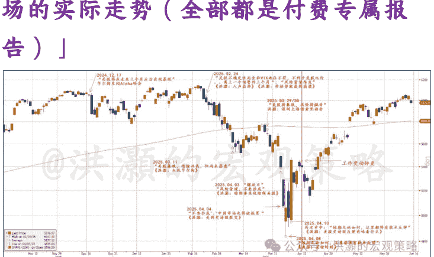

图一：上半年的预测 vs 上半年市场的实际走势（全部都是付费专属报告）

在今年四月八日标普暴跌至4,800附近的时刻，我在题为《洪灏：关键时刻》的报告里清楚地写到，“短期，无论如何，在这个位置上都应该有技术反弹”，并在四月九日的专属报告中再次强调重申。回头看，一切都是那么清晰。然而，在当时身处于市场的滚滚洪流之中去做出这些逆共识的预测，决非易事。可惜，接下来由于工作变动，我那时暂时无法跟进更新这些预测。所幸的是，现在我又可以重新专注于自己的独立研究和对冲基金管理。

我们应该如何看待下半年的风险和机遇？

## 国际流动性条件

四月美股历史性暴跌最引人瞩目的，并非是在如此短的时间里美股猛烈的跌幅，或者是美股波动率三天内破历史纪录飙升的幅度，而是在下跌过程中其它资产类别的表现。在四月美股的暴跌中，曾经被人们认为是安全资产的美元和美债都一起下跌。

历史上，在美股暴跌的时候往往也是全球风险偏好迅速退潮的时候。这时，人们往往会抛售手上的风险资产并换回美元，并用美元买美国国债避险。也正是这样的历史相关性，奠定了那个被全球对冲基金经理广泛采用的 60/40 模型，以提高投资组合的效率，降低风险但不牺牲收益。

然而，“这次不一样”。

在这次四月的暴跌里，美元反而被抛售。或者说，美元资产，如美元、美债、美股，均被投资者抛售。不知不觉，美元今年已经贬值了约 10%。显然，一定是有人在大手笔抛售美元资产，导致了这美元、美债、美股齐跌的异象。而即使现在美股已经基本修复完毕，距离其暴跌前运行到的历史高点仅不到两个百分点，美元贬值的压力依然持续。全球投资者开始“去美元化”。

于此同时，美债收益率开始陡峭化，长端利率随着长期通胀预期的飙升而上升，同时整条收益率曲线上移。不仅仅如此，全球的长端收益率都在上升，德债、日债都经历了近年来最快的、最大幅度的上升。表面看，这很可能是全球通胀预期的上升造成的。德国宣布再次武装化，并准备把军费开支独立于常规财政预算之外，颇有当年“要大炮不要黄油”的气势。其它欧洲列国也宣布不同程度地增加军费开支和财政预算。

日本的通胀压力也不小。日本米价一年就翻了一倍多，逼得日本政府不得不开仓放粮，打压粮价。一些日本商店用大米打折来招揽顾客，于是乎日本人民就在商店外排长龙捡便宜买米，为五斗米而折腰。日债 30 年的收益率已经比中国国债的 30 年收益率高了。但日本央行已经持有了超过一半的日债，因此在债市里公开操作起来缩手缩脚的。外国投资者开始在日债拍卖中缺席，甚至有几天拍卖的时候没有人报价。

我在前文论述到，公共部门负债过重往往会导致通胀，因为这些负债是流动性参与了实体经济的运行，增加了社会需求。不要忘了，公共部门是社会总需求的一个非常重要的组成部分。同时，人们也会开始考虑债务货币化，甚至印钱还债的可能性。

而私人家庭部门负债过重的后果则是截然相反的，因为这个部门没有铸币权，不能印钞还债，而只能靠劳动收入的长期积累。因此，如果没有公共部门强力介入转移杠杆的话，私人部门负债过重将会导致一个漫长的去杠杆过程。在这个过程中，资产价格下行压力不减，人们需求降级并萎缩，而资产价格的下跌将导致私人部门愈发资不抵债，形成一个负反馈的回路——一直到杠杆的完全清除。这个过程，日本用了近三十年。

Milton Friedman 曾经说过，“通胀无论何时何地都是货币现象”。我觉得这句话可以改成，“通胀无论何时何地都是财政现象”。如今，财政政策和货币政策的关联性愈发凸显。看一下中国，注意到中国的通胀水平以2011/12年左右为分水岭。那两年正是次贷危机后大力发展房地产的时候，也是我们开始着手治理地方债务问题的时候。通胀压力在 2011 年、2016 年和 2021 年前后开始逐级下降。到现在，通缩的状态已经不言而喻了。

如果全球长端收益率的上升是由于通胀预期因为全球财政赤字而起，那么长期看长端收益率易涨难跌，同时收益率曲线应该进一步陡峭化。当然，短期波动可以和长期趋势相悖。

在我的上一个专属报告里，我讨论了虽然美国进口价格上升，但是商家把进口的通胀“自己吃了”的现象。因此美国上游的通胀压力并不明显。同时，美国的服务业通胀往往滞后上游通胀两个季度，而服务业通胀的压力也不太明显（图六）。

由于服务业是美国经济最主要的组成部分，那么美国今年通胀前景可能会好于预期，并为美联储降息打开时间窗口。当然，这一切也取决于关税谈判是否能如期完成，不出太多的意外。根据特朗普“TACO”的心态，以及四月美股历史性暴跌的经验教训，特朗普也没有太多理由胡搅蛮缠、胡作非为。

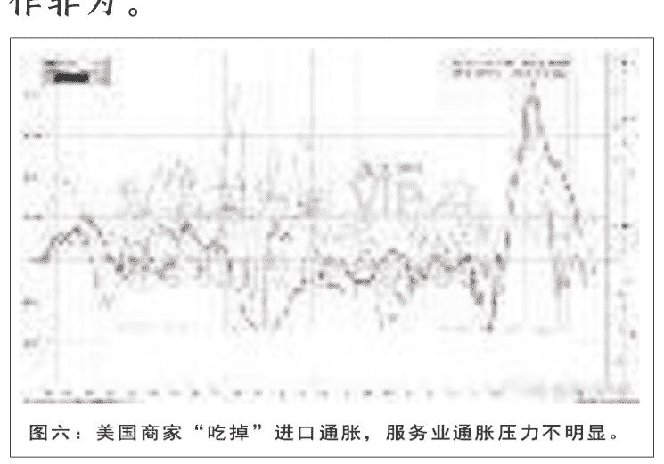

图六：美国商家“吃掉”进口通胀，服务业通胀压力不明显。

如果全球长端收益率上升在短期内并非一定意味着流动性收紧，长期则更多的是因为财政政策对于通胀预期的影响，那么全球的流动性条件现在又究竟如何？

这是一个关键问题。如前所述，中国市场的起伏取决于流动性条件的变化。投资者通过对于流动性条件变化的不同预期和理解从交易对手获得收益，而并非从长期持有获得与公司一起成长的回报。对于全球市场，从短期交易的角度来看，这个逻辑也是成立的。对于短期市场的起伏，我们并不需要过多地纠结于基本面的变化。这是因为市场价格的变化往往领先基本面的变化，而经济数据由于统计工作需要时间，其发布也往往是滞后的。市场上涨的两个主要条件：
- 市场有充足的流动性；
- 市场的动物精神有交易获利的欲望。

我们可以用量化数据模型来观察全球流动性变化的情况。图七里，我展示了我专有的全球流动性指标。这个指标为我们直观具象地展示了全球主要市场流动性条件的边际变化。

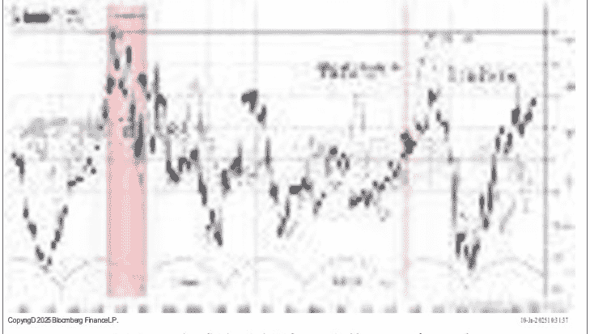

图七：全球流动性边际改善，风偏回暖

公众号懒人搜索，懒人专属群分享

从这个图可以看到，我的全球流动性条件指标与著名的美国经济衰退的前瞻性指标—美债收益率曲线是高度相关的。然而，这个指标对于经济和市场前景的判断，在最近的这个周期里表现较美债收益率曲线更佳。比如，收益率曲线其实在去年就结束了倒挂、重新正常化了。历史上，前面两次美国进入经济衰退之前，美债收益率曲线往往结束倒挂而正常化。换言之，美债收益率曲线倒挂的时候并不就意味着经济衰退，而是在曲线正常化的前后。这时，资金出于避险偏好，重新回到曲线短端，压低了短端的收益率。

如果我们根据收益率曲线历史性的规律来预测去年的美国经济，那么我们就会错过了过去两年一次史诗级的、以科技为领导的大牛市。我们去年看多美股，是因为去年美国政府在一个没有衰退的环境里继续保持巨大的财政赤字。因此，尽管之前美股已经涨了两年，我们当时继续认为美股的牛市还没有走完。

再仔细观察一下我专有的流动性条件指标——它在 2022 年十月末触底并开始反弹。这个时间节点和当时中国乃至全球市场开始的一波触底反弹的行情吻合。从那时起，中国市场运行的趋势开始逆转。虽然很多人懵懂不觉，但是中国市场从 2022 年十月末以来的走势，是更高的低点和高点。那也是我发表那篇经典的报告《洪灝：买！买！买！》的时刻。

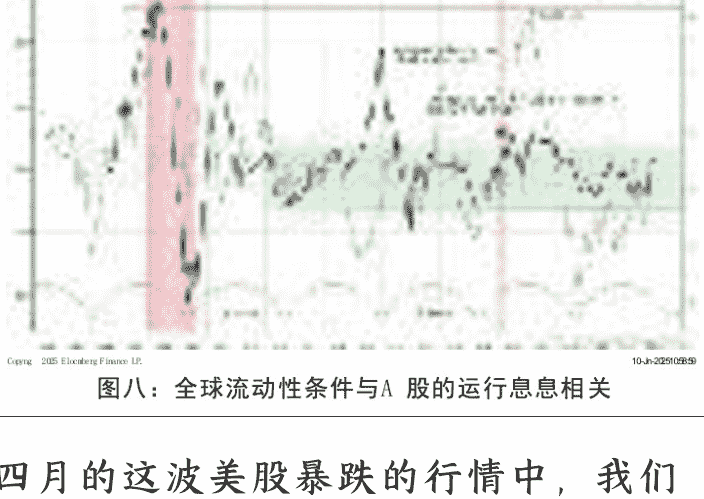

四月的这波美股暴跌的行情中，我们可以观察到流动性条件是边际萎缩的，但又在四月的中下旬触底反弹，现在已经回到了正常的水平（图 8 绿色区间）。这也是特朗普不断喊话鲍威尔、甚至以炒鱿鱼之名来威胁鲍威尔降息的时候。

美国两年国债收益率早已远低于美联储的基准利率水平。一般来说，两年国债相对于基准利率的这样的水平往往预示着美联储即将开启降息。而最近美国的通胀数据好于预期，同时关税导致的通胀暂时尚未出现在经济数据里。这些观察都告诉我们，美联储货币政策的下一步，将应该是调降基准利率。如是，国际流动性条件应该继续边际改善。

于此同时，我们专有的美国经济周期指标也显示了美国经济周期开始在长期均值附近修复，同时伴随着标普反弹（图九）。图九：我专有的美国经济周期指标显示美国衰退概率较低。

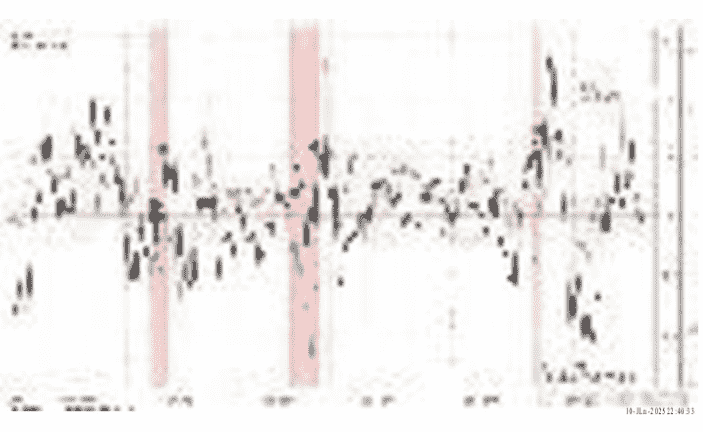

在两个具有稳定的历史业绩的指标同时得出类似的结论，那么这个结论的成功率应该是比较高的。我在报告篇首回顾今年以来预测业绩的时候，提到了在四月八日市场暴跌到最低点的时候，当时的市场严重超卖、情绪极其低迷。因此，在那天题为《洪灏：关键时刻》的专属报告里，我指出“无论如何，这里都将有技术反弹”。同时，在四月九日题为《洪灏：美股史诗级反弹意味着什么》里，我再次重申强调了这个观点。

请注意：我当时认为技术反弹即将展开，但是也没有把这次历史性的反弹定义为反转。严格地说，只有美股创出决定性新高之后，趋势反转才能够正式确立。否则，也只能定义为技术反弹，无论市场反弹势能有多强。很多人很纠结，总是认为如果是技术反弹那么就不能参与。其实，这种想法就是混淆了投机和投资的关系。这样的心态，其实在市场新高确认趋势性反转之后也不会买入，却肯定会掉过头来埋怨他人“没有讲清楚”。

除了美联储准备降息之外，欧洲央行也准备降息。由于毫无通胀压力，中国央行下半年也将大概率降息降准，尽管步伐可以再大再快一点。日本面临着数十年未见的通胀压力，因此日本央行很可能会加息。然而，即使日本央行加息，它加息的节奏也将会是缓慢的。这时，快速飙升的通胀反而将使日本的实际利率走低，即使日本央行加息。因此，逻辑上，流动性的前瞻也是和我专有的流动性条件模型一致吻合的。

我们之前讲到，短期内，市场上涨的重要条件，是市场需要有充沛的流动性和动物精神——东西方市场都一样。在下列的图表中，我为各位展示我专有的流动性条件指标和股票、黄金、白银、工业金属、比特币和美元、人民币汇率等重要资产类别的价格走势的相关性。毋庸置疑，全球流动性条件的好转利好风险资产。如是，人民币汇率应该稳中向升，金属价格应该走强，而美元则将进一步走弱（图 9—14）。

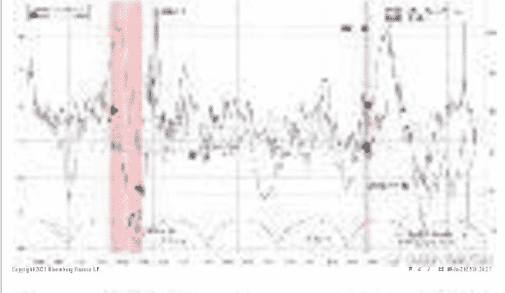
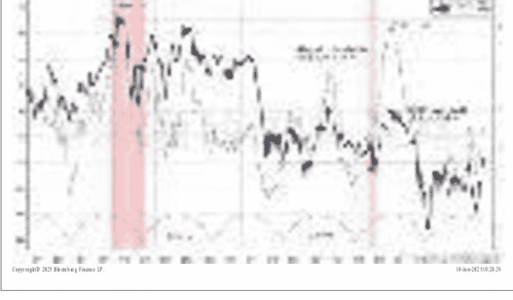
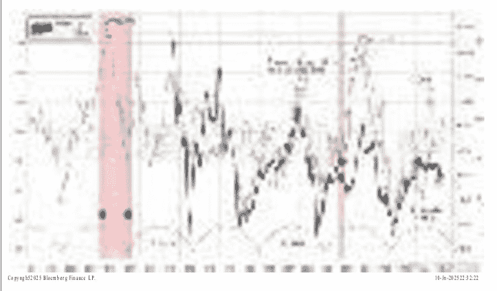
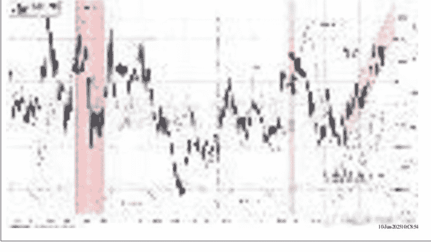

图 9—14：流动性条件改善利好风险资产

值得一提的是黄金的价格走势。读者们都知道我在过去两年一直推荐黄金，而黄金表现不俗。今年年初至今，黄金为投资者带来了近30%的收益，是表现得最好的大类资产，并在五月一度刷新了历史新高3500美元。然而，图十二显示黄金的价格回报走势也开始逐步地趋于极致。

因此，虽然我们认为黄金将继续有所表现，但是短期内其他贵金属将分流黄金流动性，使黄金上行速度受到制约。换言之，其它金属短期很可能表现会比黄金好，但是黄金依然是安全资产长期配置的不二选择。原因很简单：因为黄金不会违约、破产。黄金的信用几千年如一日地存在，现在已经是全球银行第二大储备资产。

## 香港流动性条件

今年以来，北水源源不断进入港股扫货（图15）。作为一个内地基金经理，如果要跑赢对照指标，那么今年超配港股就可以轻松跑赢，Alpha（阿尔法）爆表。虽然受到四月份美国历史性暴跌的牵连，恒指也一度下探到19000点附近，但五月也基本修复了年初以来的涨幅，继续是今年全球表现最好的主要市场。

图十五：北水大规模南下，恒指下半年应该还有新高

同时，不仅仅是北水，我们看到海外的资金来港也是络绎不绝。我们的全球流动性指标的改善，中国香港市场也有很大的贡献。今年香港的港币由于海外资金大规模抵境，一度触及到了联系汇率交易区间的强方，而香港金管局也不得不出手干预。

这些资金，有些是因为香港市场今年的表现而来，但我们相信有相当一部分资金是来香港市场打新的。今年，香港重返了全球上市融资额的巅峰，年初至今已经为上市公司筹集了约 800 亿美元的资金。而今年上市的公司表现都不俗，打新策略在今年有非常好的收益。这些市场回报产生的示范效应正在凝聚势能，下半年应该会吸引更多的资金来港投资。因此，单从流动性角度来看，港股下半年应该还有新高。

交易上，我们看到港币汇率走势开始与美元相悖，显示资金开始从美国市场轮动到香港市场（图 16），而香港金管局的基础货币规模开始大幅飙升（图 17），而香港隔夜利率被快速地从 4%压到了 0.5%。这些迹象都表明资金大规模涌入香港市场，而香港市场的流动性非常充沛。

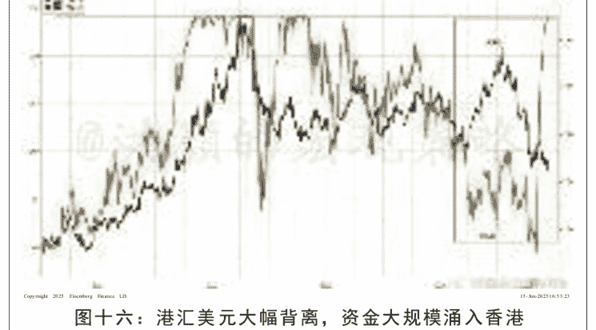
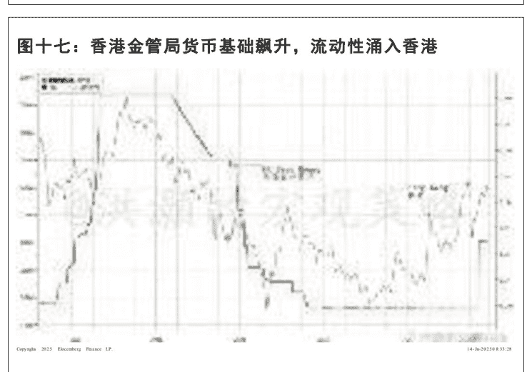

还有一部分进入香港市场的资金很可能是来自于美国市场的轮动，也就是我们在前面章节讨论的全球“去美元”化的过程。美元走势早已与美债和通胀预期分道扬镳（图 18）。在去年十一月展望今年的时候，我们逆共识地认为美国“在未来三个月左右将出现大级别的调整”，“美元将开启贬值趋势”。那时，全球所有的分析师都还沉醉在美国“例外主义”的幻觉中。


图18.美元走势早已与美债和通胀预期分道扬镳

那时，从美股占全球股指的比例达到了历史新高、美股相对表现历史新高和国际投资者持有美股的比例历史新高的情况来看，当时美股、美元的强势都是不可持续的。而这一趋势仍将聚集势能，自我强化。

注意：我们讨论的是美股相对回报势能的减弱而非消失。从配置上看，由于美元资产体量巨大，暂时没有体量相当的其它资产在配置的时候能够容纳全球如此庞大的流动性。因此，所谓的“去美元化”是一个资产轮动的过程：国际资金获利了结一部分在美股的投资收益，并把这些资金重新投入美国以外的其它市场，比如欧股、新兴市场、中国香港、贵金属、加密货币等非美资产。甚至已经跌了几年的香港房地产市场也将会迎来喘息之机。

由于美股的指数结构和美国的退休金制度，美股涨的时间比跌的时间长，但跌的时候也将是轰轰烈烈的暴跌。这是因为美国的几大公司市值已经占了美国市场总市值的三分之一以上，而美国的退休金制度 401K 则是让美国人的退休储蓄定期地投入美股指数。因此，美股指数权重股就会自动定期地获得更多的资金流入，形成指数上涨趋势。然而，在指数下跌的时候，这个结构在投资组合再平衡（rebalance）的时候，又会导致指数权重股出现大幅的资金流出，令指数暴跌。暂时，我们并没有看到改变美股的这个结构及其导致的、美股走势必然结果的因素。

## 结论

今年以来，全球市场的走势与我在去年十一月对于今年的预测基本一致：美股出现了史诗级的暴跌和反弹，美元出乎共识意料地走弱，黄金创出了历史新高，而中国市场也成为今年“最逆共识”的交易之一。

短期交易中，市场的流动性条件和动物精神是主导市场走向最重要的因素之一。而长期以来，中国市场的 EPS 每股盈利水平并没有发生根本的变化。因此，中国市场的股价变化主要来自于流动性条件的变化。央行的货币政策取向从根本上决定乐了中国市场的流动性条件和由此而来的动物精神。中国市场的这个特点也让主要指数长期徘徊于一个交易区间之中。

中国经济的负债结构决定了中国资产价格和通货膨胀未来的趋势。长期看，实体经济中不同的部门作为负债的主体，对于长期通胀走势和资产价格的趋势的影响是截然不同的。美日房地产泡沫破灭后不同的应对方法，为这个结论提供了重要经验观察。

90年代初日本房地产泡沫破灭之后，日本央行迟迟不放宽货币政策，希望通过私人部门自我去杠杆来应对房地产泡沫的破灭。然而，这个部门是无法通过印钱来化债降杠杆的，只能通过储蓄积累来去杠杆。这势必引起经济中消费需求的不足，导致经济增速下降，资产价格的下行压力。而资产价格的进一步下行将导致私人部门的杠杆率不降反升。

毕竟，资产价格变化的速度远快于储蓄增长积累的速度。

债务的刚性，不仅仅在于债务不会因为资产价格下降而变，更是因为用储蓄积累还债是一个旷日持久的过程。日本用了二十年，直到2011年阪神地震之后，在“三支箭”政策的帮助下，才逐步走出了债务的阴影。在那之前，上述的去杠杆过程形成了一个负反馈循环。中国经济现在面临的又是何其相似。

而08年次贷危机后美国政府的应对与日本不同之处，是美国公共部门迅速出手，通过量宽和最后的财政货币化、直升机撒钱等方法，迅速地把经济中的债务负担从私人部门转移到了公共部门，并通过破产清算来解决债务问题，让信贷周期迅速重启。

公共部门承接债务负担的必然结果，是这些流动性参与到了实体经济运行中，公共部门的财政支出也扩大了整个社会的实际需求，弥补了私人部门去杠杆时候需求的不足。因此，这种由公共部门承接债务负担的方法肯定是容易引发通胀和资产价格上升的，而日本式的私人部门自然去杠杆的方法肯定是容易导致通缩和资产价格下跌的。这些都是可以借鉴的国际经验。而中国经济需要公共部门坚决的扩表。

短期，全球的流动性条件是继续在边际修复的。主要央行，除了日本央行面临通胀压力而很可能不得不加息，其它都在降息。比如欧洲央行和中国央行。美国最近的通胀数据好于预期，显示上游的进口通胀压力被商家“自己吃了”，而美国经济最大的一部分服务业里的通胀还是在放缓。

在经历了四月史诗级暴跌之后，相信特朗普在胡作非为之前也不得不三思而行。即便是特朗普关税的“休战”期限将至，同时在这些关键日期附近也必将再次扰动市场，但是特朗普关税最差的时刻，可能已经过去了。同时，即使日本央行加息，那么日本的真实利率还将是在零以下。

我专有的流动性条件模型显示流动性条件在边际改善。这个情况利好风险资产。同时，由于资金不断从美股轮动出来，投向非美资产，欧股、新兴市场、中国香港、贵金属、加密货币等非美资产在下半年都应该继续有所表现。甚至已经跌了几年的香港房地产市场也将会迎来喘息之机。

我们以上的分析是以贸易谈判继续稳定发展为基准情景的，并不考虑地缘政治因素。执笔时，伊朗和以色列的冲突开始扩大。然而，以色列在一日之间摧毁了伊朗如此多的核设施、刺杀了一系列伊朗军方的高层指挥，以及美国的默许和介入，都显示出双方实力的悬殊。在地缘冲突中，力量相当是持久战，力量悬殊那么就是速决战。这是我们预测的基准情形。

油价涨幅已经从14%回落到7%，金价保持涨幅，再次逼近历史高点3,500。短期内新闻头条的风险将继续扰动全球市场，但也会为投资者创造买入机会。


懒人专属群持续更新中，已持续运营6年，整理超3000份各类精选付费文章及年费社群干货，全部开放下载。

本资料为付费群内部分享，仅供真实有需要的朋友查阅

懒人专属群更新记录：

```
https://lazy2025.top/#/blog/record2
```

懒人专属群更新记录（需梯子，备用）：

```
https://lazybook.fun/#/blog/record2
```