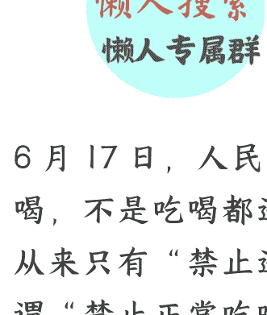
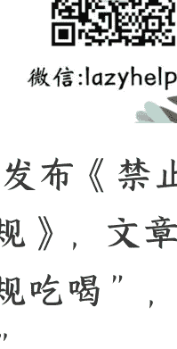

# 如何看待史上最严“禁酒令”

250623 文/卢克文工作室嘉宾 老纪扶犁

整理：公众号懒人搜索，懒人专属群独享

懒人微信：lazyhelper

6 月 17 日，人民网发布《禁止违规吃喝，不是吃喝都违规》，文章指出，从来只有“禁止违规吃喝”，没有所谓“禁止正常吃喝”。

6 月 19 日，新华社发布《整治违规吃喝，不是一阵风不能一刀切》，文章指出，整治违规吃喝的核心是违规，而不是吃喝本身。

6 月 20 日，求是网发布《禁违规吃喝，不是禁正常餐饮》，文章指出，清风正气和人间烟火，从来不是非此即彼的选择题。

这是三大官媒，就 5 月 18 日新修订的《党政机关厉行节约反对浪费条例》（即最严“禁酒令”）的连续表态。

就单一事件，动用三大官媒密集发声，这种情况极为罕见。这说明，“禁酒令”出现了过度解读和执行情况，需要及时进行纠偏。

“禁酒令”究竟有些什么新情况？又该如何看待？

## 「01」

公众号懒人搜索，懒人专属群分享

要理解这个问题，得先搞懂咱们这次为什么要禁酒。

### 第一，禁酒并非咱们独创，这档子事，从古到今各国都常搞。

因为酒通常和“色”挨着，“酒色财气”都是人的欲望，需要节制。酒有两个不好，一是乱性，喝了酒后，平时不敢讲的话，敢讲了；不敢做的事，敢做了；二是误事，要么做错，要么遗忘。

商纣王酒池肉林，亡了国家。张飞醉酒，丢了性命。现代社会，多少酒驾醉驾，导致家破人亡。

酒误人误事，却屡禁不止，为何？因为一旦会喝酒了，就有成瘾性，会分泌多巴胺，让人愉悦。和香烟，甚至跑步、阅读一样，形成习惯后，很容易依赖。

但是必须要区分，古代禁酒本质是经济原因，酿造酒需要消耗大量粮食，通常是3比1，即三斤粮食酿出一斤酒，如果大量酿酒，会导致严重饥荒。

而现代禁酒，多半是社会问题，比如，1920-1933年美国全面禁酒，就是因为酗酒导致贫困和家庭暴力太多。

宗教禁酒比较普遍，但效果也没有想象中那么好。

举个例子，有个在中东当过联合国观察员的人说，他不喝酒，但每周都要开车去邻国买两箱啤酒，然后拉到当地地下酒吧。因当地禁酒，即使翻 3 倍价格也能轻松卖出，要不是只允许外国人每周带二箱啤酒，他说他早发财了。

所以，禁酒是常态，但难度也很大。

### 第二，这次禁酒的原因。

表面上看，是发生了 4 起喝酒致死事件。

3 月 22 日，河南省信阳市罗山县政法委 5 名干部喝了 4 瓶酒，结果 1 人致死。

4 月 5 日，湖北省黄冈市黄梅县有关党员干部违规聚餐饮酒，导致该县统战部部长罗某因酒心性猝死。

4 月 27 日，安徽省安庆市宿松县千岭乡党政领导班子成员违规聚餐饮酒，该乡党委副书记吴某因胃内容物返流窒息死亡。

5 月 7 日，内蒙古人大正厅职干部魏某因亲属在内蒙古科技大学包头医学院二附院就诊，与该院干部医生喝酒，导致该院介入科主任郭某死亡。

其实，如果向远里看，这类事件还非常多。比如，2022 年青海 6 名“厅官”，喝了 7 瓶白酒，结果把青海省海北州委书记喝死。

据中纪委通报，2024 年违规吃喝问题 51170 起，相较往年成上升态势，而 2025 年以来，这类问题更是层出不穷，要知道，关于禁酒及整治违规吃喝，咱们可是抓了很多年了。

为何越抓越反弹？很简单，这个问题出现“耐药性”了，大家有些麻木了。

咱们梳理一下禁酒的过程。

最早的禁酒令，起始于军队。

2008 年 8 月 1 日，空军正式颁布《空军部队从严控制饮酒的规定》，明确严禁工作日饮酒、严禁酒后驾车、严禁值班执勤期间饮酒等条款，并配套酒精检测、举报监督等制度。同年 11 月，济南军区也实行禁酒，这算是为后面全国禁酒拉开了序幕。

这次禁酒的直接原因，是发生了多起酒后驾车事故，但实质原因是，军队喝酒之风太烈。客观上讲，武器和烈酒本就不分家，“大块吃肉、大口喝酒”方能体现战斗豪情，以致于很长一段时间内，把喝酒当成标签，贴在军队身上。

但凡喝酒场合，只要一介绍某人是军人，大家会下意识认为你很能喝。在军队内部，也形成了一些不良风气，比如“酒风就是作风，酒量就是胆量”，最出名的段子就是“抢板凳”。

宴会上通常要差额设座位，假设 6 个人吃饭，只有 5 个座位，人到齐后要竞争上岗，先每人直接喝半瓶，然后一杯一杯喝，谁不行谁就一边休息去，剩下 5 个人才正式上桌。

之所以出现这些段子或风气，根子是产生了错误酒文化，把能喝当成一种本事，一种软实力，毕竟酒量大的，更容易进入领导圈子。

在军队试点的基础上，2012 年 12 月，中央八项规定出台，禁止公款宴请、铺张浪费，为禁酒提供顶层设计。

2013 年 12 月，中办、国办印发《党政机关国内公务接待管理规定》，这算是全国首次以法规方式限制公务饮酒，明确“工作餐不得提供香烟和高档酒水，禁止超标准接待”。

各地各部门也相应出台了措施，公务喝酒问题开始得到抑制，高档酒楼出现“关门潮”。

其实，这还只是限酒，并非禁酒。

2021 年，中纪委下发《关于开展违规吃喝问题专项整治的通知》，这标志着对违规吃喝问题开始收紧，压力逐步向基层传导，不仅明面上禁止基层领导“吃喝风”，而且还要打击内部食堂、私人会所，以及“矿泉水瓶装茅台”等地下活动。

直到此次，全面禁止公务人员、国企人员违规吃喝。

从整个过程清晰看出，禁酒是有章法、有步骤的，不是“一阵风”运动，而是按照先高级领导，然后基层领导，最后公务人员，缓冲式开展。

### 第三，这次为何又称最严“禁酒令”？

这次重新修订的《条例》，关于涉“酒”的原文表述是，“工作餐不得提供高档菜肴，不得提供香烟，不上酒”。

与修订前相比，最大的变化是，从“不提供高档酒”明确为“不上酒”。以前是有人钻空子的，用便宜酒瓶装高档酒，而这次是彻底不准上酒，考虑到《条例》只要不修订，就将长期有效，可以认为，这是长期禁酒了。

在公务接待中，任何酒都不能喝了，是最严“禁酒令”。

“禁酒令”一出，加上几起事件的通报，各地迅速推出了升级版“禁酒令”，虽然细则不同，但总的来说，集中在以下几个方面。

其一，扩大了对象，有些地方只要是沾边体制的人员，一律要求禁酒。

其二，扩大了时间，有些地方要求在岗或值班时，均不得喝酒。

其三，扩大了范围，就算非公务场合喝酒，造成不良影响的，也要问责。

另外，普遍要求集中学习培训期间，不准喝酒。

其实，中央的“不上酒”，主要是体现公务接待上，而各地的升级版，扩大到了公务接待外，比如学习培训或在岗时，有点像“工作不喝酒，喝酒不工作”，并没有太多夸张。

然而，在末端执行上，个别地方搞了“一刀切”，不仅不能喝酒，连吃饭也不准了，最典型的就是安徽涡阳2名银行员工与客户吃了碗面，客户掏了钱，结果这2名员工被罚款3000元。

此外，层层加码、过度走火的现象也时有出现，比如，不敢下文件，纪检就偷偷打电话通知禁止吃喝，或者晚上八点突击视频查饭局，甚至纪检干部守小店门口盯人吃饭。

这些现象直接让网上蹭流量的人曲解误读，以讹传讹，甚至造谣生事，比如，聚餐不能超过3人，下班撸个串必须打申请，必须AA，24小时禁酒等等，这给很多人造成了困惑，连正常聚餐都怕说不清了。

其实，整治违规吃喝，中纪委公布的查处违反中央八项规定精神问题统计表里写得明明白白，一是违规公款吃喝，二是违规接受管理和服务对象等宴请，三是违规出入私人会所。

公款吃喝、接受可能影响公正履职的宴请、超标接待，这些才是违规，正常聚会，吃吃饭并不是问题。

## 「02」

那么，咱们应该如何看待这份史上最严“禁酒令”？

### 第一，从政治层面看，彰显了中央整治违规吃喝的雷霆决心。

这次修订，显然不是“运动式”治理，而是十年磨一剑的制度化、体系化成果，传递的信号非常明确，对“酒桌上的腐败”，中央的态度是零容忍。

把“不上酒”以白纸黑字地固化下来，是从“治标”的劝诫提醒，转向了“治本”的法规约束，就是要从根源上铲除违规吃喝这一顽疾。

其实，揪着违规吃喝不放，主要有两点考虑。

一是违规吃喝不但铺张浪费，而且滋生腐败。以成都为例，在 2000 年左右，最高档的餐厅银杏酒楼，那每天可是宾客盈门，能够随时订到包间，简直成了身份象征，而公款消费非常多，价格也离谱，一盘凉黄瓜居然 300 元。

二是毒化政治生态。酒桌文化本质是权力服务测试，容易导致“善饮者上位，能干者边缘化”的逆向淘汰怪圈，助长投机钻营、拉帮结派的官场文化，对公务员队伍产生根基性破坏。

因此，在整治违规吃喝上，决不是“一阵风”，而是作为根本性制度建设，会持续巩固深入的。

### 第二，从社会层面看，赢得了广大人民群众欢迎和支持。

虽然有些谣言，但整体上是希望在公务活动中禁酒。

因为民众天然对“公款大吃大喝”深恶痛绝，欢迎一个廉洁、高效、务实的政府，而不是一个在酒桌上推杯换盏、疏离群众的官僚体系。

此外，禁酒对移风换俗也有帮助。社会上盛行的酒桌文化，在很多时候异化为一种“潜规则”，办事合作，似乎都离不开饭局酒局的“加持”。最严“禁酒令”的落地，相当于“官方认证”，必将引导人际关系在尊重和规则之上建立，而非酒精催化。

当然，“禁止违规吃喝”而非“禁止一切吃喝”，既要刹住歪风邪气，也要保护正常的“人间烟火”。一个清晰的界限是：用纳税人的钱办的公务，必须滴酒不沾；私人之间自费的正常聚会，则属于个人自由。

这种精准施策，才能赢得更多民意认同。

### 第三，从经济层面看，短期内会形成冲击，长期则倒逼相关产业转型升级。

“禁酒令”对经济的影响，是社会最为关注的焦点之一，主要集中在白酒和餐饮两大行业。最直接的冲击对象是高端白酒。

以茅台为例，2012 年“八项规定”出台后，价格跌到了 800 元，直接开始过冬。

但经过多年发展，政务消费现在占比不到 10%，商务宴请（非公款）、大众消费和礼品市场才是绝对主力。

从长远看，这将加速白酒行业彻底摆脱对“权力消费”的依赖，回归到品牌、品质和大众市场的竞争本质，一个由真实消费需求驱动的市场，方能稳固持久。

与白酒行业类似，高端餐饮业也经历了一轮痛苦转型，大量依赖公款消费的高档酒楼或倒闭，或“放低身段”拥抱大众市场。如今的餐饮市场格局，是“好吃不贵”的大众餐饮和连锁品牌占据主流。

新规将对仅存的、依然对公款接待抱有幻想的高端餐饮业态形成最后一击，加速其出清。

经济层面的冲击不可避免，但将挤光依附公权力的泡沫，最终构建一个更加公平和富有活力的市场。

实事求是地讲，个别地方乱加码，直接禁止吃喝，对县域经济冲击会很大，毕竟公职人员是县域的主力消费人群，这也是三大官媒发声的重要原因之一。

总而言之，“史上最严禁酒令”，实质是一场从“舌尖”到“心尖”的变革，是以雷霆手段禁住公权滥用，以移风换俗引导人际交往。

当“清风正气”与“人间烟火”不再是非此即彼的单选题，而是在明确规则下和谐共生，我们方能迎来一个政治更清明、社会更和谐、经济更健康的未来。

懒人专属群持续更新中，已持续运营6年，整理超3000份各类精选付费文章 & 年费社群干货，全部开放下载。

本资料为付费群内部分享，仅供真实有需要的朋友查阅

懒人专属群更新记录：

https://lazybook.fun/#/blog/record2

懒人微信：lazyhelper