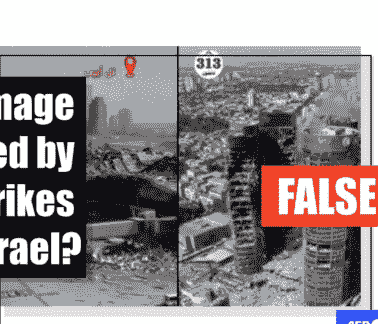
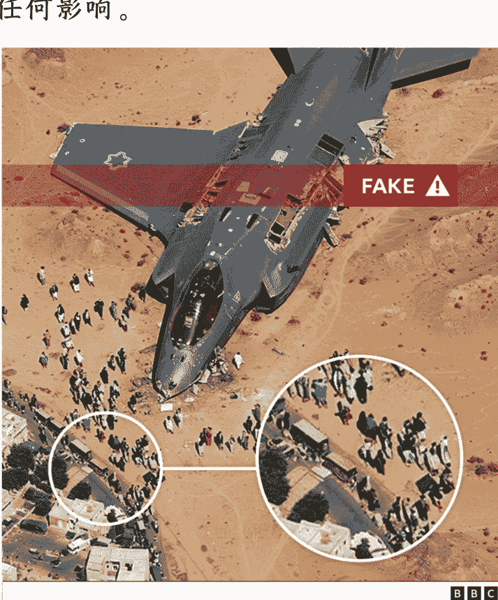

# 伊朗-以色列冲突中的 AI 信息混战

250625 新闻实验室

整理：公众号懒人搜索，懒人专属群独享

懒人微信：lazyhelper

微信：lazyhelper

真实画面稀缺，AI 合成内容趁虚而入。

6 月 13 日，伊朗与以色列的最新一轮冲突开始，双方持续交火，并且发出态度强硬的言论。

在不同的媒体时代，战争冲突会得到不同方式的呈现，而交战各方也会尝试使用不同的策略试图对信息施加影响。

本期新闻实验室会员通讯，我们就来谈谈在生成式 AI 时代发生的这场武装冲突当中出现了怎样的“AI 信息混战”。

## 「AI 虚假信息操纵战争叙事」

以色列和伊朗的导弹攻防不仅在现实中令人紧张，更在数字空间掀起了新一轮“AI战争”。BBC、AFP、Politico、404Media等多家媒体均指出，生成式AI工具已经成为这场信息战的主角。

以色列空袭伊朗后不久，社交平台上出现大量AI生成的视频与图片，内容包括“德黑兰遭导弹袭击”、“以色列最大机场被伊朗摧毁”等。这些视频迅速在X、Facebook、Instagram、TikTok等平台传播，许多内容短时间内获得上千万浏览量。例如，BBC Verify团队发现，三条最热门的假视频累计播放量超过1亿次。

这些AI内容不仅来源于民间“内容农场”，也有不少带有官方色彩。与官方关系密切的《德黑兰时报（Tehran Times）》等伊朗主流媒体账号，发布视频声称捕捉到“伊朗导弹击中特拉维夫”的瞬间。这类视频拥有高度写实的画面，但事实核查者通过技术分析和水印追踪，证实了它们其实是AI生成。原来，不少视频甚至在发布的时候都还带有Google Veo 3的水印——这是Google在上个月刚刚发布的最新视频生成模型。

值得一提的是，Veo 3生成视频有个共性——长度通常为8秒，这一细节成为识别AI伪造视频的线索之一。加州大学伯克利分校教授、GetReal Security创始人Hany Farid指出，这种“八秒定律”虽不能直接证明视频为假，但应引起警觉。

不仅伊朗方面在利用 AI 工具操纵战争叙事，以色列、俄罗斯等多方也被指涉入信息战。Alethea 分析公司 CEO Lisa Kaplan 指出，一些专门制造和扩散关于以军 F-35 战斗机被击落的网络账号，背后有着俄罗斯人的影子。这些账号通过发布 AI 合成的 F-35 残骸图片、模拟夜间轰炸的短视频等，引导公众相信以色列遭受重创，进而削弱西方武器的威信。

此外，亲以色列账号也有操作。例如，通过循环播放伊朗早期抗议或集会的旧片段，假称“伊朗国内反对政府、支持以色列的浪潮高涨”。但是这些视频实际上与当前局势无关，属于“移花接木”。

## 「没有血的战争画面」

在这场“AI 信息战”中，不仅内容量庞大，视觉风格也有显著特征。

404 Media 发现，许多热门的 AI 生成视频和图片均显示出“bloodless”（无血）的特征。究其原因，是因为生成式 AI 模型和社交平台的内容审查机制，对血腥、暴力或明显人身伤害的画面有限制。

我们可以看一个具体的账号例子：3amelyonn，它在 Telegram 和 TikTok 上持续发布 AI 生成的战争场景。2025 年 4 月，3amelyonn 在 TikTok 上传第一条 AI 生成的视频，内容是俯瞰被炸毁的黎巴嫩城市。这则视频很容易看出来是 AI 制作的，因为里面的线条经常抖动，还会出现其他奇怪的元素。

但是，这个账号后来发布的视频越来越难看出来是 AI 生成的，这可能也是由于 AI 技术本身在进步。5 月 27 日，它发布了一条内容为“特拉维夫毁灭”的 AI 视频，这段视频后来被《德黑兰时报》引用，成为“特拉维夫遭轰炸”假新闻的流行素材。这条视频在 TikTok 上获得了超过 1100 万次观看量。

6 月 5 日，它发布的一则声称是本-古里安国际机场（位于特拉维夫东南 15 公里的以色列最大机场）的视频，显示了被轰炸的楼房和被摧毁的飞机。这则 AI 生成的视频获得了超过 200 万次观看。

3amelyonn 发布的 AI 视频还有一个典型特征：画面中几乎没有人类，有的只是如无人机拍摄般的城市废墟。即使有人，也只是远景中静止的观众或士兵，而不是正处于战斗状态或者负伤了。这应该也是由于 AI 模型的局限性所致。

其它获得大量传播的虚假视频还包括：“伊朗导弹击中特拉维夫市区”、“夜间 F-35 被击落”——后者实际源自军事模拟游戏 Arma 3，但被包装为“实拍”。还有一条在 TikTok 上超过 2100 万次播放的视频，号称“以色列 F-35 被防空系统击落”，后被 BBC Verify 调查证实系游戏画面，平台最终将其下架。

BBC Verify 表示，还没有发现过一架 F-35 被击落的真实视频，目前看到的全是假的。比如以下这张，乍一看好像真实，但至少有两个明显破绽——第一，比例不对，人比巴士还大；第二，战机坠入沙漠，却对沙子没产生任何影响。

这些因为技术限制而露出的破绽，在今后随着技术的进步是不是会逐渐消失？很有可能。那也就意味着，事实核查者的工作更难了。

不过，AI 开发者正在做一些预防措施。例如，Google Veo 3 就内嵌叫做 SynthID 的隐形水印，普通用户难以用肉眼辨识，但专业检测工具可以轻松发现。

不少事实核查团队正是利用 SynthID 等技术，结合数字取证方法，努力追踪和揭穿这些 AI 假视频。但是，大众用户很难主动去核查一则视频是否真有 AI 水印。

## 「信任危机：AI 信息战背后的更深忧虑」

AI 内容为何在此次战争冲突中如此流行？

一个重要原因是，战争期间各国官方均呼吁民众不要上传真实战争画面，以免泄露情报。例如以色列国防军曾在 Facebook 公开劝告民众“不要上传受袭地点和现场视频”。这就使得真实画面稀缺，AI 合成内容便趁虚而入。

AI 驱动的信息战不仅改变了战争期间的舆论格局，也深刻影响了社会心理和国际政治。信息操控已不再局限于传统宣传手段，AI 让各方都能低成本、大规模制造“现实”。随着“真假难辨”成为日常，普通民众、媒体机构乃至决策者都面临信息混乱与信任危机。

NewsGuard 研究员 McKenzie Sadeghi 强调，普通伊朗公民正被困在“信息密室”中，官方与亲官方内容主导一切，外部真实信息难以渗透。这种环境下，国家级媒体可以随意编织叙事，民众难以分辨真伪。伊朗还通过切断互联网、限制访问、关停境外网站等方式强化信息封锁。例如，伊朗在近期冲突中曾以“防止以色列网络攻击”为名，主动限制网络连接，进一步加剧外界与内部的信息壁垒。

网络黑客也成为信息战的重要参与者。在这次冲突中，亲以色列黑客曾成功入侵伊朗国家电视台，插播反对政权的视频，呼吁伊朗人走上街头抗议。伊朗政府随即加大互联网管控力度，防止进一步的信息渗透。与此同时，美方也在警告网络攻击风险。美国国土安全部发布“国家恐怖主义警报”，称在美军打击伊朗核设施后，可能会面对来自伊朗政府及其支持者的网络袭击。

AI 内容的泛滥也带来了“事实退场”的风险。正如加州大学伯克利分校教授、GetReal Security 创始人 Hany Farid 所言，AI 生成的战争迷雾让各方都能轻易否认对方发布的任何证据，从而使得“事实”变得无足轻重。这种现象不仅出现在中东战争，也出现在俄乌战争等语境。Politico 特别指出，俄罗斯近年来已将 AI 假新闻作为其影响全球舆论的重要工具。

社交平台自身的审核措施也面临压力。随着 Meta ( Facebook 及 Instagram 母公司 ) 、 TikTok 等公司削减内容审核团队、减少人工审核，AI 生成假新闻的传播门槛更低。甚至连 AI 聊天机器人 ( 如 Grok ) 也曾被发现错误判断 AI 视频为真实内容，向用户输出错误解释。

美国圣母大学研究员 Matthew Facciani 指出，在战争、政治等二元对立话题中，民众更容易被情绪带动，无条件转发与自身立场一致的内容。这种“认同驱动”的再传播，使得谣言和假新闻传播速度远超事实核查和辟谣。

而 ChatGPT 、 xAI Grok 等 AI 助手被普通用户当作事实核查工具，但其自身的准确性和中立性同样面临挑战。

以色列与伊朗的冲突，已不仅仅是导弹与战机的较量，更是一次前所未有的“AI 信息混战”。生成式 AI 工具极大地扩展了假新闻、假视频的生产能力，令真相在战争迷雾中越发难以辨认。这场武装冲突的较量，某种意义上也在于对“数字真相”的争夺。

懒人专属群持续更新中，已持续运营 6 年，整理超 3000 份各类精选付费文章 & 年费社群干货，全部开放下载。

#### 本资料为付费群内部分享，仅供真实有需要的朋友查阅

- 懒人专属群更新记录：https://lazy2025.top/#/blog/record2
- 懒人专属群更新记录（需梯子，备用）：https://lazybook.fun/#/blog/record2