# AI 赋能视频号，如何通过账号矩阵实现月入 3 万（喂饭级教程）

公众号懒人搜索，懒人专属群公众号懒人搜索，懒人专属群独享

懒人微信：lazyhelper

大家好，我是代一。

3 个月之前分享了一个视频号实操的帖子拿了精华。7 天风向标实战:从零到千变现之路-知识星球

又通过近几个月的深耕，以及取得的结果，也有幸在本次航海被选为了 AI 赋能视频号项目的教练。

上周被安排做了一场高手领航的直播，把自己做整个项目的一些思路都梳理分享了出来，不少圈友都反馈收获很大。

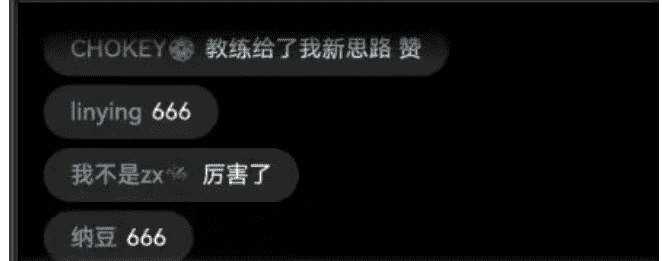

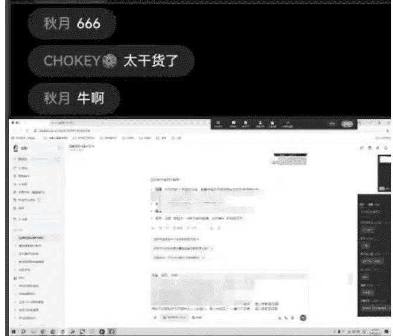

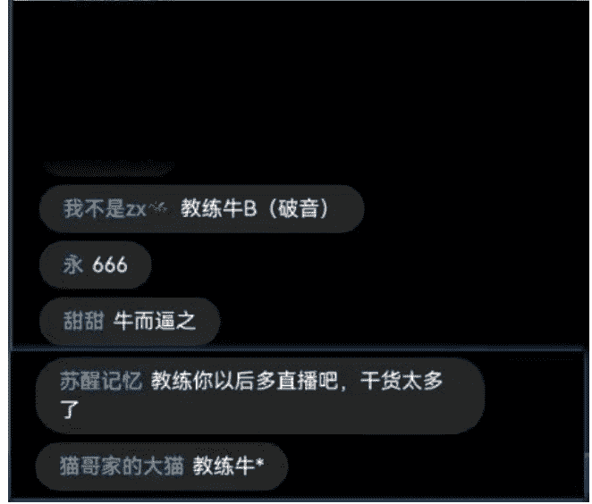

有些圈友表示一些思维在做其他项目时也能用上。

所以我把直播时分享的内容整理优化了一下发出来，算续篇吧。

## 先说下近三个月在这个项目上取得的一些小成绩

继最开始一周内迅速跑通风向标赚到 1000 块之后，这个项目后续又帮我赚到了总计 4 万 + 的收益，最高单月近 3 万，单条视频最高收益 7000+。

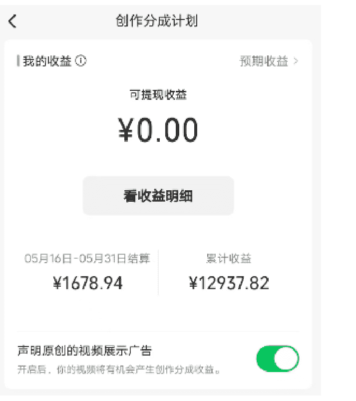

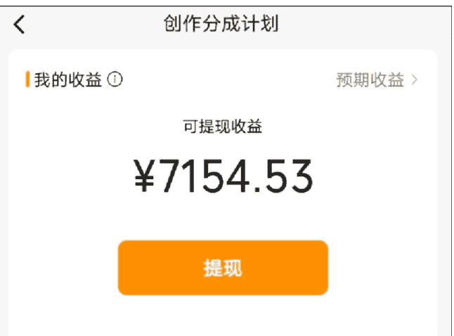

懒人微信：lazyhelper

3 / 45

### 播放和收入数据 ①

| 指标 | 数值 | 评级 | 同类对比 |
| :--- | :--- | :--- | :--- |
| 播放量 | 19510022 | 高 | 超过99.98%的同类视频 |
| 完播率 | 48.48% | 高 | 超过83%的同类视频 |
| 平均播放时长 | 42.32秒 | 高 | 超过93.57%的同类视频 |
| 3s以上播放率 | 75.59% | 高 | 超过79.38%的同类视频 |
| 创作分成收益 | > ¥7069.64 | | |

视频的完播率排名和3s以上播放率排名高于同类视频，继续保持。

### 互动数据 ①

254647人♡了你的视频，推荐给了4323707个朋友

254647 227428

公众号懒人搜索，懒人专属群分享

创作分成计划现金奖励税前收入

¥ 5530.92

阅读并同意《微信视频号视频创作收益提现须知》

全部提现

### 收益明细

- **3月30日收益结算**
  - 14个视频产生收益
  - 预期收益 ¥838.77
- **3月29日收益结算**
  - 13个视频产生收益
  - 预期收益 ¥503.17
- **3月28日收益结算**
  - 10个视频产生收益
  - 预期收益 ¥1176.44
- **3月27日收益结算**
  - 4个视频产生收益
  - 预期收益 ¥7.94
- **3月26日收益结算**
  - 6个视频产生收益
  - 预期收益 ¥65.67
- **3月25日收益结算**
  - 4个视频产生收益
  - 预期收益 ¥2.62
- **3月24日收益结算**
  - 1个视频产生收益
  - 预期收益 ¥0.07
- **4月28日收益结算**
  - 65个视频产生收益
  - 预期收益 ¥369.51
- **4月27日收益结算**
  - 68个视频产生收益
  - 预期收益 ¥338.2
- **4月26日收益结算**
  - 69个视频产生收益
  - 预期收益 ¥547.46
- **4月25日收益结算**
  - 67个视频产生收益
  - 预期收益 ¥931.68
- **4月24日收益结算**
  - 68个视频产生收益
  - 预期收益 ¥1131.31
- **4月23日收益结算**
  - 59个视频产生收益
  - 预期收益 ¥340.76
- **4月22日收益结算**
  - 30个视频产生收益
  - 预期收益 ¥145.19
- **4月21日收益结算**
  - 56个视频产生收益
  - 预期收益 ¥309.89
- **4月20日收益结算**
  - 53个视频产生收益
  - 预期收益 ¥343.75
- **4月19日收益结算**
  - 54个视频产生收益
  - 预期收益 ¥391.85
- **4月18日收益结算**
  - 50个视频产生收益
  - 预期收益 ¥360.31
- **4月17日收益结算**
  - 50个视频产生收益
  - 预期收益 ¥339.99
- **5月23日收益结算**
  - 33个视频产生收益
  - 预期收益 ¥62.24
- **5月22日收益结算**
  - 57个视频产生收益
  - 预期收益 ¥112.1
- **5月21日收益结算**
  - 51个视频产生收益
  - 预期收益 ¥97.96
- **5月20日收益结算**
  - 49个视频产生收益
  - 预期收益 ¥114.48
- **5月19日收益结算**
  - 59个视频产生收益
  - 预期收益 ¥239.69
- **5月18日收益结算**
  - 83个视频产生收益
  - 预期收益 ¥557.91
- **5月17日收益结算**
  - 60个视频产生收益
  - 预期收益 ¥208.44
- **5月16日收益结算**
  - 28个视频产生收益
  - 预期收益 ¥52.74
- **5月15日收益结算**
  - 35个视频产生收益
  - 预期收益 ¥43.01
- **5月14日收益结算**
  - 34个视频产生收益
  - 预期收益 ¥89.89
- **5月13日收益结算**
  - 33个视频产生收益
  - 预期收益 ¥70.34
- **5月12日收益结算**
  - 16个视频产生收益
  - 预期收益 ¥22.72

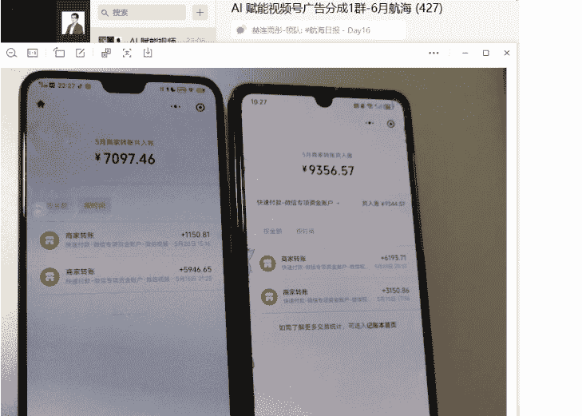

当时手绘漫剪那个赛道跑通以后，接下来要尝试放大收益，肯定是多号矩阵。毕竟也在生财待了快两年了，这点思维还是要有有的。

陆续跑出来了3个号，但后续再起的时候，发现明显不太好做了，新号起不来爆款，老号流量也在下滑。

感觉是分享出来之后，做这类视频的人也陆续多起来了，赛道有点饱和了。

但当时想的是，不能坐以待毙，毕竟跑通一个项目都是花了精力的，亦仁也说过，任何项目都有机会赚到一百万。

既然有了一些经验，这项目性价比也还不错，就继续看看其他赛道吧。

后面这期间正儿八经的测试过五六个赛道，主要大头的收益则是从跑出来的两三个赛道中取得的。

所以，这篇帖子就和我直播时的主题一致，主要是总结了我在做这个项目时如何找新赛道以及账号矩阵的相关实操的。

都是本人亲身实践后总结出的原创方法论。如果看完真的像有些船员说的那样，对其他项目也有用，那真是个惊喜。

OK，下面开始正文~

## 一、该项目收益的底层逻辑和发展方向：

我们在接触任何一个项目时，刚开始可能是靠模仿、靠手把手的实操教程一比一跟着去做，或者在红利期也不知道怎么就做成了。

但在跑通了以后，我们就需要思考一下，这个项目的底层逻辑和发展方向。

这决定了我们后续能不能赚到更多钱，能不能赚得更长久。

赚视频号创作者分成的底层逻辑，就是你发原创的优质内容，并且没有其他变现方式，不卖货、不引流、不营销，但你给平台贡献了内容价值，平台就给你提供这样一种变现方式，可以在你的内容里挂广告，像 YouTube 一样，用内容做流量帮平台展示广告，平台给你分一部分收益。

那么它的发展方向，有 2 种大方向。

第一种：专业、精品方向，提高单号天花板，晋升为真正的优质创作者。

随便举几个例子：

比如下面这个电影解说账号：

视频

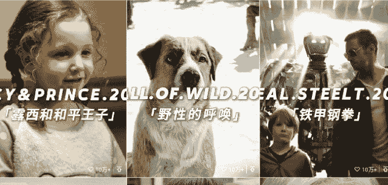

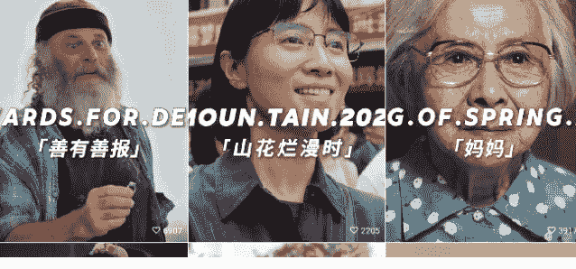

视频

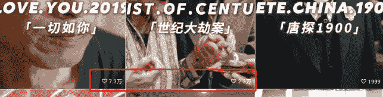

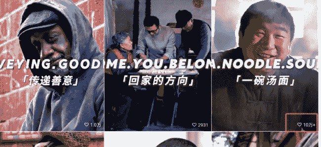

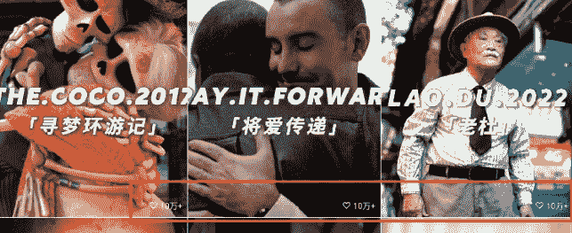

10 万+点赞的大爆款比例非常高，且有连续几天内发布四个作品全是 10 万+的时候。

再比如这个大博主“是个懒妈”，应该很多人都刷到过她们家视频，各个平台都是百万到千万级的粉丝，视频号也有。

懒人微信：lazyhelper

她这一页视频，只有1个不是10万+，"只有"1.8万赞。其他全是10万+。

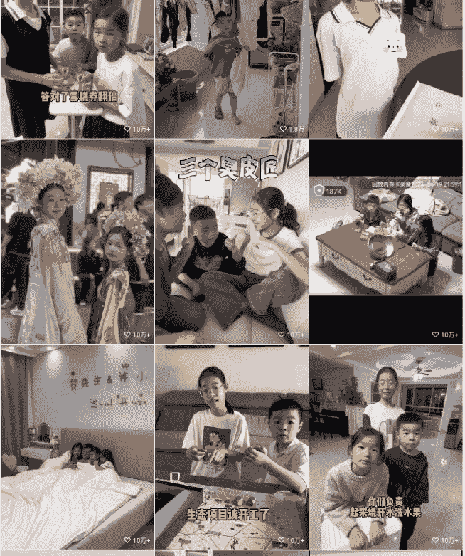

都不算她接广告，单看流量收益已经天花板很高了。

有人说视频号创作者分成流量不稳定，单号天花板太低；也有人说出了大爆款之后就会被限流，如果有视频在爆时候，就不要发新的了，不可能同时爆2条……

这些问题都不攻自破了。

可能有人会说上面两个例子，一个需要很高超的剪辑技术，一个真人拍摄需要很好的脚本、表现力等实拍镜头。我们都很难短时间去复制。

那下面我们再看个AI的：

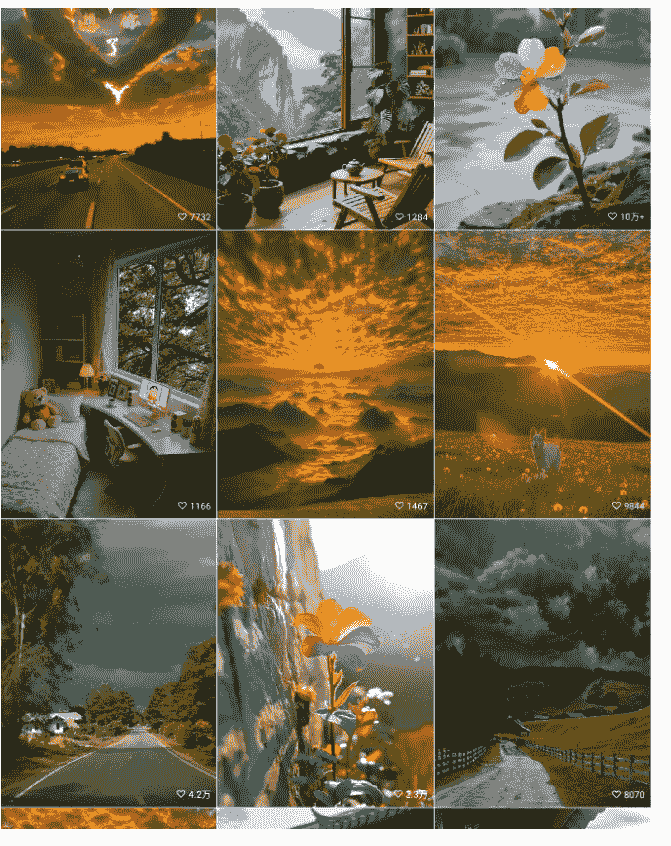

也是有多篇连续爆款的。

所以说真正优质的内容它是不受那些限制的。一切运营技巧在足够优质的原创内容面前都是可有可无。

因此如果往专业精品优质内容的这个方向发展,我觉得单号的天花板完全是没有问题的。如果有问题,那么跟平台和项目无关,主要是咱自己不行。

当然这一类适合有一定创作经验的,可以选择往这些方向去精进,晋升为真正的优质创作者。那么在任何平台,在任何赛道,都是有发展空间的。

但这种大部分人短期是没办法达到的,也不太好模仿,提升也是一个比较漫长的过程。

但至少给我们证明了，单号是没有天花板的，很多做得好的创作者，靠一个号也能赚到百万千万以上。

那第二种方向，就是我们主要可以去学习做出来的——批量规模化，账号矩阵，小号收割者

一些比较简单的赛道，单号天花板不够，那么我们可以做很多账号，有一堆小号，不断的去收割流量，靠规模来持续赚钱。

这也是我们接下来重点要讲的。

很多项目的发展方向都是下图这两种，各有利弊，鱼与熊掌不可兼得，我们根据自己的情况来做选择。

但矩阵肯定是绝大多数人都更容易上手掌握的一种方法，对技能要求更低。

两种盈利路径特性对比(示意)

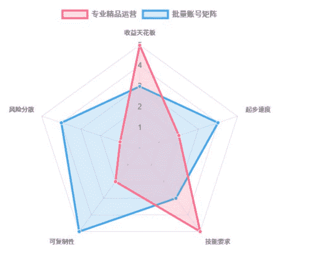

图1: 专业精品与账号矩阵运营模式对比

那么我们要做账号矩阵放大收益的话，需要看哪些核心点？

## 二、账号矩阵核心思路

### 1、账号数量

要规模化，就至少要有一定的账号数量。

这个项目需要用什么条件的账号去做？是手机号注册还是邮箱注册？需不需要实名？一个人能实名几个号？……

去思考我们自身的资源能搞到多少账号去复制。

像视频号是用微信注册，一个微信绑定一个视频号，但是要开通创作者分成并稳定收益，是需要进行实名认证的。1个身份证可以认证5个微信号，2个视频号。

所以可以用家人亲戚朋友的，用3~5个人的身份证，就可以搞定6~10个视频号了。

这6~10个账号，对于赚个月入几万就完全够了。

### 2、账号起号速度

因为你要做批量规模化，做矩阵的话，最好是能够起号快一些，如果起得太慢了，那就可能前期没有收益的时间就会很长，或者说你在切换账号、切换赛道的时候，你的收益就会受很大影响。

那起号速度怎么才能快？

我分享一下我自己的起号方法论，我用这套方法严格执行的起号率基本能达到100%，然后平均开通创作者分成计划的时间是三天左右。

怎么做到的呢？

懒人微信：lazyhelper

### 【核心干货】我的视频号快速起号秘籍

#### 第一步：找对标，得找“潜力股”

选赛道，找对标，这是起号的第一步，也是非常关键的一步。我选对标有几个标准：

必须要有 10 万+点赞的视频！ 我基本上只看 10 万+的，如果他没做出过 10 万+的爆款，我是不会看的。为啥？因为视频号最高显示到 10 万+点赞，再多就不显示了。所以 10 万+的收益浮动性和上限也会更高。而低于 10 万+，我们大概是能够按照比例估算出收益的（万播≈1 元，万赞≈100 万播放）。

爆款视频发布时间越近越好。 说明这个赛道最近还热乎。点击一下评论区看上面的文案就能看到发布时间。

对标账号的粉丝越少越好，作品数量越少越好。

怎么看粉丝呢？视频号看不到。

但可以去看这个账号发布的第一条作品大概是什么时间，尽量要几个月以内的，如果一两年以上的，可能就比较大了。

再就是发布作品数量越少越好。因为数量少，10 万+爆款又多，证明这个赛道爆款率更高。

比如一个账号才发了二三十条作品，就已经有两三条大爆款了。

相比起另一个账号他已经发了上百条视频了，而且上一条大爆款还是两三个月以前的。

那肯定是选前者作为对标更好。这其实就是低粉爆款的逻辑，各大平台和项目通用。

同时也可以看一下账号的平均数据，如果是 10 条以内，只有一条爆款，其他平均数据都很差，那可能是吃了新号流量红利的运气，不一定是实力，可以谨慎考虑下。如果非大爆款的其他视频数据也都还行，那证明是实力因素。

当然这些数据都没有具体的标准，是相对的，比如我认为半年以内的号，发了不超过 50 条作品，有至少 2-3 条 10 万+左右的大爆款，是一个可以纳入的对标。但这些数据都是可以浮动的，选择相比较而言更好的那个即可。

#### 第二步：扒视频，拆解对标的视频制作流程，确保自己能复刻出来

找到对标的视频后，你得仔细去拆解，看人家是怎么做的。具体要看哪些呢？

- 画面： 是啥风格？ AI 画的？ 还是真人拍的素材？ 图片和分镜视频是怎么组合的？ 开头怎么吸引人看下去的？
- 文案： 讲的啥内容？ 是故事还是语录？
- 音频： 背景音乐是啥？ 有没有配音？ 是 AI 配的还是真人？
- 剪辑： 视频多长？ 画面切换用了什么样的转场？ 用了啥特效？

比如， 你看到一张 AI 生成的图片很好看， 你可以截图下来， 然后丢给豆包（AI 工具）， 直接说 “反推一下这张图片的提示词”， 它就能给你一些参考。 这样你就知道大概怎么用 AI 做出类似的画面了。

就这样一个画面一个画面， 一帧一帧的去分析， 直到确保自己也能从 0 复刻出来一整个视频。（ 具体拆解下面实操有演示 ）

因为对标账号做得再好， 如果我们做不出来他的视频， 那就跟我们也没关系。

#### 第三步：适当优化制作流程中某些环节的质量——确保自己的内容不输于对标， 能超越更好。

拆解完了， 我们是不是就能直接照搬了？ 不行！ 完全复制， 很容易同质化， 被平台限流！ 所以， 一定要优化， 做出自己的特色， 提高原创度。 做这个项目， 视频的原创度是命根子。

怎么优化？核心原则是：确保你的内容质量不输于对标，能超越更好，超越不了也别比它差！

你要确保你做出来的内容看起来跟对标在质量上感觉差不多，可以让不知情的其他人去刷一下，也感觉你做的和他差不多，甚至更好，和对标不会有很大的感官差距。

这个是关键步骤，把这一步做到位了，后面才能达到更好的效果。

很多圈友参考对标去做，结果发出来就同质化严重、被限流、被减少推荐、甚至账号违规被封。

99%都是因为这里做的不好。所以说一定要有这个流程，就是适当优化制作流程中某些环节的质量，确保自己的内容不输于对标，甚至你有一些部分质量还比他好。

比如说我们做手绘漫画混剪的那个赛道，第一时间就要思考有没有哪里还能优化。剪辑素材再干净一些，流畅度再好一些，转场效果再好一些，或者他那个漫画你可以换换风格，提高下质量，用AI去做出更好看的漫画，换成和对标不同的另一种风格。

再比如我后面做的这类人性文案+手绘图的赛道，文案可以微调，但中间的图一定要用AI自己根据文案生成纯原创的画。

大部分同行中间都是做的静态画面晃动，而我用 AI 生成了一些动态的画面，这都是一些保证作品质量不输于对标的方法。

以前我很傻
傻到对谁都是掏心掏肺
后经历了一些事后
我看清了一些人
慢慢就收回了我的好

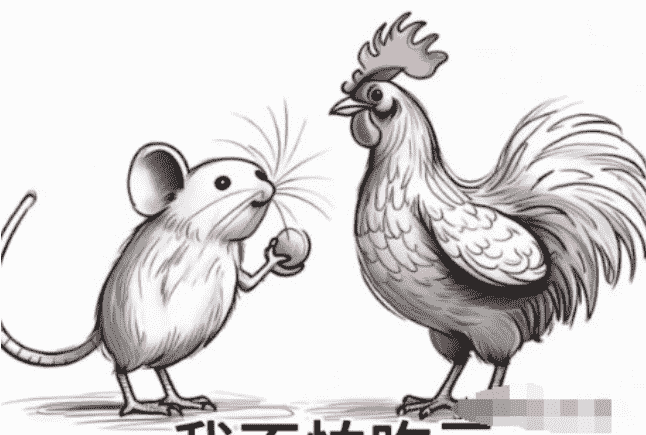

我不怕吃亏
就怕占了我便宜的人
还笑我傻笑我笨
善良不代表傻
厚道不代表笨

记住，原创度非常非常重要！平台判断原创度，画面大概占 80%，音频和文案可能各占 10%。所以，画面一定要下功夫！

别为了数量牺牲质量，搞一堆劣质视频，没用的！你播放量再高，如果内容质量上面有风险，进入 100 万播放二次审核以后，照样给你把广告收益停掉！

懒人微信：lazyhelper

我们航海里有很多圈友也遇到了，原创度不够好，能过系统审核，过不了人工审核。每次到 100 万播放就掉广告，那么后续视频再爆，收益也都吃不到了。

所以一开始就把这一步做好，反而才是不浪费我们的时间。

超越对标的一些原创方法：比如流程增加，多账号元素叠加，跨赛道元素叠加等。后面在实操部分会详细讲解。

#### 第四步：攒“弹药”，提前一次性做好 10 个视频，然后准备好健康的新号，头像昵称主页设置好，每天发布 3-5 条视频（发布时间间隔 2 个小时以上）

起号的时候，不要做一个发一个，尽量储备好一定的弹药再开始发。

因为一旦我们选好了赛道和对标，一般至少要测个 10 条左右才能得到一些数据反馈。

而如果做一条发一条，就很容易被临时的数据变化打乱节奏，影响了原定的动作。

同时，视频号对新号发布作品时还有明显的流量扶持。

起新赛道尽量用刚注册的新号，或者是注册很久但是从来没有发过作品的，没有违规过的健康新号。

比如正常发 20 条才能爆 1 条，5% 的爆款率，那么用新号很可能发 10 条就爆 1 条了，爆款率提高到 10% 了。

因此我们就可以利用这一点非常快速的起号。

把主页设置好，然后把做好的 10 条视频，在 2-3 天内陆续发完，每天发布 3-5 条视频，当然不能连续发，每条要间隔 2 个小时以上。

我用这样的方法，基本上发 10 条至少都会爆一条 100 万以上播放的。

这时候基本也涨够 100 个粉丝了，曝光量上来内容规范也能过了，原创数量要求也满足了。自然也就能成功开通创作者分成权益了。

航海期间也有圈友用了这个方法，新号发了 4 条就开通成功的。

> 今日收获（限制至少30字）
> 1.新号用昨晚教练讲的方法发了4个视频，其中1个视频5.9w播放，涨了98个粉，自己凑了两[表情]，开通了分成计划。但是这个视频观点有点偏激，评论区里也有点对立，不知道吵成什么样子需要把评论区关闭？观点有争议性的话，有点担心会不会让人看了生气去举报，对号有什么影响吗？

包括我们做其他项目也可以参考这个逻辑，起号前最好是多准备一些视频，万一临时有事，也能保证更新节奏，让平台快速判定你是一个能够持续更新的优质账号。

#### 第五步：找账号的“爆款基因”，持续优化更新

发完起号的这 10 条，有了一定的数据反馈后，观察复盘我们爆了的视频的题材和特点。

不管是小爆款还是大爆款，总之根据我们账号上数据更好的作品，持续去做我们后续的选题更新和作品质量优化。然后账号保持日更1-2条，固定节奏发布即可。

我们按照上面的步骤做出来的，它是不太需要单号去怼量的。因为这个项目的主要收益大部分都是靠大爆款来带动。

| 数据维度 | 1万播放量级 | 100万播放量级 | 10万+赞隐藏数据量级 |
| :--- | :--- | :--- | :--- |
| 播放量 | 1万次 | 100万次 | 1000万次以上（至少） |
| 点赞量 | 约100个 | 约1万+个 | 实际20万-30万+个（显示10万+） |
| 收益估算 | 约1元 | 约100元 | 至少1000元+ |
| 数据特征 | 播放与点赞比例约100:1 | 公开数据可直接计算 | 点赞量隐藏，播放量突破千万 |
| 注意事项 | -赞/爱心任选其一估算 -仅为粗略参考模型 | -10万赞以下数据线性相关 | -隐藏数据可能远超显示值，收益空间上浮 |

我们的收益主要是靠大爆款，靠万赞以上的视频。而10万播放量以下几乎收益很少，而这种10万+点赞的视频，它是能够持续爆的，有可能一个视频就让你单月过万。

以上五个步骤，每一步都是环环相扣的，前面步骤做的到不到位，都会决定后面的效果怎样。

### 3、账号注销流转

如果万一没做好，碰到账号原创度不好违规限流的，大爆后再也起不来限流的，或者跳了出镜人没能成功解决的等等各种限制点。

就可以注销重新起，因为违规的号想养回来是比较慢的，可能等解封的时候，新号都已经重起成功已经开始收益了。

所以我一般是能注销就直接注销重起了，注销后又是一条好汉，一个健康的新号。

懒人微信：lazyhelper

#### 除非什么情况下没办法注销重起了？

- 1.视频号刚注册未满30天，这时候如果注销，那么这个微信今年就不能再重新注册了。所以要等满了30天再看。

- 2.一年内已经注册了3次，那么这个号也不能再注册了，只能等明年。这时候账号如果能用就用，不能用也可以注销，然后弃掉微信号，是为了释放出实名，用其他微信再注册新号。

- 3.这个我没遇到过，但有船员遇到过，就是如果一个号频繁多次违规，违规了解封后申诉后又违规的这种，有可能和第二条一样，注销后也直接今年不能再重新注册了。那么就和上一条处理方法同理。

所以说我们尽量要做好前面的步骤，不要总是违规，不然频繁影响账号健康度，被限流，也会影响账号的流转和收益。

我基本上遇见违规很少去申诉，直接尽快删视频接受整改就行了。

因为判违规就说明平台认为你作品质量有问题，平台检查出来了，一定或多或少是有那么一点点问题的。

虽然平台有错判的可能性，但大多数时候都不是错判。

只要有那么一点点问题，那我们后续可能还是达不到10万+

所以干脆别想着浪费时间申诉了，就赶紧去提升优化质量，抓紧再去优化制作流程，因为我们目的是要搏 10 万+点赞，而要到 10 万+点赞一定是审核很严格的。

所以我这边全都是秉持着只要违规就是我不行的态度，视频违规麻溜的删视频，账号违规麻溜的注销重起，反思改进。

既然是赚平台的钱，就尽量少跟平台做对抗。

这样基本上 6~10 个账号做矩阵的流转切换，对于个人来说就够了。

### 4、账号收益提现

第一次提现需要实名人授权验证+微信绑定的手机号验证码验证

所以尽量找家人的身份证认证，保证后续收款提现没问题。

手机卡如果不够多，也可以提现的时候才换绑到微信上，不提现的时候解绑也没关系。

但有时候微信不绑手机卡，视频号就不让发视频。所以也要有个至少三张卡吧，不够的话可以再办一些成本低的卡凑上。我在电信官网办的 8 元无忧卡很不错。

个人只能提现到视频号绑定的微信上，所以微信也要绑实名开通微信支付。

而且视频号不像公众号一样可以企业代收款，提到微信上就需要按照劳务扣税，税很高，20%多。

看了下有提到过 MCN 绑定代收的方法，但我没找到入口在哪，嫌麻烦也没整，想着家人的一些号明年清算也能退。退不了的就当做贡献了。

如果有大佬知道怎么搞的，恳求能指导我一下。

## 三、实操案例讲解

### （一）找新赛道的方法

起号方法有了，但好赛道从哪儿来呢？总不能守着一个赛道吃到老吧？
接下来，我就把我找新赛道的几个方法分享给大家，学会了，就能有源源不断的赛道可以做。而且不需要付费平台。

#### 1、关键词搜索，筛选最热、视频，7天，开始刷

这里要从微信首页的搜索框去搜，因为可以添加符合我们要求的筛选条件。视频号那里的搜索是没办法很好的筛选的。
或者直接用“搜一搜”也可以。

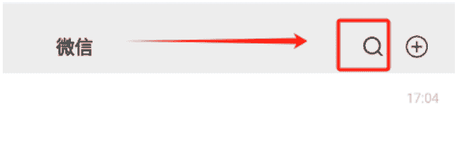

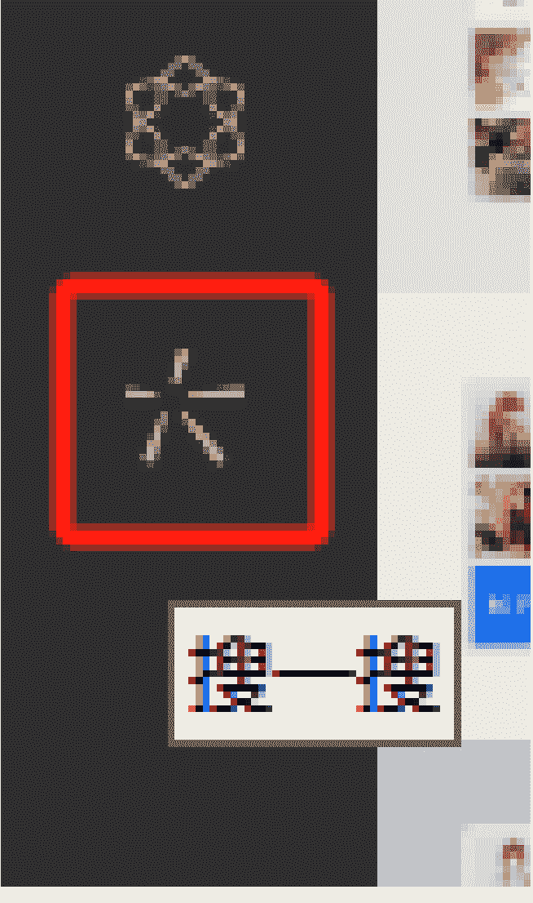

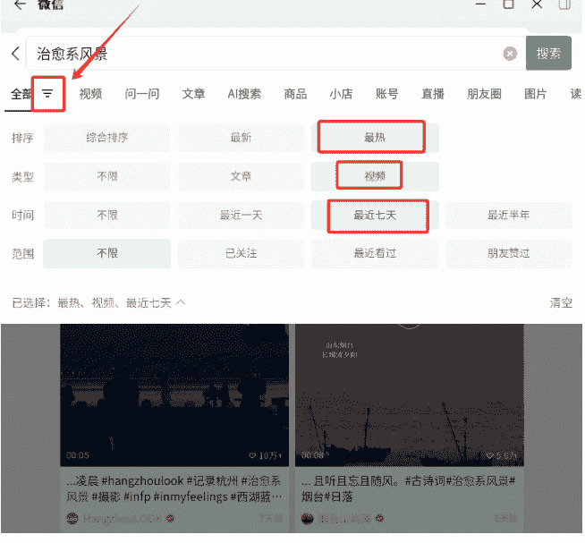

这里搜出来的就是按照热度排序的，点赞最高的在最上面。

从上往下去刷一刷

这里根据我的经验，最近7天内有10万+ 刚好比较符合我们上面提到的第一步对标要求。1天太短，筛不出来，半年太长，增加二次查看的时间成本。

如果你找的赛道最近7天内没有10万+，可能就是赛道近期不够热吧。

没关系，在生财看到的每一个赛道关键词，每一个风向标，都可以来搜一下，你会找到很多很多。

如果还不够，下面还有方法。

#### 2、关键词衍生法（系统推荐后缀、点标签不断拓展），拓展相似的蓝海赛道

搜索赛道的时候，很多时候系统会自动生成一些带其他后缀的衍生词汇
那么这些词汇我们都可以点进去看一看，继续按照第1个筛选方法去筛一筛。

除此之外，作者发布时带的这些标签，感觉自己没见过没搜过的，也可以都去点一下。

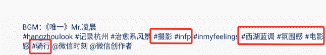

在标签界面再刷一刷，每个视频下面的标签再点一点。无限套娃，你又能刷到很多很多相似的赛道了。

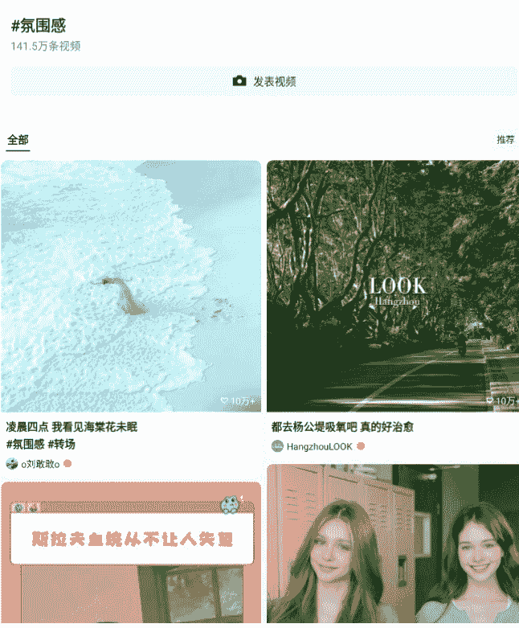

我第二个赛道，就是这么找出来的。也是一个利用 AI 赋能后，制作非常简单，性价比极高的赛道，一天轻松做出来 30 个视频。

#### 3、刷朋友点赞视频

如果刷够了自己的页面都没有满意的，也可以去刷刷朋友点赞，拓展到朋友圈子里面，看看他们点赞的热门视频里有没有可以参考的，用AI可以复刻的赛道。

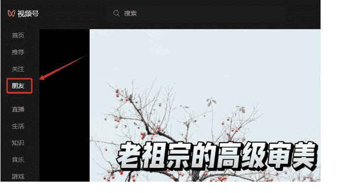

#### 4、刷中老年人好友朋友圈

视频号中老年人的比例很高，而且很多在中老年圈子里的爆款视频，我们自己是刷不到的。

而且很多中老年圈里的爆款视频，都有一个特点，那就是制作极其简单。

比如这种视频，我之前是从来没刷到过的，但后来我是从哪里看到的呢？

从我父母还有岳父母他们转发的朋友圈里。

也是做了这个项目之后，才偶然间发现他们的朋友圈里竟然隐藏着很多默默赚钱的赛道。

比如下面这些，流量都很好，关键是很稳定。

因为很多中老年人关注了以后他们会天天看，而且转发到朋友圈，转发到群聊，带来的流量也很庞大，很多都是10万+转发。

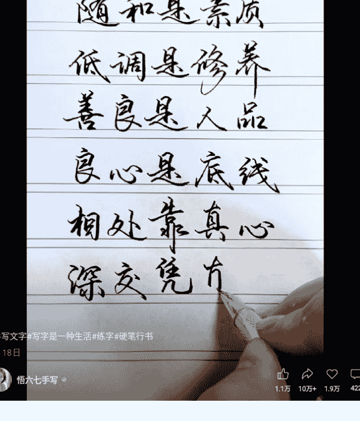

#### 公众号懒人搜索，懒人专属群分享

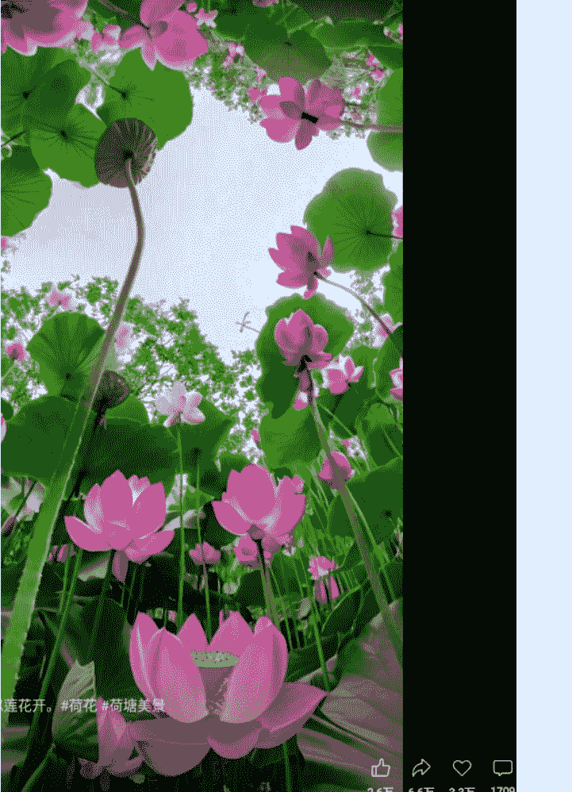

莲花开。#荷花 #荷塘美景

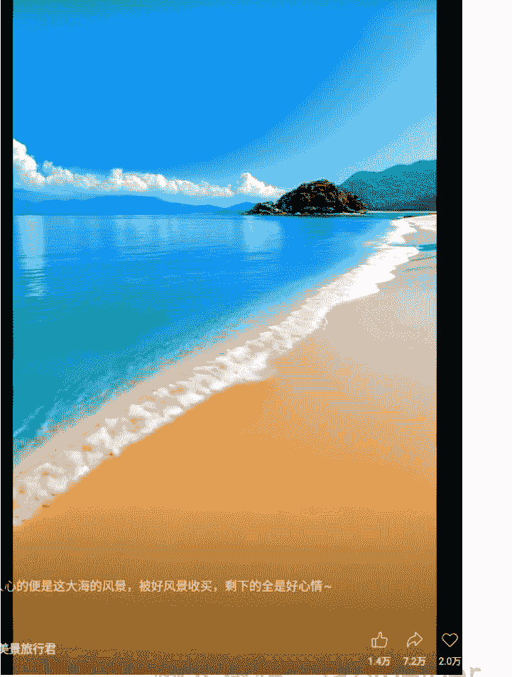

心的便是这大海的风景，被好风景收买，剩下的全是好心情~

所以我们可以去找一些这种亲戚长辈的朋友圈去看看，他们其实就是视频号上中老年群体的代表性人物。定期去看看他们的朋友圈，看看有没有一些潜藏的捡钱赛道。

因为很多中老年爱看的这种视频真的超级简单，用AI复刻出来以后可以很快的批量生产，甚至用工作流可以自动化生产，成本非常低，那么多号复制起来的时候在时间上性价比也很高。

#### 5、刷中老年人微信的朋友点赞视频

这个和上面同理，身边有中老年亲人长辈的，可以拿他们的手机再刷一刷他们的推荐和朋友点赞，这样你会又得到一片新的拓展信息源。

懒人微信：lazyhelper

#### 6、再补充一个：跨平台截图识别搜索

比如你在抖音、小红书等其他平台上刷到一个适合复刻的爆款，但不知道视频号有没有人做，是否受欢迎。

那么可以截图发到微信上，手机打开长按点击“搜一搜”，然后微信就会识别这张图上的画面，给你搜出来类似的画面了。

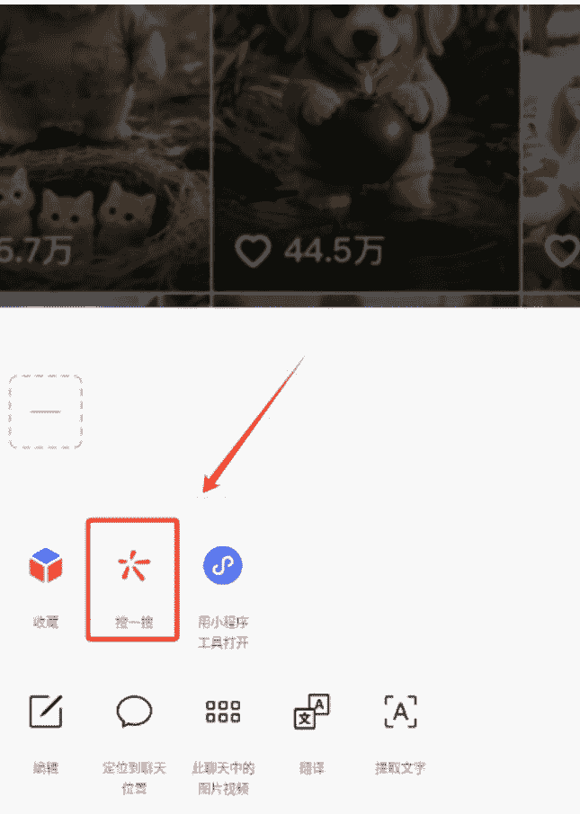

包括生财里其他圈友发的风向标截图，其他地方看到的一张图片，但不知道账号等情况，都可以用这个小技巧试一下。

基本上这一套连招下来，你可以一直不断地找到新的可做的赛道。

然后选到这些赛道具体怎么分析？

### （二）分析赛道的逻辑：

#### 1.这类账号是如何变现的？

我们主要是做创作者分成，那么重点就是要看他们的视频能不能标原创，且评论区有没有显示广告。

除此之外，也可以看看有没有开橱窗，有没有卖出去货、有没有直播、引流、收徒卖课等。

比如我写在手册里的下面这个赛道，我当时刷到之后，看到这个账号是做英语类的二剪，很多爆款，但是她却很单纯，不是自己实拍的都不标原创。这个应该是一个英语老师做的。然后主要是开直播教英语引流，然后卖英语课。

### 6.4.2 国外爆款视频+英语学习二创+视频号分成

之前亦仁发过的风向标，国内的爆款热门视频，可以用加手绘漫画的形式去二剪辑，其他平台大爆过的内容在视频号再爆的概率也很大，很多圈友都拿到了成绩。

那么这种爆款思维其实也可以转向国外视频，用国外的爆款热门视频，加上英语学习的形式去二创，发到视频号，也有大概率能爆。

比如这个外网很火的小男孩和爸爸对话的视频，配上字幕，英语+汉语翻译，以英语学习的形式二创发布后，仍然能够爆到10万+

这一类的账号也有很多，数据都不错。

懒人微信：lazyhelper

根据关键词，又去搜了很多同类的账号，发现也有做创作者分成的。我自己也去测了，的确是能标原创也能有收益的。

素材包括国外爆款的英语对话视频，英语类的采访、英语演讲，美剧片段，英语电影名场面等等，经过二创处理剪辑后，也能够成功声明原创，并开通创作者广告分成。

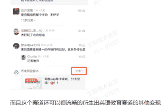

而且这个赛道还可以很流畅的衍生出英语教育赛道的其他变现方式，比如带货英语学习相关的课程和产品，直播、卖课等等，都可以尝试。

这跟国内热门视频二剪+手绘漫画的逻辑类似，变成了国外热门视频二剪+英语学习，用国外的素材二剪后原创度相比国内也会更好。也是一个可以长期变化花样去做的赛道，并且能衍生出一些其他变现方式，增加我们的收益。

### 2.收益是否满意

| 数据维度 | 1万播放量级 | 100万播放量级 | 10万+赞隐藏数据量级 |
| :--- | :--- | :--- | :--- |
| 播放量 | 1万次 | 100万次 | 1000万次以上(至少) |
| 点赞量 | 约100个 | 约1万+个 | 实际20万-30万+个(显示10万+) |
| 收益估算 | 约1元 | 约100元 | 至少1000元+ |
| 数据特征 | 播放与点赞比例约100:1 | 公开数据可直接计算 | 点赞量隐藏，播放量突破千万 |
| 注意事项 | -赞/爱心任选其一估算 -仅为粗略参考模型 | -10万赞以下数据线性相关 | -隐藏数据可能远超显示值，收益空间上浮 |

怎么看收益这个图上放了过，再贴一下。

我们可以通过看对标账号一个月发了多少视频，多少赞，大概估摸一下有多少收益，可能会比这个数高，毕竟这是很保守的估算。

估算数差不多能接受的话，就可以做。接受不了，就不做。

### 3.分析视频制作，能否复刻并优化

一个视频的制作流程，主要分为画面、声音、剪辑、效果。

能用 AI 赋能的赛道，我们大部分都是靠 AI 来生成画面的。

核心步骤基本都是 AI 生图、然后图生视频。

甚至有些简单的赛道不用生视频也行。

##### 如何复刻对标？

##### 反推提示词大法！

（以下面这个赛道视频为例演示，但不构成推荐，之前流量好不代表未来还会好，重点学习思路。）

截图对标的每一个分镜，先让 AI 反推出来提示词，然后再用提示词去生图。

以下是基于画面元素反推的 Midjourney 风格提示词，你可根据实际需求调整：

A heart-shaped arrangement of pink and red petals on a pavement, with a red-flowered tree in the center, a red brick wall covered in graffiti in the background, and the Chinese text “一辈子不容易” (A lifetime is not easy) in the middle of the heart shape, creating a romantic and somewhat nostalgic street-scene atmosphere, photorealistic, high detail, --ar 9:16 --v 6

解释：从画面提取关键元素，心形花瓣、树、红砖墙、涂鸦、文字，按 Midjourney 语法组合，说明风格、比例等，让 AI 能还原类似场景。

中文提示词

想要用中文提示词让 AI 生成类似画面，重点围绕核心元素描述，以下几种方向，你可按需调整：

##### 氛围情感向

在街头场景里，用粉色花瓣和红色花瓣拼出大大的爱心，爱心中间写上“一辈子不容易”，爱心旁散落花瓣，爱心后有开满红花的树，树后是带涂鸦的红砖墙，营造浪漫又带点生活感慨的氛围，照片质感。

##### 再观察视频画面的运动，用图生视频。

比如这种视频就是一个环绕镜头。

> 在街头场景里，用粉色花瓣和红色花瓣拼出大大的爱心，爱心中间写上“一辈子不容易”，爱心旁散落花瓣，爱心后有开满红花的树，树后是带涂鸦的红砖墙，营造浪漫又带点生活感的氛围，照片质感。比例「9:16」

我将生成四张照片质感的图片，画面以街头为场景，用粉色花瓣和红色花瓣拼出一个大大的爱心，爱心中间写着“一辈子不容易”，爱心旁散落着花瓣，爱心后面是一棵开满红花的树，树后是带涂鸦的红砖墙，营造出浪漫又带点生活感的氛围，图片比例为 9:16。

> 帮我生成视频：镜头环绕展示，比例「9:16」

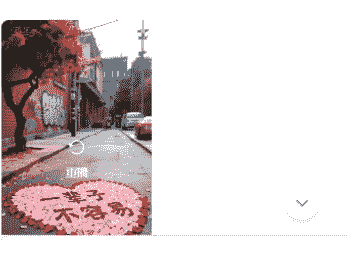

后面的画面都是类似的一个场景，然后改个文字就可以了。

一套提示词就能生成一个视频。

再看声音，就一个背景音乐，不知道是什么就网易云听歌识曲一下，然后剪映里选个背景音乐。剪映没有的，还可以抖音搜一下，然后复制抖音视频链接导入音频。

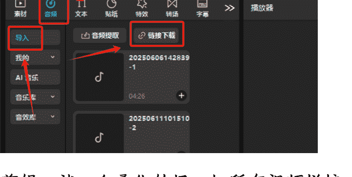

剪辑，就一个叠化转场，把所有视频拼接起来就可以。

特效，没有。有的话就在剪映特效里找一找添加上。

这样分析做完完成后，跟对标的爆款差不多的一个视频就复刻出来了。

### 那么接下来，重中之重，如何优化超越对标？

- (1)增加一个步骤，提升视频效果
  比如别人是静态的，我们把静态的再做成动态的；
  别人是不开口的，我们给它对一下口型把文案说出来；
  别人的字幕是静止的，我们给字幕加上动画效果，逐字显示出来；
  别人只有5个画面，我们做7个……
  通过增加一个步骤，让视频呈现更好的效果。

- (2)多账号元素叠加
  找多个爆款对标账号，进行元素融合。
  比如用爆款A的画面，B爆款的文案，C爆款的声音；
  用A账号的故事，B账号的人物风格，C账号的场景风格；
  用A账号的素材，B账号的二创风格，C账号的剪辑效果。
  总之你能复刻出来对标的爆款视频掌握了流程后，就不要1：1完全对着他的视频抄了。只参考他的核心元素，然后其他部分去找其他账号的元素替换掉。

- (3)跨赛道元素叠加
  分析出爆款对标的核心元素，然后去找其他能把这个元素做得更好的赛道，提取出来叠加替换一下。
  什么意思呢？还是这类视频举例
  我们发现每一个视频都是在一种风景里面，摆上这种带花的祝福文字，有海边，有草地，有山川河流等等。

都是比较治愈好看的风景，那么我可以就可以去找治愈系风景这个赛道，提取出来那个赛道的爆款风景元素，然后融合成这类花朵文字的类型。

例如：

这张照片呈现的是一处中式风格的建筑群，元素有：

- 建筑：传统中式屋顶，飞檐翘角，瓦片、木质结构等，还有围合式圆形建筑，体现客家土楼或传统合院特色；
- 灯光：建筑外沿、檐角等位置的暖黄色装饰灯，营造出温馨、古朴氛围；
- 场地：圆形建筑中间的活动场地，有表演相关设施（如灯光设备、鼓等）；
- 植被：建筑周边的树木，增添自然气息；
- 车辆：画面左侧的白色汽车，体现现代元素与古建融合。

场景：建筑：传统中式屋顶，飞檐翘角，瓦片、木质结构等，还有围合式圆形建筑，体现客家土楼或传统合院特色；灯光：建筑外沿、檐角等位置的暖黄色装饰灯，营造出温馨、古朴氛围；场地：圆形建筑中间的活动场地，有表演相关设施（如灯光设备、鼓等）；植被：建筑周边的树木，增添自然气息；车辆：画面左侧的白色汽车，体现现代元素与古建融合。用粉色花瓣和红色花瓣拼出大大的爱心，爱心中间写上“一辈子不容易”，爱心旁散落花瓣

我将生成四张 9:16 比例的照片质感图片，在上述中式建筑场景里，用粉色花瓣和红色花瓣拼出大大的爱心，爱心中间写上“一辈子不容易”，爱心旁散落花瓣。

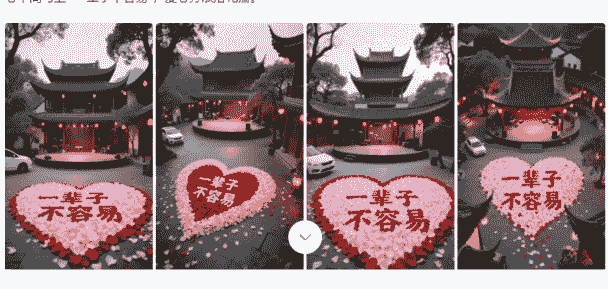

这张照片里的元素有：
- 玩偶：粉色哆啦 A 梦造型玩偶、戴着草莓花朵装饰的巨型粉色草莓熊玩偶；
- 植物：大片粉色郁金香花田；
- 天空：粉紫色渐变的天空，有类似花瓣纹理的云朵；
- 建筑：背景中能看到的建筑物，比如白色的房屋、金属框架结构建筑；
- 文字：底部 “提示：内容为虚构剧情，仅供娱乐” 的说明文字。

玩偶：粉色哆啦 A 梦造型玩偶、戴着草莓花朵装饰的巨型粉色草莓熊玩偶；
植物：大片粉色郁金香花田；
天空：粉紫色渐变的天空，有类似花瓣纹理的云朵；
建筑：背景中能看到的建筑物，比如白色的房屋、金属框架结构建筑；
用粉色花瓣和红色花瓣拼出大大的爱心，爱心中间写上“一辈子不容易”，爱心旁散落花瓣

我将生成四张 9:16 比例的照片质感图片，在有粉色哆啦 A 梦玩偶、粉色草莓熊玩偶、粉色郁金香花田、粉紫色天空和背景建筑的场景里，用粉色花瓣和红色花瓣拼出大大的爱心，爱心中间写上“一辈子不容易”，爱心旁散落花瓣。

这样，你生成的画面就是自己纯原创的，几乎很难和别人一样被判重。
那么治愈系风景这个赛道就成了你的独家原创素材库，再加上 AI 提取元素叠加融合，原创度基本都能保证。

## 再换一个赛道来看：

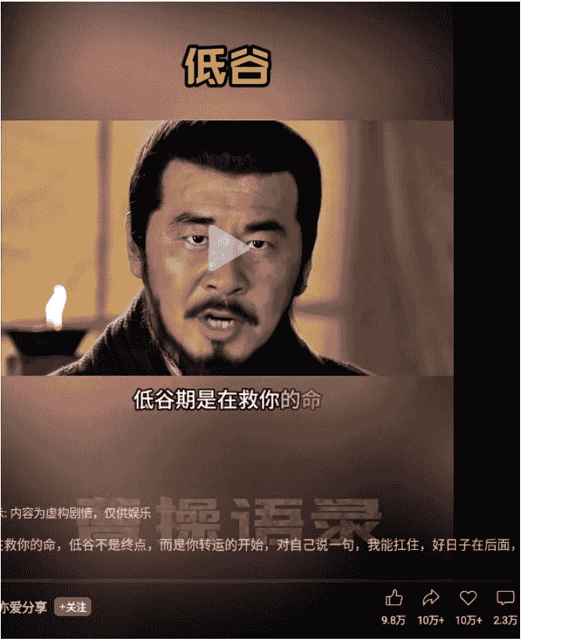

比如这种曹操配音语录，核心元素有 2 个，一是曹操对口型说话，二是爆款文案，也就是他说出来的那些话。

那么保持原创度的有 2 个方法，一是保留人物，改说话的文案。

那么文案我们就可以跨赛道去找专门做爆款文案的赛道，拿他们的文案来叠加上我们的人物来说出来。比如搜索“语录”关键词，用其他赛道的爆款语录。

当然也可以让 AI 总结出爆款语录的特点后直接出提示词来写。

二是可以保留说的这些话，然后换个人物，换个热度更高的人物，叠加爆款因子。比如用这个

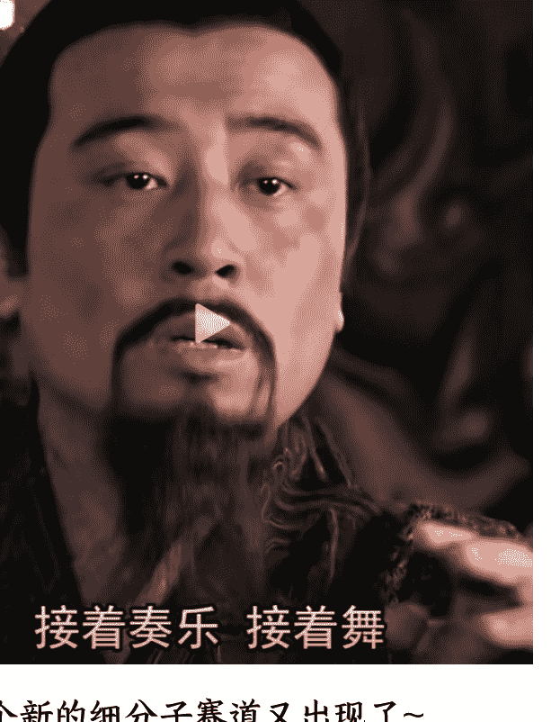

### 一个新的细分子赛道又出现了~

用这种方法，你能创造出原创度几乎 100% 的作品，我用第三个方法后几乎没有碰到过原创度不够的问题。

这个底层逻辑也是很多项目通用的，包括做自媒体，做账号，都适用。

## 4. 分析性价比，结合自己的资源和技能

我们一个赛道选出来分析完以后，大概判断自己制作一个视频的时间是多长，然后再根据上面预估的收益，判断性价比如何。

有些赛道虽然数据很好，制作精良，但需要花很多时间，或许真的不如一些看起来很 low 的中老年赛道性价比高，可批量、好复制，多个号加起来收益反而更高。

## 5. 分析收益能否放大，长期赛道还是短期赛道

有的赛道是可以很轻松的批量去复制的，比如上面分析出来的时间，有的赛道熟悉了以后制作一条视频只需要 5 分钟，甚至可以用工作流全自动化生产。

那么这种去复制起来的时候，内容生产就不是一个卡点。你去搞定账号就行了。

但有些赛道，一天就能做出来一条视频，那这种我们想复制也很难复制。

做两三个号可能就忙得焦头烂额了，就没办法去矩阵。

因此做矩阵不能只看一个单号，要结合时间、收益和数量，看总体收益性价比。

另外，长期赛道还是短期赛道，也可以大概判断一下。

很多 AI 类的赛道都偏短期一些，主要是一段时间内比较新颖，过了这一阵就不火了。

但有些赛道是可以相对比较长期的，比如英语学习、比如亲子家庭漫画故事、沙雕动画、治愈风景类，可以长期做。也有大号做了很多年持续收益都很不错的案例。

当然，这些都是辅助判断，提高我们的成功率和收益的。但想要有收益，关键还是要行动，有的船员说找赛道就找了好几天，这就没必要了。所以新手阶段不宜想得太多，要先干起来再说，边干边看。

这次就分享到这，祝大家都能选出轻松赚钱的蓝海赛道，收获自己的更多 10 万+赞爆款视频!

📖 懒人专属群持续更新中，已持续运营 6 年，整理超 3000 份各类精选付费文章 & 年费社群干货，全部开放下载。

本资料为付费群内部分享，仅供真实有需要的朋友查阅 🙇

懒人专属群更新记录：
https://lazy2025.top/#/blog/record2

懒人专属群更新记录（需梯子，备用）：
https://lazybook.fun/#/blog/record2