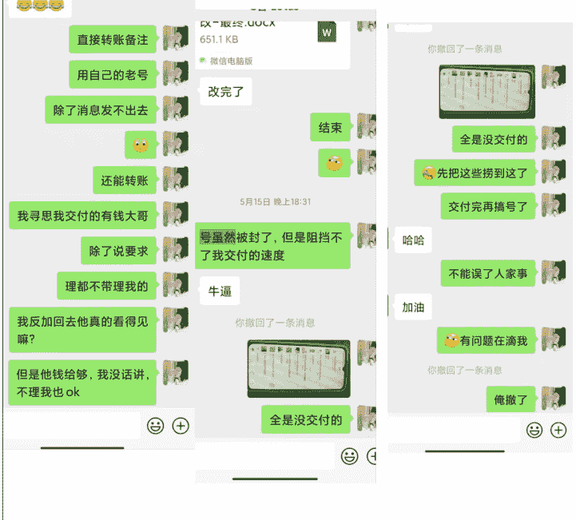

## 公众号懒人搜索，懒人专属群分享

## 从0到1，AI写作48天3万+，分享下我是如何做的

## 250625 生财精华

公众号懒人搜索，懒人专属群

大家好，我是成洛，在广州，一个工作了五年的女中医，副业做AI写作，擅长谈单、私域营销，喜欢精准找问题及需求痛点。

AI代写项目的成绩是，闲鱼单个开号48天总业绩3万+，最高单日变现4000+，业务持续进行中。

第一次写文章和大家分享，主要讲下一个新手小白从0起步，到完成闭环路上的一些具体操作方法。

至今，我自己本人，除了医学专业和简单的PPT制作（标准版），任何内容都是完完全全不会写的。

甚至于客户要修改一下页边距都需要找人的程度，AI直出的内容给自己整出来两次售后，真的很夸张，但这也是事实。

有成功经验，也有失败弯路，有写手部分，也有派单主部分，大家各取所需，希望以下分享能对你有一些帮助。

经过一段时间的实战，以及和同行群友的咨询过程中，发现很多新手小白在跟客户沟通中会反复出现一些同样的问题，虽然看起来都是一些小问题，但和客户沟通的每一句话都会影响你在客户心中的形象，细节决定谈单的成败。

全文约8000字，阅读大概需要25分钟。

先放一些开号截止到5月15的数据截图给大家打打气

## 写手到派单主的转变全过程

先简单的介绍一下我的大概路径，从当写手自己写到派单主全外包的转变，以及模式，失败的地方大家可以对照自查当个反面教材，也欢迎优秀的各位留言指导。

我是3月底开的闲鱼号，到4月2号才开始改个人简介上链接等运营操作，同步操作的是注册了一个新的微信号，每天发朋友圈养号。

自己接自己写，兢兢业业二十多天，也才4K，当然报多少自己收多少也是很香的。

转变是因为接了两个不会的论文单子，现在的我来看就是一个文科小单子，转外包出去，发现利润是自己平常干俩小时的价格，当时的价格还是很低的，但还是有写手宝子接，成本和风险就是平台沟通和可能无法保证质量。

后怒而转流量，纯外派模式，最后几天业绩一下飙升到6K。

恰逢论文旺季，有个论文链接爆了，就开启了边做边疯狂加写手，到处捞人，私域一天咨询最多的时候是十来个，成交七八单也是正常。

仅仅只是进私域的，后面复盘时发现好多同行的流量比我好太多，平台是完全管不过来，就放任了随它去，每日运营任务也跟不上，就只是每天固定时间点上去复制黏贴回复一下消息，但后来发现为了后续发展应该管管。

从4月28开始，陆陆续续开始慢慢上人，截止到5月15，爆的那个链接想要数为200+，新开的微信号总数为237人，5月半个月营收截止到5.18破3万。

实际上主靠两个链接。一个PPT，想要数不超过50，前期自己当写手就是靠的这个链接，最高单价1300。一个论文修改，想要数200+，纯外包，最高单价2000。

这个阶段还是自己转接的模式，非常的累人，到5月15换微信后才开始拉群对接，瞬间半自动化往前走，每天接个几单轻轻松松，没啥负担，也有多余的时间出门吃饭了，边接单边复盘。

为什么是截止到5.15，因为没有注重养号，5.15当天被封号（微信），收钱太多了完全没有出门消费，给大家做个反面教材，一面感觉自己损失巨大，看着钱跑而没办法，一面想着，终于有时间休息一下了。

但是对于当时接单接到肌肉记忆的我来说，还是一个蛮大的打击，因为我没有新的微信号去承接流量，只能用自己的私人号去加没有完成交付的客户，先保证交付。也因为没有做好客户资料整理，只有客户微信，有一些都找不到客户闲鱼号，如果能找到闲鱼都会好沟通一些。

后续转到自己私人号上的老客户6人贡献了4K+，当时还没完成交付，后反复下单。

一朝被蛇咬，十年怕井绳，也是被封害怕了，直接给微信和支付宝的收款码，尽量避免直接转账。

以上就是我在闲鱼平台自己接单当写手到派单主的一些过程。

失之毫厘，差之千里，也是我一直说要学习的东西，以及看生财圈里大佬们一直强调的基本功，补上基础知识，理解了但是完全没有重视。

即使是付费学习也得自己学到手才叫自己的，典型的先变现但是学习是一点没跟上，算是花钱给自己买的一个教训。

如果我当时知道会出现这种问题，大概率也会抱有有一部分人的侥幸心理，因为不知道临界点在哪，触发值是什么，只有事教人，一次就会。

以上是一些个人大概路径和成绩，下面我将分享一些大家看完就能拿去用的东西。

## 一、小白写手选品的思考逻辑

刚开始在闲鱼上链接抱着完全不考虑自己会不会，有咨询了再说的心态上架运营，同时也在思考自己会做什么品类，万幸的是最开始有动静的是PPT。

我的主业是医生，在校期间会一些简单的制作，完完全全的初级版，所以类目即使是PPT制作，主要依靠的还是医学专业门槛高而起步，类似于一些医学小讲课，改病例分享，AI整理出来行外判断不了真假和质量，结合的是专业所学，利用的是稀缺性。

这也是我自己兢兢业业干了二十多天到手才4K的品类，最低单价2.3一页，那会还不会AI生成，全手搓，现在的话可以先AI生成，再手修，实在生成不了的再手搓。

大家可以参照一下自己专业+结合会的东西+再来选细分类目，或者是擅长的东西，以卖知识服务的方式卖产品，先拿到第一块钱起步再去思考后续做什么品类。一个细分类目做好也很吃香，最好做到合作对象一有这个品的单立马先发你。

个人作为派单主的角度上来看，我希望我的写手先把自己擅长的东西做到质量保证之后再去学习有过度交接的品类，慢慢过渡到一些新品类，最后再是整个品类一条龙服务。

对于相熟写手质量的基本信任，新品可以稍微低价再稳定成熟后再加价，日趋熟练后边做边涨价。

## 二、新手谈单的心态以及指标

这个指标源于小鹅手册里的一句话，没遇到100个傻逼都不叫做过私域。

首先，先问自己现在谈丢了100个客户没有？如果没有，那先以谈丢100个客户为目标，先抱着浪费100个客户为基础去熟悉你的业务和流程。

咱就是按这个硬指标，超出了这个指标你再去患得患失一下，玻璃心一下。

100个客户以下就不算我蠢，一百个以上10个我谈成3个就够了，200个以上10个谈成5个就很ok。你按这个指标去谈，你先丢100个人，然后这100个人会不断锻炼你的谈单手感。

这里的每一个人都会加强你的某一部分经验，会给你不同的经验值判断，让市场来检测你全方位的能力，哪里缺失补哪里。

100个人我肯定谈丢到了，因为封的那个号里就两百多人，但是成交量也才一百多单~两百多人给我贡献了三万多，近四万了，平均一下也很香了，刚开始要什么自行车。

你总会因为各种各样原因自己抛弃三成的客户，你再把剩下4成抓住，甚至不需要4成，2成就够了，基数够大，你的2成也够吃了。

按照以上指标心态去谈单（也可以按自己的能力来定），不要害怕自己谈丢，这是非常非常正常的操作，常常失败，偶尔成功。

## 三、客户类型的筛选

以下是我碰上直接高价放生的客户类型：

- 一上来就问价，然后死活不发自己具体文章和要求的，怎么说都不给，或者硬是要求要一个定价标准的。
- 看上去就很穷，或者一大堆要求，一问预算几十的。
- 疯狂跟你聊天扯家常不付款的（超过三个来回就要扯回主题，如果边聊边有进展的不在列）。
- 一直质疑你能力的（质疑到你感觉很冒犯的），只是轻微的，可以表达专业性拉回来即可(需要配合朋友圈，也有可能是被骗多了的正常怀疑)。
- 你沟通时觉得不舒服被冒犯到的，或者你直觉这单有问题的。
- 已读不回的。
- 不过要退多少钱的。
- 无论怎么说都要包过的。
- 一上来就直接说很简单，你可以AI的，可以先问问预算再放生。
- 二次咨询的，会稍微比正常价高稍微一些，后续即使成交也会比正常客户麻烦一些，除非是在其他商家那里被骗了再回来的。

当然，低价客户也是不接的（指严重低于市场价），因为价格越低要求越多越麻烦，高价客户基本都是发完稿子已读不回的。

但是新手宝子们，可以用低价客户来做练手。

一是本身价格低，客户自己也是会到处问价的，秉持着一分钱一分货的道理。

二是低价单作为新手来讲也不会有那么大的压力，不行就退款嘛，问题不大，最多就是没钱的练手了，收不收钱，客户都帮你当了老师，市场才是检验的金标准。

## 四、专业靠谱的形象设立

这个方法适用于所有场景，你所看见的只是别人想让你看见的。

而你想让别人看见的，也是你所想让别人看见的。

### 1.立人设的逻辑思路和具体方法

全平台人设一致，平台简历+学校认证+个签+朋友圈的打造+头像+聊天习惯。

以上任何一个都是细节，先想好一个人设，再去思考这个人设会是什么样的形象。

你得自己先相信，才能让别人相信，你把自己当客户，随便找个同行，你会以什么视角去判断对方是否专业。

以客户的视角去审视你能看见的所有地方，你能看到的每个地方，你都要去注意，你想让客户看见你是什么样子都是你所打造的，一点一滴的细节就是你在客户眼里的样子，当然，人设不能太完美，需要增加一些活人感，一些小的无伤大雅的小缺陷。

选取自己的性格的最外向或者最引人注意的一点，强化它，最主要的是活人感，记住自己的身份，当个演员，你自己得信还得增加细节。

例如1：硕士在读+因为没钱赚生活费，干到现在多少年+关于专业的吐槽，一些具体而清晰的共性和场景。

例如2：金融专业+目前四大行工作+晚上才有空写+喜欢干这个解压。

例如3：在医院工作的社畜+下班偷偷接私活怕掉马甲被老板压榨+从自己单干到医院降薪和同学一起干。

灵活应用，不同的人可以用不同的沟通方式，但是主要人设要记住，因为要发朋友圈，不可能随时随地的记住你的人设，或者去屏蔽掉哪个客户，一个谎言需要无数个谎言堆砌，你跟哪个客户讲的是不是一样，这里建议大家使用真实人设，适当的增减一些小的细节方面，无限放大自己利他的那一方面。

### 2.朋友圈发布的要素

日常活人+专业性+晒成绩。

日常就是生活感，真实接地气+性格特点+专业靠谱自律等一系列要求高的方向靠+日常晒成绩截图或者聊天截图。

换句人话，怎么装逼怎么来，装的方向换一下而已，你打造的人设主要就是在朋友圈展示，虽然刚开始用私人号也能成交，但感觉自己需要用上十八般武艺，样样俱全，哪有朋友圈养好了人设静默成交香啊，沟通成本都不一样。

日常就是——吃饭照片，出门照片，生活照片。

要求：

- 拒绝太网图——朋友圈的网图够多了，真实生活才吸睛。
- 拒绝太高大上——不要露富，比普通社畜好一些，够够手努努力别人也行的那种，不然不好谈价格，为了三五十还在讨价还价和人设不符。
- 拒绝脏乱差——很多学生宝宝，寝室脏乱差，或者生活环境不够上镜，那就屏蔽一下客户吧。无论你的人设是什么，只要不是特别差的，大部分围观人群都会往好的方向去带入。

普通随手拍也可以，但是整洁干净舒适，最好有自己的风格，或者是一直使用同一个滤镜风格，都是风格的体现，主要还是围绕人设来发布内容，最主要的就是活人感，让人相信对面是活生生的人。

活人感日常朋友圈，我的要求就是，速度要快，不能占据我太多精力，最好简单快捷，两分钟解决，实际上就是一个非常简单的看图说话，接地气的朋友圈会让人也觉得这就是一个活生生的人在你眼前，你能想象到对面是一个什么样的生活环境。

朋友圈的类型有故事型，有速度型，也有干货型，还有情绪型，看精力看时间，看哪种最受欢迎，下面这是三个朋友圈，每一个都有因为这上面的内容帮我成交过客户。

在朋友圈建设完毕之后，剩下的就是你的对业务的专业度和沟通时能否迅速理解客户的需求了。

这里是一些和客户的聊天截图，因为前期建设到位，以及每一步沟通到能明确客户需求，即使报价较高客户也能接受，也相对会有主动权，达到和客户沟通就像朋友一样随意。

多少也有些仗着客户信任兴风作浪了点～同行看到截图应该大概知道报价在多少，即使是我给写手市场高价，利润也大于一半以上。

真实感足够+真诚利他+专业+视野内性价比=成交

## 五、高价单的底层逻辑

无论是普通的演讲稿还是高精尖的论文辅导和修改，都是没有确定的定价，有一个大概区间，但是你要相信无论你开多少都会有人买单，区别只是这个价格客户能不能接受，和你有没有找到这个付费的人群。

例如淘宝，你拿一个写完的案例（记得抹掉客户信息），随机进入10家，去问他们要报价，没信心了去转几圈，你会发现自己其实还是低价的，抛开这些，还有品类的关系。

例如，留学这个品，公认的价高，因为留学生这个群体有钱。

例如，教案的品，最高价也是有上限的，老师自己本身都是会做的。

### 1.开高价的底气是什么？

开高价的底气是专业+质量交付+提前交付（或者是准时交付）+视野里最靠谱+随时在线+不跑单+售后服务+情绪价值+性价比+我不会但是我能够给你找到会的。

以上自由组合~

换位思考，如果你是客户你会不会选这样的一个专业的人来为你服务？而且价格比淘宝便宜，总会有商家比你更贵，即使你是最贵的，那又如何？你值这个价！以上服务哪里不值得这个价？

### 2.如何突破喊高价心理？

分享一个自己用起来的小技巧。

把之前筛选出来需要高价放生的客户拿来练手。

当你判断对方是难搞和低价客户时，就报平常不敢报的价格，因为对方本身就是要放弃的客户，你再以报高价的心理去报，锻炼到了两个方面：

- 一：突破日常不敢喊的价格，以高姿态高底气，你爱买不买的心理去报价，锻炼了强硬心态和突破高价心理。
- 二：报了高价，很可能对方被唬住了，然后兜兜转转又转回来了，因为对方本身是低质量客户，那么多报的价格就算是对方的委屈费，麻烦费，再处理起来也会觉得好接受一些。

当你喊过几次高价得到反馈之后，你的正循环就有了，下次低价单客户你自己都不会做了，这就是只做高价单的习惯养成，简单，但是得先操作。

这就是为什么之前说这些类型的客户需要高价放生而不是直接拒单，作用就在这里：

- 一：拿来练手。
- 二：避免撕破脸，高价顶多骂我或者秒删我，不至于说举报我或者其他。

### 3.情绪价值也是高价单的一部分

实际上天天都有觉得客户是智障的时候，特别是对方不懂，但是又要按对方的要求来时，最后结果老师不满意需要再次修改时。

没关系，咱会让客户知道，每一次修改的机会都是收费的，客户不智障我怎么赚这份钱呢？

抱着各种各样安慰自己的心情，总之，无论是对方说了什么过分的话，我只知道，我对客户发的每一次火，主要目的都是加钱，当你知道自己每一次生气都是有价格的时候，生气其实也不是那么难以接受了。

跟客户沟通过程中，多上情绪价值：

- 一，拉近与客户的距离，能更快的感知到客户的需求，建立信任感。
- 二，减少客户的决策成本，和其他机器人同行相比，轻轻松松就能脱颖而出。
- 三，后期出现问题是售后也会相对好处理，被重视的感觉能化解很大一部分矛盾，从对抗状态转为沟通状态。
- 四，增加满意度，促进复购和好评率，淡季时，全靠客户复购，大学生过后马上进入职场，做一些小的汇报演讲或者给领导干活也是常态。

相对来说，情绪价值贯穿我们的接单到结单的每一步，这也是销售中必不可少的基本功。

当然，客户好说话肯定也很好夸，夸的细节，夸的真诚客户高兴，沟通时也更顺畅，双方高兴成交就和呼吸一样简单流畅。

## 六、日常能用到几个细节的确定

### 1.如何确定交稿时间

很多找过来的同行朋友沟通时被对方牵着走，客户说不急还有时间，报价后一问明天就要交，或者说怕时间不够半个月后交，这些都是有的。

当对方说出大概时间后，一定要精确到具体时间，特别是白天交稿，一定要具体到几点。

例如20号，就再带一句20号睡前可以吗？如果不行自然会沟通到具体几点。

（再给写手提前DDL，看合作的熟悉程度以及稿子的难度。确保能及时找到另一个写手接手的准备，特别是新合作的写手，因为你不确定写手写出来的东西能不能达到要求，写手质量非常重要。）

### 跟客户具体沟通时，再补充一下

> “我们干活一般都比较晚，一两点两三点都是正常操作，20号我睡前交稿，您21号早上睁眼前肯定能看到我的稿子，所以您不用等我的稿子，先睡~” （可以直接用的话术）

正常交稿时间都尽量在晚上10点前，因为晚上10点后的质量写手你砸钱都不一定找得到。

所以说时间延长到第二天睁眼前，就是为了避免写手出现质量问题，而这个时间是给自己的缓冲时间，出现质量问题可以有时间去找写手补救。

### 2.如何确定下单需求以及确认细节？

客户发完下单需求后，把双方沟通时的重要细节的聊天记录多选，选合并后再发送给客户。

要把文档之类的东西都带上，让客户检查是否是这些要求。

让客户确认，这一步既增加你的专业度，也杜绝了一部分扯皮，提高沟通效率。

再跟对方说：

“以上为下单时需求，后续过程中提出新的新增需求或者是超出范围内的需求都需要付费，您应该能理解对吧！”（可以直接复制黏贴的话术）

这一步抬高对方善解人意又有理能力的同时，又能给对方提前沟通好提超范围要求是要加钱的，避免对方乱提要求。

现在自己有接单的宝子应该非常有感触，经常有客户做完后再提完全相反的要求，或者是看起来简单但是非常繁琐的要求，秘诀就是做之前沟通清楚再做！确定好要求再动手，避免返工。

### 3.遇到自己不了解的单子怎么操作

直接边跟客户沟通，转发聊天记录问写手能不能做，可以一次性转发多个写手，谁理你问谁，然后沟通细节。

新手先从自己熟悉的品慢慢过渡到有相交接的品，慢慢熟悉过渡。

## 七、老板需要什么样的写手？

公众号懒人搜索，懒人专属群分享

有空的时候天天都在捞人，各种捞，忙起来真的也是找不到写手，因为好的写手单子都是排单做的。

### 1.质量和准时交付

这两点是接单子的要求的基本操作，无论是难度问题还是时间问题都可以沟通，千万不要不好意思说，有问题整不了就找老板解决，通用原理。

但是不熟的单，新手宝子们先接时间充足的单子，不行时间足够还可以让派单主再换人，不至于延时交付，急单的话接自己擅长的会好一些。

作为派单主的视角，如果写手老师接单后发现不会写，或者无法保证质量，只要及时沟通，给派单主留够时间换人接单就可以，大部分的派单主一种类型的写手都不会只有一个，无非就是时间上或者价格的问题。

### 2.日常在线能找到人

作为一个高价单的派单主，我的二手单比很多人的一手单价格都高，除去质量和保证交付外，合作多的写手老师，已经是半自动化，清楚的知道对方什么时候在线，能力范围，也知道大家的合作习惯。

例如：有个写手老师，晚11点下线，早6点上线，普通小单子，直接留言，第二天醒来收稿就可以了。

例如：有个写手老师主业可以摸鱼写，基本我在线她也在线，大部分的单子都能给我报价。除去日常单子的稿费比其他人高一部分外，还会日常发红包，作为报价的费用。

每一个写手老师的习惯都不一样，需要和派单主磨合一下，或者提前说明。除去保持质量稳定和准时交付外，能联系上人也是基础要求。

### 3.谁付钱谁最大

如果说以上两点是基础要求，那这点就是隐性要求了，碰上很多写手宝宝，有水平，有能力，写出来的东西也很优质，却不是客户想要的，为什么会有这种情况呢？举个例子，例如 PPT 这个品，你根据内容要求和风格要求，找了个非常高端大气的模板，标准线的价格在你的高审美标准下硬生生抬到了精美的水平，问题来了。

客户的水平达不到，欣赏不了，只想要自己想要的样子，你找了一大堆精品模板，最后客户选了一个你意外截图进去的一个不符合要求的模板，怎么办呢？做呗~

感觉每一步都是逆着自己的审美，按照客户要求完工了，客户很满意，但内心都不想承认那是自己的作品，这种事情是非常的常见。

只是用了一个大家能理解的例子，而文字也是一样的。

特别论文类，当你理解了导师的要求，客户没理解，沟通过后客户要求怎么写就怎么写，后果客户自己能承担就好，没有必要非得和客户争论，万一客户老师就是答辩组呢，虽然我们的最终客户可能是客户领导，或者是导师，但客户拥有一票否决权，客户付钱，客户就是最大，就按客户的要求走。

每个人的理解能力不一样，新手宝宝可以用来洗脑自己的一句话就是，客户水平达到了，我们就赚不到这个钱。

## 结语

以上就是本次分享的所有内容，希望能对大家有所帮助。

还是那句话，先干再说，行不行，市场是检验的标准，哪里缺了补哪里，市场会最大程度告诉你哪里有问题，问题出来了，无论是找人指导还是资料搜集，把自己能做的做完，剩下的才是听天命。

感谢生财航海的志愿者Mia的鼓励，让我到航海中分享，感谢领队十月，耐心跟我沟通，让这篇稿子能出来和大家见面。

感谢小鹅教练，给我平台让我发挥自己的所长认识到自己的能力可以多样化变现，让我一个不懂写作的人能在这个项目里得到最大的正反馈。

任何问题，欢迎评论区多多交流，共同进步！

懒人专属群持续更新中，已持续运营6年，整理超3000份各类精选付费文章&年费社群干货，全部开放下载。

本资料为付费群内部分享，仅供真实有需要的朋友查阅

- 懒人专属群更新记录:
  https://lazy2025.top/#/blog/record2
- 懒人专属群更新记录(需梯子,备用):
  https://lazybook.fun/#/blog/record2