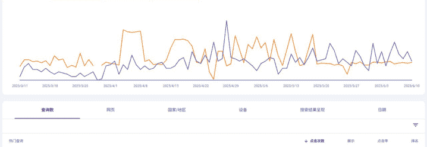
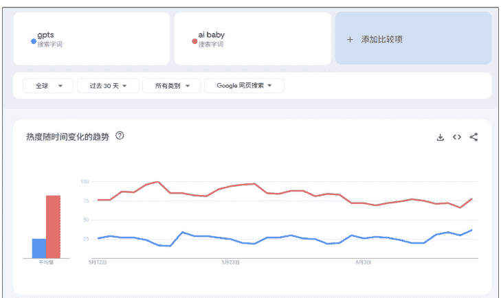
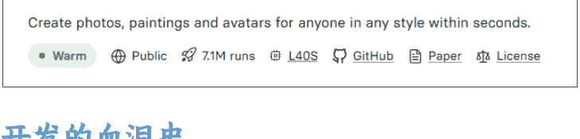
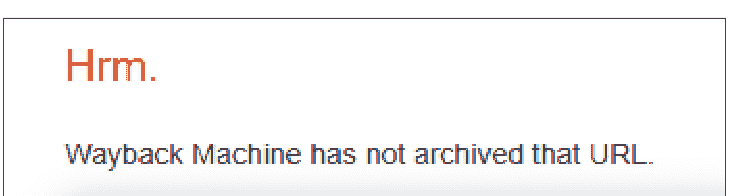
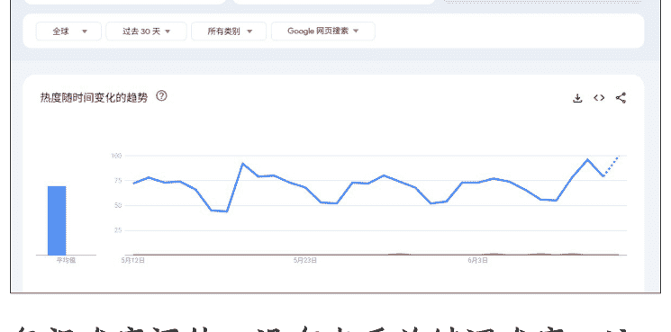
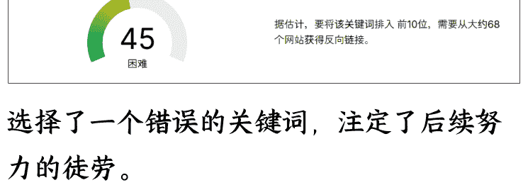
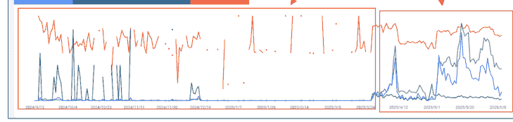
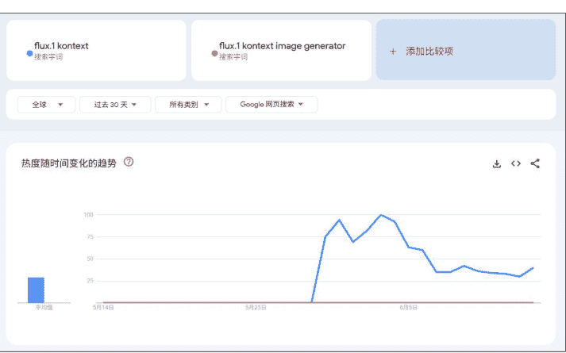
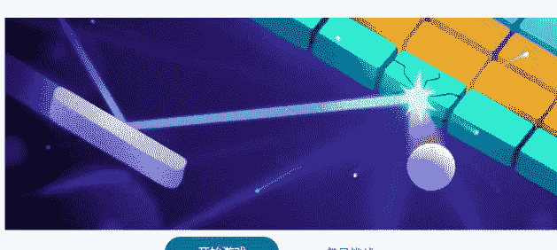
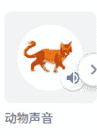

## 从0到第一笔订单:AI工具站出海实战35 站复盘

250625   生财精华

公众号懒人搜索，懒人专属群


大家好，我是rms，从事IT行业，但不是程序员，所以相对纯新手有点基础但不多。做ai web出海项目已经一年了。这篇文章选择了几个有代表性的网站做了总结和复盘，希望能对大家有所帮助。

## 前言

一年时间，35个网站，好几次放弃又重新开始，终于迎来第一笔4.99美元订单。作为一个有IT背景但非程序员的新手，我从2024年6月开始断断续续做网站，其中包括15个游戏站、18个工具站、2个导航站，绝大部分是单页站。

这篇文章记录了我在AI出海路上的完整踩坑过程，从最初的纯HTML工具站到最终实现变现，每一次挫折都是宝贵的经验积累。希望我的经历能给同样在路上的朋友一些参考和鼓励。

## 第一阶段：初出茅庐的前端工具站

### 简陋的开始

最开始做的是最简单的前端工具站，就是纯HTML网站，比如编码解码工具。其中有个取名网站，功能极其简单——预存10个名字，用户每次点击"生成"就随机显示一个。这种粗糙的实现方式现在回想起来确实让人哭笑不得。

### 第一次挫折

网站上线后的结果：完全没有流量。即使出了一些关键词，排名也在100左右。



面对惨淡的数据，我开始反思问题所在：

- 功能过于简单：用户体验差，没有任何技术含量
- 界面极不美观：完全没有设计感，看起来就像学生作业

这次失败让我意识到，仅仅有一个能用的功能是远远不够的，必须在技术复杂度和用户体验上都有提升。

## 第二阶段：AI Baby - 让我亏钱的代价

### 选词的初次尝试

痛定思痛后，我决定做一个有AI功能的网站来解决技术含量问题。在选词环节，我学习了在Google Trends上用GPTs对比关键词流量，发现"AI Baby"这个词的热度比GPTs还高，当时觉得找到了宝藏。



通过GPT分析用户需求后，我明确了网站功能：用户上传父母照片，AI生成孩子的照片。在Replicate上找到了合适的模型，成本看起来很划算——140张图才1美元。



### 开发的血泪史

这是我唯一一个熬夜开发还最终亏钱下线的网站。由于在出差期间开发，白天上班，晚上在酒店熬夜写代码。期间还遇到了Chrome报告网站为钓鱼欺诈的问题，后来才意识到可能是域名之前被滥用过。

教训总结：现在每次上站前都会在Wayback Machine查询域名历史，避免使用有不良记录的域名。



图生图网站的开发比想象中复杂，我总结出完整流程：

- 前端表单获取用户输入的文本和图片
- 图片传给后端，上传到Cloudflare R2，获取图片URL
- 将prompt和图片URL发送给Replicate API生图
- 前端轮询获取API生图结果

重要提醒：一定要通过后端API调用Replicate，前端直接调用会泄露API key导致被盗刷。

### 惨痛的结局

网站开发完成后，我去V2EX发帖推广，确实获得了一些访问。但Google完全没有曝光，更别说点击了。熬夜做出来的网站得到这种结果，让我倍感挫败，直接放弃了做网站。

更糟糕的是，某天发现信用卡有几十元扣款，一查才知道网站被人当API接口刷了！因为没有注册登录机制且免费使用，被恶意利用了。我立即下线网站，并学到了重要一课：免费功能必须加验证码，比如Cloudflare的Turnstile。

虽然这个网站让我亏钱又心累，但也学到了关键经验：

- 上站前检查域名历史
- 图生图网站的完整实现流程
- 免费功能的安全防护措施

## 第三阶段：颜值打分站重拾信心

### 看到希望的曙光

在社群里看到有人做颜值打分网站获得了流量，这重新点燃了我的斗志。我研究了他的网站，发现虽然也比较粗糙，但有流量就说明可行。同时我学到了重要的SEO知识：页面文本应在800-1200词，目标关键词密度保持在3%-5%。

### 选词的新错误

模仿他人的思路，我选择了"Face Analysis Attractiveness"这个词，但犯了两个致命错误：

- 没有对比流量：忘记和GPTs对比，实际上这个词流量相当小


- 忽视难度评估：没有查看关键词难度，这是个既难又没流量的词


选择了一个错误的关键词，注定了后续努力的徒劳。

### 技术突破

开发过程中又学到新知识：Gemini不允许中国IP访问，无法在本地调用API测试。解决方案是在Next.js中配置代理：

```
// 设置 undici 代理
if (process.env.NODE_ENV === 'development' && (process.env.HTTP_PROXY || process.env.HTTPS_PROXY)) {
  const { setGlobalDispatcher, ProxyAgent } = require('undici');
  const proxyUrl = process.env.HTTPS_PROXY || process.env.HTTP_PROXY;
  setGlobalDispatcher(new ProxyAgent(proxyUrl));
  console.log('Proxy configured:', proxyUrl);
}
```

### 意外的收获

网站上线：
https://faceanalysisattractiveness.online/

这次我特别注意了关键词密度，在首页加了FAQ模块。虽然当时还不懂完整的落地页结构，但至少知道了要控制关键词密度。

| Keyword | Count | Total | Density |
|---|---|---|---|
| face analysis attractiveness | 25 | 610 | 4.10% |

神奇的转折：网站初期毫无流量，我再次准备放弃。但几个月后，它竟然开始有流量了！每天有一二十的点击，这是我第一次体验到网站自然增长的感觉。2024年4月参加生财AI Web航海期间，这点流量给了我巨大信心——这也是我目前流量最大的站。



## 第四阶段：在生财有术的系统学习

### 认知的系统升级

2023年11月13日亦仁发布的AI应用超级标杆深深鼓舞了我，刘小排的《5分钟做个网站，人人都能学会》更是提供了实用方法论：先用bolt.new做原型，再用cursor精雕细琢。

我记下了刘小排的核心prompt，后来在多个站点上都有应用：

- 技术栈：纯HTML + TailwindCSS
- 功能实现：根据具体需求定制算法逻辑
- 页面结构：完整的header、hero、testimonials、faq、features、pricing、how it works、footer模块
- 内容要求：专业、真实的文案内容
- 设计风格：现代化、高级，参考苹果官网风格，自适应各种屏幕

这个prompt让我第一次系统性地理解了一个优质落地页应该包含哪些模块，从此告别了"盲人摸象"的状态。

## 第五阶段：AI Doll 抓住热点机会

### 敏锐的热点捕捉

GPT-4o发布后，在交流群看到有人分享"AI Doll"这个词，热度相当高。虽然在微信群看到可能已经晚了，但本着"不挑词"的精神还是决定上站。

使用bolt出原型，cursor实现功能，网站：https://ai-doll.online/

技术配置：Kie的4o API，2分钟出一张图，成本一毛钱一张，免登录免费使用但加了Cloudflare Turnstile验证。

### 短暂的高光时刻

网站上线后发了外链，意外获得了一些有流量网站的自发外链。那几天每天GA显示有一两百访客，因为出图需要2分钟，用户平均停留时间超过2分30秒，每天API费用30-50元。

看到这个数据，我决定去香港办银行卡，觉得每天一两百用户肯定会有付费转化。同时申请了AdSense想回收一些API成本，申请后3-4天就通过了，也积累了AdSense申请经验。

### 意外的发现

虽然我做的关键词是"AI Doll"，但没有拿到这个词的排名，反而意外获得了"AI Doll Online"的第一名。有趣的是，我的页面文案中从未出现过"ai doll online"这个词组，只是域名使用了online后缀。

这个发现让我意识到域名本身也会影响SEO，虽然"AI Doll Online"搜索量很小，我排第一每天也只有10左右点击。

实用信息：5月去香港办了银行卡（现在可以用Creem，不需要港卡了），按照攻略文章：https://mp.weixin.qq.com/s/V3KFdngsCnSyblWfRnd-lQ，原计划办4家银行：中银香港、汇丰、众安、天星，最后成功办了三张，都是线上办理，材料准备好后并不困难。

## 第六阶段：Flux 站的首次变现

### 快速响应新模型

Flux Kontext模型发布当天我就上了站，这次吸取了之前的教训，一开始就用模板开发。因为在开发ai-doll.online时发现，bolt+cursor虽然上线快，但后续集成登录、数据库、支付非常耗时，而模板可以大大提高效率。

### 开发时间线：

- 第一天：完成落地页
https://fluxlkontextimagegenerator.online/
- 第二天：集成注册登录和生图功能
- 第三天：接入支付系统

### 又一次选词失误

最初购买的域名是fluxlkontext.online，但担心商标问题改成了fluxlkontextimagegenerator.online，页面关键词也相应调整为"flux.1 kontext image generator"。

后来发现flux.1 kontext根本没有注册商标，白白错失了更好的关键词机会。两个关键词的搜索量差距很大，这个决策失误让我错过了更高的流量潜力。



### 历史性的第一笔订单

网站上线几天后发了一些外链，虽然实际流量很少，但竟然来了一笔4.99美元的订单！这是我做网站一年多来的第一笔收入，给了我巨大的鼓舞。

虽然这笔订单很大程度上靠运气，但证明了整个商业模式是可行的：只要有合适的产品和足够的流量，变现是可能的。

## 我的独特经验总结

### 非程序员的技术进阶路径

从"10个预存名字"到"完整图生图网站"的具体学习轨迹：

- 第一阶段：纯HTML + 简单JavaScript（预存数据随机显示）
- 第二阶段：学会API调用 + 文件上传（AI Baby血泪史）
- 第三阶段：掌握代理配置解决访问限制（Gemini API问题）
- 第四阶段：bolt.new → cursor的标准化开发流程
- 第五阶段：使用成熟模板加快上站速度

关键转折点：生财学到刘小排的prompt模板，从此告别"盲人摸象"，每个站都有标准的落地页结构。这个认知升级比任何技术突破都重要。

### 基于亏损教训的安全框架

AI Baby被盗刷的血泪经验形成的铁律：

- 域名历史必查：Wayback Machine避免钓鱼域名（Chrome误判的痛）
- API调用必走后端：前端直接调用=财务灾难
- 免费功能必加验证：Cloudflare Turnstile是底线

### 抓住新模型发布窗口期的执行策略

Flux Kontext当天上站的时间管理术：

- Day 0（模型发布当天）：立即购买域名，写出落地页，上线
- Day 1：cursor实现核心的生图功能，确保基本可用
- Day 2-3：集成其它核心功能（登录、支付）

"不挑词"哲学：即使在微信群看到已经"晚了"，也要上。因为长尾机会仍然存在，而且技术实现经验可以积累到下一个机会。

### 意外收获的复盘智慧

三个"意外"教会我的事：

- 域名后缀的SEO魔力：ai-doll.online意外获得"AI Doll Online"第一名，文案从未出现这个词组
- 失败站点的延迟价值：颜值打分站3个月后才起量，教会我耐心等待
- 自发外链的获得方式：AI Doll站因为功能免费使用获得其他站主动外链

这些意外让我明白：SEO有很多我们不理解的因素，保持谦逊很重要。

### 35 站磨练出的心态管理术

多次放弃→重启的心理建设公式：

- 社群反馈机制：看到同水平人的成功案例→重燃斗志
- 小胜利放大：颜值站每天20点击→巨大信心提升
- 失败经验转化：每次被坑都总结成可复用的避坑指南
- 里程碑设定：第一笔4.99美元不是终点，是证明模式可行的起点

最重要的心态转变：从追求"快速成功"到接受"持续积累"。35个站的价值不在于每个都成功，而在于形成了可复制的方法论。

### 选词教训转化的判断框架

基于具体失败案例的选词避坑指南：

- Face Analysis Attractiveness教训：既难又没量是最坏组合，必查Ahrefs难度
- Flux Kontext教训：商标恐惧症让我错失flux1kontext.online，后来发现根本没注册

现在的选词SOP：Google Trends对比→Ahrefs难度查询→商标检查(但不过度恐惧)→决策。

## 具体实操经验

### 避免的搜索结果类型

不建议做的词类型：

- 搜索时直接出现视频结果的词
- 出现AI总结的词

- 出现Google自己做的游戏的词

block breaker
全部 图片 视频 短视频 购物 新闻 网页 更多
不限语言 时间不限 所有结果 高级搜索
打砖块

开始游戏
每日挑战
游戏和玩具
工具




### 出现其他网站 site links 的词

这些类型的搜索结果说明Google已经有了"标准答案"，新网站很难获得排名。

### 外链策略

- 按网站类型分类发外链：
  - 小游戏站：主要发博客评论外链
  - 工具站：AI导航站和博客评论外链都可以发
  - 导航站：用户提交网站时要求在他们网站上加外链
- 外链发布流程：
  - 在Google搜索目标关键词，查看前10名结果
  - 排除大站，选择相似的同行网站
  - 在Ahrefs或Semrush查看他们的外链
  - 照着发，并记录发过的外链网站

定期清理不更新的AI导航站
随着网站数量增加，外链库会越来越大，形成良性循环。

### 内页扩展策略

遵循"一个关键词一个页面"的原则：

- 关键词来源：
  - 分析同行网站的关键词布局
  - 使用Ahrefs或Semrush的关键词生成器
  - Google搜索下拉框：https://www.searchsuggest.tips/
- 内容创建原则：
  - 每个页面专注一个核心关键词
  - 保持800-1200词的内容长度
  - 关键词密度控制在3%-5%
  - 确保内容与关键词高度相关

### 技术实现要点

- 安全防护：
  - 免费功能必须加验证码（Cloudflare Turnstile）
  - API调用必须通过后端，避免泄露密钥
  - 定期检查异常使用情况
- 开发效率：
  - 新模型发布当天立即上站抢占先机
  - 对于新手来说可以从零开发熟悉网站的流程和结构，对于老手优先使用成熟模板而非从零开发
  - 建立标准的开发流程：落地页→功能→支付
- SEO基础：
  - 上站前必查域名历史（Wayback Machine）
  - 落地页包含完整模块结构
  - 注意关键词密度和内容质量

## 深度反思与启示

### 心态管理的重要性

做AI出海最大的挑战不是技术，而是心态。我经历了多次放弃又重新开始的循环，每次挫折都让我想要彻底放弃。但回头看，每次"失败"都在为最终的成功积累经验。

### 关键转折点：

- AI Baby的被盗刷让我学会了安全防护
- 颜值打分站的意外流量让我重拾信心
- 生财学习让我建立了系统认知
- 第一笔订单证明了模式可行

### 商业模式的吸引力

虽然项目难度很大，但商业模式确实诱人：

- 持续性收益：排名稳定的网站能带来 months 甚至 years 的稳定收入
- 被动收入：网站运行期间可以"什么都不做"
- 美元收入：与 rmb 1:7 的汇率优势
- 可扩展性：可以持续做更多网站

### 社群的价值

如果真的想深耕这个项目，有一个相关交流圈子很重要：

- 新手前几十个站没收益非常正常
- 缺乏正反馈很容易放弃
- 看到同水平的人分享经验能重拾信心
- 及时获得新机会和趋势信息

我多次放弃又重新开始，很大程度上是因为在群里看到其他人的成功案例重燃斗志。

### 对新手的建议

- 降低期望值：前几十个站大概率都不会有明显收益
- 系统学习：投入时间学习SEO、落地页设计等基础知识
- 快速行动：新模型发布当天就要上站
- 记录复盘：每个网站都要总结经验教训
- 坚持发外链：这是新站获得初始流量的重要途径

### 写在最后

从第一个简陋的HTML工具站到第一笔4.99美元订单，这一年的经历让我深刻体会到：AI出海不是一个快速致富的项目，而是一个需要持续学习和坚持的马拉松。

35个网站的经历告诉我：技术可以学，工具可以用，但最重要的是在挫折中保持学习的心态和行动力。每一次失败都在为成功积累经验，每一个细节的改进都可能带来质的飞跃。懒人微信：lazyhelper

第一笔订单不是终点，而是证明这条路可行的起点。它让我相信，只要持续优化产品、流量和转化，规模化盈利是可能实现的目标。

对于还在路上的朋友们：保持耐心，持续行动，相信时间的复利。你的第一笔订单也许就在下一个网站等着你。


懒人专属群持续更新中，已持续运营6年，整理超3000份各类精选付费文章&年费社群干货，全部开放下载。

本资料为付费群内部分享，仅供真实有需要的朋友查阅。

懒人专属群更新记录：
https://lazy2025.top/#/blog/record2

懒人专属群更新记录（需梯子，备用）：
https://lazybook.fun/#/blog/record2