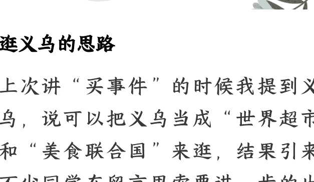

# 文旅攻略:2025 暑假出游思路

250627《蔡钰·商业参考4》节选

整理:公众号懒人搜索,懒人专属群独享

懒人微信:lazyhelper

## 逛义乌的思路

上次讲“买事件”的时候我提到义乌,说可以把义乌当成“世界超市”和“美食联合国”来逛,结果引来了不少同学在留言里索要进一步的出行攻略,想要暑假带娃打卡。

我在这里简单说一下我的义乌探访思路:

首先,在世界超市这个维度上,重点可以逛的就是义乌国际商贸城。这个商贸城无比大,普通人就不要指望事无巨细逛个遍了。可以重点逛一区和五区,一区是玩具饰品,五区是进口商品,既好玩,可零售的商品品类也比其他商区要多。五区有些售卖葡萄酒、木器的门店,甚至可以当作博物馆来逛。

在一区和五区之外,二区主营箱包五金和电子设备,三区主营文具、化妆品,四区是服饰的配饰——注意不是服装,而是花边针线鞋袜手套,义乌另有一个篁园市场是卖服装的。你可以根据自己的个性、兴趣和体能，再另外安排。

即便脚程再快，每个区至少也要花掉你半天的时间。所以建议你直接住在商贸城附近，并提前留意酒店周边有没有足疗门店。

其次，在美食联合国这个维度上，因为全国和世界各地的商人都往返义乌做生意，所以义乌几乎拥有世界各地的特色菜馆，而且基本都很地道。你完全可以路过时，看着顺眼直接进，或者打开大众点评在附近搜索“中东菜”“印度菜”“拉美菜”，再参考距离和评分来选择。

对了，义乌据说拥有全国唯一一家埃塞俄比亚餐厅，如果你是美食集邮爱好者，不妨专门搜一下。

整个行程，如果只是为了开眼界，我觉得两天足够了。当然，如果你能约到本地的商户朋友或得到同学多聊一聊，肯定会听到更多有趣的故事。

说完了义乌，我们干脆说说暑期攻略。2025年暑假，你有没有休假和遛娃的计划？这一讲，我想给你推荐几个参考目的地。

## 可能会“人从众”的地方

先来看看大行情。

国家文旅部根据市场数据，对2025年的暑期文旅消费热点做了预测。文旅部说，出境游在7月3日前后、7月25日前后，及8月8日前后会出现三次高峰，而泰国、新加坡、马尔代夫、卡塔尔和马来西亚，是免签国家里，中国游客出境游最热门的5个目的地。

暑假嘛，旅游主题主要集中在亲子游。亲子游在国内游又分成三大类：第一类是拥抱自然型，人们尤其喜欢上山、下海、入草原。从携程的数据看，喜欢玩水的人们，预定得最多的是厦门、北海、青岛、汕头、大连这5个滨海城市。

第二类是研学型，尤其是去探访各种世界文化遗产。这其中，北京因为拥有的世界文化遗产多达8处，又是研学人群的第一目的地。

第三类，深度体验型，追求情绪价值和文化情感共振。美团的预订数据显示，暑期国内预订量排名前十的景区，是这么几个：

- 第一，上海迪士尼度假区。
- 第二，北京环球度假区。
- 第三，蓟州车神架风景区。
- 第四，上海海昌海洋公园。
- 第五，西安秦始皇帝陵博物馆，也就是兵马俑。
- 第六，洛阳洛邑古城。
- 第七，珠海长隆海洋王国。
- 第八，湖州安吉浙北大峡谷。
- 第九，北京京报馆。

这个最让我意外。京报馆是个红色旅游目的地,是著名报人邵飘萍创办《京报》的办公地旧址,也是马克思主义传播的重要阵地。但北京的红色旅游景点这么多,京报馆为什么能脱颖而出?如果你正好是了解缘故的旅游从业者或者旅游达人,请你一定要在留言区告诉我。

- 第十，新疆赛里木湖风景名胜区。

如果你的暑假出游目的地还没有计划,前面这些热门方向供你参考。如果你不喜欢人多,那前面这些热门方向也供你反过来参考,出行时考虑错开前面提到的这些时间段和目的地。

除了官方给出的大方向指引,我也还有几个自己想看看的地方,也供你参考。

## 最佳旅游乡村

第一个推荐,是去看看“切中了世界趣味的中国”,跟着联合国的趣味走。

怎么说?联合国旅游组织执行委员会公布的2024年全球“最佳旅游乡村”名单里,中国占了7个。

联合国旅游组织的这个评选是从2021年开始做的,筛选标准是:关注乡村的景观、知识体系、生态和文化多样性、本土价值观、活动,当然还有美食。也就是说，入选村子至少在其中一个维度上有突出表现。

中国入选了哪 7 个乡村呢？

云南阿者科村、福建官洋村、湖南十八洞村、四川桃坪村、安徽小岗村、浙江溪头村、山东烟墩角村。

云南阿者科村，有独特的哈尼族文化和梯田景观。

福建官洋村，是个拥有古老建筑和传统手工艺的客家村落。

湖南十八洞村，是个苗寨古村，也是“精准扶贫”的首倡地。这个村子既能用来体验苗族生活风情，也能用来观察中国式现代化乡村的发展模式。

四川桃坪村，是个镶嵌在群山之中的羌族聚居村落，保存着世界上最完整的羌族古建筑群。

安徽小岗村，这个你肯定知道了，这是中国农村改革第一村，“大包干”模式的发源地，对中国经济发展具有重要的符号意义。

浙江溪头村，特色是拥有世界最大的古龙窑群。这里还有两个特别值得看的景观：

一个是 7 座始终不熄火的古龙窑，常年吸引各地的青瓷大师前来烧制青瓷。这些古龙窑座落在山边竹林里，在晚上看特别美，竹林、烟雾和火光混杂在一起，就像一部武侠电影。

另一个是一组16个的竹建筑群，十多年前由8个国家的11位设计师在这里合作打造的，也非常漂亮。

第七个是山东的烟墩角村，是明朝时抗击倭寇的所在地。这个村里有1000多间最早由明朝保存下来的海草房，也就是用石头砌墙、海草做屋顶的房子，被称为“活的中国生态建筑标本”。这些海草房里有50多间还被放开做成了民宿，手快的游客可以住进去体验。

这7个村子，加上以前入选的乡村，中国被联合国旅游组织认证过的“最佳旅游乡村”总共有15个，这个总数也是世界第一了。

此前的那8个，分别是浙江余村、安徽西递村、广西大寨村、重庆荆竹村、江西篁岭村、浙江下姜村、甘肃扎尕那村和陕西朱家湾村。

这15个村子都推荐给你。大人能出片儿，小孩能攒作文素材，有心做跨境生意或者入境旅游的创业者，还可以琢磨琢磨中外审美的交集，三赢。

## 年轻艺术家们的创作演化脉络

第二个推荐，是去看看年轻人的文化创新演化脉络。

我常住北京，每年五六月份只要有时间，都会张罗朋友去中央美术学院、清华美术学院看看艺术生们的毕业设计展。专栏前面讲过，我们认为接下来，文化繁荣会是中国不可阻挡的趋势之一。

那么，最有生命力的年轻艺术家们，在关心什么问题，往哪个方向创作，怎么把新的社会课题、时代情绪和新技术、新材料揉进作品里，在美院的毕业设计展里通常都能找到阶段性的答案。

2025 年，北京的中央美术学院有个超人气作品叫《锐角》，作者王健烨做了一组挤在一起的巨大家长雕塑，所有人双臂伸展弯下腰，形成一个锐角空间，鼓励观众们坐在空间里小小的椅子上，感受来自家庭的“压迫式关怀”。类似的精彩之作，重庆川美和杭州国美的毕业设计展上也都在出现。

毕业设计展上的不少好作品，往往在现场就会被不知名的买家下单买走，这也能帮我们感知中国文化和艺术市场接下来的走向。

不过很遗憾，艺术学校的毕业设计展，通常 6 月底就会结束，我们在暑假行程里通常就看不了了。因为你能过暑假，艺术生们也能毕业散场。

那我跟你聊这些，光是为了馋你吗？还真不是，今年我发现了一个“代餐”：中央美院，在郑州开设了一个艺术展叫“时空图层”，展出的是过往十年，被学校美术馆收录进馆藏的近 80 套毕业生作品。这个展览座落在郑州的商都阜民里文化街区，一直持续到8月25号。如果你这个暑假有路过郑州的安排，不妨考虑去看看。

这个展览的展品什么类别都有，国画、油画、雕塑、装置、综合材料等等等等，按照不同的意义主题分成了四个板块。不过你要是去看，其实可以考虑跳出策展方的界定，按照时间逻辑多逛几个来回，去看看一代又一代的年轻创作者们都在想什么问题、用什么手法，为我们自己的超级图景补充一条新脉络。

## 总结

以上，是2025年这个暑假，我想要分享给你的出行参考目的地。

而在目的地之外，我更想分享给你的是背后的共同思路：把旅行当作观察世界的机会，把“刷景点”当作开新视角，去真正看到别人在如何生活、如何思考、如何表达，也让自己成为不断发现世界新缝隙的人类学家。

这不就是我们讲过的“买事件”嘛。

拜了个拜。

微信:lazyhelper

懒人专属群持续更新中，已持续运营6年，整理超3000份各类精选付费文章&年费社群干货，全部开放下载。

本资料为付费群内部分享，仅供真实有需要的朋友查阅 🤫

懒人专属群更新记录：
https://lazy2025.top/#/blog/record2

懒人专属群更新记录（需梯子，备用）：
https://lazybook.fun/#/blog/record2