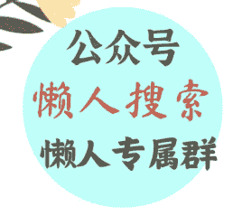

# 印尼政府要抹杀 1998 年屠华暴乱历史，到底意欲何为？

整理：公众号懒人搜索，懒人专属群独享

懒人微信：lazyhelper

微信：lazyhelper

最近，有一则新闻在中文网络上几乎没有被提及，但在东南亚网络上却闹得沸沸扬扬。

印尼政府在今年 8 月将出版一套新的历史丛书，记录印尼从直立人到荷兰殖民时期再到普拉博沃当选的历史。

一个国家修史是正常的事，任何一个国家都会做，但问题在于，如果在修史的过程中篡改历史呢？

这套丛书的主导者、印尼现任文化部部长法德利在接受印尼网媒“IDN Times”访问时，直接否认 1998 年的大规模屠华事件。

他甚至声称事件纯属“谣言”，“从来都没有任何证据，这只是一个故事”。

对于 1998 年印尼的排华屠华事件，相信每一个上网的中国网友或多或少都了解一些，某种程度上，那也是中国人心中的一个痛点，毕竟受害者全部是华人同胞，而且距离暴行的发生并没有过去多久。

印尼历史上发生过多次针对华人的屠杀，比如 1945 年 11 月的泗水惨案，1946 年的万隆惨案；1963 年 3 月至 5 月从西爪哇蔓延到中东爪哇的排华骚乱，以及 1978 年雅加达由学生示威引发的反华骚乱。到了 20 世纪 80 年代，不同程度的反华和排华流血事件此起彼伏。

1997 年，东南亚金融危机爆发，导致印尼经济一落千丈，50% 的印尼人处于贫困线以下，超过 1500 万人失业，印尼盾同美元的比价一度跌至 17000 盾兑换 1 美元。

讽刺的是，此时的苏哈托家族却拥有至少 150 亿美元财富，被列为世界银行“贪污腐败富翁榜”的榜首。

一边是民众的困苦不堪，一边是苏哈托家族的穷奢极欲，从 1997 年开始，印尼全国掀起反对苏哈托的大规模游行示威浪潮。

苏哈托下令镇压。

于是，印尼军警开始对游行学生开枪射击，导致各地出现大规模骚乱，一直延续到 1998 年年初。

这时的苏哈托，政治地位岌岌可危，已然无法控制住大局。穷途末路之际，他又想起 60 年代通过屠杀华人转移国内民众视线的老方法。

将国家的经济危机说成是华人造成的，将华人定为财富的吸血鬼，那么，民众不就去恨华人而放过他了吗？

所以，从 5 月上旬开始，他就命令一名得力干将组织策划这件事。

于是，从 5 月 13 日开始，华人坠入了人间地狱。暴行过后，据雅加达人权与妇女研究组织经整理后的报告，5 月发生的骚乱中，1000 多名华人被杀。印尼各地总共发生 5000 多起暴徒强奸华裔妇女的惨案。其中，以雅加达每天发生的 100 多起最为严重。

1998 年离现在不过 27 年，当年许多当事人依旧健在，那些记录暴行的照片和影像在网上到处都是，而印尼官方如此明目张胆地否认历史，如此“睁眼说瞎话”，真的是匪夷所思。

所以，印尼那位文化部长法德利的话一出，立即引起了印尼以及国际社会上识之士的舆论挞伐，尤其是华人团体更是愤怒无比。

印尼华人青年协会成员迪亚批评法德利的言论“令人深感痛心”。他痛心疾首地说：“印尼华人的历史从未出现在印尼的历史书中，我们仅仅因为身份就遭受歧视和暴力。当政府否认 1998 年发生的事情时⋯⋯就好像我们不被视为这个国家的一部分。”

20 多年前华人被暴力对待，20 多年后，他们受欺凌的历史却被官方抹去，这无异于被第二次暴力侵害。

## 2

那么，问题来了，那段沉痛历史如此真实，如此板上钉钉，印尼政府为什么要冒天下之大不韪，如此肆无忌惮地否认那段历史呢？

其中很重要的一个原因是，现任印尼的新总统普拉博沃，要粉饰自己和岳父（印尼前总统苏哈托）的历史。

前面说了，当年苏哈托决定发动排华事件时，是让自己的得力手下去具体执行的。这个得力手下就是他的女婿、时任陆军战略后备部队司令普拉博沃。

普拉博沃出身印尼政治世家，1983 年，普拉博沃与苏哈托的二女儿西蒂结婚。成了“驸马爷”之后，普拉博沃很快就出任“红色贝雷帽”特种部队司令。

他作风强悍，人也精明，很受苏哈托重用。西蒂也在商界大展拳脚，迅速积累惊人财富。夫妻俩的风头一时无二。

所以到了 1998 年苏哈托政权岌岌可危之际，作为女婿的普拉博沃自然要想父之所急——拿华人开刀，转移视线。

但这种脏活，得有更得力的助手干才行。于是，普拉博沃想到了自己的部下，也是自己军校同学的夏弗里·三苏汀。

夏弗里出身平民，之后入伍，因表现优异，被选送至军校深造，继而在军校认识了普拉博沃。普拉博沃很欣赏这个才能出色又野心勃勃的同学，自己在飞黄腾达之后，也时不时地提携他。于是在他成为特种部队司令之后，夏弗里也成为特种部队作战部部长。

所以，这次普拉博沃找到夏弗里后，夏弗里一口答应。

之后，二人开始暗中策划暴乱。

因为是“贵人”的指示，夏弗里自是尽心竭力。他们收买了一大批地痞流氓、无业游民、黑社会分子和反华极端分子，通过鼓动和悬赏的方式拉他们入伙，进行屠杀华人的训练。

可以说，1998年那场暴行，就是由苏哈托一手策划，由普拉博沃和夏弗里二人具体执行的暴行。

暴行发生后，统治印尼32年的苏哈托并未能用华人的血换来总统职位的稳定，在国际压力下，被迫辞职。2008年，苏哈托病死，终其一生，他都没有受到清算，唯一值得欣慰的是，2016 年，他被国际人民法庭裁决犯下反人类罪。

同样没有被清算的还有暴行的两个执行者，普拉博沃和夏弗里，他们不仅没被清算，而且还活得十分滋润。

作为苏哈托的女婿和忠实鹰犬，苏哈托倒台后，普拉博沃很快就被赶出了军队，他的婚姻也画上了句号。

但是，作为一个在印尼政坛和军界深耕多年的人，这些年积累了无穷尽的资源和人脉，不可能那么容易倒下，换句话说，离开军队只是他政治生命的开始。

2004 年，普拉博沃加入印尼斗争民主党，他的政治目标可不只想当一个政治小喽啰，而是谋求总统大位。但是，印尼人出于对苏哈托时代的忌惮，一直不认可他，他的政治生涯一直在遭遇“屡战屡败、屡败屡战”的模式，二十来年始终选不上。

但普拉博沃善于见风使舵、迎合民意。屡次竞选失败让他意识到，靠反华不可能赢得大选的，关键是，当年“屠华”事件一直是他的政治污点，于是清洗这个污点，成了他迫不及待要做的事。

- 首先，他否认当年组织过“屠华”，他特意跟英美媒体搞好关系，用流利的英语通过欧美媒体对西方世界说，“我从未因为任何事被起诉，那些事一直都只是捕风捉影，一直都只是虚假指控。”
- 其次，他跟华人搞好关系，他向华人许诺，一旦他当选，就会出台一系列措施提升华人的政治待遇，甚至还要废除几十年前那些针对华人的不合时宜的法令。
- 再次，他向英美国家示好，誓言要推动印尼的人权改革。
- 最后，则是向中国示好。他在不同场合表示，中国的成功经验值得全亚洲，尤其是印尼学习。他若当选，一定跟中国搞好关系，学习中国发展经济的经验。

这几板斧下来，不知道华人对他印象是否改观，反正是获得了英美的认可。所以，2024 年总统大选，就有来自欧美的专业团队帮助他竞选。

不论如何，普拉博沃的改变是收到了效果的。

2024 年初，普拉博沃和印尼总统佐科握手言和，在佐科的助推下，以及一系列政治交易下，73 岁的普拉博沃终于在 2024 年成功当选印尼新一任总统。

普拉博沃当选印尼总统后，很快就提拔自己当年的部下、当年和他一起组织“屠华”的另一个刽子手，72岁的夏弗里出任新任印尼国防部长。

这两个当年沾满了印尼华人鲜血的刽子手，如今摇身一变，成为印尼最有权力的两个人。

前面说了，对于当年的“屠华”事件，普拉博沃从来没有承认过。如果说，以前印尼政府对这件事是讳莫如深的话，那么普拉博沃上台后，则更多的是否认了。

当然，如果只是否认也就罢了，问题在于，他们自己在“岁月史书”里通过重新修史，要彻底抹掉那段历史。

那段历史对受害者来说沉痛无比，对他们来说，则是政治污点。清洗政治污点，塑造自己“伟光正”形象，是他们急需要做的事。

## 3

印尼文化部部长法德利否认历史的言论虽然遭到了印尼华人和国际社会的鞭挞，但获得印尼官方以及保守势力的认可。

他们认为，当年所有的调查报告没有提供姓名、地点和作恶者等细节，既然没有这些细节，那一切就不存在。在他们看来，暴行的指控必须谨慎，因为这事关国家尊严和真相。

不难看出，印尼官方这样做，只是正在重新进行历史叙述，要将苏哈托打造成印尼的英雄，既是“英雄”，像排华屠华这样的暴行怎么可能存在？

将苏哈托列为民族英雄，不仅是现任印尼总统普拉博沃这样做，事实上，从前总统佐科执政开始，印尼政府多次尝试这样做，只是没有成功。

而印尼政府之所以要这样做，则是源于印尼的“强国叙事”。

印尼也是有强国梦的，这种强国梦随着印尼近年经济高速发展愈发强烈。

无论是人口面积，还是经济规模，印尼都是东南亚最大的国家，从印尼总统苏西洛开始，他们从来不把印尼跟其他东盟国家相比较，他们要的是全球定位。苏西洛提出的目标是，印尼争取在2025年进入世界经济十强，2050年至少成为全球第六大经济强国。

到了佐科上台，直接提出了“印尼梦”的概念。他提出了一个宏伟的目标，到2045年，即印尼独立100周年之际，将印尼打造成为全球五大强国之一。

这个宏伟蓝图被称为“黄金印尼愿景”，旨在建设一个主权完整、技术先进、可持续发展的群岛国家。

为了实现这一愿景，这些年来，印尼采取一系列措施，包括加强基础设施建设、推动科技创新、优化教育和卫生系统以及提升国民的生活品质。

而新上台的普拉博沃的“印尼大国梦”更为直接，他说，要将印尼打造成一个与中国印度一样的亚洲超级大国，在外交上，要将印尼打造成为“全球南方”的领导者。

经济政治上要成为强国，文化上自然也要成为强国，在这种情况下，新的历史叙述就显得极为必要。在外人看来，苏哈托是个独夫和暴君，但在印尼当局看来，他却是对印尼发展举足轻重的人物。他当政之时，印尼走上了现代化的道路，搞好了政治稳定，大力发展经济，还强化了国防。另外，他也促进了印尼的国际合作，让印尼更多参与到国际事务中。

甚至有印尼保守势力将其视为“印尼现代国家之父”。

印尼要成为一个“强国”，成为一个“大国”，苏哈托时代就是开端和基础，现在的印尼是对苏哈托政治遗产的继承和发扬光大，如果这个政治遗产是有排华暴行污点的，那意味着印尼的强国梦也是有污点、有缺陷的。

正因如此，从佐科政府到现在的普拉博沃政府才一直要将苏哈托打造成一个“民族英雄”。民族英雄自然不能有污点，自然不能有暴行，像屠华这样的历史自然要被抹去。

否则，一个带有历史污点的强国崛起，就算不上真正的崛起，一个有屠杀平民历史的强国，会被国际社会诟病和嘲笑。这对雄心勃勃的印尼来说，是绝不想看到的。

普拉博沃上台后，改革派的政治话语权大幅削弱。目前，除了一名独立民主党议员，改革派在印尼议会中几乎没有代表。普拉博沃集团与苏哈托时代及其意识形态存在延续性，他们正试图重新让强国叙事主导舆论。

## 4

意大利历史学家克罗齐曾提出一个著名的论点：一切历史都是当代史。用中国网友通俗的话说，历史是个任人打扮的小姑娘。

抹去排华暴行历史，就是印尼典型的以自己的意愿“打扮”历史的行为。站在印尼当局的角度，这种“打扮”或许无可厚非，但是站在真实历史角度呢？站在受害者角度呢？如此“掩耳盗铃”，真的是明智之举？

历史就是历史，历史不容被篡改，更不容被抹杀。一个有良知的政府，从来是要正确面对自己的历史，一个想真正崛起的强国，不仅不能抹杀不堪的历史，反而要对不堪的历史进行道歉和反思，这样才能赢得世人的尊重。

这一点，对印尼是如此，对其他国家（例如修改教科书的日本）同样如此。

微信:lazyhelper

📖 懒人专属群持续更新中，已持续运营 6 年，整理超 3000 份各类精选付费文章 & 年费社群干货，全部开放下载。

本资料为付费群内部分享，仅供真实有需要的朋友查阅 🕵️

懒人专属群更新记录：
https://lazy2025.top/#/blog/record2

懒人专属群更新记录（需梯子，备用）：
https://lazybook.fun/#/blog/record2