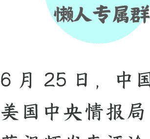

# 中情局公开招募“中国间谍”，病急乱投医了？

250630 文/卢克文工作室嘉宾 老纪扶犁

整理：公众号懒人搜索，懒人专属群独享

懒人微信：lazyhelper

微信:lazyhelper

6 月 25 日，中国国家安全部罕见地就美国中央情报局（CIA）发布的中文招募视频发表评论，直斥其为“失魂落魄、黔驴技穷、操作业余”，并奉劝其“别再枉费心机”。

CIA 是以隐蔽行动著称的顶级情报机构，竟公然在中文互联网平台发布粗制滥造的招募广告，不仅滑稽，而且堪称谍报史上的奇观。

这究竟是计谋深远的新花招，还是在华情报网屡遭重创后，无计可施下的“病急乱投医”？

## 壹

先讲个故事。

1979 年对越自卫反击战时，我军某部防御交通要点时，曾遇到一件奇葩事。

一日拂晓，阵地侧翼突然传过来嘹亮歌声，几十名士兵整齐地朝阵地走来。从服装到装备，一看就是自己人，士气饱满，队列也很标准。

快到前沿四五十米时，阵地突然响起一片枪声，是没人下达命令，集体不约而同地开枪，除了个别人跑掉外，这支“友邻部队”基本报销。

为啥自己人要打“自己人”？

因为这支“友邻部队”在唱《大海航行靠舵手》（“文革”后就停唱了），相当于在喊“我是间谍，朝我开枪”。

这支越军特工，脑瓜想破，也没想到是歌曲暴露了身份，要是唱个《团结就是力量》，说不定还就偷袭成功了。

CIA 这次搞的招募视频，就是这个味道。

咱们先介绍一下这次招募广告是咋回事。

5 月 1 日， CIA 在其官方和主要海外社交平台（ YouTube、X 等），投放了两部视频。

一部叫《天助自助，自己的命运自己掌握》，主题是“反内卷”，目标对象是基层年轻官员。故事架构是年轻官员像牛马一样累死累活，因为体制内分配不公，结果劳动成果被占有，个人价值被压制。

咋办呢？向 CIA 提供情报，掌握自身命运，摆脱被束缚的困境。

然后还给了技术操作指南，比如，如何安装 VPN “翻墙”访问境外网络。

另外一部叫《你的命运掌握在你手中》，主题是“阴谋论”，目标对象是中高级官员。故事架构是暗示当前的反腐败，是在内部清洗，下一个就到你，要趁早为家人留后路。

咋办呢？背叛国家换取安全保障，获得庇护和新生。

然后给了联络方式，除技术指引外，还强调通过加密通信渠道（如指定邮箱、暗网表单）提交情报，并宣称过程绝对匿名。

这两个视频是不是有点像越军的无厘头？

CIA 犯了两个“想当然”的错，一是中国的基层官员普遍有自豪感，并非是美国底层公务员的境况；二是把所有中高级官员直接定为贪污犯，提供跑路通道，这非常荒唐，显然对咱们现在的国情完全不理解。

其实，这并非 CIA 首次“广而告之”。

2024年10月1日，CIA就在海外中文社交平台，通过“@CIA_Humint”账号，以华语直接发出赤裸裸的“我们需要您”的召唤，格式粗糙、意图直白得近乎愚蠢。

再往前，还针对中国内地学生定制宣传册页，“欢迎拥抱自由和民主”，CIA 像是被那些认为“空气香甜”的人给整迷糊了，真以为留学生个个都是在逃难。

CIA 的做法，连国会议员都看不下去了，直接批为“心理和价值取向理解错位”和“不可理喻的精神错乱者”。

那么，CIA 为啥要演这出低级买家秀？表面上看，CIA 将策反工作大张旗鼓地公之于众，似乎违背了情报工作基本逻辑，有点滑稽和业余。然而实际上，CIA 此举，看似荒诞不经，但绝非简单的头脑发热，是有深刻的内在动因。

- 第一，美国情报工作核心是意识形态，搞这套是 CIA 的路径依赖。

简单地说，意识形态就是搞“自由和专制”的宏大叙事，CIA 把美国定位为“自由世界的捍卫者”，非西方政府则被划为专制。

定好这个框架后，CIA 就发动大规模的心理战和宣传战。

以冷战为例，CIA 通过运营自由欧洲电台，资助各类文化艺术活动，投入巨大资源制作广播、电影、报刊（如著名反苏俄语杂志《新大陆》），煽动苏联人对制度不满，塑造投奔自由世界的幻象。

在这种大背景下，CIA 的情报招募确实有一定效果，一旦出现因思想动摇而主动投诚的变节者，就会立刻被包装为弃暗投明的勇士，用新故事继续维持假象。

从这点上讲，搜集情报对 CIA 并不重要，成为输出价值观的传教士，更为重要。

苏军总参情报部将军波利亚科夫间谍案，就极为典型。他为 CIA 工作 27 年，在退休后，CIA 故意将其身份公开，使其暴露被处死。CIA 马上用他的故事撰写小说，拍摄电影，搞苏联将军叛变的叙事，做到了“一鱼多吃”。

随着时代发展，CIA 将此模式平移到互联网，自 2014 年起就建立“Digital Innovation”部门，定向在脸书等平台投放招募广告。2022 年针对俄乌人才外流的俄语网络广告，据说成效不错。

因此，今天我们看到的这则视频，仍是心理战传单和广播喊话的“数字升级版”。其内核一脉相承，即通过塑造一种道德和价值观上的优越感，吸引那些对自身所处环境不满或对西方抱有不切实际幻想的个体，主动掉入陷阱。

这是根植于 CIA 基因里的工作方法，无论时代如何变迁，都是在玩“攻心为上”的策略。

然而，CIA 要么过于傲慢，要么过于轻视咱们，完全不顾中国独特社会心理氛围和文化传统，直接来个粗暴移植，结果成了笑话。这有点像一个才去美国的留学生，有次生病了，美国同学来探望他，居然买了两碗方便面，因为在美国人眼里，方便面对于中国人，既爱吃又高大上。

- 第二，这也是在华情报网遭受毁灭性打击后的无奈之举。

近年来，中国反间谍斗争成果极为显著，对 CIA 在华行动造成系统级打击。从 2023 年开始，国家安全部定期公布大量 CIA 策反案件，这既是咱们自信的表现，也说明 CIA 在华受到严重挫败。

据《纽约时报》深度报道，CIA 曾在华构建了一个庞大间谍网络，然而“多达二十个”潜伏多年的线人，已经失联，是 CIA 情报史上最大的灾难之一。

这次“灾难”的后果是深远的。

它不仅让中情局损失了情报来源，更严重的是，它连借机宣传的机会都没有，直接摧毁了 CIA 在中国境内发展线人、建立网络的方法论和信任链。

传统依靠外交人员或商业人士为掩护，进行长期物色、筛选、接触、发展的模式，在中国日益严密和技术化的反间谍体系面前，在全民反间谍已成为集体意识面前，已经举步维艰，因为每一次线下接触，都可能暴露在无处不在的监控之下。

在这种背景下，CIA陷入了“想发展，不敢动；想接触，怕暴露”的尴尬境地，被挤压至一种近乎歇斯底里的境地。

如何重建网络？如何找到新的突破口？当传统路径走不通时，转向线上公开招募，就成了一种没有办法的办法。

但这种方法，不惜损害间谍工作基本生存规则，寄望于低成本的“网络钓饵”，是巨大挫败后的战术性失智。虽然情报官坐在屏幕后，等待愿者上钩，大大降低了自身暴露的风险，但主动应招的“志愿者”风险成几何倍上升。

所以说，这与其说是一种主动的策略创新，不如说是在核心能力遭到重创后，一种不得已而为之的补救措施，确实是“病急乱投医”的典型症状。

- 第三，服务于国内政治议程与预算争夺也是重要原因。

CIA 并非生活在真空中，需要向国会证明自己的价值，以获取下一年度的巨额预算。

在“中国威胁论”日益成为华盛顿两党共识的今天，将中国定位为头号战略竞争对手，已经成为美国所有政府部门获取资源的不二法门。

CIA 几乎天天在喊，应对中国的挑战是 CIA 的首要任务。

为了匹配这一战略定位，CIA 必须向国会山的老爷们展示，它正在“积极有为”地开展对华工作。还有什么比一则直接用中文向中国人“喊话”的招募视频，更能直观、高调地显示其“工作姿态”呢？

另外，在每年 900 亿美元的情报预算争夺战中，这类直接面向公众的中国行动项目，可产生广告投放量、视频点击率的成果，易于量化报告，好听好看好审批，更易从 FBI、NSA 等机构手中争抢经费。

这则视频，与其说是给潜在的间谍看的，不如说是拍给美国国会议员和国内民众看的。

它就是要传递，CIA 在对华竞争中奋勇当先，有业绩，需要更多经费、更多编制、更多研发。从这个角度看，视频的宣传价值和政治价值，可能远大于其在情报招募上的实际价值。

## 贰

面对 CIA 这种虚实结合、集多种意图于一体的复杂攻势，咱们既不能简单地将其斥为“笑话”，草率轻敌；也不能被其制造的“攻势”假象所迷惑，陷入草木皆兵的过度反应。

- 第一，警惕其危害性，这种看似愚蠢的“大海捞针”，也是一种高效筛选。

我们首先要认识到，这种公开招募方式暗藏着一种危险的效率。

传统的情报招募，是情报官去找目标，耗时耗力，且容易暴露。而公开招募，则是让目标来找情报机构，这是一个反向的筛选过程。

这条视频在全球互联网上传播，其受众数以亿计。在这庞大的基数中，哪怕只有万分之一，甚至十万分之一的人，因为各种原因，或许是经济上的窘迫，或许是事业上的失意，或许是思想上的偏激，或许是对国家政策的怨恨，主动点击了那个安全联系的链接，对于 CIA 而言，都是一笔划算的买卖。

这些主动上钩者，已经用自己的行为完成了第一轮“自我筛选”，表明他们至少具备了背叛的意愿。

CIA 无需再进行广撒网式的初期物色，而是可以直接对这些“高意向客户”进行背景甄别和价值评估，大大提高了策反工作效率。这种模式下，即便是“广种薄收”，只要能收获一两个有价值的线人，其投入产出比也是惊人的。

因此，我们绝不能因为其手法的公开化和粗糙化，就对其危害性掉以轻心。

它恰恰是利用了现代社会的复杂性和人性的弱点，试图在中国社会庞大的人口基数中，精准“钓”出那些最脆弱、最不稳定的个体。

这是一种必须严肃对待的现实威胁。

- 第二，认清其本质，这是宣传攻势远大于招募实效的心理战。

CIA 首要目标，并非真的指望能招募到多少高级别、有价值的间谍，而是在于制造一种“中国已被全面渗透”的假象，从而在战略上达到“不战而屈人之兵”的心理威慑效果。

这种策略，以色列情报机构摩萨德运用得炉火纯青。

多年来，摩萨德在执行完针对伊朗核科学家或军事设施的打击后，往往会有意无意地泄露一些行动细节。其目的，就是要让伊朗的决策层和安全部门感到“内鬼无处不在”，从而引发其内部的大规模清洗和猜忌。

这种由外部压力导致的内部动荡，其破坏力甚至超过了单次袭击本身。当一个国家的精英阶层开始怀疑身边所有人时，其内部的信任链条就会崩溃，决策效率会大大降低，整个社会都会被一种无形的恐惧所笼罩。

CIA 的公开招募，正是这种心理战的延续，旨在加剧中国社会内部的猜疑，破坏社会凝聚力，并迫使安全部门投入大量资源进行内部甄别，从而达到消耗我们战略资源、迟滞我们发展步伐的目的。

因此，我们必须看穿这层“皇帝的新衣”，不要被其试图营造的“谍影重重”的氛围所吓倒，保持战略定力和社会自信。

- 第三，立足于现实，反间防谍工作须臾不可放松。

战略上藐视 CIA，但战术上必须重视。实事求是地讲，间谍渗透对我们造成的损失是真实存在的，教训是惨痛的。

例如，军工领域专家黄某，出卖大量核心军工机密；某部委干部，窃取潜艇相关绝密信息，传递给 CIA；甚至有些军事爱好者，以军事咨询为名，被 CIA 利诱非法提供军事情报。

这些真实的案例，都在不断地提醒我们，境外情报机构的渗透无孔不入，反间谍斗争并非远在天边，而是近在眼前。

所以，只有当全社会都具备反间防谍意识，织出一张覆盖线上线下的“天罗地网”，才能从根本上铲除间谍活动。

总而言之，CIA 公开招募闹剧，是一面多棱镜。

既折射出对华战略的焦虑与“黔驴技穷”，也能感受到其政治投机的“行为艺术”，既是一次高效的“大海捞针”，又是一场恶毒的心理攻势。

而我们需要的，是对敌人伎俩的清醒洞察，并保持对自身实力的坚定自信。

当一个国家拥有强大的凝聚力、文化自信和制度自信时，任何外部的煽动与诱惑，终将如撞向礁石的泡沫，喧嚣一时，而后归于沉寂。

微信:lazyhelper

懒人专属群持续更新中，已持续运营 6 年，整理超 3000 份各类精选付费文章 & 年费社群干货，全部开放下载。

本资料为付费群内部分享，仅供真实有需要的朋友查阅 🤫

懒人专属群更新记录：
https://lazy2025.top/#/blog/record2
懒人专属群更新记录（需梯子，备用）：
https://lazybook.fun/#/blog/record2