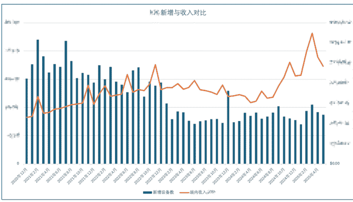
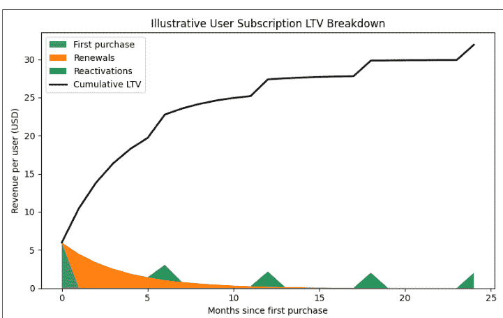
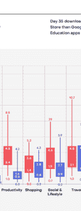
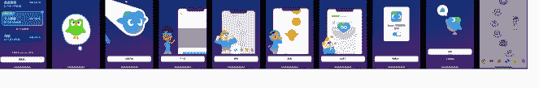
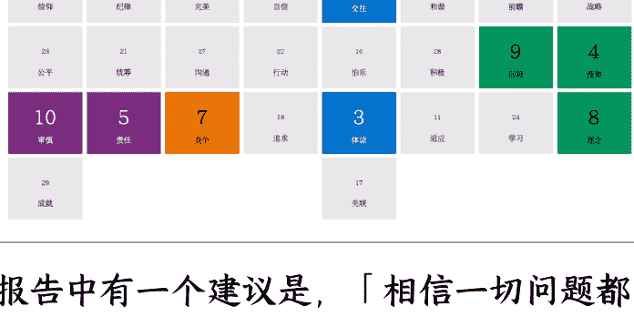

## 【经验分享】如何科学提升 App 订阅收入

250630 生财精华

公众号懒人搜索，懒人专属群独享

懒人微信：lazyhelper

大家好，我是 Trigger，4 年产品/运营/数据分析经验，啥都略懂变相"全栈"😊

过去一年多，我从零起步，独立负责一款订阅 App 的商业化增长。在没有增长和商业化团队、数据基建羸弱、没有数据分析师的"地狱模式"下，实现新增收入接近 470%、总收入增长超 60%的成果。

这篇文章会分享我如何在地球条件及没有迭代产品功能情况下实现这个目标，过程中踩过的坑和个人思考。

☑ 读完你会收获：
- 一个小团队大幅提升收入的案例
- IAP 订阅的收入模型及核心要点
- 如何科学做定价
- 如何设计 Paywall：核心要素像素级拆解

## 关于商业化模式的思考

## 如何从数据中发现优化点

## 数据指标体系：订阅的核心数据指标

## 个人心态、状态调节经验分享

## 💡 适合谁阅读？

独立开发者 / 产品运营 / 产品经理 / 互联网从业者

IAA 变现想了解或尝试 IAP 的 App 开发者或团队负责人

对 App 商业化感兴趣的任何人

## 分享下这一路的数据震荡

如果对你有帮助欢迎点个赞。有偏差或不清晰的部分欢迎大佬指出交流，接下来进入正题。

# 一、实操订阅 App 收入提升方法论

以下是我根据实际经历总结出来的方法论，跟实际会有一些出入，可分为以下几个模块，让我们分点展开聊聊。

## 1.1 理清产品价值

你的产品对用户的价值是什么？

商业化是在平衡产品价值和用户的长期价值下变现用户价值，产品价值是在什么场景下用什么方法帮用户解决什么问题。商业化的起点在于为用户创造了足够的产品价值，所以第一步最好弄清楚用户为什么会使用你的产品。

国内团队大多偏好为用户提供大而全的体验，即便是号称小而美或精简设计的产品，也大多如此。但用户最终买单的功能不会超过 20%，也就是 80%的功能对用户的价值不大。

理清用户实际的使用场景与产品价值，基于事实的基础上做决策会更有效。这一步也是亦仁之前所提到的调研的能力，磨刀不误砍柴工。

以下是我使用的一些了解自身产品的方法，希望对大家有帮助。

**看数据**：最直接、高效，可以从以下几个维度来看：
- 用户主要在什么时候使用：产品整体不同时间段使用的用户数
- 细化看功能的使用情况：不同功能的渗透率、使用后的留存 Cohort
- 「核心」功能和「非核心」功能的使用时间段分布表现 -> 可能发现认知与用户实际行为不一致
- 新用户行为路径漏斗：用户下载 -> 首页 -> 一系列页面 -> 付费墙 -> 付费
- 用户填写的信息：例如 Onboarding 流程可以设计一个问题采集用户的目标、来源等，采集的信息也可以用于后续的冷启动
- 用户的设备、IP、网络信息等：App 还是 Web，车机还是手表，使用行为有什么差异
- 付费行为：用户从哪些功能/内容访问 Paywall，以及对应的转化率
- 看获量的关键词：这一步也适用于调研竞品

App 主要是应用商店承载最终下载，因此可以从七麦、点点数据查询排名 Top3 的关键词，根据搜索指数筛选来看。另外根据关键词下的其它产品推荐也可以看看相似产品的核心关键词，也有助于了解市场的竞争情况。

Web 可以从 Similarweb 查询到来源关键词的信息，可以导出然后交叉对比谷歌指数来交叉验证。

懒人微信：lazyhelper

**社交媒体**：
- 搜索产品时输入框的提示词
- 看帖子：用户对自家产品或其它产品的吐槽、正/反面反馈及点赞或评论数量等
- 借助平台提供的能力：例如蒲公英提供了上下游搜索关键词，可以挖掘下平台的能力

**看用户反馈**：
- 用户愿意反馈代表反馈的点对于 ta 来说很重要，也有足够的解决意愿。如果用户连反馈都不愿意，那大概率是直接流失。所以需要重视用户反馈
- 同时也可以通过观察其它产品的负面反馈来发现机会

大家可以尝试这句话总结产品价值，高亮一下：

产品价值：
> 我的产品____是为____用户在____场景下，用____方法满足 ta 的____需求。

## 1.2 团队内部对齐目标

这点不展开了，由于我所在团队非常小，我手头上更是负责很多日常运营的事项。内部对齐目标之后我得以顺利地推掉很多工作，从而花更多时间尝试和探索，并获得很多研发资源投入做一些 A/B 测试。如果想要实现某个目标，对我来说最重要的前提可能是先投入足够的时间，以及确保自己处于行动的状态。

## 1.3 IAP 订阅的收入模型

在开始拆解之前，简单介绍下 App 常见的几种变现模式：
- IAA：在应用内展示广告来获取收益，而用户无需付费即可使用应用的核心功能
- IAP：应用内购买，可以分为订阅和内购。订阅分为续期订阅和非续期订阅，内购可以简单理解为道具
- 平台模式：应用本身不付费，通过撮合交易抽成，常见的如电商、O2O 等
- 混合变现：同时包含 IAP 和 IAA，也就是 App 内同时包含广告和订阅
- 付费 App：付费才能下载 App，之后永久免费

在我接手时，产品采用的是 IAP 变现，纯依靠订阅收入，所以后续的所有内容会围绕订阅这一类型展开。

IAP 订阅的核心特点是自动续费，用户在第一个周期订阅之后，如果没有在到期前 24 小时取消订阅，就会扣取下一周期的费用，直到用户取消订阅。

总结订阅的收入模型如下：
订阅用户 LTV = 首次付费收入 + 续费收入 + 重新续费收入（如有）

用户大致的付费生命周期会经历首次付费 - 续费 - 取消续费，之后可能会重新订阅，然后再次经历续费和取消订阅，最终彻底流失。所以对于以 IAP 为核心变现模式的产品，需要核心关注以下方面：
- 付费率：新用户或从未付费用户的首次付费引导
- ARPPU：每付费用户平均收入，也就是客单价
- 续费率：续费率决定用户的续费周期数
- 续费收入：可能会比较少，但每成功召回一个付费用户都在延长用户的 LTV

拿 AI 画了个示意图，可以核心关注下 LTV 的变化。具体的计算细节不展开了，更多需要关注的指标我在后面的部分分享。

除了付费率之外，续费率是最核心的指标，也是产品价值的体现。这也是为什么一开始要理清产品价值，产品价值越厚实，才能撑得住用户每一次续费时的审视。

IAP 变现的特殊性决定了我们不能只关注首次付费，只是关注流量的变现。而是更多需要考虑如何为用户提供长期的价值以及稳定且持续的交付。

例如 ChatGPT 新推出一个新的模型，强大的模型能力会吸引一波用户为此付费。如果后续模型能力迭代不如其它产品，用户会在几次扣费之后开始动摇，最终可能流失去了 Claude。

根据 Revenuecat 2025 报告，包月一年后续费率平均仍超过 10%，包年平均超过 30%。这份报告信息量巨大，做 App 的老板可以分享给团队看看，完整报告点击跳转下载。

## 1.4 Paywall 设计核心要素

介绍完 IAP 订阅的收入模型后，相信大家对订阅的特点也有一些了解了。Paywall 的设计没有银弹，没有一招鲜，但还是有一些共性可以参考的。

Paywall 的核心要素，分为以下：
- 展示结构：页面结构如何设计
- 价值传达：核心权益文案、视觉元素（价格锚点、划线价、文案暗示等）
- 价格策略：SKU 价格、订阅周期、促销、试用等
- 触发与场景：何时触发、在哪出现、前置行为如何决定展示内容

同时找了一些风格各异的 Paywall 大家可以先感受下差异。

**tinder+**
**无限点赞。尽情点赞，数量不限。**
选择一个套餐
热门
1周 ¥35.00/周
1个月 ¥17.48/周
Tinder Plus® 专属特权
- 无限点赞
- 无限倒回
- 位置漫游
- 你可以和世界各地的会员配对畅聊。
当您点击“继续”后，我们将向您收取费用，您的订阅会以相同的套餐期限和价格自动续订，直至您在 App Store 设置中取消自动续订。点击即表示您同意我们的条款。
**继续 - 总计 ¥35.00**

**Restore Purchases**
**Lite**
Unlock only photo enhancement. No additional tools, no video and no Desktop access.
**Pro**
Unlock both Desktop and more.
**We're offering a free week of AI**
We'd love for everyone to experience the magic of Remini, no matter their budget. So for your first week of generating AI photos, you're free to pick the price.
Which amount feels right for you?
MOST POPULAR
¥0.00 / ¥38.00
Try For Free
Renews at ¥38.00/week. Cancel anytime.

**请选择 14 天免费体验结束后适用的套餐**
家庭套餐 12个月·¥798.00 折合 ¥67/月
最受热捧 个人套餐 12个月·¥588.00 折合 ¥49/月
如未在试用结束前至少 24 小时取消订购，将按当前所选套餐的价格自动扣费
我已阅读并同意会员协议和定期付款协议
开启 2 周免费会员体验
查看全部套餐
除非是在当前订购期限结束之前提前至少 24 小时取消续订，你的月缴或年缴套餐将以相同期限自动续订。订购可随时取消。

**成为 Grow 会员,**
为你的身体和健康充值
App Store 170 个国家和地区 被精品推荐
超过 25,000 个 五星好评
永久会员 63% 折扣 一次性购买，无需订阅
¥188 原价 ¥298
连续包年 节省 48% 7 天免费试用，支持家庭
¥98/年 按年订阅，可随时取消
- 添加首页所有健康运动习惯
- 解锁所有身体指标
- 加入挑战，不受次数限制
- 手表 app 所有 HRV 压力自测高级功能
一次性购买，无需订阅
继续

**获取你的私人健身计划!**
| 1个月 | 12个月 | 3个月 |
| :--- | :--- | :--- |
| $19.99/月 | $5.83/月 | 享受50%的折扣 |
| $19.99 每月 | $69.99 每年 | $9.99/月 |
| | | $29.99 每3个月 |

先试用7天免费，然后$69.99/年
继续
我已阅读并同意《自动续费协议》
服务条款&隐私政策 在7天免费试用之后您的Apple ID付款方式将自动收取$69.99每一年的费用. 你可以在当前订阅期结束之前至少24小时,在你的...
懒人微信：lazyhelper

**16:51 会员中心 会员管理 Yogi_171393249018**
解锁 2000+精品课程 每年节省 4800 元
**每日瑜伽VIP**
**超值套餐**
**会员套餐**
**支付教程 >**
**限时多送 30 天**
**连续包年 ¥188** 仅需 14.6 元 / 月
**连续包季 ¥118** 39.3 元 / 月
**连续包月 ¥58** 首月仅需 19 元
每年按￥ 188 自动续费，可随时取消
**立即开通**
自动续费项目确认购买后将向你的 iTunes 帐号收款，后续将按照每年自动续订，iTunes 帐号在计费周期到期前 24 小时内扣款，查看《用户协议》和《隐私政策》，如有疑问，请联系瑜小蜜。
开通前请阅读《会员及自动续费服务协议》
**会员特权** **更多 >**
**VIP 精选课** **新课抢先练** **专属音乐** **精讲小课堂** **镜面练习**

接下来重点拆解直接影响到付费率的核心页面 Paywall，分享一些我的思考。由于我的经验确实比较浅，有偏差的地方还请大佬指出，感谢。
懒人微信：lazyhelper

### 1.4.1 展示结构

Paywall 的展示结构指的是，这个页面是由哪些结构及设计风格组成，常见的结构包含：
- 价值主张：解锁会员所能获得的产品价值，通常是一句话，具体且直接
- 会员权益：可以是文字、图表、动画，核心在于如何让用户感受到你的会员权益是「值得」的
- SKU 模块：这里的设计门道非常大，深入了解可以学习下九日论道老师的商业化教案，真的大开眼界
- 产品荣誉：精品应用用的比较多，常见的是展示获得了哪些商店的奖项，例如最近很火的苹果设计大奖
- 用户评价：精选用户评价，利用社交压力暗示这是款很不错的应用，不过真实性也就无法保证了
- 其它：例如恢复购买、发起反馈之类的小细节就不细讲了

利用不同模块的展示顺序控制用户的阅读顺序，以及降低用户的理解门槛，尽可能顺滑地让用户完成支付。这个页面核心是希望引导用户最终能购买成功，但还是需要关注用户的发起支付率和购买成功率。
发起支付率高但最终成功率低，就需要特别关注，排查具体的原因。

### 1.4.2 价值传达

可以细化拆分用户主动取消与支付失败导致的被动取消：
前者可能是用户发起支付前后预期不一致，或觉得还是贵或不值，需要进一步分析或者尝试在用户取消支付后给个优惠折扣挽回。
后者是基本功，用户有支付意愿但因为非自身原因无法购买最终流失，这种就非常可惜了。建议大家可以排查下支付链路的稳定性和可靠性。花不了多少时间，长期来看非常有价值。

价值传达，指的是让用户知道"我买了能得到什么"。这一部分我的经验有限，简单分享一些我现在的认知。
文案非常重要且核心。这里的文案包含权益的介绍、SKU 的文案、点击购买按钮的文案，甚至如果中间要弹知情同意的文案也需要设计。之前很偶然测过的，在用户发起支付后展示会员协议同意弹窗的标题上用「我已阅读并同意 XXX」和「阅读并同意 XXX」，后者的转化率绝对值比前者高 1%左右，当时令我大受震撼。
用户的支付能力可能取决于用户将你的产品与哪个产品做对比。例如你做一个会员制视频 App，你传递给用户产品的品质是对标奈飞，比起对标国内的视频平台，前者用户的客单价或许会高一些。
价值传达是引导，不是引导或欺骗用户支付。或许用户会被诱导点击支付，但看到支付金额会醒悟；或许支付成功，但后续的退款率和售后成本也需要考虑。不要问我为什么知道，一问都是辛酸泪。
这部分严格来说也是展示结构的一部分，但因为非常重要，所以还是拆分出来强调下。

### 1.4.3 价格策略

价格策略可能是订阅策略最核心的部分，它直接影响到用户的付费路径、价格锚点认知与最终转化效率。这部分我会结合自己的实际经历，分享一些踩过的坑和思考。

#### 1.4.3.1 价格策略的起点

定价背后是产品定位、功能价值、用户需求和支付意愿的综合体现。因素之间不是孤立的，需要同时结合去思考。但同时价格策略也是引导转化策略，需要在前期明确主推哪一个 SKU，是月付 SKU，还是年付 SKU？
不同 SKU 的搭配方式会给用户传递不同的价格认知。这会影响到你整体的价格策略例如：
- 通过高价月卡 SKU（如 ¥28/月）锚定，让年卡 ¥198 仅需 16.5/月看上去显得更划算
- 如果主推 SKU 转化率低，是否要尝试调整主推 SKU 等，如从主推包年转为主推包周等等

#### 1.4.3.2 如何设定价格

价格是基于竞品、成本与产品的三维考量。这一部分我的探索有限，主要分享下评估现有定价的方法。
如果是新产品，没有历史数据可参考时，可以尝试：
- 以竞品为基础，参考同类头部 App 的定价
- 结合目标用户的消费能力、产品使用频次及潜在锚定产品进行合理预估
- 测试：价格不是上线即固定，如果背刺了老用户可以做好补偿挽回一些口碑

对于已经积累一定数据的“成熟”产品，就可以更精细地分析：
线上 SKU 的购买、续费情况，并进一步评估不同 SKU 的：
- 当前策略下整体转化模块的转化率及分渠道表现

此外，如果产品提供 AI 能力，在定价时需要特别计算 API 成本，尤其是现在很多产品采用免费试用策略提高新用户的留存率。

#### 1.4.3.3 文案与引导策略

在价格策略之外，SKU 的配套文案与展示元素也会极大影响转化，例如：
- 不同 SKU 差异如何对比？使用表格对比权益差距，还是权益相同但通过设计 SKU 模块展示
- 是否展示"折合价格"？展示的话，是写每天不到 0.5 元，还是每月 XX 元，还是每周 XX 元
- 是否利用「限时优惠」等字眼营造稀缺的感觉促进转化

这里建议通过合理、易懂的结构和文案让用户快速理解，不要高估用户的耐心。这样更高效地向用户传达哪个 SKU 是最划算、最值得购买的。

## 1.5 触发与场景

付费墙的展示时机以及关注用户在触发付费墙的前置行为也是值得关注的点。付费墙在用户使用付费功能时触发，还是用户已经完整体验过功能后，在基础之外的功能做限制？
例如一款提供去水印的产品，可能比较适合的是先让用户完成整个流程，直到用户尝试导出去水印后的图片时再展示。这样用户既体验到了完整的流程，又明确了付费墙触发的合理性。

## 1.6 一些踩过的坑

- **一定要一定要监控续费率**，这是订阅健康的核心指标：日常一定要持续监控每个 SKU 的续费率。特别是在开启促销、试用等上线策略时，**不要只看首次转化率**，也要看这些用户是否真的会续费，以及根据订阅的收入模型评估整体收入变化，而非首次付费的收入。
- 算不清楚账：使用首月折扣提高了转化，但带来了次月续费率暴跌，上线几个月后才回滚带来了收入损失
- 缺乏明确主推 SKU，同时使用了同样的使用策略，让用户选择困难，拉低整体转化
- 包年价格设置过高：导致主推但转化率依然很低，这点还是尝试优化中
- 定价逻辑与用户行为不匹配：用户一年中可能就使用四五个月，但引导一次性订阅一年的难度很大
- 价格尽量不要一刀切，不同地区的定价策略一定要做单独定价并定期 review。尤其是汇率波动大的市场（如土耳其、阿根廷、尼日利亚）。虽然现在 App Store 和 GP 都提供了很方便的定价管理工具，但为了稳定不会基于实时汇率变化调整。为了避免灰黑产通过地区套利，可以通过后台提供的报表筛选不同地区的收入表现判断
- 利用平台的原生能力实现低成本地提高 LTV 也是目前我在尝试中的，后续有更多思考和成果会再与大家分享

## 1.7 小结

虽然前面拆解了这么多模块，但这并不意味着设计时必须要包含所有模块。设计 Paywall 没有统一标准但有相同的目标。甚至你可以像多邻国一样用分页逐页展示不同模块的信息，分布式地引导用户最终购买。

订阅。然后在用户开通之后用很长的流程再重新强化产品价值。

多邻国是订阅的天花板玩家，但盲目地跟随可能不是一个聪明的策略。最重要的是要持续测试，借助A/B测试科学地验证和调整对用户群体需求以及转化偏好的判断，然后再不断测试和验证。

例如，有的产品价值对于用户来说不够清晰，那可能在Paywall设计时需要依靠更多的信息说服用户（但如果到了要靠说服来引导用户转化，我觉得可能打磨产品价值会比在Paywall设计上花大功夫更具战略意义）。但像ChatGPT或Tinder产品力极强，用户非常认可，即便他们的Paywall设计得非常简单，其转化率和收入也会比其它产品高很多。

# 二、回到一年前...

如果回到一年前，我想告诉自己这四点：
- 1. 重视自己的需求
- 2. 相信一切问题都有解法
- 3. 保护自己的内在空间
- 4. 去行动去改变去体验

## 2.1 重视自己的需求

亦仁曾经提到了心力的重要性，我非常赞同，但我始终没有能找到合适的方法有效地“提升”自己的心力。但现在回看，我把心力错等于可以依靠理性学习掌握的技能或知识。心力不是单一维度，而是生活、家人、工作和自我调节组合成的系统优化后的结果。

所以要提升心力以支撑自己去啃硬骨头或实现目标，对我来说反而不是投入更多的时间去思考和优化做事的策略。而是重视自己的需求，该休息的时候就安心休息，状态差的时候接纳甚至主动让自己不做事。状态好的时候也不过分投入直至透支。

## 2.2 一切问题都有解法

在我两年多前加入当前的公司前，我做过一份盖洛普优势测评，找了位非常资深的老师解读解读。我的排难第一位，这意味着我非常关注问题并享受问题解决的过程，但如果这个才干过度发挥则会影响我的行动。

## 您的战略思维

克利夫顿优势才干主题最为突出。您了解如何帮助个人获取和分析信息，从而作出更佳决策。此图表显示了您特有的克利夫顿优势34个主题才干结果在四大维度中的相对分布。这些类别是一个非常好的起点，您可以查看自己最有可能在哪些方面表现出色，以及如何为团队做出最佳贡献。请参阅下面的图表，了解有关您的克利夫顿优势在各维度分布情况的更多详细信息。

报告中有一个建议是，「相信一切问题都有解决方案」。过去的很长时间我一直以为自己完全理解了，最近我才意识到其实没有，或者说只是理解但完全认同和实践。

我现在的理解是，一切问题都有解法并不代表问题会马上解决，甚至不代表要去解决这个问题。而是避免让这个问题成为眼前的一座大山，避免让自己的状态被问题的解决进展所影响。

另外我收获的是信心，相信所有问题都会被解决。所以如果卡住了没法行动，也可以更加轻松地选择迈出一步，从行动中获取更多的信息然后不断调整和行动。

## 2.3 保护自己的空间

这个空间不是指物理空间，而是心理上的空间。当一件事很轻易就占据了自己大部分的空间，就像电脑的CPU占用了超过90%，再进行新的任务只会继续发热，性能大降。

有几种情况会导致我处于这种空间不足的状态：
- 身体状态不佳，或经历完大幅的情绪波动
- 有很多开始但始终没有结束的事情
- 原本打算解决X问题，但持续陷于衍生的Y问题，没有及时抽离
- 悬而不决，没有行动一直卡住

我会通过觉察自己的身体感受和命名自己头脑中的各种想法，不断重复让自己回到身体感受上，进而保护自己的空间。当然如果实在很累，那各种延长续航的技巧都没用，让自己好好地睡一觉吧。

感兴趣的朋友可以了解一下正念以及身体扫描的各种技巧，就不再细展开了。

## 2.4 去行动去改变去体验

我擅长发现问题，之后做规划去解决问题。我经常发现自己的不足，买书买课想要通过不断的学习去改变自己。

结局是似乎没有发生改变，列的计划完成度很低，自己也很抗拒。

可是过去一年是我改变发生得最频繁的时间。除去项目上的历练和外部的一些支持，我觉得最重要的是，我不再通过理性强迫自己改变，而是通过一步步的行动，获得的真实体验和反馈后再慢慢发生变化。

每一天我都觉得自己似乎没有啥明显的变化，但现在我不再苛责自己没有进展，但发现已经走得很远了。

接下来我会继续去行动去改变去体验，持续探索自己没走过的路。

# 三、结语

这篇文章我想写很久了，花了近两周所有的空闲时间终于完成，也算是我的第一个「作品」。

如果你正在做以IAP为核心变现模式的产品，希望这部分内容对你有所启发，感谢你的时间❤️

如有不清晰或错误的部分也请各位大佬指出。

## 公众号

懒人搜索
懒人专属群

微信:lazyhelper

懒人专属群持续更新中，已持续运营6年，整理超3000份各类精选付费文章 & 年费社群干货，全部开放下载。

本资料为付费群内部分享，仅供真实有需要的朋友查阅

### 懒人专属群更新记录：
https://lazy2025.top/#/blog/record2

### 懒人专属群更新记录（需梯子，备用）：
https://lazybook.fun/#/blog/record2