# 普通人如何在推特抓住大流量机会？

## 250630 生财精华

公众号懒人搜索，懒人专属群独享
懒人微信：lazyhelper

大家好，我是阿西，8年互联网增长产品、运营经验，副业时间运营推特账号，2个月涨粉1w+，3个月总曝光量1383万+，单日最高曝光量99万+。

先说下我做推特的起因，我之前一直在做出海工具站，为了拓展流量，所以想做个推特账号触达更多精准用户，没想到无心插柳柳成荫，反而开启了推特自媒体运营之路。

我是去年12月底注册的推特，在此之前从来没有玩过推特，一开始我对准的是独立开发者群体，发的内容是我日常的心得体会，时不时也能出几万曝光的帖子，但鉴于圈层天花板低，涨粉一直很慢。

做了2个月，粉丝才300个，当时做得很迷茫，因为既不了解【平台规则】，也没摸清【圈层流量】，只是自顾自的输出内容，做得又累又没效果，几乎想要放弃。

命运的齿轮在3月开始转动，偶然间刷到一些web3圈的账号，发现这些账号经常能产出不少几十、几百万曝光的帖子。web3群体是推特上最追逐流量的一个群体，观察他们头部的大账号可以学到不少流量打法。

于是我开始调整了内容策略和目标人群，两个多月后，我不仅实现了从0到万粉，还实现了万元变现收益，包括专栏订阅和商单收入。

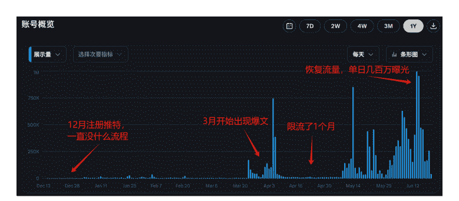

给大家看下改变策略后的变化，3月之前每天基本没什么流量，3月之后开始爆发，4月因为限流中断了1个月，6月14日粉丝破万，2个月时间做到万粉，应该算是个不错的成绩。

当然，这个成绩和群里的高手比起来不算什么，不过在这段时间的实践过程中，我看到了推特平台有非常大的发展潜力，即使是中文内容在推特平台也有较大空间，不需要露脸、不写英文，也能起号和变现。

今天分享的不是方法论，更像是复盘我在实践过程中的一些观察，希望能给大家带来点启发。

# 推特流量及变现潜力介绍：为什么现在要开始重视做推特账号？

很多人做社媒第一选择可能是小红书、抖音这些国内平台，这些平台的用户更喜欢看图片、视频，对创作者的内容制作要求很高。但其实多看看海外平台，可能会发现内容起量其实并没有那么难。推特对于普通人来说最大的优势就是内容制作门槛低，推特相当于是国外的微博，随手写的几段文字就有机会爆火。

像下面这个账号6万粉丝，纯文字内容，写了6行字就获得了500多万浏览量：

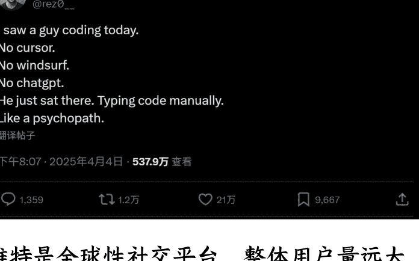

推特是全球性社交平台，整体用户量远大于国内头部社交平台。推特上英语国家的用户群体占据主导，用户量大就意味着英推账号一旦做起来粉丝的天花板上限也就更高，内容的曝光量也更大，所以不少华人会在推特上同步做英推账号。但很多人不熟悉英语，华人一开始最好还是先做中文推，起号熟练后再尝试做英推。

这里可能有人要问，既然中推流量不如英推，那是不是中推就没有流量红利？

不是的。因为目前中推圈人少，优质内容也相对较少，所以稍微好一点的内容被推送冒尖的可能性就很大。当然前提是做的内容要迎合平台的流量推送规则。

先给大家看一些推特上高曝光效率的内容案例：
- 1、这个账号今年5月注册，只有285个粉丝，一篇关于GPT提示词的干货帖子带来了17万的曝光量
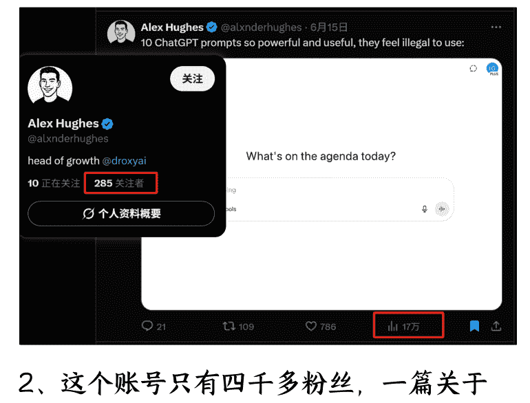
- 2、这个账号只有四千多粉丝，一篇关于AI视频制作的帖子就带来了187万曝光
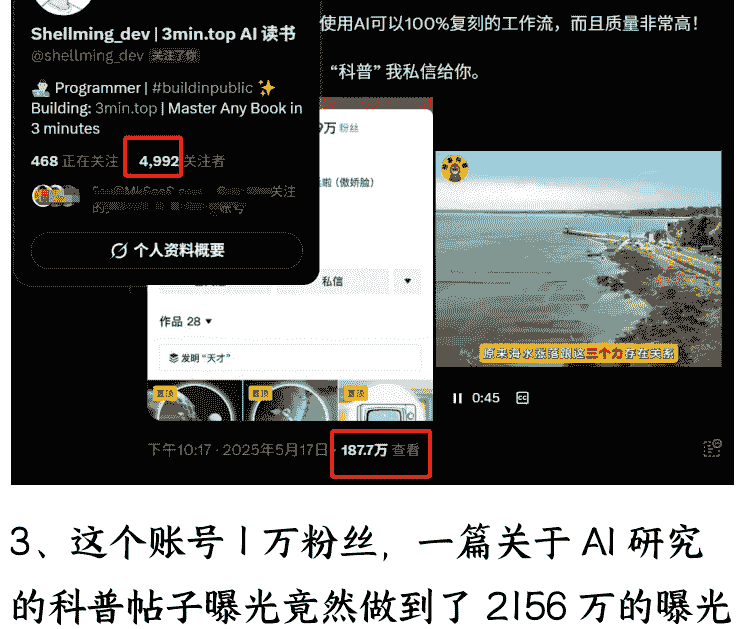
- 3、这个账号1万粉丝，一篇关于AI研究的科普帖子曝光竟然做到了2156万的曝光
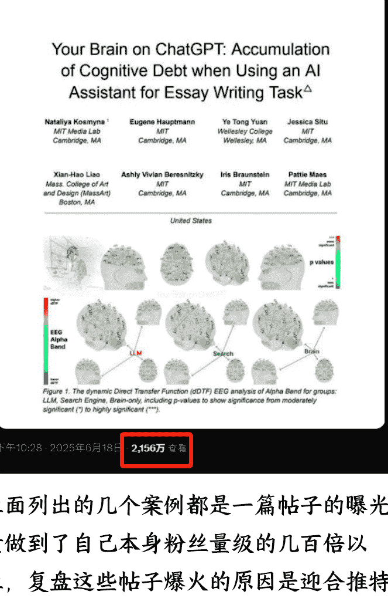

BREAKING: MIT just completed the first brain scan study of ChatGPT users & the results are terrifying.

Turns out, AI isn't making us more productive. It's making us cognitively bankrupt.

Here's what 4 months of data revealed:

(hint: we've been measuring productivity all wrong)

由 Google 翻译自 英语
突发新闻：麻省理工学院刚刚完成了对 ChatGPT 用户的首次脑部扫描研究，结果令人震惊。

事实证明，人工智能并没有让我们变得更有生产力，反而让我们的认知能力陷入崩溃。

以下是 4 个月的数据显示：

(提示：我们一直以来都错误地衡量了生产力)

评价此翻译：

下午10:28 · 2025年6月18日 · 2,156万 查看

上面列出的几个案例都是一篇帖子的曝光量做到了自己本身粉丝量级的几百倍以上，复盘这些帖子爆火的原因是迎合推特平台的流量推送规则，高互动、长线程的帖子在平台更容易火。

这里解释下什么是线程，线程是推特上特有的一种帖子形式，就是发了一个帖子后可以不停自己追加评论，于是帖子就变成一个个小帖子链接起来的长线程。下面这就是一个长线程：

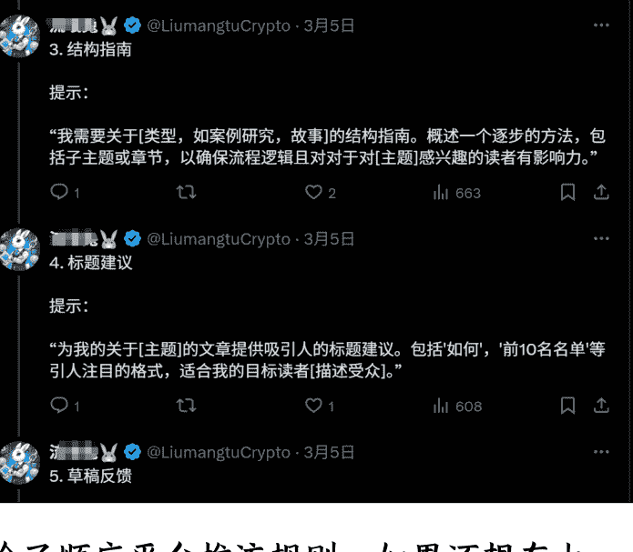

除了顺应平台推流规则，如果还想在上一个流量台阶，就要了解自己的内容属于哪个圈层。我观察了下推特上的内容有这几个圈层：专业类、资讯类、娱乐类。专业类人群垂直，比如技术类内容，流量小一些；娱乐类是泛人群内容，比如健康、科普、财商等，流量最大。

上面给出的前两个例子都属于科技类的专业类内容，第三个例子偏娱乐科普，所以流量会相对较大。

这三类的人群基数是专业类<资讯类<娱乐类，但从用户付费能力来说是专业类>资讯类>娱乐类。也好理解，越精专的内容看的人越少，但人群也越精准，付费意愿越强；越普适接地气娱乐化的内容适配人群越多，但人群鱼龙混杂不好转化。

接下来说说推特账号的变现潜力。推特账号一般有3种变现方式：

## 1、创作者分成
开通创作者分成的条件是：
- 1）认证要求：必须通过订阅 Premium 会员（最低每月 8 美元）。
- 2）展示量要求：过去 3 个月内，累计帖子获得至少 500 万次展示。
- 3）关注粉丝要求：拥有至少 500 名会员关注者。

这里大家可能觉得有点难度的是 500 万次曝光这个要求，但其实从我实际操作上来看，500 名会员关注者这个会稍微难一点。但也没有那么难，我的实操情况是 1 个月达到 500 万次曝光，2 个月达到 500 名会员关注者。

这个创作者分成类似于微信公众号里的流量主广告，帖子的互动量越多，会员粉丝越多，分成越高。推特没有公开具体的分成规则，但是根据一些 KOL 公开的分成收入大致测算了下，平均每获得 30 条评论左右，就能获得 1 美元的收入。

所以不是粉丝越多，收入越高，1w粉账号如果注意做互动数据的话，收入可能会比10w粉的账号还高。我看到十几万粉丝的账号一个月分成 400 美元，而四万粉账号一个月分成能到 500+美元。

很多账号开通创作者分成后也会特意多做互动类的帖子来提升收入，像下面这个账号，每天发的帖子非常简单没有难度，就是引导会员粉丝互动。

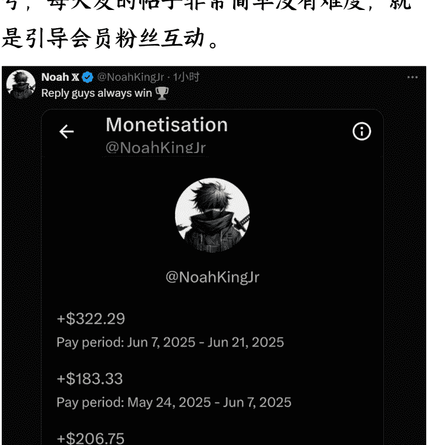
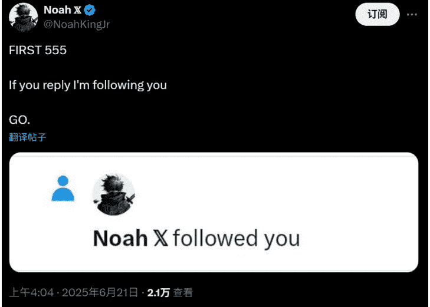

## 2、给自己的产品引流
推特适合给虚拟商品带货引流，比如付费课程，如果你有自己的产品，就可以在简介里、每条推文最后加条线程或是单独写一篇介绍产品的推文置顶在自己的主页来推广。比如这样：

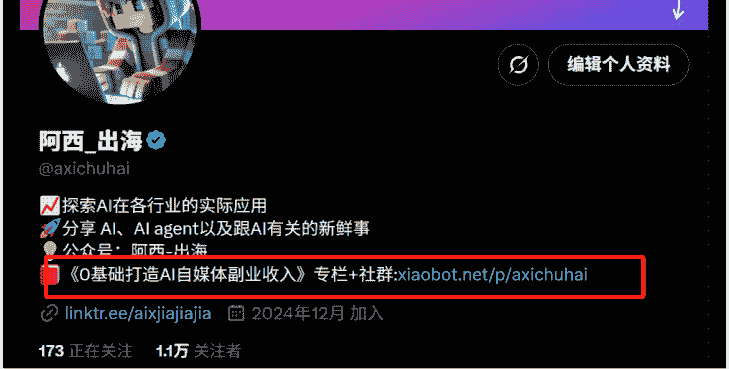

## 3、商单/分销广告
接商单：
有几千粉丝量的账号就有机会接到商单，为了更积极的拥抱商单，你可以在账号里多个位置写接单，比如简介、推文中。

因为推特不像小红书有官方接单平台，所以需要自行识别对方是否靠谱，这里给一些建议：尽量不接按效果付费的广告，一口价广告如果金额大的话沟通对方先付定金。一般商单会按照1条完整线程多少钱、转发1次多少钱这两种方式来报价。

再给圈友分享一个提高报价的独家方法，可以用打包报价的形式提高报价。科技类产品一般也比较在意海外平台的推广，如果本来接的是国内平台的商单比如抖音、小红书，也可以打包推特分发一起报价，这样能提高商单收入。

分销广告：
商单的频率不由博主掌控，所以也要有自己可以主动出击的收入途径，分销广告是很多推特博主的重要收入渠道，比如小报童分销、网盘拉新、AI 工具的 affiliate 佣金，还有网盘拉新，这种比较适合新手来做，一般拉新是 5-10 元/人，让别人来转存是 0.4 元/人，虽然单价不高，但操作还是比较轻松的。比如下面这个账号就搜集了一些纪录片资源放在网盘里，分享网盘链接。

「BBC纪录片合集 941GB
pan.quark.cn/s/82f51b2a425e

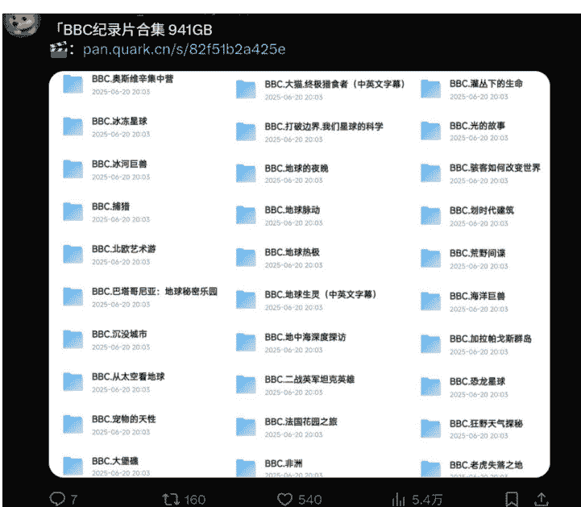

还有个比较简单能给广告带来大流量的方法就是在爆文帖子尾部再加一个广告线程，比如我在一个爆文尾部加了下生财的分销，前面的爆文虽然不是给广告定制的内容，但有流量就有一定的转化概率，而且操作成本低。

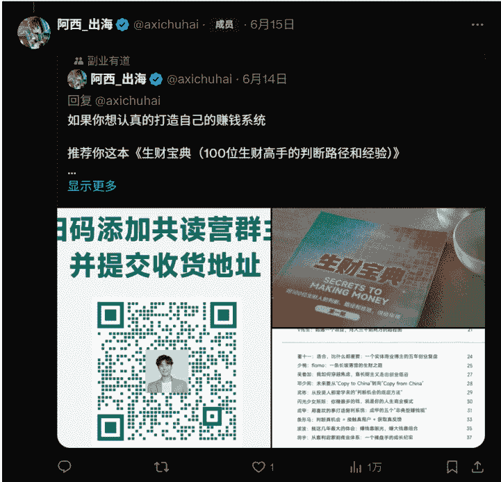

最后一部分给大家分享一些运营推特过程中的实操干货，推特实操中要注意的点很多，因为篇幅原因我今天先分享两个我觉得比较重要、有效的点。

## 1、推特运营最大的坑是什么？
毫无疑问就是限流，前面也提到我在运营推特的初期就遇到过一次限流1个月的情况，单日流量从每天10w+跌到了2000~3000，对账号的影响比较大。

怎么判断自己有没有被限流呢？最直观的感觉就是看每天的曝光数据是不是断崖下降了，当然也有可能是内容质量变差，还有个验证方式是用另一个账号搜索 “from:@username”，如果搜不到那就是被限流了，下图是限流的时候搜索我账号的结果。

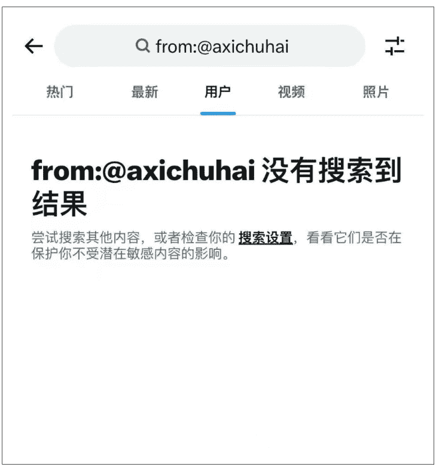

这是一般会造成限流的原因，需要尽量避免：
- 账户未确认电子邮件地址
- 未设置个人资料图片
- 同一人同时注册多个账户
- 使用相同的回复或图片回复多个页面
- 频繁在推特@提及未关注的用户
- 快速发布推文或进行垃圾信息操作
- 关注人数远高于被关注人数

如果遭遇限流，除了等待也有一些努力方向，如：向 Twitter 支持团队申诉、降低发帖频率、多跟正常的账号用户互动，具体还是要看你的限流原因是什么，对症下药。

## 2、如何用 AI 提效做内容？
我之前在社媒上分享过一个方法就是通过做“大V”智能体快速生产爆文的方法。核心思路就是用 AI 复制大V表达方式+选对选题来生产爆文。在推特上除了干货贴，还有两类帖子经常能火，一类是暴论，一类是能引导人一直看下去的长线程。

所谓暴论，就是清晰的观点+极具个性化的表达方式，个性化就是大V的独特标志。比如咪蒙的文章火除了观点独特外，最重要的还有她独特的表达方式。如果能做一个具备咪蒙特色的智能体，再加上近期具有热度的选题，那就能大大提高帖子火的概率。

而另一类长线程则不那么讲究人格化风格，更多的是一些特定化的格式，引导人一句一句的看下去。

下面是两个爆文长线程的案例，可以看到他们都有一样的公式套路，就是先用价值感/重大事件吸引注意力，然后引导观众接着看下文。非常容易复制的套路，适合喂给 AI 来学习做成智能体。

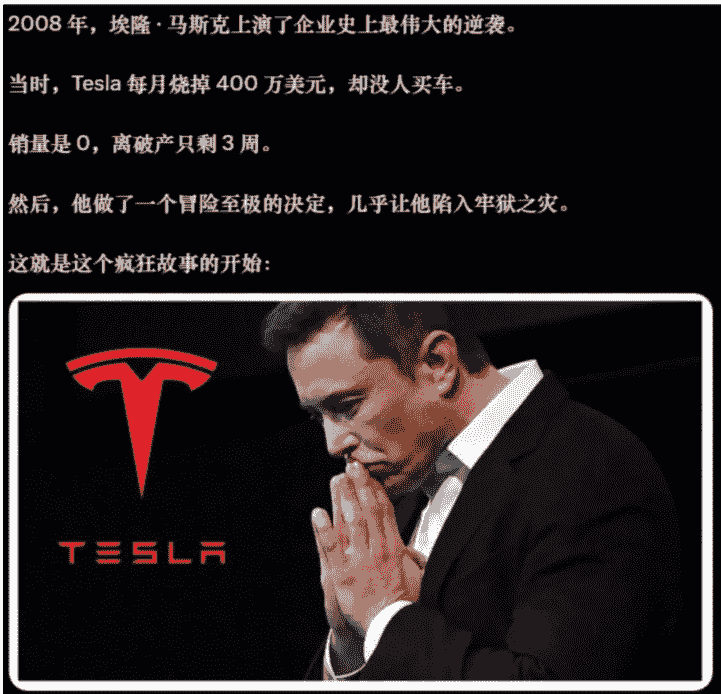

阿西_出海 @axichuhai · 6月14日
OpenAI 悄悄放出了一份 34 页的技术手册，教你怎么打造 AI 代理，99% 的人永远不会阅读该手册。

我花了 3 天时间，解码了里面揭露的每种模式。

这里是关于自主搭建 AI 代理的实用指南：🧵

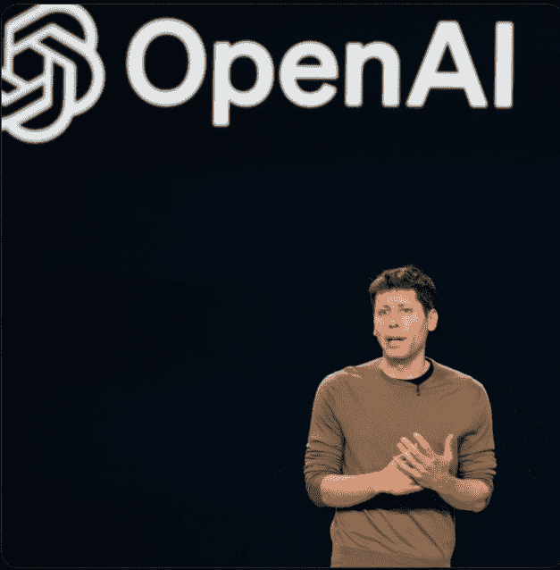

简单介绍下我是怎么做爆文智能体的：
- 1、在谷歌浏览器插件市场搜索“推文下载”，会列出很多支持下载X推文的插件
- 2、安装插件，输入你要采集的博主账号ID，导出
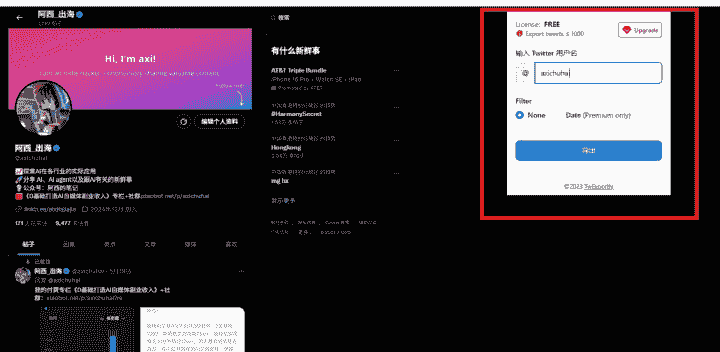
- 3、把下载下来的内容转成PDF格式，导入AI知识库做成智能体。

如果你做的某个大V的智能体，提供一个跟智能体对话写爆文时的标准提示词：请你模仿知识库文件的表达方式写一篇XXX字的帖子，选题方向是：XXXX。

最后，你如果问我做推特账号最重要的秘诀是什么，那就是坚持，坚持每天发，坚持每天固定多少时间去刷推特，坚持每天互动。对普通人来说，本身没有特殊的资源支持，只有执行力才是弯道超车的最大机会，再加上平台的流量加持，我相信推特是普通人做自媒体的一个大机会。

对我个人来说，命运的齿轮转动是开始于在生财接触出海工具站，一步步让我的副业方向从国内转到了海外平台，机缘巧合开始接触到了推特，开始了我的自媒体旅程。非常感谢【生财有术】给我带来广泛的搞钱视角，让我能在众多的机会中找到适合我的方向。

最后再来总结一下分享的关键点：
- 1、推特具有较大的商业价值，除了官方的分成收入外，还可以根据自己的账号方向选择适合自己的变现方式。关键是多去试，把每次发帖都当做一次测试机会，试出适合自己的爆文方向，试之前可以找对标先模仿。
- 2、运营推特时除了要关注单个推特账号本身的粉丝、帖子流量、变现收益的增长外，还可以思考怎么把推特价值最大化。可以把推特作为自媒体内容的筛选器、放大器，在推特测出优质内容后可以再放到公众号、小红书上进行了二次放大。这些平台是你内容制作流程里的不同节点，而推特则是你的试验田。
- 3、运营推特要注意防御和出击，避免内容导致限流封号，也要关注内容制作的提效方法。先手工跑通完整的内容制作流程之后，再用AI逐个节点去做提效。

分享结束，说的有点多，感谢各位的时间。如果你也想做/在做推特方向的自媒体运营，欢迎多多交流。

- 📖懒人专属群持续更新中，已持续运营6年，整理超3000份各类精选付费文章&年费社群干货，全部开放下载。

本资料为付费群内部分享，仅供真实有需要的朋友查阅 🙇‍♂️
懒人专属群更新记录：
https://lazy2025.top/#/blog/record2
懒人专属群更新记录（需梯子，备用）：
懒人微信：lazyhelper
https://lazybook.fun/#/blog/record2