# 纯AI流+批量对标低粉爆款，小红书万赞笔记快速起号经验分享

250630 生财精华

整理：公众号懒人搜索，懒人专属群独享

懒人微信：lazyhelper

各位圈友好，我是陈社长，去年10月加入生财，12月第一次做小红书，从0开始，2个月的时间涨了1万粉，当时也写了复盘贴。

我肯定不是生财圈友中，涨粉最快的一个（目前2.8万粉），但我一直坚持采用纯AI创作，所以创作成本极低，一篇笔记的创作时间可以控制在10分钟以内，所以基本不怎么占用自己的时间。

另一方面，AI创作常见的一些问题也在过程中都克服掉了，AI完全没有耽误账号接连不断地产出多篇万赞笔记，所以想着再写一篇更详细的复盘贴，希望能帮助刚入门的圈友少走一些弯路。

今天分享的主题主要是以下5个：
- 1、做任何赛道，要做的第一件事是批量、大范围的对标和模仿。
- 2、如何1小时找到自己赛道的50个对标笔记
- 3、如何用 AI 批量提升图文创作效率
- 4、起号成功后，如何用 AI 生成角色一致性的卡通人物形象打造虚拟 IP
- 5、用矩阵思维和概率思维，抵消流量焦虑和内耗

OK，接下来正文开始！

# 1、做任何赛道，要做的第一件事是批量、大范围的对标和模仿。

很多人会把小红书发笔记，当成一种创作。

在起号阶段，就用大量的时间和精力，来构思内容、打磨文字。

但自我开始做小红书以来，收获最大的一个经验就是：在起号阶段，不要轻易原创！不要轻易原创！不要轻易原创！

*生财十大思维里面，排名最靠前的就是对标思维。

为什么对标思维这么重要？

为什么起号阶段不要轻易原创？

其实 2 句话就能说清楚：
- 1) 性价比不高：在起号阶段，原创非常的耗时耗力，生产笔记的速度极低。相反，对标一个爆款笔记，只需要规避掉机器审核就好了，制作笔记的速度会有几倍甚至十几倍的提升。
- 2) 风险性极大：原创的内容是没有经过过市场验证的，用户有可能喜欢，也有可能不喜欢，用了极大的时间和精力生产出来的内容，小眼睛可能连50都没有，会极大的打击自信心。

试想一下，一个在起号阶段就坚持完全原创的人，和一个在起号阶段坚持疯狂对标模仿的人，后者不管是笔记制作数量，还是笔记的爆款概率，都会远远高于前者。

可能前者1个月只发了10篇原创笔记，一个没火，后者却能一天就发10篇，一个月发300篇，然后爆出1~2篇百赞甚至千赞万赞的笔记。

给大家看个例子：

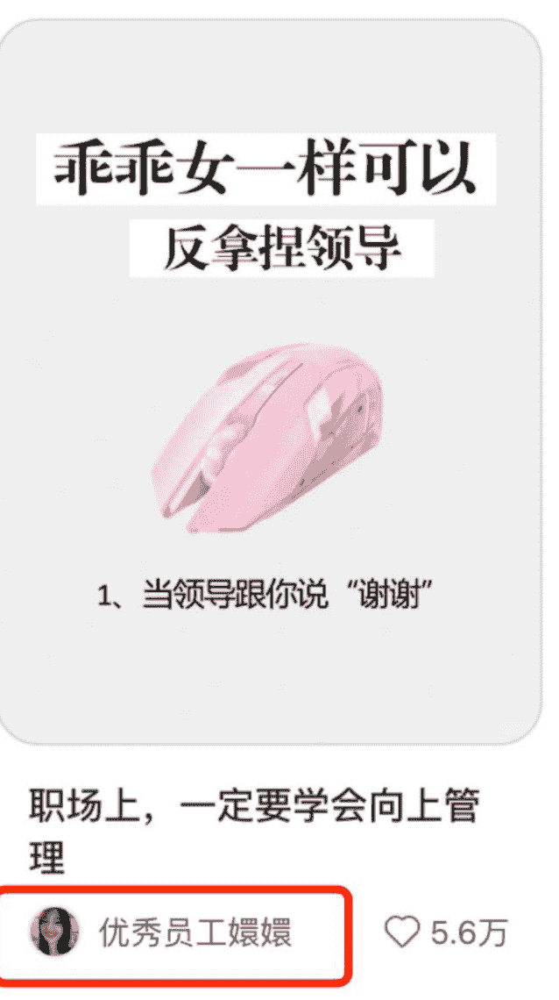

大家看这篇爆款笔记，是个职场赛道的爆款笔记，封面内容为：「乖乖女一样可以反拿捏领导」，我们可以看到，它的点赞有 5.6 万，那么说明这个笔记的封面是很不错的，点击率很高。

然后我们再看这个图：

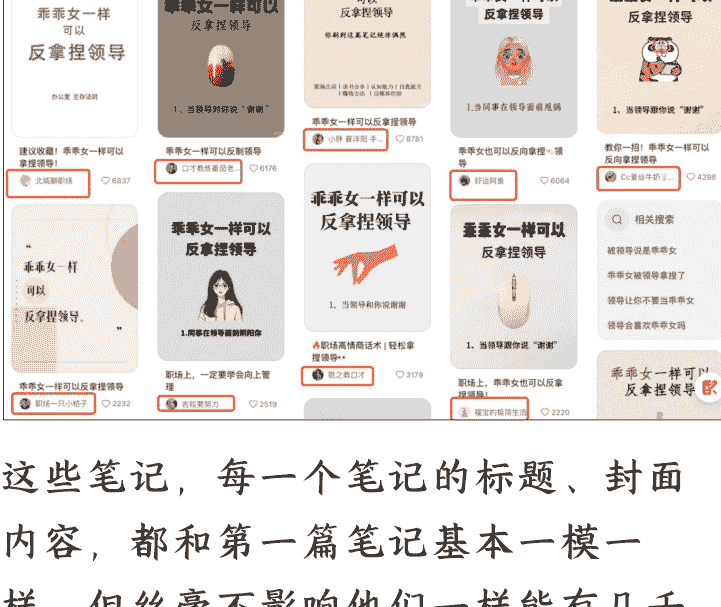

这些笔记，每一个笔记的标题、封面内容，都和第一篇笔记基本一模一样。但丝毫不影响他们一样能有几千赞，有些账号甚至就只有这么一篇爆款笔记（前后其他笔记都只是个位数的赞）。

这就是对标的魅力，可以快速的把你的笔记拉到行业里的第一梯队。

## 再讲个发生在我身边的例子：

我有一个大学在读的表妹，今年端午节回老家，我把找对标笔记、模仿对标笔记的套路告诉了她，并手把手的用她的手机对标了一个笔记发了出去。

这个笔记说实话不温不火，作为她账号的第一个笔记，只有十几个赞的样子。

懒人微信：lazyhelper

但是！过了几天，我妹给我截了个图，她自己按照对标的思路又发了一篇，2天时间就爆出了几万的小眼睛，将近1000个赞（到现在已经1.3万赞了）。

所以我一直坚信：做任何赛道，要做的第一件事是批量、大范围的对标和模仿。

# 2、如何1小时找到自己赛道的50个对标笔记

关于找对标笔记的方式，小红书的航海手册里讲了很多很多方法，而且讲的已经非常细了，这里主要讲讲我的一些实操经验。

首先我们要明确，对标笔记的特征是什么？

一篇合适的对标笔记，要满足3个条件：
- 1）赞藏足够多，不然模仿的意义不大，既然都要对标了，肯定要对标一个大爆款才好。
- 2）粉丝数要足够低，否则对标的意义不大，如果一个1万赞的笔记，是一个100万粉的博主做出来的，那这只能算人家的平均水平。只有那种1000粉不到的博主做出的千赞、万赞笔记，才有对标价值。
- 3）时间最好在一个月以内：否则用户可能已经看过很多遍了，对这一类笔记都产生了免疫，那么自然对标的意义就不大。不过这个也分赛道，有一些不那么卷的赛道，你对标一个2年前的爆款，也能火一把。

ok，说完了对标笔记的特征，再来介绍一下我常用的2个方法，基本1个小时就能找到50+的对标笔记。

## 方法1：小红书搜索框+筛选

在小红书手机端的搜索框，输入你感兴趣的赛道关键词，比如职场赛道，你可以输入一个「职场沟通技巧」的关键词。

职场沟通技巧
做有效的职场沟通
利他性话术
掌握职场沟通技巧
原来这就是利他性话术
和领导再熟
领导带在身边的

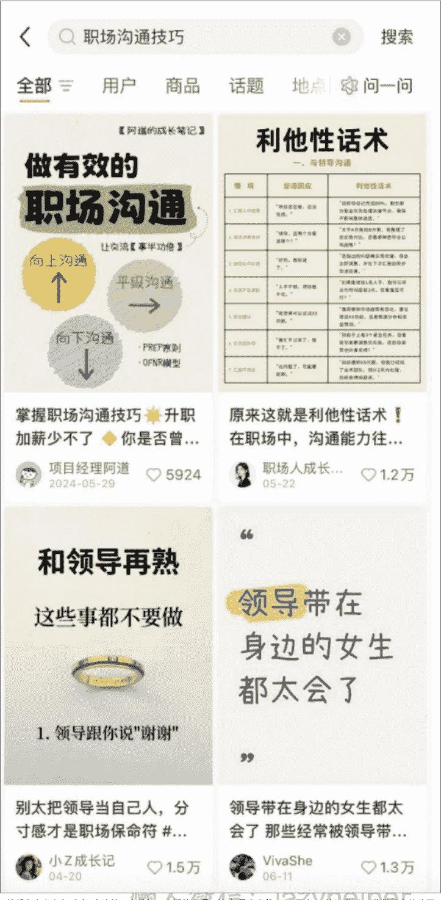

（做图文，你做视频就选视频）

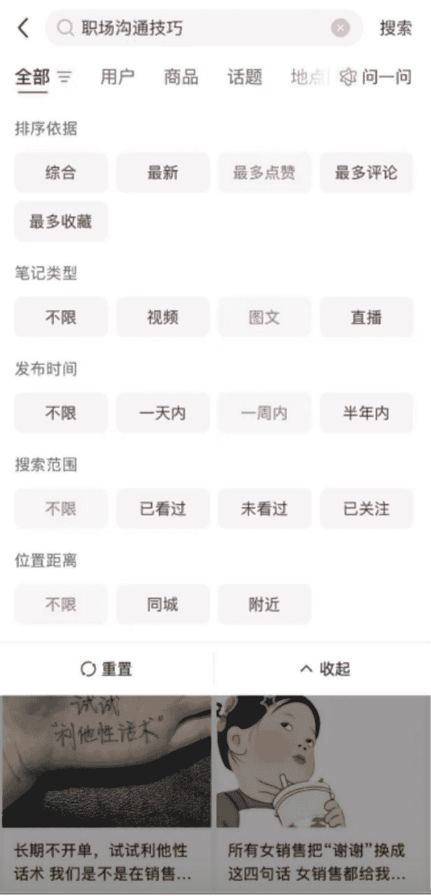

筛选之后，你拿到的就是符合近期+爆款2个属性的内容了，而且爆款是从最高赞开始呈现的。

公众号懒人搜索，懒人专属群分享

然后我们要从这些笔记里，找出符合最后一个条件“低粉”的笔记。这个就需要你一个个点开账号看了。

懒人微信:lazyhelper 8/21

# 薯片君在上班

# 借调真是个
需要
八面玲珑的活

# 借调干得好，至少说明你人际关系厉害

借调到上级单位，尤其上下级关系密切的单位，特别考验你上下沟通、协调能力。说实话工作能力是其次（当然工作能力也不能拉垮）

比如我们看这个笔记，它的发布时间是“2 天前”，但它的点赞有 483 个，说明笔记速度起得很快（可能一周后再看，就是千赞甚至万赞了）。

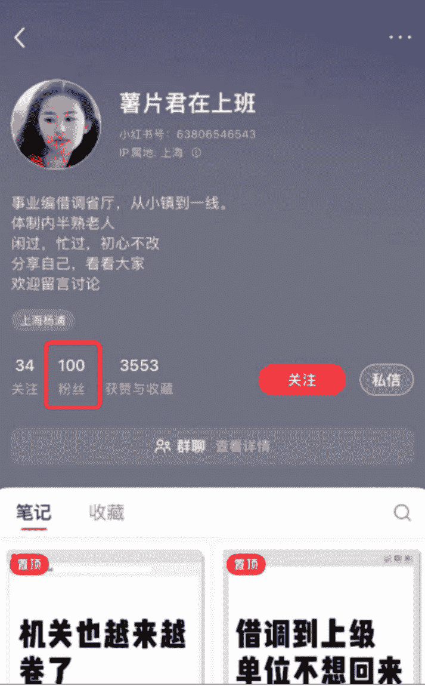

然后我们点开她的主页，发现她只有100个粉丝，那么这个笔记就符合低粉爆款的特性。

## 方法2：利用电脑端浏览器插件「社媒助手」

社媒助手是一个我经常用到的采集笔记信息的浏览器插件，在 Chrome、Edge 多款浏览器的拓展应用商店均可以免费安装、免费使用。

### 安装方式如下：以 Edge 浏览器为例

首先点击浏览器右上角的拓展按钮，然后点击获取拓展

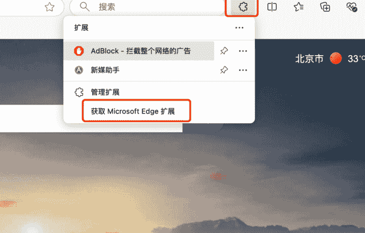

然后在拓展商店里，搜索社媒助手

点击获取，安装拓展

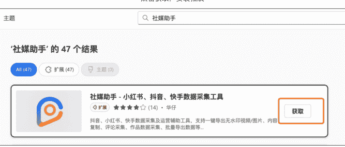

然后我们就可以在拓展里找到社媒助手了

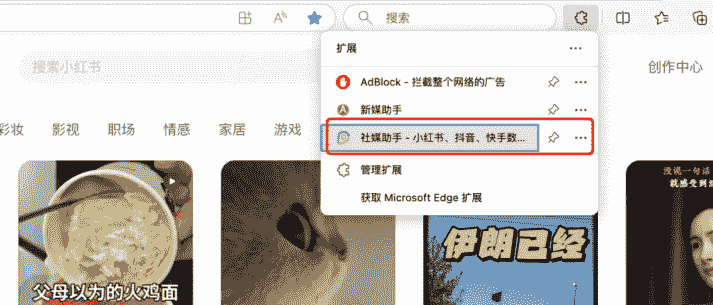

使用方式如下：

在电脑端小红书网页搜索你的关键词，我们还以「职场沟通技巧」为例，同时排列方式选择“最热”。

然后点击社媒助手的「导出当前结果」（如果没有出现这个按钮，可以多刷新几次网页），你就可以一键把搜索出来的所有笔记全部导出到 excel 表格里。

这里有个小技巧，就是点击搜索后，默认只加载 40 条笔记，但你可以多往下滑动几页，让社媒助手可以抓到更多的笔记。

导出的 excel 表里，我们可以看到，社媒助手抓到了很多数据，包括点赞、收藏、评论、分享数据，以及笔记的发布时间、更新时间，甚至博主的主页、博主的昵称，这些都能抓到。

### 然后我们做表格筛选

筛选为近期（根据你的赛道属性，选择当周、当月、半年内都可以）。

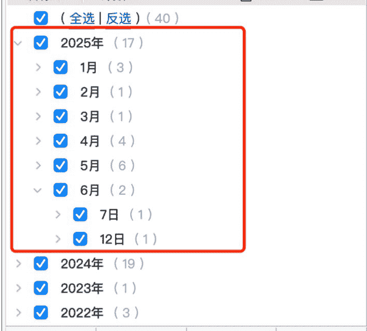

然后你就能看到近期发布的所有爆款笔记了，然后你通过点击 excel 表格里「博主链接」这一行，可以直达博主主页，看博主是否符合“低粉”这一特征。

电脑端操作要比手机端方便不少，所以推荐大家把这个插件多多用起来。

# 3、如何用 AI 批量提升图文创作效率

我们刚才提到过，做任何赛道，一定要批量、大范围的对标和模仿。

那么对标笔记我们已经找到了，如何满足批量、大范围的条件呢？

这就不得不提到 AI 的运用。

一点不夸张的讲，我做的所有笔记，都是 AI 创作出来的，我顶多在早期的时候对 AI 产出的内容有一些小的修补，后面连这些修补工作都没有做了（因为没有必要）。

话不多说，直接上干货。

首先我们要明确一个观点：我们使用 AI，并非用 AI 来创作一个内容。而是结合“对标创作风格”+“对标笔记”，让 AI 来帮你对标一个内容。

就像我上一篇文章里说的，我们要告诉 AI：

“我看到了一个什么，它大概什么样，你能不能模仿一下。”

我把AI的运用，总共分成3步。

### 第一步：找到你的对标创作风格

什么叫“对标创作风格”，其实就是从大量的对标账号里，找到一个爆文率特别高的，把他的创作风格当做你的对标风格。

举例子，我们以之前提到的5.6万赞的笔记为例，它的博主有1.7万粉丝，且产出了多篇千赞甚至万赞的爆文。

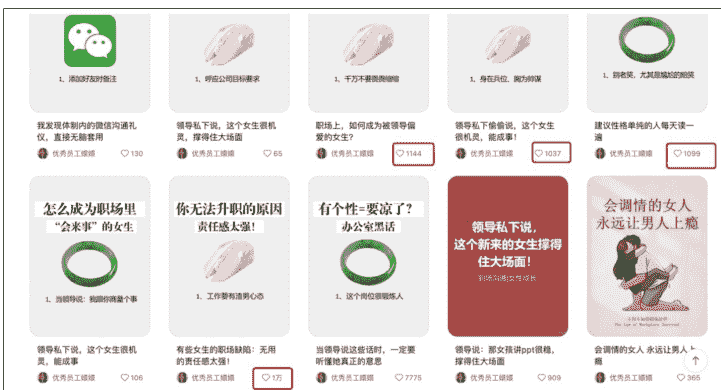

那就说明，抛开封面的因素，只看正文的话，这个博主的创作语言，起码是用户不讨厌的（不然不会这么多人点赞）。

那么我们就可以把他的正文提取出来，做到一个文档里，作为附件上传给AI，让其模仿创作风格。

参考话术如下：“我是一个xx赛道的博主，附件是一个我非常喜欢的博主的创作风格，请你学习他的语言风格，并作为你之后输出内容的语言风格”

这样可以确保，AI 每次输出的内容风格，可以保持稳定，而且不会出现类似“xx 术”、“xx 症”之类的一看就很 AI 的语言，让人觉得假。

### 第二步：把你的对标笔记内容喂给他

在 AI 已经学习了对标创作风格之后，你只需要把你找到的近期、低粉、爆款的对标笔记内容发给他，让他对照内容重新写一个即可。

参考话术：“请以 xxxx 为标题，参考附件内容，写一个新的内容，核心意思不变，但语言重新表述，重复度不要超过 20%”

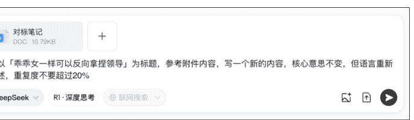

这样 AI 就可以给你一篇用“对标账号创作风格”+“对标笔记内容”创作的一篇新笔记了，而且几乎不会碰到抄袭问题（因为重复度低于 20%）

这里要注意一个点，就是你的封面内容，是不要改也不要变的，直接一字一字的照抄即可。因为你的流量多少，90%取决于你的封面，所以这块千万不要改。

### 第三步：用可画、稿定设计来排版

到这一步就简单了，直接把 AI 生成的内容，通过这些排版软件简单排版一下即可。

具体每个软件怎么用，大家下载下来体验一下就好了，这里就不详细介绍了（核心动作就是把 AI 产出的内容复制-粘贴到排版软件里）。

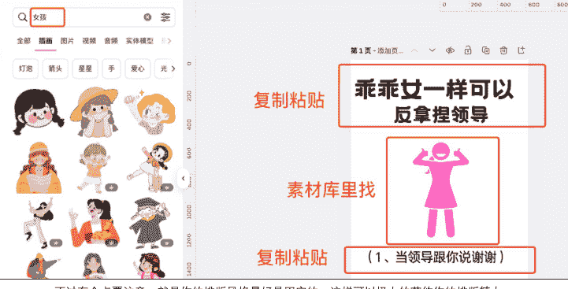

不过有个点要注意，就是你的排版风格最好是固定的，这样可以极大的节约你的排版精力。

我现在采用固定的排版，基本上排版的时间不会超过 2 分钟。

# 4、起号成功后，如何用 AI 生成角色一致性的卡通人物形象打造虚拟 IP

我们平时刷对标笔记，可能会看到一些账号，它的 IP 形象是统一的，比如下面这个账号：

IP 统一的好处，在于粉丝的识别度更高，这样大家总是看你的笔记，就会慢慢记住你。

同时，在接商单的时候，甲方也更愿意选择统一 IP 的账号。

那么在起号成功之后，就可以着手创建自己的账号 IP 了。

我曾经尝试过很多种 AI 绘画工具，包括可灵、即梦等都使用过，但可能是我方法不对，每次生成的图片，角色还是会发生偏移，不能保持 100%一致。

综合来讲，绘画工具对立体类的角色，角色一致性保持的更好，但插画类的角色就会差一些。

### 这个问题，直到我发现豆包可以完美解决，而且简单到令人发指。

举个例子，假设你想创建一个小姑娘的插画形象，作为我们的角色IP。

你可以直接对豆包说：“我需要有一个可爱的扁平风格小女孩的卡通形象，白色背景”

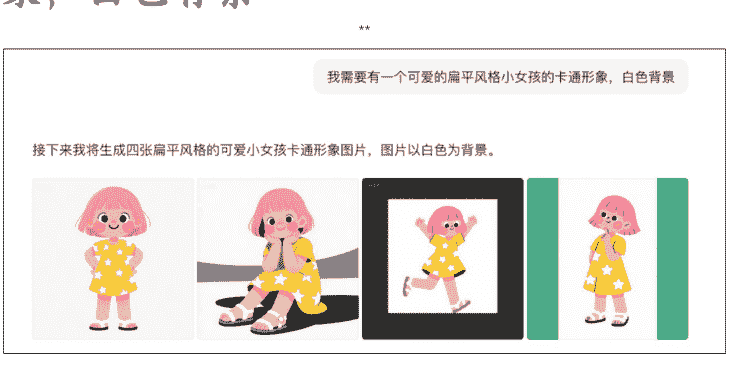

然后，假设你对这个角色IP是满意的，你就可以让AI记住这个角色，为你匹配不同的动作。

比如：“我希望生成这个角色打羽毛球的图片”

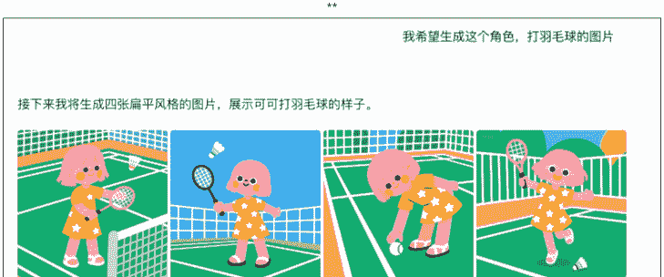

看，这个角色一致性是不是保持的很好？

豆包生成的速度非常快，基本上出4张图只需要10几秒，你可以要求它固定角色，帮你匹配任何角色动作，且每次都是4张图，包你满意（不满意也可以重做）。

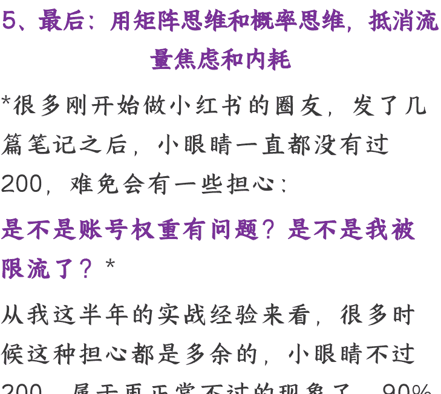

# 5、最后：用矩阵思维和概率思维，抵消流量焦虑和内耗

> 很多刚开始做小红书的圈友，发了几篇笔记之后，小眼睛一直都没有过200，难免会有一些担心：是不是账号权重有问题？是不是我被限流了？

从我这半年的实战经验来看，很多时候这种担心都是多余的，小眼睛不过200，属于再正常不过的现象了，90%的原因不是来自于账号，而是来自于「内容」和「推送概率」。

所谓内容，就是你要排查你是不是严格去对标了低粉爆款内容。

所谓概率，这是一个很有意思的事情。

我通过阅读大量的小红书经验贴，结合自己的起号经验，有一个反常的洞察：如果把小红书起号比喻成一个游戏，那它首先是一个数学游戏。

原因就在于，小红书它的推送是具有非常大的随机性的，假设你做的内容选题是「乖乖女一样可以反拿捏领导」，那么你发出去笔记之后，小红书推送的第一波用户，只有满足一定条件，你的封面点击率才会高：

「职场女性」「性格比较乖」「对领导不满」「想要学习职场沟通技巧」。

换言之，一旦第一波用户推送的对象不对，比如推送给了钢铁直男，或者推送给了还在上大学的大学生，那么这个内容就不会有很高的点击量。

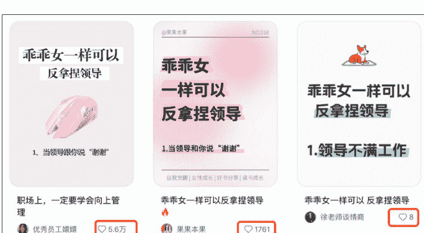

那么怎么应对这个情况呢？

其实也很简单：既然我们决定不了第一波推送的人群，那么我们就去加大推送的频次。

同一个内容，我发了一次，没起来量，那我再改改，再发一次，还没起来量，那我再改，再发……（反正我们有 AI）

（PS：昨天群里有圈友问，一天最多发多少次，我之前听到的是，有大佬一天发 50 个笔记）我认为，一个好的封面，值得你去发 10 次以上。

总有一次，你能撞到符合标签的那些人，从而让你的点击率飙升，CES 评分爆表。

所以我说，当你发出去的笔记小眼睛不多的时候，不要灰心丧气，一定要学会：用矩阵思维和概率思维，抵消流量焦虑和内耗。

同一个笔记封面，你可以在 N 个号每个号推送 N 次。

这样可以极大的增加你的爆款概率。

你可以这样想，你每次推出去一个笔记，都是在玩套圈的游戏，有的圈可以套中娃娃，有的圈套不中，但套不中是很正常的，你多套几次就好了。

别人发一次，成功概率是 x，你发 10 次，你的概率就是 10x，你发 100 次，你的概率就是 100x，这就是用数量对冲概率。

好了，以上就是这篇文章的全部内容了，希望能给大家带来帮助！

生财真的是一个真诚满满的平台，我在生财通过阅读各个大神的分享也是收益颇丰！

关于我这次的分享内容，如果有表述不清楚的地方，大家可以随时问我。

懒人专属群持续更新中，已持续运营 6 年，整理超 3000 份各类精选付费文章 & 年费社群干货，全部开放下载。

本资料为付费群内部分享，仅供真实有需要的朋友查阅🥸

懒人专属群更新记录：
https://lazy2025.top/#/blog/record2

懒人专属群更新记录（需梯子，备用）：
https://lazybook.fun/#/blog/record2