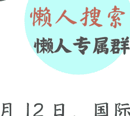
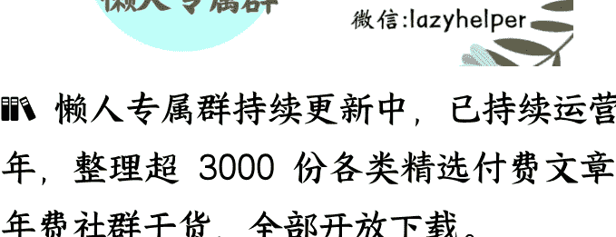

# “聪明药”席卷华尔街，人生能靠化学加速吗？

250701

整理：公众号懒人搜索，懒人专属群独享
懒人微信：lazyhelper

微信:lazyhelper

6月12日，国际人力资源平台Remote发布了一份《2025年全球生活—工作平衡指数》报告。Remote从2023年开始，每年会对全球GDP排名前60的国家做一次调查，从平均工时、最低工资、医疗保障、休假制度等层面，衡量各地的工作生活平衡情况。

新西兰连续三年排名第一，每周的平均工时是33小时，每年有32天法定年假，带薪产假也长达26周。其他排名靠前的大部分是欧洲国家。亚洲国家的工作时间普遍比较长，相对最轻松的新加坡，也只排在第25名。

比较有趣的是，同是北美洲国家，加拿大排在第7位，而美国排在第59位，倒数第二。主要原因在于，美国的休假制度很苛刻。比如，美国联邦政府没有强制规定带薪年假，大多数雇主提供几天到十几天的休假，并且大约有25%的美国职工没有带薪休假。相比之下，欧洲国家的带薪假普遍在 25 天以上。再比如，美国没有规定带薪病假，很多人休病假的时候是没有工资补偿的。法定产假也只有 12 周且不保证薪资。

同时，美国的每周平均工时虽然绝对数字并不高，是 37 到 38 小时，但美国有比较强的“在线文化”，很多员工在工作时间之外，用在工作消息、工作邮件、工作会议上的时间也很长。而且全世界工作强度最高的地方，华尔街和硅谷，也都在美国。

而伴随高强度的工作，就出现一个非常值得警惕的趋势，这就是，对“聪明药”的滥用。注意，是打引号的聪明药。聪明药这个概念本身并不新，它指的是某些精神类处方药，因为有人认为它们有远超咖啡的提神功能，就起了“聪明药”这个别称。

据说在美国，有三分之一的大学生在使用聪明药来提高考试成绩。职场上吃聪明药几乎已经成了公开的秘密。先强调一句，这种乱吃药的行为是非常错误且危险的。我们今天之所以讲这个话题，是为了搞清楚事情的前因后果，以便更好地产生警惕。

之所以所有人吃这些所谓聪明药，前面说过，和竞争强度有很大关系。强度有多大？说两件事你感受一下。

比如，去年9月，美国有一名35岁的银行员工在工作岗位上猝死，他每周的工作时长超过100小时。这件事之后，摩根大通和美国银行分别出台了规定，要求员工的每周工作尽量不超过80小时。实际上，在分秒必争的华尔街，每周工作超过100小时，甚至交易员24小时待命都是常有的事。

再比如，今年2月，谷歌的联合创始人谢尔盖·布林在一份内部备忘录中说，希望员工更加努力，这样谷歌才能在AI行业保持领先。他建议每周至少工作60小时，60个小时才刚到生产力的甜蜜点。

在这么高的工作竞争压力下，一些人开始觉得咖啡已经不够劲儿了，就开始盯上各类精神疾病的处方药。

先强调一句，我们接下来要说的这些药物，它们在“聪明药”这个意义上的作用，从来没有经过大规模的实验论证。一切效果都只是当事人的个人说法。总体来看，这些药分成几类。

## 第一类：治疗成人注意力缺陷多动障碍（ADHD）的药物

比如利他林、阿德拉、专注达等处方药。据说这些药物能让人集中注意力，专注在工作上，能够坚持繁重的脑力任务，尤其是那些能看到最后有明确奖励的任务。据说还有人发现，服用利他林的人会认为数学“很有趣”。

华尔街的一些员工说，吃完聪明药，自己能连续专注工作很多个小时，能专心地做完数据校对、Excel 格式调整这样的枯燥工作，并且还能在极端条件下保持专注。

目前，这种现象已经在华尔街的职场公开化，比如有人会在公共办公室里吃药，药盒或者处方也不藏着掖着。吃聪明药成了一种提高工作效率的常见手段，所有人都见怪不怪。

## 第二类：治疗嗜睡症的药物

第二类药物，是原本用来治疗嗜睡的药物。据说正常人吃了，就会像打鸡血一样亢奋。

比如莫达非尼，这是一种阻止嗜睡症患者在白天入睡的兴奋剂，有人说，吃一片莫达非尼，相当于喝 20 杯咖啡。华尔街分析师们把莫达非尼叫做“熬夜神器”。

《纽约杂志》的一篇报道中，一名华尔街分析师说了自己吃完莫达非尼之后的感受。他说，自己真的感觉到血液在向视神经流动，眼睛开始充血，注意力集中到了视觉上，听觉变弱了，自己很容易保持视觉专注。同时，自己也感觉到不需要休息了，也没有沮丧情绪了，处理事情的正确率也提高了。2022年，英国国防部还被曝光，过去十年里给士兵们买了 1 万多片莫达非尼。

## 第三类：其他神经兴奋剂与管制药物

除了这些，硅谷和华尔街的人还在服用神经兴奋剂。比如可卡因，这是一种被国际奥委会禁用的兴奋剂。

再比如，还有人会吃β受体阻断剂，这种药原本是一种降压药，可以阻断肾上腺素，减少心跳加快，进而保护心脏。而有人吃这类药，据说是为了让自己更镇定，能够在上台演讲或者讲PPT的时候不恐慌。

再比如，还有人在吃纳曲酮。据说这个药能阻断人体的多巴胺犒赏机制。你原来刷短视频很快乐，但吃完之后就不会有这种感觉。据说有人就是靠吃纳曲酮来防止自己沉迷赌博，或者沉迷社交媒体。

这个状态有点像一篇获得过银河奖的科幻小说，名叫《白头雀》，里面说的白头雀是一种药物，一个人一旦使用了这种药物，大脑就会被改造，对时间的主观知觉会延长，成为“时间超速者”。比如，物理上的1个小时，在他们的感受上是1.2个小时，这样，每周他们就能比别人多出一天的时间。极端点的加速者，甚至能把一个小时在主观感受上过成两个小时，他们的时间变成了别人的2倍，完成的工作也是别人的2倍。

而现实中的一些地方，也已经出现了类似的苗头。

但是，需要注意的是，虽然这些人在开发大脑方面看起来花样百出，但是，这些聪明药毕竟是神经药物，副作用导致的伤害必须注意。

首先，正常人滥用所谓的“聪明药”，可能导致严重的健康问题。比如，有人会因为吃药而产生心悸、失眠等问题，最终可能导致心脏病。有人会因为吃药丧失食欲，或者因为专注工作忘记吃饭，导致体重快速下降，损害健康。再比如，有的人精神类药物吃得久了，可能产生耐药性，那么为了保证效果，他可能会继续加量使用，导致健康进入恶性循环。

其次，这种药物依赖不仅影响身体健康，还会改变使用者的性格和社交能力。使用者在药物的驱动下，会习惯那种快速完成任务的状态，人会变得越来越像机器，只关注工具性和交易性，反过来，他们对原本那种没那么高效的日常生活的忍耐性就会降低。比如，受不了跟陌生人聊天，跟其他人交往的时候会失去耐心，或者对日常生活感到淡漠。药物把人变成纯粹的生产工具，会让人变得孤僻、冷漠。

由于药物直接作用于神经系统，很多人的大脑会受到不可逆的伤害。比如，一旦药物上瘾，大脑中原本用于决策的部位就会被关闭，大脑被药物扭曲后，会出现危险的成瘾症状，比如狂躁、好斗，再比如驱使自己去做到一些有伤害性的举动，甚至走上犯罪的道路。

再比如，卓克老师以前讲过，在“聪明药”中，最危险的是阿德拉，它的有效成分是苯丙胺。而苯丙胺多出一个甲基，就变成了甲基苯丙胺，也就是冰毒。而苯丙胺即便不是冰毒，它的成瘾性也很高，大量服用的效果就与冰毒类似。

同时，这些乱吃药的行为还会带来次生灾害。由于这些药物大多是管制类的药物，在市场上的流动性本就有限，健康人大量开药，反而导致真正有需要的患者开不出药来。

《经济学人》还专门发文章评论过这个现象，华尔街滥用聪明药，导致 ADHD 患者中出现了药物挤兑，影响了他们的治疗。

换句话说，硅谷激烈竞争，导致人们对效率产生了接近畸形的追求，以至于他们把活生生的人，当成了可以靠药物优化的化学系统。

也有人把这种情况称为“生活黑客”的极端变体。但长期看，这很可能得不偿失。

最后，关于聪明药，北京同仁医院的总药师，《日常用药健康课》的主理人王家伟老师，曾经提出过一个很值得参考的观点。他说，所谓的让状态更好，本质就是要让自己的中枢神经兴奋。而生活中，有很多食物都能起到类似的效果，包括咖啡、茶、可乐、巧克力，还有一些含有牛磺酸和咖啡因的功能性饮料。

而我们平时喝的时候，最好遵循一个“最低效果”原则。也就是，平时优先喝效果低的，关键时刻再喝效果高的。比如，喝咖啡对你管用，那么平时就少喝咖啡，尽量喝茶。到了特别重要的时刻，比如有个关键会议，需要全神贯注，那么这会儿可以喝咖啡。

王家伟老师说，要想在关键时刻释放潜力，需要一个缓慢的爬坡过程。拉高平均线，创造峰值的可能性才会提高。

同时，只要把日常的下限做得足够高，那么即使状态不好，你也能超过多数人。而这一切都需要日复一日地练习，去经历那个缓慢的爬升。

懒人专属群持续更新中，已持续运营6年，整理超3000份各类精选付费文章&年费社群干货，全部开放下载。
本资料为付费群内部分享，仅供真实有需要的朋友查阅
懒人专属群更新记录：
https://lazy2025.top/#/blog/record2
懒人专属群更新记录（需梯子，备用）：
https://lazybook.fun/#/blog/record2