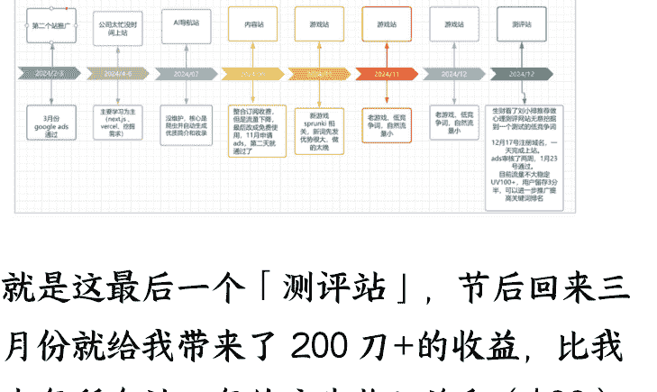
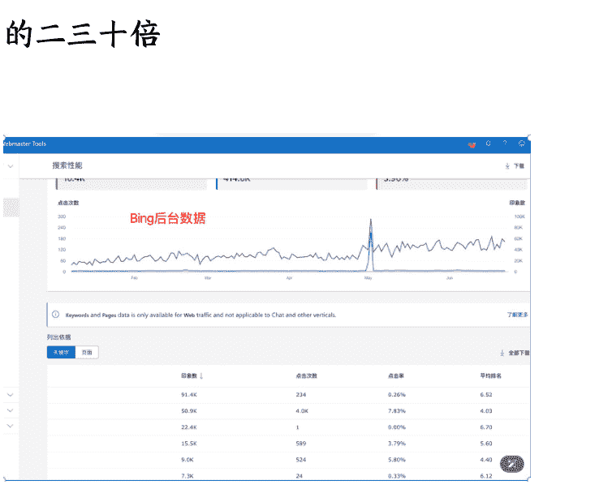
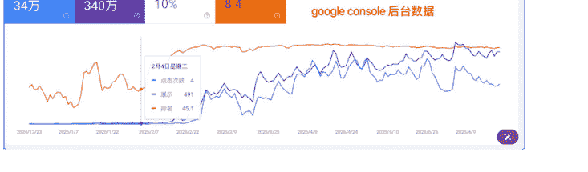
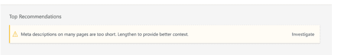
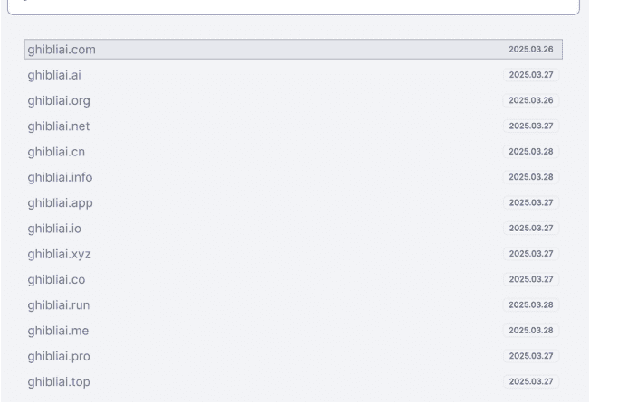

# 实践证明：实现月入1000刀我只做了9个站

## 站点信息
公众号懒人搜索，懒人专属群
懒人微信：lazyhelper

### 个人介绍

我写过两篇精华帖：

「普通程序员如何花三个月的时间跑通海外工具站MVP赚到人生第一块美刀」

继「普通程序员如何花三个月的时间跑通海外工具站MVP赚到人生第一块美刀」后续

相关的个人情况里面有介绍，感兴趣的球友欢迎来查看，一起来见证我个人的出海成长之路。

### 晒下收入

在上篇精华帖中我分享了2024年我折腾的那些站：

懒人微信：lazyhelper

### 24年出海进度条

就是这最后一个「测评站」，节后回来三月份就给我带来了 200 刀+的收益，比我去年所有站一年的广告收入总和（$88）还要高!

而且就在上个月，我已经提前实现了月入千刀的年度目标（从图片可以看出有一天甚至还冲上了日入百刀的门槛，出海赚钱 level 直接跳跃了两个等级）。虽然后面收入迅速下滑了，但是这几个月我已经赚回了几倍的生财门票收入。

## 最新的上站经验分享

Bing 的数据可以看成 Google 的先行指标。

从 Bing 和 Google Console 后台的数据对比可以看出：

网站上线后 Bing 先拿到了关键词排名（4-6 名），每天稳定给网站带来了 30-50 的自然访问量。

Google 二月份初排名还是 40 名之后，每天只有各位数的自然流量。

Google 拿到排名后流量迅速暴涨是 Bing 的二三十倍。

### 上线以后我可能做对的事情：

- 不断的加外链，过年之前我差不多已经加了 200+的外链
- 优化网站速度：通过网站 PageSpeed 查询网站速度，并让 Cursor 进行修改
- 修改 Bing 后台提示优化建议

### 加博客内容

- 增加悬浮窗，让用户能随时跳回核心功能区

## 总结

不知道有没有人跟我有一样的困惑，就是当你上了很多站以后，你很难判断一个没有什么流量的网站是否要继续投入（发外链+加内页），毕竟每个人的时间都是排它性的，你把时间投入到旧站的维护和推广上，你就没有时间上新站，通过这个站我提炼了两个指标分享给大家做参考：

- 网站能不能短期内拿到 Bing 的排名，因为 Bing 的竞争难度会比 Google 小很多，虽然流量也和 Google 不在一个体量，但是可以看成是 Google 的前行指标。
- 用户的留存时间，至少要在 1 分钟以上，2 分钟以上最好（我这个站的留存时间在 2 分半左右）。当然不同类型的站可以视情况而定。

## 使用成熟的模版

3 月份网站流量日 UV 破 1k，我就想做个付费的功能。本来计划使用一周的时间开发付费功能（功能简单单页面）+接入支付，但是最后爆肝了三周才发布上线。中途甚至给我干心累了，要不是有预期收入的强大心理支撑，我差点就放弃了。

## 我碰到了哪些坑？

- 太依赖 Cursor 的 Agent 了。一开始我太信任 Cursor，修改 bug 基本都是无脑 Apply All 代码。前期项目比较简单（没有服务端），没出现大的差错。但是接入支付、登录后，业务逻辑就相对复杂一些。无脑 Apply 代码经常出现 Cursor 把原来能用的代码修改坏的情况。无奈我只能沉下心来查看代码，发现 AI 跟人一样也很会「偷懒」：比如修改 bug，Cursor 可能会写很多 if 判断给你巧妙的解决当前的 bug（像个刚毕业的开发，找不到 Bug 的核心，治标不治本，留下很大隐患）；公共的 utils 你不指定强调复用代码，在开发新功能的时候它很大概率会给你写一套全新的一样功能的 utils，导致项目中很多冗余的代码。到最后代码越改越乱，代码越乱 Cursor 越找不到 bug 的核心，越找不到 bug 核心 Agent 越给你加一些无用的复杂逻辑判断，就这样陷入无限的恶心循环。。。
- 路由问题。经常碰到本地调试代码一切正常，但是一部署 Vercel 就无法使用了，很大概率是路由配置或者静态资源的路径引用问题。
- 重新定义付费率。一开始预想的很美好：我的网站一天有 2-3k 的访问，如果有 1% 的付费率，定价$5，每天保守估计也有 100-150 刀的收入。但是付费功能发布后，至今只收到了 5 笔的付费（其中一笔还是我自己测试的）。因为本身我的网站是打着免费、免登录的旗号宣传推广，看了数据库目前注册登录的用户也才 100 个，所以按注册的用户来算付费率会比较合理。

## 总结

- 上完站除了提交 Google 搜索，其他搜索引擎像 Bing、百度等记得一并提交。提交时间成本不高，但是可能东边不亮西边亮。
- 如果你的网站后期有做支付的打算，我建议你直接使用开源的完整项目或者购买市面上的成熟模版（比如 ShipAny）。使用成熟的方案可以给你省去不少的时间（大部分时候只需要开发核心功能，然后修改文案和配置就能快速上线）。当然如果你开发能力很强可以忽略。
- 让 AI 赋能开发提升效率，但是也不能完全依赖 AI。当你多次让 AI 修改一个 bug 还是无法解决的时候，要学会沉下心来查看代码，并找到 bug 的核心，之后再针对性让 AI 去解决。
- 养成 AI 修改完代码，简单复查下代码的好习惯（特别是已上线的代码）。

## SEO 搜索优化

不知道有多少球友跟我一样，现在遇到问题都是直接问 AI（墙内问题问腾讯元宝、国外问 ChatGpt、Claude 等），很少再直接去搜索 Google、百度。。。而且养成 AI 搜索习惯之后你很难再回到原始的搜索。所以 AI 搜索的权重只会越来越大。如何提升你网站的 AI 搜索友好度也变得越来越重要。这里推荐苏老师的公众号文章：

- 实战分享：robots.txt 与 llms.txt 优化对 AI 流量的影响
- 【SEO 经验】经验分享：两周内如何用 AI 友好度优化获得 13K 曝光量？

## Clarity 接入

微软的免费产品，具有录屏功能的 Google Analytics。除了比 Google Analytics 更详细的统计功能外，最主要的是它可以查看用户的操作录屏，这对于发现 bug，优化功能提升用户跳出率和用户留存时间很有帮助。

## SEO 比较慢

从上面的 Google Console 和 Bing 的后台数据截图可以看出，从上站到流量爆发总共花费了 2 个多月的时间。原来 Ahrefs 查出来的 Keyword-Difficulty 显示只要二三十个外链就能冲上首页，但是实际我年前就已经加了快 200 的外链，而且通过 Ahrefs 查出的网站外链数已经超过 30 个了，但是流量年后才爆发。

所以就像哥飞说的：做出海需要决心、耐心、细心和平常心。上完站让子弹飞会。。。你只管耐心、细心给「树」除草浇水（细节优化+外链），至于能不能开花结果需要平常心对待。

## 心得和建议分享

### 短时间内足量重复

李笑来重新定义努力：短时间内足量重复一切的学习，本质上来看，都是在创建新的连接，构建新的局域网——这很是耗费能量，需要大量的化学反应和物力放电，需要糖和氧。

单个神经元，被神经胶质细胞支撑在特定的位置，原本可能与邻近的某个神经元之间相互绝缘。但，相邻的两个神经元可能因为什么原因长出更多的突触，而那些突触可以慢慢延伸，直至两个神经元的突触连接在一起，形成可供电流通过的通路——连接！这个过程不仅难度高，要耗费大量的能量，并且耗费的时间弄不好也很长。

创建新连接，构建新局域网，对大脑来说，最划算的办法就是短时间内足量重复。凡事都一样，刚开始可能不会做，开始做的时候很笨拙，但，做得多了也就熟练了。可问题在于，做得多，有两种方式，在很长时间里重复相同的数量，在很短的时间里重复相同的数量——显然，后者更划算，这不仅事关效率，更关键的效果。

专业的弦乐演奏者都会“轮指”——几个手指以均匀的节奏但以极快的速度地拨动琴弦⋯⋯这显然很有难度，因为最终绝大多数人的手指做不出这样的动作。其实，任何人都能做到，大约一天三个小时差不多一个月多一点就可以练成。可是，如果每天5分钟，练上1200天行不行呢？估计不行——更重要的是，虽然每天只练5分钟好像很容易，但，连续练1200天却可能难到不可能的地步。同样差不多100小时的练习，在越短的天数里越集中地完成，不仅效率更高，效果也越好。

这个现象的根源在于，你在耗时费力练习的同时，大脑在默默地执行用进废退。把时间拉得太长，频率搞得太低，重复次数太少，会使大脑自动降低此项活动的重要性，不认为它是必要的，不认为它是必需的，于是，无形之中形成了一个越来越大的阻力。

——李笑来

像挖掘新词就是需要大脑创建新的神经元连接。需要你逼迫自己在短时间内看足量的词，连续挖掘个一周、两周后你就慢慢开始有网感，挖掘过程也不再像一开始那么痛苦、效率也会越来越高。

### 说服别人最有效的方式是拿到结果

举个我自己的例子，去年的时候我曾经试图说服身边的同事一起出海上站，废了不少口舌，结果他们都不相信出海能赚钱，或者只是不相信我出海能赚钱。甚至连我亲弟我也没能说服成功。

今年当我晒出我不断上涨的收入300刀、800刀、1000刀+。。。

现在有两个同事上的站比我还勤快，就连我亲弟也已经上了3个站了。果然结果胜千言。。。

### 做低竞争的关键词

不知道大家有没跟我一样的感受，出海上站竞争已经越来越激烈了，不像两年前我随便搞个去背景的图片网站都能获取到阮一峰的周刊推荐。现在的图片站、视频站功能基本都是大而全而且有小团队在开发、有一定的原始资金积累，比如彪哥的pollo.ai、hix.ai。独立开发者很难再分一杯羹。

图片、视频上的新词独立开发者还有机会，但是竞争也很激烈，例如前段时间火的ghibli风格图片基本上关键词一天以内所有的域名后缀都被注册了。而且越来越多独立开发者一开始就投广告，付费上大的导航站外链。对于前期还没积累一定资金的独立开发者已经很不友好!

对于刚入门的独立开发者，不妨去找那些小团队看不上的、低密度竞争的偏门、冷门赛道，比如小排老师推荐的「测评类」。

你能不能赚到钱，取决于你选择的赛道的大小和你在这个赛道上能拿到的排名。做一个 IM 流量的网站比较难，但是做 10 个 100k 的网站会相对容易一些。

## 结束语

最后感谢亦仁的鼓励，我也算度过了最难熬的时光（看我上一篇的精华帖敏锐的朋友应该可以感受到我当时内心的波澜，只是当时强装镇定而已），拿到了点小成绩。感谢小排老师的文章，让我挖掘到了一个低密度竞争的词，也让我赚到了出海的第一桶金。

懒人微信: lazyhelper

写这篇文章也希望对还在出海工具站路上，但是还没拿到结果的独立开发者，一些鼓励和启发。AI 这波革命肯定是 10 年以上的大机会，只要你不被甩下车，一直还在路上。。。我相信你迟早会拿到属于你的那份果实。

公众号
懒人搜索
懒人专属群

微信: lazyhelper

懒人专属群持续更新中，已持续运营 6 年，整理超 3000 份各类精选付费文章 & 年费社群干货，全部开放下载。

本资料为付费群内部分享，仅供真实有需要的朋友查阅

懒人专属群更新记录：
https://lazy2025.top/#!/blog/record2

懒人专属群更新记录（需梯子，备用）：
懒人微信：lazyhelper
https://lazybook.fun/#/blog/record2