# AI 编程：用 Cursor 写了一个 B 站好物带货视频一键生成软件

公众号：懒人搜索，懒人专属群独享
懒人微信：lazyhelper

微信：lazyhelper

这个模式不会太久，适合新手入门上手，后面还是得把视频做好一点。

## 生成效果：

## 下载地址：
https://daming.lanzoum.com/b0ko7g4ob

## 1、为什么去写这个软件
6 月 12 日，亦仁发了一条 B 站好物带货的超级标。
很多人想去做 B 站好物，但是不知道怎么做，也不知道怎么去做带货视频。
最近参加了生财宝典的航海，给我最大的感悟，就是输出太少了。
种善因，得善果。为了帮助更多的人入局 B 站好物，特地写了这个软件，免费给大家使用。
懒人微信：lazyhelper

## 2、软件带货效果
在超级标发布之前，已经写了类似的软件，并且已经跑了两个月。
现在做的有点效果，下面是这个月的 B 站好物带货京粉后台截图。
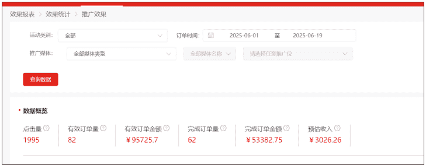

## 3、软件视频灵感来源
这个软件，主要是根据百万带货榜的一些大佬发的视频去写的。
可以看一下这几位，都是单品带货的，排行榜里的。就是参考他们的视频形式去写的软件。
https://space.bilibili.com/21448520
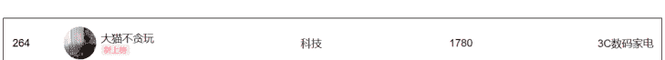
https://space.bilibili.com/3493145859853047
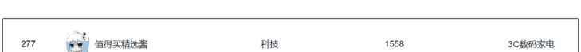
https://space.bilibili.com/3546736660318579
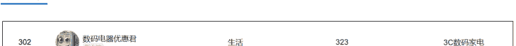

## 4、软件重写的原因
之前写的参数是固定死的，如果多人用的话怕会有问题，界面大概是这样的。
### 用易语言写的，比较简陋。
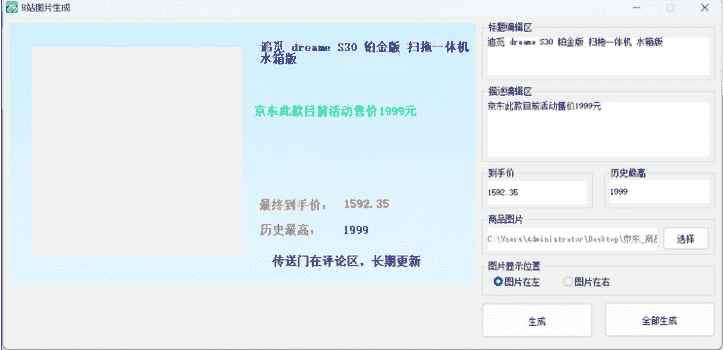
最近亦仁写了个风向标，我想能不能把这个软件改成可以自己调整参数的。
这样自己排版，再去生成视频，而且内置了很多随机的视频特效，大概率是不会重复的。
经过几天的努力，用 Cursor 重写了一个，基本满足我的构思，也能满足大部分人的使用需求。
完全 0 代码写的，纯给思路，然后给自己想优化的点。截图界面给大家看一下。
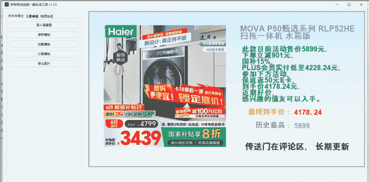

## 5、软件功能：
### 5.1 自己任意调整视频排版参数
元素编辑界面，可以自己在启动前自己在文本文档里自己添加参数的名字。
软件启动会自动读取这些参数，你直接填入文字就可以使用。
可以根据自己的喜欢随意排版。点中参数就可以移动，也可以上下左右键调整。
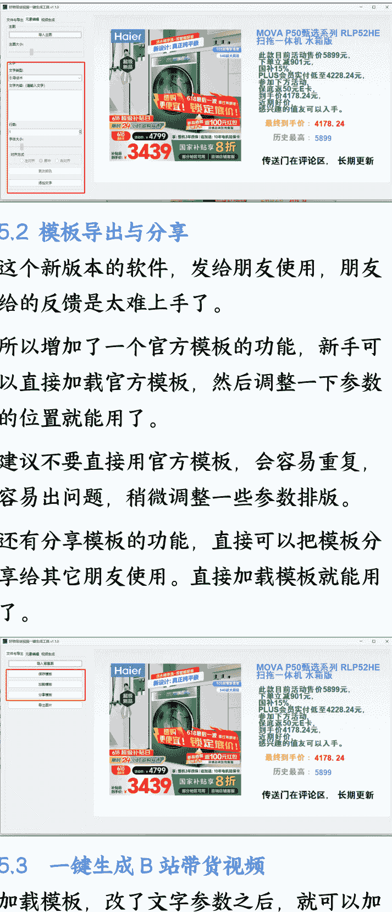

### 5.2 模板导出与分享
这个新版本的软件，发给朋友使用，朋友给的反馈是太难上手了。
所以增加了一个官方模板的功能，新手可以直接加载官方模板，然后调整一下参数的位置就能用了。
建议不要直接用官方模板，会容易重复，容易出问题，稍微调整一些参数排版。
还有分享模板的功能，直接可以把模板分享给其它朋友使用。直接加载模板就能用了。
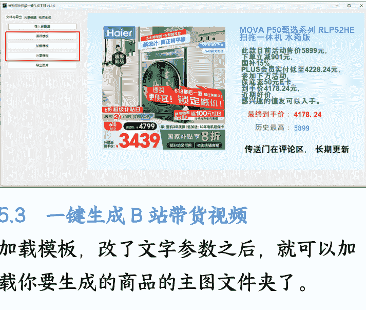

### 5.3 一键生成 B 站带货视频
加载模板，改了文字参数之后，就可以加载你要生成的商品的主图文件夹了。
懒人微信：lazyhelper
然后就可以一键合成视频，也会有视频带货文案在上面。复制文案和视频文件，用剪映加一下配音就可以直接上传了。
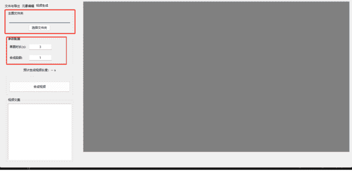

## 软件使用说明：
### 1、先下载安装软件（主软件窗口）
点击下方链接下载就可以，记得解压后再打开。
解压后大概是长这样的，圈中的是官方模板储存路径
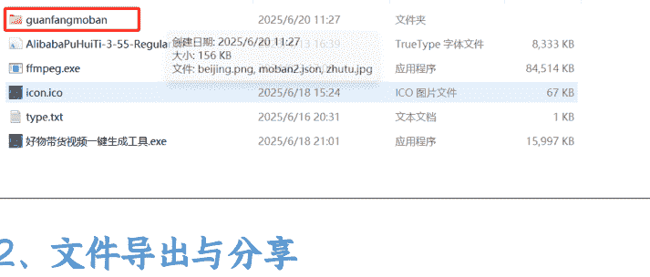

### 2、文件导出与分享
#### 功能介绍
- 2.1 导入背景图：导入一张 1920*1080 的图片作为背景
- 2.2 保存模板：把你排版好的参数保存下来，方便下个视频复用
- 2.3 加载模板：加载你保存好的，或者别人分享给你的模板
- 2.4 分享模板：区别于保存模板，这个是用来分享给别人用的
- 2.5 导出图片：把你当前配置好的图片直接导出，用得比较少
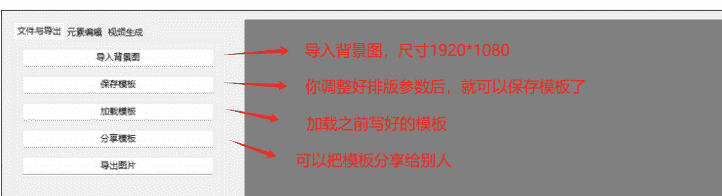

### 3、配置排版参数（仅供参考，后面建议自己调整）
1. 直接导入主图
2. 在 type.txt 里修改成你需要的参数
3. 在文字区域修改一下你的详细的一些参数。可以在这里修改文字内容，可以设置具体的行数、字体大小、对齐方式和颜色
4. 接下来保存模板，就可以进行下一步操作了。
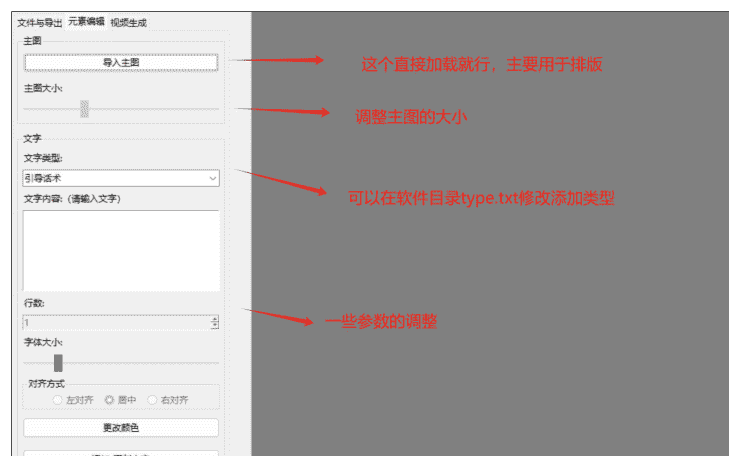

### 4、浏览器安装至尊宝插件（用于下载商品主图）
直接点下方链接下载安装即可：
https://zzbtool.com/index.html
然后打开商品的链接，在商品上方会出现插件的页面，直接点这个“主图详情 SKU 视频下载”的按钮即可。
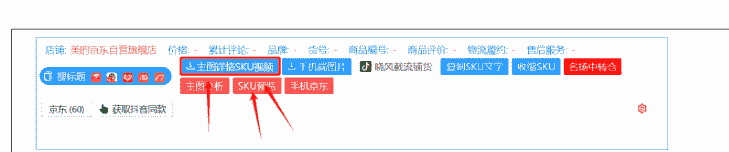
勾选主图，正常，然后选择单文件夹打包下载即可。
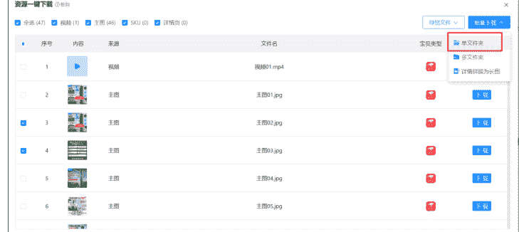

### 5、一键生成视频
1. 先导入上一步的主图
2. 调整段数，正常来说合成 2-3 段差不多，单图时长不用改
3. 然后就可以合成视频了
4. 视频文案用来合成音频用，然后合成一个视频
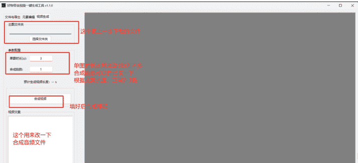
（图片下方说明）这个做上一步下载的文件 | 单图时长正常来说 3 秒差不多 | 合成段数可以自己改一下 | 根据文案长度，正常 2-3 段 | 填好后合成视频 | 这个用来改一下合成音频文件

### 6、用剪映进行下一步操作
1. 朗读文案
2. 根据文案长度裁剪后导出

公众号：懒人搜索，懒人专属群
微信：lazyhelper

懒人专属群持续更新中，已持续运营 6 年，整理超 3000 份各类精选付费文章 & 年费社群干货，全部开放下载。
本资料为付费群内部分享，仅供真实有需要的朋友查阅
懒人专属群更新记录：
https://lazy2025.top/#/blog/record2
懒人专属群更新记录（需梯子，备用）：
https://lazybook.fun/#/blog/record2
懒人微信：lazyhelper