# 《B站好物新手破局指南》：3天出单，拆解5大变现风格帮你少走90%的弯路

公众号懒人搜索，懒人专属群独享
懒人微信：lazyhelper

大家好，我是 AI 德华。

在写下这篇文章时，我 B 站好物项目的已经赚钱了。说实话，如果不是亲身经历，我可能也不信——一个用 AI 做的简单视频，真的能在 B 站赚到钱。

今天，我不想只分享喜悦，更想把我如何赚到这第一笔钱的思考、工具和完整路径，毫无保留地分享出来，希望能给你带来真正的价值和行动的信心。

## 赚到了第一块钱

看到亦仁发的 B 站好物超级标，我大概是圈里最坐不住的那批人之一。作为一个 12 年的 B 站老用户，从看番到追 UP 主，B 站陪我走过了青春。但“B 站带货”？说实话，我心里是打问号的，真有那么神奇吗？

但生财的价值观就是“干就完了”。我没有“等靠要”，而是选择立刻验证。

于是在发布视频的第三天，我就出单了。

当我在后台看到收益的时候，心情真的非常震惊。一个用AI做的、看起来这么简单的视频，真的会有人跟着买？这个正反馈瞬间打消了我所有的疑虑，也给了我极大的信心。

## 一、我的第一步：不是做视频，而是调研

下面这张表，是我花了好几天时间，把几十个账号一个个“扒”干净才总结出的核心，毫不夸张地说，它至少能帮你节省不少的研究时间。

| 序号 | 账号名 | 类目 | 个人简介 | 粉丝 | 内容形式 | 主要变现途径 | 难度/备注 |
|---|---|---|---|---|---|---|---|
| 2 | Mr迷瞪 | 家居家装 | 装修科普，定期开团，关注公众号 | 234.1w | 横测推荐-挂微信社群+直播间转直播 | 固推 | 家装头部，运营精细 |
| 3 | Wilson学长 | 家电 | 家电领域专业博主，家电选购指南 | 35w | 横测 | 视频挂链 | 较难，横测数量大 |
| 4 | 存存计数的包子 | 3C电脑 | 企鹅群搜群：1049301294 | 2.6w | 开箱 | 视频挂链 | 一般，开箱测评，对于主播的专业性要求较强 |
| 5 | 摄机所 | 3C电脑主机 | 淘宝店：摄机所电脑 微博-摄机 | 231.7w | 单产品测评+横测 | 视频挂链+直播 | 较难 |
| 6 | 爱摄影的信 | 3C电脑 | 数码一线猛料！真话无保留，微 | 9141 | 锐评 | 视频挂链 | 简单，找话题锐评即可 |
| 7 | 机玩汇 | 3C电脑 | 喜欢就关注一下呗 | 4910 | 评测 | 视频挂链 | 一般，评测ppt式图片演示 |
| 8 | super好价君 | 3C手机|相机 | 嘀嘀好价号：707479243 持续好 | 1.3w | 好价推送，截图+配音 | 视频挂链 | 简单，教怎么样下单，大字+截图+配音 |
| 9 | 不接受手机测评 | 3C手机 | 小店可领618元门槛红包，全平 | 6.9w | 测评实拍 | 视频挂链 | 简单，拿着实拍即可 |
| 10 | 蒙面a侠 | 3C电脑主机 | TB：蒙面IT侠(加邀售后处理不) | 13w | 测评+好价 | 视频挂链 | 一般，要出镜+ppt |
| 11 | 迷就 | 3C电脑 | 商务合作微信：CAT-MYMY不懒 | 56.9w | 测评 | 视频挂链 | 较难，视频做到极精细的 |
| 12 | 电脑当 | 3C电脑 | 说缺点，真实的测评人，私信固 | 16.6w | 出镜+开箱+锐评 | 视频挂链+直播 | 一般，出镜+锐评，需要很懂 |
| 13 | 闲翻数码站 | 3C电脑 | 感谢关注~第一时间分享数码新 | 2.4w | 介绍平台优惠 | 视频挂链 | 简单，截图+介绍+机器配音 |
| 14 | 超短测评 | 3C电脑 | 数码选购的建议&不建议，拒绝 | 5205 | 测评 | 视频挂链 | 较难，出镜+ppt+视频 |
| 15 | 科技健至 | 3C电脑 | 鲜有好不好的产品，多为不好的性价比 | 1.6w | 介绍优惠 | 视频挂链 | 简单，截图+产品介绍+机器配音 |
| 16 | 机会长长 | 其他 |  | 879 | 动态捡到京东超低优惠价 | 动态 | 贼简单，捡到最低优惠的短视频 |
| 17 | 年度睡眠看 | 其他 |  | 185 | 动态捡到京东超低优惠价 | 动态 | 贼简单，捡到最低优惠的短视频 |
| 18 | 江户川圆 | 3C配件 | 快乐每一天!商务合作：ZXSZ-cc | 1.8w | 横测 | 视频挂链 | 一般，出镜+ppt |
| 19 | myimmortal | 数码 | 囤补一手满意&购物攻略 审视和 | 1.9w | 介绍平台优惠 | 视频挂链 | 一般，截图+真人配音，需详细了解平台规则 |
| 20 | 大白进数码 | 3C电脑 | 本UP实时更新最新数码，科技、 | 1814 | 测评 | 视频挂链 | 简单，混剪+配音 |
| 21 | 雷配橘子评测 | 家具 | 致力于让对的人找到对的人。 | 3.4w | 测评 | 视频挂链 | 一般，出镜+测评，细分类目 |
| 22 | 好价值得买 | 3C手机|相机 | 数码好价爆料，爆料企微: 错10 | 4258 | 好价推送，截图+配音 | 视频挂链 | 简单，教怎么样下单，大字+截图 |

这张表是我行动的“导航地图”，它帮我解决了几个核心问题：

- 做什么类目？（3C、家电、还是其他？）
- 内容怎么做？（真人出镜？横评？还是纯数据+配音？）
- 难度有多大？（我一个新人能不能复制？）

通过这张表，我发现了很多“跑通了”的账号，并不需要真人出镜，甚至制作非常简单，核心就是把产品的核心卖点和优惠信息讲清楚。

## 二、核心干货：B 站好物的 5 大主流风格与深度拆解

深入研究后，我发现 B 站好物——数码赛道主要有五种主流风格。成功的关键不是模仿，而是“风格匹配”——找到最适合自己能力、资源和性格的玩法。下面就是每个风格的对标账号拆解。

### 风格一：效率派（信息流模式）

对标账号： super 好价君

怎么做账号： 无需真人出镜，账号定位是“信息发布工具”。核心是效率，可以高频发布，但为规避风险，建议一天不超过3条。

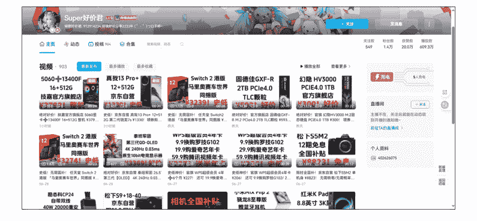

怎么做内容：
- 钩子： 极其直接，如“史低价！”、“抄作业！”、“XX机型降价了！”。
- 结构： 形式非常简单，通常是“商品截图+AI配音”。内容逻辑是：这是什么产品 -> 原价多少 -> 现在用券后多少 -> 怎么买。信息直给，不绕弯子。
- 转化： 转化话术简单粗暴，如“链接放评论区了，券不多，手慢无！”。

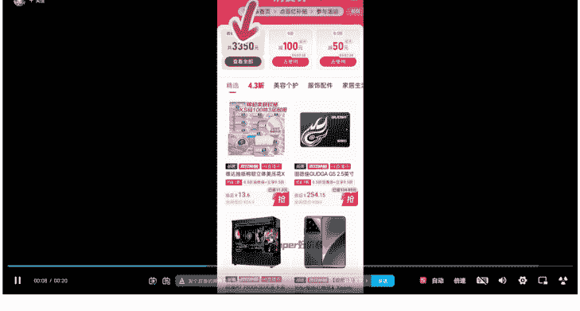

流量从哪里来： 几乎来自用户精准搜索产品型号或“XX推荐”等关键词，是纯粹的SEO玩法，能吸引有明确购买意图的流量。

怎么变现的： 纯粹的蓝链CPS佣金，商业模式简单清晰。

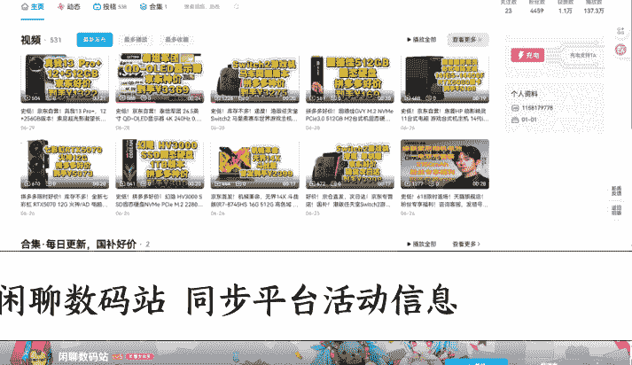

账号情况如何： 单个视频播放、点赞数据通常不高，但因为流量精准，转化率可能不错。最大风险是生命周期短，容易被平台判定为低质量营销内容而限流或封禁。

如果你来复刻： 这是最适合新手入门、验证流程的模式。可以用最小成本跑通从选品、制作、发布、挂链到收款的全流程。但不适合作为长期事业来经营。

类似账号还有 好价值得买

闲聊数码站 同步平台活动信息

### 风格二：技术派（PPT横评模式）

对标账号： 机玩汇

怎么做账号： 无需出镜，但内容需要结构化、信息量大。定位是“客观的选品顾问”。建议周更，保证单期内容的深度和价值。

怎么做内容：
- 钩子：抛出用户常见的选择困难症，如“给大家盘点一下，游戏本热卖榜前十机型，看看大家都买哪些型号”，“8000左右价位，哪些游戏本比较值得入手”
- 结构：典型的PPT形式。1.提出问题（选购痛点）->2.确定评测维度（如性能、外观、价格、续航）->3.将几款竞品并列，在每个维度下进行横向对比->4.给出清晰的总结图表和购买建议。
- 转化：引导语更专业、更客观，如“感觉大家的观看，希望能帮助大家挑选到合适的机型”。

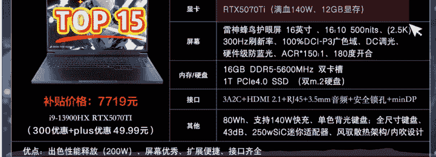

流量从哪里来：搜索+推荐。因为内容有价值、信息密度高，能解决用户的实际问题，平台会给予推荐流量，也能吃到长尾的搜索流量。

怎么变现的： 蓝链佣金为主，当有一定知名度后，开始有品牌合作的可能（例如在横评中进行付费植入）。

账号情况如何： 播放量和粉丝粘性远高于效率派。评论区常有高质量的技术讨论，用户质量高。

如果你来复刻： 这是最适合 AI 自动化和规模化生产的模式。脚本可以结构化，PPT 可以模板化，配音可以用 AI。是新人摆脱“搬运工”身份，转向“内容创作者”的绝佳跳板。

类似的账号还有 3C 配件赛道江户川阿 u

### 风格三：亲和派（真人出镜口播模式）

对标账号： 蒙面it侠

怎么做账号： 真人出镜，但制作可以相对简单。定位是“你身边懂行的朋友”。以个人形象为核心，快速建立信任感。

懒人微信：lazyhelper

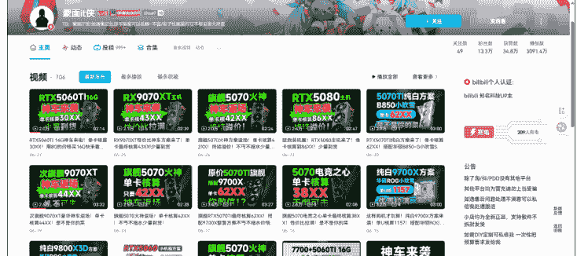

怎么做内容：
- 钩子： 用朋友聊天的口气提出问题，如“关注性价比主机的你不知道有没有发现”。
- 结构： 内容框架和 PPT 模式类似，但承载形式是“一个人+一堆资料截图”，由真人来讲解。相当于 PPT 模式的“真人升级版”，增加了表情、语气和互动感。
- 转化： 话术更口语化、更有人情味，“如果觉得本期视频对你有所帮助，直接链接汇放在评论区，给您推荐”。

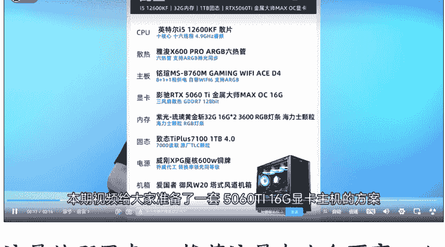

流量从哪里来： 推荐流量占比会更高。人脸是最好的“品牌”，平台更愿意推荐有真实人设的视频，更容易获得粉丝的长期关注。

怎么变现的： 蓝链佣金 + 商单报价会因为有真人 IP 而显著高于纯 PPT 模式。

懒人微信：lazyhelper

账号情况如何:粉丝忠诚度更高,评论区的互动更像是和UP主本人在聊天。

如果你来复刻:核心是克服镜头恐惧。不需要复杂的布景和拍摄,一部手机、一个支架就能开工。它能帮你快速在众多AI号中脱颖而出。

### 风格四:体验派(实拍开箱模式)

对标账号:斤斤计较的包子

怎么做账号:视频+直播结合,打造真实的“产品体验官”IP。定位是“替粉丝花钱踩坑的实在人”。

怎么做内容:
- 钩子:展示产品和价格,激发好奇心,如“我花XXX元买的XX,到底值不值?”。
- 结构:1.真实开箱(包装、配件、第一印象)->2.上手把玩(质感、重量、设计细节)->3.场景化体验(实际使用效果、性能跑分） -> 4、深入点评优缺点（“计较”的精髓，不回避问题） -> 5、给出最终的、场景化的购买建议。
- 转化： 基于强信任的转化，“如果觉得我的评测对你有帮助，可以从置顶评论的链接支持一下，感谢大家。”

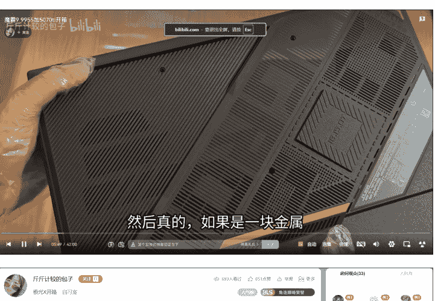

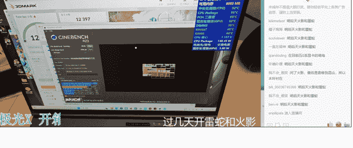

流量从哪里来： 推荐流量为主，粉丝流量为辅，搜索流量为补充。这是最健康的流量模型。

怎么变现的： 蓝链佣金 + 高价值的品牌定制商单+私域服务

账号情况如何： 赛道内的头部账号，播放数据和带货 GMV 都非常可观。

如果你来复刻： 需要投入资金购买产品。核心能力不是成为技术专家，而是成为一个“认真的、挑剔的消费者”、

类似的账号 还有不寻常手机测评（手机）、电锯爷（电视）、雨哥椅子测评（椅子）等。

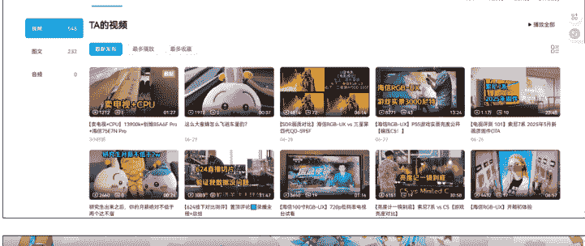

### 风格五：偶像派（KOL 锐评模式）

对标账号：爱唱歌的信

怎么做账号：以主播的个人魅力和专业性为核心。视频内容多为截图锐评输出，直播内容多为回答粉丝问题，定位是“说真话的意见领袖”。

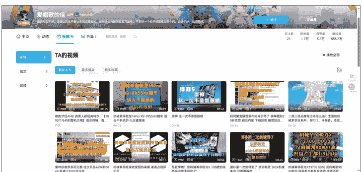

怎么做内容：
- 钩子：直播和视频中的金句、暴论、猛料，如“鸡哥这是疯了吗”、“XX直接杀死比赛”。
- 结构：回答粉丝提问，提供一线信息，观点鲜明，一针见血。通过“私域有官方售后人员”这类信息，建立超强的信任背书。
- 转化：基于粉丝对个人IP的极度信任，转化率极高。

流量从哪里来：锐评话题带来讨论 + 粘性极强的直播间核心粉丝。

怎么变现的： 蓝链佣金 + 私域服务 + 直播打赏

账号情况如何： 拥有话题性和较高的粉丝忠诚度。

如果你来复刻： 需要一定的行业积累、极强的个人魅力和口才。

## 三、我的实操工作流：从选品到发布的“AI 流水线”

拆解清楚、选定风格后，就进入了最关键 的执行环节。我选择了门槛最低的“效率 派”模式作为起点+，并围绕它打造了一套 几乎完全由 AI 驱动的、可批量复制的工作 流。下面，我将毫无保留地拆解我的每一 步。

### 第一步：选品思路（选什么，决定了 80% 的成败）

我的核心思路是“不创造需求，只迎合趋势”。我不自己判断什么会火，而是让市场数据告诉我答案。

数据来源：
- 联盟后台： 重点关注“淘宝联盟/京东联盟”APP 里的官方“爆款榜”、“趋势榜”，这里的数据最真实，能看到什么产品正在被大量推广和购买。
- 导购平台：每天花 10 分钟刷一下 “什么值得买” 这类导购网站，看高热度的商品是哪些，评论区讨论的是什么。
- 对标账号：直接看 B 站上那些做得好的带货账号，他们最近在推什么，哪条视频爆了，就意味着这款产品有市场潜力。

我的筛选标准：
- 标准一：大品牌，市场认可度高 用户会主动搜索 “小米”、“Anker”、“倍思”，但很少会搜一个白牌。大品牌自带流量和信任度，用户看到标题就愿意点进来，转化链路更短。我们做的就是 “临门一脚” 的提醒工作。
- 标准二：近期有好价格，销量有快速增长 这是我们做视频的 “时效性” 和 “稀缺性” 来源。怎么判断？ 关注商品是否处于 “大促期间”（如 618、双 11），或者是否有 “限时大额神券”。核心技巧： 在联盟后台，重点观察一款商品近 7 日或 24 小时的销量曲线。如果出现一条 “陡峭的增长曲线”，通常就意味着好价格引爆了市场，此时入场做推广，成功率极高。
- 标准三：清晰的视频化卖点 大品牌的热销品，通常卖点都很清晰。这方便我们快速提炼，也方便 AI 生成脚本，更能让用户在几十秒内了解产品。
- 标准四：充足的官方素材 这是最后的生产可行性检查。在商品详情页，有大量高清的白底图、场景图、细节图。这是我们做视频的“弹药”，素材越多，视频画面就越丰富，制作起来也越轻松。

### 第二步：脚本/文案（AI 是我的金牌文案）

过去，写文案是最头疼的事，但现在，我把它完全交给了 AI。关键在于，你要给 AI 一个好的“Prompt”（指令）。

这是我用的一个万能 Prompt 模板，你可以直接复制使用：
- 角色：你是一位 B 站数码区的 UP 主，风格专业、客观，同时又通俗易懂。
- 任务：请你为下面的产品，撰写一个时长约 50 秒的带货短视频脚本。
- 要求：
  1. 脚本需要遵循“痛点钩子-产品展示-核心卖点-使用场景-价格优势-行动号召”的黄金结构。
  2. 开头必须有强烈的钩子，能瞬间抓住用户注意力。
  3. 语言风格要口语化、接地气，方便用于 AI 配音。
  4. 在讲解核心卖点时，要用数据和对比来支撑，显得更专业。
  5. 请直接输出可用于配音的口播文案，不要有多余的格式。
- 产品信息：【[在这里粘贴你从商品详情页复制的产品标题、核心卖点和参数]】

### 第三步：制作流程（流水线化，1小时产出N条视频）

有了选品和脚本，制作视频就成了一个“体力活”，我的目标是把它流水线化。

- Step 1：素材准备：根据链接，录屏制作一个下单流程视频
- Step 2：AI配音生成：把上一步优化好的脚本粘贴到剪映中进行配音，选择一个你喜欢的AI声音，先生成一条带AI配音和字幕的音频轨道。
- Step 3：视频画面剪辑：根据配音的节奏，直接把，录制好的下单流程一样铺在视频轨道上。
- 小技巧：为了避免画面单调，可以使用“关键帧”功能，给静态图片增加一个缓慢放大或移动的动态效果，或者加一些“引导教学类的插图”，这样能极大提升视频的完播率。
- Step 4：添加字幕与BGM：使用剪映的“识别字幕”功能，选择一个醒目的字体样式（比如带描边的黑体）。再从素材库里找一首有节奏感的、免费的科技类BGM，把音量调低（大约15%），垫在配音下面。

音底下，视频的“高级感”瞬间就上来了。

Step 5：封面制作：打开「Canva可画」，选择“视频封面”模板。把最吸引人的产品图放上去，用最大、最醒目的字体加上视频的核心标题，比如“百元内最强充电宝？”或“产品名称+核心配置+低价”，突出一个核心卖点，吸引用户点击。

整套流程下来，我实现了低成本、高效率的批量化内容产出。这套AI流水线，极大地解放了我的生产力。其实内容还是非常简单的，主要打的就是“淘客”逻辑，好价推送。

目前我也在跑“技术派”PPT横测内容方向，既可以用Agent或工作流自动化工具，将“选品-脚本-制作”这个过程彻底无人化，通过矩阵放大，又可以通过SEO吃长尾流量。

如果你是这方面的技术大佬，或者对这个话题感兴趣，非常欢迎联系我，一起碰撞交流，让AI为我们创造更多可能。

## 四、最重要的感悟：行动大于一切

当然，过程也不是一帆风顺。

刚开始，我也为怎么搞定千粉号、怎么开通带货权限、怎么绑定PID这些琐事头疼。也曾因为视频发出去没流量而焦虑，不断去研究B站的SEO和推荐机制。

我的方法：大力出奇迹。遇到问题，就去B站、知乎、生财各渠道搜，把信息差一点点抹平。流量问题，就靠批量发布去测试，总有一款能跑出来。

如果要我总结最重要的一个经验，那它分为两步：

### 第一步：先谋后动，选对风格。

在你埋头做视频前，请一定花点时间，看懂我上面拆解的5种模式。诚实地问问自己：你的性格、能力、资源，最适合哪条路？是做高效的AI信息流，还是做深度的PPT横评？是做亲和的真人出镜，还是做硬核的实物开箱？想清楚这个问题，远比学一个剪辑技巧重要一百倍。

### 第二步，才是大家熟知的“先完成再完美”。

一旦选定最适合你的风格，就不要再犹豫，立刻行动。不要怕视频粗糙，不要怕数据难看。在正确的道路上，拿到第一个正反馈，无论是播放量破千，还是像我一样赚到十几块钱，都会给你带来无与伦比的信心，支撑你走得更远。

这个项目，我认为是一个普通人借助AI，低成本验证商业闭环的绝佳机会。

希望我的分享能对大家有帮助，也欢迎各位在评论区交流，一起抓住这波红利！

PS:这是我第一篇帖子，也是参与亦仁龙珠悬赏的作品，希望能拿到龙珠，链接更多高手。

如果这篇文章的某个细节、某张图表、某段思考对你有所触动，恳请点个赞支持一下，我的精神股东们，你的每一次认可，都是我冲击龙珠的一份重要力量，万分感谢！

> 七天@生财有术 嘉宾 2025/7/1 22:10 浙江
> 太牛了
> AI德华 回复 七天@生财有术:
> 嘻嘻
> 2025/7/2 12:28 浙江

> 亦仁 星主 2025/7/2 13:44 浙江
> 牛啊

> 亦仁 星主 2025/7/2 13:50 浙江
> 可以再完整把你实操过程中遇到的困难和卡点，以及如何克服的分享下，会对大家有帮助。
> AI德华 回复 亦仁:
> 好的老大！我抓紧完善一下！
> 2025/7/2 13:59 浙江

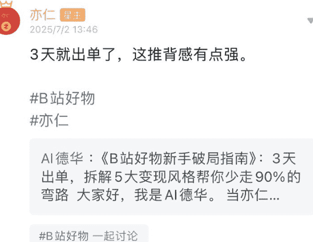

很开心收到了老大的关注~

关于实操过程中更多的细节正在完善，可以投个锚、收藏一下，疯狂码字中...

懒人专属群持续更新中，已持续运营6年，整理超3000份各类精选付费文章&年费社群干货，全部开放下载。

本资料为付费群内部分享，仅供真实有需要的朋友查阅

懒人专属群更新记录:
https://lazy2025.top/#/blog/record2

懒人专属群更新记录(需梯子,备用):
https://lazybook.fun/#/blog/record2