## 在B站教年轻人赚钱月入三万，从0成为数字游民，全流程底层逻辑分享

公众号懒人搜索，懒人专属群独享

懒人微信：lazyhelper


大家好，我是Luke林，真名叫林俊杰（不会唱歌），小挣青年主理人，客蜂咨询主理人，希望帮助千位伙伴成为新时代小挣青年。

在当前经济环境下面，市场是非常不稳定的，而基于市场的公司和岗位也就失去了稳定的一种说法，尽早开拓自己的第二收益来源和做副业也在这种情况下逐渐热门了起来。但随便在各个平台上搜索副业和搞钱相关的知识，多数都是已过时的信息源和卖课拉人头的割韭菜项目。

我在22年的时候开始尝试进行副业和各种小型项目，用了1年的时间成功的在3个月时间通过副业赚到了超过主业年薪2倍的收益，并且在当时成立了自己的一人公司。

今天想给大家分享一下，我是怎么样开始的，过程当中遇到了哪些问题，以及最后如何解决的。不论你是否有想要一人创业，还是想要主业中更好的去理解项目本质，希望这篇内容，能给到你一定的启发。

在分享之前，我还是详细的介绍一下自己，给后续的内容，做个简单的铺垫

大家好，我是林俊杰（真名就叫这个）

- 9 年互联网从业经验
- 前 Viral Access 主管
- 前小鹅通高级运营
- ICDA&国家认证高级设计师
- 客蜂咨询 CEO
- 小挣青年创始人
- 当前月营收自 23 年年底自主创业以来维持在 1-4 万，浮动较大，综合年收益不到 50 万，目前正在努力往 50 万突破；

我对我自己的定位就是：没有固定工作场所赚取生活收益的小挣青年。

公众号懒人搜索，懒人专属群分享

懒人微信：lazyhelper

3 / 38

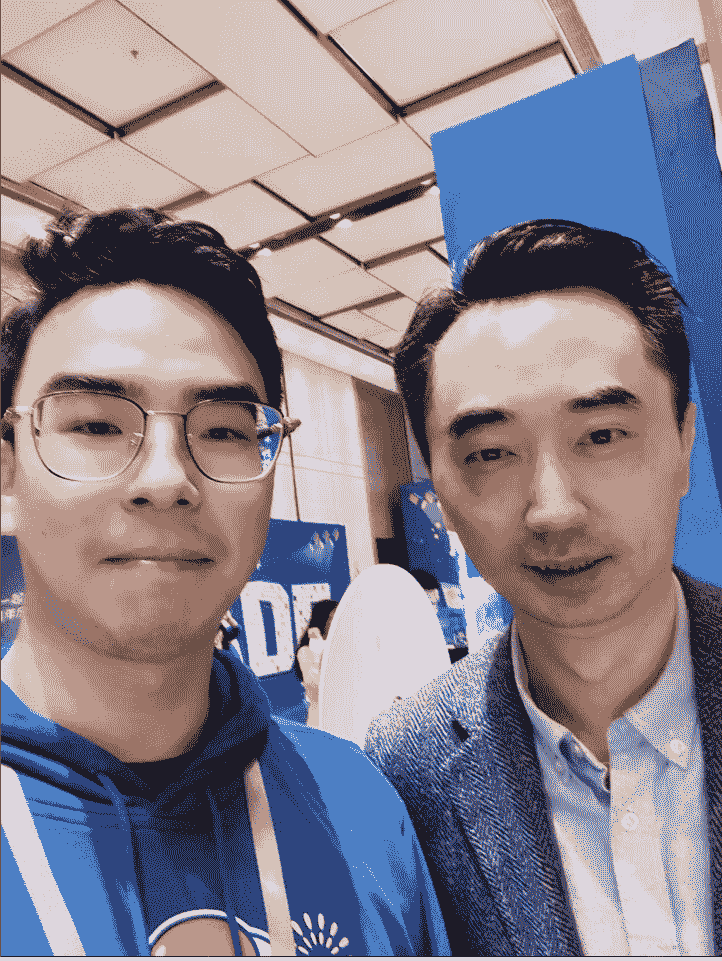


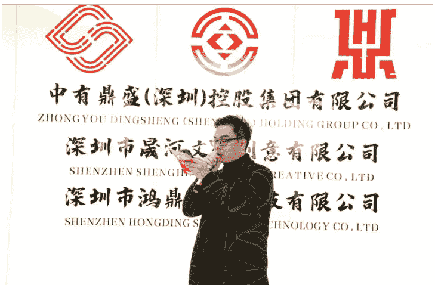

中有鼎盛(深圳)控股集团有限公司

ZHONGYOU DINGSHENG (SHENZHEN) HOLDING GROUP CO., LTD

深圳市晟河文化创意有限公司

SHENZHEN SHENGHE...CREATIVE CO., LTD

深圳市鸿鼎...技有限公司

SHENZHEN HONGDING...TECHNOLOGY CO., LTD


懒人微信：lazyhelper

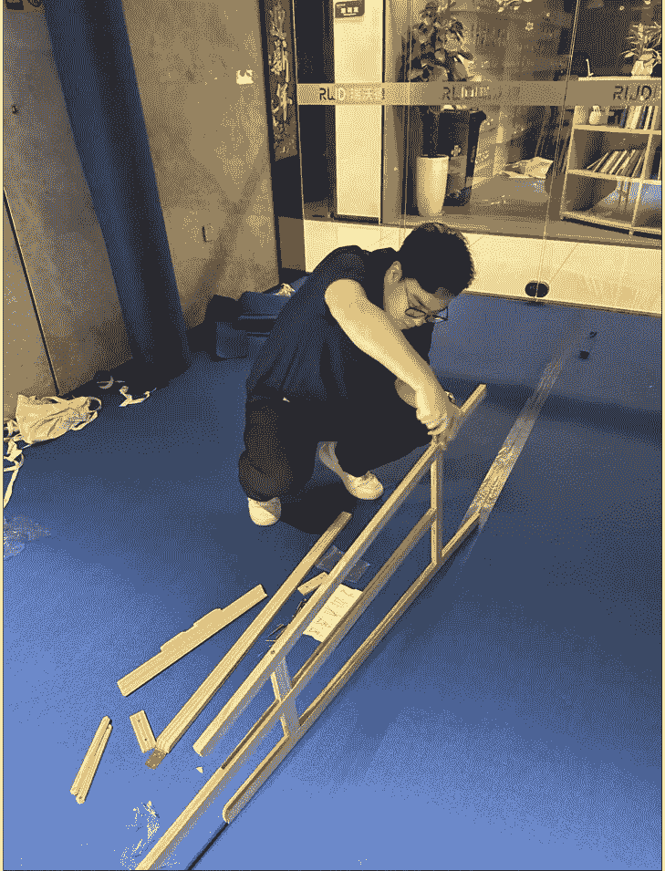


本寺历年来，常奉行此法，於农历七月初九日至十五日，延请十方大德僧众，启建盂兰盆法会七永日，日夜诵经礼忏。以增我等善根，以培安养福德。存殁自性二利，共承福乐无边。
佛云：未成佛道，先结人缘，欲结人缘，莫如法会。又云：法不虚起，仗境方生，道不虚行，遇缘即应。上供十方三宝，下应福德幢施。是以大家当发无上菩提道心，共成胜会。法会设功德成就若干位，如下：
大功德成就主功德金人民币叁仟元。二功德成就主功德金人民币贰仟元。三功德成就主功德金人民币壹仟元。超度牌位功德金人民币壹佰元。洞灾牌位功德金人民币伍拾元。法会期间晚上设置山焰口若干堂。大众可与常住咨询，方便常住安排。
阿弥陀佛！
以此修行孝道，报答父母养育之恩
存者福乐寿无穷，亡者离苦生安养
四恩三有诸含识，三途八难苦众生
俱蒙悔过洗瑕垢，尽出乾坤安养界

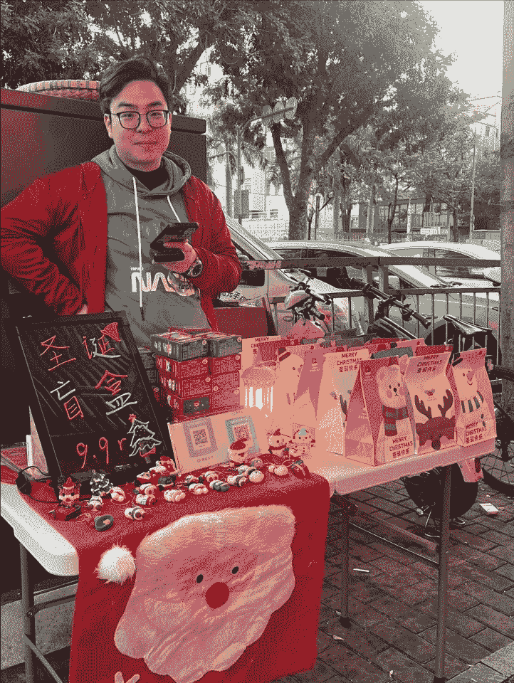


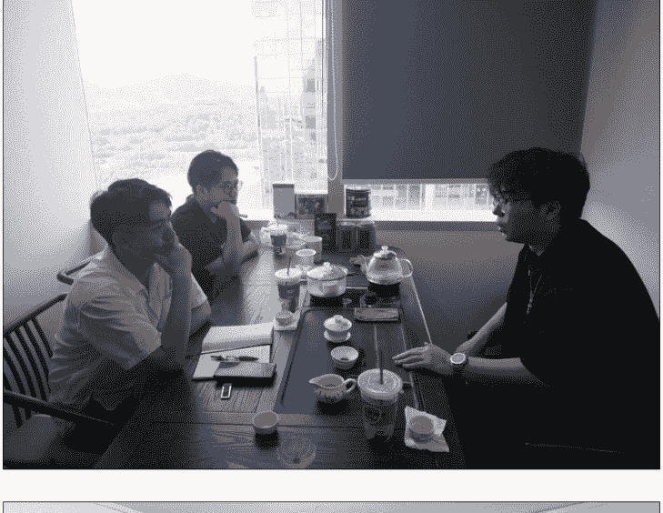

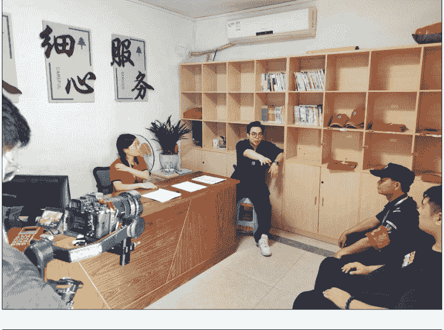

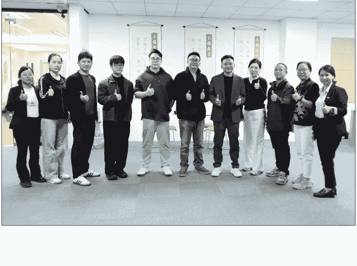

# 一、超级个体/数字游民/一人公司/创业型公司的真正核心是什么？

在开始说明链路和实际操作之前，我们要先对商业这件事有一个基本的了解和认识，很多人对商业这个词有点困惑，总觉得涉及的范围很大；但实际上，每一个创业项目/个体项目都有一个可以代入的清晰模型，基于个人对商业的理解，我们可以从钱的流动上面进行商业逻辑的拆解：

大体可以拆分成六个步骤：

- 这个赛道里有多少钱？
- 用什么去赚这个钱？
- 跟谁收这个钱？
- 怎么样更高效的去收钱？
- 怎么样收到更多的钱？
- 怎么样赚的更稳定？

这六个步骤基本上涵盖了赚钱的所有要素，并且这六个要素按照着顺序进行推演，一般情况下我们都需要从1→6这样的路径去思考和解决对应问题，我们就可以从这六个点里面，用常说的【价值体系】进行代入，就可以得到一个简版的商业模式路径，我把这六个点的组合，称为蜂房理论，是我司客蜂咨询的核心咨询理论：

- 【需求】这个赛道里有多少钱？
- 【产品/解决方案】用什么去赚这个钱？
- 【获客路径】跟谁收这个钱？
- 【运营方法】怎么样更高效的去收钱？
- 【增长路径】怎么样收到更多的钱？
- 【壁垒构造】怎么样赚的更稳定？

| 需求 | 产品or服务 | 获客 | 运营 | 增长 | 壁垒 |
|---|---|---|---|---|---|
| 钱在哪？有多少钱？ | 怎么赚这个钱？ | 找谁要？ | 怎么收钱？ | 怎么赚更多？ | 怎么赚的更稳定？ |

价值创造=需求×产品

价值传递=获客

价值交付=运营

价值放大=增长

价值保护=壁垒

# 二、如何开始？

懒人微信：lazyhelper

## 0-1 阶段：目标→验证

各位伙伴可以自己代入自己的目前阶段，跟着公式和思路进行自己项目或者业务的一步步拆解，相信你会在过程有所收获，按照上述的基本概念，我对创业和做项目进行了公式化的拆分：

0-1 阶段的核心目标：赚到钱=价值×交换 =（需求×产品）×（获客×转化）

在这一步里我们要验证的是，我们的项目能不能符合价值的基本交换原则

很多人赚不到钱，不是因为不够聪明，也不是执行力出了问题，更多时候是对赚钱这件事的理解出现了误差，赚到钱是一种具体的结果，这个结果需要我们具体完成的过程，太多人在付费购买一些信息或者去真的落地项目的时候没有意识到这一点，过分关注在结果而忽略了过程

价值交换=价值×交换

需求×产品=价值

获客×转化=交换

接下来我们开始说下，0-1 的核心路径【价值交换】我们在创业或者做项目的初期，经常听到很多人，一定要做好两个点：

### 真需求和好产品

这两个点本质反映的是价值的创造，对于任何一个项目和个体来说都最为关键，在做项目要花时间和精力最多的地方，也一定是这两个点，公式内的点都是以乘法相结合的，也就是指，在这个过程当中，任何一项数值若为0或者出现偏差，都会导致赚到钱的这个结果归零

#### 需求：

需求是价值的基础

> 一句话概括：“某个场景下的某个问题”

而拥有这个场景和问题的人，就是我们常说的目标人群。

如何发现需求？或者说找到一个需求，就是我们很多项目开始的必要条件，这里强烈推荐大家去看梁宁老师的书《真需求》，对需求和价值的阐述非常清晰明了，再此因为篇幅原因不过多延伸。我举一个我自己的例子：

在成立小挣青年之前，我一直在小鹅通从事着运营工作，我在22年开始筹备结婚的事项，最核心的一个关键就是【缺钱】，于是我自己就开始在网上找各种各样的副业学习和思考，但经过一段时间之后，我发现不论是很多所谓的教人做副业，或者一些已经公开的项目里面，都存在大量的问题，就是普遍不透露概率问题，只讲成功案例。

副业和赚钱项目，可以视为参与一场【概率游戏】这个游戏的胜率是随着你的手牌不断变化的，你的认知你的资源你的经验你的能力都会影响这个概率，而我们大部分人其实不缺乏找项目的能力，缺乏的是，究竟这个项目我去做到底能有多少成功的概率

当我意识到这一点的时候，我就发现了我自己的2个需求点：

- 如何快速分辨一个项目的可行性？
- 如何快速分析自己做这个项目的成功率？

当我发现这两个需求之后，我就下意识在互联网上寻找对应的答案，也就是对应这两个需求的【产品】，经过朋友介绍，我接触和学习了非常多大公司大厂和知名成功人士的各种创业课程，虽然这些课程里面的内容很干，但对于只是想做副业起步的我来说有点过于宏大了，商业模式和商业画布的拆解概论以及一些投资基本理念是我暂时不需要接触到的；于是我又重新开始去思考，市面上是否真实存在【教会一个人从零开始赚到钱】这样的产品？

#### 产品：

产品不单指实物类型的商品或者物品，一个问题的答案，一个复杂事件的解决方案也可以视为产品，产品是需求的响应载体，也就是价值的具体表现形式，价值的强度就取决于产品和需求的契合深度。

一句话概括：“你能解决某个问题到什么程度”

产品的设计和打磨，是最花功夫同时需要不断迭代的，但作为普通人，刚开始可以寻找靠谱的后端或者简单的初级产品入手，对于想做实体或者实物创业的伙伴来说，产品要考虑的因素一般有三类：

- 功能价值
- 情绪价值
- 资产价值

这边继续以我上面提到的需求为切入点，给大家举一个我自己真实的产品设计过程：

当我发现市面上我很难找到一个关于【教会一个人从零开始赚到钱】这样的产品时，引发我思考的就是，为什么会找不到？我在加入生财之前，因为在小鹅通的关系，很早就认识我们知名的圈友阿甜和自由职业人半窗老师，我向他们请教之后，归纳了自己总结的原因：

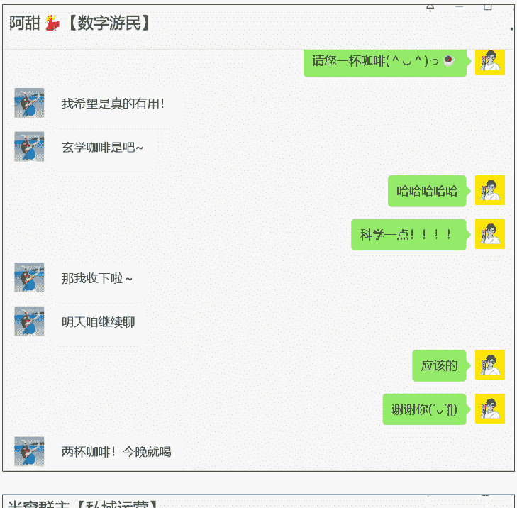

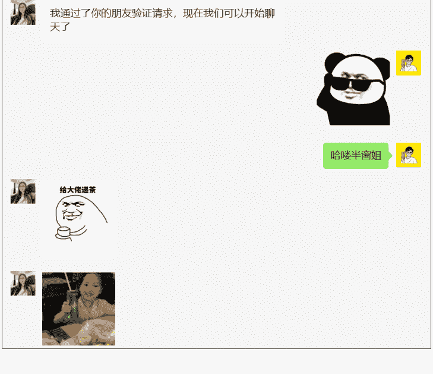

- 自主学习能力
- 自我秩序感建立
- 高效验证的能力

自主学习能力，并不是指我们平时要多热爱学习多爱看书，是我们要有意识的为了某个具体的目标去进行学习，高效的掌握其核心的本质方法。

在我接触到的大部分割韭菜课程当中，多数老师会将自我学习能力简化成抄袭和模仿，其本质是希望降低客户的理解成本，但核心的指向，其实就是自主学习能力，通过抄袭和模仿提炼出自己的方法论才是重点。

很多互联网项目其实都有【低门槛】的特点，低门槛并不是没有门槛，而是这类项目的学习成本并不高昂，同样低门槛的项目也会带有竞争快速蔓延造成内卷的特性。所以如果想成为自由职业或者说去做副业赚到钱，其要花费的学习成本是非常高的，而且极有可能在你刚学会，项目的红利期就快速衰退，这就要求自由职业者和创业者需要时刻有自主学习的能力，以应对当前市场变化之后，门槛提升竞争加剧的场面。

自我秩序感的建立，用通俗的话来说，叫做习惯，不论是加入生财之前，还是加入生财之后，我越来越发现，优秀的人和拿到大结果的人，他们有非常多优秀良好的习惯。这些习惯对于他们后续拿到结果有非常重大的指导意义。

在赚钱这个事情上面，习惯对我们的影响最为重大，他影响的是长期且稳定的执行能力。我自己在很多项目上面并不是没有拿到结果，而是我无法长期坚持；也就是秩序感的缺失。

这个问题相信很多朋友会和我一样遇到，当你通过低门槛快速的赚到了一些钱的时候，这些钱其实很难留的非常久远，又会让我们陷入新的赚钱追逐战之中，而如果你是在短时间内收到大量的现金流时，你下意识就会回到这种【短时间快速大量收益】的路径上，如果你曾经在做过的项目在获客或者转化上面有下降趋势，你就会感觉到非常的不舒服，而采用花钱上杠杆或者去寻找替代项目的这些解决方案。

而在这个过程当中的自我秩序感，并不是安于现状的意思，是能明确自己的成长价值大于项目的短期稳定，复利最有价值的永远是自身能力的增长而并非项目数据上的增减；这一点也和我们第一点自我学习能力息息相关，需要你掌握自主学习的能力不断的拓宽认知边界，利用这些认知来稳固自己的内核和边界，形成稳定的框架，带给你自我秩序感，我们才能不断在变化和跌宕的项目过程当中稳住脚跟。

最后是高效验证的能力，前面两个点，都和自我价值相关；而最后一个点，则涉及到对商业的基本认知相关，我发现我自己在做项目的时候，非常难以考虑到成本问题，不论是金钱成本还是时间成本，总觉得自己愿意做就一定会有好的结果；这样的思考后果就是让我花费了非常大量的时间在【试错】这件事情上；这让我开始去寻找和研究商业/项目/赚钱的基本本质，是否存在一种方法，能够让自己哪怕更换行业，更换领域，也能快速的摸清至少 70% 的项目关键，以便于应对不确定的风险，降低自己的试错成本？

为什么在产品阶段，要写这么多我的思考，是因为你在设计产品的时候，如果不深入的去对需求进行探索，那么你制作出来的产品很有可能对需求的契合度就存在偏差，而导致后续一系列的问题，为了节省我们后续试错成本，这一步非常有必要。

从上面三个点，我提炼出来了我最初级的产品设计思考：

需求：教会一个人从零开始赚到钱

产品：一套成为会赚钱的人的方法论

根据这样的脉络，我初步的设计产品就针对下面三个核心，出了三个课程

- 1、自主学习能力：【如何高效学习】
- 2、自我秩序感建立：【高效决策+习惯构建】
- 3、高效验证方法：【商业拆解方法】（也就是本文的核心内容）

我结合和各种大佬的沟通，自己的笔记，自己的感想，制作了3套对应的课程，同时快速的花了百十来块注册了简单著作权，接下来的目标，就是去尝试获取用户了

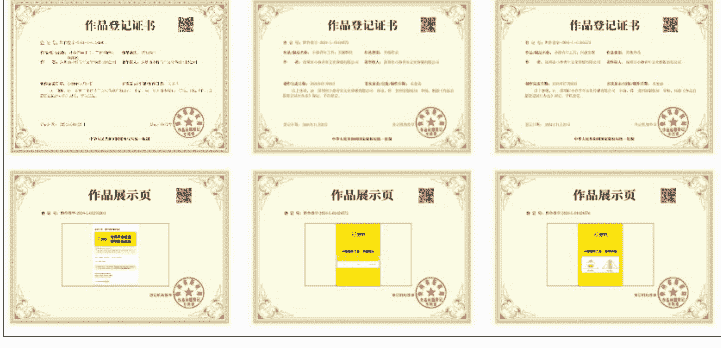

#### 获客：

获客的本质是内容能力，不论我们见到的传单，还是自媒体账号，还是直播等等诸多形式，它本质上要求我们的都是内容能力，只是内容形式上会存在着制作难度的不同，其本质并无差别，就是【吸引】和【筛选】；

但如果你不是营销专业出身，以自己的所思所想去进行内容制作，一定会存在一些偏差，这里所谓的偏差，就是指当前你的内容，是否能对【需求】分析出的目标用户，做到【吸引】和【筛选】的验证

理解本质之后，其实获客的动作就很好理解：

懒人微信：lazyhelper

根据获取用户场域不同,分为公域私域;
根据获客内容不同,可以分为文字/图片/图文/视频/直播几种形式,本质上我们需要在我们的内容里面去植入吸引点,设置筛选逻辑,这两者的综合产出为:选题,这里涉及到公域如何做选题,做内容,生财当中有非常多优秀的帖子,我就不单独说明了,仅从0-1的链路分享,我个人的建议是,需求和产品可以用最小成本验证,获客也同样可以。我们的微信中,本来同年龄段和同属性的朋友就会特别多,我们完全可以 从他们开始。

#### 运营 1：

运营这个动作,相对比较特殊,它不是一个具体的动作行为,而是一种思维方式;
比如我们18年在招聘软件上,运营代表的是新媒体运营,主要围绕做公众号,做抖音,做微博等等平台上面涉及的一系列品牌宣发或者获客拓展等进行工作,而20年开始,运营更多又偏向于直播运营,短视频运营等等;运营这个词,其实一直想代表的都是【效率】;让我们更高效的达成某个目的,就是运营的核心。

在0-1阶段里,运营的核心重点有且仅有一项:转化

这里很多人有一些负担，就认为自己的朋友圈用来做营销或者转化非常不好，怕自己讲的不好或者以前树立的形象改变了；
但如果从业务的角度来讲，我们获客阶段0-1的核心重点是：快速找到一批最容易感知产品价值，最愿意尝试你的产品，最能提供反馈的种子用户。

这类用户，一定是可以在你的朋友圈私域当中找到的。

如果你的产品或者项目无法在你的朋友圈当中找到任意一个实际的目标用户，可能你就需要反思一下是不是需求定的太偏了，或者这个需求不是“真需求”。

我个人在测试课程的阶段做法，是在微信当中找了25个人，邀请来试听我的3节课程内容，给出对应的反馈，同时请他们来进行定价，根据他们的反馈，制作出来后续的课程产品。

#### 我找的对象情况如下：

- 5个在读大学生
- 5个工作3-4年的职场新人
- 5个工作10年32岁以上的职场人
- 5个创业者，含实体/互联网/直播电商
- 5个自由人，家里有产业不需要上班的本地收租人

根据他们的反馈内容，以及对课程的实践和后续是否真的会执行的评估，我判断出来我的课程吸引程度排序为：职场新人＞职场人＞大学生＞创业者＞收租人

从交付的价值来看，23 人均给出 90 分的满意分值，2 个人给出帮助不大的评分，2 个给出帮助不大的均为收租自由人。

从他们说的价格来看，我是要求他们写出真实的自己愿意付费的价格，并且在听完之后把这个钱交给我收到为准，25 个人收了共 1200 元，平均价格为 48 元，而经过我个人的思考，我决定设置为 9.9 元并且后端设置一个千元社群作为高客单的转化路径，这个社群主要目的就是一个督促和打卡，同时能够获得我个人的咨询答疑，没有太多其他交付内容。

也就是在这一点开始，我的 0-1 阶段基本已经全部跑通了，我通过一个需求，设计了一款解决方案，进行了私域中的快速获客，形成了转化。

于是我就开始放开手脚，去尝试 1-10 的阶段

## 1-10阶段：目标→运营增长

拿到最初级的结果之后，我开始围绕职场新人为我的核心目标客户群体，去制作选题制作内容，我的选题内容逻辑也很简单，既然我要去教别人赚钱，那么我的案例最好就是我自己，我自己在23年的创业路径可以作为我开始的内容，但作为在公域上面完全没有露过面的人，我想去做的破冰就需要有点力度，于是我参考富豪谷底求翻身这一期节目，设置了我自己的第一个主题视频：

### 普通人如何七天赚到一万元

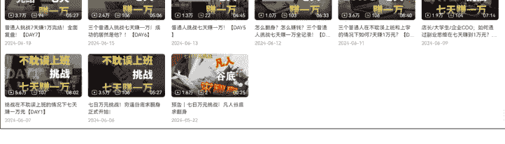

这个系列在B站发布之后，我收获了3万粉丝，我的【筛选】，就在于标题的【普通人做副业】，暗示了当前看视频的人需要有主业，同时我利用在七天的赚钱步骤作为内容的【吸引】钩子，让他们添加我的微信，便于我去执行下一个步骤。

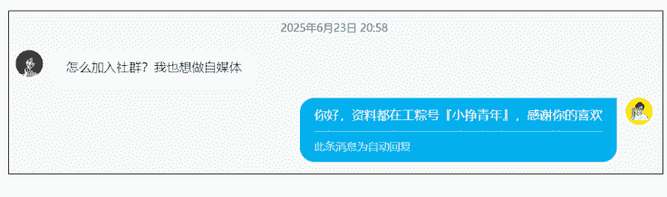

懒人微信：lazyhelper

我在一个月的时间内，公众号涨到了 8000 粉丝，加到我微信当中，有 5000 人，创建了 11 个群来进行人群的管理，而当这个社群创建之后，我也开始了我的运营。

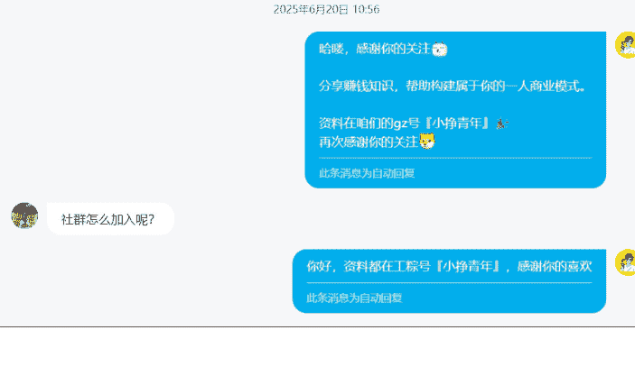

- 副业9群
- 副业1群
- 副业10群
- 副业3群
- 副业11群

## 运营 2：
1-10 的运营核心，在于交付动作和转化动作的标准化，也就是对【转化】和【交付】的效率提升。

当我们拥有了流量进入，第一时间要思考的，就是落袋为安，将钱收到。这里我们在开始的时候，都可以使用自己的微信和支付宝进行收款，但我自己出现了一个实际问题，是我收钱收到 5 万的时候，有警察上门进行联系，主要是看自己在做什么业务，流水为什么突然之间不正常。

> 懒人微信：lazyhelper

所以如果涉及到大批量收款，或者长线去做某个业务，还是非常建议大家注册一个自己的公司。现在注册公司也不麻烦，在生财当中也有非常多的优秀的精华帖，可以借鉴。

以上面的案例继续，我在这个阶段执行的运营动作：【转化】和【运营】

### 客户路径：
- 看到视频
- 关注公众号
- 添加我的微信
- 加入免费群获取资料和课程介绍
- 客户感兴趣付费
- 拉上课群

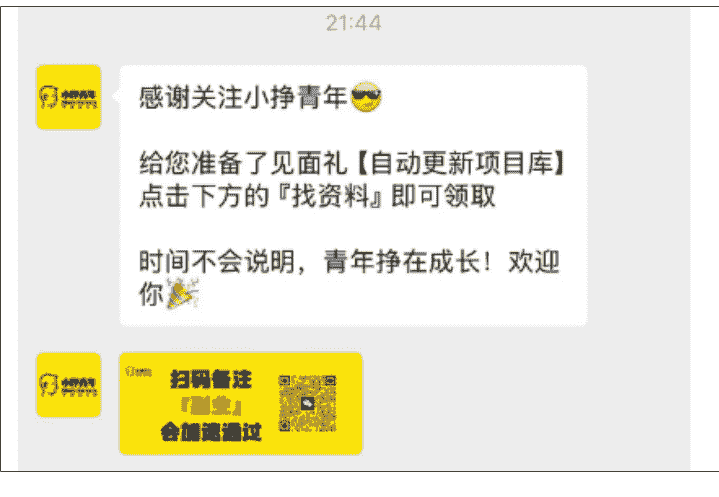

当加我的人超过了 500 人的时候，我就开始感觉到有点交付吃力了。我是将话术和网盘资料存在收藏夹里，加了一个我就发一个，但遇到集中添加的时段的时候，我需要花一个多小时一个个回复客户，非常低效。所以经过评估，我花了 12800 购买了小鹅通，用小鹅通作为主要收款和交付的场所。这里购买，是因为我的收款已经足够覆盖这个付出的成本，也建议各位在给自己花钱上工具的时候，评估好自己的成本和收益，如果 ROI 不是 1，那就深思一下是否真的值得，是否有其他替代。

## 在购买小鹅通之后，我的交付路径就非常顺畅了
- 看到视频
- 关注公众号
- 添加我的微信
- 获取资料和课程介绍
- 客户感兴趣付费
- 拉上课群

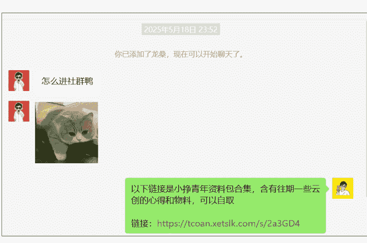

以下链接是小挣青年资料包合集，含有往期一些云创的心得和物料，可以自取。
链接：https://tcoan.xetslk.com/s/2a3GD4

## 在24年的6月开始的这个路径尝试，于8月份正式的开始课程交付，在9月份的收益就突破了10万，25年达到了20万

| 指标 | 数值 |
|---|---|
| **更新时间** | 2024-09-23 19:37:30 |
| 今日店铺访客数 | 266 |
| 今日新增用户 | 9 |
| 今日支付金额(元) | 0.30 |
| 累计支付人数 | 1,173 |
| 累计用户 | 3,496 |
| 累计支付金额(元) | 100,263.23 |

| 指标 | 数值 |
|---|---|
| **更新时间** | 2024-10-28 18:09:40 |
| 今日店铺访客数 | 432 |
| 今日新增用户 | 17 |
| 今日支付金额(元) | 39.60 |
| 累计支付人数 | 1,639 |
| 累计用户 | 4,501 |
| 累计支付金额(元) | 123,967.43 |

| 指标 | 数值 |
|---|---|
| **更新时间** | 2024-11-25 20:23:00 |
| 今日店铺访客数 | 387 |
| 今日新增用户 | 27 |
| 今日支付金额(元) | 39.60 |
| 累计支付人数 | 1,865 |
| 累计用户 | 5,366 |
| 累计支付金额(元) | 149,487.23 |

| 指标 | 数值 |
|---|---|
| **更新时间** | 2025-01-23 22:03:16 |
| 今日店铺访客数 | 556 |
| 今日新增用户 | 14 |
| 今日支付金额(元) | 1,960.00 |
| 累计支付人数 | 2,052 |
| 累计用户 | 6,092 |
| 累计支付金额(元) | 194,983.23 |

到这一步，其实我的 0-1 阶段就已经完成了。我测试了需求是否真实存在，产品是否能真实解决问题，是否能够生产能获客的内容，是否能高效转化和交付。

而在这个时候，我就开始思考，如何赚取更多的收益，我的增长机会在哪里？

这个阶段的公式：增长 = 赚到钱 × 杠杆

增长是很多人关注的点，其实包括我现在也还在研究关于增长的核心问题。我试了非常多的方法，也花了非常多的钱，踩了许多的坑，这里简要说一下我个人的一些经验，仅作为分享，不作为指南。

要理解杠杆，大部分人会卡在无从下手而导致盲目的投入成本，这里我们需要对杠杆有一个基本的概念：LTV/CAC。

LTV：Life Time Value 的缩写，用户的终身价值，即用户在产品内贡献的总的价值，一般用人均值。

CAC：Customer Acquisition Cost 的缩写，即单个用户的获取成本。也就是市场总花费 / 同时期新增用户数。

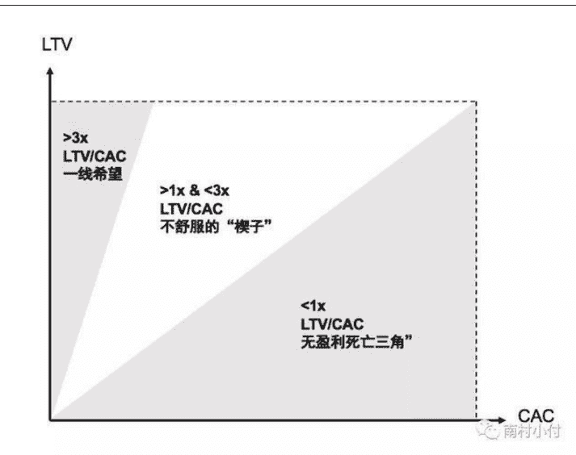

LTV 的计算方法为：

其中 LT 为用户的平均生命周期，ARPU (Average Revenue Per User) 为用户在平均生命周期中的平均收入。

计算 LT 是比较复杂的，特别是短期的一些情况，只能完全靠预估，没法准确计算清楚。按照定义，用户的平均生命周期，推出 LT 的表达式：假设新增一批用户 A，用户在后面第 n 天的留存用户数为 A(n)，则这批用户总的生命周期为：

```
LT = LT_all / A = 1 + A(1)/A + ... + A(n)/A
```

我们可以知道留存用户数除以新增用户数，即是留存：

```
R(n) = A(n) / A
```

R(n) 表示第 n 天的留存率。

因此我们知道用户平均生命周期为：

```
LT = 1 + ∑_{i=1}^{n} R(i)
```

这个公式对于我们创业和做项目有非常重大的理解作用，LTV/CAC 得来的比值，就和 ROI 公式一样重要。

用简单的话来说：

LTV/CAC = 用户一辈子给你赚的钱 ÷ 拉他进来的成本

健康标准：
- > 3 倍（花 1 元拉人，能赚回 3 元）
- < 1：每拉一单亏一单（商业模式崩塌）
- 1~3：勉强存活（增长受限）
- > 3：可持续增长（有利润投入再生产）

以上公式看不懂没有太多关系，这里只给感兴趣和正在创业的朋友做一个延伸。用我们简单的话来讲，增长的关键点只有两个：

1. 提升用户在生命周期当中产出的价值
2. 降低获取用户的成本

这两点，可以延伸出四个方法，对应着我们公式当中的四个关键点：

## 增长：

提升用户在生命周期当中产出的价值：
- 更高的客单价
- 更低的交付成本

降低获取用户的成本：
- 更高效的获客速度
- 更高的用户转化率

## 10-100阶段：目标→统治

每个人的业务流程不一样，但增长的基本逻辑是一致的。当你想要对业务进行增长的过程当中进行验证，可以针对以上四个点。其中不太建议一开始就上来提升用户在生命周期当中产出的价值，更多先从自己的业务流上，去进行降低用户的获取成本开始，避免影响已跑通的业务流。

我们常说的 AI 工具，实际上对我们最大的帮助就在提效这一个环节。在当前我们的很多业务流当中，都可以使用 AI 去进行提效，这里主要的提效就是针对降低用户的获取成本进行提效的一个环节。你的内容产出速度上去了，你的获客效率就变高了。所以基于上面四个点，大家可以去寻找适合自己的方法进行延伸，比如老带新、直播获客、投放获客等等。

在最后，我个人也谈谈我对壁垒的理解。虽然我个人还没有到成功创业塑造壁垒这个阶段，但我认为壁垒是通向百万的钥匙。所以也想在这个阶段写下我对壁垒的理解，当我真的走到百万级的时候，回来验证自己的思路是否一致。

为什么用统治来说明？当一个个人公司和数字游民的体量达到百万时，我们关注的核心重点就是如何防止利润被侵蚀并持续捕获价值？那这个阶段，就涉及到了壁垒。

## 壁垒：

很多人常说的护城河，其实和壁垒就是一个意思。壁垒的构建有非常多复杂的因素，其中传统企业的壁垒塑造多数来源于供应链的整合以及对定价权的垄断。而根据壁垒特征的不同，壁垒的体现形式也有所不同，我们常见常谈的企业一般都有以下几种壁垒形式：

- 技术壁垒：华为云、大疆
- 规模壁垒：微信
- 品牌壁垒：茅台
- 转换成本壁垒：苹果（IOS 用户转换去安卓的成本）
- 资源垄断壁垒：稀土集团、迪士尼
- 生态协同壁垒：美团、亚马逊
- 组织效能壁垒：字节跳动
- 生态壁垒：生财有术、B 站

......

比如我们以生财有术为例，生财有术的真正壁垒和护城河是什么？

**内容壁垒：** 不可复制的实战资料库。独一无二的精华机制，海量的沉淀，接近万篇的实战赚钱案例和项目库。航海计划能快速产出上百篇的迭代资料，案例时效性极强。

**体系设计：** 高价值人群的绑定。

这一点我太深刻了，当前 AI 出海的教练 Gary 老师就是我亲眼见证的高价值人才之一，目前已经和生财有高度的合作绑定了龙珠激励体系，大家对龙珠的价值共识十分认可，龙珠的市场价值在万元以上。

- 传术师体系，聚集了几百名实战派的高手，形成了资源垄断的圈子。
- 精准的分层筛选，通过高门槛的入圈定价 + 阶梯涨价的策略过滤低意愿用户，留存高净值高执行力人群。

除此之外，还有生财的运营机制，用用户产生出具体内容的圈子，用风险兜底的无理由退款降低决策门槛等等。生财的核心壁垒并不是由单一或者单个体系构建的，真正厉害的地方在于它创造了一个高纯度的搞钱生态圈。

之所以生财有术难以复制，敢收高价 + 敢分利益 + 敢晒干货这样的核心链路，每一个都不是随便一个人来能搭建出来的。

但你说生财有术已经拥有壁垒的情况下，是否会存在其他的问题？我个人觉得是会有的，因为开篇也提到了，市场在变化，公司和岗位也不存在稳定。因为当前的市场环境波动，造成了越来越多的人对搞钱带给自己安全感的诉求，对于生财有术来说，当前的环境无疑增加了自己潜在客户的数量，是一个非常大的机会点。

至于挑战点，则在于因为这样环境变化而导致焦虑的人群也会加入到生财当中。这部分人群可能会存在【焦虑驱动】→【焦虑尝试】→【短期无结果放弃】这样的恶性循环而导致生态活跃两极分化。

在这一点上，生财的解决方法是通过航海去进行认知和共识的建立。单单评价生财的航海质量，毋容置疑代表着搞钱副业赛道里的绝对头部。对于这部分焦虑的人，我个人是没有什么太多建议的。任何项目和业务想要做好的前提都是自己的心态本身需要足够的稳定，如果你一头雾水，茫然无措，那不妨收拾好心情，选择一个航海加入，从最基本的先开始，锻炼自己的执行和认知。加油！

在这里也非常高兴自己加入了生财，见识了很多厉害的人，有趣的事。希望在这一年里，和各位一起，生财有术。

# 三、额外工具

围绕六个核心的维度：需求，产品，获客，运营，增长，壁垒，可以制作成一个雷达图。这个雷达图更多建议是在已经跑通 0-1 或者确实对自己业务路径比较自信的人使用，这里面的一些评分维度我也写在了表格后面。

这个雷达图的核心作用在于，当你使用具体的方法去分析和按照评分维度去操作，你可以快速明确自己的当前业务风险在哪里，以便于自己去做出优化，以及作为判断是否要放弃业务的依据。

# 四、全文总结（省流版本）

成为数字游民 / 做项目 / 创业的核心离不开六个要素：
- 需求 → 产品 → 获客 → 运营 → 增长 → 壁垒

需要严格按照路径一个个进行验证成功。

## 0-1 阶段（万元）：
核心验证：需求 → 产品 → 获客 → 运营
**只要验证成功，就能赚到钱**

## 1-10 阶段（十万）：
核心验证：如何有效利用杠杆

杠杆可以分成两点，四个方法：
提升用户在生命周期当中产出的价值：
- 更高的客单价
- 更低的交付成本

降低获取用户的成本：
- 更高效的获客速度
- 更高的用户转化率

## 10-100 阶段（百万以上）：
核心验证：如何塑造壁垒

壁垒的本质是“可控的不公平”，通过技术、网络、数据或生态构建对手难以复制的商业模式。

同时，真正可持续的护城河往往是多重壁垒的叠加，比如生财有术、特斯拉这样的企业等。


📚 懒人专属群持续更新中，已持续运营 6 年，整理超 3000 份各类精选付费文章 & 年费社群干货，全部开放下载。

本资料为付费群内部分享，仅供真实有需要的朋友查阅 🙅‍♂️

懒人专属群更新记录：
https://lazy2025.top/#/blog/record2

懒人专属群更新记录（需梯子，备用）：
https://lazybook.fun/#/blog/record2