# 普通人做小红书电商的可行路径：从0到1的实战经验分享

250702  生财精华

公众号懒人搜索，懒人专属群独享

懒人微信：lazyhelper

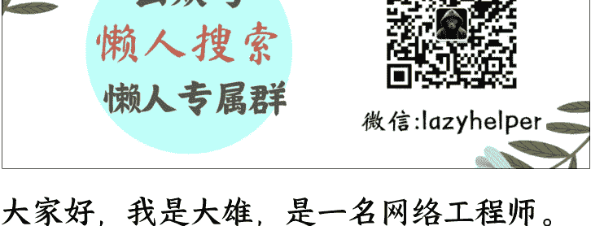

大家好，我是大雄，是一名网络工程师。

我其实是在去年 8 月就开始了自己的小红书电商之旅，跑通了 0-1。

到现在月 GMV 可以稳定在 10W+，直到上个月突破了 20W+，利润 40%，目前为止通过小红书电商变现 40W+。

接下来，我会分享作为一个普通打工人在寻找副业的一些经历，以及我小红书电商拿到结果的经验，分享给和我处在同一阶段的圈友们，希望能对大家有所帮助。

（利润 40%）

# 一、引言：人生没有白走的路

很早就听过"赚钱的本质是信息差"这句话，但一直苦于没有好的信息渠道。今年 3 月偶然看到一篇生财有术的精华帖，讲普通人如何靠副业赚第一桶金，当时就心动了。

刚刚进圈的时候，和很多圈友的感觉一样，就像刘姥姥进了大观园，打开了新世界，时常会感慨：“卧槽，这也能赚到钱？？”。

说说我的经历吧。18 年毕业在深圳做网络相关工作，月薪 5K 勉强糊口。那时候只知道靠考证涨薪，就考了 HCIE/RHCE 这些证书，虽然锻炼了学习能力，但收入提升有限。

后面我还尝试过做技术自媒体：

懒人微信：lazyhelper

在知乎、CSDN 写技术文章，但因为写作水平一般又缺乏正反馈，坚持不下去。

做过资源分享型公众号，靠分享小工具/破解软件/电子书/IT 类视频吸粉。

为了引流还开了小红书账号，有篇分享资源的笔记爆了，一周涨粉 1k+。

可惜笔记被举报，账号限流后，以为账号废了就直接注销了（现在想想太冲动！白白浪费了一个做虚拟资料的优质账号）。

公众号现在 2k 粉，流量主月入 4 分钱...已放弃。

## 现在回头看真是错过好多机会：
- 当时不懂虚拟资料可以直接变现
- 要是没注销小红书账号，赶上平台推电商的时候直接转型卖虚拟资料的话，说不定能吃上第一波红利
- 虽然没有成功，但走过的每一步都在悄悄攒经验，说不定哪天就用上了

这段经历总结起来就是，用心做一件事情，哪怕漂亮的失败，也是一种成功。厚积薄发，你走的每一步都算数。

还有就是信息差真的很重要，你永远无法赚到认知以外的钱，所以我后面接触到了小红书电商，并光着脚就下场直接干了。

# 二、小红书电商之路

## 探索期：偶然入局小红书

在经历了公众号0变现的教训、缺乏商业思维的真实案例后，我还是不甘于现状。我在上班摸鱼的时候经常搜索作为一个普通人还有什么副业机会。

在加入生财之前，我接触这些信息更多的是在抖音和知乎，当时抖音和小红书都在部署自己的电商板块。而我因为看了一篇讲无货源代发的文章就直接开始了自己的电商之路，选择小红书的原因是之前做资源分享对小红书平台有了一定的了解。

## 从零开始的起号攻略
- （1）设备准备：专用手机+副卡
- （2）养号技巧：三天精准互动养号法
- （3）流量测试：发布类目相关测试笔记，24小时200+阅读为合格标准

很快我想好了自己要卖的类目，准备了一个以前淘汰的旧手机和一张副卡，注册了自己的账号。每天一闲下来我就刷小红书，所谓的活跃账号，遇到和自己类目相关的笔记就偶尔点一下赞添加一下收藏，让平台知道我的喜好。

在之后便会给我推荐相同类型的笔记，这个步骤我当时持续了三天，在第三天的时候我发布了和自己类目相关的测试笔记。比如你是做饰品手串的你就可以发下面这种测试流量的笔记

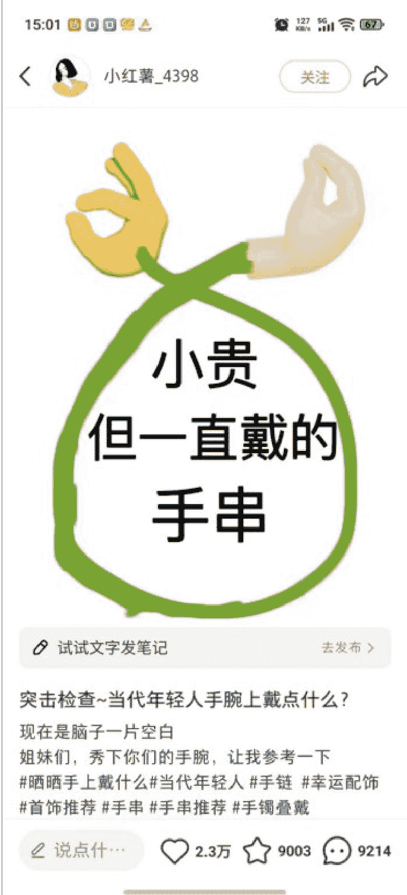

## 叠戴 ??

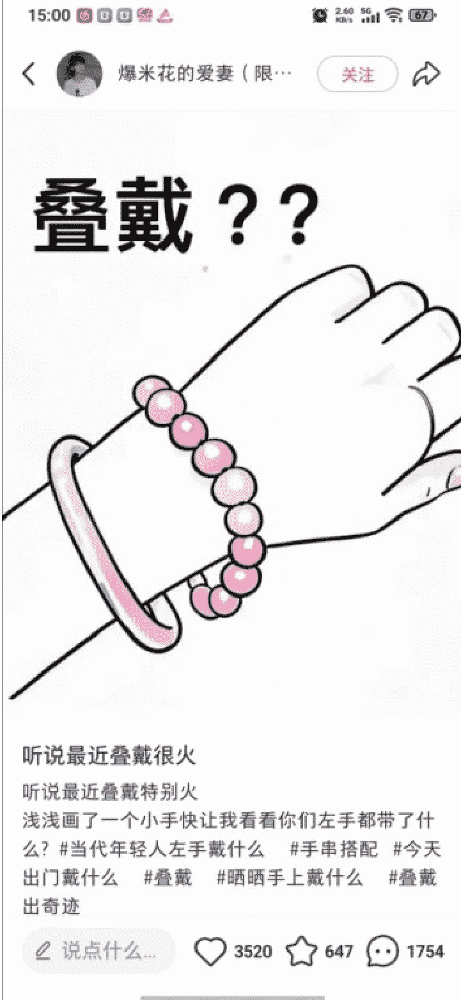

听说最近叠戴很火
听说最近叠戴特别火
浅浅画了一个小手快让我看看你们左手都带了什么？#当代年轻人左手戴什么 #手串搭配 #今天出门戴什么 #叠戴 #晒晒手上戴什么 #叠戴出奇迹

又或者是你是做家居日用品的你可以发下面这种，其他品类也类似。小红书的用户还是很乐意分享的，这样你吸引过来的用户也相对是精准的，和本次航海教练教的测试方法一样。

想买枕头，
搜了一下午，
全是广告。
Nooo...

颈椎一直都不好，需要每周去按摩的那种。高也不行，矮也不行。选个枕头选得头都大了。

为了自己的睡眠质量，我得一个个试，直到找到适合自己的，我试过的会写到置顶评论及其回复

## 颈椎病医生说
## 换个枕头吧

终于知道睡觉老是脖子痛的原因了...

脖子疼了很久了，前几天实在耐不住去看了老中医，确定了是颈椎反弓！医生说造成的原因是长期枕太高的枕头+低头玩手机造成了颈椎错位，建议换个合适的枕头还得注意生活习惯，后续是约了定期理疗加颈椎贴 听了医生的建议

这种类型的笔记一般都会吸引很多人来评论，笔记互动数据会好很多，如果发了测试笔记流量没有问题，24小时超过200都ok，那么你就可以开始注册你的店铺了，这里不过多阐述。

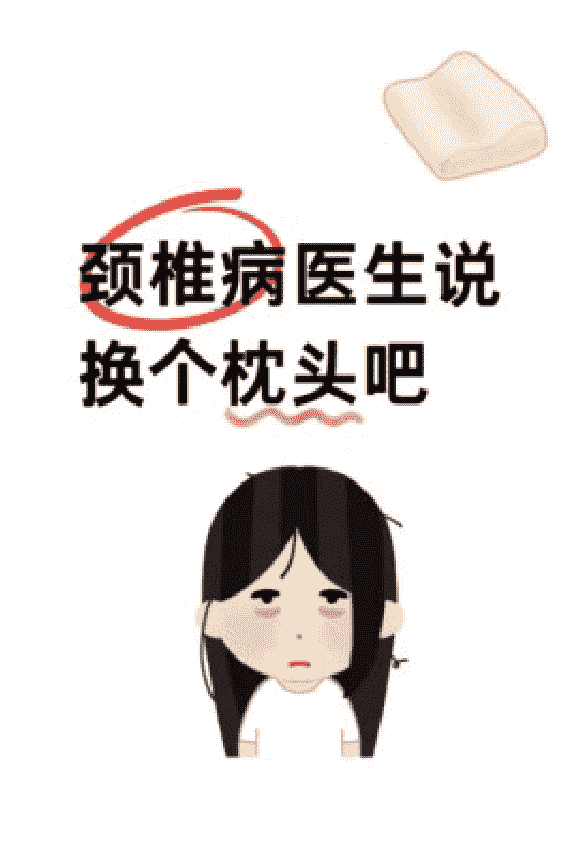

（测试效果不好大概率可能是封面和内容选的不好，可以直接1：1模仿你刷到的测试浏览的笔记进行发布）

顺便提一下我们发布测试笔记的目的是为了测试我们的账号是否有问题，是不是违规号之类的，因为每一个新账号的权重可能都是不一样的，如果你测试的新号权重高，那么也会增加你成功的概率。

# 选品方法论：站内选品法
- （1）核心公式：低粉账号(≤3000)+近期爆文(1月内)+高互动评论区=潜力爆品
- （2）实操案例：通过系统推荐发现低粉爆款笔记，分析评论区求购需求快速跟进上架。

在确定好了自己想做的类目和开好店铺之后，就可以选品了。都说电商的核心就是选品，选品定生死，可想而知他的重要性。我自己一路走来都只用了这一种选品方式，那就是小红书站内选品。

那么什么是站内选品呢？大概意思就是粉丝只有几千甚至几百的账号在近一个月内发布的一个产品笔记。然后这个笔记的收藏点赞评论数量都很多，特别是评论区一堆用户在评论求链接/怎么买，这种就是当下有热度并且有需求的产品。

如果你找到了这个产品的货源上架进行售卖，跟着对标账号同步操作那么你很大的可能也会拿到结果。我认为对于新手来说这种方式是最容易拿到结果的，包括我这次参加的航海《小红书电商-蓝海实拍》，手册里也介绍了这种方式，说明我之前的方法是经过验证可以拿到结果的。

下面我将结合自己的实操经验介绍一下这个选品方式。在确定好自己的类目之后，开店前的养号行为，系统会不断的给你推荐相同类型的笔记。比如拿之前说的家居日用品和水晶手串举例子，然后你就会很容易刷到一些近期的低粉爆文，如下图

## 压力大失眠俩星期...直到遇见这个...！！

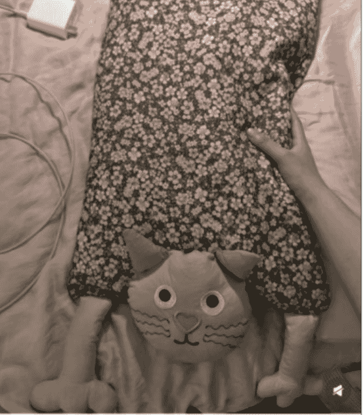

小猫造型枕头，躺下就像被猫猫抱住脑袋，安全感拉满！绝了绝了！
相关搜索·喵喵枕头
06-17 江苏
说点什么...

20:42
Tired
Tired 作者
在这里哦 全棉荞麦护颈枕
6天前 江苏 回复
置顶评论
2
Tired 作者
猜猜这个小枕头多少
7天前 江苏 回复
1
Tsukimi
蹲
7天前 广东 回复
1
展开6条回复
拾柒
有链接吗
6天前 江西 回复
旦旦很惜命
新品5折，可爱猫咪儿童枕头护 这个有尾巴
2天前 广东 回复
展开1条回复
一只胖崽（孕期版）
哇 好大一只猫
昨天 16:57 湖北 回复
1
系
@圆大雁 喜欢这个~
5天前 湖北 回复
圆大雁
这个没labubu好看
5天前 湖北 回复
说点什么...
2395
458
76

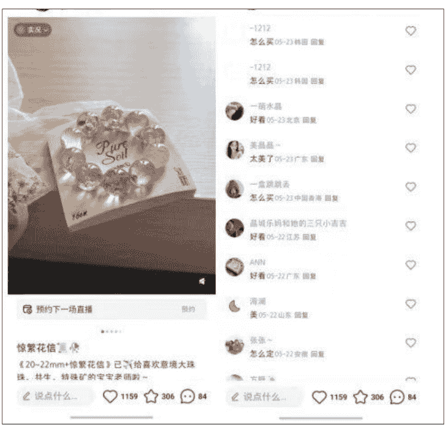

当你找到类似的品后，当然要判断一下操作起来的难易程度确定自己能不能跟。比如说最近很火的水晶手串，但是它需要的知识储备可能比较多，你得懂水晶懂玄学，他不是简单的卖产品还卖情绪价值，因为它每一串水晶可能都不一样，成本还高，可能更适合直播展示。所以像是这种品，我认为对于新手来说是不友好的，建议还是选择比较容易实拍的产品。

在确定自己可以做的品之后，这里以枕头为例，你可以把刷到的爆款笔记的图片保存下来。然后去1688以图搜款，你会找到很多有这个货源的商家，1688上面其实也有很多二道贩子，我们要注意区分。

可以尽量选择带牛头标志的实力商家或者是带有超级工厂标志的商家，这类商家一般货源比较稳定。

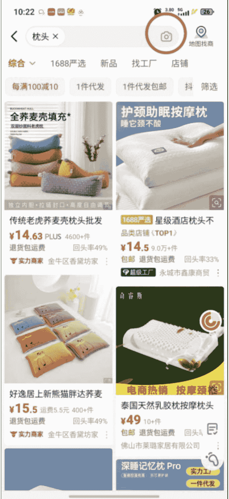

懒人微信：lazyhelper

而我也正是通过站内选品的方式找到了自己的第一个产品。前期没有自己的图片素材，我们可以先使用你刷到的爆款笔记的素材，再结合商家的商品详情页的图片素材，上架商品，上架后进行商品笔记的发布，在 2 周后出了第一单。

在短时间内拿到了正反馈后，你会更有动力坚持下去。

## 内容运营三步法
- （1）冷启动：使用工具提取对标素材进行二次创作

完成选品之后，我们就可以测试产品笔记数据了。因为刚刚开始我们并没有自己的实拍素材，我们可以先用软件工具或者是 coze 搭建智能体通过工作流提取原博主的素材，进行二次创作。1:1 模仿其笔记进行发布，如果流量正常你就可以正常上架，发商品笔记即可。顺便提一下 coze 智能体，他可以提升我们的工作效率，再也不用为了文案焦头烂额。比如通过它可以实现直接复制小红书笔记链接，然后调用相关插件根据你的输入获取笔记原文内容，包括图片素材。再通过调用 DeepSeek 这类大模型对笔记内容进行改写，然后输出你想要的改写文案，自媒体人一定要掌握这类技能！

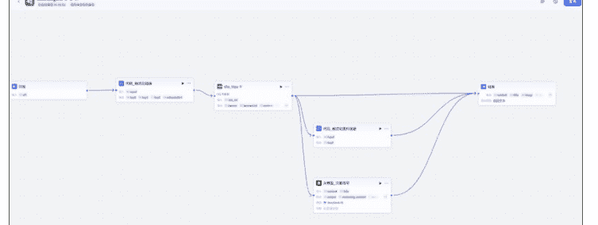

- （2）样品实拍：小号自购→厂家发货→实拍素材→自刷好评

商品完成上架之后，然后你就可以用小号在自己的店铺拍一单，然后去源头厂家那里让给你发一份样品，等厂家给你单号之后，在小红书平台给自己发货。这样你收到样品之后可以进行实拍并且给自己好评晒图，一举两得。

- （3）文案优化：利用 AI 工具改写爆款文案（附 DeepSeek 改写提示词模板）

收到样品之后，我们就可以像素级模仿你的对标账号进行笔记的发布，包括素材的拍摄角度，笔记的标题和内容。内容可以让 deep seek 帮你改写，我改写别人的文案一般会用这种 DeepSeek 改写文案提示词：“作为小红书内容运营高手，请帮我模仿这篇小红书笔记，不改变原文意思、风格，保留其表情风格，重新写 5 篇符合小红书女大学生、都市打工人人群调性的爆款笔记”。当然你可以根据你的类目笔记的风格对提示词进行修改。我是觉得他改写生成的文案会比我自己的写的好很多。

懒人微信：lazyhelper

## 出单后人为干预进行放大

在产品出单后，可以找身边的朋友进行好评，晒图发晒单笔记，这点对转化很重要，可以不多但得有。还有就是可以改链接显示的销量，让数据看起来好看一些，你可以找小号对你的商品进行加购，然后付款，第二天再进行退款即可，这样商品链接就会显示销量。

如果你的订单稳定了，你想增加你产品的曝光度，增加你的销量，你可以通过以下几种方式进行尝试：

- （1）评论区互动引导：流量好的笔记模仿同行进行评论区干预，引导用户评论，增加笔记评分，像是之前很火的“惊喜盒子”，或者类似这种评论；
> 新品活动(评论区打出“新品上新”我们抽5个姐妹安排该商品!!!评论3次几率最大哦

- （2）素人账号合作(低成本试错)：找素人账号，让他们给你发笔记增加曝光度，但是这种账号一般不垂直，比较难出结果，运气成分比较大；

- （3）小博主置换合作(实测最有效)：也可以找那种几百一千的小博主进行置换(让他们在你店铺下单，然后你把样品发给他们，他们收到后帮忙好评，发晒单笔记)这种方法我一直在用效果很不错，我有一条晒单笔记那个博主发布之后达到了千赞，对你来说是稳赚不亏的；下面贴图举例一下沟通话术

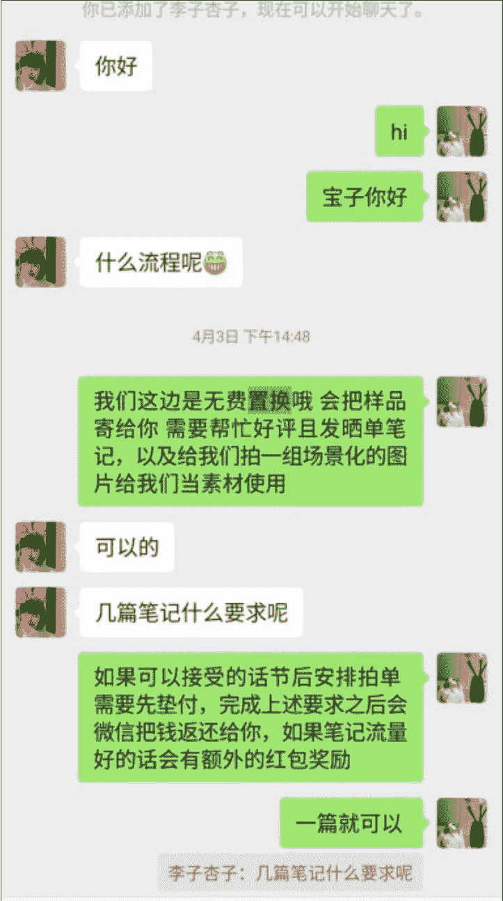

公众号懒人搜索，懒人专属群分享

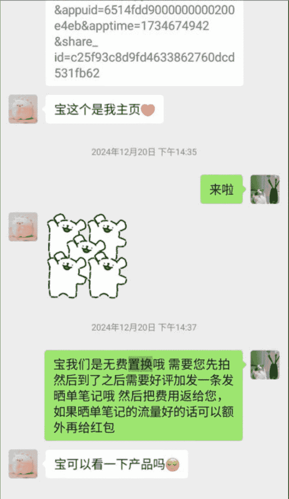

- （4）晒单有礼活动：激发用户晒单好评的兴趣，也可以发布一条置顶笔记，说明店铺的晒单笔记如果达到多少点赞会有什么奖励之类的方式；

- （5）垂直博主付费推广：找内容垂直的粉丝量较多的博主，给相应的广告费让他发布种草笔记，这种方式考验你选博主的能力，要看他的粉丝群体账号的风格是否与你的产品相关；

- （6）入驻选品中心：如果你是个体户店铺，那么你可以入驻选品中心，这样很多博主就可以通过小清单的方式挂你的产品链接，这样也能增加你产品的曝光度，你只需要付出相应的佣金即可；

- （7）子账号矩阵运营：绑定子账号，一拖三；

- （8）投流策略：可以通过乘风投流微付费的方式进行放大，特别是对于一些曾经出单稳定的笔记，或者是一些爆款笔记小眼睛达到了6-7w流量戛然而止的笔记，可以尝试投薯条或者乘风，有时候是可以让笔记的生命周期变长的；

- （9）搜索词优化（占我60%订单来源）：新发布的笔记一定要部署相关的搜索词，可以在千帆后台查看，你出单的情况，是哪些搜索词出单多，或者是选择行业搜索词去发布笔记，要有意无意的在笔记内容中插入与你相关的搜索词，我去年的很多笔记现在还在出单基本都是搜索词的功劳，我的搜索支付金额占比达到了60%，所以搜索词真的很重要！！

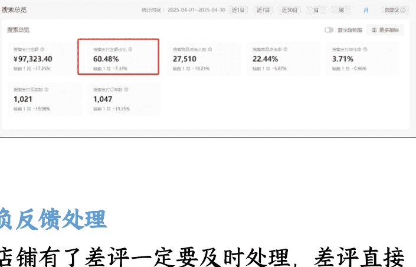

## 负反馈处理

店铺有了差评一定要及时处理，差评直接影响店铺分，店铺分低了直接影响整体流量。

一般收到差评我会直接联系客户，协商补偿或者是补发，然后协商的时候态度一定要诚恳，即使可能当时你很生气也可能不是你的问题，但是没办法你得学会低头，真的很卑微。。。。。

还有就是品质负反馈一定要低于行业平均水平，不然也会限流，太高一定要进行干预，不然你的店铺就完蛋拉。

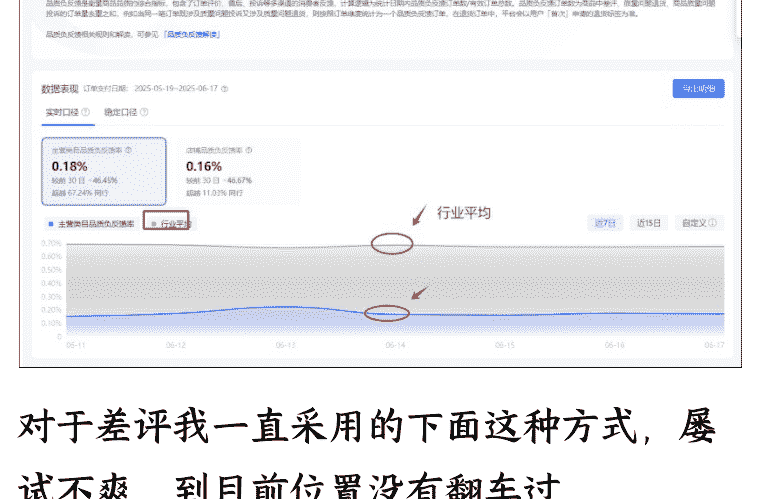

对于差评我一直采用的下面这种方式，屡试不爽，到目前位置没有翻车过

- （1）引导用户回复“已经和商家友好沟通处理已消除误会，现同意撤销评论”然后截图对评论进行申诉
- （2）申诉话术“现与客户友好协商沟通过程，已消除误会，现客户同意撤销评价，请官方大大帮忙审核，十分感谢”

这次航海学到了一个新方式，银河教练说可以直接给客户进行小额打款，全款返还然后直接截图去和官方申诉，也可以参考一下。

懒人微信：lazyhelper

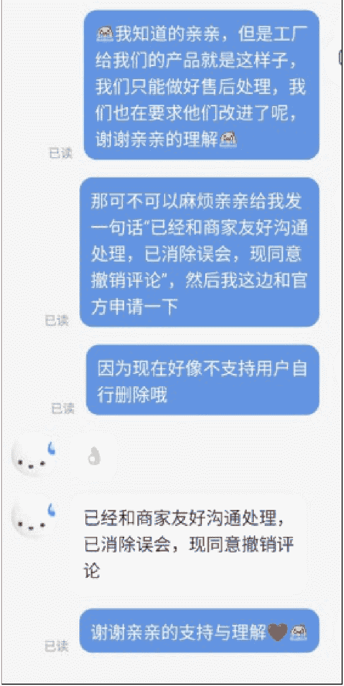

## 数据分析与复盘

要看千帆后台的数据，知道自己的笔记每天的出单情况，总结自己点击率高，转化率高的笔记特点，然后你再新发布笔记的时候加入那些总结出来的优秀的元素，这样你的笔记数据才会越来越好。

# 三、航海实战：一次系统化的能力升级

本次参与小红书电商航海，不仅系统验证了原有的自己一直在使用站内选品方法论（成功复制出日销 300 单的新爆品），更加确信当下环境此方法的可行性，更实现了三大突破：

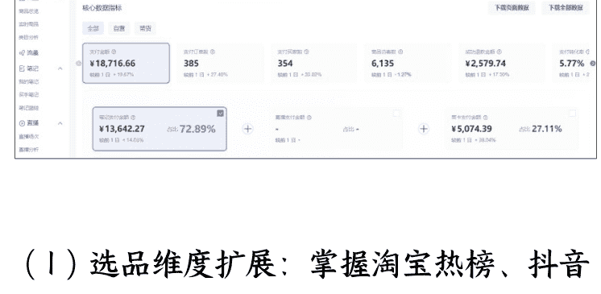

- （1）选品维度扩展：掌握淘宝热榜、抖音飙升榜等跨平台选品技巧，建立多维度选品雷达；
- （2）流量运营升级：从纯自然流量到"薯条+乘风"组合投流策略，让爆款笔记的生命周期更长；
- （3）生产效率革命：通过搭建 AI 工作流 (Coze+DeepSeek)实现文案素材处理效率提升。最深刻的认知颠覆是：付费学习本质是购买时间杠杆。曾经困扰自己很久的问题，可能经过有经验的大佬几句话的点拨就让我少走 2 个月弯路。这次航海最大的收获，是结识了一批持续创造结果的同行者——在电商赛道，圈层决定认知天花板。

# 四、给新手的5条血泪建议

## 七分选品三分运营
选品＞努力，选品定生死，80%的失败源于选品错误，紧盯站内低粉爆款，别自嗨。

## 笔记先模仿再优化
模仿是最快的捷径，新手不需要创新，1:1复刻爆款笔记的框架和视觉。

## 重视搜索流量
搜索词=免费流量，一定要布局，标题、正文、标签嵌入长尾词（如“小众高级感手串”）。可以从以下3个方面了解到你产品的搜索词：可以在小红书平台的搜索栏搜索下拉可以看到很多和你输入的词语相关的搜索词；可以在千帆后台的搜索模块了解到属于你账号标签的搜索词；可以在乘风推广后台，新建推广计划界面的人群定向选择同行购买词（本次航海学习到的新知识）

## 差评即危机
24小时内处理差评，店铺分过低将限流。

## 杠杆思维
稳定出单后，用博主合作/投流放大收益，别困在手工单里。

# 五、总结

## 1、普通人的赚钱公式
信息差×执行力×迭代速度=结果

我的经历证明，即使没有资源和人脉，只要抓住平台红利期、死磕选品与内容、快速试错优化，普通人也能在小红书电商分一杯羹。

## 2、莽撞开始，好过完美拖延
我的经验是：先下场，再优化，哪怕只做 70 分，也比 0 分强。

信息差永远存在，但只有执行的人才能赚到。

希望我的分享能给正在观望的你一些勇气，欢迎交流实操中的具体问题！

📚 懒人专属群持续更新中，已持续运营 6 年，整理超 3000 份各类精选付费文章 & 年费社群干货，全部开放下载。

本资料为付费群内分享，仅供真实有需要的朋友查阅 🙇‍♂️

懒人专属群更新记录：
https://lazy2025.top/#/blog/record2

懒人专属群更新记录（需梯子，备用）：
https://lazybook.fun/#/blog/record2