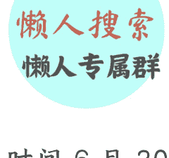

# 叙利亚被解除制裁，中东大变局即将到来？

250703 文/卢克文工作室嘉宾 星海舰长

整理：公众号懒人搜索，懒人专属群独享

懒人微信：lazyhelper

美国时间 6 月 30 日，特朗普签署了一份行政令，正式解除了对叙利亚制裁。

而就在今年 2 月 18 日，中国外交部发言人郭嘉昆刚刚说过，解除叙利亚制裁的条件不具备，中方对取消制裁也持严重保留态度。

那么，特朗普为什么要取消对叙利亚的制裁？其背后又藏着怎样的博弈呢？

## 1

首先明确一点，美国解除叙利亚制裁，并不奇怪。

还记得去年 12 月 8 日的叙利亚变天吗？我们虽然不确定美国在其中起了什么作用，不过就在 12 月 20 日，美国国务院中东事务高级外交官芭芭拉 · 利夫专程飞到大马士革会见了朱拉尼，然后公布了取消对朱拉尼 1000 万美元悬赏通缉的消息，这个意思就很明显了。

懒人微信：lazyhelper

按这个进度，如果美国没有发生总统换人的话，恐怕在 3 月 1 日叙利亚过渡政府宪法出台前，制裁就取消了。

所以，特朗普现在解除制裁，其实并不是早了，反而是推迟了。

### 为什么特朗普并不急于解除对叙利亚的制裁？

原因很简单，作为一个喜欢“做交易”的总统，特朗普对朱拉尼提出的取消制裁的条件并不满意。

在拜登政府时期，朱拉尼给出的条件是：
- 与以色列建交。
- 驱逐哈马斯、伊朗和俄罗斯势力。
- 协助美国反恐。
- 协助欧洲进行叙利亚难民遣返。
- 协助进行叙利亚东北部伊斯兰国拘留中心的管理，这里有 4 万多人，都是涉 IS 人员，杀又杀不得，放又放不得，目前是美国支持的库尔德武装守卫（正因为这个原因，SDF 没有捞到更大胜利果实，意见很大）。

但是在特朗普看来，欧洲难民遣返和接管拘留中心，和美国有什么关系？怎么能拿来和美国谈条件？至于协助美国反恐，这不是你们应该做的吗？美国说谁是恐，谁就是恐，你不反那你也是恐。

显然，光靠这些条件，是打动不了特朗普的，所以，在特朗普上任的几个月时间里，美国和叙利亚的接触基本处于停滞状态。

这时候，朱拉尼就有点着急了。

要知道，打天下容易坐天下难，随着俄罗斯援助的面粉做的廉价大饼慢慢消耗完，吃饭问题就成了朱拉尼的大事。他很清楚，去年自己取胜的原因是叙利亚人抛弃了阿萨德，但如果这些人吃不到廉价大饼，也会毫不犹豫抛弃他的。

解除制裁，恢复叙利亚的贸易活动就成了重中之重。

5 月 14 日，在沙特王储小萨勒曼的引荐下，特朗普会见了朱拉尼，这是美国和叙利亚 25 年以来，第一次元首会见。

不得不说，朱拉尼来之前是做了功课的，提出了三个条件，每一个都打在了特朗普的心坎上。

第一，加入《亚伯拉罕协议》。

《亚伯拉罕协议》是在特朗普女婿库什纳的撮合下，阿联酋、巴林、苏丹、摩洛哥与以色列签署的关系正常化协议，建立了外交关系，算是特朗普最大的政绩之一。

现在如果叙利亚加入《亚伯拉罕协议》，不仅给以色列卖了一个好，更关键的是，可以进一步强化特朗普“和平缔造者”的形象。

第二，允许美国企业开采叙利亚石油天然气资源。

在会面时，朱拉尼主动邀请美国企业前来开发油气资源，谁不知道特朗普的背后就是石油资本？说白了就是另一种形式的政治献金罢了。

更关键的是，5 月 1 日美国刚和乌克兰签署了矿产协议，特朗普正在大吹特吹，十几天后如果又有一个国家向美国献上石油资源，对特朗普来说是多大的一个政治成绩？

第三，在叙利亚首都大马士革新建一座特朗普大厦。

为了拍特朗普马屁，朱拉尼在前期做了很多工作，连设计方案和模型乃至招标工作都做好了，这座特朗普大厦高 45 层，预计造价高达 2 亿美元，顶部将安装巨大的“特朗普”金色字样。

更关键的在于，这座大厦，全都是叙利亚花钱，不用特朗普掏一分钱！

这和魏忠贤听到了万里之外的一个小国给自己立生祠，有什么区别？带来的是多大的荣耀感？

你看，这三个条件，面子、里子，商业价值、情绪价值都给了，也难怪哄的特朗普这么痛快就解除制裁了。

当然，光靠这些，是不足以让特朗普做出这个决定的，更大的因素，还是看小萨勒曼的面子。毕竟人家刚跟美国签订了 6000 亿美元的经济协议和 1420 亿美元的军购协议，钱都送了这么多了，给小弟解除制裁这种小要求，特朗普也就顺水推舟了。

那么，沙特为什么下这么大血本帮叙利亚解除制裁？

首先，就是因为沙特本来就是朱拉尼的幕后金主。

说个冷知识，朱拉尼这个人，本身就算是沙特人，1982 年出生于沙特阿拉伯首都利雅得，只不过后来是在叙利亚长大而已。

而沙特出于教派之争（阿萨德家族是阿拉维派算是什叶派分支）和北部安全考虑，在叙利亚内战爆发后一直资助叙利亚南部一些反政府武装，比如叙利亚自由军南方阵线 SOR、还有沙姆解放组织 HTS 等等。当年阿勒颇大战的时候，沙特一口气花了 22.4 亿美元买了 1.4 万枚陶-2 型反坦克导弹送给朱拉尼，导弹不要钱一样打出去，这才把俄叙联军击败。

现在看着自己支持的反对派武装成功了，沙特当然希望朱拉尼站稳脚跟，慢慢从朱拉尼手中拿回自己的投资。

其次，稳定的朱拉尼政权，是沙特石油管道的关键。

我们都知道，沙特的经济极度依赖石油出口，但问题在于，沙特石油富集区多在波斯湾附近，而要想出海，就只能经过霍尔木兹海峡，可这条海峡并不安全，伊朗说断就断。

为了解决这个问题，沙特修了一条横贯东西的石油管线，但因为东边是红海，要想装船运到欧洲还要过苏伊士运河，成本增加不少，所以沙特一直想修一条能直通欧洲的石油管线，避开伊朗的拿捏，这就是传说中的“逊尼派管线”，而管线核心，就是叙利亚。

现在欧洲已经用不了俄罗斯石油天然气了，沙特石油一旦运过去，就可以迅速占领欧洲市场。所以解除叙利亚制裁至关重要。

第三，拿捏土耳其和以色列。

这条“逊尼派”管线一共有两个方案，A 线是从沙特穿越约旦到叙利亚，然后纵穿叙利亚到达土耳其，从土耳其到欧洲。B 线是在 A 线基础上不到土耳其，而是直接从叙利亚西部地中海港口出海，通过海路装船运往欧洲。

显然，A 线对土耳其有利，B 线对沙特有利。

那么对沙特来说，就必须搞定叙利亚坚持 B 线，作为与土耳其讨价还价的本钱。

沙特和土耳其虽然也是朱拉尼的支持者，但二者的利益并不一致，沙特不希望赶走了一个咄咄逼人的伊朗，再过来一个咄咄逼人的土耳其。

如果这条管道走了 A 线，不仅朱拉尼将彻底倒向土耳其，而且土耳其还会拿这条管线拿捏沙特（这种事土耳其在“土耳其溪天然气管道”上已经干了很多次了），这是沙特不愿意看到的。

除此之外，现在以色列在中东风头无两，沙特也担心以色列把未来的矛头指向自己，所以借石油管线锁定一个逊尼派盟友，一起增加应对以色列压力，也是不错的选择。

所以，这也是为什么沙特要费这么大功夫，帮叙利亚解除制裁的原因。

## 2

我们应该怎样看叙利亚被解除制裁？说实话，解除制裁，本身就是叙利亚政权更迭后必然发生的事情，但是吧，仍然让很多中国人意难平。

一方面，很多中国人感到惋惜。当然这不是因为中国人有多喜欢巴沙尔政权，主要是叙利亚对中国一带一路有特别的意义，而且地处地中海，是中国中吉乌铁路远景规划的终点，可以成为第二个中国直通欧洲的陆地大通道。

另一方面，中国人也感到有点迷茫。环顾全球，在西方国家的集体围堵下，为什么中国支持的政权都这么拉胯？明明中国已经给了很多了，但为什么还是不得人心？甚至被推翻后民众还兴高采烈地庆祝？

叙利亚如此，伊朗如此，朝鲜也是如此，搞得中国像站在历史逆流一方似的。

如果美国解除制裁，叙利亚进入了正常发展轨道，那对比过去的窘况，不就给了那些殖人提供了绝佳的素材了吗？这些人最常见的话术是“为什么央视不报道 XX 了，是因为 XX 人民的生活变好了吗？”这种阴阳怪气最令人生气。

其实吧，我们大可以淡定一些，这个问题不能这么看。

第一，叙利亚政权更迭，和中国支不支持没关系，中国也救不了叙利亚。西方经济界将叙利亚政权更迭的原因，解释为“伊德利卜经济模式”（反对派）和“大马士革经济模式”（巴沙尔）。

虽然西方经济学者将这两种经济模式上升到了民主 VS 独裁层面，大谈“伊德利卜经济模式”多么优秀，但都忽略了一个问题，这两种经济模式其实都依赖关键一点：外部输血。

区别仅仅是，巴沙尔的输血者是俄罗斯和伊朗，这俩国家一个比一个穷。而反对派的输血者是土耳其、沙特、卡塔尔、美国，一个比一个有钱。

是巴沙尔不想好好搞经济来争取人心么？不是啊，美国和西方的制裁不让巴沙尔发展经济啊，油田被库尔德人占着，国内又没什么支柱产业，还要养兵，哪来的钱？老百姓没工作、生活困难，能对政府有好感吗？

而现在呢？西方国家靠撒钱帮反对派夺取了政权，然后再解除制裁，促进叙利亚发展经济，叙利亚人过上了好生活，那就能说明朱拉尼的“民主”比巴沙尔的“独裁”要好么？

所以，制裁是因，失去民心是果，和什么制度啊、总统啊，没什么关系。拿着这种本身就不公平的结果去论证中国输了，这才是别有用心。

再说了，中国支持巴沙尔，本质上也不是真的喜欢他，也不是支持独裁，而是因为他当时是合法政权，仅此而已。

其次，我们的确小看了朱拉尼。

在一开始，很多人都判断阿萨德倒台后，叙利亚会成为军阀混战的吃鸡模式，但从现在的情况来看，朱拉尼做的似乎很不错。

对内方面，朱拉尼迅速建立了一个临时政府，把所有能争取的势力都争取了进来，将这些反对派迅速政党化，减小了武装冲突风险。

对于不听话的，朱拉尼在今年 3 月份大兵压境哈塞克，逼库尔德武装领导人马兹鲁姆和自己会面，并签署了军队整编和维护领土统一的原则性文件，库尔德每天给过渡政府 1 万桶原油。

这样看来，虽然库尔德人仍然处于武装割据状态，但总算解决了国家统一和库尔德人把持油田的问题了。还有那些闹事的阿拉维人武装“海岸盾牌旅”，朱拉尼毫不手软，在西海岸地区屠杀了超过 1500 名阿拉维人，通过血腥镇压平息了局势。

对外方面，朱拉尼四处出击。

对土耳其，朱拉尼签订经贸、军事和政治合作协议，换取驻扎在伊德利卜和阿勒颇省的土耳其军队撤军。

对法国和德国，朱拉尼同意接纳被遣返的叙利亚难民，换取法德解除对叙利亚制裁，以及 2.35 亿欧元的新人道主义援助。

哪怕对强占了戈兰高地、派飞机炸毁叙利亚技术装备的以色列，朱拉尼也保持了极大克制，一直放话说愿意实现以叙关系正常化。

看来还真是那句话，对小国来说，外交即内政。朱拉尼这一番折腾，看来是深谙政治精髓，把敌人搞得少少的，把朋友搞得多多的，确实很有水平，现在能解除制裁，也不奇怪。

所以，叙利亚的变天，并不意味着中国输。毕竟缺钱的巴沙尔政权倒台是一种必然，中国要想稳住巴沙尔政权，要么无底线地给钱，要么动用军力强撑，可中国的钱也不是大风刮来的，在中东又没有军事部署，还白白担风险，所以在当前历史阶段下，只能顺其自然、顺水推舟了。

再说了，谁说叙利亚政权更迭一定是坏事？中国应对这种政权更迭的事情多了，中国有五常地位，有商品生产能力和原料需求，还有强大的基建能力，叙利亚要想发展，就必然绕不开中国。

而且别忘了，虽然美国解除对叙制裁了，联合国还没取消呢！而中国握有一票否决权。

所以别看朱拉尼现在看似风光无限，但要想治理好国家，最后还是要来找中国谈，只要朱拉尼放弃手中的东突武装（这也是中叙关系症结），中国并不排斥和叙利亚恢复关系。

当年萨达姆倒台之后，很多人也说中国输了，可是结果怎么样？中国拿到了大部分油田开采权。

所以，我们不妨淡定一些，说不定未来中国从叙利亚拿到的，并不会比阿萨德时期少呢。

懒人专属群持续更新中，已持续运营 6 年，整理超 3000 份各类精选付费文章 & 年费社群干货，全部开放下载。

本资料为付费群内部分享，仅供真实有需要的朋友查阅

懒人专属群更新记录：
https://lazy2025.top/#/blog/record2

懒人专属群更新记录（需梯子，备用）：
https://lazybook.fun/#/blog/record2