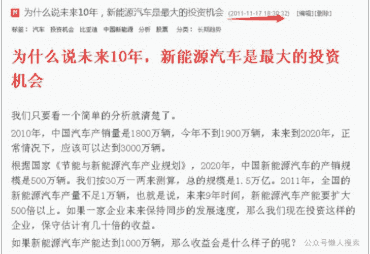
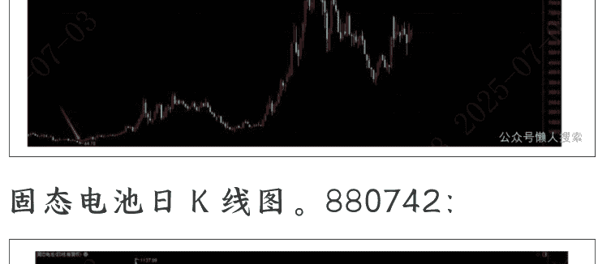
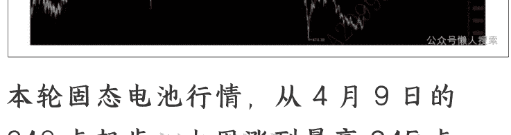
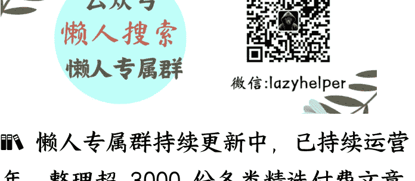

# 行业分析（4）：这个行业，相当于 2014 年的新能源汽车

250703 安民

整理：公众号懒人搜索，懒人专属群独享

懒人微信：lazyhelper

微信：lazyhelper

2014 年 2 月 10 日，我们在《2013 年新能源汽车销量数据及其背后》中，有这样的判断：跟 2013 年底相比，未来中国新能源汽车总销量有增长 1250 倍的空间。证据如下：

anmin0001 2014-02-10 17:20:42

## 2013年新能源汽车销量数据及其背后

年后两天，总体而言是今年春季行情启动。去年底以来，我一直在强调这点，即那次的短线调整完毕，有春季行情启动。现在看来，果然是这么走的。

1月23日，我在博客上贴出文章《新能源汽车未来会比今天的机器人还要凶》，指出这个版块的价值。今天，两市特斯拉概念股和锂电池概念股大涨。前者指数涨幅7.16%，后者涨幅6.01%，也即新能源汽车概念股有11只封涨停。这个板块的指数，当天收盘1986.23点，今天收盘2201.94点，涨幅10.86%，其中龙

这里可以看到那篇文章贴出来的时间。那篇文章，我们根据当年全国汽车销量/新能源汽车销量这两个简单的数据，推算未来新能源汽车有1250倍的增长空间。因为2013年全国汽车销量为2198.41万辆，新能源汽车销量为1.76万辆。

> 安民Anmin0001

2013年中国汽车总产量为2211.68万辆，总销量为2198.41万辆，分别同比增长14.78%和13.8%。以最主要的纯电动汽车产销量占整体汽车市场的比例来看，2011年为0.033%，2012年为0.064%，2013年约为0.066%。一家不愿透露姓名的车企资深人士表示，在他看来，由于充电桩等基础设施的匮乏，新能源汽车目前对于国内普通消费者而言，没有什么实际意义。

据财新网报道，叶盛基私下表示，去年前三季度，车企都不好意思上报销售数量，四季度补贴政策明确后，数据才有了一路冲高。他预计2014年纯电动乘用车销售达到3万辆左右。

安民评价：第一，上述数据中，全国汽车总销量已经达到2198.41万辆，也即2200万辆，而新能源汽车销量才1.76万辆。增长空间还有1249.10倍，也就是1250倍。这个空间仍然很大。

跟 2013 年相比，已经增长 731.02 倍了。

2025 年，中国新能源汽车销量按增长 30%估算，也能达到 1672.58 万辆，相比 2013 年的数据，增长 950.33 倍。

跟 2013 年的数据相比，2024 年中国汽车的总销量要高出不少，达 945.19 万辆，2025 年则极有可能超过 1000 万辆，总销量超过 3200 万辆。也即 2014 年 2 月 10 日的计算中，分子至少要加上 1000 万辆，分母不变。这样就是 3200/1.76=1818.18 倍，而且现在我们仍然可以说是至少。

所以，当年我们判断未来新能源汽车有 1250 倍的增长空间，实际上还是低估了，那仍然是一个保守的估计。这是一个非常典型的模糊的正确好于精确的错误的案例，原因就在于内在逻辑的顺畅和准确。

内在逻辑是，新能源汽车全面替代传统燃油车，这是 2014 年 2 月 10 日判断新能源汽车有 1250 倍增长空间的内在逻辑。

其实，还有更早的一个判断：

(2011-11-17 18:39:32) [编辑][删除]

标签： 汽车 投资机会 比亚迪 中国新能源 分析 股票 分类： 长期趋势

## 为什么说未来10年，新能源汽车是最大的投资机会

我们只要看一个简单的分析就清楚了。2010年，中国汽车产销量是1800万辆，今年不到1900万辆，未来到2020年，正常情况下，应该可以达到3000万辆。

根据国家《节能与新能源汽车产业规划》，2020年，中国新能源汽车的产销规模是500万辆。我们按30万一两来测算，总的规模是1.5万亿。2011年，全国的新能源汽车产量不足1万辆，也就是说，未来9年时间，新能源汽车产能要扩大500倍以上。如果一家企业未来保持同步的发展速度，那么我们现在投资这样的企业，保守估计有几十倍的收益。

如果新能源汽车产能达到1000万辆，那么收益会是什么样子的呢？

这张图是 2011 年 11 月 17 日我们在博客上贴出来的《为什么说未来 10 年，新能源汽车是最大的投资机会》。

这是以前的文字，大家可以仔细看看。下面我们要讲我们团队最新的判断：

我们团队研究的这个行业，现在跟 2014 年 2 月研究的新能源汽车行业极其类似，未来具有 100% 的确定性，注意我们的用词，不是可能，也不是很大可能甚至也不是极大可能，而是 100%，是确定性。这是第一点，行业发展的确定性。

我们之所以这么讲，在于另外两个原因，市场拓展空间非常大，一定大于新能源汽车的增长空间；加上产业才刚刚有萌芽，跟 2014 年 2 月的新能源汽车非常类似；这是第二点。第三点是一个根本原因，就是随着时代的进步，人们需要追求更高的效率、更好的体验和带有根本性的保障措施。

正因为如此，于是就有了第四点，就是这个行业的发展速度会快于 2013 年后的新能源汽车，一定会比当年的新能源汽车发展快，也比当年的新能源汽车的市场空间大。

大家可以翻一下历史，看看 2013 年到2025 年，新能源汽车产业链上有一大批涨了几倍几十倍的股票，它们在前面打了个样。这样就大致能够判断，到我们研究的这个行业爆发时，一样会出一批涨几倍几十倍的股票。这正是我们必须深度研究这个行业的原因。而大家可以看锂电池专业指数 881263，2012 年 12 月到 2021 年 12月，9 年中从 44.76 点涨到 1006.95点，指数涨了 22.50 倍，代表性个股肯定有不少涨幅超过 30 倍的。

> （声明：本文只为开拓视野、引导思路，并非择时，亦非荐股。股市有风险，入市需谨慎，本文不构成投资建议或意见，我们无力为大家的投资负责，请大家注意投资风险）

# 一、为什么说这个行业就是 2014 年2月的新能源汽车

在上一部分，我们讲了四个理由：
- 第一是确定性，是 100%；当年新能源汽车的确定性也是 100%；两者不相上下。
- 第二是市场空间，即增长空间，这个行业的增长空间比新能源汽车增长空间更大。
- 第三是更高的效率、更好的体验和带有根本性的保障措施。
- 第四个是发展速度，发展速度其实就是年复合增速，它会高于当年的新能源汽车。下面我们一个一个来请清楚。

## 1. 确定性和市场空间、市场增长空间

这个行业是固态电池，2025 年处于半固态电池量产的元年，预计固态电池要 2027 年小批量装车，也就是部分高端车型会有，大范围装车，即主流车装固态，可能要到 2030 年。这样一来，就知道固态电池的行业机会，至少相当于 2014 年 2 月的新能源汽车的战略机会。注意，我们不是说相当，而是说至少相当。

那为什么固态电池行业至少相当于 2014 年前后的新能源汽车呢？从确定性的角度来看，以后除非那些旅游观光车、农业用车等细微市场、小众化市场用便宜的非固态电池电动汽车或混合动力汽车，其他所有的电动汽车或混合动力汽车，还有飞行汽车，以及相当比例的人形机器人，都会采用固态电池。这一点是确定的，100%。确定的原因，我们在下一个里面讲清楚。

那这个市场有多大呢？2024 年都没有统计固态电池半固态电池的数据，2025 年才是半固态电池量产的元年，所以这个数据还没有出来。即前面的计算中，分母的数据还没有出来，但肯定不会大。有人估算今年半固态电池产量 10GWh，2024 年中国动力电池销量 791.3GWh。仅看这个数据，就是 79 倍。但 2024 年中国新能源汽车才销售 1286.6 万辆，2025 年全国汽车销量应该会突破 3200 万辆。相关研究可以参看行业分析（1）。

我们按 2024 年半固态电池销量 2 万辆车预估计算，以 2025 年中国汽车销量 3200 万辆预估全部固态电池汽车销售量的峰值，也有 1600 倍的市场增长空间。而实际上，2025 年全国的全固态电池销量根本不可能达到 2 万辆。而且，未来这个数据会被再次证明，我们的估算还是偏于保守的。

保守体现在三个方面：一是我们以前计算过，中国新能源汽车行业高峰数据会比 3200 万要大得多；二是有飞行汽车的市场，一定会用固态电池；三是有人形机器人市场。所以，中性预期汽车+飞行汽车，不会低于 5000 万辆。何况还有人形机器人呢？

按 3200 万预计，那是 100%确定。情况跟我们 2014 年 2 月 10 日判断新能源汽车未来有 1250 倍的增长空间是绝对类似的，方法和逻辑是一样的，未来增长空间会远大于 1600 倍也是一样的。

所以，在我们眼中，固态电池市场未来的空间十分巨大，最终应该达到 4 万亿到 5 万亿，甚至不排除远超这个数据。这点在我们看来，是 100%确定。

这个确定性来自于哪里？内在逻辑是，新能源汽车全面替代传统燃油车，这是 2014 年 2 月 10 日判断新能源汽车有 1250 倍增长空间的内在逻辑。

那么现在的逻辑是什么呢？是全球新能源汽车全面替代传统燃油车，中国固态电池从 2026 年到 2027 年开始，全面替代新能源汽车中的液态电池。飞行汽车和人形机器人的市场另算。明白了这点，就知道我们前面估算用做分母的 2 万辆，其实是远远超过实际数据的；而用做分子的 3200 万辆，也是一个低估的数据。

因此，2012 年到 2025 年诞生了一批锂电池产业链中的大牛股，后面固态电池产业链条上亦将诞生一批大牛股和超级大牛股，重复宁德时代等一大批锂电大牛股的历史。大家如果还不明白，可以用月 K 线或季 K 线，用后复权，复盘一下以前历史上动力电池产业链上的大牛股。

补充一个数据，2024 年，中国锂电池产量突破 1170GWh，总产值达 1.2 万亿元，占据全球 60%以上的市场份额。

## 2. 为什么有那么大的增长空间？从更高的效率、更好的体验和带有根本性的保障措施来看

（1）先讲高效。传统锂电池，2025年数据显示，中国动力电池装车，磷酸铁锂占比为81.4%，相较2023年提升15%。在2021年以前，三元锂的占比高于磷酸铁锂二三十个百分点，2021年以后磷酸铁锂完成反超，直到今天断层式领先，其中的关键在于比亚迪刀片电池，它通过结构的创新提升能量密度，现在一些磷酸铁锂电池将能量密度提升至205Wh/kg，配套车型续航里程突破700公里。当然，电车的续航并不只取决于电池，还要结合车型设计，比如小米SU7的磷酸铁锂电池可以做到CLTC续航835公里。

特斯拉直到现在都没完全铺开的4680电池，属于圆柱形三元锂电池，能量密度达300Wh/kg。2022年的数据是跑出650公里。2025年的数据是，特斯拉4680电池的续航里程因车型及测试标准而异，在一些测试中可超1000公里。

半固态电池量产装车，能量密度突破400Wh/kg，续航迈入1000公里。

上汽集团2025年二季度，名爵MG新车搭载半固态电池，能量密度超400Wh/kg，支持—30℃低温环境运行。东风汽车2025年一季度半固态电池搭载率达 22%，能量密度350Wh/kg。蔚来汽车，由卫蓝新能源供应的 360kWh 半固态电池包，续航突破 1000 公里。

全固态电池，实验室样品能量密度达到 500Wh/kg。其中蓝箭航天开发的高比能软包电池，能量密度达450Wh/kg。

恩力动力软包动力电池，标注为锂金属全固态电池，能量密度亦为450Wh/kg。

从这里就可以看出三个方面，一是能量密度，从 205 到 500；二是续航里程，固态电池续航里程实际上可以达到 1200 公里以上，可以达到液态电池的一倍以上；三是电池的稳定性，就是适应工作的温度。

比如传统锂电池在北方的冬天和南方的夏天，性能大打折扣，买车时说能跑 500 公里，实际上跑出 300 公里就不错了，空调不敢开，长途不敢跑，气温 35 度以上和零下 10 度以下，就基本不敢怎么开车出门。零下 20 度，电车续航能从 500 公里缩水到 250 公里，所以北方电车的活跃度一直低于南方，我们了解到吉林长春的出租车司机，早期开的红旗纯电车，后来因为冬天续航掉得太快，向一汽反映，处理方案是给纯电车加了个内燃机，专门给电池供暖；35 度模式，续航里程从 500 公里跌到 400 以下。这些因素还导致电池寿命较大幅度地缩短。包括南方深秋到早春的晚上，停车都怕停在外面等等。也就是这个开车体验过不了关。

（2）安全性。最根本的原因，在于带有根本性的保障措施，就是安全性还有问题。这是根本。传统动力电池最大的问题在于安全性不好。

今年 4 月初，雷军被骂惨了。为啥？3 月 29 日，小米 SU7 在高速上用智能驾驶辅助技术，出现碰撞引起电池起火燃烧，车门被锁，三名女大学生死亡，死因众说纷纭，最骇人听闻的说法是她们被烧死。

那三名女生是武汉的在校大学生，去安徽池州考事业编制。事情发生在一段高速公路的施工段，前期她们用的是智能驾驶模式，到车子发出危险信号时，就切换到人工控制模式，但是已经来不及了。雷军两会期间还以北京人大代表的身份参加两会，转瞬间就成为了众矢之的。然后不少人骂小米不注重研发，只会过度营销云云。

其实无论是哪个死因，碰撞后起火都是铁一样的事实，尤其是这次事故车辆，用的电芯是比亚迪弗迪电池供货的，小米买回来自行封装为成品。以安全著称的磷酸铁锂都起了火，也掀起了一波公众对锂电池的安全性的质疑。

为啥起火？因为用的是液态电解质。磷酸铁锂不能杜绝起火事故，更别提三元锂电，在受到强力穿刺时，就会起火，发生火灾，闹不好就把人烧死了。这在科学上是正常的现象。因为强力冲撞也好，或者穿刺也好，因为那个瞬间，冲撞只要撞击到电池了，力量只要足够大，就把中间隔离液态电解质的隔膜撕破了（穿刺实验是人为刺个洞），这就会出现瞬间巨量电子从负极跑向正极，出现内短路，释放巨量热量，引发火灾。而正常情况下，电子是从电线回到正极的，那是安全的。这种内短路，是容易引发火灾的。这才是固态电池一定替代液态电池的根本性原因，安全。

而 2023 年到 2025 年，铁锂销量上升 15 个百分点，原因也正在这里。因为铁锂相对来讲，要安全一些。但是，只要是液态电池，在突然强力碰撞和强力穿刺时，都容易起火。

刀片电池设计了一些安全措施，比如采用磷酸铁锂正极材料，具有较高的耐火性；电池包内配备了液冷系统和排烟系统，能够在电池发热时进行排烟和降温，从而减少火灾的风险；再就是提高了能量密度，效率上升；于是销量大增并拉动铁锂电池占比大增。

但它是减少起火风险而不是杜绝了起火风险，且效率水平远不能跟固态电池相比较。所以当电池发展到一定程度，固态替代液态一定发生。

还有一点，飞行汽车最终用的电池，一定是固态电池。因为飞在天上，电池的电量一定要远远有富余，那样才安全。电池还剩下三五十公里，您还在天上飞，您认为还很安全，但危险正在降临。因为闹不好会出个什么妖蛾子，电池没电了，然后人就容易出大问题。

相当部分的人形机器人也是，特别是家用人形机器人，安全性是第一位的。现在一个城市家庭，一套房子几百万，相当于很多家庭一辈子的积蓄。人形机器人用固态电池，不仅能量效率高，而且安全性高得多。

还有就是，这几年造的城市住宅，很多都 40 层到 60 层，往往超出消防车救火的高度，这对人形机器人的安全性能要求更高。工厂的人形机器人，往往更加强调安全性，因为现在哪里安全性出问题，哪里领导就被处理。

最后，政策因素是刚性的，会带来强制执行。2025 年 3 月 28 日，国家发布了动力电池新国标，要求 2026 年 7 月 1 日开始执行。

在热扩散测试方面，它要求不起火，不爆炸，烟气不对乘员造成伤害，并新增内部加热测试项。底部撞击试验，要求电池能经受 30 毫米直径的撞击头、150 焦耳能量连续 3 次撞击后无泄露、破裂或爆炸。300 次快充循环后，接受外部短路测试，要求确保不起火，不爆炸。这项政策等于宣布了传统液态电解质电池必然被淘汰。

## 3. 替代速度快

2014 年讲新能源汽车有 1250 倍的增长空间时，到现在为止，新能源汽车替代传统燃油车的速度还是比较快的。但我们判断，2027 年以后，固态电池替代液态电池的速度会更快。原因在于什么呢？在于安全性是根本，当然也有其他原因。

替代速度，实际上讲的是年复合增速，这里就没有必要计算了。因为肯定快于新能源汽车。

为啥？一是安全性远远比价格重要；二是大热天和大冬天的驾驶体验肯定很重要；三是人们的收入跟 2014 年相比已经不一样了，2014 年前后主要是 80 后买车，2027 年以后主要是 90 后和 00 后买车，大家对汽车价格的敏感度，相对于 2014 年肯定不再那么敏感了。

而且还有飞行汽车和人形机器人两个大的行业影响因素存在，这将导致固态电池行业的年复合增速，一定高于 2013 年后的新能源汽车。

关于复合增速的计算，只要知道两点就行。一是会增长多少倍，二是几年替代完毕。

2014年2月10日当时的情况是：2200万辆/1.76万辆。现在呢，先看分子。汽车至少是3200万辆（2025年数据）。还有飞行汽车，还有机器人，这都是现在感觉没什么体量，但前途无量的行业，所以分子是远超3200万辆，估计全部折算下来，会不下于7000万辆的规模。

再从另一个角度，看总量，据公安部数据，2024年全国机动车保有量4.53亿辆，其中汽车（去除了卡车、货车、摩托车、拖拉机等，只余下最常规的汽车）3.53亿辆，2024年底，全国新能源汽车保有量达3140万辆，占汽车总量的8.90%，算算比例就知道，这意味着除了每年的无车族新购汽车，还有91.1%的存量汽车等待着替换，而且一替换就大概率是新能源。

再看分母，2024年，中国固态电池汽车，无论怎么样都不可能达到1.76万辆，说是100都不夸张，因为固态电池都在实验室里呢，车企最多做个样车而已。也就是跟2014年比，分子至少超出3倍，分母则要小得多，故而市场空间的确是非常大。

然后看时间。因为安全性的原因，一旦固态电池性能达到了要求，这个替代就会很快。

当初是锂电汽车替代燃油车，锂电技术不成熟，要让整个社会接受新能源汽车，那是相对要慢一些的，这是从## 二、固态电池产业链如何进行投资？

这一部分主要讲固态电池产业链的相关知识，比较烧脑，专业知识比较强。因为内容太多，我们就无法讲得很通俗，不然要写成一本书。但我们认为，大家最好还是要好好读一读，争取读个明白。还有，文章将锂电设备各环节和固态电池电解质生产公司等列了出来，可供大家参考。

主要包括以下产品或零部件：

### (一) 锂电设备

设备先行，就是锂电设备是固态电池产业链最先受益的环节。之所以设备先受益，是因为只要建生产线，就一定要先买设备，手搓电池搓不出高质量的产品。

固态电池生产，需要哪些设备呢？国内目前有中试环节生产线建成的，比如近期涨得好的国轩高科就是。

固态电池设备与传统锂电一样，也有前段、中段和后段，也有环境控制与智能化系统。但差异还是比较大的，主要集中在三个方向：干法电极工艺、电解质处理技术和固固界面优化设备。

技术趋势方面，干法电极、硫化物干电解质膜设备、超高压等静压技术是当前产业化突破的重点。半固态电池已开始量产，需求集中于改良涂布和注液设备。全固态仍处在中试阶段，干法设备价值占比升至 35%~40%。

先讲清楚，我们这里会讲一些上市公司，是表明那些公司有产品，并不代表那些公司产品好、技术好或市场好。即使是好公司也要好的买入时机，作为长期性的研究报告，无法给大家择时。这个一定要清楚。大家需要在我们研究的基础上进一步研究清楚，看看到底什么公司值得投资，还有什么时候买入比较合适。我们只是为了方便大家进一步研究而已，因此我们不是荐股，故不承担各位的投资责任。

#### 1. 前段工艺设备（电极与电解质制备）

- （1）干法电极设备集群，这是固态电池生产设备的第一个方向。包括：
  - 第一类：干法涂布机。采用无溶剂工艺，通过辊压与热压直接成型电极（主要是电池正极），能耗降低 30%以上，成本下降 20%。目前有 9 家：璞泰来、先导智能、赢合科技、宏工科技、先惠技术、曼恩斯特、金银河、信宇人、上海联净工艺。
  - 第二类：干法混料、复合设备。实现活性材料与粘结剂的均匀混合，如 PTFE 纤维化技术，就是将聚四氟乙烯（PTFE）粉末通过纺丝或薄膜切割等方法，制备成纤维。聚四氟乙烯耐高温，稳定性好，具有化学惰性和低摩擦性，可以用来制备高性能的纤维材料。宏工科技、曼恩斯特、赢合科技、纳科诺尔（清研纳科）、嘉拓智能（璞泰来子公司）、利元亨、上海联净。
  - 第三类：干法辊压机。高压辊压提升电极致密度，负载量可超 5 mg 每平方厘米。纳科诺尔（清研纳科）、璞泰来、赢合科技、先导智能、曼恩斯特、金银河。

- （2）电解质层制备设备
  - 第一类：氧化物体系。
    - 一是流延机，为制作流延膜的专用设备。用氧化铝作为主要原材料，粉碎后与粘结剂、增塑剂、分散剂、溶剂混合制成料浆，料浆在基带上制成生坯带的薄膜，再加工处理成待烧结的毛坯成品。有宏工科技、曼恩斯特、先导智能、上海联净。
    - 二是高温烧结炉，作用是使电解质或电极致密化。它能够在特定的温度和气氛条件下，使电解质或电极材料发生化学反应，形成稳定的晶体结构，从而提高电解质或电极材料的致密性和稳定性，提升电池的循环寿命和安全性。中鹏新能科技、先导智能、高砂工业窑炉、佛山市中研非晶、信宇人、日东科技。
  - 第二类：硫化物体系。
    - 一是真空蒸镀机。是一种薄膜沉积技术，用于制备硫化物电解质，通过精确控制硫化物前驱体的蒸发与沉积，形成致密电解质层。也可制作电极，即通过加热锂金属至气态，在真空环境下将锂原子沉积到基材（如铜箔、铝箔）表面，形成厚度可控的锂膜。汇成真空、芯源微、先导智能、拓荆科技。
    - 二是高纯喷雾干燥机，主要用于固态电解质和电极材料的粉体制备。通过将液态前驱体雾化成微小液滴，在高温气流中快速干燥形成超细粉末，再将活性物质、导电剂和粘结剂一步干燥成型。尚金干燥、龙鑫智能、江苏干燥先锋。
  - 第三类：解决聚合物体系问题。热压机，是通过加热加压实现材料的致密化和界面优化，以及成型，如电解质膜成型。先导智能、利元亨、赢合科技、曼恩斯特、科恒股份、宏工科技。
  - 第四类：配套材料设备。纳米砂磨机，它主要用于高粘度浆料研磨，就是通过高速旋转的分散盘带动研磨介质产生剪切力来实现纳米级研磨。茹天机械、鸿凯智能、三星飞荣、驰勒机械、先导智能、赢合科技。
  - 焙烧炉，主要用于电解质烧结，实现电解质材料的固相反应和晶体生长，促进材料致密化和性能优化，调控材料微观结构和性能。高砂工业、中鹏新能科技、博涛热工、先导智能、赢合科技、信宇人、上海洗霸、科森科技。

#### 2. 中段工艺设备，主要是做电芯装配与界面优化

- （1）叠片设备
  叠片设备主要负责将正极片、负极片和隔膜（半固态电池要用到）按照一定的顺序叠放在一起，形成电芯的内部结构。全固态电池需兼容电解质脆性，叠片精度要求高于液态电池，要避免界面裂隙，确保电芯内部结构的稳定性和安全性。利元亨（高压化成+叠片集成）、先导智能（整线方案）、科瑞技术、联赢激光、纳科诺尔、海目星、赢合科技。

- （2）界面致密化设备。
  负责电芯组装与界面优化，功能是通过等静压机等设备实现电芯内部结构的致密化，消除内部空隙，从而增强导电性和能量密度。等静压机是在 600 MPa 高压下消除固固界面空隙，提升离子传导效率。固固界面空隙是指在固态电池中，固体电解质与电极材料之间的界面处存在的空隙或间隙。传统辊压机适用于液态电池，在固态电池生产中用不上了。海目星、纳科诺尔、曼恩斯特、先导智能、利元亨、太原中平科技。

#### 3. 后段工艺设备（化成与封装）

- （1）高压化成分容设备。用于完成电池化成和分容两道关键工序的专用设备。化成是对组装好的电芯进行首次充放电，激活电池内部的化学物质，优化电极与电解质界面，通过精心设计的化成工艺，可以显著提升固态电池的界面稳定性和整体性能，提升电池寿命和安全性。分容是对化成后的电池进行容量分选，筛选出容量、内阻、电压等参数一致的电池，确保同一电池组内的电芯性能匹配。这两道工序对电池性能、安全性和一致性至关重要。
  固态电池要求高强度结构设计。因为它的化成压力可达 60～80 吨，液态电池一般 3～10 吨。杭可科技、利元亨、先导智能。

- （2）精密封装设备
  - 半固态电池：真空注液机，作用是将微升级电解液进行精准的注入。先导智能、杭可科技、利元亨、星云股份。
  - 全固态电池：激光焊接机。联赢激光、海目星、先导智能、利元亨、海维激光。
  - 全固态电池：气密性检测仪，外壳焊接密封性检测、固态电解质界面密封性检测、极端环境适应性检测。其中自然要检测泄漏率。希立仪器、卡优思技术、先导智能、利元亨、骄成超声、星云股份。

#### 4. 环境控制与智能化系统

- （1）手套箱集成设备。主要由主体框架、真空泵+气体净化系统和温湿度调控等集成而来。威格科技、米开罗那、伊特克斯、先导智能、利元亨。
- （2）数据中台。它是在背后起支撑作用的数据处理系统，相当于大脑。负责固态电池制造过程中的数据采集、存储、处理、应用与执行。先导智能、利元亨、宁德时代、清陶能源、骄成超声、信宇人。

### (二) 电解质

固态电池的电解质是它改变最大的地方，也是固态电池增长空间最大的材料。因为以前用的是液态电解质即电解液，现在用的是固态电解质。

电解质的作用是用于离子传导，即离子正电荷从正极流向负极，是走的电解质这个通路；电解质是正电荷的传播介质，有点类似于道路，正电荷通过这个道路从正极流到负极去。电子则通过电线等去做功。锂电池出事前，则是负电荷直接通过液态电解质流向正极，从而产生大量热量引发燃烧。

#### 1. 无机固态电解质

无机固态电解质，通常由含锂陶瓷制成。主要包括氧化物、硫化物、卤化物 3 种类型。另有聚合物固态电解质，属于有机电解质；复合物电解质属于有机和无机复合的固态电解质。

- （1）氧化物
  固态电池氧化物电解质主要包括以下几类化学成分，根据材料结构和性能差异分类如下：
  - 第一，石榴石型氧化物。核心化合物如锂镧锆氧，具有较高的离子电导率和良好的热稳定性；掺杂改性型如钽掺杂锂镧锆氧，也有的掺铝。上海洗霸、宜宾南木纳米科技。
  - 第二，钠超离子导体（NASICON）型氧化物。核心化合物如锂铝钛磷酸盐、锂铝锗磷酸盐、锂锆硅磷氧。昆仑新材、天目先导、赣锋锂业、宁德时代、当升科技。
  - 第三，钙钛矿型氧化物。核心化合物如锂镧钛氧。上海洗霸、璞泰来、瑞泰新材，上游配套东方锆业、龙佰集团。
  - 第四，磷酸盐基及其他氧化物。核心化合物如氧化锂磷酸钙（中科院物理所、清华大学等机构在研），还有磷酸铝钛锂（它属于钠超离子导体型，但一般单列）。盟固利、璞泰来、闪能科技。
  - 第五，薄膜专用的，如锂磷氧氮化物，属氮掺杂氧化物。有研新材、天目先导。

  当前主要是前三类。主要是综合性能中的离子电导率、电化学窗口更适配高能量密度电池的相关需求。

- （2）硫化物
  硫化物固态电解质的上游核心材料是硫化锂，这一块天齐锂业有布局，2025 年半固态电池配套产能 5 GWh。注意是半固态电池。

  固态电池硫化物电解质主要包括以下几类化学物质，按结构和化学成分分类：
  - 第一，锂硫锗磷固体电解质。主要是硫代锗磷酸锂，一般用在需要高能量密度的电池设计中。天赐材料、云南锗业、瑞固新材、上海屹锂新能源、赣锋锂业。
  - 第二，硫银锗矿固体电解质，英文名 Argyrodite，是一种比较罕见的钢灰色矿物，由银、锗和硫组成。主要成分是硫化磷氯锂，通过卤素掺杂提升电化学稳定性，一般适配高压正极材料。天赐材料、瑞固新材、金龙羽、上海屹锂新能源，上游配套云南锗业、光华科技。
  - 第三，硫化结晶锂超离子导体，主要有两种化合物，四硫化四锗锂和硫代磷酸锂。瑞固新材、恩捷股份，上游配套光华科技、东方锆业、兴发集团。
  - 第四，玻璃态硫化物固体电解质。主要有硫代磷酸锂基电解质，即是硫化锂—五硫化二磷体系，可简称为“硫磷锂电解质”。还有三硫代三磷酸七锂或简称硫代三磷酸锂。兴发集团、天赐材料、金龙羽，上游配套光华科技。
  - 第五，掺杂型硫化物固体电解质。主要有氯掺杂硫代硅磷酸锂，就是往硫代磷酸锂中掺杂了硅、氯等元素。这块是吉林君凡和大连化物所技术团队在中试，上游供应商有东方锆业、光华科技和上海欧金实业。

  当前产业化重点是前两种类型。但这个行业技术发展挺快的，未来也极有可能出现其他变化。

  硫化物材料的划分，还有几种核心材料：
  - 第一，硫代磷酸锂，分子式是 Li₃PS₄；兴发集团、天赐材料，配套光华科技，国轩高科全固态中试线，金石电池采用硫化物电解质（含硫代磷酸锂体系）。
  - 第二，锗磷硫锂，分子式是 Li₁₀GeP₂S₁₂；它是硫化物固态电解质的性能标杆，但因成本与稳定性限制，产业焦点正转向改性（氟化）或硅基替代路线。它具有较高的离子电导率和较好的空气、湿度稳定性，但相对于卤化物固态电解质，其在高电压下的稳定性较差。云南锗业、天赐材料，上游配套有研新材、金龙羽、华为。
  - 第三，氯掺杂硅磷硫锂，是硅基硫化物的代表。分子式太复杂了，不列了。吉林君凡硫化材料科技有限公司、大连化物所技术团队，上游配套东方锆业、厦钨新能、上海欧金实业有限公司。
  - 第四，卤素掺杂硫化物。分两种，硫银锗矿结构，氯掺杂分子式为 LiPS₅Cl，中文名称锂硫磷氯快离子导体或简称硫银锗矿型电解质；天赐材料、金龙羽、宁德时代、赣锋锂业，上游供应商为云南锗业、厦钨新能、兴发集团。溴掺杂分子式为 LiPS₄·2LiBr；中文名称是溴化锂掺杂硫化磷酸锂（或简称溴掺杂硫磷锂电解质）。基础化合物是硫化磷酸锂 Li₃PS₄，掺杂溴化锂 2LiBr 作为卤素掺杂剂改变性质和性能。宁德时代、当升科技，上游配套材料供应为光华科技、有研新材。
  - 第五，锑基硫化物，中文名六硫合锑酸锂，或称锑硫锂电解质。化合物，分子式 Li₇SbS₆；湖南黄金、华钰矿业、有研新材、吉林君凡硫化材料科技有限公司。

  还有一种基于锂的硫化物体系，化学分子式为 Li₂S—P₂S₅，它是一种基于玻璃硫化物的银锰矿结构的离子选择性电极，在固态电解质中比较有前途，可以通过固态反应合成。简单地说，以特定比例深度混合硫化锂（Li₂S）和五硫化二磷（P₂S₅）来生产，然后加热或加催化剂，通过快速反应生成。赣锋锂业、天赐材料、光华科技、厦钨新能。

- （3）卤化物
  固态电池卤化物电解质，主要有锂铟氯卤化物。锂铟氯卤化物固态电解质材料 LiInCl₆。它可以通过球磨法及后续低温烧结法获得，是唯一可以在水溶液中低温大量制备，且室温锂离子导电率大于 1 mS·cm⁻¹ 的电解质材料，攻克了卤化物电解质离子电导低的瓶颈难题。它具有较好的空气、湿度稳定性、较宽的电压窗口，并且与氧化物正极材料有很好的兼容性。科蔓特、有研新材、厦钨新能。

#### 2. 聚合物固态电解质

有机纯聚合物体系，主要有三种：
- 第一，用聚环氧乙烷基（聚环氧乙烷，PEO）+锂盐（如 LiTFSI，双三氟甲烷磺酰亚胺锂）。聚环氧乙烷具有良好的成膜性和机械性能，但其本身的离子电导率较低。通过与锂盐 LiTFSI 结合，可以显著提高 PEO 的离子电导率，从而改善固态电池的导电性能。
  上游材料供应，奥克股份、江苏国泰、华盛锂电。在研单位，中国科学院金属研究所、高校联合团队（如北京化工大学）。
- 第二，聚偏氟乙烯基（聚偏氟乙烯，PVDF）+锂盐，有双三氟甲基磺酰亚胺锂（LiTFSI）、双氟磺酰亚胺锂（LiFSI）。前者有东岳集团、孚诺林、中化蓝天；后者 LiFSI 有瑞泰新材、如鲲新材、华盛锂电。整体有赣锋锂业和宁德时代。
- 第三，聚丙烯腈（PAN），是一种潜在电解质材料的聚合物。聚丙烯腈基聚合物电解质的组成通常包括将聚丙烯腈与锂盐和增塑剂混合，即聚丙烯腈+锂盐+增塑剂。研究机构，中国科学院金属研究所、卫蓝新能源，配套锂盐供应商有华盛锂电、瑞泰新材，聚丙烯腈基有中仑新材，宁德时代为应用企业。

上面 3 种属于基础聚合物基质。此外，还有改性增强型聚合物电解质，主要有共聚物体系、交联网络聚合物、复合聚合物 3 类。

#### 3. 复合固体电解质（CSE）

结合了无机陶瓷材料和有机聚合物，具有高离子传导性和良好的机械性能。通过改变材料的组成和结构，可以设计出具有特定性能的复合固态电解质。

- 第一，无机—聚合物复合，PEO—LLZO₃；即是聚环氧乙烷—石榴石型复合电解质。由聚合物电解质聚环氧乙烷（PEO）和氧化物电解质石榴石型氧化物（LLZO）复合而成。结合了 PEO 的高离子电导率和 LLZO 的高热稳定性和化学稳定性，具有较高的离子电导率和良好的机械性能。材料供应，奥克股份、中化蓝天。生产商和研发者，联泓新材、赣锋锂业、中国科学院金属研究所。
- 第二，聚偏氟乙烯（PVDF）和硫化锂（Li₃PS₄）组成的复合材料 PVDF—Li₃PS₄。前者具有优异的化学稳定性和机械性能，后者具有良好的离子导电性。上游材料，东岳集团、天赐材料。生产者宁德时代、赣锋锂业、兴发集团。
- 第三，聚合物—陶瓷复合电解质：通过将无机填料（如 LLZO 或 LATP）掺入聚合物基体中，提升电解质的离子导电性和机械性能。例如，由聚乙二醇二丙烯酸酯（PEGDA）作为基体，加入纳米陶瓷粉体如 Na₃Zr₂Si₂P₁O₁₂，以及增塑剂如丁二腈（SCN）以提高电导率。奥克股份、上海洗霸、东岳集团、宁德时代、赣锋锂业、卫蓝新能源，合作研发者有中国科学院金属研究所和清陶能源。

固态电解质很复杂，技术发展又快，因此只能介绍到这里，未来这块不排除会有很大的变化。

### (三) 上游原材料

我们前面的讲述，将设备和电解质放在前面，后面再讲原材料、正极负极、铜箔等等。固态电池的原材料主要包括锂、锆、锗、钴、镍、镧等矿产资源。这些上游原材料的供应商提供固态电池所需的各类元素和化合物，如锆英砂、氧化锆、钛白粉、稀土氧化物、碳酸锂、氢氧化锂和氯化锂等等。

- 锂。主要以碳酸锂、氢氧化锂和氯化锂的形式参与锂电池制造。它们都可以从锂辉石、锂云母中提取，也可以从盐湖卤水中提取。碳酸锂、氢氧化锂在电池中的作用是提供电化学能量，用作正极，电势低、电化学当量大，使得锂离子电池能量密度高，寿命长。氯化锂的作用是用于制备电解质溶液。不过半固态电池还需要，固态电池就不用电解质溶液了。
- 锆。在锂电池产业链中的主要作用有，作为固态电解质材料，如锂镧锆氧（LLZO）和锂镧锆钛氧（LLZTO），还可以作为正极材料添加剂、正极活性材料和掺杂剂等。
- 锗。可以用于锂电池做电解质材料，如锗锂化合物 LGPS（一种固体电解质的材料，包含 Li、P 磷和 S 等元素，并具有特定的结晶结构），提供良好的离子传输性能和化学稳定性。锗氧化物可用于正极材料，锗锂化合物可用于负极材料。
- 钴和镍。主要用做三元正极材料。常讲的高镍电池，就是用镍量大，它用硫酸镍制备三元锂电池正极材料前驱体；高镍正极材料也用于生产固态电池正极。
- 镧。镧氧化物在固态电池中主要用于电解质，镧系金属卤化物基固态电解质可延长电池的循环寿命，镧掺杂锡酸钡与多壁碳纳米管混合后，可以制成改性隔膜用于锂硫电池。从锂硫电池就知道，还有硫；还有锡、钡等等。总之，锂电池涉及的面太多太广，有不少的元素。

### (四) 正极材料

作为锂电池正极材料的原料：碳酸锂和氢氧化锂是制备锂电池正极材料的关键原料。例如，电池级碳酸锂和氢氧化锂是生成三元材料（如镍钴锰 NCM）的主要原料。三元材料由镍、钴、锰三种元素组成，其中镍占比超过 65% 时主要使用电池级氢氧化锂，而镍占比低于 65% 时则主要使用电池级碳酸锂。此外，钴酸锂的生成同样需要电池级碳酸锂，电池级碳酸锂与前驱材料四氧化三钴反应得到钴酸锂。

固态电池正极材料主要朝着高能量密度、低成本和高电压方向演进。这部分开始，我们不再讲各种材料的提供者。

#### 1. 高镍三元材料（如 NCM/NCA）

以镍（Ni）、钴（Co）、锰（Mn）或铝（Al）为主要元素，能量密度显著高于传统三元材料（可达 200～250 Wh/kg），同时通过减少钴含量降低成本。

半固态、准固态电池中，高镍三元（如 NCM811、NCA）因其高能量密度（≥250 Wh/kg）和成熟工艺，成为量产首选方案。宁德时代、比亚迪、清陶能源等企业均采用该路线，已实现批量装车验证。全固态电池领域，高镍三元适配硫化物电解质体系，如宁德时代、比亚迪的硫化物路线，通过优化界面提升循环稳定性。比亚迪专利显示其固态电池正极活性物质中高镍三元占比超 85%。这方面需要解决界面稳定性和体积膨胀问题。

#### 2. 富锂锰基材料（Lithium-rich manganese-based, LRM）

核心为锰（Mn）和锂（Li），能量密度突破性强（可逆比容量 250～300 mAh/g，理论能量密度超 1000 Wh/kg），是固态电池的理想选择。

### （五）负极材料

锰资源丰富、价格低，因此成本优势突出，安全性很高，被宁德时代等巨头视为下一代正极选项。但仍需优化锂离子扩散通道以减少界面阻抗。

#### 3. 其他传统材料改良版
- 高电压锰酸锂衍生材料（如LiNiMnO4）。电压平台达7V，理论容量约147mAh/g，适用于氧化物固态电解质体系。
- 磷酸铁锂（LFP）。安全性和循环寿命优异，但能量密度较低，多为半固态电池的过渡方案。
- 钴酸锂（LCO）和锰酸锂（LMO）。早期固态电池试验中应用，但受限于成本和性能，正逐渐被高镍或富锂材料替代。
- 镍酸锂（LiNiO2）。优点是高比容量、低污染、适中的价格、对电解液有良好的匹配性。缺点是合成过程困难，循环稳定性有待提升。

总体上，富锂锰基与高镍三元材料是主要发展方向，但需克服固固界面阻抗、体积效应等挑战。

固态电池负极材料的发展方向，也需要向高压高密度方向升级迭代，同时添加导电剂以降低电极内阻、提升电子导电性。

固态电池负极材料的分类：
#### 1. 负极材料分类
##### （1）碳基材料
- 第一类，石墨类。包括天然石墨，就是碳黑。过去的一号电池，顶端的铜帽下就是黑碳小圆柱。还有人造石墨。石墨的理论容量为 372 mAh/g，工艺成熟但能量密度已达极限。
- 第二类，硬碳/软碳。硬碳/软碳的比容量高于石墨，为 400 到 500mAh/g，适合快充场景。

##### （2）硅基材料
- 第一类，硅碳复合负极。分子式：Si/C（如 SixOy、LixSi 等，x/y 代表组分比例）。理论容量高达 4200mAh/g（纯硅），但体积膨胀率>300%，需纳米化或复合改性。
- 第二类，纳米硅碳。结构：用硅颗粒 (Si) 包覆碳层 (C)，分子式表示为 Si@C。

##### （3）金属锂负极
- 锂金属，改性形态为各种锂合金（如锂铝合金，分子式：LiaAlB）表面包覆锂（如 Li@聚合物/Li@氧化物）。

##### （4）钛基材料
- 钛酸锂(LTO)，分子式：Li4Ti5O12。钛酸锂是一种“零应变”材料，循环寿命长但比容量低（175mAh/g）。

#### 2. 固态电池负极的技术演进趋势
- 石墨仍为主流，天然石墨渗透率提升。
- 中期发展是硅基负极（如纳米硅碳），解决膨胀问题是关键。
- 远期目标：金属锂负极（高理论容量3860mAh/g），需抑制枝晶和界面副反应。

公众号懒人搜索，懒人专属群分享

### （六）铜箔、铝箔和复合箔

这些箔材主要用作正极或负极集流体，就是收集和传递正极、负极活性物质产生的离子或电子。

#### 1. 动力电池铜箔
- 国内动力电池铜箔，主要为负极集流体，作用是作为负极活性材料的载体，收集并传导电子。国内目前进展到3微米，有生产商开始批量供应。研发有2.5微米和2微米的。

#### 2. 铝箔
- 固态电池的铝箔可以用做正极集流体，也可用于封装。做正极集流体时，纯度要求在98%以上，以确保在电池内部的稳定性。

##### （1）正极集流体铝箔
- 作用：承载正极活性材料（如LiCoO2、NCM），收集并传导电流。合金型号：1060、1050、1235等高纯度铝系（纯度>99.6%）。
- 厚度：国内目前最先进的是8微米，7微米有技术储备，向6微米以下超薄化发展。正在研发的，有到4.5微米。

##### （2）涂覆改性铝箔
- 第一类，涂碳铝箔。表面均匀涂覆纳米导电石墨/碳颗粒。
- 第二类，复合涂层铝箔。涂覆导电聚合物或金属氧化物，如氧化铝。

微信：lazyhelper
35/38

#### 3. 复合箔
- 复合箔是一种三明治结构，两面都是铜或铝，中间夹其他化合物。目前复合铜箔国内最先进的量产6微米，铝箔量产8微米。不过，这方面技术进步会很快，有的公司实验室产品比这些都薄，但还没有量产。

##### （1）复合铜箔
- 第一种：中间夹聚对苯二甲酸乙二醇酯，即 PET 箔。
- 第二种：中间夹聚丙烯，即 PP 箔。今年的目标是 4.5 微米。
- 第三种：中间夹聚酰亚胺，即 PI 箔。

##### （2）复合铝箔
- 聚合物基膜（PET）+双面纳米铝层，中间夹的是聚对苯二甲酸乙二醇酯，外面是纳米铝层。
- 第一种：阻燃涂层型，涂覆陶瓷/磷系阻燃剂。
- 第二种：导电增强型，涂覆碳纳米管/石墨烯复合涂层，增强导电性能。

### （七）电解液、隔膜、封装

现在的动力电池是液态电池，有电解液；半固态电池会有电解液，使用量会大幅减少。现在的动力电池和半固态电池，都会有隔膜。但固态电池最大的变化，就是没有电解液（固态电解质取代液态电解质），一般也可以不用隔膜。因此这两个部分不用研究。

但现在也有给固态电池用上骨架膜的。骨架膜作为固态电解质的基底骨架，从离子通道转向结构支撑、界面优化、机械支撑。一是固态电解质多为脆性材料，骨架膜的三维结构可提供柔性支撑；二是通过隔膜改性（如涂覆纳米陶瓷颗粒），优化界面接触，降低固—固界面阻抗；三是抑制锂枝晶生长，采用高弹性模量隔膜，可物理阻挡锂枝晶穿透。

封装环节应该和现在相差不大，当然也会不断有新进展，因此也不再进行研究。

最后，附一个锂电池月 K 线图，881263：

固态电池日 K 线图，880742：

本轮固态电池行情，从 4 月 9 日的 648 点起步，上周涨到最高 945 点，涨幅 45.83%。从技术上看，指数左边在 2023 年 2 月 15 日的高点 973 点有压力，估计指数涨到它附近或者略略突破它后，就会有调整。大家可以等调整后介入，因为毕竟涨了不少，中线不宜追高。

（声明：本文只为开拓视野、引导思路，并非择时，亦非荐股。股市有风险，入市需谨慎，本文不构成投资建议或意见，我们无力为大家的投资负责，请大家注意投资风险）

懒人专属群持续更新中，已持续运营 6 年，整理超 3000 份各类精选付费文章 & 年费社群干货，全部开放下载。
本资料为付费群内部分享，仅供真实有需要的朋友查阅。

懒人专属群更新记录：
https://lazy2025.top/#/blog/record2

懒人专属群更新记录（需梯子，备用）：
https://lazybook.fun/#/blog/record2