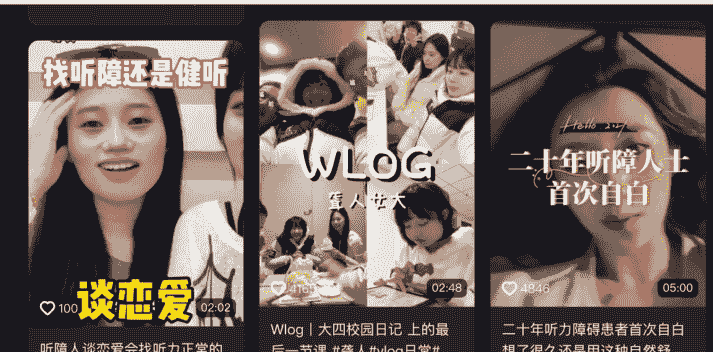

# 抖音上的聋人创作者

250703 新闻实验室

整理：公众号懒人搜索，懒人专属群独享
懒人微信：lazyhelper

> “聋人身份”被不断商品化，文化表达被压缩进流量和消费的模板中。

新闻实验室会员通讯（853）抖音上的聋人创作者

在抖音上庞大的短视频创作者人群中，有一些残障人士的身影。对于他们而言，短视频平台究竟是提供了表达与赋能的机会，还是带来了另一种偏见乃至剥削？

最近发表在学术期刊《New Media & Society》上的一篇论文，以抖音上的聋人创作者为研究对象，为我们揭示了这个群体和短视频平台之间的复杂关系。论文的作者是美国西南德克萨斯州立大学的两名博士生。

本期会员通讯，我们来一起了解这篇文章的研究发现。

## 「自发表达与外部热点的矛盾」

在中国，只有不到一半的适龄残疾人有工作，他们经常面临歧视和恶劣的工作条件。对于中国8591万残疾人来说，自媒体创业被视为一条可行的职业道路——残疾创作者的励志故事经常被宣传为自力更生的典型。在抖音平台上，截至2022年底已经发布来自残疾创作者的1410万条内容。

论文开头提到一位22岁的中国聋人创作者——她至今还记得一位听人观众给她留下的评论：“上帝捂住了你的耳朵，是为了让你听不到世界的噪音。”受到这句话的鼓舞，她制作了一个变装视频，从睡眼惺忪的睡衣造型转变为优雅的晚礼服形象。在视频里面，她温柔地微笑着，仔细地说出每一个字：谢谢亲爱的，你的存在温暖了我的整个世界。这位创作者在过去一年里一共上传了180个视频，与她的8万粉丝分享日常生活和美妆教程，获得了270万个赞。

在这样的个体故事之外，聋人短视频创作者的整体状况究竟如何？

两位研究者从2023年9月至2024年2月，连续六个月、每天投入1至1.5小时，沉浸式浏览和记录15位聋人创作者的抖音账号，累计观察时间约500小时。这些创作者的粉丝数从800到161万不等。通过这种长期、系统性的在线深度观察，研究者能够捕捉到创作者们的内容发布、观众互动、身份表达与自我调适等细腻的日常实践，并结合社会和文化语境进行解读。

除了在线观察与内容分析，作者还对这15位聋人创作者进行了一对一深度访谈，每次90至140分钟不等。访谈主要通过腾讯会议平台进行，由具备中国手语能力、长期参与聋人戏剧社群的研究者完成。

通过分析这15位创作者在这六个月内发布的484条视频，研究者们总结出七个不同的主题类别，按照视频数量多少排列分别是：

- 反歧视科普
- 聋人日常Vlog
- 美妆时尚
- 评论回复
- 聋人题材影视与手语歌曲
- LGBT情感
- 手语教学

可以看到，“反歧视”是最常见的视频类型。如一位受访者所说：“很多人认为聋人没有受过教育，愚蠢，或者是二等公民；我希望听人明白，他们的脑袋并不比我们更优越。”

然而，聋人创作者们最希望表达的内容，往往并不是流量最好的内容。反歧视科普和聋人日常Vlog分别只产生了8%和5%的总流量。相比之下，人气最高的四个主题——评论回复、聋人题材电影与手语歌曲、LGBT情感和美妆时尚尽管在视频数量上只占样本的47.7%，但流量却占了85.7%。论文指出，这里面的一个矛盾关键在于：如果视频仅仅是自发性的表达，那么往往流量不佳；而如果跟上了外部热点，就会容易走红。比如，聋人题材影视与手语歌曲的流行，很大程度上是因为当时恰逢张艺谋电影《第二十条》的上映。影片以赵丽颖饰演的聋人为主角之一，探讨了不平等问题。15位受访的聋人创作者中有9位制作了与该电影相关的内容，他们赞扬赵丽颖学习手语的努力，并且表示电影对聋人在社会面临的欺凌和不公正待遇有很真实的描述。正如一位受访者解释的：“我最初没有计划制作视频，但我在网上看到了爆火的片段，意识到名人因素的吸引力。于是我迅速抓住了这个热点，讨论电影中使用的手语，视频就火了。”

手语歌曲的流行则与抖音流行的手势舞有关，它同样不仅是聋人的自我表达，更是因为正好符合了平台的特色。

## 「算法逻辑下的身份商品化：听人中心主义的数字延续」

在抖音上，聋人创作者面临的最大挑战之一是：如何在以听人为主的数字环境中被看见。占主导地位的听人观众的偏好，会严重影响他们内容的流量表现。

大多数聋人创作者承认，他们最初也不确定什么可能引起听人的共鸣，于是通过广泛观察、分析他人内容和反复实验，逐步发展出了关于听人观众偏好的猜测和理解，也就是所谓“民间理论”（folk theory）。

为了迎合观众，聋人创作者不仅跟随社会热点，还直接回应观众的要求。比如，“评论回复”这种类型的视频往往流量不俗。在这种视频当中，聋人创作者们会录制他们对观众评论的反应，而这些评论往往是荒谬或搞笑的，比如“两个聋人之间的握手算接吻吗？”、“你在梦中打手语还是只是动嘴？”或者“如果你摔断了胳膊，那意味着你又失声了吗？”

聋人创作者们在讨论创作的时候，经常使用“人设”一词。人设是一个构建的符号，一种编码到观众想象中的风格投射，旨在满足他们的期望并培养认同感。

一位受访者说：“我的人设是天真、纯真的，就像一只‘可爱的小狗狗’……这不是我开始发布视频时选择的人设。是粉丝们认为我天真可爱，渐渐地，他们把这个人设归于我。”

另一位受访者说：“我的粉丝群体主要由‘妈妈粉’组成，她们深度投入我们的生活，经常像对待自己的孩子一样关心我们。她们喜欢磕CP（指他和他的同性伴侣）。因此，我发布迎合她们磕CP欲望的内容。”

研究者们认为，这种人设的构建反映了听人观众对聋人群体的家长式态度。听人观众不仅误解聋人文化，还将其琐碎化，比如将聋人之间的握手视为接吻，或将使用护手霜缓解“说话”疲劳视为罕见的事情。这些扭曲不仅反映了缺乏理解，也反映了对聋人生活方式、语言和价值观的漠视，延续了根植于家长制态度的刻板印象。

而另一方面，通过构建可爱、顺从或渴望爱情的人设，聋人创作者们将自己定位为与观众虚拟、模糊关系中的弱势一方。研究者们认为，虽然迎合这些偏好可能增加聋人创作者的可见性，但它也有强化刻板印象的风险，在听人家长制的框架里面延续聋人的经济和社会从属地位。

因此，聋人创作者面临一个悖论：虽然许多人最初制作发布短视频，是为了提升全社会对聋人的认识。但是，当以聋人为中心的内容未能吸引流量时，他们往往会淡化这些目标，转而采用以听人为中心的策略，这些策略符合听人观众的审美偏好和对聋人生活的夸大认知，最终远离了反歧视的愿景。

## 「是装上义肢，还是改变环境？」

此前许多关于残障创作者的研究强调文化因素，比如身份认同和自我表达，然而，这篇论文的研究者们发现，经济动机在中国聋人自媒体创作者中占据极其重要的位置。虽然受访者普遍希望通过内容提升公众认知、改善聋人群体形象，但现实中，经济收入往往成为他们坚持创作和调整内容策略的决定性因素。

正如一位受访者所说：“成长在农村，家境一般，社交媒体给了我被看见的机会，也让我能靠自己养活自己，这让我很自豪。”

但是，抖音的变现机制与 YouTube 不同。创作者只有在流量足够大、粉丝稳定且内容风格契合品牌需求时，才能吸引广告主主动合作。这也就意味着，聋人创作者要不断调整内容，向市场和主流口味靠拢，有时甚至不得不放弃自己最初的表达诉求。比如，一位以“正能量大哥哥”形象出道的受访者，一开始是分享应对压力和负面情绪的方法，但挣不到什么钱，后来转向分享与男友的甜蜜日常，吸引了大量 CP 粉，并获得了相对稳定的收入来源。

另一位曾因母婴品牌合作月入两万元的聋人妈妈，三个月没有广告后陷入经济焦虑，不得不尝试新的内容方向。这种“靠运气吃饭”的心态，让许多创作者将平台的不确定性归结于“幸运”或“倒霉”，内化了平台劳动内在的不稳定性。

在语言表达上，绝大多数视频都会配备普通话字幕，70%以上的视频有口语表达，只有大约三分之一的视频使用了中国手语。很多创作者会请听力较好的亲友担任“教练”，帮助自己纠正语言表达、优化视频节奏，迎合听人观众的情感和审美需求。这一方面提升了内容的传播度，但也意味着聋人文化与手语的独特性被削弱。

论文进一步指出，抖音平台虽然宣传“记录每一种生活”，但其深层逻辑依然是以盈利和主流趣味为导向，通过算法和商业机制引导内容同质化和文化顺从。在内容生产的背后，是复杂的社会技术网络。创作者们虽然在抖音上拥有了某种“发声权”，但这种权利往往是被平台、算法、流量和社会主流审美共同塑造和限制的。

在结论部分，两位研究者指出，抖音上的聋人内容生产，实际上是一种“义肢（prosthesis）”模式——就好像肢体残障者戴上义肢以便适应主流社会一样，创作者通过各种技术、经济和人际辅助手段，把自己调整成更接近主流的样子，才能被看见、获得经济回报。在这种模式下，“聋人身份”被不断商品化，文化表达被压缩进流量和消费的模板中，真正多元和有深度的内容很难获得平台支持。

## 公众号懒人搜索，懒人专属群分享

平台、广告主和主流观众共同参与了对少数群体文化的再生产。

研究者呼吁，平台应该从“义肢模式”转向“环境适应（habilitation）”模式——habilitation 这个词强调的是，要通过改变外部环境，来为个体创造新的能动性。按照这样的模式，平台在算法设计、内容推荐、商业合作等环节中，应该主动消除对非主流内容和身份的壁垒，真正赋予边缘群体表达自我、塑造自我和获得平等的空间。只有这样，数字时代的多元与包容才有可能被真正实现。

- 懒人专属群持续更新中，已持续运营 6 年，整理超 3000 份各类精选付费文章 & 年费社群干货，全部开放下载。

本资料为付费群内分享，仅供真实有需要的朋友查阅

懒人专属群更新记录：
https://lazy2025.top/#/blog/record2

懒人专属群更新记录（需梯子，备用）：
https://lazybook.fun/#/blog/record2

懒人微信：lazyhelper