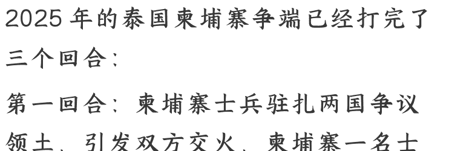

# 柬泰斗争的背后，双方藏着什么算计？

250704 文/卢克文工作室嘉宾 低调老弟
整理：公众号懒人搜索，懒人专属群独享
懒人微信：lazyhelper

2025年的泰国柬埔寨争端已经打完了三个回合：

- 第一回合：柬埔寨士兵驻扎两国争议领土，引发双方交火，柬埔寨一名士兵死亡。仅从斗争的气势来看，柬埔寨小输一局。
- 第二回合：两国政府约定各自撤兵，留出军事缓冲。柬军如约撤退，但泰国第二军区只是调整了一下部署，然后单方面宣布柬埔寨撤兵了。柬埔寨在面子上再次小输。
- 第三回合：泰国总理佩通坦私下打电话给柬埔寨话事人洪森，表示事情搞成这样是因为第二军区司令这个疯子不听她这个总理的话。文官政府要对柬埔寨断电断网的预案只是做做样子，不会真这么干的。咱们两家是三十三年的世交，请叔叔帮帮侄女。不然侄女现在很难做啊，到处都在说吃里扒外，应该去当柬埔寨的总理。请叔叔支持我，相信我一定能把事情处理好。

自从洪森把泰国总理的这个电话泄露出去，引爆泰国政府信任危机，泰柬攻守之势逆转。7月1日，泰国宪法法院以7:2的票数判决总理佩通坦被停职。

柬埔寨大胜，把前面丢的面子扳了回来。

目前我们常见的观察，是说洪森老辣，佩通坦忒嫩。可是，洪森的对手，其实并不是那位当家不做主的总理佩通坦，而是隐居幕后的泰王。

一旦明确了这一点，就会发现，泰柬两国争端的本质，不是边境领土争夺，也不是国际公关的口水战，而是外部矛盾掩盖下，两国各自最高权力继承问题。

## 一、洪森

2023年，洪森率领人民党再一次赢得大选之后辞去首相，他的三个儿子分别上位首相兼陆军司令、陆军副司令和副首相。

同时，副首相兼内政大臣，副首相兼国防大臣这两个管理军警的要害位置，也各自传给了他们的儿子。

这次权力交接立刻就迎来了两大挑战。

外部，美国和欧洲议会都以反对党被取消选举资格为由，拒不承认选举结果。美国暂停了对柬埔寨的部分援助，并对洪森及其亲信家族进行制裁。

内部，且不说流亡海外和被软禁的那两代反对党领袖，就说人民党内部，洪森家族分的蛋糕多了，那其他家族的盼头当然就少了。他们未必想推翻洪森家族，但如果能让洪森的儿子们让出一些利益，估计也是乐见其成的。

一波未平，一波又起。柬埔寨和越南的关系又出现裂痕。

2024 年 7 月。越南国家主席苏林访问柬埔寨时，洪森承诺：“坚决不让敌对势力扭曲和分裂两国友谊。”

8 月，柬埔寨爆发抗议活动，质疑柬埔寨政府计划通过越老柬发展三角区向越南让渡领土。

9 月，洪森通过个人脸书宣布：柬埔寨退出三角发展区，以防止反对派借机攻击政府。

如果把 2024 年 8 月 5 日奠基的崇德富南运河考虑进去，就很容易看明白了。洪森通过与中国合作开凿运河，摆脱对越南港口的依赖。又为了安抚越南，在越老柬发展三角区扩大开放。形式上，越老柬的老百姓都可以在三角区买房子置地，可实际上越南比老挝柬埔寨富裕得多，三方收获并不对等。所以这一次反对派的声浪是特别的迅猛。在三十多人被捕以后，反对派不仅不怕事儿，还要往大了整。最终逼得洪森不得不退让。

美国支持的柬埔寨自由派攻击洪森是中国的附庸，柬埔寨的民族主义情绪又和越南水火不容。那怎么才能既转移视线，又塑造洪森家族独立、强硬的形象呢？

洪森给出的答案是在泰国做文章。

2025年的泰国柬埔寨争端，冲上热搜是因为“录音门”。可争端最早是柬埔寨士兵在争议地区驻扎。泰国总理佩通坦打来的电话也是从一开始就被洪森录音。这两件事都说明洪森是早有准备。即使没有这个电话，洪森也会像后来那样直播爆出佩通坦的父亲，泰国前总理他信的猛料——比如私下冒犯泰国老国王。

表面上看，即使泰国换了总理，可两国矛盾激化成这样，无论谁接替佩通坦都不敢对柬埔寨让步。可洪森已经借此实现了两个目的：

于公，转移反对派对中国和越南的视线。中柬合作的运河项目接着搞起来、把过去对泰国电力、网络的依赖转交给越南。毕竟对洪森家族而言，中越都比泰国来得重要。

于私，让三个儿子增加曝光、树立强人形象。这次争端，洪森本人好像是因为泄密引发了外界对其人品的质疑。其实洪森从发迹至今四十年来屹立不倒，类似的手段玩的多了去了。从背叛柬埔寨共产党，给越南人民军带路攻克金边；到背着越南私会西哈努克。从在西哈努克的二殿下和殿下之间左右横跳，到政变推翻王室的中流砥柱二殿下诺罗顿·拉那烈。债多不压身，脏活儿都让老爹干，真是父爱如山呐。

看到这里，读者们可能会觉得洪森这不是下的一手好棋吗？为什么我还要说他被高估了呢？

因为洪森的谋划，只有中间的过程是精彩的。开端，是他低估了反对派能量，被迫采取的应对措施。而结局如何，又存在一个巨大的不确定性——那位被外界认为望之不似人君的泰王，又会如何接招呢？

## 二、泰王

自 2016 年登基以来，拉玛十世玛哈哇集拉隆功给外界的印象是：

长期隐居在德国的豪华酒店花天酒地；后宫嫔妃能上能下争奇斗艳；泰国年轻人集会抗议要求建立共和国，至少是改革《刑法》取消“冒犯君主罪”。

可泰王至少有三大成就：在摄政王去世后牢牢掌握住了军方、通过《2017年宪法》达成王室、文官、武将的三角平衡，九年来没有发生军事政变。尤其出人意料的是，联合了旧的改革派他信家族（掌握国会两大党），压制住了新的改革派（国会第一大党）。

通俗点说，就像玉皇大帝用二郎神对付孙悟空。不过，泰王能坐稳王位，不代表权力能够顺利继承。

须知，玛哈哇集拉隆功是做了六十四年的王储，继承了父亲神王的光环和母后家族的强大背景。他在越南战争和与泰共游击队的战斗中立下的军功即使有夸大和作秀的成分，起码人家是真的会开战斗机，真的上过战场。

再看准王储提帮功王子，现年二十岁，其母妃西拉米出身于农家，发迹于夜总会，还被爆出半裸趴在地上喂狗的不雅视频。2014年泰国军事政变以后，西拉米家族多名成员因贪腐入狱。西拉米王妃被剥夺王室身份，削发出家。

不过，西拉米家族除了准王储之外，还有另外一张牌。那就是与他信家族的关系。

坊间传言，二十多年前国色天香的西拉米能够攀上王储玛哈哇集拉隆功的高枝，正是当时的泰国总理他信介绍的。可以作为佐证的是——老国王拉玛九世批判他信的罪名之一，就是出钱诱导王储玛哈哇集拉隆功花天酒地。2014年军方在老国王支持下推翻他信的妹妹，时任总理英拉之后，西拉米王妃一家紧接着就被清算了。

可他信家族和西拉米家族都是被老国王和军方老一辈收拾的。对于玛哈哇集拉隆功来说，这两个家族都是他衣不如新，人不如故的故人。

二十多年过去，国王和军方都更新换代，与他信家族握手，共治天下。可提帮功王子将来是像祖父、父亲一样当一个实权国王，还是变成军方的傀儡？他能用来制衡军方的，不就剩下他信家族这个二郎神了吗？

洪森引爆的录音门确实打乱了泰王的立储大计，把泰王的远虑变成了近忧。二郎神私底下骂天兵天将的事儿搞得人尽皆知。玉帝不能不敲打二郎神，又不能真的废了二郎神。

敲打的一面，是放任民众抗议并在7月1日让总理佩通坦停职。同一天，前总理他信就侮辱君主罪接受调查。

维护的一面那就得好好的说道说道了：

- 泰王第一招：促成军方与文官政府达成谅解。军方在第一时间表态保证不会发动政变。这是泰国历史上从来没有出现过的神奇表态……被佩通坦骂作疯子的第二军区司令表示接受道歉：“我没问题，我理解，我会继续履行职责”。
- 泰王第二招：把2023年回国之后到处作秀，试图争夺储位的二王子再次驱逐出境。这可能是因为一母所生的前四个王子常年居住在美国，而泰国国会第一大党，也就是被比作孙悟空的反对派，并不掩饰其美西方支持的背景。
- 泰王第三招：御批新内阁名单。佩通坦的总理职务虽然被停掉了，可她还有兼任的文化部长职位，照样可以参加内阁会议。看守总理和兼任内政部长，掌握警察部队的副总理，也都是佩通坦一党。等于说，佩通坦现在是降级留任。

对于佩通坦而言，复职、免职还是以文化部长的头衔当影子总理那是大不一样。但对泰王来说，一边平息争议止损，一边把矛盾转向柬埔寨，避免重新大选之后造反派坐大，就是胜利。

## 三、总结

每当国际上发生什么争端，我们都会首先怀疑是美国的阴谋。美国的作风配得上这样的怀疑，但总这么看，也很容易夸大美国的影响力，而忽视了各国内部的情况。

就说这次泰国柬埔寨争端，如果两国矛盾持续升级，确实不利于我们家门口的安全稳定。可我们不要忘了，两个邻居闹矛盾的时候，也正是他们跟我们最好说话的时候。

洪森在下一盘险棋，凭借老辣手段在争端中掀起波澜，试图为家族权力过渡保驾护航，却难以完全掌控内外反对势力的冲击。他谋划的开局仓促、结局未定，展现出权力传承路上的重重挑战；

泰王在织一张密网，在危机中精准出招，既敲打了他信家族势力，又维护其不至于倒向反对派，同时为提帮功王子未来铺路，展现出对权力平衡的把控与手腕。

小国的命运并不总是掌握在大国手中，命运的齿轮总会深藏在那些午夜密会的耳语里、王宫帷幕后的算计之下，以及街头巷尾压抑的怒火中。

懒人专属群持续更新中，已持续运营 6 年，整理超 3000 份各类精选付费文章 & 年费社群干货，全部开放下载。

本资料为付费群内部分享，仅供真实有需要的朋友查阅🙇

懒人专属群更新记录：
https://lazy2025.top/#/blog/record2

懒人专属群更新记录（需梯子，备用）：
https://lazybook.fun/#/blog/record2

懒人微信：lazyhelper