# 一个人，一套自动化流程，如何玩转100个中老年书法视频号矩阵？

250704  生财精华

公众号懒人搜索，懒人专属群独享

懒人微信：lazyhelper


### 【写在前面】

圈友们好，我是文锴，base 福州。

这篇文章，我想复盘一下自己从2024年3月开始，在视频号做中老年书法流量的经历。我会毫无保留地分享，如何从一个人手忙脚乱地运营5个号，进化到一个人轻松管理100个视频号矩阵，并搭建起一套自动化引流的SOP。

这篇文章很长，1万字左右，信息密度很大，但如果你对矩阵玩法、自动化提效、中老年流量感兴趣，相信我，耐心看完，你将收获：

- 一个完整的 中老年书法知识付费项目的保姆级操盘手册。
- 一套“发现问题→寻找工具→组合应用”的自动化提效工作流。
- 我个人关于项目取舍、聚焦核心竞争力的深度思考。

懒人微信：lazyhelper

在正式开始前，请允许我简单聊聊我的上一个项目，这能帮助你更好地理解我为什么会对“自动化”和“提效”有如此深的执念。

### 引子：始于 1600 万营业额的执念

2022 年 3 月到 2023 年 9 月，我做的项目是帮某电商平台的买药业务做线上推广。模式很简单，用户通过我的专属二维码进入平台小程序，可以花 1 分钱买到酒精、口罩、碘伏棉签这类防疫用品，每成功拉新一个用户，我能拿到十几块的佣金。

这在当时是一个现象级的项目。疫情时代背景下，“1 分钱买防疫用品”这个钩子足够强，地推、网推、淘客的获客成本极低。我一个人，用了一年半的时间，拉新用户超过 100 万，做到了 1600 万的营业额。以下是部分收款截图：

### 信息中的“推广费用”

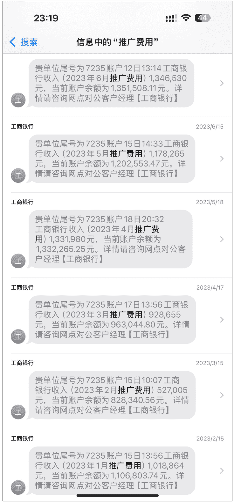

听起来很顺利，但背后其实是“卷”出来的核心竞争力。当时做这个业务的渠道有很多家，大家比拼的无非是拉新量。但这个模式有个天然的痛点：用户是一次性的，复购率几乎为0。用户领完1分钱的福利就走了，渠道方很难再次触达他们。

其他渠道觉得做复购太麻烦，投入产出比低，都选择放弃。而我当时就琢磨，如果我能解决“复购”这个甲方最头疼的问题，是不是就能建立起我的护城河？

我的解法简单粗暴：流量私有化。

我没有直接让用户扫平台的小程序码，而是设计了一个中间步骤：用户必须先关注我的公众号，公众号会自动弹出 1分购 的二维码。

就这一个动作，改变了游戏的性质。用户不再是一次性的流水，而是沉淀在了我的公众号里。后续，我通过公众号持续推送复购福利，甚至自掏腰包，拿出首单佣金的一部分来补贴复购用户。最终，我硬生生把复购率做到了 5%-8%。

这个数字在同行看来是不可思议的。也正因为做到了别人做不到的事，解决了甲方的核心痛点，我顺利拿下了买药项目独家代理权。我的 3 个公众号也因此总共积累了 50 多万粉丝。

21:51
49
数据统计 更新至2025/06/30
1
0
昨日阅读
昨日分享
关注我的人 140612 35
流量主收入
昨日收入¥0.00
传图片到素材库
互动 发表 我

21:51
49
数据统计 更新至 2025/06/30
0
昨日阅读
0
昨日分享
关注我的人 208920
23
流量主收入
昨日收入¥0.00
传图片到素材库
互动 发表 我

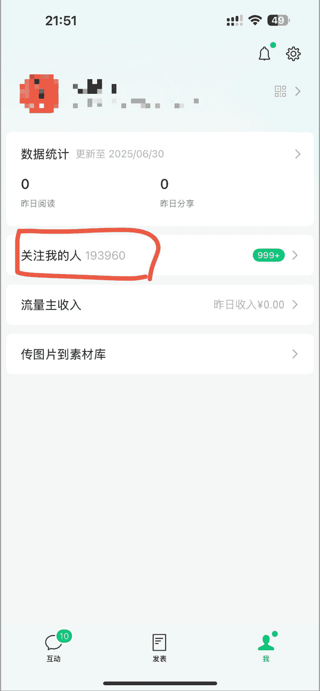

这段经历给我带来了两点刻骨铭心的感悟：

抓住时代红利： 好的项目往往有其特定的时间窗口，窗口期一过，再想复制难如登天。看准了就要 all in，大力出奇迹。

懒人微信：lazyhelper

7 / 43

建立核心壁垒： 生意的本质是解决问题。你能解决别人解决不了的问题，你就有定价权。我的“复购能力”，就是当时的核心壁垒。

这 50 万的公众号粉丝，不仅是那段经历的见证，也成了我今天这个视频号项目冷启动的宝贵资源。

## 一、回归现实：从“手工作坊”开始的视频号之旅

2023 年 9 月，之前的买药项目因业务调整暂停，我瞬间“失业”，不得不寻找新方向。但看过太多机会，总觉得差点意思。直到 2024 年 3 月，我加入了生财的中老年书法知识付费航海，我敏锐地感觉到，这个市场足够大，且有长期价值，是个值得深耕的机会。

项目的商业模式很清晰：在视频号发布书法教学内容 -> 引流到私域 -> 交付 6 天体验课 -> 转化正价课。

理想很丰满，现实很骨感。项目初期，我完全是一个“手工作坊”的状态，每一步都充满了体力劳动的辛酸。

### 视频制作：低效的“搬运工”

我一个人，每天的工作就是“剪视频”。

- 找素材： 去抖音搜索“书法教学”、“零基础学书法”等关键词，专门找那些不露脸、只有手部写字特写的视频。
- 下视频： 一个个复制链接，用工具去水印下载。

### 做剪辑： 把下载好的视频导入剪映，开始一套去重流程：

- 抠图换背景： 用色度抠图把写字背景抠出来，换上其他背景图片。
- 处理音频： 先用“仅保留人声”功能去掉原视频的背景音乐，再随便配一段新的古风音乐。
- 修改音色： 如果原声是男声，就用变声功能换成女声，反之亦然。
- 调整速度： 视频整体调速到 1.1 倍或 0.9 倍。
- 增加元素： 随便加点贴纸、滤镜，或者加个画中画。

这一套流程下来，一个视频至少要折腾几十分钟。我每天从早到晚坐在电脑前，脖子僵硬，眼睛发酸，极限产能也就十几个视频。

### 视频发布：机械的“发布员”

我把我自己的号、我家人的号……能用的全用上了，凑了 5 个视频号。

发布视频的过程同样痛苦。我需要在电脑上打开视频号网页版，一个一个扫码登录，然后像个机器人一样，手动执行以下操作：

- 上传视频
- 复制粘贴标题
- 添加#书法、#书法教学 等话题
- 从视频里选择一张看起来不错的帧作为封面
- 设置定时发布

5个账号，每个账号一天发3条，就是15次重复劳动。发布完视频，感觉半天就过去了。

### 引流与后端：混乱的“客服”与“销售”

引流全靠“主动”。我会去主动私信那些给我点赞、评论的用户，话术也很直接：“您好，想系统学习书法可以加我微信XXXX，免费送您一套入门教程”。

回复私信和评论也是个体力活，需要时刻盯着手机，生怕错过潜在客户。

后端的转化更让我崩溃。我当时自己卖书法课，但整个流程特别累人。我辛辛苦苦引流了半个月，攒了百来号人，结果拉群转化的时候只进了50多人，直接流失了一半用户，气氛搞不起来，水军还得自己上，手忙脚乱。那一个多月，我感觉自己分裂成了好几个人：视频剪辑师、账号运营、客服、销售、社群管理员……所有的时间都被填满，每天累得像条狗，但盘算一下收入，却少得可怜。

我意识到，这样下去不行。这种劳动密集型的工作方式，天花板太低了。我一个人再怎么拼命，也只是一个“手工作坊”，永远做不成“工厂”。

我必须改变。

## 二、破局之路：从“人肉”到“自动化”的进化

我把自己关起来，强迫自己冷静思考。我把整个业务流程从头到尾画了一张图，把每个环节耗费的时间都标注了出来。

不画不知道，一画吓一跳。我发现80%的时间，都花在了视频制作和账号运营这两个环节上。而这两个环节，充满了大量重复性、机械性的劳动。

我的破局点，就在于“提效”。能不能用工具代替人工？能不能把重复性动作自动化？

答案是肯定的。接下来，你将看到我的“武器库”，以及我是如何一步步用工具组合，把自己从繁重的体力劳动中解放出来的。

### 第一步：解决素材来源——视频批量下载

手动下载视频是效率最低下的环节之一。
我开始寻找能够批量下载的工具。

#### 迭代1.0：哼哼猫等传统工具

- 优点：能用，可以批量下载。
- 痛点：功能比较单一，自定义程度不高，比如不能根据点赞量筛选，下载的文件名也乱七八糟，还需要会员。

#### 迭代2.0：【江湖工具箱】（神器！）

- 优点：
  - 免费！
  - 功能极其强大： 不仅可以批量下载指定博主主页的所有视频，还能根据关键词、话题去批量下载。
  - 支持筛选： 这是我最看重的功能。我可以设置只下载点赞量大于500的作品，直接过滤掉大部分无效素材。
  - 自定义命名： 下载的视频可以按照“作者-点赞量-序号-视频标题”来命名，方便我后续管理。
- 我的用法： 我会用它批量下载多个作者点赞量超过500的视频，一次性就能储备几百个高质量的原始素材。

##### 【江湖工具箱】使用教程：

下载地址：

https://www.jianghudata.com/

使用教程：打开作品提取工具，选择对应平台，支持抖音、快手、小红书、b站、今日头条、tiktok、youtube

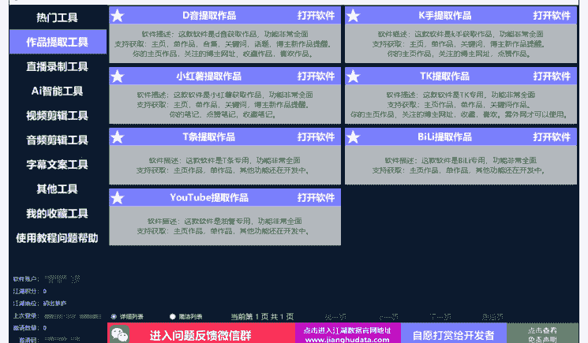

打开抖音提取作品，vip中心把下载器改成普通下载器，实测速度也很快，这样就不用会员

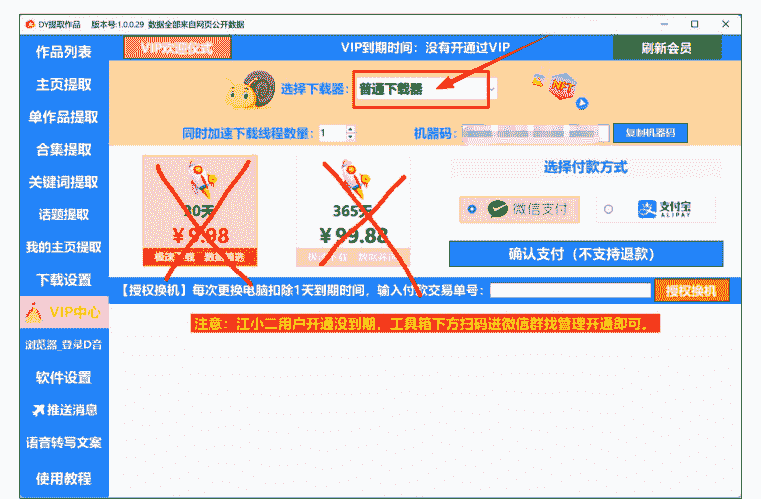

##### 可根据需求设置下载的作品命名规则

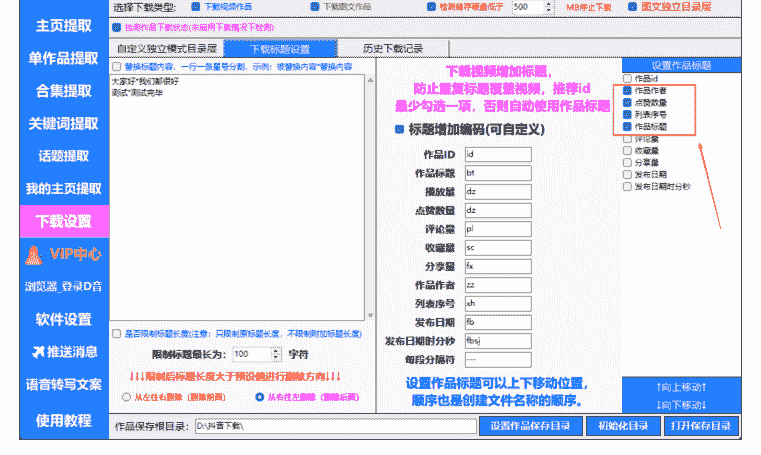

##### 输入作者主页链接，点击开始添加主页，提取主页

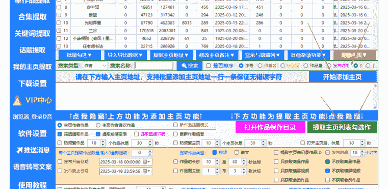

##### 筛选点赞量大于 500 的作品，点击开始下载

| 作品列表 | 序号 | 作者 | 提取方式 | 作品类型 | 作品标题(双击预览或播放) | 点赞量 | 视频时长 | 图片数量 | 分辨率 | 下载状态 | 作品发布时间 | 商品 | 关键词 | 备注 |
| :--- | :--- | :--- | :--- | :--- | :--- | :--- | :--- | :--- | :--- | :--- | :--- | :--- | :--- | :--- |
| 主页提取 | 125 | 书法a立阳 | 主页 | 视频 | 今天过后,包你也不懂#... | 2442 | 17秒 | | 1080p | 0% | 2025-05-15 20:27:47 | 否 | 默认 | |
| 单作品提取 | 442 | 书法a立阳 | 主页 | 视频 | 四位大佬,逼宫博皇四位... | 2201 | 14秒 | | 1080p | 0% | 2025-01-15 10:21:47 | 否 | 默认 | |
| 合集提取 | 244 | 书法a立阳 | 主页 | 视频 | 八蛋出海,其实就是职场... | 2137 | 16秒 | | 1080p | 0% | 2025-03-23 19:40:52 | 否 | 默认 | |
| | 182 | 书法a立阳 | 主页 | 视频 | 墨法落地,动作解析#书... | 2012 | 16秒 | | 1080p | 0% | 2025-04-22 19:57:25 | 否 | 默认 | |
| | 122 | 书法a立阳 | 主页 | 视频 | 内行都知道,一切细节皆... | 1827 | 12秒 | | 1080p | 0% | 2025-05-17 06:41:59 | 否 | 默认 | |
| | 97 | 书法a立阳 | 主页 | 视频 | 二王笔法的前后传承,越... | 1765 | 13秒 | | 1080p | 0% | 2025-05-26 17:48:56 | 否 | 默认 | |
| | 28 | 书法a立阳 | 主页 | 视频 | 墨法的根本动作-换墨#... | 1743 | 22秒 | | 1080p | 0% | 2025-06-22 19:36:24 | 否 | 默认 | |
| | 152 | 书法a立阳 | 主页 | 视频 | 系列笔法动作也是为了取... | 1738 | 17秒 | | 1080p | 0% | 2025-05-05 16:34:09 | 否 | 默认 | |
| | 42 | 书法a立阳 | 主页 | 视频 | 写的时候不一定是好的。练... | 1664 | 19秒 | | 1080p | 0% | 2025-06-16 12:21:06 | 否 | 默认 | |
| | 150 | 书法a立阳 | 主页 | 视频 | 把围绕杂素,八蛋出峰#... | 1649 | 14秒 | | 1080p | 0% | 2025-05-06 06:18:48 | 否 | 默认 | |
| | 246 | 书法a立阳 | 主页 | 视频 | 学赵体,请不要试图“调... | 1641 | 13秒 | | 1080p | 0% | 2025-03-22 19:59:29 | 否 | 默认 | |
| | 257 | 书法a立阳 | 主页 | 视频 | 学会赵孟頫最爱的齐齐整。 | 1487 | 17秒 | | 1080p | 已存在 | 2025-03-15 20:29:46 | 否 | 默认 | |
| | 143 | 书法a立阳 | 主页 | 视频 | 米带的撇,赵孟頫的折#... | 1460 | 13秒 | | 1080p | 0% | 2025-05-09 06:37:17 | 否 | 默认 | |
| | 160 | 书法a立阳 | 主页 | 视频 | 阻接笔法在接笔时的应用。 | 1415 | 19秒 | | 1080p | 0% | 2025-05-02 08:24:24 | 否 | 默认 | |
| | 159 | 书法a立阳 | 主页 | 视频 | 赵孟頫并臂腿-划。笔法... | 1403 | 18秒 | | 1080p | 0% | 2025-05-02 15:57:19 | 否 | 默认 | |
| | 250 | 书法a立阳 | 主页 | 视频 | 里子一样了,面子不一样... | 1369 | 20秒 | | 1080p | 0% | 2025-03-21 10:36:27 | 否 | 默认 | |
| | 157 | 书法a立阳 | 主页 | 视频 | 一画之间,起伏在于惊秒... | 1299 | 12秒 | | 1080p | 0% | 2025-05-03 16:09:13 | 否 | 默认 | |
| | 79 | 书法a立阳 | 主页 | 视频 | 赵孟頫用展纸-秘#书... | 1291 | 12秒 | | 1080p | 0% | 2025-06-02 12:07:08 | 否 | 默认 | |
| | 285 | 书法a立阳 | 主页 | 视频 | 崔寒柏老师解悟语,训... | 1278 | 36秒 | | 1080p | 0% | 2025-03-08 01:14:25 | 否 | 默认 | |

### 第二步：解决内容生产——视频批量剪辑

有了素材库，接下来就是最耗时的剪辑环节。我的目标是：人只做有创意的工作（做模板），让机器去完成重复的体力活（批量生成）。

#### 迭代 1.0：奇杰老师的“I/O 大法”

我在生财学习到了奇杰老师的单人日产 200 条视频的方法。核心思路是在一个剪映草稿里批量剪辑多个视频，然后通过快捷键 I 和 O 快速设置出入点，来切割视频片段并导出。

- 优点：思路非常棒，大大提升了产出视频的效率。
- 痛点：依然需要大量人工介入，每剪出一个视频，都需要手动点击导出，非常耗时。它解决了“剪”的效率，但没解决“导出”的效率。

#### 迭代 2.0：【剪映批量剪辑助手】（效率倍增器）

这是一个 RPA 软件，简单来说，就是模拟人的操作，让电脑自动干活。

##### 核心功能：

懒人微信：lazyhelper

- 批量生成草稿：我只需要在剪映里先手动做好一个“草稿模板”(比如背景、BGM、滤镜都设置好)。然后准备好N个素材视频,用这个软件,它能自动替换素材,在几十秒内批量生成N个独立的剪映草稿。
- 批量导出成品:这是最关键的一步。软件可以自动、依次打开每一个草稿,然后点击导出按钮,导出完成后再自动打开下一个草稿……我只需要点击一下“开始”,然后就可以去喝茶了,电脑会自己把所有视频都导出。
- 效果:以前我导出一个视频要1分钟,现在导出100个视频,也只是我点一下鼠标的事。

##### 【剪映批量剪辑助手】使用教程:

##### 下载地址:

##### 使用教程:先在剪映做好初始草稿

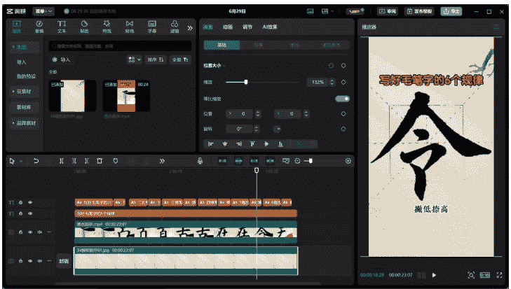

##### 准备好要替换的素材


##### 点击分区混剪替换，选择草稿选择替换内容

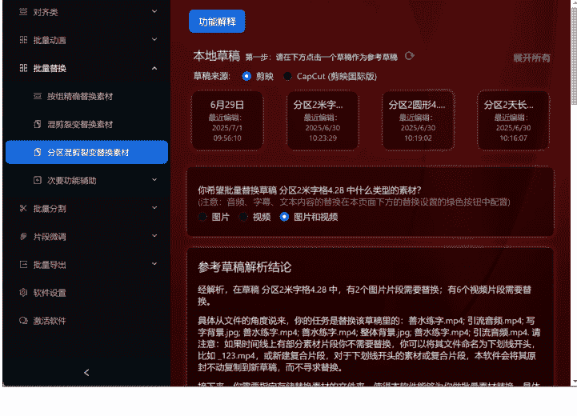

##### 设置替换参数，选择替换素材文件夹

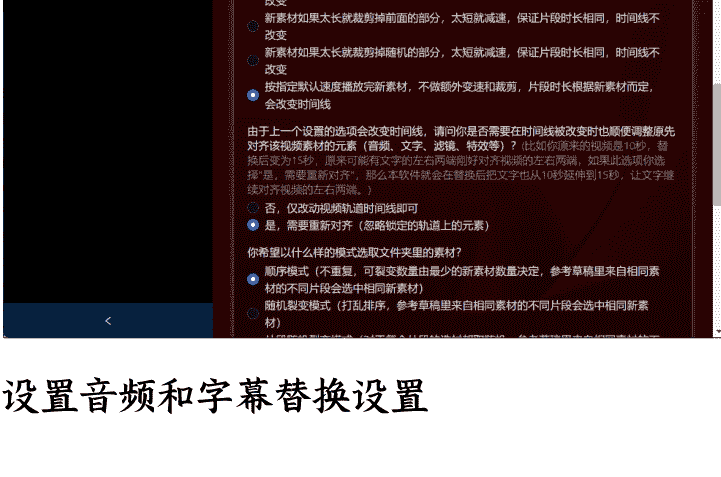

##### 设置音频和字幕替换设置

懒人微信:lazyhelper

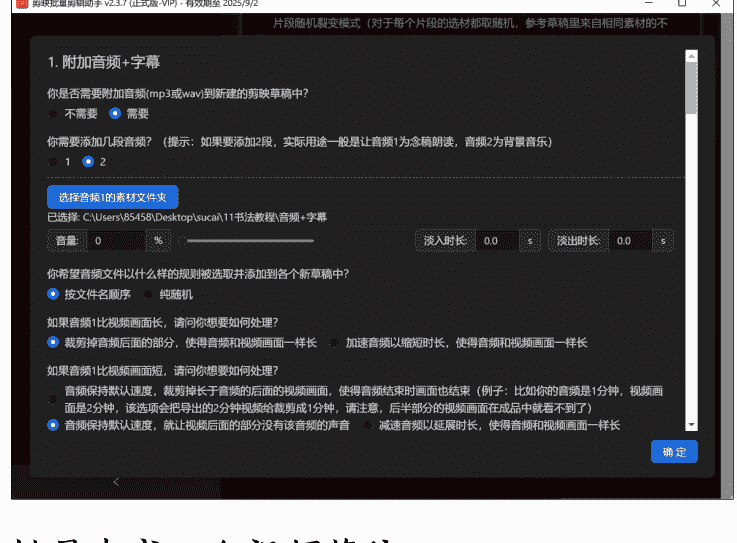

##### 批量生成 n 个视频草稿

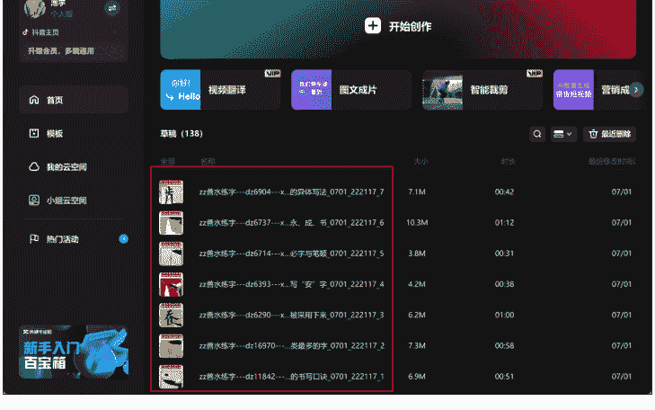

##### 使用多个草稿自动化导出功能，批量导出剪映草稿

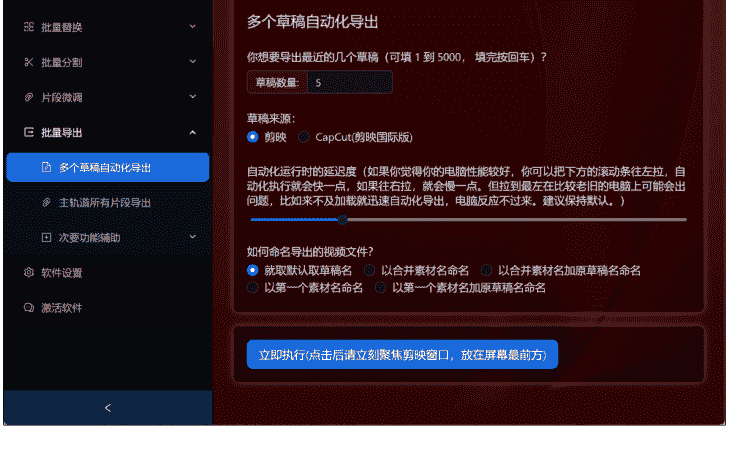

##### 一次性导出多个成品视频：

懒人微信：lazyhelper

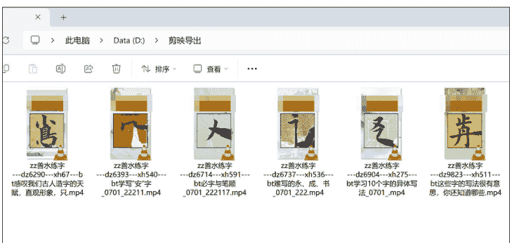

### 第三步：内容策略升级——从“混剪”到“AI 生成”

虽然工具提效了，但我很快遇到了新的瓶颈：内容同质化。

我最初的模板是“抠像换背景+提取原视频字幕”。提取字幕我用的是【AsrTools】这个开源工具，它可以批量把视频转成 srt 字幕文件。

#### 【AsrTools】使用教程：

#### 下载地址：

```
https://github.com/WEIFENG2333/AsrTools
```

使用教程：批量上传视频文件，选择导出 SRT，点击开始处理就能得到 SRT 字幕文件

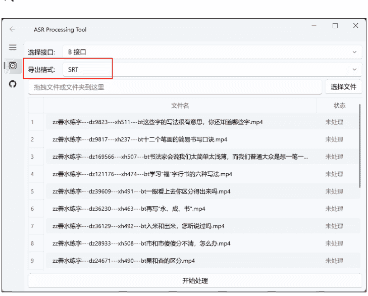

但这个模式有个致命问题：所有视频的音频和文案内容都是一样的。这样做出来的视频，发多了之后，平台很容易判定为重复或低质内容，流量越来越差。

我必须生产出“文案、音频、画面”三者都不同的原创内容。于是，我开始了内容生产的2.0迭代，一个完全基于AI的流水线。

#### AI 批量生产文案+音频+字幕

画面：用【江湖工具箱】下载大量高清写字视频。如果一个长视频里包含写多个字的过程，就用【剪映批量剪辑助手】的“智能镜头分割”功能，把它自动切割成N个写单个字的短视频片段。这样做是为了打散素材，实现后续的随机组合，最大程度降低画面重复率。

#### 【剪映批量剪辑助手-智能镜头分割】使用教程：找到智能镜头分割选项，选择输入和输出文件夹，软件能智能识别出不同镜头并切割

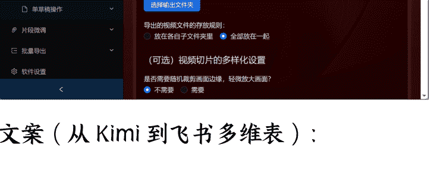

### 文案（从 Kimi 到飞书多维表）：

懒人微信：lazyhelper

##### 1.0 阶段：我尝试用豆包或 Kimi 来写书法相关的文案。但一次性让它写几十上百条，它要么写到后面质量严重下滑，要么干脆中途罢工。

##### 2.0 阶段：我在小红书上学到了一招，用【飞书多维表+AI】。飞书多维表接入了 DeepSeek 等大模型，而且是多线程处理。我只需要设计好一个 Prompt 模板，然后在表格里列出几百个我想写的主题，AI 就能稳定、高质量地为我批量生成文案。

##### 【飞书多维表-AI 批量生成文案】使用教程

表格地址：https://olfqb2ldn.feishu.cn/drive/home/ (这是飞书云文档首页，用户需自行创建)

使用教程：创建一个多维表格，设置标题、文案等列，文案用 deepseek 捷径设置提示词根据标题生成文案，只需要批量输入标题即可生成对应文案

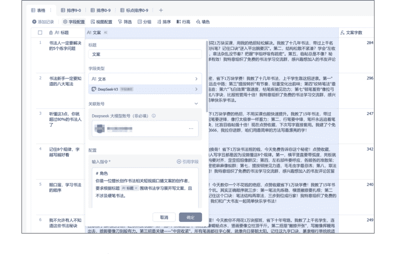

### 音频（从剪映到海豚配音）

有了文案，需要转成音频。在剪映里一个个文本朗读太慢了。后来我用了【海豚配音】。

优点：支持批量导入文案，然后一键批量生成音频，还能选择不同音色。效率极高。

#### 【海豚配音】使用教程

网站地址：https://www.ttson.cn/?source=8omH8q

使用教程：在多人配音中，批量导入生成的文案，点击批量生成音频，生成完毕批量下载

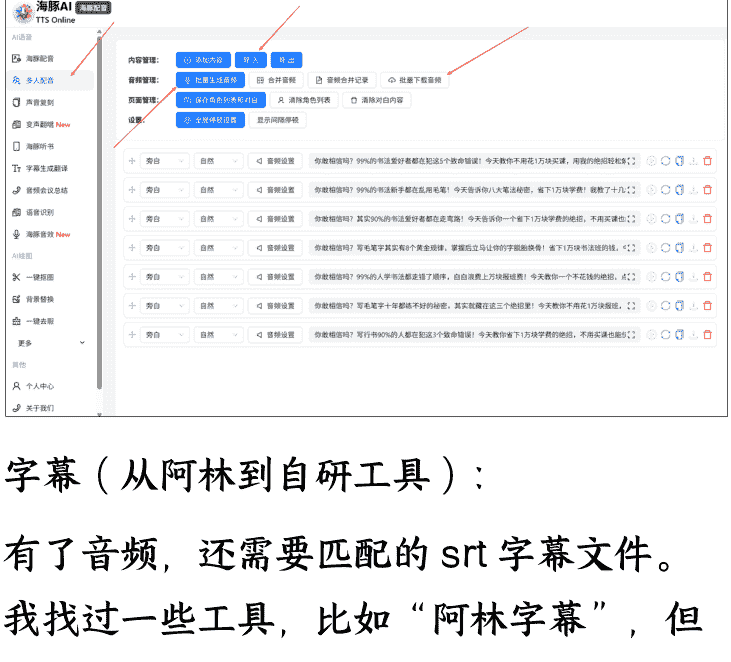

### 字幕（从阿林到自研工具）

有了音频，还需要匹配的 SRT 字幕文件。我找过一些工具，比如“阿林字幕”，但生成的字幕格式总有些小问题，需要手动调整。

作为一个爱折腾的人，我干脆用豆包的 AI 编程功能，给自己写了一个网页小工具。这个工具可以完美地把 txt 文本一键转换成我需要的 SRT 格式，并且自动按我的要求命名。

#### 【文本转 SRT 字幕工具】使用教程

网站地址：https://yin666888.github.io/srt2/

使用教程：复制飞书多维表的标题和文案，粘贴到输入框，点击处理文本，点击下载生成的 SRT 字幕

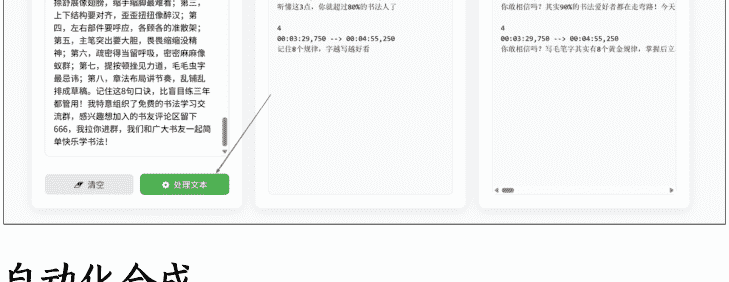

### 自动化合成

现在，我拥有了三个独立的素材库：

画面库：N 个被切割打乱的写字短视频片段。
音频库：N 个由 AI 文案生成的配音。
字幕库：N 个与音频匹配的 SRT 文件。

最后一步，就是把它们随机组合并批量合成。

我再次用上了【剪映批量剪辑助手】。在模板草稿里，我设置好轨道：

视频轨道：放置多个视频片段，并设置为静音、抠像。
音频轨道：放置配音文件。
文本轨道：放置 SRT 字幕文件。

然后，软件会自动从我的素材库里随机抽取画面、音频、字幕进行匹配组合，批量生成和导出视频。

至此，我建立起了一条内容生产的自动化流水线。我需要做的，只是定期补充这三个素材库。理论上，我可以无限地生成“文案、音频、画面”均不相同的原创视频，彻底解决了内容同质化的问题。

## 三、规模化放大：从5个号到100个矩阵号

内容生产的瓶颈被打破后，5个账号显然不够用了。我需要规模化的账号来源。

#### 迭代1.0：素人代发模式

我尝试招募一批兼职人员，让他们用自己的视频号发视频、回私信。我按私信量给他们计费，一条一毛钱。

痛点：这个模式的管理成本极高。每天要和几十个兼职人员沟通，检查他们的工作（比如要求他们录屏证明私信数量），催促他们及时回复消息……非常心累。而且兼职人员时间不可控，经常无法第一时间回复用户。

#### 迭代2.0：租号模式+矩阵系统

我想起了我那些几十万粉丝的公众号。我直接在公众号上发了一篇推文给一小部分用户，主题是“视频号闲置也是闲置，不如租给我，每天赚个水钱”。

#### 合作模式

租户只需要扫码一次，把他们的视频号授权登录到我的矩阵管理系统上。只要他们不在手机上主动退出微信或切换账号，就不会掉线。他们什么都不用干，每天我会通过支付宝给他们打1元的租金。

我用支付宝的批量付款功能，每天定时给上百人打款，非常方便。很快，我就凑齐了100个视频号。

部分佣金结算截图：

有了账号，就需要一个强大的管理工具。市面上大多数矩阵软件，都是基于视频号网页版，不仅24小时掉线一次，权限还很少。

一次偶然的机会，我和航海的同学聊起这个痛点，他给我推荐了【快视】。

【快视】是我目前用过最强大的视频号矩阵系统。

核心原理：它的登录方式不是网页版，而是让微信扫码登录到一个虚拟的 iPad 设备上。这意味着，只要租户的微信在线，我的后台就不会掉线，并且能获取到接近于真机的操作权限。

核心功能：

- 批量发布：支持批量上传视频，可以根据文件名自动生成描述，也可以自定义描述、定时、定位等。我每天只需要花半小时，就能安排好 100 个号未来一天的发布计划。
- 自动化引流：这是最关键的功能。
  - 评论自动回复/置顶：可以设置关键词，自动回复用户的评论，并置顶我的引流话术。
  - 私信自动回复：用户发来任何私信，系统都会在第一时间自动回复我的引流微信号。
  - 关注/点赞/评论主动私信：系统可以自动给那些关注我、给我点赞或评论的用户，发送一条主动的私信。

效果：【快视】帮我彻底实现了“引流自动化”。它解决了人工回复的及时性问题，并且能 7x24 小时无休地工作，把我的微信号最大限度地曝光出去。

##### 【快视】使用教程

网站地址：https://video.timexxs.com/#/?referralCode=918857505

##### 使用教程：批量发布视频

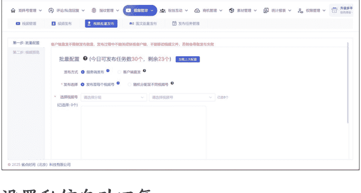

##### 设置私信自动回复

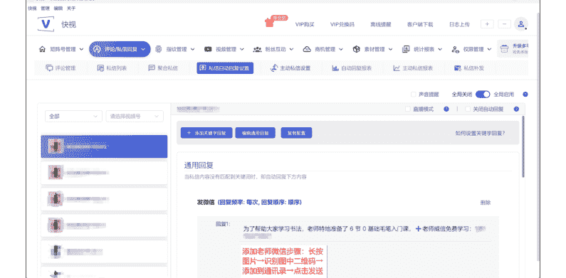

##### 设置主动私信

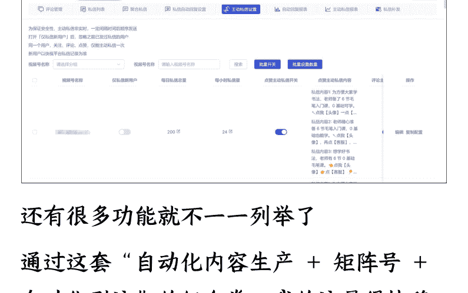

还有很多功能就不一一列举了。通过这套“自动化内容生产 + 矩阵号 + 自动化引流”的组合拳，我的流量很快稳定了下来。做出了多个万粉账号，每天都能稳定引流 100-200 人。

### 部分账号粉丝量截图：

#### 快视-专业视频号矩阵管理助手
- 快视 管理 编辑 关于
- 视频数据
  - 视频号数据
  - 粉丝数据

#### 粉丝数据

| 视频号名称 | 总关注数 |
|---|---|
| 书法02 | 4301 |
| 书法03 | 10677 |
| 书法04 | 25538 |
| 书法13 | 21457 |
| 书法25 | 6556 |
| 书法27 | 6265 |
| 43 | 0 |
| 47 | 13918 |

#### 快视 - 专业视频号矩阵管理助手

| 视频号名称 | 总关注数 |
|---|---|
| 70 | 0 |
| 72 | 1823 |
| 83 | 4063 |
| 89 | 0 |
| 101 | 21626 |
| 104 | 10147 |
| 105 | 7081 |
| 徒113 | 2494 |

#### 快视 - 专业视频号矩阵管理助手

| 视频号名称 | 总关注数 |
|---|---|
| ...141 | 0 |
| ...157 | 57014 |
| ...158 | 10804 |
| ...161 | 17506 |
| ...168 | 0 |
| ...79 | 6283 |
| ...182 | 649 |
| ...186 | 687 |

## 四、后端转化：从“卖课”到“卖流量”的战略转向

流量问题解决了，但新的问题又来了。

我发现，我真的不擅长做后端转化。每天被拉群、暖场、应付各种用户问题、处理售后这些琐事搞得焦头烂额。我本质上是一个“流量玩家”，我的优势在于搞定前端，而不是后端。

就在这时，一个同行通过视频号加了我，简单聊了聊，他问我：“兄弟，你流量这么猛，自己做转化多累啊。有没有兴趣把流量卖给我？我们是专业的书法教育机构，有成熟的转化和交付团队。按首单CPS 70%给你分成。”

我一听，茅塞顿开。

我为什么非要自己做不擅长的事呢？我应该聚焦在我的核心优势——低成本、规模化地获取精准流量上。后端转化这些事，完全可以交给更专业的人来做。

于是，我果断调整了方向，从“自己卖课”转型为“流量供应商”。

我联系了多家书法机构，对比他们的转化率、客单价和合作模式。这个过程也踩了不少坑：

- 坑 1：转化链路太长。有些机构给的企微获客链接，需要用户点击链接 -> 授权登录 -> 跳转小程序 -> 再长按识别二维码……链路长得离谱。我们的用户是中老年人，每多一个步骤，都会流失大量用户，而且会产生无数个“老师这个怎么点”、“为什么要授权”的问题，非常心累。
- 坑 2：与中介公司合作被“扣量”。一定要直接和甲方机构合作。中介公司给你的数据往往是一个可以随意修改的 Excel 表，他想扣你多少量就扣多少。我曾经被一个中介扣了 30%的量，后来辗转联系上甲方公司，拿到系统后台才查到真相。靠谱的甲方，一般会给你开一个子后台，让你自己登录查询数据或者给你截图后台数据。

最终，我选择了一家转化链路最短（点击链接直接跳转到企微添加好友界面）、数据透明、结算爽快的机构深度合作。我只需要专心搞流量就行了。部分转化数据：

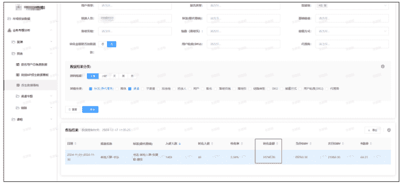

### 承接方式的终极进化：从“个人微信+RPA”到“微信小店客服”

在转型初期，我的承接方式是这样的：

#### 迭代 1.0：个人微信 + 影刀 RPA

我在闲鱼上买了台可以应用多开的摩托罗拉手机，一台手机登录6个微信号，用来承接流量，分散封号风险。

用户加过来后，一个个点击通过还是太麻烦，我用【影刀】写了一个脚本，自动完成“通过好友请求 -> 发送机构的企微链接 -> 第二天提醒用户添加”这一系列操作，并且能把数据自动统计到飞书多维表。

##### 【影刀 RPA】使用教程

下载地址：https://www.yingdao.com/client-download/
官方学习地址：https://college.yingdao.com/lesson
使用教程：用数据线连接手机，具体配置可以看官方教程：个人微信：lazyhelper

https://college.yingdao.com/course/courseDetail


##### 学习影刀控制手机的一系列操作

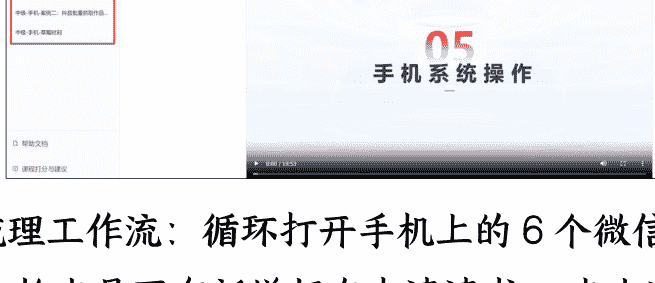

梳理工作流：循环打开手机上的6个微信 ->检查是否有新增好友申请请求->点击通过好友->设置昵称备注->设置标签->点击发送消息->发送机构的获客连接->统计用户信息到飞书多维表


##### 以下是影刀部分代码：

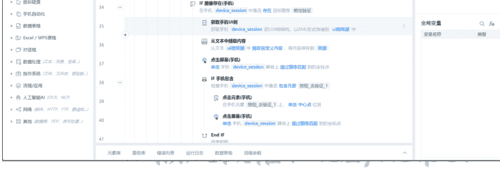

##### 公众号懒人搜索，懒人专属群分享

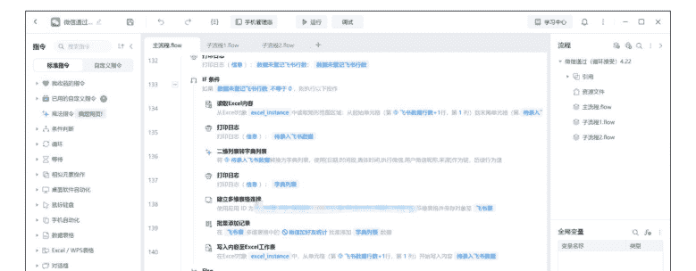

在触发器设置定时触发，每半小时触发一次，24小时运行

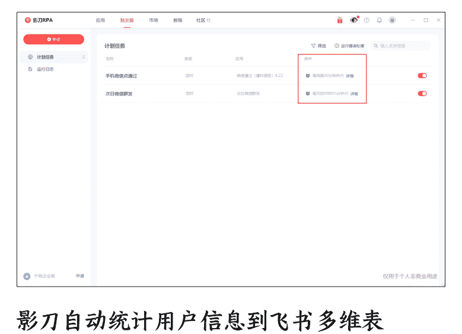

#### 影刀自动统计用户信息到飞书多维表

| 日期 | 添加时间 | 执行微信 | 用户微信昵称 | 来源 |
|---|---|---|---|---|
| 2024-11-28 | 13:16:35 | 微信书法 | 2024-11-28常樂我净 | 搜索账号 |
| 2024-11-28 | 13:17:13 | 微信书法 | 2024-11-28夏天 | 搜索账号 |
| 2024-11-28 | 13:18:09 | 微信书法 | 2024-11-28墨翰 | 搜索手机号 |
| 2024-11-28 | 13:31:45 | 微信书法 | 2024-11-28一切，皆有可能 | 搜索手机号 |
| 2024-11-28 | 13:45:31 | 微信书法 | 2024-11-28菩提路上 | 搜索账号 |
| 2024-11-28 | 13:46:35 | 微信书法 | 2024-11-28明白方舟 | 搜索手机号 |
| 2024-11-28 | 14:30:55 | 微信书法 | 2024-11-28行云流水 | 搜索账号 |
| 2024-11-28 | 14:31:33 | 微信书法 | 2024-11-28李甲虎 | 搜索账号 |
| 2024-11-28 | 14:32:10 | 微信书法 | 2024-11-28通用文体 | 搜索账号 |
| 2024-11-28 | 14:33:07 | 微信书法 | 2024-11-28任敢峰我 心海若梦A | 搜索手机号 |
| 2024-11-28 | 14:46:49 | 微信书法 | 2024-11-28彭城上谷 | 搜索手机号 |
| 2024-11-28 | 15:04:57 | 微信书法 | 2024-11-28诗寄远方 | 扫一扫 |
| 2024-11-28 | 15:06:00 | 微信书法 | 2024-11-28诗寄远方 | 扫一扫 |
| 2024-11-28 | 15:06:37 | 微信书法 | 2024-11-28L | 搜索账号 |
| 2024-11-28 | 15:07:13 | 微信书法 | 2024-11-28何 | 搜索手机号 |
| 2024-11-28 | 15:16:19 | 微信书法 | 2024-11-28满怀观道 | 搜索手机号 |
| 2024-11-28 | 15:31:05 | 微信书法 | 2024-11-28杨秀丽中央空调、净化 | 搜索账号 |
| 2024-11-28 | 15:32:24 | 微信书法 | 2024-11-28刘建辉 | 搜索手机号 |

#### 飞书多维表仪表盘数据看板


痛点：尽管用了 RPA，但这个模式依然有两个问题。第一，用个人微信承接，再推给机构，链路还是多了一步，实测有 30% 的流失率。第二，这些加到我个人微信上的用户，我后续尝试给他们推销毛笔、字画等产品，但因为没有建立信任，转化率极低。这些“私域用户”成了“死域用户”。我开始研究同行是怎么做的。我发现很多头部的同行，他们的视频号主页，“私信”按钮变成了一个“客服”按钮。用户点击后，会直接收到一条推送，里面就是企微的获客链接，点击链接就直接跳转到添加企微页面。

免费学书法，点下方【客服】👉👉👉
免费学书法，点下方【客服】👉👉👉
2个朋友关注
已关注
客服

#### 点“客服” 免费带你学书法


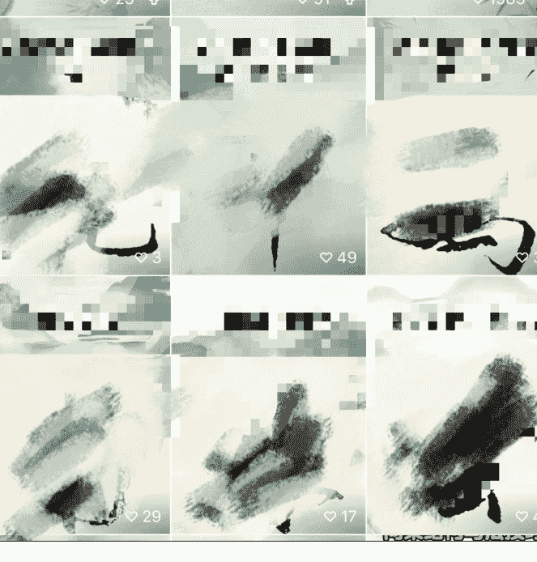

公众号懒人搜索、懒人专属群分享
22:56
46
【书法大师】亲👇👇👇👇👇👇【点这里免费学书法】【点这里免费学书法】【点这里免费学书法】👆👆👆👆👆👆点击下方蓝色字体，免费领取学习资格点击上方蓝字添加老师，进群学习！
22:56
【书法大师】亲自教你学书法点击下方蓝色字体，免费领取学习资格👇👇👇👇👇👇【点这里免费学书法】【点这里免费学书法】【点这里免费学书法】👆👆👆👆👆👆点击上方蓝字添加老师，进群学习！

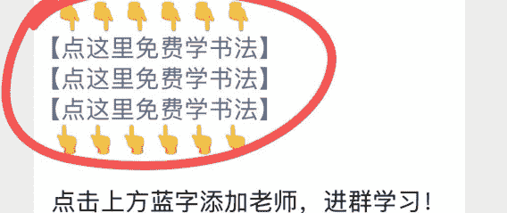

安全提示：私下交易不受平台保护，可能导致你的权益受损。为了你的资金安全，切勿轻信商家的私下交易或引流至第三方平台的请求。
咨询订单
咨询商品
平台客服
申请退款
价格举报
懒人微信：lazyhelper
36/43


这个发现让我兴奋不已。我立刻去万能的闲鱼买了个教程，终于搞懂了原理：开通微信小店，并绑定视频号，就可以把“私信”升级为“客服”，并设置关键词自动回复。

#### 迭代 2.0（终极形态）：微信小店客服

流程：我在自动回复里设置，用户点击“客服”后，直接推送机构的企微获客链接。

效果：这个流程极度丝滑！用户从视频号主页到添加机构企微，只需要两次点击，中间没有任何干扰。我的转化率直接翻了一倍！

解决账号问题：一个企业执照可以开通30个微信小商店，一个小店可以绑定5个视频号，总共就是150个号位，完全够用。我自己的企业执照因为之前商户违规无法开通，我就回到我的“租号群”里，找那些有执照的租户，注册一个小店给5块钱，让他们帮忙开通小店，再把我的微信设置为管理员即可，我就能用我的微信登录他们的小店，绑定视频号，设置自动回复的欢迎语。

##### 【微信小店】设置教程

网站地址：https://store.weixin.qq.com/
使用教程：注册微信小店后，找到关联账号，关联视频号后视频号首页的私信按钮就变成了客服入口

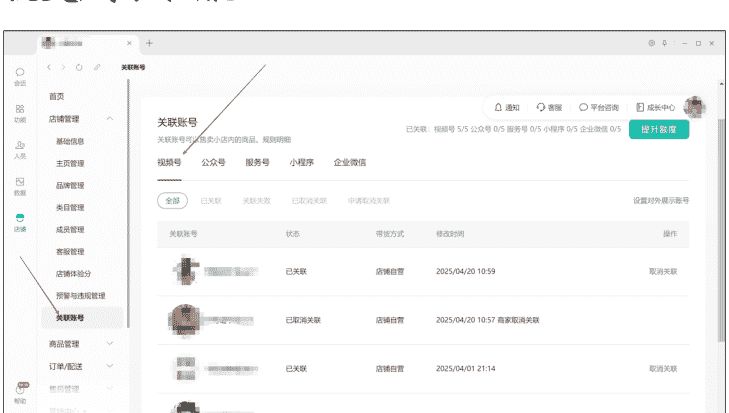

设置欢迎语为企微获客链接

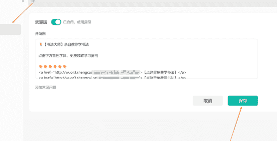

至此，我的整个自动化引流+交付的 SOP 闭环彻底跑通。

- 前端： AI 流水线生产内容 -> 快视系统批量发布
- 中端： 快视系统自动引流 -> 微信小店客服自动承接
- 后端： 流量直达甲方企微 -> 我坐等后台看数据收钱

现在，我已经把这套成熟的 SOP，交给了一个线上助理来执行。我只需要每天花少量时间，把控内容方向，对接更多的甲方机构资源。

### 回到商业的本质：算一笔账

聊了这么多流程和工具，最终都要回归到商业的本质——利润。这套自动化系统到底赚不赚钱？我给大家算一笔透明的账：

月度成本：

| 租号成本： | 100个号*1元/天*30天=3000元 |
|---|---|
| 人力成本： | 线上助理薪资=3000元 |
| 软件费用： | 各类工具会员费约=1000元 |
| 总计成本： | 3000+3000+1000=7000元/月 |

##### 月度营业额：
- 课程客单价：合作机构的课程分为 2580 元、1880 元、880 元等不同档次，综合平均客单价约为 1700 元。
- 月成交量：每月稳定成交在 50 - 100 单之间。
- 分成收入：按 70%的分成比例计算，我的月营业额在 59,500 元到 119,000 元之间。

##### 月度纯利润：
营业额 - 总成本 = 纯利润

因此，我目前的月纯利润稳定在 5 万 - 10 万元左右。

这套系统让我彻底摆脱了繁琐的执行工作，实现了半自动的盈利。

为了方便大家回顾和查找，我将上文中提到的所有核心工具及其用途，汇总整理成了下面这张表格：

## 五、复盘与感悟
回顾这段时间的折腾，我觉得我做对了两件事：

- 果断放弃不擅长的事，聚焦核心优势。 我意识到自己不是一个好的“销售”，而是一个合格的“流量工程师”。当我把后端转化外包出去，把所有精力都聚焦在“自动化搞流量”这一件事上时，我的效率和收益都得到了质的提升。这其实就是想明白自己在价值链上的位置。
- 始终保持“懒人思维”，善用工具。 每当我觉得一个事情做起来很“累”，很“重复”时，我就会立刻去想，有没有工具可以替代我？从江湖工具箱、剪映助手，到飞书、快视、影刀，再到微信小店，是这一系列的工具组合，才让我有机会一个人撬动 100 个账号的矩阵。人效的提升，本质上就是不断用“工具熵”来对抗“人力熵”的过程。

为了让这篇复盘更有参考价值，我站在读者的角度，补充几个大家可能会最关心的问题，希望能带来更多启发：

#### 什么样的人适合做？有什么坑？
- 这个业务适合什么样的人？ 懂流程、有矩阵思维，爱折腾工具的人。这个项目的核心不是拼单点内容的创意，而是搭建一条稳定、高效的自动化流水线。你需要享受优化流程、组合工具的过程。能专注、懂放弃的人，清楚自己的能力圈在哪。我意识到自己擅长搞流量，就把流量做到极致；不擅长的后端转化，就果断外包给更专业的人。贪多求全，往往一事无成。会盘活存量资源的人，复盘一下自己手里有什么牌。比如我能快速起量，离不开之前做电商平台买药项目积累下的那 50 万公众号粉丝，他们是我第一批宝贵的租号主。

#### 有哪些一定要避开的坑？
- 最大的坑是想“通吃”。 很多个人玩家的失败，源于试图包揽一切。自己引流，自己卖课，自己做交付。后端转化是一个非常重的运营活，很容易把你拖垮，让你没精力优化前端流量，最终两头都做不好。
- 效率坑：沉迷于手动操作。 如果你满足于一天剪十几个视频，手动回复私信，那这个项目的天花板一眼就能望到头。一定要拥抱自动化工具，用系统和流程放大你的能力。
- 内容坑：一套模板用到死。 即使有了自动化工具，也不能一劳永逸。内容模板需要不断测试、迭代，否则很快就会被平台识别为低质或搬运内容，导致限流。
- 合作坑：被“中间商”赚差价。 找合作方时，一定要擦亮眼睛。尽量与甲方机构直接合作。警惕那些转化链路过长、数据不透明、用 Excel 给你对账的中间商，他们很可能会克扣你的量，让你白忙活一场。

### 为什么过去这么久的航海，我还能坚持下来？
说实话，刚开始手搓视频那一个多月，我也差点就放弃了，因为实在太累了，而且看不到什么希望。

真正让我能坚持下来的，正是“自动化”。

当我把整个流程从内容生产到引流交付，全部用工具和 SOP 串起来之后，这个项目就不再是一件“苦差事”了。它变成了一台能自己运转的机器，我每天需要做的只是检查一下数据，补充一些素材。事情变得轻松，正反馈来得很快（每天都能看到稳定的引流和收入），自然就很容易坚持下来了。

所以，很多时候一个项目能不能做成，在于你有没有能力和决心，把它改造成一个适合你自己的、可持续的模式。

今天的分享就到这里。这个项目还在持续迭代中，我也在不断学习。特别希望能和更多志同道合的圈友多多交流，一起探索更多可能。

最后，分享了这么多压箱底的干货，给个精华不过分吧[手动狗头]！感谢圈友，感谢生财！


懒人专属群更新记录：
https://lazy2025.top/#/blog/record2

懒人专属群更新记录（需梯子，备用）：
https://lazybook.fun/#/blog/record2