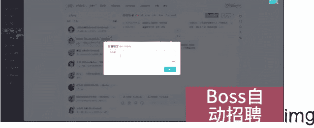
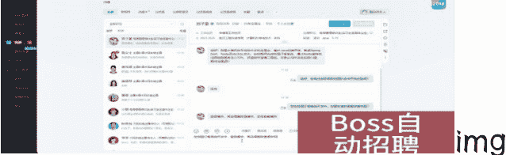
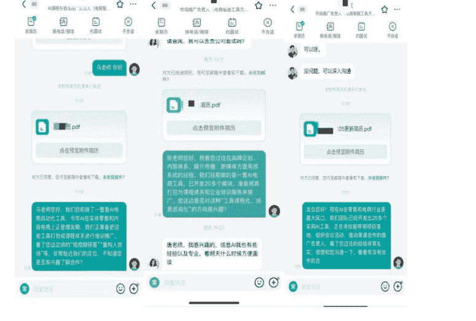

# 一文讲懂：我们是如何把 BOSS 直聘招聘流程自动化的？

250704 生财精华
整理：公众号懒人搜索，懒人专属群独享
懒人微信：lazyhelper

## 一、为啥我们要搞这套自动化？

我们团队每天都在招人，岗位有主播、客服、运营、剪辑、助理……用的最多的就是 BOSS 直聘，确实是目前市面上人最多、效率最高的平台之一。

但说句大实话：用得多了之后，也越来越累了。

### 01. 翻简历像扫地雷，一不小心就炸一天

我们要找的不是“有经验”，而是“能用、靠谱、匹配的”。

但 BOSS 推荐的简历里，80%都是“差不多但不合适”的：1.有的经验对口，但一看稳定性堪忧，半年换三份；2.有的学历漂亮，一问想要远程，不来公司；3.有的岗位写着“客服”，但干的是销售转过来的，完全不懂流程。

我们只能一张张点、一行行看，几十页简历翻下来，人已经麻了，而且稍微一走神就容易错过好苗子。

### 02. 招呼语发到后面，自己都觉得像机器人

你知道BOSS的节奏有多快吗？你一犹豫，对方就被别家加走了。

所以一开始我们是批量打招呼，系统模板点一点就发。但结果是：求职者觉得“像机器人”，没诚意，直接不理你；或者你招主播，发了运营岗位的话术，对方回一句“你搞错了吧？

我们后来只能手动一个个写，但问题又来了——有时候是凌晨，有时候是通勤路上，有时候刚聊完一个又弹出五个，一天下来，光打招呼都能花两小时，还要担心说错话。

### 03. 聊天不能走心，但一走心就没时间

我们不是不想认真聊，但BOSS上的聊天是“低回报高投入”。
1. 你一条条语音讲清楚，对方回你“好的”两个字。
2. 你问完三轮，对方才说“其实我在老家不方便来上班”。
3. 或者直接已读不回……久而久之，HR的内耗太严重，甚至出现“反向选人”——不想聊不爱回的直接跳过，但有时偏偏那些人又是最合适的。

### 04. 重复聊、重复筛、重复标注，感觉人变工具了

有几个特别烦人的场景你可能也遇到过：1. 你昨天聊过的求职者，今天系统又推荐给你；2. 你刚标记过“不合适”，结果又跳出来，还得点一次；3. 同样的话你今天说10遍，明天又说10遍，完全像在复读。

我们不是HR，是“招人客服”，每天在重复劳动中消耗意志。

### 05. 插件不靠谱，外包不划算，工具没一个真懂人的

我们试过各种办法：
- 第三方插件：有时候不兼容新版页面，有时候识别错按钮，几次之后直接弃用；
- 招聘外包：开价高，周期慢，很多只是代聊代发，并不真的懂你岗位要求；
- 低价工具：只能批量发消息，像客服系统一样机械，聊起来毫无情感温度。

你交给他们的，不是“智能招聘”，是“批量骚扰”。

所以我们决定：不靠别人了，自己搞！我们发现，其实整个招聘流程里，80%的工作是重复的，只有20%需要判断和情感交流。

那这 80%能不能全部自动？还能不能聊得更像一个“真人 HR”？我们就干了这事儿，用的是：
- RPA：自动化操作，模拟人手流程
- 智能体：流程逻辑判断器
- 大模型：理解聊天语义、帮你判断人选、生成回复话术

### 结果是：我们现在做到：
- 自动翻简历、自动判断、自动打招呼、自动聊天；
- 有感情、有分寸、能多轮理解；
- 聊得比 HR 还像 HR，最关键——从不喊累！

如果你也在用 BOSS 招人，也遇到类似痛点，接下来我给你拆解我们这套自动化流程是怎么做出来的。

## 二、我们是怎么做的？（附图解）

我们这套系统，讲白了就是一件事：把 HR 手上那些重复且耗时的活儿，全部交给 AI 来做，而且做得比人还走心。

整套流程只有三句话：会筛人、能判断、自动聊！

听起来简单，但背后是我们用三种技术拼起来的：
- RPA：像“机械手”一样去网页上自动点、自动翻页
- 智能体：像“助理”一样控制流程走向、判断状态
- 大模型：像“超能 HR”一样看懂简历、理解对话、生成话术

### 下面我来拆每一步

#### 步骤一：自动打开BOSS+设置筛选条件
**系统做的事情：**
- 自动打开BOSS登录页
- 自动输入岗位关键词、城市、学历、经验要求
- 自动点击搜索，不需要人手干预

#### 步骤二：自动下滑+提取简历信息
**系统做的事情：**
- 自动向下滚动页面（模拟人眼扫页）

#### 步骤三：大模型自动判断“是否合适”
**系统做的事情：**
- 把简历文本传给大模型
- 根据我们自己设定的岗位标准（可自定义）判断匹配度

#### 步骤四：候选人回复→大模型接力聊天
**系统做的事情：**
- 候选人一回复，系统立刻抓取聊天内容上传到大模型→判断当前状态
- 自动接话，继续聊岗位介绍、薪资待遇、工作地点等
- 多轮聊完后→自动发起“是否愿意面试”流程

#### 步骤五：主播类岗位→转微信/发切片/HR复审
**系统做的事情：**
- 判断岗位类型是否为“需人工复核”
- 如果是主播类岗位→自动通知 HR 加微信
- 引导候选人发直播切片、照片、简历附件等
- HR 再进行复审+面试预约

很多人一开始都以为，这种自动聊人的系统一定很机械。确实，大部分人对“自动化招聘”的第一反应是：“那不就是系统批量发消息吗？”“聊得肯定很像机器人吧？”“我还不如招个 HR 手动聊呢。”

懒人微信：lazyhelper

但真相恰好相反：我们这套系统的聊天质量，甚至比你招的月薪一万的人还高，还稳定。

为什么？
- 系统会“读懂人话”，不是机械发消息。它用的是大模型，能理解对方说的上下文、语气和真实意图，不会出现那种“问一句答偏十里”的情况。比如候选人说：“最近在犹豫，要不要转岗做客服。”传统 HR 可能说：“我们客服岗位在招。”但系统会自动回复：“可以理解你这种转岗的顾虑，我们这边会安排老带新，流程也非常清晰，前期不需要你自己扛压力。”是不是比人还贴心？
- 每一句回复都不重复，像真人一样“有情绪、懂语境”。有人问薪资，它不会直接甩底薪，而是根据岗位预设语气温和地解释组成；有人表示“有点担心不稳定”，系统会主动引导、安抚；有人直接发了“忙、再说”，系统会识别“冷场信号”，隔天自动回访，不烦不硬聊，但始终在。这种“带人味儿”的智能聊天，是我们长期打磨的话术库+大模型理解训练的成果。
- 最关键：它永远不会情绪化、不会掉链子、不会疲劳作战。不会因为连续被拒而摆烂；不会在深夜发出“已读不回”；不会聊天聊一半去摸鱼、请假、撂挑子；你交给它一个岗位，它就能 24 小时稳定、高质量地聊下去，就像你有一个情绪稳定、知识统一、极度耐心的超级 HR 在身边。

所以我们常说一句话：“不是 AI 太机械，而是人有时候太不稳定。”

我们不是用 AI 省钱，而是用 AI 做出比月薪 1 万的 HR 还专业的体验。

## 三、我们解决了什么难点？

### 第一个难点：BOSS 平台限制太多

BOSS 页面加载是动态的，简历不是一打开就能看到，甚至有些按钮、弹窗，都是你点击之后才出现。而且 BOSS 对“非人类操作”识别特别敏感，普通爬虫几乎是秒封。

**我们怎么搞定的？**
我们换了个思路，模拟人手点点点，用自动化点击+图像识别技术，系统“看得懂”屏幕上的字和按钮，像真人一样去操作。而且点击、停顿的节奏都经过精心设置，有效避开平台风控。

### 第二个难点：聊天内容太多样

每个求职者说话方式都不一样，有人自来熟，有人惜字如金，有人直接上来问待遇……而且还有语病、错别字、半句回复。普通规则根本判断不了。

**我们怎么搞定的？**
我们接入了大模型，让系统能像人一样“读懂上下文”，实时判断这段聊天是积极的？模糊的？还是拒绝的？如果还不够明确，就让系统自动继续问——形成多轮对话，一步步确认对方意愿。

### 第三个难点：岗位标准太复杂

举个例子：“要1年以上经验+有独立带项目能力+沟通表达清晰”。这三条，光从一句话简历里根本没法全判断。

**我们怎么搞定的？**
我们把岗位要求拆成两类：1. 能靠系统判断的，比如是否本科、是否有某项技能；2. 需要人工再确认的，比如“这个人沟通能力到底咋样”。系统先做第一轮筛选，把明显不符的直接剔除；剩下的，就自动标记交给HR再看，节省了80%的初筛时间。

### 第四个难点：防止重复打扰同一个人

BOSS上很多候选人，可能你已经聊过一次，对方说“不合适”。过几天你不记得了，又重复打招呼，很尴尬也浪费时间。

**我们怎么搞定的？**
系统会记录每个候选人的聊天状态，如果已经标记为“不合适”，就自动跳过，避免二次打扰。而且还能打上标签，比如“之前聊过但反应不错”、“之前因时间冲突拒绝”等，未来可以再次筛选。

## 四、用了这套系统之后，我们到底节省了？

这套系统上线后，我们的招聘效率真的发生了质的变化，不是“好像快了一点”，而是“从根本上变轻松了”。具体有几大块提升：

- 简历筛选时间少了70%以上，直接省下大把人工。以前我们一天翻300份简历是常态，几百页、手都要点断，脑子都麻了。现在系统自动筛，每天只需要人手筛选不到100份，节省时间超过70%。而且不是简单粗暴地过滤，而是按优先级、岗位匹配度排好序，一眼看到最合适的人。
- 回复率提升了2~3倍，聊一个顶以前三个。系统打招呼更精准之后，*回复率从原来的10%-15%，提升到了30%-40%*。什么意思？就是原来你聊10个人，只有1个回你；现在聊10个，能回你3~4个。特别像主播岗这种，以前冷启动很难，现在招呼语智能变通，候选人更愿意回话，**整个前期沟通顺畅了很多。**
- 人工操作量减少一半以上，HR不再瞎忙。我们以前每天招呼、筛人、记录意向，基本一个人能处理30~50人已经是极限了。现在系统自动判断、自动打招呼、自动记录状态，HR每天可以**轻松处理100~150个候选人，而且是高质量处理，不是瞎聊。**人工节省比例粗算在50%-60%左右，很多重复劳动都被系统吃掉了。
- 重复打扰率接近0，口碑提升不少。以前常被人骂：“昨天刚说不合适，今天你又来烦我？”现在我们把候选人状态做了完整记录：聊过的、不合适的自动屏蔽；没回复的候选人，系统自动延迟打招呼；主动拒绝的，系统永久跳过不再触达。候选人体验变好了，品牌感也跟着提升。
- 面试预约自动化后，掉面率降低40%。以前 HR 预约面试，要来回沟通时间、提醒、确认，候选人有时回一句“在外面，不方便说”，最后就没下文了。现在系统自动帮你发预约信息、整理时间、提醒候选人，尤其是客服、运营这种岗位，面试出勤率从原来的 50% 提升到了 80% 以上。
- 主播类岗位专属流程，选人更准、成本更低。招主播最怕啥？看不到人、不了解风格、容易踩坑。现在我们让系统引导候选人上传：1. 直播切片；2. 形象照；3. 口播自我介绍。HR 一看资料就知道这人靠不靠谱，比以前一个个加微信再聊、再要视频的效率高了几倍，踩雷几率也大大降低。
- 从“被动等人来”变成“主动智能触达”。以前靠系统推荐，有人来聊了才算数；现在系统主动找到匹配人选，打招呼、追进度、收反馈，我们每天新增的高质量沟通对象增加了 2~3 倍，招聘节奏被我们自己掌握了。

## 五、总结一句话：

我们不是节省了一点人力，而是把“重复、机械、低效”的那部分招聘工作彻底交给系统去做了，人只需要盯住那些“值得花时间的人”。

现在 HR 更像猎头，像判断官，而不是聊天机器。每天的时间都花在刀刃上，效率是真的翻倍。

公众号 懒人搜索 懒人专属群 微信:lazyhelper
懒人专属群持续更新中，已持续运营6年，整理超3000份各类精选付费文章&年费社群干货，全部开放下载。
本资料为付费群内部分享，仅供真实有需要的朋友查阅
懒人专属群更新记录：
https://lazy2025.top/#/blog/record2
懒人专属群更新记录(需梯子，备用)：
https://lazybook.fun/#/blog/record2