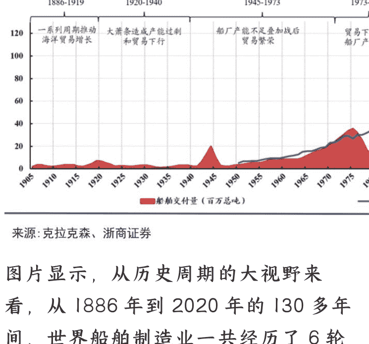

# 令人惊讶的信号，陆权强国中国，决心发展海洋经济

250708《政经参考》节选
整理：公众号懒人搜索，懒人专属群独享
懒人微信：lazyhelper

这两天很多同学留言，想听听我对最新的中央财经委员会会议的看法，既然同学们这么关心，我就专门用两节课谈一谈。

7月1日，习近平总书记亲自主持召开了二十届中央财经委员会第六次会议。中央财经委员会，简称中财委，是中央直属的在经济领域最高的议事协调机构。它由国家主席习近平任主任，总理李强任副主任，你一听就知道，这已经是最高规格，而它的议题往往代表着未来国家经济的战略方向。

这次会议的核心议题其实就两个：推动全国统一大市场和发展海洋经济。特别是针对海洋经济，会议明确提出“推动海洋经济高质量发展”，并强调要“加强顶层设计，加大政策支持力度”。

统一大市场的议题，我在第8和第9节课程有专门的讲解，我下节课会结合这次会议提出的“推动落后产能有序退出”这一点再详细讲。今天我先重点谈一谈海洋经济这个新话题，带你看懂中国大力推动海洋经济背后的战略意义和具体布局。

我认为，这是在大变局的时代背景下，又一次规模庞大的产业接力运动，海洋经济将在房地产和汽车产业之外，成为中国经济增长新的重要产业。这个信号非常重要。

## 什么是海洋经济？

我们先来说说什么是海洋经济，简单说，就是围绕海洋资源开发、利用和保护的经济活动，主要包括三类：

第一类是传统产业，比如海洋渔业、海洋交通运输、船舶制造、海洋油气等；第二类是新兴产业，比如海上风电、海洋生物医药、海水淡化、深海采矿等；第三类是现代服务业，比如海洋旅游、海洋金融、海洋科研等。

从这些分类你能看出，海洋经济并不是单一产业，它是一个横跨传统与新兴领域的庞大体系：既有船舶制造、港口物流等成熟业态，又有深海能源、生物医药等前沿赛道，还能联动沿海地区的文旅、金融等服务业。这种多元结构决定了它抗周期能力强、增长空间广阔的特点。

更重要的是，海洋经济是典型的人力密集型、技术密集型、资本密集型的“三密集”经济形态，不仅能拉动上下游的一大批产业，吸纳上千万就业，还与“新质生产力”战略高度契合——不论是深海探测技术，还是海上风电装备，都高度依赖科技创新驱动，这样就能从终端需求去倒逼科技的发展，形成“技术突破→产业升级→经济增量”的良性循环。

正因为海洋经济的重要性，早在2021年，国务院就批复了《“十四五”海洋经济发展规划》，提出要“加快构建现代海洋产业体系”，“加快建设中国特色海洋强国”。而从2024年开始，关于海洋经济的政策推进，突然明显加速了，我把这个进程讲出来，你可以感受一下：

2024年7月，二十届三中全会提出“完善促进海洋经济发展体制机制”；同年12月，中央经济工作会议强调“大力发展海洋经济和湾区经济”；而2025年3月的《政府工作报告》则进一步提出“大力发展海洋经济，建设全国海洋经济发展示范区”，并把“深海科技”首次列入国家未来产业发展重点。

到现在的7月1日，最高层主持的中财委会议上，明确提出“推进中国式现代化必须推动海洋经济高质量发展，走出一条具有中国特色的向海图强之路”。

有关海洋经济的顶层规划在不断加速，而这些都从侧面证明了，海洋经济，正在成为中国的核心发展战略之一。

## 为什么这个时候要大力推动海洋经济？

那么，为什么中央要大力推进海洋经济？以及，为什么是这个时候大力推进呢？我认为核心原因有两个：

第一个核心原因，是产业接棒的增长需求。

在我看来，中国经济增长的引擎，遵循清晰的产业接力逻辑。前二十年，中国的一大支柱产业是房地产；随着2021年房地产见顶，产业接力的第二棒则是汽车产业。各地政府通过大量投资上马汽车相关项目，电车、锂电池等多个产业拔地而起，带来了巨大的经济增量。

但现在汽车产业经过几年的快速发展，也面临新的压力。在这个背景下，海洋经济的战略价值就凸显了。

要知道，房地产行业在2021年巅峰期的GDP产值是12万亿，汽车产业这两年的年产值超过10万亿，而根据自然资源部发布的《2024年中国海洋经济统计公报》显示，2024年中国海洋经济的GDP总值达到了10.54万亿，首次突破10万亿大关，占国内GDP总值的7.8%。也就是说，海洋经济的体量足以与房地产和汽车产业比肩。

所以，中国经济新的关键增量之一，就是海洋经济，要向大海要增长。

而第二个原因，是全球造船业的超级周期正在来临，我们要抓住这次机遇。

海洋经济中，不论是传统产业、新兴产业还是海洋服务业，它们的核心，都是造船业。

而船舶工业和经济一样，都是有周期性的，我在文稿中放了一张描述世界造船周期的图片，你可以点开看看。

## 世界历轮造船周期回顾

来源:克拉克森、浙商证券

图片显示，从历史周期的大视野来看，从 1886 年到 2020 年的 130 多年间，世界船舶制造业一共经历了 6 轮超级大周期，每轮周期大概 20 年。而此时此刻正是全球造船业新一轮“超级大周期”的历史性起点。

而种种数据也印证了大周期的来临：
一方面，从需求端来看，船舶更新的潜在需求暴涨。根据航运服务领域的研究机构克拉克森（Clarkson）的统计数据，截止到 2023 年 12 月，全球商船船队的平均船龄达到 13.7 年，是 2009 年以来的最高水平；集装箱船队的平均船龄达到 14.3 年，这是自 1993 年有记录以来的最高值；油轮的平均船龄达到 12.9 年，也创下 20 年来的新高。也就是说，各种类型的船舶已经到了一个更新换代的临界点，替换需求非常大，预计未来 10 年，更新需求占比将超 50%。

另一方面，从供给端来看，提升产能的需求非常迫切。我说几个有点让人意外的数据，2024 年全球船厂的产能、活跃船厂数量，分别比 2011 年的最高点下降了 26%、60%，这个下降比例不小。与此同时，当前全球造船产能存在明显缺口。根据克拉克森的预测，2025 和 2026 年全球船舶交付量，同比增长分别只有 8%和 1%。除中国以外的区域很难扩产，即使现有产能逐步修复，供给弹性仍然远低于需求增速。所以说，这是中国船舶业的历史性新机会。

这里我多说几句。除了产业接棒和船舶业周期之外，海洋经济的战略意义远不止于经济增量，更是大国博弈中拓展战略空间的关键落子。

在总体国家安全观框架下，发展海洋经济与太空战略、商业卫星等布局一脉相承——比如深海资源开发能力，直接关乎能源安全；远洋运输通道控制力，影响贸易安全；而海上风电和海洋监测技术，则强化了非传统安全领域的主动权。

就像美国通过星链抢占近地轨道，中国推进深海探测、极地科考和海上浮动核电站等前沿领域，实际是在陆地资源趋于紧张的背景下，把大国竞争的战场向“蓝色国土”延伸。这种布局，既是对大陆海权的延伸，更是通过科技-产业-军事的复合型能力建设，重塑全球海洋秩序话语权的雄心。

## 中国三大海洋经济圈

那么，中国具体是怎么推动海洋经济发展的呢？

从当前的布局看，中国采取的是以区域为核心，集中布局海洋产业，以城市推动产业的模式。目前，中国已经形成了北部、东部、南部三大海洋经济圈协同发展的空间格局，我依次介绍下这三个海洋经济圈：

北部海洋经济圈，以山东半岛为核心，青岛、烟台、大连等城市构成环渤海集群，依托雄厚的海洋科研实力，重点发展海洋科技与海洋渔业。

2024年，山东省海洋生产总值突破1.8万亿元，山东省集聚了中国科学院海洋所、中国海洋大学等全国知名的海洋科研机构，以及海洋科学与技术试点国家实验室等一批国家级创新平台，成为我国海洋科技创新的策源地，实现了“科研-转化-产业”的闭环。

东部海洋经济圈以上海为龙头，联通上海洋山港、宁波舟山港、南通船舶工业走廊，形成互联互通的战略支点，凭借完善的港口体系和开放的制度环境，主攻高端航运服务和先进海工装备制造。根据上海市发布的《上海市海洋产业发展规划（2025-2035）（征求意见稿）》，上海要重点建设世界级船舶与海工装备产业集群。

南部海洋经济圈，则以粤港澳大湾区为中心，利用海域广阔的优势，重点布局海洋新能源和现代海洋服务业。比如广东省，2024年海洋新兴产业增加值达到411亿元，同比增长8.3%，海上风电装机容量全国第一。

总之，从产业格局来看，中国海洋经济正在形成传统产业、新兴产业和未来产业相互嵌套的梯次生态。更进一步，在我看来，中国布局三大海洋经济圈的战略决策，根本目标在于构建陆海统筹的国家竞争优势：

从角色分工来看，北部海洋经济圈依托科研实力，重点发展海洋科技与海洋渔业，推动海洋经济转型升级；东部海洋经济圈通过高端航运、江海联动、技术输出，抢占全球海运规则主导权；南部海洋经济圈则通过开发南海渔业、旅游业、资源业等，用经济实力强化主权主张。

从地缘位置来看，北部海洋经济圈联动日韩和东北亚地区国家，东部海洋经济圈面向欧美国家，南部海洋经济圈则辐射东盟国家，形成三个扇面的开放格局，以陆制海，以海制海。

从未来发展来看，北部海洋经济圈要打造海洋科研高地和军民融合区，东部海洋经济圈是要成为全球航运定价中心，而南部海洋经济圈则是成为中国“经略南海”的国家战略工具。

也就是说，这些布局的本质，是把海洋从地理屏障，转化成战略通道，从资源宝库升级成规则战场，它的深层逻辑远超单纯的经济增长。

更深层的内容，我们以后有机会再说。总之，当一个传统的陆权国家说要决心发展海洋经济，这个信号就足够重大了。

最后，欢迎你把《政经参考》转发推荐给更多人，让我们一起，聚焦政经，举重若轻。我是马江博，下期再见。

## 延伸学习：

- 1、习近平主持召开中央财经委员会第六次会议强调：纵深推进全国统一大市场建设 推动海洋经济高质量发展
- 2、国务院关于“十四五”海洋经济发展规划的批复
- 3、中央经济工作会议在北京举行 习近平发表重要讲话（2024年12月）
- 4、2025年的《政府工作报告》
- 5、2024年中国海洋经济统计公报
- 6、一图全解总体国家安全观
- 7、全国海洋经济发展“十三五”规划（2017年）

微信：lazyhelper

懒人专属群持续更新中，已持续运营6年，整理超3000份各类精选付费文章 & 年费社群干货，全部开放下载。

本资料为付费群内部分享，仅供真实有需要的朋友查阅
懒人专属群更新记录：
https://lazy2025.top/#/blog/record2
懒人专属群更新记录（需梯子，备用）：
https://lazybook.fun/#/blog/record2