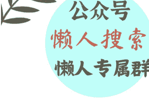
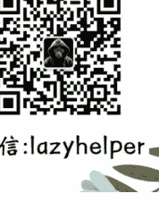

# 为什么讨厌被欺骗？
250708 守夜人总司令
整理：公众号懒人搜索，懒人专属群独享
懒人微信：lazyhelper

提问：
司令您好，为什么我会这么讨厌被欺骗呢？这是不是正常的呀？就是我经常和别人聊天，发现她前面说的话和后面说的都不一样，我想到的时候就特别特别接受不了，即使可能是不重要的事情，但是我对被欺骗这件事情非常非常抵触，瞬间就对这个人有其他的想法了！这是一种什么状态呀？想请司令帮忙剖析一下子！

司令回复：
你害怕被道德绑架和精神控制，说明你可能曾经被人这么干过并遭受过损失。这种损失让你感到痛苦，而且厌恶，但是，你目前都没有办法释怀。

这就像很多人从小被父母操控、打压，情感勒索和道德绑架，明明感觉到非常痛苦，但社会的主流观念和现实处境又让很多人不得不顺从。这种孩子一旦获得独立之后，会对往昔的那种类似原生家庭父母压抑和胁迫、操控和舆论无比的反感，甚至会比他人更容易提前嗅到一个人的这种特征，并产生一种说不出来的反感。或许自己都不明白为什么，但就是会本能地产生这种反应。如同一个从战场上下来的人，走的任何一个半封闭空间、转角都会极度警觉，甚至先看逃生的地方在哪里。哪怕是在熙熙攘攘的商场，也改变不了这个本能的习惯。

有人说，越是小时候对孩子不好的父母，等孩子长大之后就越容易向孩子索取，包括物质保障、精神安慰和情绪价值。然而，能采取的手段无非是情感勒索和道德绑架。因为这孩子小时候都给不了任何所需，到老了之后更是什么都给不了，反而会要的更多。与此同时，这样的原生家庭父母内心非常清楚自己小时候对孩子不好，也能从漫长的岁月中感受到孩子的疏离。于是，原生家庭父母唯一能够获取自己所需的方式就是情感勒索和道德绑架。然而，这种道德绑架和情感勒索，会激起孩子内心积压太久的痛苦和那一些无法逃离又无法承受的遥远记忆，从而让孩子再一次置身于一种无助和窒息的痛苦之中！

这就是为什么许多人在成年之后，如果是从一个糟糕的原生家庭逃离并获得自立，这样的人往往会主动切断与家里的各种连接。甚至当原生家庭父母反过来试图与之连接的时候，会自动产生一种本能的痛苦甚至生理不适！当然了，当这种人拒绝对方的连接之时，原生家庭父母肯定会站在道德的制高点上进行指责，不管是儿子还是女儿都一样。就如同溺水的人想抓住一根救命的稻草，而稻草已经受够了，拒绝被抓住，然后溺水者就会反过来指着稻草过于残忍没有良心。如果这根稻草迫于这种社会习俗的压力而被迫忍受，就一定会向内攻击自己，因为这是这个人本心不愿意承受的结果。这种不愿意承受的结果本质上并不是对利益损失的抗拒，更多的是对于自己内心中那种积压的痛苦和创伤的拒绝！

你之所以会对别人的前后不一产生极大的不信任感，甚至会因为这一点而忽略其他的东西，是因为这种痛苦占据了很高的权重。这种痛苦更多的是你记忆深处的放大，并不表示说这个人会给你造成那么大的伤害。

我说的更直白一点，你害怕被人操控和伤害，那种被人操控又不愿意接受，但又无可奈何的感觉，你看起来很无辜，又很怂，很软弱又很可怜，你的内心特别讨厌这种感觉！我的建议是：你要正确和理性地评估这个人可能对你伤害的程度，不要用想象放大事实可能的伤害，从而在无关紧要的事情上拒绝理性上的现实利益。

如果是亲密关系而不是利益关系则另当别论，那种亲密关系，宁可错杀一千，也不要心存侥幸。你可以不知道自己喜欢什么，但你必须要知道你特别讨厌什么、不能接受什么。大佬文集圈你必须要相信：你的理性很难克服那种本能的多年积压的讨厌，所以你应该主动规避。因为亲密关系和利益关系不同，亲密关系的信任级别最高。这就如同在战场上，我不能把后勤辎重交给一个我将信将疑的人去看守，万一掉链子，那部署在前方的所有战斗单元都会报销，而且毫无退路！

最后多说一句，如果是选对象，你信不过对方千万不要选！如果对方让你感到本身讨厌或者存在某种恐惧，这样的人，你越是驾驭能力不强，就越要主动规避。你猜，中不溜秋的普通人在找对象的时候为什么会优先考虑老实人呢？虽然事后会后悔自己嫁错了，但是让她们再选三五次，他们还是会选择平庸朴实的老实人，因为这样的风险最小。她们本身既没有资源也没有能力，驾驭不了高风险的人，何况还不一定有高回报。

📖 懒人专属群持续更新中，已持续运营 6 年，整理超 3000 份各类精选付费文章 & 年费社群干货，全部开放下载。

本资料为付费群内部分享，仅供真实有需要的朋友查阅 📖

懒人专属群更新记录：
https://lazy2025.top/#/blog/record2
懒人专属群更新记录（需梯子，备用）：
https://lazybook.fun/#/blog/record2