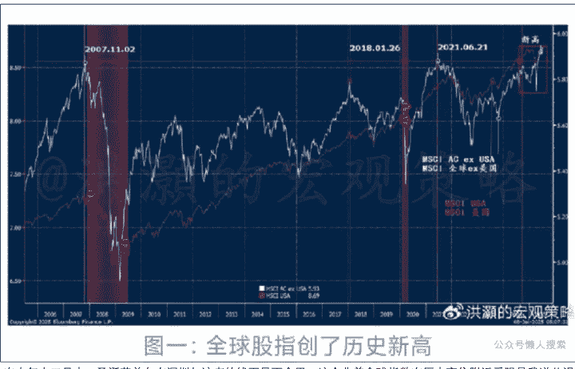
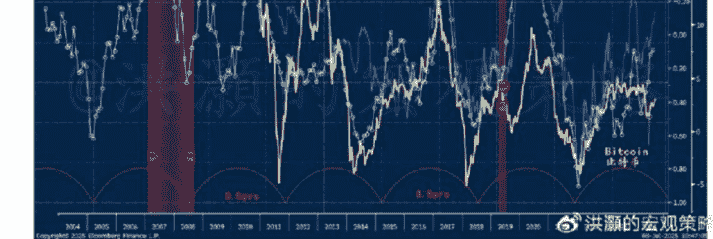
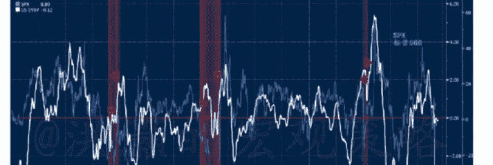
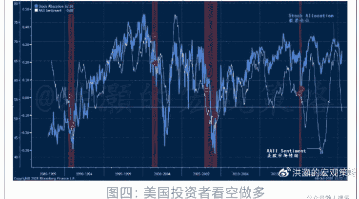
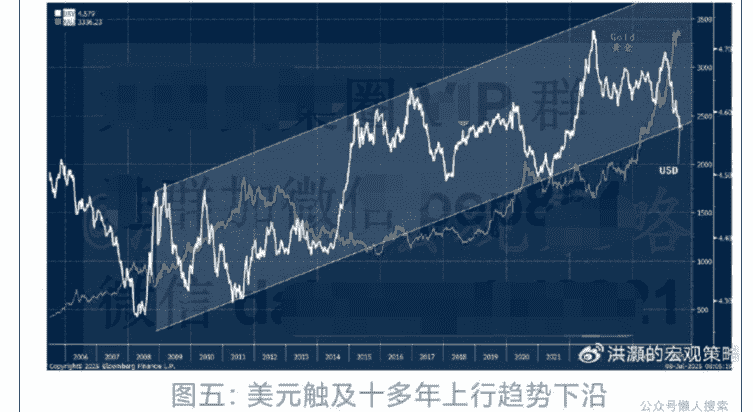
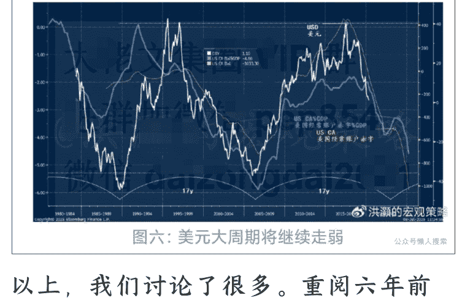

# 如何交易关税谈判大限

250709 洪灏的宏观策略

整理：公众号懒人搜索，懒人专属群独享

懒人微信：lazyhelper

关税大限将至。如何布局？

最近，美股经历了过去四十年历史里最快的修复之一。这次，从特朗普关税“解放日”历史性暴跌至熊市谷底、到美股市场指数再创历史新高，只用了短短不到三个月。

这是市场的修复速度为美股历史第二，仅次于1982年那次在保罗·沃尔克加息周期达到峰值之后的垂直性反弹。而全球股市也在美股的强势反弹的影响下创了历史新高（图一）。

在去年十二月末、圣诞节前夕在深圳与该读者的线下见面会里，这个非美全球指数在历史高位附近受阻是我逆共识地预测美股将在未来三个月内见顶并开启历史性暴跌的重要指标之一。这是因为这个非美全球指数的历史高点曾出现在2007年的11月以及2018年的一月末和2021年的六月。这个指数的这些历史性的高点都曾同步或者领先美国股票市场见顶的时间点。

背后的逻辑也是很直白的：随着美股在全球股指市值的占比日益上升，那么美股的表现对于这个非美全球指数的影响则越大。因此，这个指数的见顶时间点先于美股指数。而美股指数的强势推后了美股相对于这个全球非美指数见顶的时间点。然而，在经济和市场运行的共同作用下，美股也不得不屈服于周期的力量。

如今，这个非美全球指数创了历史新高。同时，其突破前高的幅度对于全球股指下一个阶段的运行是有指导性的前瞻意义的。这个新高，也凸显了当下全球市场和经济进入了模式转换。这是 80 年代初期、近五十年周期的一次显著的模式转换。从实际市场观察经验来看，欧洲已经不是那个欧洲，日本也不是以前的那个日本，而美国早就已经在特朗普的胡作非为之下面目全非。

在 2019 年 12 月 30 日，我发表了一篇题为《展望十年：长波中的退潮》的深度报告（网络上有，请读者自行搜索。我在文末将展示这篇长篇重磅报告的关键篇幅）。近日，我应中信出版社之邀，为达里奥的新书《国家为什么会破产》作序评。在阅读了达里奥对于大周期的观察和总结之后，不免想到了多年前自己的这篇经典。六年后的今日，伫立潮头，再读这篇报告，不免感触良多。请允许我把六年前的这篇报告的首页概览一字不动地复制粘贴如下：
———《展望十年：长波中的退潮》——
在这十年之末，我们将我们的经济短周期理论进一步扩展为经济长期波动理论，以预测未来十年的情况。直观地说，如果正如熊彼特所说的那样，“每一个高阶周期都是由次高阶周期的趋势构建形成的”，那么我们的3.5年短周期应该叠加起来并相互作用，共同构成未来趋势。的确，我们的研究发现：

- **自20世纪40年代以来，美国股市已经有过两次完整的、历时35年之久的长波，每一次大约由10个3.5年短周期组成；或包括两个17.5年、各由5个3.5年短周期的中波。始于20世纪40年代的70年超级长波在2009年左右结束。经过10年的扩张，大约在2020年末到2021年上半年，我们将进入现在这个新的35年长波内的、第一个17.5年中波内的下行周期。由于这是一个相对高阶的下行周期，市场到时将尤其动荡。**
- **美国的储蓄率与美国的长期国债收益率密切相关，并领先7年。随着美国储蓄率不断上升，美国长期国债收益率应该会随之上升。请注意，美国的10债收益率处于“世代之低点”，并曾在2012年、2016年和2019年夏季三次触底。更高的债券收益率很可能是引发未来市场大幅波动的导火索。如是，传统的以国债为风险对冲的策略将不复存在。**
- **中国股市的 850 天长期趋势自 2010 年以来就没有突破 3200 点。现在，这个长期趋势是向下倾斜的。如果没有大量外资流入等外生因素，趋势逆转很可能具有挑战性。如果说中国市场已经变成了中国交易员之间的零和博弈，那么值得大量外资流入的可投资企业其实是有限的。**

在北京前往闭门讨论会议的路上，我的车越过由古老的石块铺就的胡同，进入长安街。从中国曾经作为世界的中心时象征着皇权的故宫，到摩天大楼耸立代表着中国在国际舞台上崛起的国贸。这段路程就像几百年中国的过去和未来在我的挡风玻璃上闪现。

巨变正在发生，而且发生的速度很快，令人眩晕，却又令人着迷。在这个十年即将结束的时候，没有人能够准确地预测未来会发生什么。但是我们已经坐在了观礼的第一排，也将要把所有的精彩尽收眼底。

回头看，六年前的这个报告预测了 2021 年 6 月全球、中国股市逐渐见顶的时间节点，以及随后这些年来市场波动性飙升的催化剂——美国长端收益率历史性的飙升。离美股最终的见顶，也只相差了不到六个月的时间。六年前的这篇报告还预测了中国跨境资本流动的方向、市场运行的趋势和产业升级的迫切性。在报告的细节部分，我还预测了黄金未来十年的走势。这些预测，都是基于我的量化周期运行模型和我对于历史和周期的观察得来的。今日回顾六年前的这篇报告，并非是要妄自菲薄、居功自傲，而是感慨周期运行这种摧枯拉朽、移山倒海的力量。六年之后蓦然回首，才看得分外清楚。

以下内容仅 V+会员可见

日前，美国国会以极少的多数险险地通过了“大而美”法案。市场对于法案的理解大约偏正面——这个法案将在今年和未来增加美国的债务负担。法案通过消减美国政府在食物救济和医疗保险开支的部分，来实现富人 2017 年的减税永久性，并扩大美国的军事开支和非法移民的监管等。换言之，这个所谓的“大而美”法案其实就是在“劫穷济富”。这个法案将在未来五年增加美国政府赤字逾 3.4 万亿美元，极大地增加美国政府的债务负担，债务利息和本金偿付的支出将从约十万亿美元跳升到十八万亿美元，每个美国家庭的债务负担接近翻倍——从 23 万美元飙升到 43 万美元。

今年，由于这个大而美的预算法案，预算赤字维持在 7%左右——这是在一个和平时期。长期看，如此沉重的债务负担显然不利于美国经济的稳定性的。然而，这样的预算赤字在短期对于美国乃至全球市场的运行却又有另一番含义。在 2023 年底展望 2024 年的时候，我们曾经逆共识地认为美股的牛市趋势将继续。这是因为当时拜登政府的这种极端自由化的政策选择让美国政府的赤字率保持在6—7%左右，是一个正常时期的两倍有多。同时，在经历了2022年一整年因为美联储货币政策快速收紧而导致的利率飙升后，美债的长端利率上行的空间在短期里是有限的。这种财政和货币双双宽松的局面对于当时风险资产的价格走势非常有利。即便是2024年经历了日元套利交易的破灭而导致全球市场闪崩，我们也在8月的读者线下见面会的时候建议投资者逢低买入，捕捉到了当时日元闪崩后的历史性反弹。

在今年的下半年展望报告中，我独有的流动性条件模型开始显示市场流动性在经历了四月的低点之后开始改善，而我的量化周期模型也没有显示美国的经济周期有很大的衰退的概率。这个与最近美国公布的经济数据所展示的美国经济的韧性相符合（图二、图三）。

如是，如果特朗普的“大而美”法案将导致美国财政赤字的常态化，而美联储下半年，尤其是四季度左右降息两次的概率大约是75%，那么我们对于风险资产的价格走势是不应该过分保守的。注意，这个交易的时间窗口是3—4个月左右—直到我们在11月份再一次对于未来十二个月的市场和经济进行预测。

图二：流动性条件改善，利好风险资产价格

图三：美国经济周期指标并未指向衰退。

如果市场交易员错过了四月到七月初的这波反弹，那么在市场不断创新高之际，他们的FOMO(Fear Of Missing Out，简称“踏空”)的心态将会越来越严重。今年头六个月，散户买入美股的总量为历史最高，大约1,550亿美元，次高则是2021年的1520亿美元和2022年的1530亿美元。注意——这个上半年散户的买入量其实与前两个高点一致。而2021年六月份，全球非美估值见顶；2022年初，美股指数见顶，随后2022年出现了历史上罕见的股债双杀的局面。那时，美债不再是市场避风险的港湾——一如我在六年前的报告所预测的那样。

因此，当下美股市场情绪的分析是非常复杂的。一方面，这种情绪体现在投资者持股仓位高企；另一方面，如此高的持股仓位与投资者问卷调查显示的投资者情绪截然不同。投资者似乎在看空做多（图四）。

图四：美国投资者看空做多

当然，疫情后的数据显示，投资者看空做多的情况其实是常态：美国经济的长期状况堪忧，比如最近的特朗普的关税大战和“大而美”法案的通过。然而，短期却由于流动性的旺盛和全球市场的资金流向而不得不保持仓位和风险敞口。这种市场结构也是非常令人纠结，容易令人精神分裂的。因此，在今年以来的报告里，读者需要区分我对于长期基本面的看法和短期交易的看法。

我们在下半年展望报告里讨论的是一个 3 到 4 个月的交易时间窗口。在一个更短的时间窗口里，我们更需要注意的是其它交易指标的变化。由于今年美元逆共识地走软，并且出乎意料地成为跑的最软的主要货币，美元因此是当下观察国际资本流向的重要指标。短期内交易需要看的是美元汇率的变化。

在经历了半年的弱势之后，美元已经运行到了十多年上行（走强）趋势的下沿（图五）。同时，市场共识对于美元的情绪极度悲观，做空美元成为了市场最拥挤的交易。如是，在96—97这个位置美元在短期内出现技术反弹很可能是一个大概率事件，同时黄金继续在3500附近受阻。当然，这样的反弹并不改变我们对于未来几年美元继续走弱的判断(图六)。

图五：美元触及十多年上行趋势下沿

图六：美元大周期将继续走弱

以上，我们讨论了很多。重阅六年前的报告，让我们对于当下的乱纪元导致的市场波动的大背景有所把握。如无意外，这个周期的交替将继续下去。这个大的背景之下，波动性上升、美元走弱、黄金走强，美债收益率易涨难跌。

虽然，我们对于未来3、4个月流动性条件的改善保持乐观，但是在更短的交易窗口内，我们看到短期美元技术反弹的可能性、美股投资者看多做空、特朗普政策的不确定性维持在历史高位。而香港的基础货币略有收缩，做空仓位收敛。这些都将在短期造成市场上行的阻力。

虽然关税大战的不确定性犹存，但是我们继续认为关税最坏的情景已经过去，而负面新闻头条将依然导致短期市场波动。技术上，美股也很可能出现技术调整。如果市场因为关税新闻而出现调整，那么这样的调整应该是错过了之前那一波反弹的投资者逢低买入的时间点。

懒人专属群持续更新中，已持续运营6年，整理超3000份各类精选付费文章&年费社群干货，全部开放下载。

本资料为付费群内部分享，仅供真实有需要的朋友查阅 📖

懒人专属群更新记录：
https://lazy2025.top/#/blog/record2

懒人专属群更新记录（需梯子，备用）：
https://lazybook.fun/#/blog/record2