# 从风向标到实操变现，微博热点优质创作计划分享

生财精华
公众号懒人搜索，懒人专属群独享
懒人微信：lazyhelper

大家好，我是陶美丽，我一直积极参与风向标投稿，每天都会看风向标有没有更新，看的多了，我就在想，很多平台都有风向标，好像缺少新浪微博相关的风向标，我就抱着试试看的心态，在微博里带着目的，反复寻找官方通知账号，关注了微博小秘书、粉丝服务账号、微博热点、微博热搜、微博创作者中心这些账号。

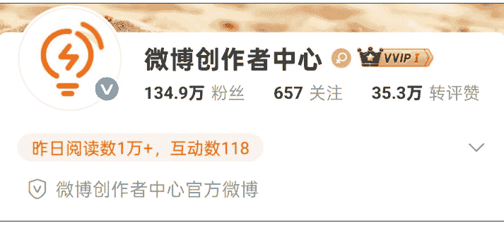

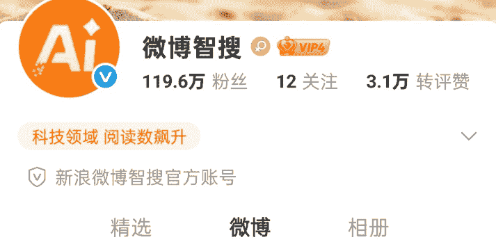

4月28日，我刷到微博创作者中心发的一条微博热点激励消息，我赶紧发了一条风向标。

> 陶美丽
> 2025/4/28 08:15 内蒙古
> #风向标# 微博热点优质创作计划，微博大力扶持各领域优质创，作者对热点发表自己的看法并发布，有流量扶持，满足平台评定档位可以获得200元、20元、10元或者5元的现金收益
> #微博#

风向标在生财圈友里激起一点点涟漪，我想着有人点赞我就再多找找，说不定能帮到有需要的圈友。我顺藤摸瓜，在活动介绍里找到了优秀大V，然后关注，去大V评论区找线索。

公众号懒人搜索，懒人专属群分享

- 推荐
- 全员任务
- 广告共享计划
- 热门活动
- 创作指南

## 微博兴趣[创作计划]
3000万现金激励瓜分中
单条博文最高激励600元

## 创作由心，让兴趣发光
创作范围覆盖20+领域，解锁创作收益新玩法！

## 微博热点优质创作计划
引领高价值创作 聚焦热点专业内容影响力

## 微博优质创作计划
捕捉热点风向标，优质内容引爆全民讨论热浪

返回

## 热点优质创作计划

优质博文（日榜）
2025年06月26日
全部 | 社会 | 文娱艺人 | 文娱作品

犀小莉 6-22 18:43
如果你是雷佳音穿越回唐朝怎么当好荔枝使？#长安的荔枝#剧集里，李善德的策略主要是给荔枝保鲜+快马加鞭，也就是从增加时间和加快速度两...
热文指数800+
作品点评
+225元 收益加成
发博领现金

胡锡进 6-22 10:32
美国下场参战了，声称怜惜生命、并致力于调停俄乌战争的特朗普总统亲自率领美国加入了一场新的战争，而且他很可能是这场战争最初的策划者。...
热文指数3万+
+200元 收益加成
发博领现金

记者韩鹏 6-22 23:32

我在评论区找到同频的博主，一比一模仿他们，开始完全摸不着头脑，他们写什么话题我跟着写什么话题，写了两天，我看到跟着写话题和自己随意写的阅读量完全不同！跟着写十几个字都有几万播放量，看到异常值我就开始对比热搜排行榜，还真得被我发现一点门道儿，本文第三条给大家仔细讲一下。

先说下我做的收益情况，我是全职带娃的宝妈，用零散的时间做这个项目，大概40天，老号从31个粉丝到6200多个粉丝，187个铁粉，认证了账号，广告共享收益有1500元。

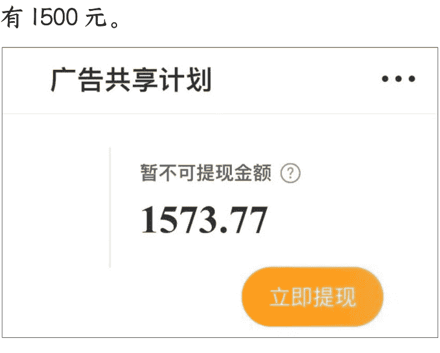

这个微博热搜项目玩法比较简单，简单概括一下就是：你先准备一个微博账号，到微博热搜里，寻找我们自己擅长的话题，写一条微博（像小学生命题作文一样），在更新微博的同时，我们也要积极寻找同频博主互关，粉丝1000以后，认证创作者，相当于我们创建了一个收稿费的账号，有了认证账号以后发微博帖子，根据你的阅读量获得对应的创作激励金。

下面是微博热搜图，就是从这个里面找热点去写，爆的概率才更高。

关于收益，有大V透露现在参与创作计划的80%是100-200元/月。20%的大概是500-5000元/月。有网感强的博主收入比较高，每天2000—3000元。

这篇0基础保姆级教程，适合零基础的圈友，可以做这个上手赚第一块钱，我替大家测试过了，下班做可以加鸡腿🍗，认真做可以成为副业的起跑线，微博彩头不是最多的，他胜在结算快，稿费隔天结算。下面我就具体来介绍一下这个项目怎么去做。

## 一、微博热点激励

在微博里猜热点，就是带#的那种。一个热点，一般是20-90元。转发一下加30字左右的评论。转发后有流量可以赚稿费，目前一天可以转发50条。

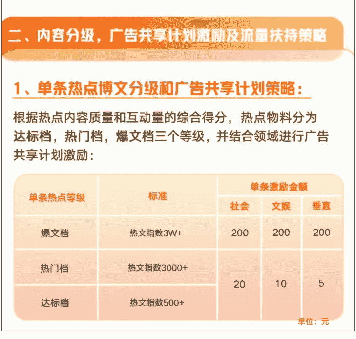

## 二、热点优质创作门槛

满足1000粉丝（1000粉丝比较简单，后面会详细讲解涨粉办法）。
申请认证加橙V（认证相当于开了一个收稿费账户，微博发钱，是隔天计算，从不拖欠。微博热度高还有机会获得额外激励奖金。）

## 三、起号

### 涨粉

首先准备好：头像、昵称、简介三件套

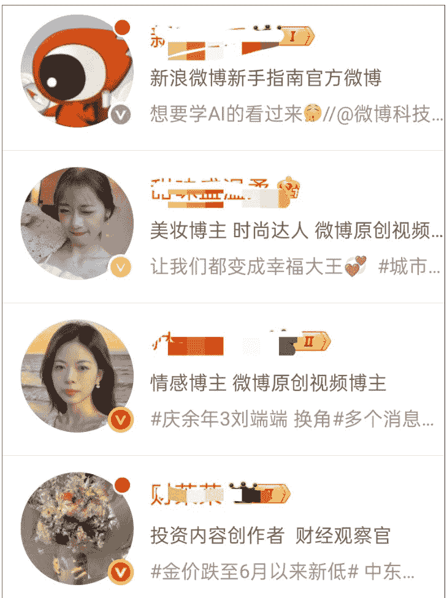

#### 头像要有辨识度，最好模仿一页中最抢眼的那一张图片，清晰&颜色鲜明更抢眼

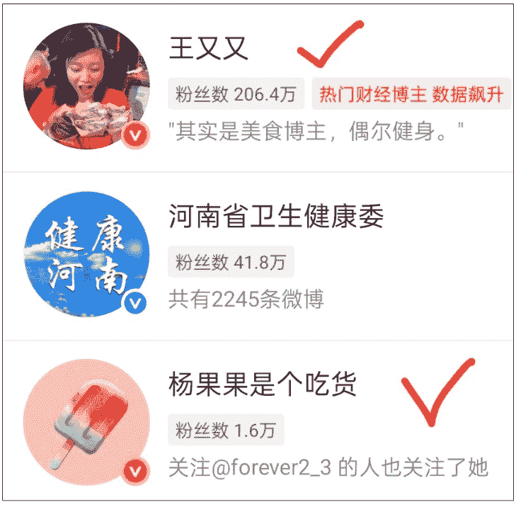

#### 昵称要尽量看起来是一个真实的人（真实人设感觉更有温度，粉丝看了会有关注的念头）

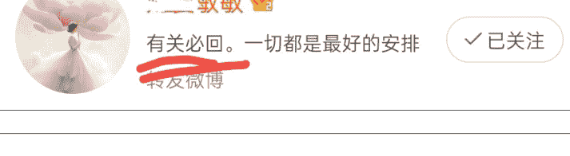

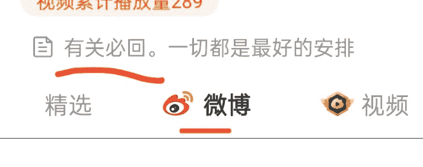

简介内容会在推荐页出现，推荐修改为互关互助相关的词语，方便同频的朋友识别。新账号养号注册后3天内避免频繁修改头像、昵称或大量关注/取关。初期以原创内容为主，每日多发几条，减少转发比例（控制在10%以下）。推荐添加图片或者表情符号、分段排版提升可读性，避免纯文字刷屏。

今天又到娃班上去蹭孩子们做的饭了，
图一的饼是一个小女生做的，
图二铁锅这个菜也是一个小女生主厨的，
图三白菜是我娃炒的。
这周孩子们轮流换着做饭，有多好吃呢... 全文

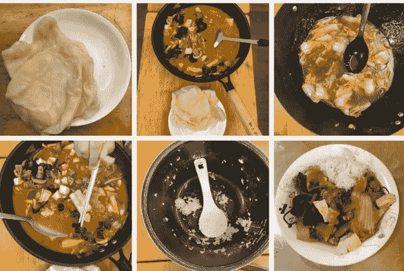

#### #原来成龙刚出生就出名了#

好家伙，出生都快12斤，还是顺产，
那他妈可太辛苦了，比我娃足足重了两倍，
其实成龙父母的故事就是汤唯和刘青云演的电影《三城记》（图二）... 全文

新注册的微博账号，系统会推荐30—50个博主，我们根据提示先关注，然后点击关注列表，查看一下推荐页简介里，有没有标记互关字样的博主，找到有互关需求的博主，进入他的主页。

#### 点击右下角“相关推荐”

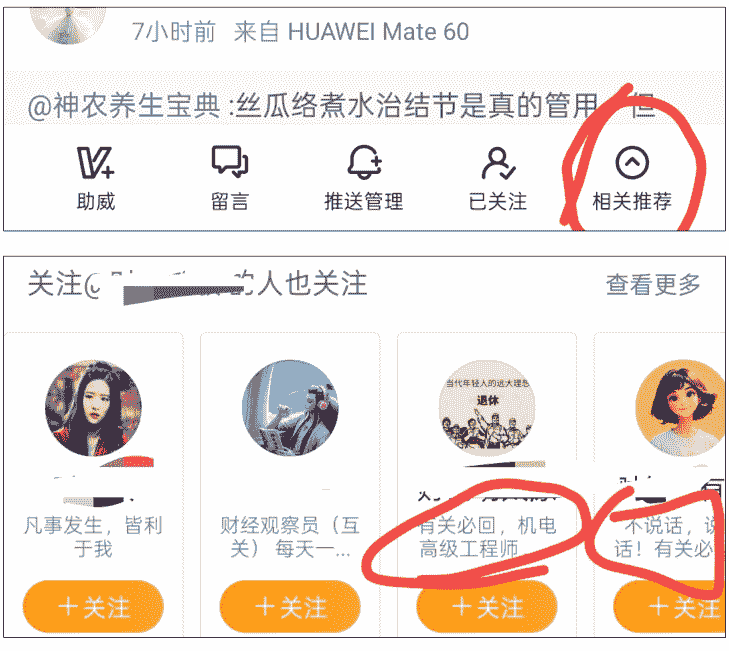

#### 重复这个步骤

这个有限制，我现在一次关注29个，第30个会限制。（可以利用这中间几分钟去和粉丝点赞评论，增加活跃度）
限制时间很短，过几分钟又可以重复！

实打实的靠内容涨粉太慢了，微博发钱也可能是阶段性的。大家尽可能以百米赛跑的速度，冲上去薅一把。抱团取暖，以互关为抓手，迅速攒够一千个粉丝。（非微博会员微博关注的上限是5000个左右）

我们要选择粉丝在300—800之间&近期有动态的博主，关注10-15个停10分钟继续关注！用这个方法可以避开系统限制！

#### 还有一种方式是：

4月份有一个百万财经大V财宝宝，在微博里推荐粉丝发微博赚稿费！
经过几个月的磨合，慢慢的粉丝之间达成了一种共识，把名字修改成财开头的，或者在简介里面写互关互助字样，方便同频识别，互粉互相托举...

操作步骤如下：

- 把名字修改成财XX，在简介里面写诚信互关...
- 然后找到认证标识的头像，点进主页动态栏，看看他之前关注的博主有哪些，一键关注！

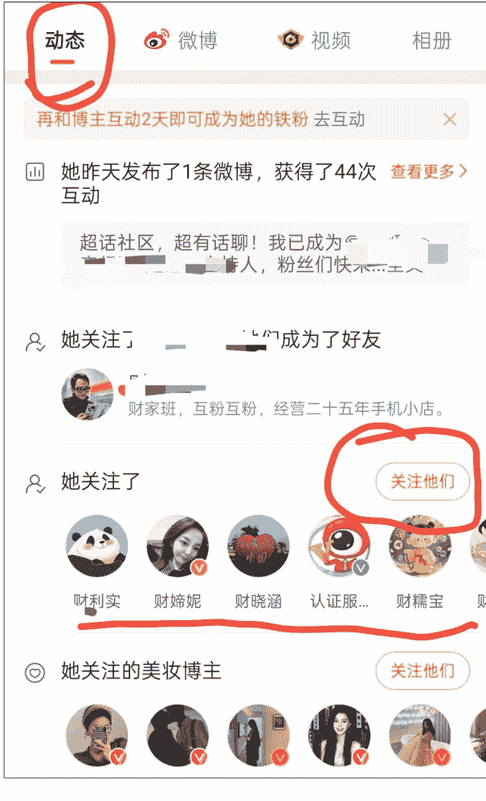

亲测新号用这个办法，一天可以涨粉500多个，这个办法可能是微博的漏洞，使用多了效果可能没那么好（账号安全方面）需自行判断使用哈。

## 认证

先来介绍一下微博的会员等级和认证机制

### 微博升级机制：
- 普通身份→黄V：粉丝≥1000+铁粉≥10+阅读量≥10万
- 黄V→橙V：粉丝≥1000+铁粉≥100+月阅读≥30万
- 橙V→金V：粉丝≥1万+铁粉≥1000+月阅读≥1000万

### 黄V五大认证途径（任选其一）

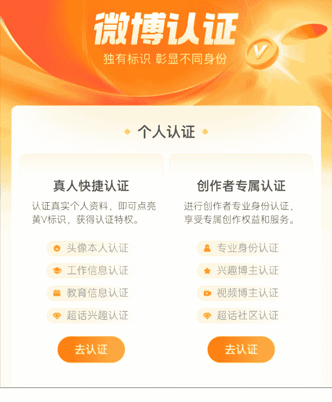

### 视频博主认证（最快3天通过）
- 原创视频：30天内发布≥4条原创视频（时长≥15秒，需添加转场/特效/BGM）
- 播放量：近30天总播放量≥1万（可自然积累或购买补足）
- 操作路径：微博APP → 我的 → 创作者中心 → 视频认证

### 超话社区认证
- 超话粉丝大咖：特定超话等级≥12级 + 绑定手机
- 超话创作官：超话等级≥10级 + 近30天发布≥1条互动≥50的帖子
- 超话主持人：通过超话主持人考核

### 兴趣博主认证（需领域垂直）
- 领域示例：娱乐/美妆/情感/游戏博主等
- 数据要求：铁粉数 ≥ 10（连续互动3天可成铁粉）；近30天阅读量 ≥ 10万
- 内容要求：持续发布同一领域内容≥1个月

### 个人身份认证
- 资质证明：职业证书（如注册会计师）、学历证明、专业资格证书等
- 特殊类型：颜值博主需平台审核（非公开申请渠道）

### 文章/问答认证
- 成为头条文章作者或问答博主（较少用户选择）

我们攒够1000粉丝以后，认证黄V这个环节，新手我更推荐个人认证，个人认证门槛低，反馈快。等我们跑通流程，确定赛道以后，我们还有机会可以重新认证兴趣博主或者视频博主。

### 铁粉高效养成方法：
- 连续3天完成至少1次互动（如每日点赞评论），避免断签。加入博主粉丝群每日发言，或参与超话活动。
- 私信互动连续三天互动，可以成铁粉（容易掉铁粉，需要及时维护）
- 关注博主后需保持互动，仅关注不活跃可能导致标识不显示。
- 铁粉数前台显示10个，系统会进行判定，判定后一般只有7、8个，需要我们多互动几个铁粉。

### 猜热点方法

涨粉到1000，做好创作者认证，找到有潜力的热搜，编辑微博发布。

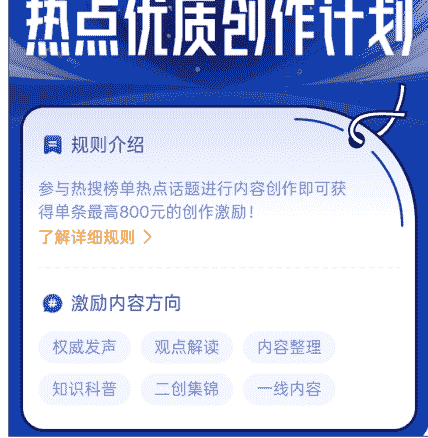

#### 微博热搜
实时热点，每分钟更新一次
- 重温10年前阅兵现场依然震撼 热
- 1 黄子韬方否认代孕 1632533 新
- 2 暴雨暴雨注意暴雨暴雨 729851 新
- 3 亲水经济夏日持续升温 594276 vivo X Fold5 首发
- 4 庆余年3刘端端 换角 剧集 567084 热
- 5 健身房 脏 537049 热

#### 热搜算法：
（搜索热度+讨论热度+传播热度）×互动率
（热搜实时数据每分钟更新一次。）

#### 怎么更好参与热搜？
答：挑有潜力的新热搜。

#### 怎么挑？
- 1.热搜后带“新”字的。

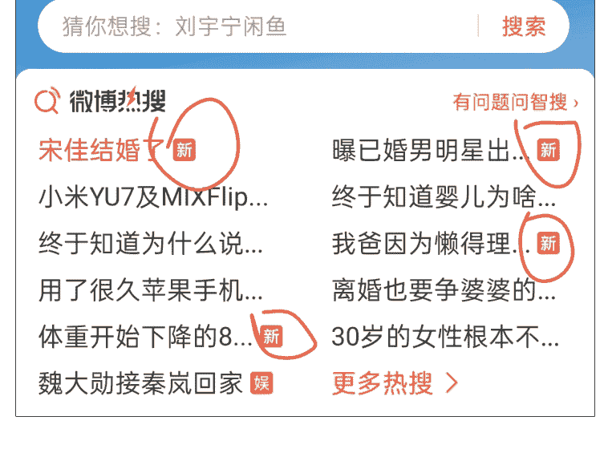

挑选一条“新”点进去，看阅读量、讨论量、还有话题发布的时间。
阅读量越大 + 讨论量越少 = 越好
最重要是不断刷新这个界面，观察阅读量和讨论量的变化速度，再做决定（热搜每分钟更新一次）

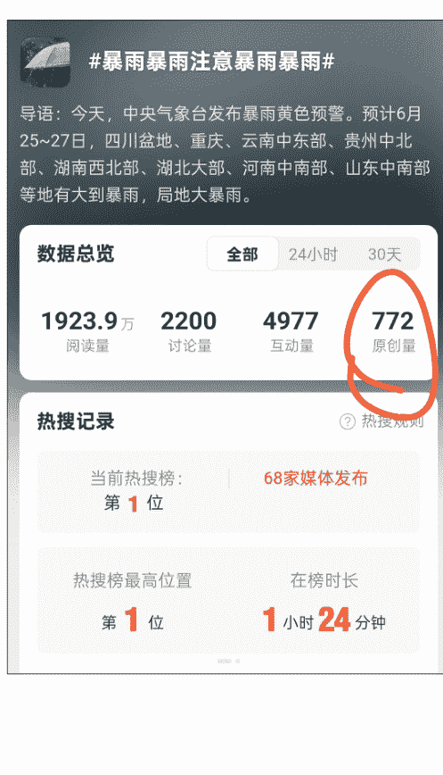

#### 原来花家里的钱是不需要愧疚的
| 数据总览 | 24小时 | 30天 |
|---|---|---|
| 119.4万 阅读量 | 19 讨论量 | 61 互动量 |
| 热搜记录 | 热搜规则 | 生活榜最高位置 |
| 10 原创量 | — | 第6位 |
| 在榜时长 | 2小时19分钟 | — |

#### 2.热搜在上升期的。
- (1) 这个热搜的排名在不断上升
- (2) 这个热搜的阅读数据在不断攀升
- (3) 这个热搜在榜时长短一点的
- (4) 明星、广告类的热搜一般更有潜力，猜测这类可能在平台做了投放
（点进热搜，这些数据以及趋势都能看到）
- 虞书欣骑车撞树上了 844
- 这个rapper很懂法但是劳动法 正在热转
- 赵磊新EP 讨论上升
- 十指连心断指该多痛 正在热转

#### 赵磊新EP
| 数据总览 | 24小时 | 30天 |
|---|---|---|
| 19.3万 阅读量 | 4 讨论量 | 8 互动量 |
| 3 原创量 | — | — |

热搜记录：30天内未上榜

#### 3.参与热搜尽量带关键字
如：“理理是猪”这个热搜，至少你写的内容里有“理理”和“猪”这几个字眼会更容易得到流量。
如：“王楚钦半决赛训练热身”，把这个关键词揉进你的犀利点评里，加上这几个字，阅读量就会高。简单重复，阅读量几万很轻松。简单重复的写出热搜词条中的关键字，再加上自己的视角，分分钟写出爆款吃瓜文案！

- 4.在这条热搜里找到点赞最多的微博，看文里的关键词和大致意思，创新或复制里面的金句，最后写到自己的博文里。
- 5.如果文笔不好，还可以选择话题里的AI智搜，帮助理解和总结主题。
- 6.提前预判，热点从下往上蹭（从实时上升热点往上蹭）。在热点还没成为热点时就蹭，提前下手蹭。留言要短小精悍。找新话题，找评论少互动少，评论只有几百，阅读量几百万的新话题蹭。
- 7.大力出奇迹。时间充足蹭个50条总能由几条有10万+阅读量。根据过往经验摸索出早上6点到8点，写热点时间段最佳。

挑一条在上升期、最具潜力的新热搜，写它！
想写的内容 + 热搜里最多人点赞的金句 + 热搜#话题
一条热点微博就编辑成功了！

微博发布成功后，我们可以简单做一下数据监测：
发布30分钟，如果阅读量过万，恭喜你，蹭到热搜了！
如果一小时左右阅读量还是几十或者几百，就代表没猜对热搜。没蹭到热点的博文可以删除。蹭到热搜的热点过去后，可以把热点设置成自己可见，不影响账号阅读数据。

公开
1小时前 来自 一加Ace3Pro性能猛兽
推广
87 阅读
你以为我沉默是在和你生气？其实是在慢慢的疏远，不被重视的每一秒，我都在后退。#失望和生气是不一样的#
转发 1 | 5

公开
1小时前 来自 一加Ace3Pro性能猛兽
推广
2万 阅读
兢兢业业 的打工人，负能量开始反扑了吗？开始网暴周三了🙅‍♀️ #周三其实是最会装的#
转发 1 | 5

高考超话
昨天 06:46 来自 iPhone 14 Pro Max
推广
249万 阅读
走错考场21个，弄丢准考证10个，弄丢身份证5个，双胞胎身份证拿反1个，锁家里出不来1个，高考忘缴费1个，这届考生啊。#高考历史上3次启用备用卷#考生和家长有不靠谱的时候😂😂📸高考超话
38 | 139 | 1397

## 广告共享计划

| 项目 | 金额/状态 |
|---|---|
| 可提现金额 | 0 |
| 暂不可提现金额 | 76.94 |
| 立即提现 | — |
| 昨日收益（元） | 37.32 |
| 分成收益 | 37.32 |
| 视频收益 | 14.65 |

这张收益图仅供参考，可以大致了解一个范围，平台发稿费的维度有很多，目前还没找到具体的阅读量和金额的比例关系，感兴趣的圈友可以探索一下。

发出去有激励以后，就是收益提现了，提现步骤主要是：
微博APP → 我 → 创作中心 → 收益中心 → 广告共享计划 → 去提现。

- 1. 最低提现金额100元起提，如果累计收益低于100元，则无法进行提现操作。
- 若用户申请退出广告共享计划，未提现的收益将自动失效，即便这些收益已经达到了100元的提现门槛，退出计划前记得先提现。
- 2. 用户每7天只能提现一次，两次提现之间必须间隔至少7日。
- 3. 到账时效：从申请提现之日起，大约需要12个工作日才能到账到用户的银行卡中。收益中大概会扣除10%的个人所得税（提现100元，银行卡会收到90元左右）建议查看最近一周的银行流水记录来确认稿费。
- （如果在提现过程中遇到其他问题，可以私信官方账号 @微博创作者广告共享计划或者联系 @微博客服寻求帮助。）

## 黄V之后做什么?

有1000个粉丝之后，可以做黄V认证，为橙V加身做准备！
认证黄V后，领域垂直度高，流量会有倾斜，这时候需要我们静下心来思考，自己最擅长哪个领域的写作。如果不确定适合什么赛道，就先把基础打好，特指粉丝量和铁粉量。然后把微博当成朋友圈来用，想发就发，随意的发。平台的大数据比我们自己还了解自己，最后会给我们推荐一个垂直领域。

在追热点的同时，不要忘记维护铁粉和阅读量。

- 1.铁粉100个，每天点开我的铁粉，拉到最下边，跟铁粉值为0的粉丝互动，增加互动率。

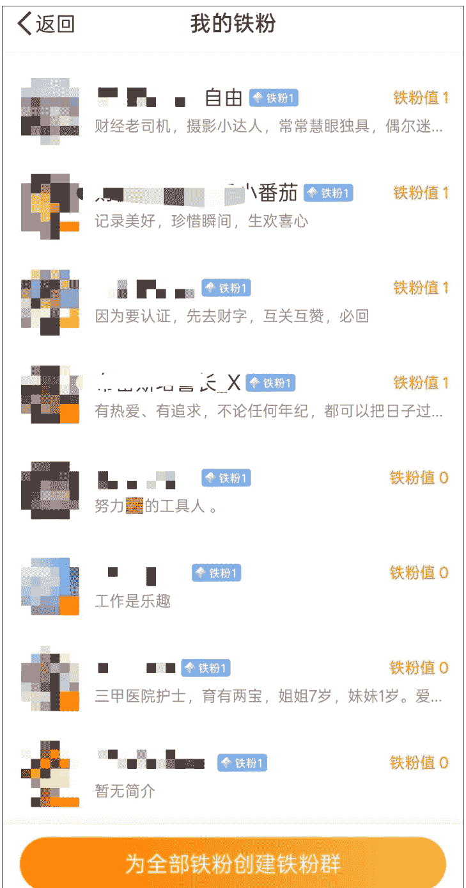

- 2.阅读量30万，如果时间允许，大力出奇迹，早上6点到8点从下往上，追热搜全部追一遍，就转评最热门顶部的文章，肯定有一篇30万。这个比较简单，不用在这上面花太多时间，掌握方法就行。
- 3.橙V（第一：门槛要求：1000粉，第二：100铁粉 第三：30万阅读量）注：橙V15天后微博会免费送VVIP会员。

- 4.橙V之后，我们就算中V了。长期持续输出符合平台要求的内容，平台很愿意给流量的。有橙V，有领域V指数，有热门，有50以上的转评赞，有极好的阳光信用度，稿费就基本稳定进账啦。

橙V之后加入广告共享计划，跟着同领域大V前辈依葫芦画瓢，模仿，学写作，赚稿费，追热门，加词条，借助AI，写原创文章。都可以获得收益，有收入增加生活的底气💪

## 怎样保持橙V

要保持微博橙V认证，需持续满足三个核心指标：粉丝数≥1000、铁粉数≥100、近30天阅读量≥30万。

### 1.维护铁粉
- 每日互动：通过评论（5字以上）、点赞、转发等方式与粉丝互动，连续3天互动即可建立铁粉关系。可主动发起话题互动或建立铁粉群集中维护。
- 双向维护：定期回访铁粉主页互动，优先与活跃度高（如橙V/红V用户）或带有实名认证标识的账号互动，提升权重。

### 2.阅读量维持蹭热搜策略：选择上升期或中低位热搜（讨论量1万左右），带话题发布15字以上原创内容，搭配图片或视频更易触发推荐。注意单日蹭热搜不超过3条，避免被限流。

内容垂直化：专注特定领域（如财经、娱乐）持续输出，通过兴趣认证或专业认证提升内容推荐权重。结合热点创作“信息增量”内容，避免同质化。

高频次发布：每日至少发布5条内容，结合早中晚用户活跃时段（如10点、12点、18点、21点）定时发送。使用微博数据助手分析用户活跃周期优化发布时间。

### 3、账号健康管理

避免违规行为：减少秒删、频繁修改可见范围或大量转发行为，防止降低账号权重。

会员续费：若通过SVIP/VVIP获得认证标识，需及时续费以免过期失效。

定期数据监测：每周检查数据中心，关注铁粉数波动及阅读量趋势。若数据临近下限，可通过甩帖互助群短期冲刺。

### 4、辅助技巧

参与平台活动：加入广告共享计划和内容激励计划，通过官方补贴反哺账号活跃度。

公众号懒人搜索，懒人专属群分享

养号习惯：每日完成“每日一善”超话打卡、熊猫守护者等平台任务，提升账号健康度。

找团队互助：加入50人以上的互评互赞群组，约定固定时间集中互动提升单条内容曝光。

## 重要注意事项

头像认证有三次机会，选择头像认证的，不要轻易换头像，会掉V。

如果用老的微博账号，看到这一条，记得、立刻、马上把自己曾经的历史头像及时清理，为了维护美好形象。

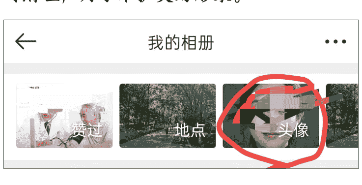

私信养铁连续互动3-5天，自己设置好私信页下面的文字，方便别人点击互动，就是方便自己。记得维护铁粉值为零的粉丝。

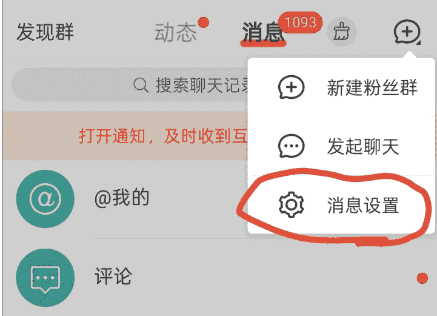
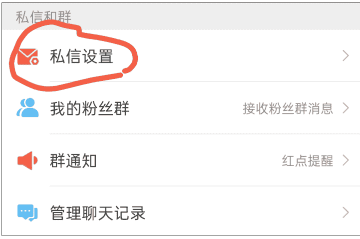
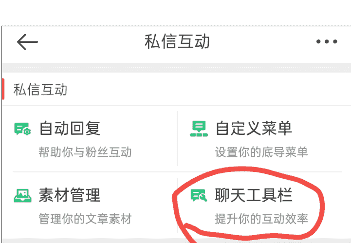

### 聊天工具栏

添加后效果示例

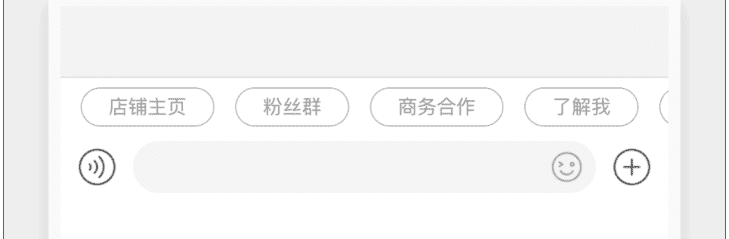

工具栏内容 (3/8)
- **找黄V及以下的人互动**：橙V们已经大部分进入疲惫期了。新人现阶段是想快速完成目标，那就是找有互动需求的人，比如粉丝数800到3000的人群。他们回访意愿更大。
- **评论区最佳广告位！**很多博主会选择在评论区互动，多出现，混眼熟。

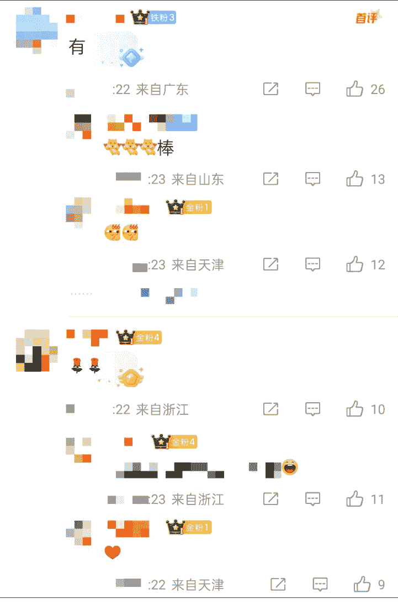

抖个机灵，如果你买了微博SVIP会员，我建议能直接头像或者学历认证个黄V，就认证。后边再认证兴趣领域。换位思考一下，带着黄V去新人那里回复。对方怎么想？对方还以为你是大佬呢，互动率就上来了。

实践发现，娱乐话题最容易起量。女性用户带V且头像精美的更受欢迎。

### 转发热门话题带视频的成功率高非常多。

发布文章30分钟左右，没有3000基本没戏。

### 用好微博的分组功能。

- 第一下：最上的“关注”下拉
- 第二下：点“新建分组”
- 第三下：添加你关注的宝藏博主

好处：该追星的追星，该学习人生经验的学习。互不干扰。互粉分组，可以定期给互相铁粉的互动。不然后期几千个几万个粉丝，根本刷不过来。

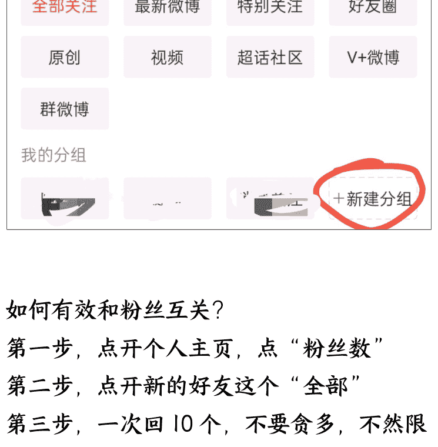

### 如何有效和粉丝互关？

- 第一步：点开个人主页，点“粉丝数”
- 第二步：点开新的这个“全部”
- 第三步：一次回10个，不要贪多，不然限制两行泪（更新补充：会员用户一次回关29个最多。另外要关注粉丝来源，如果是微博推荐，大概率是平台送的，优先回关。来源个人正文页，这些是我们的潜在铁粉）
- 第四步：刷铁粉的直接互动，缺粉的去互粉队友那点赞。

难免有遗漏的，可以给对方留言，精准互关。

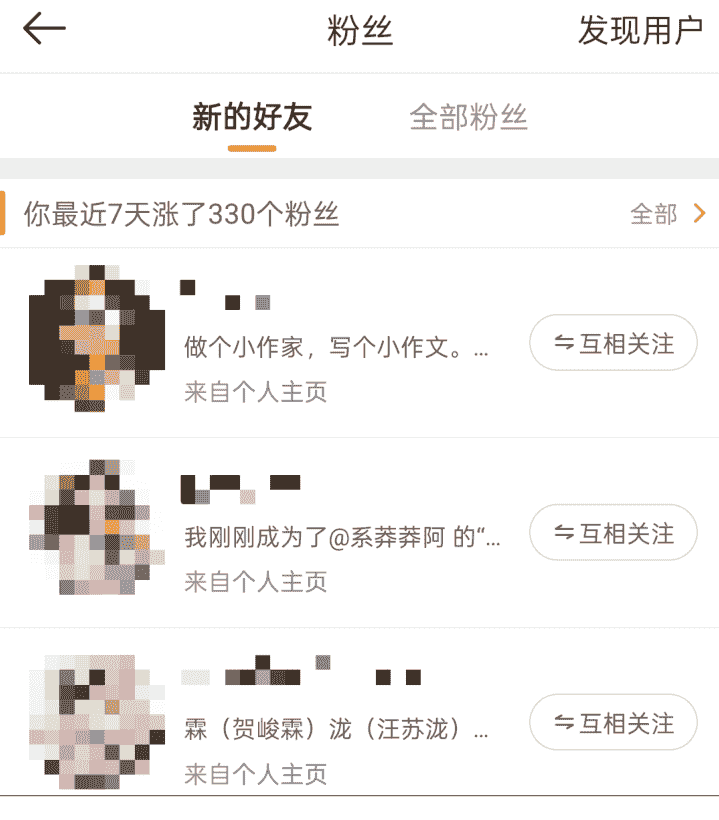

### 新的朋友

- L.. 做个小作家，写个小作文。... 来自个人主页 互相关注
- 我刚刚成为了@系莽莽阿 的“... 来自个人主页 互相关注
- 霖（贺峻霖）泷（汪苏泷）... 来自个人主页 互相关注
- 人文艺术博主 来自个人主页 互相关注

### 互动很高，为什么还不是铁粉？

集中爆发，批量点赞/评论/转发；只点赞不评论，或只转发不原创；互动内容与账号定位完全无关；直接转发未阅读原文等会被系统识别为无效互动。

### 高质量互动要模拟真实用户正常的互动方式！

提高观感技巧：擅用首行缩进，长文文字分段清晰，每段不超过3行，适当空行降低阅读压力。

长文配色不超过3种，重点内容用标红或加粗突出，避免全篇统一格式。

配图选择高清无版权争议的图片，视频时长控制在5分钟内。

十八岁的时候太青涩，二十出头总是很用力的想证明什么，也容易自我否定。

小时候，觉得三十岁是妈妈的年纪，很远~不可到达。没想到岁月的转瞬，我已经三十出头了~

这个年纪没有我曾经想象中的“老”，也没有变成被生活磨平棱角的大人。相反的，这个年纪的我，有了一点点积蓄，有了一点点选择的余地，也有了一套自己的价值观和判断体系。我开始明白，什么样的关系值得维系，什么样的事情无需解释~

三十岁的我，还是对世界充满好奇。会追当下热门的古偶，刷国漫到热血沸腾，时常三五好友小聚一番~偶尔心血来潮背起行囊买张票就出发来一场说走就走的旅行。

慢慢懂得平衡和享受生活，也慢慢清楚自己内心真正想要的东西。不用每一天都轰轰烈烈，不用每一刻都追逐什么，我很享受现在这种“有趣灵魂+稳定节奏”的状态。

#幼态审美# 幼态审美？我管它喜欢什么~🤔🤔🤔

微博写作观点一定要新颖，我们选的角度要让人耳目一新，如果人云亦云的话，不会有好的流量，也不可能有很多真实的陌生网友给你评论互动。

如果擅长写文字，就坚持文章表达，如果有视频剪辑能力，就专注视频赛道，混搭会互相影响流量！

动态页关注大法，新号容易被关小黑屋，建议先手动关注，找到同频的人以后再操作，一次不要关注太多。每天3-500可以了。如果遇到经常要验证，要注意了，多去互动一下。

注意规避敏感字，可以使用谐音字代替。

微博配图九宫格更好看，如果只有一张图，可以用九宫格小程序生成一下。

一个人最好的活法，就是懂得给生活做减法。

学会及时清理，将不必要的负重卸下来，让我们能轻装前行。#一个人最好的生活状态... 全文

### #书卷一梦# 夏天的书卷一梦值得期待☀厦门超话

注意保护好财产安全🔒！！！就算是经常互动的铁粉，也要守好边界线！不点链接，不帮忙，不做点赞评论以外的任何操作。

## 入局建议和避坑指南

感谢圈友看到这里。在编辑这篇文章的过程中，我重新注册了一个微博账号，新号平台会赠送五天的会员体验卡。运用文中提到的技巧，5天顺利达成了黄V认证门槛。实操的时候，记得把文中提到的小技巧多看两遍，会更得心应手。

这个项目反馈快，结算快，做起来更有动力。在写作中不断修正和调整，写出自己的风格，锻炼出网感，知道读者喜欢什么，用真性情吸引粉丝。把这个项目当做我们练手进阶的梯子，慢慢的写出属于自己的IP！

目前这个激励一直都有，短期应该不会取消，建议大家早点入手来做。如果哪天热点激励的风刮走了，我觉得平台还会不断推出新的激励方案的。平台发展需要KPI，他不会抛弃活跃用户的，我们是平台的内容创作者，是互相托举的关系呀！可持续性比较强，放心去做。建议圈友看完这个帖子，从起号涨粉开始来做，做出自己的第一个账号。

为了让大家更容易理解，我从初学者的视角上，再聊聊几个可能最关心的问题，抛砖引玉希望能给大家带来更多的启发：

### 1. 这个项目适合啥样的人？

这个小项目适合有一定时间、有输出意愿的圈友。多多输出，头脑更清晰，平台喜欢优质的内容创作者。也适合有自主学习能力的圈友。这个项目对大部分人来说都是很新的挑战，从零开始摸索。我最开始完全不明白认证是什么，一点一点拼凑出一个框架，然后再添枝加叶。还适合愿意投入时间精进副业的圈友。微博平台现在是跟其他平台争抢用户的阶段，草莽阶段才有我们薅羊毛的机会。随着平台发展，一定会做筛选，我们要珍惜这个阶段，提高自己的写作能力和培养自己的网感。

### 2. 划重点避雷

这个项目上手实操简单，平台源源不断推出新的玩法和激励机制。这其中最大的坑就是不要“贪心”。平台有音频、视频和图文赛道，不要想着这写一点，那发一条。前期要坚定不移地写，写热点对新手最友好。

写热点最靠谱的开始方式是：先写30条内容，别怕写得不好，别管有没有流量，别纠结风格。围绕想写的那个方向——健康、教育、副业、生活经验、穿搭育儿，随便选一个熟悉的、能聊的，先做30条内容出来。写的时候自己会有感觉，流畅不卡壳的就是适合自己的。

涨粉过程会很上头，不要盲目追求粉丝数据，满足认证要求就好，前期打好基础为主，先优化赚稿费技巧。

橙V黄V就像是流动红旗，数据不好是会掉的。写作的同时要留出一小部分时间兼顾互动数据。目前一个身份证可以注册两个微博账号，防止无意踩到红线，推荐备一个小号。升橙V时不要被阅读量30W劝退。大力出奇迹，点开热点列表从低到高写一遍，轻轻松松30W+。

最后说一下，我坚持下去的动力，是确定目标。

我喜欢发风向标。我最开始的目标是找风向标。为了能把风向标描述的更简洁准确，我收集官方账号发布的信息，经过对比我发现微博给的激励金额还挺高。看到很多小博主也有机会收到50元或者200元的奖励。我的目标是当一个小博主，我开始模仿热点里排名靠前的微博，模仿结构、排版和配图，假装我自己就是一个博主，装着装着就像了。学习规则，遵守规则，及时写热点，收到了追热点的稿费内心的干劲儿更足了！

我想没有人鼓励，我们就必须自己鼓励自己。我很棒，我很牛，我坚持了这么久，我绝对不能摆烂...我要按时出摊(๑• . •๑)♡每天给自己正面的心理暗示。

这个项目还在不断优化中，我自己也在努力学习中。我一个人收集到的信息是有限的，福往者福来，爱出者爱返！特别希望能和更多同频的圈友多多交流学习！

终于写完这篇文章啦！感谢亦仁的帮扶！感谢生财团队专业的评估！还有必须给我的“军师—彩虹运营”疯狂打call！感谢彩虹在我抓耳挠腮时送来的灵感，在我卡壳时给出的建议。没有彩虹小姐姐的帮助，这篇文章可能早就“夭折”了～我爱彩虹🌈！

📚 懒人专属群持续更新中，已持续运营6年，整理超3000份各类精选付费文章&年费社群干货，全部开放下载。

本资料为付费群内部分享，仅供真实有需要的朋友查阅🐵

懒人专属群更新记录：
https://lazy2025.top/#/blog/record2

懒人专属群更新记录（需梯子，备用）：
https://lazybook.fun/#/blog/record2