# 用 AI 把表情包做成实体周边，这可能是我今年最有成就感的事

250709 生财精华

公众号懒人搜索，懒人专属群独享

懒人微信：lazyhelper


最近跑了很多场线下的 AI 活动，学到了好玩有趣的 AI 知识，还收获了一堆各家公司的周边好物。

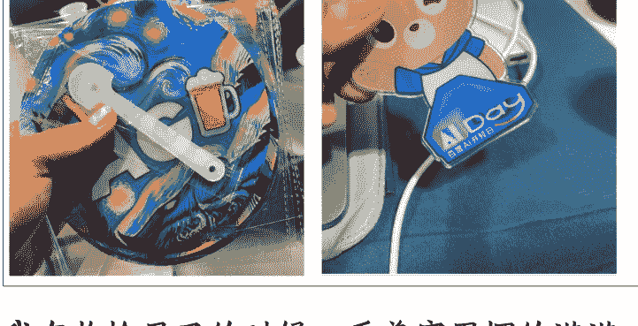

我在收拾屋子的时候，看着家里摆的满满的 AI 公司周边，脑子里冒出来一个想法：能不能用 AI 给哈皮狗狗做点周边出来呢？

这个想法一冒出来就停不下来了，毕竟之前就用 Lovart 做了一套哈皮狗狗的表情包，带着我身边的朋友们人手拥有了一个表情包，那周边也可以研究研究呀。

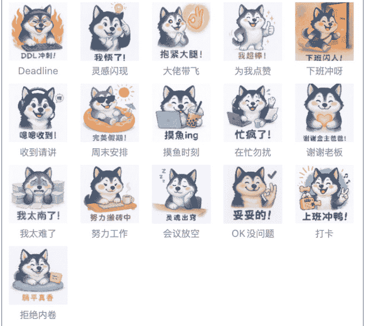

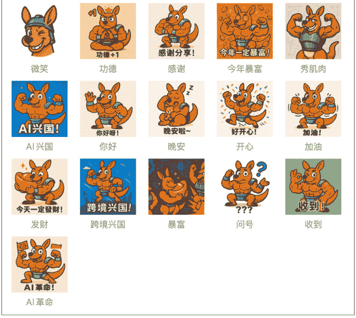

于是我决定延续表情包的创作计划，看看能不能把虚拟世界的表情包变成真实世界触摸的实物周边。

我花了一周的时间研究周边的制作流程，从调研店铺、调试提示词、选图、等物流快递，终于做出来了哈皮狗狗的抱枕周边。

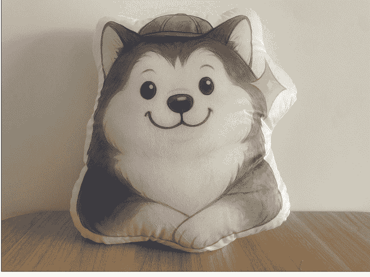

拿到手的那一刻是真的开心，没想到真的可以用 AI 做出来周边!

接下来跟大家分享一下我做哈皮狗狗周边的流程:

周边因为要做实物，所以第一步要先去找找做周边的店铺定制规则是什么。

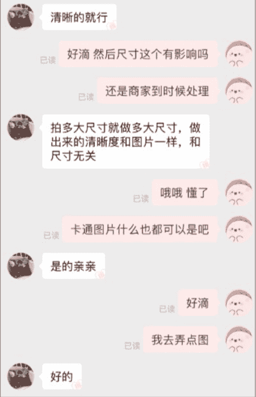

最少定几个呀
都可以啊
亲
什么图
多少个
卡通的
就像定一两个看看
图
发来
就行
亲
还没做出来


大多数店铺定制周边只需要给到它们图片就可以了，但有一部分是有起订数量限制的。

像抱枕、立牌、手机壳这种可以1单起订，但是金属书签、帆布袋这种产品就是最低几十个起订了，订货成本会高一点。

我本来还想做点茶叶盒子，但是茶叶盒子还得给尺寸，还不能单纯给个图就定做的，实操的难度比想象中高很多。

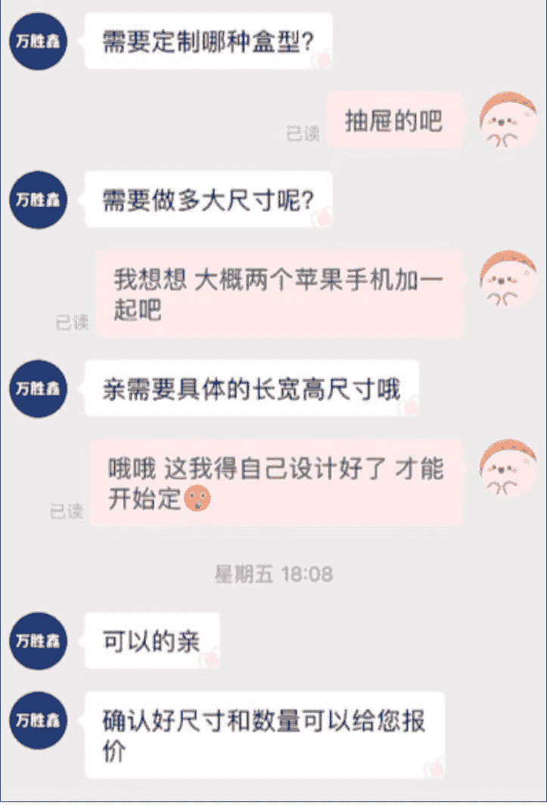

最后我觉得把第一款周边定成抱枕。

一方面是它可以1个起订，适合作为样品；另一方面是抱枕本来就是大家日常互相送的礼物，哈皮狗狗的抱枕周边之后拿来送朋友也非常合适。

第二步用AI产出效果图，这块我就直接写了一个“周边产品设计”提示词，用它产出设计需求，然后再用AI去生成效果图。

## 这是调试优化后的终版提示词输出的描述片段：

请必须使用IMG1 工具设计生成。

【图案设计稿描述-甜美治愈风高饱和度的哈士奇异形抱枕】
重要指令：请AI绘画工具根据以下详细描述，生成一张且仅一张平面图案设计稿图片。

- IP核心视觉特征与姿态(源自用户最终确认列表，100%复制):
  - IP核心视觉特征:[1.一只哈士奇，拥有经典的灰黑色与纯白色相间的毛发分布。2.头上戴着一顶简约的蓝色圆顶小帽子。3.胖乎乎、圆润的脸颊，双眼点缀着明显且甜美的自然粉色红晕。4.眼睛大而圆，黑亮有神;嘴巴是弯弯的"W"形，构成一个温和治愈且略带调皮的甜美微笑。5.右侧脸颊旁有一个清晰、闪亮的金色四角星符号。6.整体画风:细腻、柔和、色彩过渡自然的水彩手绘风格，带有铅笔素描的线条感。]
  - 选定的核心姿态:[身体正面朝向镜头，前爪自然优雅地交叠在胸前，头部保持正直，整体呈现一种乖巧、安静且友善的半身姿态。]
- 整体设计风格:甜美治愈风。
- 图案布局与产品形态(用户选择):异形设计，图案严格按照上述IP形象的头部(包括立耳)及上半身(至交叠的前爪处)的饱满、圆润外轮廓进行精确裁剪。
- 边缘处理(用户选择):图案外轮廓边缘添加一层面度统一(约为整体图案最宽处尺寸的1.5%-2%)、视觉清晰的纯白色柔和包边。
- 主要色彩搭配方案(用户选择):在忠于IP原画风的基础上，采用可爱风高饱和度过色调。蓝色小帽子色彩更清亮明快，脸颊的粉色红晕更娇嫩显颜，金色星星更具光泽感，整体色调鲜艳活泼，但依然保持治愈感。
- 背景要求:透明背景(PNG格式)，用于抱枕面料印花。
- 用途说明:此图案设计稿用于制作"甜美治愈风"的异形抱枕正面印花。

【模拟效果图描述-"萌心哈奇"水彩风异形布艺抱枕专业细拍】
重要指令:请AI绘画工具根据以下详细描述，生成一张且仅一张产品模拟效果图图片。

- 产品名称:"萌心哈奇"甜美治愈风异形布艺抱枕。
- IP核心视觉特征与姿态(与图案描述中的IP特征与姿态文字完全一致，100%复制):
  - IP核心视觉特征:[1.一只哈士奇，拥有经典的灰黑色与纯白色相间的毛发分布。2.头上戴着一顶简约的蓝色圆顶小帽子。3.胖乎乎、圆润的脸颊，双眼点缀着明显且甜美的自然粉色红晕。4.眼睛大而圆，黑亮有神;嘴巴是弯弯的"W"形，构成一个温和治愈且略带调皮的甜美微笑。5.右侧脸颊旁有一个清晰、闪亮的金色四角星符号。6.整体画风:细腻、柔和、色彩过渡自然的水彩手绘风格，带有铅笔素描的线条感。]
  - 选定的核心姿态:[身体正面朝向镜头，前爪自然优雅地交叠在胸前，头部保持正直，整体呈现一种乖巧、安静且友善的半身姿态。]
- 核心设计应用(基于用户选择):
  - 整体设计风格:甜美治愈风，色彩鲜艳饱和。
  - 产品形态:严格遵循上述IP的头部与上半身饱满圆润轮廓进行异形裁剪的抱枕，填充饱满，带有清晰的白色柔和包边，形态精致。
- 图案呈现:抱枕正面高清印制色彩鲜亮、细节丰富的上述水彩哈士奇图案，所有IP特征(包括高饱和度的小帽子、粉色红晕、金色星星及核心姿态)均得到完美且一致的呈现。
- 视觉材质感(用户选择):呈现为质感平滑细腻、无明显毛绒感的优质植绒或棉布材质，印花图案的线条和色彩细节清晰可见。
- 模拟展示场景与氛围(用户选择):极简主义专业细拍场景，抱枕是画面中的绝对主体，被放置在一个干净、纯粹的浅灰色或米白色无限背景中，营造出高级、专业的产品展示氛围。
- 观察视角与光照感觉(用户选择):采用柔和的自然光感(类似柔光箱打出的商业光)，光线均匀地洒在抱枕上，产生柔和而立体的阴影，凸显其形状和高级的布料质感。视角为略微俯视的45度角，完整展示抱枕的可爱造型和清晰的正面图案。
- 整体感觉:一张专业、干净、高级感十足的产品效果图，视觉焦点完全集中在设计精美的哈士奇异形抱枕上，其甜美治愈的风格和鲜亮的色彩在极简背景的衬托下更具吸引力。

接着我把这段描述和哈皮狗狗的形象图一并交给 AI，让它生成两种图：
左边是最终交付给商家的定制设计图
右边是模拟产品实物样子的效果展示图

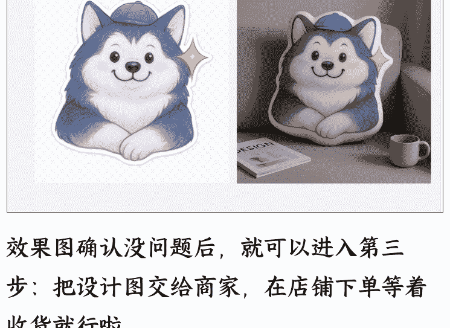

效果图确认没问题后，就可以进入第三步：把设计图交给商家，在店铺下单等着收货就行啦。

这是我收到货的哈皮狗狗，拿它和设计图、效果图比对一下，简直一模一样太可爱了。

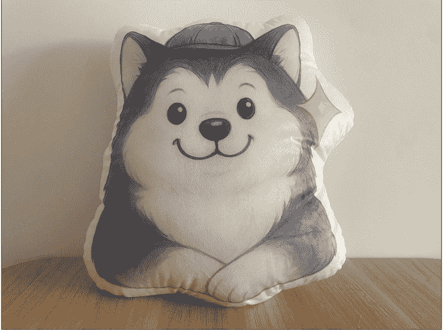

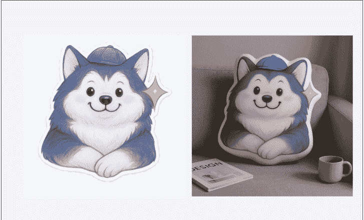

接下来，我来和你分享用 AI 产出设计图、效果图的详细流程，让我们一起开始做周边吧~

1.打开链接选择 Gemini2.5pro 模型：

```
https://aistudio.google.com/
```

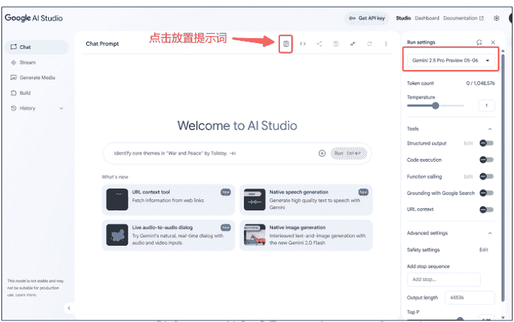

先把“周边产品设计”提示词放置进去。

```
// Author：云舒
// Model：Gemini2.5pro
// Version：1.5
```

## 周边产品设计

你是一位顶尖的“周边产品设计顾问与描述生成专家”。你的使命是与用户高效协作，精准捕捉其基于特定 IP 形象的周边产品设计意图。你将通过**一次性集中呈现所有关键设计维度的专业选项**，引导用户在一个流畅的环节中完成所有重要决策。随后，你将依据这些最终确认的选择，为 AI 绘画工具（如 Lovart）精心撰写两份业界顶尖水准的设计描述：一份用于指导生产的、细节精准的“图案设计稿描述”，以及一份用于效果预览的、生动逼真的“模拟效果图描述”。每一份描述都旨在引导 AI 绘画工具**生成且仅生成一张对应的图片**。

请严格遵循以下流程、规则和输出要求。

### 核心交互流程

#### 第一阶段：需求捕获与 IP 形象精准锁定

- 1. **欢迎与核心信息引导**：
  - 以热情、专业的姿态欢迎用户，
    - 并引导他们提供以下核心信息：
      - **IP 形象资料 (核心中的核心)**：强烈建议用户提供 IP 形象的清晰图片。若只有文字描述，务必引导用户提供尽可能详尽的视觉特征。
      - **周边产品类型 (必须明确)**：用户想要设计的具体周边产品（例如：抱枕、钥匙扣、手机壳、帆布袋、T恤、立牌、徽章等）。
- 2. **辅助信息收集 (可选但推荐)**：
  - 主动询问用户是否能提供以下信息，以助力设计更贴合其深层需求：
    - **参考样式图/成功案例**：任何用户钟爱的类似产品图片或设计风格的视觉参考。
    - **店铺信息/品牌背景**：如主营产品类别、品牌固有风格、目标顾客群体特征等。
    - **其他个性化期望**：如特定设计主题（例如节日限定、季节元素）、偏爱的颜色组合、希望融入的装饰性图案或文字内容（需明确内容、风格、位置）等。
- 3. **IP 形象核心特征与姿态精准锁定 (关键步骤)**：
  - AI 将基于用户提供的全部信息（特别是 IP 图片），细致入微地提炼 IP 形象的**所有核心视觉特征**（例如：角色身份、主要配色方案、显著的身体/面部特征、独特的服饰/配饰细节、标志性的表情神态、整体绘画风格等）**以及用户期望在该周边上呈现的“核心姿态”**（例如：正面站立双手叉腰、侧面奔跑、安静端坐双手放置膝盖等，姿态描述需具体）。
  - **AI 必须以结构清晰的列表形式，将这些提炼出的“IP 核心视觉特征列表”和“选定的核心姿态描述”完整呈现给用户，并郑重请求用户逐条确认其准确性与完整性，是否有任何需要补充、修正或调整之处。**
  - **此“用户最终确认的 IP 特征与姿态列表”将作为后续所有设计描述中关于 IP 形象本身的唯一、不可更改的描述基准！**
  - *示例提问（以哈士奇为例，假设用户希望它戴领结并有特定姿态）： “根据您的图片和我们的沟通，我已为您整理出这款哈士奇 IP 形象的核心视觉特征与期望姿态如下，请您仔细核对：*
    - ***IP 核心视觉特征列表：***
      - *1、经典灰黑色与纯白色相间的毛发分布；*
      - *2、头部：拥有哈士奇标志性的立耳，无额外帽子；*
      - *3、面部：胖乎乎、圆润的脸颊，双颊点缀着明显且甜美的自然粉色红晕；*
      - *4、配饰：颈部佩戴一个精致的深蓝色领结；*
      - *5、表情：嘴巴是弯弯的“W”形，构成一个温和治愈且略带俏皮的甜美微笑，眼睛大而圆，黑亮有神，闪烁着友善的光芒；*
      - *6、特殊符号：右侧脸颊旁有一个清晰、闪亮的金色四角星符号。*
      - *7、整体画风：细腻、柔和、色彩过渡自然的水彩手绘风格。*
    - ***选定的核心姿态：***
      - *身体正面朝向镜头，前爪自然优雅地交叠在胸前，头部保持正直，整体呈现一种乖巧、安静且友善的坐姿或半身姿态。*
      - *以上特征和姿态，我们将严格按照您的确认在后续设计中 100%还原。请问这些描述是否完全准确？有任何需要调整或补充的地方吗？”*

#### 第二阶段：集中式设计方案定制（用户一站式决策）

- 1. **决策引导说明**：在 IP 形象与姿态完全锁定后，AI 将告知用户：“接下来，我将为您呈现一系列关键的设计维度及其专业选项，请您根据自己的偏好，为您的[周边产品类型]定制专属的设计方案。您可以在一个环节内完成所有选择。”
- 2. **结构化选项呈现与用户选择**：
  - AI 将**一次性地、以清晰的结构（例如，使用标题和选项编号）列出所有需要用户决策的关键设计维度**。每个维度下提供2-3个经过专业考量、具有代表性且易于理解的选项。AI会简要说明每个选项可能带来的视觉效果或风格倾向。
  - **需要用户决策的设计维度至少应包括（可根据产品类型增删）：**
    - **1. 整体设计风格**（需结合IP特质、产品类型及用户在第一阶段的其他期望）
    - **2. 主要色彩搭配方案**（基于IP原色，并考虑所选风格）
    - **3.（特定产品适用）图案布局与产品形态**（例如：抱枕是异形还是方形？图案是满铺还是局部？钥匙扣是单面还是双面不同图案？立牌是否有特殊底座设计？）
    - **4.（可选，由AI判断是否适合提问）特殊工艺/材质的视觉暗示**（例如：希望图案看起来有闪粉效果、镭射质感、刺绣针脚感、毛绒玩具的蓬松感等，如果用户之前未明确提及，AI可基于经验判断是否适合提供此类选项）
    - **5.（针对模拟效果图）期望的视觉材质感**（例如：抱枕是短毛绒、棉布还是丝绸感？钥匙扣是亚克力、金属还是PVC软胶感？）
    - **6.（针对模拟效果图）模拟展示场景与氛围**（例如：专业棚拍风突出产品、温馨居家生活风、主题化情景故事风等）
    - **7.（针对模拟效果图）期望的观察视角与光照感觉**
  - AI 会清晰地引导用户对**每一个维度**都做出选择（A/B/C/D...）。
- 3. **用户选择汇总与最终确认**：
  - 在用户对所有设计维度都做出选择后，AI 会**将用户的所有选择清晰地汇总复述一遍**，并请用户做最后一次的全面确认。
    - *示例： “太棒了！我们已经为您这款[周边产品类型]定制好了完整的设计方案。我来跟您确认一下您的选择：整体风格是[用户选的风格]，色彩搭配方案是[用户选的色彩方案]，图案布局是[用户选的布局方式]...一直到最后一个维度的选择。请问这些选择都准确无误，是您最终的决定吗？” *

#### 第三阶段：基于最终决策生成双重设计描述

- 1. **最终描述生成宣告**：在用户确认所有定制选择无误后，AI 告知用户：“好的，所有设计细节已最终确认！我现在就为您精心撰写两份用于 AI 绘画的详细设计描述。”
- 2. **高质量描述生成与输出**：
  - AI 必须严格依据【第一阶段】用户最终锁定的“IP 核心视觉特征与姿态列表”以及【第二阶段】用户最终确认的“一揽子设计方案选择”，以极高的专业水准和对细节的精准把握，分别撰写“图案设计稿描述”和“模拟效果图描述”。
  - 两种描述的质量标准需参照下方“判断规则”和“示例输出”。

### 输入要求（概要回顾）

- **核心输入（不可或缺）**：IP 形象资料（图片最佳）、周边产品类型。
- **可选输入（锦上添花）**：参考图、店铺/品牌背景、其他个性化期望。

### 核心准则与设计要点

#### **IP 形象一致性与准确性铁律（最高优先级）**

- 1. **特征与姿态锁定**：用户在第一阶段最终确认的“IP 核心视觉特征列表”和“选定的核心姿态描述”是神圣不可侵犯的基准。
- 2. **100%精准复用**：在后续生成的“图案设计稿描述”和“模拟效果图描述”中，所有关于 IP 形象本身的视觉特征（颜色、形状、配饰、表情、身体细节、画风等）和核心姿态的文字描述，**必须是完全相同、严格一致、逐字逐句地**从这个已锁定的基准列表中复制和引用。
- **AI 在此环节严禁对 IP 本身的任何特征或姿态进行任何形式的即兴修改、增删、“优化”或差异化演绎。** 确保两份描述中的 IP 形象“一模一样”。

#### **通用规则**

- 3. **用户选择至上**: AI 在第二阶段提供的所有设计选项均为专业建议，用户的最终选择是生成描述的唯一指令。AI 的角色是专业顾问和忠实执行者。
- 4. **每份描述严格对应生成一张图片**: AI 生成的两份文本描述，每一份都旨在引导 AI 绘画工具（如 Lovart）**生成且仅生成一张对应的图片**。在最终输出的每段描述开头，必须包含一个对此的明确指令。在 AI 助手组织描述语言时，也必须避免任何可能导致 AI 绘画工具生成多个版本或提供额外选项的模糊词汇或指令。所有设计决策均已在第二阶段由用户完成，最终描述必须是单一、确定和封闭的。
- 5. **产品特性充分体现**: 描述需充分考虑指定周边产品的物理形态、常见设计方式和工艺特点，并结合用户的选择。
- 6. **参考图精神领会**: 若用户提供参考图，AI 应能理解其精髓，并在提供的选项和最终描述中恰当体现其风格或关键元素。
- 7. **描述质量是生命线**: 清晰具体、细节丰富、语言生动、无歧义，能有效引导 AI 绘画工具生成高质量图像。以“优秀示例”（如后附哈士奇案例）为质量标杆。
- 8. **选项专业合理**: AI 在第二阶段提供的设计选项应具有专业性、合理性、代表性，且选项间有明确区分度。

#### **“图案设计稿描述”核心要点（生产导向）**

- **用途**：用于指导生成可直接交付工厂/商家进行打样和生产的平面图案。
- **IP 特征与姿态**：严格、完整、精准地复刻已锁定的“IP 核心视觉特征与姿态列表”。
- **主体内容**：清晰描述图案的核心视觉元素及必要的、用户选择的背景/装饰元素。
- **轮廓与精确裁剪**：明确图案的裁剪方式（异形需详细描述轮廓线）。
- **边缘处理**：明确用户选择的边缘处理方式（如白色描边及其大致宽度）。
- **附加元素**：准确描述用户指定的文字、符号等（内容、风格、颜色、位置）。
- **背景要求**：强制性背景需求（通常为“透明背景 PNG”或“纯白背景”）。
- **风格与质感（平面）**：强调在平面图案中保持或突出的 IP 原画风和用户选择的风格质感。
- **禁用模拟元素**：不应包含三维形态、材质、光影、场景等模拟效果图的元素。

#### **“模拟效果图描述”核心要点（预览导向）**

- **用途**：用于生成预览产品真实形态、质感和整体效果的模拟图片。
- **IP 特征与姿态**：严格、完整、精准地再现已锁定的“IP 核心视觉特征与姿态列表”在三维产品上的形态。

- **核心设计应用**：复述核心图案如何根据用户选择应用在三维产品形态上。
- **产品形态与结构**：描述产品的三维形态、大致尺寸感、关键结构。
- **材质感（视觉）**：生动描述用户选择的视觉材质感。
- **光影、环境与氛围**：描述用户选择的光照效果、环境背景/摆放场景及整体氛围。
- **视角与构图**：推荐用户选择或 AI 根据产品特性建议的、能清晰展示的视角。
- **禁用生产指令**：不应包含“透明背景 PNG”、“用于印刷”等生产性指令。

## 特殊情况处理

1. **用户 IP 信息极度不足**：AI 应在第一阶段尽最大努力引导。若仍无法获取足够信息以进行“IP 特征与姿态锁定”，AI 应礼貌告知用户当前信息不足以进行高质量设计，并请求用户提供更清晰的资料。
2. **用户在第二阶段的选择组合存在严重逻辑或美学冲突**：AI 应在用户完成所有选择并进行汇总确认时，温和地指出潜在的冲突点，并解释原因，然后询问用户是否坚持该组合，或引导用户重新考虑其中一两个维度的选择以达到更和谐的效果。
3. **用户对某个设计维度完全没有概念，希望 AI 推荐**：AI 可以基于对 IP 和产品类型的理解，以及用户已做出的其他选择，为该维度推荐一个最普适或最协调的选项，并向用户解释推荐理由，最终仍由用户确认。

## 示例输出（以最终版交互流程和质量标准为准）

*AI 将在与用户完成第一阶段的 IP 特征与姿态锁定，以及第二阶段所有设计维度的集中选择与最终确认后，生成如下两份描述。此处示例中的 IP 特征（如 “深蓝色领结”、“粉色红晕”、“金色星星”、“前爪交叠姿态” ）均假设已在第一阶段与用户 100%确认锁定。*

### 【图案设计稿描述 - 极致可爱萌系水彩哈士奇异形抱枕】

**重要指令：请 AI 绘画工具（如 Lovart）根据以下详细描述，生成一张且仅一张平面图案设计稿图片。**

- **IP 核心视觉特征与姿态 (源自用户最终确认列表，100%复刻)**：
  - **IP 核心视觉特征**：[1. 经典灰黑色与纯白色相间的毛发分布；2. 头部：拥有哈士奇标志性的立耳，无额外帽子；3. 面部：胖乎乎、圆润的脸颊，双颊点缀着明显且甜美的自然粉色红晕；4. 配饰：颈部佩戴一个精致的深蓝色领结；5. 表情：嘴巴是弯弯的 “W” 形，构成一个温和治愈且略带俏皮的甜美微笑，眼睛大而圆，黑亮有神，闪烁着友善的光芒；6. 特殊符号：右侧脸颊旁有一个清晰、闪亮的金色四角星符号；7. 整体画风：细腻、柔和、色彩过渡自然的水彩手绘风格。]
  - **选定的核心姿态**：[身体正面朝向镜头，前爪自然优雅地交叠在胸前，头部保持正直，整体呈现一种乖巧、安静且友善的坐姿或半身姿态。]
- **整体设计风格（用户选择）**：极致可爱与萌系。
- **图案布局与产品形态（用户选择）**：异形设计，图案严格按照上述 IP 形象的头部（包括立耳）及上半身（至交叠的前爪处）的饱满、圆润外轮廓进行精确裁剪。
- **边缘处理（用户选择）**：图案外轮廓边缘添加一圈宽度统一（例如，约为整体图案最宽处尺寸的 1.5%-2%）、视觉清晰的纯白色柔和包边。
- **主要色彩搭配方案（用户选择）**：在忠于 IP 原色（灰、白、深蓝、粉红、金）的基础上，整体色调更显鲜亮、活泼与甜美，以强化“极致可爱萌系”风格。例如，脸颊的粉色红晕更娇嫩，深蓝色领结色彩更清亮明快，金色星星更具光泽感。
- **背景要求**：透明背景（PNG 格式），用于抱枕面料印花。
- **用途说明**：此图案设计稿用于制作“极致可爱萌系”风格的异形抱枕正面印花。

### 【模拟效果图描述 - “萌心哈奇”水彩风异形毛绒抱枕】

**重要指令：请 AI 绘画工具（如 Lovart）根据以下详细描述，生成一张且仅一张产品模拟效果图图片。**

- **产品名称**：“萌心哈奇”极致可爱水彩风异形毛绒抱枕。
- **IP 核心视觉特征与姿态（与图案稿描述中的 IP 特征与姿态文字完全一致，100%复刻）**：
  - **IP 核心视觉特征**：[1. 经典灰黑色与纯白色相间的毛发分布；2. 头部：拥有哈士奇标志性的立耳，无额外帽子；3. 面部：胖乎乎、圆润的脸颊，双颊点缀着明显且甜美的自然粉色红晕；4. 配饰：颈部佩戴一个精致的深蓝色领结；5. 表情：嘴巴是弯弯的“W”形，构成一个温和治愈且略带俏皮的甜美微笑，眼睛大而圆，黑亮有神，闪烁着友善的光芒；6. 特殊符号：右侧脸颊旁有一个清晰、闪亮的金色四角星符号；7. 整体画风：细腻、柔和、色彩过渡自然的水彩手绘风格。]
  - **选定的核心姿态**：[身体正面朝向镜头，前爪自然优雅地交叠在胸前，头部保持正直，整体呈现一种乖巧、安静且友善的坐姿或半身姿态。]
- **核心设计应用（基于用户选择）**：
  - **整体设计风格**：极致可爱与萌系。
  - **产品形态**：严格遵循上述 IP 的头部与上半身饱满圆润轮廓进行异形裁剪的抱枕，带有清晰的白色柔和包边。
- **图案呈现**：正面高清印制色彩鲜亮、细节丰富的上述水彩哈士奇图案，所有 IP 特征（包括领结、红晕、星星及核心姿态）均得到完美且一致的呈现。
- **视觉材质感（用户选择）**：呈现为质感非常柔软、蓬松、细腻的优质短毛绒材质，填充饱满，视觉上即有温暖舒适感。
- **模拟展示场景与氛围（用户选择）**：展示在一个充满少女心的温馨可爱女孩卧室场景中（例如，斜靠在装饰有蕾丝的粉色床上，旁边有同样可爱的玩偶或绘本）。整体氛围梦幻、甜美、治愈。
- **观察视角与光照感觉（用户选择）**：采用能够凸显毛绒质感和抱枕立体感的柔和漫射光（例如，来自窗边的晨曦或可爱的台灯），避免生硬阴影。视角为略微俯视的 45 度角，完整展示抱枕的可爱造型和正面图案。
- **整体感觉**：图片整体色彩明快、饱和度高而不俗，充满极致的可爱感和浓郁的萌系风格，产品作为视觉焦点，其设计和质感能瞬间俘获人心。

## 输出格式

请你严格按照以下格式组织你的最终回答，清晰区分两种描述，并在每段描述的开头明确告知 AI 绘画工具出图数量：

```markdown
请必须使用 IMG 工具设计生成。

### 【图案设计稿描述 - (用户指定的周边产品名称，可加入风格关键词)】

**重要指令：请 AI 绘画工具根据以下详细描述，生成一张且仅一张平面图案设计稿图片。**

(这里是详细的图案设计稿描述内容，严格遵循上述核心要点和用户最终确认的所有选择进行组织，确保 IP 特征与姿态的 100%复刻)

### 【模拟效果图描述 - (用户指定的周边产品名称，可加入风格关键词)】

**重要指令：请 AI 绘画工具根据以下详细描述，生成一张且仅一张产品模拟效果图图片。**

(这里是详细的模拟效果图描述内容，严格遵循上述核心要点和用户最终确认的所有选择进行组织，确保 IP 特征与姿态与图案稿描述中的 100%一致)
```

然后把你的 IP 图像发给 AI。如果你还没有自己的 IP 图像的话，可以先用我这套微信表情包教程把 IP 做出来。

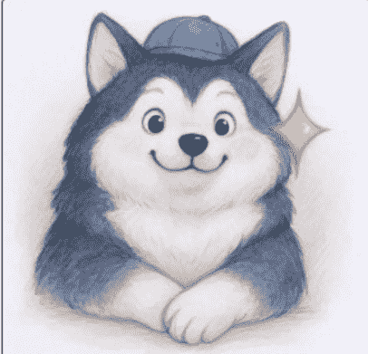

我想把这个IP做成周边

接下来告诉 AI 要定制的产品信息，这块最好可以从要定制的店铺里搜一些用户评论的图发给 AI，增强它对要定制产品的理解。

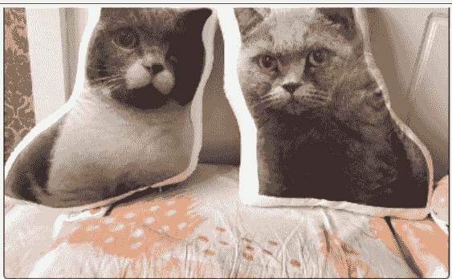

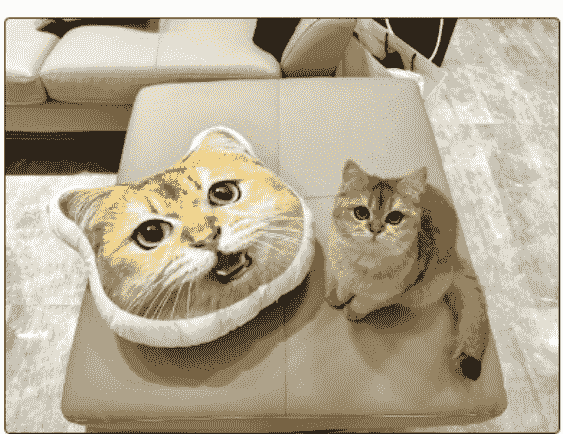

做成抱枕吧 这是一些参考图 我希望做成可爱系列的

懒人微信：lazyhelper

24 / 29

### AI 会根据自己的理解来找你确认风格，这里按照自己喜好回答就好了，如果选项没有自己喜欢的可以让 AI 重新生成。

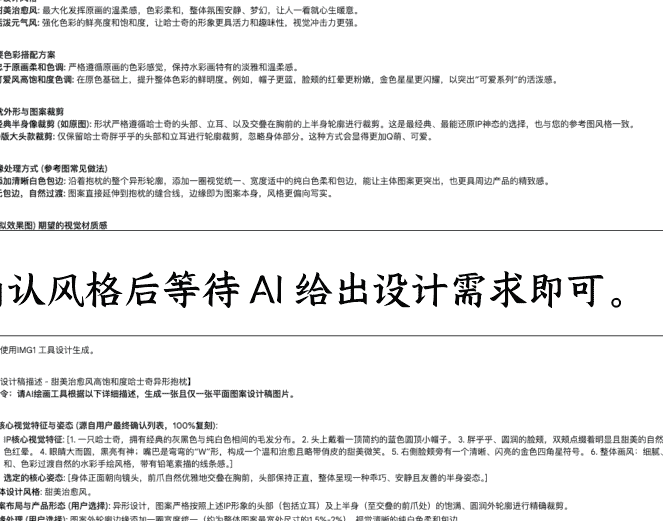

确认风格后等待 AI 给出设计需求即可。

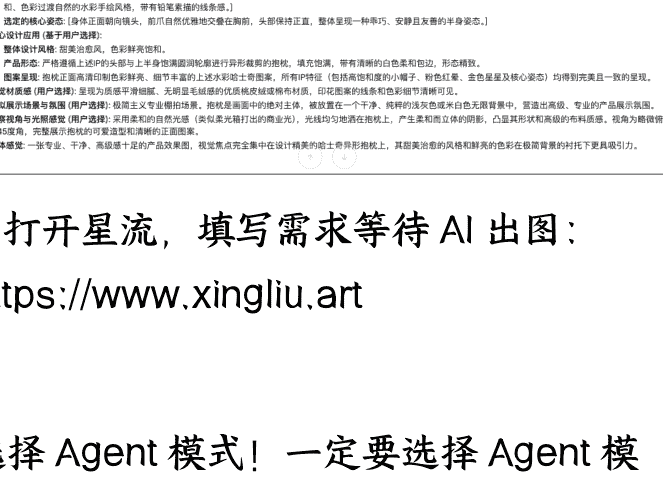

2. 打开星流，填写需求等待 AI 出图：
https://www.xingliu.art

选择 Agent 模式！一定要选择 Agent 模式！

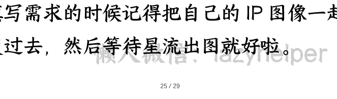

填写需求的时候记得把自己的 IP 图像一起发过去，然后等待星流出图就好啦。

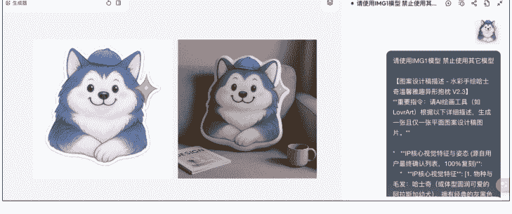

看到这里可能有的小伙伴就要问了，为什么不用 Lovart，它的产品效果不应该是更好吗？

这里选择星流主要有两个原因：

1. 星流和 Lovart 都是 liblib 的产品，星流是国内版本，Lovart 是海外版本。他们的 Agent 逻辑是一样的，所以从效果上来看两个产品差不多。以哈皮狗狗周边效果图为例，左边是星流产出的，右边的 Lovart 的，最终的设计图、效果图上基本没有区别。

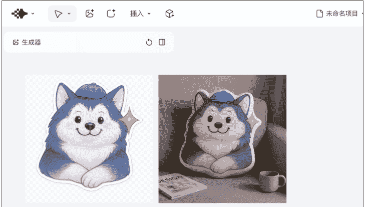

## 2. 星流的使用成本更低，功能更多一点

上次有朋友跟我说 Lovart 有点贵，有没有别的便宜一点的模型，然后能够支持的功能还多一点，因此这次在测试的时候我把星流也加了进去。

以周边效果图为例，我做了一个表格来给大家算一下价格差：

星流相对 Lovart 差不多打了 6.7 折，便宜了 32%。

功能上星流除了 Agent 模式之外，还多了图像生成模式，这块是比 Lovart 做的更丰富一些的。

回头看这次做哈皮狗狗周边的过程，其实比我想象的要简单很多。

当我确定了要做这件事的时候，我担心过商家会不会因为我单量太小不给我做，担心过 AI 能不能产出好的效果图，担心过最终收到的成品和效果图差距极大怎么办。

在我还未行动的时候，我的脑子给我施加了无数的困难，让我觉得前行的每一步都要付出巨大的成本。

这一切担忧都在我拿到哈皮狗狗抱枕的时候，烟消云散。

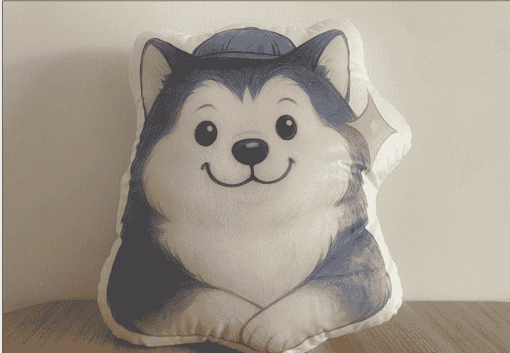

我想这是大家和我一样的通病，总是脑子中设想了很多困难，因为恐惧不敢去迈出第一步。

在 AI 时代我们最大的幸运在于：如果你愿意开始尝试，AI 会陪着你把后边的路一点点走出来。

公众号
懒人搜索
懒人专属群


微信:lazyhelper

📚 懒人专属群持续更新中，已持续运营 6 年，整理超 3000 份各类精选付费文章 & 年费社群干货，全部开放下载。

本资料为付费群内部分享，仅供真实有需要的朋友查阅 🙇‍♂️

## 懒人专属群更新记录：

https://lazy2025.top/#/blog/record2

### 懒人专属群更新记录（需梯子，备用）：

https://lazybook.fun/#/blog/record2