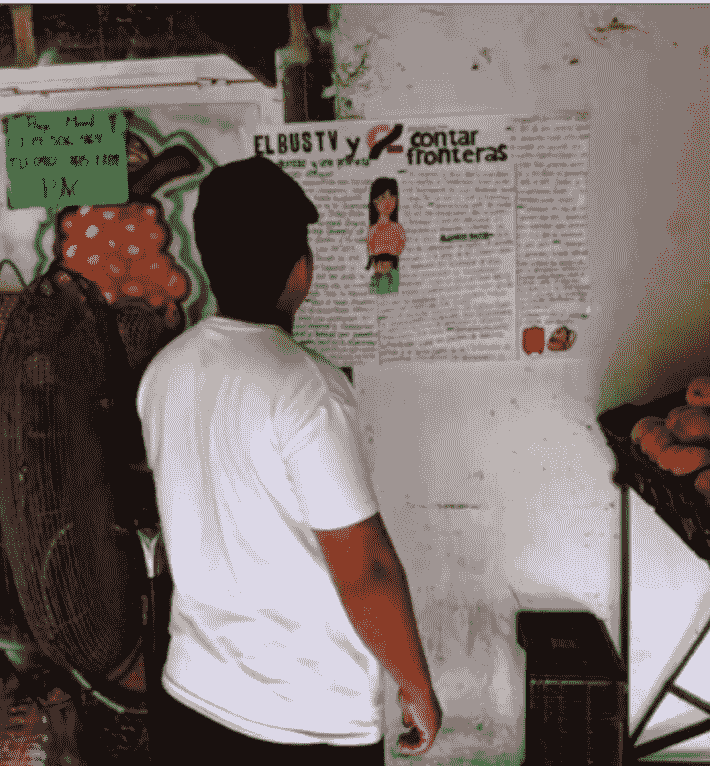
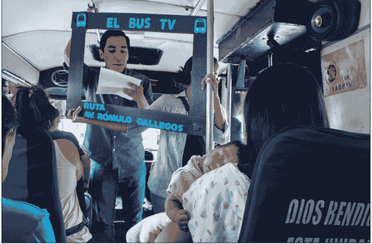

# 几则给人希望的案例

250710 新闻实验室

整理：公众号懒人搜索，懒人专属群独享

懒人微信：lazyhelper

不论资源多少，不论障碍大小，报道与传播总能找到方式与渠道，也总能获得回响。

近些年来，新闻行业的故事总是愁云惨淡居多，我们也写过不少关于裁员、倒闭、记者遇害、新闻自由被侵蚀的话题。

今天，我想介绍几个让人感到希望的案例。它们不是给行业提供了什么灵丹妙药，但它们在各自的领地里逆风向上，取得了不错的反响。它们的故事，或许也能给我们带来一点启发。

## 「只做高质量的地方新闻，能比时尚杂志更赚钱」

第一个案例叫 SFGATE——SF 是旧金山（San Francisco）的简称。

SFGATE 扎根于旧金山湾区，是美国一个罕见的地方媒体成功案例。今年 4 月，根据行业媒体 Press Gazette 发布的排行榜，SFGATE 月访问量达到 2700 万次，名列美国最受欢迎新闻网站的第 37 位，更是美国最受欢迎的纯地方新闻网站。也就是说，排在它前面的 36 家网站，都不是做纯粹的地方新闻。

从营收方面来看，SFGATE 的情况同样乐观。如今，该网站拥有 60 名员工，并且主编表示他们从未裁员。据说，SFGATE 现在是赫斯特（Hearst）集团旗下盈利状况最好的新闻媒体，而赫斯特还运营着众多受欢迎的杂志品牌，比如《Elle》《Esquire》等等。能比时尚杂志更赚钱，这无疑是从一个侧面证明 SFGATE 的成功。

而更令人感到振奋的是，SFGATE 着力发展的新闻报道方向之一，竟然是地方议题的深度报道和长篇阅读。它的主编说，希望将其打造为西海岸的《纽约》杂志——《纽约》杂志以长篇特写闻名。

当然，同样是做高质量的深度报道，东西海岸还是有不同风格。《纽约》杂志多报道文化名流，而 SFGATE 最具特色的报道领域则是国家公园。

在 SFGATE，有多达三名记者专门报道加州州内的国家公园，他们都生活在自己报道的具体地区——这家媒体的理念是：不会把地方新闻报道分配给一个从未去过该地的记者，因为他们要雇佣“生活在那里、了解该社区重要事务的人”。国家公园栏目在推出四个月后，已经为 SFGATE 带来了 12%的网站流量。自 2019 年以来，SFGATE 已获得旧金山新闻俱乐部奖、北美旅游记者协会新闻奖，以及美国旅游作家协会洛威尔·托马斯奖等奖项。

SFGATE 曾报道迪士尼乐园涨价太多，已经变得极为昂贵，并获得了读者的热烈回应。主编说，《洛杉矶时报》和《橙县纪事报》是另外两家报道此事的媒体，但它们的报道大多非常友好，“因为他们在迪士尼乐园有广告利益。”

这家媒体还非常关注受众数据和反馈。因为湾区的亚裔读者多，所以他们专门雇佣了一位“饺子专栏作家”，事实证明效果确实不错。这个饺子专栏去年还获得了旧金山新闻俱乐部最佳专栏奖。

当然，SFGATE 的成功也有一些不可复制之处。最重要的是，加州经济发达，是世界第四大经济体，而湾区又是加州州内的领头羊。因此，SFGATE 拥有一批消费力强的读者，当地的广告主也能够承担更高的投放价格。另外，由于身处湾区，SFGATE 在科技发展上也占领先机，它早在 1994 年就建立了网站，并且是最早提供可搜索档案、分类广告和开放公共论坛的新闻网站之一。

尽管如此，其他区域的地方媒体依然有可以从 SFGATE 的成功故事中学习的地方——雇佣真正生活在报道地区的记者，而不是派遣外地记者进行空降式报道；寻找差异化的定位，填补全国性媒体和其他地方媒体留下的空白；以及，基于用户数据来洞察内容策略。

## 「街头“黑板报”和巴士上的“模拟电视”」

第二个案例来自委内瑞拉与哥伦比亚接壤的塔奇拉州（Táchira）。在那里，信息真空现象十分普遍。该州 29 个市镇中有 11 个缺乏足够的本地媒体提供信息服务。州内有些城镇几乎没有广播电视台，甚至连印刷媒体都没有。塔奇拉州唯一一家印刷媒体是《国家报》（La Nación），每周只发行三次。更糟糕的是，塔奇拉州的互联网连接还非常不稳定。

在这种情况下，做地方媒体还有可能吗？

答案是肯定的，只不过这样的媒体不是网站，甚至不是报纸，而是在街头张贴的纸张，有点像黑板报。这种形式的官方名称叫 flipchart，意思是挂图。

「flipchart 形式的媒体」

《拉丁美洲新闻评论》报道说，塔奇拉州的记者 Reinaldo Mora 就做了这样一份 flipchart。他贴到墙上的报道讲述了自己同事 Carina 的故事——她因为在边境地区的报道工作而受到威胁，被迫移居海外。不少附近的邻居街坊停下来阅读这篇文章，深受触动，许多人表示：他们并不知道自己身边如此接近的地方正在发生这样的事情。

除了挂图之外，当地还有另外一种新闻报道的分发方式：bus newscasts，具体形式是，记者登上公共交通工具，在模拟电视的纸板框架后面，向车上的乘客现场报道新闻。

无论是贴在街头的挂图，还是巴士上的模拟电视播报，都是看上去极为原始的媒体传播方式。它们适应的是当地缺乏纸媒和数字媒体的现状，以及审查压力。

但是另一方面，这两种形式也促成了更深刻的面对面连接。

在当地，长期用这两种方式做媒体的组织叫 El Bus TV。该组织的联合创始人 Laura Helena Castillo 说：“在任何大学的新闻专业里，学生都不太有机会以面对面直接接触的方式向受众讲述故事。而这就是我们感兴趣的新闻类型，在街头进行的、没有中介的、面对面进行的新闻，同时也具备倾听能力。”

另一家类似的当地独立媒体 La Vida de Nos 资深编辑 Erick Lezama 则表示，他们希望让记者们明白，让报道产生超越社交媒体点击量和评论数的影响力非常重要。

我们可以从一个具体的例子中理解这样的影响力：来自阿普雷州的一名记者报道了一名少女的故事，她来月经初潮的时候，恰好也是她和家人从家乡移民抵达边境城镇的时间。这个家庭非常困窘，无法为女孩提供经期卫生用品。

这个故事被张贴在阿普雷州一所高中洗手间的挂图上。有几十名青少年前来阅读这些信息，并由之引发了许多在学校被视为禁忌话题的讨论。后来，这幅挂图也在其他州发布，结果一位社区领袖在学校建起了经期卫生用品库。

这些案例让他们相信：通过报道人们能够产生共鸣的话题来与受众建立联系是可能的，即使是那些出于厌倦或不信任而倾向于回避政治新闻的人，即使是在贫穷和受打压的环境之下。

## 「一群中学生想要同龄人放下手机、拿起报纸」

第三个案例发生在美国纽约州长岛。在那里，一群15岁上下的中学生办了一份名为《The Ditch Weekly》的报纸。

长岛是纽约的后花园，是曼哈顿富豪和明星的度假胜地——《The Ditch Weekly》的几乎每一个人都遇到过斯嘉丽·约翰逊。但是，这里的年轻人们对报道名人不感兴趣，他们想要报道真正本地的东西。

比如，一名15岁的记者去年写了一篇关于当地滑板公园历史的文章。他说：“每个人都认为这只是一个有钱的旅游目的地，但有很多过去的东西没有人真正了解。”

他们报道当地的早餐店之争，也报道警察报告的搞笑事件，比如两名醉酒人员如何就一块劳力士的所有权发生争执。除此之外，也有更深度的报道，比如当地企业主如何在冬季淡季维持经营。他们还曾专访州长，谈Z世代选民的投票率。

这份报纸只在夏天的时候发行。一方面，年轻人们有暑假可以用于做报纸；另一方面，夏天也是长岛最热闹的时候。

报纸的两位创始人说，他们当然听说过很多“纸媒已死”的说法，所以一开始计划暑期创业的时候，只是想在海滩上卖食物，或者顶多是写一份newsletter。但是，当他们给印刷商打电话了解制作成本，经过计算得出：办报纸其实是可以赚钱的。

他们也的确赚到了钱。创始人的父母表示，他们并没有承担报纸的费用，报纸的收入来自当地餐厅、房地产经纪人和冲浪用品商店投放的广告。

（当然，有部分广告是卖给了报纸工作人员的亲戚。）

13岁的销售主管说，他和创始人通常带着一份报纸和三页媒体资料包走进商店。他估计今年至少已经打了40个销售电话。

尽管整个行业面临逆风，但 17 岁的首席财务官说，《The Ditch Weekly》的盈利状况非常好。记者每篇文章收入 50 到 70 美元，印刷成本约每周 900 美元，而广告收入在覆盖这些成本之后，还有利润。有人用去年夏天的收入买了一辆电动自行车。他们甚至还将部分利润捐赠给一家为残疾儿童提供冲浪服务的组织。

报纸本身的发行是免费的——他们把报纸放在商店里，供人们自取。

整个运作过程中，年轻人们都拒绝了父母的参与，除非是需要父母开车送他们去某些地方。

他们办报纸还有另一个目标，那就是希望用自身的例子，说服其他青少年放下手机，拿起报纸。

一位参与报纸的年轻人说：“当你用手机时，过一段时间就会感到无聊。”而与之相反，在做采访报道的时候，由于必须付出努力投入其中，所以反而不容易感到无聊。

另一位计划到海滩上拍摄人物百态的年轻人则表示：“我在社交媒体上花了很多时间，所以任何能让我摆脱那种状态的事情都好。”她已经是第二个夏天参与这份报纸了，因为她喜欢与朋友一起尝试新事物，并且，报纸是有实体产品可以展示的，这看起来很酷。

以上这三个案例有一个共同点：尽管形态各异、影响力不同，但他们都是本地媒体，都真实地关切着自己所在的地方，并以这种真诚赢得了受众的认可。

另外一点启发是：不论资源多少，不论障碍大小，报道与传播总能找到方式与渠道，也总能获得回响。

最后，安利小懒的付费群：

懒人专属群

📚 懒人专属群持续更新中，已持续运营 6 年，整理超 3000 份各类精选付费文章 & 年费社群干货，全部开放下载。

本资料为付费群内部分享，仅供真实有需要的朋友查阅 🙏

懒人专属群更新记录：
https://lazy2025.top/#/blog/record2

懒人专属群更新记录（需梯子，备用）：
https://lazybook.fun/#/blog/record2

懒人微信：lazyhelper