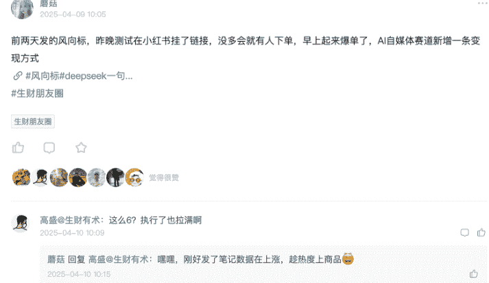
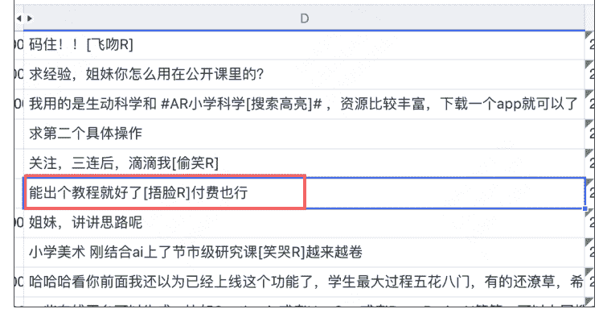
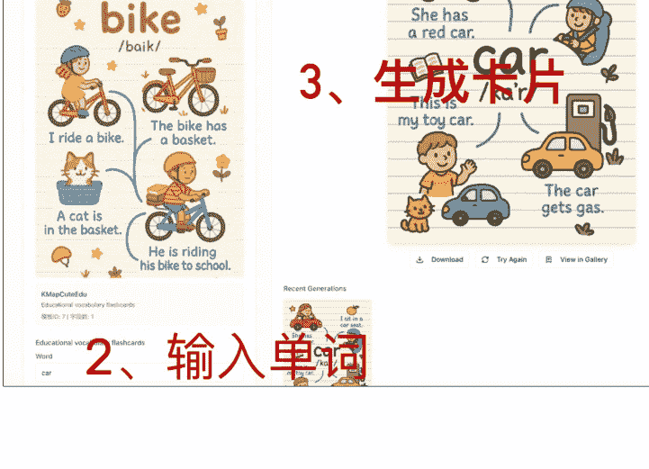
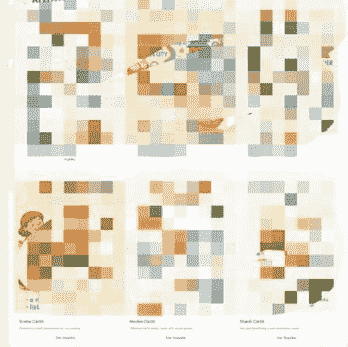
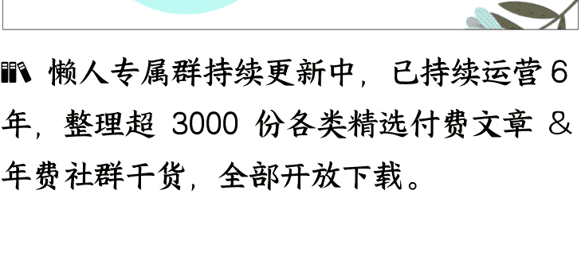

# GPT40画图网站0到1完整复盘（含踩坑细节）

250710 生财精华

公众号懒人搜索，懒人专属群独享

懒人微信：lazyhelper


大家好，我是蘑菇。非常抱歉，这篇应该6月初发的文章拖到了现在才发。

这篇复盘贴想跟大家完完整整地聊聊我做gpt4o画图网站这事儿。从一个想法到产品上线，再到推广和思考，中间的每个环节，好的坏的，我都掰开揉碎了说。希望能给想做gpt4o画图这个超级标的圈友们，一份能拿来就用的地图和避坑指南。

## 一、一个“打脸”的开始：从“绝不做产品”到“真香”

故事得从今年2月份说起。当时我刚开始做AI自媒体，还信誓旦旦地在圈里发帖子，说我的模式就是做商单号、接广告，绝不碰产品，因为太重了（做AI自媒体发布第一条视频后接到了商单）。当时可能还影响了几个圈友，现在想想，真是惭愧。

打脸来得很快。

到了4月，我发了一条用 DeepSeek 做小游戏的“风向标”帖子（小红书卖 deepseek 生成的小游戏）。光说不练是假把式，发完我自己就去实操了，很快就开始变现了！



这事儿一下就点燃了我。与此同时，我做自媒体接广，天天被 pr 催着问“下一条视频啥时候出”，那种被追着跑的感觉，真的很烦。

一边是被动接单的烦躁，一边是主动出击拿到结果的兴奋。两相对比，我脑子里那个“做个自己的产品”的念头，就像疯长一样长了出来。

于是，我彻底转向，一头扎进了“AI 自媒体教育产品”的探索里。我把 DeepSeek、GPT、可画、即梦这些工具当成我的“特种兵”，让它们互相配合打组合拳，折腾了一个多月，跑通了超过 15+ 个用户付费的变现场景。

在这里，我详细拆解一下，我是如何在一个多月里，找到用户买单的 10 多种场景。这套“笨办法”，可能比后面做网站的故事，对大家更有参考价值。

### 核心思路，就是查理·芒格那套著名的钓鱼理论。这套理论，简直就是为我们这些找需求的独立开发者量身定做的。

#### 第一原则：在有鱼的地方钓鱼

我的实践：这就是要找到“痛点密度”最高的地方。对我来说，这个地方就是小红书。那里有成千上万的老师和家长，天天在吐槽备课难、做课件烦、找不到好素材、AI没有真正赋能课堂、求AI教程。这些抱怨和求助，就像鱼群在水下吐出的“咕噜咕噜”的泡泡，明确地告诉我：水下有鱼，而且是一大群。

| 评论内容 | 评论时间 | 评论点赞数 | 子评论数 |
|---|---|---|---|
| AI一出来，各路教育专家又集体高潮了，想到了新名词，AI赋能，简直激动的要失禁 | 2025/4/4 11:30 | 1773 | 69 |
| 真正落到实处都ai赋能，是根据学情设计某些软件处理学情差异问题，而不是搞个拍 | 2025/4/3 18:51 | 1310 | 29 |
| 这学期以来已经看了4节ai #融合课[搜索高亮]# ，一节书法课，给王羲之打电话，一节 | 2025/4/4 11:40 | 727 | 80 |
| 历史课搞了个秦始皇数字人，讲他统1度量衡，统一货币，学生看得笑哈哈，领导也笑哈 | 2025/4/3 22:16 | 644 | 30 |
| 大会小会天天讲，句句不离ai赋能[哭笑R] | 2025/4/4 11:43 | 494 | 0 |
| ai在教学真正有用应该是智能备课、智能批改、答疑辅导、学情跟踪（默写、作业、考试） | 2025/3/13 22:34 | 427 | 17 |
| 但我没感觉对课堂有什么帮助，教学不适合搞花里胡哨 | 2025/4/2 9:47 | 357 | 22 |
| 名字倒挺好听，说白了就是加了个动画，赋能在哪了？[捂脸R] | 2025/4/3 20:22 | 342 | 0 |
| 历史不是最近有一堆老祖宗活了在骂人[哭笑R] | 2025/4/2 3:56 | 340 | 0 |
| 教育系统给我一种所有人平均年龄60+的时代落后感，然而教研员也并没有那么大年纪 | 2025/4/4 12:59 | 331 | 9 |
| 太对了，我马上参加赛课，结果评分细则里有ai，真的无语死。我历史课用啥ai啊，不是 | 2025/4/1 23:35 | 314 | 75 |
| 买个太奶机器人教做操哈哈哈 | 2025/3/4 8:24 | 295 | 0 |
| [哭笑R]我看了也笑哈哈 | 2025/4/3 23:01 | 91 | 0 |
| 反而给老师增加负担 | 2025/4/2 19:26 | 89 | 0 |
| 然后还生怕你不知道这个热点，但大部分时候年轻人冲浪比领导快啊 | 2025/4/5 7:54 | 66 | 0 |
| 我可太喜欢你说的了。。。我现在看见ai都反感了。。。 | 2025/3/14 12:43 | 64 | 0 |
| 把ai做的视频用在课堂上，都是浅层次的应用，现在对学生帮助最大的还是让ai进行课后 | 2025/2/28 0:57 | 62 | 9 |
| 笑死我了 | 2025/4/4 13:02 | 60 | 0 |
| 其实用AI的效果不在于形式，而在于教师对其提炼，升华。比如说AI生图，我们可以借助 | 2025/2/28 11:38 | 58 | 11 |
| AI智能批改，强化练习，语料提供，不知道其他学科，英语学科还是挺好用的 | 2025/2/27 12:37 | 48 | 22 |
| 上课就应该踏踏实实，讲好讲明白就可以了，但是现在，要求太多，又要你把控时间，又 | 2025/4/2 22:03 | 44 | 3 |
| 我昨天刚给老师们培训了 #ai教育教学应用[搜索高亮]# [doge]文案，思维导图，图片， | 2025/3/4 9:40 | 43 | 71 |
| 说得太对了，我们今天才比赛完，已经加班了三周了，太累了！！！！这个赋能太折磨。 | 2025/3/28 22:01 | 41 | 2 |
| （没有红的意思）虽然是很实际，但怎么跨？跨哪个？和谁融？课标里就是提个概念， | 2025/3/19 20:35 | 39 | 0 |

课件非常实用，配套的小游戏也很实用。

HTML互动小游戏更新啦，讲座or课堂打卡直接用[偷笑R]。

555《DeepSeek》历史备课指令手册[扯脸H]。

9【复制全文→返回薯队APP】仅限6月12日内，“进群领学科教师。

这是什么公众号文章，让我关注下。

需要帮助的可以私我哦！✅ 老师们想要参赛，但是作品没时间、。

我也是一名教育者，可以加入你们吗？[哇R]

当然可以啊。

我想进群。

欢迎👏，首页有。

我是一名教师，怎么加入？

主页有群。

这些工具适用于中文数学嘛。

可能有些适用，有些不适用，需要去探索一下。

我也想进但是群满啦。

[飞吻R]不客气。

帮做ai吗。

目前没有接私人定制的。

#腾讯教育的虚拟实验室[搜索高亮]# 是一个软件吗？。

请问这个是电子版吗。

是电子版。

要关于小学数学赋能 #小学数学课堂的讲座课件[搜索高亮]#。

宝宝定制需要私我[飞吻R]。

适合数学学科吗。

有数学模型 其他也是通用的哦。

求分享。

求资料分析。

求资料分享。

更新的PPT课件有35页，就截图了一部分，稿子也有。主要介绍了教学上常用的，好上。

学校语文教研需要我分享AI赋能教学。刚开始就是冲着里面有操作讲解的视频买的，这样。

有数学嘛。

有的。

挺不错的，内容挺丰富的。按照教程可以搭建自己的内容。博主人也挺好的。感谢。

买来马上就能用[偷笑R] 很好。



从评论内容可以看到：（1）用户不需要用AI生成花里胡哨的内容，要的是能真正落到实处的产品（2）真正实用的产品用户愿意付费。那后续的动作就是围绕“有用”进行。

#### 第二原则：记住第一条。但光知道哪里有鱼还不够，你还得有最香的“鱼饵”。

我的实践：用“成品”当鱼饵，而不是用“问题”去钓鱼。这就是我具体的打法：

- 1、“造鱼饵”：我不会去发帖问“大家需要什么啊？”。我的做法是，直接用AI做出一个具体的、能让人“哇”一声的东西。比如，上面的风向标里，我看到同行DeepSeek生成教学游戏卖得不错，我就录了一个用DeepSeek一句话生成“打地鼠单词游戏”的视频。

- 2、把鱼饵扔进“鱼群”中央：我把这个视频发到小红书，标题就叫《DeepSeek一句话生成打地鼠单词游戏》。我发帖的目的不是为了涨粉，而是为了看评论区看私信，是否有人问：“这个是怎么做的？”这些主动找上门的人，就是潜在客户。

懒人微信：lazyhelper

- 3、让鱼“付费”咬钩，完成验证： 这是最关键的一步。当有人加我微信，问我游戏怎么做时，我不会直接把方法告诉他。我会说：“这个是 DeepSeek/GPT 做的，提示词和流程比较复杂。小小有偿，收个辛苦费，你要提示词还是要成品游戏呢？”通过这个过程，一个简单的“游戏制作”场景，就立刻分化出了至少两种付费需求：“买成品”和“买教程/提示词”。

当用户真的把钱转过来那一刻，这条鱼才算真正钓上来了。 这个“变现场景”才算被我彻底验证通过。

就这样，先找到“老师、家长”这个鱼群，然后把“DeepSeek 生成教学游戏”、“GPT 生成教学卡片”、“可画即梦生成教学视频”这些“鱼饵”一个个抛出去，最终钓起了“买卡片、买视频、学AI、老师求合作……”等等超过 15 种被真金白银验证过的需求。

## 二、从“想”到“干”：一个让我下定决心的契机

虽然手里已经有了 10 多种能打的牌，但说实话，我还是有点虚。因为手动卖货，规模始终有限，我一直想把这些已经变现的场景做成网站进行放大实现，但总觉得时机不到、能力不够，迟迟没有动手。

真正的转折点，是我参加了小排老师的“深海圈”。小排老师的课程给了我一套具体的、能落地的思路，一下就把我“想做网站”和“怎么做网站”之间的那层窗户纸给捅破了。

OK，万事俱备，只欠行动。

我从那 10 多个已变现的场景里，选了“用GPT4o 画教学卡片”作为我的第一个 MVP 产品。原因很简单，这是一个完美的“靶子”。

为什么偏偏是它？我当时做了个分析：

- 市场够精准：我之前手动卖卡片、卖提示词，发现客户里有一半都是海外的。这个需求是经过全球用户验证的。

- 痛点够刚需：国内用户想用 GPT4o，面临着无法下载 App、买共享号被降智、出图效果不理想等一堆头疼的问题。

- 壁垒够清晰：当时只有 GPT4o 能画出那种教学风格的卡片，像国内的豆包、即梦都做不到。这个“唯一性”，就是我产品的核心价值。

- 实现够简单：说白了，核心就是调用一个 API，套个壳子就能跑通最小版本，开发成本可控。

基于这四点，这事儿就这么定了。我的第一个网站 MVP，就从这个场景开干。当时压根没想到，后来误打误撞地，还撞上了亦仁发的“超级标”。

## 三、产品实现：后端的“咒语”与前端的“魔法”

这部分就是纯干货了。从一个想法到一个能用的网站，具体是怎么实现的？

我的核心思路是，要让用户用起来像傻瓜相机一样简单。那这个“简单”的背后，到底藏着什么“复杂”呢？这里带大家走一遍完整的流程，看看用户点一下按钮，前后端到底发生了什么。

这个“自动化”的魔法，核心在于我花大量时间调试的不同风格的“提示词”。我为每一种模板，都写了一套提示词模板。

以下面这个模板为例：

设计“数据流”——用户点一下，背后发生了什么？

- 1. 前端（用户的浏览器）：用户在我的网站上，选择了一个“音标卡片”模板，然后在输入框里打了“car”，最后点了“生成”按钮。这时候，他的浏览器就会向我的服务器发送一个请求，请求里包含了两个关键信息：

```
{ templateId: '7', keyword: 'car' }
```

- 2. 后端（服务器）：后端收到了这个请求。它会像查字典一样，根据 templateId，在我预设好的“提示词模板库”里，找到对应的“母体提示词”（比如：A minimalist line art drawing of a {keyword} for a children's educational flashcard. Style: thick, clean black outlines, no shading, no colors, strictly black and white. The subject should be simple, iconic, and easily recognizable for a toddler. The background must be a solid, pure white #FFFFFF, with absolutely no shadows or extra elements.）。然后，它会把用户输入的keyword ('car')，像填空一样，塞进这个母体提示词的指定位置，形成一个完整的可以发给 AI 的“指令”。

- 3. 生成图片的 API 调用：调用图片生成的接口，把完整的指定作为参数传递给生成图片的服务。这一步，就是最核心的 API 调用。

- 4. 图片生成结果查询： 因为 AI 画图需要一点时间，轮询查询图片的生成状态。（简单理解就是每隔几秒就去问一下图片生成服务：“画好了没？”“画好了没？”）

- 5. 展示图片：第 4 步接口返回的状态为 success 时，会同时返回生成的图片的链接。再通过图片链接调用获取图片的接口，把最终生成的图片展示给用户。



为什么这么麻烦？直接提供提示词让用户自己生成不行吗？

把简单留给用户，把复杂留给自己。通过不同的提示词模板，我把画风、构图、背景等所有可能导致风格不统一的变量，全都提前“锁死”了。无论用户输入的是猫、是狗、还是车，最终都必须在这个“加工车间”里，被处理成同一种风格的产物。我的核心工作，就是去设计和调试这些不同风格的“加工车间”。这才是这个产品最核心的技术细节，也是保证图片完成度的关键。

## 四、上线过程：一场与支付渠道的“战争”

网站开发完，真正的鬼故事才开始。那就是——支付。

第一个坑：Creem。我域名刚注册好，就信心满满地去申请 Creem 的生产环境。结果呢？两周多过去，没通过，也没拒绝，就像石沉大海。

后来还是在深海圈成都圈友的交流中，大佬提醒我，说我的网站上放了“使用人数”和“用户证言”，这些元素可能会让支付渠道觉得有风险。我赶紧回去隐藏掉，然后又连发了两封邮件去“催审”，这才收到审核通过的邮件。

经验总结：一定要等网站内容全部做好、上线之后再去申请支付。 申请前，甚至可以把网站链接丢给 GPT，让 AI 根据支付渠道的审核规则，先帮你预审一遍，把有问题的地方改掉，能极大提高通过率。

第二个坑：Paddle。在 Creem 上吃了亏，我学聪明了，想再接入一个 Paddle 备用。这次我决定，先申请，等申请通过了，我再投入时间去开发接入。

前期申请特别顺利，眼看就要成了，结果最后关头被拒了。理由是：网站有生成“真人人像”的风险。

我当时心态就崩了，赶紧写邮件解释，说我的网站生成的都是卡通图片，而且用户根本不能上传自己的图片。官方先是回邮件道歉，说是误判，我以为有戏了。结果来回博弈了好几轮，最终还是被拒了。他们的最终结论是：AI 生成图片这整个类型的网站，都不能通过审核。

万幸的是，因为我没急着开发，只是创建了个分支简单弄了下，测试环境都没调，所以几乎没浪费什么时间。

经验总结：支付渠道，务必先申请，拿到正式通过的“准生证”之后，再投入开发资源去接入，否则很容易白干一场。

## 五、推广与运营：从30个付费用户开始

网站终于能跑了，支付也能用了（虽然只有一个 Creem）。我没急着去外面买量，而是用了两步走的冷启动：

- 核心内测：我在微信里，找了30个之前为 GPT4o 画图付过费的客户拉了出来，一对一地把网站发给他们，请他们深度测试。他们是最好的“质检员”。

前期加到微信的客户我都打标了，区分了购买不同产品的客户。这是我发给之前给 GPT 画图付费过客户的消息。

设计了一套“拉新-促活-转化”的话术，包含：

- 1、痛点+解决方案
- 2、降低门槛，扔出“免费试用”的钩子
- 3、“反馈有奖”，提需求报bug，送积分
- 4、用“早鸟加赠”，促进转换

### 免翻墙·免共享号·也能生成教育插画！

久等啦！
我把小红书单词卡提示词全部封装成了一键出图网站——国内国外都能直接打开，选模板、填关键词，点一下就出图，再也不用翻墙蹲共享GPT号!

- 🎁 内测福利 (限时3天)
- 1. 🆓 注册立送15积分
- 2. ⚡️ 反馈有奖，内测期间提需求/报bug → 48h内上线，再送额外积分
- 3. 🐦 早鸟加赠，内测期间充值额外送20%积分

网站地址：




> 这个不错哎

小红书群公测：核心用户测试几天后，我把网站发到了我的小红书粉丝群里，让更多人来公测。

小红书上有更新教学卡片的笔记，微信用户内测完后，我就在小红书上演示用我的网站出图的视频，同时把视频笔记和网站链接发到小红书的群，同样以提 bug 送积分的方式邀请用户内测。

这里又遇到了那个支付的老大难问题：Creem 对国内用户不友好。我网站的收费模式很简单，就是订阅制，分了 Basic 和 Pro 两个档位，来满足不同用户的需求。但 Creem 支付这个问题，很容易流失掉国内的用户。没办法，我只能继续我的“笨办法”：在国内用户支付失败后，引导他们微信直接转账，我后台手动给他们加积分。虽然麻烦，但服务好了每一个有意愿的早期用户。

## 六、最后，关于这门生意的清醒认识

网站上线后，短期规划很清晰：

- 做 SEO：这是获取稳定、低成本流量的正道。

- 打造案例：小红书上，已经有用户用我的提示词做成品卡片卖，快速起号并且变现了四位数。我要把这些成功案例包装出来，吸引更多想做副业的用户通过我的网站生成卡片去卖。

规划归规划，但说句掏心窝子的话，对于这个产品本身，我其实有很清醒的认识。它的护城河很浅：说实话，很低。技术上，调用 API 套个壳，本身就没什么门槛。唯一的优势可能就是我的模板都来自真实的用户需求，但这个太容易被复制了。

它的天花板也很明显：家长和教师的需求是阶段性的，一个学期的卡片做完了，可能就不再续费了，持续订阅很难。

所以，长期来看，这个产品必须围绕“用户做完卡片之后，要拿它干什么？”去做深度开发。但是我现在还不会马上去做这些重功能。我需要通过一段时间看网站运营和盈利数据，判断这个赛道是否真的值得我投入更多的时间和成本。

那你可能会问，既然这个产品本身有这么多问题，你的底气到底在哪？

我的底气，可能不在于这个单一的产品，而在于我找到它的那个“笨办法”。

我的待办列表里，还有 30 多个通过挖掘自身痛点、以及天天泡在小红书和 Reddit 上攒下来的需求。说实话，我也不知道下一个爆款是哪个，但我已经有了一套用最低成本去贴近真实需求、去快速试错的方法论。

别人还在写找需求时，我已经手动帮客户做完服务，钱也收了，知道这事儿有戏还是没戏。 这才是我唯一真正的、别人拿不走的优势。

这，可能就是一个普通独立开发者最真实的状态吧：一边往前跑，一边保持警惕，把脚下的每一步都走扎实。

最后，如果要把我所有的经验浓缩成一句话送给大家，那可能就是：lazyhelper

从一个“利他、小而美”的点切入。

别总想着做平台、做生态，颠覆行业。先找到一个极其微小但极其真实的痛点，比如“一个老师做课件时找不到风格统一的配图”，然后用你的全部力气，真诚地、专注地帮这一小群人把问题解决掉。当你真正“利他”了，把一件小事做到极致了，生意和机会，或许就自然而然地来了。

希望我这一路踩过的坑和总结的经验，能让大家的路走得更顺一点。

最后，安利小懒的付费群：

### 懒人专属群



📚 懒人专属群持续更新中，已持续运营 6 年，整理超 3000 份各类精选付费文章 & 年费社群干货，全部开放下载。

本资料为付费群内部分享，仅供真实有需要的朋友查阅 🙅‍♂️

- 懒人专属群更新记录：https://lazy2025.top/#/blog/record2
- 懒人专属群更新记录（需梯子，备用）：https://lazybook.fun/#/blog/record2