# 不离职、不烧钱，一个人从 0 经验到登榜爆款 App！普通人如何用 AI 打造赚钱机器、稳定变现？

250710 生财精华

公众号懒人搜索，懒人专属群独享

懒人微信：lazyhelper

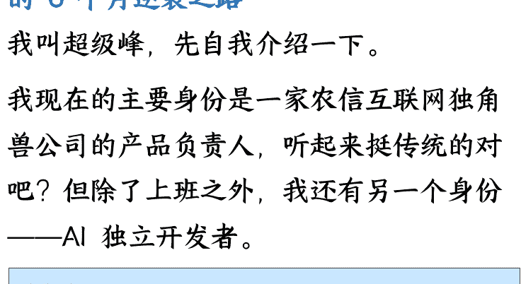

## 1 从农业产品经理到 AI 独立开发者 - 我的 6 个月逆袭之路

我叫超级峰，先自我介绍一下。

我现在的主要身份是一家农信互联网独角兽公司的产品负责人，听起来挺传统的对吧？但除了上班之外，我还有另一个身份——AI 独立开发者。

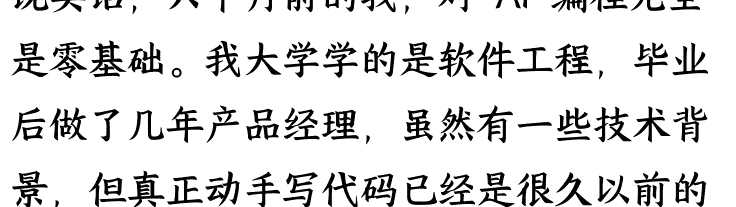

说实话，六个月前的我，对 AI 编程完全是零基础。我大学学的是软件工程，毕业后做了几年产品经理，虽然有一些技术背景，但真正动手写代码已经是很久以前的事了。

去年底，当 Cursor 这类 AI 编程工具开始在小众圈子里传播的时候，我抱着试试看的心态开始接触。那时候大部分人还接触不到这些国外的工具，我算是全周期见证了 AI 编程从小众到逐渐普及的过程。

六个月的 AI 编程学龄，这个时间其实不长，但就是在这短短半年里，我的生活发生了翻天覆地的变化。从一个朝九晚五的上班族，到现在每个月能够上线 2 款左右的产品，每一款从外部反馈来看都还不错。

我目前在 AI 编程的边界探索上投入了很多精力，虽然还没有在单个产品上做太深度的投入，但是我发现了一个巨大的可能性：

普通人，真的可以通过 AI 编程改变自己的命运。我不是什么天才，也不是什么技术大牛。我就是一个在农信互联网公司上班的普通产品经理，工作之余想要探索一些新的可能性。如果我能做到，相信你也可以。

为了帮助更多想要尝试 AI 编程的朋友，我还运营了一个 AI 编程互助群。这个群是完全免费的微信社区，大家可以在里面提问题、交流经验。我发现，很多人其实都有创作的冲动，只是缺少一个合适的工具和正确的方法。

AI 编程，恰恰就是这样一个工具。它不仅仅降低了技术门槛，更重要的是，它让我们普通人也能够把脑海中的想法变成现实。

接下来，我要跟你分享的，不是什么高深的技术理论，而是我这六个月来的真实经历和实战经验。从零基础到能够独立开发 App，从想法到变现，我会把这个完整的过程毫无保留地分享给你。

## 2 震撼成果展示 - 45 天学习，1-2 天开发，我的 App 登上了 App Store 免费榜第 107 名

如果你问我，AI 编程到底有多强大？我用一个真实的案例来回答你。

去年 11 月份，我人生中第一次通过 AI 编程开发了一个完整的产品——芝士相机。

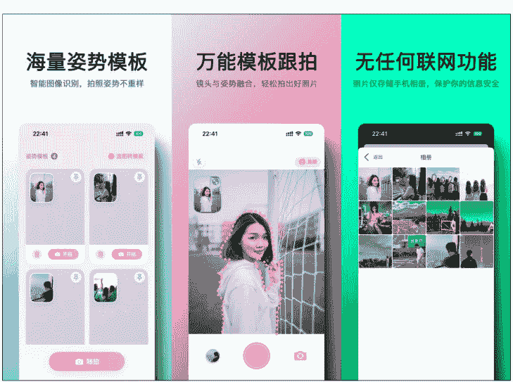

这款 App 的开发过程让我自己都感到震撼：45 天了解什么是 AI 编程，真正的开发时间只用了 1-2 天。没错，你没有听错，就是 1-2 天。

### 更让我意外的是，这款 App 在上线大概一周左右，就登上了 App Store 的免费榜第 107 名。

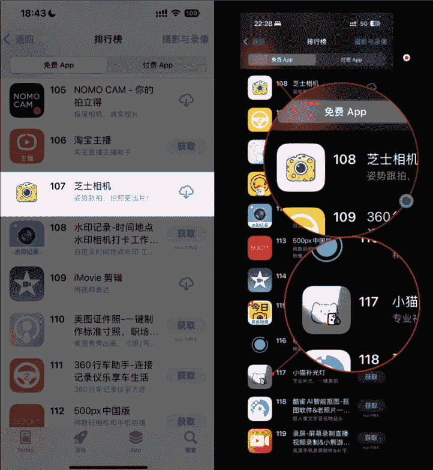

要知道，要在 App Store 免费榜上到 100 多名，一天的下载量需要达到 5000-6000 以上。这个数据量级，对于我这样一个零经验的个人开发者来说，简直就是天方夜谭。

但 AI 编程让这个"不可能"变成了"可能"。让我给你一个对比，你就知道 AI 编程的威力有多强大：

2019 年，我用手工编程的方式，开发了一款叫"GIF 表情包制作大师"的微信小程序。那时候我重新学习编程，花了大量的时间钻研技术细节，整个开发周期拖了很久。虽然最终这款产品积累了 200 万用户，但过程非常痛苦。

2024 年，我用 AI 编程的方式，45 天入门，1-2 天开发，直接做出了能够登榜的 App。效率差异，简直是云泥之别。

芝士相机这款产品，主要是为了解决一个非常具体的痛点：帮助男朋友给女朋友拍出更好看的照片。听起来很简单，但背后的技术实现其实并不简单。

这款 App 有两套核心算法：
- 图像生成轮廓算法：能够自动识别拍照姿势，提高拍照效率
- 美颜效果算法：确保拍出来的照片足够好看

除了算法之外，我还在这款 App 里实现了 13 套多语言支持。过去如果要做多语言，我可能需要找翻译，无论是费用还是时间成本都很高。但通过 AI 的能力，我直接让 AI 帮我实现了 13 种不同国家的语言。

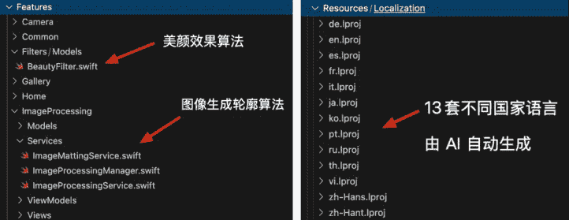

最终的效果如何呢？芝士相机在国内是免费的，但在国外是付费的。即使是 1 美元的定价，也会偶尔有海外用户付费。这从侧面证明了，AI 生成的多语言在结合产品价值的情况下，是能够达到商业化标准的。

更让我自豪的是，这款 App 是完全离线的，无需服务器。这样既降低了我的运营成本，也让用户不用担心数据隐私问题。

这就是 AI 编程的神奇之处：它不仅仅是让你写代码更快，而是让原本需要团队才能完成的复杂功能，一个人就能搞定。

但这还不是最厉害的。接下来我要告诉你的，是我如何总结出的一套可复制的成功方法…

## 3 三大成功密码 – 我是如何找到爆款 App 的制胜法宝

芝士相机的成功不是偶然的。在后续的几款产品开发中，我逐渐总结出了一个公式：

爆款 App = 精准的需求场景 × 高效的 AI 赋能 × 合适的曝光渠道

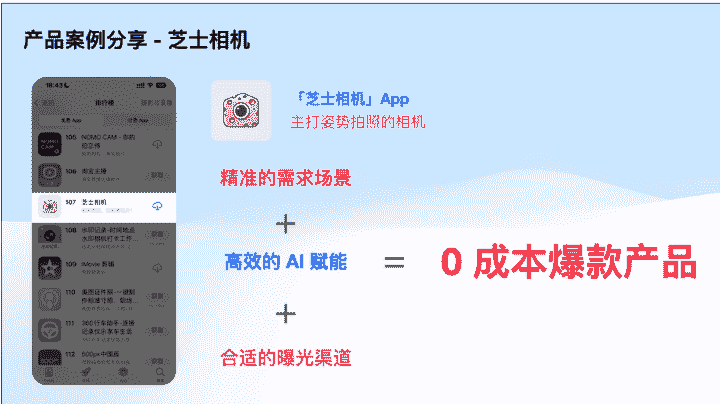

让我详细拆解这三个要素，因为掌握了它们，你也能复制我的成功。

### 3.1 密码一：精准的需求场景

芝士相机为什么能成功？因为它切中了一个非常精准的需求场景：男朋友帮女朋友拍照。这听起来很普通，但实际上非常精准。它不是泛泛的"拍照美化"，而是专门针对一个特定的使用场景。

我为什么会想到这个场景？因为这就是我自己的痛点。作为一个直男，我经常因为拍照技术不好被女朋友吐槽。我相信这是很多男朋友的共同困扰。

在开发之前，我特地去小红书搜索了"拍照姿势"这个关键词。你知道我发现了什么吗？搜索结果满屏都是相关内容，很多笔记都有几万甚至几十万的点赞。这说明这个需求是真实存在的，而且用户群体很大。

但市面上针对这个垂直场景的产品，几乎没有。大部分拍照 App 都是泛泛而谈，没有专门针对"男朋友给女朋友拍照"这个具体场景。这就是机会。

后来芝士相机发布后，很多人在评论区留言说："我脑子里早就有这个想法，但一直没有做。"这更证明了我的判断：细分场景，完全可以容纳个人开发者去做。

对于我们个人开发者来说，一个巨大的优势就是成本低。如果能够切中 1000 个铁杆用户，就能够提供比较高的商业价值。而大厂因为成本结构的问题，往往看不上这样的细分市场。

我的建议是：一定要基于你自己的痛点去开发产品。只有你自己真正需要这个产品，你才会在第一个版本上线后，因为被动的场景触发而持续使用它，进而持续迭代它。

### 3.2 密码二：高效的 AI 赋能

有了精准的需求场景，接下来就是能力问题：你能不能把这个想法实现出来？

在 AI 编程之前，芝士相机这样的产品，我是绝对做不出来的。为什么？因为它需要图像识别和处理算法，这些技术对于个人开发者来说门槛太高了。但 AI 编程让"不可能变成了可能"。

芝士相机的核心功能是能够自动抠出图像中的轮廓，这个功能如果让我自己去研究，可能需要花几个月时间。但通过 AI 编程，我直接让 AI 帮我实现了这套算法。

我并不知道它具体是怎么实现的，我只知道它实现了，并且达到了我的目标。这就够了。这就是 AI 编程的魅力：你只需要描述你想要什么，AI 会帮你实现怎么做。

特别是在 iOS 平台上，苹果官方提供了很多现成的算法能力。通过 AI 编程，我可以很方便地调用这些技术，而不需要深入学习每一个技术细节。13 套多语言支持也是同样的道理。过去我需要找翻译，现在我直接让 AI 帮我搞定。不仅效率提升了，成本也大大降低了。AI 赋能的本质，是让其个人开发者具备了过去只有团队才能拥有的能力。

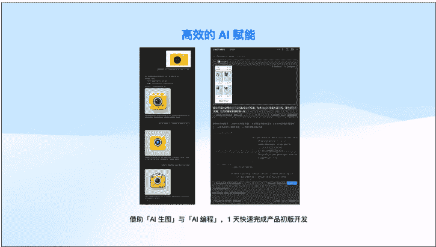

### 3.3 密码三：合适的曝光渠道

有了好产品，还需要让用户知道。对于我们个人开发者来说，找到合适的曝光渠道至关重要。

芝士相机的推广，我主要用了两个渠道：

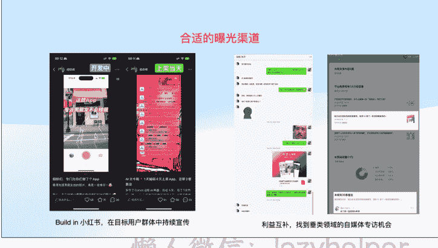

第一个渠道：小红书因为芝士相机的目标用户是女性，而小红书的女性用户比较多。更重要的是，"男朋友帮女朋友拍照"这个场景很容易产生共情，很适合在小红书这样的内容平台进行传播。

第二个渠道：公众号当时有一个专栏的博主邀请我写稿，我就简单介绍了芝士相机的开发过程。没想到这篇文章在公众号上也获得了不错的传播效果，评论区里很多男性用户表示有同样的痛点。

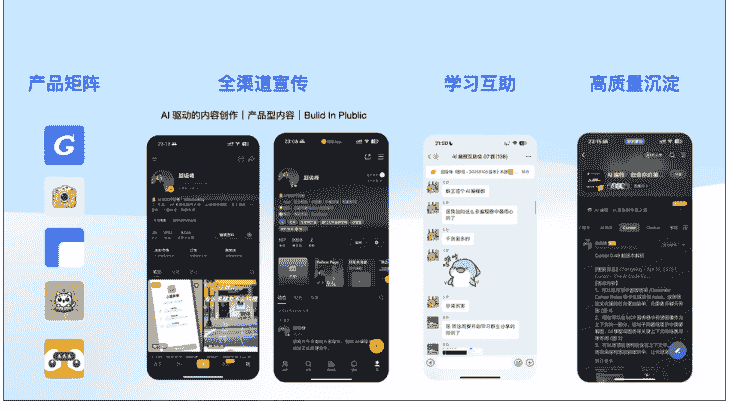

有趣的是，小红书和公众号形成了很好的互补：
- 小红书触达的主要是女性用户（使用方）
- 公众号触达的主要是男性用户（购买决策方）

这样就形成了一个完整的用户触达闭环。

最终的结果：芝士相机通过零成本的推广方式，实现了 App Store 免费榜第 107 名的成绩。

这三个密码看似简单，但组合起来威力巨大。更重要的是，这套方法是可以复制的。

但光有方法还不够，你还需要知道具体的实施路径。接下来，我要给你一个完整的学习攻略...

## 4 从 0 到 1 的完整路径 - 普通人 AI 编程的四级进阶攻略

很多人问我：想要学 AI 编程，应该从哪里开始？

基于我这 6 个月的实践经验，我把 AI 编程的学习路径分为四个等级，从简单到困难。你可以根据自己的需求和能力，选择合适的起点。

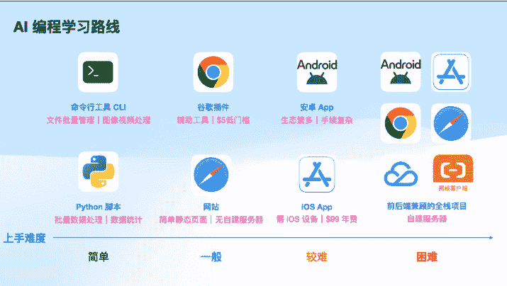

### 4.1 简单级：命令行工具 & Python 脚本

适合人群：完全零基础，想要快速体验 AI 编程效果的朋友

这是我认为最简单的入门方式。你不需要搭建复杂的环境，也不需要学习很多技术概念，就能立即看到效果。

命令行工具比如你想要批量处理图片，把所有图片都调整成 100×100 的尺寸。过去你可能需要一张张手动处理，现在你只需要让 AI 生成一个命令行工具，输入图片地址就能一键搞定。

Python 脚本我在开发鸭霸单词的时候，需要处理大量的单词数据。原始数据格式不统一，如果手动处理会非常麻烦。我就让 AI 帮我生成了三套脚本：
- 批量处理脚本：统一数据格式
- 数据核对脚本：检查数据质量
- 数据修复脚本：自动修复问题数据

整个流程完全自动化，大大提升了效率。

这两种方式的最大好处是立即就能看到效果。你只需要把 AI 生成的内容复制粘贴，执行一下就能解决实际问题。

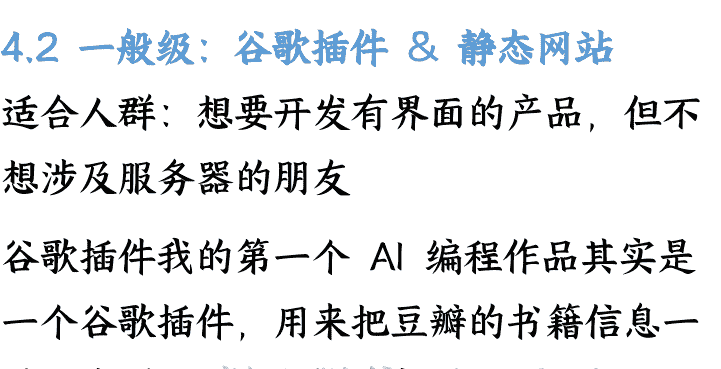

### 4.2 一般级：谷歌插件 & 静态网站

适合人群：想要开发有界面的产品，但不想涉及服务器的朋友

谷歌插件我的第一个 AI 编程作品其实是一个谷歌插件，用来把豆瓣的书籍信息一键同步到 Notion 数据库。

谷歌插件的优势是：
- 只需要付一个开发者账号费用（一次性）
- 不需要服务器，完全本地运行
- 开发成本低，AI 编程相对容易实现
- 有一定的商业价值

静态网站就像之前流行的"一句话生成贪吃蛇游戏"，这些都属于静态页面的范畴。你可以用它来展示作品、分享内容，或者制作一些简单的工具页面。

这个级别的好处是既有界面，又不需要复杂的后端技术，非常适合进阶学习。

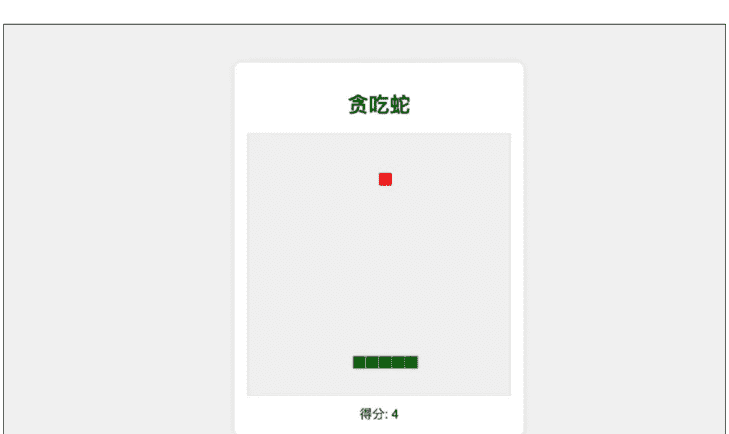

### 4.3 较难级：iOS/Android App 开发

适合人群：想要做出真正有商业价值产品的朋友

如果你要在 iOS 和 Android 之间选择，我强烈推荐优先选择 iOS。为什么？基于我的实际经验：
- 用户付费习惯更好：iOS 用户的付费意愿和客单价都比 Android 用户高，这对个人开发者来说非常重要。
- 技术生态更完善：苹果提供了很多现成的算法和能力，比如芝士相机用到的图像识别算法，都是基于 iOS 生态里已有的技术实现的。通过 AI 编程，我可以很方便地调用这些能力。
- 盗版问题更少：Android 生态存在应用被盗版、山寨的问题，而 iOS 相对更安全。
- 开发体验更好：iOS 的开发工具和文档都很完善，AI 编程的成功率也更高。

当然，iOS 开发也有成本：需要 Mac 设备（Mac mini 二手 3000 左右），以及 99 美金的年费。但相比于潜在的收益，这个投入是完全值得的。

我的几款 App（芝士相机、鸭霸单词、小圆角、小猫快读）都是 iOS 平台开发的，每一款都实现了不同程度的商业化。

### 4.4 困难级：全栈应用
- 适合人群：想要开发复杂产品，愿意学习服务器技术的朋友

这个级别需要同时掌握前端和后端技术，还要涉及服务器部署和维护。我最近开发的三款产品都属于这个范畴：
- 熊猫灵码：提高 AI 编程效率的工具平台
- SoulCard：个人品牌说明书生成工具
- AI Native Hub：AI 编程资讯和社区平台

#### 基于 AI 驱动的 App 开发，规模化拓展的组件化探索

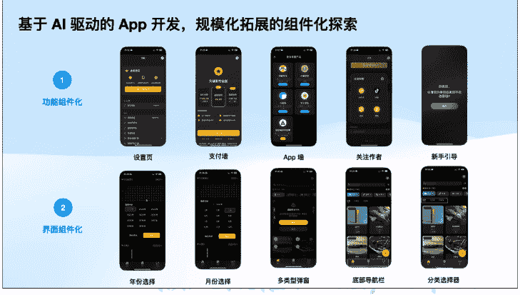

这些产品都有完整的用户系统、数据库、API 接口等，技术复杂度比较高。

虽然 AI 编程大大降低了开发难度，但你仍然需要理解一些基本概念，比如数据传输、服务器部署、域名配置等。

## 我的建议

如果你是新手，建议按照这个顺序逐步进阶：
- 先从简单级开始，建立信心
- 然后尝试一般级，体验产品开发的完整流程
- 如果想要商业化，重点攻克 iOS App 开发
- 最后考虑全栈应用，做更复杂的产品

记住，AI 编程的核心不是写代码，而是与 AI 对话。从简单的一句话指令，到基于文档驱动的复杂开发，这是一个循序渐进的过程。

但仅仅知道怎么开发还不够，最重要的是要能赚到钱。接下来，我要分享我是如何实现稳定变现的...

## 5 稳定变现的实战经验 - 我是如何实现持续被动收入的

做产品的最终目的，当然是要能赚到钱。

经过这 6 个月的实践，我在变现这件事上积累了一些真实的数据和经验。今天我要毫无保留地分享给你，包括一些具体的收入数字。

懒人微信：lazyhelper

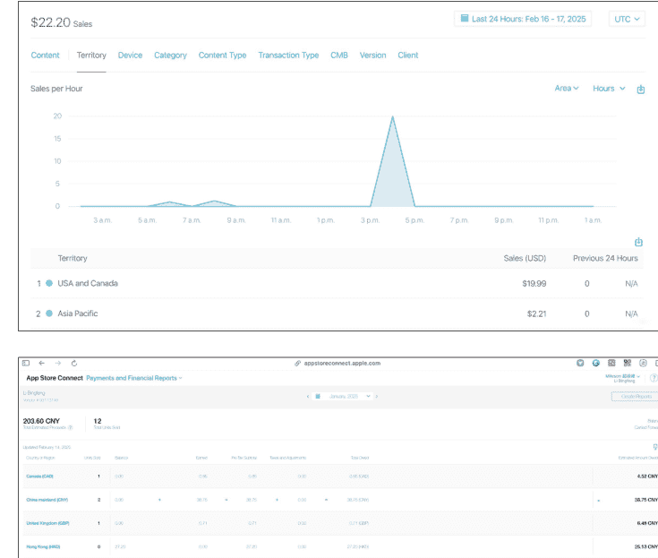
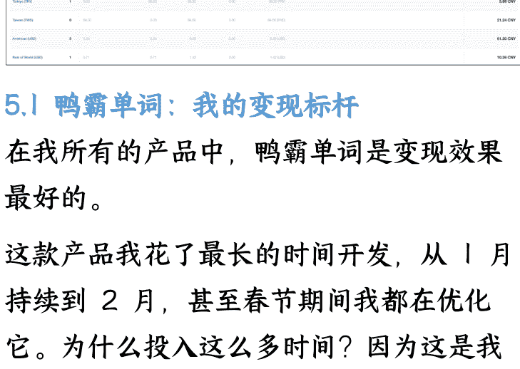

### 5.1 鸭霸单词：我的变现标杆

在我所有的产品中，鸭霸单词是变现效果最好的。

这款产品我花了最长的时间开发，从1月持续到2月，甚至春节期间我都在优化它。为什么投入这么多时间？因为这是我第一次尝试在App 中接入付费功能。

收入数据：
- 上线两个月后，开始有持续的付费收入
- 在被动收入的情况下，它占了我所有产品收入的大部分
- 即使没有深度迭代，仍然有间歇性的收入进账

鸭霸单词的商业模式是 iOS 内购，包括国内版和国际版都有付费用户。这证明了一点：通过 AI 编程开发的产品，完全可以达到商业化的标准。

懒人微信：lazyhelper

### 5.2 成本回收：超出预期的效果

很多人担心做 iOS 开发的成本问题。App Store 的开发者账号年费 688 元，对于收入不确定的个人开发者来说，这确实是一笔开支。

但我的实际体验是：仅仅用了 2-3 个月，我就通过被动收入完全赚回了这个费用。

这个数据对我来说非常重要，因为它证明了 AI 编程创业的可行性。很多独立开发者可能一年只开发一款产品，如果用户太少，甚至可能赚不回开发者账号的费用。但通过 AI 编程，我在短时间内开发了多款产品，风险被大大分摊了。

### 5.3 芝士相机：免费+付费的策略

芝士相机采用了不同的变现策略：
- 国内版本：完全免费，主要用于获取用户和验证产品
- 国际版本：1 美元付费，面向海外市场

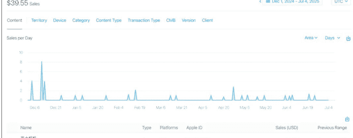

虽然芝士相机的付费收入不如鸭霸单词，但它偶尔也会有海外用户付费。更重要的是，它为我积累了宝贵的产品经验和用户反馈。

### 5.4 被动收入的威力

最让我感到兴奋的是"被动收入"这个概念的实现。

什么叫被动收入?就是你不需要主动推广、不需要持续运营,产品自己就能带来收入。

我的几款 App 现在都处于这种状态:
- 我没有花钱做广告推广
- 我没有专门做用户运营
- 我甚至很少更新版本

但它们仍然在持续产生收入。

这种感觉真的很棒,特别是当你在睡觉的时候,手机突然收到 App Store 的收入通知,那种成就感是无法言喻的。

### 5.5 变现策略的思考

基于我的实践经验,我总结了几个变现策略:
- 优先选择 iOS 平台: 用户付费习惯好,盗版问题少,是个人开发者变现的首选平台。
- 内购模式更稳定: 相比一次性付费,订阅或内购模式能够带来更稳定的现金流。
- 国际化增加收入: 通过 AI 实现多语言支持,可以覆盖更多市场,增加变现机会。
- 产品矩阵分散风险: 不要把鸡蛋放在一个篮子里,多款产品可以相互导流,也能分散风险。

现实 check: 我不会告诉你 AI 编程能让你一夜暴富,但我可以确认的是,它确实能够为普通人提供一个可行的副业变现渠道。

重点是，你需要开始行动。光看不练，永远不会有收入。

那么，具体应该怎么开始呢？

## 6 立即行动 - 加入 AI 编程新时代，开启你的变现之路

写到这里，我想你已经看到了 AI 编程的巨大潜力。

从我这个农业公司产品经理的 6 个月逆袭之路，到具体的产品案例，再到完整的学习路径和变现经验，我已经把我所知道的一切都分享给了你。

现在的问题是：你准备好开始行动了吗？

### 6.1 这是最好的时代

我深刻地感受到，我们正处在一个创造者最好的时代。

AI 编程让"从不可能变成可能"这句话变成了现实。过去需要团队才能完成的复杂产品，现在一个人就能搞定。过去需要几个月甚至几年的开发周期，现在几天就能出成果。

更重要的是，这个窗口期不会一直存在。随着 AI 编程工具的普及，门槛会越来越低，竞争也会越来越激烈。早入场的人，会享受到最大的红利。

就像 2019 年我做微信小程序的时候，那时候小程序生态刚起步，很容易获得大量用户。现在再做小程序，难度就大了很多。

### 6.2 你适合 AI 编程吗？

基于我的观察和实践，我认为有三类人特别适合学习 AI 编程：

- 第一类：互联网研发流程上下游人员（最适合）包括产品经理、设计师、研发工程师、测试工程师、运营人员等。你们对产品开发流程有基本认知，学习成本最低。
- 第二类：互联网从业人群包括市场推广、产品实施、运维、新媒体运营、互联网企业管理者等。虽然不直接参与研发，但对软件产品有基本了解。
- 第三类：非互联网人群（未来参与者）包括传统企业的新媒体运营、文员、大学生等。随着 AI 编程工具的发展，这个群体会越来越多地参与进来。

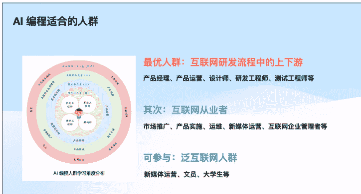

如果你属于前两类，那恭喜你，你已经具备了很好的基础。如果你是第三类，也不要担心，AI 编程的门槛正在快速降低。

### 6.3 立即开始的行动指南

如果你决定开始学习 AI 编程，我的建议是：

- 懒人微信：lazyhelper
- 选择合适的起点：回顾一下我前面分享的四级进阶路径，选择适合你当前水平的起点。不要一开始就想着做复杂的产品。
- 找到你的痛点：从你自己的真实需求出发，找到一个你愿意为之付费的痛点，然后尝试用 AI 编程来解决它。
- 加入学习社区：找到志同道合的朋友一起学习。我也运营了一个 AI 编程互助群，欢迎有需要的朋友加入交流。
- 保持学习心态：AI 编程领域变化很快，保持持续学习的心态非常重要。

### 6.4 最后的话

六个月前，我只是一个对 AI 编程完全陌生的农信互联网公司产品经理。

六个月后，我已经开发了多款产品，实现了稳定的被动收入，更重要的是，我找到了一种全新的生活方式。

我不是天才，你也不需要等待。AI 编程的出现，让普通人也有了改变命运的机会。关键是，你要敢于开始，敢于尝试，敢于把想法变成现实。

我经常对朋友说：执行力比想法更重要。很多人脑子里都有好想法，但只有那些真正动手去做的人，才能享受到最终的成果。

现在，轮到你了。不要再等待了，不要再犹豫了。拿起你的电脑，打开 AI 编程工具，开始你的第一行代码。也许六个月后，分享逆袭故事的人就是你。

我是超级峰，一个通过 AI 编程改变生活的普通人。如果这篇文章对你有帮助，欢迎点赞分享。如果你想要交流 AI 编程的经验，也欢迎在评论区留言。

让我们一起，在这个创造者最好的时代，用 AI 编程开创属于自己的未来。

最后，安利小懒的付费群：

懒人专属群

📚懒人专属群持续更新中，已持续运营6年，整理超3000份各类精选付费文章&年费社群干货，全部开放下载。

本资料为付费群内部分享，仅供真实有需要的朋友查阅 🙅

懒人专属群更新记录：
https://lazy2025.top/#/blog/record2

懒人专属群更新记录（需梯子，备用）：
https://lazybook.fun/#/blog/record2